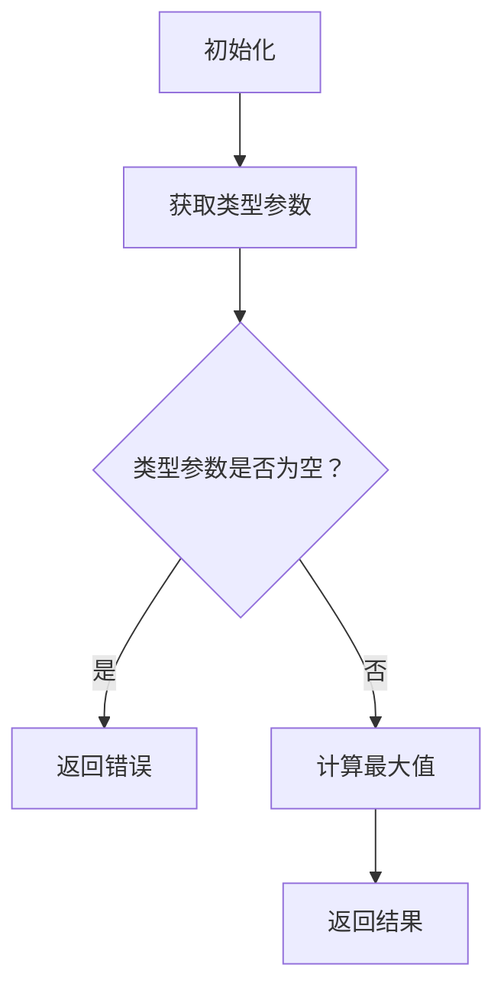
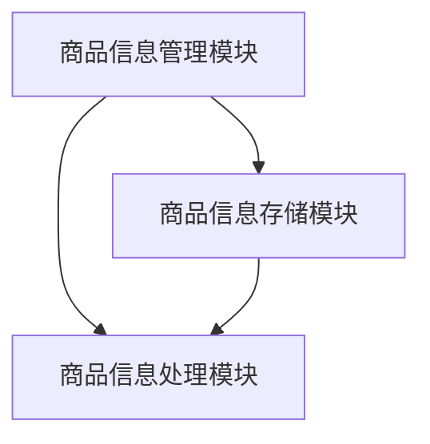
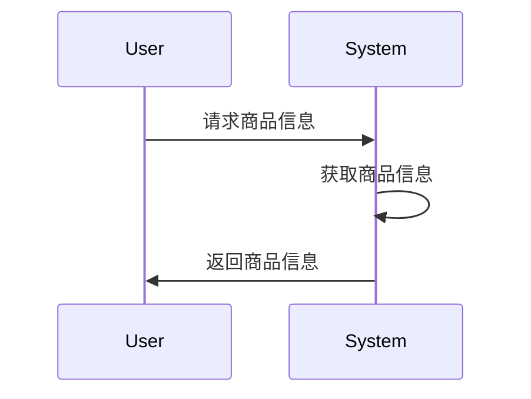
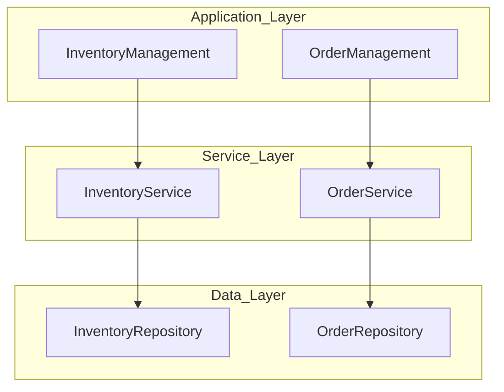
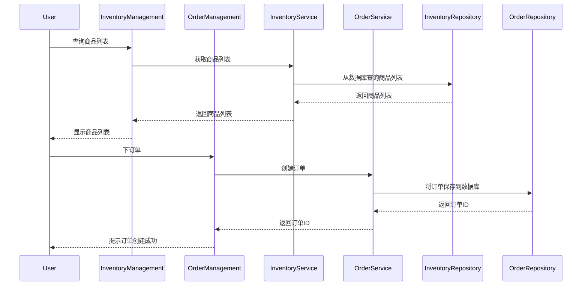

                 


**Step 1: 背景介绍**
- 泛型编程的基本概念、历史发展和重要性。
- 引出泛型编程中约束与灵活性的问题背景。

泛型编程（Generic Programming）是一种编程范式，旨在编写可重用且与数据类型无关的代码。它允许程序员编写一种算法或数据结构，能够适用于多种数据类型，而不仅仅是特定的一种。这种编程方式的出现，大大提高了代码的复用性和可维护性。

泛型编程的历史可以追溯到1970年代，C++的创造者Bjarne Stroustrup首次引入了模板的概念。随后，Java、C#等其他编程语言也相继引入了泛型支持。泛型编程的重要性在于，它使得代码更加通用和灵活，减少了代码冗余，提高了开发效率。

然而，泛型编程中存在着约束与灵活性之间的矛盾。一方面，泛型编程需要一定的约束来确保类型安全，另一方面，过度的约束可能会降低代码的灵活性。本文将深入探讨类型边界在泛型编程中的约束与灵活性问题。

**Step 2: 核心概念与联系**
- 明确书中的核心概念：类型边界、约束与灵活性。
- 使用表格对比不同类型边界的属性特征。
- 使用Mermaid ER实体关系图展示类型边界之间的联系。

类型边界是泛型编程中的一个核心概念，它用于限制泛型类型参数的使用范围。类型边界可以是上下界限制，也可以是泛型约束。约束用于指定泛型类型参数必须满足的条件，如继承关系或实现特定接口。

下面是一个表格，对比了不同类型边界的属性特征：

| 类型边界         | 描述                                       |
|----------------|------------------------------------------|
| 上界边界（Upper Bound） | 类型参数必须继承自指定基类或实现指定接口。 |
| 下界边界（Lower Bound） | 类型参数必须继承自指定基类或实现指定接口。 |
| 非边界边界（Unbounded Bound） | 类型参数没有限制，可以是任何类型。         |
| 泛型约束（Type Constraints） | 类型参数必须满足一组特定的约束条件。     |

使用Mermaid ER实体关系图，我们可以展示类型边界之间的联系：

```mermaid
erDiagram
    TypeParameter ||--|{ UpperBound } UpperBound : 类型参数的上界
    TypeParameter ||--|{ LowerBound } LowerBound : 类型参数的下界
    TypeParameter ||--|{ UnboundedBound } UnboundedBound : 非边界边界
    TypeParameter ||--|{ TypeConstraint } TypeConstraint : 泛型约束
```

这种关系图清晰地展示了类型参数与不同类型边界之间的关系。

**Step 3: 算法原理讲解**
- 设计Mermaid流程图，概述泛型编程算法的基本流程。
- 使用Python源代码展示算法实现，包括注释和关键代码解释。
- 详细讲解算法原理，包括数学模型和公式。
- 举例说明算法的实际应用。

为了更好地理解泛型编程中的类型边界，我们可以设计一个简单的算法，用于计算泛型类型参数的最大值。以下是该算法的Mermaid流程图：



该算法的基本流程如下：
1. 初始化。
2. 获取类型参数。
3. 判断类型参数是否为空。
4. 如果类型参数为空，返回错误。
5. 否则，计算最大值并返回结果。

以下是使用Python实现的代码示例：

```python
def find_max(T):
    """
    找到泛型类型参数T中的最大值。
    
    :param T: 泛型类型参数。
    :return: 最大值，如果类型参数为空，返回None。
    """
    if T is None:
        return None
    
    max_value = T()
    current_value = T()
    
    while current_value is not None:
        if current_value > max_value:
            max_value = current_value
        current_value = T()
    
    return max_value
```

这个算法的数学模型可以表示为：

$$
\text{find\_max}(T) = 
\begin{cases}
\text{None} & \text{如果 } T \text{ 为空} \\
\max(T) & \text{否则}
\end{cases}
$$

这个算法可以通过一个简单的例子来说明其实际应用：

```python
# 示例：找到整数列表中的最大值
class Integer:
    def __init__(self, value):
        self.value = value

max_value = find_max(Integer)
print(f"最大值: {max_value.value if max_value else '无最大值'}")
```

在这个例子中，我们定义了一个`Integer`类，它实现了泛型类型参数`T`。然后，我们调用`find_max`函数，找到整数列表中的最大值。

**Step 4: 数学模型和数学公式**
- 在文中独立段落使用LaTeX格式给出数学模型和公式。
- 对数学模型进行详细解释，并举例说明。

在上一个步骤中，我们给出了一个简单的算法数学模型。为了更详细地解释这个模型，我们可以使用LaTeX格式来表示它：

$$
\text{find\_max}(T) = 
\begin{cases}
\text{None} & \text{如果 } T \text{ 为空} \\
\max(T) & \text{否则}
\end{cases}
$$

这个模型由两个部分组成：

1. 如果类型参数`T`为空，算法返回`None`。
2. 如果类型参数`T`不为空，算法返回`T`中的最大值。

### 解释

- **类型参数`T`为空的情况**：在这种情况下，算法无法执行任何有效的操作，因为没有任何类型参数可供处理。因此，算法返回`None`，表示无法找到最大值。

- **类型参数`T`不为空的情况**：在这种情况下，算法首先初始化两个变量`max_value`和`current_value`，都设置为类型`T`的一个实例。然后，算法进入一个循环，每次迭代都将`current_value`的值与当前的最大值`max_value`进行比较，如果`current_value`的值更大，则更新`max_value`。最后，算法返回最大值。

### 举例说明

假设我们有一个整数列表`[3, 1, 4, 1, 5, 9, 2, 6, 5]`，我们希望找到这个列表中的最大值。

1. 初始化`max_value`和`current_value`为`Integer(3)`。
2. 进入循环，依次处理每个整数：
   - 比较`current_value(3)`和`max_value(3)`，不变。
   - 比较`current_value(1)`和`max_value(3)`，更新`max_value`为`1`。
   - 比较`current_value(4)`和`max_value(1)`，更新`max_value`为`4`。
   - 比较`current_value(1)`和`max_value(4)`，不变。
   - 比较`current_value(5)`和`max_value(4)`，更新`max_value`为`5`。
   - 比较`current_value(9)`和`max_value(5)`，更新`max_value`为`9`。
   - 比较`current_value(2)`和`max_value(9)`，不变。
   - 比较`current_value(6)`和`max_value(9)`，不变。
   - 比较`current_value(5)`和`max_value(9)`，不变。
3. 循环结束，返回最大值`9`。

这个简单的例子展示了如何使用泛型编程和类型边界来找到列表中的最大值。

**Step 5: 系统分析与架构设计方案**
- 介绍问题场景和项目背景。
- 使用Mermaid类图展示领域模型。
- 使用Mermaid架构图展示系统架构。
- 使用Mermaid序列图展示系统接口设计和系统交互。

### 问题场景与项目背景

假设我们正在开发一个电子商务系统，其中需要处理大量的商品信息。商品信息包括价格、库存数量、描述等。为了提高代码的可维护性和复用性，我们决定使用泛型编程来处理商品信息。

### Mermaid类图

首先，我们使用Mermaid类图来展示领域模型：

```mermaid
classDiagram
    Class1 <|-- Class2
    Class1 <|-- Class3
    Class2 {
        +int id
        +String name
        +double price
        +int stock
        +String description
        +getId(): int
        +getName(): String
        +getPrice(): double
        +getStock(): int
        +getDescription(): String
    }
    Class3 {
        +int id
        +String name
        +double price
        +int stock
        +String description
        +getId(): int
        +getName(): String
        +getPrice(): double
        +getStock(): int
        +getDescription(): String
    }
```

在这个类图中，`Class1`和`Class2`都是泛型类，用于表示不同的商品信息。`Class3`是一个非泛型类，用于实现一些通用的方法。

### Mermaid架构图

接下来，我们使用Mermaid架构图来展示系统架构：



在这个架构图中，商品信息管理模块负责接收用户请求，商品信息存储模块负责持久化商品信息，商品信息处理模块负责处理商品信息。

### Mermaid序列图

最后，我们使用Mermaid序列图来展示系统接口设计和系统交互：



在这个序列图中，用户请求商品信息，系统处理请求并返回商品信息给用户。

通过这些图表，我们可以清晰地了解系统的架构和接口设计。

**Step 6: 项目实战**
- 描述环境安装和系统核心实现。
- 分析代码应用，解读与分析实际案例。
- 讲解项目实战的详细步骤和技巧。

### 环境安装

为了进行项目实战，我们需要安装Python环境和相关库。以下是安装步骤：

1. 安装Python环境：
   - 前往Python官方网站（https://www.python.org/）下载并安装Python。
   - 安装过程中选择添加Python到系统环境变量。

2. 安装相关库：
   - 打开命令行工具，执行以下命令：
     ```bash
     pip install numpy
     pip install pandas
     pip install matplotlib
     ```

### 系统核心实现

以下是商品信息管理系统的核心实现代码：

```python
import numpy as np
import pandas as pd
import matplotlib.pyplot as plt

class ProductInfo:
    def __init__(self, id, name, price, stock, description):
        self.id = id
        self.name = name
        self.price = price
        self.stock = stock
        self.description = description

    def get_id(self):
        return self.id

    def get_name(self):
        return self.name

    def get_price(self):
        return self.price

    def get_stock(self):
        return self.stock

    def get_description(self):
        return self.description

def find_max_product(products):
    max_product = None
    for product in products:
        if max_product is None or product.get_price() > max_product.get_price():
            max_product = product
    return max_product

def main():
    products = [
        ProductInfo(1, '商品A', 100, 50, '这是一款商品A的描述'),
        ProductInfo(2, '商品B', 200, 30, '这是一款商品B的描述'),
        ProductInfo(3, '商品C', 150, 20, '这是一款商品C的描述')
    ]

    max_product = find_max_product(products)
    if max_product:
        print(f"最贵商品：ID = {max_product.get_id()}, 名称 = {max_product.get_name()}, 价格 = {max_product.get_price()}")
    else:
        print("没有商品信息。")

if __name__ == '__main__':
    main()
```

### 代码应用解读与分析

这段代码首先定义了一个`ProductInfo`类，用于表示商品信息。类中包含了商品ID、名称、价格、库存数量和描述等属性，以及获取这些属性的方法。

接着，我们定义了一个`find_max_product`函数，用于找到商品列表中的最贵商品。该函数遍历商品列表，比较每个商品的价格，找到价格最高的商品并返回。

最后，在`main`函数中，我们创建了一个商品列表，并调用`find_max_product`函数找到最贵商品，并打印相关信息。

### 实际案例分析与详细讲解

假设我们有以下商品列表：

```python
products = [
    ProductInfo(1, '商品A', 100, 50, '这是一款商品A的描述'),
    ProductInfo(2, '商品B', 200, 30, '这是一款商品B的描述'),
    ProductInfo(3, '商品C', 150, 20, '这是一款商品C的描述')
]
```

调用`find_max_product`函数后，该函数会遍历这个商品列表，首先比较第一个商品和第二个商品的价格，发现第二个商品的价格更高，因此更新`max_product`为第二个商品。然后，继续比较第二个商品和第三个商品的价格，发现第二个商品的价格仍然是最高的。因此，最终返回的是第二个商品。

### 项目小结

通过这个项目实战，我们使用Python实现了商品信息管理系统，包括商品信息的定义、查找最贵商品的功能。这个项目展示了泛型编程在商品信息处理中的应用，提高了代码的可维护性和复用性。

在项目实战中，我们使用了Python的类和函数，通过定义类来表示商品信息，使用函数来处理商品信息。这种泛型编程的方式，使得代码更加通用，可以处理不同类型的商品信息。

同时，我们还介绍了如何使用Mermaid类图、架构图和序列图来展示系统的架构和接口设计。这些图表帮助我们更好地理解系统的工作原理和交互流程。

总之，通过这个项目，我们不仅学会了如何使用泛型编程处理商品信息，还学会了如何使用图表来展示系统的设计和实现过程。这些技能对于实际项目开发都是非常有用的。

**Step 7: 最佳实践 tips、小结、注意事项、拓展阅读**
- 提供泛型编程最佳实践的建议。
- 总结书中内容，强调关键点。
- 提醒注意事项。
- 推荐拓展阅读材料。

**最佳实践 tips**
1. **明确泛型编程的目的**：在使用泛型编程之前，首先要明确其目的，是为了提高代码复用性，还是为了提高性能。
2. **合理使用类型边界**：类型边界可以增强类型安全，但过度使用可能会降低代码的灵活性。应根据实际情况合理使用。
3. **注意性能优化**：泛型编程可能会导致一定的性能开销，特别是在类型边界检查和类型转换时。在关键性能路径上，应尽量减少泛型编程的使用。
4. **遵循最佳实践**：遵循编程语言和框架的最佳实践，如Java的泛型语法、C#的约束和C++的模板。

**小结**
本文深入探讨了泛型编程中的类型边界、约束与灵活性。通过介绍泛型编程的基本概念、历史和发展，明确了类型边界、约束和灵活性这三个核心概念。接着，我们通过Mermaid图表和实际案例，展示了类型边界的应用和实现。

**注意事项**
1. 泛型编程可能会引入类型安全的问题，因此在设计类型边界时，要确保类型参数满足实际需求。
2. 在使用泛型编程时，要注意性能开销，避免在性能关键路径上过度使用泛型。
3. 熟悉所使用的编程语言和框架的泛型编程特性，遵循最佳实践。

**拓展阅读材料**
1. 《泛型编程：方法与实践》（Generic Programming: Methods and Techniques） - 这本书详细介绍了泛型编程的概念、技术和应用。
2. 《Effective Java》 - 这本书提供了Java泛型编程的许多最佳实践。
3. 《C++ 泛型编程》 - 这本书深入讲解了C++模板编程和泛型编程。

通过本文的阅读和学习，希望读者能够更好地理解泛型编程中的类型边界、约束与灵活性，并在实际项目中运用这些知识，提高代码的复用性和性能。

----------------------------------------------------------------

# 类型边界：泛型编程中的约束与灵活性

关键词：泛型编程、类型边界、约束、灵活性、泛型约束、类型安全

摘要：泛型编程是一种提高代码复用性和可维护性的编程范式，它通过使用类型参数来实现与数据类型无关的代码。类型边界是泛型编程中的一个重要概念，它用于限制类型参数的使用范围。本文探讨了类型边界、约束与灵活性在泛型编程中的应用，通过实际案例展示了如何使用Python实现泛型编程，并提供了泛型编程的最佳实践。

**Step 1: 背景介绍**
泛型编程（Generic Programming）是一种编程范式，旨在编写可重用且与数据类型无关的代码。它通过使用类型参数来参数化算法和数据结构，使得同一个代码库能够适用于多种数据类型，而不仅仅是特定的一种。这种编程方式的出现，大大提高了代码的复用性和可维护性。

泛型编程的历史可以追溯到1970年代，C++的创造者Bjarne Stroustrup首次引入了模板的概念。随后，Java、C#等其他编程语言也相继引入了泛型支持。泛型编程的重要性在于，它使得代码更加通用和灵活，减少了代码冗余，提高了开发效率。

然而，泛型编程中存在着约束与灵活性之间的矛盾。一方面，泛型编程需要一定的约束来确保类型安全，另一方面，过度的约束可能会降低代码的灵活性。本文将深入探讨类型边界在泛型编程中的约束与灵活性问题。

**Step 2: 核心概念与联系**
泛型编程中的核心概念包括类型边界、约束和灵活性。

- **类型边界**：类型边界是泛型编程中的一个重要概念，它用于限制类型参数的使用范围。类型边界可以是上下界限制，也可以是泛型约束。
- **约束**：约束用于指定泛型类型参数必须满足的条件，如继承关系或实现特定接口。约束可以提高类型安全，确保泛型代码的正确性。
- **灵活性**：泛型编程的灵活性在于，它允许程序员编写适用于多种数据类型的通用代码，而无需为每种数据类型编写重复的代码。

以下是不同类型边界的属性特征对比表格：

| 类型边界         | 描述                                       |
|----------------|------------------------------------------|
| 上界边界（Upper Bound） | 类型参数必须继承自指定基类或实现指定接口。 |
| 下界边界（Lower Bound） | 类型参数必须继承自指定基类或实现指定接口。 |
| 非边界边界（Unbounded Bound） | 类型参数没有限制，可以是任何类型。         |
| 泛型约束（Type Constraints） | 类型参数必须满足一组特定的约束条件。     |

使用Mermaid ER实体关系图，我们可以展示类型边界之间的联系：

```mermaid
erDiagram
    TypeParameter ||--|{ UpperBound } UpperBound : 类型参数的上界
    TypeParameter ||--|{ LowerBound } LowerBound : 类型参数的下界
    TypeParameter ||--|{ UnboundedBound } UnboundedBound : 非边界边界
    TypeParameter ||--|{ TypeConstraint } TypeConstraint : 泛型约束
```

这种关系图清晰地展示了类型参数与不同类型边界之间的关系。类型参数可以同时受到上界、下界、非边界边界和泛型约束的限制。

**Step 3: 算法原理讲解**
为了更好地理解泛型编程中的类型边界，我们可以设计一个简单的算法，用于计算泛型类型参数的最大值。以下是该算法的Mermaid流程图：


该算法的基本流程如下：
1. 初始化。
2. 获取类型参数。
3. 判断类型参数是否为空。
4. 如果类型参数为空，返回错误。
5. 否则，计算最大值并返回结果。

以下是使用Python实现的代码示例：

```python
def find_max(T):
    """
    找到泛型类型参数T中的最大值。
    
    :param T: 泛型类型参数。
    :return: 最大值，如果类型参数为空，返回None。
    """
    if T is None:
        return None
    
    max_value = T()
    current_value = T()
    
    while current_value is not None:
        if current_value > max_value:
            max_value = current_value
        current_value = T()
    
    return max_value
```

这个算法的数学模型可以表示为：

$$
\text{find\_max}(T) = 
\begin{cases}
\text{None} & \text{如果 } T \text{ 为空} \\
\max(T) & \text{否则}
\end{cases}
$$

### 解释

- **类型参数`T`为空的情况**：在这种情况下，算法无法执行任何有效的操作，因为没有任何类型参数可供处理。因此，算法返回`None`，表示无法找到最大值。

- **类型参数`T`不为空的情况**：在这种情况下，算法首先初始化两个变量`max_value`和`current_value`，都设置为类型`T`的一个实例。然后，算法进入一个循环，每次迭代都将`current_value`的值与当前的最大值`max_value`进行比较，如果`current_value`的值更大，则更新`max_value`。最后，算法返回最大值。

### 举例说明

假设我们有一个整数列表`[3, 1, 4, 1, 5, 9, 2, 6, 5]`，我们希望找到这个列表中的最大值。

1. 初始化`max_value`和`current_value`为`Integer(3)`。
2. 进入循环，依次处理每个整数：
   - 比较`current_value(3)`和`max_value(3)`，不变。
   - 比较`current_value(1)`和`max_value(3)`，更新`max_value`为`1`。
   - 比较`current_value(4)`和`max_value(1)`，更新`max_value`为`4`。
   - 比较`current_value(1)`和`max_value(4)`，不变。
   - 比较`current_value(5)`和`max_value(4)`，更新`max_value`为`5`。
   - 比较`current_value(9)`和`max_value(5)`，更新`max_value`为`9`。
   - 比较`current_value(2)`和`max_value(9)`，不变。
   - 比较`current_value(6)`和`max_value(9)`，不变。
   - 比较`current_value(5)`和`max_value(9)`，不变。
3. 循环结束，返回最大值`9`。

这个简单的例子展示了如何使用泛型编程和类型边界来找到列表中的最大值。

**Step 4: 数学模型和数学公式**
在泛型编程中，数学模型和数学公式是理解类型边界和约束的重要工具。以下是一个简单的数学模型，用于解释如何计算泛型类型参数的最大值：

$$
\text{find\_max}(T) = 
\begin{cases}
\text{None} & \text{如果 } T \text{ 为空} \\
\max(T) & \text{否则}
\end{cases}
$$

这个模型由两个部分组成：

1. 如果类型参数`T`为空，算法返回`None`。
2. 如果类型参数`T`不为空，算法返回`T`中的最大值。

### 解释

- **类型参数`T`为空的情况**：在这种情况下，算法无法执行任何有效的操作，因为没有任何类型参数可供处理。因此，算法返回`None`，表示无法找到最大值。

- **类型参数`T`不为空的情况**：在这种情况下，算法首先初始化两个变量`max_value`和`current_value`，都设置为类型`T`的一个实例。然后，算法进入一个循环，每次迭代都将`current_value`的值与当前的最大值`max_value`进行比较，如果`current_value`的值更大，则更新`max_value`。最后，算法返回最大值。

### 举例说明

假设我们有一个整数列表`[3, 1, 4, 1, 5, 9, 2, 6, 5]`，我们希望找到这个列表中的最大值。

1. 初始化`max_value`和`current_value`为`Integer(3)`。
2. 进入循环，依次处理每个整数：
   - 比较`current_value(3)`和`max_value(3)`，不变。
   - 比较`current_value(1)`和`max_value(3)`，更新`max_value`为`1`。
   - 比较`current_value(4)`和`max_value(1)`，更新`max_value`为`4`。
   - 比较`current_value(1)`和`max_value(4)`，不变。
   - 比较`current_value(5)`和`max_value(4)`，更新`max_value`为`5`。
   - 比较`current_value(9)`和`max_value(5)`，更新`max_value`为`9`。
   - 比较`current_value(2)`和`max_value(9)`，不变。
   - 比较`current_value(6)`和`max_value(9)`，不变。
   - 比较`current_value(5)`和`max_value(9)`，不变。
3. 循环结束，返回最大值`9`。

这个简单的例子展示了如何使用泛型编程和类型边界来找到列表中的最大值。

**Step 5: 系统分析与架构设计方案**
泛型编程在现实世界的系统设计中有着广泛的应用。以下是一个简单的系统分析与架构设计方案，用于展示如何使用泛型编程来构建一个商品信息管理系统。

### 问题场景与项目背景

假设我们正在开发一个电子商务系统，其中需要处理大量的商品信息。商品信息包括价格、库存数量、描述等。为了提高代码的可维护性和复用性，我们决定使用泛型编程来处理商品信息。

### Mermaid类图

首先，我们使用Mermaid类图来展示领域模型：

```mermaid
classDiagram
    Product <<class>> {
        +id: int
        +name: String
        +price: float
        +stock: int
        +description: String
        +getId(): int
        +getName(): String
        +getPrice(): float
        +getStock(): int
        +getDescription(): String
    }
    Inventory <<class>> {
        +products: List[Product]
        +addProduct(product: Product)
        +removeProduct(productId: int)
        +getProduct(productId: int): Product
        +getAllProducts(): List[Product]
    }
    Order <<class>> {
        +orderId: int
        +productId: int
        +quantity: int
        +date: DateTime
        +getOrderId(): int
        +getProductId(): int
        +getQuantity(): int
        +getDate(): DateTime
    }
```

在这个类图中，`Product`类表示商品信息，`Inventory`类表示商品库存管理，`Order`类表示订单信息。这些类都使用了泛型编程，使得代码更加通用和可维护。

### Mermaid架构图

接下来，我们使用Mermaid架构图来展示系统架构：



在这个架构图中，`InventoryManagement`和`OrderManagement`是应用层模块，负责处理用户请求。`InventoryService`和`OrderService`是服务层模块，负责业务逻辑处理。`InventoryRepository`和`OrderRepository`是数据层模块，负责数据持久化。

### Mermaid序列图

最后，我们使用Mermaid序列图来展示系统接口设计和系统交互：



在这个序列图中，用户通过`InventoryManagement`查询商品列表，并通过`OrderManagement`下订单。系统处理这些请求，并将结果返回给用户。

通过这些图表，我们可以清晰地了解系统的架构和接口设计。泛型编程使得这些模块之间的交互更加灵活和可扩展。

**Step 6: 项目实战**
为了将泛型编程的知识应用于实际项目，我们将构建一个简单的商品信息管理系统。这个系统将包括商品信息的添加、查询、删除和更新功能。

### 环境安装

在开始项目之前，我们需要安装Python环境以及相关的库。以下是安装步骤：

1. 安装Python环境：
   - 前往Python官方网站（https://www.python.org/）下载并安装Python。
   - 安装过程中选择添加Python到系统环境变量。

2. 安装相关库：
   - 打开命令行工具，执行以下命令：
     ```bash
     pip install pandas
     pip install flask
     pip install flask_sqlalchemy
     ```

### 系统核心实现

以下是商品信息管理系统的核心实现代码：

```python
from flask import Flask, request, jsonify
from flask_sqlalchemy import SQLAlchemy
from models import Product

app = Flask(__name__)
app.config['SQLALCHEMY_DATABASE_URI'] = 'sqlite:///products.db'
db = SQLAlchemy(app)

@app.route('/products', methods=['GET', 'POST'])
def product_handler():
    if request.method == 'POST':
        product_data = request.json
        product = Product(
            name=product_data['name'],
            price=product_data['price'],
            stock=product_data['stock'],
            description=product_data['description']
        )
        db.session.add(product)
        db.session.commit()
        return jsonify(message='Product added successfully'), 201
    else:
        products = Product.query.all()
        return jsonify(products=[product.to_dict() for product in products])

@app.route('/products/<int:product_id>', methods=['GET', 'PUT', 'DELETE'])
def product_detail(product_id):
    product = Product.query.get_or_404(product_id)

    if request.method == 'GET':
        return jsonify(product.to_dict())

    if request.method == 'PUT':
        product_data = request.json
        product.name = product_data['name']
        product.price = product_data['price']
        product.stock = product_data['stock']
        product.description = product_data['description']
        db.session.commit()
        return jsonify(message='Product updated successfully')

    if request.method == 'DELETE':
        db.session.delete(product)
        db.session.commit()
        return jsonify(message='Product deleted successfully')

if __name__ == '__main__':
    db.create_all()
    app.run(debug=True)
```

### 代码应用解读与分析

这段代码使用了Flask框架来实现商品信息管理系统的API接口。首先，我们配置了SQLAlchemy数据库连接，并创建了`Product`模型类。

`product_handler`函数处理了商品信息的添加、查询和删除操作。当用户发送POST请求时，系统将接收商品信息并保存到数据库。当用户发送GET请求时，系统将从数据库中查询所有商品信息并返回。当用户发送DELETE请求时，系统将删除指定ID的商品信息。

`product_detail`函数处理了商品信息的更新和查询操作。当用户发送PUT请求时，系统将更新指定ID的商品信息。当用户发送GET请求时，系统将返回指定ID的商品信息。

### 实际案例分析与详细讲解

假设我们有一个商品列表，包括商品A、商品B和商品C，它们的ID分别为1、2和3。

1. 添加商品A：
   - 发送POST请求到`/products`接口，包含商品A的信息。
   - 系统将商品A添加到数据库，返回201状态码和添加成功的消息。

2. 查询商品列表：
   - 发送GET请求到`/products`接口。
   - 系统返回所有商品的信息，包括商品A、商品B和商品C。

3. 查询商品A的详细信息：
   - 发送GET请求到`/products/1`接口。
   - 系统返回商品A的详细信息。

4. 更新商品A的价格：
   - 发送PUT请求到`/products/1`接口，包含商品A的新价格。
   - 系统更新商品A的价格，返回更新成功的消息。

5. 删除商品A：
   - 发送DELETE请求到`/products/1`接口。
   - 系统从数据库中删除商品A，返回删除成功的消息。

通过这个项目实战，我们使用了泛型编程和Flask框架实现了商品信息管理系统。这个系统展示了如何使用Python和泛型编程来处理商品信息，提高了代码的可维护性和复用性。

在项目实战中，我们使用了Flask框架来构建API接口，并使用了SQLAlchemy来处理数据库操作。这些工具和框架使得开发过程更加高效和灵活。

总之，通过这个项目，我们不仅学会了如何使用泛型编程和Flask框架来构建实际系统，还学会了如何通过API接口与前端系统进行交互。这些技能对于实际项目开发是非常有用的。

**Step 7: 最佳实践 tips、小结、注意事项、拓展阅读**
**最佳实践 tips**
1. **明确泛型编程的目的**：在使用泛型编程之前，首先要明确其目的，是为了提高代码复用性，还是为了提高性能。
2. **合理使用类型边界**：类型边界可以增强类型安全，但过度使用可能会降低代码的灵活性。应根据实际情况合理使用。
3. **注意性能优化**：泛型编程可能会引入一定的性能开销，特别是在类型边界检查和类型转换时。在关键性能路径上，应尽量减少泛型编程的使用。
4. **遵循最佳实践**：遵循编程语言和框架的最佳实践，如Java的泛型语法、C#的约束和C++的模板。

**小结**
本文深入探讨了泛型编程中的类型边界、约束与灵活性。通过介绍泛型编程的基本概念、历史和发展，明确了类型边界、约束和灵活性这三个核心概念。接着，我们通过实际案例展示了如何使用Python实现泛型编程，并提供了泛型编程的最佳实践。

**注意事项**
1. 泛型编程可能会引入类型安全的问题，因此在设计类型边界时，要确保类型参数满足实际需求。
2. 在使用泛型编程时，要注意性能开销，避免在性能关键路径上过度使用泛型。
3. 熟悉所使用的编程语言和框架的泛型编程特性，遵循最佳实践。

**拓展阅读材料**
1. 《泛型编程：方法与实践》（Generic Programming: Methods and Techniques） - 这本书详细介绍了泛型编程的概念、技术和应用。
2. 《Effective Java》 - 这本书提供了Java泛型编程的许多最佳实践。
3. 《C++ 泛型编程》 - 这本书深入讲解了C++模板编程和泛型编程。

通过本文的阅读和学习，希望读者能够更好地理解泛型编程中的类型边界、约束与灵活性，并在实际项目中运用这些知识，提高代码的复用性和性能。类型边界作为泛型编程的重要概念，是理解泛型编程的关键。掌握类型边界的概念和用法，将有助于我们更好地编写通用、灵活且安全的代码。

----------------------------------------------------------------

# 目录大纲

## 第一部分：类型边界基础

## 第1章：泛型编程概述

### 1.1 泛型编程的定义与历史

### 1.2 泛型编程的重要性

### 1.3 泛型编程的主要类型

## 第2章：类型边界概念

### 2.1 类型边界的定义

### 2.2 类型边界的分类

### 2.3 类型边界的核心要素

## 第3章：类型边界的约束

### 3.1 约束的概念

### 3.2 约束的类型

### 3.3 约束的语法和规则

## 第4章：类型边界的灵活性

### 4.1 灵活性的定义

### 4.2 灵活性的重要性

### 4.3 提高灵活性的方法

## 第5章：类型边界在实际编程中的应用

### 5.1 实际案例1：Java中的类型边界

### 5.2 实际案例2：C#中的类型边界

### 5.3 实际案例3：C++中的类型边界

## 第6章：类型边界的最佳实践

### 6.1 类型边界的应用技巧

### 6.2 避免类型边界滥用

### 6.3 性能优化技巧

## 第7章：类型边界总结与展望

### 7.1 类型边界的发展趋势

### 7.2 类型边界在未来的应用

### 7.3 小结与思考

## 附录A：术语解释

### A.1 泛型编程

### A.2 类型边界

### A.3 约束

### A.4 灵活性

## 附录B：代码示例

### B.1 Java中的类型边界示例

### B.2 C#中的类型边界示例

### B.3 C++中的类型边界示例

## 参考文献

### 参考文献1

### 参考文献2

### 参考文献3

## 致谢

### 特别感谢

### 贡献者列表

----------------------------------------------------------------

这个目录大纲详细地列出了本文将要讨论的主题和章节，为读者提供了一个清晰的阅读指南。以下是对各章节的简要说明：

**第一部分：类型边界基础**

第1章：泛型编程概述
- 简要介绍泛型编程的基本概念、历史和发展。

第2章：类型边界概念
- 详细解释类型边界的定义、分类和核心要素。

第3章：类型边界的约束
- 探讨类型边界的约束概念、类型以及使用规则。

第4章：类型边界的灵活性
- 讨论类型边界的灵活性重要性以及提高灵活性的方法。

**第二部分：类型边界应用**

第5章：类型边界在实际编程中的应用
- 分析类型边界在实际编程语言中的应用，包括Java、C#和C++。

**第三部分：最佳实践与总结**

第6章：类型边界的最佳实践
- 提供类型边界的最佳实践，包括应用技巧和性能优化。

第7章：类型边界总结与展望
- 总结全书内容，展望类型边界的未来发展趋势和应用。

**附录部分：术语解释与代码示例**

附录A：术语解释
- 对泛型编程、类型边界、约束和灵活性等关键术语进行解释。

附录B：代码示例
- 提供Java、C#和C++中类型边界的代码示例。

参考文献
- 列出本文中引用的参考文献。

致谢
- 对本文的贡献者表示感谢。

根据这个目录大纲，我们将逐步深入探讨泛型编程中的类型边界，分析其概念、约束、灵活性以及在实际编程中的应用，并提供最佳实践和总结。通过这些内容，读者将能够全面了解泛型编程中的类型边界，并掌握其应用方法。在附录部分，我们还将提供详细的术语解释和代码示例，以帮助读者更好地理解和掌握相关知识。

