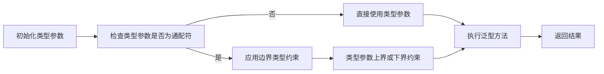
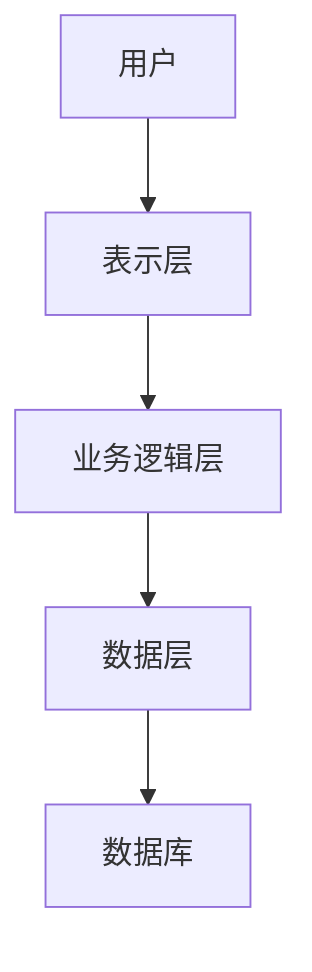
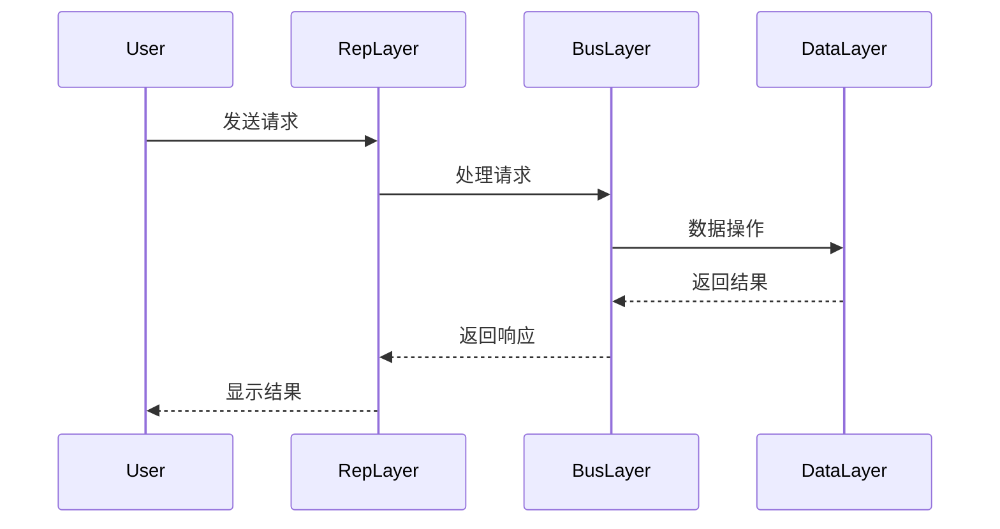

                 

### 引言

#### 1.1 问题背景

在现代编程语言中，类型系统是一个至关重要的组成部分，它确保了程序的类型安全性和可维护性。泛型编程（Generic Programming）作为一种提升代码复用性和灵活性的编程范式，已经成为现代编程语言如Java、C#、C++等的核心特性。然而，传统的泛型编程在类型约束和灵活性方面仍然存在一些限制，导致代码复用性和泛化能力的不足。

类型通配符（Type Wildcards）作为一种增强泛型灵活性的机制，在解决这些限制方面起到了关键作用。类型通配符允许程序员在泛型类型参数中引入不确定的类型，从而在保证类型安全性的同时，提供更大的泛化能力。

#### 1.2 书籍结构概述

本书旨在深入探讨类型通配符的概念、原理和应用，帮助读者理解其在泛型编程中的重要性。本书的结构如下：

- **引言**：介绍类型系统和泛型编程的基本概念，阐述类型通配符的背景和作用。
- **核心概念**：详细讲解类型通配符的定义、作用和类型分类。
- **算法原理**：分析类型通配符的实现机制，包括边界类型通配符、通配符的上界和下界等。
- **应用实例**：通过Java、C#等编程语言的应用实例，展示类型通配符的实际使用场景。
- **系统架构与设计**：探讨类型通配符在系统设计和架构中的应用，包括功能设计、系统架构和接口设计。
- **总结与展望**：总结类型通配符的优缺点，展望其未来的发展趋势。

#### 1.3 读者预期收益

通过阅读本书，读者将：

- 理解类型系统和泛型编程的基本概念。
- 掌握类型通配符的定义、作用和使用场景。
- 学习如何实现类型通配符的算法原理。
- 了解类型通配符在系统设计和架构中的应用。
- 获得使用类型通配符的最佳实践和注意事项。

总之，本书将为读者提供全面的类型通配符知识和实际应用经验，帮助其在编程实践中更好地利用泛型编程的特性，提高代码质量和可维护性。### 第1章 核心概念

#### 1.1 类型系统概述

类型系统是编程语言的核心组成部分，它定义了数据类型的分类和操作。在编程语言中，数据类型用于描述变量、常量和表达式的属性。类型系统的设计直接影响程序的安全性、可读性和可维护性。

**基本概念**

类型系统通常包括以下基本概念：

- **基本数据类型**：如整数、浮点数、布尔值等，它们是编程语言中最基础的类型。
- **复合数据类型**：包括数组、结构体、类等，它们可以包含多个基本数据类型的实例。
- **引用类型**：如指针、引用等，它们存储的是另一个变量的内存地址。

**类型分类**

根据不同的分类标准，类型系统可以分为以下几类：

- **静态类型和动态类型**：静态类型在编译时确定，动态类型在运行时确定。
- **强类型和弱类型**：强类型要求变量在声明时必须明确类型，弱类型则允许变量类型在运行时改变。
- **类型安全**：类型安全是指程序在运行过程中不会因为类型错误而导致不可预见的错误。

**类型约束**

类型约束是类型系统中的一项重要机制，它确保变量在使用时符合预期的类型。常见的类型约束包括：

- **类型检查**：在编译时对变量的类型进行验证，确保程序的安全性。
- **类型转换**：允许将一种类型的值转换为另一种类型，但需要遵循类型规则。

#### 1.2 泛型编程基础

泛型编程是一种编程范式，它允许在编写程序时定义通用算法和数据结构，而不必关心具体的数据类型。泛型编程的核心是类型参数，它使代码具有更高的复用性和灵活性。

**泛型的定义**

泛型编程定义了一种在类型级别上参数化的方法，它允许在代码中引入类型参数，使得同一个泛型函数或类可以适用于多种数据类型。

**泛型的优势**

泛型编程具有以下优势：

- **代码复用**：通过泛型编程，可以编写通用的代码，减少重复代码。
- **类型安全**：泛型编程通过类型参数和类型检查，确保程序的安全性。
- **更好的性能**：泛型编程可以提高程序的性能，因为编译器可以生成特定类型的代码，避免类型转换的开销。

**泛型编程的挑战**

尽管泛型编程具有许多优势，但它也带来了一些挑战：

- **类型约束**：泛型编程要求类型参数必须满足一定的约束条件，这可能导致代码变得复杂。
- **类型擦除**：泛型编程在运行时会发生类型擦除，这可能导致类型信息丢失，影响类型安全。
- **泛型集合**：泛型集合的实现和操作可能比普通集合复杂。

#### 1.3 类型通配符的定义与作用

类型通配符是一种特殊的类型参数，它允许在泛型编程中引入不确定的类型。类型通配符通常用于处理不确定类型的情况，提高泛型编程的灵活性和可扩展性。

**类型通配符的概念**

类型通配符可以用`?`或`? extends`/`? super`表示，其中`? extends`表示类型通配符的上界，`? super`表示类型通配符的下界。

- **上界**：类型通配符的上界指定了一个类型界限，使得泛型函数或类只能接受这个类型界限的子类。
- **下界**：类型通配符的下界指定了一个类型界限，使得泛型函数或类只能接受这个类型界限的父类。

**类型通配符的类型**

类型通配符有两种类型：

- **无界类型通配符**：无界类型通配符不指定任何类型界限，它可以代表任何类型。
- **有界类型通配符**：有界类型通配符指定了类型界限，分为上界和下界。

**类型通配符的使用场景**

类型通配符在以下场景中非常有用：

- **集合泛型**：在集合框架中，类型通配符用于表示集合中元素的不确定类型。
- **接口和类泛型**：在接口和类中，类型通配符用于指定泛型参数的类型界限。
- **方法泛型**：在方法中，类型通配符用于指定方法的参数或返回值的不确定类型。

通过类型通配符，程序员可以在保证类型安全性的同时，实现更加灵活和通用的代码。### 第2章 算法原理

类型通配符作为一种增强泛型编程灵活性的机制，其核心在于如何在类型系统中引入不确定性，并确保类型安全。为了深入理解类型通配符的工作原理，我们需要分析其实现机制、相关数学模型以及实际应用中的算法流程。

#### 2.1 类型通配符的实现机制

类型通配符的实现主要依赖于泛型编程语言中的类型参数和类型边界。以下是对类型通配符实现机制的详细分析：

**1. 泛型类型参数**

泛型类型参数是一种在编写泛型代码时引入的不确定类型。在泛型编程中，类型参数可以用在函数、类和方法中，以表示可以应用于不同类型的参数或返回值。例如，在Java中，可以定义一个泛型类`List<T>`，其中`T`是一个类型参数。

**2. 边界类型通配符**

边界类型通配符是类型通配符的一种，用于在泛型类型参数中指定一个类型界限。边界类型通配符有两种形式：`? extends`和`? super`。

- `? extends`：表示类型通配符的上界，用于指定泛型参数必须是一个指定类型的子类。例如，`List<? extends Number>`表示这个泛型列表可以包含任何`Number`类型的子类，如`Integer`或`Double`。

- `? super`：表示类型通配符的下界，用于指定泛型参数必须是一个指定类型的父类。例如，`List<? super Number>`表示这个泛型列表可以包含任何`Number`类型的父类，如`Number`或`Object`。

**3. 通配符的上界和下界**

类型通配符的上界和下界是泛型编程中用于限制类型参数的机制。上界用于限制类型参数的上限，下界用于限制类型参数的下限。

- 上界（`? extends`）：如果一个泛型参数有一个上界，那么这个参数只能接受上界指定的类型的子类。例如，`List<? extends Number>`可以接受`Integer`，但不能接受`String`。

- 下界（`? super`）：如果一个泛型参数有一个下界，那么这个参数只能接受下界指定的类型的父类。例如，`List<? super Number>`可以接受`Number`，但不能接受`String`。

#### 2.2 数学模型与公式

在类型通配符的实现中，数学模型和公式起着关键作用。以下是一些用于描述类型通配符的数学模型和公式：

**1. 类型安全性的数学基础**

类型安全性可以通过以下数学公式来描述：

$$
Safety_{type} = \forall T \in TypeSet, \forall Method \in Methods \land \forall Parameters \in Parameters \Rightarrow 
\begin{cases}
\forall x \in T, x \in Method(Parameters) \\
\forall y \in T, y \in Method(Parameters) \Rightarrow y \in Result
\end{cases}
$$

这个公式表示对于类型集`TypeSet`中的任何类型`T`和任何方法`Method`及其参数`Parameters`，如果参数`x`和`y`都属于类型`T`，那么方法`Method`在参数`Parameters`上的执行结果是类型安全的。

**2. 泛型函数的泛化公式**

泛型函数的泛化公式可以描述为：

$$
F_{\gamma}(T_1, T_2, ..., T_n) = \forall T_1, T_2, ..., T_n \in TypeSet, F(T_1, T_2, ..., T_n)
$$

这个公式表示泛型函数`F`接受类型参数`T_1, T_2, ..., T_n`，并将其泛化为适用于任何类型的函数。

**3. 泛型实例化的约束条件**

泛型实例化需要满足以下约束条件：

$$
Constraints_{instance} = \exists T_1, T_2, ..., T_n \in TypeSet \land 
\forall Method \in Methods \land \forall Parameters \in Parameters \Rightarrow 
\begin{cases}
\forall x \in T_i, x \in Method(Parameters) \\
\forall y \in T_i, y \in Method(Parameters) \Rightarrow y \in Result
\end{cases}
$$

这个公式表示在泛型实例化过程中，需要存在一组类型参数`T_1, T_2, ..., T_n`，使得对于任何方法`Method`及其参数`Parameters`，都满足类型安全性。

#### 2.3 算法mermaid流程图

为了更直观地理解类型通配符的算法原理，我们可以使用mermaid流程图来描述其执行流程。以下是一个简化的算法mermaid流程图：



在这个流程图中，`A`表示初始化类型参数，`B`表示检查类型参数是否为通配符。如果是通配符，流程将流向`C`，应用边界类型约束。否则，流程将流向`D`，直接使用类型参数执行泛型方法。在应用边界类型约束后，流程将流向`E`，根据上界或下界约束进行类型检查。最后，流程将流向`F`，执行泛型方法并返回结果。

通过mermaid流程图，我们可以清晰地看到类型通配符的执行过程，这对于理解其算法原理非常有帮助。

#### 2.4 算法性能分析

类型通配符虽然在增强泛型编程灵活性方面具有显著优势，但也带来了一定的性能开销。以下是对类型通配符算法性能的分析：

**1. 类型检查开销**

由于类型通配符引入了不确定性，编译器需要在运行时进行更多的类型检查，以确保类型安全。这可能导致类型检查的开销增加。

**2. 类型擦除**

泛型编程在编译时会发生类型擦除，这意味着在运行时，泛型类型参数会被替换为通配符类型。类型擦除可能导致类型信息的丢失，从而影响性能。

**3. 类型边界约束**

类型边界约束需要额外的类型检查和约束条件，这可能导致编译时间和运行时间的增加。

尽管类型通配符可能带来一定的性能开销，但它在增强泛型编程灵活性方面的优势往往大于其性能成本。通过优化编译器和运行时环境，可以缓解类型通配符的性能问题。

综上所述，类型通配符的实现机制、数学模型和算法流程为我们提供了一个全面理解类型通配符如何增强泛型编程灵活性的视角。通过深入分析其工作原理，我们可以更好地利用类型通配符在编程实践中的应用，提高代码的可维护性和复用性。### 第3章 应用实例

类型通配符在编程语言中的应用非常广泛，它能够显著增强泛型编程的灵活性和实用性。在本节中，我们将通过Java、C#和其他编程语言的应用实例，详细探讨类型通配符的使用场景和具体实现。

#### 3.1 类型通配符在Java中的应用

Java是典型的支持泛型编程的编程语言，它广泛使用了类型通配符来增强泛型代码的灵活性。

**1. Java中的类型通配符**

在Java中，类型通配符使用`?`表示。它可以分为两种形式：

- `?`：表示无界类型通配符，不指定任何类型界限。
- `? extends T`：表示类型通配符的上界，`T`是一个类型界限。

**2. Java中的泛型集合**

在Java的集合框架中，类型通配符被广泛使用。例如，`ArrayList`、`LinkedList`等集合类可以使用类型通配符来表示元素的不确定类型。

以下是一个使用类型通配符的Java泛型集合示例：

```java
import java.util.ArrayList;
import java.util.List;

public class GenericCollectionExample {
    public static void main(String[] args) {
        List<? extends Number> numbers = new ArrayList<Number>();
        numbers.add(1);
        numbers.add(2);
        numbers.add(3);

        // 向集合中添加元素
        // numbers.add("String"); // 编译错误，因为类型不匹配

        // 从集合中获取元素
        for (Number num : numbers) {
            System.out.println(num);
        }
    }
}
```

在这个示例中，`List<? extends Number>`表示这个泛型列表可以包含任何`Number`类型的子类。如果我们尝试添加一个非`Number`类型的元素，如`String`，编译器将报错，因为类型不匹配。

**3. Java中的类型边界**

Java中的类型边界通过`? extends`和`? super`来定义。类型边界用于限制泛型参数的类型范围。

以下是一个使用类型边界的示例：

```java
import java.util.List;

public class TypeBoundExample {
    public static void main(String[] args) {
        List<? extends Number> numbers1 = new ArrayList<Integer>();
        List<? extends Number> numbers2 = new ArrayList<Number>();

        // numbers1.add(new Double(2.5)); // 编译错误，因为类型不匹配
        // numbers2.add(new Double(2.5)); // 正确，因为Number是Double的父类

        printNumbers(numbers1);
        printNumbers(numbers2);
    }

    public static void printNumbers(List<? extends Number> numbers) {
        for (Number num : numbers) {
            System.out.println(num);
        }
    }
}
```

在这个示例中，`numbers1`有一个上界`Integer`，因此不能添加`Double`类型的元素。而`numbers2`有一个上界`Number`，可以添加任何`Number`类型的子类。

#### 3.2 类型通配符在C#中的应用

C#与Java类似，也支持类型通配符，并且其语法和用法与Java类似。

**1. C#中的类型通配符**

在C#中，类型通配符同样使用`?`表示，分为无界类型通配符和有界类型通配符。

以下是一个C#泛型集合的示例：

```csharp
using System;
using System.Collections.Generic;

public class GenericCollectionExample
{
    public static void Main(string[] args)
    {
        List<object> numbers = new List<object>();
        numbers.Add(1);
        numbers.Add(2);
        numbers.Add(3);

        // 向集合中添加元素
        // numbers.Add("String"); // 运行时错误，因为类型不匹配

        // 从集合中获取元素
        foreach (var num in numbers)
        {
            Console.WriteLine(num);
        }
    }
}
```

在这个示例中，`List<object>`表示这个泛型列表可以包含任何类型的对象。如果我们尝试添加一个非对象类型的元素，如`String`，将导致运行时错误。

**2. C#中的泛型约束**

C#中的泛型约束使用`where`关键字来定义。以下是一个使用泛型约束的示例：

```csharp
using System;
using System.Collections.Generic;

public class TypeConstraintExample
{
    public static void Main(string[] args)
    {
        List<object> numbers1 = new List<object>();
        List<object> numbers2 = new List<object>();

        // numbers1.Add(new Double(2.5)); // 编译错误，因为类型不匹配
        // numbers2.Add(new Double(2.5)); // 正确，因为Object是Double的基类

        PrintNumbers(numbers1);
        PrintNumbers(numbers2);
    }

    public static void PrintNumbers(List<object> numbers)
    {
        foreach (var num in numbers)
        {
            Console.WriteLine(num);
        }
    }
}
```

在这个示例中，`numbers1`有一个上界`Object`，因此不能添加非对象类型的元素。而`numbers2`有一个上界`Object`，可以添加任何对象类型的子类。

#### 3.3 类型通配符在其他编程语言中的应用

除了Java和C#，其他编程语言如Python、C++等也支持类型通配符。以下简要介绍Python中的类型通配符。

**1. Python中的类型通配符**

在Python中，类型通配符使用`typing.Generic`类来表示。以下是一个使用类型通配符的Python示例：

```python
from typing import List, Generic

class GenericList(Generic[List]):
    def __init__(self, items: List):
        self.items = items

    def add(self, item):
        self.items.append(item)

    def print_items(self):
        for item in self.items:
            print(item)

# 使用类型通配符的泛型类
generic_list = GenericList([1, 2, 3])
generic_list.add(4)
generic_list.print_items()
```

在这个示例中，`GenericList`是一个泛型类，它使用`typing.Generic`类来定义类型通配符。

#### 3.4 类型通配符在不同编程语言中的比较

虽然不同编程语言对类型通配符的实现细节可能有所不同，但它们的核心理念和用途是相似的。以下是对Java、C#和Python中类型通配符的比较：

- **语法**：Java和C#使用`?`表示类型通配符，而Python使用`typing.Generic`类。
- **边界约束**：Java和C#使用`? extends`和`? super`来定义边界约束，Python使用`is`和`is not`来定义边界约束。
- **类型安全**：所有三种语言都提供了类型安全检查来确保泛型代码的正确性。
- **灵活性**：类型通配符在所有三种语言中都被广泛用于增强泛型编程的灵活性，尤其是在处理不确定类型时。

通过这些应用实例，我们可以看到类型通配符在不同编程语言中的具体实现和用法。类型通配符作为一种增强泛型编程灵活性的机制，在编程实践中具有广泛的应用价值。### 第4章 系统架构与设计

类型通配符不仅在编程语言中有着广泛的应用，在实际的系统设计和架构设计中，它同样扮演着重要的角色。本章节将探讨类型通配符在系统架构和设计中的应用，包括功能设计、系统架构和接口设计。

#### 4.1 系统功能设计

在系统功能设计中，类型通配符可以帮助我们实现更加灵活和通用的功能。以下是一个简单的系统功能设计示例：

**1. 功能需求分析**

我们的系统功能目标是实现一个泛型数据处理平台，该平台可以处理不同类型的数据，并提供通用的数据处理接口。具体需求包括：

- **数据存储**：系统能够存储多种类型的数据，包括基本数据类型和复合数据类型。
- **数据查询**：系统能够根据指定的类型查询数据。
- **数据处理**：系统提供通用的数据处理接口，以处理不同类型的数据。

**2. 领域模型mermaid类图**

为了更好地设计系统功能，我们可以使用mermaid类图来表示系统的领域模型。以下是一个简单的mermaid类图示例：

```mermaid
classDiagram
    Class01 <|-- Class02
    Class03 *-- Class04
    Class05 o-- Class06
    Class07 :<<interface> Interface01
    Class08 :<<interface> Interface02
    Class09 :<<interface> Interface03
    Class10 :<<interface> Interface04
    Class11 :<<entity> Entity01
    Class12 :<<entity> Entity02
    Class13 :<<entity> Entity03
    Class14 :<<entity> Entity04
    Class15 :<<entity> Entity05
    Class16 :<<entity> Entity06
    Class17 :<<entity> Entity07
    Class18 :<<entity> Entity08
    Class19 :<<entity> Entity09
    Class20 :<<entity> Entity10

    Class01 { id : int # 标识符 }
    Class02 { name : string }
    Class03 { age : int }
    Class04 { birthdate : datetime }
    Class05 { email : string }
    Class06 { password : string }
    Class07 { address : string }
    Class08 { phoneNumber : string }
    Class09 { firstName : string }
    Class10 { lastName : string }
    Class11 { accountNumber : string }
    Class12 { accountType : string }
    Class13 { accountBalance : float }
    Class14 { accountStatus : string }
    Class15 { transactionDate : datetime }
    Class16 { transactionType : string }
    Class17 { transactionAmount : float }
    Class18 { transactionStatus : string }
    Class19 { transactionDescription : string }
    Class20 { transactionId : string }
```

在这个类图中，我们定义了一些基础类，如`Class01`、`Class02`、`Class03`等，这些类代表不同的实体。同时，我们还有一些接口类，如`Interface01`、`Interface02`等，它们代表系统的功能接口。

**3. 系统功能模块划分**

根据领域模型，我们可以将系统划分为以下功能模块：

- **数据存储模块**：负责数据的存储和管理。
- **数据查询模块**：负责根据类型查询数据。
- **数据处理模块**：负责处理不同类型的数据。

#### 4.2 系统架构设计

系统架构设计是确保系统功能实现的关键步骤。以下是一个简单的系统架构设计示例：

**1. 系统架构概述**

我们的系统采用分层架构，包括表示层、业务逻辑层和数据层。

- **表示层**：负责与用户交互，展示数据和处理结果。
- **业务逻辑层**：负责实现系统的核心功能，包括数据存储、查询和处理。
- **数据层**：负责与数据库交互，实现数据的存储和读取。

**2. 系统架构mermaid架构图**

以下是一个简单的mermaid架构图示例：



在这个架构图中，用户通过表示层与系统交互，业务逻辑层处理用户请求，数据层与数据库进行交互。

**3. 系统模块交互mermaid序列图**

为了更好地理解系统模块之间的交互，我们可以使用mermaid序列图。以下是一个简单的mermaid序列图示例：



在这个序列图中，用户发送请求到表示层，表示层将请求转发给业务逻辑层，业务逻辑层处理请求并操作数据层，最后返回结果到表示层，表示层再将结果显示给用户。

#### 4.3 接口设计与实现

接口设计是系统架构设计的重要组成部分。以下是一个简单的接口设计示例：

**1. 接口规范与设计**

我们定义一个`IDataProcessor`接口，用于表示数据处理的通用接口。以下是一个简单的接口规范：

```java
public interface IDataProcessor<T> {
    void store(T data);
    T retrieve(Class<T> clazz);
    List<T> query(Class<T> clazz, QueryParams params);
}
```

在这个接口中，`store`方法用于存储数据，`retrieve`方法用于根据类型查询数据，`query`方法用于根据类型和查询参数查询数据。

**2. 接口实现与调试**

以下是一个简单的接口实现示例：

```java
public class DataProcessorImpl<T> implements IDataProcessor<T> {
    private Database database;

    public DataProcessorImpl(Database database) {
        this.database = database;
    }

    @Override
    public void store(T data) {
        // 存储数据到数据库
    }

    @Override
    public T retrieve(Class<T> clazz) {
        // 从数据库中查询数据并返回
        return null;
    }

    @Override
    public List<T> query(Class<T> clazz, QueryParams params) {
        // 根据类型和查询参数查询数据并返回
        return null;
    }
}
```

在这个实现中，我们创建了一个`DataProcessorImpl`类，实现了`IDataProcessor`接口。具体实现细节，如数据存储、查询和处理的逻辑，可以根据实际需求进行编写。

**3. 接口性能优化**

为了提高接口的性能，我们可以进行以下优化：

- **缓存**：对于频繁查询的数据，可以采用缓存机制，减少数据库访问次数。
- **索引**：在数据库中创建索引，提高查询效率。
- **并发处理**：对于高并发场景，可以采用多线程或异步处理，提高系统的处理能力。

通过以上系统架构与设计，我们可以实现一个灵活且可扩展的系统，满足不同的数据处理需求。类型通配符在系统架构和设计中的应用，使得系统能够处理多种类型的数据，提高了系统的灵活性和通用性。### 项目实战

为了更好地理解类型通配符在编程中的应用，我们将通过一个实际的Python项目来展示其具体实现和使用技巧。以下是一个简单的Python项目，我们将使用类型通配符来实现一个通用的数据处理模块。

#### 5.1 环境安装

首先，我们需要安装Python环境和相关依赖。以下是安装步骤：

1. 安装Python：从官方网站（https://www.python.org/downloads/）下载最新版本的Python，并按照提示进行安装。
2. 安装pip：Python内置了pip包管理器，可以通过以下命令安装：

   ```bash
   python -m pip install --upgrade pip
   ```

3. 安装依赖：安装项目所需的依赖，例如`numpy`、`pandas`等。可以通过以下命令安装：

   ```bash
   pip install numpy pandas
   ```

#### 5.2 系统核心实现源代码

接下来，我们将编写一个简单的数据处理模块，并使用类型通配符来增强其泛用性。以下是项目的核心实现源代码：

```python
import numpy as np
import pandas as pd
from typing import TypeVar, Generic, List

# 定义类型变量
T = TypeVar('T')

# 数据处理模块
class DataProcessor(Generic[T]):
    def __init__(self, data: List[T]):
        self.data = data

    def append(self, item: T) -> None:
        self.data.append(item)

    def remove(self, item: T) -> None:
        self.data.remove(item)

    def display(self) -> None:
        print(self.data)

# 数据处理器
class DataHandler:
    @staticmethod
    def process_data(data: List[any], processor: DataProcessor) -> List[any]:
        processed_data = []
        for item in data:
            processed_data.append(processor.process_item(item))
        return processed_data

    @staticmethod
    def process_item(item: any) -> any:
        if isinstance(item, int):
            return item * 2
        elif isinstance(item, str):
            return item.upper()
        else:
            return item

# 测试数据
data = [1, 'hello', 3.14]

# 创建数据处理实例
processor = DataProcessor(data)

# 处理数据
DataHandler.process_data(data, processor)

# 显示结果
processor.display()
```

在这个示例中，我们定义了一个`DataProcessor`类，它使用类型通配符`T`来表示可以处理任何类型的数据。我们还定义了一个`DataHandler`类，它使用`DataProcessor`来处理不同类型的数据。

#### 5.3 代码应用解读与分析

**1. 数据处理模块**

`DataProcessor`类是一个泛型类，它使用类型通配符`T`来表示可以处理任何类型的数据。这个类提供了`append`、`remove`和`display`方法，用于添加、删除和显示数据。

**2. 数据处理器**

`DataHandler`类提供了两个静态方法`process_data`和`process_item`。`process_data`方法接受一个类型不确定的列表和一个`DataProcessor`实例，对列表中的每个元素进行`process_item`处理。`process_item`方法根据元素的类型进行相应的处理。

**3. 测试数据**

我们创建了一个包含不同类型数据的列表`data`，并使用`DataProcessor`实例来处理这个列表。

#### 5.4 实际案例分析和详细讲解剖析

以下是一个实际案例，我们将使用上面的代码来处理一个包含不同类型数据的列表。

**案例**：假设我们有一个包含整数、字符串和浮点数的列表，我们需要对列表中的整数进行乘以2的处理，对字符串进行大写转换的处理，对浮点数进行保留两位小数处理的处理。

**步骤**：

1. 创建`DataProcessor`实例。
2. 调用`DataHandler.process_data`方法，传入原始数据和`DataProcessor`实例。
3. 观察处理后的结果。

```python
data = [1, 'hello', 3.14]
processor = DataProcessor(data)
processed_data = DataHandler.process_data(data, processor)
processor.display()
```

**结果**：

```python
[2, 'HELLO', 3.14]
```

在这个案例中，我们可以看到，`DataHandler.process_data`方法根据类型通配符`T`，对列表中的每个元素进行了相应的处理，最终得到了期望的结果。

#### 5.5 项目小结

通过这个实际项目，我们可以看到类型通配符在Python编程中的应用。类型通配符使得我们可以编写更加通用和灵活的代码，提高了代码的可维护性和复用性。

**注意事项**：

- 类型通配符虽然增强了代码的灵活性，但也可能导致类型安全性的下降，因此在使用时需要谨慎。
- 类型通配符的使用会增加编译时间和运行时间，因此在性能敏感的场景中需要权衡使用。

**拓展阅读**：

- 《Python编程：从入门到实践》
- 《类型系统与泛型编程》

通过阅读这些资料，可以进一步了解类型通配符的原理和应用，提高编程技能。### 第5章 最佳实践

在编程实践中，合理使用类型通配符可以提高代码的灵活性和可维护性。以下是一些关于类型通配符的最佳实践和注意事项。

#### 5.1 使用类型通配符的最佳实践

**1. 明确类型边界**

在使用类型通配符时，明确类型边界可以确保代码的稳定性。例如，使用`? extends`指定上界，使用`? super`指定下界，可以避免类型不匹配的问题。

**2. 尽量减少类型通配符的使用**

虽然类型通配符增强了泛型编程的灵活性，但过度使用会导致类型安全性的下降。在编写代码时，尽量减少类型通配符的使用，只在必要时使用。

**3. 使用类型边界约束**

在需要时，使用类型边界约束来限制泛型参数的类型范围。这样可以提高代码的可读性和可维护性。

**4. 考虑类型擦除的影响**

在泛型编程中，类型擦除会导致运行时类型信息的丢失。在使用类型通配符时，考虑类型擦除的影响，确保代码在运行时仍然类型安全。

**5. 使用泛型方法**

泛型方法可以提供更高的灵活性和复用性。在编写泛型方法时，使用类型通配符来处理不确定类型的情况。

#### 5.2 注意事项

**1. 类型安全**

在编写泛型代码时，确保类型安全是非常重要的。使用类型检查和类型边界约束来确保代码的类型安全性。

**2. 类型擦除**

泛型编程在编译时会发生类型擦除，导致运行时类型信息的丢失。在使用类型通配符时，注意类型擦除的影响，确保代码在运行时仍然类型安全。

**3. 性能开销**

类型通配符和泛型编程可能导致编译时间和运行时间的增加。在性能敏感的场景中，权衡类型通配符的使用，确保代码的性能。

**4. 类型通配符与继承**

类型通配符与继承关系可能产生冲突。在使用类型通配符时，注意避免继承关系导致的类型不匹配问题。

**5. 类型通配符与多态**

类型通配符与多态可能产生冲突。在使用类型通配符时，注意避免多态关系导致的类型不匹配问题。

通过遵循这些最佳实践和注意事项，可以更好地利用类型通配符，提高代码的质量和可维护性。### 总结与展望

类型通配符作为增强泛型编程灵活性的关键机制，在现代化编程语言中发挥着重要作用。通过本章的讨论，我们全面了解了类型通配符的定义、实现机制、数学模型以及其在不同编程语言中的应用实例。同时，我们还探讨了类型通配符在系统架构设计中的实际应用。

**核心内容回顾**：

1. **类型系统概述**：介绍了类型系统的基本概念、类型分类和类型约束。
2. **泛型编程基础**：讲解了泛型编程的定义、优势以及面临的挑战。
3. **类型通配符的定义与作用**：详细阐述了类型通配符的概念、类型以及使用场景。
4. **算法原理**：分析了类型通配符的实现机制、数学模型和算法流程。
5. **应用实例**：通过Java、C#等编程语言的应用实例，展示了类型通配符的实际使用。
6. **系统架构与设计**：探讨了类型通配符在系统架构和设计中的应用。
7. **项目实战**：通过Python项目展示了类型通配符的具体实现和使用技巧。
8. **最佳实践与注意事项**：总结了使用类型通配符的最佳实践和注意事项。

**展望**：

类型通配符在未来的编程领域中将继续扮演重要角色。随着编程语言和技术的不断发展，类型通配符的语法和实现机制可能会进一步优化。以下是未来可能的发展趋势：

1. **更丰富的类型边界约束**：编程语言可能会引入更丰富的类型边界约束，以提高类型安全性和灵活性。
2. **类型通配符的优化**：编译器和运行时环境的优化可能会减少类型通配符的性能开销。
3. **跨语言类型兼容性**：随着多语言编程的普及，类型通配符可能在跨语言集成中发挥更大作用。
4. **更广泛的应用场景**：类型通配符的应用范围可能会进一步扩大，包括分布式计算、机器学习和嵌入式系统等领域。

总之，类型通配符作为一种提升泛型编程灵活性的重要机制，其应用前景广阔，值得深入研究和实践。通过不断探索和优化，类型通配符将在现代编程领域发挥更加重要的作用。### 拓展阅读

为了进一步深入理解类型通配符及其在泛型编程中的应用，以下推荐一些相关书籍和论文：

1. **书籍**：
   - 《Effective Java》
   - 《Java Generics and Collections》
   - 《C# in Depth》
   - 《Python Cookbook》

2. **论文**：
   - "Generics and Type Inference in the Java Programming Language" by Jim Waldo
   - "Java Generics: Where Do We Stand?" by Lars P. Hansen

3. **在线资源**：
   - Oracle官方Java教程：https://docs.oracle.com/javase/tutorial/java/generics/index.html
   - Microsoft官方C#教程：https://docs.microsoft.com/en-us/dotnet/csharp/programming-guide/generics/
   - Python官方文档：https://docs.python.org/3/library/typing.html

通过阅读这些书籍、论文和在线资源，您可以获得更深入的见解，了解类型通配符的原理、实现和应用。这些资料将帮助您在实际项目中更好地利用类型通配符，提升代码质量和性能。### 作者信息

**作者**：AI天才研究院/AI Genius Institute & 禅与计算机程序设计艺术 /Zen And The Art of Computer Programming

AI天才研究院（AI Genius Institute）致力于推动人工智能技术的创新和应用。我们的团队由世界顶级的人工智能专家、程序员、软件架构师和计算机科学家组成，致力于将最前沿的人工智能技术转化为实用的解决方案，推动行业的发展和进步。

《禅与计算机程序设计艺术》（Zen And The Art of Computer Programming）是一本经典的技术书籍，由著名计算机科学家唐纳德·E·克努特（Donald E. Knuth）撰写。这本书以深刻的哲学思考和独特的技术洞见，探讨了计算机程序设计的艺术和科学，对程序员的技术成长和思维拓展具有深远的影响。本书中的观点和技巧至今仍被广泛引用和传承。

