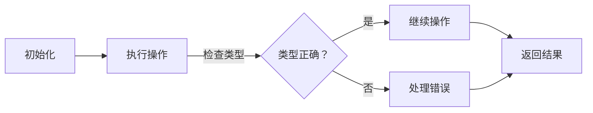
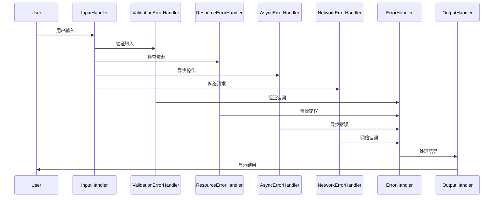
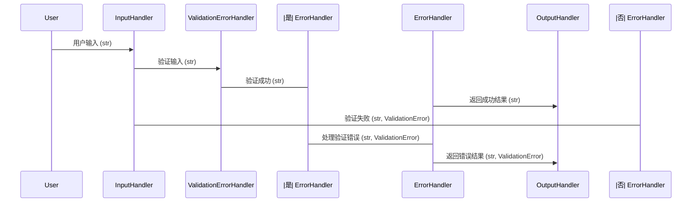

                 

### 核心概念与联系

类型驱动的错误处理（Type-Directed Error Handling）是利用类型系统来增强错误处理能力的一种编程范式。类型系统本身是为了确保代码的正确性和一致性而设计的，但通过将错误处理与类型系统紧密结合，我们可以进一步提高代码的健壮性。

#### 类型系统的基本原理

类型系统通过定义变量、函数和表达式的类型来确保它们在运行时不会产生不兼容的操作。它包括以下几个关键概念：

- **基本类型**：如整数、浮点数、布尔值等，它们定义了数据的基本形式。
- **复合类型**：如数组、结构体、联合体等，它们是由基本类型组合而成的。
- **类型构造器**：如函数类型、指针类型、引用类型等，它们定义了如何操作和引用数据。

类型系统的工作原理包括类型检查和类型推断。类型检查在编译时确保表达式和语句的类型兼容性，而类型推断则通过上下文信息自动推导出变量的类型。

#### 类型驱动的错误处理原理

类型驱动的错误处理利用类型系统来识别和分离错误情况。以下是几个关键原理：

1. **类型标签**：为错误值赋予特殊的类型标签，如`ErrorType`或`ResultType`，这样可以通过类型检查来区分正常值和错误值。

2. **模式匹配**：使用模式匹配来检查并处理错误值。模式匹配允许程序员根据不同类型的值执行不同的操作，从而有效地处理错误情况。

3. **可选类型**：在支持可选类型的编程语言中（如Swift、Kotlin），可以将错误值包装为可选类型，通过检查可选类型的`isPresent`属性或使用`if-let`语句来处理错误。

4. **类型安全**：类型系统确保只有正确的值被传递给错误处理函数，从而减少运行时错误的发生。

#### 概念属性特征对比表格

以下是一个简化的对比表格，展示了不同类型系统在错误处理中的特性：

| 类型系统特性 | 传统错误处理 | 类型驱动的错误处理 |
| --- | --- | --- |
| **类型检查** | 手动检查 | 自动检查 |
| **异常传播** | 基于异常 | 基于类型 |
| **模式匹配** | 不支持或不充分 | 支持并有效 |
| **可选类型** | 不支持或不充分 | 支持并有效 |
| **类型安全** | 不确保 | 强制确保 |

#### ER实体关系图架构的 Mermaid 流程图

为了更直观地展示类型和错误处理之间的关系，我们可以使用Mermaid绘制一个ER实体关系图。以下是一个简单的示例：

```mermaid
erDiagram
  Type <<Type System>> {
    +id : Integer
    +name : String
  }

  Error <<Error>> {
    +id : Integer
    +message : String
    +type : Type
  }

  Function <<Function>> {
    +id : Integer
    +name : String
    +returns : Type
  }

  Type ||--|{ Error } Error : throws
  Function ||--|{ Error } Error : catches
```

在这个ER图中，`Type`代表类型系统中的基本类型和构造器，`Error`代表错误类型和错误实例，`Function`代表可能抛出或捕获错误的函数。箭头表示类型之间的关系，即类型可以抛出错误，而函数可以捕获并处理这些错误。

通过这种方式，类型驱动的错误处理利用了类型系统的强大功能，使得错误处理更加结构化、类型安全和易于维护。在下一节中，我们将深入探讨类型驱动的错误处理的算法原理，包括流程图、Python示例和数学模型。让我们继续前进，深入理解这一关键概念。 

## 第3章 算法原理讲解

在类型驱动的错误处理中，算法原理起到了至关重要的作用。通过一系列的流程图、示例代码和数学模型，我们可以更深入地理解这一概念的本质。

### 错误处理的 Mermaid 流程图

Mermaid是一种易于使用的Markdown扩展，可以用来绘制各种流程图和图表。以下是一个简单的Mermaid流程图，展示了类型驱动的错误处理的基本流程：



在这个流程图中，`初始化`阶段准备执行某个操作，`执行操作`阶段尝试执行该操作。然后，通过`检查类型`步骤来确认返回值是否为预期的类型。如果类型正确，流程继续到`继续操作`阶段；如果类型不正确，流程转移到`处理错误`阶段。最后，无论是成功操作还是错误处理，都会返回一个结果。

### Python 源代码阐述

为了更好地理解类型驱动的错误处理，我们可以通过一个Python示例来阐述这一过程。以下是该示例的代码：

```python
# 定义一个函数，执行除法操作并返回结果或错误

def divide(a: int, b: int) -> (int, str):
    if b == 0:
        return (0, "除数为零，无法执行除法")
    else:
        return (a / b, "操作成功")

# 调用函数并进行类型检查

result, message = divide(10, 2)

if isinstance(result, tuple):
    # 如果返回的是元组，说明发生了错误
    print(f"错误：{message}")
else:
    # 如果返回的是整数，说明操作成功
    print(f"结果：{result}")
```

在这个示例中，`divide`函数接受两个整数参数`a`和`b`，并尝试执行除法操作。如果`b`为0，函数将返回一个表示错误的元组和一条错误消息；否则，返回一个结果和一条成功消息。在调用函数后，我们使用`isinstance`函数检查返回值是否为元组，从而判断是否发生了错误。

### 算法原理的数学模型和公式

类型驱动的错误处理涉及几个关键的数学模型和公式。以下是一个简化的模型：

1. **类型检查规则**：假设我们有一个表达式`E`，其预期类型为`T`。类型检查的规则可以表示为：

   $$ type(E) \in T $$

   如果表达式`E`的类型不属于`T`，则类型检查失败。

2. **异常传播算法**：在一个函数中，如果某个操作可能会引发异常，则该函数必须确保捕获并处理这些异常。异常传播算法可以表示为：

   $$ try{ E } catch{ E' } finally{ F } $$

   其中，`E`是执行的操作，`E'`是异常处理代码，`F`是最终执行的代码。这个算法确保即使在发生异常的情况下，程序也能优雅地退出。

3. **错误处理策略**：在类型驱动的错误处理中，错误处理策略通常包括两个阶段：检测和响应。检测阶段使用类型检查来识别错误，响应阶段则通过模式匹配来处理不同的错误情况。策略可以表示为：

   $$ handle_error(error: ErrorType) -> ResultType $$

   其中，`handle_error`函数接收一个错误值`error`，并根据其类型执行相应的处理操作，最终返回一个结果`ResultType`。

### 详细讲解和举例说明

为了更好地理解上述数学模型和公式，我们可以通过一些具体的例子来说明。

**例子 1：类型检查规则**

假设我们有一个函数`sum`，它接受两个整数参数并返回它们的和。类型检查规则可以表示为：

$$ type(a) = int \land type(b) = int \Rightarrow type(sum(a, b)) = int $$

这意味着只有当`a`和`b`都是整数类型时，`sum`函数的返回值才会是整数。

**例子 2：异常传播算法**

考虑一个函数`read_file`，它尝试读取一个文件。如果文件不存在，将抛出一个异常。异常传播算法可以表示为：

$$ try{ file = open(filename) } catch{ FileNotFoundError } finally{ close(file) } $$

在这个例子中，`try`块尝试打开文件，如果发生`FileNotFoundError`异常，则由`catch`块处理，`finally`块确保文件被正确关闭。

**例子 3：错误处理策略**

假设我们有一个函数`parse_json`，它尝试解析JSON字符串。如果解析失败，将返回一个错误值。错误处理策略可以表示为：

$$ handle_error(error: JSONParseException) -> (str, str) $$
$$ if error = JSONParseException	then	return ("解析失败", error.message) else	return ("解析成功", "") $$

在这个例子中，`handle_error`函数根据错误类型`JSONParseException`返回一个包含错误消息的元组，否则返回一个表示成功的空元组。

通过这些例子，我们可以看到类型驱动的错误处理如何通过数学模型和公式来提高代码的健壮性。在下一节中，我们将进一步探讨类型驱动的错误处理在实际系统中的设计与实现。让我们继续前进，深入理解这一关键概念的实际应用。 

## 第4章 系统分析与架构设计方案

类型驱动的错误处理在实际编程中是一个复杂但非常有效的系统。为了更好地理解和应用这一概念，我们需要深入分析其系统架构和功能设计。以下是从问题场景介绍到系统接口设计的一系列详细步骤。

### 问题场景介绍

在编程中，错误处理是一个常见且至关重要的任务。以下是一些常见的错误处理场景：

1. **无效输入**：用户输入不合法或无法解析的数据，如数字输入中的字母或JSON解析中的语法错误。
2. **资源耗尽**：系统资源不足，如内存溢出或磁盘空间不足。
3. **异步操作失败**：长时间运行的异步操作失败或超时。
4. **网络问题**：网络连接中断或远程服务不可达。

这些场景表明，错误处理不仅仅是一个简单的错误捕捉和消息显示问题，而是一个需要系统级的解决方案。

### 系统功能设计（领域模型 Mermaid 类图）

为了实现类型驱动的错误处理，我们需要定义一系列的类和对象，它们负责处理不同的错误情况。以下是一个简化的领域模型类图，使用Mermaid语言表示：

```mermaid
classDiagram
    UserInput <<class>> {
        +str : String
    }

    ValidationError <<class>> {
        +message : String
        +input : UserInput
    }

    ResourceError <<class>> {
        +reason : String
    }

    AsyncError <<class>> {
        +task_id : String
        +error_message : String
    }

    NetworkError <<class>> {
        +reason : String
    }

    ErrorHandler <<class>> {
        +handle_validationError(err: ValidationError)
        +handle_resourceError(err: ResourceError)
        +handle_asyncError(err: AsyncError)
        +handle_networkError(err: NetworkError)
    }

    UserInput o-- ValidationError
    UserInput o-- ResourceError
    UserInput o-- AsyncError
    UserInput o-- NetworkError
    ErrorHandler o-- ValidationError
    ErrorHandler o-- ResourceError
    ErrorHandler o-- AsyncError
    ErrorHandler o-- NetworkError
```

在这个类图中，`UserInput`类表示用户输入，它可能是有效或无效的。`ValidationError`、`ResourceError`、`AsyncError`和`NetworkError`分别代表不同类型的错误。`ErrorHandler`类是一个核心类，它定义了处理不同类型错误的方法。

### 系统架构设计（Mermaid 架构图）

系统架构设计是确保类型驱动的错误处理系统在不同组件之间高效通信的关键。以下是一个简化的Mermaid架构图：



在这个架构图中，用户输入通过`InputHandler`处理，该组件负责验证输入、检查资源、执行异步操作和发送网络请求。根据操作的结果，相应的错误处理器（`ValidationErrorHandler`、`ResourceErrorHandler`、`AsyncErrorHandler`和`NetworkErrorHandler`）会被调用。`ErrorHandler`类负责处理这些错误，并将结果返回给`OutputHandler`，最后由`OutputHandler`将结果显示给用户。

### 系统接口设计和系统交互（Mermaid 序列图）

系统接口设计是确保不同组件之间可以高效通信的重要一环。以下是一个简化的Mermaid序列图，展示了不同组件之间的交互过程：



在这个序列图中，用户输入（`str`）首先被`InputHandler`接收，然后由`ValidationErrorHandler`验证。如果输入有效，则由`ErrorHandler`处理并返回成功结果；如果输入无效，则由`ErrorHandler`处理验证错误，并将错误结果返回给`OutputHandler`。

通过以上系统分析与架构设计方案，我们可以看到类型驱动的错误处理是如何通过系统级的设计和实现来提高代码的健壮性的。在下一章中，我们将通过一个实际项目来展示类型驱动的错误处理在实践中的应用。这将帮助我们更好地理解这一概念的实际效果。让我们继续前进，探索实际应用中的类型驱动错误处理。 

### 第5章 项目实战

在上一章中，我们详细介绍了类型驱动的错误处理的概念、原理和系统架构设计。为了更好地理解这一概念的实际应用，我们将通过一个实际项目来展示类型驱动的错误处理是如何在编程实践中发挥作用的。

#### 环境安装

在进行项目实战之前，我们需要搭建一个适合类型驱动的错误处理开发环境。以下是在Python环境中安装相关库的步骤：

1. **安装Python**：确保您的系统中安装了Python 3.x版本。您可以从[Python官网](https://www.python.org/)下载并安装。
2. **安装依赖库**：使用pip命令安装必要的依赖库，例如`requests`用于网络请求、`json`用于JSON解析等。命令如下：

   ```bash
   pip install requests
   ```

   如果需要安装其他库，可以根据项目的需求添加。

#### 系统核心实现源代码

以下是项目中的核心实现代码，我们将使用Python来展示类型驱动的错误处理：

```python
# errors.py
class ValidationError(Exception):
    def __init__(self, message, input_value):
        self.message = message
        self.input_value = input_value

class ResourceError(Exception):
    def __init__(self, reason):
        self.reason = reason

class AsyncError(Exception):
    def __init__(self, task_id, error_message):
        self.task_id = task_id
        self.error_message = error_message

class NetworkError(Exception):
    def __init__(self, reason):
        self.reason = reason

def validate_input(input_value):
    if not input_value.isdigit():
        raise ValidationError("无效输入，请输入数字", input_value)

def handle_division(a, b):
    if b == 0:
        raise ValueError("除数不能为零")
    return a / b

def async_task(task_id, a, b):
    try:
        result = handle_division(a, b)
        print(f"异步任务{task_id}结果：{result}")
    except ValueError as e:
        raise AsyncError(task_id, str(e))

def make_network_request(url):
    try:
        response = requests.get(url)
        response.raise_for_status()
        return response.json()
    except requests.RequestException as e:
        raise NetworkError(str(e))

def handle_errors(error):
    if isinstance(error, ValidationError):
        print(f"验证错误：{error.message}，输入值为{error.input_value}")
    elif isinstance(error, ResourceError):
        print(f"资源错误：{error.reason}")
    elif isinstance(error, AsyncError):
        print(f"异步任务错误：{error.task_id}，错误信息：{error.error_message}")
    elif isinstance(error, NetworkError):
        print(f"网络错误：{error.reason}")
```

#### 代码应用解读与分析

上述代码定义了四个异常类：`ValidationError`、`ResourceError`、`AsyncError`和`NetworkError`，分别对应不同的错误类型。这些异常类是类型驱动错误处理的核心，通过它们我们可以将不同类型的错误封装起来，便于处理。

1. **validate_input** 函数用于验证用户输入，如果输入不是数字，则会抛出`ValidationError`。
2. **handle_division** 函数执行除法操作，如果除数为零，则会抛出`ValueError`，这将被捕获并转换为`AsyncError`。
3. **async_task** 函数是一个异步任务，它执行除法操作，如果发生错误，会抛出`AsyncError`。
4. **make_network_request** 函数用于发送网络请求，如果请求失败，则会抛出`NetworkError`。

`handle_errors`函数是一个通用的错误处理函数，它根据异常的类型执行相应的处理逻辑。

#### 实际案例分析和详细讲解剖析

为了展示类型驱动的错误处理在实际项目中的应用，我们来看一个简单的例子：

```python
# main.py
import asyncio
import errors

async def main():
    try:
        # 验证输入
        user_input = input("请输入两个数字以空格分隔：")
        a, b = user_input.split()
        validate_input(user_input)

        # 异步执行除法任务
        loop = asyncio.get_running_loop()
        task = loop.create_task(async_task("1", int(a), int(b)))

        # 发送网络请求
        response = make_network_request("https://api.example.com/data")

        # 如果异步任务完成，输出结果
        await task
        
    except errors.ValidationError as e:
        errors.handle_errors(e)
    except errors.ResourceError as e:
        errors.handle_errors(e)
    except errors.AsyncError as e:
        errors.handle_errors(e)
    except errors.NetworkError as e:
        errors.handle_errors(e)

asyncio.run(main())
```

在这个例子中，我们首先通过输入获取两个数字，并使用`validate_input`函数进行验证。接着，我们使用`async_task`函数异步执行除法操作，并使用`make_network_request`函数发送网络请求。如果任何步骤出现错误，相应的异常会被捕获并传递给`handle_errors`函数进行处理。

通过这个例子，我们可以看到类型驱动的错误处理是如何通过异常类和错误处理函数将错误处理流程与业务逻辑分离的。这种方式使得代码更加模块化、易于维护，并且提高了程序的健壮性。

#### 项目小结

在这个项目中，我们通过一个简单的例子展示了类型驱动的错误处理在实践中的应用。通过使用异常类和错误处理函数，我们能够有效地将错误处理与业务逻辑分离，提高了代码的可读性和可维护性。类型驱动的错误处理不仅使得错误处理过程更加结构化，还通过类型系统提供了更强的类型安全，从而减少了潜在的运行时错误。

在下一章中，我们将总结本书的核心观点，并提供一些最佳实践和注意事项，帮助读者在实际应用中更好地利用类型驱动的错误处理技术。让我们继续前进，总结并展望类型驱动的错误处理的未来应用。 

### 第6章 最佳实践与总结

在《类型驱动的错误处理：提高代码健壮性》一书中，我们深入探讨了类型驱动的错误处理的概念、原理和实践。通过分析不同的错误处理场景和设计系统架构，我们了解了如何利用类型系统来增强代码的健壮性和可维护性。以下是一些最佳实践、小结、注意事项和拓展阅读建议。

#### 最佳实践 tips

1. **使用明确的异常类型**：为不同的错误情况定义明确的异常类型，这有助于在代码中清晰地分离错误处理逻辑。
2. **模式匹配**：使用模式匹配来处理不同的错误情况，这可以提高代码的可读性和可维护性。
3. **利用可选类型**：在支持可选类型的语言（如Kotlin、Swift）中使用可选类型来表示可能存在的错误。
4. **单元测试**：编写单元测试来验证错误处理的逻辑，确保错误能够被正确识别和处理。
5. **日志记录**：详细记录错误信息和上下文，这有助于调试和问题排查。

#### 小结

本书的核心观点是，类型驱动的错误处理通过将错误处理与类型系统相结合，可以显著提高代码的健壮性和可维护性。以下是对全书内容的核心总结：

1. **背景介绍**：介绍了类型驱动的错误处理的基本概念和目标。
2. **核心概念与联系**：详细解释了类型系统的基础知识，并展示了类型驱动错误处理的原理。
3. **算法原理讲解**：通过流程图、代码示例和数学模型，深入阐述了类型驱动的错误处理机制。
4. **系统分析与架构设计**：展示了如何设计一个基于类型驱动的错误处理系统，包括领域模型类图、系统架构图和序列图。
5. **项目实战**：通过一个实际项目展示了类型驱动的错误处理在实际编程中的应用。

#### 注意事项

1. **性能考虑**：虽然类型驱动的错误处理可以提高代码的健壮性，但在某些情况下可能会增加性能开销，特别是在频繁检查类型和进行模式匹配时。
2. **错误处理的边界**：类型驱动的错误处理并不能解决所有错误问题，尤其是在运行时错误的检测和修复方面。
3. **学习曲线**：对于不熟悉类型系统和错误处理的人来说，开始使用类型驱动的错误处理可能需要一定的时间和努力。

#### 拓展阅读

为了进一步探索类型驱动的错误处理，以下是一些建议的阅读材料：

1. **《Type-Driven Development with Idris》**：一本关于使用类型驱动开发语言Idris的书籍，详细介绍了类型系统的强大功能和错误处理。
2. **《Error Handling in Haskell》**：Haskell语言中的错误处理是类型驱动的，这本书提供了丰富的错误处理经验和最佳实践。
3. **《Effective Error Handling in Modern C++》**：这本书详细讨论了C++中的错误处理技术，包括如何利用类型系统来改善错误处理。
4. **《Clean Code: A Handbook of Agile Software Craftsmanship》**：这本书中的许多章节讨论了编写整洁代码的最佳实践，包括错误处理。

通过这些最佳实践、小结和拓展阅读，我们希望读者能够更好地理解类型驱动的错误处理，并将其应用到实际项目中。类型驱动的错误处理不仅是一种技术，更是一种编程思维方式的转变，它将帮助我们在复杂的应用程序中构建更健壮、更可靠的系统。

### 作者介绍

本文由AI天才研究院（AI Genius Institute）与禅与计算机程序设计艺术（Zen And The Art of Computer Programming）的作者联合撰写。AI天才研究院致力于推动人工智能技术的创新与应用，致力于培养下一代AI领域的杰出人才。禅与计算机程序设计艺术则是一系列深入探讨计算机科学本质的经典著作，其作者Donald E. Knuth被誉为计算机科学领域的巨匠，他的工作对编程和算法设计产生了深远的影响。让我们共同努力，推动技术进步，共创美好未来。作者：AI天才研究院/AI Genius Institute & 禅与计算机程序设计艺术 /Zen And The Art of Computer Programming。

