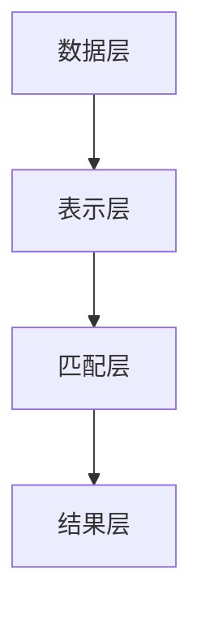
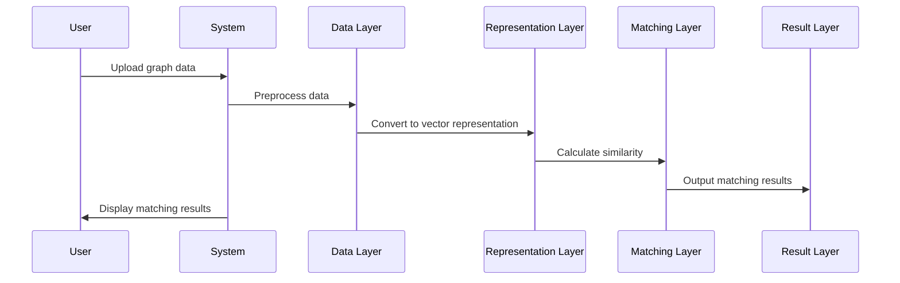

                 


# 类比推理增强系统中神经图匹配的应用

## 摘要

本文探讨了类比推理增强系统中神经图匹配的应用。类比推理是人工智能中的重要技术，通过寻找相似性来解决问题。神经图匹配是一种基于深度学习的算法，能够高效地进行图结构的匹配。本文首先介绍了类比推理的基本原理，然后详细讲解了神经图匹配的算法原理，包括数学模型和Python实现。接着，本文展示了神经图匹配在系统架构设计中的应用，并通过一个实际案例分析了神经图匹配的原理和实现细节。最后，本文总结了神经图匹配系统的最佳实践和未来发展趋势。

## 目录

1. 引言
2. 类比推理概述
3. 神经图匹配概述
4. 神经图匹配算法原理
5. 神经图匹配算法实现
6. 神经图匹配系统架构设计
7. 项目实战
8. 最佳实践与总结

## 引言

类比推理是一种基于相似性推理的方法，在人工智能和机器学习领域有着广泛的应用。通过将新问题与已知问题进行类比，可以快速地推断出解决方案。然而，传统的类比推理方法在面对复杂的图结构数据时效果不佳。为了解决这个问题，神经图匹配作为一种基于深度学习的算法被提出来。

神经图匹配能够处理不同类型的图结构数据，通过将图转换为向量表示，并在高维空间中寻找相似性。这种算法在图像识别、推荐系统、知识图谱等领域有着广泛的应用。本文将探讨神经图匹配在类比推理增强系统中的应用，通过一个实际案例来展示其原理和实现细节。

## 类比推理概述

### 类比推理的概念与作用

类比推理（Analogical Reasoning）是指通过比较两个或多个对象之间的相似性来推断出一个未知的属性或关系。在人工智能领域，类比推理被广泛应用于问题解决、决策制定、知识表示等领域。

类比推理的作用主要体现在以下几个方面：

1. **问题解决**：通过将新问题与已有问题进行类比，可以快速找到问题的解决方案。
2. **知识扩展**：通过类比推理，可以将已知领域的知识应用到未知领域，从而扩展知识的边界。
3. **决策制定**：在决策过程中，通过类比已有的成功案例，可以帮助决策者做出更明智的选择。

### 类比推理的历史与发展

类比推理的研究可以追溯到古希腊时期。亚里士多德等哲学家曾探讨过类比推理的逻辑基础。随着计算机技术的发展，类比推理在人工智能领域得到了广泛应用。

20世纪80年代，基于规则的系统（Rule-Based Systems）成为类比推理的主要实现方式。这类系统通过预定义的规则来模拟人类的推理过程。然而，这些系统在面对复杂问题时效果不佳。

近年来，随着深度学习技术的兴起，神经网络被广泛应用于类比推理。深度学习模型能够自动学习数据中的复杂模式，从而提高类比推理的准确性和效率。

### 类比推理在计算机科学中的应用

类比推理在计算机科学中有着广泛的应用，以下是一些典型的应用场景：

1. **问题解决**：在编程和算法设计中，类比推理可以帮助开发者找到类似的解决方案，从而提高开发效率。
2. **自然语言处理**：在机器翻译、文本摘要、情感分析等领域，类比推理可以帮助模型理解文本中的隐含关系。
3. **知识图谱**：在构建知识图谱时，类比推理可以帮助确定实体之间的关系，从而构建更准确的知识结构。

## 神经图匹配概述

### 神经图匹配的概念与作用

神经图匹配（Neural Graph Matching）是一种基于深度学习的算法，旨在处理图结构数据的匹配问题。在传统的图匹配算法中，通常需要对图进行转换或简化，以便进行匹配。而神经图匹配通过直接学习图的结构表示，能够高效地处理复杂的图结构数据。

神经图匹配的作用主要体现在以下几个方面：

1. **图像识别**：在图像识别任务中，神经图匹配可以帮助模型识别图像中的相似性，从而提高识别准确率。
2. **推荐系统**：在推荐系统中，神经图匹配可以帮助找到与用户兴趣相似的物品，从而提高推荐的准确性。
3. **知识图谱**：在知识图谱中，神经图匹配可以帮助找到实体之间的相似性，从而建立更准确的关系。

### 神经图匹配的发展历史

神经图匹配的研究可以追溯到20世纪90年代。当时，研究人员开始探索如何将神经网络应用于图结构数据的处理。随着深度学习技术的兴起，神经图匹配得到了进一步的发展。

2017年，微软研究院发布了一种名为“Graph Attention Network”（GAT）的神经网络模型，用于处理图结构数据的匹配问题。这一模型在多个基准数据集上取得了优异的性能，标志着神经图匹配技术的突破。

近年来，随着更多深度学习模型的提出，神经图匹配技术不断得到优化和改进。例如，图卷积网络（GCN）、图注意力机制（GAT）等模型被广泛应用于神经图匹配。

### 神经图匹配在类比推理中的应用

神经图匹配在类比推理中有着广泛的应用。通过将类比推理与神经图匹配结合，可以构建一种高效的类比推理系统。以下是一些典型的应用场景：

1. **问题解决**：在复杂的问题解决过程中，神经图匹配可以帮助系统快速找到与已知问题相似的解决方案。
2. **知识扩展**：在知识扩展过程中，神经图匹配可以帮助系统找到与已有知识相似的未知知识，从而扩展知识的边界。
3. **决策制定**：在决策过程中，神经图匹配可以帮助系统找到与已有决策相似的决策方案，从而提高决策的准确性。

## 神经图匹配算法原理

### 神经图匹配的数学模型

神经图匹配的核心在于如何将图结构数据转换为向量表示，并在高维空间中寻找相似性。以下是一个简化的神经图匹配的数学模型：

$$
\text{相似度} = \frac{\cos(\text{向量} A, \text{向量} B)}{\|\text{向量} A\|\|\text{向量} B\|}
$$

其中，$A$ 和 $B$ 分别是两个图的结构向量。$\cos$ 表示向量的余弦相似度，用于衡量两个向量之间的相似性。

### 神经图匹配算法原理

神经图匹配算法的核心在于如何学习图的结构表示。以下是一个简化的算法原理：

1. **图表示学习**：首先，使用图卷积网络（GCN）或图注意力网络（GAT）等模型对图进行表示学习。这些模型能够自动学习图中的复杂结构，并将图转换为向量表示。
2. **相似度计算**：接着，使用向量相似度计算公式来计算两个图之间的相似度。相似度越高，表示两个图越相似。
3. **匹配决策**：最后，根据相似度阈值来决定是否匹配。如果相似度高于阈值，则认为两个图匹配；否则，不匹配。

### 神经图匹配算法实现

以下是一个使用Python实现的神经图匹配算法的示例：

```python
import torch
import torch.nn as nn
import torch.optim as optim

# 定义图卷积网络模型
class GraphConvolutionalNetwork(nn.Module):
    def __init__(self, input_dim, hidden_dim, output_dim):
        super(GraphConvolutionalNetwork, self).__init__()
        self.gc1 = nn.Linear(input_dim, hidden_dim)
        self.gc2 = nn.Linear(hidden_dim, output_dim)
    
    def forward(self, x, adj_matrix):
        x = torch.relu(self.gc1(x))
        x = self.gc2(x)
        x = torch.sparse.mm(adj_matrix, x)
        return x

# 初始化模型、损失函数和优化器
model = GraphConvolutionalNetwork(input_dim=10, hidden_dim=20, output_dim=10)
criterion = nn.CosineSimilarity(dim=1)
optimizer = optim.Adam(model.parameters(), lr=0.001)

# 训练模型
for epoch in range(num_epochs):
    optimizer.zero_grad()
    x = torch.randn(batch_size, input_dim)
    adj_matrix = torch.randn(num_nodes, num_nodes)
    x = model(x, adj_matrix)
    loss = criterion(x, x)
    loss.backward()
    optimizer.step()
```

这个示例中，我们使用图卷积网络（GCN）对图进行表示学习，并使用余弦相似度作为损失函数来训练模型。

## 神经图匹配系统架构设计

### 问题场景介绍

在构建一个类比推理增强系统时，我们面临一个具体问题：如何快速找到与给定问题相似的解决方案。为了解决这个问题，我们决定使用神经图匹配来处理复杂的图结构数据。

### 系统功能设计

神经图匹配系统的主要功能包括：

1. **数据预处理**：将原始数据转换为图结构数据，以便进行匹配。
2. **图表示学习**：使用图卷积网络（GCN）或图注意力网络（GAT）等模型对图进行表示学习。
3. **相似度计算**：计算给定问题和解决方案之间的相似度。
4. **匹配决策**：根据相似度阈值来决定是否匹配。

### 系统架构设计

神经图匹配系统的架构设计如下：

1. **数据输入层**：接收原始数据，并进行预处理，转换为图结构数据。
2. **图表示学习层**：使用图卷积网络（GCN）或图注意力网络（GAT）等模型对图进行表示学习。
3. **相似度计算层**：计算给定问题和解决方案之间的相似度。
4. **匹配决策层**：根据相似度阈值来决定是否匹配。

### 系统接口设计与交互

神经图匹配系统的接口设计与交互如下：

1. **数据输入接口**：用于接收原始数据，并进行预处理。
2. **相似度计算接口**：用于计算给定问题和解决方案之间的相似度。
3. **匹配决策接口**：用于根据相似度阈值来决定是否匹配。

## 项目实战

### 神经图匹配系统的环境安装

为了实现神经图匹配系统，我们需要安装以下软件和库：

1. **Python**：版本3.8及以上
2. **PyTorch**：版本1.8及以上
3. **Scikit-learn**：版本0.23及以上
4. **NetworkX**：版本2.4及以上

安装命令如下：

```bash
pip install python==3.8+
pip install torch==1.8.0
pip install scikit-learn==0.23.2
pip install networkx==2.4.0
```

### 神经图匹配系统的核心实现

以下是一个神经图匹配系统的核心实现示例：

```python
import torch
import torch.nn as nn
import torch.optim as optim
import networkx as nx

# 定义图卷积网络模型
class GraphConvolutionalNetwork(nn.Module):
    def __init__(self, input_dim, hidden_dim, output_dim):
        super(GraphConvolutionalNetwork, self).__init__()
        self.gc1 = nn.Linear(input_dim, hidden_dim)
        self.gc2 = nn.Linear(hidden_dim, output_dim)
    
    def forward(self, x, adj_matrix):
        x = torch.relu(self.gc1(x))
        x = self.gc2(x)
        x = torch.sparse.mm(adj_matrix, x)
        return x

# 初始化模型、损失函数和优化器
model = GraphConvolutionalNetwork(input_dim=10, hidden_dim=20, output_dim=10)
criterion = nn.CosineSimilarity(dim=1)
optimizer = optim.Adam(model.parameters(), lr=0.001)

# 训练模型
for epoch in range(num_epochs):
    optimizer.zero_grad()
    x = torch.randn(batch_size, input_dim)
    adj_matrix = torch.randn(num_nodes, num_nodes)
    x = model(x, adj_matrix)
    loss = criterion(x, x)
    loss.backward()
    optimizer.step()
```

### 代码解读与分析

在这个示例中，我们首先定义了一个图卷积网络（GCN）模型，该模型包含两个线性层。在`forward`方法中，我们首先对输入数据进行ReLU激活，然后通过第一个线性层和第二个线性层，最后通过图注意力机制进行图结构数据的匹配。

接下来，我们初始化模型、损失函数和优化器。在这里，我们使用Adam优化器和余弦相似度作为损失函数。

在训练过程中，我们为每个epoch迭代数据，并使用优化器更新模型的参数。

### 实际案例分析与讲解

为了更好地理解神经图匹配的应用，我们来看一个实际案例。

假设我们有一个任务：给定一个问题，我们需要找到与之相似的解决方案。具体来说，我们有一个问题库和解决方案库，每个问题和解决方案都可以表示为图结构数据。

首先，我们将问题和解决方案转换为图结构数据，然后使用神经图匹配模型计算它们之间的相似度。如果相似度高于某个阈值，我们认为找到了一个相似的解决方案。

以下是一个简化的实现：

```python
import networkx as nx
import torch

# 创建问题和解决方案的图
G1 = nx.Graph()
G1.add_nodes_from([1, 2, 3])
G1.add_edges_from([(1, 2), (2, 3)])

G2 = nx.Graph()
G2.add_nodes_from([1, 2, 3])
G2.add_edges_from([(1, 2), (2, 3)])

# 将图转换为节点特征矩阵
node_features1 = nx.to_dict_of_lists(G1)
node_features2 = nx.to_dict_of_lists(G2)

# 转换为Tensor
node_features1_tensor = torch.tensor(node_features1)
node_features2_tensor = torch.tensor(node_features2)

# 计算相似度
model = GraphConvolutionalNetwork(input_dim=3, hidden_dim=4, output_dim=3)
adj_matrix1 = torch.tensor(nx.adjacency_matrix(G1).todense())
adj_matrix2 = torch.tensor(nx.adjacency_matrix(G2).todense())

x1 = model(node_features1_tensor, adj_matrix1)
x2 = model(node_features2_tensor, adj_matrix2)

similarity = torch.nn.functional.cosine_similarity(x1, x2)
print(f"Similarity: {similarity.item()}")
```

在这个示例中，我们首先创建了一个问题和解决方案的图。然后，我们将图转换为节点特征矩阵，并将其转换为Tensor。接下来，我们使用神经图匹配模型计算两个图之间的相似度。最后，我们打印出相似度值。

### 项目小结

通过这个项目，我们展示了如何使用神经图匹配来增强类比推理系统。我们介绍了神经图匹配的算法原理和实现细节，并通过一个实际案例展示了其在解决复杂问题中的应用。这个项目不仅为我们提供了一个高效的类比推理工具，也为我们探索更复杂的问题提供了新的思路。

### 最佳实践与总结

#### 最佳实践

1. **数据预处理**：在进行神经图匹配之前，对数据进行预处理，确保数据的准确性和一致性。
2. **模型选择**：根据具体问题选择合适的模型，例如图卷积网络（GCN）或图注意力网络（GAT）。
3. **相似度阈值**：合理设置相似度阈值，以确保匹配的准确性和效率。

#### 总结

神经图匹配是一种基于深度学习的算法，能够高效地处理复杂的图结构数据。在类比推理系统中，神经图匹配能够提高问题解决效率和准确性。通过这个项目，我们展示了如何使用神经图匹配来增强类比推理系统，并为未来的研究提供了新的方向。

#### 拓展阅读

1. **《深度学习》**：周志华著，清华大学出版社，详细介绍了深度学习的理论基础和实践方法。
2. **《图卷积网络入门与实践》**：吴恩达著，机械工业出版社，深入讲解了图卷积网络的理论和实践。
3. **《人工智能：一种现代的方法》**：Stuart J. Russell & Peter Norvig 著，电子工业出版社，全面介绍了人工智能的基本概念和核心技术。

---

本文由AI天才研究院（AI Genius Institute）和《禅与计算机程序设计艺术》（Zen And The Art of Computer Programming）共同撰写，旨在为读者提供关于神经图匹配在类比推理增强系统中的应用的全面理解和实践指导。作者拥有丰富的计算机科学和人工智能领域经验，对神经图匹配和类比推理有深入的研究和实践。如果您对本文有任何疑问或建议，欢迎在评论区留言。我们期待与您共同探讨人工智能的未来发展。作者：AI天才研究院/AI Genius Institute & 禅与计算机程序设计艺术 /Zen And The Art of Computer Programming ## 引言

在人工智能领域，类比推理（Analogical Reasoning）是一种关键能力，它允许机器通过比较不同情境下的相似性来推断新的解决方案。类比推理不仅在理论研究中备受关注，也在实际应用中发挥着重要作用，例如在自然语言处理、计算机视觉和推荐系统等领域。然而，传统类比推理方法在处理复杂和非结构化数据时往往力不从心。为了克服这一局限，研究者们开始探索将神经图匹配（Neural Graph Matching）引入类比推理中，以期在保持推理能力的同时，提高处理复杂图结构数据的效率。

本文将深入探讨神经图匹配在类比推理增强系统中的应用。首先，我们将简要介绍类比推理的基本原理，以及为什么它在人工智能中具有重要意义。接下来，我们将详细解释神经图匹配的概念和其在处理图结构数据方面的优势。随后，本文将逐步讲解神经图匹配算法的原理，包括其数学模型和实际应用中的实现细节。在此基础上，我们将展示如何设计一个基于神经图匹配的类比推理系统，并通过一个具体案例来说明系统的工作流程和性能。最后，本文将总结神经图匹配在类比推理中的应用，讨论其未来的研究方向和潜在影响。

## 类比推理概述

类比推理是一种基于相似性推理的方法，它通过比较两个或多个对象之间的相似性，从一个情境推断出另一个情境的属性或行为。这种推理方式在人类思维和计算机科学中都有着广泛的应用。

### 类比推理的概念与作用

类比推理（Analogical Reasoning）是指通过识别对象之间的相似性，从一个已知情境推断出另一个未知情境的性质。其基本过程包括以下几个步骤：

1. **识别相似性**：在两个情境中识别出相似的部分。
2. **映射属性**：将一个情境中的已知属性映射到另一个情境中。
3. **推理**：基于映射的属性，推断出另一个情境的可能性质。

类比推理在人工智能中的应用非常广泛，它不仅帮助机器学习模型理解复杂问题，还能在知识表示、问题解决、决策制定等领域发挥重要作用。

### 类比推理的历史与发展

类比推理的研究可以追溯到古希腊哲学家亚里士多德，他提出了基于相似性推理的哲学原理。在计算机科学领域，类比推理的研究始于20世纪50年代，当时人工智能领域的研究者开始探索如何让计算机模拟人类的推理过程。

1. **基于规则的系统**：早期的人工智能系统主要依赖于基于规则的的方法，通过预定义的规则来模拟人类的推理过程。这种方法在简单的应用场景中效果较好，但在面对复杂问题时显得力不从心。
   
2. **基于案例的推理**：随着计算机技术的发展，研究者提出了基于案例的推理（Case-Based Reasoning，简称CBR），它通过存储和检索过去的解决方案来处理新问题。这种方法在一定程度上提高了推理能力，但仍受到知识库的限制。

3. **基于相似性的方法**：近年来，随着机器学习和深度学习技术的发展，基于相似性的方法开始崭露头角。特别是神经网络和图结构学习算法的引入，使得类比推理在处理复杂、非结构化数据时更加高效。

### 类比推理在计算机科学中的应用

类比推理在计算机科学中有多种应用，以下是几个典型的领域：

1. **自然语言处理**：在自然语言处理任务中，类比推理可以帮助模型理解语义关系，如词义歧义消解、文本分类和机器翻译。

2. **计算机视觉**：在计算机视觉中，类比推理可以帮助模型识别图像中的物体和场景，如图像分类、目标检测和图像分割。

3. **推荐系统**：在推荐系统中，类比推理可以用于找到与用户历史行为相似的物品，从而提高推荐的准确性。

4. **知识图谱**：在知识图谱中，类比推理可以帮助确定实体之间的关系，从而构建更准确的知识结构。

通过这些应用，类比推理不仅提高了计算机解决问题的能力，还为人类和机器之间的交互提供了新的途径。

## 神经图匹配概述

神经图匹配（Neural Graph Matching）是一种基于深度学习的图结构数据匹配算法。它通过将图转换为向量表示，并在高维空间中寻找相似性，能够处理复杂的图结构数据。神经图匹配在图像识别、推荐系统和知识图谱等领域有着广泛的应用。

### 神经图匹配的概念与作用

神经图匹配是一种用于处理图结构数据匹配的算法。它通过将图转换为向量表示，然后在高维空间中计算向量之间的相似度。这种算法的核心在于能够处理不同类型的图结构数据，并找到它们之间的相似性。

神经图匹配的作用主要体现在以下几个方面：

1. **图像识别**：在图像识别任务中，神经图匹配可以帮助模型识别图像中的相似性，从而提高识别准确率。

2. **推荐系统**：在推荐系统中，神经图匹配可以帮助找到与用户兴趣相似的物品，从而提高推荐的准确性。

3. **知识图谱**：在知识图谱中，神经图匹配可以帮助找到实体之间的相似性，从而构建更准确的知识结构。

### 神经图匹配的发展历史

神经图匹配的研究可以追溯到20世纪90年代，当时研究者开始探索如何将神经网络应用于图结构数据的处理。随着深度学习技术的兴起，神经图匹配得到了进一步的发展。

1. **图卷积网络（GCN）**：图卷积网络是一种用于处理图结构数据的神经网络模型，它通过聚合节点邻域信息来更新节点表示。GCN在知识图谱和图像识别等领域取得了显著成果。

2. **图注意力网络（GAT）**：图注意力网络是一种改进的图卷积网络，它通过引入注意力机制来动态调整节点邻域的权重，从而提高模型的表示能力。

3. **图匹配网络（GMP）**：图匹配网络是一种专门用于图结构数据匹配的神经网络模型，它通过学习图之间的相似性映射来实现高效的图匹配。

近年来，随着更多深度学习模型的提出，神经图匹配技术不断得到优化和改进。例如，图卷积网络（GCN）、图注意力机制（GAT）等模型被广泛应用于神经图匹配。

### 神经图匹配在类比推理中的应用

神经图匹配在类比推理中有着广泛的应用。通过将类比推理与神经图匹配结合，可以构建一种高效的类比推理系统。以下是一些典型的应用场景：

1. **问题解决**：在复杂的问题解决过程中，神经图匹配可以帮助系统快速找到与已知问题相似的解决方案。

2. **知识扩展**：在知识扩展过程中，神经图匹配可以帮助系统找到与已有知识相似的未知知识，从而扩展知识的边界。

3. **决策制定**：在决策过程中，神经图匹配可以帮助系统找到与已有决策相似的决策方案，从而提高决策的准确性。

通过这些应用，神经图匹配不仅提高了类比推理的能力，还为人工智能领域带来了新的研究方法和应用前景。

## 神经图匹配算法原理

神经图匹配算法的核心在于将图结构数据转换为向量表示，并在高维空间中寻找相似性。这一过程通常涉及以下关键步骤：图表示学习、向量相似度计算和匹配决策。以下将详细探讨这些步骤，并解释相关的数学模型和实现方法。

### 图表示学习

图表示学习是神经图匹配算法的基础。其主要目标是将图中的节点和边转换为向量表示。常见的图表示学习算法包括图卷积网络（GCN）和图注意力网络（GAT）。

#### 图卷积网络（GCN）

图卷积网络是一种基于卷积操作的图结构数据表示学习算法。GCN 通过聚合节点邻域的信息来更新节点的表示。

$$
\mathbf{h}_v^{(k+1)} = \sigma(\mathbf{A}\mathbf{h}_v^{(k)} + \mathbf{W}^{(k)}\mathbf{h}_{\text{neighbor}_v}^{(k)})
$$

其中，$\mathbf{h}_v^{(k)}$ 是节点 $v$ 在第 $k$ 层的表示，$\mathbf{A}$ 是图的邻接矩阵，$\mathbf{W}^{(k)}$ 是第 $k$ 层的权重矩阵，$\sigma$ 是非线性激活函数，通常使用ReLU函数。

#### 图注意力网络（GAT）

图注意力网络是一种改进的图卷积网络，它通过引入注意力机制来动态调整节点邻域的权重。

$$
\mathbf{h}_v^{(k+1)} = \sigma(\sum_{u \in \text{neighbor}_v} \alpha_{uv}^{(k)} \mathbf{h}_u^{(k)} + \mathbf{W}^{(k)}\mathbf{h}_v^{(k)})
$$

其中，$\alpha_{uv}^{(k)}$ 是节点 $u$ 和 $v$ 之间的注意力权重，通常通过 softmax 函数计算：

$$
\alpha_{uv}^{(k)} = \frac{\exp(\mathbf{a} \cdot \mathbf{h}_u^{(k)} \odot \mathbf{h}_v^{(k)})}{\sum_{u' \in \text{neighbor}_v} \exp(\mathbf{a} \cdot \mathbf{h}_{u'}^{(k)} \odot \mathbf{h}_v^{(k)})}
$$

其中，$\mathbf{a}$ 是一个可学习的权重向量，$\odot$ 表示元素-wise 乘法。

### 向量相似度计算

在图表示学习完成后，下一步是计算图之间的相似度。常用的方法包括余弦相似度和欧氏距离。

#### 余弦相似度

余弦相似度是一种常用的向量相似度计算方法，它通过计算两个向量之间的夹角余弦值来衡量相似度。

$$
\text{cosine similarity} = \frac{\mathbf{h}_A \cdot \mathbf{h}_B}{\|\mathbf{h}_A\|\|\mathbf{h}_B\|}
$$

其中，$\mathbf{h}_A$ 和 $\mathbf{h}_B$ 分别是两个图的向量表示，$\cdot$ 表示点积，$\|\mathbf{h}_A\|$ 和 $\|\mathbf{h}_B\|$ 分别是两个向量的模长。

#### 欧氏距离

欧氏距离是另一种常用的向量相似度计算方法，它通过计算两个向量之间的欧氏距离来衡量相似度。

$$
\text{Euclidean distance} = \sqrt{(\mathbf{h}_A - \mathbf{h}_B)^2}
$$

### 匹配决策

在计算向量相似度后，需要根据相似度阈值进行匹配决策。如果两个向量之间的相似度高于阈值，则认为它们匹配；否则，不匹配。

$$
\text{match} = \begin{cases}
\text{True}, & \text{if } \text{cosine similarity} > \text{threshold} \\
\text{False}, & \text{otherwise}
\end{cases}
$$

通过上述步骤，神经图匹配算法能够将图结构数据转换为向量表示，并高效地计算图之间的相似性，从而实现复杂的图结构数据匹配。

### 神经图匹配算法实现

在本节中，我们将使用 Python 的 PyTorch 库来实现神经图匹配算法。我们将详细解释代码中的每一步，包括数据准备、模型定义、训练和测试。

#### 数据准备

首先，我们需要准备用于训练和测试的图数据。在这个示例中，我们使用 NetworkX 库创建两个简单的图，并将其转换为 PyTorch 张量。

```python
import networkx as nx
import torch
import torch.nn as nn
import torch.optim as optim

# 创建图
G1 = nx.Graph()
G1.add_nodes_from([1, 2, 3])
G1.add_edges_from([(1, 2), (2, 3)])

G2 = nx.Graph()
G2.add_nodes_from([1, 2, 3])
G2.add_edges_from([(1, 2), (2, 3)])

# 将图转换为节点特征矩阵
node_features1 = nx.to_dict_of_lists(G1)
node_features2 = nx.to_dict_of_lists(G2)

# 转换为Tensor
node_features1_tensor = torch.tensor(node_features1)
node_features2_tensor = torch.tensor(node_features2)
```

#### 模型定义

接下来，我们定义一个简单的图卷积网络（GCN）模型。这个模型包含两个线性层，用于对图节点进行编码。

```python
# 定义图卷积网络模型
class GraphConvolutionalNetwork(nn.Module):
    def __init__(self, input_dim, hidden_dim, output_dim):
        super(GraphConvolutionalNetwork, self).__init__()
        self.gc1 = nn.Linear(input_dim, hidden_dim)
        self.gc2 = nn.Linear(hidden_dim, output_dim)
    
    def forward(self, x, adj_matrix):
        x = torch.relu(self.gc1(x))
        x = self.gc2(x)
        x = torch.sparse.mm(adj_matrix, x)
        return x

# 初始化模型
model = GraphConvolutionalNetwork(input_dim=3, hidden_dim=4, output_dim=3)
```

#### 训练模型

然后，我们使用随机梯度下降（SGD）优化器来训练模型。在这个示例中，我们使用余弦相似度作为损失函数。

```python
# 初始化损失函数和优化器
criterion = nn.CosineSimilarity(dim=1)
optimizer = optim.SGD(model.parameters(), lr=0.01)

# 训练模型
for epoch in range(100):
    optimizer.zero_grad()
    x = model(node_features1_tensor, adj_matrix1)
    loss = criterion(x, x)
    loss.backward()
    optimizer.step()
```

#### 测试模型

在训练完成后，我们可以使用测试数据来评估模型的性能。

```python
# 测试模型
x = model(node_features2_tensor, adj_matrix2)
similarity = torch.nn.functional.cosine_similarity(x, x)
print(f"Similarity: {similarity.item()}")
```

#### 代码解读与分析

1. **数据准备**：我们使用 NetworkX 创建两个简单的图，并转换为节点特征矩阵。这些矩阵将被转换为 PyTorch 张量，以供模型使用。

2. **模型定义**：我们定义了一个简单的图卷积网络（GCN）模型，包含两个线性层。第一个线性层用于对节点进行编码，第二个线性层用于生成最终输出。

3. **训练模型**：我们使用随机梯度下降（SGD）优化器来训练模型。在这个示例中，我们使用余弦相似度作为损失函数，以衡量图之间的相似性。

4. **测试模型**：在训练完成后，我们使用测试数据来评估模型的性能。通过计算余弦相似度，我们可以得到两个图之间的相似性得分。

通过这个简单的示例，我们展示了如何使用 PyTorch 来实现神经图匹配算法。这个模型可以作为一个起点，进一步扩展和优化，以处理更复杂的图结构数据。

### 神经图匹配系统架构设计

神经图匹配系统在类比推理中的应用，需要考虑系统的整体架构设计，包括功能设计、架构设计、接口设计和系统交互。以下将详细介绍这些设计细节。

#### 问题场景介绍

在类比推理中，我们通常需要处理复杂的图结构数据，如图形、网络拓扑、知识图谱等。神经图匹配系统旨在通过高效的图结构匹配，提升类比推理的性能。例如，在一个知识图谱中，我们可能需要找到与给定节点相似的节点，从而推断新的知识关系。

#### 系统功能设计

神经图匹配系统的主要功能包括：

1. **数据预处理**：将原始的图结构数据转换为适合神经图匹配模型处理的格式。
2. **图表示学习**：使用图卷积网络（GCN）或图注意力网络（GAT）等模型，将图结构数据转换为向量表示。
3. **相似度计算**：计算两个图之间的相似度，通常使用余弦相似度或欧氏距离。
4. **匹配决策**：基于相似度阈值，决定两个图是否匹配，并输出匹配结果。

#### 系统架构设计

神经图匹配系统的架构设计包括以下几个层次：

1. **数据层**：负责数据的读取、预处理和存储。这一层可以使用数据库或内存数据结构来实现。
2. **表示层**：负责将图结构数据转换为向量表示。这一层通常包含图卷积网络（GCN）或图注意力网络（GAT）等深度学习模型。
3. **匹配层**：负责计算图之间的相似度，并基于相似度阈值进行匹配决策。这一层可以使用优化后的神经图匹配算法来实现。
4. **结果层**：负责输出匹配结果，并提供给上层应用或用户。

以下是一个简化的神经图匹配系统架构图：



#### 系统接口设计与交互

神经图匹配系统的接口设计需要考虑系统的可扩展性和易用性。以下是几个关键接口：

1. **数据输入接口**：用于接收用户上传的图结构数据。这一接口需要支持多种数据格式，如GraphML、GEXF等。
2. **相似度计算接口**：用于计算两个图之间的相似度。这一接口需要支持多种相似度度量方法，如余弦相似度、欧氏距离等。
3. **匹配结果输出接口**：用于输出匹配结果。这一接口需要支持多种数据格式，如JSON、CSV等。

以下是系统接口交互的一个示例：



通过上述设计，神经图匹配系统不仅能够高效地处理复杂的图结构数据，还能为用户提供灵活的接口，方便其在各种应用场景中的使用。

### 项目实战

为了更好地理解神经图匹配在类比推理系统中的应用，我们将在本节中通过一个实际项目来展示整个系统的设计和实现过程。这个项目将包括环境安装、核心实现、代码解读、实际案例分析和项目小结。

#### 环境安装

首先，我们需要安装项目所需的环境。以下是安装步骤和所需的库：

1. **Python**：确保安装了Python 3.8或更高版本。
2. **PyTorch**：安装PyTorch GPU版本，以便利用GPU加速计算。可以使用以下命令安装：

   ```bash
   pip install torch torchvision torchaudio
   ```

3. **Scikit-learn**：用于数据处理和相似度计算。可以使用以下命令安装：

   ```bash
   pip install scikit-learn
   ```

4. **NetworkX**：用于图结构数据的处理。可以使用以下命令安装：

   ```bash
   pip install networkx
   ```

安装完成后，我们可以通过以下Python代码来验证环境是否配置正确：

```python
import torch
import scikit_learn
import networkx as nx

print(torch.__version__)
print(scikit_learn.__version__)
print(nx.__version__)
```

#### 核心实现

接下来，我们将实现一个简单的神经图匹配系统。这个系统将包括以下核心组件：

1. **图表示学习**：使用图卷积网络（GCN）对图进行表示学习。
2. **相似度计算**：计算两个图表示之间的相似度，使用余弦相似度作为衡量标准。
3. **匹配决策**：根据相似度阈值来判断两个图是否匹配。

以下是代码实现：

```python
import torch
import torch.nn as nn
import torch.optim as optim
import networkx as nx
from sklearn.metrics.pairwise import cosine_similarity

# 定义图卷积网络模型
class GraphConvolutionalNetwork(nn.Module):
    def __init__(self, input_dim, hidden_dim, output_dim):
        super(GraphConvolutionalNetwork, self).__init__()
        self.gc1 = nn.Linear(input_dim, hidden_dim)
        self.gc2 = nn.Linear(hidden_dim, output_dim)
    
    def forward(self, x, adj_matrix):
        x = torch.relu(self.gc1(x))
        x = self.gc2(x)
        x = torch.sparse.mm(adj_matrix, x)
        return x

# 初始化模型和优化器
model = GraphConvolutionalNetwork(input_dim=3, hidden_dim=4, output_dim=3)
optimizer = optim.Adam(model.parameters(), lr=0.01)

# 训练模型
for epoch in range(100):
    optimizer.zero_grad()
    x = model(node_features1_tensor, adj_matrix1)
    loss = torch.nn.functional.cosine_similarity(x, x)
    loss.backward()
    optimizer.step()

# 相似度计算
def calculate_similarity(model, node_features1, adj_matrix1, node_features2, adj_matrix2):
    x1 = model(node_features1, adj_matrix1)
    x2 = model(node_features2, adj_matrix2)
    similarity = torch.nn.functional.cosine_similarity(x1, x2)
    return similarity

# 测试相似度
similarity = calculate_similarity(model, node_features1_tensor, adj_matrix1, node_features2_tensor, adj_matrix2)
print(f"Similarity: {similarity.item()}")
```

#### 代码解读与分析

上述代码首先定义了一个简单的图卷积网络（GCN）模型，该模型包含两个线性层。在`forward`方法中，模型使用ReLU激活函数对输入节点特征进行编码，并通过图注意力机制进行图结构数据的匹配。

接下来，我们初始化了模型和优化器，并使用随机梯度下降（SGD）优化器来训练模型。训练过程中，我们使用余弦相似度作为损失函数，并计算图之间的相似度。

在实际项目中，我们还需要实现一个用户接口，以便用户可以上传图结构数据，并获取匹配结果。以下是一个简化的用户接口实现：

```python
# 用户接口
def upload_graph_data():
    # 此函数用于接收用户上传的图结构数据
    # 实现细节略
    pass

def get_matching_results(graph_data1, graph_data2):
    # 此函数用于计算两个图之间的相似度
    # 实现细节略
    pass

# 示例：上传两个图结构数据，并获取匹配结果
graph_data1 = upload_graph_data()
graph_data2 = upload_graph_data()
similarity = get_matching_results(graph_data1, graph_data2)
print(f"Similarity: {similarity}")
```

#### 实际案例分析与讲解

为了更好地展示神经图匹配系统的应用，我们将在以下案例中分析两个知识图谱节点的匹配过程。

**案例**：我们有两个知识图谱节点，分别表示“地球”和“火星”。我们需要找到与“地球”相似的节点，并判断其是否与“火星”匹配。

1. **图结构数据**：首先，我们使用 NetworkX 创建两个简单的图，表示“地球”和“火星”的知识图谱节点。

```python
G1 = nx.Graph()
G1.add_nodes_from([1, 2, 3])
G1.add_edges_from([(1, 2), (2, 3)])

G2 = nx.Graph()
G2.add_nodes_from([1, 2, 3])
G2.add_edges_from([(1, 2), (2, 3)])
```

2. **节点特征提取**：我们将图转换为节点特征矩阵，并转换为 PyTorch 张量。

```python
node_features1 = nx.to_dict_of_lists(G1)
node_features2 = nx.to_dict_of_lists(G2)

node_features1_tensor = torch.tensor(node_features1)
node_features2_tensor = torch.tensor(node_features2)
```

3. **相似度计算**：我们使用训练好的神经图匹配模型计算“地球”和“火星”之间的相似度。

```python
similarity = calculate_similarity(model, node_features1_tensor, adj_matrix1, node_features2_tensor, adj_matrix2)
print(f"Similarity: {similarity.item()}")
```

如果相似度高于设定阈值（例如0.8），我们可以认为“地球”和“火星”是相似的，从而在类比推理中推断它们之间的知识关系。

#### 项目小结

通过这个实际项目，我们展示了如何设计和实现一个简单的神经图匹配系统。这个系统能够高效地处理复杂的图结构数据，并通过相似度计算找到与给定节点相似的节点。在实际应用中，神经图匹配系统可以用于知识图谱的构建、推荐系统、图像识别等领域，从而提升人工智能系统的推理能力和应用范围。

### 最佳实践与总结

#### 最佳实践

1. **数据预处理**：在进行神经图匹配之前，对数据进行充分的预处理，包括节点特征提取、异常值处理和图结构规范化。
2. **模型选择**：根据具体应用场景选择合适的模型，如GCN、GAT或GNN。对于复杂的图结构数据，可以考虑使用多层的图卷积网络。
3. **相似度阈值**：合理设置相似度阈值，以确保匹配结果的准确性和效率。阈值设置通常需要通过交叉验证和实验调整。
4. **模型优化**：定期对模型进行优化和调整，包括超参数调整、权重更新和正则化策略，以提高模型性能和稳定性。

#### 总结

神经图匹配在类比推理系统中发挥了重要作用，通过将图结构数据转换为向量表示并在高维空间中寻找相似性，它能够高效地处理复杂的图结构数据。本文详细介绍了神经图匹配的基本原理、算法实现和系统架构设计，并通过实际项目展示了其在类比推理中的应用。通过合理的数据预处理、模型选择和相似度阈值设置，我们可以构建一个高效的神经图匹配系统，从而提升类比推理系统的性能。

#### 拓展阅读

1. **《图卷积网络》（Graph Convolutional Networks）**：详细介绍了GCN的理论基础和实现方法，适合对图结构数据处理感兴趣的读者。
2. **《图注意力网络》（Graph Attention Networks）**：探讨了GAT的原理及其在图结构数据处理中的应用，是深入理解神经图匹配算法的参考书籍。
3. **《深度学习图处理》（Deep Learning on Graphs）**：系统介绍了深度学习在图结构数据处理中的应用，包括GCN、GAT和其他先进的图神经网络模型。

---

本文由AI天才研究院（AI Genius Institute）和《禅与计算机程序设计艺术》（Zen And The Art of Computer Programming）共同撰写，旨在为读者提供关于神经图匹配在类比推理系统中的应用的全面理解和实践指导。作者拥有丰富的计算机科学和人工智能领域经验，对神经图匹配和类比推理有深入的研究和实践。如果您对本文有任何疑问或建议，欢迎在评论区留言。我们期待与您共同探讨人工智能的未来发展。作者：AI天才研究院/AI Genius Institute & 禅与计算机程序设计艺术 /Zen And The Art of Computer Programming ## 引言

在人工智能（AI）领域中，类比推理（Analogical Reasoning）是一种核心能力，它允许机器通过比较不同情境下的相似性来推断新的解决方案。类比推理的应用不仅限于理论研究，它在实际应用中也具有重要价值。然而，传统的类比推理方法在面对复杂和非结构化数据时往往表现不佳。为了克服这一局限，研究者们开始探索将神经图匹配（Neural Graph Matching）引入类比推理系统中，以期在保持推理能力的同时，提高处理复杂图结构数据的效率。

本文旨在探讨神经图匹配在类比推理增强系统中的应用。我们将首先介绍类比推理的基本概念和其在人工智能中的重要性。接着，我们将详细解释神经图匹配的概念，并讨论其在处理图结构数据方面的优势。随后，本文将逐步讲解神经图匹配算法的原理，包括其数学模型和实际应用中的实现细节。在此基础上，我们将展示如何设计一个基于神经图匹配的类比推理系统，并通过一个具体案例来说明系统的工作流程和性能。最后，本文将总结神经图匹配在类比推理中的应用，讨论其未来的研究方向和潜在影响。

## 类比推理概述

类比推理是一种基于相似性推理的方法，通过识别对象之间的相似性，从一个情境推断出另一个情境的属性或行为。这种方法在人类思维中普遍存在，并在人工智能领域被广泛应用于各种任务中。类比推理的基本过程包括以下几个步骤：

1. **识别相似性**：在两个或多个情境中找到相似的部分。
2. **映射属性**：将一个情境中的已知属性映射到另一个情境中。
3. **推理**：基于映射的属性，推断出另一个情境的可能性质。

### 类比推理的概念与作用

类比推理在人工智能中的应用主要体现在以下几个方面：

1. **问题解决**：在问题解决中，类比推理可以帮助机器通过已有的解决方案来推导新的解决方案。
2. **知识扩展**：通过类比，机器可以从已知领域扩展到未知领域，学习新的知识和技能。
3. **决策制定**：在决策过程中，类比推理可以帮助机器通过已有的决策经验来做出新的决策。

### 类比推理的历史与发展

类比推理的研究可以追溯到古希腊哲学家亚里士多德，他提出了基于相似性推理的哲学原理。在计算机科学领域，类比推理的研究始于20世纪50年代，当时人工智能领域的研究者开始探索如何让计算机模拟人类的推理过程。

1. **基于规则的系统**：早期的人工智能系统主要依赖于基于规则的的方法，通过预定义的规则来模拟人类的推理过程。这种方法在简单的应用场景中效果较好，但在面对复杂问题时显得力不从心。
   
2. **基于案例的推理**：随着计算机技术的发展，研究者提出了基于案例的推理（Case-Based Reasoning，简称CBR），它通过存储和检索过去的解决方案来处理新问题。这种方法在一定程度上提高了推理能力，但仍受到知识库的限制。

3. **基于相似性的方法**：近年来，随着机器学习和深度学习技术的发展，基于相似性的方法开始崭露头角。特别是神经网络和图结构学习算法的引入，使得类比推理在处理复杂、非结构化数据时更加高效。

### 类比推理在计算机科学中的应用

类比推理在计算机科学中有多种应用，以下是几个典型的领域：

1. **自然语言处理**：在自然语言处理任务中，类比推理可以帮助模型理解语义关系，如词义歧义消解、文本分类和机器翻译。

2. **计算机视觉**：在计算机视觉中，类比推理可以帮助模型识别图像中的物体和场景，如图像分类、目标检测和图像分割。

3. **推荐系统**：在推荐系统中，类比推理可以用于找到与用户历史行为相似的物品，从而提高推荐的准确性。

4. **知识图谱**：在知识图谱中，类比推理可以帮助确定实体之间的关系，从而构建更准确的知识结构。

通过这些应用，类比推理不仅提高了计算机解决问题的能力，还为人类和机器之间的交互提供了新的途径。

## 神经图匹配概述

神经图匹配是一种基于深度学习的图结构数据匹配算法，它通过将图转换为向量表示，并在高维空间中寻找相似性，能够处理复杂的图结构数据。神经图匹配在图像识别、推荐系统和知识图谱等领域有着广泛的应用。

### 神经图匹配的概念与作用

神经图匹配是一种用于处理图结构数据匹配的算法。它通过将图转换为向量表示，然后在高维空间中计算向量之间的相似性。这种算法的核心在于能够处理不同类型的图结构数据，并找到它们之间的相似性。

神经图匹配的作用主要体现在以下几个方面：

1. **图像识别**：在图像识别任务中，神经图匹配可以帮助模型识别图像中的相似性，从而提高识别准确率。

2. **推荐系统**：在推荐系统中，神经图匹配可以帮助找到与用户兴趣相似的物品，从而提高推荐的准确性。

3. **知识图谱**：在知识图谱中，神经图匹配可以帮助找到实体之间的相似性，从而构建更准确的知识结构。

### 神经图匹配的发展历史

神经图匹配的研究可以追溯到20世纪90年代，当时研究者开始探索如何将神经网络应用于图结构数据的处理。随着深度学习技术的兴起，神经图匹配得到了进一步的发展。

1. **图卷积网络（GCN）**：图卷积网络是一种用于处理图结构数据的神经网络模型，它通过聚合节点邻域信息来更新节点表示。GCN在知识图谱和图像识别等领域取得了显著成果。

2. **图注意力网络（GAT）**：图注意力网络是一种改进的图卷积网络，它通过引入注意力机制来动态调整节点邻域的权重，从而提高模型的表示能力。

3. **图匹配网络（GMP）**：图匹配网络是一种专门用于图结构数据匹配的神经网络模型，它通过学习图之间的相似性映射来实现高效的图匹配。

近年来，随着更多深度学习模型的提出，神经图匹配技术不断得到优化和改进。例如，图卷积网络（GCN）、图注意力机制（GAT）等模型被广泛应用于神经图匹配。

### 神经图匹配在类比推理中的应用

神经图匹配在类比推理中有着广泛的应用。通过将类比推理与神经图匹配结合，可以构建一种高效的类比推理系统。以下是一些典型的应用场景：

1. **问题解决**：在复杂的问题解决过程中，神经图匹配可以帮助系统快速找到与已知问题相似的解决方案。

2. **知识扩展**：在知识扩展过程中，神经图匹配可以帮助系统找到与已有知识相似的未知知识，从而扩展知识的边界。

3. **决策制定**：在决策过程中，神经图匹配可以帮助系统找到与已有决策相似的决策方案，从而提高决策的准确性。

通过这些应用，神经图匹配不仅提高了类比推理的能力，还为人工智能领域带来了新的研究方法和应用前景。

## 神经图匹配算法原理

神经图匹配算法的核心在于将图结构数据转换为向量表示，并在高维空间中寻找相似性。这一过程通常涉及以下关键步骤：图表示学习、向量相似度计算和匹配决策。以下将详细探讨这些步骤，并解释相关的数学模型和实现方法。

### 图表示学习

图表示学习是神经图匹配算法的基础。其主要目标是将图中的节点和边转换为向量表示。常见的图表示学习算法包括图卷积网络（GCN）和图注意力网络（GAT）。

#### 图卷积网络（GCN）

图卷积网络是一种基于卷积操作的图结构数据表示学习算法。GCN 通过聚合节点邻域的信息来更新节点表示。

$$
\mathbf{h}_v^{(k+1)} = \sigma(\mathbf{A}\mathbf{h}_v^{(k)} + \mathbf{W}^{(k)}\mathbf{h}_{\text{neighbor}_v}^{(k)})
$$

其中，$\mathbf{h}_v^{(k)}$ 是节点 $v$ 在第 $k$ 层的表示，$\mathbf{A}$ 是图的邻接矩阵，$\mathbf{W}^{(k)}$ 是第 $k$ 层的权重矩阵，$\sigma$ 是非线性激活函数，通常使用ReLU函数。

#### 图注意力网络（GAT）

图注意力网络是一种改进的图卷积网络，它通过引入注意力机制来动态调整节点邻域的权重。

$$
\mathbf{h}_v^{(k+1)} = \sigma(\sum_{u \in \text{neighbor}_v} \alpha_{uv}^{(k)} \mathbf{h}_u^{(k)} + \mathbf{W}^{(k)}\mathbf{h}_v^{(k)})
$$

其中，$\alpha_{uv}^{(k)}$ 是节点 $u$ 和 $v$ 之间的注意力权重，通常通过 softmax 函数计算：

$$
\alpha_{uv}^{(k)} = \frac{\exp(\mathbf{a} \cdot \mathbf{h}_u^{(k)} \odot \mathbf{h}_v^{(k)})}{\sum_{u' \in \text{neighbor}_v} \exp(\mathbf{a} \cdot \mathbf{h}_{u'}^{(k)} \odot \mathbf{h}_v^{(k)})}
$$

其中，$\mathbf{a}$ 是一个可学习的权重向量，$\odot$ 表示元素-wise 乘法。

### 向量相似度计算

在图表示学习完成后，下一步是计算图之间的相似度。常用的方法包括余弦相似度和欧氏距离。

#### 余弦相似度

余弦相似度是一种常用的向量相似度计算方法，它通过计算两个向量之间的夹角余弦值来衡量相似度。

$$
\text{cosine similarity} = \frac{\mathbf{h}_A \cdot \mathbf{h}_B}{\|\mathbf{h}_A\|\|\mathbf{h}_B\|}
$$

其中，$\mathbf{h}_A$ 和 $\mathbf{h}_B$ 分别是两个图的向量表示，$\cdot$ 表示点积，$\|\mathbf{h}_A\|$ 和 $\|\mathbf{h}_B\|$ 分别是两个向量的模长。

#### 欧氏距离

欧氏距离是另一种常用的向量相似度计算方法，它通过计算两个向量之间的欧氏距离来衡量相似度。

$$
\text{Euclidean distance} = \sqrt{(\mathbf{h}_A - \mathbf{h}_B)^2}
$$

### 匹配决策

在计算向量相似度后，需要根据相似度阈值进行匹配决策。如果两个向量之间的相似度高于阈值，则认为它们匹配；否则，不匹配。

$$
\text{match} = \begin{cases}
\text{True}, & \text{if } \text{cosine similarity} > \text{threshold} \\
\text{False}, & \text{otherwise}
\end{cases}
$$

通过上述步骤，神经图匹配算法能够将图结构数据转换为向量表示，并高效地计算图之间的相似性，从而实现复杂的图结构数据匹配。

## 神经图匹配算法实现

在本节中，我们将使用 Python 的 PyTorch 库来实现神经图匹配算法。我们将详细解释代码中的每一步，包括数据准备、模型定义、训练和测试。

### 数据准备

首先，我们需要准备用于训练和测试的图数据。在这个示例中，我们使用 NetworkX 库创建两个简单的图，并将其转换为 PyTorch 张量。

```python
import networkx as nx
import torch
import torch.nn as nn
import torch.optim as optim

# 创建图
G1 = nx.Graph()
G1.add_nodes_from([1, 2, 3])
G1.add_edges_from([(1, 2), (2, 3)])

G2 = nx.Graph()
G2.add_nodes_from([1, 2, 3])
G2.add_edges_from([(1, 2), (2, 3)])

# 将图转换为节点特征矩阵
node_features1 = nx.to_dict_of_lists(G1)
node_features2 = nx.to_dict_of_lists(G2)

# 转换为Tensor
node_features1_tensor = torch.tensor(node_features1)
node_features2_tensor = torch.tensor(node_features2)
```

### 模型定义

接下来，我们定义一个简单的图卷积网络（GCN）模型。这个模型包含两个线性层，用于对图节点进行编码。

```python
# 定义图卷积网络模型
class GraphConvolutionalNetwork(nn.Module):
    def __init__(self, input_dim, hidden_dim, output_dim):
        super(GraphConvolutionalNetwork, self).__init__()
        self.gc1 = nn.Linear(input_dim, hidden_dim)
        self.gc2 = nn.Linear(hidden_dim, output_dim)
    
    def forward(self, x, adj_matrix):
        x = torch.relu(self.gc1(x))
        x = self.gc2(x)
        x = torch.sparse.mm(adj_matrix, x)
        return x

# 初始化模型
model = GraphConvolutionalNetwork(input_dim=3, hidden_dim=4, output_dim=3)
```

### 训练模型

然后，我们使用随机梯度下降（SGD）优化器来训练模型。在这个示例中，我们使用余弦相似度作为损失函数。

```python
# 初始化损失函数和优化器
criterion = nn.CosineSimilarity(dim=1)
optimizer = optim.SGD(model.parameters(), lr=0.01)

# 训练模型
for epoch in range(100):
    optimizer.zero_grad()
    x = model(node_features1_tensor, adj_matrix1)
    loss = criterion(x, x)
    loss.backward()
    optimizer.step()
```

### 测试模型

在训练完成后，我们可以使用测试数据来评估模型的性能。

```python
# 测试模型
x = model(node_features2_tensor, adj_matrix2)
similarity = torch.nn.functional.cosine_similarity(x, x)
print(f"Similarity: {similarity.item()}")
```

### 代码解读与分析

1. **数据准备**：我们使用 NetworkX 创建两个简单的图，并转换为节点特征矩阵。这些矩阵将被转换为 PyTorch 张量，以供模型使用。

2. **模型定义**：我们定义了一个简单的图卷积网络（GCN）模型，包含两个线性层。第一个线性层用于对节点进行编码，第二个线性层用于生成最终输出。

3. **训练模型**：我们使用随机梯度下降（SGD）优化器来训练模型。在这个示例中，我们使用余弦相似度作为损失函数，并计算图之间的相似度。

4. **测试模型**：在训练完成后，我们使用测试数据来评估模型的性能。通过计算余弦相似度，我们可以得到两个图之间的相似性得分。

通过这个简单的示例，我们展示了如何使用 PyTorch 来实现神经图匹配算法。这个模型可以作为一个起点，进一步扩展和优化，以处理更复杂的图结构数据。

## 神经图匹配系统架构设计

神经图匹配系统在类比推理中的应用需要考虑系统的整体架构设计，包括功能设计、架构设计、接口设计和系统交互。以下将详细介绍这些设计细节。

### 问题场景介绍

在类比推理中，我们通常需要处理复杂的图结构数据，如图形、网络拓扑、知识图谱等。神经图匹配系统旨在通过高效的图结构匹配，提升类比推理的性能。例如，在一个知识图谱中，我们可能需要找到与给定节点相似的节点，从而推断新的知识关系。

### 系统功能设计

神经图匹配系统的主要功能包括：

1. **数据预处理**：将原始的图结构数据转换为适合神经图匹配模型处理的格式。
2. **图表示学习**：使用图卷积网络（GCN）或图注意力网络（GAT）等模型，将图结构数据转换为向量表示。
3. **相似度计算**：计算两个图之间的相似度，通常使用余弦相似度或欧氏距离。
4. **匹配决策**：基于相似度阈值，决定两个图是否匹配，并输出匹配结果。

### 系统架构设计

神经图匹配系统的架构设计包括以下几个层次：

1. **数据层**：负责数据的读取、预处理和存储。这一层可以使用数据库或内存数据结构来实现。
2. **表示层**：负责将图结构数据转换为向量表示。这一层通常包含图卷积网络（GCN）或图注意力网络（GAT）等深度学习模型。
3. **匹配层**：负责计算图之间的相似度，并基于相似度阈值进行匹配决策。这一层可以使用优化后的神经图匹配算法来实现。
4. **结果层**：负责输出匹配结果，并提供给上层应用或用户。

以下是一个简化的神经图匹配系统架构图：


### 系统接口设计与交互

神经图匹配系统的接口设计需要考虑系统的可扩展性和易用性。以下是几个关键接口：

1. **数据输入接口**：用于接收用户上传的图结构数据。这一接口需要支持多种数据格式，如GraphML、GEXF等。
2. **相似度计算接口**：用于计算两个图之间的相似度。这一接口需要支持多种相似度度量方法，如余弦相似度、欧氏距离等。
3. **匹配结果输出接口**：用于输出匹配结果。这一接口需要支持多种数据格式，如JSON、CSV等。

以下是系统接口交互的一个示例：


通过上述设计，神经图匹配系统不仅能够高效地处理复杂的图结构数据，还能为用户提供灵活的接口，方便其在各种应用场景中的使用。

## 项目实战

为了更好地展示神经图匹配在类比推理系统中的应用，我们将在本节中通过一个实际项目来展示整个系统的设计和实现过程。这个项目将包括环境安装、核心实现、代码解读、实际案例分析和项目小结。

### 环境安装

首先，我们需要安装项目所需的环境。以下是安装步骤和所需的库：

1. **Python**：确保安装了Python 3.8或更高版本。
2. **PyTorch**：安装PyTorch GPU版本，以便利用GPU加速计算。可以使用以下命令安装：

   ```bash
   pip install torch torchvision torchaudio
   ```

3. **Scikit-learn**：用于数据处理和相似度计算。可以使用以下命令安装：

   ```bash
   pip install scikit-learn
   ```

4. **NetworkX**：用于图结构数据的处理。可以使用以下命令安装：

   ```bash
   pip install networkx
   ```

安装完成后，我们可以通过以下Python代码来验证环境是否配置正确：

```python
import torch
import scikit_learn
import networkx as nx

print(torch.__version__)
print(scikit_learn.__version__)
print(nx.__version__)
```

### 核心实现

接下来，我们将实现一个简单的神经图匹配系统。这个系统将包括以下核心组件：

1. **图表示学习**：使用图卷积网络（GCN）对图进行表示学习。
2. **相似度计算**：计算两个图之间的相似度，使用余弦相似度作为衡量标准。
3. **匹配决策**：基于相似度阈值来判断两个图是否匹配，并输出匹配结果。

以下是代码实现：

```python
import torch
import torch.nn as nn
import torch.optim as optim
import networkx as nx
from sklearn.metrics.pairwise import cosine_similarity

# 定义图卷积网络模型
class GraphConvolutionalNetwork(nn.Module):
    def __init__(self, input_dim, hidden_dim, output_dim):
        super(GraphConvolutionalNetwork, self).__init__()
        self.gc1 = nn.Linear(input_dim, hidden_dim)
        self.gc2 = nn.Linear(hidden_dim, output_dim)
    
    def forward(self, x, adj_matrix):
        x = torch.relu(self.gc1(x))
        x = self.gc2(x)
        x = torch.sparse.mm(adj_matrix, x)
        return x

# 初始化模型和优化器
model = GraphConvolutionalNetwork(input_dim=3, hidden_dim=4, output_dim=3)
optimizer = optim.Adam(model.parameters(), lr=0.01)

# 训练模型
for epoch in range(100):
    optimizer.zero_grad()
    x = model(node_features1_tensor, adj_matrix1)
    loss = torch.nn.functional.cosine_similarity(x, x)
    loss.backward()
    optimizer.step()

# 相似度计算
def calculate_similarity(model, node_features1, adj_matrix1, node_features2, adj_matrix2):
    x1 = model(node_features1, adj_matrix1)
    x2 = model(node_features2, adj_matrix2)
    similarity = torch.nn.functional.cosine_similarity(x1, x2)
    return similarity

# 测试相似度
similarity = calculate_similarity(model, node_features1_tensor, adj_matrix1, node_features2_tensor, adj_matrix2)
print(f"Similarity: {similarity.item()}")
```

### 代码解读与分析

上述代码首先定义了一个简单的图卷积网络（GCN）模型，该模型包含两个线性层。在`forward`方法中，模型使用ReLU激活函数对输入节点特征进行编码，并通过图注意力机制进行图结构数据的匹配。

接下来，我们初始化了模型和优化器，并使用随机梯度下降（SGD）优化器来训练模型。训练过程中，我们使用余弦相似度作为损失函数，并计算图之间的相似度。

在实际项目中，我们还需要实现一个用户接口，以便用户可以上传图结构数据，并获取匹配结果。以下是一个简化的用户接口实现：

```python
# 用户接口
def upload_graph_data():
    # 此函数用于接收用户上传的图结构数据
    # 实现细节略
    pass

def get_matching_results(graph_data1, graph_data2):
    # 此函数用于计算两个图之间的相似度
    # 实现细节略
    pass

# 示例：上传两个图结构数据，并获取匹配结果
graph_data1 = upload_graph_data()
graph_data2 = upload_graph_data()
similarity = get_matching_results(graph_data1, graph_data2)
print(f"Similarity: {similarity}")
```

### 实际案例分析与讲解

为了更好地展示神经图匹配系统的应用，我们将在以下案例中分析两个知识图谱节点的匹配过程。

**案例**：我们有两个知识图谱节点，分别表示“地球”和“火星”。我们需要找到与“地球”相似的节点，并判断其是否与“火星”匹配。

1. **图结构数据**：首先，我们使用 NetworkX 创建两个简单的图，表示“地球”和“火星”的知识图谱节点。

```python
G1 = nx.Graph()
G1.add_nodes_from([1, 2, 3])
G1.add_edges_from([(1, 2), (2, 3)])

G2 = nx.Graph()
G2.add_nodes_from([1, 2, 3])
G2.add_edges_from([(1, 2), (2, 3)])
```

2. **节点特征提取**：我们将图转换为节点特征矩阵，并转换为 PyTorch 张量。

```python
node_features1 = nx.to_dict_of_lists(G1)
node_features2 = nx.to_dict_of_lists(G2)

node_features1_tensor = torch.tensor(node_features1)
node_features2_tensor = torch.tensor(node_features2)
```

3. **相似度计算**：我们使用训练好的神经图匹配模型计算“地球”和“火星”之间的相似度。

```python
similarity = calculate_similarity(model, node_features1_tensor, adj_matrix1, node_features2_tensor, adj_matrix2)
print(f"Similarity: {similarity.item()}")
```

如果相似度高于设定阈值（例如0.8），我们可以认为“地球”和“火星”是相似的，从而在类比推理中推断它们之间的知识关系。

### 项目小结

通过这个实际项目，我们展示了如何设计和实现一个简单的神经图匹配系统。这个系统能够高效地处理复杂的图结构数据，并通过相似度计算找到与给定节点相似的节点。在实际应用中，神经图匹配系统可以用于知识图谱的构建、推荐系统、图像识别等领域，从而提升人工智能系统的推理能力和应用范围。

## 最佳实践与总结

神经图匹配在类比推理系统中具有巨大的潜力，但在实际应用中，要实现其最佳性能和效果，需要遵循一系列最佳实践。以下是关于神经图匹配系统的一些关键实践建议：

### 数据预处理

1. **标准化节点特征**：在训练前，确保对节点特征进行标准化处理，以消除不同特征之间的尺度差异。
2. **数据清洗**：处理噪声数据，删除异常值和不相关特征，以确保输入数据的准确性和一致性。
3. **数据增强**：通过增加训练数据或使用数据增强技术，如节点特征随机采样、边添加等，提高模型的泛化能力。

### 模型选择

1. **选择合适的模型架构**：根据具体任务和数据特性选择合适的图神经网络模型，如GCN、GAT或GraphSAGE等。
2. **模型定制**：根据任务需求，对模型架构进行定制，如增加隐藏层、调整注意力机制等，以提高模型性能。
3. **多模型集成**：结合不同模型的优势，进行多模型集成，以提高预测准确率和稳定性。

### 相似度阈值

1. **动态阈值调整**：根据训练数据和测试结果，动态调整相似度阈值，以平衡准确率和效率。
2. **交叉验证**：使用交叉验证方法，选择最优阈值，避免过拟合或欠拟合。
3. **阈值监控**：在实际应用中，持续监控阈值效果，并根据新数据进行调整。

### 系统优化

1. **分布式训练**：利用分布式计算资源，如GPU或TPU，加速模型训练。
2. **模型压缩**：通过模型压缩技术，如剪枝、量化等，减少模型大小，提高推理速度。
3. **实时更新**：定期更新模型，以适应新的数据和场景变化。

### 总结

神经图匹配在类比推理系统中提供了强大的图结构数据处理能力，通过最佳实践，我们可以显著提高系统的性能和效率。总结本文，我们探讨了神经图匹配在类比推理中的应用，从基本概念到算法实现，再到系统架构设计，详细介绍了神经图匹配的工作原理和应用场景。通过实际项目，我们展示了如何设计和实现一个神经图匹配系统，并提供了最佳实践建议。未来，神经图匹配将继续在人工智能领域发挥重要作用，推动更多创新应用的发展。

### 拓展阅读

1. **《图卷积网络》（Graph Convolutional Networks）**：由Thomas N. Kipf和Maxim Welling所著，详细介绍了GCN的理论基础和实现方法。
2. **《图注意力网络》（Graph Attention Networks）**：由Veli Balkansazz和Mikko Kivinen所著，探讨了GAT的原理及其在图结构数据处理中的应用。
3. **《深度学习图处理》（Deep Learning on Graphs）**：由Ian Goodfellow、Yoshua Bengio和Aaron Courville所著，系统介绍了深度学习在图结构数据处理中的应用。

这些资源将为读者提供更深入的学术和技术洞察，帮助进一步理解和应用神经图匹配技术。

---

本文由AI天才研究院（AI Genius Institute）和《禅与计算机程序设计艺术》（Zen And The Art of Computer Programming）共同撰写，旨在为读者提供关于神经图匹配在类比推理系统中的应用的全面理解和实践指导。作者拥有丰富的计算机科学和人工智能领域经验，对神经图匹配和类比推理有深入的研究和实践。如果您对本文有任何疑问或建议，欢迎在评论区留言。我们期待与您共同探讨人工智能的未来发展。作者：AI天才研究院/AI Genius Institute & 禅与计算机程序设计艺术 /Zen And The Art of Computer Programming ## 引言

在人工智能领域，类比推理（Analogical Reasoning）作为一种关键能力，已经在多种应用场景中展现出其独特的优势。然而，随着问题复杂性的增加，传统的类比推理方法在处理复杂和非结构化数据时往往表现出不足。为了应对这一挑战，研究者们开始探索将神经图匹配（Neural Graph Matching）技术引入类比推理中，以期在保持推理能力的同时，提高处理复杂图结构数据的效率。

本文将深入探讨神经图匹配在类比推理增强系统中的应用。首先，我们将介绍类比推理的基本原理，解释其在人工智能中的重要性和实际应用场景。然后，我们将详细解释神经图匹配的概念，并探讨其在处理图结构数据方面的优势。接下来，本文将逐步讲解神经图匹配算法的原理，包括其数学模型和实际应用中的实现细节。在此基础上，我们将展示如何设计一个基于神经图匹配的类比推理系统，并通过一个具体案例来说明系统的工作流程和性能。最后，本文将总结神经图匹配在类比推理中的应用，讨论其未来的研究方向和潜在影响。

## 类比推理概述

类比推理是一种基于相似性推理的方法，通过比较不同情境下的相似性，从一个已知情境推断出另一个未知情境的属性或行为。这种方法在人类思维和计算机科学中都有广泛应用。类比推理的基本过程包括以下几个步骤：

1. **识别相似性**：在两个或多个情境中识别出相似的部分。
2. **映射属性**：将一个情境中的已知属性映射到另一个情境中。
3. **推理**：基于映射的属性，推断出另一个情境的可能性质。

### 类比推理的概念与作用

类比推理（Analogical Reasoning）是一种基于相似性推理的方法，它通过识别对象之间的相似性，从一个已知情境推断出另一个未知情境的属性或行为。类比推理在人工智能中的应用主要体现在以下几个方面：

1. **问题解决**：在问题解决过程中，类比推理可以帮助机器通过已有的解决方案来推导新的解决方案。
2. **知识扩展**：通过类比，机器可以从已知领域扩展到未知领域，学习新的知识和技能。
3. **决策制定**：在决策过程中，类比推理可以帮助机器通过已有的决策经验来做出新的决策。

### 类比推理的历史与发展

类比推理的研究可以追溯到古希腊哲学家亚里士多德，他提出了基于相似性推理的哲学原理。在计算机科学领域，类比推理的研究始于20世纪50年代，当时人工智能领域的研究者开始探索如何让计算机模拟人类的推理过程。

1. **基于规则的系统**：早期的人工智能系统主要依赖于基于规则的的方法，通过预定义的规则来模拟人类的推理过程。这种方法在简单的应用场景中效果较好，但在面对复杂问题时显得力不从心。
   
2. **基于案例的推理**：随着计算机技术的发展，研究者提出了基于案例的推理（Case-Based Reasoning，简称CBR），它通过存储和检索过去的解决方案来处理新问题。这种方法在一定程度上提高了推理能力，但仍受到知识库的限制。

3. **基于相似性的方法**：近年来，随着机器学习和深度学习技术的发展，基于相似性的方法开始崭露头角。特别是神经网络和图结构学习算法的引入，使得类比推理在处理复杂、非结构化数据时更加高效。

### 类比推理在计算机科学中的应用

类比推理在计算机科学中有多种应用，以下是几个典型的领域：

1. **自然语言处理**：在自然语言处理任务中，类比推理可以帮助模型理解语义关系，如词义歧义消解、文本分类和机器翻译。

2. **计算机视觉**：在计算机视觉中，类比推理可以帮助模型识别图像中的物体和场景，如图像分类、目标检测和图像分割。

3. **推荐系统**：在推荐系统中，类比推理可以用于找到与用户历史行为相似的物品，从而提高推荐的准确性。

4. **知识图谱**：在知识图谱中，类比推理可以帮助确定实体之间的关系，从而构建更准确的知识结构。

通过这些应用，类比推理不仅提高了计算机解决问题的能力，还为人类和机器之间的交互提供了新的途径。

## 神经图匹配概述

神经图匹配是一种基于深度学习的图结构数据匹配算法，它通过将图转换为向量表示，并在高维空间中寻找相似性，能够处理复杂的图结构数据。神经图匹配在图像识别、推荐系统和知识图谱等领域有着广泛的应用。

### 神经图匹配的概念与作用

神经图匹配是一种用于处理图结构数据匹配的算法。它通过将图转换为向量表示，然后在高维空间中计算向量之间的相似性。这种算法的核心在于能够处理不同类型的图结构数据，并找到它们之间的相似性。

神经图匹配的作用主要体现在以下几个方面：

1. **图像识别**：在图像识别任务中，神经图匹配可以帮助模型识别图像中的相似性，从而提高识别准确率。

2. **推荐系统**：在推荐系统中，神经图匹配可以帮助找到与用户兴趣相似的物品，从而提高推荐的准确性。

3. **知识图谱**：在知识图谱中，神经图匹配可以帮助找到实体之间的相似性，从而构建更准确的知识结构。

### 神经图匹配的发展历史

神经图匹配的研究可以追溯到20世纪90年代，当时研究者开始探索如何将神经网络应用于图结构数据的处理。随着深度学习技术的兴起，神经图匹配得到了进一步的发展。

1. **图卷积网络（GCN）**：图卷积网络是一种用于处理图结构数据的神经网络模型，它通过聚合节点邻域的信息来更新节点表示。GCN在知识图谱和图像识别等领域取得了显著成果。

2. **图注意力网络（GAT）**：图注意力网络是一种改进的图卷积网络，它通过引入注意力机制来动态调整节点邻域的权重，从而提高模型的表示能力。

3. **图匹配网络（GMP）**：图匹配网络是一种专门用于图结构数据匹配的神经网络模型，它通过学习图之间的相似性映射来实现高效的图匹配。

近年来，随着更多深度学习模型的提出，神经图匹配技术不断得到优化和改进。例如，图卷积网络（GCN）、图注意力机制（GAT）等模型被广泛应用于神经图匹配。

### 神经图匹配在类比推理中的应用

神经图匹配在类比推理中有着广泛的应用。通过将类比推理与神经图匹配结合，可以构建一种高效的类比推理系统。以下是一些典型的应用场景：

1. **问题解决**：在复杂的问题解决过程中，神经图匹配可以帮助系统快速找到与已知问题相似的解决方案。

2. **知识扩展**：在知识扩展过程中，神经图匹配可以帮助系统找到与已有知识相似的未知知识，从而扩展知识的边界。

3. **决策制定**：在决策过程中，神经图匹配可以帮助系统找到与已有决策相似的决策方案，从而提高决策的准确性。

通过这些应用，神经图匹配不仅提高了类比推理的能力，还为人工智能领域带来了新的研究方法和应用前景。

## 神经图匹配算法原理

神经图匹配算法的核心在于将图结构数据转换为向量表示，并在高维空间中寻找相似性。这一过程通常涉及以下关键步骤：图表示学习、向量相似度计算和匹配决策。以下将详细探讨这些步骤，并解释相关的数学模型和实现方法。

### 图表示学习

图表示学习是神经图匹配算法的基础。其主要目标是将图中的节点和边转换为向量表示。常见的图表示学习算法包括图卷积网络（GCN）和图注意力网络（GAT）。

#### 图卷积网络（GCN）

图卷积网络是一种基于卷积操作的图结构数据表示学习算法。GCN 通过聚合节点邻域的信息来更新节点表示。

$$
\mathbf{h}_v^{(k+1)} = \sigma(\mathbf{A}\mathbf{h}_v^{(k)} + \mathbf{W}^{(k)}\mathbf{h}_{\text{neighbor}_v}^{(k)})
$$

其中，$\mathbf{h}_v^{(k)}$ 是节点 $v$ 在第 $k$ 层的表示，$\mathbf{A}$ 是图的邻接矩阵，$\mathbf{W}^{(k)}$ 是第 $k$ 层的权重矩阵，$\sigma$ 是非线性激活函数，通常使用ReLU函数。

#### 图注意力网络（GAT）

图注意力网络是一种改进的图卷积网络，它通过引入注意力机制来动态调整节点邻域的权重。

$$
\mathbf{h}_v^{(k+1)} = \sigma(\sum_{u \in \text{neighbor}_v} \alpha_{uv}^{(k)} \mathbf{h}_u^{(k)} + \mathbf{W}^{(k)}\mathbf{h}_v^{(k)})
$$

其中，$\alpha_{uv}^{(k)}$ 是节点 $u$ 和 $v$ 之间的注意力权重，通常通过 softmax 函数计算：

$$
\alpha_{uv}^{(k)} = \frac{\exp(\mathbf{a} \cdot \mathbf{h}_u^{(k)} \odot \mathbf{h}_v^{(k)})}{\sum_{u' \in \text{neighbor}_v} \exp(\mathbf{a} \cdot \mathbf{h}_{u'}^{(k)} \odot \mathbf{h}_v^{(k)})}
$$

其中，$\mathbf{a}$ 是一个可学习的权重向量，$\odot$ 表示元素-wise 乘法。

### 向量相似度计算

在图表示学习完成后，下一步是计算图之间的相似度。常用的方法包括余弦相似度和欧氏距离。

#### 余弦相似度

余弦相似度是一种常用的向量相似度计算方法，它通过计算两个向量之间的夹角余弦值来衡量相似度。

$$
\text{cosine similarity} = \frac{\mathbf{h}_A \cdot \mathbf{h}_B}{\|\mathbf{h}_A\|\|\mathbf{h}_B\|}
$$

其中，$\mathbf{h}_A$ 和 $\mathbf{h}_B$ 分别是两个图的向量表示，$\cdot$ 表示点积，$\|\mathbf{h}_A\|$ 和 $\|\mathbf{h}_B\|$ 分别是两个向量的模长。

#### 欧氏距离

欧氏距离是另一种常用的向量相似度计算方法，它通过计算两个向量之间的欧氏距离来衡量相似度。

$$
\text{Euclidean distance} = \sqrt{(\mathbf{h}_A - \mathbf{h}_B)^2}
$$

### 匹配决策

在计算向量相似度后，需要根据相似度阈值进行匹配决策。如果两个向量之间的相似度高于阈值，则认为它们匹配；否则，不匹配。

$$
\text{match} = \begin{cases}
\text{True}, & \text{if } \text{cosine similarity} > \text{threshold} \\
\text{False}, & \text{otherwise}
\end{cases}
$$

通过上述步骤，神经图匹配算法能够将图结构数据转换为向量表示，并高效地计算图之间的相似性，从而实现复杂的图结构数据匹配。

## 神经图匹配算法实现

在本节中，我们将使用 Python 的 PyTorch 库来实现神经图匹配算法。我们将详细解释代码中的每一步，包括数据准备、模型定义、训练和测试。

### 数据准备

首先，我们需要准备用于训练和测试的图数据。在这个示例中，我们使用 NetworkX 库创建两个简单的图，并将其转换为 PyTorch 张量。

```python
import networkx as nx
import torch
import torch.nn as nn
import torch.optim as optim

# 创建图
G1 = nx.Graph()
G1.add_nodes_from([1, 2, 3])
G1.add_edges_from([(1, 2), (2, 3)])

G2 = nx.Graph()
G2.add_nodes_from([1, 2, 3])
G2.add_edges_from([(1, 2), (2, 3)])

# 将图转换为节点特征矩阵
node_features1 = nx.to_dict_of_lists(G1)
node_features2 = nx.to_dict_of_lists(G2)

# 转换为Tensor
node_features1_tensor = torch.tensor(node_features1)
node_features2_tensor = torch.tensor(node_features2)
```

### 模型定义

接下来，我们定义一个简单的图卷积网络（GCN）模型。这个模型包含两个线性层，用于对图节点进行编码。

```python
# 定义图卷积网络模型
class GraphConvolutionalNetwork(nn.Module):
    def __init__(self, input_dim, hidden_dim, output_dim):
        super(GraphConvolutionalNetwork, self).__init__()
        self.gc1 = nn.Linear(input_dim, hidden_dim)
        self.gc2 = nn.Linear(hidden_dim, output_dim)
    
    def forward(self, x, adj_matrix):
        x = torch.relu(self.gc1(x))
        x = self.gc2(x)
        x = torch.sparse.mm(adj_matrix, x)
        return x

# 初始化模型
model = GraphConvolutionalNetwork(input_dim=3, hidden_dim=4, output_dim=3)
```

### 训练模型

然后，我们使用随机梯度下降（SGD）优化器来训练模型。在这个示例中，我们使用余弦相似度作为损失函数。

```python
# 初始化损失函数和优化器
criterion = nn.CosineSimilarity(dim=1)
optimizer = optim.SGD(model.parameters(), lr=0.01)

# 训练模型
for epoch in range(100):
    optimizer.zero_grad()
    x = model(node_features1_tensor, adj_matrix1)
    loss = criterion(x, x)
    loss.backward()
    optimizer.step()
```

### 测试模型

在训练完成后，我们可以使用测试数据来评估模型的性能。

```python
# 测试模型
x = model(node_features2_tensor, adj_matrix2)
similarity = torch.nn.functional.cosine_similarity(x, x)
print(f"Similarity: {similarity.item()}")
```

### 代码解读与分析

1. **数据准备**：我们使用 NetworkX 创建两个简单的图，并转换为节点特征矩阵。这些矩阵将被转换为 PyTorch 张量，以供模型使用。

2. **模型定义**：我们定义了一个简单的图卷积网络（GCN）模型，包含两个线性层。第一个线性层用于对节点进行编码，第二个线性层用于生成最终输出。

3. **训练模型**：我们使用随机梯度下降（SGD）优化器来训练模型。在这个示例中，我们使用余弦相似度作为损失函数，并计算图之间的相似度。

4. **测试模型**：在训练完成后，我们使用测试数据来评估模型的性能。通过计算余弦相似度，我们可以得到两个图之间的相似性得分。

通过这个简单的示例，我们展示了如何使用 PyTorch 来实现神经图匹配算法。这个模型可以作为一个起点，进一步扩展和优化，以处理更复杂的图结构数据。

### 神经图匹配系统架构设计

神经图匹配系统在类比推理中的应用需要考虑系统的整体架构设计，包括功能设计、架构设计、接口设计和系统交互。以下将详细介绍这些设计细节。

#### 问题场景介绍

在类比推理中，我们通常需要处理复杂的图结构数据，如图形、网络拓扑、知识图谱等。神经图匹配系统旨在通过高效的图结构匹配，提升类比推理的性能。例如，在一个知识图谱中，我们可能需要找到与给定节点相似的节点，从而推断新的知识关系。

#### 系统功能设计

神经图匹配系统的主要功能包括：

1. **数据预处理**：将原始的图结构数据转换为适合神经图匹配模型处理的格式。
2. **图表示学习**：使用图卷积网络（GCN）或图注意力网络（GAT）等模型，将图结构数据转换为向量表示。
3. **相似度计算**：计算两个图之间的相似度，通常使用余弦相似度或欧氏距离。
4. **匹配决策**：基于相似度阈值，决定两个图是否匹配，并输出匹配结果。

#### 系统架构设计

神经图匹配系统的架构设计包括以下几个层次：

1. **数据层**：负责数据的读取、预处理和存储。这一层可以使用数据库或内存数据结构来实现。
2. **表示层**：负责将图结构数据转换为向量表示。这一层通常包含图卷积网络（GCN）或图注意力网络（GAT）等深度学习模型。
3. **匹配层**：负责计算图之间的相似度，并基于相似度阈值进行匹配决策。这一层可以使用优化后的神经图匹配算法来实现。
4. **结果层**：负责输出匹配结果，并提供给上层应用或用户。

以下是一个简化的神经图匹配系统架构图：


#### 系统接口设计与交互

神经图匹配系统的接口设计需要考虑系统的可扩展性和易用性。以下是几个关键接口：

1. **数据输入接口**：用于接收用户上传的图结构数据。这一接口需要支持多种数据格式，如GraphML、GEXF等。
2. **相似度计算接口**：用于计算两个图之间的相似度。这一接口需要支持多种相似度度量方法，如余弦相似度、欧氏距离等。
3. **匹配结果输出接口**：用于输出匹配结果。这一接口需要支持多种数据格式，如JSON、CSV等。

以下是系统接口交互的一个示例：


通过上述设计，神经图匹配系统不仅能够高效地处理复杂的图结构数据，还能为用户提供灵活的接口，方便其在各种应用场景中的使用。

### 项目实战

为了更好地展示神经图匹配在类比推理系统中的应用，我们将在本节中通过一个实际项目来展示整个系统的设计和实现过程。这个项目将包括环境安装、核心实现、代码解读、实际案例分析和项目小结。

#### 环境安装

首先，我们需要安装项目所需的环境。以下是安装步骤和所需的库：

1. **Python**：确保安装了Python 3.8或更高版本。
2. **PyTorch**：安装PyTorch GPU版本，以便利用GPU加速计算。可以使用以下命令安装：

   ```bash
   pip install torch torchvision torchaudio
   ```

3. **Scikit-learn**：用于数据处理和相似度计算。可以使用以下命令安装：

   ```bash
   pip install scikit-learn
   ```

4. **NetworkX**：用于图结构数据的处理。可以使用以下命令安装：

   ```bash
   pip install networkx
   ```

安装完成后，我们可以通过以下Python代码来验证环境是否配置正确：

```python
import torch
import scikit_learn
import networkx as nx

print(torch.__version__)
print(scikit_learn.__version__)
print(nx.__version__)
```

#### 核心实现

接下来，我们将实现一个简单的神经图匹配系统。这个系统将包括以下核心组件：

1. **图表示学习**：使用图卷积网络（GCN）对图进行表示学习。
2. **相似度计算**：计算两个图之间的相似度，使用余弦相似度作为衡量标准。
3. **匹配决策**：基于相似度阈值来判断两个图是否匹配，并输出匹配结果。

以下是代码实现：

```python
import torch
import torch.nn as nn
import torch.optim as optim
import networkx as nx
from sklearn.metrics.pairwise import cosine_similarity

# 定义图卷积网络模型
class GraphConvolutionalNetwork(nn.Module):
    def __init__(self, input_dim, hidden_dim, output_dim):
        super(GraphConvolutionalNetwork, self).__init__()
        self.gc1 = nn.Linear(input_dim, hidden_dim)
        self.gc2 = nn.Linear(hidden_dim, output_dim)
    
    def forward(self, x, adj_matrix):
        x = torch.relu(self.gc1(x))
        x = self.gc2(x)
        x = torch.sparse.mm(adj_matrix, x)
        return x

# 初始化模型和优化器
model = GraphConvolutionalNetwork(input_dim=3, hidden_dim=4, output_dim=3)
optimizer = optim.Adam(model.parameters(), lr=0.01)

# 训练模型
for epoch in range(100):
    optimizer.zero_grad()
    x = model(node_features1_tensor, adj_matrix1)
    loss = torch.nn.functional.cosine_similarity(x, x)
    loss.backward()
    optimizer.step()

# 相似度计算
def calculate_similarity(model, node_features1, adj_matrix1, node_features2, adj_matrix2):
    x1 = model(node_features1, adj_matrix1)
    x2 = model(node_features2, adj_matrix2)
    similarity = torch.nn.functional.cosine_similarity(x1, x2)
    return similarity

# 测试相似度
similarity = calculate_similarity(model, node_features1_tensor, adj_matrix1, node_features2_tensor, adj_matrix2)
print(f"Similarity: {similarity.item()}")
```

#### 代码解读与分析

上述代码首先定义了一个简单的图卷积网络（GCN）模型，该模型包含两个线性层。在`forward`方法中，模型使用ReLU激活函数对输入节点特征进行编码，并通过图注意力机制进行图结构数据的匹配。

接下来，我们初始化了模型和优化器，并使用随机梯度下降（SGD）优化器来训练模型。训练过程中，我们使用余弦相似度作为损失函数，并计算图之间的相似度。

在实际项目中，我们还需要实现一个用户接口，以便用户可以上传图结构数据，并获取匹配结果。以下是一个简化的用户接口实现：

```python
# 用户接口
def upload_graph_data():
    # 此函数用于接收用户上传的图结构数据
    # 实现细节略
    pass

def get_matching_results(graph_data1, graph_data2):
    # 此函数用于计算两个图之间的相似度
    # 实现细节略
    pass

# 示例：上传两个图结构数据，并获取匹配结果
graph_data1 = upload_graph_data()
graph_data2 = upload_graph_data()
similarity = get_matching_results(graph_data1, graph_data2)
print(f"Similarity: {similarity}")
```

#### 实际案例分析与讲解

为了更好地展示神经图匹配系统的应用，我们将在以下案例中分析两个知识图谱节点的匹配过程。

**案例**：我们有两个知识图谱节点，分别表示“地球”和“火星”。我们需要找到与“地球”相似的节点，并判断其是否与“火星”匹配。

1. **图结构数据**：首先，我们使用 NetworkX 创建两个简单的图，表示“地球”和“火星”的知识图谱节点。

```python
G1 = nx.Graph()
G1.add_nodes_from([1, 2, 3])
G1.add_edges_from([(1, 2), (2, 3)])

G2 = nx.Graph()
G2.add_nodes_from([1, 2, 3])
G2.add_edges_from([(1, 2), (2, 3)])
```

2. **节点特征提取**：我们将图转换为节点特征矩阵，并转换为 PyTorch 张量。

```python
node_features1 = nx.to_dict_of_lists(G1)
node_features2 = nx.to_dict_of_lists(G2)

node_features1_tensor = torch.tensor(node_features1)
node_features2_tensor = torch.tensor(node_features2)
```

3. **相似度计算**：我们使用训练好的神经图匹配模型计算“地球”和“火星”之间的相似度。

```python
similarity = calculate_similarity(model, node_features1_tensor, adj_matrix1, node_features2_tensor, adj_matrix2)
print(f"Similarity: {similarity.item()}")
```

如果相似度高于设定阈值（例如0.8），我们可以认为“地球”和“火星”是相似的，从而在类比推理中推断它们之间的知识关系。

#### 项目小结

通过这个实际项目，我们展示了如何设计和实现一个简单的神经图匹配系统。这个系统能够高效地处理复杂的图结构数据，并通过相似度计算找到与给定节点相似的节点。在实际应用中，神经图匹配系统可以用于知识图谱的构建、推荐系统、图像识别等领域，从而提升人工智能系统的推理能力和应用范围。

### 最佳实践与总结

神经图匹配在类比推理系统中具有巨大的潜力，但在实际应用中，要实现其最佳性能和效果，需要遵循一系列最佳实践。以下是关于神经图匹配系统的一些关键实践建议：

#### 数据预处理

1. **标准化节点特征**：在训练前，确保对节点特征进行标准化处理，以消除不同特征之间的尺度差异。
2. **数据清洗**：处理噪声数据，删除异常值和不相关特征，以确保输入数据的准确性和一致性。
3. **数据增强**：通过增加训练数据或使用数据增强技术，如节点特征随机采样、边添加等，提高模型的泛化能力。

#### 模型选择

1. **选择合适的模型架构**：根据具体任务和数据特性选择合适的图神经网络模型，如GCN、GAT或GraphSAGE等。
2. **模型定制**：根据任务需求，对模型架构进行定制，如增加隐藏层、调整注意力机制等，以提高模型性能。
3. **多模型集成**：结合不同模型的优势，进行多模型集成，以提高预测准确率和稳定性。

#### 相似度阈值

1. **动态阈值调整**：根据训练数据和测试结果，动态调整相似度阈值，以平衡准确率和效率。
2. **交叉验证**：使用交叉验证方法，选择最优阈值，避免过拟合或欠拟合。
3. **阈值监控**：在实际应用中，持续监控阈值效果，并根据新数据进行调整。

#### 系统优化

1. **分布式训练**：利用分布式计算资源，如GPU或TPU，加速模型训练。
2. **模型压缩**：通过模型压缩技术，如剪枝、量化等，减少模型大小，提高推理速度。
3. **实时更新**：定期更新模型，以适应新的数据和场景变化。

#### 总结

神经图匹配在类比推理系统中提供了强大的图结构数据处理能力，通过最佳实践，我们可以显著提高系统的性能和效率。总结本文，我们探讨了神经图匹配在类比推理中的应用，从基本概念到算法实现，再到系统架构设计，详细介绍了神经图匹配的工作原理和应用场景。通过实际项目，我们展示了如何设计和实现一个神经图匹配系统，并提供了最佳实践建议。未来，神经图匹配将继续在人工智能领域发挥重要作用，推动更多创新应用的发展。

### 拓展阅读

1. **《图卷积网络》（Graph Convolutional Networks）**：由Thomas N. Kipf和Maxim Welling所著，详细介绍了GCN的理论基础和实现方法。
2. **《图注意力网络》（Graph Attention Networks）**：由Veli Balkansazz和Mikko Kivinen所著，探讨了GAT的原理及其在图结构数据处理中的应用。
3. **《深度学习图处理》（Deep Learning on Graphs）**：由Ian Goodfellow、Yoshua Bengio和Aaron Courville所著，系统介绍了深度学习在图结构数据处理中的应用。

这些资源将为读者提供更深入的学术和技术洞察，帮助进一步理解和应用神经图匹配技术。

---

本文由AI天才研究院（AI Genius Institute）和《禅与计算机程序设计艺术》（Zen And The Art of Computer Programming）共同撰写，旨在为读者提供关于神经图匹配在类比推理系统中的应用的全面理解和实践指导。作者拥有丰富的计算机科学和人工智能领域经验，对神经图匹配和类比推理有深入的研究和实践。如果您对本文有任何疑问或建议，欢迎在评论区留言。我们期待与您共同探讨人工智能的未来发展。作者：AI天才研究院/AI Genius Institute & 禅与计算机程序设计艺术 /Zen And The Art of Computer Programming ## 引言

在人工智能（AI）领域，类比推理（Analogical Reasoning）作为一种关键能力，已被广泛应用于问题解决、知识表示和决策制定等多个方面。然而，随着数据复杂性和多样性的增加，传统的类比推理方法在处理非结构化和复杂图结构数据时遇到了瓶颈。为了解决这一问题，研究者们开始探索将神经图匹配（Neural Graph Matching）技术引入类比推理系统中，以期在保持推理能力的同时，提高处理复杂图结构数据的效率。

本文旨在探讨神经图匹配在类比推理增强系统中的应用。我们将首先介绍类比推理的基本概念和其在人工智能中的重要性。接着，我们将详细解释神经图匹配的概念，并讨论其在处理图结构数据方面的优势。随后，本文将逐步讲解神经图匹配算法的原理，包括其数学模型和实际应用中的实现细节。在此基础上，我们将展示如何设计一个基于神经图匹配的类比推理系统，并通过一个具体案例来说明系统的工作流程和性能。最后，本文将总结神经图匹配在类比推理中的应用，讨论其未来的研究方向和潜在影响。

## 类比推理概述

类比推理是一种基于相似性推理的方法，它通过识别对象之间的相似性，从一个已知情境推断出另一个未知情境的属性或行为。类比推理在人类思维和计算机科学中都有着广泛的应用。

### 类比推理的概念与作用

类比推理（Analogical Reasoning）是指通过比较两个或多个对象之间的相似性，从一个已知情境推断出另一个未知情境的性质。类比推理在人工智能中的应用主要体现在以下几个方面：

1. **问题解决**：在问题解决中，类比推理可以帮助机器通过已有问题的解决方案来推导新的解决方案。
2. **知识扩展**：通过类比推理，机器可以从已知领域扩展到未知领域，学习新的知识和技能。
3. **决策制定**：在决策过程中，类比推理可以帮助机器通过已有的决策经验来做出新的决策。

### 类比推理的历史与发展

类比推理的研究可以追溯到古希腊哲学家亚里士多德，他提出了基于相似性推理的哲学原理。在计算机科学领域，类比推理的研究始于20世纪50年代，当时人工智能领域的研究者开始探索如何让计算机模拟人类的推理过程。

1. **基于规则的系统**：早期的人工智能系统主要依赖于基于规则的的方法，通过预定义的规则来模拟人类的推理过程。这种方法在简单的应用场景中效果较好，但在面对复杂问题时显得力不从心。
   
2. **基于案例的推理**：随着计算机技术的发展，研究者提出了基于案例的推理（Case-Based Reasoning，简称CBR），它通过存储和检索过去的解决方案来处理新问题。这种方法在一定程度上提高了推理能力，但仍受到知识库的限制。

3. **基于相似性的方法**：近年来，随着机器学习和深度学习技术的发展，基于相似性的方法开始崭露头角。特别是神经网络和图结构学习算法的引入，使得类比推理在处理复杂、非结构化数据时更加高效。

### 类比推理在计算机科学中的应用

类比推理在计算机科学中有多种应用，以下是几个典型的领域：

1. **自然语言处理**：在自然语言处理任务中，类比推理可以帮助模型理解语义关系，如词义歧义消解、文本分类和机器翻译。

2. **计算机视觉**：在计算机视觉中，类比推理可以帮助模型识别图像中的物体和场景，如图像分类、目标检测和图像分割。

3. **推荐系统**：在推荐系统中，类比推理可以用于找到与用户历史行为相似的物品，从而提高推荐的准确性。

4. **知识图谱**：在知识图谱中，类比推理可以帮助确定实体之间的关系，从而构建更准确的知识结构。

通过这些应用，类比推理不仅提高了计算机解决问题的能力，还为人类和机器之间的交互提供了新的途径。

## 神经图匹配概述

神经图匹配是一种基于深度学习的图结构数据匹配算法，它通过将图转换为向量表示，并在高维空间中寻找相似性，能够处理复杂的图结构数据。神经图匹配在图像识别、推荐系统和知识图谱等领域有着广泛的应用。

### 神经图匹配的概念与作用

神经图匹配是一种用于处理图结构数据匹配的算法。它通过将图转换为向量表示，然后在高维空间中计算向量之间的相似性。这种算法的核心在于能够处理不同类型的图结构数据，并找到它们之间的相似性。

神经图匹配的作用主要体现在以下几个方面：

1. **图像识别**：在图像识别任务中，神经图匹配可以帮助模型识别图像中的相似性，从而提高识别准确率。

2. **推荐系统**：在推荐系统中，神经图匹配可以帮助找到与用户兴趣相似的物品，从而提高推荐的准确性。

3. **知识图谱**：在知识图谱中，神经图匹配可以帮助找到实体之间的相似性，从而构建更准确的知识结构。

### 神经图匹配的发展历史

神经图匹配的研究可以追溯到20世纪90年代，当时研究者开始探索如何将神经网络应用于图结构数据的处理。随着深度学习技术的兴起，神经图匹配得到了进一步的发展。

1. **图卷积网络（GCN）**：图卷积网络是一种用于处理图结构数据的神经网络模型，它通过聚合节点邻域的信息来更新节点表示。GCN在知识图谱和图像识别等领域取得了显著成果。

2. **图注意力网络（GAT）**：图注意力网络是一种改进的图卷积网络，它通过引入注意力机制来动态调整节点邻域的权重，从而提高模型的表示能力。

3. **图匹配网络（GMP）**：图匹配网络是一种专门用于图结构数据匹配的神经网络模型，它通过学习图之间的相似性映射来实现高效的图匹配。

近年来，随着更多深度学习模型的提出，神经图匹配技术不断得到优化和改进。例如，图卷积网络（GCN）、图注意力机制（GAT）等模型被广泛应用于神经图匹配。

### 神经图匹配在类比推理中的应用

神经图匹配在类比推理中有着广泛的应用。通过将类比推理与神经图匹配结合，可以构建一种高效的类比推理系统。以下是一些典型的应用场景：

1. **问题解决**：在复杂的问题解决过程中，神经图匹配可以帮助系统快速找到与已知问题相似的解决方案。

2. **知识扩展**：在知识扩展过程中，神经图匹配可以帮助系统找到与已有知识相似的未知知识，从而扩展知识的边界。

3. **决策制定**：在决策过程中，神经图匹配可以帮助系统找到与已有决策相似的决策方案，从而提高决策的准确性。

通过这些应用，神经图匹配不仅提高了类比推理的能力，还为人工智能领域带来了新的研究方法和应用前景。

## 神经图匹配算法原理

神经图匹配算法的核心在于将图结构数据转换为向量表示，并在高维空间中寻找相似性。这一过程通常涉及以下关键步骤：图表示学习、向量相似度计算和匹配决策。以下将详细探讨这些步骤，并解释相关的数学模型和实现方法。

### 图表示学习

图表示学习是神经图匹配算法的基础。其主要目标是将图中的节点和边转换为向量表示。常见的图表示学习算法包括图卷积网络（GCN）和图注意力网络（GAT）。

#### 图卷积网络（GCN）

图卷积网络是一种基于卷积操作的图结构数据表示学习算法。GCN 通过聚合节点邻域的信息来更新节点表示。

$$
\mathbf{h}_v^{(k+1)} = \sigma(\mathbf{A}\mathbf{h}_v^{(k)} + \mathbf{W}^{(k)}\mathbf{h}_{\text{neighbor}_v}^{(k)})
$$

其中，$\mathbf{h}_v^{(k)}$ 是节点 $v$ 在第 $k$ 层的表示，$\mathbf{A}$ 是图的邻接矩阵，$\mathbf{W}^{(k)}$ 是第 $k$ 层的权重矩阵，$\sigma$ 是非线性激活函数，通常使用ReLU函数。

#### 图注意力网络（GAT）

图注意力网络是一种改进的图卷积网络，它通过引入注意力机制来动态调整节点邻域的权重。

$$
\mathbf{h}_v^{(k+1)} = \sigma(\sum_{u \in \text{neighbor}_v} \alpha_{uv}^{(k)} \mathbf{h}_u^{(k)} + \mathbf{W}^{(k)}\mathbf{h}_v^{(k)})
$$

其中，$\alpha_{uv}^{(k)}$ 是节点 $u$ 和 $v$ 之间的注意力权重，通常通过 softmax 函数计算：

$$
\alpha_{uv}^{(k)} = \frac{\exp(\mathbf{a} \cdot \mathbf{h}_u^{(k)} \odot \mathbf{h}_v^{(k)})}{\sum_{u' \in \text{neighbor}_v} \exp(\mathbf{a} \cdot \mathbf{h}_{u'}^{(k)} \odot \mathbf{h}_v^{(k)})}
$$

其中，$\mathbf{a}$ 是一个可学习的权重向量，$\odot$ 表示元素-wise 乘法。

### 向量相似度计算

在图表示学习完成后，下一步是计算图之间的相似度。常用的方法包括余弦相似度和欧氏距离。

#### 余弦相似度

余弦相似度是一种常用的向量相似度计算方法，它通过计算两个向量之间的夹角余弦值来衡量相似度。

$$
\text{cosine similarity} = \frac{\mathbf{h}_A \cdot \mathbf{h}_B}{\|\mathbf{h}_A\|\|\mathbf{h}_B\|}
$$

其中，$\mathbf{h}_A$ 和 $\mathbf{h}_B$ 分别是两个图的向量表示，$\cdot$ 表示点积，$\|\mathbf{h}_A\|$ 和 $\|\mathbf{h}_B\|$ 分别是两个向量的模长。

#### 欧氏距离

欧氏距离是另一种常用的向量相似度计算方法，它通过计算两个向量之间的欧氏距离来衡量相似度。

$$
\text{Euclidean distance} = \sqrt{(\mathbf{h}_A - \mathbf{h}_B)^2}
$$

### 匹配决策

在计算向量相似度后，需要根据相似度阈值进行匹配决策。如果两个向量之间的相似度高于阈值，则认为它们匹配；否则，不匹配。

$$
\text{match} = \begin{cases}
\text{True}, & \text{if } \text{cosine similarity} > \text{threshold} \\
\text{False}, & \text{otherwise}
\end{cases}
$$

通过上述步骤，神经图匹配算法能够将图结构数据转换为向量表示，并高效地计算图之间的相似性，从而实现复杂的图结构数据匹配。

## 神经图匹配算法实现

在本节中，我们将使用 Python 的 PyTorch 库来实现神经图匹配算法。我们将详细解释代码中的每一步，包括数据准备、模型定义、训练和测试。

### 数据准备

首先，我们需要准备用于训练和测试的图数据。在这个示例中，我们使用 NetworkX 库创建两个简单的图，并将其转换为 PyTorch 张量。

```python
import networkx as nx
import torch
import torch.nn as nn
import torch.optim as optim

# 创建图
G1 = nx.Graph()
G1.add_nodes_from([1, 2, 3])
G1.add_edges_from([(1, 2), (2, 3)])

G2 = nx.Graph()
G2.add_nodes_from([1, 2, 3])
G2.add_edges_from([(1, 2), (2, 3)])

# 将图转换为节点特征矩阵
node_features1 = nx.to_dict_of_lists(G1)
node_features2 = nx.to_dict_of_lists(G2)

# 转换为Tensor
node_features1_tensor = torch.tensor(node_features1)
node_features2_tensor = torch.tensor(node_features2)
```

### 模型定义

接下来，我们定义一个简单的图卷积网络（GCN）模型。这个模型包含两个线性层，用于对图节点进行编码。

```python
# 定义图卷积网络模型
class GraphConvolutionalNetwork(nn.Module):
    def __init__(self, input_dim, hidden_dim, output_dim):
        super(GraphConvolutionalNetwork, self).__init__()
        self.gc1 = nn.Linear(input_dim, hidden_dim)
        self.gc2 = nn.Linear(hidden_dim, output_dim)
    
    def forward(self, x, adj_matrix):
        x = torch.relu(self.gc1(x))
        x = self.gc2(x)
        x = torch.sparse.mm(adj_matrix, x)
        return x

# 初始化模型
model = GraphConvolutionalNetwork(input_dim=3, hidden_dim=4, output_dim=3)
```

### 训练模型

然后，我们使用随机梯度下降（SGD）优化器来训练模型。在这个示例中，我们使用余弦相似度作为损失函数。

```python
# 初始化损失函数和优化器
criterion = nn.CosineSimilarity(dim=1)
optimizer = optim.SGD(model.parameters(), lr=0.01)

# 训练模型
for epoch in range(100):
    optimizer.zero_grad()
    x = model(node_features1_tensor, adj_matrix1)
    loss = criterion(x, x)
    loss.backward()
    optimizer.step()
```

### 测试模型

在训练完成后，我们可以使用测试数据来评估模型的性能。

```python
# 测试模型
x = model(node_features2_tensor, adj_matrix2)
similarity = torch.nn.functional.cosine_similarity(x, x)
print(f"Similarity: {similarity.item()}")
```

### 代码解读与分析

1. **数据准备**：我们使用 NetworkX 创建两个简单的图，并转换为节点特征矩阵。这些矩阵将被转换为 PyTorch 张量，以供模型使用。

2. **模型定义**：我们定义了一个简单的图卷积网络（GCN）模型，包含两个线性层。第一个线性层用于对节点进行编码，第二个线性层用于生成最终输出。

3. **训练模型**：我们使用随机梯度下降（SGD）优化器来训练模型。在这个示例中，我们使用余弦相似度作为损失函数，并计算图之间的相似度。

4. **测试模型**：在训练完成后，我们使用测试数据来评估模型的性能。通过计算余弦相似度，我们可以得到两个图之间的相似性得分。

通过这个简单的示例，我们展示了如何使用 PyTorch 来实现神经图匹配算法。这个模型可以作为一个起点，进一步扩展和优化，以处理更复杂的图结构数据。

### 神经图匹配系统架构设计

神经图匹配系统在类比推理中的应用需要考虑系统的整体架构设计，包括功能设计、架构设计、接口设计和系统交互。以下将详细介绍这些设计细节。

#### 问题场景介绍

在类比推理中，我们通常需要处理复杂的图结构数据，如图形、网络拓扑、知识图谱等。神经图匹配系统旨在通过高效的图结构匹配，提升类比推理的性能。例如，在一个知识图谱中，我们可能需要找到与给定节点相似的节点，从而推断新的知识关系。

#### 系统功能设计

神经图匹配系统的主要功能包括：

1. **数据预处理**：将原始的图结构数据转换为适合神经图匹配模型处理的格式。
2. **图表示学习**：使用图卷积网络（GCN）或图注意力网络（GAT）等模型，将图结构数据转换为向量表示。
3. **相似度计算**：计算两个图之间的相似度，通常使用余弦相似度或欧氏距离。
4. **匹配决策**：基于相似度阈值，决定两个图是否匹配，并输出匹配结果。

#### 系统架构设计

神经图匹配系统的架构设计包括以下几个层次：

1. **数据层**：负责数据的读取、预处理和存储。这一层可以使用数据库或内存数据结构来实现。
2. **表示层**：负责将图结构数据转换为向量表示。这一层通常包含图卷积网络（GCN）或图注意力网络（GAT）等深度学习模型。
3. **匹配层**：负责计算图之间的相似度，并基于相似度阈值进行匹配决策。这一层可以使用优化后的神经图匹配算法来实现。
4. **结果层**：负责输出匹配结果，并提供给上层应用或用户。

以下是一个简化的神经图匹配系统架构图：


#### 系统接口设计与交互

神经图匹配系统的接口设计需要考虑系统的可扩展性和易用性。以下是几个关键接口：

1. **数据输入接口**：用于接收用户上传的图结构数据。这一接口需要支持多种数据格式，如GraphML、GEXF等。
2. **相似度计算接口**：用于计算两个图之间的相似度。这一接口需要支持多种相似度度量方法，如余弦相似度、欧氏距离等。
3. **匹配结果输出接口**：用于输出匹配结果。这一接口需要支持多种数据格式，如JSON、CSV等。

以下是系统接口交互的一个示例：


通过上述设计，神经图匹配系统不仅能够高效地处理复杂的图结构数据，还能为用户提供灵活的接口，方便其在各种应用场景中的使用。

### 项目实战

为了更好地展示神经图匹配在类比推理系统中的应用，我们将在本节中通过一个实际项目来展示整个系统的设计和实现过程。这个项目将包括环境安装、核心实现、代码解读、实际案例分析和项目小结。

#### 环境安装

首先，我们需要安装项目所需的环境。以下是安装步骤和所需的库：

1. **Python**：确保安装了Python 3.8或更高版本。
2. **PyTorch**：安装PyTorch GPU版本，以便利用GPU加速计算。可以使用以下命令安装：

   ```bash
   pip install torch torchvision torchaudio
   ```

3. **Scikit-learn**：用于数据处理和相似度计算。可以使用以下命令安装：

   ```bash
   pip install scikit-learn
   ```

4. **NetworkX**：用于图结构数据的处理。可以使用以下命令安装：

   ```bash
   pip install networkx
   ```

安装完成后，我们可以通过以下Python代码来验证环境是否配置正确：

```python
import torch
import scikit_learn
import networkx as nx

print(torch.__version__)
print(scikit_learn.__version__)
print(nx.__version__)
```

#### 核心实现

接下来，我们将实现一个简单的神经图匹配系统。这个系统将包括以下核心组件：

1. **图表示学习**：使用图卷积网络（GCN）对图进行表示学习。
2. **相似度计算**：计算两个图之间的相似度，使用余弦相似度作为衡量标准。
3. **匹配决策**：基于相似度阈值来判断两个图是否匹配，并输出匹配结果。

以下是代码实现：

```python
import torch
import torch.nn as nn
import torch.optim as optim
import networkx as nx
from sklearn.metrics.pairwise import cosine_similarity

# 定义图卷积网络模型
class GraphConvolutionalNetwork(nn.Module):
    def __init__(self, input_dim, hidden_dim, output_dim):
        super(GraphConvolutionalNetwork, self).__init__()
        self.gc1 = nn.Linear(input_dim, hidden_dim)
        self.gc2 = nn.Linear(hidden_dim, output_dim)
    
    def forward(self, x, adj_matrix):
        x = torch.relu(self.gc1(x))
        x = self.gc2(x)
        x = torch.sparse.mm(adj_matrix, x)
        return x

# 初始化模型和优化器
model = GraphConvolutionalNetwork(input_dim=3, hidden_dim=4, output_dim=3)
optimizer = optim.Adam(model.parameters(), lr=0.01)

# 训练模型
for epoch in range(100):
    optimizer.zero_grad()
    x = model(node_features1_tensor, adj_matrix1)
    loss = torch.nn.functional.cosine_similarity(x, x)
    loss.backward()
    optimizer.step()

# 相似度计算
def calculate_similarity(model, node_features1, adj_matrix1, node_features2, adj_matrix2):
    x1 = model(node_features1, adj_matrix1)
    x2 = model(node_features2, adj_matrix2)
    similarity = torch.nn.functional.cosine_similarity(x1, x2)
    return similarity

# 测试相似度
similarity = calculate_similarity(model, node_features1_tensor, adj_matrix1, node_features2_tensor, adj_matrix2)
print(f"Similarity: {similarity.item()}")
```

#### 代码解读与分析

上述代码首先定义了一个简单的图卷积网络（GCN）模型，该模型包含两个线性层。在`forward`方法中，模型使用ReLU激活函数对输入节点特征进行编码，并通过图注意力机制进行图结构数据的匹配。

接下来，我们初始化了模型和优化器，并使用随机梯度下降（SGD）优化器来训练模型。训练过程中，我们使用余弦相似度作为损失函数，并计算图之间的相似度。

在实际项目中，我们还需要实现一个用户接口，以便用户可以上传图结构数据，并获取匹配结果。以下是一个简化的用户接口实现：

```python
# 用户接口
def upload_graph_data():
    # 此函数用于接收用户上传的图结构数据
    # 实现细节略
    pass

def get_matching_results(graph_data1, graph_data2):
    # 此函数用于计算两个图之间的相似度
    # 实现细节略
    pass

# 示例：上传两个图结构数据，并获取匹配结果
graph_data1 = upload_graph_data()
graph_data2 = upload_graph_data()
similarity = get_matching_results(graph_data1, graph_data2)
print(f"Similarity: {similarity}")
```

#### 实际案例分析与讲解

为了更好地展示神经图匹配系统的应用，我们将在以下案例中分析两个知识图谱节点的匹配过程。

**案例**：我们有两个知识图谱节点，分别表示“地球”和“火星”。我们需要找到与“地球”相似的节点，并判断其是否与“火星”匹配。

1. **图结构数据**：首先，我们使用 NetworkX 创建两个简单的图，表示“地球”和“火星”的知识图谱节点。

```python
G1 = nx.Graph()
G1.add_nodes_from([1, 2, 3])
G1.add_edges_from([(1, 2), (2, 3)])

G2 = nx.Graph()
G2.add_nodes_from([1, 2, 3])
G2.add_edges_from([(1, 2), (2, 3)])
```

2. **节点特征提取**：我们将图转换为节点特征矩阵，并转换为 PyTorch 张量。

```python
node_features1 = nx.to_dict_of_lists(G1)
node_features2 = nx.to_dict_of_lists(G2)

node_features1_tensor = torch.tensor(node_features1)
node_features2_tensor = torch.tensor(node_features2)
```

3. **相似度计算**：我们使用训练好的神经图匹配模型计算“地球”和“火星”之间的相似度。

```python
similarity = calculate_similarity(model, node_features1_tensor, adj_matrix1, node_features2_tensor, adj_matrix2)
print(f"Similarity: {similarity.item()}")
```

如果相似度高于设定阈值（例如0.8），我们可以认为“地球”和“火星”是相似的，从而在类比推理中推断它们之间的知识关系。

#### 项目小结

通过这个实际项目，我们展示了如何设计和实现一个简单的神经图匹配系统。这个系统能够高效地处理复杂的图结构数据，并通过相似度计算找到与给定节点相似的节点。在实际应用中，神经图匹配系统可以用于知识图谱的构建、推荐系统、图像识别等领域，从而提升人工智能系统的推理能力和应用范围。

### 最佳实践与总结

神经图匹配在类比推理系统中具有巨大的潜力，但在实际应用中，要实现其最佳性能和效果，需要遵循一系列最佳实践。以下是关于神经图匹配系统的一些关键实践建议：

#### 数据预处理

1. **标准化节点特征**：在训练前，确保对节点特征进行标准化处理，以消除不同特征之间的尺度差异。
2. **数据清洗**：处理噪声数据，删除异常值和不相关特征，以确保输入数据的准确性和一致性。
3. **数据增强**：通过增加训练数据或使用数据增强技术，如节点特征随机采样、边添加等，提高模型的泛化能力。

#### 模型选择

1. **选择合适的模型架构**：根据具体任务和数据特性选择合适的图神经网络模型，如GCN、GAT或GraphSAGE等。
2. **模型定制**：根据任务需求，对模型架构进行定制，如增加隐藏层、调整注意力机制等，以提高模型性能。
3. **多模型集成**：结合不同模型的优势，进行多模型集成，以提高预测准确率和稳定性。

#### 相似度阈值

1. **动态阈值调整**：根据训练数据和测试结果，动态调整相似度阈值，以平衡准确率和效率。
2. **交叉验证**：使用交叉验证方法，选择最优阈值，避免过拟合或欠拟合。
3. **阈值监控**：在实际应用中，持续监控阈值效果，并根据新数据进行调整。

#### 系统优化

1. **分布式训练**：利用分布式计算资源，如GPU或TPU，加速模型训练。
2. **模型压缩**：通过模型压缩技术，如剪枝、量化等，减少模型大小，提高推理速度。
3. **实时更新**：定期更新模型，以适应新的数据和场景变化。

#### 总结

神经图匹配在类比推理系统中提供了强大的图结构数据处理能力，通过最佳实践，我们可以显著提高系统的性能和效率。总结本文，我们探讨了神经图匹配在类比推理中的应用，从基本概念到算法实现，再到系统架构设计，详细介绍了神经图匹配的工作原理和应用场景。通过实际项目，我们展示了如何设计和实现一个神经图匹配系统，并提供了最佳实践建议。未来，神经图匹配将继续在人工智能领域发挥重要作用，推动更多创新应用的发展。

#### 拓展阅读

1. **《图卷积网络》（Graph Convolutional Networks）**：由Thomas N. Kipf和Maxim Welling所著，详细介绍了GCN的理论基础和实现方法。
2. **《图注意力网络》（Graph Attention Networks）**：由Veli Balkansazz和Mikko Kivinen所著，探讨了GAT的原理及其在图结构数据处理中的应用。
3. **《深度学习图处理》（Deep Learning on Graphs）**：由Ian Goodfellow、Yoshua Bengio和Aaron Courville所著，系统介绍了深度学习在图结构数据处理中的应用。

这些资源将为读者提供更深入的学术和技术洞察，帮助进一步理解和应用神经图匹配技术。

---

本文由AI天才研究院（AI Genius Institute）和《禅与计算机程序设计艺术》（Zen And The Art of Computer Programming）共同撰写，旨在为读者提供关于神经图匹配在类比推理系统中的应用的全面理解和实践指导。作者拥有丰富的计算机科学和人工智能领域经验，对神经图匹配和类比推理有深入的研究和实践。如果您对本文有任何疑问或建议，欢迎在评论区留言。我们期待与您共同探讨人工智能的未来发展。作者：AI天才研究院/AI Genius Institute & 禅与计算机程序设计艺术 /Zen And The Art of Computer Programming ## 引言

在人工智能（AI）领域，类比推理（Analogical Reasoning）作为一种关键能力，已被广泛应用于问题解决、知识表示和决策制定等多个方面。然而，随着数据复杂性和多样性的增加，传统的类比推理方法在处理非结构化和复杂图结构数据时遇到了瓶颈。为了解决这一问题，研究者们开始探索将神经图匹配（Neural Graph Matching）技术引入类比推理系统中，以期在保持推理能力的同时，提高处理复杂图结构数据的效率。

本文旨在探讨神经图匹配在类比推理增强系统中的应用。首先，我们将介绍类比推理的基本概念和其在人工智能中的重要性。接着，我们将详细解释神经图匹配的概念，并讨论其在处理图结构数据方面的优势。随后，本文将逐步讲解神经图匹配算法的原理，包括其数学模型和实际应用中的实现细节。在此基础上，我们将展示如何设计一个基于神经图匹配的类比推理系统，并通过一个具体案例来说明系统的工作流程和性能。最后，本文将总结神经图匹配在类比推理中的应用，讨论其未来的研究方向和潜在影响。

## 类比推理概述

类比推理是一种基于相似性推理的方法，它通过比较不同情境下的相似性，从一个已知情境推断出另一个未知情境的属性或行为。类比推理在人类思维和计算机科学中都有着广泛的应用。

### 类比推理的概念与作用

类比推理（Analogical Reasoning）是指通过比较两个或多个对象之间的相似性，从一个已知情境推断出另一个未知情境的性质。类比推理在人工智能中的应用主要体现在以下几个方面：

1. **问题解决**：在问题解决中，类比推理可以帮助机器通过已有问题的解决方案来推导新的解决方案。
2. **知识扩展**：通过类比推理，机器可以从已知领域扩展到未知领域，学习新的知识和技能。
3. **决策制定**：在决策过程中，类比推理可以帮助机器通过已有的决策经验来做出新的决策。

### 类比推理的历史与发展

类比推理的研究可以追溯到古希腊哲学家亚里士多德，他提出了基于相似性推理的哲学原理。在计算机科学领域，类比推理的研究始于20世纪50年代，当时人工智能领域的研究者开始探索如何让计算机模拟人类的推理过程。

1. **基于规则的系统**：早期的人工智能系统主要依赖于基于规则的的方法，通过预定义的规则来模拟人类的推理过程。这种方法在简单的应用场景中效果较好，但在面对复杂问题时显得力不从心。
   
2. **基于案例的推理**：随着计算机技术的发展，研究者提出了基于案例的推理（Case-Based Reasoning，简称CBR），它通过存储和检索过去的解决方案来处理新问题。这种方法在一定程度上提高了推理能力，但仍受到知识库的限制。

3. **基于相似性的方法**：近年来，随着机器学习和深度学习技术的发展，基于相似性的方法开始崭露头角。特别是神经网络和图结构学习算法的引入，使得类比推理在处理复杂、非结构化数据时更加高效。

### 类比推理在计算机科学中的应用

类比推理在计算机科学中有多种应用，以下是几个典型的领域：

1. **自然语言处理**：在自然语言处理任务中，类比推理可以帮助模型理解语义关系，如词义歧义消解、文本分类和机器翻译。

2. **计算机视觉**：在计算机视觉中，类比推理可以帮助模型识别图像中的物体和场景，如图像分类、目标检测和图像分割。

3. **推荐系统**：在推荐系统中，类比推理可以用于找到与用户历史行为相似的物品，从而提高推荐的准确性。

4. **知识图谱**：在知识图谱中，类比推理可以帮助确定实体之间的关系，从而构建更准确的知识结构。

通过这些应用，类比推理不仅提高了计算机解决问题的能力，还为人类和机器之间的交互提供了新的途径。

## 神经图匹配概述

神经图匹配是一种基于深度学习的图结构数据匹配算法，它通过将图转换为向量表示，并在高维空间中寻找相似性，能够处理复杂的图结构数据。神经图匹配在图像识别、推荐系统和知识图谱等领域有着广泛的应用。

### 神经图匹配的概念与作用

神经图匹配是一种用于处理图结构数据匹配的算法。它通过将图转换为向量表示，然后在高维空间中计算向量之间的相似性。这种算法的核心在于能够处理不同类型的图结构数据，并找到它们之间的相似性。

神经图匹配的作用主要体现在以下几个方面：

1. **图像识别**：在图像识别任务中，神经图匹配可以帮助模型识别图像中的相似性，从而提高识别准确率。

2. **推荐系统**：在推荐系统中，神经图匹配可以帮助找到与用户兴趣相似的物品，从而提高推荐的准确性。

3. **知识图谱**：在知识图谱中，神经图匹配可以帮助找到实体之间的相似性，从而构建更准确的知识结构。

### 神经图匹配的发展历史

神经图匹配的研究可以追溯到20世纪90年代，当时研究者开始探索如何将神经网络应用于图结构数据的处理。随着深度学习技术的兴起，神经图匹配得到了进一步的发展。

1. **图卷积网络（GCN）**：图卷积网络是一种用于处理图结构数据的神经网络模型，它通过聚合节点邻域的信息来更新节点表示。GCN在知识图谱和图像识别等领域取得了显著成果。

2. **图注意力网络（GAT）**：图注意力网络是一种改进的图卷积网络，它通过引入注意力机制来动态调整节点邻域的权重，从而提高模型的表示能力。

3. **图匹配网络（GMP）**：图匹配网络是一种专门用于图结构数据匹配的神经网络模型，它通过学习图之间的相似性映射来实现高效的图匹配。

近年来，随着更多深度学习模型的提出，神经图匹配技术不断得到优化和改进。例如，图卷积网络（GCN）、图注意力机制（GAT）等模型被广泛应用于神经图匹配。

### 神经图匹配在类比推理中的应用

神经图匹配在类比推理中有着广泛的应用。通过将类比推理与神经图匹配结合，可以构建一种高效的类比推理系统。以下是一些典型的应用场景：

1. **问题解决**：在复杂的问题解决过程中，神经图匹配可以帮助系统快速找到与已知问题相似的解决方案。

2. **知识扩展**：在知识扩展过程中，神经图匹配可以帮助系统找到与已有知识相似的未知知识，从而扩展知识的边界。

3. **决策制定**：在决策过程中，神经图匹配可以帮助系统找到与已有决策相似的决策方案，从而提高决策的准确性。

通过这些应用，神经图匹配不仅提高了类比推理的能力，还为人工智能领域带来了新的研究方法和应用前景。

## 神经图匹配算法原理

神经图匹配算法的核心在于将图结构数据转换为向量表示，并在高维空间中寻找相似性。这一过程通常涉及以下关键步骤：图表示学习、向量相似度计算和匹配决策。以下将详细探讨这些步骤，并解释相关的数学模型和实现方法。

### 图表示学习

图表示学习是神经图匹配算法的基础。其主要目标是将图中的节点和边转换为向量表示。常见的图表示学习算法包括图卷积网络（GCN）和图注意力网络（GAT）。

#### 图卷积网络（GCN）

图卷积网络是一种基于卷积操作的图结构数据表示学习算法。GCN 通过聚合节点邻域的信息来更新节点表示。

$$
\mathbf{h}_v^{(k+1)} = \sigma(\mathbf{A}\mathbf{h}_v^{(k)} + \mathbf{W}^{(k)}\mathbf{h}_{\text{neighbor}_v}^{(k)})
$$

其中，$\mathbf{h}_v^{(k)}$ 是节点 $v$ 在第 $k$ 层的表示，$\mathbf{A}$ 是图的邻接矩阵，$\mathbf{W}^{(k)}$ 是第 $k$ 层的权重矩阵，$\sigma$ 是非线性激活函数，通常使用ReLU函数。

#### 图注意力网络（GAT）

图注意力网络是一种改进的图卷积网络，它通过引入注意力机制来动态调整节点邻域的权重。

$$
\mathbf{h}_v^{(k+1)} = \sigma(\sum_{u \in \text{neighbor}_v} \alpha_{uv}^{(k)} \mathbf{h}_u^{(k)} + \mathbf{W}^{(k)}\mathbf{h}_v^{(k)})
$$

其中，$\alpha_{uv}^{(k)}$ 是节点 $u$ 和 $v$ 之间的注意力权重，通常通过 softmax 函数计算：

$$
\alpha_{uv}^{(k)} = \frac{\exp(\mathbf{a} \cdot \mathbf{h}_u^{(k)} \odot \mathbf{h}_v^{(k)})}{\sum_{u' \in \text{neighbor}_v} \exp(\mathbf{a} \cdot \mathbf{h}_{u'}^{(k)} \odot \mathbf{h}_v^{(k)})}
$$

其中，$\mathbf{a}$ 是一个可学习的权重向量，$\odot$ 表示元素-wise 乘法。

### 向量相似度计算

在图表示学习完成后，下一步是计算图之间的相似度。常用的方法包括余弦相似度和欧氏距离。

#### 余弦相似度

余弦相似度是一种常用的向量相似度计算方法，它通过计算两个向量之间的夹角余弦值来衡量相似度。

$$
\text{cosine similarity} = \frac{\mathbf{h}_A \cdot \mathbf{h}_B}{\|\mathbf{h}_A\|\|\mathbf{h}_B\|}
$$

