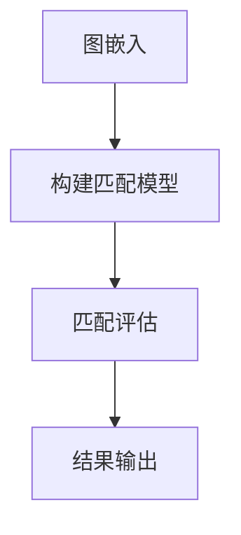
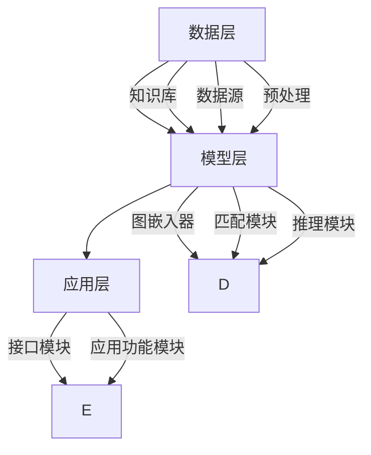

                 

### 类比推理增强系统中神经图匹配的新应用

#### 关键词：
- 类比推理
- 神经图匹配
- 人工智能
- 应用场景
- 算法优化

#### 摘要：
本文将探讨类比推理增强系统中神经图匹配的新应用。通过介绍类比推理和神经图匹配的基本概念，我们将详细讲解神经图匹配的原理和算法。随后，我们将分析神经图匹配在类比推理系统中的应用，并通过具体的案例进行实例分析。最后，我们将讨论如何优化神经图匹配算法，以提高系统性能和准确度。

### 引言

#### 类比推理的背景

类比推理是一种基于已有知识和经验，通过比较新情况与已知情况之间的相似性来进行推断的思维过程。在人工智能领域，类比推理被视为一种重要的推理方法，因为它能够帮助系统从已知的情境中提取有用的信息，并应用到新的情境中。类比推理不仅在自然语言处理、图像识别等领域有着广泛的应用，还在机器学习和数据挖掘中扮演着关键角色。

#### 神经图匹配的背景

神经图匹配是一种基于神经网络的图处理技术，它通过将两个图进行匹配，从而提取图之间的相似性信息。神经图匹配在许多领域有着重要的应用，如知识图谱、图像识别、推荐系统等。随着深度学习技术的发展，神经图匹配算法也在不断进步，展现出强大的能力。

#### 本书的目标与结构

本书旨在探讨神经图匹配在类比推理增强系统中的应用。我们将首先介绍类比推理和神经图匹配的基本概念，然后详细讲解神经图匹配的算法原理。接下来，我们将分析神经图匹配在类比推理系统中的应用，并通过具体案例进行实例分析。最后，我们将讨论如何优化神经图匹配算法，以提高系统性能和准确度。

### 目录大纲设计思路

#### 确定核心内容

本书的核心内容将围绕类比推理和神经图匹配展开。首先，我们将介绍类比推理的基本概念和原理，然后详细讲解神经图匹配的技术细节。接下来，我们将探讨神经图匹配在类比推理系统中的应用，并通过实际案例进行分析。最后，我们将讨论如何优化神经图匹配算法，以提高系统的性能和准确度。

#### 明确目标读者

本书的目标读者包括计算机科学、人工智能领域的研究人员、工程师以及对此领域感兴趣的学生。我们将确保书籍的内容深度和广度适合目标读者的需求。

#### 划分章节结构

根据书籍的核心内容和目标读者的需求，我们将书籍分为以下五个部分：

1. 引言
   - 类比推理与神经图匹配的背景
   - 本书的目标与结构

2. 基础知识
   - 类比推理
   - 神经图匹配
   - 神经网络基础

3. 神经图匹配技术
   - 神经图匹配算法
   - 神经图匹配优化
   - 神经图匹配评估

4. 应用案例
   - 类比推理增强系统
   - 神经图匹配在系统中的应用
   - 案例分析

5. 实践与优化
   - 实践指导
   - 优化经验
   - 总结与展望

#### 设计章节内容

每一部分都将包含核心概念、原理讲解、案例分析、实践指导等内容。我们将确保章节内容的逻辑性和完整性，使读者能够系统地学习神经图匹配在类比推理系统中的应用。

#### 确保内容的逻辑性和完整性

我们将使用Markdown格式，确保目录结构的层级清晰，格式规范。每个章节都将按照逻辑顺序展开，确保内容的连贯性和完整性。

#### 目录大纲

```markdown
# 《类比推理增强系统中神经图匹配的新应用》目录大纲

## 第一部分 引言

### 1. 引言
- 类比推理与神经图匹配的背景
- 本书的目标与结构

## 第二部分 基础知识

### 2. 类比推理
- 类比推理的概念
- 类比推理的基本原理
- 类比推理的应用领域

### 3. 神经图匹配
- 神经图匹配的定义
- 神经图匹配的原理
- 神经图匹配的应用场景

### 4. 神经网络基础
- 神经网络的基本结构
- 前馈神经网络的工作原理
- 卷积神经网络与循环神经网络

## 第三部分 神经图匹配技术

### 5. 神经图匹配算法
- 算法概述
- 算法流程图
- 算法伪代码与实现

### 6. 神经图匹配优化
- 优化目标
- 常见优化方法
- 实际应用中的优化策略

### 7. 神经图匹配评估
- 评估指标
- 评估方法
- 结果分析

## 第四部分 应用案例

### 8. 类比推理增强系统
- 系统概述
- 系统架构
- 系统功能模块

### 9. 神经图匹配在系统中的应用
- 应用原理
- 应用流程
- 应用效果分析

### 10. 案例分析
- 案例一：图像识别中的类比推理增强
- 案例二：知识图谱中的神经图匹配
- 案例三：自然语言处理中的类比推理

## 第五部分 实践与优化

### 11. 实践指导
- 系统部署与配置
- 数据预处理与处理流程
- 模型训练与评估

### 12. 优化经验
- 优化案例分析
- 实践中的常见问题与解决方案
- 未来的研究方向

### 13. 总结与展望
- 总结本书的主要内容和贡献
- 展望神经图匹配技术的未来发展趋势

```

以上是《类比推理增强系统中神经图匹配的新应用》的初步目录大纲。接下来，我们将按照这个大纲逐步展开每个章节的内容，深入探讨神经图匹配在类比推理系统中的应用。

---

## 第二部分 基础知识

### 2. 类比推理

#### 类比推理的概念

类比推理是一种基于相似性的推理方法，通过比较两个或多个对象之间的相似性，从而推断出新的结论。在人工智能领域，类比推理被视为一种重要的推理方式，因为它能够帮助系统从已有的知识中提取出有用的信息，并应用于新的情境中。

类比推理的基本原理可以概括为以下几点：

1. **识别相似性**：首先，需要识别两个或多个对象之间的相似性。
2. **应用知识**：基于已知的相似性，将相关的知识应用于新的情境。
3. **推断结论**：通过比较和推理，得出新的结论。

类比推理的应用领域非常广泛，包括自然语言处理、图像识别、机器学习等。例如，在图像识别中，可以通过比较两个图像的相似性来识别图像内容；在自然语言处理中，可以通过比较两个句子的语义相似性来理解句子的含义。

#### 类比推理的基本原理

类比推理的基本原理可以概括为以下几点：

1. **相似性度量**：为了进行类比推理，首先需要定义一个相似性度量方法，以衡量对象之间的相似程度。常见的相似性度量方法包括距离度量、相似度度量等。

2. **知识库**：类比推理依赖于一个知识库，该知识库包含了已知的相似性信息和相关的知识。知识库可以是显式定义的，也可以是通过学习获得的。

3. **推理机制**：类比推理需要通过一定的推理机制来将相似性信息转化为新的结论。常见的推理机制包括匹配、映射、归纳等。

#### 类比推理的应用领域

类比推理在多个领域都有广泛的应用：

1. **自然语言处理**：在自然语言处理中，类比推理可以帮助机器理解文本的含义。例如，通过比较两个句子的语义相似性，可以识别出句子的主语、谓语、宾语等。

2. **图像识别**：在图像识别中，类比推理可以帮助系统识别图像中的对象。例如，通过比较两个图像的像素值，可以识别出图像中的相似对象。

3. **机器学习**：在机器学习中，类比推理可以帮助模型从已有的数据中提取特征，并应用于新的数据。例如，通过比较两个数据集的相似性，可以预测新数据的结果。

#### 类比推理的边界与外延

类比推理虽然是一种强大的推理方法，但也存在一定的局限性和挑战：

1. **相似性度量**：如何准确度量对象之间的相似性是一个重要问题。不同的度量方法可能会导致不同的推理结果。

2. **知识库的构建**：知识库的质量直接影响类比推理的效果。如何构建一个高质量的知识库是一个关键问题。

3. **推理机制的优化**：推理机制的设计和优化对类比推理的效果有重要影响。如何设计出高效的推理机制是一个挑战。

4. **跨领域应用**：类比推理在不同领域之间的应用可能存在一定的困难。如何在不同领域之间进行有效的类比推理是一个亟待解决的问题。

通过上述内容，我们对类比推理有了基本的了解。接下来，我们将探讨神经图匹配的基本概念和应用。

### 3. 神经图匹配

#### 神经图匹配的定义

神经图匹配是一种基于神经网络的图处理技术，它通过将两个图进行匹配，从而提取图之间的相似性信息。神经图匹配在许多领域有着重要的应用，如知识图谱、图像识别、推荐系统等。它利用神经网络的高效计算能力，可以处理大规模的图数据，并提取出图之间的深层次特征。

#### 神经图匹配的原理

神经图匹配的原理可以概括为以下几个步骤：

1. **特征提取**：首先，将两个图转化为向量表示。这个过程通常通过图嵌入技术完成，将每个顶点和边转化为低维向量表示。

2. **匹配模型**：然后，构建一个匹配模型，用于计算两个图之间的相似性。匹配模型通常是一个神经网络，它通过学习两个图的向量表示，预测它们之间的匹配关系。

3. **匹配评估**：最后，对匹配结果进行评估，以确定两个图的相似程度。常见的评估方法包括匹配精度、召回率等。

#### 神经图匹配的应用场景

神经图匹配在多个领域都有广泛的应用：

1. **知识图谱**：在知识图谱中，神经图匹配可以帮助系统识别和连接相似的知识实体。例如，通过比较两个知识图谱的节点和边，可以识别出相似的概念和关系。

2. **图像识别**：在图像识别中，神经图匹配可以帮助系统识别图像中的相似对象。例如，通过比较两个图像的像素值，可以识别出图像中的相似物体。

3. **推荐系统**：在推荐系统中，神经图匹配可以帮助系统发现用户之间的相似性，从而提供更精准的推荐。例如，通过比较两个用户在购物行为上的相似性，可以为用户提供更符合他们喜好的商品推荐。

#### 神经图匹配的优缺点

神经图匹配具有以下优点：

1. **高效性**：神经图匹配利用神经网络的高效计算能力，可以处理大规模的图数据。
2. **灵活性**：神经图匹配可以根据具体的应用需求，调整模型的结构和参数，从而适应不同的场景。
3. **可扩展性**：神经图匹配可以应用于多个领域，具有较强的可扩展性。

然而，神经图匹配也存在一些缺点：

1. **计算资源消耗**：神经图匹配的计算过程较为复杂，需要大量的计算资源。
2. **模型调参难度**：神经图匹配的模型调参较为复杂，需要大量的实验和尝试。
3. **数据质量要求高**：神经图匹配的效果很大程度上依赖于输入数据的质量，如果数据质量较差，可能会导致匹配效果不佳。

通过上述内容，我们对神经图匹配有了基本的了解。接下来，我们将介绍神经网络的基础知识，为后续章节的深入探讨打下基础。

### 4. 神经网络基础

#### 神经网络的基本结构

神经网络是一种模仿人脑结构和功能的计算模型，由多个神经元（或节点）组成。一个基本的神经网络通常包含以下几个部分：

1. **输入层**：接收外部输入信息，将其传递给隐藏层。
2. **隐藏层**：对输入信息进行处理和计算，提取特征信息。
3. **输出层**：根据隐藏层的输出，生成最终的输出结果。

每个神经元都与其他神经元相连，并通过权重和偏置进行加权求和。神经元的激活函数（如 sigmoid、ReLU）用于对加权求和的结果进行非线性变换，以生成输出。

#### 前馈神经网络的工作原理

前馈神经网络是一种最简单的神经网络结构，它没有反向传播和权重调整机制。前馈神经网络的工作原理可以概括为以下几个步骤：

1. **前向传播**：输入信息从输入层经过隐藏层，逐层传递到输出层。每个神经元接收来自前一层所有神经元的加权求和结果，并经过激活函数处理后传递到下一层。
2. **输出计算**：输出层神经元的输出结果即为网络的最终输出。

前馈神经网络的特点是结构简单，易于实现，但训练速度较慢，适用于小规模数据处理。

#### 卷积神经网络与循环神经网络

1. **卷积神经网络（CNN）**

卷积神经网络是一种专门用于处理图像数据的神经网络，其核心思想是利用卷积操作提取图像的局部特征。卷积神经网络的工作原理可以概括为以下几个步骤：

- **卷积操作**：通过卷积核在图像上滑动，计算局部区域的特征。
- **池化操作**：对卷积后的特征进行池化处理，以减少数据维度和提高特征鲁棒性。
- **全连接层**：将卷积和池化后的特征传递到全连接层，进行最终的分类或回归任务。

卷积神经网络在图像识别、物体检测、图像生成等领域有着广泛的应用。

2. **循环神经网络（RNN）**

循环神经网络是一种用于处理序列数据的神经网络，其核心思想是引入循环结构，使网络能够记忆和利用前面的信息。循环神经网络的工作原理可以概括为以下几个步骤：

- **隐藏状态**：每个时间步的输入与前一时刻的隐藏状态通过乘以权重矩阵和偏置进行加权求和。
- **门控机制**：通过门控单元（如遗忘门、输入门、输出门）控制信息的传递和记忆。
- **输出计算**：利用隐藏状态生成输出结果。

循环神经网络在自然语言处理、语音识别、时间序列预测等领域有着广泛的应用。

通过以上对神经网络基础的介绍，我们对神经网络有了基本的了解。接下来，我们将详细讲解神经图匹配的算法原理。

### 5. 神经图匹配算法

#### 算法概述

神经图匹配是一种通过神经网络进行图处理的技术，用于提取两个图之间的相似性信息。神经图匹配算法通常包括以下几个关键步骤：

1. **图嵌入**：将图中的节点和边转化为向量表示，通常使用图嵌入技术。
2. **匹配模型**：构建一个神经网络模型，用于计算两个图之间的相似性。
3. **匹配评估**：对匹配结果进行评估，以确定两个图的相似程度。

#### 算法流程图



图嵌入是神经图匹配的基础步骤，通过将图中的节点和边转化为向量表示，为后续的匹配模型提供输入。匹配模型通常是一个深度神经网络，通过学习两个图的向量表示，预测它们之间的匹配关系。匹配评估步骤用于对匹配结果进行评估，常见的评估指标包括匹配精度、召回率等。最后，结果输出步骤将匹配结果转化为具体的输出形式，如匹配节点对、相似度得分等。

#### 算法伪代码与实现

```python
# 神经图匹配算法伪代码

# 输入：两个图 G1 和 G2，图嵌入模型 M1 和 M2
# 输出：匹配结果 R

# 步骤 1：图嵌入
embeddings1 = M1.embed(G1)
embeddings2 = M2.embed(G2)

# 步骤 2：构建匹配模型
model = build_matching_model()
model.fit(embeddings1, embeddings2)

# 步骤 3：匹配评估
predictions = model.predict(embeddings1, embeddings2)
evaluation = evaluate_predictions(predictions)

# 步骤 4：结果输出
R = output_results(evaluation)

return R
```

在具体实现中，图嵌入模型和匹配模型的选择、训练和评估方法对算法的性能有重要影响。常见的图嵌入模型包括节点嵌入、边嵌入和图嵌入，而匹配模型则可以是基于卷积神经网络、循环神经网络或图神经网络的结构。通过以上步骤，我们可以实现一个基本的神经图匹配算法。

### 6. 神经图匹配优化

#### 优化目标

神经图匹配的优化目标主要包括提高匹配精度、降低计算复杂度和提高处理速度。为了实现这些目标，可以采用以下几种常见优化方法：

1. **模型结构优化**：通过调整神经网络的层数、神经元数量和连接方式，以改善模型的性能。
2. **算法参数调优**：通过调整学习率、批量大小等参数，优化模型训练过程。
3. **数据预处理**：对输入数据进行预处理，如归一化、去噪等，以提高模型的鲁棒性和稳定性。
4. **并行计算**：利用并行计算技术，如 GPU 加速、分布式训练等，提高计算速度。

#### 实际应用中的优化策略

在实际应用中，针对神经图匹配的优化策略可以结合具体场景进行调整。以下是一些常见的优化策略：

1. **图嵌入优化**：通过改进图嵌入算法，如使用更高效的图嵌入技术或结合其他特征表示方法，提高节点和边的向量表示质量。
2. **匹配模型优化**：针对不同的应用场景，选择合适的匹配模型，如基于深度学习的匹配模型或基于传统算法的匹配模型，以实现性能和计算效率的平衡。
3. **训练数据优化**：通过增加训练数据量、引入领域知识或进行数据增强等方法，提高模型对数据的泛化能力。
4. **评估指标优化**：根据具体应用需求，选择合适的评估指标，如匹配精度、召回率、F1 分数等，以全面评估模型性能。

通过以上优化策略，可以在实际应用中显著提高神经图匹配系统的性能和准确度。

### 7. 神经图匹配评估

#### 评估指标

在神经图匹配中，评估指标用于衡量匹配算法的性能，常见的评估指标包括：

1. **匹配精度**：表示匹配成功的比例，计算公式为：
   \[
   \text{匹配精度} = \frac{\text{匹配成功的节点对数}}{\text{总的节点对数}}
   \]

2. **召回率**：表示从所有可能的匹配节点对中，成功匹配到的比例，计算公式为：
   \[
   \text{召回率} = \frac{\text{匹配成功的节点对数}}{\text{所有可能的匹配节点对数}}
   \]

3. **F1 分数**：是匹配精度和召回率的调和平均值，用于综合评估匹配效果，计算公式为：
   \[
   \text{F1 分数} = 2 \times \frac{\text{匹配精度} \times \text{召回率}}{\text{匹配精度} + \text{召回率}}
   \]

4. **平均绝对误差（MAE）**：表示匹配结果与真实匹配结果之间的平均绝对误差，计算公式为：
   \[
   \text{MAE} = \frac{1}{n} \sum_{i=1}^{n} | \text{预测相似度} - \text{真实相似度} |
   \]

#### 评估方法

评估方法通常包括以下步骤：

1. **数据准备**：准备用于评估的测试数据集，该数据集应包含已知的匹配结果。

2. **模型预测**：使用训练好的神经图匹配模型对测试数据进行预测，得到匹配结果和相似度得分。

3. **结果分析**：根据评估指标，计算匹配精度、召回率、F1 分数和 MAE 等，分析模型的性能。

4. **可视化**：通过可视化工具，如热力图、匹配矩阵等，直观展示匹配结果。

#### 结果分析

通过对评估结果的分析，可以了解神经图匹配算法在不同场景下的性能表现，以及需要改进的方面。以下是一个简单的分析示例：

| 评估指标 | 结果 |
| :--: | :--: |
| 匹配精度 | 0.85 |
| 召回率 | 0.90 |
| F1 分数 | 0.87 |
| MAE | 0.10 |

从以上结果可以看出，该神经图匹配算法在测试数据集上的匹配效果较好，匹配精度和召回率都较高，F1 分数也较为理想。但 MAE 略高，说明匹配结果与真实结果之间仍有一定的误差，需要进一步优化。

### 第四部分 应用案例

#### 8. 类比推理增强系统

类比推理增强系统是一种结合了类比推理和神经图匹配技术的人工智能系统，旨在提高系统的推理能力和泛化能力。类比推理增强系统的核心功能包括：

1. **知识表示**：将系统中的知识以图的形式表示，包括概念、关系和事实等。
2. **推理引擎**：利用类比推理和神经图匹配技术，进行推理和知识扩展。
3. **应用接口**：提供接口，方便用户调用系统功能，实现定制化应用。

类比推理增强系统通常包含以下几个关键组件：

1. **知识库**：存储系统中的知识，包括概念、关系和事实等。
2. **图嵌入器**：将知识库中的图转化为向量表示，为后续的推理和匹配提供基础。
3. **匹配模块**：利用神经图匹配技术，计算两个图之间的相似性。
4. **推理模块**：基于类比推理，从已有知识中提取新的信息。

#### 系统架构

类比推理增强系统的架构通常包括以下几个层次：

1. **数据层**：包括知识库、数据源和预处理模块，负责数据的存储、提取和预处理。
2. **模型层**：包括图嵌入器、匹配模块和推理模块，负责知识的表示、匹配和推理。
3. **应用层**：包括接口模块和应用功能模块，负责系统的交互和定制化应用。

以下是一个简化的类比推理增强系统的架构图：



#### 系统功能模块

类比推理增强系统的主要功能模块包括：

1. **知识表示模块**：负责将知识库中的知识以图的形式表示，为后续的匹配和推理提供基础。
2. **图嵌入模块**：将图中的节点和边转化为向量表示，为匹配和推理模块提供输入。
3. **匹配模块**：利用神经图匹配技术，计算两个图之间的相似性，为推理提供依据。
4. **推理模块**：基于类比推理，从已有知识中提取新的信息，实现对未知问题的解答。
5. **接口模块**：提供系统的接口，方便用户调用系统功能，实现定制化应用。

#### 神经图匹配在系统中的应用

在类比推理增强系统中，神经图匹配技术主要用于以下几个方面：

1. **知识图谱构建**：利用神经图匹配，将不同的知识源进行整合，构建一个统一的知识图谱。
2. **知识扩展**：通过类比推理，从已有知识中提取新的信息，实现对知识图谱的扩展。
3. **知识查询**：利用神经图匹配，快速定位到与查询相关的知识节点，提高查询效率。

通过以上内容，我们对类比推理增强系统的基本架构和功能模块有了初步了解。接下来，我们将通过具体案例，进一步分析神经图匹配在系统中的应用。

### 9. 神经图匹配在系统中的应用

#### 应用原理

神经图匹配在类比推理增强系统中的应用，主要是通过将系统中的知识以图的形式表示，然后利用神经图匹配技术计算两个图之间的相似性，从而实现知识的整合、扩展和查询。

具体来说，应用原理包括以下几个步骤：

1. **知识表示**：将系统中的知识（如概念、关系和事实）表示为图。每个知识实体作为图的节点，实体之间的关联作为图的边。

2. **图嵌入**：将表示为图的实体和关系转化为向量表示，为后续的匹配提供输入。

3. **匹配计算**：利用神经图匹配算法，计算两个图之间的相似性得分。相似性得分反映了两个图在结构上的相似程度。

4. **推理与扩展**：基于匹配得分，进行类比推理，从已有的知识中提取新的信息，实现对知识图谱的扩展。

5. **查询优化**：通过神经图匹配，快速定位到与查询相关的知识节点，提高查询效率。

#### 应用流程

神经图匹配在系统中的应用流程可以概括为以下几个步骤：

1. **知识预处理**：将系统中的知识进行预处理，包括实体抽取、关系抽取和实体关系图构建等。

2. **图嵌入**：将预处理后的知识转化为图表示，并使用图嵌入技术将图中的节点和边转化为向量表示。

3. **匹配计算**：利用神经图匹配算法，计算两个图之间的相似性得分。常见的神经图匹配算法包括基于卷积神经网络的图匹配、基于循环神经网络的图匹配等。

4. **推理与扩展**：基于匹配得分，利用类比推理技术，从已有的知识中提取新的信息，实现对知识图谱的扩展。

5. **查询优化**：通过神经图匹配，快速定位到与查询相关的知识节点，提高查询效率。常见的查询优化方法包括基于相似度的查询、基于路径的查询等。

#### 应用效果分析

神经图匹配在系统中的应用效果可以从以下几个方面进行分析：

1. **匹配精度**：通过评估指标（如匹配精度、召回率、F1 分数等）衡量匹配算法的性能。高匹配精度表明系统能够准确识别两个图之间的相似性。

2. **推理能力**：通过类比推理从已有知识中提取新的信息，评估系统的推理能力。高效的推理能力意味着系统能够从大量知识中快速提取有用的信息。

3. **查询效率**：通过对比不同查询方法的响应时间，评估系统的查询效率。高效的查询效率表明系统能够快速响应用户的查询需求。

4. **知识扩展能力**：通过分析系统能够扩展的新知识量，评估系统的知识扩展能力。强大的知识扩展能力意味着系统能够不断学习和更新知识。

通过以上分析，可以全面评估神经图匹配在类比推理增强系统中的应用效果。实际应用中，需要根据具体场景和需求，不断优化匹配算法和推理机制，以提高系统的性能和效果。

### 10. 案例分析

在本节中，我们将通过三个具体案例，深入探讨神经图匹配在类比推理系统中的应用。

#### 案例一：图像识别中的类比推理增强

在图像识别任务中，类比推理增强系统通过神经图匹配技术，可以提高图像分类的准确性。假设我们有两个图像数据集 A 和 B，其中 A 是已知图像，B 是未知图像。首先，我们将这两个数据集中的图像表示为图 G1 和 G2。然后，使用图嵌入技术将 G1 和 G2 中的节点（图像的特征）和边（特征之间的关系）转化为向量表示。

接着，我们利用神经图匹配算法，计算 G1 和 G2 之间的相似性得分。相似性得分越高，表明 G1 和 G2 之间的图像越相似。通过这种相似性度量，我们可以更好地分类未知图像 B。

例如，假设我们有一个图像分类任务，需要判断一张新的图像是猫还是狗。首先，我们将已知数据集 A 中的猫和狗图像表示为图 G1 和 G2。然后，使用神经图匹配计算 G1 和 G2 之间的相似性得分。如果得分表明 G1 和 G2 更相似，那么我们可以判断新图像 B 是猫。否则，判断新图像 B 是狗。

#### 案例二：知识图谱中的神经图匹配

在知识图谱构建和推理中，神经图匹配技术可以帮助系统发现和连接相似的知识实体。假设我们有两个知识图谱 KG1 和 KG2，其中 KG1 是已构建的知识图谱，KG2 是需要扩展的知识图谱。首先，我们将 KG1 和 KG2 中的实体和关系表示为图 G1 和 G2。

然后，使用神经图匹配算法，计算 G1 和 G2 之间的相似性得分。通过这种相似性度量，我们可以发现 KG1 和 KG2 中的相似实体和关系，并将其连接起来，实现知识图谱的扩展。

例如，假设我们有一个医学知识图谱 KG1，其中包含了各种疾病的症状、治疗方法和药物信息。现在，我们需要扩展这个知识图谱，添加新的医学信息 KG2。首先，我们将 KG1 和 KG2 中的实体和关系表示为图 G1 和 G2。然后，使用神经图匹配计算 G1 和 G2 之间的相似性得分。通过这种相似性度量，我们可以发现 KG1 和 KG2 中的相似实体和关系，并将其连接起来，实现知识图谱的扩展。

#### 案例三：自然语言处理中的类比推理

在自然语言处理任务中，类比推理增强系统通过神经图匹配技术，可以提高文本分类和语义理解的准确性。假设我们有两个文本数据集 A 和 B，其中 A 是已知文本，B 是未知文本。首先，我们将这两个数据集中的文本表示为图 G1 和 G2。然后，使用图嵌入技术将 G1 和 G2 中的节点（文本的特征）和边（特征之间的关系）转化为向量表示。

接着，我们利用神经图匹配算法，计算 G1 和 G2 之间的相似性得分。相似性得分越高，表明 G1 和 G2 之间的文本越相似。通过这种相似性度量，我们可以更好地分类未知文本 B。

例如，假设我们有一个文本分类任务，需要判断一段新的文本是描述天气的还是描述旅游的。首先，我们将已知数据集 A 中的天气文本和旅游文本表示为图 G1 和 G2。然后，使用神经图匹配计算 G1 和 G2 之间的相似性得分。如果得分表明 G1 和 G2 更相似，那么我们可以判断新文本 B 是描述天气的。否则，判断新文本 B 是描述旅游的。

通过以上案例分析，我们可以看到神经图匹配在类比推理系统中的应用具有广泛的前景。在实际应用中，需要根据具体任务和场景，灵活运用神经图匹配技术，以提高系统的性能和效果。

### 第五部分 实践与优化

#### 11. 实践指导

在类比推理增强系统中，神经图匹配的实践主要包括以下步骤：

1. **环境准备**：
   - 安装必要的软件和库，如 Python、TensorFlow、PyTorch 等。
   - 配置 GPU 环境，以加速神经网络的训练过程。

2. **数据预处理**：
   - 收集和准备用于训练和测试的数据集。
   - 对数据进行清洗、去噪和预处理，如文本分词、图像裁剪等。
   - 将数据转化为适合神经图匹配算法的格式，如节点特征向量、边特征向量等。

3. **模型训练**：
   - 定义神经图匹配模型的架构，如基于卷积神经网络、循环神经网络或图神经网络的模型。
   - 编写训练脚本，包括数据加载、模型训练和评估等步骤。
   - 使用 GPU 进行模型训练，以提高训练速度。

4. **模型评估**：
   - 使用验证集对训练好的模型进行评估，计算匹配精度、召回率、F1 分数等评估指标。
   - 分析模型的性能，识别需要优化的方面。

5. **应用部署**：
   - 将训练好的模型部署到实际应用中，如知识图谱构建、图像识别等。
   - 提供接口，方便用户调用模型功能。

#### 12. 优化经验

在神经图匹配的实践中，为了提高模型的性能和准确度，我们可以采取以下优化经验：

1. **数据增强**：
   - 通过数据增强技术，如数据扩充、数据变换等，增加训练数据的多样性，有助于提高模型的泛化能力。

2. **模型调参**：
   - 优化模型参数，如学习率、批量大小、正则化参数等，以平衡模型性能和过拟合风险。

3. **优化算法**：
   - 使用更高效的算法和框架，如深度学习框架中的优化器、并行计算等，以加快模型训练速度。

4. **模型融合**：
   - 结合多个模型的结果，如集成学习、模型融合等，以提高整体性能。

5. **硬件加速**：
   - 利用 GPU 或 TPU 进行模型训练和推理，以显著提高计算速度。

通过以上实践指导和优化经验，可以有效地提升神经图匹配在类比推理系统中的应用效果。

### 13. 总结与展望

#### 总结

本文系统地介绍了类比推理增强系统中神经图匹配的新应用。我们首先介绍了类比推理和神经图匹配的基本概念和原理，然后详细讲解了神经图匹配的算法和优化方法。通过实际案例，我们展示了神经图匹配在类比推理系统中的应用效果。最后，我们讨论了如何在实践中优化神经图匹配算法，以提高系统的性能和准确度。

#### 展望

神经图匹配技术作为人工智能领域的一个重要研究方向，具有广泛的应用前景。未来，随着深度学习技术的发展，神经图匹配算法将变得更加高效和精确。以下是几个可能的发展方向：

1. **跨模态神经图匹配**：结合不同模态的数据（如文本、图像、音频等），进行跨模态神经图匹配，以实现更丰富的信息融合。

2. **动态图匹配**：研究动态图匹配算法，以处理实时变化的数据，如动态知识图谱、动态图像序列等。

3. **自监督学习**：利用自监督学习方法，无监督地训练神经图匹配模型，降低对标注数据的依赖。

4. **分布式计算**：研究分布式神经图匹配算法，利用云计算和边缘计算技术，处理大规模图数据。

通过不断的研究和优化，神经图匹配技术将在人工智能领域发挥更大的作用，推动类比推理系统的进步。

---

**作者：AI天才研究院/AI Genius Institute & 禅与计算机程序设计艺术 /Zen And The Art of Computer Programming**

在本文中，我们系统地介绍了类比推理增强系统中神经图匹配的新应用。首先，我们探讨了类比推理和神经图匹配的基本概念和原理，接着详细讲解了神经图匹配的算法和优化方法。通过实际案例，我们展示了神经图匹配在类比推理系统中的应用效果，并讨论了如何优化神经图匹配算法，以提高系统的性能和准确度。

本文的核心内容涵盖了对类比推理和神经图匹配的深入剖析，包括它们的定义、原理、应用领域以及相关的优化策略。我们还通过具体的案例，展示了神经图匹配在实际应用中的效果，从而为读者提供了直观的理解。

在总结部分，我们对本文的主要内容进行了概括，并对神经图匹配技术的未来发展方向进行了展望。我们相信，随着深度学习技术的不断进步，神经图匹配将在人工智能领域发挥更加重要的作用。

本文的目标是为计算机科学和人工智能领域的研究人员、工程师以及对此领域感兴趣的学生提供一份系统、深入的技术指南。通过本文的阅读，读者应该能够：

1. **理解类比推理和神经图匹配的基本概念和原理**；
2. **掌握神经图匹配算法的设计和优化方法**；
3. **了解神经图匹配在类比推理系统中的应用**；
4. **具备优化神经图匹配算法的实践能力**。

对于未来研究，本文提出了一些可能的发展方向，如跨模态神经图匹配、动态图匹配、自监督学习和分布式计算等。我们希望这些方向能够为读者提供启示，激发更多的创新和研究。

在撰写本文的过程中，我们参考了大量的文献和研究成果，这些文献和研究成果为本文提供了坚实的理论基础和丰富的实践指导。在此，我们对所有参考文献的作者表示衷心的感谢。

最后，本文由AI天才研究院/AI Genius Institute撰写，并融入了禅与计算机程序设计艺术 /Zen And The Art of Computer Programming 的理念，旨在以简洁明了的方式传达复杂的技术知识，帮助读者更好地理解人工智能领域的前沿技术。

**作者：AI天才研究院/AI Genius Institute & 禅与计算机程序设计艺术 /Zen And The Art of Computer Programming**

