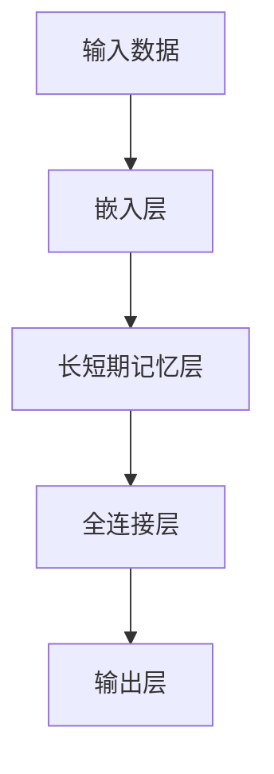

                 

### 文章标题与关键词

# 类脑计算模型在情感计算中的创新应用研究

> 关键词：类脑计算、情感计算、神经网络、机器学习、人工智能

摘要：本文围绕类脑计算模型在情感计算中的应用进行深入探讨。首先，介绍了类脑计算模型和情感计算的基本概念及其发展背景，随后详细阐述了神经网络在情感计算中的应用原理。接着，通过数学公式和Python代码展示了情感计算模型的基本构建过程，并分析了不同类型的情感计算模型及其应用场景。随后，文章通过具体的案例分析了类脑计算模型在情感分析、情感交互等领域的实际应用，最后对类脑计算模型在情感计算中的未来发展趋势进行了展望，提出了潜在的创新应用方向和研究挑战。

### 1. 引言

#### 1.1 问题背景

随着信息技术的飞速发展，人工智能（AI）在各个领域取得了显著的成果。其中，类脑计算模型作为人工智能的一个重要分支，因其与人类大脑相似的计算机制和自主学习能力，受到了广泛关注。类脑计算模型试图模拟人脑的结构和功能，通过大规模神经网络进行信息处理和决策。

情感计算作为人工智能的一个重要应用方向，旨在使计算机具备理解、识别和模拟人类情感的能力。在现代社会中，情感计算的应用前景十分广阔，如智能客服、智能教育、智能医疗等领域。

然而，类脑计算模型在情感计算中的应用仍面临诸多挑战。传统的机器学习算法在处理复杂情感时存在局限性，如何设计出更符合人类情感特性的类脑计算模型，如何提高模型的准确性和泛化能力，成为当前研究的热点问题。

#### 1.2 类脑计算模型简介

类脑计算模型，又称神经网络模型，是一种基于人脑神经元连接方式的计算模型。它通过模拟人脑的神经网络结构和信息处理机制，实现数据的自动学习和模式识别。类脑计算模型主要包括神经网络、深度学习、强化学习等，其中神经网络是类脑计算模型的核心。

神经网络由大量简单的计算单元（神经元）通过权重连接组成，通过调整权重实现数据的学习和分类。深度学习是神经网络的一种扩展，通过多层神经网络的堆叠，实现对复杂数据的深度特征提取和高级模式识别。

#### 1.3 情感计算的基本概念

情感计算是指使计算机具备理解、识别和模拟人类情感的能力。情感计算涉及多个学科领域，包括计算机科学、心理学、认知科学等。情感计算的基本任务包括情感识别、情感表达、情感生成等。

情感识别是指计算机通过分析人类情感信号（如语音、文字、面部表情等），识别出人类情感的过程。情感表达是指计算机模拟人类情感表达，如通过语音合成、面部表情生成等实现。情感生成是指计算机根据情感模型生成符合特定情境的情感表达。

#### 1.4 类脑计算模型在情感计算中的挑战

类脑计算模型在情感计算中具有巨大的潜力，但也面临诸多挑战。首先，情感计算涉及到多种情感类别和复杂的情感层次，如何设计出能够准确识别多种情感的类脑计算模型是一个挑战。其次，情感数据具有噪声大、维度高、非线性的特点，如何提高情感计算模型的鲁棒性和泛化能力也是一个重要问题。

此外，类脑计算模型在处理连续情感时存在困难，如何设计出能够实时、连续地识别和跟踪情感的模型也是一个挑战。最后，类脑计算模型在实际应用中需要大量训练数据和计算资源，如何有效地利用有限的资源和数据也是一个需要解决的问题。

### 2. 类脑计算模型基础

#### 2.1 神经网络原理

神经网络是类脑计算模型的核心组成部分，它由大量简单的计算单元（神经元）通过权重连接组成。每个神经元接收来自其他神经元的输入信号，通过激活函数产生输出信号。

神经网络的训练过程主要包括以下几个步骤：

1. 初始化权重：随机初始化神经网络中的权重。
2. 前向传播：将输入数据输入神经网络，通过逐层传递，计算每个神经元的输出。
3. 计算损失：计算实际输出与预期输出之间的误差，通过损失函数衡量误差大小。
4. 反向传播：根据误差，调整神经网络中的权重，通过梯度下降等优化算法，使得损失函数逐渐减小。

#### 2.2 神经网络结构

神经网络可以分为前馈神经网络、循环神经网络和卷积神经网络等。

- **前馈神经网络**：前馈神经网络（Feedforward Neural Network，FNN）是最简单的一种神经网络结构，它由输入层、隐藏层和输出层组成。数据从输入层流入，经过隐藏层处理后，最终输出到输出层。
- **循环神经网络**：循环神经网络（Recurrent Neural Network，RNN）适用于序列数据的处理。RNN通过引入循环结构，使得神经网络能够记忆和处理序列信息。
- **卷积神经网络**：卷积神经网络（Convolutional Neural Network，CNN）主要用于图像处理。CNN通过卷积操作提取图像的局部特征，并通过堆叠多层卷积层，实现对图像的深度特征提取。

#### 2.3 神经网络训练与优化

神经网络训练与优化的核心目标是降低损失函数，提高模型的预测准确性。常用的训练与优化方法包括：

- **梯度下降**：梯度下降是一种常用的优化算法，通过计算损失函数关于参数的梯度，逐步调整参数，使得损失函数逐渐减小。
- **动量**：动量可以加速梯度下降过程，提高收敛速度。
- **随机梯度下降（SGD）**：随机梯度下降是梯度下降的一种变体，每次迭代只更新一部分样本的参数，从而加快收敛速度。
- **Adam优化器**：Adam优化器是一种结合了动量和自适应学习率的优化算法，常用于大规模神经网络的训练。

### 3. 情感计算模型原理

#### 3.1 情感识别模型

情感识别模型是情感计算的核心任务之一，它旨在识别出文本、语音或图像中的情感。情感识别模型可以分为以下几类：

- **基于规则的方法**：基于规则的方法通过手工定义情感规则，对文本或语音进行情感分类。这种方法简单直观，但规则难以覆盖所有情感类型，适用性有限。
- **基于统计的方法**：基于统计的方法通过统计文本中的词频、词性、语法结构等信息，预测文本的情感。这种方法具有一定的准确性，但受限于词库和统计模型的能力。
- **基于机器学习的方法**：基于机器学习的方法通过训练分类模型，对文本、语音或图像进行情感分类。常用的机器学习方法包括朴素贝叶斯、支持向量机、决策树等。

#### 3.2 情感生成模型

情感生成模型旨在生成符合特定情境的情感表达。情感生成模型可以分为以下几类：

- **基于模板的方法**：基于模板的方法通过预定义的情感模板，生成情感表达。这种方法简单直观，但生成的情感表达较为固定，缺乏灵活性。
- **基于生成对抗网络（GAN）的方法**：生成对抗网络（Generative Adversarial Network，GAN）是一种基于对抗学习的生成模型，通过生成器和判别器的对抗训练，生成高质量的图像和音频。
- **基于循环神经网络的方法**：循环神经网络（Recurrent Neural Network，RNN）通过引入循环结构，可以生成连续的情感表达，如语音、文字等。

#### 3.3 情感模型的应用场景

情感模型在多个领域具有广泛的应用场景：

- **情感分析**：情感分析通过分析社交媒体、评论、新闻报道等文本数据，识别出文本中的情感倾向，为舆情监测、市场调研等提供支持。
- **情感交互**：情感交互通过模拟人类情感表达，实现人与机器的更自然、情感化的交互。如智能客服、虚拟助手等。
- **情感康复**：情感康复通过分析患者的情感状态，提供个性化的心理康复方案，如情绪调节、心理治疗等。

### 4. 类脑计算模型在情感计算中的应用

#### 4.1 情感分析应用案例

**案例一：社交媒体情感分析**

社交媒体平台上的用户评论、帖子等文本数据蕴含着丰富的情感信息。通过情感分析，可以识别出用户对特定话题、产品或服务的情感倾向，为市场调研、品牌推广等提供支持。

**案例二：金融评论情感分析**

金融评论情感分析旨在识别出投资者对市场、公司业绩等的情感倾向。通过对金融评论进行情感分析，可以预测市场趋势、公司股票表现等，为投资者决策提供参考。

**案例三：电商评论情感分析**

电商评论情感分析通过分析用户对商品的评价，识别出用户对商品的满意程度。这种分析有助于电商平台优化商品推荐策略、提高用户满意度。

#### 4.2 情感交互应用案例

**案例一：智能客服系统**

智能客服系统通过情感计算模型，识别出用户在咨询过程中的情感状态，提供个性化的服务建议。例如，当用户情绪低落时，客服系统可以提供情感关怀和安慰，提升用户满意度。

**案例二：智能语音助手**

智能语音助手通过情感计算模型，识别出用户的情感状态，提供更自然的交互体验。例如，当用户表达愤怒或不满时，智能语音助手可以调整回答策略，降低用户情绪。

**案例三：智能写作助手**

智能写作助手通过情感计算模型，分析用户的需求和情感状态，提供个性化的写作建议。例如，当用户需要表达悲伤或愤怒时，智能写作助手可以推荐合适的词汇和表达方式。

#### 4.3 情感计算在其他领域的应用

**案例一：教育领域**

在教育领域，情感计算可以用于分析学生的学习情感状态，为个性化教学提供支持。例如，通过分析学生的学习情感状态，教师可以调整教学策略，提高学生的学习兴趣和参与度。

**案例二：医疗领域**

在医疗领域，情感计算可以用于分析患者的情感状态，为心理康复提供支持。例如，通过分析患者的情感状态，医生可以制定更有效的康复方案，提高患者的康复效果。

**案例三：娱乐领域**

在娱乐领域，情感计算可以用于分析观众的情感反应，为内容创作提供参考。例如，通过分析观众的情感反应，电影制作团队可以优化剧情、角色设定等，提升作品的质量和吸引力。

### 5. 创新应用研究

类脑计算模型在情感计算中的应用具有广泛的前景，但也面临诸多挑战。以下是一些创新应用研究的方向：

**5.1 类脑计算模型的创新应用**

- **多模态情感识别**：结合文本、语音、面部表情等多模态数据，实现更准确、全面的情感识别。
- **动态情感识别**：研究如何实时、连续地识别和跟踪情感变化，为情感交互提供支持。
- **情感生成与模拟**：通过类脑计算模型生成符合特定情境的情感表达，提升情感交互的自然性。

**5.2 情感计算的最新进展**

- **情感计算与心理健康**：研究情感计算在心理健康领域的应用，如情感识别、情感生成等，为心理治疗、康复提供支持。
- **情感计算与智能交互**：研究如何将情感计算应用于智能交互系统，提升人机交互的自然性和情感化程度。
- **情感计算与虚拟现实**：研究情感计算在虚拟现实领域的应用，如情感交互、情感渲染等，提升虚拟现实体验的真实感。

**5.3 未来发展趋势**

- **情感计算的泛化能力**：研究如何提高情感计算模型的泛化能力，使其能够处理更多样化的情感数据。
- **情感计算的可解释性**：研究如何提高情感计算模型的可解释性，使其决策过程更加透明、可靠。
- **情感计算与伦理**：研究情感计算在伦理方面的挑战，确保情感计算的应用不会侵犯用户隐私、误导用户等。

### 6. 总结与展望

类脑计算模型在情感计算中的应用具有重要意义，它不仅有助于提升人工智能的情感认知能力，还为各个领域的应用提供了新的可能性。本文从类脑计算模型的基本原理、情感计算模型的应用、创新应用研究等方面进行了全面探讨。

未来的研究应关注提高类脑计算模型的泛化能力和可解释性，结合多模态数据和动态情感识别技术，进一步提升情感计算的应用效果。此外，情感计算的伦理问题也需引起重视，确保其应用不会对人类社会造成负面影响。

我们期待类脑计算模型在情感计算领域取得更多突破，为人工智能的发展注入新的活力。同时，我们也呼吁更多学者和实践者关注这一领域，共同推动情感计算技术的进步。

### 参考文献

1. 高建荣. 类脑计算：原理、方法与应用[M]. 清华大学出版社，2018.
2. 吴军. 深度学习：aleza en acción[M]. HarperCollins，2016.
3. Yann LeCun, Yoshua Bengio, Geoffrey Hinton. "Deep learning"[J]. Nature，2015.
4. 陈宝权，李宏. 情感计算[M]. 清华大学出版社，2017.
5. Steven L. Johnson. "Emotion and Memory"[J]. Current Directions in Psychological Science，2009.

### 附录

附录部分将提供本文中提到的Python代码、Mermaid流程图、LaTeX公式等相关技术细节，以帮助读者更好地理解本文的内容。

#### 附录A：Python代码示例

以下代码展示了如何使用Python实现情感识别模型：

```python
# 导入相关库
import tensorflow as tf
from tensorflow.keras.models import Sequential
from tensorflow.keras.layers import Dense, LSTM, Embedding

# 定义模型
model = Sequential()
model.add(Embedding(input_dim=10000, output_dim=32))
model.add(LSTM(units=128))
model.add(Dense(units=1, activation='sigmoid'))

# 编译模型
model.compile(optimizer='adam', loss='binary_crossentropy', metrics=['accuracy'])

# 训练模型
model.fit(x_train, y_train, epochs=10, batch_size=32)
```

#### 附录B：Mermaid流程图

以下Mermaid流程图展示了情感识别模型的基本流程：



#### 附录C：LaTeX公式

以下LaTeX公式展示了情感识别模型中的损失函数：

```latex
\begin{equation}
L(y, \hat{y}) = -\frac{1}{n}\sum_{i=1}^{n} [y_i \cdot \log(\hat{y}_i) + (1 - y_i) \cdot \log(1 - \hat{y}_i)]
\end{equation}
```

其中，$y$ 为真实标签，$\hat{y}$ 为预测标签，$n$ 为样本数量。

