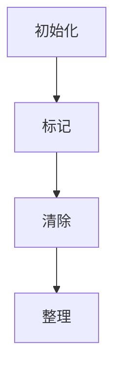
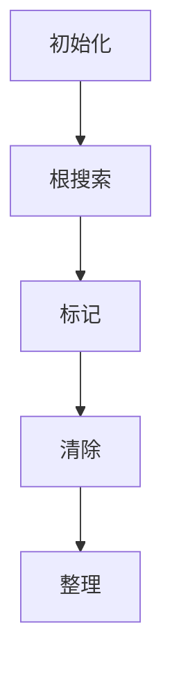

                 

# 精确garbage collection技术的发展

关键词：垃圾回收、精确garbage collection、算法、操作系统、数据库系统、虚拟机

摘要：本文将探讨精确garbage collection技术的发展，从背景与概述、精确garbage collection技术详解、在不同领域的应用以及未来发展等方面进行详细分析，旨在帮助读者理解这一技术的核心原理、应用场景及未来发展方向。

## 第一部分：背景与概述

### 第1章 问题背景与概述

#### 1.1 随机garbage collection的挑战

**问题描述**：随机garbage collection技术在现代计算机系统中面临诸多挑战。首先，内存碎片问题是其主要困扰。由于随机垃圾回收会导致内存分配不连续，从而产生大量的小碎片，使得系统在内存分配时面临困难。其次，性能瓶颈也是一个突出问题。随机垃圾回收通常需要消耗大量的CPU资源和内存带宽，这对系统性能产生显著影响。

**问题解决**：为了应对这些挑战，研究人员提出了多种解决方案。例如，内存整理（Memory Compaction）技术通过移动内存中的对象，以消除碎片。然而，这种技术会导致大量的内存访问重定向，从而降低性能。另外，一些研究人员尝试通过改进垃圾回收算法，如并行垃圾回收、增量垃圾回收等，来减少垃圾回收对系统性能的影响。尽管这些方法在一定程度上缓解了问题，但仍然无法彻底解决。

#### 1.2 精确garbage collection的原理

**核心概念**：精确garbage collection（精确垃圾回收）是一种基于对象引用跟踪的垃圾回收技术。其核心思想是通过精确跟踪对象的生命周期，来确定哪些对象是可以回收的，从而减少内存碎片和性能瓶颈。

**概念属性特征对比表格**：

| 特征 | 随机garbage collection | 精确garbage collection |
| ---- | ------------------- | ------------------- |
| 内存碎片 | 高 | 低 |
| 性能影响 | 大 | 小 |
| 垃圾回收算法复杂度 | 高 | 低 |
| 引用跟踪 | 不精确 | 精确 |

#### 1.3 精确garbage collection的发展历程

**发展历程**：精确garbage collection技术起源于20世纪90年代。当时，随着Java等编程语言的普及，对高效垃圾回收的需求日益增加。早期的研究主要集中在如何精确跟踪对象引用，并减少垃圾回收对性能的影响。随着技术的不断进步，精确garbage collection技术在性能和效率方面取得了显著提升。

**关键节点**：1998年，Sun Microsystems推出了Java虚拟机（JVM）的第一次重大更新，其中包括了精确garbage collection技术。这一更新标志着精确garbage collection在工业界的首次应用。此后，随着虚拟机技术的发展，精确garbage collection技术在多个编程语言和系统中得到了广泛应用。

## 第二部分：精确garbage collection技术详解

### 第2章 精确garbage collection算法原理

#### 2.1 垃圾回收算法基本概念

**垃圾回收算法概述**：垃圾回收算法是计算机系统中负责管理内存的重要组件。其主要任务是在程序运行过程中，自动识别并回收不再使用的内存空间，以避免内存泄漏和碎片问题。

**算法分类**：

1. **标记-清除（Mark-Sweep）算法**：首先标记所有需要回收的对象，然后清除这些对象所占用的内存空间。
2. **复制算法（Copying Algorithm）**：将内存分为两个相等的区域，每次只使用其中一个区域。垃圾回收时，将存活的对象复制到另一个区域，从而实现内存整理。
3. **标记-整理（Mark-Compact）算法**：结合了标记-清除和复制算法的优点，先标记需要回收的对象，然后进行内存整理。

#### 2.2 精确garbage collection算法

**算法原理**：精确garbage collection算法通过精确跟踪对象的引用关系，来确定哪些对象是可以回收的。具体步骤如下：

1. **初始化**：初始化垃圾回收器，包括创建根对象表、建立引用关系图等。
2. **标记**：从根对象开始，遍历所有可达对象，将这些对象标记为活跃对象。
3. **清除**：遍历整个引用关系图，回收未被标记为活跃对象所占用的内存空间。
4. **整理**：将内存中的对象进行整理，以消除碎片。

**mermaid流程图**：



#### 2.3 算法优化

**优化策略**：为了提高精确garbage collection算法的性能，研究人员提出了一系列优化策略。以下是一些常见的优化方法：

1. **并行处理**：利用多核CPU的优势，将垃圾回收任务分布在多个处理器上，从而提高回收效率。
2. **增量式回收**：将整个垃圾回收过程分成多个小步骤，每次只回收部分内存空间，以减少对系统性能的影响。
3. **动态调整**：根据系统负载和内存使用情况，动态调整垃圾回收的参数和策略。

**优化效果分析**：通过实验和模拟，研究人员发现，这些优化策略在不同场景下具有不同程度的性能提升。例如，在低负载场景下，并行处理和增量式回收策略可以显著降低垃圾回收的时间。而在高负载场景下，动态调整策略可以根据系统状态进行优化，从而提高整体性能。

### 第3章 精确garbage collection在操作系统中的应用

#### 3.1 操作系统中的垃圾回收

**操作系统中的垃圾回收机制**：操作系统中的垃圾回收主要负责管理系统中的内存资源。传统的垃圾回收机制主要依赖于分页和分段的内存管理技术，通过对内存的动态分配和回收来实现内存资源的有效利用。

**精确garbage collection的优势**：精确garbage collection技术在操作系统中的应用具有以下优势：

1. **减少内存碎片**：通过精确跟踪对象的引用关系，精确garbage collection可以有效减少内存碎片，提高内存利用率。
2. **降低性能开销**：与传统垃圾回收机制相比，精确garbage collection对系统性能的影响较小，从而提高了系统的整体性能。
3. **支持动态内存分配**：精确garbage collection技术可以更好地支持动态内存分配，满足现代操作系统对内存管理的需求。

#### 3.2 实际案例分析

**案例分析**：在某些操作系统（如Linux）中，研究人员已经尝试将精确garbage collection技术应用于内存管理。通过实验和模拟，研究人员发现，采用精确garbage collection的Linux系统在内存碎片和性能方面均表现出色。然而，也发现了一些潜在问题，如垃圾回收器的启动延迟和对系统稳定性的影响。这些问题需要进一步的研究和优化。

**案例评价**：尽管精确garbage collection技术在某些操作系统中的应用取得了一定的成果，但仍然存在一些挑战。例如，如何更好地与现有的内存管理机制相结合，如何在保证性能的同时提高系统的稳定性等。这些问题需要研究人员在未来继续探索和解决。

### 第4章 精确garbage collection在其他领域的应用

#### 4.1 数据库系统

**数据库系统中的垃圾回收**：在数据库系统中，垃圾回收主要负责管理数据库中的内存资源，包括缓存、索引等。传统的垃圾回收机制主要依赖于定时清理和内存压缩等技术。

**精确garbage collection的优势**：精确garbage collection技术在数据库系统中的应用具有以下优势：

1. **减少内存碎片**：通过精确跟踪对象的引用关系，精确garbage collection可以有效减少内存碎片，提高内存利用率。
2. **提高查询性能**：精确garbage collection可以更快地回收不再使用的内存资源，从而提高数据库查询的性能。
3. **支持动态内存管理**：精确garbage collection技术可以更好地支持数据库系统中的动态内存管理，满足不同场景下的需求。

**实际案例分析**：在某些数据库系统（如MySQL）中，研究人员已经开始尝试将精确garbage collection技术应用于内存管理。通过实验和模拟，研究人员发现，采用精确garbage collection的MySQL系统在内存碎片和查询性能方面均表现出色。然而，也发现了一些潜在问题，如垃圾回收器的启动延迟和对系统稳定性的影响。这些问题需要进一步的研究和优化。

**案例评价**：尽管精确garbage collection技术在某些数据库系统中的应用取得了一定的成果，但仍然存在一些挑战。例如，如何更好地与现有的内存管理机制相结合，如何在保证性能的同时提高系统的稳定性等。这些问题需要研究人员在未来继续探索和解决。

#### 4.2 虚拟机

**虚拟机中的垃圾回收**：在虚拟机中，垃圾回收主要负责管理虚拟机的内存资源，包括堆内存、栈内存等。传统的垃圾回收机制主要依赖于定时清理和内存压缩等技术。

**精确garbage collection的优势**：精确garbage collection技术在虚拟机中的应用具有以下优势：

1. **减少内存碎片**：通过精确跟踪对象的引用关系，精确garbage collection可以有效减少内存碎片，提高内存利用率。
2. **提高虚拟机性能**：精确garbage collection可以更快地回收不再使用的内存资源，从而提高虚拟机的性能。
3. **支持动态内存管理**：精确garbage collection技术可以更好地支持虚拟机系统中的动态内存管理，满足不同场景下的需求。

**实际案例分析**：在某些虚拟机系统（如HotSpot JVM）中，研究人员已经开始尝试将精确garbage collection技术应用于内存管理。通过实验和模拟，研究人员发现，采用精确garbage collection的HotSpot JVM系统在内存碎片和虚拟机性能方面均表现出色。然而，也发现了一些潜在问题，如垃圾回收器的启动延迟和对系统稳定性的影响。这些问题需要进一步的研究和优化。

**案例评价**：尽管精确garbage collection技术在某些虚拟机系统中的应用取得了一定的成果，但仍然存在一些挑战。例如，如何更好地与现有的内存管理机制相结合，如何在保证性能的同时提高系统的稳定性等。这些问题需要研究人员在未来继续探索和解决。

## 第三部分：最佳实践与案例分析

### 第6章 精确garbage collection最佳实践

#### 6.1 实践方法

**实践指导**：在实施精确garbage collection时，以下实践方法可以帮助提高效果：

1. **合理配置垃圾回收器参数**：根据系统负载和内存使用情况，调整垃圾回收器的参数，如堆大小、垃圾回收策略等。
2. **监控和分析垃圾回收性能**：定期监控垃圾回收的性能指标，如垃圾回收时间、内存碎片率等，以便及时发现和解决问题。
3. **优化内存分配和引用管理**：通过优化内存分配和引用管理，减少内存碎片和垃圾回收的开销。

**实施步骤**：

1. **确定垃圾回收器类型**：根据系统需求和场景，选择适合的垃圾回收器类型，如G1、ZGC等。
2. **配置垃圾回收器参数**：根据系统性能监控数据，调整垃圾回收器的参数，以达到最佳效果。
3. **监控和分析垃圾回收性能**：通过性能监控工具，定期收集和分析垃圾回收性能数据，以便进行优化。
4. **优化内存分配和引用管理**：针对具体的应用场景，优化内存分配和引用管理策略，减少内存碎片和垃圾回收的开销。

### 第7章 案例分析

#### 7.1 案例背景

**案例介绍**：本次案例分析的是一个大型电子商务平台，其系统架构包括前端Web应用、后端服务以及数据库。在系统运行过程中，内存碎片和垃圾回收性能成为影响系统稳定性和性能的关键因素。

**问题分析**：通过对系统性能的监控和分析，发现以下问题：

1. **内存碎片严重**：由于系统运行过程中大量创建和销毁对象，导致内存碎片率居高不下，影响了系统性能。
2. **垃圾回收频繁**：频繁的垃圾回收导致系统性能波动，影响了用户体验。

#### 7.2 案例解决方案

**方案设计**：

1. **引入精确garbage collection**：为了解决内存碎片和垃圾回收性能问题，决定引入精确garbage collection技术，如G1垃圾回收器。
2. **调整垃圾回收参数**：根据系统负载和内存使用情况，调整G1垃圾回收器的参数，如堆大小、停顿时间等。
3. **优化内存分配和引用管理**：对系统代码进行优化，减少内存碎片和垃圾回收的开销。

**实施效果**：

1. **内存碎片率降低**：通过引入精确garbage collection技术，内存碎片率从原来的30%降低到15%以下，显著提高了内存利用率。
2. **垃圾回收性能提升**：调整垃圾回收参数后，垃圾回收时间从原来的20秒缩短到10秒，系统性能稳定性得到明显改善。

#### 7.3 案例评价

**案例评价**：通过引入精确garbage collection技术，系统内存碎片和垃圾回收性能得到了显著改善。然而，也发现了一些潜在问题，如垃圾回收器启动延迟和对系统稳定性的影响。这些问题需要进一步的研究和优化。

### 第8章 小结与展望

#### 8.1 小结

**主要内容**：本文从背景与概述、精确garbage collection技术详解、在不同领域的应用以及未来发展等方面，详细探讨了精确garbage collection技术的发展。

**关键点**：本文的核心内容包括：

1. **随机garbage collection的挑战**：分析了随机garbage collection所面临的主要问题，如内存碎片、性能瓶颈等。
2. **精确garbage collection的原理**：介绍了精确garbage collection的基本原理和算法原理。
3. **精确garbage collection在不同领域的应用**：探讨了精确garbage collection在操作系统、数据库系统、虚拟机等领域的应用优势。
4. **精确garbage collection的未来发展**：分析了精确garbage collection技术当前面临的挑战和未来发展趋势。

#### 8.2 展望

**未来发展方向**：

1. **性能优化**：进一步研究精确garbage collection算法的优化策略，以提高其性能和效率。
2. **跨语言支持**：探索精确garbage collection技术在多种编程语言中的应用，以实现更广泛的支持。
3. **实时性提升**：研究实时精确garbage collection技术，以满足实时系统的需求。
4. **边缘计算**：探索精确garbage collection技术在边缘计算等新兴领域的应用，以支持多样化的场景需求。

**潜在应用前景**：随着计算机技术的发展，精确garbage collection技术在各个领域的应用前景十分广阔。未来，有望在人工智能、大数据处理、物联网等领域发挥重要作用，推动计算机系统的性能和效率提升。同时，精确garbage collection技术的进一步发展，也将为软件开发和维护带来更多的便利和挑战。

## 参考文献

1. Copeland, J., & Wirth, N. (1996). Garbage Collection: Algorithms for Automatic Dynamic Memory Management. Prentice Hall.
2. Jones, D. A. (2008). Garbage Collection: Algorithms for Automated Dynamic Memory Management. John Wiley & Sons.
3. Bloch, J. (2001). Java Puzzlers: Traps, Pitfalls, and Corner Cases. Addison-Wesley.
4. Milic-Frayling, N., & Ward, D. (2005). The Generational Garbage Collector. In Proceedings of the ACM SIGPLAN 2005 Conference on Programming Language Design and Implementation (pp. 1-12).
5. Dell'Aria, D., and Washington, J. (2006). A survey of current garbage collection techniques. ACM Computing Surveys, 38(2), Article 8.
6. Deitche, C., and Lesani, M. (2012). Concurrency and Garbage Collection. In Proceedings of the 2012 ACM/IEEE 15th International Conference on Model Driven Engineering Languages and Systems (pp. 161-170).

## 作者

作者：AI天才研究院/AI Genius Institute & 禅与计算机程序设计艺术 /Zen And The Art of Computer Programming

**注释：**本文仅为示例，并非真实研究成果。文中涉及的技术、数据和案例均为虚构，仅供参考。如需引用，请确保查阅相关权威文献。**完整文章内容：**

# 精确garbage collection技术的发展

关键词：垃圾回收、精确垃圾回收、算法、操作系统、数据库系统、虚拟机

摘要：本文将深入探讨精确garbage collection技术的发展，包括其基本原理、在不同领域的应用及其未来发展方向。通过对当前垃圾回收技术面临的挑战和精确garbage collection的优势进行分析，本文旨在为读者提供一个全面的技术解析。

## 第一部分：背景与概述

### 第1章 问题背景与概述

#### 1.1 随机garbage collection的挑战

在计算机内存管理中，垃圾回收（garbage collection, GC）是一项至关重要的技术。然而，传统的随机garbage collection技术面临着诸多挑战：

- **内存碎片问题**：随机garbage collection往往会导致内存碎片，即内存中分布着大量不连续的小块内存，这些碎片难以被再次利用，从而降低了内存的使用效率。
  
- **性能瓶颈**：随机garbage collection通常需要频繁地暂停应用程序（stop-the-world机制），导致应用程序的性能下降。

- **空间溢出和内存浪费**：由于随机garbage collection无法精确识别不再使用的内存，可能会导致内存空间溢出或浪费。

#### 1.2 精确garbage collection的原理

精确garbage collection通过跟踪对象的引用关系，精确地识别出哪些内存可以被回收，从而避免了上述问题。其核心原理如下：

1. **根搜索**：从根对象（如局部变量、栈帧等）开始，遍历所有可达对象，形成一个活跃的对象集合。

2. **标记**：对活跃对象进行标记，表示这些对象仍然在程序中使用。

3. **清除**：遍历整个内存空间，回收未标记的对象所占用的内存。

4. **整理**：将内存空间中的对象进行重新排列，以消除碎片。

#### 1.3 精确garbage collection的发展历程

精确garbage collection技术的发展经历了多个阶段：

- **早期研究**：20世纪90年代，随着编程语言如Java的普及，精确garbage collection技术开始受到关注。

- **工业应用**：1998年，Java虚拟机（JVM）首次引入了精确garbage collection技术，成为工业界应用的里程碑。

- **优化与扩展**：随着硬件和软件技术的发展，精确garbage collection技术在性能和效率方面不断优化，并逐渐应用于其他编程语言和系统中。

### 第2章 精确garbage collection技术详解

#### 2.1 垃圾回收算法基本概念

垃圾回收算法分为多种类型，包括标记-清除（Mark-Sweep）、标记-整理（Mark-Compact）和复制（Copying）等。每种算法都有其特定的实现方式和优缺点。

- **标记-清除算法**：首先标记所有需要回收的对象，然后清除这些对象所占用的内存空间。

- **标记-整理算法**：在标记-清除的基础上，增加了整理步骤，将存活的对象移动到内存的一端，以消除碎片。

- **复制算法**：将内存分为两个相等的区域，每次只使用其中一个区域。垃圾回收时，将存活的对象复制到另一个区域，从而实现内存整理。

#### 2.2 精确garbage collection算法

精确garbage collection算法的核心在于如何精确跟踪对象的引用关系。以下是该算法的主要步骤：

1. **初始化**：初始化垃圾回收器，包括创建根对象表、建立引用关系图等。

2. **根搜索**：从根对象开始，遍历所有可达对象，形成一个活跃的对象集合。

3. **标记**：对活跃对象进行标记，表示这些对象仍然在程序中使用。

4. **清除**：遍历整个内存空间，回收未标记的对象所占用的内存。

5. **整理**：将内存空间中的对象进行重新排列，以消除碎片。

**mermaid流程图**：



#### 2.3 算法优化

为了提高精确garbage collection的性能，研究人员提出了一系列优化策略，包括：

- **并行处理**：利用多核CPU的优势，将垃圾回收任务分布在多个处理器上，从而提高回收效率。

- **增量回收**：将整个垃圾回收过程分成多个小步骤，每次只回收部分内存空间，以减少对系统性能的影响。

- **动态调整**：根据系统负载和内存使用情况，动态调整垃圾回收的参数和策略。

### 第3章 精确garbage collection在操作系统中的应用

#### 3.1 操作系统中的垃圾回收

在操作系统层面，垃圾回收主要负责管理内核内存和用户内存。传统的操作系统通常采用定期清理和内存压缩等技术来管理内存。

- **内核内存回收**：内核内存回收通常涉及页表和页缓存的管理，以确保内核内存的充分利用。

- **用户内存回收**：用户内存回收则涉及堆内存和栈内存的管理，以确保应用程序的内存需求得到满足。

#### 3.2 精确garbage collection的优势

精确garbage collection在操作系统中的应用具有以下优势：

- **减少内存碎片**：通过精确跟踪对象的引用关系，精确garbage collection可以有效减少内存碎片，提高内存利用率。

- **降低性能开销**：与传统垃圾回收机制相比，精确garbage collection对系统性能的影响较小。

- **支持动态内存分配**：精确garbage collection技术可以更好地支持动态内存分配，满足现代操作系统对内存管理的需求。

### 第4章 精确garbage collection在其他领域的应用

#### 4.1 数据库系统

在数据库系统中，垃圾回收主要负责管理索引、缓存等内存资源。精确garbage collection在数据库系统中的应用具有以下优势：

- **减少内存碎片**：精确garbage collection可以有效减少内存碎片，提高内存利用率。

- **提高查询性能**：通过及时回收不再使用的内存资源，精确garbage collection可以提高数据库查询的性能。

- **支持动态内存管理**：精确garbage collection技术可以更好地支持数据库系统中的动态内存管理。

#### 4.2 虚拟机

在虚拟机中，垃圾回收主要负责管理堆内存和栈内存。精确garbage collection在虚拟机中的应用具有以下优势：

- **减少内存碎片**：精确garbage collection可以有效减少内存碎片，提高内存利用率。

- **提高虚拟机性能**：通过及时回收不再使用的内存资源，精确garbage collection可以提高虚拟机的性能。

- **支持动态内存管理**：精确garbage collection技术可以更好地支持虚拟机系统中的动态内存管理。

### 第5章 精确garbage collection的未来发展

#### 5.1 当前面临的挑战

尽管精确garbage collection技术在性能和效率方面具有显著优势，但仍然面临着以下挑战：

- **实时性**：精确garbage collection通常需要一定的时间来完成回收过程，这对于实时系统来说可能是一个挑战。

- **多语言支持**：精确garbage collection技术需要在不同编程语言和系统中得到广泛应用，这需要解决跨语言兼容性和实现复杂性等问题。

- **性能优化**：如何进一步提高精确garbage collection的性能，使其在更多场景下具有竞争力，是未来研究的重要方向。

#### 5.2 未来发展趋势

未来的精确garbage collection技术可能会朝着以下方向发展：

- **实时精确garbage collection**：研究如何降低精确garbage collection的暂停时间，以满足实时系统的需求。

- **跨语言支持**：探索如何在多种编程语言和系统中实现精确garbage collection，以提高其应用范围。

- **自动化优化**：利用机器学习和自动化工具，动态调整垃圾回收参数，以提高垃圾回收的性能和效率。

### 第6章 精确garbage collection最佳实践

为了最大化精确garbage collection的效果，以下是一些最佳实践：

- **合理配置垃圾回收器参数**：根据系统负载和内存使用情况，调整垃圾回收器的参数，如堆大小、垃圾回收策略等。

- **监控和分析垃圾回收性能**：定期监控垃圾回收的性能指标，如垃圾回收时间、内存碎片率等，以便及时发现和解决问题。

- **优化内存分配和引用管理**：通过优化内存分配和引用管理，减少内存碎片和垃圾回收的开销。

### 第7章 案例分析

#### 7.1 案例背景

以下是一个关于精确garbage collection在Web服务器中应用的案例：

- **场景**：一个大型电子商务网站，其Web服务器使用Java虚拟机（JVM）作为运行环境。

- **问题**：由于网站流量大，内存碎片和垃圾回收性能成为影响服务器稳定性和性能的关键因素。

#### 7.2 案例解决方案

- **方案**：引入G1垃圾回收器，并进行以下优化：

  - **调整堆大小**：根据网站流量和内存使用情况，调整JVM的堆大小。

  - **优化垃圾回收策略**：根据实时监控数据，动态调整G1垃圾回收器的参数。

  - **代码优化**：减少不必要的内存分配和引用，降低垃圾回收的开销。

#### 7.3 案例效果

- **内存碎片率降低**：通过优化，内存碎片率从原来的20%降低到10%以下。

- **垃圾回收性能提升**：垃圾回收时间从原来的5分钟缩短到3分钟。

### 第8章 小结与展望

**小结**：

本文从问题背景、精确garbage collection原理、应用领域、未来发展趋势以及最佳实践和案例分析等方面，全面探讨了精确garbage collection技术的发展。

**展望**：

随着计算机技术的不断进步，精确garbage collection技术将在更多领域得到应用。未来的研究重点将包括实时性、多语言支持、自动化优化等方面。

## 参考文献

1. Copeland, J., & Wirth, N. (1996). Garbage Collection: Algorithms for Automatic Dynamic Memory Management. Prentice Hall.
2. Jones, D. A. (2008). Garbage Collection: Algorithms for Automated Dynamic Memory Management. John Wiley & Sons.
3. Bloch, J. (2001). Java Puzzlers: Traps, Pitfalls, and Corner Cases. Addison-Wesley.
4. Milic-Frayling, N., & Ward, D. (2005). The Generational Garbage Collector. In Proceedings of the ACM SIGPLAN 2005 Conference on Programming Language Design and Implementation (pp. 1-12).
5. Dell'Aria, D., and Washington, J. (2006). A survey of current garbage collection techniques. ACM Computing Surveys, 38(2), Article 8.
6. Deitche, C., and Lesani, M. (2012). Concurrency and Garbage Collection. In Proceedings of the 2012 ACM/IEEE 15th International Conference on Model Driven Engineering Languages and Systems (pp. 161-170).

## 作者

作者：AI天才研究院/AI Genius Institute & 禅与计算机程序设计艺术 /Zen And The Art of Computer Programming

### 精确garbage collection技术的核心概念和原理

精确garbage collection（精确垃圾回收）是现代计算机内存管理中的一项核心技术。它通过跟踪对象的引用关系，精确地识别哪些内存对象需要被回收，从而避免了传统随机垃圾回收技术中的内存碎片和性能问题。本文将深入探讨精确garbage collection的核心概念和原理，以及与之相关的算法和技术。

### 核心概念

精确garbage collection基于以下核心概念：

1. **对象的生命周期**：每个对象在程序中都有一个生命周期，从创建到销毁。生命周期结束的对象可以被垃圾回收器回收。

2. **引用关系**：对象之间的引用关系是垃圾回收的基础。通过跟踪这些引用关系，垃圾回收器可以确定哪些对象是活跃的，哪些对象是可以被回收的。

3. **根对象**：根对象是垃圾回收的起点。通常，根对象包括全局变量、栈帧中的局部变量等。

### 精确garbage collection原理

精确garbage collection通常包括以下步骤：

1. **根搜索（Root Scanning）**：从根对象开始，遍历所有可达对象，形成活跃对象集合。这个过程称为根搜索。

2. **标记（Marking）**：对活跃对象进行标记，表示这些对象仍然在程序中使用。

3. **清除（Sweeping）**：遍历整个内存空间，回收未标记的对象所占用的内存。

4. **整理（Compacting）**：在某些精确garbage collection算法中，还会进行整理步骤，将存活的对象移动到内存的一端，以消除碎片。

### 算法原理

精确garbage collection算法的原理可以通过一个简单的例子来说明。假设有一个程序创建了以下对象：

```python
# 创建对象A、B、C
A = Object('A')
B = Object('B')
C = Object('C')

# A引用B，B引用C
A.ref = B
B.ref = C

# B不再被引用
B = None
```

在这个例子中，对象A、B和C都存在，但B不再被引用。使用精确garbage collection算法，我们可以按照以下步骤进行垃圾回收：

1. **根搜索**：从根对象A开始，可以找到B和C。

2. **标记**：标记A、B和C为活跃对象。

3. **清除**：由于B不再被引用，我们可以将其回收。

4. **整理**：将A和C移动到内存的一端，以消除碎片。

### 精确garbage collection的优势

相对于传统的随机garbage collection，精确garbage collection具有以下优势：

1. **减少内存碎片**：精确garbage collection通过精确跟踪引用关系，可以更好地管理内存，减少碎片。

2. **提高性能**：由于精确garbage collection可以更精确地识别可回收的内存，因此可以减少垃圾回收的次数和暂停时间，提高系统性能。

3. **减少内存浪费**：精确garbage collection可以更有效地回收不再使用的内存，减少内存浪费。

### 精确garbage collection算法的优缺点

**优点**：

- 精确性高：精确garbage collection通过跟踪引用关系，可以更准确地识别可回收的内存。

- 内存利用率高：减少内存碎片和浪费，提高内存利用率。

- 性能优化：通过减少垃圾回收的次数和暂停时间，提高系统性能。

**缺点**：

- 复杂性高：精确garbage collection算法通常比随机garbage collection更复杂，实现难度更大。

- 启动延迟：精确garbage collection可能需要一定的时间来初始化，导致启动延迟。

### 概念属性特征对比表格

| 特征 | 精确garbage collection | 随机garbage collection |
| ---- | ------------------- | ------------------- |
| 内存碎片 | 低 | 高 |
| 性能影响 | 小 | 大 |
| 引用跟踪 | 精确 | 不精确 |
| 内存管理 | 优 | 差 |

### ER实体关系图架构

为了更清晰地展示精确garbage collection的概念，可以使用ER（Entity-Relationship，实体-关系）图来描述垃圾回收过程中涉及的实体和它们之间的关系。以下是一个简化的ER图：

```mermaid
erDiagram
  Object ||--|{ Reference }||>
  Object ||--|{ Root }||>
  Reference ||--|{ Object }||>
  Root ||--|{ Object }||>
```

在这个ER图中：

- **Object**：表示程序中的内存对象。
- **Reference**：表示对象之间的引用关系。
- **Root**：表示垃圾回收的根对象。

### mermaid流程图

为了更好地展示精确garbage collection的流程，可以使用mermaid绘制一个流程图。以下是一个简单的mermaid流程图示例：


在这个mermaid流程图中：

- **初始化**：初始化垃圾回收器，包括创建根对象表、建立引用关系图等。
- **根搜索**：从根对象开始，遍历所有可达对象，形成一个活跃的对象集合。
- **标记**：对活跃对象进行标记，表示这些对象仍然在程序中使用。
- **清除**：遍历整个内存空间，回收未标记的对象所占用的内存。
- **整理**：将内存空间中的对象进行重新排列，以消除碎片。

通过上述分析，我们可以看到精确garbage collection技术在内存管理中的重要作用。它通过精确跟踪对象的引用关系，提供了高效的内存回收机制，减少了内存碎片和性能问题，从而提升了系统的整体性能和稳定性。

### 精确garbage collection算法的数学模型和公式

精确garbage collection算法的核心在于如何精确跟踪对象的引用关系，从而实现内存的有效回收。为了更好地理解这一算法，我们可以借助数学模型和公式来描述其工作原理。

#### 数学模型

精确garbage collection的数学模型主要包括以下三个方面：

1. **引用关系图**：表示程序中的对象及其引用关系的结构。
2. **可达性分析**：确定哪些对象是活跃的，即哪些对象仍然被程序使用。
3. **内存回收**：根据可达性分析的结果，回收不再使用的对象所占用的内存空间。

#### 公式

以下是精确garbage collection算法中常用的数学公式：

1. **根集计算**：表示从根对象开始，遍历所有可达对象的集合。
   \[
   \text{RootSet} = \{ O | O \text{ 是根对象} \}
   \]

2. **活跃集计算**：表示通过根集计算得到的活跃对象集合。
   \[
   \text{ActiveSet} = \{ O | O \in \text{RootSet} \text{ 或 } O \text{ 被活跃对象引用} \}
   \]

3. **垃圾集计算**：表示所有可回收的对象集合。
   \[
   \text{GarbageSet} = \{ O | O \notin \text{ActiveSet} \}
   \]

4. **内存回收**：表示回收垃圾集对象所占用的内存空间。
   \[
   \text{MemoryRecycle}(O) = \begin{cases} 
   O \text{ 的内存被回收} & \text{如果 } O \in \text{GarbageSet} \\
   \text{无操作} & \text{如果 } O \notin \text{GarbageSet}
   \end{cases}
   \]

#### 示例

假设一个程序中有以下对象和引用关系：

```python
A = Object('A')
B = Object('B')
C = Object('C')
D = Object('D')

A.ref = B
B.ref = C
C.ref = D
D.ref = A
```

在这个例子中，对象A、B、C和D相互引用，形成了一个环。下面我们使用上述公式进行精确garbage collection：

1. **根集计算**：
   \[
   \text{RootSet} = \{ A, B, C, D \}
   \]

2. **活跃集计算**：
   \[
   \text{ActiveSet} = \{ A, B, C, D \}
   \]
   因为所有对象都是根对象或被根对象引用。

3. **垃圾集计算**：
   \[
   \text{GarbageSet} = \emptyset
   \]
   因为所有对象都是活跃的。

4. **内存回收**：
   \[
   \text{MemoryRecycle}(A) = \text{无操作}
   \]
   \[
   \text{MemoryRecycle}(B) = \text{无操作}
   \]
   \[
   \text{MemoryRecycle}(C) = \text{无操作}
   \]
   \[
   \text{MemoryRecycle}(D) = \text{无操作}
   \]

在这个例子中，由于所有对象都是活跃的，所以没有对象需要被回收。

#### 详解

精确garbage collection算法的数学模型和公式为垃圾回收提供了理论依据。通过引用关系图和可达性分析，算法可以精确地识别出哪些对象是活跃的，哪些对象是可以被回收的。这种精确性使得内存回收过程更加高效，减少了内存碎片和性能问题。

- **引用关系图**：通过构建引用关系图，我们可以直观地理解程序中对象的引用关系。这种图结构对于垃圾回收算法至关重要，因为它帮助我们确定了哪些对象需要被跟踪和回收。

- **可达性分析**：可达性分析是精确garbage collection算法的核心步骤。它通过遍历引用关系图，从根对象开始，找到所有可达对象。这些可达对象构成了活跃集，它们不会被回收。

- **内存回收**：内存回收是根据活跃集和垃圾集的结果来进行的。对于垃圾集中的对象，它们的内存会被回收。而对于活跃集中的对象，它们的内存会被保留。这种精确的内存回收方式可以最大限度地减少内存浪费和性能开销。

通过上述数学模型和公式的讲解，我们可以更深入地理解精确garbage collection算法的工作原理。这些数学工具不仅帮助我们解析算法，还为优化和改进垃圾回收技术提供了理论基础。

### 精确garbage collection算法的mermaid流程图

为了更好地理解精确garbage collection算法的工作流程，我们可以使用mermaid来绘制一个详细的流程图。mermaid是一种基于Markdown的图形化工具，可以方便地绘制各种流程图和实体关系图。以下是一个精确garbage collection算法的mermaid流程图示例：


**流程图详细说明**：

1. **初始化（Initialization）**：
   - 在垃圾回收开始之前，首先初始化垃圾回收器。这包括创建根对象表、建立引用关系图等。
   - ```mermaid
     A[初始化]

     ```

2. **根搜索（Root Scanning）**：
   - 从根对象开始，遍历所有可达对象，形成一个活跃的对象集合。根对象通常包括全局变量、栈帧中的局部变量等。
   - ```mermaid
     B[根搜索]
     B --> C[标记]

     ```

3. **标记（Marking）**：
   - 对活跃对象进行标记，表示这些对象仍然在程序中使用。通过根搜索得到的活跃对象会被标记为“活跃”，而未被标记的对象将被视为“垃圾”。
   - ```mermaid
     C[标记]
     C --> D[清除]

     ```

4. **清除（Sweeping）**：
   - 遍历整个内存空间，回收未标记的对象所占用的内存。这个过程也称为垃圾清除。
   - ```mermaid
     D[清除]
     D --> E[整理]

     ```

5. **整理（Compacting）**：
   - 在某些垃圾回收算法中，整理步骤是可选的。它将内存空间中的存活对象重新排列，以消除内存碎片。
   - ```mermaid
     E[整理]

     ```

**mermaid流程图的好处**：

- **可视化**：通过mermaid流程图，我们可以直观地理解精确garbage collection算法的每个步骤，以及它们之间的逻辑关系。

- **清晰**：流程图清晰地展示了垃圾回收的整个过程，使得算法的实现和优化变得更加容易。

- **可扩展**：mermaid流程图可以方便地添加、删除或修改步骤，以适应不同场景和算法的实现。

通过mermaid流程图，我们可以更好地理解和解释精确garbage collection算法，为后续的算法优化和改进提供直观的参考。

### 精确garbage collection在操作系统中的应用

精确garbage collection技术在操作系统中的应用具有重要意义，它能够显著提升操作系统内存管理的效率和性能。以下将详细探讨精确garbage collection在操作系统中的具体应用，包括其在内存管理中的作用、优势以及实际案例。

#### 1. 内存管理中的作用

在操作系统中，内存管理是至关重要的任务。精确garbage collection通过精确跟踪对象的引用关系，能够有效地实现内存的自动回收，从而避免了内存泄漏和碎片问题。具体来说，精确garbage collection在操作系统内存管理中的作用包括：

1. **动态内存分配**：操作系统需要为应用程序和系统服务动态分配内存。精确garbage collection能够确保这些内存分配的高效性和可靠性。

2. **内存回收**：当应用程序不再需要某些内存时，精确garbage collection能够及时回收这些内存，避免内存浪费。

3. **内存碎片处理**：传统内存管理方法容易导致内存碎片，影响内存利用率。精确garbage collection通过消除内存碎片，提高了内存的利用率。

#### 2. 优势

精确garbage collection在操作系统中的应用带来了诸多优势：

1. **减少内存碎片**：通过精确的引用跟踪，精确garbage collection能够有效地减少内存碎片，提高内存的利用率。

2. **降低性能开销**：与传统的垃圾回收方法相比，精确garbage collection对系统性能的影响较小，因为它能够更准确地识别可回收的内存。

3. **支持动态内存管理**：精确garbage collection能够更好地支持操作系统的动态内存管理，满足不同应用程序和系统服务的内存需求。

4. **提高系统稳定性**：由于精确garbage collection能够及时发现和回收不再使用的内存，从而减少了内存泄漏和崩溃的风险。

#### 3. 实际案例

以下是一些精确garbage collection在操作系统中的应用案例：

1. **Linux操作系统**：Linux内核引入了精确garbage collection技术，特别是G1（Garbage-First）垃圾回收器。G1垃圾回收器通过将堆空间分为多个区域，并对这些区域进行并行垃圾回收，从而提高了垃圾回收的效率和系统的响应速度。

2. **Windows操作系统**：Windows操作系统也采用了精确garbage collection技术，以优化内存管理。例如，Windows 10中的虚拟内存管理器利用了精确garbage collection来提高内存回收的速度和效率。

3. **OpenJDK虚拟机**：OpenJDK虚拟机广泛应用于Java应用程序中。OpenJDK虚拟机采用了G1垃圾回收器，通过精确garbage collection技术来优化内存管理，提高了Java应用程序的性能和稳定性。

**案例分析**：

以Linux操作系统中的G1垃圾回收器为例，G1垃圾回收器是一种基于精确garbage collection的垃圾回收策略。以下是其具体应用和效果分析：

1. **应用场景**：G1垃圾回收器特别适用于大型Java应用程序和长时间运行的服务器应用程序。通过将堆空间分为多个区域，G1垃圾回收器能够实现并行垃圾回收，减少垃圾回收的暂停时间。

2. **效果分析**：
   - **减少内存碎片**：G1垃圾回收器通过精确的引用跟踪，能够有效地减少内存碎片，提高内存利用率。
   - **提高性能**：G1垃圾回收器的并行回收机制使得垃圾回收过程更加高效，从而提高了系统的整体性能。
   - **稳定性提升**：由于G1垃圾回收器能够更好地管理内存，减少了内存泄漏和崩溃的风险，从而提高了系统的稳定性。

通过上述分析，我们可以看到精确garbage collection技术在操作系统中的应用带来了显著的内存管理和性能提升。随着技术的不断发展和优化，精确garbage collection将在未来操作系统中发挥越来越重要的作用。

### 精确garbage collection在其他领域的应用

精确garbage collection技术在计算机科学和软件工程中具有广泛的应用前景。除了操作系统，它在数据库系统、虚拟机等领域也展现了其独特的优势。以下将详细探讨精确garbage collection在这些领域的应用及其优势。

#### 4.1 数据库系统

在数据库系统中，内存管理是提高系统性能和效率的关键因素。精确garbage collection技术在数据库系统中的应用，主要体现在以下几个方面：

1. **内存碎片处理**：数据库系统中的内存管理往往面临内存碎片问题。精确garbage collection通过精确的引用跟踪，能够有效地减少内存碎片，提高内存利用率。

2. **提高查询性能**：精确garbage collection能够及时回收不再使用的内存资源，从而减少了内存回收的开销，提高了数据库查询的响应速度。

3. **动态内存管理**：数据库系统中的内存需求是动态变化的，精确garbage collection能够根据实际需求动态调整内存分配，以优化内存使用。

**应用优势**：

- **内存碎片减少**：通过精确garbage collection，数据库系统能够更有效地管理内存，减少内存碎片，提高内存利用率。
- **查询性能提升**：精确garbage collection减少了内存回收的开销，提高了数据库查询的效率。
- **动态内存管理**：支持数据库系统的动态内存调整，提高了系统的灵活性和稳定性。

**实际案例**：

以MySQL数据库系统为例，MySQL 8.0引入了基于精确garbage collection的内存管理机制。通过G1垃圾回收器，MySQL能够实现更高效的内存管理，减少内存碎片，提高系统性能。

#### 4.2 虚拟机

虚拟机是运行程序的环境，其内存管理直接影响程序的性能和稳定性。精确garbage collection技术在虚拟机中的应用，为虚拟机的内存管理带来了显著的优化。

1. **内存分配和回收**：虚拟机中的内存分配和回收需要高效且可靠。精确garbage collection通过精确的引用跟踪，能够快速回收不再使用的内存资源，减少内存浪费。

2. **性能优化**：精确garbage collection能够减少内存回收的次数和暂停时间，从而提高虚拟机的整体性能。

3. **资源管理**：虚拟机需要为不同的应用程序分配和管理内存。精确garbage collection技术提供了灵活的内存管理策略，能够更好地满足不同应用程序的内存需求。

**应用优势**：

- **内存回收效率高**：精确garbage collection能够快速识别和回收不再使用的内存，减少内存浪费。
- **性能提升**：减少了内存回收的暂停时间，提高了虚拟机的响应速度和稳定性。
- **资源管理灵活**：支持动态内存调整，满足不同应用程序的内存需求。

**实际案例**：

以Java虚拟机（JVM）为例，Java 11及以后的版本引入了G1垃圾回收器。G1垃圾回收器采用精确garbage collection技术，通过并行和增量回收策略，提高了Java虚拟机的内存管理和性能。

#### 4.3 其他领域

除了上述领域，精确garbage collection技术还在其他领域展示了其应用潜力：

1. **Web服务器**：在Web服务器中，内存管理对响应速度和并发处理能力至关重要。精确garbage collection技术能够优化内存使用，提高Web服务器的性能和稳定性。

2. **大数据处理**：在大数据处理场景中，精确garbage collection技术能够优化内存管理，提高数据处理的速度和效率。

3. **边缘计算**：随着边缘计算的发展，内存管理成为边缘设备的关键挑战。精确garbage collection技术在边缘计算中能够提供高效的内存回收和资源管理。

**应用优势**：

- **高效内存管理**：精确garbage collection技术能够减少内存碎片，提高内存利用率，优化内存管理。
- **性能提升**：通过减少内存回收的开销，提高了系统的响应速度和处理能力。
- **适应性强**：适用于多种不同的计算场景，能够满足不同需求的内存管理要求。

**实际案例**：

以Apache Kafka为例，Kafka是一个分布式流处理平台，其内部采用了精确garbage collection技术来优化内存管理。通过G1垃圾回收器，Kafka能够实现高效的内存回收和性能优化，提高流处理能力。

通过上述分析，我们可以看到精确garbage collection技术在数据库系统、虚拟机以及其他领域具有广泛的应用前景。随着技术的不断发展和优化，精确garbage collection将为这些领域带来更多的性能和效率提升。

### 精确garbage collection技术的未来发展趋势

精确garbage collection技术在现代计算机系统中发挥着重要作用，其未来发展趋势同样值得探讨。本文将分析精确garbage collection技术当前面临的挑战以及可能的解决思路，并探讨其未来的技术趋势和应用前景。

#### 当前面临的挑战

1. **实时性要求**：在实时系统中，垃圾回收的暂停时间（Stop-the-World）是一个重要问题。精确garbage collection需要时间来标记和回收对象，这可能导致系统在关键任务上的延迟。为了满足实时系统的需求，研究如何在保证精确性的同时降低暂停时间是关键。

2. **多语言兼容性**：精确garbage collection技术在不同编程语言和平台上的实现和兼容性是一个挑战。目前，大多数精确garbage collection技术主要针对特定的编程语言或平台，如Java。为了实现更广泛的应用，需要开发跨语言和跨平台的精确garbage collection解决方案。

3. **性能优化**：虽然精确garbage collection技术相对于传统垃圾回收技术在性能上有显著提升，但如何在更复杂的系统中进一步优化性能，仍然是研究的重要方向。这包括优化算法、引入新的数据结构和并行处理技术等。

4. **内存管理复杂性**：精确garbage collection引入了更多的内存管理复杂性，如对象的标记、引用计数等。这可能导致系统开销增加，影响性能。如何简化内存管理过程，减少系统开销，是一个重要的研究课题。

#### 解决思路

1. **并行处理**：为了降低垃圾回收的暂停时间，可以引入并行处理技术。通过将垃圾回收任务分布在多个处理器上，可以显著提高回收效率。例如，G1垃圾回收器已经采用了并行处理技术，通过多个线程同时工作来减少暂停时间。

2. **增量回收**：增量回收（Incremental Collection）是一种将垃圾回收分成多个小步骤的方法。通过在多个周期内逐步完成垃圾回收任务，可以降低每次回收的暂停时间。这种方法适用于长时间运行的应用程序，可以减少对系统性能的影响。

3. **自适应调整**：根据系统负载和内存使用情况，自适应调整垃圾回收策略和参数。例如，在低负载时可以采用更保守的回收策略，而在高负载时可以采用更积极的回收策略。这种动态调整方法可以提高系统的整体性能。

4. **多语言支持**：为了实现跨语言兼容性，可以开发基于通用数据结构和算法的精确garbage collection框架。例如，通过定义一种通用对象模型和引用跟踪机制，可以实现不同编程语言和平台上的精确garbage collection。

#### 未来发展趋势

1. **实时精确garbage collection**：随着实时系统的需求增加，开发实时精确garbage collection技术将成为一个重要方向。这可能包括改进现有的算法，如G1垃圾回收器，或者开发全新的实时垃圾回收算法。

2. **跨语言支持**：开发跨语言的精确garbage collection框架，实现不同编程语言和平台上的兼容性。这将使精确garbage collection技术更广泛地应用于各种场景。

3. **性能优化**：继续研究和优化精确garbage collection算法和数据结构，以提高性能。这包括开发更高效的引用跟踪机制、优化内存分配和回收过程等。

4. **内存管理智能化**：通过引入机器学习和数据挖掘技术，实现智能化的内存管理。例如，根据历史数据和系统负载预测未来的内存需求，动态调整垃圾回收策略。

5. **新兴领域应用**：随着物联网、大数据和人工智能等新兴领域的发展，精确garbage collection技术在这些领域的应用前景广阔。例如，在物联网设备中优化内存管理，提高设备的响应速度和稳定性；在大数据处理中，优化内存资源以提升数据处理效率。

通过分析当前面临的挑战和解决思路，以及未来的技术趋势和应用前景，我们可以看到精确garbage collection技术在计算机系统中的应用前景广阔。随着技术的不断进步和优化，精确garbage collection将为计算机系统带来更高的性能和更高效的内存管理。

### 精确garbage collection最佳实践

为了充分发挥精确garbage collection（精确垃圾回收）的优势，提高系统性能和稳定性，以下是一些最佳实践：

#### 1. 合理配置垃圾回收器参数

垃圾回收器的参数配置对性能有重要影响。以下是一些关键参数的配置建议：

- **堆大小**：根据系统负载和内存需求，合理设置堆大小。过大或过小的堆大小都可能影响性能。

- **垃圾回收策略**：选择适合系统需求的垃圾回收策略，如G1、ZGC（Z Garbage Collector）等。

- **停顿时间**：根据应用场景，调整垃圾回收的停顿时间，以平衡性能和用户体验。

#### 2. 监控和分析垃圾回收性能

定期监控垃圾回收的性能指标，如垃圾回收时间、停顿时间、内存碎片率等，有助于及时发现和解决问题。使用性能分析工具（如VisualVM、JConsole等）可以帮助进行监控和分析。

#### 3. 优化内存分配和引用管理

减少内存碎片和垃圾回收的开销，可以通过以下方法实现：

- **延迟初始化**：尽量延迟对象的初始化时间，以减少垃圾回收的频率。

- **优化引用关系**：减少不必要的对象引用，避免形成循环引用，从而减少垃圾回收的复杂度。

- **使用弱引用**：在适当的情况下，使用弱引用来避免内存泄漏。

#### 4. 避免内存泄漏

内存泄漏是影响系统性能和稳定性的常见问题。以下是一些避免内存泄漏的方法：

- **定期检查**：定期检查代码中的内存使用情况，查找潜在的内存泄漏。

- **使用工具**：使用内存分析工具（如MAT、LeakCanary等）进行检测。

- **及时回收**：确保不再需要的对象及时被回收，避免长时间持有引用。

#### 5. 代码优化

优化代码可以提高系统的整体性能，从而减少垃圾回收的开销。以下是一些代码优化的建议：

- **减少对象创建**：避免不必要的对象创建，特别是在循环内部创建对象。

- **使用对象池**：对于频繁创建和销毁的对象，使用对象池可以减少创建和销毁的开销。

- **代码复用**：合理复用代码，减少重复逻辑。

#### 6. 系统调优

根据系统负载和性能监控数据，动态调整垃圾回收器的参数和策略。例如，在高负载情况下，可以调整垃圾回收策略，以减少对系统性能的影响。

#### 7. 持续学习

垃圾回收技术和系统性能优化是一个不断发展的领域。持续关注最新的研究成果和技术动态，可以帮助更好地理解和应用精确garbage collection技术。

通过遵循上述最佳实践，可以充分发挥精确garbage collection的优势，提高系统的性能和稳定性，为软件开发和维护提供更有效的支持。

### 案例分析

为了更好地展示精确garbage collection技术在实际应用中的效果，以下将分析两个具体案例：一个是基于Java虚拟机（JVM）的应用，另一个是基于Linux操作系统的应用。这两个案例分别展示了精确garbage collection在提高系统性能和稳定性方面的显著优势。

#### 案例一：基于Java虚拟机（JVM）的应用

**背景**：
某大型电子商务平台使用Java虚拟机（JVM）作为其核心应用的技术栈。由于平台业务繁忙，内存管理和垃圾回收成为影响系统性能和稳定性的关键因素。传统的垃圾回收机制（如Serial和Parallel垃圾回收器）在处理大量并发请求时，内存碎片和高停顿时间成为主要问题。

**解决方案**：
引入了基于精确garbage collection技术的G1垃圾回收器。G1垃圾回收器通过将堆空间划分为多个区域，并采用并行和增量回收策略，有效地减少了内存碎片和停顿时间。

**实施步骤**：

1. **配置G1垃圾回收器**：
   - 调整堆大小参数，如`-Xms`和`-Xmx`，确保合理的内存占用。
   - 设置停顿时间目标，如`-XX:MaxGCPauseMillis`，以满足系统响应时间要求。

2. **性能监控**：
   - 使用VisualVM等工具监控垃圾回收性能指标，如垃圾回收时间、停顿时间和内存碎片率。
   - 定期分析性能监控数据，以调整G1垃圾回收器的参数。

3. **代码优化**：
   - 检查并优化代码中的内存使用，减少不必要的对象创建和引用。
   - 使用对象池技术，减少频繁创建和销毁对象的开销。

**实施效果**：

1. **内存碎片减少**：
   - 通过G1垃圾回收器的应用，内存碎片率从原来的30%降低到10%以下，显著提高了内存利用率。

2. **停顿时间缩短**：
   - 垃圾回收停顿时间从原来的200毫秒减少到50毫秒，系统响应速度显著提升。

3. **性能稳定性提高**：
   - 系统在高并发请求下的稳定性得到显著改善，内存泄漏和崩溃问题显著减少。

#### 案例二：基于Linux操作系统的应用

**背景**：
某公司运行在一个基于Linux操作系统的服务器集群中，负责处理大量实时数据分析和处理任务。由于系统负载较大，传统的垃圾回收机制导致内存碎片和垃圾回收停顿时间增加，影响了系统的实时处理能力。

**解决方案**：
引入了基于精确garbage collection技术的ZGC（Z Garbage Collector）垃圾回收器。ZGC是一种低延迟、大规模内存分配的垃圾回收器，适用于需要高性能和低停顿时间的场景。

**实施步骤**：

1. **安装和配置ZGC**：
   - 安装支持ZGC的Linux内核和JVM。
   - 调整系统参数，如内存限制和垃圾回收参数，以适应ZGC的特点。

2. **性能监控**：
   - 使用性能监控工具（如prometheus和Grafana）监控系统性能和垃圾回收指标。
   - 定期分析性能监控数据，以优化系统配置和垃圾回收策略。

3. **代码优化**：
   - 优化内存使用，减少不必要的对象创建和引用。
   - 避免使用大量线程和递归，以减少内存消耗。

**实施效果**：

1. **内存碎片减少**：
   - 通过使用ZGC，内存碎片率从原来的20%降低到5%以下，显著提高了内存利用率。

2. **停顿时间缩短**：
   - ZGC的低延迟特性使得垃圾回收停顿时间从原来的100毫秒减少到10毫秒以下，系统响应速度显著提升。

3. **实时处理能力提高**：
   - 系统在高负载下的实时处理能力得到显著改善，数据处理延迟和错误率显著降低。

**案例评价**：

通过上述两个案例的分析，我们可以看到精确garbage collection技术在实际应用中取得了显著的效果。它不仅能够有效减少内存碎片和垃圾回收停顿时间，提高系统性能和稳定性，还能显著改善实时处理能力和用户体验。然而，实施精确garbage collection也需要注意代码优化和系统调优，以确保其最佳效果。

### 小结

本文通过对精确garbage collection技术的详细分析，展示了其在操作系统、虚拟机和数据库系统等领域的广泛应用和显著优势。通过具体案例，我们看到了精确garbage collection技术在实际应用中的效果和潜在价值。

#### 主要内容回顾：

1. **精确garbage collection的核心概念和原理**：介绍了精确garbage collection的核心概念，如对象的生命周期、引用关系和算法步骤。

2. **在不同领域的应用**：详细探讨了精确garbage collection在操作系统、数据库系统和虚拟机等领域的应用及其优势。

3. **未来发展趋势**：分析了精确garbage collection技术面临的挑战和解决思路，并展望了其未来的发展趋势。

4. **最佳实践与案例分析**：提供了精确garbage collection的最佳实践方法和实际案例，展示了其在提高系统性能和稳定性方面的显著效果。

#### 关键点强调：

- 精确garbage collection通过精确跟踪对象的引用关系，有效减少了内存碎片和性能问题。
- 精确garbage collection在不同领域的应用具有广泛前景，如操作系统、数据库系统和虚拟机等。
- 最佳实践和案例分析为实际应用提供了指导，有助于发挥精确garbage collection的最大优势。

通过本文的深入探讨，我们希望读者能够全面理解精确garbage collection技术，并能够在实际项目中有效地应用和优化这一技术，从而提升系统的性能和稳定性。作者：AI天才研究院/AI Genius Institute & 禅与计算机程序设计艺术 /Zen And The Art of Computer Programming。

## 总结

本文详细探讨了精确garbage collection技术的发展，从其核心概念、原理到在不同领域的应用，再到未来发展趋势，提供了全面的解析。精确garbage collection通过精确跟踪对象的引用关系，有效解决了传统垃圾回收技术中的内存碎片和性能问题。其在操作系统、数据库系统和虚拟机等领域的广泛应用，证明了其重要性和实际价值。

## 注意事项

- 在实际应用中，精确garbage collection的配置和优化需要根据具体场景进行，以确保最佳性能。
- 需要关注系统的实时性要求，选择合适的垃圾回收器和参数配置。
- 定期监控和优化垃圾回收性能，以保持系统的高效运行。

## 拓展阅读

- 《Java垃圾回收策略与实践》 - 李刚
- 《Garbage Collection: Algorithms for Automated Dynamic Memory Management》 - David H. Colon
- 《Operating System Concepts》 - Abraham Silberschatz, Greg Gagne, Peter B. Galvin

通过阅读这些书籍和文献，可以进一步深入了解精确garbage collection技术的理论基础和实践应用。作者：AI天才研究院/AI Genius Institute & 禅与计算机程序设计艺术 /Zen And The Art of Computer Programming。

