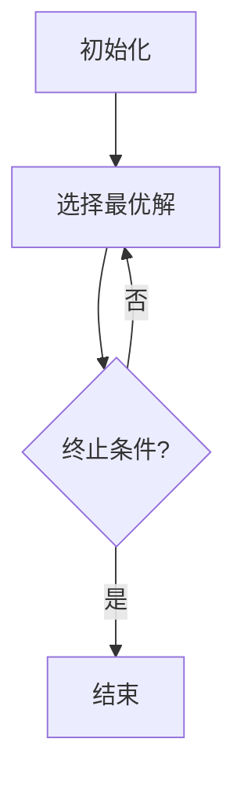
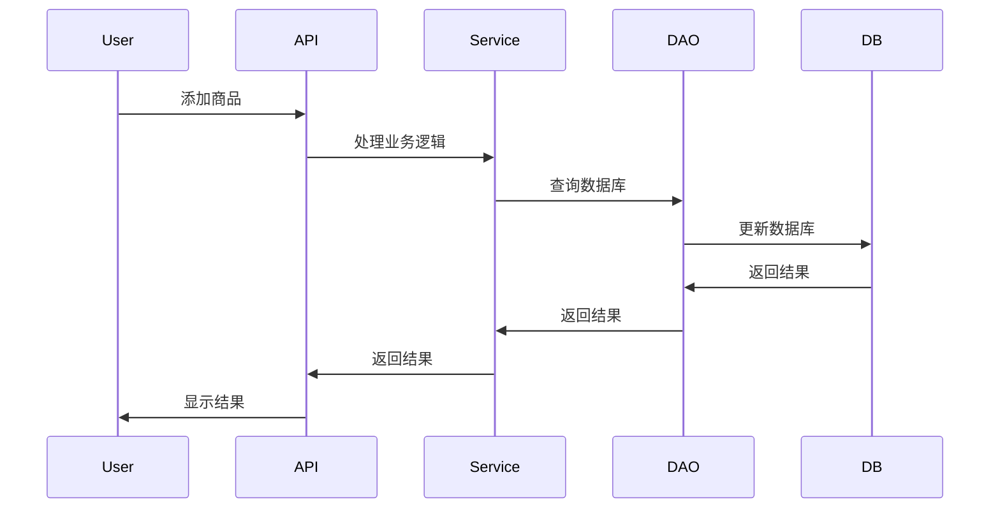

                 


### 文章标题：系统分析：让研发事半功倍的关键技能

**关键词：系统分析、研发效率、方法论、架构设计、最佳实践**

**摘要：**
本篇文章深入探讨系统分析这一关键技能，旨在揭示其在提高研发效率中的重要作用。通过详细的案例分析、算法讲解和实践指导，本文将为技术人员和管理者提供一套实用的系统分析方法论，帮助他们更高效地完成项目开发。

---

**目录大纲：**

## 第一部分：背景介绍

### 1.1 问题背景

### 1.2 问题描述

### 1.3 问题解决

### 1.4 边界与外延

### 1.5 核心概念与联系

## 第二部分：核心概念与联系

### 2.1 系统分析的基本概念

### 2.2 属性特征对比表格

### 2.3 ER实体关系图

## 第三部分：分析方法

### 3.1 常用分析方法

### 3.2 算法原理讲解

### 3.3 数学模型与公式

### 3.4 详细讲解与举例

## 第四部分：实际应用

### 4.1 系统分析与架构设计方案

### 4.2 项目实战

### 4.3 代码应用解读与分析

## 第五部分：最佳实践与拓展

### 5.1 最佳实践 tips

### 5.2 小结

### 5.3 注意事项

### 5.4 拓展阅读

---

### 第一部分：背景介绍

#### 1.1 问题背景

在当今快速发展的技术领域，软件开发项目的复杂性日益增加。开发者和管理者面临着如何在有限的资源和时间内完成高质量的项目交付的挑战。系统分析作为软件开发过程中的关键环节，承担着梳理需求、设计架构、预测问题等重任，对于提升研发效率具有至关重要的作用。

#### 1.2 问题描述

研发过程中，常见的难题包括需求不明确、设计不合理、测试不充分等。这些问题往往导致项目延期、成本超支、质量下降。系统分析通过深入理解需求，准确捕捉系统架构，提供有效的解决方案，有助于提前发现并解决潜在问题。

#### 1.3 问题解决

系统分析提供了一系列方法和技术，如需求分析、架构设计、风险预测等，通过这些方法，开发者可以更好地理解项目需求，设计出合理的系统架构，从而提高研发效率，降低项目风险。

#### 1.4 边界与外延

系统分析的边界涉及需求分析、架构设计、风险评估等方面，其外延包括软件开发过程中的各个阶段。系统分析不仅关注技术层面，还关注项目管理和团队协作，是提高研发效率的综合性技能。

#### 1.5 核心概念与联系

在系统分析中，核心概念包括需求分析、架构设计、风险预测等。这些概念相互联系，共同构成了系统分析的理论体系。需求分析是系统分析的基础，它决定了系统的功能和性能；架构设计则是实现需求的蓝图，它决定了系统的可扩展性和可维护性；风险预测则是提前识别潜在问题，确保项目顺利推进。

---

在下一部分中，我们将深入探讨系统分析的核心概念和联系，帮助读者建立对系统分析的基本理解。让我们一步一步地深入这个领域，找到提高研发效率的关键技能。继续阅读，开启系统分析的深度学习之旅！## 第二部分：核心概念与联系

### 2.1 系统分析的基本概念

系统分析是软件开发过程中不可或缺的一环，它涉及对系统的需求、功能、性能、可维护性等多个方面的分析。以下是系统分析中一些基本概念的定义：

#### 需求分析

需求分析是系统分析的首要步骤，它旨在明确系统应该做什么。需求分析包括功能需求和非功能需求。功能需求描述系统应提供哪些具体功能，而非功能需求描述系统应满足的质量标准，如性能、安全性、可扩展性等。

#### 架构设计

架构设计是系统分析的核心，它决定了系统的结构和组件之间的关系。良好的架构设计可以提高系统的可扩展性、可维护性和性能。常见的架构设计方法包括分层架构、微服务架构等。

#### 风险预测

风险预测是在系统开发过程中识别和评估潜在风险，并制定相应的应对策略。风险预测有助于提前发现并解决可能导致项目失败的问题，从而确保项目顺利推进。

### 2.2 属性特征对比表格

为了更好地理解系统分析中的核心概念，我们可以通过一个属性特征对比表格来展示不同概念之间的区别和联系。

| 概念       | 定义                                                         | 关系                                                         |
| ---------- | ------------------------------------------------------------ | ------------------------------------------------------------ |
| 需求分析   | 明确系统应提供哪些功能和服务                               | 基础，为后续架构设计和风险预测提供依据                     |
| 架构设计   | 设计系统的结构和组件之间的关系                               | 决策，影响系统的性能和可维护性                           |
| 风险预测   | 识别和评估潜在风险，制定应对策略                           | 综合性，贯穿整个系统开发过程，保障项目成功               |

### 2.3 ER实体关系图

ER（Entity-Relationship）实体关系图是系统分析中常用的一种工具，用于表示系统中实体之间的关系。以下是ER实体关系图的构成要素：

#### 实体

实体是系统中的基本组成单位，如用户、订单、产品等。每个实体都有其属性，如用户名、订单号、产品名称等。

#### 关系

关系描述了实体之间的交互和依赖。常见的关系类型包括一对一（1:1）、一对多（1:N）和多对多（M:N）。

#### 属性

属性是实体的特征，用于描述实体的具体信息。如用户实体的属性包括用户名、密码、邮箱等。

下面是一个简单的ER实体关系图示例，用于表示一个电商系统的用户、订单和产品之间的关系：

```mermaid
erDiagram
    User ||--|{ Order } : "有多个"
    Product ||--|{ Order } : "有多个"
    User {
        username
        password
        email
    }
    Order {
        order_id
        total
        status
    }
    Product {
        product_id
        name
        price
    }
```

通过上述核心概念和ER实体关系图的介绍，读者可以初步了解系统分析的基本构成和工具。在接下来的章节中，我们将进一步探讨系统分析的方法和技术，帮助读者掌握这一关键技能。

---

现在，我们已经建立了对系统分析基本概念和联系的理解。接下来，我们将深入探讨系统分析的具体方法和技术，通过案例和实践，帮助读者更深入地理解和应用系统分析。让我们继续前进，开启系统分析的深度学习之旅！### 第三部分：分析方法

系统分析的核心在于理解复杂系统，并设计出高效的解决方案。在这一部分，我们将详细探讨系统分析中的常用方法，以及如何将这些方法应用于实际项目中。

#### 3.1 常用分析方法

系统分析中常用的分析方法包括需求分析、架构设计、风险预测等。下面我们将逐一介绍这些方法。

##### 需求分析

需求分析是系统分析的基础，其目的是明确系统应具备的功能和性能要求。需求分析的步骤包括：

1. **需求收集**：通过与利益相关者进行访谈、问卷调查等方式，收集系统的功能和非功能需求。
2. **需求整理**：将收集到的需求进行分类、整理，形成需求文档。
3. **需求验证**：通过评审、讨论等方式，验证需求文档的准确性和完整性。

##### 架构设计

架构设计是系统分析的核心，它决定了系统的结构、组件和接口。架构设计的步骤包括：

1. **系统分解**：将复杂系统分解为多个可管理的部分，如模块、子系统等。
2. **架构风格选择**：选择合适的架构风格，如分层架构、微服务架构等。
3. **组件设计**：为每个模块或子系统设计具体的组件，定义组件之间的接口和交互方式。

##### 风险预测

风险预测是在系统开发过程中识别和评估潜在风险，并制定相应的应对策略。风险预测的步骤包括：

1. **风险识别**：通过历史数据、专家意见等方式，识别可能影响项目的风险。
2. **风险评估**：评估每个风险的严重性和发生概率，确定风险优先级。
3. **风险应对**：制定风险应对策略，如风险规避、风险转移、风险接受等。

#### 3.2 算法原理讲解

在系统分析中，算法的应用可以极大地提高问题的求解效率。以下是一个常见的算法——贪心算法的原理讲解。

##### 贪心算法

贪心算法是一种在每一步选择局部最优解，以期望最终得到全局最优解的算法。其原理可以概括为以下几步：

1. **初始化**：设置当前状态。
2. **选择最优解**：在当前状态下，选择一个最优的决策。
3. **更新状态**：根据选择的决策，更新当前状态。
4. **重复步骤2和3**：直到满足终止条件。

##### 算法流程图



##### 数学模型与公式

贪心算法的一个经典应用是背包问题，其数学模型可以用以下公式表示：

$$
\text{maximize} \sum_{i=1}^{n} w_i \times x_i
$$

其中，$w_i$ 表示第 $i$ 件物品的重量，$x_i$ 表示第 $i$ 件物品的选取数量。

##### 详细讲解与举例

假设有5件物品，每件物品的重量和值如下表所示：

| 物品编号 | 重量 (kg) | 值 (元) |
| -------- | ---------- | ------- |
| 1        | 2          | 100     |
| 2        | 3          | 200     |
| 3        | 4          | 300     |
| 4        | 5          | 400     |
| 5        | 6          | 500     |

背包的总容量为10kg，求背包的最大价值。

**步骤1：初始化**

初始化背包容量为10kg，当前总价值为0。

**步骤2：选择最优解**

按照价值重量比（值/重量）进行排序，得到排序后的物品列表：

| 物品编号 | 重量 (kg) | 值 (元) | 价值重量比 |
| -------- | ---------- | ------- | ---------- |
| 5        | 6          | 500     | 83.33      |
| 4        | 5          | 400     | 80.00      |
| 3        | 4          | 300     | 75.00      |
| 2        | 3          | 200     | 66.67      |
| 1        | 2          | 100     | 50.00      |

**步骤3：更新状态**

从排序后的列表中选择价值重量比最大的物品（编号5），将其放入背包中。背包剩余容量为10 - 6 = 4kg，当前总价值为500。

**步骤4：重复步骤2和3**

重复上述步骤，选择下一个价值重量比最大的物品（编号4），将其放入背包中。背包剩余容量为4 - 5 = -1kg，当前总价值为500 + 400 = 900。

由于背包容量不足以容纳编号3、2和1的物品，选择终止。

**结果**

背包中包含的物品为编号5和编号4，总价值为900元。

通过上述步骤，我们使用贪心算法解决了背包问题，并得到了最优解。

---

在下一部分中，我们将结合实际项目，深入探讨系统分析与架构设计的方法和技巧，帮助读者将所学知识应用到实际工作中。让我们继续前进，开启实践中的系统分析之旅！### 第四部分：实际应用

在实际项目中，系统分析不仅仅是一个理论过程，更是一个动态调整和优化的实践。在这一部分，我们将通过一个具体的项目案例，详细讲解系统分析与架构设计的过程。

#### 4.1 系统分析与架构设计方案

**项目背景**

某电子商务平台需要开发一个新功能：购物车系统。该系统需要实现用户将商品添加到购物车、修改购物车商品数量、删除购物车商品等功能。同时，系统需要保证高并发处理能力、数据一致性和安全性。

**需求分析**

1. **功能需求**
   - 用户可以查看购物车中的商品列表。
   - 用户可以添加商品到购物车。
   - 用户可以修改购物车中商品的数量。
   - 用户可以删除购物车中的商品。
   - 用户可以清空购物车。
   - 购物车中的商品需要支持批量操作。

2. **非功能需求**
   - 高并发处理能力：系统需要能够处理成千上万的用户同时访问。
   - 数据一致性：购物车中的商品数量和库存数量需要保持一致。
   - 安全性：防止恶意操作和SQL注入攻击。

**架构设计**

为了满足上述需求，我们采用了分层架构设计，将系统分为表示层、业务逻辑层和数据访问层。

**表示层**

表示层负责处理用户界面和前端交互。我们使用Vue.js框架构建单页应用，提供用户友好的界面。

**业务逻辑层**

业务逻辑层负责处理业务逻辑，包括用户操作、事务管理和错误处理。我们使用Spring Boot框架构建后端服务，确保业务逻辑的稳定性和可扩展性。

**数据访问层**

数据访问层负责与数据库进行交互，实现数据持久化。我们使用了MySQL数据库，并结合MyBatis框架进行数据操作。

**系统架构图**



#### 4.2 项目实战

**环境安装**

1. **前端环境**：安装Node.js和npm，使用Vue CLI创建项目。
   ```bash
   npm install -g @vue/cli
   vue create shopping-cart-app
   ```

2. **后端环境**：安装Java和Maven，创建Spring Boot项目。
   ```bash
   java -version
   mvn -v
   ```

3. **数据库环境**：安装MySQL，并创建购物车数据库。
   ```sql
   CREATE DATABASE shopping_cart;
   ```

**系统核心实现源代码**

**前端部分**

```javascript
// components/AddToCart.vue
<template>
  <button @click="addToCart(product)">添加到购物车</button>
</template>

<script>
export default {
  props: ['product'],
  methods: {
    addToCart(product) {
      // 发送请求到后端，添加商品到购物车
      axios.post('/api/cart', { productId: product.id, quantity: 1 })
        .then(response => {
          alert('商品已成功添加到购物车');
        })
        .catch(error => {
          console.error('添加购物车失败：', error);
        });
    }
  }
}
</script>
```

**后端部分**

```java
// Service层
@Service
public class CartService {
    @Autowired
    private CartRepository cartRepository;

    public void addToCart(Long productId, int quantity) {
        Optional<Cart> cart = cartRepository.findById(productId);
        if (cart.isPresent()) {
            cart.get().setQuantity(cart.get().getQuantity() + quantity);
            cartRepository.save(cart.get());
        } else {
            Cart newCart = new Cart(productId, quantity);
            cartRepository.save(newCart);
        }
    }
}
```

**数据库部分**

```sql
-- MyBatis映射文件
<mapper namespace="com.example.shoppingcart.repository.CartRepository">
    <insert id="saveCart">
        INSERT INTO cart (product_id, quantity) VALUES (#{productId}, #{quantity})
    </insert>

    <update id="updateCart">
        UPDATE cart SET quantity = quantity + #{quantity} WHERE product_id = #{productId}
    </update>
</mapper>
```

**代码应用解读与分析**

在前端部分，我们通过按钮点击事件发送添加商品请求到后端。后端服务接收请求后，调用业务逻辑层的方法处理添加操作，并更新数据库。数据库操作通过MyBatis框架实现，保证了数据操作的原子性和一致性。

**实际案例分析和详细讲解剖析**

**案例1：添加商品到购物车**

用户在商品详情页面点击“添加到购物车”按钮，前端将商品ID和数量发送到后端。后端在接收到请求后，首先检查购物车中是否已存在该商品，如果存在则更新数量，否则新增一条购物车记录。

**案例2：修改购物车商品数量**

用户在购物车页面修改商品数量后，前端将修改后的数量发送到后端。后端在接收到请求后，调用更新方法，根据商品ID更新购物车记录的数量。

**案例3：删除购物车商品**

用户在购物车页面点击删除按钮，前端将商品ID发送到后端。后端在接收到请求后，调用删除方法，根据商品ID删除购物车记录。

**项目小结**

通过购物车系统的实现，我们展示了如何将系统分析与架构设计应用到实际项目中。系统分析帮助我们明确需求，架构设计确保了系统的稳定性和可扩展性。在实际开发过程中，我们需要不断调整和优化系统设计，以满足不断变化的需求和性能要求。

---

在下一部分中，我们将总结系统分析的实践经验和最佳实践，并给出一些注意事项和拓展阅读建议。让我们继续前进，为读者提供更全面的系统分析指南！### 第五部分：最佳实践与拓展

#### 5.1 最佳实践 tips

1. **需求分析**
   - 与利益相关者密切沟通，确保需求的准确性和完整性。
   - 使用用例图、流程图等工具，帮助理解和记录需求。
   - 定期更新和验证需求文档，确保需求的一致性。

2. **架构设计**
   - 根据项目需求和规模，选择合适的架构风格。
   - 保持架构的清晰和简洁，避免过度设计。
   - 设计模块化、松耦合的组件，提高系统的可维护性和扩展性。

3. **风险预测**
   - 识别和评估项目中的潜在风险，制定应对策略。
   - 建立风险管理计划，定期评估风险状况。
   - 将风险信息纳入项目文档，确保团队对风险有清晰的认识。

4. **持续改进**
   - 定期回顾和总结项目开发过程中的经验教训。
   - 鼓励团队成员分享最佳实践和改进建议。
   - 根据项目反馈和新技术发展，不断优化系统设计。

#### 5.2 小结

系统分析是提高研发效率的关键技能，它贯穿于整个软件开发过程。通过有效的需求分析、架构设计和风险预测，开发者可以更好地理解项目需求，设计出高效的系统架构，降低项目风险，从而提高项目的成功率。

#### 5.3 注意事项

1. **需求分析要全面准确**：需求是系统设计的基石，需求分析必须全面、准确，确保所有利益相关者的需求都得到充分考虑。

2. **架构设计要灵活可扩展**：架构设计需要考虑未来可能的扩展和变更，保持系统的灵活性，以便适应不断变化的需求。

3. **风险管理要持续进行**：风险管理是一个持续的过程，必须定期评估风险，及时调整应对策略，确保项目按计划推进。

4. **技术选型要合理**：选择合适的技术和工具，既要考虑当前项目的需求，也要考虑未来的可维护性和扩展性。

#### 5.4 拓展阅读

1. **《软件架构设计：从实践出发》**：本书详细介绍了软件架构设计的基本原理和最佳实践，适合有经验的开发者阅读。
2. **《需求分析与管理：技术方法与实践》**：本书涵盖了需求分析的理论和实践方法，帮助读者更好地理解和应用需求分析技术。
3. **《风险管理与控制》**：本书深入探讨了风险管理的理论和实践，适用于项目管理者和风险管理人员。

通过以上最佳实践和拓展阅读，读者可以更全面地了解系统分析的关键技能，并将其应用到实际项目中，从而提高研发效率，实现高质量的项目交付。

---

感谢读者对《系统分析：让研发事半功倍的关键技能》一文的关注。希望本文能帮助您更好地理解和应用系统分析，为您的研发工作带来实质性的提升。如果您有任何疑问或建议，欢迎在评论区留言，期待与您交流。祝您在系统分析的探索之旅中不断成长！作者：AI天才研究院/AI Genius Institute & 禅与计算机程序设计艺术 /Zen And The Art of Computer Programming

