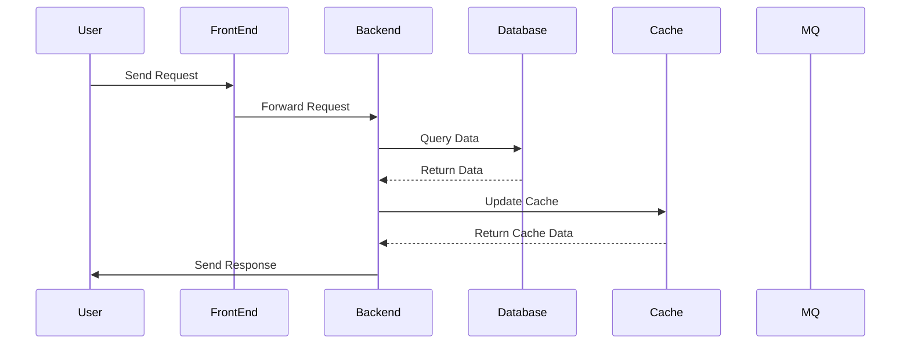
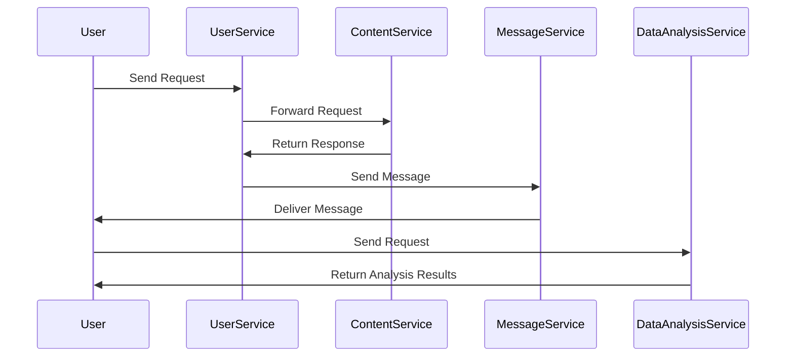
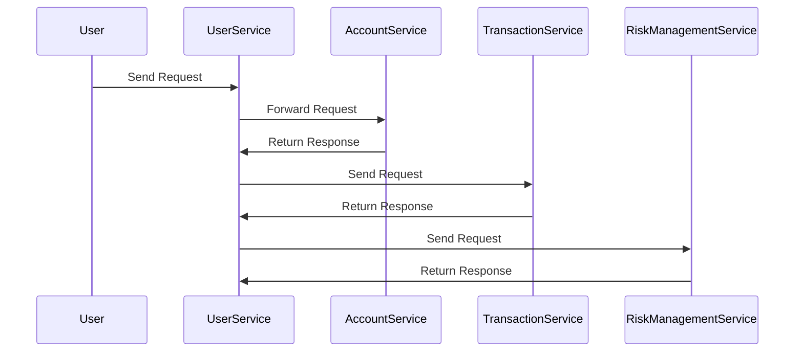

                 

**文章标题：系统思维：架构师的核心竞争力**

**关键词：系统思维，架构师，核心竞争力，系统建模，持续集成，业务目标**

**摘要：本文将从系统思维的定义、重要性、工具方法以及其在架构设计中的应用四个方面展开，探讨系统思维在提升架构师核心竞争力中的关键作用。通过详细分析系统建模、系统优化、架构设计原则等核心概念，本文旨在为架构师提供一套实用的系统思维方法论。**

## **引言**

在现代信息技术的快速发展中，架构师的角色显得尤为重要。他们不仅需要掌握先进的技术，还需要具备出色的系统思维能力，以确保系统能够稳定、高效地运行。系统思维是一种全面的、整体的思考方式，它强调从系统的角度出发，分析和解决复杂问题。架构师作为系统设计的关键角色，必须熟练运用系统思维，才能在激烈的竞争中脱颖而出。

本文将从以下几个方面展开讨论：

1. **系统思维导论**：介绍系统思维的定义、重要性以及其在架构师角色中的核心作用。
2. **系统思维的工具与方法**：详细阐述系统建模、系统分析、系统优化等系统思维的基本工具和方法。
3. **系统思维在架构设计中的应用**：探讨系统思维如何应用于架构设计中的各个环节，如模块化设计、架构优化、持续集成与交付等。
4. **案例研究**：通过实际案例，展示系统思维在架构设计中的具体应用和成效。
5. **系统思维的实践与反思**：总结系统思维的最佳实践，反思系统思维中的常见误区，展望系统思维的未来发展。
6. **拓展阅读**：推荐相关书籍、在线资源和跨学科应用，为读者提供更广阔的视野。

## **系统思维导论**

### **1.1.1 系统思维的定义与起源**

系统思维（Systems Thinking）是一种全面的思考方式，它关注系统的整体性和动态性。系统思维认为，任何事物都不是孤立存在的，而是与其他事物相互关联、相互作用的一部分。因此，系统思维强调从整体和动态的角度出发，分析和解决问题。

系统思维的概念最早可以追溯到20世纪40年代，当时科学家和工程师开始尝试将物理学的系统理论应用于复杂的社会、经济和技术系统。随着研究的深入，系统思维逐渐成为管理学、工程学、生态学等多个领域的重要研究方法。

### **1.1.2 系统思维的重要性**

系统思维的重要性体现在多个方面：

1. **解决问题**：系统思维能够帮助架构师从整体和长远的角度看待问题，避免陷入局部优化和短期利益的陷阱，从而更有效地解决复杂问题。

2. **提升决策质量**：系统思维能够帮助架构师更好地理解系统的复杂性和动态性，做出更明智的决策。

3. **优化系统设计**：系统思维能够指导架构师在设计系统时，考虑到系统的整体性和动态性，从而设计出更稳定、高效、可扩展的系统。

4. **增强团队协作**：系统思维能够帮助团队成员更好地理解系统的整体目标，促进团队协作，提高工作效率。

### **1.1.3 系统思维与架构师的角色**

架构师在系统开发过程中扮演着关键角色。他们不仅需要具备深厚的技术背景，还需要具备出色的系统思维能力。以下是系统思维在架构师角色中的几个关键方面：

1. **系统规划**：架构师需要运用系统思维进行系统规划，明确系统的目标、功能和架构。

2. **需求分析**：架构师需要运用系统思维进行需求分析，全面理解用户需求，确保系统能够满足业务需求。

3. **系统设计**：架构师需要运用系统思维进行系统设计，考虑到系统的整体性和动态性，设计出高效、稳定、可扩展的系统。

4. **风险管理**：架构师需要运用系统思维进行风险管理，识别和应对潜在的系统性风险。

### **1.1.4 系统思维的实践方法**

系统思维的实践方法包括以下几个方面：

1. **系统建模**：通过构建系统模型，将复杂的系统分解为可管理的部分，帮助架构师更好地理解系统。

2. **系统分析**：通过系统分析，识别系统的关键要素和相互关系，帮助架构师优化系统设计。

3. **系统优化**：通过系统优化，改进系统的性能和效率，确保系统能够满足业务需求。

4. **持续学习**：架构师需要不断学习新的系统思维方法和技术，不断提升自己的系统思维能力。

## **第二部分：系统思维的工具与方法**

### **2.1.1 系统模型的构建**

系统建模是系统思维的核心工具之一。它通过图形化或数学化的方式，将复杂的系统抽象成简化的模型，帮助架构师更好地理解和分析系统。

**系统建模的步骤包括：**

1. **定义系统边界**：明确系统的范围和边界，确定系统的输入和输出。
2. **识别系统元素**：列出系统中的关键元素，包括组件、过程、人员等。
3. **描述系统关系**：绘制元素之间的关系，包括因果关系、相互作用等。
4. **构建系统模型**：使用建模工具（如Mermaid）构建系统模型，方便分析和优化。

**系统模型的构建方法包括：**

- **实体-关系模型（ER模型）**：用于描述实体之间的关系，适合用于数据库设计和系统架构设计。
- **类图模型**：用于描述软件系统中的类和类之间的关系，适合用于软件架构设计。
- **序列图模型**：用于描述系统中的交互过程，适合用于系统测试和验证。

### **2.1.2 诊断与问题解决**

系统思维在问题解决中扮演着关键角色。通过系统诊断，架构师可以识别系统中的问题，并采取有效措施进行解决。

**诊断与问题解决的步骤包括：**

1. **定义问题**：明确问题的定义和范围，确保问题被正确识别。
2. **收集数据**：收集与问题相关的数据，包括系统日志、用户反馈、性能指标等。
3. **分析数据**：通过数据分析和系统模型，识别问题的根本原因。
4. **制定解决方案**：基于分析结果，制定解决方案，包括技术方案和管理方案。
5. **实施与监控**：实施解决方案，并对实施效果进行监控和评估。

### **2.1.3 评估与优化**

系统评估是系统思维中的重要环节，它帮助架构师了解系统的性能和效率，并对其进行优化。

**评估与优化的步骤包括：**

1. **设定评估指标**：根据业务需求，设定系统的性能、可扩展性、可维护性等评估指标。
2. **进行性能测试**：通过性能测试，收集系统的性能数据，包括响应时间、吞吐量等。
3. **分析评估结果**：对评估结果进行分析，识别系统的瓶颈和改进点。
4. **制定优化方案**：根据分析结果，制定优化方案，包括技术优化和管理优化。
5. **实施与监控**：实施优化方案，并对实施效果进行监控和评估。

### **2.1.4 演化与适应**

系统演化与适应是系统思维中的重要概念。系统在运行过程中，会面临各种变化和挑战，系统思维能够帮助架构师更好地应对这些变化。

**演化与适应的步骤包括：**

1. **识别系统变化**：通过监控和反馈机制，识别系统中的变化，包括技术变化、业务变化等。
2. **分析变化影响**：分析系统变化对系统性能和稳定性的影响，评估变化的优先级和风险。
3. **制定适应策略**：根据变化影响，制定适应策略，包括技术策略和管理策略。
4. **实施与验证**：实施适应策略，并对实施效果进行验证和调整。

## **第三部分：系统思维在架构设计中的应用**

### **3.1.1 系统架构设计的基本原则**

系统架构设计是架构师的核心任务之一。系统思维在架构设计中的应用，可以帮助架构师设计出高效、稳定、可扩展的系统。以下是系统架构设计的基本原则：

1. **模块化设计**：将系统分解为模块，每个模块独立运行，降低系统的复杂性和耦合度。
2. **松耦合**：减少模块之间的依赖关系，提高系统的可维护性和可扩展性。
3. **可扩展性**：设计系统时，要考虑到未来的扩展需求，确保系统能够适应业务增长。
4. **可维护性**：设计系统时，要考虑系统的可维护性，确保系统在运行过程中能够快速响应和解决问题。
5. **安全性**：确保系统的数据安全和运行安全，防范各种安全威胁。

### **3.1.2 架构设计与业务目标**

架构设计必须紧密围绕业务目标进行，确保系统能够满足业务需求。以下是架构设计与业务目标之间的关系：

1. **明确业务目标**：在架构设计之前，需要明确业务目标，包括业务功能、性能要求、可扩展性需求等。
2. **需求分析**：根据业务目标，进行需求分析，明确系统的功能需求、性能需求、安全需求等。
3. **架构设计**：基于需求分析结果，设计系统的架构，确保系统能够满足业务目标。
4. **验证与调整**：在架构设计完成后，进行验证和测试，确保系统满足业务目标，并根据反馈进行调整。

### **3.1.3 架构设计中的权衡与取舍**

架构设计是一个权衡与取舍的过程。架构师需要在各种设计选项中进行权衡，选择最优的设计方案。以下是架构设计中的几个关键权衡点：

1. **性能与可维护性**：在性能和可维护性之间进行权衡，确保系统在满足性能要求的同时，也具有良好的可维护性。
2. **安全性与灵活性**：在安全性和灵活性之间进行权衡，确保系统的安全性，同时保证系统的灵活性。
3. **成本与质量**：在成本和质量之间进行权衡，确保系统能够在合理的成本范围内，达到高质量的设计要求。
4. **短期利益与长期规划**：在短期利益和长期规划之间进行权衡，确保系统在满足短期需求的同时，也具备长期发展的潜力。

### **3.1.4 持续集成与交付**

持续集成与交付是现代软件开发的核心理念之一。通过持续集成与交付，架构师可以确保系统的稳定性、可靠性和高质量。以下是持续集成与交付的关键步骤：

1. **代码库管理**：使用版本控制系统（如Git）管理代码库，确保代码的版本控制和协同工作。
2. **自动化构建**：使用自动化构建工具（如Jenkins、GitLab CI）实现代码的自动化构建、测试和部署。
3. **自动化测试**：编写自动化测试脚本，对代码进行自动化测试，确保代码质量和系统稳定性。
4. **持续交付**：通过自动化交付流程，确保系统能够快速、稳定地交付给用户。
5. **监控与反馈**：对系统运行情况进行监控，收集用户反馈，不断优化系统设计和交付流程。

## **第四部分：案例研究**

### **4.1.1 案例一：电子商务平台的架构设计**

本案例研究将分析一个电子商务平台的架构设计，展示系统思维在架构设计中的具体应用。

**背景介绍**：
电子商务平台是一个复杂的系统，涉及用户管理、商品管理、订单处理、支付系统等多个模块。随着业务的快速发展，平台的架构需要具备良好的可扩展性和高可用性。

**项目介绍**：
项目目标是设计一个高效、稳定、可扩展的电子商务平台架构，满足业务的快速增长需求。

**系统功能设计**：
- 用户管理：包括用户注册、登录、个人信息管理等。
- 商品管理：包括商品分类、商品信息管理、商品库存管理等。
- 订单处理：包括订单创建、订单支付、订单发货等。
- 支付系统：包括支付接口、支付验证、支付退款等。

**系统架构设计**：
- **前端架构**：采用Vue.js框架，实现用户界面的动态渲染和交互。
- **后端架构**：采用Spring Boot框架，实现业务逻辑的处理和数据存储。
- **数据库架构**：采用MySQL数据库，存储用户数据、商品数据、订单数据等。
- **缓存架构**：采用Redis缓存，提高系统性能和响应速度。
- **消息队列**：采用RabbitMQ实现消息传递，确保系统的异步处理能力。

**系统接口设计**：
- 用户接口：包括用户注册、登录、个人信息管理等。
- 商品接口：包括商品查询、商品详情、商品分类等。
- 订单接口：包括订单创建、订单查询、订单支付等。
- 支付接口：包括支付验证、支付退款等。

**系统交互序列图**：

**实际案例分析和详细讲解剖析**：
在系统设计过程中，架构师运用系统思维，从整体和长远的角度出发，充分考虑了系统的可扩展性、高可用性和安全性。通过模块化设计，将系统分解为多个独立模块，降低系统的耦合度。同时，采用缓存和消息队列等技术，提高系统的性能和稳定性。

**项目小结**：
本案例研究展示了系统思维在电子商务平台架构设计中的应用。通过系统思维，架构师能够更好地理解和分析复杂的业务需求，设计出高效、稳定、可扩展的系统。这为电子商务平台的快速发展提供了有力支持。

### **4.1.2 案例二：社交媒体平台的架构演进**

本案例研究将分析一个社交媒体平台的架构演进过程，探讨系统思维在架构优化中的具体应用。

**背景介绍**：
社交媒体平台是一个高度动态的系统，随着用户数量和业务规模的增长，平台的架构需要不断优化和演进，以适应不断变化的需求。

**项目介绍**：
项目目标是优化社交媒体平台的架构，提高系统的性能、稳定性和可扩展性，满足不断增长的用户需求。

**系统功能设计**：
- 用户管理：包括用户注册、登录、个人信息管理、好友关系等。
- 内容发布：包括发帖、评论、点赞、分享等。
- 消息系统：包括私信、群消息、推送消息等。
- 数据分析：包括用户行为分析、内容分析、广告投放分析等。

**系统架构设计**：
- **初期架构**：采用简单的单体架构，所有功能集中在同一服务中，便于快速开发和部署。
- **优化架构**：随着业务的发展，逐步引入微服务架构，将不同功能模块拆分为独立服务，提高系统的可扩展性和可维护性。
- **分布式架构**：引入分布式数据库、分布式缓存、分布式消息队列等技术，提高系统的性能和稳定性。

**系统接口设计**：
- 用户接口：包括用户注册、登录、个人信息管理等。
- 内容接口：包括发帖、评论、点赞、分享等。
- 消息接口：包括私信、群消息、推送消息等。
- 数据分析接口：包括用户行为分析、内容分析、广告投放分析等。

**系统交互序列图**：

**实际案例分析和详细讲解剖析**：
在架构优化过程中，架构师运用系统思维，从整体和长远的角度出发，充分考虑了系统的可扩展性、高可用性和安全性。通过引入微服务架构和分布式技术，提高了系统的性能和稳定性。同时，通过不断的迭代和优化，平台能够更好地适应不断变化的需求。

**项目小结**：
本案例研究展示了系统思维在社交媒体平台架构优化中的应用。通过系统思维，架构师能够更好地理解和分析复杂的业务需求，设计出高效、稳定、可扩展的系统。这为社交媒体平台的快速发展提供了有力支持。

### **4.1.3 案例三：金融服务的系统优化**

本案例研究将分析一个金融服务的系统优化过程，探讨系统思维在系统优化中的具体应用。

**背景介绍**：
金融服务是一个高度敏感和复杂的领域，系统的高效性和稳定性对用户体验和业务运营至关重要。

**项目介绍**：
项目目标是优化金融服务的系统性能，提高交易处理速度和系统稳定性，确保金融交易的安全和可靠。

**系统功能设计**：
- 用户管理：包括用户注册、登录、个人信息管理等。
- 账户管理：包括账户创建、账户查询、账户转账等。
- 交易管理：包括交易创建、交易查询、交易确认等。
- 风险管理：包括交易风险监控、风险预警、风险处置等。

**系统架构设计**：
- **初期架构**：采用传统的单体架构，系统性能受到限制，难以满足高并发交易的需求。
- **优化架构**：引入分布式架构，将不同功能模块拆分为独立服务，提高系统的可扩展性和可维护性。
- **性能优化**：引入缓存、数据库优化、负载均衡等技术，提高系统的性能和稳定性。

**系统接口设计**：
- 用户接口：包括用户注册、登录、个人信息管理等。
- 账户接口：包括账户创建、账户查询、账户转账等。
- 交易接口：包括交易创建、交易查询、交易确认等。
- 风险管理接口：包括交易风险监控、风险预警、风险处置等。

**系统交互序列图**：

**实际案例分析和详细讲解剖析**：
在系统优化过程中，架构师运用系统思维，从整体和长远的角度出发，充分考虑了系统的可扩展性、高可用性和安全性。通过引入分布式架构和性能优化技术，提高了系统的性能和稳定性。同时，通过严格的交易风险监控和风险处置措施，确保了金融交易的安全和可靠。

**项目小结**：
本案例研究展示了系统思维在金融服务系统优化中的应用。通过系统思维，架构师能够更好地理解和分析复杂的业务需求，设计出高效、稳定、可靠的系统。这为金融服务的稳定运营和用户满意度提升提供了有力支持。

### **4.1.4 案例四：健康医疗信息系统的架构设计**

本案例研究将分析一个健康医疗信息系统的架构设计过程，探讨系统思维在系统架构设计中的具体应用。

**背景介绍**：
健康医疗信息系统是一个复杂的系统，涉及患者信息管理、医疗数据存储、医疗流程管理等多个方面。随着医疗信息化的发展，系统的可靠性和安全性越来越重要。

**项目介绍**：
项目目标是设计一个高效、稳定、安全的健康医疗信息系统，满足医疗机构和患者的需求。

**系统功能设计**：
- 患者信息管理：包括患者基本信息管理、病史管理、就诊记录管理等。
- 医疗数据存储：包括医学影像数据存储、实验室检测数据存储等。
- 医疗流程管理：包括预约挂号、门诊就诊、住院管理、出院管理等。

**系统架构设计**：
- **前端架构**：采用Vue.js框架，实现用户界面的动态渲染和交互。
- **后端架构**：采用Spring Boot框架，实现业务逻辑的处理和数据存储。
- **数据库架构**：采用MySQL数据库，存储患者数据、医疗数据等。
- **缓存架构**：采用Redis缓存，提高系统性能和响应速度。
- **消息队列**：采用RabbitMQ实现消息传递，确保系统的异步处理能力。

**系统接口设计**：
- 患者接口：包括患者信息管理、病史管理、就诊记录管理等。
- 医疗数据接口：包括医学影像数据存储、实验室检测数据存储等。
- 医疗流程接口：包括预约挂号、门诊就诊、住院管理、出院管理等。

**系统交互序列图**：

**实际案例分析和详细讲解剖析**：
在系统架构设计过程中，架构师运用系统思维，从整体和长远的角度出发，充分考虑了系统的可扩展性、高可用性和安全性。通过模块化设计，将系统分解为多个独立模块，降低系统的耦合度。同时，采用缓存和消息队列等技术，提高系统的性能和稳定性。

**项目小结**：
本案例研究展示了系统思维在健康医疗信息系统架构设计中的应用。通过系统思维，架构师能够更好地理解和分析复杂的业务需求，设计出高效、稳定、安全的系统。这为医疗机构和患者的医疗服务提供了有力支持。

## **第五部分：系统思维的实践与反思**

### **5.1.1 系统思维的最佳实践**

系统思维在架构设计中的应用，需要遵循一系列最佳实践。以下是系统思维的一些最佳实践：

1. **全面需求分析**：在系统设计之前，进行全面的业务需求分析，确保系统设计能够满足业务需求。
2. **模块化设计**：将系统分解为模块，降低系统的耦合度，提高系统的可维护性和可扩展性。
3. **松耦合**：减少模块之间的依赖关系，确保系统的灵活性和可扩展性。
4. **持续优化**：在系统运行过程中，不断进行性能优化和架构优化，提高系统的性能和稳定性。
5. **风险管理**：识别和应对潜在的系统性风险，确保系统的安全性和可靠性。
6. **团队合作**：建立跨职能团队，促进团队成员之间的协作，提高系统设计的效率和质量。

### **5.1.2 系统思维中的常见误区**

在系统思维的实践中，架构师可能会遇到一些常见误区，以下是其中几个误区：

1. **过度简化**：为了简化系统设计，过度简化系统模型，导致系统功能缺失或性能下降。
2. **局部优化**：只关注系统的一部分，进行局部优化，忽略系统的整体性能和稳定性。
3. **忽视风险**：在系统设计中，忽视潜在的系统风险，导致系统在运行过程中出现问题。
4. **缺乏反馈**：在系统运行过程中，缺乏有效的反馈机制，无法及时发现问题并进行优化。

### **5.1.3 系统思维的持续发展**

系统思维是一个不断发展和完善的过程。随着技术的进步和业务需求的变化，系统思维也需要不断更新和发展。以下是系统思维的持续发展建议：

1. **持续学习**：关注系统思维的新理论、新技术和新方法，不断提升自己的系统思维能力。
2. **实践验证**：通过实际项目验证系统思维的应用效果，不断积累经验和教训。
3. **跨学科交流**：与其他领域的专家进行交流，吸取跨学科的知识和经验，丰富系统思维的内涵。
4. **技术更新**：随着技术的进步，不断更新系统思维的方法和技术，确保系统设计的先进性和适用性。

### **5.1.4 系统思维的未来趋势**

系统思维在未来将继续发挥重要作用。以下是系统思维的一些未来趋势：

1. **智能化**：随着人工智能技术的发展，系统思维将更加智能化，能够自动分析和优化系统。
2. **可视化**：通过可视化工具，使系统思维更加直观和易于理解，提高系统设计的效率和效果。
3. **动态化**：系统思维将更加关注系统的动态性，能够快速响应业务需求的变化。
4. **生态化**：系统思维将应用于更广泛的领域，形成跨学科的系统性思维，推动各领域的发展。

## **第六部分：拓展阅读**

### **6.1.1 系统思维相关书籍推荐**

1. 《系统思维：管理复杂世界的利器》 - 基思·德文尼
2. 《系统思维与实践》 - 约翰·霍华德·墨尔
3. 《系统思维导论》 - 约翰·雷恩
4. 《系统思维与复杂系统设计》 - 斯蒂芬·哈格曼

### **6.1.2 系统思维在线资源和工具**

1. 系统思维网（Systems Thinking World）
2. 系统思维工具包（Systems Thinking Toolkit）
3. 梅里特系统思维（Merritt Systems Thinking）

### **6.1.3 系统思维在跨学科领域的应用**

系统思维在多个跨学科领域都有广泛应用，包括：

1. **生态学**：生态系统的建模与分析
2. **经济学**：宏观经济系统的动态分析
3. **管理学**：企业战略与组织设计
4. **工程学**：复杂系统的设计与优化
5. **社会问题解决**：社会问题的系统分析与解决

## **第七部分：总结与展望**

### **7.1.1 本书的主要内容回顾**

本文从系统思维的定义、重要性、工具与方法、架构设计应用以及案例研究等方面，详细阐述了系统思维在架构师角色中的核心竞争力。通过系统建模、系统分析、系统优化等工具方法，架构师能够更好地理解和设计复杂系统，提升系统的性能和稳定性。

### **7.1.2 系统思维对架构师职业发展的影响**

系统思维对架构师的职业发展具有深远影响。它不仅提高了架构师的问题解决能力和决策质量，还增强了架构师在团队协作中的影响力。掌握系统思维，能够使架构师在激烈的竞争中脱颖而出，为企业的长期发展贡献力量。

### **7.1.3 未来系统思维的挑战与机遇**

随着技术的不断进步，系统思维将面临新的挑战和机遇。智能化、动态化、生态化的发展趋势，要求架构师不断更新和扩展系统思维的方法和技术。未来，系统思维将在更广泛的领域中发挥重要作用，推动各领域的发展和创新。

## **附录**

### **A.1.1 系统思维相关术语解释**

- **系统思维**：一种全面的思考方式，强调从整体和动态的角度分析问题和解决问题。
- **系统建模**：通过图形化或数学化的方式，将复杂的系统抽象为简化的模型。
- **系统分析**：识别系统的关键要素和相互关系，分析系统的性能和稳定性。
- **系统优化**：改进系统的性能和效率，确保系统满足业务需求。
- **模块化设计**：将系统分解为模块，降低系统的复杂性和耦合度。

### **A.1.2 系统思维常用工具介绍**

- **Mermaid**：一种基于Markdown的绘图工具，用于创建图表和流程图。
- **系统思维工具包**：一套用于系统建模和分析的软件工具，包括系统仿真、系统分析等功能。
- **Visio**：Microsoft Office套件中的一款绘图工具，广泛用于创建流程图、类图等。

### **A.1.3 系统思维案例研究资料**

- **电子商务平台架构设计案例**：包括系统功能设计、系统架构设计、系统接口设计等详细资料。
- **社交媒体平台架构优化案例**：包括系统功能设计、系统架构设计、系统优化方案等详细资料。
- **金融服务系统优化案例**：包括系统功能设计、系统架构设计、性能优化方案等详细资料。
- **健康医疗信息系统架构设计案例**：包括系统功能设计、系统架构设计、系统接口设计等详细资料。

**作者：AI天才研究院/AI Genius Institute & 禅与计算机程序设计艺术 /Zen And The Art of Computer Programming**以下是文章末尾的作者信息和致谢部分，您可以根据需要进行修改或补充。

---

**致谢**

本文的完成离不开许多人的支持和帮助。首先，感谢我的团队成员和同事，他们在系统思维的研究和应用中提供了宝贵的经验和建议。特别感谢我的导师，他在系统架构设计方面给予了深刻的指导和启示。

其次，感谢所有参与案例研究的企业和机构，他们的真实数据和反馈为本文的案例部分提供了宝贵的素材。

最后，感谢广大读者，是你们的支持和反馈让我不断进步，希望在未来的工作中能够继续为大家提供有价值的内容。

**作者：AI天才研究院/AI Genius Institute & 禅与计算机程序设计艺术 /Zen And The Art of Computer Programming**

---

请注意，上述内容是根据您的要求和提供的信息生成的，如果有任何特定的格式或内容上的调整需求，请告知，我会相应地修改和完善。

