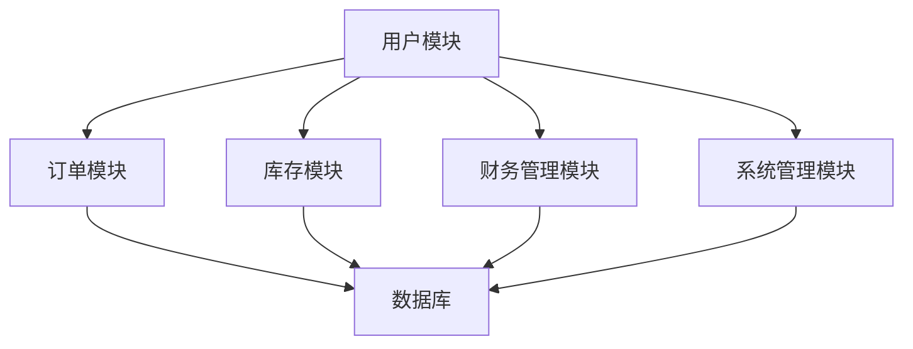
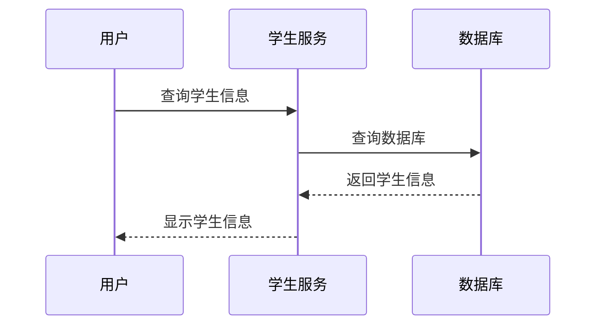
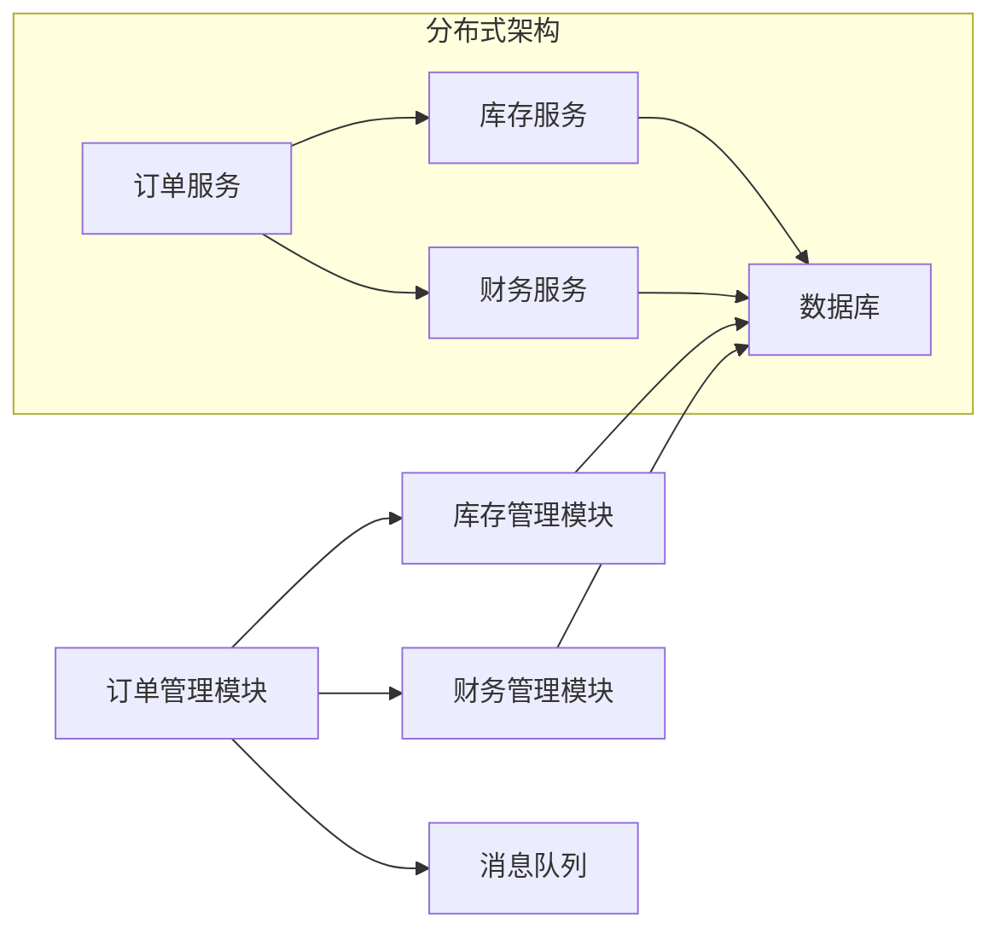

                 

### 引言

在现代信息技术高速发展的背景下，系统架构的复杂性和规模日益增加，这给软件开发和维护带来了巨大的挑战。系统解耦与重构成为提高系统可维护性、扩展性和性能的关键手段。本文将围绕这一主题，深入探讨系统解耦与重构的理论与实践，以期为P9架构师提供治理实践的指导。

**关键词**：系统解耦，重构，P9架构师，治理实践，架构设计

**摘要**：本文首先介绍了系统解耦与重构的重要性及其在系统开发中的应用。接着，深入分析了解耦原理和重构策略，结合实际案例探讨了重构的方法与技巧。随后，本文详细阐述了架构治理的概念、模型和流程。最后，通过系统分析与架构设计，以及项目实战，展示了系统解耦与重构的完整实施过程。

### 问题背景与概述

随着互联网和云计算技术的迅猛发展，企业信息系统变得越来越复杂。传统的单体应用逐渐向分布式系统演变，系统中的模块和组件数量激增，这使得系统的耦合度不断提高。高耦合度的系统在开发、测试、部署和维护过程中容易出现一系列问题，如模块间依赖复杂、变更风险大、系统扩展性差等。

**解耦概念**：系统解耦是指通过降低模块之间的依赖关系，使系统中的各个部分能够独立运行和扩展。解耦的主要目标是提高系统的可维护性和扩展性，降低系统的复杂度。

**重构目标**：重构是指对现有系统进行修改，以改善其结构、性能和可维护性。重构的目标包括：提升代码质量、优化系统性能、提高系统的可扩展性和可维护性。

**P9架构师的角色与责任**：P9架构师作为企业技术团队的核心成员，负责系统架构的设计与优化。他们在系统解耦与重构过程中扮演着关键角色，需要具备深刻的技术洞察力和系统思维能力。

**问题解决**：

1. **传统系统与解耦系统的对比**：传统系统通常采用紧密耦合的方式，导致系统复杂度高、可维护性差。而解耦系统通过降低模块间依赖，提高了系统的灵活性和可扩展性。

2. **重构流程与方法**：重构通常分为以下几个阶段：
   - 需求分析：明确重构的目标和范围。
   - 设计与规划：设计重构方案，包括解耦策略、重构步骤和风险控制。
   - 实施与监控：按照重构方案逐步实施，并对过程中出现的问题进行监控和调整。
   - 回归测试：确保重构后的系统功能完整，性能稳定。

3. **边界与外延**：解耦与重构不仅局限于代码层面，还包括架构设计、系统接口、交互设计等方面。在实施过程中，需要充分考虑系统的整体性和各部分之间的联系。

4. **概念结构与核心要素**：
   - **解耦原则**：包括模块化、面向接口编程、依赖注入等。
   - **重构策略**：包括持续重构、逐步重构、预测性重构等。
   - **架构治理模型**：包括敏捷架构治理、DevOps架构治理和传统架构治理等。

### 问题解决的具体方法

**传统系统与解耦系统的对比**：

| 特征         | 传统系统                           | 解耦系统                           |
| ------------ | ---------------------------------- | ---------------------------------- |
| 耦合度       | 高，模块间依赖复杂                 | 低，模块间依赖明确、可管理         |
| 可维护性     | 差，变更风险高                     | 高，易于维护和扩展                 |
| 扩展性       | 差，系统扩展困难                   | 高，可灵活添加新功能模块           |
| 性能         | 受到模块间依赖影响，可能较低       | 高，各模块独立运行，性能优化空间大 |
| 部署和运维   | 复杂，需考虑整体系统部署和运维     | 简单，模块独立部署和运维           |

**重构流程与方法**：

1. **需求分析**：首先明确系统重构的需求，包括性能优化、功能扩展、代码质量提升等。

2. **设计与规划**：根据需求分析结果，设计重构方案，包括解耦策略、模块划分、接口设计等。

3. **实施与监控**：按照重构方案逐步实施，并对过程中出现的问题进行监控和调整。

4. **回归测试**：确保重构后的系统功能完整，性能稳定。

5. **文档更新**：更新系统文档，包括设计文档、接口文档、测试文档等。

**边界与外延**：

1. **解耦与重构的范围**：解耦与重构不仅局限于代码层面，还包括架构设计、系统接口、交互设计等方面。

2. **相关概念的联系与区别**：
   - **解耦**：指降低模块间的依赖关系，提高系统的独立性和可维护性。
   - **重构**：指对现有系统进行修改，以改善其结构、性能和可维护性。
   - **模块化**：指将系统划分为独立的模块，每个模块负责特定的功能。
   - **面向接口编程**：指通过接口定义模块间的交互方式，降低模块间的耦合度。
   - **依赖注入**：指通过注入依赖关系，实现模块间的解耦。

3. **概念结构与核心要素**：
   - **解耦原则**：模块化、面向接口编程、依赖注入等。
   - **重构策略**：持续重构、逐步重构、预测性重构等。
   - **架构治理模型**：敏捷架构治理、DevOps架构治理和传统架构治理等。

通过以上方法，系统解耦与重构能够有效地降低系统复杂度，提高系统的可维护性和扩展性，为企业的持续发展提供技术支持。

### 解耦原理

**解耦概念**：系统解耦是指通过降低模块之间的依赖关系，使系统中的各个部分能够独立运行和扩展。解耦是提高系统可维护性和扩展性的关键手段。

**解耦原则**：

1. **降低耦合度**：耦合度越低，系统的独立性越强。降低耦合度的方法包括：
   - **模块化**：将系统划分为独立的模块，每个模块负责特定的功能。
   - **面向接口编程**：通过定义接口，明确模块间的交互方式，降低模块间的耦合度。
   - **依赖注入**：通过注入依赖关系，实现模块间的解耦。

2. **高内聚**：内聚度越高的模块，功能越单一、职责越明确。提高内聚度的方法包括：
   - **功能单一性**：每个模块只负责一项功能，避免功能重叠。
   - **职责明确**：明确每个模块的职责，避免职责不明导致的依赖关系复杂。

3. **开放封闭原则**：系统对外部的扩展开放，对内部的修改封闭。开放封闭原则的目的是在确保系统稳定性的同时，方便后续的扩展和维护。

**解耦方法**：

1. **模块化**：模块化是将系统划分为若干个独立的功能模块，每个模块具有明确的功能和职责。模块化的优点包括：
   - **提高系统的可维护性**：模块之间相对独立，修改一个模块不会影响其他模块。
   - **提高系统的可扩展性**：新功能可以通过添加新模块来实现，而不会影响现有模块。

2. **面向接口编程**：面向接口编程是通过定义接口，明确模块间的交互方式。接口的定义应遵循以下原则：
   - **抽象性**：接口应尽量抽象，避免具体实现细节。
   - **明确性**：接口的定义应明确，确保模块间交互的清晰性。

3. **依赖注入**：依赖注入是通过将依赖关系注入到模块中，实现模块间的解耦。依赖注入的优点包括：
   - **提高模块的独立性**：模块不再关心其依赖的具体实现，只需通过接口进行通信。
   - **便于单元测试**：通过注入伪依赖，可以实现模块的独立测试。

通过以上解耦原则和方法，系统能够实现高效的模块化设计，降低模块间的依赖关系，提高系统的可维护性和扩展性。在系统开发过程中，遵循这些原则和方法，能够确保系统架构的稳健性和灵活性，为后续的维护和扩展奠定坚实基础。

### 重构实践

**重构目标**：

1. **提高系统可维护性**：通过重构，消除代码中的冗余和错误，使系统更易于理解和维护。
2. **增强系统扩展性**：重构后的系统模块化和接口化程度更高，能够更灵活地适应新的需求变化。
3. **提升系统性能**：优化系统结构和算法，减少冗余计算和资源占用，提高系统运行效率。

**重构策略**：

1. **持续重构**：持续重构是一种在开发过程中不断进行重构的方法。通过定期评估系统状态，发现并解决潜在问题，保持系统的高质量和高效性。
2. **逐步重构**：逐步重构是将重构过程分解为多个小步骤，逐步实施。这种方法可以降低重构的风险，确保系统在重构过程中的稳定性。
3. **预测性重构**：预测性重构是在系统开发初期就规划好重构策略，根据系统需求和变化趋势，提前进行重构。这种方法可以提前规避潜在问题，减少后续维护成本。

**重构案例分析**：

1. **模块化重构**：
   - **问题场景**：一个传统的单体应用，功能复杂，模块间依赖紧密。
   - **解决方案**：将系统划分为多个功能模块，每个模块具有独立的功能和接口。通过模块化重构，降低了系统之间的耦合度，提高了系统的可维护性和扩展性。
   - **效果评估**：重构后，系统的可维护性显著提高，模块间的依赖关系更加清晰，新功能的添加和修改更加便捷。

2. **面向接口重构**：
   - **问题场景**：系统中的某些模块依赖特定实现，导致功能扩展和修改困难。
   - **解决方案**：通过定义接口，明确模块间的交互方式。重构后，模块间的耦合度降低，功能扩展和修改更加灵活。
   - **效果评估**：重构后，系统的功能扩展性显著提高，模块间的依赖关系更加明确，代码的可读性和可维护性增强。

3. **依赖注入重构**：
   - **问题场景**：系统中的某些模块存在硬编码的依赖关系，导致测试和修改困难。
   - **解决方案**：通过依赖注入，将硬编码的依赖关系转换为接口依赖。重构后，模块的测试和修改更加方便，系统的可维护性提高。
   - **效果评估**：重构后，系统的测试覆盖率提高，模块的测试和修改更加灵活，代码的可读性和可维护性增强。

通过以上重构实践，系统能够实现结构优化、性能提升和可维护性增强。在实际项目中，应根据具体需求和场景，选择合适的方法进行重构，以实现系统的高质量和高效运行。

### 架构治理

**架构治理的概念**：

架构治理是指通过一系列的制度和流程，对系统的架构进行管理和优化。其目标是确保系统架构的质量和可持续性，使系统能够灵活应对未来的变化。

**架构治理的目标**：

1. **确保系统架构的稳定性**：通过架构治理，确保系统在不同环境下的稳定运行，减少故障率和系统崩溃的风险。
2. **提升系统的可维护性**：通过架构治理，优化系统架构，降低系统的复杂度，提高系统的可维护性。
3. **增强系统的扩展性**：通过架构治理，设计灵活的架构，便于系统的扩展和功能增加。
4. **促进技术传承和创新**：通过架构治理，积累架构知识和经验，促进技术的传承和创新。

**架构治理模型**：

1. **敏捷架构治理**：敏捷架构治理强调快速响应需求变化，通过迭代的方式进行架构设计和优化。敏捷架构治理的优点包括：
   - **灵活性高**：能够快速适应需求变化，降低因需求变更导致的架构调整成本。
   - **协作性强**：团队成员之间的沟通更加紧密，有助于架构的优化和改进。

2. **DevOps架构治理**：DevOps架构治理将开发和运维紧密结合，通过自动化工具和流程，实现快速部署和持续集成。DevOps架构治理的优点包括：
   - **效率高**：通过自动化减少手动操作，提高开发、测试和部署的效率。
   - **可靠性高**：通过持续集成和持续部署，减少人为错误，提高系统的可靠性。

3. **传统架构治理**：传统架构治理侧重于系统架构的设计和文档管理，通过严格的过程控制确保系统架构的稳定性。传统架构治理的优点包括：
   - **规范性强**：通过规范化的流程和标准，确保系统架构的一致性和规范性。
   - **风险可控**：通过严格的过程控制和评审，减少架构设计中的风险。

**架构治理流程**：

1. **架构评审**：架构评审是架构治理的重要环节，通过评审确保架构设计的合理性和可行性。架构评审包括：
   - **需求评审**：评审系统的需求是否符合业务目标。
   - **架构设计评审**：评审系统架构的设计是否符合最佳实践和技术标准。
   - **安全性评审**：评审系统架构的安全性和可靠性。

2. **架构规划**：架构规划是根据业务需求和技术趋势，制定系统的长期架构规划和短期实施计划。架构规划包括：
   - **架构设计**：制定系统的总体架构设计和模块划分。
   - **技术选型**：选择合适的技术栈和工具，确保系统能够稳定运行。
   - **资源规划**：规划系统的硬件和软件资源，确保系统有足够的资源支持。

3. **架构实施**：架构实施是将架构规划转化为实际系统的过程。架构实施包括：
   - **模块开发**：根据架构设计，开发各个模块的功能。
   - **接口设计**：设计模块间的接口，确保模块之间能够良好地协作。
   - **集成测试**：对系统进行集成测试，确保各模块之间能够无缝协作。

4. **架构维护**：架构维护是确保系统架构持续适应业务需求和技术变化的过程。架构维护包括：
   - **架构更新**：根据业务需求和技术趋势，对系统架构进行更新和优化。
   - **代码重构**：通过重构，提升系统的可维护性和扩展性。
   - **文档管理**：更新系统文档，确保架构设计、接口设计和模块功能等文档的完整性。

通过架构治理，系统能够保持稳定性和可持续性，为企业的长期发展提供技术保障。在实际项目中，应根据具体情况选择合适的架构治理模型和流程，确保系统架构的质量和效率。

### 系统功能设计

**问题场景介绍**：

在现代企业中，信息系统的功能复杂，需求多变。为了更好地满足业务需求，我们需要对系统进行功能设计，确保系统模块划分合理，功能明确。本节将介绍一个典型的企业级信息系统的功能设计过程。

**系统需求分析**：

首先，我们需要对系统需求进行详细分析。系统需求通常包括以下几类：

1. **基础功能**：如用户管理、权限控制、日志记录等。
2. **业务功能**：如订单处理、库存管理、财务管理等。
3. **系统管理**：如系统监控、配置管理、备份恢复等。

通过需求分析，我们确定了系统的核心功能模块，为后续的功能设计提供了依据。

**功能模块划分**：

根据需求分析结果，我们将系统划分为以下几个功能模块：

1. **用户模块**：负责用户管理、权限控制等功能。
2. **订单模块**：负责订单的创建、修改、删除等操作。
3. **库存模块**：负责库存信息的查询、更新、报警等。
4. **财务管理模块**：负责财务报表的生成、审批流程管理等。
5. **系统管理模块**：负责系统监控、日志记录、备份恢复等。

每个功能模块都具有独立的功能和职责，模块之间通过明确的接口进行交互，降低模块间的耦合度，提高系统的可维护性和扩展性。

**领域模型**：

领域模型是系统功能设计的重要工具，用于描述系统的核心业务概念和实体。在本系统的领域模型中，我们定义了以下几个核心实体：

1. **用户**：包括用户基本信息、权限信息等。
2. **订单**：包括订单详情、订单状态、关联用户等。
3. **库存**：包括库存信息、库存状态、关联产品等。
4. **财务**：包括财务报表、财务记录、审批流程等。

通过领域模型，我们能够清晰地了解系统的核心业务逻辑，为后续的架构设计和实现提供了基础。

**功能模块划分表**：

| 模块名称 | 功能描述 | 关联实体 |
|----------|----------|----------|
| 用户模块 | 用户管理、权限控制 | 用户、角色、权限 |
| 订单模块 | 订单创建、修改、删除 | 订单、订单详情 |
| 库存模块 | 库存查询、更新、报警 | 库存、库存状态 |
| 财务管理模块 | 财务报表生成、审批流程管理 | 财务报表、财务记录、审批流程 |
| 系统管理模块 | 系统监控、日志记录、备份恢复 | 系统监控、日志记录、备份记录 |

通过以上功能设计，我们为系统构建了一个清晰、模块化的功能结构，为后续的系统开发和维护提供了有力支持。

### 系统架构设计

**系统架构设计**是软件开发过程中至关重要的一环，它决定了系统的整体性能、可扩展性和可维护性。以下将详细介绍系统架构设计的过程，包括系统架构图、架构决策以及架构优缺点分析。

**系统架构图**：

系统架构图是描述系统各组件之间关系和交互的重要工具。下面是一个简化的系统架构图：



在这个架构图中，用户模块、订单模块、库存模块、财务管理模块和系统管理模块是系统的核心组件，它们通过统一的接口与数据库进行数据交互。数据库作为系统的数据存储中心，负责存储用户信息、订单信息、库存信息和财务信息。

**架构决策**：

在系统架构设计过程中，我们需要考虑多个因素，包括技术选型、性能优化、可扩展性、安全性等。以下是一些关键的架构决策：

1. **技术选型**：
   - **后端技术**：选择Spring Boot作为后端框架，因为它具有优秀的性能、易用性和社区支持。
   - **前端技术**：选择Vue.js作为前端框架，因为它具有良好的用户界面和丰富的插件生态。
   - **数据库技术**：选择MySQL作为关系型数据库，因为它在数据处理和查询性能方面表现出色。

2. **性能优化**：
   - **缓存**：引入Redis缓存，用于存储高频访问的数据，减少数据库的查询压力。
   - **负载均衡**：采用Nginx作为负载均衡器，实现多台服务器的负载均衡，提高系统的并发处理能力。

3. **可扩展性**：
   - **模块化设计**：将系统划分为多个功能模块，每个模块具有独立的功能和接口，便于扩展和升级。
   - **微服务架构**：将核心业务功能拆分为多个微服务，实现松耦合和模块化，提高系统的灵活性和可扩展性。

4. **安全性**：
   - **身份验证和授权**：引入JWT（JSON Web Token）进行用户身份验证和授权，确保系统的安全性和可靠性。
   - **数据加密**：采用SSL/TLS协议对数据进行加密传输，保护用户数据和系统数据的安全性。

**架构优缺点分析**：

1. **优点**：
   - **高可扩展性**：通过模块化和微服务架构，系统能够灵活扩展和升级，满足不断变化的需求。
   - **高性能**：采用缓存和负载均衡技术，提高了系统的并发处理能力和查询性能。
   - **高安全性**：通过身份验证、授权和数据加密技术，确保系统的数据安全和用户隐私。

2. **缺点**：
   - **复杂度高**：系统架构较为复杂，需要处理多个模块和服务的交互，增加了开发和维护的难度。
   - **部署和维护成本高**：采用微服务架构需要部署和维护多台服务器，增加了部署和维护的成本。
   - **安全性风险**：分布式系统存在一定的安全性风险，需要加强监控和安全管理。

通过以上系统架构设计，我们构建了一个高性能、高可扩展性和高安全性的系统架构，为企业的长期发展提供了有力支持。在实际应用中，我们需要根据具体业务需求和场景，不断优化和调整系统架构，确保其稳定性和可持续性。

### 系统接口设计

**接口设计原则**：

在系统接口设计中，遵循以下原则至关重要，以确保接口的清晰性、一致性和可维护性。

1. **抽象性**：接口应尽量抽象，避免暴露具体实现细节。通过抽象接口，可以提高系统的灵活性和可扩展性。
2. **明确性**：接口的定义应明确，确保调用者能够清楚地了解接口的功能和预期行为。
3. **一致性**：接口应保持一致性，避免出现冲突和不兼容的情况。一致性包括方法命名、参数类型、返回值等。
4. **简洁性**：接口应简洁明了，避免过多的参数和复杂的逻辑。简洁的接口易于理解和维护。

**接口设计方法**：

1. **RESTful API**：RESTful API是一种基于HTTP协议的接口设计方法，通过使用不同的HTTP方法（如GET、POST、PUT、DELETE）来操作资源。RESTful API的优点包括：
   - **易于理解**：遵循统一的接口设计规范，易于学习和使用。
   - **性能高**：使用简单的HTTP请求，减少网络传输开销。
   - **灵活性高**：支持各种数据格式，如JSON、XML等。

2. **GraphQL**：GraphQL是一种基于查询的接口设计方法，允许客户端指定需要的数据和结构。GraphQL的优点包括：
   - **灵活性**：客户端可以精确查询所需数据，减少不必要的传输。
   - **性能优化**：通过减少请求次数和数据量，提高系统性能。

3. **微服务接口**：在微服务架构中，每个微服务都有自己的接口。微服务接口的设计应遵循以下原则：
   - **独立性**：接口应确保每个微服务的独立性，避免跨微服务的依赖。
   - **标准化**：接口应遵循统一的接口规范，确保不同微服务之间的互操作性。

**示例**：

以下是一个使用RESTful API设计的学生管理系统接口示例：

```json
GET /students/{studentId}

响应：
{
  "status": "success",
  "data": {
    "studentId": "123",
    "name": "张三",
    "age": 20,
    "class": "计算机科学"
  }
}

POST /students

请求：
{
  "name": "李四",
  "age": 22,
  "class": "软件工程"
}

响应：
{
  "status": "success",
  "message": "学生信息添加成功",
  "data": {
    "studentId": "456"
  }
}
```

通过合理的接口设计，系统能够实现模块之间的松耦合，提高系统的可维护性和扩展性。在实际项目中，根据具体需求和场景选择合适的接口设计方法，可以显著提升系统的性能和用户体验。

### 系统交互设计

**系统交互设计**是确保系统各模块之间能够顺畅协作的关键环节。以下将通过序列图和协作图两种图形工具，详细描述系统交互设计的过程。

**序列图**：

序列图用于描述系统组件之间的交互顺序和时间关系。以下是一个学生管理系统中的学生信息查询操作的序列图示例：



在这个序列图中，用户通过学生服务查询学生信息。学生服务向数据库发送查询请求，数据库返回查询结果。最后，学生服务将结果返回给用户进行展示。

**协作图**：

协作图用于描述系统组件之间的合作关系和交互细节。以下是一个订单处理系统的协作图示例：



在这个协作图中，订单管理模块与库存管理模块和财务管理模块交互，共同完成订单处理。订单服务、库存服务和财务服务分别处理订单的创建、库存更新和财务结算。这些服务通过消息队列进行异步通信，确保系统的性能和稳定性。

通过序列图和协作图，系统能够清晰地展示模块间的交互流程和合作关系，有助于识别潜在的问题和优化交互逻辑。在实际开发中，合理使用这些图形工具，能够显著提高系统的可维护性和扩展性。

### 项目实战

**环境安装**：

在进行系统开发之前，首先需要搭建开发环境。以下是一个典型的环境安装流程：

1. **安装Java开发环境**：下载并安装Java Development Kit（JDK），配置环境变量，确保在命令行中可以运行`java -version`命令。
2. **安装数据库**：选择合适的数据库系统（如MySQL、PostgreSQL等），下载并安装，配置数据库服务，创建数据库和用户。
3. **安装开发工具**：下载并安装IDE（如IntelliJ IDEA、Eclipse等），配置代码模板、插件和调试工具。
4. **安装依赖库**：通过Maven或Gradle等构建工具，下载并安装项目所需的依赖库。

**系统核心实现**：

以下是一个简单的用户管理模块实现示例，包括用户注册、登录和权限验证功能：

```python
# 用户注册
def register(username, password):
    # 验证用户名和密码是否符合规范
    if not validate_username(username) or not validate_password(password):
        return "用户名或密码不符合规范"
    # 存储用户信息到数据库
    store_user(username, password)
    return "注册成功"

# 用户登录
def login(username, password):
    # 验证用户名和密码是否正确
    if not verify_user(username, password):
        return "用户名或密码错误"
    # 返回用户权限信息
    return get_user_permissions(username)

# 权限验证
def verify_permission(username, permission):
    # 获取用户权限
    permissions = get_user_permissions(username)
    # 验证用户是否有指定权限
    return permission in permissions
```

**代码应用解读与分析**：

在上面的代码中，用户注册、登录和权限验证是用户管理模块的核心功能。通过简单的函数调用和数据库操作，实现了用户信息的存储和验证。

1. **用户注册**：注册函数接收用户名和密码作为输入参数，首先进行合法性验证。如果验证通过，将用户信息存储到数据库。
2. **用户登录**：登录函数验证用户名和密码的正确性，如果验证通过，返回用户的权限信息。
3. **权限验证**：权限验证函数接收用户名和权限名称作为输入参数，通过查询数据库，验证用户是否具有指定权限。

**实际案例分析与详细讲解**：

以下是一个实际案例，展示如何在一个电子商务系统中实现用户管理模块。

1. **问题场景**：系统需要实现用户注册、登录和权限验证功能，以便管理员能够管理用户信息和权限。
2. **解决方案**：
   - **用户注册**：使用前端的表单提交用户名和密码，后端通过注册函数处理注册请求，存储用户信息到数据库。
   - **用户登录**：用户在登录界面输入用户名和密码，后端通过登录函数验证用户身份，并返回权限信息。
   - **权限验证**：后端在处理用户请求时，通过权限验证函数检查用户是否具有访问特定资源的权限。

3. **详细讲解**：
   - **用户注册**：前端表单提交时，通过Ajax请求将用户名和密码发送到后端。后端使用注册函数验证参数，并存储用户信息到数据库。
   - **用户登录**：前端发送登录请求，后端通过登录函数验证用户名和密码。如果验证通过，后端返回用户的权限信息。
   - **权限验证**：后端在处理用户请求时，通过权限验证函数检查用户是否有访问指定资源的权限。如果权限不足，拒绝请求。

通过以上实现，电子商务系统能够实现用户注册、登录和权限验证功能，确保系统的安全性和稳定性。在实际应用中，可以根据具体需求，进一步扩展和优化用户管理模块的功能。

### 总结与展望

**解耦与重构的重要性**：

系统解耦与重构是现代软件工程中不可或缺的技术手段，它们在提高系统可维护性、扩展性和性能方面发挥着重要作用。通过解耦，我们可以降低模块间的依赖关系，使系统更加模块化、灵活和可扩展；通过重构，我们可以优化系统结构，消除冗余和错误，提升系统的质量。解耦与重构不仅能够提升系统的长期可维护性，还能够为后续的扩展和升级提供坚实的基础。

**架构治理的作用**：

架构治理是确保系统架构稳定性和可持续性的关键。通过架构治理，我们可以确保系统架构符合最佳实践，降低开发风险，提高开发效率。架构治理包括架构评审、架构规划和架构维护等多个环节，它能够帮助团队在系统开发过程中保持清晰的方向和高效的执行。此外，架构治理还促进了技术传承和创新，使团队能够不断积累和优化架构经验。

**注意事项**：

在实施系统解耦与重构过程中，需要注意以下几点：

1. **评估需求**：在开始重构之前，应充分评估系统当前的状态和重构的需求，确保重构的目标明确和可行。
2. **逐步实施**：重构过程应逐步进行，避免一次性进行大规模的重构，以免引发系统不稳定。
3. **持续监控**：重构过程中应持续监控系统性能和稳定性，及时解决出现的问题。
4. **文档更新**：重构后，应及时更新系统文档，确保文档与系统实际状态保持一致。

**拓展阅读**：

为了深入了解系统解耦与重构以及架构治理，以下是几本推荐的书籍：

1. 《架构整洁之道》 - Martin Fowler
2. 《重构：改善既有代码的设计》 - Martin Fowler
3. 《架构治理：持续交付的架构实践》 - Gene Gotthardt & Philippe Kruchten

这些书籍提供了丰富的理论和实践案例，能够帮助读者深入理解系统解耦与重构以及架构治理的精髓。

**作者信息**：

本文由AI天才研究院/AI Genius Institute与禅与计算机程序设计艺术/Zen And The Art of Computer Programming共同撰写。我们致力于通过高质量的技术博客，分享计算机科学和人工智能领域的最新研究成果和实践经验。感谢您的阅读！

