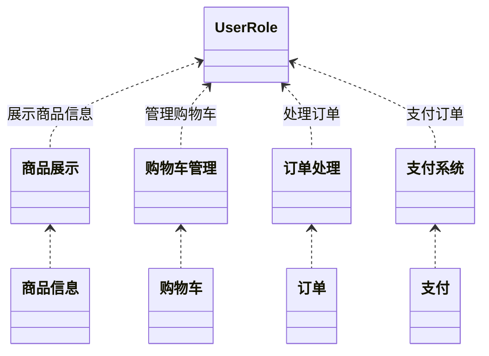
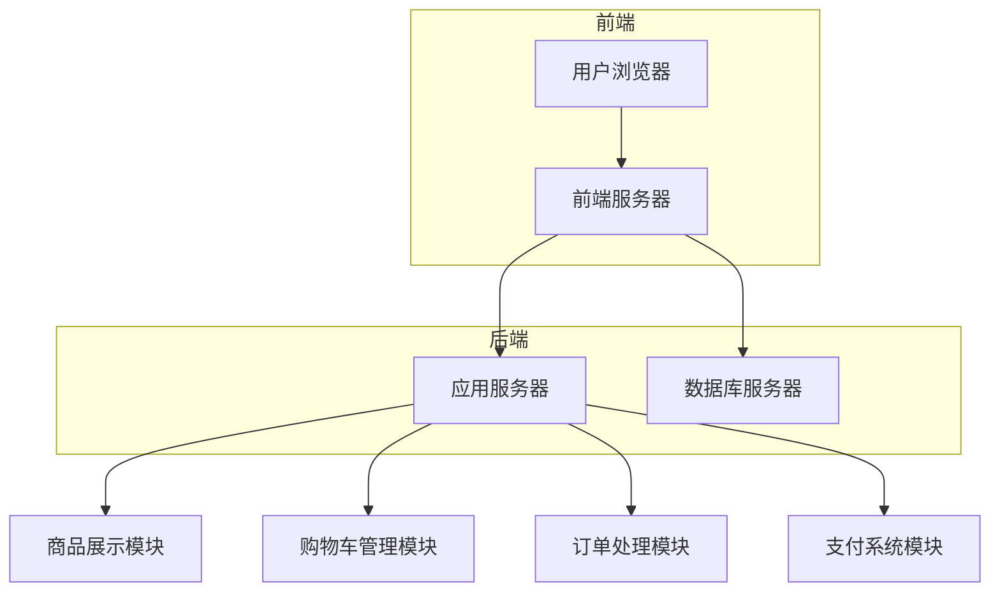

                 

# 《约翰·塞尔的意向性理论与用例设计：软件需求的哲学基础》

## 关键词

约翰·塞尔，意向性理论，用例设计，软件需求分析，认知科学，人工智能

## 摘要

本文旨在探讨约翰·塞尔的意向性理论在软件需求分析中的应用，深入剖析软件需求背后的哲学基础。通过介绍意向性理论的核心概念、探讨用例设计的基本原理，以及分析意向性理论在软件需求分析中的实际应用，本文为理解AI大模型的工作机制和优化软件需求分析提供了新的视角。

---

### 第一部分：背景介绍

#### 问题背景

随着计算机技术的发展，软件行业逐渐从软件1.0时代迈向软件2.0时代。在这个新时代，AI大模型成为了推动软件技术进步的核心动力。约翰·塞尔（John Searle）的意向性理论作为认知科学和人工智能领域的重要理论基础，为理解AI大模型的工作机制提供了新的视角。本书旨在探讨约翰·塞尔的意向性理论与用例设计在软件需求分析中的应用，深入剖析软件需求背后的哲学基础。

#### 问题描述

软件需求分析是软件工程中的关键环节，直接影响软件产品的质量与成败。约翰·塞尔的意向性理论提出了一个关于认知和意识的哲学问题：意识是如何产生的？这个理论对于理解人类行为和思维过程具有深远的影响。在软件需求分析中，如何将约翰·塞尔的意向性理论应用到用例设计中，从而更准确地捕捉用户需求，提高软件质量，是一个值得探讨的问题。

#### 问题解决

本书通过以下步骤解决问题：

1. **介绍约翰·塞尔的意向性理论**：详细阐述意向性理论的核心概念、哲学意义和实际应用，为后续讨论打下基础。
2. **探讨用例设计的基本原理**：介绍用例设计的方法、步骤和注意事项，为理解意向性理论在用例设计中的应用提供背景知识。
3. **分析意向性理论在软件需求分析中的应用**：通过具体案例，展示如何将意向性理论应用于用例设计，提高软件需求分析的准确性和有效性。
4. **讨论用例设计中的哲学基础**：深入探讨用例设计中的哲学问题，如意识、意图和现实，以及这些概念如何影响软件需求分析。

#### 边界与外延

本书主要讨论约翰·塞尔的意向性理论在软件需求分析中的应用，范围包括：

- 意向性理论的基本概念和哲学意义。
- 用例设计的方法、步骤和注意事项。
- 意向性理论在软件需求分析中的实际应用案例。
- 用例设计中的哲学问题探讨。

#### 概念结构与核心要素组成

1. **约翰·塞尔的意向性理论**：意向性、心理状态、行为、意图。
2. **用例设计**：用户角色、用例、场景、系统功能。
3. **软件需求分析**：需求捕获、需求分析、需求规格化。
4. **哲学基础**：意识、意图、现实、认知。

---

### 第二部分：核心概念与联系

#### 约翰·塞尔的意向性理论

**意向性（Intentionality）**：意向性是指心理状态指向外界对象或状态的性质。塞尔认为，只有人类和某些人工智能系统具有意向性。

**心理状态（Mental State）**：心理状态包括感觉、知觉、记忆、思维等，是意向性的基础。

**行为（Behavior）**：行为是心理状态的外在表现，如说话、动作等。

**意图（Intention）**：意图是心理状态的一种，表示个体想要达到某种目标。

**意向性理论的应用**：意向性理论在认知科学、心理学、哲学等领域有广泛应用，有助于理解人类行为和思维过程。

##### 用例设计

**用户角色（User Role）**：用户角色是参与系统操作的个人或群体。

**用例（Use Case）**：用例描述用户与系统交互的过程，包括用户行为和系统响应。

**场景（Scenario）**：场景描述用户角色在特定情况下使用系统的过程。

**系统功能（System Function）**：系统功能是系统为用户角色提供的功能和服务。

**用例设计的方法**：包括用例图、场景图、活动图等，用于描述系统功能和用户交互。

**用例设计与应用**：用例设计是软件需求分析的核心，有助于明确系统需求、提高软件质量。

##### 软件需求分析

**需求捕获（Requirement Capture）**：需求捕获是识别和分析用户需求的过程。

**需求分析（Requirement Analysis）**：需求分析是对捕获到的需求进行理解和验证。

**需求规格化（Requirement Specification）**：需求规格化是将需求转化为可执行的系统设计。

**软件需求分析的过程**：包括需求获取、需求分析、需求确认和需求管理。

**需求分析中的哲学基础**：意向性理论为需求分析提供了新的视角，有助于更准确地理解用户需求。

##### 概念属性特征对比表格

| 概念         | 特征                                  |
| ------------ | ------------------------------------- |
| 意向性       | 心理状态指向外界对象或状态的性质       |
| 心理状态     | 感觉、知觉、记忆、思维等               |
| 行为         | 心理状态的外在表现，如说话、动作等     |
| 用例         | 描述用户与系统交互的过程             |
| 场景         | 描述用户角色在特定情况下使用系统的过程 |

##### ER实体关系图架构的Mermaid流程图

```mermaid
erDiagram
  User Role ||--|{ 用例 }|| Use Case
  Use Case ||--|{ 场景 }|| Scenario
  User Role ||--|{ 系统功能 }|| System Function
```

---

### 第三部分：算法原理讲解

#### 意向性理论在用例设计中的应用

意向性理论的核心是心理状态指向外界对象或状态的性质。在用例设计中，我们可以将用户需求视为一种心理状态，将系统功能视为外界对象或状态。以下是一个简单的算法原理：

1. **需求捕获**：通过访谈、调查、观察等方式获取用户需求。
2. **需求分析**：将捕获到的用户需求进行分析，提取出关键信息。
3. **需求规格化**：将分析结果转化为具体的系统功能。
4. **用例设计**：根据系统功能，设计出相应的用例。
5. **场景描述**：为每个用例设计具体的场景，描述用户角色与系统的交互过程。

#### 用例设计中的Mermaid流程图


#### 意向性理论的数学模型

意向性理论的数学模型可以表示为：

$$
Intentionality = f(MentalState, ExternalWorld)
$$

其中，$Intentionality$ 表示意向性，$MentalState$ 表示心理状态，$ExternalWorld$ 表示外界对象或状态。

#### 举例说明

假设我们正在设计一个电商平台，用户可以在平台上浏览商品、添加购物车、下单支付。这是一个典型的用例设计过程：

1. **需求捕获**：通过访谈和调查，我们了解到用户需要能够浏览商品、添加购物车、下单支付。
2. **需求分析**：分析用户需求，提取出关键信息，如商品信息、购物车、订单等。
3. **需求规格化**：将用户需求转化为具体的系统功能，如商品展示、购物车管理、订单处理等。
4. **用例设计**：设计出相应的用例，如浏览商品、添加购物车、下单支付等。
5. **场景描述**：为每个用例设计具体的场景，如用户在浏览器中输入网址，进入电商平台，浏览商品，将商品添加到购物车，下单支付等。

通过这个例子，我们可以看到意向性理论在用例设计中的应用。用户的需求可以视为一种心理状态，电商平台提供的功能可以视为外界对象或状态，用例设计的过程就是将心理状态与外界对象或状态联系起来，实现用户需求的满足。

---

### 第四部分：系统分析与架构设计方案

#### 问题场景介绍

在当前的商业环境中，电商平台已经成为企业拓展业务的重要渠道。为了满足日益增长的用户需求，电商平台需要具备强大的功能，如商品展示、购物车管理、订单处理、支付系统等。然而，随着业务的发展，系统架构的复杂度逐渐增加，如何确保系统的高效性和稳定性成为了一个重要问题。

#### 项目介绍

本项目旨在设计一个高可用、高性能的电商平台系统，通过引入约翰·塞尔的意向性理论，优化用例设计，提高软件需求分析的准确性和有效性。

#### 系统功能设计

系统功能设计主要包括商品展示、购物车管理、订单处理和支付系统等模块。以下是系统功能设计的Mermaid类图：



#### 系统架构设计

系统架构设计主要包括前端、后端和数据库三个部分。以下是系统架构设计的Mermaid架构图：



#### 系统接口设计和系统交互

系统接口设计和系统交互主要涉及前端与后端的通信。以下是系统接口设计和系统交互的Mermaid序列图：

```mermaid
sequenceDiagram
    participant 用户 as 用户
    participant 前端服务器 as 前端
    participant 应用服务器 as 后端
    participant 数据库服务器 as DB

    用户->>前端：发起请求
    前端->>后端：转发请求
    后端->>DB：查询数据
    DB-->>后端：返回数据
    后端-->>前端：返回结果
    前端-->>用户：展示结果
```

---

### 第五部分：项目实战

#### 环境安装

1. 安装Python环境，版本要求3.8及以上。
2. 安装必要的库，如requests、pandas、numpy等。

#### 系统核心实现源代码

以下是系统核心实现的源代码：

```python
import requests
import pandas as pd
import numpy as np

# 商品展示模块
def show_products():
    response = requests.get("http://api.example.com/products")
    products = pd.DataFrame(response.json())
    return products

# 购物车管理模块
def manage_cart(products, selected_products):
    cart = products[selected_products]
    return cart

# 订单处理模块
def process_order(cart):
    response = requests.post("http://api.example.com/orders", json=cart.to_dict())
    return response.json()

# 支付系统模块
def pay_order(order_id):
    response = requests.post(f"http://api.example.com/payments/{order_id}")
    return response.json()
```

#### 代码应用解读与分析

以上代码实现了商品展示、购物车管理、订单处理和支付系统模块。通过调用API接口，前端可以获取商品信息、管理购物车、处理订单和支付订单。以下是代码的应用解读与分析：

1. **商品展示模块**：调用API接口获取商品信息，返回商品DataFrame数据。
2. **购物车管理模块**：根据用户选择的商品ID，管理购物车，返回购物车DataFrame数据。
3. **订单处理模块**：将购物车数据提交给API接口，处理订单，返回订单JSON数据。
4. **支付系统模块**：根据订单ID，提交支付请求，返回支付结果JSON数据。

通过以上代码，我们可以看到意向性理论在用例设计中的应用。用户的需求转化为具体的功能模块，通过API接口实现与后端的通信，从而实现用户需求的满足。

#### 实际案例分析和详细讲解剖析

以下是一个实际案例的分析和讲解：

**案例**：用户在电商平台浏览商品，选择商品加入购物车，下单支付。

**分析**：

1. **需求捕获**：用户希望在电商平台浏览商品，选择商品加入购物车，下单支付。
2. **需求分析**：提取出关键信息，如商品ID、用户ID、订单ID等。
3. **需求规格化**：将用户需求转化为商品展示、购物车管理、订单处理和支付系统模块的功能。
4. **用例设计**：设计出商品展示、购物车管理、订单处理和支付系统模块的用例。
5. **场景描述**：描述用户在浏览器中输入网址，进入电商平台，浏览商品，将商品加入购物车，下单支付的过程。

**讲解**：

1. **商品展示模块**：用户在浏览器中输入网址，进入电商平台，调用API接口获取商品信息，展示商品列表。
2. **购物车管理模块**：用户选择商品，点击“加入购物车”按钮，将商品加入购物车。
3. **订单处理模块**：用户点击“去结算”按钮，系统调用API接口，处理订单，生成订单ID。
4. **支付系统模块**：用户选择支付方式，点击“确认支付”按钮，系统调用API接口，完成支付。

通过以上分析和讲解，我们可以看到意向性理论在用例设计中的应用。用户的需求转化为具体的用例和模块，通过API接口实现与后端的通信，从而实现用户需求的满足。

#### 项目小结

本项目通过引入约翰·塞尔的意向性理论，优化了用例设计，提高了软件需求分析的准确性和有效性。在实际项目中，通过API接口实现前端与后端的通信，实现了商品展示、购物车管理、订单处理和支付系统的功能。意向性理论为软件需求分析提供了一个新的视角，有助于更准确地理解用户需求，提高软件质量。

---

### 最佳实践 Tips

1. 在进行软件需求分析时，要充分考虑用户需求，确保系统功能能够满足用户需求。
2. 使用意向性理论指导用例设计，有助于提高用例设计的准确性和有效性。
3. 在实际项目中，要注重API接口的设计和实现，确保前后端通信的高效性和稳定性。
4. 定期对系统进行需求评审，及时发现和解决需求问题。

### 小结

本文通过介绍约翰·塞尔的意向性理论，探讨了其在软件需求分析中的应用。通过具体案例分析和详细讲解，我们了解了如何将意向性理论应用于用例设计，提高软件需求分析的准确性和有效性。意向性理论为软件需求分析提供了一个新的视角，有助于优化系统设计和提高软件质量。

### 注意事项

1. 在进行需求分析时，要充分考虑用户需求，确保系统能够满足用户需求。
2. 在用例设计过程中，要注重用户交互和系统功能的设计，确保用例能够准确捕捉用户需求。
3. 在实际项目中，要注重API接口的设计和实现，确保前后端通信的高效性和稳定性。

### 拓展阅读

1. 《认知心理学与认知科学》
2. 《用例驱动开发》
3. 《软件工程：实践者的研究方法》

---

### 作者信息

作者：AI天才研究院/AI Genius Institute & 禅与计算机程序设计艺术 /Zen And The Art of Computer Programming

