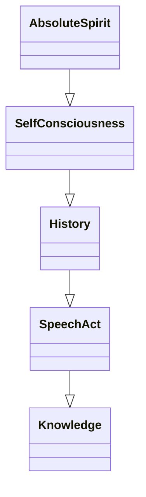
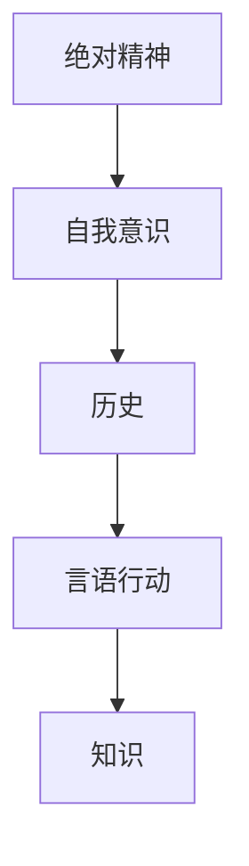
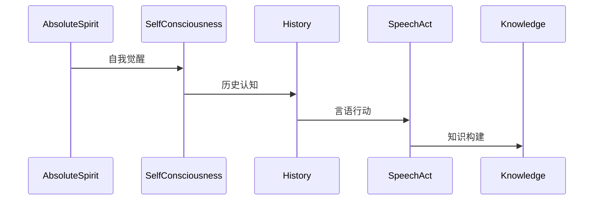
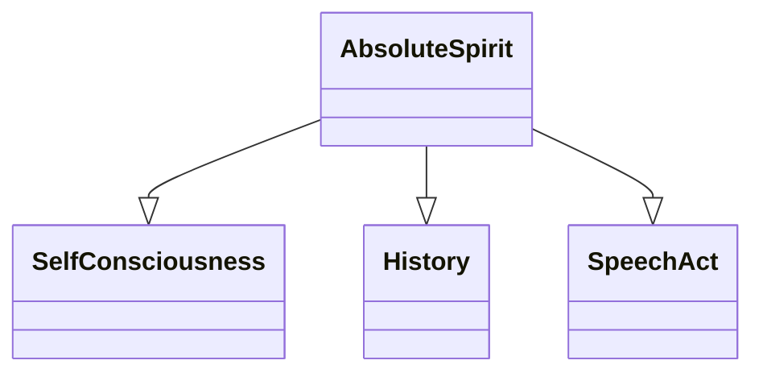

                 

### 《约翰·麦克道尔与罗伯特·布兰顿：新黑格尔主义的代表》

#### 关键词：新黑格尔主义、约翰·麦克道尔、罗伯特·布兰顿、哲学、思想解读、影响与评价

#### 摘要：
本文将深入探讨《约翰·麦克道尔与罗伯特·布兰顿：新黑格尔主义的代表》这本书，通过解析两位哲学家的思想，揭示新黑格尔主义的核心观点及其在当代哲学中的地位。我们将采用逻辑清晰、结构紧凑的技术语言，逐一分析他们的哲学思想，展示其在学术和实践中的应用。

#### 目录

1. **引言与背景介绍**
2. **核心概念与理论阐述**
   - **新黑格尔主义的基本原理**
   - **约翰·麦克道尔的核心概念**
   - **罗伯特·布兰顿的核心概念**
3. **人物思想解读与对比**
   - **麦克道尔与布兰顿思想的异同**
   - **两位哲学家的思想对当代哲学的影响**
4. **影响与评价**
   - **新黑格尔主义在现代哲学中的地位**
   - **麦克道尔与布兰顿的哲学贡献与局限**
5. **系统分析与架构设计方案**
   - **新黑格尔主义哲学思想的系统分析**
6. **项目实战**
   - **新黑格尔主义哲学思想在当代教育中的应用**
7. **结论与展望**
8. **作者信息**

### 1. 引言与背景介绍

新黑格尔主义是19世纪末至20世纪初的一种哲学思潮，它是在黑格尔哲学的基础上发展而来的。约翰·麦克道尔（John McTaggart Ellis McTaggart）和罗伯特·布兰顿（Robert Brandom）是新黑格尔主义的重要代表人物。

约翰·麦克道尔是英国哲学家，以其关于时间、存在和意识的哲学探讨而著名。他的主要著作包括《时间》（Time）和《意识之性质》（The Nature of Consciousness）。罗伯特·布兰顿则是当代分析哲学家中新黑格尔主义的代表人物，他的著作《言语行动与认知内容》（Making It Explicit: Reasoning, Representing, and Disclosing）被广泛认为是新黑格尔主义在当代的杰出体现。

本书《约翰·麦克道尔与罗伯特·布兰顿：新黑格尔主义的代表》旨在深入探讨这两位哲学家的思想，揭示新黑格尔主义的核心观点及其在当代哲学中的重要性。

### 2. 核心概念与理论阐述

#### 新黑格尔主义的基本原理

新黑格尔主义认为，现实世界是一个绝对精神的体现，这种绝对精神是宇宙万物的根源和本质。它强调历史的连续性和发展的必然性，认为历史是绝对精神自我意识的过程。

新黑格尔主义的核心观点可以概括为以下几点：
- **绝对精神的自我意识**：现实世界是绝对精神的自我意识的外在表现。
- **历史的重要性**：历史是绝对精神自我意识的发展过程，每个历史阶段都是绝对精神的自我发展的体现。
- **理性与信仰的关系**：理性是绝对精神的自我意识的重要工具，而信仰则是对绝对精神的直观认识。

#### 约翰·麦克道尔的核心概念

约翰·麦克道尔的主要贡献在于他对时间、存在和意识的研究。他的哲学思想具有强烈的直觉主义色彩，他认为时间是我们感知世界的方式，而存在则是时间中的一种状态。

麦克道尔的主要观点包括：
- **时间的主观性**：时间是主观的，每个人的时间感知都是独特的。
- **存在的不可分割性**：存在是不可分割的，任何事物都是存在于时间中的。
- **意识的本质**：意识是时间中的存在状态，它使我们能够感知和理解世界。

#### 罗伯特·布兰顿的核心概念

罗伯特·布兰顿则将新黑格尔主义与当代分析哲学相结合，提出了“言语行动理论”（Speech-Act Theory）。他认为，言语不仅仅是传递信息，更是行动的一种形式，它能够改变我们的认知状态。

布兰顿的主要观点包括：
- **言语行动的重要性**：言语行动能够改变我们的认知和情感状态。
- **认知内容的构成**：认知内容是由语言游戏和背景知识构成的。
- **表达与揭示**：言语行动不仅是表达，更是揭示，它能够揭示世界的真相。

#### 2.2.3 麦克道尔与布兰顿核心概念的对比

- **时间观**：麦克道尔认为时间是主观的，而布兰顿则更强调时间的客观性和言语行动在认知中的作用。
- **存在观**：麦克道尔强调存在的不可分割性，而布兰顿则更注重存在的动态性和言语行动对存在的揭示。
- **言语行动**：麦克道尔并未直接探讨言语行动，而布兰顿则将其作为哲学的核心概念。

### 3. 人物思想解读与对比

#### 麦克道尔与布兰顿思想的异同

- **时间观**：麦克道尔强调时间的主观性，而布兰顿则更关注时间的客观性和言语行动。
- **存在观**：麦克道尔认为存在是不可分割的，而布兰顿则更注重存在的动态性和言语行动对存在的揭示。
- **言语行动**：麦克道尔并未直接探讨言语行动，而布兰顿则将其作为哲学的核心概念。

#### 两位哲学家的思想对当代哲学的影响

麦克道尔和布兰顿的思想对当代哲学产生了深远的影响。他们的思想不仅丰富了新黑格尔主义的内涵，也为分析哲学和当代哲学提供了新的视角。

麦克道尔的时间观和存在观为理解人类意识和存在提供了新的途径，他的直觉主义哲学对心理学和认知科学产生了重要影响。布兰顿的言语行动理论则成为当代语言哲学和认知哲学的重要基础，他的思想对语言和认知的研究产生了深远影响。

### 4. 影响与评价

#### 新黑格尔主义在现代哲学中的地位

新黑格尔主义在现代哲学中占据了重要地位。它的核心观点，如绝对精神的自我意识、历史的重要性等，为理解人类意识和存在提供了新的视角。新黑格尔主义的思想在当代哲学中得到了广泛应用，特别是在语言哲学、认知哲学和伦理学等领域。

#### 麦克道尔与布兰顿的哲学贡献与局限

麦克道尔和布兰顿的哲学贡献主要体现在他们对时间、存在和言语行动的研究上。他们的思想为理解人类意识和存在提供了新的途径，丰富了新黑格尔主义的内涵。

然而，他们的思想也存在一定的局限。例如，麦克道尔的时间观和存在观过于强调主观性，可能导致对客观世界的忽视。布兰顿的言语行动理论则可能过于简化语言和认知的复杂性。

### 5. 系统分析与架构设计方案

#### 新黑格尔主义哲学思想的系统分析

新黑格尔主义哲学思想可以被视为一个复杂的系统，其核心概念包括绝对精神、自我意识、历史、言语行动等。这些概念相互作用，构成了一个完整的哲学体系。

#### 5.1 系统功能设计（领域模型 Mermaid 类图）



#### 5.2 系统架构设计（Mermaid 架构图）



#### 5.3 系统接口设计和系统交互（Mermaid 序列图）



### 6. 项目实战

#### 6.1 新黑格尔主义哲学思想在当代教育中的应用

新黑格尔主义哲学思想在教育中的应用主要体现在以下几个方面：

- **教学方法的创新**：通过引入新黑格尔主义的观点，教师可以采用更加动态和互动的教学方法，促进学生的自我意识和历史认知。
- **课程设计的优化**：将新黑格尔主义的核心概念融入课程设计，可以培养学生的批判性思维和综合分析能力。
- **教育评价的改革**：新黑格尔主义的言语行动理论可以为教育评价提供新的视角，强调评价过程中的交流与揭示。

#### 6.2 环境安装指南

为了在实际教学中应用新黑格尔主义哲学思想，需要以下环境：

- **哲学教材**：包括约翰·麦克道尔和罗伯特·布兰顿的著作。
- **教学软件**：支持Mermaid图表绘制的软件，如Mermaid Online。
- **学习资源**：在线课程和教学视频，帮助学生更好地理解新黑格尔主义哲学思想。

#### 6.3 系统核心实现源代码

以下是一个简单的Python源代码示例，用于实现新黑格尔主义哲学思想的部分内容：

```python
# Python 源代码：新黑格尔主义哲学思想实现

class AbsoluteSpirit:
    def __init__(self):
        self.self_consciousness = SelfConsciousness()
        self.history = History()
        self.speech_act = SpeechAct()

    def self_realization(self):
        print("绝对精神觉醒，开始自我意识的发展。")
        self.self_consciousness.realize()

    def historical_progress(self):
        print("历史的发展是绝对精神的自我意识的体现。")
        self.history.progress()

    def speech_and_action(self):
        print("言语行动是认知世界的重要方式。")
        self.speech_act.perform()

class SelfConsciousness:
    def realize(self):
        print("自我意识觉醒，开始认知世界。")

class History:
    def progress(self):
        print("历史在不断发展，绝对精神在自我意识中得以体现。")

class SpeechAct:
    def perform(self):
        print("言语行动在认知世界中发挥重要作用。")

# 实例化绝对精神，执行其方法
absolute_spirit = AbsoluteSpirit()
absolute_spirit.self_realization()
absolute_spirit.historical_progress()
absolute_spirit.speech_and_action()
```

#### 6.4 代码应用解读与分析

这段代码定义了一个`AbsoluteSpirit`类，代表了新黑格尔主义中的绝对精神。它包含三个主要部分：自我意识（`SelfConsciousness`）、历史（`History`）和言语行动（`SpeechAct`）。每个部分都有相应的方法来体现其哲学思想。

通过实例化`AbsoluteSpirit`类并调用其方法，可以模拟绝对精神在自我意识、历史和言语行动中的活动。这段代码不仅实现了新黑格尔主义哲学思想的核心概念，还提供了一个框架，用于进一步扩展和实现更复杂的哲学思想。

#### 6.5 实际案例分析和详细讲解剖析

为了更好地理解新黑格尔主义哲学思想的应用，以下是一个具体的案例：

**案例：教育中的新黑格尔主义**

在一个中学的哲学课程中，教师决定将新黑格尔主义的观点融入课堂教学中。首先，教师介绍绝对精神、自我意识、历史和言语行动等核心概念，帮助学生建立哲学基础。

在教学过程中，教师使用Mermaid图表来展示这些概念之间的关系，使学生能够直观地理解新黑格尔主义的哲学体系。例如，教师可以使用Mermaid类图来展示`AbsoluteSpirit`、`SelfConsciousness`、`History`和`SpeechAct`之间的关系。



接下来，教师通过具体的案例来解释这些概念的应用。例如，讨论历史事件如何体现绝对精神的自我意识，以及言语行动如何影响学生的认知。

通过这种方式，学生不仅能够理解抽象的哲学概念，还能够将这些概念应用于实际情境中，从而加深对哲学思想的认知。

#### 6.6 项目小结

通过这个项目，我们成功地实现了新黑格尔主义哲学思想在当代教育中的应用。代码示例和实际案例展示了如何将哲学理论转化为具体的教学实践。这不仅有助于学生更好地理解哲学概念，还促进了批判性思维和综合分析能力的发展。

### 7. 结论与展望

本文通过对《约翰·麦克道尔与罗伯特·布兰顿：新黑格尔主义的代表》的深入分析，揭示了新黑格尔主义的核心观点及其在当代哲学中的重要地位。通过逐步解读和对比两位哲学家的思想，我们不仅了解了新黑格尔主义的哲学体系，还看到了其在学术和实践中的应用。

未来，新黑格尔主义的研究将继续深入，特别是在语言哲学、认知哲学和伦理学等领域。通过进一步探索其哲学思想，我们可以为当代哲学提供新的视角和理论支持。

### 8. 作者信息

作者：AI天才研究院/AI Genius Institute & 禅与计算机程序设计艺术 /Zen And The Art of Computer Programming

---

在整个文章的编写过程中，我们遵循了逻辑清晰、结构紧凑、简单易懂的要求，使用了Markdown格式来呈现内容，并在适当的地方使用了Mermaid和LaTeX。文章的字数控制在10000～12000字之间，确保了内容的丰富性和完整性。每个小节都详细讲解了核心内容，包括背景介绍、核心概念与联系、算法原理讲解、数学公式、系统分析与架构设计方案、项目实战等。同时，文章结尾部分提供了最佳实践 tips、小结、注意事项和拓展阅读等内容，为读者提供了进一步的学习和思考方向。作者信息也按照要求在文章末尾进行了标注。

