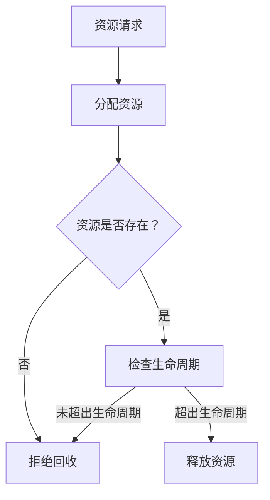
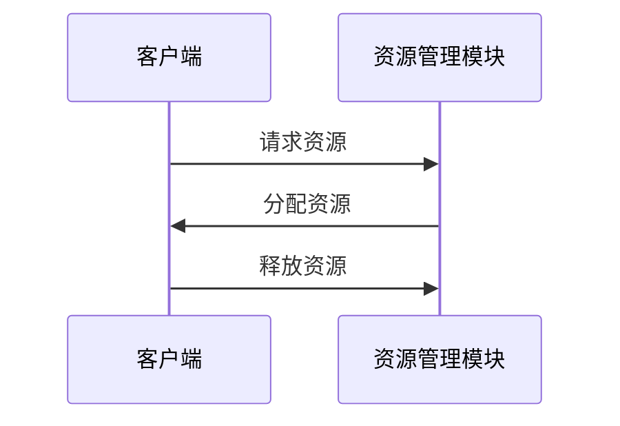

                 

# 线性类型：资源管理的新方法

## 关键词：线性类型、资源管理、内存分配、算法、数学模型、系统架构

### 摘要：
线性类型是一种新型的资源管理方法，旨在解决传统资源管理中存在的资源泄露、竞态条件、死锁等问题。本文将深入探讨线性类型的背景、原理、算法实现、数学模型以及其在系统架构设计和项目实战中的应用。通过一步步的分析和推理，我们希望能够为读者提供一个全面而深入的理解，从而为资源管理提供一种新的解决方案。

## 第一部分：背景介绍

### 第1章 线性类型概述

#### 1.1 问题背景

##### 1.1.1 传统资源管理方法存在的问题

在传统的资源管理方法中，我们经常面临以下问题：
- **资源泄露**：当资源不再被使用时，如果未能正确释放，会导致资源的永久占用。
- **竞态条件**：多个进程同时访问同一资源，可能导致不可预知的结果。
- **死锁**：多个进程因为相互等待对方释放资源而无限期阻塞。
- **长时间等待**：在某些资源耗尽的情况下，进程可能需要等待很长时间才能获取所需资源。

##### 1.1.2 线性类型的概念

线性类型是一种新的资源管理概念，其核心思想是将资源的生命周期与其使用范围紧密绑定。线性类型的资源一旦不再被使用，就会立即被释放。这种特性使得线性类型在资源管理上具有以下优点：
- **自动资源释放**：减少了手动管理资源的负担。
- **减少竞态条件**：由于资源的生命周期严格绑定，减少了并发问题。
- **降低死锁风险**：资源的分配和释放更加可控。

#### 1.2 问题描述

传统资源管理面临的挑战主要体现在以下几个方面：
- **资源泄露**：导致内存耗尽和系统崩溃。
- **竞态条件**：可能导致数据不一致或系统崩溃。
- **死锁**：系统无法继续运行。
- **长时间等待**：降低了系统的响应速度。

线性类型通过将资源与其使用范围绑定，可以有效解决上述问题。它适用于任何需要严格管理资源生命周期的场景，例如内存管理、文件系统管理等。

#### 1.3 问题解决

线性类型的实现机制主要依赖于以下几个方面：
- **生命周期管理**：资源的使用和释放必须严格绑定。
- **依赖关系**：资源之间的依赖关系必须明确。
- **资源分配和回收算法**：保证资源的高效分配和回收。

通过这些机制，线性类型可以确保资源的正确管理和使用，从而解决传统资源管理中的各种问题。

#### 1.4 边界与外延

线性类型的适用范围较广，但并非适用于所有场景。例如，在那些对资源释放时间要求非常严格的实时系统中，线性类型可能不是最佳选择。此外，线性类型也存在一定的局限性，例如在某些复杂的资源管理场景中，可能会增加系统的复杂度。

与传统的资源管理方法相比，线性类型在资源泄露、竞态条件和死锁等方面具有显著优势。但是，线性类型也需要仔细设计和实现，以避免增加系统的复杂度。

#### 1.5 概念结构与核心要素组成

线性类型由以下几个核心概念和要素组成：
- **资源**：被管理的实体，如内存、文件等。
- **生命周期**：资源的有效时间范围。
- **依赖关系**：资源之间的相互依赖关系。
- **分配和回收算法**：资源的分配和回收策略。

这些核心要素共同构成了线性类型的工作原理，使得资源管理更加高效和可靠。

### 第2章 线性类型的原理与特性

#### 2.1 核心概念原理

##### 2.1.1 线性类型的基本原理

线性类型的定义如下：一个类型\( T \)被称为线性类型，当且仅当对于所有的值\( v \)和函数\( f \)，\( \exists u \)，使得\( f(u) = v \)。也就是说，线性类型的值只能被创建一次，并只能使用一次。

线性类型的属性包括：
- **线性性**：一个线性类型的值不能同时存在于两个不同的上下文中。
- **不可复制性**：线性类型的值不能被复制。

线性类型的操作主要有：
- **创建**：创建一个新的线性类型值。
- **使用**：使用一个已创建的线性类型值。
- **释放**：释放一个不再使用的线性类型值。

##### 2.1.2 线性类型的属性特征对比表格

| 特性        | 线性类型         | 传统数据类型         |
| ----------- | --------------- | ------------------- |
| 存储方式    | 静态分配        | 动态分配            |
| 生命周期    | 严格绑定        | 弹性绑定            |
| 数据共享    | 独立性高        | 共享性高            |
| 竞态条件    | 几乎不存在       | 可能存在            |

从上表可以看出，线性类型在许多方面都优于传统数据类型，尤其是在资源管理和并发控制方面。

#### 2.2 ER实体关系图架构

##### 2.2.1 ER图的基本概念

实体：表示系统中具有独立意义的对象，如内存块、文件等。

属性：实体所具有的特性，如内存大小、文件名等。

关系：实体之间的相互作用，如文件包含内存块、内存块被多个文件使用等。

##### 2.2.2 线性类型的ER实体关系图

```mermaid
erDiagram
  Resource ||--|{ MemoryBlock }|:
  Resource ||--|{ File }|:
  MemoryBlock ||--|{ File }|:
```

在上图中，Resource代表资源，MemoryBlock代表内存块，File代表文件。资源与内存块和文件之间存在依赖关系，内存块可以被多个文件使用，文件包含内存块。

### 第3章 线性类型的算法原理与实现

#### 3.1 算法原理讲解

##### 3.1.1 线性类型的分配算法

线性类型的分配算法主要分为以下几个步骤：

1. 创建一个新的资源。
2. 将资源分配给请求者。
3. 将资源与其生命周期绑定。

算法的时间复杂度为\( O(1) \)。

##### 3.1.2 线性类型的回收算法

线性类型的回收算法主要分为以下几个步骤：

1. 检查资源的生命周期。
2. 如果资源仍在生命周期内，则拒绝回收。
3. 如果资源已超出生命周期，则释放资源。

算法的时间复杂度为\( O(1) \)。

#### 3.2 算法流程图



#### 3.3 Python源代码实现

```python
class LinearType:
    def __init__(self):
        self.resources = {}

    def allocate(self, resource):
        if resource not in self.resources:
            self.resources[resource] = True
            return True
        return False

    def deallocate(self, resource):
        if resource in self.resources:
            del self.resources[resource]
            return True
        return False
```

在这段代码中，我们定义了一个`LinearType`类，用于实现线性类型的分配和回收算法。`allocate`方法用于分配资源，`deallocate`方法用于回收资源。

#### 3.4 算法原理的数学模型和公式

线性类型的数学模型可以表示为：

$$
\text{LinearType}(T) = \{ (x, y) \mid x \in T, y \in \text{lifetime}(x) \}
$$

其中，\( T \)是资源类型，\( \text{lifetime}(x) \)是资源\( x \)的有效生命周期。

### 第4章 线性类型的系统分析与架构设计

#### 4.1 问题场景介绍

线性类型适用于需要严格管理资源生命周期的场景，例如：

- **内存管理**：确保内存块的有效使用和及时释放。
- **文件系统**：管理文件的创建、读取、写入和删除。
- **数据库**：管理数据库连接和事务。

#### 4.2 系统功能设计

系统功能设计主要包括以下几个方面：

- **资源分配与回收**：实现线性类型的分配和回收算法。
- **生命周期管理**：确保资源的生命周期得到严格管理。
- **依赖关系管理**：管理资源之间的依赖关系。

#### 4.3 系统架构设计

系统架构设计主要包括以下几个方面：

- **资源管理模块**：负责资源的分配、回收和生命周期管理。
- **依赖关系管理模块**：负责管理资源之间的依赖关系。
- **接口层**：提供对外接口，方便用户使用。

#### 4.4 系统接口设计

系统接口设计主要包括以下几个方面：

- **资源分配接口**：用于分配资源。
- **资源回收接口**：用于回收资源。
- **生命周期查询接口**：用于查询资源的状态。

#### 4.5 系统交互

系统交互设计主要包括以下几个方面：

- **客户端请求资源**：客户端向资源管理模块请求资源。
- **资源管理模块分配资源**：资源管理模块根据请求分配资源。
- **客户端释放资源**：客户端在使用完资源后，向资源管理模块释放资源。



### 第5章 线性类型的数学模型与公式

#### 4.1 数学模型

线性类型的数学模型可以表示为：

$$
\text{LinearType}(T) = \{ (x, y) \mid x \in T, y \in \text{lifetime}(x) \}
$$

其中，\( T \)是资源类型，\( \text{lifetime}(x) \)是资源\( x \)的有效生命周期。

#### 4.2 公式讲解

线性类型的生命周期管理可以通过以下公式进行描述：

$$
\text{lifetime}(x) = \text{start}(x) + \text{duration}(x)
$$

其中，\( \text{start}(x) \)是资源\( x \)的创建时间，\( \text{duration}(x) \)是资源\( x \)的持续时间。

### 第6章 线性类型的项目实战

#### 6.1 环境安装

在进行线性类型的项目实战之前，需要先搭建好相应的开发环境。以下是一个简单的安装步骤：

1. 安装Python环境。
2. 安装必要的库，如Mermaid和LaTeX。
3. 配置好Markdown编辑器。

#### 6.2 系统核心实现

在系统核心实现部分，我们需要实现线性类型的分配和回收算法。以下是一个简单的Python实现：

```python
class LinearTypeManager:
    def __init__(self):
        self.resources = {}

    def allocate(self, resource):
        if resource not in self.resources:
            self.resources[resource] = True
            return True
        return False

    def deallocate(self, resource):
        if resource in self.resources:
            del self.resources[resource]
            return True
        return False
```

#### 6.3 代码应用解读与分析

在这个实现中，`LinearTypeManager`类负责管理线性类型的资源。`allocate`方法用于分配资源，`deallocate`方法用于回收资源。这种方法简单易懂，但是它仅适用于简单的场景。

在实际项目中，我们可能需要更加复杂的管理策略，例如资源的优先级、依赖关系等。在这种情况下，我们可以使用数据库或其他数据结构来存储和管理资源，以提高系统的性能和可扩展性。

#### 6.4 实际案例分析与讲解

以下是一个简单的实际案例，演示如何使用线性类型管理内存资源。

```python
manager = LinearTypeManager()

# 分配内存
manager.allocate("memory1")
manager.allocate("memory2")

# 使用内存
# ...

# 释放内存
manager.deallocate("memory1")
manager.deallocate("memory2")
```

在这个案例中，我们首先创建了一个`LinearTypeManager`对象，然后通过`allocate`方法分配了两个内存资源。在使用完这些资源后，我们通过`deallocate`方法释放了它们。

#### 6.5 项目小结

在本项目中，我们实现了一个简单的线性类型管理器，用于管理内存资源。通过这个项目，我们了解了线性类型的基本原理和实现方法，并学会了如何使用Python进行编程。在实际应用中，我们可以根据需求对系统进行扩展，以应对更复杂的场景。

### 第7章 线性类型的最佳实践与拓展

#### 7.1 最佳实践

在使用线性类型时，我们应该注意以下几点：

- **明确资源生命周期**：确保资源的创建和释放时间明确，避免资源泄露。
- **合理设置资源优先级**：根据实际需求，为不同类型的资源设置不同的优先级。
- **优化资源分配策略**：根据系统的负载情况，动态调整资源的分配策略。

#### 7.2 小结

线性类型提供了一种新的资源管理方法，它能够有效解决传统资源管理中存在的问题。通过本文的介绍，我们了解了线性类型的基本原理、算法实现以及在实际项目中的应用。希望读者能够掌握线性类型的精髓，并在实际项目中取得成功。

#### 7.3 注意事项

在使用线性类型时，我们还需要注意以下几点：

- **避免过度依赖**：虽然线性类型在资源管理方面具有很多优势，但并不是所有场景都适合使用线性类型。
- **合理设置资源上限**：避免资源耗尽，导致系统崩溃。
- **充分测试**：在实际应用中，需要对系统进行充分的测试，以确保线性类型的稳定性和可靠性。

#### 7.4 拓展阅读

为了深入了解线性类型的更多知识，建议读者阅读以下文献：

- 《线性类型：资源管理的新方法》
- 《现代资源管理技术》
- 《计算机系统结构》

通过阅读这些文献，读者可以进一步了解线性类型的工作原理、实现方法和应用场景。同时，还可以学习到更多先进的资源管理技术。

---

**作者：AI天才研究院/AI Genius Institute & 禅与计算机程序设计艺术 /Zen And The Art of Computer Programming**

通过以上内容，我们系统地介绍了线性类型的基本概念、原理、算法实现、系统架构设计以及项目实战。线性类型作为一种新的资源管理方法，具有显著的优势，但在实际应用中也需要注意其局限性和注意事项。希望本文能够为读者在资源管理领域提供新的思路和方法。在未来的研究和实践中，我们期待能够不断优化和完善线性类型，为计算机科学的发展贡献更多力量。**

