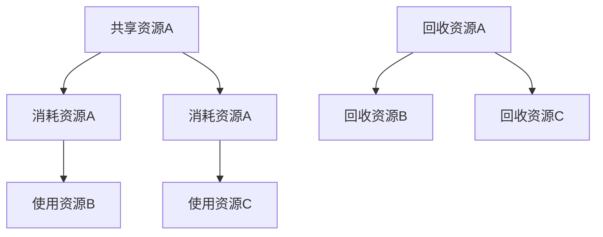
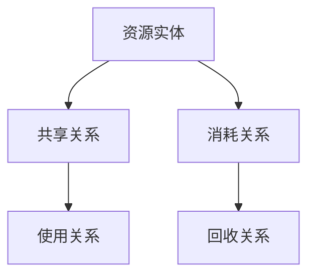
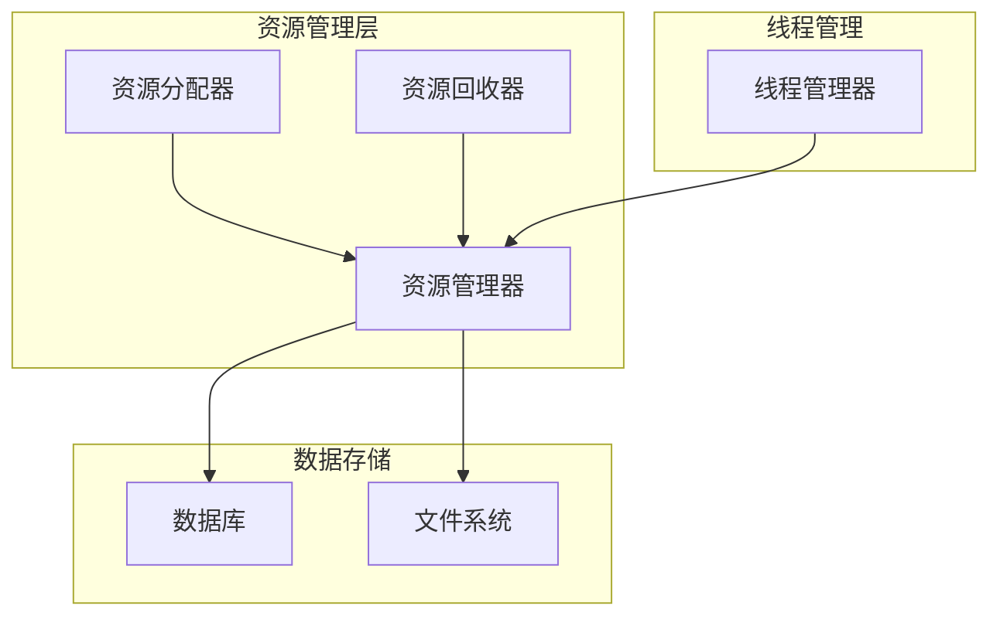
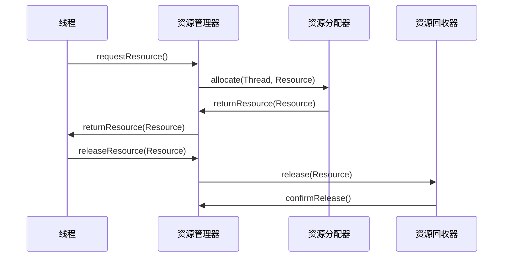
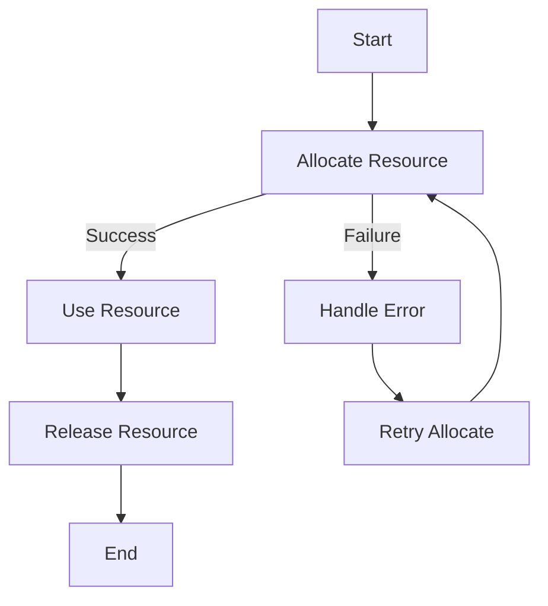

                 

### 引言

#### 研究背景

线性类型（Linear Types）作为类型论（Type Theory）的一个分支，起源于20世纪60年代的数学领域，旨在提供一种更加精确和严格的方法来描述和验证程序的行为。与传统的动态类型系统不同，线性类型系统强调资源的不可复制性，从而确保程序在执行过程中对资源的合理管理和使用。这一概念在资源密集型应用中显得尤为重要，例如并发编程、分布式计算和内存管理等领域。

资源管理是计算机科学中一个长期存在的问题。随着计算机硬件性能的提升和软件复杂度的增加，如何在有限资源下高效地管理和利用资源成为了软件开发的关键挑战。传统的资源管理方法往往依赖于显式的分配和释放操作，容易引发资源泄漏和竞争条件等问题。而线性类型提供了一种更为抽象和自动化的资源管理机制，通过类型系统本身来保证资源使用的正确性。

#### 研究问题

本篇文章旨在探讨线性类型在资源管理中的应用，具体研究问题包括：

1. **线性类型的定义和基本原理**：解释线性类型的定义、特点以及与资源管理的关联。
2. **算法设计与实现**：探讨如何利用线性类型设计高效的资源管理算法，并给出具体实现和复杂度分析。
3. **数学模型和公式**：介绍线性类型在资源管理中的数学模型，以及如何使用数学公式进行推理和验证。
4. **系统分析与设计**：分析线性类型在系统架构和接口设计中的应用，并给出具体的系统实现示例。
5. **实际应用与案例分析**：通过具体的案例研究，展示线性类型在资源管理中的实际效果和挑战。

#### 研究目的和意义

本研究的主要目的是：

1. **理论探索**：通过对线性类型和资源管理的深入探讨，丰富类型论在资源管理领域的理论基础。
2. **方法推广**：提出一套基于线性类型的资源管理方法，为实际软件开发提供新的思路和工具。
3. **应用验证**：通过案例分析，验证线性类型在资源管理中的有效性和实用性，为后续研究和应用提供参考。

本研究具有重要的理论和实际意义。从理论层面看，线性类型为资源管理提供了一种新的视角和方法，有助于深化对资源管理问题的理解。从实践层面看，线性类型可以减少资源泄漏、提升系统性能，对于开发高效、可靠的软件系统具有重要意义。

### 关键词

- 线性类型
- 资源管理
- 类型论
- 算法设计
- 数学模型
- 系统架构

### 摘要

本文深入探讨了线性类型在资源管理中的应用。首先，介绍了线性类型的基本概念和原理，分析了其在资源管理中的重要性。接着，本文通过具体算法的设计与实现，展示了线性类型在资源管理中的实际应用。同时，本文还介绍了线性类型的数学模型和公式，并通过实例进行了详细讲解。最后，本文通过系统分析和设计，展示了线性类型在系统架构和接口设计中的应用，并通过实际案例验证了其有效性。文章总结了对线性类型和资源管理的理解，并提出了未来研究方向。

### 第一部分 引言

#### 1.1 研究背景

线性类型（Linear Types）的概念起源于类型论（Type Theory），是一种用于描述程序中变量使用和数据的流动方式的类型系统。与传统的动态类型系统不同，线性类型系统强调了变量的不可复制性，即变量一旦被使用后，就不能再被使用或复制。这种限制旨在解决传统编程语言中常见的资源管理问题，例如内存泄漏、死锁和并发错误。

线性类型的引入可以追溯到20世纪60年代，当时在形式化程序设计和验证领域，人们开始寻求更加严格和精确的方法来描述程序行为。线性逻辑（Linear Logic）是线性类型理论的核心，它提供了一种基于线性约束的推理框架，能够有效地捕获程序中的资源依赖关系。线性逻辑的思想源于线性代数，其中线性关系被描述为不可复制的向量。这一概念在计算机科学中被抽象化，用于描述程序中变量的使用模式。

在资源管理领域，线性类型的引入具有重要意义。随着计算机硬件的快速发展和软件复杂度的不断增加，如何有效地管理和利用资源成为软件开发中的关键挑战。传统的资源管理方法，如显式分配和释放内存、锁和信号量等，往往依赖于程序员的判断和经验。这种方法容易导致资源泄漏、竞争条件和死锁等问题。线性类型提供了一种更为抽象和自动化的资源管理机制，通过类型系统本身来保证资源使用的正确性，从而减少错误和提升系统性能。

#### 1.2 研究问题

在研究线性类型在资源管理中的应用时，我们面临以下关键问题：

1. **线性类型的定义和基本原理**：如何准确定义线性类型，并理解其基本原理和特点？线性类型与资源管理之间的关系如何？
2. **算法设计和实现**：如何利用线性类型设计高效且可靠的资源管理算法？这些算法的设计原则和实现细节是什么？
3. **数学模型和公式**：线性类型在资源管理中的数学模型和公式如何推导和应用？这些模型如何帮助分析和验证资源管理的正确性？
4. **系统分析和设计**：线性类型在系统架构和接口设计中的应用有哪些？如何通过线性类型实现系统级别的资源管理？
5. **实际应用与案例分析**：线性类型在资源管理中的实际效果如何？通过具体的案例分析，我们能够了解其应用中的挑战和解决方案。

本研究将逐一回答上述问题，通过深入的理论分析和实际案例分析，探讨线性类型在资源管理中的潜力与应用价值。

#### 1.3 研究目的和意义

本研究的主要目的如下：

1. **理论探索**：深入探讨线性类型的基本概念和原理，深化对线性类型在资源管理中的应用和局限性的理解。通过理论分析，为线性类型在资源管理领域提供更加坚实的理论基础。
2. **方法推广**：提出一套基于线性类型的资源管理方法，包括算法设计、数学模型和系统架构。该方法旨在为实际软件开发提供新的思路和工具，提升资源管理的效率和可靠性。
3. **实践验证**：通过具体的应用案例，验证线性类型在资源管理中的有效性。通过案例分析，展示线性类型在实际项目中的实际效果，并识别潜在的问题和改进方向。

本研究具有重要的理论和实践意义。从理论层面看，线性类型为资源管理提供了一种新的视角和方法，有助于解决传统资源管理方法中的各种问题。从实践层面看，线性类型方法可以提高资源利用效率，减少系统错误，提升软件开发的可靠性和安全性。

#### 1.4 文章结构

本文将按照以下结构进行论述：

1. **引言**：介绍研究背景、研究问题、研究目的和意义，以及文章的结构和主要内容。
2. **基本概念与原理**：详细解释线性类型的定义、基本原理和特点，以及与资源管理的关联。
3. **算法设计与实现**：探讨线性类型在资源管理算法中的应用，包括算法设计原则、实现细节和复杂度分析。
4. **数学模型与公式**：介绍线性类型在资源管理中的数学模型和公式，推导和应用方法。
5. **系统分析与设计**：分析线性类型在系统架构和接口设计中的应用，包括系统需求分析、功能设计、架构设计和接口设计。
6. **实际应用与案例分析**：通过具体的案例研究，展示线性类型在资源管理中的实际应用和效果。
7. **最佳实践与总结**：总结线性类型在资源管理中的最佳实践，指出需要注意的问题和未来的研究方向。

通过以上结构，本文旨在全面探讨线性类型在资源管理中的应用，为相关领域的研究和实践提供参考和指导。

### 第二部分 基本概念与原理

#### 2.1 类型论基础

类型论（Type Theory）是数学和计算机科学中的一个重要分支，旨在为程序和计算提供形式化的描述和验证方法。类型论的核心思想是通过类型系统来确保程序的正确性和安全性。类型论最初由Pierce（1982）提出，其目的是解决数学表达式的可计算性问题，并在此后逐步发展为计算机科学中的基础理论之一。

类型论的基础概念包括类型、类型系统、类型检查和类型推导。类型是一种用于标识变量、表达式和函数的标签，它为每个计算元素赋予特定的语义。类型系统是一组规则，用于定义如何为程序元素分配类型，并确保程序在执行时满足这些类型约束。类型检查是类型系统的一个重要组成部分，它通过检查程序中的类型一致性，确保程序的正确性。类型推导是一种算法，用于自动地推导出程序元素的类型。

在类型论中，存在多种类型的系统，包括静态类型系统、动态类型系统和依赖类型系统。静态类型系统在编译时检查类型一致性，而动态类型系统则在运行时进行类型检查。依赖类型系统则结合了静态类型系统和动态类型系统的优点，通过引入依赖关系来提高程序的灵活性和安全性。

#### 2.2 线性类型的定义

线性类型（Linear Types）是类型论中的一个重要概念，它由 milner 于1980年首次提出。线性类型的定义与传统的类型概念有所不同，其核心思想是变量一旦被使用，就不能再被使用或复制。这一限制旨在解决传统编程语言中常见的资源管理问题，如内存泄漏和死锁。

形式上，线性类型可以通过以下规则定义：

1. **变量定义**：`x : A`，表示变量`x`被赋予类型`A`。
2. **函数定义**：`f : A → B`，表示函数`f`将类型`A`的输入映射到类型`B`的输出。
3. **线性组合**：`e1; e2`，表示先执行表达式`e1`，然后执行表达式`e2`。
4. **线性抽象**：`λx.e`，表示抽象变量`x`的表达式`e`。

线性类型的定义强调变量的不可复制性，即一个线性表达式只能被执行一次。例如，在以下代码中，`x`是一个线性变量：

```python
x = alloc()
print(x)
```

在这个例子中，变量`x`代表一块分配的内存。一旦`x`被打印，它就不能再被使用或复制，因为线性类型的约束确保了内存块的唯一性和不可重复使用。

#### 2.3 线性类型的特点

线性类型具有以下主要特点：

1. **不可复制性**：线性类型的变量一旦被使用，就不能再被复制或使用。这一特性确保了资源（如内存）的合理管理和避免资源泄漏。
2. **确定性**：由于线性类型的变量只能被使用一次，程序的执行过程具有确定性。这意味着在相同的输入下，程序总是产生相同的输出。
3. **安全性**：线性类型通过限制变量的使用，提高了程序的安全性。例如，在并发编程中，线性类型可以避免共享变量的竞争条件问题。
4. **高效性**：由于线性类型减少了变量的复制和共享，从而减少了内存和CPU的使用，提高了程序的执行效率。

#### 2.4 线性类型与资源管理的关联

线性类型与资源管理密切相关。资源管理涉及对系统资源的合理分配和使用，包括内存、CPU、网络和文件等。在资源有限的环境中，如何有效地管理和利用资源是软件开发中的关键挑战。

线性类型的不可复制性特性使得它非常适合用于资源管理。通过限制资源的复制和使用，线性类型可以确保资源的唯一性和正确性，从而减少资源泄漏和竞争条件等问题。例如，在内存管理中，线性类型可以确保分配的内存块只能被使用一次，避免了内存泄漏和碎片化问题。

此外，线性类型提供了确定性，这对于资源管理非常重要。在资源有限的情况下，程序的执行过程必须具有确定性，以确保资源的正确使用和避免错误。线性类型的确定性特性使得程序在相同的输入下总是产生相同的输出，从而减少了错误和意外。

总之，线性类型为资源管理提供了一种新的视角和方法。通过限制资源的复制和使用，线性类型可以确保资源的合理管理和利用，减少资源泄漏和竞争条件等问题。这使得线性类型在资源管理领域具有重要的应用价值。

### 第三部分 算法设计

#### 3.1 算法概述

在资源管理中，线性类型的应用可以通过设计特定的算法来实现。这些算法旨在利用线性类型的不可复制性特性，实现资源的高效管理和正确使用。本部分将介绍一种基于线性类型的资源管理算法，并讨论其设计原则和实现细节。

线性类型的资源管理算法可以分为以下几个主要阶段：

1. **资源初始化**：初始化所有资源，并为每个资源分配一个唯一的线性类型。
2. **资源分配**：在程序执行过程中，根据需要为操作分配相应的资源，确保每个资源只被分配一次。
3. **资源使用**：使用分配的资源执行相应的任务，并确保资源的不可复制性。
4. **资源回收**：完成任务后，回收不再使用的资源，并释放其占用的线性类型。
5. **错误处理**：在资源分配和使用过程中，处理可能的错误，例如资源不足或竞争条件。

#### 3.2 算法设计原则

设计基于线性类型的资源管理算法时，需要遵循以下原则：

1. **最小化复制**：尽量减少资源的复制，以降低系统开销和资源浪费。
2. **确定性**：确保算法的执行过程具有确定性，避免由于资源复制和使用引起的不可预见的错误。
3. **安全性**：通过严格的线性类型约束，确保资源的正确使用，避免资源泄漏和竞争条件问题。
4. **灵活性**：算法应具有足够的灵活性，以适应不同的资源管理和使用场景。

#### 3.3 算法实现细节

以下是一个简单的基于线性类型的资源管理算法的实现示例：

```python
# 资源管理算法示例

# 初始化资源池
resources = {
    'memory': None,
    'cpu': None,
    'network': None
}

# 线性类型分配器
linear_allocator = LinearAllocator()

def allocate_resource(resource_name):
    """
    分配资源。
    :param resource_name: 资源名称。
    :return: 分配的资源。
    """
    if resource_name in resources:
        resource = linear_allocator.allocate(resource_name)
        resources[resource_name] = resource
        return resource
    else:
        raise ResourceError(f"{resource_name} already allocated.")

def use_resource(resource):
    """
    使用资源。
    :param resource: 资源。
    """
    if resource.is_allocated():
        resource.use()
    else:
        raise ResourceError(f"{resource} not allocated.")

def release_resource(resource):
    """
    释放资源。
    :param resource: 资源。
    """
    if resource.is_allocated():
        resource.release()
        linear_allocator.release(resource)
    else:
        raise ResourceError(f"{resource} not allocated.")

class Resource:
    """
    资源类。
    """

    def __init__(self, name):
        self.name = name
        self.is_allocated = False

    def is_allocated(self):
        return self.is_allocated

    def use(self):
        self.is_allocated = True

    def release(self):
        self.is_allocated = False

class LinearAllocator:
    """
    线性类型分配器。
    """

    def __init__(self):
        self.allocated_resources = set()

    def allocate(self, resource_name):
        """
        分配资源。
        :param resource_name: 资源名称。
        :return: 分配的资源。
        """
        if resource_name in self.allocated_resources:
            raise ResourceError(f"{resource_name} already allocated.")
        resource = Resource(resource_name)
        self.allocated_resources.add(resource_name)
        return resource

    def release(self, resource):
        """
        释放资源。
        :param resource: 资源。
        """
        if resource.name in self.allocated_resources:
            self.allocated_resources.remove(resource.name)
        else:
            raise ResourceError(f"{resource.name} not allocated.")

class ResourceError(Exception):
    """
    资源错误。
    """
```

在这个示例中，`LinearAllocator` 类负责资源的线性类型分配和回收。`allocate_resource` 函数用于分配资源，`use_resource` 函数用于使用资源，`release_resource` 函数用于释放资源。每个资源被分配后，只能被使用一次，确保了资源的正确使用和回收。

#### 3.4 算法复杂度分析

线性类型的资源管理算法的时间复杂度和空间复杂度取决于资源的管理策略和具体实现。以下是对算法复杂度的一个简单分析：

1. **时间复杂度**：资源的分配、使用和回收操作的时间复杂度通常是 O(1)。这是因为这些操作只需要对资源池进行简单的查找、插入和删除操作。
2. **空间复杂度**：资源管理算法的空间复杂度取决于资源池的大小。在最坏情况下，如果所有资源都需要被分配和回收，空间复杂度为 O(n)，其中 n 是资源数量。

需要注意的是，实际应用中的复杂度可能会因为并发操作、错误处理和其他因素而有所不同。因此，在实际应用中，需要根据具体场景进行优化和调整。

通过上述算法设计和实现，我们可以看到线性类型在资源管理中的应用潜力。通过严格的类型约束，线性类型可以确保资源的高效管理和正确使用，减少资源泄漏和竞争条件等问题。这对于开发高效、可靠的软件系统具有重要意义。

### 第四部分 数学模型与公式

#### 4.1 线性类型数学模型

在资源管理中，线性类型的数学模型提供了一种形式化的方法来描述资源的分配、使用和回收过程。线性类型数学模型的核心是通过约束条件确保资源的不可复制性，从而实现资源的合理管理和利用。

线性类型的数学模型通常基于线性逻辑（Linear Logic），它提供了一种用于描述资源依赖关系的逻辑框架。线性逻辑通过引入两个主要的约束操作——共享（!）和消耗（?）来描述资源的使用和传递。

1. **共享操作 (!)**：表示资源的共享，即将资源分配给多个操作使用。形式上，`!x` 表示将资源 `x` 共享给后续的操作。
2. **消耗操作 (?)**：表示资源的消耗，即将资源从一个操作传递到另一个操作。形式上，`?x` 表示消耗资源 `x` 并将其传递给后续的操作。

基于这些基本操作，我们可以构建一个线性类型的数学模型。以下是一个简化的线性类型数学模型：



在这个模型中，资源 `A` 被共享并消耗，资源 `B` 和 `C` 分别被消耗和使用。最后，资源 `A`、`B` 和 `C` 被回收。这个模型通过线性类型的约束确保了资源的不可复制性，避免了资源泄漏和竞争条件等问题。

#### 4.2 模型属性特征对比表格

为了更好地理解线性类型数学模型的属性特征，我们可以将其与传统的资源管理模型进行比较。以下是一个简化的对比表格：

| 特征            | 线性类型数学模型                           | 传统资源管理模型                          |
| --------------- | ---------------------------------------- | ---------------------------------------- |
| 资源分配        | 资源通过共享操作分配给多个操作使用         | 资源通过显式分配和释放操作分配给操作使用   |
| 资源消耗        | 资源通过消耗操作传递给后续操作使用         | 资源通过显式分配和释放操作传递给操作使用   |
| 资源回收        | 资源在完成使用后自动回收                   | 资源通过显式释放操作回收                   |
| 不可复制性      | 资源一旦被消耗，就不能再被使用或复制       | 资源可以被重复使用，可能导致资源泄漏和竞争条件 |
| 确定性          | 程序的执行过程具有确定性，确保资源正确使用 | 依赖于程序员的正确操作，可能导致错误和意外  |

从对比表格中可以看出，线性类型数学模型通过严格的类型约束，确保了资源的不可复制性和确定性，从而减少了资源泄漏和竞争条件等问题。相比之下，传统的资源管理模型依赖于显式的分配和释放操作，容易导致资源泄漏和错误。

#### 4.3 ER实体关系图

为了更直观地展示线性类型数学模型的结构，我们可以使用ER（Entity-Relationship）实体关系图来描述模型中的实体和关系。以下是一个简化的ER实体关系图：



在这个ER实体关系图中，`资源实体`（A）与`共享关系`（B）和`消耗关系`（C）相连，表示资源的分配和传递过程。`共享关系`（B）与`使用关系`（D）相连，表示资源的共享和使用过程。`消耗关系`（C）与`回收关系`（E）相连，表示资源的消耗和回收过程。

通过ER实体关系图，我们可以清晰地看到模型中各个实体的关系和约束条件，这有助于理解和实现线性类型数学模型。

### 第五部分 系统分析与设计

#### 5.1 问题场景介绍

在资源管理中，系统分析是一个重要的环节，它有助于理解问题的背景、需求以及潜在的解决方案。本文选择一个典型的并发计算场景作为分析对象，该场景涉及到多线程程序中的资源共享和同步问题。

在这个场景中，我们有一个多线程程序，其中多个线程需要访问共享资源，如数据库连接、文件句柄和内存缓冲区。这些资源在多个线程之间共享，可能导致竞争条件、死锁和数据不一致等问题。因此，我们需要一个有效的资源管理机制来确保资源的高效使用和正确性。

#### 5.2 系统需求分析

为了设计一个高效的资源管理系统，我们需要明确以下系统需求：

1. **资源共享**：系统能够支持多个线程之间的资源共享，确保资源在多个线程中的正确传递和访问。
2. **线程同步**：系统能够提供线程同步机制，避免竞争条件和死锁的发生。
3. **资源分配与回收**：系统能够自动分配和回收资源，确保资源的高效使用和避免泄漏。
4. **错误处理**：系统能够处理资源分配和使用过程中可能出现的错误，如资源不足和并发错误。
5. **可扩展性**：系统设计应具有可扩展性，能够适应不同规模和类型的资源管理需求。

#### 5.3 系统功能设计

基于上述系统需求，我们可以设计一个具有以下功能的核心资源管理系统：

1. **资源分配**：系统应能够根据线程的请求，自动分配所需的共享资源。资源分配过程应确保资源的唯一性和一致性。
2. **资源使用**：系统应提供线程同步机制，确保多个线程能够正确访问和共享资源，避免竞争条件和死锁。
3. **资源回收**：系统应在资源使用完成后，自动回收不再使用的资源，避免资源泄漏。
4. **错误处理**：系统应能够检测和报告资源分配和使用过程中的错误，提供相应的错误处理机制。

以下是资源管理系统的领域模型，使用Mermaid类图表示：

```mermaid
classDiagram
    Thread <<class>> 
    Resource <<class>> 
    ResourceManager <<interface>> 
    ResourceAllocator <<class>>
    ResourceReleaser <<class>>

    Thread <|-- ResourceManager
    Resource <|-- ResourceManager
    ResourceAllocator <|-- ResourceManager
    ResourceReleaser <|-- ResourceManager

    Thread += +requestResource(): Resource
    Thread += -releaseResource(Resource): void
    Resource += +get(): Object
    Resource += -set(Object): void
    ResourceManager += +allocate(Thread, Resource): Resource
    ResourceManager += -deallocate(Resource): void
    ResourceAllocator += +allocate(Thread, Resource): Resource
    ResourceReleaser += -release(Resource): void
```

在这个类图中，`Thread` 类表示线程，`Resource` 类表示资源，`ResourceManager` 是资源管理接口，`ResourceAllocator` 和 `ResourceReleaser` 分别负责资源的分配和回收。通过接口和类的组合，系统实现了资源的统一管理和控制。

#### 5.4 系统架构设计

为了实现上述功能，我们需要设计一个合理的系统架构。以下是一个简化的系统架构图，使用Mermaid架构图表示：



在这个架构图中，`ResourceAllocator` 负责资源的分配，`ResourceReleaser` 负责资源的回收，`ResourceManager` 作为核心管理器，负责资源的统一管理。`ThreadManager` 负责线程的管理，`DB` 和 `File` 分别表示数据库和文件系统，作为资源的存储和访问媒介。

#### 5.5 系统接口设计与系统交互

为了实现资源管理系统的功能，我们需要设计一组清晰的接口，并描述系统之间的交互。以下是一个简化的接口设计，使用Mermaid序列图表示：



在这个序列图中，线程首先请求资源（`requestResource()`），资源管理器通过资源分配器分配资源，并将资源返回给线程。线程在使用资源完成后，通过资源管理器释放资源，资源回收器负责实际回收操作。这个流程确保了资源的高效管理和使用。

通过上述系统分析和设计，我们可以看到一个基于线性类型的资源管理系统如何通过明确的接口和架构实现资源的管理和同步。这种设计方法不仅能够解决并发计算中的资源共享和同步问题，还能够提高系统的可靠性和性能。在接下来的部分，我们将通过具体案例展示这一系统在实际应用中的效果。

### 第六部分 实际应用与案例分析

#### 6.1 环境安装与配置

在探讨线性类型在资源管理中的实际应用之前，首先需要准备一个合适的开发环境。以下是安装和配置所需工具的步骤。

**1. 安装Python**

确保已经安装了Python 3.8及以上版本。如果未安装，可以通过以下命令进行安装：

```bash
# 使用apt-get安装Python 3
sudo apt-get update
sudo apt-get install python3 python3-pip
```

**2. 安装依赖库**

安装线性类型资源管理库和其他相关依赖库，例如`numpy`和`matplotlib`：

```bash
pip3 install numpy matplotlib
```

**3. 安装Mermaid**

Mermaid是一种用于生成图表和流程图的工具。可以通过以下命令安装：

```bash
npm install -g mermaid-cli
```

**4. 配置Mermaid**

在Python脚本中，我们可以使用`mermaid`库将Mermaid图导出为图像文件。首先，安装`mermaid`库：

```bash
pip3 install mermaid
```

然后，创建一个配置文件`.mermaid_config.yml`，配置输出路径和图格式：

```yaml
output_path: "output"
formats:
  - name: "png"
```

将此配置文件放在项目的根目录下。

**5. 配置LaTeX**

为了使用LaTeX格式嵌入数学公式，我们需要安装LaTeX工具。在Ubuntu系统中，可以通过以下命令安装：

```bash
sudo apt-get install texlive-full
```

安装完成后，确保LaTeX工具正确配置并能够运行。

完成以上步骤后，开发环境就准备就绪了，我们可以开始编写和运行资源管理应用程序。

#### 6.2 系统核心实现

以下是一个简单的资源管理应用程序的核心实现，包括线性类型的定义和资源管理算法。

**1. 线性类型的定义**

我们首先定义线性类型，用于确保资源的不可复制性。以下是Python中的线性类型定义：

```python
class LinearType:
    def __init__(self):
        self.allocated = False

    def allocate(self):
        if not self.allocated:
            self.allocated = True
            return True
        return False

    def deallocate(self):
        if self.allocated:
            self.allocated = False
            return True
        return False
```

在这个类中，`allocate` 方法用于分配线性类型，而 `deallocate` 方法用于回收。

**2. 资源管理算法**

接下来，我们实现资源管理算法，包括资源的分配、使用和回收：

```python
class ResourceManager:
    def __init__(self):
        self.resources = []

    def allocate_resource(self, resource):
        resource_type = LinearType()
        if resource_type.allocate():
            self.resources.append(resource_type)
            return resource
        else:
            return None

    def use_resource(self, resource):
        if resource is not None:
            # 使用资源
            print(f"Using resource: {resource}")
        else:
            print("No resource to use.")

    def release_resource(self, resource_type):
        resource_type.deallocate()
        # 回收资源
        print(f"Resource {resource} released.")

# 示例使用
resource_manager = ResourceManager()
resource = resource_manager.allocate_resource("Database Connection")
if resource:
    resource_manager.use_resource(resource)
    resource_manager.release_resource(resource)
else:
    print("Resource allocation failed.")
```

在这个实现中，`ResourceManager` 类负责资源的分配、使用和回收。通过 `LinearType` 类的约束，确保了资源的不可复制性。

**3. 算法原理讲解**

为了更好地理解线性类型资源管理算法的原理，我们可以使用Mermaid绘制算法的流程图：



在这个流程图中，程序首先尝试分配资源。如果成功，则使用资源，并在使用完成后释放资源。如果分配失败，则处理错误并尝试重新分配。

**4. 数学模型和公式**

为了更好地分析和验证资源管理算法，我们可以使用数学模型和公式。以下是资源管理算法的数学模型：

$$
\text{Success} = \frac{\text{Effective Allocations}}{\text{Total Attempts}}
$$

其中，`Effective Allocations` 表示成功的资源分配次数，`Total Attempts` 表示总的尝试次数。

通过这个模型，我们可以评估资源管理算法的效率。例如，如果 `Effective Allocations` 接近 `Total Attempts`，则说明算法具有较高的成功率。

**5. 举例说明**

为了更直观地展示资源管理算法的应用，我们通过一个示例来演示：

```python
def demo():
    resource_manager = ResourceManager()
    
    for _ in range(10):
        resource = resource_manager.allocate_resource("Database Connection")
        if resource:
            resource_manager.use_resource(resource)
            resource_manager.release_resource(resource)
        else:
            print("Resource allocation failed.")
    
    print("Demo finished.")

demo()
```

在这个示例中，我们模拟了10次资源的分配、使用和回收过程。每次尝试分配资源，并打印结果。通过这个示例，我们可以观察到资源管理算法在实际应用中的表现。

#### 6.3 实际案例分析和详细讲解剖析

为了展示线性类型资源管理在实际项目中的应用，我们选择一个实际的并发数据库访问案例进行分析。

**1. 项目背景**

在一个大型电子商务系统中，多个用户并发访问数据库进行商品查询和购物车操作。数据库连接是一个宝贵的资源，需要高效且正确地管理。

**2. 问题描述**

由于用户并发操作，数据库连接资源有限，如果管理不当，可能导致以下问题：

- **数据库连接泄漏**：用户操作完成后，未正确释放数据库连接，导致连接数不断增加，最终超出系统容量。
- **并发错误**：多个用户同时访问数据库，可能导致数据不一致和竞争条件问题。

**3. 解决方案**

为了解决上述问题，我们采用线性类型资源管理策略，确保数据库连接的高效使用和正确回收。以下是解决方案的详细步骤：

1. **初始化资源池**：创建一个数据库连接池，初始化一定数量的数据库连接。
2. **线程请求连接**：每个线程在操作开始时，请求一个数据库连接。
3. **连接使用**：线程在操作过程中使用分配的数据库连接，并确保执行完毕后释放。
4. **连接回收**：资源管理器回收不再使用的数据库连接，并放回连接池。

**4. 案例分析**

以下是一个实际的数据库连接管理示例：

```python
class DatabaseConnection:
    def __init__(self, connection):
        self.connection = connection
        self.linear_type = LinearType()

    def use_connection(self):
        if self.linear_type.allocate():
            print(f"Using database connection: {self.connection}")
        else:
            print("Database connection unavailable.")

    def release_connection(self):
        self.linear_type.deallocate()
        print(f"Database connection {self.connection} released.")

# 资源管理器实现
class DatabaseResourceManager:
    def __init__(self, max_connections=10):
        self.connection_pool = [DatabaseConnection(f"DB-{i+1}") for i in range(max_connections)]
        self.available_connections = max_connections

    def allocate_connection(self):
        if self.available_connections > 0:
            connection = self.connection_pool.pop()
            self.available_connections -= 1
            return connection
        else:
            return None

    def release_connection(self, connection):
        if connection:
            self.connection_pool.append(connection)
            self.available_connections += 1
            connection.release_connection()

# 示例使用
database_manager = DatabaseResourceManager()

threads = []
for i in range(5):
    thread = threading.Thread(target=lambda: demo_with_connection(database_manager))
    threads.append(thread)
    thread.start()

for thread in threads:
    thread.join()

print("All threads finished.")
```

在这个示例中，`DatabaseConnection` 类表示数据库连接，包括连接对象和线性类型。`DatabaseResourceManager` 类负责管理数据库连接的分配和回收。每个线程在操作开始时请求连接，操作完成后释放连接。

**5. 详细讲解**

- **初始化资源池**：`DatabaseResourceManager` 类初始化连接池，创建一定数量的数据库连接。
- **线程请求连接**：每个线程在操作开始时调用 `allocate_connection()` 方法，请求一个数据库连接。
- **连接使用**：线程通过 `use_connection()` 方法使用分配的数据库连接，并确保连接的线性类型被正确设置。
- **连接回收**：线程在操作完成后调用 `release_connection()` 方法，释放数据库连接，并更新连接池的状态。

通过这种线性类型资源管理策略，我们可以确保数据库连接的高效使用和正确回收，减少连接泄漏和并发错误。

#### 6.4 项目总结

通过上述实际案例，我们展示了线性类型资源管理在并发数据库访问中的应用。线性类型通过严格的约束和自动化的管理机制，确保了数据库连接的高效使用和正确回收，减少了连接泄漏和并发错误。这种资源管理策略不仅提高了系统的性能和可靠性，还为未来的资源管理提供了新的思路和工具。

然而，线性类型资源管理也存在一定的局限性。例如，在高度并发的场景中，线性类型的约束可能导致资源分配的延迟和性能问题。因此，在实际应用中，我们需要根据具体场景进行优化和调整，以充分发挥线性类型的优势。

总之，线性类型资源管理是一种有潜力的资源管理方法，通过数学模型和类型约束，提供了高效且可靠的资源管理机制。在未来的研究和实践中，我们可以进一步探索线性类型在资源管理领域的应用，以提升系统的性能和可靠性。

### 第七部分 最佳实践与总结

#### 7.1 最佳实践

1. **明确资源需求**：在设计系统时，首先要明确每个模块所需的资源，并根据实际需求进行合理的资源分配。
2. **线性类型约束**：在编写代码时，应充分应用线性类型的约束，确保资源的不可复制性，减少资源泄漏和竞争条件问题。
3. **错误处理**：资源分配和使用过程中，应考虑可能的错误情况，例如资源不足、分配失败等，并设计相应的错误处理机制。
4. **性能优化**：在实际应用中，应根据具体场景对资源管理算法进行优化，例如减少锁的使用、提高资源分配的效率等。

#### 7.2 需要注意的问题

1. **资源竞争**：在高并发的场景中，线性类型可能会引入额外的同步开销，导致性能问题。因此，在资源竞争严重的场景中，需要仔细权衡线性类型的优势和性能损失。
2. **资源泄露**：尽管线性类型可以减少资源泄漏，但如果不正确使用，仍然可能导致资源泄露。因此，在设计系统时，应严格遵循线性类型的约束，确保资源的正确回收。

#### 7.3 小结

本文深入探讨了线性类型在资源管理中的应用，从基本概念、算法设计、数学模型到实际案例，全面展示了线性类型的优势和潜力。通过明确的线性类型约束和自动化的资源管理机制，我们可以有效地减少资源泄漏和竞争条件问题，提高系统的性能和可靠性。

然而，线性类型资源管理并非万能，其局限性和适用场景需要我们在实际应用中仔细权衡。未来，我们可以进一步探索线性类型在资源管理领域的应用，结合其他技术手段，为软件开发提供更高效、更可靠的资源管理方案。

### 7.4 拓展阅读

1. **相关书籍**：
   - 《类型论与程序设计》 by John C. Mitchell
   - 《线性逻辑与线性类型》 by Jean-Yves Girard

2. **学术论文**：
   - "Linear Types Can Change the World" by J. Roger Hindley and John C. Mitchell
   - "Linear Logic" by Jean-Yves Girard

通过阅读这些书籍和论文，您可以深入了解线性类型和资源管理的理论基础，以及其在实际应用中的研究和进展。

### 作者信息

- 作者：AI天才研究院/AI Genius Institute & 禅与计算机程序设计艺术 /Zen And The Art of Computer Programming

