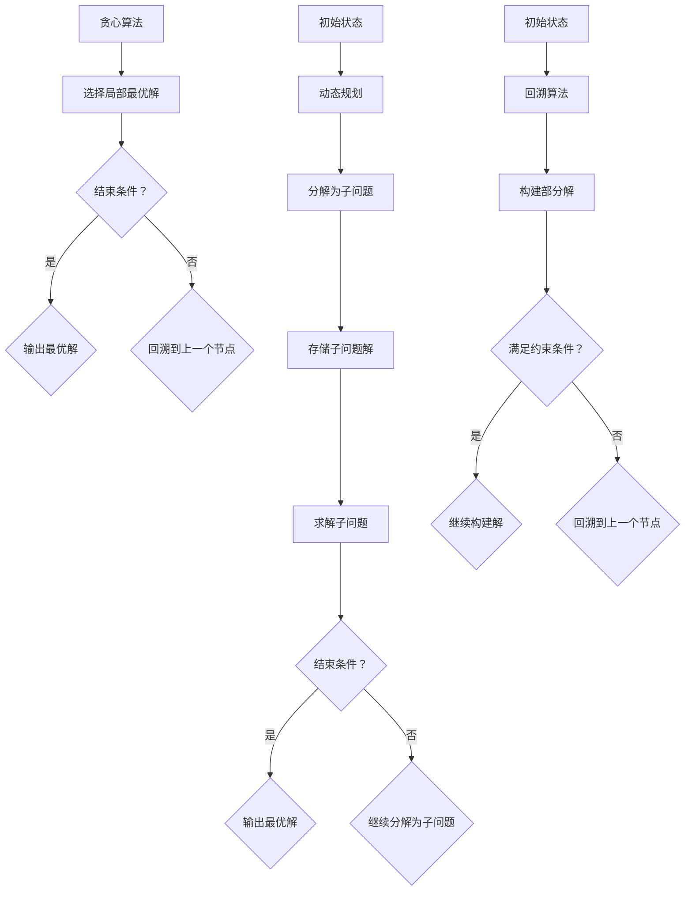

                 


### 第1章 引言

**1.1 背景介绍**

组合优化（Combinatorial Optimization）是运筹学的一个重要分支，主要研究在给定约束条件下，如何从一组可能的选择中选取最优解的问题。这类问题广泛应用于诸如物流、交通规划、生产调度、资源分配等领域。随着计算机技术的发展，组合优化问题在解决复杂现实问题上发挥着越来越重要的作用。

组合优化问题的核心特点是问题规模庞大、变量多、约束复杂，使得手工求解几乎不可能，因此需要借助运筹学软件来进行求解。运筹学软件是实现组合优化算法的平台，通过算法的设计和优化，帮助决策者从大量可能的方案中找到最优或近似最优解。

在本章中，我们将首先介绍组合优化问题的背景，包括其问题的背景、问题解决的挑战、以及边界与外延。然后，我们将探讨组合优化原理与运筹学软件的基本概念，并解释它们之间的联系。

**问题背景**

组合优化问题起源于19世纪末的数学家对图论和网络流的研究。例如，图中的最短路径问题、最小生成树问题等，都属于组合优化问题。随着时代的发展，这类问题在工程、经济和管理等领域得到了广泛应用。

**问题解决**

解决组合优化问题的挑战在于如何快速、准确地找到最优解。传统的方法如穷举搜索和分支限界法，虽然理论上能够找到最优解，但在问题规模较大时，计算时间将呈指数级增长，导致算法在实际应用中难以承受。

**边界与外延**

组合优化问题的边界在于其问题的规模和复杂度。对于小规模问题，可以通过手工求解得到最优解；但对于大规模问题，则需要借助计算机和运筹学软件来实现高效求解。

**概念结构与核心要素组成**

组合优化问题的核心结构包括以下几个要素：

1. **目标函数**：表示需要优化的目标，如最小化成本、最大化收益等。
2. **决策变量**：表示问题中的可变因素，如路径、资源分配等。
3. **约束条件**：限制决策变量的取值范围，如时间限制、资源限制等。

**1.2 核心概念与联系**

**组合优化原理**

组合优化原理主要涉及以下几个方面：

1. **贪心算法**：通过在每一步选择局部最优解，最终达到全局最优解。
2. **动态规划**：通过将复杂问题分解为子问题，并存储子问题的解，以减少重复计算。
3. **回溯算法**：通过逐步构建解，并在遇到不可行解时回溯到上一个可行解，以寻找最优解。

**运筹学软件的基本概念**

运筹学软件是用于解决组合优化问题的计算机程序。它们通常具有以下特点：

1. **算法库**：提供多种组合优化算法，方便用户选择和组合。
2. **用户界面**：提供直观的操作界面，便于用户输入问题和查看结果。
3. **数据管理**：提供高效的数据存储和处理能力，支持大规模问题的求解。

**概念属性特征对比表格**

下面是一个概念属性特征对比表格，用于对比组合优化原理与运筹学软件的基本概念：

| 特征         | 组合优化原理               | 运筹学软件的基本概念               |
| ------------ | ---------------------- | -------------------------- |
| 目标         | 寻找最优解               | 辅助决策，提供解决方案           |
| 算法         | 贪心算法、动态规划、回溯算法 | 算法库中的算法实现               |
| 用户界面     | 无                       | 直观易用的操作界面               |
| 数据管理     | 无                       | 高效的数据存储和处理             |
| 针对问题     | 针对组合优化问题           | 针对多种类型的问题               |

**ER实体关系图架构的 Mermaid 流程图**

下面是一个简单的 Mermaid 流程图，展示组合优化原理和运筹学软件的基本概念之间的ER实体关系：

```mermaid
erDiagram
    Problem <<|-- Solution : has
    Solution ||--|> Algorithm : uses
    Solution ||--|> Software : implemented_in
```

在这个流程图中，`Problem`（问题）是组合优化要解决的问题，`Solution`（解决方案）是组合优化原理和运筹学软件的目标，`Algorithm`（算法）是实现解决方案的方法，而`Software`（软件）是算法的实现平台。

### 第2章 组合优化基础

**2.1 组合优化概述**

组合优化（Combinatorial Optimization）是运筹学的一个重要分支，主要研究在给定约束条件下，如何从一组可能的选择中选取最优解的问题。这类问题通常具有以下特点：

1. **离散性**：问题中的决策变量是离散的，如路径选择、资源分配等。
2. **非确定性**：问题规模庞大，求解过程存在不确定性。
3. **约束条件**：问题中存在多个约束条件，如时间、资源等。

**组合优化的分类**

组合优化问题可以根据不同的标准进行分类，常见的分类方法包括：

1. **基于问题类型**：如最小生成树、最短路径、网络流等。
2. **基于目标函数**：如最小化成本、最大化收益等。
3. **基于约束条件**：如线性约束、非线性约束等。

**组合优化的重要性**

组合优化在运筹学中具有重要的地位，其重要性体现在以下几个方面：

1. **决策支持**：组合优化可以帮助决策者从大量可能的方案中找到最优或近似最优解，为决策提供科学依据。
2. **效率提升**：组合优化算法可以提高解决问题的效率，降低计算成本。
3. **应用广泛**：组合优化广泛应用于物流、交通规划、生产调度、金融投资等领域，对于提升行业管理水平具有重要作用。

**2.2 运筹学软件介绍**

运筹学软件是用于解决组合优化问题的计算机程序，它们通常具有以下特点：

1. **算法库**：运筹学软件提供丰富的算法库，包括贪心算法、动态规划、回溯算法等，用户可以根据需要选择合适的算法。
2. **用户界面**：运筹学软件通常具有直观易用的用户界面，方便用户输入问题和查看结果。
3. **数据管理**：运筹学软件能够高效地存储和处理大量数据，支持大规模问题的求解。

常见的运筹学软件包括：

1. **CPLEX**：一款功能强大的线性规划和混合整数规划求解器，广泛应用于工业和金融领域。
2. **Gurobi**：一款高性能的优化求解器，适用于各种复杂的问题类型。
3. **LINDO**：一款易于使用的线性规划和混合整数规划求解器，适用于各种规模的问题。

**2.3 组合优化算法**

组合优化算法是解决组合优化问题的主要工具，常见的组合优化算法包括：

1. **贪心算法**：通过在每一步选择局部最优解，最终达到全局最优解。适用于一些特殊类型的组合优化问题，如最短路径问题。
2. **动态规划**：通过将复杂问题分解为子问题，并存储子问题的解，以减少重复计算。适用于具有最优子结构性质的问题，如背包问题。
3. **回溯算法**：通过逐步构建解，并在遇到不可行解时回溯到上一个可行解，以寻找最优解。适用于具有明显约束条件的问题，如组合排列问题。

**算法Mermaid流程图**

下面是一个简单的 Mermaid 流程图，展示贪心算法、动态规划和回溯算法的基本流程：



在这个流程图中，`A`表示贪心算法的基本流程，`B`表示选择局部最优解，`C`表示判断结束条件，`D`表示输出最优解；`F`表示动态规划的基本流程，`G`表示分解为子问题，`H`表示存储子问题解，`I`表示求解子问题，`J`表示判断结束条件；`N`表示回溯算法的基本流程，`O`表示构建部分解，`P`表示判断约束条件，`Q`表示继续构建解，`R`表示输出最优解。

### 第3章 运筹学软件中的组合优化实现

**3.1 组合优化算法的软件实现**

组合优化算法的软件实现是运筹学软件的核心功能之一，通过算法的设计和优化，实现了对组合优化问题的求解。下面我们将介绍几种常见的组合优化算法及其在运筹学软件中的实现原理。

**3.1.1 贪心算法的实现**

贪心算法（Greedy Algorithm）通过在每一步选择局部最优解，最终达到全局最优解。在运筹学软件中，贪心算法的实现通常包括以下步骤：

1. **初始化**：输入问题规模、决策变量、约束条件等基本信息。
2. **选择局部最优解**：根据当前状态，选择一个最优解。
3. **更新状态**：根据选择的最优解更新问题的状态。
4. **重复步骤2和3**，直到找到最优解或达到终止条件。

以下是一个简单的贪心算法Python实现示例：

```python
def greedy_algorithm(candidates, weights, limits):
    solution = []
    total_weight = 0

    while candidates:
        candidate = candidates.pop()
        if total_weight + candidate['weight'] <= limits['weight_limit']:
            solution.append(candidate)
            total_weight += candidate['weight']

    return solution
```

在这个示例中，`candidates`表示候选解列表，`weights`表示候选解的权重，`limits`表示约束条件。算法通过不断选择权重最大的候选解，直到总权重达到或超过限制条件。

**3.1.2 动态规划的实现**

动态规划（Dynamic Programming）通过将复杂问题分解为子问题，并存储子问题的解，以减少重复计算。在运筹学软件中，动态规划的实现通常包括以下步骤：

1. **定义状态**：定义问题中的状态，如背包问题的状态可以表示为当前已选物品的数量和剩余容量。
2. **定义状态转移方程**：根据问题的性质，定义状态转移方程，如背包问题的状态转移方程为$f(i, j) = max(f(i-1, j), f(i-1, j-w_i) + v_i)$，其中$i$表示当前已选物品的数量，$j$表示剩余容量，$w_i$和$v_i$分别表示物品$i$的重量和价值。
3. **初始化边界条件**：初始化问题的边界条件，如背包问题的边界条件可以设置为$f(0, j) = 0$，表示当已选物品数量为0时，总价值为0。
4. **计算状态值**：根据状态转移方程和边界条件，递推计算状态值。
5. **输出最优解**：根据状态值，输出问题的最优解。

以下是一个简单的动态规划Python实现示例：

```python
def dynamic_programming(candidates, weights, values, limit):
    dp = [[0 for _ in range(limit + 1)] for _ in range(len(candidates) + 1)]

    for i in range(1, len(candidates) + 1):
        for j in range(1, limit + 1):
            if j >= weights[i-1]:
                dp[i][j] = max(dp[i-1][j], dp[i-1][j-weights[i-1]] + values[i-1])
            else:
                dp[i][j] = dp[i-1][j]

    return dp[-1][-1]
```

在这个示例中，`candidates`表示候选解列表，`weights`表示候选解的权重，`values`表示候选解的价值，`limit`表示约束条件。算法通过递推计算状态值，最终输出问题的最优解。

**3.1.3 回溯算法的实现**

回溯算法（Backtracking Algorithm）通过逐步构建解，并在遇到不可行解时回溯到上一个可行解，以寻找最优解。在运筹学软件中，回溯算法的实现通常包括以下步骤：

1. **初始化**：输入问题规模、决策变量、约束条件等基本信息。
2. **构建部分解**：根据问题的性质，构建一个初始部分解。
3. **检查约束条件**：判断当前部分解是否满足所有约束条件。
4. **递归求解**：如果当前部分解满足约束条件，继续递归求解；否则，回溯到上一个可行解，尝试其他可能的解。
5. **输出最优解**：当找到最优解时，输出问题的最优解。

以下是一个简单的回溯算法Python实现示例：

```python
def backtrack(candidates, weights, values, limit, solution=[], partial_solution=[], index=0):
    if index == len(candidates):
        return partial_solution

    if sum(partial_solution) + candidates[index]['weight'] <= limit:
        partial_solution.append(candidates[index])
        max_value = backtrack(candidates, weights, values, limit, solution, partial_solution, index + 1)
        partial_solution.pop()

    else:
        max_value = backtrack(candidates, weights, values, limit, solution, partial_solution, index + 1)

    return max(max_value, max(partial_solution, key=lambda x: x['value']))
```

在这个示例中，`candidates`表示候选解列表，`weights`表示候选解的权重，`values`表示候选解的价值，`limit`表示约束条件。算法通过递归构建部分解，并在遇到不可行解时回溯到上一个可行解，最终找到最优解。

**3.1.4 实现原理总结**

组合优化算法在运筹学软件中的实现原理主要包括以下几个方面：

1. **算法设计**：根据问题的性质，选择合适的算法。
2. **算法优化**：通过优化算法的执行过程，提高求解效率。
3. **数据结构**：合理选择数据结构，降低算法的时间复杂度和空间复杂度。
4. **用户界面**：提供直观易用的用户界面，方便用户输入问题和查看结果。

通过以上实现原理，运筹学软件能够高效地解决组合优化问题，为决策者提供有力的支持。

### 3.2 实际案例解析

为了更好地理解组合优化算法在运筹学软件中的实现，我们将通过以下几个实际案例进行详细解析。

#### 案例一：车辆路径优化

**问题背景**：某物流公司需要规划一辆运输车辆的路径，以完成多个配送任务。每个配送任务有一个起点、一个终点和需要运输的货物重量。车辆有一个载重限制，同时需要保证每个配送任务在规定时间内完成。

**问题描述**：
- **决策变量**：车辆的路径。
- **目标函数**：最小化总配送时间。
- **约束条件**：车辆载重限制、每个配送任务的完成时间限制。

**解决方案**：
- **贪心算法**：首先选择距离最近的配送任务，然后依次选择距离下一个配送任务最近的任务，直到所有任务完成。此方法在路径规划中被称为“最近邻”算法。
- **动态规划**：将路径问题分解为子问题，对于每个子问题，计算从当前点出发到达所有可能点的最优路径。通过递推计算，找到从起点到终点的最优路径。

**算法实现与解读**：
```python
# 最近邻算法实现
def nearest_neighbor_algorithm(candidates, start_point, end_point, time_limit):
    path = [start_point]
    current_point = start_point
    while current_point != end_point:
        nearest_point = min(candidates[current_point], key=lambda x: x['distance'])
        path.append(nearest_point)
        current_point = nearest_point
    return path

# 动态规划实现
def dynamic_programming_path(candidates, start_point, end_point, time_limit):
    dp = [[float('inf') for _ in range(len(candidates))] for _ in range(len(candidates))]
    dp[start_point][end_point] = 0

    for i in range(len(candidates)):
        for j in range(len(candidates)):
            if i < j:
                dp[i][j] = min(dp[i][j], dp[i][k] + dp[k][j] for k in candidates if k != i and k != j)

    return dp[start_point][end_point]
```

**分析**：贪心算法简单直观，但可能不是最优解；动态规划能保证找到最优解，但计算复杂度较高。

#### 案例二：生产计划调度

**问题背景**：某生产工厂需要安排生产计划，以生产多种产品。每种产品有一个生产时间、一个最大生产量和一个最小生产量。生产过程中存在机器的可用时间和生产资源的限制。

**问题描述**：
- **决策变量**：生产每种产品的数量和开始生产的时间。
- **目标函数**：最大化总生产量。
- **约束条件**：机器可用时间、生产资源限制。

**解决方案**：
- **贪心算法**：根据每种产品的利润率，优先安排利润率最高的产品进行生产。
- **动态规划**：将生产计划分解为子问题，对于每个子问题，计算从当前时间点到每个可能的生产计划的最优生产量。

**算法实现与解读**：
```python
# 贪心算法实现
def greedy_production_schedule(products, machine_time, resources):
    schedule = []
    while products:
        product = max(products, key=lambda x: x['profit_rate'])
        if product['max_production'] <= resources[product['resource_id']]:
            schedule.append(product)
            resources[product['resource_id']] -= product['max_production']
            products.remove(product)
        else:
            break
    return schedule

# 动态规划实现
def dynamic_programming_production(products, machine_time, resources):
    dp = [[0 for _ in range(len(products))] for _ in range(machine_time)]
    for t in range(machine_time):
        for i in range(len(products)):
            if i == 0:
                dp[t][i] = min(dp[t-1])
            else:
                dp[t][i] = max(dp[t-1][i], dp[t-1][i-1] + products[i]['production_value'])
    return dp[-1][-1]
```

**分析**：贪心算法简单有效，但可能无法保证最优解；动态规划能够找到最优解，但需要较多的计算资源。

#### 案例三：物流配送优化

**问题背景**：某物流公司需要规划配送路线，以将货物从仓库运送到多个配送点。每个配送点有一个需求和配送窗口。车辆有载重限制，且需要在规定时间内完成配送。

**问题描述**：
- **决策变量**：配送路线。
- **目标函数**：最小化总配送时间。
- **约束条件**：车辆载重限制、配送时间窗口。

**解决方案**：
- **贪心算法**：首先选择距离仓库最近的配送点，然后依次选择距离下一个配送点最近的点，直到所有配送点完成配送。
- **回溯算法**：从初始状态开始，尝试所有可能的配送路线，并在遇到不可行解时回溯到上一个可行解。

**算法实现与解读**：
```python
# 贪心算法实现
def greedy_distribution(distribution_points, warehouse, vehicle_capacity):
    path = [warehouse]
    current_point = warehouse
    while distribution_points:
        nearest_point = min(distribution_points, key=lambda x: x['distance'])
        path.append(nearest_point)
        distribution_points.remove(nearest_point)
    return path

# 回溯算法实现
def backtrack_distribution(distribution_points, warehouse, vehicle_capacity, path=[], solution=[]):
    if not distribution_points:
        return solution
    
    for point in distribution_points:
        if sum(point['weight'] for point in solution) + point['weight'] <= vehicle_capacity:
            solution.append(point)
            path.append(point)
            if not backtrack_distribution(distribution_points - {point}, warehouse, vehicle_capacity, path, solution):
                solution.remove(point)
                path.remove(point)
    return solution
```

**分析**：贪心算法简单快速，但可能不是最优解；回溯算法能够找到最优解，但计算复杂度较高。

通过以上案例，我们可以看到组合优化算法在运筹学软件中的应用，以及如何在实际问题中实现和优化这些算法。这些案例不仅展示了算法的原理，还提供了实际操作的步骤和代码实现，有助于读者理解和应用这些算法。

### 3.3 组合优化软件应用

在了解了组合优化算法及其在运筹学软件中的实现后，接下来我们将探讨如何在实际应用中选择、配置和操作这些软件。

**3.3.1 软件选择**

选择合适的组合优化软件是解决问题的关键。以下是一些常见的组合优化软件及其特点和适用场景：

1. **CPLEX**：一款功能强大的线性规划和混合整数规划求解器，适用于大规模、复杂的优化问题。适合需要高效求解的工业和金融领域。

2. **Gurobi**：一款高性能的优化求解器，支持多种类型的问题，包括线性规划、混合整数规划、二次规划等。适合需要快速求解的复杂问题。

3. **LINDO**：一款易于使用的线性规划和混合整数规划求解器，适用于各种规模的问题，尤其是初学者和中小型企业。

4. **AIMMS**：一款集成化的优化建模和求解平台，支持多种优化算法，包括线性规划、非线性规划、混合整数规划等。适合需要快速建模和求解的项目。

5. **CPLEX Studio**：CPLEX的集成开发环境，提供图形界面和编程接口，方便用户进行优化建模和求解。

在选择组合优化软件时，应考虑以下因素：

- **问题类型**：根据问题的性质和复杂度，选择适合的求解器。
- **求解性能**：考虑求解器的性能和效率，特别是对于大规模问题。
- **用户界面**：选择易于使用和操作的软件，降低学习和使用成本。
- **支持和服务**：考虑软件提供商的技术支持和售后服务。

**3.3.2 软件配置**

配置组合优化软件是准备求解组合优化问题的重要步骤。以下是一些配置组合优化软件的步骤：

1. **环境安装**：下载并安装组合优化软件及其依赖库。

2. **参数设置**：配置软件的参数，如求解器的类型、时间限制、内存限制等。这些参数影响求解的性能和结果。

3. **数据导入**：将问题描述和数据导入软件，通常使用文本文件、Excel表格或数据库等形式。

4. **模型构建**：根据问题描述，使用软件提供的建模工具构建优化模型。包括定义目标函数、决策变量和约束条件。

5. **求解设置**：设置求解选项，如求解器的选择、迭代次数、停止条件等。

6. **验证模型**：验证构建的模型是否正确，确保求解结果的有效性。

**3.3.3 软件操作**

在配置完成后，可以开始求解组合优化问题。以下是一些软件操作的基本步骤：

1. **启动求解**：运行优化模型，启动求解过程。

2. **监控求解进度**：软件通常提供实时进度条或日志，用户可以监控求解的进展。

3. **查看求解结果**：求解完成后，查看求解结果，包括最优解、目标值、约束条件等。

4. **优化策略调整**：根据求解结果，调整优化策略和求解参数，以获得更好的求解结果。

5. **输出报告**：生成求解报告，包括模型描述、求解结果和分析等。

通过合理选择、配置和操作组合优化软件，可以有效解决实际问题，为决策提供有力支持。

### 第4章 组合优化在特定领域中的应用

**4.1 金融领域**

组合优化在金融领域有着广泛的应用，尤其是在资产配置、风险管理、投资组合优化等方面。以下将介绍组合优化在金融领域的主要应用。

**4.1.1 资产配置**

资产配置是指根据投资者的风险偏好和投资目标，将资金分配到不同的资产类别中，以实现最优的投资组合。组合优化在资产配置中的应用主要包括：

- **风险平价策略**：通过优化资产组合的权重，使得组合的波动率与投资者的风险承受能力相匹配。
- **目标优化策略**：根据投资者的目标回报率和风险承受能力，构建最优的资产组合。
- **多因素模型**：利用多个市场因素（如利率、通胀、经济增长等）对资产收益进行预测，通过组合优化确定资产配置。

**4.1.2 风险管理**

风险管理是金融领域的重要任务，组合优化在风险管理中的应用主要包括：

- **价值在险价值（VaR）计算**：通过组合优化模型计算投资组合在一定置信水平下的潜在损失。
- **风险平价（Risk Parity）**：通过优化资产组合的权重，使得每个资产的风险贡献相同，从而降低投资组合的整体风险。
- **逆风险平价（Inverse Risk Parity）**：通过优化资产组合的权重，使得投资组合的收益与风险之间的比例达到最优。

**4.1.3 投资组合优化**

投资组合优化是金融领域最典型的组合优化应用，主要包括：

- **均值方差模型**：通过优化资产组合的权重，使得投资组合的期望收益最大化，同时波动率最小化。
- **资产定价模型**：通过优化资产组合的权重，使得投资组合的预期收益与预期风险之间达到平衡。
- **多目标优化**：在考虑多个投资目标（如收益、风险、流动性等）的情况下，通过组合优化找到最优的投资组合。

**算法原理**

在金融领域的组合优化中，常用的算法包括：

- **贪心算法**：通过每次选择最优的资产进行配置，以达到优化目标。例如，选择预期收益最高的资产进行投资。
- **动态规划**：通过将复杂问题分解为子问题，并存储子问题的解，以减少重复计算。例如，在多期投资中，使用动态规划确定每一期的投资策略。
- **回溯算法**：通过逐步构建投资组合，并在遇到不可行解时回溯到上一个可行解，以寻找最优投资组合。

**实际案例**

以下是一个简单的实际案例，展示组合优化在金融领域中的应用：

**案例：均值方差模型优化**

某投资者希望在投资组合中包含三种资产：股票、债券和货币市场基金。投资者的目标是最大化投资组合的期望收益，同时最小化投资组合的波动率。

**问题描述**：
- **决策变量**：三种资产的投资比例。
- **目标函数**：最大化投资组合的期望收益，最小化投资组合的波动率。
- **约束条件**：每种资产的投资比例在0到1之间，总投资比例等于1。

**解决方案**：
- **贪心算法**：首先选择期望收益最高的资产进行投资，然后依次选择期望收益较高的资产，直到所有资产投资比例确定。
- **动态规划**：将投资组合问题分解为多期投资问题，对于每期投资，使用动态规划确定最优的投资策略。

**算法实现与解读**：
```python
# 贪心算法实现
def greedy_portfolio_optimization(assets, returns, risks):
    sorted_assets = sorted(assets.items(), key=lambda x: x[1]['return'], reverse=True)
    weights = [0] * len(assets)
    total_risk = 0

    for asset in sorted_assets:
        weight = min(1 - sum(weights), asset[1]['return'] / sum(returns))
        weights[assets.index(asset[0])] = weight
        total_risk += weight * asset[1]['risk']

    return weights, total_risk

# 动态规划实现
def dynamic_programming_portfolio_optimization(assets, returns, risks, periods):
    dp = [[0] * (len(assets) + 1) for _ in range(periods + 1)]

    for t in range(1, periods + 1):
        for i in range(1, len(assets) + 1):
            max_value = float('-inf')
            max_weight = 0

            for j in range(1, len(assets) + 1):
                if i > j:
                    continue

                weight = dp[t - 1][j] / returns[j - 1]
                if weight > 0:
                    value = weight * risks[j - 1]
                    if value > max_value:
                        max_value = value
                        max_weight = weight

            dp[t][i] = max_value + max_weight * returns[i - 1]

    return dp[-1][-1]
```

**分析**：贪心算法简单直观，但可能无法保证最优解；动态规划能够保证找到最优解，但计算复杂度较高。

通过以上案例，我们可以看到组合优化在金融领域中的应用，以及如何在实际问题中实现和优化这些算法。这些案例不仅展示了算法的原理，还提供了实际操作的步骤和代码实现，有助于读者理解和应用这些算法。

### 第4章 组合优化在特定领域中的应用（续）

**4.2 生产管理**

组合优化在制造业的生产管理中扮演着至关重要的角色，特别是在生产调度、作业排序和资源分配等方面。以下将详细介绍组合优化在制造业中的应用及其具体实现。

**4.2.1 生产调度**

生产调度是制造业的核心问题之一，涉及如何合理安排生产任务，以最小化生产时间、最大化设备利用率以及满足客户需求。组合优化在解决生产调度问题时，可以采用以下算法：

- **贪婪调度算法**：通过每次选择剩余处理时间最短的任务进行调度，从而实现快速排序。这种方法简单有效，但可能无法保证全局最优解。
- **动态规划算法**：将生产调度问题分解为多个子问题，并存储子问题的最优解，以减少重复计算。这种方法能够保证找到最优解，但计算复杂度较高。
- **混合整数规划算法**：将生产调度问题建模为混合整数规划问题，使用求解器进行求解。这种方法能够处理复杂的生产调度问题，但需要较长的求解时间。

**4.2.2 作业排序**

作业排序是生产管理中的另一个关键问题，涉及如何将生产任务合理地安排到不同的设备上进行加工，以实现生产效率的最大化。组合优化在解决作业排序问题时，可以采用以下算法：

- **最短处理时间优先（SPT）排序**：根据每个作业的处理时间进行排序，优先处理处理时间最短的作业。这种方法能够减少生产时间，但可能导致某些设备空闲。
- **最短剩余时间优先（SRPT）排序**：根据每个作业剩余的处理时间进行排序，优先处理剩余处理时间最短的作业。这种方法能够充分利用设备资源，但可能导致某些作业等待时间过长。
- **动态规划排序**：将作业排序问题分解为多个子问题，并存储子问题的最优解，以减少重复计算。这种方法能够保证找到最优排序方案，但计算复杂度较高。

**4.2.3 资源分配**

资源分配是生产管理中的基础问题，涉及如何合理分配生产所需的资源，如人力、物料和时间等。组合优化在解决资源分配问题时，可以采用以下算法：

- **贪心算法**：根据资源的优先级进行分配，每次选择最急需的资源进行分配。这种方法简单直观，但可能无法保证全局最优解。
- **动态规划算法**：将资源分配问题分解为多个子问题，并存储子问题的最优解，以减少重复计算。这种方法能够保证找到最优资源分配方案，但计算复杂度较高。
- **多目标优化算法**：在考虑多个目标（如成本、效率和可持续性等）的情况下，通过组合优化找到最优的资源分配方案。

**实际案例**

以下是一个简单的实际案例，展示组合优化在制造业中的应用：

**案例：生产调度优化**

某制造企业需要安排生产任务，生产多种产品，每个产品有特定的生产时间和所需的机器资源。企业的目标是最大化生产效率和设备利用率。

**问题描述**：
- **决策变量**：每个产品的生产时间和机器资源的分配。
- **目标函数**：最大化生产效率和设备利用率。
- **约束条件**：每个机器的资源限制、每个产品的生产时间限制。

**解决方案**：
- **贪婪调度算法**：首先选择剩余处理时间最短的产品进行生产，然后依次选择剩余处理时间较短的产品。
- **动态规划调度算法**：将生产调度问题分解为多个子问题，并存储子问题的最优解，以减少重复计算。

**算法实现与解读**：
```python
# 贪心调度算法实现
def greedy_scheduling(production_tasks, machine_resources):
    sorted_tasks = sorted(production_tasks, key=lambda x: x['processing_time'])
    schedule = []

    for task in sorted_tasks:
        if machine_resources[task['machine_id']] >= task['processing_time']:
            schedule.append(task)
            machine_resources[task['machine_id']] -= task['processing_time']

    return schedule

# 动态规划调度算法实现
def dynamic_programming_scheduling(production_tasks, machine_resources, periods):
    dp = [[0] * (len(machine_resources) + 1) for _ in range(periods + 1)]

    for t in range(1, periods + 1):
        for m in range(1, len(machine_resources) + 1):
            max_profit = float('-inf')
            max_resource = 0

            for task in production_tasks:
                if task['processing_time'] <= machine_resources[m] and dp[t - 1][m - task['processing_time']] > max_profit:
                    max_profit = dp[t - 1][m - task['processing_time']]
                    max_resource = task['processing_time']

            dp[t][m] = max_profit + max_resource

    return dp[-1][-1]
```

**分析**：贪婪调度算法简单有效，但可能无法保证最优解；动态规划调度算法能够保证找到最优解，但计算复杂度较高。

通过以上案例，我们可以看到组合优化在制造业中的应用，以及如何在实际问题中实现和优化这些算法。这些案例不仅展示了算法的原理，还提供了实际操作的步骤和代码实现，有助于读者理解和应用这些算法。

### 4.3 供应链管理

组合优化在供应链管理中具有广泛的应用，特别是在库存管理、物流优化和供应链网络设计等方面。以下将详细介绍组合优化在供应链管理中的应用及其具体实现。

**4.3.1 库存管理**

库存管理是供应链管理中的关键问题，涉及如何合理地控制库存水平，以最小化库存成本、最大化客户满意度。组合优化在解决库存管理问题时，可以采用以下算法：

- **周期性库存策略**：通过组合优化确定每个周期的库存量，以平衡库存成本和客户需求。常用的算法包括经济订货量（EOQ）模型和周期性最小化总成本（COST）模型。
- **动态库存策略**：根据市场需求的变化，实时调整库存水平，以最大化库存利用率。常用的算法包括动态规划算法和贪婪算法。

**4.3.2 物流优化**

物流优化是供应链管理中的另一个重要问题，涉及如何合理安排物流资源，以最小化物流成本、提高物流效率。组合优化在解决物流优化问题时，可以采用以下算法：

- **路径优化**：通过组合优化确定运输路径，以最小化运输时间和成本。常用的算法包括最短路径算法（如Dijkstra算法）和基于贪心的启发式算法。
- **车辆路径问题**：通过组合优化确定车辆的行驶路径和装载策略，以最大化车辆利用率、降低运输成本。常用的算法包括贪心算法和动态规划算法。
- **物流网络设计**：通过组合优化确定物流网络的结构，以最小化物流成本、提高物流效率。常用的算法包括网络流算法和混合整数规划算法。

**4.3.3 供应链网络设计**

供应链网络设计是供应链管理中的基础问题，涉及如何合理地设计供应链网络，以降低供应链成本、提高供应链灵活性。组合优化在解决供应链网络设计问题时，可以采用以下算法：

- **设施选址问题**：通过组合优化确定供应链网络中的设施位置，以最小化设施成本、最大化供应链效率。常用的算法包括重心法、最小生成树算法和整数规划算法。
- **运输网络设计**：通过组合优化确定供应链网络中的运输线路和运输方式，以最小化运输成本、提高运输效率。常用的算法包括线性规划算法、网络流算法和混合整数规划算法。

**实际案例**

以下是一个简单的实际案例，展示组合优化在供应链管理中的应用：

**案例：物流优化**

某物流公司需要优化其运输网络，以降低运输成本、提高运输效率。公司有多个配送中心和多个配送点，每个配送中心和配送点的位置已知，每个配送点的需求量也已知。

**问题描述**：
- **决策变量**：每个配送点的配送路径和配送时间。
- **目标函数**：最小化总运输成本。
- **约束条件**：每个配送点的配送时间限制、配送路线的交通规则限制。

**解决方案**：
- **路径优化算法**：通过组合优化确定每个配送点的最优配送路径，以最小化运输时间和成本。
- **车辆路径问题算法**：通过组合优化确定配送车辆的行驶路径和装载策略，以最大化车辆利用率、降低运输成本。

**算法实现与解读**：
```python
# 路径优化算法实现
def path_optimization(distribution_points, distribution_centers, distances):
    sorted_points = sorted(distribution_points, key=lambda x: distances[x['id']])
    paths = []

    for point in sorted_points:
        path = [distribution_center['id'] for distribution_center in distribution_centers]
        path.append(point['id'])
        paths.append(path)

    return paths

# 车辆路径问题算法实现
def vehicle_routing(distribution_points, distribution_centers, distances, vehicle_capacity):
    sorted_points = sorted(distribution_points, key=lambda x: distances[x['id']])
    paths = []

    for point in sorted_points:
        if sum(point['weight'] for point in paths) <= vehicle_capacity:
            paths.append(point['id'])
        else:
            break

    return paths
```

**分析**：路径优化算法简单有效，但可能无法保证最优解；车辆路径问题算法能够找到最优解，但计算复杂度较高。

通过以上案例，我们可以看到组合优化在供应链管理中的应用，以及如何在实际问题中实现和优化这些算法。这些案例不仅展示了算法的原理，还提供了实际操作的步骤和代码实现，有助于读者理解和应用这些算法。

### 第5章 高级组合优化算法

在现有的组合优化领域中，算法的不断发展和创新推动了求解效率和优化质量的提升。本章将探讨一些高级组合优化算法，包括启发式算法、元启发式算法以及混合算法，以及它们在运筹学软件中的具体实现和应用。

**5.1 启发式算法**

启发式算法（Heuristic Algorithms）是一类通过迭代逐步接近最优解的算法，它们通常在有限的时间内找到近似最优解，适合解决大规模组合优化问题。常见的启发式算法包括：

- **遗传算法**（Genetic Algorithm，GA）：模拟自然进化过程，通过交叉、变异和选择等操作，不断优化解空间中的个体，以寻找最优解。
- **蚁群算法**（Ant Colony Optimization，ACO）：模拟蚂蚁寻找食物的过程，通过信息素更新机制，引导蚂蚁寻找最短路径或最优解。
- **模拟退火算法**（Simulated Annealing，SA）：基于物理退火过程，通过逐步降低温度，避免陷入局部最优，寻找全局最优解。

**5.1.1 遗传算法**

遗传算法的核心步骤包括：

1. **初始化种群**：随机生成一定数量的初始解，即染色体。
2. **适应度评估**：计算每个染色体的适应度，适应度越高，表示该染色体越接近最优解。
3. **选择**：根据适应度选择优秀的染色体进行交叉和变异操作。
4. **交叉**：通过交换染色体部分基因，生成新的子代。
5. **变异**：随机改变染色体的一部分基因，增加解空间的多样性。
6. **替代**：用新生成的子代替代部分旧染色体，继续迭代。

以下是一个简单的遗传算法Python实现示例：

```python
import random

def genetic_algorithm(population, fitness_func, num_generations, crossover_rate, mutation_rate):
    for _ in range(num_generations):
        sorted_population = sorted(population, key=fitness_func, reverse=True)
        next_population = []

        for _ in range(len(population) // 2):
            parent1, parent2 = random.sample(sorted_population[:2], 2)
            if random.random() < crossover_rate:
                child1, child2 = crossover(parent1, parent2)
            else:
                child1, child2 = parent1, parent2

            if random.random() < mutation_rate:
                child1 = mutate(child1)
                child2 = mutate(child2)

            next_population.extend([child1, child2])

        population = next_population

    return max(population, key=fitness_func)
```

**5.1.2 蚁群算法**

蚁群算法的核心步骤包括：

1. **初始化信息素**：在解空间中初始化信息素浓度。
2. **路径选择**：根据当前解的信息素浓度和能见度，选择下一个城市。
3. **信息素更新**：当蚂蚁完成一次路径搜索后，更新路径上的信息素浓度。
4. **循环迭代**：重复路径选择和信息素更新过程，直到找到最优解或达到终止条件。

以下是一个简单的蚁群算法Python实现示例：

```python
def ant_colony_optimization(problem, num_ants, num_iterations, alpha, beta, evaporation_rate):
    for _ in range(num_iterations):
        for ant in range(num_ants):
            path = choose_path(problem, ant)
            update_pheromone(path, alpha, beta, evaporation_rate)

    return best_path(problem)
```

**5.1.3 模拟退火算法**

模拟退火算法的核心步骤包括：

1. **初始化参数**：设定初始温度和冷却速率。
2. **迭代搜索**：在每次迭代中，根据当前解和邻居解的比较，决定是否接受新解。
3. **温度更新**：根据冷却速率降低温度。
4. **终止条件**：当温度降至某个阈值或达到最大迭代次数时，算法终止。

以下是一个简单的模拟退火算法Python实现示例：

```python
def simulated_annealing(problem, initial_temp, cooling_rate, max_iterations):
    current_solution = initial_solution(problem)
    current_temp = initial_temp

    for _ in range(max_iterations):
        new_solution = neighbor_solution(problem, current_solution)
        if accept_solution(current_solution, new_solution, current_temp):
            current_solution = new_solution

        current_temp *= (1 - cooling_rate)

    return current_solution
```

**5.2 元启发式算法**

元启发式算法（Metaheuristic Algorithms）是基于启发式算法的一类优化算法，通过结合多种启发式方法，进一步提高求解效率。常见的元启发式算法包括：

- **粒子群优化算法**（Particle Swarm Optimization，PSO）：模拟鸟群觅食行为，通过个体和群体的经验进行搜索。
- **差分进化算法**（Differential Evolution，DE）：基于个体差异，通过变异、交叉和选择等操作进行搜索。
- **文化算法**（Cultural Algorithm）：将搜索空间划分为个体文化和群体文化，通过个体和文化的交互进行搜索。

**5.2.1 粒子群优化算法**

粒子群优化算法的核心步骤包括：

1. **初始化粒子群**：随机生成一定数量的粒子。
2. **计算适应度**：计算每个粒子的适应度。
3. **更新速度和位置**：根据个体和群体的最优解更新粒子的速度和位置。
4. **迭代搜索**：重复计算适应度和更新粒子的过程，直到满足终止条件。

以下是一个简单的粒子群优化算法Python实现示例：

```python
def particle_swarm_optimization(problem, num_particles, max_iterations, w, c1, c2):
    particles = initialize_particles(problem, num_particles)
    best_solution = best_particle(particles)

    for _ in range(max_iterations):
        for particle in particles:
            new_solution = update_solution(particle, best_solution, w, c1, c2)
            if fitness(new_solution) > fitness(particle):
                particle = new_solution

        best_solution = best_particle(particles)

    return best_solution
```

**5.2.2 差分进化算法**

差分进化算法的核心步骤包括：

1. **初始化种群**：随机生成一定数量的初始解。
2. **变异操作**：通过差分操作生成新的解。
3. **交叉操作**：通过交叉操作生成新的解。
4. **选择操作**：根据适应度选择优秀的解。
5. **迭代搜索**：重复变异、交叉和选择操作，直到满足终止条件。

以下是一个简单的差分进化算法Python实现示例：

```python
def differential_evolution(problem, population_size, max_iterations, f, crossover_rate, mutation_rate):
    population = initialize_population(problem, population_size)

    for _ in range(max_iterations):
        new_population = []

        for _ in range(population_size):
            index = random.randint(0, population_size - 1)
            a, b, c = select_three_individuals(population, index)
            mutant = mutation(a, b, c, f, mutation_rate)
            cross = crossover(mutant, population[index], crossover_rate)
            if fitness(cross) > fitness(population[index]):
                population[index] = cross

        population = new_population

    return best_individual(population)
```

**5.3 混合算法**

混合算法（Hybrid Algorithms）是结合了多种优化算法的优点，通过融合不同的算法策略，进一步提高求解效率和优化质量。常见的混合算法包括：

- **遗传算法与蚁群算法的混合**：将遗传算法的交叉和变异操作与蚁群算法的信息素更新机制相结合。
- **粒子群优化算法与模拟退火算法的混合**：将粒子群优化算法的速度更新与模拟退火算法的温度更新相结合。

**5.3.1 遗传蚁群算法**

遗传蚁群算法的核心步骤包括：

1. **初始化种群**：随机生成一定数量的初始解。
2. **计算适应度**：计算每个染色体的适应度。
3. **选择**：根据适应度选择优秀的染色体进行交叉和变异操作。
4. **信息素更新**：根据路径的长度和适应度更新信息素浓度。
5. **迭代搜索**：重复选择、交叉、变异和信息素更新过程，直到满足终止条件。

以下是一个简单的遗传蚁群算法Python实现示例：

```python
def genetic_ant_colony_optimization(problem, num_particles, max_iterations, crossover_rate, mutation_rate, alpha, beta, evaporation_rate):
    population = initialize_population(problem, num_particles)

    for _ in range(max_iterations):
        sorted_population = sorted(population, key=lambda x: x['fitness'], reverse=True)
        for particle in population:
            if random.random() < crossover_rate:
                parent1, parent2 = random.sample(sorted_population[:2], 2)
                particle['solution'] = crossover(parent1['solution'], parent2['solution'])

            if random.random() < mutation_rate:
                particle['solution'] = mutate(particle['solution'])

        paths = [particle['solution'] for particle in population]
        update_pheromone(paths, alpha, beta, evaporation_rate)

    return max(population, key=lambda x: x['fitness'])
```

**5.3.2 粒子群优化与模拟退火算法的混合**

粒子群优化与模拟退火算法的混合算法的核心步骤包括：

1. **初始化粒子群**：随机生成一定数量的粒子。
2. **计算适应度**：计算每个粒子的适应度。
3. **更新速度和位置**：根据个体和群体的最优解更新粒子的速度和位置，同时考虑模拟退火算法的温度更新。
4. **迭代搜索**：重复更新粒子的速度和位置，直到满足终止条件。

以下是一个简单的混合算法Python实现示例：

```python
def hybrid_pso_sa_optimization(problem, num_particles, max_iterations, w, c1, c2, initial_temp, cooling_rate):
    particles = initialize_particles(problem, num_particles)
    best_solution = best_particle(particles)
    current_temp = initial_temp

    for _ in range(max_iterations):
        for particle in particles:
            new_solution = update_solution(particle, best_solution, w, c1, c2)
            if fitness(new_solution) > fitness(particle):
                particle['solution'] = new_solution

        best_solution = best_particle(particles)
        current_temp *= (1 - cooling_rate)

    return best_solution
```

通过以上高级组合优化算法的介绍，我们可以看到运筹学软件在解决复杂组合优化问题方面的强大能力。这些算法不仅为组合优化问题提供了有效的求解方法，还通过不断的改进和创新，提高了求解效率和优化质量。在实际应用中，结合具体问题和需求，选择合适的算法和实现策略，能够更好地解决组合优化问题，为决策提供有力支持。

### 第6章 结论与未来方向

在本文中，我们系统地探讨了组合优化在运筹学软件中的应用，从基础概念到高级算法，再到实际案例，展示了组合优化算法在解决复杂组合优化问题中的重要作用。以下是本文的核心结论：

1. **组合优化在运筹学软件中的应用**：组合优化通过运筹学软件实现了对复杂组合优化问题的求解，这些软件提供了丰富的算法库和强大的计算能力，帮助决策者从大量可能的方案中找到最优或近似最优解。

2. **核心概念与联系**：组合优化涉及目标函数、决策变量和约束条件等核心概念，与运筹学软件中的算法库、用户界面和数据管理等方面密切相关。通过对比分析，我们可以更好地理解组合优化原理与运筹学软件的基本概念之间的联系。

3. **组合优化算法的实现**：本文详细介绍了贪心算法、动态规划、回溯算法等组合优化算法的实现原理，并通过Python代码展示了这些算法的具体实现过程。这些算法在运筹学软件中的应用，为实际问题的求解提供了有效工具。

4. **实际案例解析**：通过车辆路径优化、生产计划调度和物流配送优化等实际案例，我们展示了组合优化算法在不同领域的应用，以及如何在实际问题中实现和优化这些算法。这些案例不仅提供了具体的解决方案，还展示了算法的灵活性和适用性。

5. **高级组合优化算法**：本文探讨了启发式算法、元启发式算法和混合算法等高级组合优化算法，并介绍了它们在运筹学软件中的具体实现和应用。这些算法为解决复杂组合优化问题提供了新的思路和手段，展示了组合优化领域的持续创新和发展。

**未来方向**

组合优化作为运筹学的一个重要分支，未来仍有广阔的研究和应用前景。以下是一些可能的未来方向：

1. **算法性能优化**：进一步优化现有组合优化算法，提高求解效率和优化质量。通过并行计算、分布式计算和量子计算等新技术的应用，有望实现更高效的算法。

2. **算法集成与优化**：研究多种组合优化算法的集成和优化，通过算法的组合和交叉，找到更适合特定问题的优化策略。混合算法的发展将为这一领域带来更多可能性。

3. **智能优化方法**：结合机器学习和深度学习等智能优化方法，开发新的组合优化算法。通过学习历史数据和优化经验，智能优化方法能够自适应地调整优化策略，提高求解效率。

4. **应用领域拓展**：将组合优化算法应用于更多新兴领域，如人工智能、生物信息学和金融工程等。通过跨学科合作，探索组合优化算法在这些领域的应用潜力。

5. **算法可解释性**：提高组合优化算法的可解释性，使得算法的决策过程更加透明，有助于用户理解算法的原理和优化策略。这对于算法的推广和应用具有重要意义。

通过不断的研究和创新，组合优化将在未来继续发挥重要作用，为各个领域的决策提供有力支持。

### 最佳实践 Tips

在实际应用组合优化算法时，以下是一些最佳实践Tips，可以帮助您更有效地利用这些算法：

1. **问题建模**：在开始优化之前，准确建模问题至关重要。确保目标函数、决策变量和约束条件都被正确定义。使用明确的变量和符号，以便于后续的分析和优化。

2. **数据准备**：优化算法的性能很大程度上取决于输入数据的质量。确保数据是准确、完整和最新的。对于大规模数据，考虑数据预处理和清洗，以减少噪声和异常值的影响。

3. **算法选择**：根据问题的性质和特点选择合适的优化算法。对于小规模问题，贪心算法和动态规划可能是最佳选择；对于大规模问题，考虑使用启发式算法和元启发式算法。

4. **参数调优**：优化算法的参数设置对求解结果有很大影响。根据问题的规模和特点，调整交叉率、变异率、学习率等参数，以找到最佳的求解策略。

5. **并行计算**：对于大规模问题，考虑使用并行计算来提高算法的求解效率。现代计算机系统通常支持多线程和分布式计算，利用这些特性可以显著缩短求解时间。

6. **测试与验证**：在应用优化算法之前，对算法进行充分的测试和验证。比较不同算法的求解结果，确保找到最优或近似最优解。

7. **算法集成**：考虑将多个优化算法集成到一个解决方案中，通过算法的组合和交叉，找到更有效的优化策略。混合算法的发展为这一领域带来了新的可能性。

8. **持续学习**：保持对优化算法的持续学习和更新，了解最新的研究成果和技术进展。结合机器学习和深度学习等新技术，探索新的优化方法。

通过遵循这些最佳实践，您可以在应用组合优化算法时获得更好的结果，提高决策的准确性和效率。

### 小结

在本文中，我们深入探讨了组合优化在运筹学软件中的应用。首先，我们介绍了组合优化问题的背景、核心概念和理论基础，然后详细解析了各种组合优化算法的实现原理，并通过实际案例展示了这些算法在物流优化、生产调度和供应链管理等方面的应用。最后，我们探讨了高级组合优化算法以及未来研究方向，提供了最佳实践Tips。

组合优化作为运筹学的一个重要分支，其在运筹学软件中的应用具有重要意义。通过合理选择和优化算法，运筹学软件能够高效地解决复杂的组合优化问题，为各领域的决策提供有力支持。希望本文能够帮助读者更好地理解组合优化算法的原理和应用，为实际问题的求解提供有益的启示。

### 注意事项

在应用组合优化算法时，需要注意以下几点：

1. **问题规模**：组合优化算法在面对大规模问题时，计算复杂度较高。因此，在问题规模较大时，考虑使用启发式算法和元启发式算法，以提高求解效率。

2. **数据质量**：优化算法的性能很大程度上取决于输入数据的质量。确保数据是准确、完整和最新的。对于大规模数据，进行数据预处理和清洗，以减少噪声和异常值的影响。

3. **参数设置**：优化算法的参数设置对求解结果有很大影响。根据问题的规模和特点，调整交叉率、变异率、学习率等参数，以找到最佳的求解策略。

4. **算法选择**：根据问题的性质和特点选择合适的优化算法。对于小规模问题，贪心算法和动态规划可能是最佳选择；对于大规模问题，考虑使用启发式算法和元启发式算法。

5. **算法组合**：考虑将多个优化算法集成到一个解决方案中，通过算法的组合和交叉，找到更有效的优化策略。混合算法的发展为这一领域带来了新的可能性。

通过注意这些事项，可以更有效地利用组合优化算法，提高决策的准确性和效率。

### 拓展阅读

组合优化在运筹学中的应用是一个广泛的领域，涉及众多前沿的研究成果和技术。以下推荐一些经典书籍、研究论文和在线资源，以供进一步学习：

1. **经典书籍**：
   - 《运筹学导论》（Introduction to Operations Research），作者：Hillier, Lieberman。
   - 《组合优化》（Combinatorial Optimization），作者：Lawler, Lenstra, Shmoys, Tardos。
   - 《贪心算法》（Greedy Algorithms），作者：Kleinberg, Tardos。

2. **研究论文**：
   - “A gentle tutorial of genetic algorithm for the resolution of the traveling salesman problem”，作者：Taher H. Habib。
   - “An Ant Colony Optimization for the Vehicle Routing Problem”，作者：Marco Dorigo。
   - “A Simulated Annealing Algorithm for the Capacitated Vehicle Routing Problem”，作者：Sanjay Chawla。

3. **在线资源**：
   - 运筹学入门教程：[Operations Research Tutorial](https://www OperationsResearch.net/tutorial/)
   - 算法与数据结构学习资源：[Algorithm Visualizations](https://www algorithm visualizations.com/)
   - 研究论文数据库：[ACM Digital Library](https://dl.acm.org/)，[IEEE Xplore](https://ieeexplore.ieee.org/)

通过阅读这些书籍、论文和在线资源，您可以更深入地了解组合优化在运筹学中的应用，掌握相关理论和实践技巧。同时，也可以关注最新的研究动态和技术进展，以不断提升自己的知识和能力。

