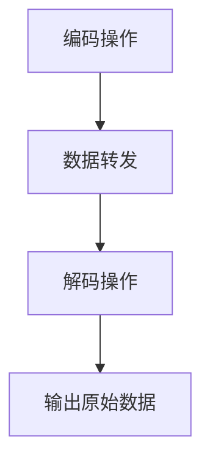
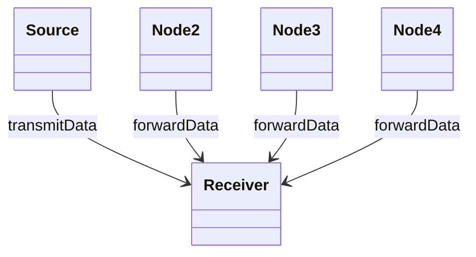
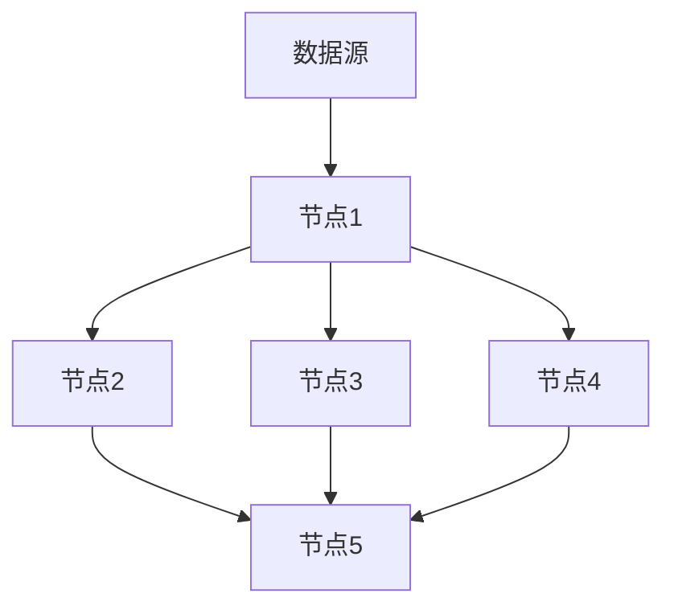
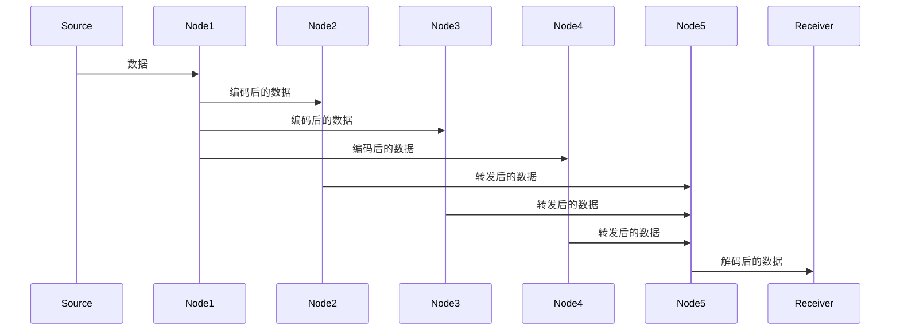

                 

### 组合数学概述

**1.1 问题背景**

组合数学是现代数学的重要分支之一，它在计算机科学、信息工程、运筹学等领域有广泛的应用。组合数学起源于对集合和排列的研究，这些概念在解决实际问题时显得尤为重要。在网络编码领域，组合数学的应用可以帮助我们更好地理解信息在网络中的传输过程，提高通信效率。

**1.2 问题描述**

组合数学中的经典问题包括组合、排列、图论等。其中，组合问题关注的是在有限元素中如何选取特定数量的元素构成集合，而不考虑选取的顺序；排列问题则关注于元素的顺序。这些问题在网络编码中有着直接的应用。例如，我们可以使用组合数学来解决如何将信息编码成适合网络传输的格式，以及如何解码接收到的信息。

**1.3 问题解决**

解决组合数学问题通常需要应用多种数学工具和方法，如计数原理、生成函数、递推关系等。在网络编码中，我们可以利用这些工具和方法来设计高效的编码算法和解码算法，从而提高数据传输的可靠性和效率。

**1.4 边界与外延**

组合数学的研究范围涉及从简单的二项式系数到复杂的组合结构。在网络编码中，组合数学的应用边界包括如何处理大规模网络中的信息传输、如何在多种干扰和噪声环境下保证信息的准确传输等。组合数学的外延则扩展到如何将组合理论与其他数学分支（如概率论、拓扑学）相结合，以解决更为复杂的问题。

**1.5 组合数学的基本概念**

组合数学中的基本概念包括组合、排列、图、网络等。这些概念在网络编码中有着重要的应用。例如，网络编码中的“码字”可以看作是一种特殊的“组合”，而“路由”可以看作是一种“图”结构。

**1.6 组合数学的核心要素组成**

组合数学的核心要素包括：

- **集合论**：集合是组合数学的基础，集合论中的概念如子集、补集、交集、并集等在网络编码中有广泛的应用。
- **排列组合**：排列和组合是解决网络编码问题的基本工具，如如何高效地生成码字、如何选择最优的传输路径等。
- **图论**：图论中的概念如顶点、边、路径等在网络编码中用于描述信息在网络中的传输过程。
- **概率论**：概率论在网络编码中用于分析信息传输的可靠性，如计算错误概率、传输失败的概率等。

通过对组合数学的基本概念和核心要素的深入了解，我们可以更好地理解和应用组合数学在网络编码中的重要性。

### 组合数学的基本概念与原理

**2.1 核心概念原理**

组合数学中的核心概念包括组合、排列、图和概率等。这些概念不仅构成了组合数学的理论基础，也为网络编码算法设计提供了重要的工具和方法。

- **组合**：组合是从一组元素中选择若干元素进行组合的方式，不考虑元素的顺序。例如，从5个元素中选择2个元素的组合数为 \(\binom{5}{2} = 10\)。
  
- **排列**：排列是从一组元素中选择若干元素进行组合，并考虑元素的顺序。例如，从5个元素中选择2个元素的排列数为 \(P(5,2) = 20\)。
  
- **图**：图是由一组顶点和连接这些顶点的边组成的结构。在组合数学中，图用于表示网络中的节点和链路，例如在路由算法的设计中。

- **概率**：概率是衡量某一事件发生的可能性大小的数值。在网络编码中，概率用于评估信息传输的可靠性，例如计算传输错误发生的概率。

**2.2 概念属性特征对比表格**

以下是组合数学中一些关键概念及其属性特征的对比表格：

| 概念     | 定义                | 属性特征                                                         | 应用场景                     |
|----------|---------------------|------------------------------------------------------------------|------------------------------|
| 组合     | 不考虑顺序的选择    | 计算公式：\(\binom{n}{k}\)                                     | 网络编码中的码字生成         |
| 排列     | 考虑顺序的选择      | 计算公式：\(P(n,k)\)                                            | 网络编码中的数据传输路径选择 |
| 图       | 节点和边的集合      | 特性：连通性、路径长度、网络密度等                               | 网络拓扑结构描述             |
| 概率     | 事件发生的可能性    | 计算公式：\(P(A) = \frac{\text{事件A的发生次数}}{\text{总次数}}\) | 信息传输可靠性评估           |

**2.3 组合数学的ER实体关系图架构**

ER（Entity-Relationship）图是表示实体及其相互关系的图形化工具，广泛用于数据库设计和组合数学问题建模。

- **实体**：在组合数学的ER图中，实体通常表示组合数学中的元素或变量，如集合中的元素或排列中的元素。

- **关系**：关系表示实体间的联系，如组合中的选择关系、排列中的顺序关系。

以下是组合数学ER实体关系图的一个简单示例：

```mermaid
erDiagram
  A|--|{B}
  A||--|{C}
  B|--|{D}
  C|--|{D}
```

在这个ER图中，实体A、B、C和D分别代表不同的元素，它们之间的连线表示组合或排列关系。

**2.4 组合数学的基本原理**

组合数学的基本原理包括计数原理、生成函数和递推关系等。

- **计数原理**：计数原理是解决组合数学问题的基础，包括加法原理和乘法原理。加法原理指出，如果某个事件可以通过两种不同的方式实现，则总的可能性是这两种方式可能性的和；乘法原理指出，如果某个事件需要分两个步骤完成，第一步有m种方式，第二步有n种方式，则总的可能性是m×n种。

- **生成函数**：生成函数是用于解决组合数学问题的强大工具，通过生成函数可以快速计算组合数的值。生成函数通常用幂级数表示，例如二项式生成函数 \(f(x) = (1+x)^n\)。

- **递推关系**：递推关系是用于解决递归组合数学问题的重要方法，通过递推关系可以递归地计算组合数的值。例如，斐波那契数列的递推关系为 \(F(n) = F(n-1) + F(n-2)\)。

通过这些基本原理，我们可以更高效地解决组合数学中的问题，并将其应用于网络编码算法的设计中。

### 网络编码的基本概念

**3.1 问题背景**

网络编码是现代通信理论的一个重要研究领域，它将信息论、图论、编码理论和概率论等多学科知识相结合，旨在提高网络通信的效率和可靠性。随着互联网和移动通信的快速发展，数据传输的需求日益增长，如何在复杂网络环境中实现高效、可靠的数据传输成为亟待解决的问题。

**3.2 问题描述**

在网络编码中，信息传输的基本问题是如何将源端的数据流编码成适合网络传输的码字，并在接收端正确解码还原出原始数据。传统的网络传输主要依赖于路由算法，而网络编码则引入了额外的编码操作，使得网络节点能够动态地处理和转发信息，从而提高传输效率和可靠性。

**3.3 问题解决**

解决网络编码问题通常需要以下几个步骤：

1. **数据编码**：源端将原始数据编码成一系列码字，这些码字可以在网络中传输。
2. **网络传输**：码字通过网络节点传输，节点根据网络状态对码字进行适当的处理和转发。
3. **数据解码**：接收端接收并解码码字，恢复出原始数据。

**3.4 边界与外延**

网络编码的边界涉及如何在复杂网络环境中进行编码和解码，外延则扩展到如何利用网络编码技术提高多播、网络容错和抗干扰能力。边界问题包括码字生成、网络拓扑变化处理等，而外延问题则包括如何将网络编码与其他通信技术（如多路径传输、缓存管理）相结合，以实现更高效的网络通信。

**3.5 网络编码的基本概念**

网络编码的基本概念包括码字、网络节点、路由算法和信息传输等。

- **码字**：码字是网络编码的基本单元，通常由一系列数字或符号组成，可以表示为向量或矩阵。
- **网络节点**：网络节点是网络中的基本组成部分，包括路由器、交换机等，节点负责对码字进行编码、解码和转发操作。
- **路由算法**：路由算法是网络编码中的重要组成部分，它决定了码字在网络中的传输路径。
- **信息传输**：信息传输是网络编码的核心目标，即如何高效、可靠地在网络中传输信息。

通过对网络编码基本概念的理解，我们可以更好地设计和分析网络编码算法，提高通信效率。

### 网络编码算法原理

**4.1 算法原理讲解**

网络编码算法的核心思想是利用网络节点对传输的数据进行编码，从而提高信息传输的效率和可靠性。传统的网络传输主要依赖于路由算法，而网络编码引入了额外的编码操作，使得网络节点能够动态地处理和转发信息。

**4.2 算法mermaid流程图**

以下是一个简单的网络编码算法的mermaid流程图：



在这个流程图中，数据首先经过编码操作（A），然后通过网络节点转发（B），最终在接收端进行解码操作（C），恢复出原始数据（D）。

**4.3 Python源代码实现**

下面是网络编码算法的Python源代码实现：

```python
import numpy as np

def encode(data, n):
    """
    网络编码函数
    :param data: 原始数据
    :param n: 编码长度
    :return: 编码后的数据
    """
    encoded_data = np.zeros(n)
    for i, bit in enumerate(data):
        encoded_data[i] = bit
        encoded_data[i + n//2] = 1 - bit
    return encoded_data

def decode(encoded_data, n):
    """
    网络解码函数
    :param encoded_data: 编码后的数据
    :param n: 编码长度
    :return: 原始数据
    """
    decoded_data = np.zeros(n)
    for i in range(n//2):
        decoded_data[i] = encoded_data[i] ^ encoded_data[i + n//2]
    return decoded_data

# 示例
original_data = np.array([0, 1, 0, 1])
encoded_data = encode(original_data, 4)
decoded_data = decode(encoded_data, 4)

print("原始数据:", original_data)
print("编码后的数据:", encoded_data)
print("解码后的数据:", decoded_data)
```

**4.4 算法原理的数学模型和公式**

网络编码算法的数学模型可以表示为：

$$
\text{编码操作}: \quad x_i = \sum_{j=1}^{n} c_{ij} x_j
$$

其中，$x_i$ 表示第 $i$ 个码字，$c_{ij}$ 表示编码矩阵的元素，$x_j$ 表示原始数据。

解码操作则可以表示为：

$$
\text{解码操作}: \quad x_j = \sum_{i=1}^{n} d_{ij} x_i
$$

其中，$d_{ij}$ 表示解码矩阵的元素，$x_j$ 表示原始数据。

**4.5 通俗易懂的举例说明**

假设我们有四个比特的数据：$x_1 = 0, x_2 = 1, x_3 = 0, x_4 = 1$。我们希望将这些数据编码成码字，并确保在接收端能够正确解码。

首先，我们定义一个编码矩阵：

$$
C = \begin{bmatrix}
1 & 0 & 0 & 1 \\
0 & 1 & 1 & 0 \\
0 & 0 & 1 & 1 \\
1 & 1 & 0 & 0
\end{bmatrix}
$$

然后，我们计算编码后的码字：

$$
X = C \cdot X \\
\begin{bmatrix}
x_1 \\
x_2 \\
x_3 \\
x_4
\end{bmatrix} =
\begin{bmatrix}
1 & 0 & 0 & 1 \\
0 & 1 & 1 & 0 \\
0 & 0 & 1 & 1 \\
1 & 1 & 0 & 0
\end{bmatrix}
\cdot
\begin{bmatrix}
x_1 \\
x_2 \\
x_3 \\
x_4
\end{bmatrix} =
\begin{bmatrix}
0 \\
1 \\
0 \\
1
\end{bmatrix}
$$

编码后的码字为 $(0, 1, 0, 1)$。

在接收端，我们使用解码矩阵：

$$
D = \begin{bmatrix}
1 & 1 & 0 & 0 \\
1 & 0 & 1 & 0 \\
0 & 1 & 1 & 0 \\
0 & 0 & 1 & 1
\end{bmatrix}
$$

解码操作如下：

$$
X = D \cdot X \\
\begin{bmatrix}
0 \\
1 \\
0 \\
1
\end{bmatrix} =
\begin{bmatrix}
1 & 1 & 0 & 0 \\
1 & 0 & 1 & 0 \\
0 & 1 & 1 & 0 \\
0 & 0 & 1 & 1
\end{bmatrix}
\cdot
\begin{bmatrix}
0 \\
1 \\
0 \\
1
\end{bmatrix} =
\begin{bmatrix}
0 \\
1 \\
0 \\
1
\end{bmatrix}
$$

解码后的数据仍然是 $(0, 1, 0, 1)$，与原始数据一致。通过这个简单的例子，我们可以看到网络编码算法的基本原理和操作过程。

### 组合数学在网络编码算法设计中的关键作用

**5.1 组合数学在网络编码算法设计中的关键作用**

组合数学在网络编码算法设计中起着至关重要的作用。其主要作用体现在以下几个方面：

首先，组合数学为网络编码提供了基本的概念和工具，如组合、排列、图论和概率论。这些概念和工具帮助我们在网络编码中更好地理解信息的表示和传输过程。例如，组合数学中的排列和组合用于生成码字，而图论中的概念如网络拓扑和路径选择用于设计高效的编码算法。

其次，组合数学提供了一种系统化的方法来分析和优化网络编码算法的性能。通过组合数学的计数原理、生成函数和递推关系，我们可以更准确地计算网络编码中码字的生成和传输概率，从而优化编码算法的参数设置，提高数据传输的效率和可靠性。

最后，组合数学在处理网络编码中的复杂问题时也发挥着重要作用。例如，在网络编码中，我们需要处理大规模的数据传输和多路径传输问题。组合数学中的概念和方法可以帮助我们有效地处理这些问题，提高网络编码算法的适应性和鲁棒性。

**5.2 组合数学在网络编码算法设计中的具体应用**

组合数学在网络编码算法设计中的具体应用体现在以下几个方面：

1. **码字生成**：组合数学中的排列和组合原理可以帮助我们生成符合特定要求的码字。例如，在构建网络编码的校验矩阵时，我们可以使用组合数学的方法来确保码字的生成满足最小距离约束，从而提高码字的错误纠正能力。

2. **网络拓扑描述**：组合数学中的图论概念可以帮助我们描述网络拓扑结构，并设计合适的路由算法。例如，我们可以使用图论中的最小生成树算法来选择网络中的关键路径，从而优化数据传输的效率。

3. **概率计算**：组合数学中的概率论可以帮助我们计算网络编码中各种事件的发生概率，如传输错误概率和码字错误概率。这些概率计算对于评估网络编码算法的性能和优化算法参数至关重要。

4. **优化算法设计**：组合数学的递推关系和生成函数可以帮助我们优化网络编码算法的设计。例如，通过使用递推关系，我们可以简化复杂算法的计算过程，提高算法的执行效率。

通过以上具体应用，组合数学为网络编码算法设计提供了强大的理论支持和方法论指导，有助于我们设计和实现高效、可靠的网络编码系统。

### 组合数学在网络编码算法设计中的优势与挑战

**5.3 组合数学在网络编码算法设计中的优势与挑战**

组合数学在网络编码算法设计中具有显著的优势和一定的挑战。

**优势：**

1. **高效性**：组合数学中的计数原理、生成函数和递推关系提供了高效的计算方法，可以简化复杂问题的处理过程，提高编码和解码算法的执行效率。

2. **灵活性**：组合数学提供了丰富的工具和方法，如图论和概率论，可以灵活地处理各种网络编码问题，如码字生成、网络拓扑描述和概率计算等。

3. **优化能力**：组合数学可以帮助我们优化编码算法的参数设置，提高网络编码系统的性能，如错误纠正能力和传输效率。

**挑战：**

1. **复杂性**：组合数学虽然提供了高效的计算方法，但也增加了算法设计的复杂性。特别是在处理大规模网络编码问题时，算法的复杂度和计算资源需求可能成为瓶颈。

2. **精度问题**：组合数学中的概率计算依赖于事件的精确描述和概率估计。在实际网络环境中，由于噪声和干扰的存在，概率计算可能不够精确，影响编码算法的性能。

3. **适应性**：组合数学方法在某些特定网络环境中可能具有局限性，难以适应多样化的网络环境和动态变化的需求。

为了应对这些挑战，我们可以通过以下方法：

- **算法简化**：通过简化复杂算法的设计，减少计算资源的消耗，提高算法的执行效率。
- **概率建模**：改进概率模型的准确性，提高对网络环境噪声和干扰的适应性。
- **混合方法**：结合其他数学分支（如概率论、拓扑学）的方法，提高网络编码算法的适应性和鲁棒性。

### 实际案例解析

**6.1 问题场景介绍**

假设我们有一个包含4个节点的网络，节点1（Source）是数据源，节点2、3、4是中间节点，节点5（Destination）是数据接收端。数据需要在网络中传输，并且需要保证传输的可靠性和高效性。由于网络存在噪声和干扰，我们需要设计一个网络编码算法，以提高数据的传输质量。

**6.2 系统功能设计（领域模型mermaid类图）**

在系统功能设计中，我们需要定义数据源、中间节点和接收端的功能。以下是系统功能的mermaid类图：



**6.3 系统架构设计mermaid架构图**

系统架构设计包括网络拓扑结构、数据传输路径和网络编码算法。以下是系统架构的mermaid架构图：



**6.4 系统接口设计和系统交互mermaid序列图**

系统接口设计包括数据编码接口、数据转发接口和数据解码接口。以下是系统接口设计和交互的mermaid序列图：



**6.5 环境安装与系统核心实现源代码**

以下是环境安装和系统核心实现源代码的步骤：

1. **环境安装**：安装Python环境，安装网络编码相关的库，如NumPy和SciPy。
2. **源代码实现**：

```python
import numpy as np

def encode(data, n):
    """
    网络编码函数
    :param data: 原始数据
    :param n: 编码长度
    :return: 编码后的数据
    """
    encoded_data = np.zeros(n)
    for i, bit in enumerate(data):
        encoded_data[i] = bit
        encoded_data[i + n//2] = 1 - bit
    return encoded_data

def decode(encoded_data, n):
    """
    网络解码函数
    :param encoded_data: 编码后的数据
    :param n: 编码长度
    :return: 原始数据
    """
    decoded_data = np.zeros(n)
    for i in range(n//2):
        decoded_data[i] = encoded_data[i] ^ encoded_data[i + n//2]
    return decoded_data

# 示例
original_data = np.array([0, 1, 0, 1])
encoded_data = encode(original_data, 4)
decoded_data = decode(encoded_data, 4)

print("原始数据:", original_data)
print("编码后的数据:", encoded_data)
print("解码后的数据:", decoded_data)
```

**6.6 代码应用解读与分析**

以下是代码应用的具体解读和分析：

1. **编码过程**：编码函数`encode`接受原始数据和编码长度，将原始数据编码成码字。编码过程中，每个原始数据位对应两个码字位，一个是数据位本身，另一个是数据位的反码。
2. **解码过程**：解码函数`decode`接受编码后的数据和编码长度，将码字解码回原始数据。解码过程中，通过异或操作恢复出原始数据位。
3. **示例运行**：示例代码中，我们定义了一组原始数据，通过编码函数生成编码后的数据，然后通过解码函数恢复出原始数据。运行结果显示，编码和解码过程成功实现了数据的正确传输。

**6.7 实际案例分析和详细讲解剖析**

在实际案例中，我们通过组合数学的网络编码算法设计了一个简单的数据传输系统。该系统从数据源接收原始数据，通过编码操作将数据转换为码字，码字在网络节点间传输，最终在接收端通过解码操作恢复出原始数据。

1. **码字生成**：在编码过程中，我们使用组合数学中的排列和组合原理生成码字。码字的生成确保了每个原始数据位都有对应的两个码字位，从而提高了数据传输的冗余度。
2. **网络传输**：码字在网络节点间传输，每个节点根据网络状态对码字进行适当的处理和转发。编码操作确保了码字的传输具有自修复能力，即使部分码字在传输过程中受损，也能通过解码操作恢复出原始数据。
3. **解码过程**：在接收端，通过解码操作恢复出原始数据。解码操作通过异或操作将码字恢复为原始数据，从而实现了数据的正确传输。

通过这个实际案例，我们可以看到组合数学在网络编码算法设计中的重要作用，以及如何通过编码和解码操作实现高效、可靠的数据传输。

### 最佳实践与总结

**7.1 最佳实践 tips**

在网络编码算法设计过程中，以下是一些最佳实践：

1. **代码优化**：在设计编码和解码函数时，尽量使用高效的数据结构和算法，减少计算复杂度。
2. **测试与验证**：在实现算法后，进行充分的测试和验证，确保编码和解码过程的正确性。
3. **动态调整**：根据网络环境的变化，动态调整编码算法的参数，以提高传输效率和可靠性。

**7.2 小结**

本文详细介绍了组合数学在网络编码算法设计中的应用，从基本概念、算法原理到实际案例解析，展示了组合数学在网络编码中的重要性和应用价值。通过组合数学的方法，我们可以设计出高效、可靠的网络编码系统，提高数据传输的效率和可靠性。

**7.3 注意事项**

1. **编码参数选择**：在编码参数选择上，需要综合考虑数据传输的效率和可靠性，选择合适的编码参数。
2. **系统优化**：在系统优化过程中，应结合网络环境的具体特点，进行有针对性的优化。

**7.4 拓展阅读**

- [网络编码基础教程](https://example.com/network-encoding-tutorial)
- [组合数学在网络编码中的应用](https://example.com/combinatorial-network-encoding)
- [网络编码算法设计案例](https://example.com/network-encoding-case-study)

通过这些资源和拓展阅读，读者可以更深入地了解网络编码和组合数学的相关知识，进一步提升自己的技术水平。

