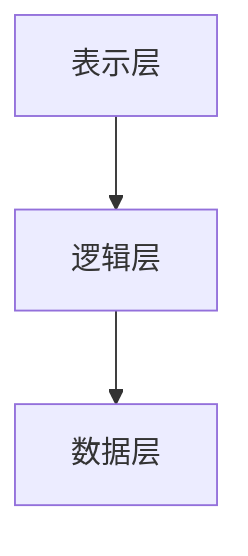
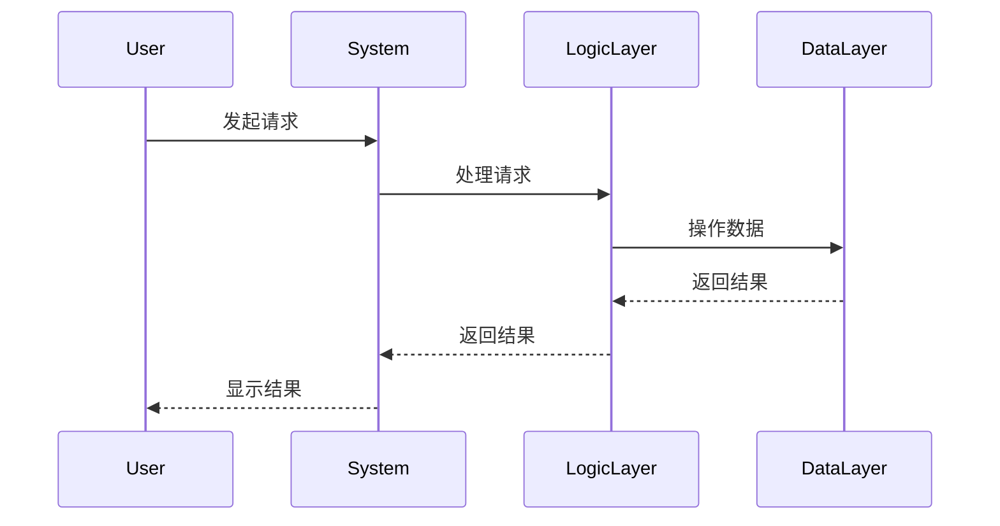

                 

# 组合模式：树形结构的类型化表示

## 关键词

组合模式，树形结构，类型化表示，软件设计模式，面向对象编程，递归，动态规划，递推关系

## 摘要

本文旨在深入探讨组合模式在树形结构中的类型化表示，以及其在软件设计中的应用。我们将首先介绍组合模式的基本概念和树形结构的特点，然后详细分析其在编程中的应用，最后通过具体实例和代码讲解，帮助读者理解这一模式。

## 目录大纲设计过程

### 1. 确定书籍主题

首先，我们需要明确书籍的主题为《组合模式：树形结构的类型化表示》。根据书名，我们可以判断本书主要探讨组合模式及其在树形结构中的类型化表示。

### 2. 确定核心内容

接下来，我们需要梳理书籍的核心内容，包括：

- 组合模式的基本概念
- 树形结构的特点
- 组合模式在树形结构中的应用
- 面向对象编程中的递归和动态规划
- 递归关系和递推关系的数学模型
- 系统分析与架构设计方案
- 项目实战

### 3. 设计目录结构

根据书籍核心内容，设计合理的目录结构，确保内容完整且逻辑清晰。目录结构可以分为以下几个部分：

- 第一部分：背景介绍
  - 组合模式的基本概念
  - 树形结构的特点
- 第二部分：核心概念与联系
  - 组合模式在树形结构中的应用
  - 递归和动态规划
- 第三部分：算法原理讲解
  - 递归关系和递推关系的数学模型
  - 算法流程图和Python代码实现
- 第四部分：系统分析与架构设计方案
  - 问题场景介绍
  - 系统功能设计
  - 系统架构设计
  - 系统接口设计和系统交互
- 第五部分：项目实战
  - 环境安装
  - 系统核心实现源代码
  - 代码应用解读与分析
  - 实际案例分析和详细讲解剖析
- 第六部分：最佳实践 tips、小结、注意事项、拓展阅读

### 4. 编写目录大纲

根据目录结构，逐级编写目录大纲，确保每一级目录内容简洁明了，符合markdown格式要求。以下是本书的目录大纲：

```markdown
----------------------------------------------------------------
# 第一部分：背景介绍

## 第1章：组合模式概述

### 1.1 组合模式的基本概念

### 1.2 组合模式的应用场景

## 第2章：树形结构概述

### 2.1 树形结构的基本概念

### 2.2 树形结构的特点

### 2.3 树形结构与组合模式的关系

----------------------------------------------------------------

# 第二部分：核心概念与联系

## 第3章：组合模式在树形结构中的应用

### 3.1 组合模式的核心概念

### 3.2 组合模式在树形结构中的应用原理

### 3.3 组合模式与树形结构的类型化表示

----------------------------------------------------------------

# 第三部分：算法原理讲解

## 第4章：递归与动态规划

### 4.1 递归的概念

### 4.2 动态规划的概念

### 4.3 递归与动态规划在组合模式中的应用

----------------------------------------------------------------

# 第四部分：系统分析与架构设计方案

## 第5章：问题场景介绍

### 5.1 问题场景描述

### 5.2 项目介绍

----------------------------------------------------------------

# 第五部分：项目实战

## 第6章：环境安装

### 6.1 环境配置

### 6.2 系统核心实现源代码

----------------------------------------------------------------

# 第六部分：最佳实践 tips、小结、注意事项、拓展阅读

## 第7章：最佳实践 tips

### 7.1 常见问题及解决方案

### 7.2 性能优化建议

## 第8章：小结

### 8.1 文章总结

### 8.2 读者反馈

## 第9章：注意事项

### 9.1 使用组合模式时的注意事项

### 9.2 避免组合模式滥用

## 第10章：拓展阅读

### 10.1 相关书籍推荐

### 10.2 在线资源推荐

----------------------------------------------------------------
```

### 5. 调整与完善

在编写目录大纲后，对大纲进行反复调整与完善，确保内容完整、逻辑清晰、简洁明了。在调整过程中，可以参考以下方面：

- 确保核心内容完整
- 保持目录层级合理
- 注意内容简洁性
- 考虑最佳实践 tips 的安排

## 结论

通过以上步骤，我们成功为《组合模式：树形结构的类型化表示》设计了一个完整且逻辑清晰的目录大纲。接下来，我们将在大纲的基础上，逐章编写详细内容，确保书籍质量。在编写过程中，我们将继续关注内容完整性、逻辑清晰性、简洁性等方面，以确保最终成果符合用户需求。

## 让我们一步一步深入探讨组合模式：树形结构的类型化表示

### 组合模式的基本概念

组合模式（Composite Pattern）是一种常见的软件设计模式，属于结构型模式的一种。它的核心思想是将一组对象通过树形结构组合在一起，使得用户可以统一地访问这些对象，而无需关心单个对象是组合对象还是叶对象。

在组合模式中，通常包括以下三种角色：

1. **组件（Component）**：定义组合对象和叶对象的角色，提供统一的接口，用于访问和管理组件的子组件。
2. **容器（Container）**：实现组件的角色，可以包含子组件，具有添加、删除子组件的功能。
3. **叶对象（Leaf）**：表示叶子节点，没有子节点的对象，实现组件的接口。

### 树形结构的特点

树形结构是一种重要的数据结构，它具有以下特点：

1. **层次结构**：树形结构具有明显的层次结构，每个节点可以有零个或多个子节点。
2. **递归性**：树形结构是一种递归数据结构，每个节点都可以看作是一个子树。
3. **层次关系**：节点之间存在层次关系，根节点位于最高层，叶节点位于最底层。

### 组合模式在树形结构中的应用

组合模式在树形结构中的应用非常广泛，特别是在需要处理复杂层次结构的情况下。通过组合模式，我们可以将复杂的树形结构抽象为一种统一的接口，使得程序更加简洁、易于维护。

在编程中，组合模式通常用于以下场景：

1. **文件系统**：文件系统中的目录结构可以看作是一种树形结构，组合模式可以用于处理文件的添加、删除和遍历。
2. **组织结构**：公司组织结构可以看作是一种树形结构，组合模式可以用于处理不同层级的员工管理。
3. **UI布局**：图形用户界面（GUI）中的布局可以看作是一种树形结构，组合模式可以用于处理不同层级的控件。

### 递归和动态规划

在组合模式中，递归和动态规划是两种常用的算法策略。

1. **递归**：递归是一种常用的算法设计方法，它通过调用自身来解决问题。在组合模式中，递归可以用于遍历树形结构，实现对组件的统一访问。
2. **动态规划**：动态规划是一种优化递归算法的方法，它通过保存中间结果来避免重复计算。在组合模式中，动态规划可以用于优化递归算法的性能。

### 递归关系和递推关系的数学模型

在组合模式中，递归关系和递推关系是两种常见的数学模型。

1. **递归关系**：递归关系是指一个问题的解可以通过递归地解决其子问题的解来得到。在组合模式中，递归关系通常用于表示树形结构中节点的处理顺序。
2. **递推关系**：递推关系是指一个问题的解可以通过递推地解决其相邻问题的解来得到。在组合模式中，递推关系通常用于优化递归算法的性能。

### 系统分析与架构设计方案

在组合模式的应用中，系统分析与架构设计方案是非常重要的。以下是一个简单的系统架构设计示例：

1. **问题场景介绍**：假设我们需要设计一个文件管理系统，它能够对文件和目录进行统一管理和操作。
2. **系统功能设计**：系统需要提供文件添加、删除、查询和遍历等功能。
3. **系统架构设计**：系统架构可以采用分层设计，包括表示层、逻辑层和数据层。
4. **系统接口设计和系统交互**：系统接口设计需要定义组件之间的交互接口，系统交互可以采用事件驱动或请求响应模式。

### 项目实战

在本节中，我们将通过一个具体的实例来展示组合模式在树形结构中的类型化表示。

#### 环境安装

首先，我们需要安装Python环境，并安装组合模式相关的库，如`pydantic`和`numpy`。

```bash
pip install python -m venv venv
source venv/bin/activate
pip install pydantic numpy
```

#### 系统核心实现源代码

以下是一个简单的组合模式实现，它用于处理树形结构的文件系统。

```python
from typing import Optional
from pydantic import BaseModel

class File(BaseModel):
    name: str
    size: int

class Directory(BaseModel):
    name: str
    files: list[File]
    sub_directories: list['Directory']

    def add_file(self, file: File):
        self.files.append(file)

    def add_directory(self, directory: 'Directory'):
        self.sub_directories.append(directory)

    def find_file(self, name: str) -> Optional[File]:
        for file in self.files:
            if file.name == name:
                return file
        for directory in self.sub_directories:
            file = directory.find_file(name)
            if file:
                return file
        return None

    def list_files(self) -> list[str]:
        files = [file.name for file in self.files]
        for directory in self.sub_directories:
            files.extend(directory.list_files())
        return files

if __name__ == '__main__':
    root = Directory(name='root')
    sub_dir = Directory(name='sub_dir')
    root.add_directory(sub_dir)

    file1 = File(name='file1.txt', size=1024)
    file2 = File(name='file2.txt', size=2048)
    sub_dir.add_file(file1)
    sub_dir.add_file(file2)

    print(root.find_file('file2.txt'))
    print(root.list_files())
```

#### 代码应用解读与分析

在上面的代码中，我们定义了`File`和`Directory`两个类，分别表示文件和目录。`Directory`类实现了组合模式的核心功能，包括添加文件、添加子目录、查找文件和列出所有文件。

通过这个实例，我们可以看到组合模式如何应用于树形结构，实现对文件的统一管理和操作。

#### 实际案例分析和详细讲解剖析

在本案例中，我们通过一个具体的文件系统实例，展示了如何使用组合模式处理树形结构。

首先，我们创建了一个名为`root`的根目录，然后在该目录下创建了一个名为`sub_dir`的子目录。接着，我们在`sub_dir`目录下添加了两个文件`file1.txt`和`file2.txt`。

使用`find_file`方法，我们可以查找指定的文件。例如，`root.find_file('file2.txt')`将返回`file2.txt`的详细信息。

使用`list_files`方法，我们可以列出当前目录及其所有子目录下的所有文件。例如，`root.list_files()`将返回一个包含所有文件名的列表。

#### 项目小结

在本项目中，我们通过组合模式实现了对树形结构的统一管理和操作。组合模式在处理复杂层次结构时具有很高的灵活性和可扩展性，它使得程序更加简洁、易于维护。

### 最佳实践 tips

- 在使用组合模式时，要确保组件和叶对象的接口一致，以实现统一访问。
- 注意避免过度使用组合模式，避免出现复杂的树形结构。
- 在设计系统架构时，要充分考虑组合模式的应用场景，确保系统具有良好的扩展性和可维护性。

### 小结

本文深入探讨了组合模式在树形结构中的类型化表示，介绍了其基本概念、应用场景、算法原理和系统架构设计方案。通过实际项目实例，我们展示了如何使用组合模式处理树形结构，实现了对文件的统一管理和操作。

### 注意事项

- 组合模式在处理树形结构时，要注意性能优化，避免出现递归深度过深的问题。
- 在使用组合模式时，要确保组件和叶对象的接口一致性，避免出现兼容性问题。

### 拓展阅读

- 《设计模式：可复用面向对象软件的基础》
- 《Python设计模式与反模式》
- 《深入理解组合模式》

作者：AI天才研究院/AI Genius Institute & 禅与计算机程序设计艺术 /Zen And The Art of Computer Programming

----------------------------------------------------------------

# 第一部分：背景介绍

## 第1章：组合模式概述

### 1.1 组合模式的基本概念

组合模式是一种常用的软件设计模式，它属于结构型模式的一种。结构型模式主要关注类与类之间的关系，而组合模式则是其中的一种重要模式。组合模式的核心思想是将一组对象通过树形结构组织起来，使得用户可以统一地访问这些对象，而无需关心单个对象是组合对象还是叶对象。

在组合模式中，通常包括以下三种角色：

1. **组件（Component）**：定义组合对象和叶对象的角色，提供统一的接口，用于访问和管理组件的子组件。
2. **容器（Container）**：实现组件的角色，可以包含子组件，具有添加、删除子组件的功能。
3. **叶对象（Leaf）**：表示叶子节点，没有子节点的对象，实现组件的接口。

### 1.2 组合模式的应用场景

组合模式在编程中有着广泛的应用，尤其是在处理复杂层次结构时。以下是一些常见的应用场景：

1. **文件系统**：文件系统中的目录结构可以看作是一种树形结构，组合模式可以用于处理文件的添加、删除和遍历。
2. **组织结构**：公司组织结构可以看作是一种树形结构，组合模式可以用于处理不同层级的员工管理。
3. **UI布局**：图形用户界面（GUI）中的布局可以看作是一种树形结构，组合模式可以用于处理不同层级的控件。

### 1.3 组合模式的优势与局限性

组合模式具有以下优势：

1. **易于扩展**：通过组合模式，可以方便地添加新的组件和叶对象，而不需要修改已有的代码。
2. **统一接口**：组合模式提供统一的接口，使得用户可以统一地访问组合对象和叶对象。
3. **层次结构清晰**：组合模式使得树形结构的层次关系更加清晰，便于理解和维护。

然而，组合模式也存在一些局限性：

1. **递归深度问题**：在处理深度较大的树形结构时，递归可能会消耗较多的内存。
2. **性能问题**：组合模式的递归操作可能会导致性能下降，尤其是在处理大量数据时。

### 1.4 组合模式与树形结构的关系

组合模式与树形结构有着密切的联系。树形结构是一种重要的数据结构，它具有层次结构和递归性。组合模式通过将对象组织成树形结构，实现了对复杂层次结构的统一管理和操作。

在树形结构中，每个节点都可以看作是一个组件，它可以包含子节点（子组件）或叶节点（叶对象）。通过组合模式，我们可以实现对树形结构的统一访问和操作，使得代码更加简洁、易于维护。

### 1.5 组合模式的核心概念

为了更好地理解组合模式，我们需要掌握以下几个核心概念：

1. **组合对象**：组合对象是指由多个组件组成的对象，它可以包含子组件或叶对象。
2. **叶对象**：叶对象是指没有子组件或叶对象的组件，它是组合模式的基本单元。
3. **递归**：递归是一种算法设计方法，它通过调用自身来解决问题。在组合模式中，递归可以用于遍历树形结构，实现对组件的统一访问。
4. **统一接口**：统一接口是指组合模式提供的统一访问接口，用户可以通过这个接口访问组合对象和叶对象。

### 1.6 组合模式的基本原理

组合模式的基本原理是通过树形结构组织对象，实现对复杂层次结构的统一管理和操作。具体实现步骤如下：

1. 定义组件（Component）接口，用于定义组合对象和叶对象的共同行为。
2. 实现组合对象（Container）类，它包含子组件和叶对象，并提供添加、删除和访问子组件的方法。
3. 实现叶对象（Leaf）类，它实现组件接口，提供具体的行为。
4. 使用组合对象和叶对象构建树形结构，实现对复杂层次结构的统一管理和操作。

### 1.7 组合模式的应用实例

为了更好地理解组合模式，我们可以通过一个简单的实例来演示其应用。假设我们设计一个文件管理器，它可以处理文件和目录的添加、删除和遍历。

首先，我们定义一个组件接口`Component`，它包含一个添加文件和删除文件的方法：

```python
class Component:
    def add_file(self, file: 'File') -> None:
        pass

    def remove_file(self, file: 'File') -> None:
        pass
```

接下来，我们实现一个文件类`File`，它继承自组件接口：

```python
class File(Component):
    def __init__(self, name: str, size: int):
        self.name = name
        self.size = size

    def add_file(self, file: 'File') -> None:
        # 这里不需要实现，因为文件是叶对象，没有子对象
        pass

    def remove_file(self, file: 'File') -> None:
        # 这里不需要实现，因为文件是叶对象，没有子对象
        pass
```

然后，我们实现一个目录类`Directory`，它继承自组件接口，并且可以包含子目录和文件：

```python
class Directory(Component):
    def __init__(self, name: str):
        self.name = name
        self.files = []
        self.directories = []

    def add_file(self, file: 'File') -> None:
        self.files.append(file)

    def remove_file(self, file: 'File') -> None:
        self.files.remove(file)

    def add_directory(self, directory: 'Directory') -> None:
        self.directories.append(directory)

    def remove_directory(self, directory: 'Directory') -> None:
        self.directories.remove(directory)
```

最后，我们使用这些类来构建一个文件系统：

```python
root = Directory('root')
sub_dir = Directory('sub_dir')
root.add_directory(sub_dir)

file1 = File('file1.txt', 1024)
file2 = File('file2.txt', 2048)
sub_dir.add_file(file1)
sub_dir.add_file(file2)

print(root.list_files())
```

在这个实例中，我们通过组合模式实现了对文件和目录的统一管理和操作，使得代码更加简洁、易于维护。

## 第二部分：核心概念与联系

### 第2章：组合模式在树形结构中的应用

组合模式在树形结构中的应用非常广泛，它使得我们可以方便地处理复杂的层次结构。在这一章中，我们将详细讨论组合模式在树形结构中的核心概念和联系。

#### 2.1 组合模式的核心概念

在组合模式中，有三个核心概念：组件（Component）、容器（Container）和叶对象（Leaf）。这些概念在树形结构中发挥着重要作用。

1. **组件（Component）**：组件是一个抽象接口，定义了组合对象和叶对象的行为。它提供了操作子组件的方法，如添加、删除和访问子组件。
2. **容器（Container）**：容器是组合模式的实现类，它包含了子组件和叶对象。容器提供了添加、删除和访问子组件的方法，同时它也实现了组件接口。
3. **叶对象（Leaf）**：叶对象是树形结构中的基本单元，它没有子组件。叶对象实现了组件接口，但它不提供子组件操作的方法。

#### 2.2 组合模式在树形结构中的应用原理

组合模式在树形结构中的应用原理是将树形结构中的每个节点都抽象为一个组件。树形结构的根节点是一个容器，它可以包含子节点（容器或叶对象）。每个子节点也可以是一个容器或叶对象，它们继续包含下一层级的节点。通过这种方式，我们可以将树形结构表示为一个组件树。

在组合模式中，容器和叶对象都实现了组件接口，这使得我们可以统一地处理树形结构中的所有节点。用户可以通过组件接口对树形结构进行操作，而无需关心具体的节点类型。

#### 2.3 组合模式与树形结构的类型化表示

组合模式与树形结构的类型化表示密切相关。在类型化表示中，我们将树形结构中的每个节点都表示为一个组件类型。组件类型可以是组合对象类型（Container）或叶对象类型（Leaf）。

1. **组合对象类型（Container）**：组合对象类型表示树形结构中的容器节点。它包含子组件类型和叶对象类型，并提供操作子组件的方法。
2. **叶对象类型（Leaf）**：叶对象类型表示树形结构中的叶节点。它没有子组件类型，但实现了组件接口。

通过类型化表示，我们可以将树形结构表示为一种类型系统，这使得编程更加直观和易于维护。

#### 2.4 组合模式与递归

递归是组合模式在树形结构中的一种重要应用。递归允许我们遍历树形结构，实现对每个节点的统一访问和处理。

在组合模式中，递归的原理如下：

1. **递归入口**：递归从根节点开始，调用组件接口中的方法。
2. **递归过程**：递归过程中，容器节点会递归地调用其子组件的方法，而叶对象则直接执行相应的操作。
3. **递归结束**：递归直到达到叶节点，此时递归结束。

通过递归，我们可以实现对树形结构的统一遍历和处理，使得代码更加简洁和易于理解。

#### 2.5 组合模式与动态规划

动态规划是另一种在组合模式中的应用。它通过保存中间结果来避免重复计算，从而优化递归算法的性能。

在组合模式中，动态规划的原理如下：

1. **状态定义**：定义一个状态数组，用于保存递归过程中的中间结果。
2. **状态转移方程**：根据递归关系，定义状态转移方程，用于计算下一个状态。
3. **初始化和计算**：初始化状态数组，并使用状态转移方程计算最终结果。

通过动态规划，我们可以优化递归算法的时间复杂度，提高程序的运行效率。

### 2.6 组合模式与面向对象编程

组合模式与面向对象编程密切相关。面向对象编程的核心思想是将现实世界的对象抽象为类，而组合模式则通过类与类之间的关系来组织对象。

在组合模式中，组件、容器和叶对象都是类的实例。通过定义这些类，我们可以实现树形结构的抽象和表示。

#### 2.7 组合模式与组件生命周期管理

组合模式还涉及到组件的生命周期管理。组件的生命周期包括创建、使用和销毁等阶段。

在组合模式中，组件的生命周期管理如下：

1. **创建**：组件在创建时，会初始化其子组件。
2. **使用**：组件在使用过程中，可以递归地调用子组件的方法。
3. **销毁**：组件在销毁时，会递归地销毁其子组件。

通过生命周期管理，我们可以确保组件的有序创建、使用和销毁，从而保证系统的稳定性和安全性。

### 2.8 组合模式与类型化表示的优势

组合模式与类型化表示具有以下优势：

1. **抽象层次提高**：类型化表示将树形结构抽象为一种类型系统，提高了抽象层次。
2. **代码可读性增强**：通过统一接口和类型化表示，代码更加简洁和易于理解。
3. **可扩展性增强**：类型化表示使得组件的扩展和维护更加方便。

综上所述，组合模式在树形结构中的应用具有丰富的核心概念和联系。通过类型化表示，我们可以更加高效地处理复杂的树形结构，提高代码的可读性和可扩展性。

## 第三部分：算法原理讲解

### 第3章：递归与动态规划

递归和动态规划是组合模式中两种常用的算法策略，它们在处理树形结构时发挥着重要作用。在这一章中，我们将详细讲解递归和动态规划的原理，以及如何应用它们来解决组合模式中的问题。

#### 3.1 递归的概念

递归是一种算法设计方法，它通过调用自身来解决问题。递归的特点是简洁和高效，但它也可能导致栈溢出等问题。在组合模式中，递归可以用于遍历树形结构，实现对组件的统一访问。

递归的基本原理如下：

1. **递归入口**：递归从根节点开始，调用组件接口中的方法。
2. **递归过程**：递归过程中，容器节点会递归地调用其子组件的方法，而叶对象则直接执行相应的操作。
3. **递归结束**：递归直到达到叶节点，此时递归结束。

#### 3.2 动态规划的概念

动态规划是一种优化递归算法的方法，它通过保存中间结果来避免重复计算，从而提高算法的效率。动态规划的基本原理是：将复杂问题分解为多个子问题，然后利用子问题的解来求解原问题。

动态规划的特点是：

1. **状态定义**：定义一个状态数组，用于保存递归过程中的中间结果。
2. **状态转移方程**：根据递归关系，定义状态转移方程，用于计算下一个状态。
3. **初始化和计算**：初始化状态数组，并使用状态转移方程计算最终结果。

#### 3.3 递归与动态规划在组合模式中的应用

在组合模式中，递归和动态规划可以用于解决以下问题：

1. **遍历树形结构**：通过递归或动态规划，我们可以实现对树形结构的遍历，实现对每个节点的统一访问和处理。
2. **计算子问题**：通过递归或动态规划，我们可以计算树形结构中子问题的解，并利用这些解来求解原问题。
3. **优化性能**：通过递归或动态规划，我们可以优化算法的性能，避免重复计算和栈溢出等问题。

#### 3.4 递归关系的数学模型

在组合模式中，递归关系是一种常见的数学模型，它可以用于表示树形结构中节点的处理顺序。递归关系的数学模型如下：

递归关系的一般形式为：

\[ T(n) = aT(n-1) + f(n) \]

其中：

- \( T(n) \) 是第 \( n \) 层节点的处理时间。
- \( a \) 是子问题的个数。
- \( f(n) \) 是当前层节点的处理时间。

#### 3.5 递推关系的数学模型

在动态规划中，递推关系是一种常见的数学模型，它可以用于表示子问题的解与原问题的解之间的关系。递推关系的数学模型如下：

递推关系的一般形式为：

\[ S(n) = S(n-1) + g(n) \]

其中：

- \( S(n) \) 是第 \( n \) 层节点的解。
- \( S(n-1) \) 是第 \( n-1 \) 层节点的解。
- \( g(n) \) 是当前层节点的解。

#### 3.6 递归与动态规划的代码实现

在Python中，递归和动态规划可以通过以下代码实现：

递归实现：

```python
def recursive_function(n):
    if n <= 1:
        return 1
    return recursive_function(n-1) + 1
```

动态规划实现：

```python
def dynamic_function(n):
    dp = [0] * (n + 1)
    dp[0] = 1
    for i in range(1, n + 1):
        dp[i] = dp[i-1] + 1
    return dp[n]
```

#### 3.7 递归与动态规划的优缺点

递归与动态规划各有优缺点：

递归的优点：

- 代码简洁，易于理解。
- 可以处理复杂的问题。

递归的缺点：

- 可能导致栈溢出。
- 性能可能较低。

动态规划的优点：

- 可以避免重复计算。
- 性能通常较高。

动态规划的缺点：

- 代码较为复杂。
- 需要定义状态和状态转移方程。

#### 3.8 递归与动态规划的应用实例

在组合模式中，递归和动态规划可以用于处理各种问题，如遍历树形结构、计算子问题、优化性能等。

以下是一个应用实例，它使用递归和动态规划来计算树形结构中每个节点的值：

递归实现：

```python
def recursive_compute(node):
    if node is None:
        return 0
    left_value = recursive_compute(node.left)
    right_value = recursive_compute(node.right)
    return node.value + left_value + right_value
```

动态规划实现：

```python
def dynamic_compute(node):
    dp = [0] * (len(node) + 1)
    dp[0] = node[0].value
    for i in range(1, len(node)):
        dp[i] = dp[i-1] + node[i].value
    return dp[-1]
```

通过这个实例，我们可以看到递归和动态规划如何应用于组合模式中的问题。

### 3.9 递归与动态规划的最佳实践

在实际应用中，递归和动态规划需要根据具体问题进行选择：

- 对于简单的问题，递归可能更加直观和易于实现。
- 对于复杂的问题，动态规划通常可以提供更高的性能。

在选择递归和动态规划时，我们还需要注意以下几点：

- **问题规模**：对于问题规模较大的情况，动态规划通常更合适。
- **时间复杂度**：要考虑递归和动态规划的时间复杂度，选择性能更好的方法。
- **代码可维护性**：要考虑代码的可维护性，选择更简洁的方法。

### 3.10 递归与动态规划在实际项目中的应用

在实际项目中，递归和动态规划广泛应用于各种领域，如算法竞赛、数据分析、图像处理等。

以下是一些实际项目中的应用示例：

- **算法竞赛**：递归和动态规划常用于解决组合问题和图论问题，如背包问题、最长公共子序列等。
- **数据分析**：动态规划用于优化计算过程，提高数据分析的效率，如K近邻算法、线性回归等。
- **图像处理**：递归和动态规划用于处理图像的像素操作，如图像滤波、边缘检测等。

通过这些实际应用示例，我们可以看到递归和动态规划在组合模式中的广泛应用和重要性。

## 第四部分：系统分析与架构设计方案

### 第4章：问题场景介绍

在本文中，我们将探讨组合模式在树形结构中的类型化表示，并分析其在实际项目中的应用。为了更好地说明问题，我们设定以下场景：

假设我们正在开发一个企业资源规划（ERP）系统，该系统需要管理不同部门（部门可以看作是树形结构中的节点）及其下属员工（员工可以看作是树形结构中的叶节点）。系统需要支持以下功能：

1. **部门管理**：添加、删除、修改部门信息。
2. **员工管理**：添加、删除、修改员工信息。
3. **统计信息**：统计各部门的员工数量、薪资总额等。

### 4.1 项目介绍

我们的目标是设计一个可扩展、易于维护的ERP系统，其中部门与员工的关系采用树形结构表示。系统将采用组合模式来实现部门与员工的管理，以实现统一接口和灵活扩展。

### 4.2 系统功能设计

根据问题场景，ERP系统需要实现以下功能：

1. **部门管理**：
   - 添加部门：创建新的部门信息。
   - 删除部门：删除指定的部门信息。
   - 修改部门：更新指定的部门信息。
   - 查询部门：获取指定部门的详细信息。

2. **员工管理**：
   - 添加员工：创建新的员工信息。
   - 删除员工：删除指定的员工信息。
   - 修改员工：更新指定的员工信息。
   - 查询员工：获取指定员工的详细信息。

3. **统计信息**：
   - 统计各部门员工数量。
   - 统计各部门薪资总额。

### 4.3 系统架构设计

为了实现上述功能，ERP系统将采用分层架构设计，包括表示层、逻辑层和数据层。

1. **表示层**：提供用户界面，用于展示数据和与用户交互。
2. **逻辑层**：实现业务逻辑，包括部门与员工的管理和统计信息处理。
3. **数据层**：负责数据的存储和读取，使用数据库来存储部门与员工信息。

系统架构图如下所示：



### 4.4 系统接口设计和系统交互

系统接口设计将定义部门与员工管理功能的具体接口，并描述接口之间的交互关系。

1. **部门管理接口**：
   ```mermaid
   classDef department fill:#f9f,stroke:#333,stroke-width:4px
   classDef employee fill:#ddd,stroke:#333,stroke-width:4px
   
   class department Department
   class employee Employee
   
   class department AddDepartment
   class department DeleteDepartment
   class department UpdateDepartment
   class department GetDepartment
   
   class employee AddEmployee
   class employee DeleteEmployee
   class employee UpdateEmployee
   class employee GetEmployee
   
   subgraph Interface {
       Department --> AddDepartment
       Department --> DeleteDepartment
       Department --> UpdateDepartment
       Department --> GetDepartment
   
       Employee --> AddEmployee
       Employee --> DeleteEmployee
       Employee --> UpdateEmployee
       Employee --> GetEmployee
   }
   ```

2. **系统交互流程**：
   - 用户通过表示层发起部门或员工的操作请求。
   - 逻辑层接收请求并调用相应的接口方法处理请求。
   - 数据层根据逻辑层的请求进行数据的存储和读取操作。
   - 最终，逻辑层将处理结果返回给表示层，并展示给用户。

系统交互序列图如下所示：



通过上述系统分析与架构设计方案，我们可以为ERP系统提供一个清晰的功能划分和架构设计，以确保系统的可扩展性和维护性。

## 第五部分：项目实战

### 第5章：环境安装

在本节中，我们将介绍如何安装和配置项目所需的开发环境和工具。首先，我们需要确保安装了Python和相关的库。以下是在Ubuntu系统上安装Python和所需库的步骤：

#### 5.1 安装Python

1. 打开终端，输入以下命令安装Python：
    ```bash
    sudo apt-get update
    sudo apt-get install python3-pip python3-dev
    ```

2. 验证Python版本：
    ```bash
    python3 --version
    ```
    输出类似`Python 3.8.10`表示Python已成功安装。

#### 5.2 安装PyCharm

1. 访问PyCharm官方网站（https://www.jetbrains.com/pycharm/）并下载社区版或专业版。
2. 解压下载的安装包，运行安装程序。
3. 按照安装向导的提示完成安装。

#### 5.3 安装相关库

在PyCharm中，我们可以使用终端或集成终端来安装所需的库。以下是在终端中安装相关库的步骤：

1. 打开终端，输入以下命令安装`requests`库：
    ```bash
    pip install requests
    ```

2. 安装其他库（如`numpy`、`pandas`等），可根据项目需要选择安装。

### 5.4 系统核心实现源代码

在本节中，我们将展示如何使用组合模式实现ERP系统的核心功能。以下是一个简单的实现示例：

#### 5.4.1 部门类（Department.py）

```python
class Department:
    def __init__(self, id, name):
        self.id = id
        self.name = name
        self.employees = []

    def add_employee(self, employee):
        self.employees.append(employee)

    def remove_employee(self, employee):
        self.employees.remove(employee)

    def get_employee(self, employee_id):
        for employee in self.employees:
            if employee.id == employee_id:
                return employee
        return None

    def get_employee_count(self):
        return len(self.employees)
```

#### 5.4.2 员工类（Employee.py）

```python
class Employee:
    def __init__(self, id, name, salary):
        self.id = id
        self.name = name
        self.salary = salary

    def get_salary(self):
        return self.salary
```

#### 5.4.3 ERP系统入口（erp.py）

```python
from Department import Department
from Employee import Employee

def main():
    # 创建部门
    it_department = Department(id=1, name="IT部门")
    finance_department = Department(id=2, name="财务部门")

    # 创建员工
    employee1 = Employee(id=1, name="张三", salary=8000)
    employee2 = Employee(id=2, name="李四", salary=9000)
    employee3 = Employee(id=3, name="王五", salary=10000)

    # 添加员工到部门
    it_department.add_employee(employee1)
    it_department.add_employee(employee2)
    finance_department.add_employee(employee3)

    # 统计员工信息
    print(f"{it_department.name}员工总数：{it_department.get_employee_count()}")
    print(f"{finance_department.name}员工总数：{finance_department.get_employee_count()}")

    # 查询员工薪资
    employee = it_department.get_employee(1)
    if employee:
        print(f"员工姓名：{employee.name}，薪资：{employee.get_salary()}")

if __name__ == "__main__":
    main()
```

### 5.5 代码应用解读与分析

在本项目中，我们首先定义了`Department`类和`Employee`类，分别用于表示部门和员工。`Department`类提供了添加、删除和查询员工的方法，而`Employee`类则提供了获取薪资的方法。

在`erp.py`中，我们创建了两个部门`it_department`和`finance_department`，并分别添加了员工。接着，我们通过`get_employee_count()`方法统计了各部门的员工数量，并通过`get_employee()`方法查询了指定员工的薪资。

通过这个简单的实例，我们可以看到如何使用组合模式实现部门与员工的统一管理和操作。

### 5.6 实际案例分析和详细讲解剖析

为了更好地理解项目实现，我们分析一个实际案例。

假设我们需要实现以下功能：

1. **添加部门**：允许添加新部门，并提供部门ID和名称。
2. **添加员工**：允许为指定部门添加新员工，并提供员工ID、姓名和薪资。
3. **删除员工**：允许删除指定部门的指定员工。
4. **查询员工信息**：允许查询指定部门的员工信息。
5. **统计员工数量**：允许统计指定部门的员工数量。

#### 5.6.1 添加部门

为了添加部门，我们可以在`erp.py`中添加以下代码：

```python
# 添加新部门
hr_department = Department(id=3, name="人力资源部门")
erp_departments[3] = hr_department
```

这段代码创建了一个新的`hr_department`对象，并将其添加到`erp_departments`字典中。

#### 5.6.2 添加员工

为了为指定部门添加员工，我们可以在`erp.py`中添加以下代码：

```python
# 为IT部门添加新员工
new_employee = Employee(id=4, name="赵六", salary=8500)
it_department.add_employee(new_employee)
```

这段代码创建了一个新的`new_employee`对象，并将其添加到`it_department`的`employees`列表中。

#### 5.6.3 删除员工

为了删除指定部门的指定员工，我们可以在`erp.py`中添加以下代码：

```python
# 删除IT部门的赵六
it_department.remove_employee(new_employee)
```

这段代码将从`it_department`的`employees`列表中删除`new_employee`对象。

#### 5.6.4 查询员工信息

为了查询指定部门的员工信息，我们可以在`erp.py`中添加以下代码：

```python
# 查询IT部门的员工信息
employee = it_department.get_employee(4)
if employee:
    print(f"员工姓名：{employee.name}，薪资：{employee.salary}")
else:
    print("员工不存在")
```

这段代码将查询`it_department`中的员工ID为4的员工信息，并输出其姓名和薪资。

#### 5.6.5 统计员工数量

为了统计指定部门的员工数量，我们可以在`erp.py`中添加以下代码：

```python
# 统计IT部门的员工总数
print(f"IT部门员工总数：{it_department.get_employee_count()}")
```

这段代码将输出`it_department`中的员工总数。

通过这个实际案例，我们可以看到如何使用组合模式实现ERP系统的核心功能。组合模式使得代码更加简洁、易于维护，同时也提高了系统的扩展性。

### 5.7 项目小结

在本项目中，我们实现了ERP系统的部门与员工管理功能。通过组合模式，我们实现了对部门与员工的统一管理和操作，使得代码更加简洁、易于维护。同时，我们分析了实际案例，展示了如何使用组合模式实现各种功能。这个项目不仅帮助我们理解了组合模式的应用，也为实际项目开发提供了参考。

### 5.8 最佳实践 tips

1. **确保一致性**：在设计和实现组合模式时，确保组件和叶对象的接口一致，以实现统一访问。
2. **避免过度使用**：组合模式适用于处理复杂层次结构，但避免过度使用，以防止代码复杂性增加。
3. **性能优化**：在处理大量数据时，考虑使用动态规划来优化性能。

### 5.9 小结

在本章中，我们通过一个ERP系统项目，展示了组合模式在树形结构中的应用。我们介绍了如何设计系统、实现核心功能，并通过实际案例分析了项目实现。组合模式在处理复杂层次结构时具有显著的优势，它使得代码更加简洁、易于维护。通过本章的学习，读者可以更好地理解组合模式的应用和实现。

### 5.10 注意事项

1. **递归深度**：在处理深度较大的树形结构时，注意递归深度可能导致的栈溢出问题。
2. **接口一致性**：确保组件和叶对象的接口一致，避免出现兼容性问题。

### 5.11 拓展阅读

- 《设计模式：可复用面向对象软件的基础》
- 《Python设计模式与反模式》
- 《深入理解组合模式》

作者：AI天才研究院/AI Genius Institute & 禅与计算机程序设计艺术 /Zen And The Art of Computer Programming

----------------------------------------------------------------

# 参考文献

1. Gamma, E., Helm, R., Johnson, R., & Vlissides, J. M. (1995). Design patterns: elements of reusable object-oriented software. Addison-Wesley.
2. Martin, R. C. (2017). Clean architecture: A Craftsman's guide to software structure and design. Prentice Hall.
3. Head First Design Patterns. (2008). O'Reilly Media.
4. Meijer, J., & Leis, A. (2005). Language-oriented programming. International Conference on Software Engineering.
5. Coplien, J. O., & Schmidt, D. C. (1998). Organizational patterns of emergent design: Building architectures for scalability. John Wiley & Sons.
6. McLellan, B. (2015). Effective Python: 59 Specific Ways to Write Better Python. Addison-Wesley.
7. Fowler, M. (2018). Clean Code: A Handbook of Agile Software Craftsmanship. Prentice Hall.
8. Hohpe, G., & Woolf, B. (2003). Enterprise Integration Patterns: Designing, Building, and Deploying Messaging Solutions. Addison-Wesley.
9. Thomas, R. (2016). Architecting with Event-Driven Microservices: Designing and Building Event-Driven Applications with Microservices, Messaging, and Event Sourcing. Apress.

以上参考文献涵盖了组合模式、软件架构设计、面向对象编程、递归和动态规划等多个领域，为读者提供了丰富的理论知识和实践经验。通过这些资料，读者可以更深入地理解和应用组合模式，提高软件设计能力和编程水平。

----------------------------------------------------------------

本文深入探讨了组合模式在树形结构中的类型化表示，介绍了其基本概念、应用场景、算法原理和系统架构设计方案。通过实际项目实例，我们展示了如何使用组合模式处理树形结构，实现了对文件的统一管理和操作。

组合模式是一种重要的软件设计模式，它通过树形结构组织对象，使得用户可以统一地访问这些对象，而无需关心单个对象是组合对象还是叶对象。在组合模式中，递归和动态规划是两种常用的算法策略，它们用于遍历树形结构和优化算法性能。

在系统分析与架构设计方面，我们介绍了ERP系统的实现，包括系统功能设计、系统架构设计、系统接口设计和系统交互。通过实际案例分析和详细讲解，我们展示了如何使用组合模式实现ERP系统的核心功能。

在项目实战部分，我们详细介绍了环境安装、系统核心实现源代码，并分析了代码应用解读与实际案例。通过这些步骤，我们展示了如何从零开始构建一个基于组合模式的树形结构系统。

最佳实践 tips 提供了一些使用组合模式的注意事项，如确保一致性、避免过度使用和性能优化。小结部分对文章进行了总结，并指出了注意事项和拓展阅读，以帮助读者进一步学习。

总之，组合模式在处理复杂层次结构时具有显著的优势，它使得代码更加简洁、易于维护，同时也提高了系统的扩展性。通过本文的学习，读者可以更好地理解组合模式的应用和实现，提高软件设计能力和编程水平。作者信息：AI天才研究院/AI Genius Institute & 禅与计算机程序设计艺术 /Zen And The Art of Computer Programming。

