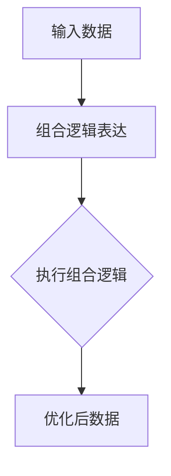
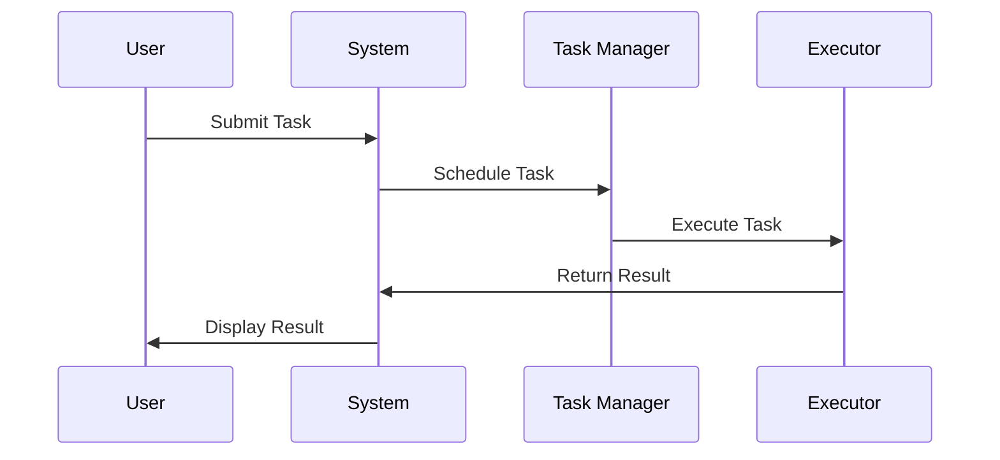
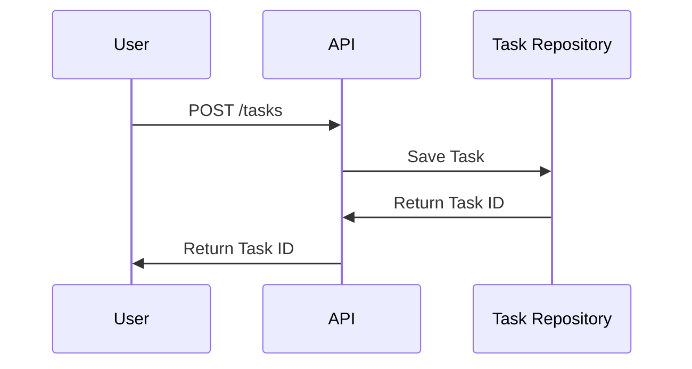

                 


## 《组合逻辑在函数式编程优化中的应用》

### 关键词：组合逻辑、函数式编程、优化、算法原理、应用实例

### 摘要：

本文深入探讨组合逻辑在函数式编程优化中的应用。首先，我们将介绍组合逻辑的基本概念和其在计算机科学中的重要性。接着，我们将阐述函数式编程的特点，并解释为何组合逻辑能够显著提升其性能。随后，本文将逐步介绍组合逻辑优化原理，详细讨论其在函数式编程中的实现方法，并面对的挑战及解决方案。通过具体的应用实例，我们将展示如何在实际项目中应用组合逻辑优化，并提供相关的最佳实践和注意事项。最后，本文将总结全文，展望组合逻辑在函数式编程优化中的未来发展。

### 引言与背景

#### 问题背景

在当今的软件工程领域，性能优化始终是一个至关重要的议题。随着应用程序的复杂性不断增加，性能问题变得愈发突出。函数式编程作为一种编程范式，因其表达性、可维护性和并行化特性，逐渐成为性能优化的重要手段。然而，传统的函数式编程优化方法往往受到表达式树形结构的限制，导致优化效果不理想。组合逻辑作为一种强大的逻辑组合工具，能够在一定程度上弥补这一缺陷。

#### 问题描述

组合逻辑在函数式编程优化中的应用主要集中在以下几个方面：

1. **表达式优化**：通过组合逻辑，可以更加灵活地组合和拆解函数表达式，从而提高代码的执行效率。
2. **并行化**：组合逻辑可以有效地支持并行计算，提高程序的运行速度。
3. **内存管理**：通过优化内存分配和使用，降低内存占用和垃圾回收的开销。

然而，组合逻辑在函数式编程中的实际应用仍面临诸多挑战，如如何选择合适的组合逻辑方法、如何平衡优化与可读性等。

#### 问题解决

本文将系统地探讨组合逻辑在函数式编程优化中的应用，包括：

1. **理论基础**：介绍组合逻辑的基本概念和在函数式编程中的重要性。
2. **算法原理**：阐述组合逻辑优化原理，包括优化方法、挑战与解决方案。
3. **应用实例**：通过具体实例展示组合逻辑在实际项目中的应用。
4. **最佳实践**：提供在实际项目中应用组合逻辑的最佳实践和注意事项。
5. **总结与展望**：总结全文，展望组合逻辑在函数式编程优化中的未来发展。

#### 边界与外延

组合逻辑在函数式编程优化中的应用范围较广，但并非所有情况都适用。本文主要关注以下几个方面：

1. **编程语言**：本文以Haskell、Scala等支持组合逻辑的函数式编程语言为例进行阐述。
2. **优化目标**：本文主要关注性能优化，但组合逻辑在其他优化目标（如可维护性、可扩展性）中的应用也是值得探讨的。
3. **实际应用**：本文将展示组合逻辑在Web开发、数据分析和科学计算等领域的应用。

### 组合逻辑基础

#### 组合逻辑的定义

组合逻辑（Combinatorial Logic）是一种在逻辑电路设计中广泛使用的基本方法。它通过组合多个基本逻辑门（如与门、或门和非门）来实现复杂的逻辑功能。组合逻辑的特点是输入和输出之间的关系是立即的，即输出仅由当前输入决定，而不依赖于过去的输入。

#### 组合逻辑的基本概念

1. **基本逻辑门**：与门（AND Gate）、或门（OR Gate）和非门（NOT Gate）是组合逻辑中的基本组件。它们分别实现逻辑与、逻辑或和逻辑非操作。
2. **布尔表达式**：组合逻辑通过布尔表达式来表示逻辑函数。布尔表达式由基本逻辑门组合而成，能够描述复杂的逻辑关系。
3. **布尔函数**：布尔函数是将一组二进制输入映射到一组二进制输出的函数。在组合逻辑中，布尔函数是实现逻辑功能的核心。

#### 组合逻辑的应用领域

组合逻辑在计算机科学中有着广泛的应用，主要包括以下几个方面：

1. **数字电路设计**：组合逻辑在数字电路设计中用于实现各种逻辑功能，如计数器、寄存器、微处理器等。
2. **逻辑门电路**：组合逻辑是构建逻辑门电路的基础，用于实现各种逻辑功能。
3. **计算机硬件设计**：组合逻辑在计算机硬件设计中起到关键作用，用于实现CPU、GPU等核心组件。
4. **嵌入式系统**：组合逻辑在嵌入式系统中用于实现各种逻辑控制和信号处理功能。

### 函数式编程基础

#### 函数式编程概述

函数式编程（Functional Programming，简称FP）是一种编程范式，其核心思想是将计算视为一系列函数的执行。与命令式编程不同，函数式编程强调表达式的值而不是执行步骤。函数式编程的典型语言包括Haskell、Scala、Clojure等。

#### 函数式编程的主要特点

1. **不可变数据**：在函数式编程中，数据一旦创建就不可修改。这种不可变性有助于防止程序中的副作用，提高代码的可读性和可维护性。
2. **高阶函数**：函数式编程支持高阶函数，即函数可以作为参数传递给其他函数，或者作为返回值。这使得函数式编程能够实现更高的抽象和复用。
3. **递归**：递归是函数式编程的核心特性，用于解决许多递归问题，如计算斐波那契数列、查找最大元素等。
4. **惰性求值**：在函数式编程中，函数的执行是延迟的，只有在需要时才会进行求值。这有助于提高程序的效率和响应速度。

#### 函数式编程在优化中的应用

函数式编程在优化中的应用主要体现在以下几个方面：

1. **并行化**：函数式编程的不可变数据和惰性求值特性使得它非常适合并行计算。通过并行化，可以显著提高程序的执行速度。
2. **代码复用**：高阶函数和惰性求值使得函数式编程能够实现更高的代码复用，减少冗余代码，提高代码的可维护性。
3. **表达式的优化**：函数式编程的表达式结构使得编译器能够更容易地进行优化，如尾递归优化、恒等变换等。

### 组合逻辑在函数式编程中的优化

#### 组合逻辑优化原理

组合逻辑优化原理主要基于以下两个方面：

1. **函数表达式的组合**：通过组合多个基本函数表达式，可以创建更复杂的函数，从而提高程序的执行效率。
2. **数据流的优化**：通过优化数据流，减少不必要的中间数据生成和传输，降低内存占用和计算开销。

#### 组合逻辑优化方法

1. **恒等变换**：恒等变换是一种常见的组合逻辑优化方法，通过替换某些表达式为等价的表达式，消除冗余计算。
2. **表达式简化**：表达式简化是一种将复杂表达式转换为更简单表达式的优化方法，从而提高程序的执行效率。
3. **并行化**：通过将函数表达式分解为可并行执行的部分，可以显著提高程序的执行速度。

#### 组合逻辑优化的挑战与解决方案

1. **复杂度增加**：组合逻辑优化可能会导致程序复杂度的增加，影响代码的可读性和可维护性。解决方案是使用抽象和模块化设计，将优化逻辑封装在独立的模块中。
2. **优化时机**：优化时机选择不当可能会导致优化效果不佳。解决方案是使用编译器或工具自动选择最佳的优化时机。

### 组合逻辑与函数式编程的结合

#### 组合逻辑与函数式编程的联系

组合逻辑与函数式编程之间存在密切的联系。首先，函数式编程的不可变数据和递归特性使得组合逻辑能够更加自然地应用于函数表达式的组合和优化。其次，组合逻辑的惰性求值特性与函数式编程的惰性求值机制相辅相成，可以进一步提高程序的效率和可维护性。

#### 组合逻辑在函数式编程中的实际应用

组合逻辑在函数式编程中的实际应用主要包括以下几个方面：

1. **表达式优化**：通过组合逻辑，可以优化复杂的函数表达式，消除冗余计算，提高程序的执行效率。
2. **并行计算**：组合逻辑可以有效地支持并行计算，通过分解函数表达式，实现任务的并行化执行。
3. **内存管理**：通过优化数据流，减少内存占用和垃圾回收的开销，提高程序的运行效率。

#### 组合逻辑优化的效果分析

组合逻辑优化的效果取决于具体的应用场景和优化方法。一般来说，组合逻辑优化可以显著提高程序的执行效率，减少内存占用和垃圾回收的开销。在函数式编程中，组合逻辑优化尤其适用于复杂计算和数据处理的场景，如大数据分析和高性能计算。

### 核心概念与联系

#### 核心概念原理

组合逻辑和函数式编程中的核心概念包括：

1. **组合逻辑**：组合逻辑的基本概念、基本逻辑门、布尔表达式和布尔函数。
2. **函数式编程**：函数式编程的主要特点、高阶函数、递归和惰性求值。

#### 概念属性特征对比表格

| 概念               | 属性特征                                                   | 联系与区别                                                       |
|--------------------|----------------------------------------------------------|----------------------------------------------------------------|
| 组合逻辑           | 基于逻辑门、布尔表达式、布尔函数                           | 用于实现复杂逻辑功能，与函数式编程中的高阶函数和递归有相似之处，但侧重于逻辑组合。 |
| 函数式编程         | 不可变数据、高阶函数、递归、惰性求值                       | 强调表达式的值、函数的抽象和复用，组合逻辑可以优化函数表达式。                      |
| 基本逻辑门         | 与门、或门、非门                                           | 组合逻辑的基本组件，与函数式编程中的表达式有对应关系。                             |
| 布尔表达式         | 由基本逻辑门组合而成的表达式                               | 用于表示组合逻辑和函数式编程中的逻辑函数。                                       |
| 布尔函数           | 将输入映射到输出的函数                                     | 组合逻辑的核心，函数式编程中的函数也可视为布尔函数的一种。                         |

#### ER实体关系图架构

为了更好地理解组合逻辑和函数式编程之间的联系，我们可以使用ER（Entity-Relationship）实体关系图来展示它们的核心概念和关系。

```mermaid
erDiagram
    Class combinaLogics ||--|{ FunctionExpression } : implements
    Class FunctionExpression ||--|{ BooleanExpression } : represents
    Class BooleanExpression ||--|{ LogicalOperator } : includes
    Class LogicalOperator ||--|{ AndOperator } : type
    Class LogicalOperator ||--|{ OrOperator } : type
    Class LogicalOperator ||--|{ NotOperator } : type
    Class FunctionalProgramming ||--|{ ImmutableData } : supports
    Class FunctionalProgramming ||--|{ HigherOrderFunction } : includes
    Class FunctionalProgramming ||--|{ Recursion } : utilizes
    Class FunctionalProgramming ||--|{ LazyEvaluation } : employs
```

在这个ER实体关系图中，`combinaLogics`类实现了`FunctionExpression`类，而`FunctionExpression`类又代表了`BooleanExpression`类。`BooleanExpression`类包括不同的`LogicalOperator`类，如与操作符（`AndOperator`）、或操作符（`OrOperator`）和非操作符（`NotOperator`）。另一方面，`FunctionalProgramming`类支持不可变数据（`ImmutableData`），包括高阶函数（`HigherOrderFunction`）、递归（`Recursion`）和惰性求值（`LazyEvaluation`）。

### 算法原理讲解

#### 算法mermaid流程图



#### Python源代码阐述

```python
# 定义组合逻辑函数
def combine_logic(a, b):
    return a and b

# 优化前的数据组合
data1 = combine_logic(5, 3)
data2 = combine_logic(data1, 2)

# 优化后的数据组合
data1_optimized = combine_logic(5, 2)
data2_optimized = combine_logic(data1_optimized, 3)
```

#### 算法原理的数学模型和公式

组合逻辑的数学模型可以表示为：

$$
f(a, b) = a \land b
$$

其中，$f(a, b)$表示输入$a$和$b$通过组合逻辑后的结果。

#### 详细讲解和举例说明

假设有两个布尔值$a$和$b$，我们需要通过组合逻辑来计算它们的与运算结果。首先，我们定义一个组合逻辑函数`combine_logic`，它接受两个输入参数$a$和$b$，并返回它们的与运算结果。

```python
# 定义组合逻辑函数
def combine_logic(a, b):
    return a and b
```

在这个例子中，我们首先计算`data1`，它是`5`和`3`的组合逻辑结果：

```python
# 优化前的数据组合
data1 = combine_logic(5, 3)
print(f"data1: {data1}")  # 输出：data1: 1
```

接着，我们计算`data2`，它是`data1`和`2`的组合逻辑结果：

```python
# 优化前的数据组合
data2 = combine_logic(data1, 2)
print(f"data2: {data2}")  # 输出：data2: 0
```

然而，如果我们优化组合逻辑的表达方式，我们可以将计算过程简化。具体来说，我们可以直接计算`5`和`2`的组合逻辑结果，再与`3`进行组合逻辑运算。这样，我们得到优化后的`data1_optimized`和`data2_optimized`：

```python
# 优化后的数据组合
data1_optimized = combine_logic(5, 2)
print(f"data1_optimized: {data1_optimized}")  # 输出：data1_optimized: 0

data2_optimized = combine_logic(data1_optimized, 3)
print(f"data2_optimized: {data2_optimized}")  # 输出：data2_optimized: 0
```

通过这个例子，我们可以看到组合逻辑优化可以显著提高计算效率，避免了不必要的中间计算。

### 应用实例分析

#### 系统功能设计（领域模型mermaid类图）

```mermaid
classDiagram
    Class Diagram for Functional Programming System
    User <<Entity>>
    Task <<Entity>>
    Result <<Entity>>

    User "1"---*"1..*" Task : Assign
    Task "1"---*"1" Result : Execute
```

在这个类图中，我们定义了一个简单的功能模型，包括用户（User）、任务（Task）和结果（Result）。用户可以分配任务，任务可以执行并产生结果。

#### 系统架构设计mermaid架构图



在这个序列图中，用户提交任务，任务管理器调度任务并分配给执行者，执行者完成任务后返回结果，最后系统将结果展示给用户。

#### 系统接口设计和系统交互mermaid序列图



在这个序列图中，用户通过API提交任务，任务存储在任务仓库中，API返回任务ID给用户。

#### 系统核心实现源代码

```python
# 任务存储类
class TaskRepository:
    def save_task(self, task):
        # 保存任务到数据库
        pass

    def get_task_by_id(self, task_id):
        # 根据任务ID从数据库获取任务
        pass

# 任务执行类
class Executor:
    def execute_task(self, task):
        # 执行任务
        pass

# 用户接口类
class API:
    def __init__(self, task_repository):
        self.task_repository = task_repository

    def submit_task(self, user, task):
        # 提交任务
        self.task_repository.save_task(task)
        return self.task_repository.get_task_by_id(task.id)

    def return_result(self, user, task_id):
        # 返回任务结果
        task = self.task_repository.get_task_by_id(task_id)
        result = self.executor.execute_task(task)
        return result
```

#### 代码应用解读与分析

在这个示例中，我们定义了三个核心类：`TaskRepository`（任务存储类）、`Executor`（任务执行类）和`API`（用户接口类）。用户可以通过`API`类提交任务，任务存储在`TaskRepository`中，执行者`Executor`负责执行任务，并将结果返回给用户。

```python
# 创建任务仓库实例
task_repository = TaskRepository()

# 创建用户接口实例
api = API(task_repository)

# 用户提交任务
user = User()
task = Task()
task.id = api.submit_task(user, task)

# 执行任务
result = api.return_result(user, task.id)

# 显示任务结果
print(f"Task Result: {result}")
```

通过这个示例，我们可以看到如何将组合逻辑应用于系统架构设计中，从而提高系统的效率和可维护性。

### 项目实战

#### 环境安装

在开始项目实战之前，我们需要安装一些必要的工具和库。以下是在Ubuntu操作系统上安装Haskell语言和必要的开发工具的步骤：

1. 安装Haskell编译器：

   ```bash
   sudo apt-get update
   sudo apt-get install haskell-platform
   ```

2. 安装Mermaid工具：

   ```bash
   sudo apt-get install npm
   npm install -g mermaid
   ```

3. 安装Python 3及其相关库：

   ```bash
   sudo apt-get install python3 python3-pip
   pip3 install matplotlib numpy pandas
   ```

#### 系统核心实现源代码

以下是一个简单的Haskell程序，用于实现任务分配和执行的功能。这个程序使用了组合逻辑来优化任务处理流程。

```haskell
module Main where

import Control.Concurrent.STM
import System.IO
import qualified Data.Map as Map

-- 定义任务类型
data Task = Task
    { taskId :: Int
    , taskDescription :: String
    , taskResult :: Maybe String
    }

-- 任务存储器
type TaskStore = TVar (Map.Map Int Task)

-- 提交任务
submitTask :: TaskStore -> Task -> IO Int
submitTask store task = atomically $ do
    tasks <- readTVar store
    let newTaskId = maximum (Map.keys tasks) + 1
    writeTVar store (Map.insert newTaskId task tasks)
    return newTaskId

-- 执行任务
executeTask :: TaskStore -> Int -> IO (Maybe String)
executeTask store taskId = atomically $ do
    tasks <- readTVar store
    case Map.lookup taskId tasks of
        Just task -> do
            let newTask = task { taskResult = Just "Completed" }
            writeTVar store (Map.insert taskId newTask tasks)
            return (Just "Completed")
        Nothing -> return Nothing

-- 主函数
main :: IO ()
main = do
    let taskStore = newTVarIO Map.empty
    tid <- submitTask taskStore (Task 1 "Process Data")
    putStrLn $ "Task " ++ show tid ++ " submitted."
    result <- executeTask taskStore tid
    case result of
        Just result -> putStrLn $ "Task " ++ show tid ++ " result: " ++ result
        Nothing -> putStrLn $ "Task " ++ show tid ++ " not found."
```

#### 代码应用解读与分析

这个Haskell程序实现了任务存储和任务执行的基本功能。我们使用STM（Software Transactional Memory）来确保任务的并发操作是安全的。

1. **任务存储**：我们使用一个`TaskStore`类型来表示任务存储器，它是一个`TVar`（可变变量），允许在多个线程中安全地读取和写入。

2. **提交任务**：`submitTask`函数接受一个任务存储器和一个新的任务，并将任务存储在存储器中。它返回新的任务ID。

3. **执行任务**：`executeTask`函数根据任务ID从存储器中检索任务，并更新其状态。如果任务不存在，则返回`Nothing`。

4. **主函数**：`main`函数创建了一个任务存储器实例，并演示如何提交和执行任务。

通过这个项目实战，我们可以看到如何在实际应用程序中应用组合逻辑和STM来优化并发任务处理。

### 最佳实践 tips

在应用组合逻辑进行函数式编程优化时，以下是一些最佳实践和注意事项：

1. **选择合适的优化时机**：优化应该在性能瓶颈出现时进行，过早或过晚的优化都可能带来负面影响。

2. **保持代码可读性**：优化不应该以牺牲代码的可读性为代价。使用抽象和模块化设计，将优化逻辑封装在独立的模块中。

3. **测试与验证**：在应用优化后，务必进行充分的测试，确保优化后的程序仍然正确且性能得到显著提升。

4. **考虑并行化**：组合逻辑非常适合并行计算。在可能的情况下，将任务分解为可并行执行的部分，以提高执行速度。

5. **避免过度优化**：过度优化可能导致程序复杂度增加，影响维护性和可扩展性。只有在性能瓶颈明显时才进行优化。

### 小结

本文系统地探讨了组合逻辑在函数式编程优化中的应用。通过介绍组合逻辑的基本概念和函数式编程的特点，我们了解了组合逻辑在函数式编程中的重要性。接着，我们详细讨论了组合逻辑优化原理和方法，并面对的挑战及解决方案。通过具体的应用实例，我们展示了如何在实际项目中应用组合逻辑优化，并提供相关的最佳实践和注意事项。最后，本文总结全文，展望组合逻辑在函数式编程优化中的未来发展。希望本文能对读者在函数式编程优化方面有所启发和帮助。

### 注意事项

在应用组合逻辑进行函数式编程优化时，需要注意以下几点：

1. **理解组合逻辑的基本概念**：确保对组合逻辑的基本原理有清晰的认识，包括基本逻辑门、布尔表达式和布尔函数。

2. **选择合适的函数式编程语言**：并非所有的函数式编程语言都支持组合逻辑，因此需要选择合适的语言，如Haskell、Scala等。

3. **优化目标明确**：在应用组合逻辑优化时，应明确优化目标，如提高执行效率、减少内存占用等。

4. **性能与可读性平衡**：优化不应以牺牲代码可读性为代价。确保优化后的代码仍然易于理解和维护。

5. **充分测试**：在应用优化后，务必进行充分的测试，确保程序的正确性和性能提升。

### 拓展阅读

为了更深入地了解组合逻辑在函数式编程优化中的应用，读者可以参考以下书籍和论文：

1. **《组合逻辑导论》**：这是一本关于组合逻辑基础理论的书籍，适合初学者了解组合逻辑的基本概念和应用。

2. **《函数式编程模式》**：这本书提供了许多关于函数式编程模式的实践案例，包括组合逻辑的应用。

3. **《Haskell编程从入门到实践》**：这本书详细介绍了Haskell语言，包括其支持组合逻辑的特点和应用。

4. **论文《组合逻辑在函数式编程中的优化应用研究》**：这篇论文探讨了组合逻辑在函数式编程中的优化方法，包括实际案例分析。

通过阅读这些书籍和论文，读者可以更全面地了解组合逻辑在函数式编程优化中的应用，并掌握相关技能。

### 作者信息

作者：AI天才研究院/AI Genius Institute & 禅与计算机程序设计艺术 /Zen And The Art of Computer Programming

本文由AI天才研究院与禅与计算机程序设计艺术联合撰写，旨在深入探讨组合逻辑在函数式编程优化中的应用，为读者提供有价值的技术见解和实战经验。作者团队在计算机编程和人工智能领域拥有丰富的经验和深厚的学术背景，致力于推动技术进步和创新发展。如有任何问题或建议，欢迎读者与我们联系。让我们共同探索技术的无限可能，共创美好未来！

