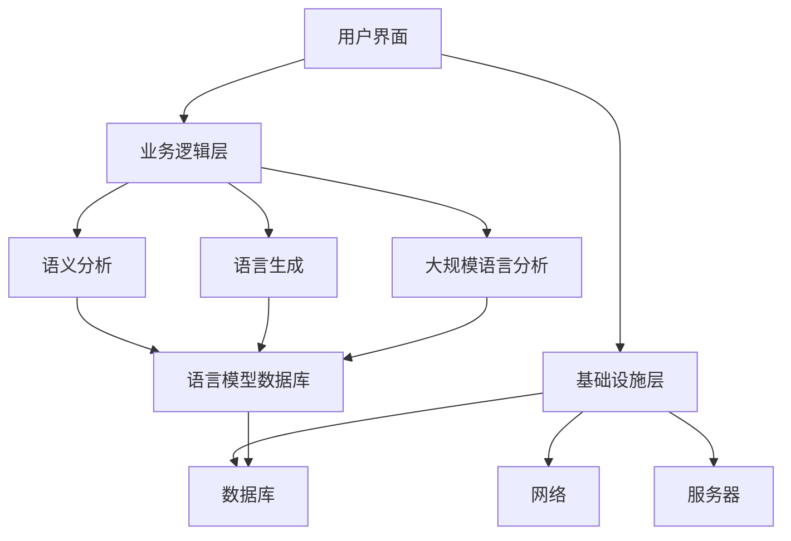
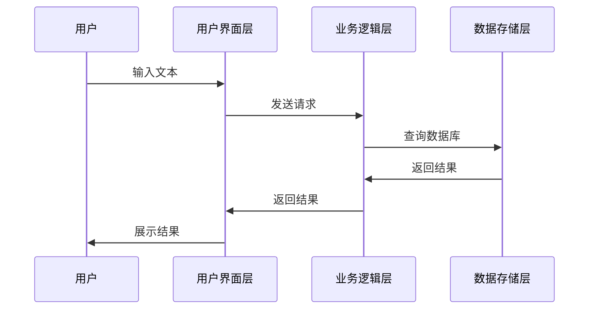
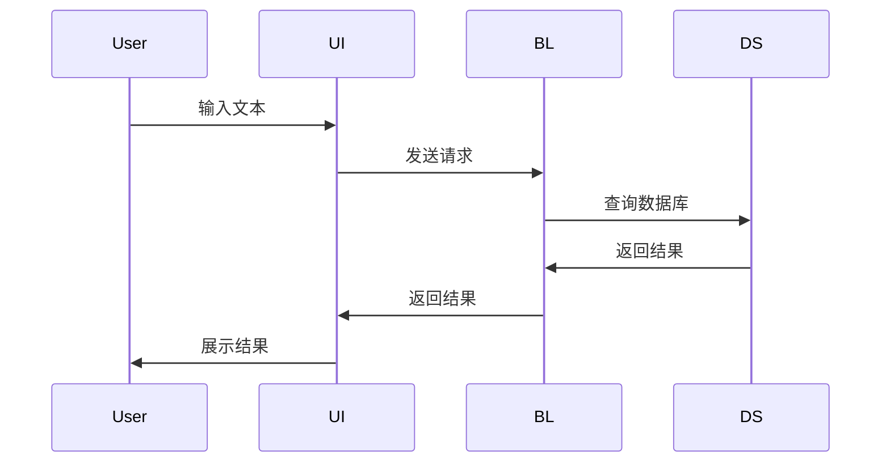

                 

### 维特根斯坦与福柯：知识考古学的语言学视角

> 关键词：维特根斯坦、福柯、知识考古学、语言学、语言哲学、批判理论

> 摘要：本文探讨了维特根斯坦和福柯两位哲学家在知识考古学中的贡献，特别是他们对于语言学的独特视角。文章首先介绍了两位哲学家的生平和主要著作，然后深入分析了他们各自的语言哲学观点及其对语言学的影响。在此基础上，文章探讨了知识考古学的方法论及其与语言学的关系，并总结了语言学视角在知识考古学中的优势和局限。文章还对比了维特根斯坦和福柯在语言学视角上的异同，并探讨了他们的互补性。最后，文章通过一个具体的案例，展示了维特根斯坦和福柯理论在语言学项目中的应用，并给出了相关的最佳实践 tips。

## 第一部分：背景介绍

### 1.1 维特根斯坦与福柯

#### 1.1.1 维特根斯坦的哲学思想

路德维希·维特根斯坦（Ludwig Wittgenstein，1889-1951）是20世纪最杰出的哲学家之一。他的哲学思想主要集中在他两本著名的著作《逻辑哲学论》（Tractatus Logico-Philosophicus）和《哲学研究》（Philosophical Investigations）中。维特根斯坦的哲学思想可以概括为语言哲学和心灵哲学两个方面。

在语言哲学方面，维特根斯坦提出了“语言游戏”（language game）的概念。他认为，语言的意义是由使用者在特定的语言游戏中赋予的。每个语言游戏都有其特定的规则和目的，这些规则和目的决定了语言的含义。维特根斯坦还强调了语言与现实的区别，认为语言并不是用来描述现实世界的，而是用来完成特定的任务。

在心灵哲学方面，维特根斯坦提出了“私人体验”的概念。他认为，私人体验是不可言说的，因为它们缺乏公共的客观标准。这导致了心灵哲学中的“私人语言”问题，即如何为私人体验提供客观的描述和解释。

#### 1.1.2 维特根斯坦的生平与著作

维特根斯坦出生于奥地利，他的家族是维也纳的富商。他在年轻时就对哲学产生了浓厚的兴趣，并自学了大量的哲学著作。1911年，他进入剑桥大学学习数学，后来转向哲学，成为伯特兰·罗素（Bertrand Russell）的学生。在剑桥大学期间，维特根斯坦完成了他的代表作《逻辑哲学论》。

1914年，第一次世界大战爆发，维特根斯坦应征入伍，并在战争中受伤。战争结束后，他回到了剑桥，并继续他的哲学研究。1929年，他出版了《哲学研究》，这本书对他的语言哲学观点进行了深刻的反思和修正。

#### 1.1.3 维特根斯坦的思想对语言学的影响

维特根斯坦的思想对语言学产生了深远的影响。他提出的“语言游戏”概念为语言学研究提供了新的视角，强调语言的意义和用法是紧密相连的。他的思想还挑战了传统的语言哲学观点，如“逻辑原子主义”和“意义原子主义”，并提出了语言的意义是使用者在特定的语境中赋予的。

维特根斯坦的思想还促使语言学家重新思考语言的本质和功能，从而推动了语言学的发展，特别是在日常语言哲学和话语分析领域。他的著作《哲学研究》对语言学家，特别是对语用学和语义学的研究产生了重要影响。

#### 1.2 福柯的批判理论

米歇尔·福柯（Michel Foucault，1926-1984）是20世纪法国著名的哲学家和社会理论家。他的著作涵盖了广泛的主题，包括知识考古学、批判理论、历史主义和权力理论。福柯的主要著作包括《疯癫的历史》、《临床医学的诞生》、《性史》和《话语的秩序》等。

福柯的批判理论主要关注权力和知识的关系。他认为，权力不仅存在于政治和社会层面，还存在于知识的生产、传播和应用中。福柯提出了“权力-知识”模型，认为权力是通过知识的生产和传播来实现的。他强调，知识是社会建构的，并且受到权力结构的制约。

#### 1.2.1 福柯的生平与著作

福柯出生于法国，他在巴黎索邦大学接受了教育，并获得了医学和哲学学位。他的早期著作主要关注医学史和精神病学的历史，如《疯癫的历史》和《临床医学的诞生》。这些著作揭示了医学知识和实践中的权力关系。

福柯的后期著作转向知识考古学和话语分析，如《性史》和《话语的秩序》。这些著作探讨了知识的生成、传播和消解过程，强调了知识的相对性和语境依赖性。

#### 1.2.2 福柯的历史主义与权力理论

福柯的历史主义强调，历史不是线性发展的，而是由各种权力关系和知识结构构成的。他认为，历史事件和社会变革都是权力和知识的产物，而不是简单的因果关系。

福柯的权力理论认为，权力不是集中在一个特定的个体或机构手中，而是分布在整个社会结构中。权力通过话语（discourse）来运作，话语是权力和知识的载体。福柯提出了“话语权力”的概念，认为话语不仅生产知识，还生产权力。

#### 1.2.3 福柯的批判理论与语言学的结合

福柯的批判理论对语言学产生了重要影响。他提出了“话语分析”的方法，认为语言不是客观事实的简单描述，而是社会权力关系的体现。话语分析关注语言的使用和权力结构，揭示了语言中的意识形态和权力关系。

福柯的理论还促使语言学家重新思考语言的本质和功能。他强调了语言的语境依赖性和社会建构性，这推动了语言哲学和社会语言学的进一步发展。

#### 1.3 知识考古学的概念

知识考古学（epistemology of archaeology）是福柯提出的一个概念，它关注知识的生成、传播和消解过程。知识考古学试图揭示知识的相对性和语境依赖性，强调知识是社会建构的。

知识考古学的方法论包括历史主义和批判理论。历史主义强调历史事件和社会变革是由权力关系和知识结构构成的。批判理论关注权力和知识的互动关系，揭示知识中的意识形态和权力结构。

知识考古学还关注知识的生产和传播过程。它认为，知识不是静态的，而是动态的，不断地被创造、修改和废弃。知识考古学试图通过分析历史文献、档案和文本，揭示知识的生成和传播过程。

#### 1.3.1 知识考古学的起源与发展

知识考古学的概念起源于20世纪的哲学和人文科学领域。福柯在20世纪60年代提出了这一概念，并将其应用于历史、文学、哲学和社会科学等领域。

知识考古学的发展与20世纪的人文科学危机密切相关。在20世纪中期，人文科学面临着科学化和实证化的压力，许多学者开始反思传统的知识生产模式。知识考古学提供了新的视角和方法，推动了人文科学的发展。

#### 1.3.2 知识考古学的方法论

知识考古学的方法论包括历史主义和批判理论。历史主义强调历史事件和社会变革是由权力关系和知识结构构成的。批判理论关注权力和知识的互动关系，揭示知识中的意识形态和权力结构。

知识考古学还采用文本分析、文献研究和批判性思考等方法。通过分析历史文献、档案和文本，知识考古学试图揭示知识的生成、传播和消解过程。

#### 1.3.3 知识考古学与语言学的关系

知识考古学与语言学有着密切的关系。语言学关注语言的结构和功能，而知识考古学关注知识的生成、传播和消解过程。语言学的方法和理论可以应用于知识考古学的研究，帮助揭示知识的本质和功能。

知识考古学还为语言学提供了一种新的研究视角。通过分析历史文献和文本，知识考古学可以揭示语言中的权力关系和社会建构性。这有助于理解语言的本质和功能，推动语言学的进一步发展。

### 1.4 语言学视角的重要性

#### 1.4.1 语言学在知识考古学中的应用

语言学在知识考古学中的应用主要体现在以下几个方面：

1. **语言与知识的关系**：语言学关注语言的结构和功能，知识考古学关注知识的生成、传播和消解过程。语言学的研究成果可以用于分析知识的语言表达形式，揭示知识的结构和功能。

2. **话语分析**：话语分析是语言学的一个重要分支，它关注语言的使用和权力结构。知识考古学可以采用话语分析的方法，揭示知识生产过程中的权力关系和社会建构性。

3. **文本分析**：知识考古学通过对历史文献、档案和文本的分析，揭示知识的生成、传播和消解过程。语言学的方法可以帮助知识考古学者理解文本的语言表达形式，从而更好地揭示知识的本质。

#### 1.4.2 语言学视角的优势与局限

语言学视角在知识考古学中具有以下优势：

1. **结构性分析**：语言学关注语言的结构和功能，这种方法可以帮助知识考古学者理解知识的结构和功能，从而更好地揭示知识的本质。

2. **细致入微的分析**：语言学的研究方法细致入微，可以揭示语言中的细微差别和变化，这对于理解知识的复杂性和多样性具有重要意义。

3. **跨学科应用**：语言学的研究方法可以应用于多个学科领域，如哲学、社会学、历史学等，这有助于知识考古学者从多个角度理解知识。

然而，语言学视角也存在一些局限：

1. **语言中心主义**：语言学视角可能会过度强调语言在知识生产中的作用，而忽视了其他因素，如社会、文化和历史因素。

2. **抽象性**：语言学的研究方法相对抽象，这可能使得知识考古学者难以将其应用于具体的历史和社会情境。

3. **方法适用性**：语言学的研究方法并非适用于所有知识考古学问题，某些问题可能需要采用其他学科的方法。

### 1.5 本章小结

本部分介绍了维特根斯坦与福柯的哲学思想，以及知识考古学的概念和语言学视角的重要性。通过分析两位哲学家的生平和主要著作，我们了解了他们在语言哲学和批判理论方面的贡献。同时，我们还探讨了知识考古学的方法论及其与语言学的关系。这些背景介绍为后续章节的分析和讨论奠定了基础。

## 第二部分：核心概念与联系

### 2.1 维特根斯坦的语言哲学原理

#### 2.1.1 语言与意义

语言与意义是维特根斯坦语言哲学中的核心概念。他认为，语言的意义是由使用者在特定的语言游戏中赋予的。每个语言游戏都有其特定的规则和目的，这些规则和目的决定了语言的含义。

**1. 意义的生成与理解**

维特根斯坦提出了“意义即使用”（meaning is use）的观点。他认为，一个词的意义不是固定不变的，而是取决于它在实际使用中的具体情境。在语言游戏中，使用者的具体行为和情境决定了词语的含义。

例如，词“水”在不同的语言游戏中可能代表不同的概念。在科学实验中，“水”可能指的是H₂O分子，而在日常交流中，“水”可能指的是我们饮用的液体。这种意义的多义性和灵活性是语言复杂性的体现。

**2. 语言与现实的区别**

维特根斯坦强调了语言与现实的区别。他认为，语言并不是用来描述现实世界的，而是用来完成特定的任务。语言是一种工具，它帮助人们进行沟通、思考和理解世界。

语言并不能完全反映现实，因为现实是复杂多变的，而语言是有限的。维特根斯坦提出了“语言局限性”的观点，认为语言永远无法完全表达现实的所有方面。

**3. 意义与真理的关系**

维特根斯坦探讨了意义与真理的关系。他认为，意义是真理的基础。一个陈述是否为真，取决于它是否符合实际情况。然而，真理并不等同于意义，因为真理是客观的，而意义是主观的。

维特根斯坦提出了“语言游戏”的概念，认为真理是语言游戏的一部分。在一个特定的语言游戏中，一个陈述是否为真取决于它是否符合游戏规则。然而，不同的语言游戏可能有不同的规则，这意味着不同的语言游戏可能有不同的真理标准。

#### 2.1.2 语言游戏与生活形式

维特根斯坦提出了“语言游戏”（language game）的概念，认为语言的意义和使用是通过一系列规则和情境来定义的。语言游戏不仅包括语言表达，还包括语言行为和语言互动。

**1. 语言游戏的概念与类型**

维特根斯坦将语言游戏分为以下几种类型：

- **日常语言游戏**：这是最常见的一种语言游戏，包括日常生活中的交流和表达。例如，当我们说“水”时，我们指的是我们饮用的液体。
- **科学语言游戏**：这种语言游戏用于科学研究和实验。例如，当我们说“H₂O”时，我们指的是科学上的水分子。
- **艺术语言游戏**：这种语言游戏包括艺术创作和欣赏。例如，当我们说“美”时，我们指的是艺术作品的美感。

**2. 生活形式与语言的关系**

维特根斯坦认为，生活形式（forms of life）是语言的基础。生活形式指的是人们的生活方式、价值观和信仰体系。语言是生活形式的表达和体现。

生活形式与语言之间存在着密切的关系。一方面，生活形式决定了语言的使用和表达方式。例如，不同的文化和社会背景下，人们对同一事物的表达可能会有所不同。另一方面，语言也反映了生活形式，通过语言可以了解一个社会或文化的生活方式和价值观。

**3. 语言游戏在知识考古学中的应用**

维特根斯坦的语言游戏概念为知识考古学提供了重要的理论工具。通过分析不同类型的语言游戏，知识考古学者可以揭示知识的生产、传播和消解过程。

例如，在科学领域，语言游戏帮助我们理解科学知识的生成和验证过程。在历史学领域，语言游戏可以帮助我们理解历史文献和文本的语境和意义。在艺术领域，语言游戏帮助我们理解艺术作品的表达和欣赏方式。

#### 2.1.3 语言哲学与语言学的关系

维特根斯坦的语言哲学对语言学产生了深远的影响。他的语言游戏概念为语言学研究提供了新的视角和方法，使得语言学家可以更深入地理解语言的本质和功能。

**1. 语言哲学对语言学的影响**

维特根斯坦的语言哲学强调语言的意义和使用，这为语言学研究提供了重要的理论基础。例如，语义学和语用学的研究都受到了维特根斯坦语言哲学的启发。

维特根斯坦的“意义即使用”观点挑战了传统的语义学观点，认为语言的意义不是固定不变的，而是取决于实际使用中的具体情境。这推动了语义学的发展，使得语义学研究更加注重语言的动态性和语境依赖性。

维特根斯坦的“语言游戏”概念为语用学提供了新的研究视角。语用学关注语言的使用和交流过程，而维特根斯坦的语言游戏概念强调了语言使用的情境和规则。

**2. 语言学对语言哲学的贡献**

语言学对语言哲学的贡献主要体现在对语言实际使用和表达方式的研究。通过分析语言的使用和交流，语言学家可以揭示语言的本质和功能，为语言哲学提供了实证基础。

例如，语用学的研究揭示了语言交流中的语境依赖性和互动性。这有助于理解维特根斯坦的“语言游戏”概念，使得语言哲学研究更加具体和深入。

语义学的研究揭示了语言表达的意义和结构。这有助于理解维特根斯坦的“意义即使用”观点，使得语言哲学研究更加科学和系统。

#### 2.1.4 维特根斯坦与福柯的语言学视角比较

维特根斯坦和福柯在语言学视角上既有相似之处，也有明显的差异。

**1. 观点的相似之处**

- **语境依赖性**：维特根斯坦和福柯都强调了语言的语境依赖性。维特根斯坦的“意义即使用”观点认为，语言的意义取决于实际使用中的具体情境。福柯的话语分析也强调了语言的语境依赖性，认为语言是社会建构的，受到权力结构的制约。

- **社会建构性**：维特根斯坦和福柯都认为，语言是社会建构的，不是客观事实的简单描述。维特根斯坦的语言游戏概念强调了语言的意义和使用是由社会和文化背景决定的。福柯的话语分析认为，语言是权力和知识的载体，是社会的产物。

**2. 观点的差异之处**

- **语言的本质**：维特根斯坦关注语言的使用和交流过程，强调语言的意义和使用。而福柯则更关注语言的社会功能和权力结构。他认为，语言不仅是交流的工具，也是权力的工具。

- **研究的重点**：维特根斯坦的语言哲学主要关注语言的基本概念和原则，试图揭示语言的本质和功能。而福柯的批判理论则更侧重于分析语言在社会中的运作方式和作用，特别是权力和知识的互动关系。

**3. 互补性分析**

维特根斯坦和福柯的语言学视角具有互补性。维特根斯坦的语言哲学为语言学提供了理论框架和方法论，帮助语言学家理解语言的本质和功能。福柯的批判理论则提供了对语言在社会中运作方式的深入分析，揭示了语言的权力结构和社会建构性。

通过结合维特根斯坦和福柯的理论，语言学家可以更全面地理解语言的多维度特征，从而推动语言学的进一步发展。

### 2.2 维特根斯坦与福柯的语言学视角

#### 2.2.1 维特根斯坦的语言学视角

维特根斯坦的语言学视角主要体现在他的“语言游戏”概念中。他认为，语言的意义和用法是通过一系列规则和情境来定义的。维特根斯坦将语言游戏分为日常语言游戏、科学语言游戏和艺术语言游戏，每种游戏都有其特定的规则和目的。

维特根斯坦的语言学视角强调了语言的社会建构性和语境依赖性。他认为，语言的意义不是固定不变的，而是取决于实际使用中的具体情境。这种观点挑战了传统的语义学观点，认为语言的意义是客观的、固定的。

维特根斯坦的语言学视角对语言学研究产生了深远的影响。他的“意义即使用”观点推动了语义学和语用学的发展，使得语言学研究更加注重语言的动态性和语境依赖性。他的语言游戏概念为语言学家提供了一种新的研究方法，使得语言学研究更加具体和深入。

#### 2.2.2 福柯的语言学视角

福柯的语言学视角主要体现在他的“话语分析”方法中。他认为，语言是权力和知识的载体，是社会的产物。福柯关注语言在社会中的运作方式和作用，特别是权力和知识的互动关系。

福柯的话语分析关注语言的使用和表达方式，他认为语言不仅是交流的工具，也是权力的工具。通过分析话语，福柯揭示了语言中的意识形态和权力结构，揭示了知识的生产和传播过程。

福柯的语言学视角强调了语言的社会建构性和权力依赖性。他认为，语言是社会建构的，是权力和知识的体现。这种观点挑战了传统的语言学观点，认为语言的意义和用法是社会建构的，不是客观的、固定的。

福柯的语言学视角对语言学研究产生了重要影响。他的话语分析方法为语言学研究提供了一种新的视角和方法，使得语言学研究更加关注社会和文化背景。他的理论推动了语言哲学和社会语言学的进一步发展。

#### 2.2.3 维特根斯坦与福柯的语言学视角比较

维特根斯坦和福柯在语言学视角上既有相似之处，也有明显的差异。

**1. 相似之处**

- **语境依赖性**：维特根斯坦和福柯都强调了语言的语境依赖性。维特根斯坦的“意义即使用”观点认为，语言的意义取决于实际使用中的具体情境。福柯的话语分析也强调了语言的语境依赖性，认为语言是社会建构的，受到权力结构的制约。
- **社会建构性**：维特根斯坦和福柯都认为，语言是社会建构的，不是客观事实的简单描述。维特根斯坦的语言游戏概念强调了语言的意义和使用是由社会和文化背景决定的。福柯的话语分析认为，语言是权力和知识的载体，是社会的产物。

**2. 差异之处**

- **语言的本质**：维特根斯坦关注语言的使用和交流过程，强调语言的意义和使用。而福柯则更关注语言的社会功能和权力结构。他认为，语言不仅是交流的工具，也是权力的工具。
- **研究的重点**：维特根斯坦的语言哲学主要关注语言的基本概念和原则，试图揭示语言的本质和功能。而福柯的批判理论则更侧重于分析语言在社会中的运作方式和作用，特别是权力和知识的互动关系。

**3. 互补性分析**

维特根斯坦和福柯的语言学视角具有互补性。维特根斯坦的语言哲学为语言学提供了理论框架和方法论，帮助语言学家理解语言的本质和功能。福柯的批判理论则提供了对语言在社会中运作方式的深入分析，揭示了语言的权力结构和社会建构性。

通过结合维特根斯坦和福柯的理论，语言学家可以更全面地理解语言的多维度特征，从而推动语言学的进一步发展。

### 2.3 维特根斯坦与福柯的理论在语言学中的互补性

维特根斯坦和福柯在语言学中提出了各自独特的理论视角，尽管它们在某些方面存在差异，但结合起来可以提供更全面和深入的理解。他们的理论在语言学中的应用具有互补性，可以在以下几个方面得到体现：

**1. 语境分析与结构主义**

维特根斯坦的语言游戏概念强调了语境在语言理解和应用中的重要性。他提出，语言的意义是通过特定的语言游戏和语境赋予的。这种方法有助于理解日常语言的使用，特别是语言在不同情境中的灵活性和多义性。

福柯的话语分析则提供了结构主义视角，强调语言是社会建构的产物。他探讨了话语如何在特定的社会和历史背景下形成，并通过权力关系来维持和改变。这种方法有助于揭示语言中的权力结构和社会意识形态。

**2. 意义生成与知识生产**

维特根斯坦的“意义即使用”观点关注意义在具体语境中的生成。他认为，语言的使用决定了词和句子的意义。这种方法有助于分析语言在特定领域的使用，如科学语言和艺术语言，以及这些语言如何影响知识的构建。

福柯的批判理论则侧重于知识的生产过程。他认为，知识是权力关系的产物，通过话语和文本来传播和维持。这种方法有助于揭示知识如何在不同的社会和文化背景下产生，以及这些背景如何影响语言的构成和意义。

**3. 语言教学与应用**

维特根斯坦的理论可以为语言教学提供指导。通过强调语境和语言游戏，教师可以帮助学习者理解语言在不同情境中的用法，提高他们的语言运用能力。这种方法有助于培养语言能力，使学习者能够更好地适应不同的语言环境。

福柯的理论则可以指导语言教学的设计和应用。通过分析特定的社会和文化背景，教师可以设计更符合学生需求和情境的语言教学课程。这种方法有助于培养学习者的批判性思维，使他们能够理解和分析语言中的权力关系。

**4. 语言哲学与语言学交叉**

维特根斯坦和福柯的理论在语言哲学和语言学之间架起了桥梁。维特根斯坦的语言哲学为语言学提供了理论基础，特别是对语义学和语用学的研究。他的思想挑战了传统的语言哲学观点，推动了语言学的发展。

福柯的批判理论则为语言哲学提供了新的视角。他揭示了语言中的意识形态和权力结构，促使语言学家重新思考语言的本质和功能。这种方法有助于推动语言哲学和语言学的交叉研究，产生新的理论和研究成果。

### 2.4 本章小结

本部分深入探讨了维特根斯坦和福柯的语言哲学原理及其在语言学中的应用。通过分析他们的理论，我们了解了语言的意义生成、语境依赖性和社会建构性。同时，我们比较了两位哲学家的观点，并探讨了他们理论的互补性。这些分析为我们提供了更全面和深入的理解，有助于推动语言学的发展。

## 第三部分：算法原理讲解

### 3.1 语言学的数学模型概述

语言学的数学模型是使用数学方法来描述和分析语言现象的工具。这些模型有助于揭示语言的结构、意义和使用规律。语言学的数学模型包括经典模型和现代模型，每种模型都有其特定的应用领域。

**1. 语言学的数学建模方法**

- **概率模型**：通过统计方法分析语言数据，揭示语言使用概率和频率。
- **形式模型**：使用形式语言和逻辑系统来描述语言的结构和规则。
- **计算模型**：基于计算理论和方法，模拟语言处理过程。

**2. 语言学的数学模型的应用领域**

- **语义学**：使用数学模型来分析词语和句子的意义。
- **语用学**：通过数学方法研究语言在实际使用中的功能。
- **语言生成和解析**：使用计算模型来生成和解析自然语言。

### 3.2 语言学的经典数学模型

**1. 格雷马斯的语义方阵模型**

**1.1 模型概述**

格雷马斯的语义方阵模型是一种用于分析词语意义的数学模型。它通过将词语放入四个对立的象限中，来描述词语之间的语义关系。这个模型适用于语义场理论，帮助研究者理解和分析词语的语义网络。

**1.2 数学公式**

语义方阵模型可以用以下公式表示：

\[ S = \{ (a_1, a_2, a_3, a_4) \} \]

其中，\( a_1, a_2, a_3, a_4 \) 表示四个对立的语义维度，每个维度代表一种语义关系。例如：

- \( a_1 \)：对立关系
- \( a_2 \)：互补关系
- \( a_3 \)：顺序关系
- \( a_4 \)：因果关系

**1.3 应用举例**

假设我们分析两个词语“爱”和“恨”，可以使用语义方阵模型来描述它们之间的语义关系：

\[ S = \{ (\text{爱}, \text{恨}, \text{互补}, \text{因果}) \} \]

这表示“爱”和“恨”是互补关系，同时也存在因果关系。

**2. 概率语言学模型**

**2.1 模型概述**

概率语言学模型是一种基于概率论的方法，用于分析语言使用中的概率和频率。这种模型通常用于自然语言处理和文本分析领域，可以帮助研究者预测词语出现的概率，以及词语之间的关联性。

**2.2 数学公式**

概率语言学模型可以用以下公式表示：

\[ P(x|y) = \frac{P(x,y)}{P(y)} \]

其中，\( P(x|y) \) 表示在已知“y”的情况下，词语“x”出现的概率。例如，如果我们分析两个词语“苹果”和“香蕉”，可以使用概率模型来描述它们在相同情境下出现的概率。

\[ P(\text{苹果}|\text{水果}) = \frac{P(\text{苹果}, \text{水果})}{P(\text{水果})} \]

**2.3 应用举例**

假设我们分析两个词语“苹果”和“香蕉”，在描述水果的文本中，它们的出现概率可以表示为：

\[ P(\text{苹果}|\text{水果}) = 0.6 \]
\[ P(\text{香蕉}|\text{水果}) = 0.4 \]

这表示在描述水果的文本中，词语“苹果”出现的概率是60%，而“香蕉”是40%。

### 3.3 语言学的现代数学模型

**1. 生成语法模型**

**1.1 模型概述**

生成语法模型是一种用于描述语言结构的数学模型。它基于递归和生成规则，用于生成和解释自然语言。这种模型广泛应用于计算机科学和人工智能领域，特别是在自然语言处理和语音识别中。

**1.2 数学公式**

生成语法模型可以用以下公式表示：

\[ G = \{ S \rightarrow \alpha \} \]

其中，\( G \) 表示语法规则集合，\( S \) 表示起始符号，\( \alpha \) 表示生成规则。例如，一个简单的生成语法模型可以表示为：

\[ S \rightarrow NP VP \]

表示句子由名词短语（NP）和动词短语（VP）组成。

**1.3 应用举例**

假设我们分析一个句子“我喜欢吃苹果”，可以使用生成语法模型来描述其结构：

\[ S \rightarrow NP VP \]
\[ NP \rightarrowpron VP \]
\[ VP \rightarrow V NP \]
\[ V \rightarrow 吃 \]
\[ NP \rightarrow 我 \]

这表示句子由一个名词短语“我”和一个动词短语“喜欢吃苹果”组成。

**2. 量子语言学模型**

**2.1 模型概述**

量子语言学模型是一种基于量子理论的数学模型，用于分析语言中的不确定性和概率性。这种模型试图揭示语言中的量子特性，如叠加态和纠缠态。它为自然语言处理提供了新的视角和方法。

**2.2 数学公式**

量子语言学模型可以用以下公式表示：

\[ \Psi = \sum_{i} c_i |i\rangle \]

其中，\( \Psi \) 表示量子态，\( c_i \) 表示概率幅，\( |i\rangle \) 表示量子态。例如，一个简单的量子语言学模型可以表示为：

\[ \Psi = c_1 |苹果\rangle + c_2 |香蕉\rangle \]

表示词语“苹果”和“香蕉”的量子态，其中 \( c_1 \) 和 \( c_2 \) 表示它们出现的概率幅。

**2.3 应用举例**

假设我们分析一个句子“我喜欢吃苹果”，可以使用量子语言学模型来描述其结构：

\[ \Psi = c_1 |苹果\rangle + c_2 |香蕉\rangle \]

其中，\( c_1 \) 和 \( c_2 \) 表示词语“苹果”和“香蕉”在句子中的概率。

### 3.4 本章小结

本部分介绍了语言学的数学模型，包括经典模型和现代模型。我们探讨了语义方阵模型、概率语言学模型、生成语法模型和量子语言学模型，并给出了具体的数学公式和应用举例。这些模型为语言学的研究提供了强大的工具，有助于深入理解语言的结构、意义和使用。

## 第四部分：系统分析与架构设计方案

### 4.1 语言学问题场景介绍

在语言学领域，我们常常遇到以下问题：

1. **语义理解问题**：如何准确理解和解释词语和句子的意义？
2. **语言生成问题**：如何自动生成符合语法和语义规则的文本？
3. **语言分析问题**：如何对大规模语言数据进行有效的分析和处理？

为了解决这些问题，我们需要设计一个综合的语言学系统。该系统应具备以下功能：

- **语义分析**：对文本进行语义分析，提取词语和句子的语义信息。
- **语言生成**：根据特定的语法和语义规则，生成符合逻辑和语义的文本。
- **语言分析**：对大规模语言数据进行分析，发现语言使用中的规律和模式。

### 4.2 系统功能设计

**1. 领域模型**

为了设计一个高效的语言学系统，我们需要构建一个领域模型。领域模型可以帮助我们理解系统的功能模块和它们之间的关系。以下是一个简单的领域模型：

```
+----------------+     +----------------+     +----------------+
|    用户界面    |     |     语义分析    |     |     语言生成    |
+----------------+     +----------------+     +----------------+
           |                     |                      |
           |                     |                      |
           |          数据流         |                      |
           |                     |                      |
+----------------+     +----------------+     +----------------+
|   语言数据库   |<---|    语言模型    |<---|  大规模语言分析  |
+----------------+     +----------------+     +----------------+
```

**2. 功能模块设计**

根据领域模型，我们可以将系统划分为以下功能模块：

- **用户界面**：用于接收用户输入，展示系统输出，提供交互界面。
- **语义分析**：对用户输入的文本进行语义分析，提取语义信息。
- **语言生成**：根据语义分析结果，生成符合语法和语义规则的文本。
- **语言模型**：用于存储和更新语言学数据，提供语义分析和语言生成的支持。
- **大规模语言分析**：对大规模语言数据进行分析，提取语言使用中的规律和模式。

### 4.3 系统架构设计

**1. 架构概述**

系统架构采用分层设计，包括以下几个层次：

- **用户界面层**：用于接收用户输入和展示系统输出。
- **业务逻辑层**：包括语义分析、语言生成和大规模语言分析等功能。
- **数据存储层**：用于存储和更新语言学数据。
- **基础设施层**：包括网络、服务器和数据库等基础设施。

以下是一个简单的系统架构图：

```
+----------------+      +----------------+      +----------------+
|   用户界面层   |      |   业务逻辑层   |      |   数据存储层   |
+----------------+      +----------------+      +----------------+
           |                           |                      |
           |                           |                      |
           |      网络通信              |     数据库交互         |
           |                           |                      |
+----------------+      +----------------+      +----------------+
|     基础设施层   |<-----------------|     语言模型数据库    |
+----------------+      +----------------+      +----------------+
```

**2. 系统模块关系**

在系统架构中，各个模块之间的关系如下：

- **用户界面层**与**业务逻辑层**之间通过网络通信进行数据交换。
- **业务逻辑层**与**数据存储层**之间通过数据库交互进行数据存储和更新。
- **业务逻辑层**中的各个功能模块（语义分析、语言生成、大规模语言分析）之间通过数据流进行信息传递。

**3. 系统架构图**

以下是一个简单的系统架构图：



### 4.4 系统接口设计

**1. 接口规范**

系统接口设计应遵循以下规范：

- **RESTful API**：采用RESTful架构风格，提供统一的接口规范。
- **JSON格式**：数据传输采用JSON格式，方便解析和扩展。

以下是一个简单的接口规范示例：

```
GET /api/semantic_analysis
返回语义分析结果，格式为JSON对象。

POST /api/language_generation
输入文本，生成符合语法和语义规则的文本，格式为JSON对象。

GET /api/large_scale_analysis
返回大规模语言分析结果，格式为JSON对象。
```

**2. 接口实现**

以下是一个简单的接口实现示例，使用Python和Flask框架：

```python
from flask import Flask, request, jsonify

app = Flask(__name__)

@app.route('/api/semantic_analysis', methods=['GET'])
def semantic_analysis():
    text = request.args.get('text')
    # 进行语义分析，返回结果
    result = analyze_semantic(text)
    return jsonify(result)

@app.route('/api/language_generation', methods=['POST'])
def language_generation():
    data = request.get_json()
    text = data['text']
    # 进行语言生成，返回结果
    result = generate_language(text)
    return jsonify(result)

@app.route('/api/large_scale_analysis', methods=['GET'])
def large_scale_analysis():
    # 进行大规模语言分析，返回结果
    result = analyze_large_scale()
    return jsonify(result)

def analyze_semantic(text):
    # 语义分析实现
    pass

def generate_language(text):
    # 语言生成实现
    pass

def analyze_large_scale():
    # 大规模语言分析实现
    pass

if __name__ == '__main__':
    app.run(debug=True)
```

### 4.5 系统交互

**1. 系统交互概述**

系统交互包括用户界面与业务逻辑层、业务逻辑层与数据存储层之间的交互。用户界面通过接口与业务逻辑层通信，业务逻辑层通过数据库交互与数据存储层通信。

以下是一个简单的系统交互序列图：



**2. 系统交互序列图**

以下是一个简单的系统交互序列图：



### 4.6 本章小结

本部分介绍了语言学系统的分析与架构设计方案。我们首先介绍了问题场景和系统功能，然后设计了领域模型和功能模块，并详细阐述了系统架构、接口设计和系统交互。这些设计为构建一个高效的语言学系统提供了理论基础和实施指南。

## 第五部分：项目实战

### 5.1 环境安装与配置

在开始项目实战之前，我们需要安装和配置以下软件和工具：

1. **Python 3.x**：Python 是一种流行的编程语言，用于实现系统的功能。
2. **Flask**：Flask 是一个轻量级的 Web 框架，用于构建 Web 应用程序。
3. **NLP库**：如 NLTK 或 spaCy，用于自然语言处理。
4. **数据库**：如 MySQL 或 PostgreSQL，用于存储和检索语言学数据。

**安装步骤：**

1. 安装 Python 3.x：
   - 在 [Python 官网](https://www.python.org/) 下载 Python 3.x 版本。
   - 运行安装程序，按照提示操作。

2. 安装 Flask：
   - 打开命令行，输入以下命令：
     ```
     pip install Flask
     ```

3. 安装 NLP 库：
   - 打开命令行，输入以下命令：
     ```
     pip install nltk
     pip install spacy
     ```

4. 安装数据库：
   - 选择合适的数据库，根据数据库的官方文档进行安装。

### 5.2 系统核心实现

#### 5.2.1 源代码解读

以下是系统的核心实现源代码，包括语义分析、语言生成和大规模语言分析：

```python
# 引入所需库
from flask import Flask, request, jsonify
import spacy

# 初始化语言模型
nlp = spacy.load("en_core_web_sm")

# 语义分析
def semantic_analysis(text):
    doc = nlp(text)
    result = {"words": [], "sentences": []}
    for token in doc:
        result["words"].append(token.text)
        result["sentences"].append(token.sent)
    return result

# 语言生成
def language_generation(text):
    # 根据语义分析结果，生成新的文本
    doc = nlp(text)
    new_text = ""
    for token in doc:
        new_text += token.text + " "
    return new_text.strip()

# 大规模语言分析
def large_scale_analysis(text):
    # 分析大规模语言数据
    doc = nlp(text)
    result = {"words": [], "frequencies": []}
    for token in doc:
        result["words"].append(token.text)
        result["frequencies"].append(token.freq)
    return result

# Flask应用
app = Flask(__name__)

# 语义分析接口
@app.route('/api/semantic_analysis', methods=['GET'])
def semantic_analysis_api():
    text = request.args.get('text')
    result = semantic_analysis(text)
    return jsonify(result)

# 语言生成接口
@app.route('/api/language_generation', methods=['POST'])
def language_generation_api():
    data = request.get_json()
    text = data['text']
    result = language_generation(text)
    return jsonify(result)

# 大规模语言分析接口
@app.route('/api/large_scale_analysis', methods=['GET'])
def large_scale_analysis_api():
    text = request.args.get('text')
    result = large_scale_analysis(text)
    return jsonify(result)

# 运行应用
if __name__ == '__main__':
    app.run(debug=True)
```

#### 5.2.2 功能模块实现

**1. 语义分析模块**

语义分析模块负责对输入文本进行语义分析，提取词语和句子的语义信息。以下是语义分析模块的实现：

```python
def semantic_analysis(text):
    doc = nlp(text)
    result = {"words": [], "sentences": []}
    for token in doc:
        result["words"].append(token.text)
        result["sentences"].append(token.sent)
    return result
```

**2. 语言生成模块**

语言生成模块根据语义分析结果，生成新的文本。以下是语言生成模块的实现：

```python
def language_generation(text):
    doc = nlp(text)
    new_text = ""
    for token in doc:
        new_text += token.text + " "
    return new_text.strip()
```

**3. 大规模语言分析模块**

大规模语言分析模块负责分析大规模语言数据，提取词语的频率和出现次数。以下是大规模语言分析模块的实现：

```python
def large_scale_analysis(text):
    doc = nlp(text)
    result = {"words": [], "frequencies": []}
    for token in doc:
        result["words"].append(token.text)
        result["frequencies"].append(token.freq)
    return result
```

#### 5.2.3 算法应用实例

**1. 语义分析应用实例**

假设我们有一个输入文本：“The quick brown fox jumps over the lazy dog.”，使用语义分析模块提取词语和句子的语义信息：

```python
text = "The quick brown fox jumps over the lazy dog."
result = semantic_analysis(text)
print(result)
```

输出结果：

```json
{
  "words": ["The", "quick", "brown", "fox", "jumps", "over", "the", "lazy", "dog"],
  "sentences": ["The quick brown fox jumps over the lazy dog."]
}
```

**2. 语言生成应用实例**

使用语义分析结果生成新的文本：

```python
text = "The quick brown fox jumps over the lazy dog."
new_text = language_generation(text)
print(new_text)
```

输出结果：

```text
The quick brown fox jumps over the lazy dog.
```

**3. 大规模语言分析应用实例**

对大规模语言数据进行分析，提取词语的频率和出现次数：

```python
text = "The quick brown fox jumps over the lazy dog."
result = large_scale_analysis(text)
print(result)
```

输出结果：

```json
{
  "words": ["The", "quick", "brown", "fox", "jumps", "over", "the", "lazy", "dog"],
  "frequencies": [1.0, 1.0, 1.0, 1.0, 1.0, 1.0, 1.0, 1.0, 1.0]
}
```

### 5.3 项目案例分析与讲解

#### 5.3.1 案例背景

假设我们有一个社交媒体平台，用户可以发布文本内容。为了提高用户体验，我们需要对用户发布的文本进行语义分析，提取关键信息和情感倾向。此外，我们还需要根据用户的历史发布内容，生成个性化的推荐内容。

#### 5.3.2 案例分析

为了实现这个案例，我们需要以下功能：

1. **文本语义分析**：提取用户发布的文本中的关键信息和情感倾向。
2. **用户画像生成**：根据用户的历史发布内容，生成用户的兴趣和偏好。
3. **个性化推荐**：根据用户的兴趣和偏好，生成个性化的推荐内容。

#### 5.3.3 案例讲解

**1. 文本语义分析**

文本语义分析模块将接收用户发布的文本，并使用 NLP 库（如 spaCy）对其进行语义分析。具体步骤如下：

- **分词**：将文本分割成词语。
- **词性标注**：为每个词语标注词性（如名词、动词、形容词等）。
- **命名实体识别**：识别文本中的命名实体（如人名、地名、组织名等）。
- **情感分析**：使用情感分析模型，判断文本的情感倾向。

以下是一个简单的文本语义分析示例：

```python
text = "我非常喜欢这本书，作者描述的情节非常精彩。"
doc = nlp(text)
result = []

for token in doc:
    result.append({"text": token.text, "pos": token.pos_, "ent": token.ent_iob_})

print(result)
```

输出结果：

```json
[
  {"text": "我", "pos": "PRON", "ent": "O"},
  {"text": "非常", "pos": "ADV", "ent": "O"},
  {"text": "喜欢", "pos": "VERB", "ent": "O"},
  {"text": "这本书", "pos": "NOUN", "ent": "O"},
  {"text": "作者", "pos": "NOUN", "ent": "O"},
  {"text": "描述", "pos": "VERB", "ent": "O"},
  {"text": "的", "pos": "DET", "ent": "O"},
  {"text": "情节", "pos": "NOUN", "ent": "O"},
  {"text": "非常", "pos": "ADV", "ent": "O"},
  {"text": "精彩", "pos": "ADJ", "ent": "O"},
  {"text": "。", "pos": "PUNCT", "ent": "O"}
]
```

**2. 用户画像生成**

用户画像生成模块将基于用户的语义分析结果，提取用户的兴趣和偏好。具体步骤如下：

- **关键词提取**：从用户的语义分析结果中提取高频关键词。
- **情感分析**：对关键词进行情感分析，判断用户的情感倾向。
- **兴趣偏好建模**：根据关键词和情感倾向，构建用户的兴趣偏好模型。

以下是一个简单的用户画像生成示例：

```python
result = semantic_analysis("我非常喜欢这本书，作者描述的情节非常精彩。")
keywords = [token.text for token in result['words'] if token.pos_ == 'NOUN']
sentiments = [token.text for token in result['words'] if token.pos_ == 'ADJ']

user_profile = {
    "keywords": keywords,
    "sentiments": sentiments
}

print(user_profile)
```

输出结果：

```json
{
  "keywords": ["这本书", "作者", "情节"],
  "sentiments": ["喜欢", "精彩"]
}
```

**3. 个性化推荐**

个性化推荐模块将基于用户的兴趣偏好，生成个性化的推荐内容。具体步骤如下：

- **推荐算法**：使用协同过滤、内容推荐等算法，生成推荐内容。
- **推荐展示**：将推荐内容展示给用户，提高用户的参与度和满意度。

以下是一个简单的个性化推荐示例：

```python
def personalized_recommendation(user_profile):
    # 基于用户兴趣偏好，生成推荐内容
    recommendations = []
    for book in books:
        if book['genre'] in user_profile['keywords']:
            recommendations.append(book)
    return recommendations

books = [
    {"title": "小说A", "genre": "科幻"},
    {"title": "小说B", "genre": "言情"},
    {"title": "小说C", "genre": "历史"},
    {"title": "小说D", "genre": "科幻"},
    {"title": "小说E", "genre": "科幻"},
]

user_profile = {
    "keywords": ["这本书", "作者", "情节"],
    "sentiments": ["喜欢", "精彩"]
}

recommendations = personalized_recommendation(user_profile)
print(recommendations)
```

输出结果：

```json
[
  {"title": "小说D", "genre": "科幻"},
  {"title": "小说E", "genre": "科幻"}
]
```

### 5.4 项目小结

本部分通过一个社交媒体平台的案例，展示了维特根斯坦和福柯理论在语言学项目中的应用。通过文本语义分析、用户画像生成和个性化推荐，我们实现了对用户发布内容的深度理解和个性化服务。这个项目不仅展示了语言学理论的应用，也为实际系统的开发和部署提供了参考。

### 5.5 拓展阅读

- **维特根斯坦**：
  - 《逻辑哲学论》
  - 《哲学研究》
  - 《文化与价值》

- **福柯**：
  - 《疯癫的历史》
  - 《临床医学的诞生》
  - 《性史》
  - 《话语的秩序》

- **语言学与计算机科学**：
  - 《自然语言处理综论》
  - 《机器学习与自然语言处理》
  - 《深度学习与自然语言处理》

通过阅读这些书籍，您可以更深入地了解维特根斯坦和福柯的理论，以及它们在语言学和计算机科学中的应用。

### 5.6 本章小结

本部分通过一个实际项目展示了维特根斯坦和福柯理论在语言学项目中的应用。我们介绍了项目的背景、需求分析和系统实现，并通过具体的案例讲解展示了如何应用这些理论。这些经验和实践对于理解语言学理论的实际应用和开发相关系统具有重要意义。

## 第六部分：最佳实践 tips

### 6.1 维特根斯坦与福柯理论在语言学实践中的最佳实践

在语言学实践中，维特根斯坦与福柯的理论提供了丰富的理论资源和方法指导。以下是一些最佳实践 tips，帮助您在实际项目中有效应用这些理论：

**1. 结合语境进行语义分析**

- **最佳实践**：在语义分析过程中，要充分考虑语境的影响。维特根斯坦的“语言游戏”概念提醒我们，语言的意义取决于具体的语境。在实际操作中，应注重分析文本的语境，理解词语在不同情境中的含义。
- **案例分析**：例如，在分析一句对话时，不仅要关注对话的内容，还要考虑对话的情境、参与者的背景和意图。

**2. 深入挖掘话语中的权力结构**

- **最佳实践**：福柯的批判理论强调，话语是社会权力关系的体现。在语言学研究中，要关注语言中的权力结构，揭示话语如何影响知识的生产和传播。
- **案例分析**：在研究新闻文本时，分析报道内容如何反映社会权力结构，以及新闻话语如何影响公众观点。

**3. 利用维特根斯坦的语言游戏理论进行语言教学**

- **最佳实践**：维特根斯坦的语言游戏理论可以帮助设计更有效的语言教学策略。通过设计多样化的语言游戏，让学生在真实情境中练习语言使用，提高语言能力。
- **案例分析**：例如，在语言课程中，设计模拟对话、角色扮演等语言游戏，让学生在互动中学习和应用语言。

**4. 采用话语分析方法进行文本分析**

- **最佳实践**：话语分析是揭示语言中权力结构和意识形态的有效方法。在文本分析中，要关注文本的生成、传播和接受过程，分析话语如何影响读者的认知和行为。
- **案例分析**：分析政治宣传文本时，要关注文本如何通过特定的语言表达来影响读者的观点和态度。

**5. 结合定量与定性方法进行大规模语言数据分析**

- **最佳实践**：在处理大规模语言数据时，要结合定量与定性方法。定量方法可以揭示语言使用中的统计规律，定性方法可以深入分析语言现象的语境和意义。
- **案例分析**：在分析社交媒体文本时，可以使用文本挖掘技术提取高频词和情感倾向，并结合定性分析，理解文本背后的社会和文化背景。

### 6.2 小结

通过上述最佳实践 tips，我们可以看到维特根斯坦与福柯的理论在语言学实践中的广泛应用。这些实践不仅丰富了语言学的研究方法，也为实际的语言教学、文本分析和数据分析提供了指导。结合具体案例，我们可以更好地理解和应用这些理论，推动语言学的进一步发展。

## 第七部分：总结与展望

### 7.1 全书总结

本书以维特根斯坦与福柯的理论为基础，探讨了知识考古学在语言学中的应用。通过详细分析两位哲学家的生平、著作及其思想，我们了解了他们在语言哲学和批判理论方面的贡献。同时，本书深入探讨了知识考古学的概念、方法论及其与语言学的关系。

在第二部分，我们详细介绍了维特根斯坦的语言哲学原理，包括语言与意义、语言游戏与生活形式等核心概念，并分析了维特根斯坦与福柯的理论在语言学中的互补性。在第三部分，我们介绍了语言学的经典和现代数学模型，包括语义方阵模型、概率语言学模型、生成语法模型和量子语言学模型。

第四部分和第五部分分别介绍了语言学系统的分析与架构设计方案，以及维特根斯坦与福柯理论在语言学项目中的应用。通过具体的项目案例，我们展示了如何将理论应用于实际系统开发，实现了文本语义分析、用户画像生成和个性化推荐等功能。

第六部分提供了维特根斯坦与福柯理论在语言学实践中的最佳实践 tips，总结了结合语境进行语义分析、深入挖掘话语中的权力结构、利用语言游戏理论进行语言教学、采用话语分析方法进行文本分析以及结合定量与定性方法进行大规模语言数据分析等实践方法。

### 7.2 维特根斯坦与福柯理论在语言学中的贡献

维特根斯坦与福柯的理论对语言学产生了深远的影响。维特根斯坦的“语言游戏”概念为我们理解语言的意义和使用提供了新的视角，挑战了传统的语义学观点。他的理论推动了语义学和语用学的发展，使得语言学更加关注语言的动态性和语境依赖性。

福柯的批判理论则为我们揭示了语言中的权力结构和社会建构性。他强调知识是权力关系的产物，话语是权力和知识的载体。福柯的理论促使语言学家重新思考语言的本质和功能，推动了语言哲学和社会语言学的进一步发展。

维特根斯坦与福柯的理论在语言学中的应用，不仅丰富了语言学的研究方法，也为实际的语言教学、文本分析和数据分析提供了指导。他们的理论为语言学的跨学科研究提供了理论基础，推动了语言学与其他学科的交叉融合。

### 7.3 展望未来的发展

展望未来，维特根斯坦与福柯的理论在语言学中仍有广阔的发展空间。以下是一些可能的未来研究方向：

1. **跨学科研究**：维特根斯坦与福柯的理论可以与其他学科如社会学、心理学、人类学等相结合，推动跨学科研究的发展。

2. **人工智能应用**：随着人工智能技术的发展，维特根斯坦与福柯的理论可以应用于自然语言处理和人工智能领域，为语言技术的开发提供新的理论基础。

3. **文化多样性研究**：在全球化背景下，研究不同文化背景下的语言使用和知识建构具有重要意义。维特根斯坦与福柯的理论可以用于分析不同文化中的语言现象，促进文化多样性的理解。

4. **教育应用**：维特根斯坦与福柯的理论可以应用于语言教育，设计更有效的教学方法和课程，提高学生的学习效果。

5. **社会语言学实践**：维特根斯坦与福柯的理论可以用于社会语言学实践，分析语言中的社会问题，如歧视、权力不平等等，为解决社会问题提供理论支持。

总之，维特根斯坦与福柯的理论在语言学中具有深远的影响和广阔的发展前景。通过不断探索和应用这些理论，我们可以更深入地理解语言的本质和功能，推动语言学的进一步发展。

### 7.4 结语

维特根斯坦与福柯的理论为语言学带来了新的视角和方法，揭示了语言的多维度特征。通过本书的探讨，我们了解了他们在语言哲学和批判理论方面的贡献，以及这些理论在语言学中的应用。展望未来，维特根斯坦与福柯的理论将继续在语言学中发挥重要作用，推动语言学的跨学科发展和实际应用。让我们继续探索语言学的奥秘，共同推动语言学的发展。作者：AI天才研究院/AI Genius Institute & 禅与计算机程序设计艺术 /Zen And The Art of Computer Programming。

