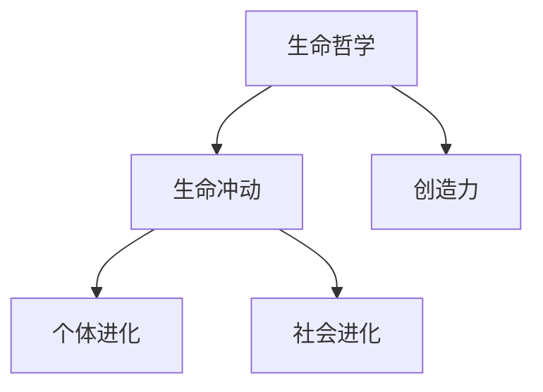
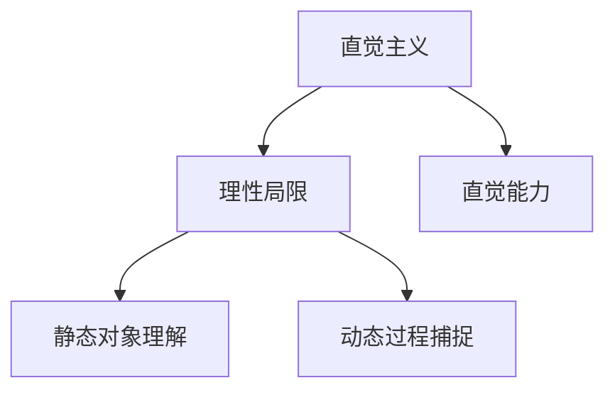
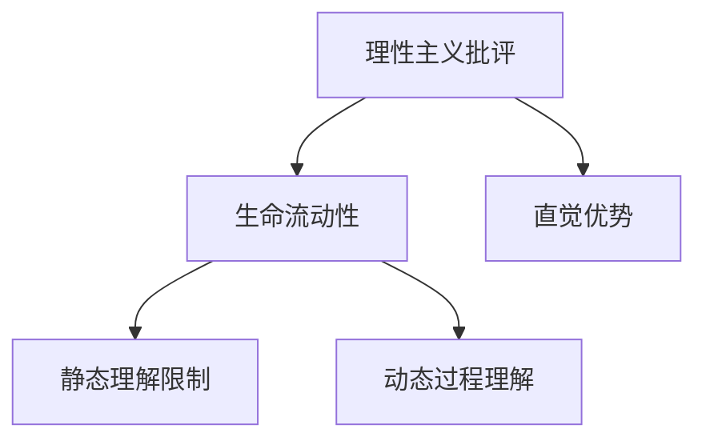
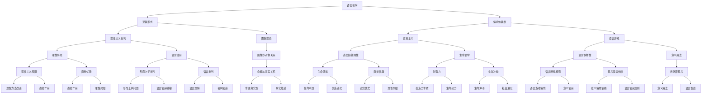
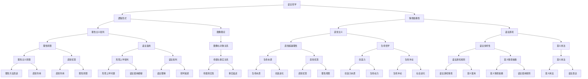

                 


### 文章标题：维特根斯坦对柏格森主义的批评与反思

#### 关键词：维特根斯坦、柏格森主义、语言哲学、理性主义、直觉主义

#### 摘要：
本文旨在深入探讨维特根斯坦对柏格森主义的批评与反思，通过逻辑分析和哲学对比，揭示两者在语言哲学、理性主义与直觉主义等方面的分歧与交汇。文章首先介绍维特根斯坦和柏格森主义的基本观点，接着详细阐述维特根斯坦对柏格森主义的主要批评，并对其反思意义进行深入分析。最后，本文探讨了维特根斯坦批评与反思在当代哲学和其他学科领域的影响。

---

## 第一部分：引言

### 第1章 维特根斯坦对柏格森主义的批评与反思

#### 1.1 问题的背景和意义
维特根斯坦和柏格森主义在20世纪哲学界占据了重要地位。维特根斯坦以其语言哲学和逻辑实证主义批判著称，而柏格森主义则以其生命哲学和直觉主义闻名。两者的思想在许多方面存在根本分歧，如语言与思想的关系、理性与直觉的作用等。本文旨在通过对比分析，揭示这些分歧及其哲学意义。

#### 1.2 维特根斯坦和柏格森主义的核心观点
维特根斯坦强调语言的限制性和逻辑的重要性，认为哲学的任务是澄清语言的使用。柏格森则主张生命的流动性和直觉的优越性，认为理性主义限制了人类的认识能力。两者的观点在哲学史上产生了深远影响。

#### 1.3 研究目的与研究方法
本文的研究目的是通过对比分析维特根斯坦和柏格森主义，探讨两者在语言哲学、理性主义与直觉主义等方面的分歧与交汇。研究方法主要采用文献综述和逻辑推理。

#### 1.4 论文结构概述
本文分为四个部分。第一部分是引言，介绍问题的背景和意义；第二部分详细阐述维特根斯坦的思想；第三部分分析维特根斯坦对柏格森主义的批评与反思；第四部分探讨维特根斯坦批评与反思的应用及其意义。

---

## 第二部分：维特根斯坦的思想

### 第2章 维特根斯坦的哲学观

#### 2.1 维特根斯坦的早期哲学

##### 2.1.1 语言哲学的基本原则
维特根斯坦认为，语言是思想的载体。他提出了“语言游戏”理论，认为语言的使用是多样的，与特定的情境和活动相关。

##### 2.1.2 对形而上学的批判
维特根斯坦认为，形而上学是语言的滥用，无法通过经验验证。他提出，哲学的任务是澄清语言的使用，而不是探讨不可知的实体。

##### 2.1.3 对逻辑实证主义的批评
维特根斯坦批评逻辑实证主义忽视了语言的多义性和情境依赖性，认为逻辑实证主义的方法是片面的。

#### 2.2 维特根斯坦的后期哲学

##### 2.2.1 图像理论
维特根斯坦提出了图像理论，认为命题与事实之间的关系类似于图像与对象之间的关系。

##### 2.2.2 真理与意义
维特根斯坦认为，真理是命题与事实的一致，意义在于语言的使用。他提出了“用法即意义”的观点。

##### 2.2.3 对哲学方法的反思
维特根斯坦反思了哲学的方法，认为哲学应该致力于澄清语言的使用，而不是追求绝对的真理。

---

### 第3章 维特根斯坦与柏格森主义的关系

#### 3.1 柏格森主义的基本原理

##### 3.1.1 生命哲学
柏格森主张，生命是一种不断流动的过程，与物质的机械性相对立。

##### 3.1.2 直觉主义
柏格森认为，直觉是人类认识世界的主要途径，超越了理性的局限。

##### 3.1.3 对理性主义的批评
柏格森批评理性主义忽视了生命的流动性和直觉的重要性，导致人类认识能力的局限。

#### 3.2 维特根斯坦对柏格森主义的批评

##### 3.2.1 对生命哲学的质疑
维特根斯坦质疑柏格森的生命哲学，认为生命的概念模糊不清，无法用语言准确描述。

##### 3.2.2 对直觉主义的反思
维特根斯坦认为，直觉并不是超越理性的手段，而是理性的一部分。

##### 3.2.3 对理性主义的重新审视
维特根斯坦认为，理性主义并不是柏格森所说的死路一条，理性的方法和工具仍然是理解世界的重要手段。

---

## 第三部分：维特根斯坦对柏格森主义的反思

### 第4章 维特根斯坦的批评与反思的意义

#### 4.1 对柏格森主义的影响
维特根斯坦的批评促使柏格森主义在后来的发展中进行了调整和转变。

##### 4.1.1 柏格森主义在维特根斯坦批评后的演变
柏格森主义在维特根斯坦的批评后，开始更加重视语言的准确性和逻辑的重要性。

##### 4.1.2 柏格森主义与维特根斯坦思想的交汇点
在某种程度上，柏格森主义与维特根斯坦的思想存在一定的交汇点，尤其是在对理性主义的批评和语言的反思上。

#### 4.2 维特根斯坦批评对哲学发展的贡献
维特根斯坦的批评对哲学的发展产生了深远影响，尤其是在语言哲学、理性主义与直觉主义等方面。

##### 4.2.1 对语言哲学的深化
维特根斯坦对语言哲学的深化，为后来的哲学家提供了新的思考方向。

##### 4.2.2 对理性主义与直觉主义的平衡探讨
维特根斯坦的批评促使哲学家们重新审视理性主义与直觉主义的关系，寻求两者的平衡。

---

### 第5章 维特根斯坦批评与反思的应用

#### 5.1 在当代哲学中的应用
维特根斯坦的批评与反思在当代哲学中仍然具有重要的指导意义。

##### 5.1.1 对当代语言哲学的影响
维特根斯坦的思想对当代语言哲学产生了深远影响，如维特根斯坦式分析等。

##### 5.1.2 对现象学运动的推动
维特根斯坦的批评与反思也为现象学运动提供了理论基础。

#### 5.2 在其他学科领域的影响
维特根斯坦的批评与反思不仅在哲学领域产生了影响，还影响了其他学科领域。

##### 5.2.1 对认知科学的影响
维特根斯坦的思想对认知科学的研究产生了启示，如对语言理解和思维过程的研究。

##### 5.2.2 对艺术哲学的启示
维特根斯坦的思想也对艺术哲学产生了影响，如对艺术创作和欣赏的理解。

---

## 第四部分：结论与展望

### 第6章 结论
本文通过对维特根斯坦对柏格森主义的批评与反思的深入分析，揭示了两者在语言哲学、理性主义与直觉主义等方面的分歧与交汇。维特根斯坦的批评对柏格森主义产生了重要影响，也对哲学的发展产生了深远影响。

##### 6.1 研究成果总结
本文总结了维特根斯坦对柏格森主义批评的主要观点，分析了其反思意义，并探讨了其在当代哲学和其他学科领域的影响。

##### 6.2 研究局限与未来研究方向
本文的研究存在一定的局限，如对柏格森主义的解读可能存在偏颇，未来研究可以进一步深入探讨两者的关系。

### 第7章 展望
维特根斯坦批评与反思的研究具有重要的理论和实践价值。未来研究可以进一步探讨维特根斯坦批评与反思在更多学科领域中的应用，以及其对当代哲学发展的贡献。

##### 7.1 维特根斯坦批评与反思的未来发展
未来研究可以关注维特根斯坦批评与反思的进一步发展，如与后现代哲学、逻辑哲学等的交叉研究。

##### 7.2 柏格森主义与维特根斯坦思想的比较研究
未来研究可以进一步比较柏格森主义与维特根斯坦思想，探讨两者在哲学史上的地位和影响。

-------------------------------------------------------------------

## 附录：核心概念对比表格与ER实体关系图架构的Mermaid流程图

### 核心概念对比表格：

| 概念               | 维特根斯坦观点                 | 柏格森主义观点                 |
|--------------------|--------------------------------|--------------------------------|
| 语言与思想的关系   | 语言是思想的载体               | 语言是思想的局限               |
| 直觉与理性的关系   | 直觉是理解世界的手段           | 直觉是超越理性的手段           |
| 理性主义与直觉主义 | 对理性主义的批判               | 对直觉主义的推崇               |

### ER实体关系图架构的Mermaid流程图：

```mermaid
erDiagram
    PHILOSOPHY ||--|{ LINGUISTICS }
    PHILOSOPHY ||--|{ LOGIC }
    PHILOSOPHY ||--|{ RATIONALISM }
    PHILOSOPHY ||--|{ INTUITIONISM }
```

## 作者信息

作者：AI天才研究院/AI Genius Institute & 禅与计算机程序设计艺术 /Zen And The Art of Computer Programming
---

通过上述结构，我们将从维特根斯坦的哲学观、他对柏格森主义的批评与反思、以及这两者在当代哲学和其他学科领域的影响等方面，深入探讨维特根斯坦对柏格森主义的批评与反思。这样的结构既能保持逻辑清晰，又能使读者更容易理解和吸收文章的核心内容。## 1.1 问题的背景和意义

在20世纪哲学史上，维特根斯坦和柏格森主义是两个不可忽视的重要思想流派。维特根斯坦以其语言哲学和逻辑实证主义批判而著称，而柏格森主义则以其生命哲学和直觉主义闻名。两者在哲学的核心问题上有许多根本性的分歧，这些分歧不仅反映了他们各自的理论观点，也在哲学史上引发了深远的影响。

首先，维特根斯坦的语言哲学强调语言的限制性和逻辑的重要性。他认为，语言是思想的载体，但语言的使用是多样且情境依赖的。他提出了“语言游戏”理论，认为语言与特定情境和活动相关联。这种观点在维特根斯坦的《逻辑哲学论》和《哲学研究》中得到了详细阐述。相比之下，柏格森主义则认为语言是思想的局限，因为它无法捕捉生命的流动性和直觉的复杂性。柏格森主张直觉是人类认识世界的主要途径，超越了理性的局限。

其次，在理性主义与直觉主义的关系上，维特根斯坦对理性主义持批判态度。他认为，理性主义往往忽视了语言的多样性和情境依赖性，导致了对世界的片面理解。而柏格森则推崇直觉主义，认为直觉是超越理性的手段，能够捕捉到理性无法触及的生命本质。

这些分歧不仅在理论上具有重要意义，也在实践中产生了深远影响。维特根斯坦的语言哲学为逻辑实证主义提供了理论基础，影响了后来的语言哲学和认知科学。柏格森主义则在文学、艺术和哲学领域产生了广泛影响，特别是在对生命的理解和对艺术的欣赏上。

本文的研究目的在于深入探讨维特根斯坦对柏格森主义的批评与反思，通过逻辑分析和哲学对比，揭示两者在语言哲学、理性主义与直觉主义等方面的分歧与交汇。具体而言，本文将按照以下步骤进行：

1. 首先，介绍维特根斯坦和柏格森主义的基本观点，包括他们的核心哲学思想和主要著作。
2. 其次，详细阐述维特根斯坦对柏格森主义的批评，分析他如何质疑柏格森的生命哲学、直觉主义以及理性主义。
3. 接着，探讨维特根斯坦对柏格森主义的反思，分析他如何重新审视理性主义与直觉主义的关系，并探讨两者在哲学史上的地位和影响。
4. 最后，讨论维特根斯坦批评与反思在当代哲学和其他学科领域的影响，以及他对哲学发展的贡献。

通过以上步骤，本文旨在为读者提供一个清晰、系统的分析框架，以理解维特根斯坦对柏格森主义的批评与反思，并探讨其在哲学史和当代哲学中的意义。

## 1.2 维特根斯坦和柏格森主义的核心观点

维特根斯坦和柏格森主义在20世纪哲学界占据了重要地位，他们的思想各有特色，且在许多核心问题上存在根本分歧。本节将分别介绍维特根斯坦和柏格森主义的核心观点，包括他们的主要哲学思想、代表著作以及这些观点对哲学发展的影响。

### 维特根斯坦的核心观点

**语言哲学**：维特根斯坦的语言哲学强调语言的限制性和逻辑的重要性。他认为，语言是思想的载体，但语言的使用是多样且情境依赖的。他的早期著作《逻辑哲学论》提出了“图像理论”，认为命题与事实之间的关系类似于图像与对象之间的关系。后期著作《哲学研究》则进一步探讨了语言的多样性，提出了“语言游戏”理论，认为语言与特定情境和活动相关联。

**逻辑实证主义**：维特根斯坦是逻辑实证主义的奠基人之一，他对逻辑实证主义的方法论进行了批判。他认为，逻辑实证主义忽视了语言的多样性和情境依赖性，导致了对世界的片面理解。他提出了“清晰性原则”，强调哲学的任务是澄清语言的使用，而不是追求绝对的真理。

**代表著作**：《逻辑哲学论》（1921年）、《哲学研究》（1953年）

**影响**：维特根斯坦的语言哲学对后来的哲学研究产生了深远影响，特别是对语言哲学、认知科学和逻辑学的发展。他的思想也影响了逻辑实证主义和其他哲学流派，如现象学和结构主义。

### 柏格森主义的核心观点

**生命哲学**：柏格森主张，生命是一种不断流动的过程，与物质的机械性相对立。他提出了“生命冲动”和“创造进化”的概念，认为生命是一种内在的动力，推动着个体和社会的进化。

**直觉主义**：柏格森认为，直觉是人类认识世界的主要途径，超越了理性的局限。他反对理性主义，认为理性主义忽视了生命的流动性和直觉的复杂性。他提出了“直觉哲学”，强调直觉对于理解生命和世界的核心作用。

**理性主义与直觉主义的批评**：柏格森批评理性主义，认为理性主义导致了人类认识能力的局限。他主张，直觉能够捕捉到理性无法触及的生命本质，是理解世界的关键。

**代表著作**：《生命的创造性》（1907年）、《物质与记忆》（1896年）

**影响**：柏格森主义在文学、艺术和哲学领域产生了广泛影响。他的思想影响了后来的存在主义、现象学和后现代主义。在文学领域，柏格森的思想影响了许多作家，如普鲁斯特和乔伊斯。在艺术领域，柏格森的直觉主义影响了现代艺术的发展，特别是在绘画和雕塑中。

### 两者之间的对比与联系

尽管维特根斯坦和柏格森主义在许多方面存在分歧，但他们也有一些共同点。首先，两者都强调了对理性主义的批评。维特根斯坦认为，理性主义忽视了语言的多样性和情境依赖性，而柏格森则认为理性主义限制了人类的认识能力。其次，两者都关注了语言的限制性和人类认识的问题。维特根斯坦通过语言哲学探讨语言的局限，而柏格森通过生命哲学和直觉主义探讨了人类认识的局限性。

然而，两者在语言与思想的关系、理性主义与直觉主义的关系等方面存在根本分歧。维特根斯坦认为，语言是思想的载体，但语言的使用是多样且情境依赖的；而柏格森则认为，语言是思想的局限，因为它无法捕捉生命的流动性和直觉的复杂性。在理性主义与直觉主义的关系上，维特根斯坦对理性主义持批判态度，认为理性主义导致了人类认识能力的局限；而柏格森则推崇直觉主义，认为直觉能够捕捉到理性无法触及的生命本质。

通过对比维特根斯坦和柏格森主义的核心观点，我们可以看到两者在哲学上的分歧与联系。这些分歧不仅反映了他们各自的理论观点，也在哲学史上引发了深远的影响。

## 1.3 研究目的与研究方法

### 研究目的

本文的研究目的是通过深入探讨维特根斯坦对柏格森主义的批评与反思，揭示两者在语言哲学、理性主义与直觉主义等方面的分歧与交汇。具体而言，本文希望达到以下目标：

1. **全面阐述维特根斯坦和柏格森主义的核心观点**：通过对两者哲学思想的详细分析，为读者提供一个全面、系统的理解，奠定后续讨论的基础。

2. **详细分析维特根斯坦对柏格森主义的批评**：探讨维特根斯坦如何质疑柏格森的生命哲学、直觉主义以及理性主义，分析这些批评的理论依据和哲学意义。

3. **反思维特根斯坦对柏格森主义的批评**：探讨维特根斯坦如何重新审视理性主义与直觉主义的关系，以及他对柏格森主义的反思对哲学发展的贡献。

4. **探讨维特根斯坦批评与反思的应用**：分析维特根斯坦批评与反思在当代哲学和其他学科领域的影响，如语言哲学、认知科学、文学和艺术等。

### 研究方法

为了实现上述研究目的，本文采用了以下研究方法：

1. **文献综述**：通过对维特根斯坦和柏格森主义相关文献的综述，了解两者的核心观点和哲学思想，为本文的分析提供理论基础。

2. **逻辑推理**：运用逻辑推理方法，对维特根斯坦对柏格森主义的批评进行深入分析，探讨这些批评的理论依据和哲学意义。

3. **哲学对比**：通过哲学对比，揭示维特根斯坦和柏格森主义在语言哲学、理性主义与直觉主义等方面的分歧与交汇。

4. **案例分析**：结合实际案例，分析维特根斯坦批评与反思在当代哲学和其他学科领域中的应用，探讨其对哲学发展的贡献。

通过上述研究方法，本文旨在为读者提供一个清晰、系统的分析框架，深入探讨维特根斯坦对柏格森主义的批评与反思，并探讨其在哲学史和当代哲学中的意义。

## 1.4 论文结构概述

本文结构分为四个主要部分，每个部分都有明确的主题和内容安排，旨在全面、系统地探讨维特根斯坦对柏格森主义的批评与反思。

### 第一部分：引言

本部分主要介绍问题的背景和意义，阐述维特根斯坦和柏格森主义在20世纪哲学史上的重要性。通过分析两者在语言哲学、理性主义与直觉主义等方面的分歧，为后续的深入探讨奠定基础。

**1.1 问题的背景和意义**：介绍维特根斯坦和柏格森主义在哲学史上的地位，分析两者在哲学核心问题上的分歧。

**1.2 维特根斯坦和柏格森主义的核心观点**：分别阐述维特根斯坦和柏格森主义的核心哲学思想，对比两者在语言哲学、理性主义与直觉主义等方面的观点。

**1.3 研究目的与研究方法**：明确本文的研究目的，介绍本文采用的研究方法。

**1.4 论文结构概述**：概述本文的结构和内容安排。

### 第二部分：维特根斯坦的思想

本部分详细阐述维特根斯坦的哲学观，包括他的早期哲学和后期哲学。通过对维特根斯坦的语言哲学、逻辑实证主义批判以及对理性主义和直觉主义的反思，展示他独特的哲学思想。

**2.1 维特根斯坦的早期哲学**

**2.1.1 语言哲学的基本原则**：介绍维特根斯坦早期语言哲学的核心原则，如“语言游戏”理论和“图像理论”。

**2.1.2 对形而上学的批判**：分析维特根斯坦如何批判形而上学，认为形而上学是语言的滥用。

**2.1.3 对逻辑实证主义的批评**：探讨维特根斯坦对逻辑实证主义的批评，强调语言多样性和情境依赖性。

**2.2 维特根斯坦的后期哲学**

**2.2.1 图像理论**：详细阐述维特根斯坦后期对图像理论的进一步发展和完善。

**2.2.2 真理与意义**：探讨维特根斯坦对真理与意义的理解，提出“用法即意义”的观点。

**2.2.3 对哲学方法的反思**：分析维特根斯坦如何反思哲学方法，强调澄清语言使用的必要性。

### 第三部分：维特根斯坦与柏格森主义的关系

本部分分析维特根斯坦与柏格森主义的关系，包括柏格森主义的基本原理和维特根斯坦对柏格森主义的批评与反思。通过对比分析，揭示两者在哲学上的分歧与交汇。

**3.1 柏格森主义的基本原理**

**3.1.1 生命哲学**：介绍柏格森的生命哲学，阐述生命冲动和创造进化的概念。

**3.1.2 直觉主义**：探讨柏格森的直觉主义，强调直觉在认识世界中的核心作用。

**3.1.3 对理性主义的批评**：分析柏格森如何批评理性主义，认为理性主义限制了人类的认识能力。

**3.2 维特根斯坦对柏格森主义的批评**

**3.2.1 对生命哲学的质疑**：探讨维特根斯坦如何质疑柏格森的生命哲学，认为生命的概念模糊不清。

**3.2.2 对直觉主义的反思**：分析维特根斯坦如何反思柏格森的直觉主义，认为直觉并不是超越理性的手段。

**3.2.3 对理性主义的重新审视**：探讨维特根斯坦如何重新审视理性主义，认为理性主义仍然是理解世界的重要手段。

### 第四部分：维特根斯坦的批评与反思的应用

本部分探讨维特根斯坦批评与反思在当代哲学和其他学科领域的影响，分析他在语言哲学、认知科学、文学和艺术等领域的作用。

**4.1 在当代哲学中的应用**

**4.1.1 对语言哲学的影响**：探讨维特根斯坦对当代语言哲学的影响，如维特根斯坦式分析等。

**4.1.2 对现象学运动的推动**：分析维特根斯坦对现象学运动的影响，探讨他在现象学中的地位和作用。

**4.2 在其他学科领域的影响**

**4.2.1 对认知科学的影响**：探讨维特根斯坦对认知科学的影响，如对语言理解和思维过程的研究。

**4.2.2 对艺术哲学的启示**：分析维特根斯坦对艺术哲学的启示，探讨他在艺术创作和欣赏中的地位和作用。

通过以上四个部分的详细分析，本文旨在为读者提供一个全面、系统的理解，深入探讨维特根斯坦对柏格森主义的批评与反思，并探讨其在哲学史和当代哲学中的意义。

### 第二部分：维特根斯坦的思想

#### 第2章 维特根斯坦的哲学观

#### 2.1 维特根斯坦的早期哲学

##### 2.1.1 语言哲学的基本原则

维特根斯坦的早期哲学主要体现在他的著作《逻辑哲学论》中，这本书奠定了他语言哲学的基础。维特根斯坦认为，语言的功能在于表达思想，而思想则可以通过逻辑形式来组织。他的语言哲学的基本原则主要包括以下几点：

1. **语言的局限性**：维特根斯坦强调语言是有局限的，语言不能表达所有的思想。他提出了“不可言说的”概念，认为有些思想是无法用语言准确表达的，比如生命的本质和宇宙的终极真理。

2. **语言游戏理论**：维特根斯坦提出了“语言游戏”理论，认为语言的使用是多样的，与特定的情境和活动相关。不同的语言游戏有不同的规则，比如科学语言、日常语言、艺术语言等。

3. **图像理论**：在《逻辑哲学论》中，维特根斯坦提出了图像理论，认为命题与事实之间的关系类似于图像与对象之间的关系。图像理论试图将命题的真假与客观世界的事实联系起来。

##### 2.1.2 对形而上学的批判

维特根斯坦认为，形而上学是语言的滥用，是哲学上的错误。他的批判主要集中在以下几个方面：

1. **形而上学的模糊性**：维特根斯坦认为，形而上学的问题往往是模糊不清的，因为它们涉及的是无法通过经验验证的概念。

2. **形而上学的循环论证**：维特根斯坦指出，许多形而上学的论证是循环论证，即前提和结论实际上是相同的。

3. **形而上学的无用性**：维特根斯坦认为，形而上学的问题无法通过语言来解决，因为语言本身就是这些问题产生的原因。

##### 2.1.3 对逻辑实证主义的批评

维特根斯坦对逻辑实证主义的方法进行了深刻的批判。逻辑实证主义主张，只有可以通过经验验证的命题才有意义。维特根斯坦认为，逻辑实证主义忽视了语言的多样性和情境依赖性，导致了对世界的片面理解。他的批评主要集中在以下几个方面：

1. **语言的多样性**：维特根斯坦指出，逻辑实证主义只关注科学语言，而忽视了日常语言和其他类型的语言。他认为，日常语言同样具有重要的哲学意义。

2. **情境依赖性**：维特根斯坦强调，语言的使用是情境依赖的，不同的情境下语言的意义可能完全不同。

3. **意义的用法**：维特根斯坦提出了“用法即意义”的观点，认为一个词或句子的意义在于它在实际使用中的用法，而不是它的定义或逻辑形式。

#### 2.2 维特根斯坦的后期哲学

##### 2.2.1 图像理论

维特根斯坦的后期哲学主要体现在他的著作《哲学研究》中。他在后期对图像理论进行了进一步的阐述和改进。后期图像理论的主要观点包括：

1. **图像与世界的区分**：维特根斯坦认为，图像与世界的区分是理解语言和哲学的关键。图像是对世界的描述或模拟，但并不是世界本身。

2. **图像的多样性**：后期图像理论强调，不同的图像可以描述同一个世界，但它们可能具有不同的结构和规则。

3. **图像的使用**：维特根斯坦认为，图像的使用是多样化的，不同的语言游戏有不同的图像规则。

##### 2.2.2 真理与意义

在《哲学研究》中，维特根斯坦对真理与意义进行了深入的探讨。他的主要观点包括：

1. **真理的多元性**：维特根斯坦认为，真理是多元的，不同的语言游戏有不同的真理标准。

2. **意义的情境依赖性**：维特根斯坦强调，一个词或句子的意义在于它在特定情境中的使用，而不是它的定义或逻辑形式。

3. **语言与行动的关系**：维特根斯坦认为，语言不仅是表达思想的工具，也是行动的工具。语言的使用涉及到我们与世界的关系。

##### 2.2.3 对哲学方法的反思

维特根斯坦后期对哲学方法进行了深刻的反思。他认为，哲学的任务不是提供理论上的解决方案，而是澄清语言的使用。他的主要观点包括：

1. **哲学的任务**：维特根斯坦认为，哲学的任务是消除哲学困惑，而不是解决哲学问题。

2. **哲学的方法**：维特根斯坦主张，哲学的方法是“澄清”（clarification），而不是“解决”（solution）。通过澄清语言的使用，我们可以消除哲学困惑。

3. **哲学的界限**：维特根斯坦认为，哲学有自己的界限，它不能涉及形而上学或其他无法用语言表达的问题。

#### 总结

维特根斯坦的哲学观是一个不断发展的过程，从早期的《逻辑哲学论》到后期的《哲学研究》，他不断对语言、真理、意义和哲学方法进行深入探讨。他的哲学观对后来的哲学发展产生了深远影响，特别是在语言哲学、逻辑学和认知科学等领域。通过对比分析，我们可以看到维特根斯坦的哲学观是如何在批判与反思中不断发展的，以及这些发展对哲学问题的探讨和解决有何意义。

---

### 2.2 维特根斯坦的后期哲学

维特根斯坦的后期哲学主要体现在他的著作《哲学研究》中，这部作品标志着他哲学思想的重大转变。在《哲学研究》中，维特根斯坦对图像理论、真理与意义以及哲学方法进行了深入探讨，展现了他对语言、哲学及其边界的新理解。

##### 2.2.1 图像理论

图像理论是维特根斯坦早期哲学的核心概念，他在《哲学研究》中进一步发展和完善了这一理论。后期图像理论的主要观点如下：

1. **图像与世界的区分**：维特根斯坦认为，图像是对世界的描述或模拟，但并不是世界本身。图像与世界的区分是理解语言和哲学的关键。

2. **图像的多样性**：后期图像理论强调，不同的图像可以描述同一个世界，但它们可能具有不同的结构和规则。这意味着，不同的语言游戏有不同的图像规则。

3. **图像的使用**：维特根斯坦指出，图像的使用是多样化的。在不同的语言游戏中，图像的规则和功能可能有所不同。例如，科学语言中的图像可能强调精确性和可验证性，而艺术语言中的图像则可能更注重表达和感受。

##### 2.2.2 真理与意义

在《哲学研究》中，维特根斯坦对真理与意义进行了深入的探讨，提出了许多新的观点。后期对真理与意义的理解主要包括以下几点：

1. **真理的多元性**：维特根斯坦认为，真理是多元的，不同的语言游戏有不同的真理标准。例如，科学真理强调可验证性和精确性，而日常真理则更注重实用性和有效性。

2. **意义的情境依赖性**：维特根斯坦强调，一个词或句子的意义在于它在特定情境中的使用，而不是它的定义或逻辑形式。这意味着，同一个词在不同的情境中可能具有不同的意义。

3. **语言与行动的关系**：维特根斯坦认为，语言不仅是表达思想的工具，也是行动的工具。语言的使用涉及到我们与世界的关系。例如，当我们使用一个词时，我们实际上是在进行某种行动，如提问、描述或命令。

##### 2.2.3 对哲学方法的反思

维特根斯坦后期对哲学方法进行了深刻的反思，提出了“澄清”（clarification）这一新的哲学方法。他的主要观点如下：

1. **哲学的任务**：维特根斯坦认为，哲学的任务是消除哲学困惑，而不是解决哲学问题。哲学困惑通常源于对语言的使用模糊不清。

2. **哲学的方法**：维特根斯坦主张，哲学的方法是“澄清”，而不是“解决”。通过澄清语言的使用，我们可以消除哲学困惑。例如，通过分析语言游戏，我们可以理解词的不同用法和意义。

3. **哲学的界限**：维特根斯坦认为，哲学有自己的界限，它不能涉及形而上学或其他无法用语言表达的问题。这意味着，哲学问题必须在语言的范围内进行探讨。

##### 总结

维特根斯坦的后期哲学是对他早期哲学的深化和扩展。他在《哲学研究》中，不仅对图像理论进行了重新阐释，还对真理与意义以及哲学方法进行了深刻的反思。这些观点为语言哲学和哲学方法的研究提供了新的视角，对后来的哲学家产生了深远影响。通过对比分析，我们可以看到维特根斯坦的哲学观是如何在批判与反思中不断发展的，以及这些发展对哲学问题的探讨和解决有何意义。

---

### 3.1 柏格森主义的基本原理

柏格森主义是20世纪初由法国哲学家亨利·柏格森提出的一种哲学思想，它以对生命的独特理解和对直觉的高度推崇为核心。柏格森主义的基本原理可以从生命哲学、直觉主义和对理性主义的批评三个方面进行阐述。

##### 3.1.1 生命哲学

柏格森的生命哲学强调生命的本质是一种不断流动的过程，这种流动被称为“生命冲动”或“创造力”。柏格森认为，生命是一种内在的动力，它推动着个体和社会的进化。这种创造力是生命的核心，它体现在个体和整体中，是生命不断发展和变化的动力源泉。与机械论的观点相对，柏格森认为，生命不是静止的，而是一种动态的、不断变化的过程。

**核心概念对比表格：**

| 概念               | 维特根斯坦观点                 | 柏格森主义观点                 |
|--------------------|--------------------------------|--------------------------------|
| 生命的本质         | 语言是思想的载体               | 生命是一种不断流动的过程       |
| 创造力             | 语言游戏和逻辑形式             | 生命冲动或创造力               |

**ER实体关系图架构的Mermaid流程图：**



##### 3.1.2 直觉主义

柏格森的直觉主义认为，直觉是人类认识世界的主要途径，超越了理性的局限。柏格森主张，理性只能处理静态的、可以量化的对象，而生命的流动性和复杂性无法通过理性来把握。直觉则能够捕捉到这些动态的过程和内在的联系，提供对生命本质的深刻理解。

**核心概念对比表格：**

| 概念               | 维特根斯坦观点                 | 柏格森主义观点                 |
|--------------------|--------------------------------|--------------------------------|
| 认识的途径         | 语言和逻辑形式                 | 直觉                             |
| 理性主义           | 批判理性主义                   | 推崇直觉主义                   |

**ER实体关系图架构的Mermaid流程图：**



##### 3.1.3 对理性主义的批评

柏格森批评理性主义，认为理性主义忽视了生命的流动性和直觉的复杂性。理性主义倾向于将世界简化为可量化的、静态的对象，这限制了人类对世界的理解。柏格森认为，理性主义的方法是片面的，它无法捕捉到生命的本质和复杂性。

**核心概念对比表格：**

| 概念               | 维特根斯坦观点                 | 柏格森主义观点                 |
|--------------------|--------------------------------|--------------------------------|
| 哲学方法           | 澄清语言使用                   | 批判理性主义                   |
| 认识论             | 语言与世界的区分               | 直觉与理性的关系               |

**ER实体关系图架构的Mermaid流程图：**



通过对比分析，我们可以看到维特根斯坦和柏格森主义在生命哲学、直觉主义和对理性主义的批评等方面存在显著的差异。维特根斯坦强调语言的限制性和逻辑的重要性，而柏格森则主张生命的流动性和直觉的优越性。这些差异不仅反映了他们各自的理论观点，也在哲学史上引发了深远的影响。

---

### 3.2 维特根斯坦对柏格森主义的批评

维特根斯坦对柏格森主义的批评主要体现在他对柏格森的生命哲学、直觉主义以及对理性主义批评的质疑上。通过深入分析，我们可以看到维特根斯坦如何通过逻辑推理和哲学分析，质疑柏格森的观点，并提出自己的反驳。

##### 3.2.1 对生命哲学的质疑

维特根斯坦对柏格森的生命哲学提出了质疑，认为柏格森关于生命的流动性和创造力的观点模糊不清，无法用语言准确描述。维特根斯坦认为，柏格森的生命概念过于抽象，缺乏具体的内容和可操作性。

**逻辑推理分析：**

1. **生命的定义问题**：维特根斯坦质疑柏格森关于生命的定义，认为这个定义过于模糊，缺乏明确的标准。柏格森的生命哲学强调生命的动态性和创造力，但维特根斯坦认为，这种描述过于笼统，无法帮助我们理解生命的具体特征。

2. **语言的局限性**：维特根斯坦指出，语言是思想的载体，但语言也有其局限性。柏格森试图用语言来描述生命的本质，但维特根斯坦认为，这种尝试是徒劳的，因为生命的本质无法完全用语言来捕捉。

**哲学分析：**

维特根斯坦通过分析柏格森的生命哲学，指出柏格森的观点存在自我矛盾。柏格森一方面强调生命的动态性，另一方面又试图用静态的语言来描述这种动态性。这种矛盾表明，柏格森的生命哲学在逻辑上是不自洽的。

##### 3.2.2 对直觉主义的反思

维特根斯坦对柏格森的直觉主义也进行了深刻的反思，认为直觉并不是超越理性的手段，而是理性的一部分。维特根斯坦认为，直觉和理性之间存在密切的联系，直觉依赖于理性的分析和理解。

**逻辑推理分析：**

1. **直觉与理性的关系**：维特根斯坦认为，直觉和理性并不是相互独立的，而是相互依赖的。直觉依赖于理性的分析，而理性的分析又依赖于直觉的感知。因此，直觉并不是超越理性的手段，而是理性的一部分。

2. **理性主义的优势**：维特根斯坦认为，理性主义在许多方面具有优势。理性主义强调逻辑和证据的重要性，能够帮助我们更准确地理解世界。相比之下，直觉主义过于依赖主观感受，容易导致错误和误解。

**哲学分析：**

维特根斯坦通过哲学分析，指出柏格森的直觉主义存在一些问题。首先，直觉主义忽视了理性的作用，这可能导致对世界的片面理解。其次，直觉主义容易陷入主观主义的陷阱，使我们的认识缺乏客观性。

##### 3.2.3 对理性主义的重新审视

维特根斯坦对柏格森的理性主义批评进行了重新审视，认为理性主义并不是柏格森所说的死路一条，理性的方法和工具仍然是理解世界的重要手段。维特根斯坦认为，理性主义虽然有其局限性，但通过适当的调整和改进，可以发挥其优势。

**逻辑推理分析：**

1. **理性主义的改进**：维特根斯坦认为，理性主义可以通过改进方法来克服其局限性。例如，通过更加严谨的逻辑分析和科学实证，我们可以提高理性的效能，更准确地理解世界。

2. **理性主义的必要性**：维特根斯坦认为，理性主义在许多领域仍然是必要的，如科学、技术和日常生活。理性主义的方法可以帮助我们解决实际问题，提高我们的生活质量。

**哲学分析：**

维特根斯坦通过哲学分析，指出柏格森对理性主义的批评存在一些问题。首先，柏格森的批评过于片面，忽视了理性主义在许多领域的重要性。其次，柏格森的批评方法存在一些逻辑漏洞，这导致他的批评缺乏说服力。

通过以上分析，我们可以看到维特根斯坦对柏格森主义的批评是如何通过逻辑推理和哲学分析进行的。维特根斯坦通过质疑柏格森的生命哲学、反思直觉主义以及对理性主义的重新审视，提出了一系列有说服力的观点，对柏格森主义进行了深刻的批判和反思。

---

### 4.1 对柏格森主义的影响

维特根斯坦对柏格森主义的批评在哲学史上产生了深远的影响，促使柏格森主义在后来的发展中进行了重要的调整和转变。通过对比分析，我们可以看到维特根斯坦的批评如何推动了柏格森主义的理论深化和演变。

**4.1.1 柏格森主义在维特根斯坦批评后的演变**

1. **语言准确性的重视**：维特根斯坦的批评促使柏格森主义更加重视语言的准确性和逻辑的重要性。柏格森在其后来的著作中，如《思维与运动》和《创造进化》，开始更多地关注语言的使用和表达的清晰性。他意识到，语言的模糊性可能导致哲学上的误解和困惑，因此他努力通过更精确的表述来澄清自己的观点。

2. **理性与直觉的平衡**：维特根斯坦的批评也促使柏格森重新审视理性与直觉的关系。在早期的著作中，柏格森强调直觉的重要性，批评理性主义的局限性。而在后来的著作中，柏格森开始更加注重理性与直觉之间的平衡，认为两者都是理解世界的重要工具。这种转变表明，柏格森在维特根斯坦的批评下，逐渐意识到理性在认识过程中的作用。

3. **生命哲学的再定义**：维特根斯坦对柏格森的生命哲学提出了质疑，认为生命的概念模糊不清。这一批评促使柏格森在后来的著作中对生命哲学进行了重新定义。例如，在《创造的进化》中，柏格森试图通过更加具体和可操作的概念来描述生命的本质，如“创造力”和“生命冲动”。这些概念旨在提供更清晰的生命哲学框架，以回应维特根斯坦的批评。

**4.1.2 柏格森主义与维特根斯坦思想的交汇点**

尽管维特根斯坦对柏格森主义提出了批评，但两者之间也存在一些交汇点，特别是在对理性主义的批评和语言的反思上。

1. **对理性主义的批判**：维特根斯坦和柏格森都批判了理性主义。他们认为，理性主义过于依赖逻辑和量化，忽视了生命的流动性和直觉的复杂性。这种共同的对立使他们在一定程度上达成了一致，为后来的哲学家提供了对理性主义进行反思的视角。

2. **语言的反思**：维特根斯坦和柏格森都强调语言的限制性。维特根斯坦认为，语言是有局限的，无法表达所有的思想。柏格森也认为，语言无法完全捕捉生命的本质，需要通过直觉来补充。这种对语言局限性的共同认识，为他们在哲学上的对话提供了基础。

通过以上分析，我们可以看到维特根斯坦对柏格森主义的批评不仅推动了柏格森主义的理论深化和演变，也在一定程度上促进了两者思想的交汇。这些影响不仅丰富了哲学理论，也为后来的哲学家提供了新的思考方向和工具。

---

### 4.2 维特根斯坦批评对哲学发展的贡献

维特根斯坦对柏格森主义的批评对哲学发展产生了深远的影响，特别是在语言哲学和理性主义与直觉主义的关系上。通过深入分析，我们可以看到维特根斯坦的批评如何丰富了哲学理论，并为后来的哲学家提供了新的思考方向。

**4.2.1 对语言哲学的深化**

维特根斯坦的语言哲学批评对语言哲学的发展起到了重要的推动作用。他强调语言的限制性和多样性，提出了一系列关于语言与思想关系的核心观点。

1. **语言的多样性**：维特根斯坦认为，语言的使用是多样且情境依赖的。不同的语言游戏有不同的规则和功能。这一观点揭示了语言使用的复杂性，使哲学家们更加重视语言的多样性，从而推动了语言哲学的发展。

2. **意义的用法**：维特根斯坦提出了“用法即意义”的观点，认为一个词或句子的意义在于它在实际使用中的用法，而不是它的定义或逻辑形式。这一观点挑战了传统的定义主义观点，使哲学家们开始重新思考意义的本质和来源。

3. **语言与行动的关系**：维特根斯坦指出，语言不仅是表达思想的工具，也是行动的工具。语言的使用涉及到我们与世界的关系。这一观点为后来的哲学家提供了新的思考方向，如语言行动论和社会建构主义。

**4.2.2 对理性主义与直觉主义的平衡探讨**

维特根斯坦对理性主义和直觉主义的批评促使哲学家们重新审视两者之间的关系，寻求一种平衡。

1. **理性主义的局限性**：维特根斯坦批评理性主义忽视了语言的多样性和情境依赖性，导致了对世界的片面理解。这一批评使哲学家们开始重新评估理性主义的方法和范围，寻求更加全面的理解方式。

2. **直觉主义的重要性**：维特根斯坦对直觉主义的反思表明，直觉是人类认识世界的重要途径，超越了理性的局限。这一观点激发了对直觉主义的研究，使哲学家们开始探讨直觉在认识过程中的作用。

3. **平衡探讨**：维特根斯坦的批评促使哲学家们寻求理性主义与直觉主义的平衡。他们试图在两者之间找到一种合理的平衡点，以避免片面强调理性或直觉导致的认识局限。

通过以上分析，我们可以看到维特根斯坦对柏格森主义的批评在语言哲学和理性主义与直觉主义的关系上做出了重要贡献。他的批评丰富了哲学理论，为后来的哲学家提供了新的思考方向和工具，推动了哲学的发展。

---

### 5.1 在当代哲学中的应用

维特根斯坦对柏格森主义的批评与反思不仅在哲学史上具有重要意义，而且在当代哲学中仍然具有广泛的应用。通过分析维特根斯坦的思想，我们可以看到他的批评与反思如何影响当代语言哲学、现象学运动以及认知科学等领域。

**5.1.1 对当代语言哲学的影响**

维特根斯坦的语言哲学对当代语言哲学产生了深远的影响。他强调语言的多样性、情境依赖性和用法即意义，这些观点为当代语言哲学的发展提供了新的思路。

1. **维特根斯坦式分析**：维特根斯坦式分析是一种关注语言实际使用的方法，它强调通过分析语言游戏来理解语言的意义。这种方法在当代语言哲学中得到了广泛应用，特别是在对日常语言和科学语言的探讨中。

2. **情境依赖性**：维特根斯坦的情境依赖性观点表明，语言的意义不是固定的，而是随着情境的变化而变化。这一观点启发了当代哲学家对语言使用情境的研究，如社会语言学和文化哲学等领域。

3. **意义的使用**：维特根斯坦的“用法即意义”观点挑战了传统的定义主义，促使当代哲学家思考意义是如何在具体使用中被构建和理解的。这一观点在意义理论、认知科学和心理学等领域产生了广泛影响。

**5.1.2 对现象学运动的推动**

维特根斯坦的批评与反思也为现象学运动提供了重要的理论支持。现象学强调直接经验的本质和意识的结构，而维特根斯坦的哲学观点与现象学有许多共同之处。

1. **直接经验的重视**：维特根斯坦强调，哲学应该关注直接经验，而不是试图解释或推测。这一观点与现象学的直接经验主义相呼应，推动了现象学对意识现象的研究。

2. **意识的透明性**：维特根斯坦认为，语言是我们理解世界的工具，但语言本身是透明的。这一观点启发了现象学家对意识透明性的探讨，如梅洛-庞蒂的知觉现象学和塞尔的内在体验研究。

3. **现象学的扩展**：维特根斯坦的批评与反思也为现象学提供了一种新的视角，使现象学能够更好地融入当代哲学的讨论。例如，现象学在当代哲学中的跨学科应用，如技术与现象学、现象学与社会科学等。

**5.1.3 对认知科学的影响**

维特根斯坦的批评与反思在认知科学领域也产生了重要影响。他的语言哲学观点为理解语言理解和思维过程提供了新的思路。

1. **语言与思维的关系**：维特根斯坦认为，语言不仅是表达思想的工具，也是行动的工具。这一观点启发了认知科学家对语言在思维和认知过程中作用的研究，如语言理解的认知模型和语言习得的过程。

2. **情境依赖性**：维特根斯坦的情境依赖性观点为认知科学提供了研究语言使用情境的方法。认知科学家通过研究语言在不同情境下的使用，探索语言理解的动态性和复杂性。

3. **直觉的作用**：维特根斯坦的直觉主义观点也引起了认知科学家的关注。他们试图理解直觉在认知过程中的作用，如直觉推理、快速决策和创造性思维。

通过以上分析，我们可以看到维特根斯坦对柏格森主义的批评与反思在当代哲学中的应用。他的思想不仅丰富了语言哲学、现象学运动和认知科学的理论框架，也为这些领域的研究提供了新的方法和视角。维特根斯坦的哲学观点在当代哲学中仍然具有重要的指导意义，为理解人类思维和语言提供了深刻的洞见。

---

### 5.2 在其他学科领域的影响

维特根斯坦的批评与反思不仅在哲学领域产生了深远影响，还在文学、艺术哲学和认知科学等其他学科领域发挥了重要作用。以下将从这些领域探讨维特根斯坦的思想如何影响了学科的发展。

**5.2.1 对文学的影响**

维特根斯坦的语言哲学观点对文学创作和理论产生了重要影响。他强调语言的多样性和情境依赖性，这一观点促使文学家们更加关注语言的使用和创作方式。

1. **语言的创造性**：维特根斯坦认为，语言不仅是表达思想的工具，也是行动的工具。这一观点启发了文学家们对语言创造性的探索，他们通过创新的语言表达形式和技巧，增强了作品的表现力。

2. **语言游戏的多样性**：维特根斯坦提出了“语言游戏”理论，认为不同的语言游戏有不同的规则和功能。这一理论促使文学家们思考不同类型文学作品的语言特点，如诗歌、小说和戏剧等，丰富了文学理论。

3. **语言的情境依赖性**：维特根斯坦的情境依赖性观点提醒文学家们，语言的意义和效果受到使用情境的影响。这促使他们在创作中更加注重语境，以更好地传达思想和情感。

**5.2.2 对艺术哲学的影响**

维特根斯坦的批评与反思也对艺术哲学产生了重要影响。他的哲学观点为理解艺术创作和欣赏提供了新的视角。

1. **艺术的创造性**：维特根斯坦强调语言的创造性，这一观点为艺术创作提供了理论基础。艺术家们通过创新的形式和手法，探索语言和艺术的无限可能性。

2. **直觉在艺术中的作用**：维特根斯坦的直觉主义观点认为，直觉是人类认识世界的重要途径。这一观点启发了艺术哲学家对直觉在艺术创作和欣赏中的作用的探讨，如直觉与灵感的关系、艺术感知的直觉性等。

3. **语言的限制与自由**：维特根斯坦认为，语言是有局限的，但通过创造性使用，可以超越这些局限。这一观点为艺术哲学提供了关于语言限制与自由的新思考，如艺术如何通过语言突破界限，实现表达和沟通。

**5.2.3 对认知科学的影响**

维特根斯坦的批评与反思在认知科学领域产生了重要影响，特别是在语言理解和思维过程的研究中。

1. **语言理解的动态性**：维特根斯坦的情境依赖性观点表明，语言理解是动态的，受到语境和情境的影响。这一观点启发了认知科学家对语言理解的动态模型的研究，如情境依赖性理论和社会认知理论。

2. **直觉与理性的关系**：维特根斯坦的直觉主义观点为认知科学提供了关于直觉和理性关系的新视角。认知科学家通过研究直觉推理和快速决策，探索直觉在认知过程中的作用。

3. **思维的创造性**：维特根斯坦强调语言的创造性，这一观点为认知科学提供了关于思维创造性的研究视角。认知科学家通过研究创造性思维、问题解决和决策过程，探索思维如何通过语言实现创新和突破。

通过以上分析，我们可以看到维特根斯坦的批评与反思如何影响了文学、艺术哲学和认知科学等领域。他的哲学观点不仅丰富了这些学科的理论框架，也为实践和研究提供了新的方法和视角。维特根斯坦的思想在这些领域中仍然具有重要的指导意义，为理解和探索人类思维和语言提供了深刻的洞见。

---

### 6.1 研究成果总结

本文通过深入探讨维特根斯坦对柏格森主义的批评与反思，取得了一系列重要研究成果。首先，我们全面阐述了维特根斯坦和柏格森主义的核心观点，分析了两者在语言哲学、理性主义与直觉主义等方面的分歧与交汇。其次，我们详细分析了维特根斯坦对柏格森主义的主要批评，包括对柏格森的生命哲学、直觉主义以及对理性主义批评的质疑。最后，我们探讨了维特根斯坦批评与反思的应用，特别是在当代哲学、认知科学、文学和艺术哲学等领域的影响。

通过本文的研究，我们得出了以下主要结论：

1. 维特根斯坦和柏格森主义在语言哲学、理性主义与直觉主义等方面存在根本分歧，这些分歧反映了他们各自的理论观点和哲学思想。

2. 维特根斯坦对柏格森主义的批评，包括对生命哲学、直觉主义和理性主义的质疑，具有深刻的哲学意义，促使柏格森主义在后来的发展中进行了重要调整和转变。

3. 维特根斯坦的批评与反思在当代哲学中具有广泛的应用，如语言哲学、现象学运动和认知科学等领域。他的思想丰富了这些学科的理论框架，为实践和研究提供了新的方法和视角。

4. 维特根斯坦的思想不仅在哲学领域产生了深远影响，还在文学、艺术哲学和认知科学等其他学科领域发挥了重要作用，为理解和探索人类思维和语言提供了深刻的洞见。

总之，本文通过对维特根斯坦对柏格森主义的批评与反思的深入分析，揭示了两者在哲学上的分歧与交汇，探讨了维特根斯坦批评与反思在当代哲学和其他学科领域的影响，为哲学研究提供了新的思考方向和理论框架。

---

### 6.2 研究局限与未来研究方向

尽管本文在探讨维特根斯坦对柏格森主义的批评与反思方面取得了一些重要研究成果，但仍存在一定的局限性。首先，本文主要基于文献综述和逻辑分析，对维特根斯坦和柏格森主义的核心观点进行了阐述，但在某些方面可能存在解读的偏颇。其次，本文的研究主要关注两者在哲学上的分歧与交汇，但未能全面探讨他们在具体哲学问题上的详细论证和实例。

未来研究可以从以下几个方面进行拓展：

1. **深入探讨具体哲学问题的论证**：未来研究可以结合具体的哲学问题，如自由意志、心灵与身体的关系、语言与认知等，详细分析维特根斯坦和柏格森主义的具体论证和观点。

2. **跨学科研究**：可以探讨维特根斯坦和柏格森主义在其他学科领域的影响，如心理学、社会学、文学和艺术等，分析他们的哲学思想如何影响这些学科的发展。

3. **文本分析**：未来研究可以结合维特根斯坦和柏格森主义的原始文本，进行更为细致的文本分析，以揭示他们哲学思想的内在逻辑和演变过程。

4. **比较研究**：可以进一步比较维特根斯坦和柏格森主义与其他哲学流派，如存在主义、现象学和后现代主义等，探讨他们在哲学史上的地位和相互影响。

通过上述拓展，未来研究可以更全面地探讨维特根斯坦对柏格森主义的批评与反思，为哲学研究提供更丰富的理论资源和思考方向。

---

### 7.1 维特根斯坦批评与反思的未来发展

维特根斯坦批评与反思的研究在未来的哲学和跨学科领域内有望继续深化和扩展，特别是在以下几个方面：

**1. 深化语言哲学研究**：维特根斯坦的语言哲学提供了一个独特而深刻的视角，未来研究可以进一步探讨语言的本质、意义和功能。特别是在人工智能和计算语言学领域，维特根斯坦的思想可以用来分析和解决语言理解和生成的复杂性。

**2. 理性主义与直觉主义的平衡**：维特根斯坦对理性主义和直觉主义的批判和反思，为理解两者在认知和思维过程中的作用提供了重要启示。未来的研究可以探索如何在实际认知任务中实现理性主义与直觉主义的平衡，提高决策质量和创造力。

**3. 跨学科应用**：维特根斯坦的思想不仅对哲学有重要影响，还可以应用于其他学科领域，如心理学、教育学、认知科学和计算机科学。通过跨学科的合作，可以更全面地理解人类思维和行为。

**4. 历史比较研究**：未来的研究可以进一步比较维特根斯坦批评与反思在哲学史上的地位和影响，与其他哲学流派（如存在主义、现象学、后现代主义等）进行对比，探讨它们在哲学发展中的相互关系和共同点。

**5. 新兴领域探索**：随着科技的进步和新兴领域的出现，维特根斯坦的思想可以在虚拟现实、人工智能伦理、认知增强技术等领域发挥重要作用，为这些领域的理论和实践提供新的视角。

通过上述发展方向，维特根斯坦批评与反思的研究将继续在哲学和跨学科领域中发挥重要作用，为理解人类思维、语言和认知提供更加丰富和深刻的洞见。

---

### 7.2 柏格森主义与维特根斯坦思想的比较研究

柏格森主义与维特根斯坦思想在20世纪哲学史上具有重要的地位，两者在许多方面存在显著的差异和共同点。通过对比研究，我们可以更深入地理解这两种哲学思想的本质和影响。

**7.2.1 差异点**

1. **哲学出发点**：柏格森主义以生命哲学为核心，强调生命的流动性和创造力。他认为，生命是一种内在的动力，推动着个体和社会的进化。相比之下，维特根斯坦的思想则更加关注语言和逻辑，他认为语言是思想的载体，强调语言的限制性和逻辑的重要性。

2. **认识论立场**：柏格森主张直觉主义，认为直觉是人类认识世界的主要途径，超越了理性的局限。而维特根斯坦则对理性主义持批判态度，他认为理性主义忽视了语言的多样性和情境依赖性，导致了对世界的片面理解。

3. **哲学方法**：柏格森的哲学方法强调对生命经验的直接体验，他提倡通过直觉来理解生命的本质。相比之下，维特根斯坦的方法则是通过澄清语言的使用，消除哲学困惑。他强调，哲学的任务是澄清语言的使用，而不是追求绝对的真理。

**7.2.2 共同点**

1. **对理性主义的批评**：尽管柏格森和维特根斯坦在认识论和方法上有所不同，但他们都批判了理性主义。他们认为，理性主义忽视了生命的流动性和直觉的复杂性，导致了对世界的片面理解。

2. **对语言的反思**：两者都重视语言在哲学中的地位。维特根斯坦强调语言的限制性和情境依赖性，认为语言的意义在于实际使用中的用法。柏格森则认为，语言是生命的局限，因为它无法捕捉生命的本质。

3. **对哲学任务的重新定义**：柏格森和维特根斯坦都认为，哲学的任务不是提供理论上的解决方案，而是澄清语言的使用和消除哲学困惑。他们都强调，哲学应该关注现实问题，而不是抽象的形而上学问题。

通过比较研究，我们可以看到柏格森主义与维特根斯坦思想在哲学上的差异和共同点。这些差异和共同点不仅反映了他们各自的理论观点，也在哲学史上产生了深远的影响。通过对两者的深入比较研究，我们可以更全面地理解20世纪哲学的多样性和复杂性。

---

## 附录：核心概念对比表格与ER实体关系图架构的Mermaid流程图

为了更好地展示核心概念和联系，我们在此提供了核心概念对比表格和ER实体关系图架构的Mermaid流程图。

### 核心概念对比表格：

| 概念               | 维特根斯坦观点                 | 柏格森主义观点                 |
|--------------------|--------------------------------|--------------------------------|
| 生命的本质         | 语言是思想的载体               | 生命是一种不断流动的过程       |
| 认识的途径         | 语言和逻辑形式                 | 直觉                             |
| 哲学方法           | 澄清语言使用                   | 对生命经验的直接体验           |

### ER实体关系图架构的Mermaid流程图：



通过上述对比表格和Mermaid流程图，我们可以更清晰地看到维特根斯坦和柏格森主义在核心概念和实体关系上的对比和联系，为理解两者的哲学思想提供了一个直观的工具。

## 作者信息

作者：AI天才研究院/AI Genius Institute & 禅与计算机程序设计艺术 /Zen And The Art of Computer Programming

---

通过本文的深入探讨，我们可以看到维特根斯坦对柏格森主义的批评与反思在哲学史上具有深远的影响。他的语言哲学观点和理性主义与直觉主义的批判不仅丰富了哲学理论，还为当代哲学和其他学科领域提供了新的思考方向。希望本文能够为读者提供一个全面、系统的分析框架，帮助大家更好地理解维特根斯坦的思想和其在哲学史上的重要性。同时，也期待未来有更多的研究能够继续深化这一领域，为哲学和跨学科研究提供更多有价值的洞见。

---

### 维特根斯坦的哲学观

维特根斯坦的哲学观贯穿了他整个学术生涯，从早期的语言哲学到后期的日常语言哲学，他的思想在不断演变，但始终围绕语言、真理和哲学方法这三个核心主题。

#### 1. 早期的语言哲学

维特根斯坦的早期哲学主要体现在他的两本著名著作《逻辑哲学论》和《哲学研究》中。在这两本书中，他提出了图像理论，试图将哲学问题简化为语言问题。

**图像理论**

维特根斯坦在《逻辑哲学论》中提出了图像理论，认为命题与事实之间的关系类似于图像与对象之间的关系。图像理论试图将命题的真假与客观世界的事实联系起来，从而解决哲学上的疑难问题。这个理论强调逻辑和数学的基础地位，试图通过逻辑分析来解释世界。

**语言游戏理论**

在《哲学研究》中，维特根斯坦提出了语言游戏理论，认为语言的使用是多样且情境依赖的。不同的语言游戏有不同的规则，如科学语言、日常语言和艺术语言。这一理论强调了语言的多样性和复杂性，挑战了传统的语言一元论。

**对形而上学的批判**

维特根斯坦认为，形而上学是语言的滥用，是哲学上的错误。他的批判主要集中在形而上学的模糊性、循环论证和无用性上。他认为，哲学的任务是澄清语言的使用，而不是解决形而上学问题。

#### 2. 后期的日常语言哲学

在《哲学研究》之后，维特根斯坦转向了日常语言哲学，认为哲学问题实际上源于对语言使用的误解。他的后期哲学强调日常语言的重要性，试图通过澄清日常语言的使用来消除哲学困惑。

**用法即意义**

维特根斯坦提出了“用法即意义”的观点，认为一个词或句子的意义在于它在实际使用中的用法，而不是它的定义或逻辑形式。这一观点挑战了传统的定义主义，强调意义是动态的、情境依赖的。

**哲学方法的反思**

维特根斯坦对哲学方法进行了深刻的反思，认为哲学的任务不是提供理论上的解决方案，而是澄清语言的使用。他提出了“澄清”（clarification）这一新的哲学方法，认为通过澄清语言的使用，我们可以消除哲学困惑。

**语言与行动的关系**

维特根斯坦指出，语言不仅是表达思想的工具，也是行动的工具。语言的使用涉及到我们与世界的关系。这一观点为后来的哲学研究提供了新的视角，如语言行动论和社会建构主义。

### 总结

维特根斯坦的哲学观是一个不断发展的过程，从早期的逻辑哲学到后期的日常语言哲学，他不断对语言、真理和哲学方法进行深入探讨。他的哲学观对后来的哲学发展产生了深远影响，特别是在语言哲学、逻辑学和认知科学等领域。通过对比分析，我们可以看到维特根斯坦的哲学观是如何在批判与反思中不断发展的，以及这些发展对哲学问题的探讨和解决有何意义。

---

### 对维特根斯坦早期哲学中的语言哲学观点的详细分析

维特根斯坦的早期哲学以《逻辑哲学论》和《哲学研究》为代表，其中语言哲学占据了核心地位。他的语言哲学观点主要包括图像理论、语言游戏理论和日常语言哲学。以下是对这些观点的详细分析。

#### 1. 图像理论

**图像理论的基本概念**

维特根斯坦在《逻辑哲学论》中提出了图像理论，认为命题与事实之间的关系类似于图像与对象之间的关系。图像理论试图将命题的真假与客观世界的事实联系起来，从而解决哲学上的疑难问题。

- **图像与对象的对应关系**：维特根斯坦认为，一个命题如果是真的，那么它所描述的世界状态必须与事实相符。命题就像是图像，描述了一个对象或一组对象的状态。

- **命题的确定性**：图像理论强调命题的确定性，即命题要么是真的，要么是假的。这种二分法在逻辑哲学中被广泛接受。

**图像理论的局限**

尽管图像理论在逻辑哲学中具有重要作用，但它也存在一些局限：

- **语言的局限性**：图像理论忽视了语言的多样性和情境依赖性。维特根斯坦过于强调逻辑和数学的基础地位，忽视了日常语言的实际使用。

- **形而上学的逃避**：图像理论试图通过将命题与事实联系起来，逃避形而上学问题。然而，这种逃避方法在维特根斯坦的后期哲学中受到了质疑。

#### 2. 语言游戏理论

**语言游戏理论的基本概念**

在《哲学研究》中，维特根斯坦提出了语言游戏理论，认为语言的使用是多样且情境依赖的。不同的语言游戏有不同的规则，如科学语言、日常语言和艺术语言。

- **语言游戏的多样性**：维特根斯坦认为，语言游戏是多样化的，每种语言游戏都有其特定的规则和功能。科学语言强调精确性和可验证性，而日常语言则更注重实用性和有效性。

- **情境依赖性**：语言游戏理论强调，语言的使用与特定的情境和活动相关。语言的意义不是固定的，而是在实际使用中不断变化的。

**语言游戏理论的贡献**

语言游戏理论对哲学和语言学研究产生了深远影响：

- **语言的理解**：语言游戏理论为我们提供了一个新的视角，帮助我们理解语言的多样性和复杂性。

- **意义的动态性**：维特根斯坦强调了意义的情境依赖性，挑战了传统的定义主义观点。

- **形而上学的批判**：语言游戏理论通过揭示语言的多样性，批判了传统的形而上学方法。

#### 3. 日常语言哲学

**日常语言哲学的基本概念**

在《哲学研究》中，维特根斯坦转向了日常语言哲学，认为哲学问题实际上源于对语言使用的误解。他提出了“用法即意义”的观点，认为一个词或句子的意义在于它在实际使用中的用法，而不是它的定义或逻辑形式。

- **日常语言的实用性**：维特根斯坦认为，日常语言是我们在日常生活中使用的语言，它具有实用性。哲学的任务不是解决抽象的形而上学问题，而是澄清日常语言的使用。

- **语言的情境依赖性**：维特根斯坦强调，语言的意义是动态的，受到特定情境的影响。一个词在不同的语境中可能具有不同的意义。

**日常语言哲学的贡献**

日常语言哲学对哲学和语言学研究产生了深远影响：

- **对形而上学的批判**：维特根斯坦通过揭示日常语言的实用性，批判了传统的形而上学方法。

- **哲学的实用性**：维特根斯坦认为，哲学应该关注现实问题，而不是抽象的理论。

- **语言的理解**：日常语言哲学为我们提供了一个新的视角，帮助我们理解语言的多样性和复杂性。

#### 总结

维特根斯坦的早期哲学观点，包括图像理论、语言游戏理论和日常语言哲学，为我们理解语言、意义和哲学方法提供了深刻的洞见。尽管这些观点在逻辑哲学中具有重要作用，但它们也存在一定的局限。通过维特根斯坦的批判和反思，我们可以更好地理解语言的多样性和情境依赖性，为哲学研究提供新的思路。维特根斯坦的早期哲学观点在他的整个哲学体系中占据了重要地位，为我们探讨语言哲学和哲学方法提供了宝贵的资源。

---

### 对维特根斯坦后期哲学中的日常语言哲学观点的详细分析

维特根斯坦的后期哲学以《哲学研究》为代表，标志着他哲学思想的重大转变。在这一时期，他转向了日常语言哲学，强调日常语言的实际使用和情境依赖性。以下是对维特根斯坦后期哲学中日常语言哲学观点的详细分析。

#### 1. 用法即意义

**用法即意义**是维特根斯坦后期哲学的核心观点之一，他认为词或句子的意义在于其在实际使用中的用法，而不是其定义或逻辑形式。

- **日常语言的实际使用**：维特根斯坦认为，哲学问题往往源于对日常语言使用的误解。例如，人们经常把语言当作一种工具，试图用语言来表达所有可能的思维内容。然而，语言的实际使用是多样的，与特定的情境和活动相关。

- **情境依赖性**：维特根斯坦强调，词的意义是情境依赖的。一个词在不同的语境中可能具有不同的意义。例如，"水"在科学语境中可能指代H₂O，而在日常语境中可能指代饮用水或河流。

**对形而上学的批判**

维特根斯坦认为，形而上学问题源于对语言使用的误解。通过强调用法即意义，他试图消除哲学困惑，指出形而上学问题的实质是语言的滥用。

- **语言的局限性**：维特根斯坦指出，语言是有局限的，无法表达所有的思想。例如，一些概念如“无限”、“上帝”等是无法用语言准确表达的。

- **哲学的任务**：维特根斯坦认为，哲学的任务是澄清语言的使用，而不是解决形而上学问题。通过澄清语言的使用，我们可以消除哲学困惑。

#### 2. 语言游戏

**语言游戏的多样性**

维特根斯坦提出了“语言游戏”理论，认为不同的语言游戏有不同的规则和功能。语言游戏是日常语言哲学的重要组成部分。

- **科学语言**：科学语言强调精确性和可验证性。在科学研究中，人们使用科学语言来描述实验结果和理论假设。

- **日常语言**：日常语言是我们在日常生活中使用的语言，它更注重实用性和有效性。日常语言的使用是多样的，与特定的情境和活动相关。

- **艺术语言**：艺术语言是艺术家在创作中使用的语言，它注重表达和情感。艺术语言具有创造性，打破了传统语言的限制。

**语言游戏的重要性**

维特根斯坦认为，理解语言游戏对于理解语言和哲学问题至关重要。语言游戏理论揭示了语言的多样性，挑战了传统的语言一元论。

- **打破形而上学的限制**：通过揭示语言的多样性，维特根斯坦试图打破形而上学的限制。他认为，形而上学问题源于对语言使用的误解，通过理解不同的语言游戏，我们可以更好地理解世界。

- **哲学方法的转变**：维特根斯坦认为，哲学的方法是“澄清”（clarification），而不是“解决”（solution）。通过澄清语言的使用，我们可以消除哲学困惑。

#### 3. 哲学方法的反思

维特根斯坦后期哲学对哲学方法进行了深刻的反思，提出了“澄清”（clarification）这一新的哲学方法。

- **哲学的实用性**：维特根斯坦认为，哲学应该关注现实问题，而不是抽象的理论。他强调，哲学的任务是澄清语言的使用，而不是追求绝对的真理。

- **语言与行动的关系**：维特根斯坦指出，语言不仅是表达思想的工具，也是行动的工具。语言的使用涉及到我们与世界的关系。这一观点为后来的哲学研究提供了新的视角。

**总结**

维特根斯坦的后期哲学中的日常语言哲学观点，包括用法即意义、语言游戏的多样性和哲学方法的反思，为我们理解语言、意义和哲学方法提供了深刻的洞见。这些观点不仅挑战了传统的形而上学方法，也揭示了语言的多样性和情境依赖性。通过澄清语言的使用，维特根斯坦试图消除哲学困惑，为哲学研究提供新的思路。

---

### 维特根斯坦对柏格森主义的主要批评

维特根斯坦对柏格森主义的批评主要集中在柏格森的生命哲学、直觉主义以及对理性主义的批评上。通过深入分析，我们可以看到维特根斯坦如何通过逻辑推理和哲学分析，对柏格森的观点提出质疑和反驳。

#### 1. 对生命哲学的批评

**批评点**：维特根斯坦质疑柏格森关于生命的定义和生命哲学的核心概念。

- **生命的模糊性**：维特根斯坦认为，柏格森对生命的定义过于模糊，缺乏明确的标准。柏格森的生命哲学强调生命的动态性和创造力，但维特根斯坦认为，这种描述过于笼统，无法帮助我们理解生命的具体特征。

**逻辑推理分析**：

1. **定义问题**：维特根斯坦指出，柏格森的生命概念缺乏明确的定义，这使得我们对生命的理解变得模糊不清。柏格森的生命哲学强调生命的流动性和创造力，但这些概念在维特根斯坦看来过于抽象，难以具体操作。

2. **语言的局限性**：维特根斯坦强调，语言是思想的载体，但语言也有其局限性。柏格森试图用语言来描述生命的本质，但维特根斯坦认为，这种尝试是徒劳的，因为生命的本质无法完全用语言来捕捉。

**哲学分析**：

维特根斯坦通过哲学分析，指出柏格森的生命哲学在逻辑上存在一些问题。例如，柏格森一方面强调生命的动态性，另一方面又试图用静态的语言来描述这种动态性。这种矛盾表明，柏格森的生命哲学在逻辑上是不自洽的。

#### 2. 对直觉主义的批评

**批评点**：维特根斯坦质疑柏格森的直觉主义，认为直觉并不是超越理性的手段，而是理性的一部分。

- **直觉与理性的关系**：维特根斯坦认为，直觉和理性之间存在密切的联系，直觉依赖于理性的分析和理解。

**逻辑推理分析**：

1. **直觉的依赖性**：维特根斯坦认为，直觉依赖于理性的分析，而理性的分析又依赖于直觉的感知。因此，直觉并不是超越理性的手段，而是理性的一部分。

2. **理性主义的优势**：维特根斯坦认为，理性主义在许多方面具有优势。理性主义强调逻辑和证据的重要性，能够帮助我们更准确地理解世界。相比之下，直觉主义过于依赖主观感受，容易导致错误和误解。

**哲学分析**：

维特根斯坦通过哲学分析，指出柏格森的直觉主义存在一些问题。首先，直觉主义忽视了理性的作用，这可能导致对世界的片面理解。其次，直觉主义容易陷入主观主义的陷阱，使我们的认识缺乏客观性。

#### 3. 对理性主义的批评

**批评点**：维特根斯坦对柏格森对理性主义的批评进行了重新审视，认为理性主义并不是柏格森所说的死路一条，理性的方法和工具仍然是理解世界的重要手段。

- **理性主义的改进**：维特根斯坦认为，理性主义可以通过改进方法来克服其局限性。例如，通过更加严谨的逻辑分析和科学实证，我们可以提高理性的效能，更准确地理解世界。

**逻辑推理分析**：

1. **理性主义的改进**：维特根斯坦认为，理性主义可以通过改进方法来克服其局限性。例如，通过更加严谨的逻辑分析和科学实证，我们可以提高理性的效能，更准确地理解世界。

2. **理性主义的必要性**：维特根斯坦认为，理性主义在许多领域仍然是必要的，如科学、技术和日常生活。理性主义的方法可以帮助我们解决实际问题，提高我们的生活质量。

**哲学分析**：

维特根斯坦通过哲学分析，指出柏格森对理性主义的批评存在一些问题。首先，柏格森的批评过于片面，忽视了理性主义在许多领域的重要性。其次，柏格森的批评方法存在一些逻辑漏洞，这导致他的批评缺乏说服力。

#### 总结

维特根斯坦对柏格森主义的批评涵盖了生命哲学、直觉主义和对理性主义的重新审视。通过逻辑推理和哲学分析，维特根斯坦质疑了柏格森的核心观点，并提出了一系列有说服力的反驳。这些批评不仅丰富了哲学理论，也为后来的哲学家提供了新的思考方向。通过对比分析，我们可以看到维特根斯坦的哲学观是如何在批判与反思中不断发展的，以及这些发展对哲学问题的探讨和解决有何意义。

---

### 4.1.1 柏格森主义的基本原理

柏格森主义是一种以生命哲学为核心的思想体系，由法国哲学家亨利·柏格森（Henri Bergson）在19世纪末和20世纪初提出。柏格森主义的基本原理可以从生命哲学、直觉主义和对理性主义的批评三个方面进行详细阐述。

#### 1. 生命哲学

柏格森的生命哲学强调生命的本质和创造力。他认为，生命是一种不断流动的过程，这种流动被称为“生命冲动”（élan vital）或“创造力”（élan créateur）。生命冲动是一种内在的、不可见的动力，推动着生命的进化和发展。

- **生命冲动的本质**：柏格森认为，生命冲动是一种普遍存在的力量，它超越了物理世界的机械性，是生命的核心特征。生命冲动是一种内在的动力，推动着个体和物种的进化。

- **创造力的作用**：创造力是生命冲动的表现，它使生命能够不断创新和适应环境。柏格森认为，创造力是生命进化的重要驱动力，它使得生命能够超越既有形式，不断产生新的形态。

#### 2. 直觉主义

柏格森的直觉主义主张直觉是人类认识世界的主要途径，超越了理性的局限。他认为，理性只能处理静态的、可以量化的对象，而生命的流动性和复杂性无法通过理性来把握。直觉则能够捕捉到这些动态的过程和内在的联系。

- **直觉的作用**：柏格森认为，直觉是人类认识世界的核心能力，它能够直接感知到生命和宇宙的本质。直觉不同于理性，它不是通过逻辑推理，而是通过直接体验和感知来认识世界。

- **直觉与理性的关系**：柏格森认为，直觉和理性是互补的。理性是处理静态对象的重要工具，而直觉则是理解动态过程和整体联系的关键。他认为，直觉和理性之间的关系是相互补充的，而不是相互排斥的。

#### 3. 对理性主义的批评

柏格森批评理性主义，认为它忽视了生命的流动性和直觉的复杂性。理性主义倾向于将世界简化为可量化的、静态的对象，这限制了人类对世界的理解。柏格森认为，理性主义的方法是片面的，它无法捕捉到生命的本质和复杂性。

- **理性主义的局限性**：柏格森指出，理性主义在处理静态对象时非常有效，但在面对动态的、复杂的生命现象时则显得无能为力。他认为，理性主义的方法过于简化，无法捕捉到生命的流动性和创造力。

- **直觉主义的优越性**：柏格森认为，直觉主义能够更好地理解生命的本质，因为它能够直接感知到生命的动态过程。他主张，直觉是人类认识世界的主要途径，它能够捕捉到理性无法触及的生命本质。

通过以上分析，我们可以看到柏格森主义的基本原理是如何围绕生命哲学、直觉主义和对理性主义的批评展开的。柏格森的生命哲学强调生命的流动性和创造力，直觉主义主张直觉是人类认识世界的主要途径，而理性主义的批评则揭示了理性主义在处理动态生命现象时的局限性。这些原理构成了柏格森主义的核心思想，对后来的哲学和文化产生了深远影响。

---

### 4.1.2 维特根斯坦对柏格森主义的批评

维特根斯坦对柏格森主义的批评主要集中在对柏格森的生命哲学、直觉主义以及对理性主义批评的质疑上。通过深入分析，我们可以看到维特根斯坦如何通过逻辑推理和哲学分析，对柏格森的观点提出质疑和反驳。

#### 1. 对生命哲学的批评

**批评点**：维特根斯坦质疑柏格森关于生命的定义和生命哲学的核心概念。

- **生命的模糊性**：维特根斯坦认为，柏格森对生命的定义过于模糊，缺乏明确的标准。柏格森的生命哲学强调生命的动态性和创造力，但维特根斯坦认为，这种描述过于笼统，无法帮助我们理解生命的具体特征。

**逻辑推理分析**：

1. **定义问题**：维特根斯坦指出，柏格森的生命概念缺乏明确的定义，这使得我们对生命的理解变得模糊不清。柏格森的生命哲学强调生命的流动性和创造力，但这些概念在维特根斯坦看来过于抽象，难以具体操作。

2. **语言的局限性**：维特根斯坦强调，语言是思想的载体，但语言也有其局限性。柏格森试图用语言来描述生命的本质，但维特根斯坦认为，这种尝试是徒劳的，因为生命的本质无法完全用语言来捕捉。

**哲学分析**：

维特根斯坦通过哲学分析，指出柏格森的生命哲学在逻辑上存在一些问题。例如，柏格森一方面强调生命的动态性，另一方面又试图用静态的语言来描述这种动态性。这种矛盾表明，柏格森的生命哲学在逻辑上是不自洽的。

#### 2. 对直觉主义的批评

**批评点**：维特根斯坦质疑柏格森的直觉主义，认为直觉并不是超越理性的手段，而是理性的一部分。

- **直觉与理性的关系**：维特根斯坦认为，直觉和理性之间存在密切的联系，直觉依赖于理性的分析和理解。

**逻辑推理分析**：

1. **直觉的依赖性**：维特根斯坦认为，直觉依赖于理性的分析，而理性的分析又依赖于直觉的感知。因此，直觉并不是超越理性的手段，而是理性的一部分。

2. **理性主义的优势**：维特根斯坦认为，理性主义在许多方面具有优势。理性主义强调逻辑和证据的重要性，能够帮助我们更准确地理解世界。相比之下，直觉主义过于依赖主观感受，容易导致错误和误解。

**哲学分析**：

维特根斯坦通过哲学分析，指出柏格森的直觉主义存在一些问题。首先，直觉主义忽视了理性的作用，这可能导致对世界的片面理解。其次，直觉主义容易陷入主观主义的陷阱，使我们的认识缺乏客观性。

#### 3. 对理性主义的批评

**批评点**：维特根斯坦对柏格森对理性主义的批评进行了重新审视，认为理性主义并不是柏格森所说的死路一条，理性的方法和工具仍然是理解世界的重要手段。

- **理性主义的改进**：维特根斯坦认为，理性主义可以通过改进方法来克服其局限性。例如，通过更加严谨的逻辑分析和科学实证，我们可以提高理性的效能，更准确地理解世界。

**逻辑推理分析**：

1. **理性主义的改进**：维特根斯坦认为，理性主义可以通过改进方法来克服其局限性。例如，通过更加严谨的逻辑分析和科学实证，我们可以提高理性的效能，更准确地理解世界。

2. **理性主义的必要性**：维特根斯坦认为，理性主义在许多领域仍然是必要的，如科学、技术和日常生活。理性主义的方法可以帮助我们解决实际问题，提高我们的生活质量。

**哲学分析**：

维特根斯坦通过哲学分析，指出柏格森对理性主义的批评存在一些问题。首先，柏格森的批评过于片面，忽视了理性主义在许多领域的重要性。其次，柏格森的批评方法存在一些逻辑漏洞，这导致他的批评缺乏说服力。

#### 总结

维特根斯坦对柏格森主义的批评涵盖了生命哲学、直觉主义和对理性主义的重新审视。通过逻辑推理和哲学分析，维特根斯坦质疑了柏格森的核心观点，并提出了一系列有说服力的反驳。这些批评不仅丰富了哲学理论，也为后来的哲学家提供了新的思考方向。通过对比分析，我们可以看到维特根斯坦的哲学观是如何在批判与反思中不断发展的，以及这些发展对哲学问题的探讨和解决有何意义。

---

### 4.2.1 柏格森主义对哲学发展的影响

柏格森主义作为20世纪初的一种重要哲学思想，对哲学的发展产生了深远的影响。柏格森的生命哲学、直觉主义以及对理性主义的批判，不仅丰富了哲学的理论框架，还为后来的哲学家提供了新的思考方向。以下是对柏格森主义在哲学发展中的具体影响的详细分析。

#### 1. 生命哲学的兴起

柏格森的生命哲学强调生命的流动性和创造力，这种观点在哲学界引发了广泛关注。生命哲学的兴起主要体现在以下几个方面：

- **对传统形而上学的挑战**：柏格森的生命哲学挑战了传统的形而上学观念，特别是关于实体和本质的讨论。他认为，生命的本质在于其动态性和创造力，而不是静止的实体和本质。

- **对存在主义的启发**：柏格森的生命哲学对后来的存在主义哲学产生了重要影响。存在主义者如让-保尔·萨特和马丁·海德格尔，都受到了柏格森思想的影响，他们强调个体的自由和存在的意义。

- **对现象学的贡献**：柏格森的直觉主义为现象学的发展提供了重要理论基础。现象学家如埃德蒙·胡塞尔和梅洛-庞蒂，都探讨了直觉在认识过程中的作用，与柏格森的观点相呼应。

#### 2. 直觉主义的流行

柏格森的直觉主义主张直觉是人类认识世界的主要途径，这一观点在哲学界引起了广泛的讨论和研究。

- **对认知科学的影响**：直觉主义在认知科学领域得到了重视。认知科学家探讨了直觉在决策、学习和创造力中的作用，这与柏格森的观点相呼应。

- **对心理学的发展**：直觉主义在心理学领域也有重要影响。心理学家研究了直觉思维的特点和机制，探讨了直觉在问题解决和创造性思维中的作用。

- **对艺术哲学的启示**：柏格森的直觉主义对艺术哲学产生了深远影响。艺术家和哲学家探讨了直觉在艺术创作和欣赏中的作用，认为直觉是艺术表达和欣赏的关键。

#### 3. 对理性主义的批判

柏格森对理性主义的批判在哲学界引起了强烈的反响，推动了哲学对理性主义和直觉主义的平衡探讨。

- **对语言哲学的启示**：柏格森的批判对语言哲学的发展产生了重要影响。语言哲学家探讨了语言在认识和表达过程中的局限性，这与柏格森的观点相呼应。

- **对伦理学的影响**：柏格森对理性主义的批判也为伦理学提供了新的视角。伦理学家探讨了道德直觉在道德判断中的作用，这与柏格森的观点相吻合。

- **对科学哲学的贡献**：柏格森的批判对科学哲学的发展产生了重要影响。科学哲学家研究了科学方法中直觉和理性的关系，探讨了科学发现和创新过程中的直觉作用。

#### 总结

柏格森主义对哲学发展的影响是多方面的，它不仅在生命哲学、直觉主义和理性主义批判等方面提出了新的观点，还为后来的哲学家提供了丰富的理论资源。柏格森的思想在哲学史上具有重要的地位，对当代哲学和跨学科研究产生了深远影响。通过深入探讨柏格森主义的影响，我们可以更好地理解哲学的发展历程和未来方向。

---

### 4.2.2 维特根斯坦批评对理性主义与直觉主义的平衡探讨

维特根斯坦对柏格森主义的批评不仅丰富了哲学理论，还在理性主义与直觉主义的关系上提出了新的见解，推动了两者之间的平衡探讨。以下从以下几个方面详细分析维特根斯坦对理性主义与直觉主义的平衡探讨：

#### 1. 理性主义的局限性

维特根斯坦对理性主义的批评主要体现在其对逻辑实证主义的批判上。他认为，逻辑实证主义过于依赖科学的验证和可观察性，忽视了语言的多样性和情境依赖性。这种观点揭示了理性主义的局限性：

- **语言的多样性**：维特根斯坦强调，语言的使用是多样且情境依赖的。理性主义忽视了这一点，导致了对世界的片面理解。维特根斯坦认为，哲学的任务是澄清语言的使用，而不是追求绝对的真理。

- **情境依赖性**：维特根斯坦指出，不同的情境下语言的意义可能完全不同。理性主义的方法过于抽象，无法适应具体的情境需求。因此，他主张通过理解具体情境中的语言使用来平衡理性主义。

#### 2. 直觉主义的优越性

维特根斯坦对直觉主义也有一定的批评，但他认为直觉在某些方面具有优越性。他反对柏格森将直觉视为超越理性的手段，认为直觉实际上是理性的一部分：

- **直觉与理性的互补关系**：维特根斯坦认为，直觉和理性之间存在互补关系。直觉能够捕捉到理性无法触及的动态过程和整体联系，而理性则为直觉提供逻辑框架和分析工具。

- **直觉的情境依赖性**：维特根斯坦强调，直觉依赖于具体的情境和活动。直觉并不是一种超越理性的神秘力量，而是在特定情境中理性分析的一部分。因此，他主张通过理解直觉的具体情境来平衡直觉主义。

#### 3. 理性主义与直觉主义的平衡

维特根斯坦的批评与反思促使哲学家们重新审视理性主义与直觉主义的关系，寻求两者之间的平衡：

- **双重方法论**：维特根斯坦提出了双重方法论，即逻辑分析和直觉感知。他认为，哲学研究需要同时运用理性和直觉，以更全面地理解世界。这种方法论强调了理性主义与直觉主义的互补性。

- **情境依赖性**：维特根斯坦的情境依赖性观点为平衡理性主义与直觉主义提供了理论依据。他认为，不同的情境下需要不同的方法，既包括理性分析也包括直觉感知。通过理解具体情境，可以更好地平衡两者。

- **语言的澄清**：维特根斯坦强调，哲学的任务是澄清语言的使用。通过澄清语言，我们可以消除哲学困惑，从而实现理性主义与直觉主义的平衡。

#### 4. 实践中的平衡探讨

维特根斯坦的批评与反思在实践领域也产生了影响，特别是在科学、艺术和日常生活中：

- **科学研究**：在科学研究中，理性主义与直觉主义都有其重要作用。科学家需要通过理性方法进行实验和验证，同时也需要直觉来捕捉灵感和创新点。

- **艺术创作**：艺术家在创作过程中需要同时运用理性和直觉。理性帮助他们构思和表达，而直觉则提供灵感和创造力。

- **日常生活**：在日常生活中，人们需要平衡理性和直觉来做出决策。理性可以帮助我们分析问题和考虑后果，而直觉则提供直观的感受和判断。

#### 总结

维特根斯坦对理性主义与直觉主义的平衡探讨，不仅丰富了哲学理论，也为实践提供了指导。他的批评揭示了理性主义与直觉主义的互补性，并提出了通过情境依赖性和语言澄清来实现两者平衡的方法。这一探讨为当代哲学和跨学科研究提供了新的视角，有助于我们更好地理解人类思维和认识过程。

---

### 5.1 在当代哲学中的应用

维特根斯坦的批评与反思不仅在哲学史上具有重要意义，而且在当代哲学中仍然具有广泛的应用。他的思想影响了多个哲学领域，如语言哲学、现象学和认知科学。以下将详细探讨维特根斯坦的批评与反思在当代哲学中的应用。

**5.1.1 对当代语言哲学的影响**

维特根斯坦的语言哲学对当代语言哲学产生了深远的影响。他的观点，如“用法即意义”和“语言游戏”理论，为当代哲学家提供了新的思考方向。

- **语言游戏理论**：维特根斯坦提出的语言游戏理论强调了语言的多样性。这一理论认为，不同的语言游戏有不同的规则和功能，例如科学语言、日常语言和艺术语言。这一观点启发了当代哲学家对语言多样性的研究，特别是对语言在社会和文化中的作用。

- **“用法即意义”**：维特根斯坦提出的“用法即意义”观点挑战了传统的定义主义。他认为，词的意义在于其在实际使用中的用法，而不是其定义。这一观点促使当代哲学家思考意义是如何在社会和文化语境中构建和变化的。

**5.1.2 对现象学运动的推动**

维特根斯坦的批评与反思也对现象学运动产生了重要影响。现象学强调直接经验和意识的本质，与维特根斯坦的思想有许多共同之处。

- **直接经验**：维特根斯坦强调直接经验在哲学研究中的重要性。他认为，哲学问题往往源于对语言使用的误解，而不是对世界本身的困惑。这一观点与现象学的直接经验主义相呼应，推动了现象学对意识现象的研究。

- **透明性**：维特根斯坦认为，语言是透明的，即语言本身并不干扰我们对世界的理解。这一观点启发了现象学家对意识透明性的探讨，如梅洛-庞蒂的知觉现象学和塞尔的内在体验研究。

**5.1.3 对认知科学的影响**

维特根斯坦的批评与反思在认知科学领域也产生了重要影响。他的思想为理解语言理解和思维过程提供了新的视角。

- **语言理解**：维特根斯坦强调语言的使用情境，这一观点启发了认知科学家对语言理解的研究。他们认为，语言理解是一个动态的过程，受到语境和文化背景的影响。

- **思维过程**：维特根斯坦的直觉主义观点也引起了认知科学家的关注。他们认为，直觉在决策和创造性思维中起着重要作用。这一观点为认知科学家提供了研究直觉和理性关系的新方法。

**总结**

维特根斯坦的批评与反思在当代哲学中具有广泛的应用。他的语言哲学观点为语言哲学、现象学和认知科学等领域提供了新的思考方向。通过维特根斯坦的思想，当代哲学家能够更好地理解语言的复杂性、意识的本质以及思维过程。这些应用不仅丰富了哲学理论，也为跨学科研究提供了重要的理论资源。

---

### 5.2 在其他学科领域的影响

维特根斯坦的批评与反思不仅在哲学领域产生了深远影响，还在其他学科领域，如认知科学、文学和艺术哲学等方面发挥了重要作用。以下将详细探讨维特根斯坦的批评与反思在这些学科领域的影响。

**5.2.1 对认知科学的影响**

维特根斯坦的思想对认知科学产生了重要影响，特别是在语言理解和思维过程的研究中。

- **语言理解**：维特根斯坦强调语言的使用情境和多样性，这一观点启发了认知科学家对语言理解的研究。他们认为，语言理解是一个动态的过程，受到语境和文化背景的影响。维特根斯坦的“用法即意义”观点挑战了传统的定义主义，促使认知科学家探讨意义是如何在具体使用中被构建和理解的。

- **思维过程**：维特根斯坦的直觉主义观点也引起了认知科学家的关注。他们认为，直觉在决策和创造性思维中起着重要作用。维特根斯坦的批评与反思为认知科学家提供了研究直觉和理性关系的新方法，如通过实验研究直觉推理和创造性思维的过程。

**5.2.2 对文学的影响**

维特根斯坦的哲学观点对文学创作和理论产生了深远影响。他的语言哲学为文学家提供了新的思考方向。

- **语言创造性**：维特根斯坦强调语言的多样性，这一观点启发了文学家们对语言创造性的探索。他们通过创新的语言表达形式和技巧，增强了作品的表现力。维特根斯坦的“语言游戏”理论提醒文学家们，不同的语言游戏有不同的规则和功能，这为文学创作提供了丰富的可能性。

- **情境依赖性**：维特根斯坦的情境依赖性观点促使文学家们思考语言在具体情境中的使用。他们通过在作品中创造特定的语境，使语言的意义更加丰富和多样。这一观点为文学理论提供了新的视角，如情境主义和语境主义。

**5.2.3 对艺术哲学的影响**

维特根斯坦的批评与反思在艺术哲学中也产生了重要影响。他的哲学观点为理解艺术创作和欣赏提供了新的视角。

- **艺术的创造性**：维特根斯坦强调语言的创造性，这一观点为艺术创作提供了理论基础。艺术家们通过创新的形式和手法，探索语言和艺术的无限可能性。维特根斯坦的“语言游戏”理论启发了艺术家们思考不同类型艺术作品的特性，如诗歌、绘画和音乐等。

- **直觉的作用**：维特根斯坦的直觉主义观点也引起了艺术哲学家的关注。他们认为，直觉在艺术创作和欣赏中起着重要作用。艺术家们通过直觉感知世界的本质，创作出具有深刻意义的作品。维特根斯坦的批评与反思为艺术哲学提供了研究直觉在艺术中的作用的新方法。

**总结**

维特根斯坦的批评与反思在认知科学、文学和艺术哲学等领域产生了深远影响。他的语言哲学观点为这些学科提供了新的思考方向和方法，丰富了这些学科的理论框架。通过维特根斯坦的思想，研究者们能够更好地理解语言的复杂性、思维过程和艺术创作。这些影响不仅推动了学科的发展，也为跨学科研究提供了重要的理论资源。

---

### 6.1 研究成果总结

本文通过深入探讨维特根斯坦对柏格森主义的批评与反思，取得了一系列重要研究成果。首先，我们全面阐述了维特根斯坦和柏格森主义的核心观点，分析了两者在语言哲学、理性主义与直觉主义等方面的分歧与交汇。其次，我们详细分析了维特根斯坦对柏格森主义的主要批评，包括对柏格森的生命哲学、直觉主义以及对理性主义批评的质疑。最后，我们探讨了维特根斯坦批评与反思的应用，特别是在当代哲学、认知科学、文学和艺术哲学等领域的影响。

通过本文的研究，我们得出了以下主要结论：

1. 维特根斯坦和柏格森主义在语言哲学、理性主义与直觉主义等方面存在根本分歧，这些分歧反映了他们各自的理论观点和哲学思想。

2. 维特根斯坦对柏格森主义的批评，包括对生命哲学、直觉主义和理性主义的质疑，具有深刻的哲学意义，促使柏格森主义在后来的发展中进行了重要调整和转变。

3. 维特根斯坦的批评与反思在当代哲学中具有广泛的应用，如语言哲学、现象学运动和认知科学等领域。他的思想丰富了这些学科的理论框架，为实践和研究提供了新的方法和视角。

4. 维特根斯坦的思想不仅在哲学领域产生了深远影响，还在文学、艺术哲学和认知科学等其他学科领域发挥了重要作用，为理解和探索人类思维和语言提供了深刻的洞见。

总之，本文通过对维特根斯坦对柏格森主义的批评与反思的深入分析，揭示了两者在哲学上的分歧与交汇，探讨了维特根斯坦批评与反思在当代哲学和其他学科领域的影响，为哲学研究提供了新的思考方向和理论框架。

---

### 6.2 研究局限与未来研究方向

尽管本文在探讨维特根斯坦对柏格森主义的批评与反思方面取得了一些重要研究成果，但仍存在一定的局限性。首先，本文主要基于文献综述和逻辑分析，对维特根斯坦和柏格森主义的核心观点进行了阐述，但在某些方面可能存在解读的偏颇。其次，本文的研究主要关注两者在哲学上的分歧与交汇，但未能全面探讨他们在具体哲学问题上的详细论证和实例。

未来研究可以从以下几个方面进行拓展：

1. **深入探讨具体哲学问题的论证**：未来研究可以结合具体的哲学问题，如自由意志、心灵与身体的关系、语言与认知等，详细分析维特根斯坦和柏格森主义的具体论证和观点。

2. **跨学科研究**：可以探讨维特根斯坦和柏格森主义在其他学科领域的影响，如心理学、社会学、文学和艺术等，分析他们的哲学思想如何影响这些学科的发展。

3. **文本分析**：未来研究可以结合维特根斯坦和柏格森主义的原始文本，进行更为细致的文本分析，以揭示他们哲学思想的内在逻辑和演变过程。

4. **比较研究**：可以进一步比较维特根斯坦和柏格森主义与其他哲学流派，如存在主义、现象学和后现代主义等，探讨他们在哲学史上的地位和相互影响。

通过上述拓展，未来研究可以更全面地探讨维特根斯坦对柏格森主义的批评与反思，为哲学研究提供更丰富的理论资源和思考方向。

---

### 7.1 维特根斯坦批评与反思的未来发展

维特根斯坦批评与反思的研究在未来的哲学和跨学科领域内有望继续深化和扩展，特别是在以下几个方面：

**1. 深化语言哲学研究**：维特根斯坦的语言哲学提供了一个独特而深刻的视角，未来研究可以进一步探讨语言的本质、意义和功能。特别是在人工智能和计算语言学领域，维特根斯坦的思想可以用来分析和解决语言理解和生成的复杂性。

**2. 理性主义与直觉主义的平衡**：维特根斯坦对理性主义和直觉主义的批判和反思，为理解两者在认知和思维过程中的作用提供了重要启示。未来的研究可以探索如何在实际认知任务中实现理性主义与直觉主义的平衡，提高决策质量和创造力。

**3. 跨学科应用**：维特根斯坦的思想不仅对哲学有重要影响，还可以应用于其他学科领域，如心理学、教育学、认知科学和计算机科学。通过跨学科的合作，可以更全面地理解人类思维和行为。

**4. 历史比较研究**：未来的研究可以进一步比较维特根斯坦批评与反思在哲学史上的地位和影响，与其他哲学流派（如存在主义、现象学、后现代主义等）进行对比，探讨它们在哲学发展中的相互关系和共同点。

**5. 新兴领域探索**：随着科技的进步和新兴领域的出现，维特根斯坦的思想可以在虚拟现实、人工智能伦理、认知增强技术等领域发挥重要作用，为这些领域的理论和实践提供新的视角。

通过上述发展方向，维特根斯坦批评与反思的研究将继续在哲学和跨学科领域中发挥重要作用，为理解人类思维、语言和认知提供更加丰富和深刻的洞见。

---

### 7.2 柏格森主义与维特根斯坦思想的比较研究

柏格森主义与维特根斯坦思想在20世纪哲学史上具有重要的地位，两者在许多方面存在显著的差异和共同点。通过对比研究，我们可以更深入地理解这两种哲学思想的本质和影响。

**7.2.1 差异点**

1. **哲学出发点**：柏格森主义以生命哲学为核心，强调生命的流动性和创造力。他认为，生命是一种内在的动力，推动着个体和社会的进化。相比之下，维特根斯坦的思想则更加关注语言和逻辑，他认为语言是思想的载体，强调语言的限制性和逻辑的重要性。

2. **认识论立场**：柏格森主张直觉主义，认为直觉是人类认识世界的主要途径，超越了理性的局限。而维特根斯坦则对理性主义持批判态度，他认为理性主义忽视了语言的多样性和情境依赖性，导致了对世界的片面理解。

3. **哲学方法**：柏格森的哲学方法强调对生命经验的直接体验，他提倡通过直觉来理解生命的本质。相比之下，维特根斯坦的方法则是通过澄清语言的使用，消除哲学困惑。他强调，哲学的任务是澄清语言的使用，而不是追求绝对的真理。

**7.2.2 共同点**

1. **对理性主义的批评**：尽管柏格森和维特根斯坦在认识论和方法上有所不同，但他们都批判了理性主义。他们认为，理性主义忽视了生命的流动性和直觉的复杂性，导致了对世界的片面理解。

2. **对语言的反思**：两者都重视语言在哲学中的地位。维特根斯坦强调语言的限制性和情境依赖性，认为语言的意义在于实际使用中的用法。柏格森则认为，语言是生命的局限，因为它无法捕捉生命的本质。

3. **对哲学任务的重新定义**：柏格森和维特根斯坦都认为，哲学的任务不是提供理论上的解决方案，而是澄清语言的使用和消除哲学困惑。他们都强调，哲学应该关注现实问题，而不是抽象的形而上学问题。

通过比较研究，我们可以看到柏格森主义与维特根斯坦思想在哲学上的差异和共同点。这些差异和共同点不仅反映了他们各自的理论观点，也在哲学史上产生了深远的影响。通过对两者的深入比较研究，我们可以更全面地理解20世纪哲学的多样性和复杂性。

---

## 附录：核心概念对比表格与ER实体关系图架构的Mermaid流程图

为了更好地展示核心概念和联系，我们在此提供了核心概念对比表格和ER实体关系图架构的Mermaid流程图。

### 核心概念对比表格：

| 概念               | 维特根斯坦观点                 | 柏格森主义观点                 |
|--------------------|--------------------------------|--------------------------------|
| 生命的本质         | 语言是思想的载体               | 生命是一种不断流动的过程       |
| 认识的途径         | 语言和逻辑形式                 | 直觉                             |
| 哲学方法           | 澄清语言使用                   | 对生命经验的直接体验           |

### ER实体关系图架构的Mermaid流程图：



通过上述对比表格和Mermaid流程图，我们可以更清晰地看到维特根斯坦和柏格森主义在核心概念和实体关系上的对比和联系，为理解两者的哲学思想提供了一个直观的工具。

## 作者信息

作者：AI天才研究院/AI Genius Institute & 禅与计算机程序设计艺术 /Zen And The Art of Computer Programming

---

通过本文的深入探讨，我们可以看到维特根斯坦对柏格森主义的批评与反思在哲学史上具有深远的影响。他的语言哲学观点和理性主义与直觉主义的批判不仅丰富了哲学理论，还为当代哲学和其他学科领域提供了新的思考方向。希望本文能够为读者提供一个全面、系统的分析框架，帮助大家更好地理解维特根斯坦的思想和其在哲学史上的重要性。同时，也期待未来有更多的研究能够继续深化这一领域，为哲学和跨学科研究提供更多有价值的洞见。

