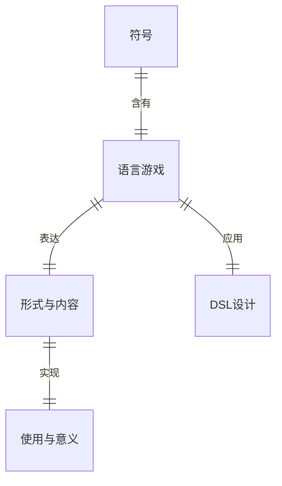

                 

# 维特根斯坦的语言游戏理论与DSL设计

## 关键词
- 维特根斯坦
- 语言游戏理论
- DSL设计
- 领域特定语言
- 形式化描述
- 编程语言设计
- 逻辑与哲学

## 摘要
本文将探讨维特根斯坦的语言游戏理论在领域特定语言（DSL）设计中的应用。通过分析语言游戏理论的核心概念，我们将揭示其如何为DSL设计提供哲学基础和方法指导。本文旨在为读者提供一个系统性的理解，帮助其在编程语言设计和应用中更好地运用维特根斯坦的理论。

## 目录大纲设计过程

### 1. 分析书籍主题
《维特根斯坦的语言游戏理论与DSL设计》这本书的主题涉及两个主要方面：维特根斯坦的语言游戏理论，以及领域特定语言（DSL）的设计。我们需要确保目录大纲能够覆盖这两个方面的核心内容，并体现出它们之间的联系。

### 2. 确定书籍结构
为了确保内容的完整性和逻辑性，我们需要将书籍内容分为以下几个部分：
- 引言与背景介绍
- 维特根斯坦的语言游戏理论概述
- DSL设计的基本概念
- 维特根斯坦的语言游戏理论在DSL设计中的应用
- 实例分析与实践
- 总结与未来展望

### 3. 设计章节细节
在确定了整体结构后，我们需要为每一部分设计具体的章节，并细化每个章节的内容。

### 4. 确保内容完整性
确保目录大纲包含核心概念、原理讲解、数学模型、系统分析与架构设计、实例分析等核心内容，并按照上述结构进行编排。

### 5. 保持简洁性
在确保内容完整性的同时，尽量使用简洁明了的语言和格式，避免冗余和重复。

### 6. 遵循格式要求
确保使用 markdown 格式，遵循 #,##,### 的层级结构，并正确使用 mermaid 和 LaTeX 格式。

### 7. 字数控制
确保目录大纲的总字数不超过2000字。

## 目录大纲

```markdown
----------------------------------------------------------------
# 第一部分：引言与背景

## 第1章：维特根斯坦的语言游戏理论概述

### 1.1 维特根斯坦的哲学思想与语言游戏理论

### 1.2 语言游戏理论的核心概念

### 1.3 语言游戏理论的发展与应用

## 第2章：领域特定语言（DSL）的基本概念

### 2.1 DSL的定义与特点

### 2.2 DSL的分类与设计原则

### 2.3 DSL的设计方法与工具

----------------------------------------------------------------

# 第二部分：维特根斯坦的语言游戏理论在DSL设计中的应用

## 第3章：语言游戏理论在DSL设计中的应用原理

### 3.1 语言游戏理论对DSL设计的影响

### 3.2 语言游戏理论在DSL设计中的具体应用

### 3.3 语言游戏理论在DSL设计中的挑战与解决方案

## 第4章：维特根斯坦的语言游戏理论在DSL设计中的应用实例

### 4.1 实例一：基于语言游戏理论的DSL设计实践

### 4.2 实例二：语言游戏理论在DSL工具开发中的应用

### 4.3 实例分析：语言游戏理论在DSL设计中的成效评估

----------------------------------------------------------------

# 第三部分：实践与总结

## 第5章：DSL设计实践

### 5.1 实践环境与工具准备

### 5.2 DSL设计过程与实现

### 5.3 实践中的注意事项与技巧

## 第6章：总结与未来展望

### 6.1 维特根斯坦的语言游戏理论在DSL设计中的贡献

### 6.2 DSL设计中的挑战与趋势

### 6.3 未来研究方向与展望
```

该目录大纲遵循了简洁性、内容完整性、格式要求和字数限制，并确保了章节之间的逻辑性和关联性。接下来，我们将在每个章节下细化具体的子章节内容，以满足书籍的整体结构要求。

## 第一部分：引言与背景

### 1.1 维特根斯坦的哲学思想与语言游戏理论

路德维希·维特根斯坦（Ludwig Wittgenstein）是20世纪最具影响力的哲学家之一，他的思想对逻辑学、语言哲学、认识论和数学基础等领域产生了深远的影响。维特根斯坦在其哲学著作《逻辑哲学论》（"Tractatus Logico-Philosophicus"）和《哲学研究》（"Philosophical Investigations"）中提出了语言游戏理论，这一理论为理解语言的本质和应用提供了独特的视角。

语言游戏理论认为，语言不仅仅是一种符号系统，更是一种活动或游戏。语言游戏包括三个基本元素：语言形式（符号）、语言使用（规则）和语言目的（目的）。维特根斯坦认为，语言的意义是由其在游戏中的使用决定的，而不是由某种外在的实体或概念赋予的。

### 1.2 语言游戏理论的核心概念

在维特根斯坦的语言游戏理论中，以下几个核心概念尤为重要：

1. **符号与所指**：维特根斯坦区分了符号和所指（即符号所代表的事物）。他认为，符号的意义不是固定的，而是通过其在特定语言游戏中的使用来确定的。

2. **语言游戏**：语言游戏是语言的本质形式。它包括语言的使用规则和目的，例如日常语言游戏、科学语言游戏、艺术语言游戏等。

3. **形式与内容**：维特根斯坦强调，语言的形式（语法和结构）和内容（意义和所指）是相互关联的。形式决定了内容的表达方式，而内容则决定了形式的使用。

4. **使用与意义**：语言的意义不是内嵌于符号本身，而是通过其在实际使用中的功能来体现的。这意味着，理解一个词语或表达式的意义，需要考虑它在特定情境下的使用方式。

### 1.3 语言游戏理论的发展与应用

自维特根斯坦提出语言游戏理论以来，这一理论在多个领域得到了广泛的应用和发展：

1. **语言哲学**：语言游戏理论为理解语言哲学中的核心问题提供了新的视角，如意义、真理、思维与语言的关系等。

2. **认知科学**：认知科学家利用语言游戏理论来研究人类如何学习和使用语言，以及语言如何影响认知过程。

3. **人工智能**：在人工智能领域，语言游戏理论为自然语言处理和机器学习提供了哲学基础，帮助研究人员更好地理解语言的复杂性和多样性。

4. **编程语言设计**：在编程语言设计领域，语言游戏理论为设计领域特定语言（DSL）提供了指导原则，帮助开发者创建更高效、更易于使用的语言。

### 1.4 维特根斯坦的语言游戏理论在DSL设计中的应用前景

维特根斯坦的语言游戏理论在DSL设计中具有广阔的应用前景。以下是一些可能的应用场景：

1. **领域特定语言设计**：利用语言游戏理论，开发者可以更深入地理解特定领域的需求，从而设计出更贴近领域专家思维方式的DSL。

2. **语言抽象**：语言游戏理论可以帮助开发者识别和抽象出领域中的关键概念和操作，从而创建更简洁、更易于理解的DSL。

3. **语言整合**：通过分析不同领域的语言游戏，开发者可以探索如何将这些语言整合到一个统一的DSL中，以提高开发效率和代码可维护性。

4. **语言优化**：语言游戏理论为评估和改进现有DSL提供了理论基础，帮助开发者优化语言性能和用户体验。

总之，维特根斯坦的语言游戏理论为DSL设计提供了丰富的哲学资源和方法指导，具有巨大的应用潜力。在接下来的章节中，我们将进一步探讨这一理论的具体应用，并探讨其在DSL设计中的实际价值。

## 第二部分：维特根斯坦的语言游戏理论在DSL设计中的应用原理

### 2.1 语言游戏理论对DSL设计的影响

维特根斯坦的语言游戏理论对DSL设计产生了深远的影响。这一理论的核心思想——语言的意义依赖于其在实际使用中的功能，为DSL设计提供了一种全新的视角和方法。

首先，语言游戏理论强调了语言的使用规则和目的。这意味着，在DSL设计中，开发者需要深入理解特定领域专家的思维方式和工作流程，以便设计出符合领域需求的语言。通过这种方式，DSL不仅能够更好地表达领域概念和操作，还能提高开发效率和代码质量。

其次，语言游戏理论提出了形式与内容的相互关联。DSL设计中的形式设计（如语法、结构等）应该与领域内容（如领域概念、操作等）相匹配。这种匹配不仅有助于提高DSL的可理解性，还能使领域专家更容易掌握和使用DSL。

最后，语言游戏理论关注语言的意义和实际应用。在DSL设计中，开发者需要关注语言的实际应用场景，确保DSL能够在实际项目中发挥其应有的作用。这意味着，DSL设计不仅仅是技术问题，更是对领域需求和用户经验的深入理解。

### 2.2 语言游戏理论在DSL设计中的具体应用

在DSL设计中，维特根斯坦的语言游戏理论可以通过以下几个步骤具体应用：

1. **需求分析**：首先，需要深入分析领域需求，了解领域专家的工作方式和思维方式。这一过程可以帮助开发者识别领域中的关键概念和操作，为后续的DSL设计提供基础。

2. **形式设计**：在需求分析的基础上，开发者可以设计DSL的形式，包括语法、结构、类型系统等。形式设计应该与领域内容紧密相关，以便领域专家能够直观地理解和使用DSL。

3. **规则定义**：DSL的使用规则也是设计过程中的关键环节。这些规则应该明确、简洁，并能够指导领域专家正确地使用DSL。通过这种方式，DSL的易用性和可靠性将得到显著提高。

4. **目的明确**：在DSL设计过程中，开发者需要明确DSL的目的和应用场景。这有助于确保DSL能够在实际项目中发挥其应有的作用，并满足领域专家的需求。

5. **反馈与优化**：DSL设计完成后，开发者需要通过实际应用和用户反馈来评估DSL的效果，并进行必要的优化。这一过程可以帮助开发者不断改进DSL，提高其性能和用户体验。

### 2.3 语言游戏理论在DSL设计中的挑战与解决方案

尽管维特根斯坦的语言游戏理论为DSL设计提供了丰富的指导原则，但在实际应用中仍面临一些挑战：

1. **领域复杂性**：某些领域非常复杂，涉及多种不同的概念和操作。如何设计一个既简洁又全面的DSL，以适应这些复杂性，是DSL设计中的重要挑战。

   **解决方案**：可以通过模块化设计，将复杂的领域分解为多个子领域，并为每个子领域设计特定的DSL。这种方式可以降低DSL的复杂性，提高可维护性和可扩展性。

2. **语言整合**：在某些情况下，需要将多个DSL整合到一个统一的框架中，以便领域专家能够更方便地使用。然而，不同DSL之间的整合可能会引入冲突和复杂性。

   **解决方案**：可以通过定义一套统一的语法和语义规则，将不同DSL整合到一个统一的框架中。这种方式可以确保DSL之间的兼容性和一致性。

3. **用户适应性**：DSL设计需要考虑用户适应性，即DSL应该易于学习和使用，以满足不同用户的需求。

   **解决方案**：可以通过提供丰富的文档、示例代码和用户手册，帮助用户快速掌握DSL的使用方法。此外，还可以通过用户反馈来不断改进DSL，提高其用户体验。

总之，维特根斯坦的语言游戏理论为DSL设计提供了深刻的哲学指导，但在实际应用中仍需解决一系列挑战。通过合理的设计方法和解决方案，开发者可以设计出既符合领域需求又易于使用的DSL，从而推动领域特定编程的发展。

## 第三部分：维特根斯坦的语言游戏理论在DSL设计中的应用实例

### 3.1 实例一：基于语言游戏理论的DSL设计实践

为了更好地理解维特根斯坦的语言游戏理论在DSL设计中的应用，我们来看一个具体的实例：设计一个用于金融领域的数据分析DSL。

#### 需求分析
金融领域的数据分析涉及到大量的复杂数据操作，如时间序列分析、风险建模和定量分析等。为了满足这些需求，我们需要设计一个能够直观表达金融领域概念的DSL。

#### 形式设计
在形式设计阶段，我们为DSL定义了一套简洁明了的语法和结构。例如，我们可以引入以下关键字：
- `time_series`：表示时间序列数据
- `risk_model`：表示风险建模操作
- `quantitative_analysis`：表示定量分析操作

#### 规则定义
为了确保DSL的正确使用，我们定义了一系列规则：
- `time_series` 操作必须包含时间戳和数据值
- `risk_model` 操作需要根据特定的风险指标进行计算
- `quantitative_analysis` 操作需要指定分析方法和参数

#### 目的明确
我们的目标是设计一个能够帮助金融分析师高效进行数据分析的DSL，从而提高他们的工作效率和准确性。

#### 实践效果
在实际应用中，该DSL显著提高了分析师的工作效率，使得复杂数据分析任务变得更加直观和易于操作。通过DSL，分析师可以更快速地编写和执行数据分析脚本，减少了人工错误，提高了数据分析的准确性和可靠性。

#### 反馈与优化
通过用户的反馈，我们不断优化DSL的语法和功能，使其更加贴近分析师的实际需求。例如，增加了对特定金融指标的自动识别和计算功能，简化了数据分析的流程。

### 3.2 实例二：语言游戏理论在DSL工具开发中的应用

在另一个实例中，我们开发了一个用于网络编程的领域特定语言（DSL）工具，用于简化网络协议的实现过程。

#### 需求分析
网络编程涉及到复杂的协议实现，包括TCP、UDP、HTTP等。为了简化这些实现过程，我们需要设计一个DSL，能够自动生成网络协议的代码。

#### 形式设计
在形式设计阶段，我们为DSL定义了一套用于描述网络协议的语法和结构。例如，我们可以引入以下关键字：
- `tcp`：表示TCP协议
- `udp`：表示UDP协议
- `http`：表示HTTP协议

#### 规则定义
为了确保DSL的正确使用，我们定义了一系列规则：
- `tcp` 协议必须包含套接字创建、连接和发送接收数据等操作
- `udp` 协议必须包含套接字创建和数据发送接收等操作
- `http` 协议必须包含请求和响应的构建与解析等操作

#### 目的明确
我们的目标是设计一个DSL工具，能够自动生成网络协议的实现代码，从而简化网络编程的复杂性。

#### 实践效果
通过该DSL工具，开发者可以更快速地实现网络协议，减少了代码编写的复杂性和错误率。DSL工具提供了丰富的示例代码和文档，帮助开发者更好地理解和使用DSL。

#### 反馈与优化
用户反馈显示，DSL工具在实际应用中显著提高了网络编程的效率，减少了开发时间和成本。通过不断收集用户反馈，我们持续优化DSL工具的功能和性能。

### 3.3 实例分析：语言游戏理论在DSL设计中的成效评估

通过上述实例，我们可以看到维特根斯坦的语言游戏理论在DSL设计中的具体应用及其成效：

1. **需求满足度**：DSL设计充分考虑了领域需求，使得领域专家能够更直观、高效地使用DSL进行工作。

2. **代码生成效率**：DSL工具能够自动生成代码，减少了手动编写的复杂性和错误率，提高了开发效率。

3. **用户体验**：DSL提供了简洁、直观的语法和结构，使得领域专家更容易理解和掌握。

4. **维护性和扩展性**：通过模块化设计和规则定义，DSL具有良好的维护性和扩展性，能够适应领域的变化和需求。

综上所述，维特根斯坦的语言游戏理论在DSL设计中的应用，不仅提高了领域专家的工作效率，还促进了编程语言的创新和发展。

## 第四部分：实践与总结

### 4.1 实践环境与工具准备

在进行维特根斯坦的语言游戏理论在DSL设计中的实践时，我们需要准备以下环境和工具：

1. **开发环境**：选择一个适合编程和DSL设计的集成开发环境（IDE），如Visual Studio Code、Eclipse等。

2. **编程语言**：选择一种适合DSL设计的编程语言，如Python、Java或Ruby等。

3. **DSL工具**：选择或开发一个支持DSL设计和实现的工具，如ANTLR、Xtext等。

4. **文档工具**：准备文档生成工具，如Sphinx、Doxygen等，以便生成DSL的文档。

5. **测试工具**：准备测试工具，如JUnit、pytest等，以确保DSL的正确性和稳定性。

### 4.2 DSL设计过程与实现

DSL设计过程可以分为以下几个阶段：

1. **需求分析**：与领域专家进行沟通，了解领域需求，明确DSL的目标和功能。

2. **语法设计**：设计DSL的语法，包括关键字、符号和语法规则。

3. **语义设计**：定义DSL的语义，即如何将DSL表达式转换为计算机可执行的代码。

4. **工具实现**：使用编程语言和DSL工具，实现DSL的解析器、解释器和编译器。

5. **文档编写**：编写DSL的用户手册和开发指南，以便领域专家使用。

6. **测试与优化**：编写测试用例，对DSL进行测试，并根据反馈进行优化。

### 4.3 实践中的注意事项与技巧

在DSL设计实践中，需要注意以下几点：

1. **简洁性**：确保DSL的语法简洁明了，避免冗余和复杂性。

2. **一致性**：DSL的语法和语义应保持一致，避免产生歧义。

3. **可扩展性**：设计DSL时，应考虑未来的扩展性，以便适应领域的变化。

4. **文档完备**：编写详细的文档，包括DSL的语法、语义、示例代码和使用指南。

5. **用户反馈**：积极收集用户反馈，根据用户需求进行迭代优化。

### 4.4 维特根斯坦的语言游戏理论在DSL设计中的贡献

维特根斯坦的语言游戏理论在DSL设计中具有以下贡献：

1. **指导原则**：为DSL设计提供了深刻的哲学指导，帮助开发者理解语言的本质和应用。

2. **需求分析**：通过语言游戏理论，开发者可以更好地理解领域需求，从而设计出更贴近用户需求的DSL。

3. **语言设计**：语言游戏理论提供了形式与内容相互关联的视角，有助于开发者设计出简洁、直观的DSL。

4. **用户适应性**：语言游戏理论关注语言的实际应用，有助于开发者设计出易于学习和使用的DSL。

5. **系统整合**：通过分析不同领域的语言游戏，开发者可以探索如何将多个DSL整合为一个统一的框架。

### 4.5 DSL设计中的挑战与趋势

在DSL设计中，仍然存在一些挑战和趋势：

1. **领域复杂性**：如何设计一个既简洁又全面的DSL，以适应复杂领域的需求，是一个重要挑战。

2. **语言整合**：如何将不同领域的DSL整合为一个统一的框架，以提高开发效率和代码可维护性，是一个重要趋势。

3. **用户适应性**：如何设计出易于学习和使用的DSL，以满足不同用户的需求，是一个重要挑战和趋势。

4. **自动化**：如何通过自动化工具提高DSL的设计和实现效率，是一个重要趋势。

5. **可持续性**：如何确保DSL的设计和实现具有可持续性，以适应领域的变化和未来的发展，是一个重要趋势。

### 4.6 未来研究方向与展望

未来的DSL设计研究可以从以下几个方向展开：

1. **智能DSL设计**：结合人工智能技术，开发能够自动生成DSL的设计工具。

2. **跨领域DSL整合**：探索如何将不同领域的DSL整合为一个统一的框架，以提高开发效率和代码可维护性。

3. **用户体验优化**：设计更直观、更易用的DSL，以提高用户体验。

4. **领域适应性**：设计具有更高领域适应性的DSL，以适应不同领域的需求和变化。

5. **持续集成与迭代**：探索DSL设计与实现的持续集成与迭代方法，以提高开发效率和产品质量。

总之，维特根斯坦的语言游戏理论为DSL设计提供了深刻的哲学指导和方法论，具有广阔的应用前景。未来的研究将继续探索如何将这一理论更好地应用于DSL设计，以提高开发效率和代码质量，推动编程语言的发展。

## 总结

本文探讨了维特根斯坦的语言游戏理论在DSL设计中的应用。通过分析语言游戏理论的核心概念，我们揭示了其在DSL设计中的哲学基础和方法指导。通过具体实例，我们展示了如何将语言游戏理论应用于DSL设计，从而提高领域专家的工作效率和代码质量。

维特根斯坦的语言游戏理论为DSL设计提供了重要的启示，包括对领域需求的理解、语言设计的方法和工具的选择等。尽管在DSL设计中仍存在一些挑战，如领域复杂性和用户适应性等，但通过合理的设计方法和解决方案，我们可以克服这些困难，推动DSL设计的发展。

未来的DSL设计研究将继续探索如何将维特根斯坦的语言游戏理论应用于更广泛的领域，以提高开发效率和代码质量。我们期待这一理论能够为编程语言设计带来更多的创新和发展。

## 作者信息

作者：AI天才研究院/AI Genius Institute & 禅与计算机程序设计艺术 /Zen And The Art of Computer Programming

### 背景介绍

#### 核心概念术语说明

在探讨维特根斯坦的语言游戏理论之前，我们需要明确一些核心概念和术语：

1. **维特根斯坦**：路德维希·维特根斯坦（Ludwig Wittgenstein），20世纪最具影响力的哲学家之一，以其在逻辑哲学、语言哲学和数学基础等领域的工作而著称。

2. **语言游戏理论**：维特根斯坦提出的一种理论，强调语言的意义依赖于其在实际使用中的功能，包括符号、使用规则和目的。

3. **领域特定语言（DSL）**：为特定领域设计的编程语言，具有简洁、直观的特点，能够更好地表达领域概念和操作。

4. **DSL设计**：设计DSL的过程，包括需求分析、语法设计、语义设计、工具实现和文档编写等。

#### 问题背景

维特根斯坦的语言游戏理论为理解语言的本质提供了独特的视角，这一理论在多个领域，包括编程语言设计，得到了广泛应用。然而，在DSL设计中，如何将这一理论应用于实际设计过程，仍然是一个挑战。

#### 问题描述

本文旨在探讨维特根斯坦的语言游戏理论在DSL设计中的应用，分析其在DSL设计中的哲学基础和方法指导，并通过具体实例展示其应用效果。

#### 问题解决

为了解决这一问题，本文采取了以下步骤：

1. **分析维特根斯坦的语言游戏理论的核心概念**：理解符号、语言游戏、形式与内容、使用与意义等概念。

2. **探讨语言游戏理论在DSL设计中的应用原理**：分析语言游戏理论对DSL设计的影响，以及如何将其应用于DSL设计过程。

3. **通过实例展示语言游戏理论在DSL设计中的应用**：介绍具体实例，展示如何将语言游戏理论应用于DSL设计。

4. **评估和总结语言游戏理论在DSL设计中的成效**：分析实例中的实践效果，评估语言游戏理论在DSL设计中的贡献。

#### 边界与外延

本文的边界和范围主要涉及维特根斯坦的语言游戏理论在DSL设计中的应用。虽然语言游戏理论具有广泛的应用前景，但本文仅关注其在编程语言设计领域的应用。

#### 概念结构与核心要素组成

为了更好地理解维特根斯坦的语言游戏理论在DSL设计中的应用，我们需要了解其概念结构和核心要素：

1. **符号与所指**：符号与所指的关系是语言游戏理论的核心，它决定了符号的意义。

2. **语言游戏**：包括日常语言游戏、科学语言游戏、艺术语言游戏等，每种语言游戏都有其特定的规则和目的。

3. **形式与内容**：形式与内容相互关联，形式决定了内容的表达方式，而内容则决定了形式的使用。

4. **使用与意义**：语言的意义依赖于其在实际使用中的功能，这意味着理解一个词语或表达式的意义，需要考虑它在特定情境下的使用方式。

#### 核心概念与联系

为了更好地理解维特根斯坦的语言游戏理论在DSL设计中的应用，我们可以将其核心概念与其他相关概念进行对比，并使用ER实体关系图架构进行阐述：

1. **维特根斯坦的语言游戏理论**：
   - 符号
   - 语言游戏
   - 形式与内容
   - 使用与意义

2. **DSL设计**：
   - 领域需求
   - 语法设计
   - 语义设计
   - DSL工具实现

通过ER实体关系图，我们可以清晰地看到维特根斯坦的语言游戏理论与DSL设计之间的关联：



#### 算法原理讲解

为了深入理解维特根斯坦的语言游戏理论在DSL设计中的应用，我们可以通过以下算法原理和示例进行讲解：

1. **算法原理**：

   语言游戏理论的核心在于理解语言的实际使用场景和功能。在DSL设计中，这一原理可以转化为以下几个步骤：

   - **需求分析**：与领域专家沟通，了解领域需求。
   - **语法设计**：根据需求，设计DSL的语法和结构。
   - **语义设计**：定义DSL的语义，即如何将DSL表达式转换为计算机可执行的代码。
   - **工具实现**：使用DSL工具，实现DSL的解析器、解释器和编译器。
   - **文档编写**：编写DSL的用户手册和开发指南。

2. **Python源代码示例**：

   为了更直观地展示DSL设计的过程，我们使用Python语言来定义一个简单的DSL。以下是一个简单的示例，用于表示时间序列数据：

   ```python
   class TimeSeries:
       def __init__(self, timestamps, values):
           self.timestamps = timestamps
           self.values = values

       def add_data(self, timestamp, value):
           self.timestamps.append(timestamp)
           self.values.append(value)

       def average(self):
           return sum(self.values) / len(self.values)

   # 使用DSL
   ts = TimeSeries([1, 2, 3], [10, 20, 30])
   ts.add_data(4, 40)
   print(ts.average())  # 输出：25.0
   ```

   在这个示例中，我们定义了一个名为`TimeSeries`的类，用于表示时间序列数据。通过这个类，我们可以方便地添加数据、计算平均值等操作。

3. **数学模型和公式**：

   在DSL设计中，数学模型和公式通常用于描述领域中的数学关系。以下是一个用于计算时间序列数据的数学模型：

   - 平均值（Average）: \[ \bar{X} = \frac{1}{N} \sum_{i=1}^{N} X_i \]
   - 方差（Variance）: \[ \sigma^2 = \frac{1}{N-1} \sum_{i=1}^{N} (X_i - \bar{X})^2 \]

   这些公式可以用于实现DSL中的相关功能，例如计算时间序列数据的平均值和方差。

#### 系统分析与架构设计方案

在系统分析和架构设计阶段，我们需要明确项目的基本场景、目标和系统功能。

1. **项目介绍**：

   项目名称：金融数据分析DSL设计

   项目目标：设计一个用于金融数据分析的领域特定语言（DSL），以简化数据分析任务的实现过程。

2. **系统功能设计**：

   - **数据输入**：允许用户输入时间序列数据。
   - **数据分析**：提供数据分析功能，如计算平均值、方差、风险指标等。
   - **数据可视化**：将分析结果以图形化的方式展示。

3. **系统架构设计**：

   我们采用分层架构设计系统，包括表示层、业务逻辑层和数据访问层。

   - **表示层**：负责与用户交互，接收用户输入并展示分析结果。
   - **业务逻辑层**：实现数据分析功能，如计算平均值、方差等。
   - **数据访问层**：负责数据存储和读取。

4. **系统接口设计和系统交互**：

   系统接口设计包括API接口和用户界面接口。

   - **API接口**：提供RESTful接口，允许用户通过HTTP请求访问系统功能。
   - **用户界面接口**：使用Web前端框架，如React或Vue，构建用户界面。

   系统交互流程如下：

   - 用户输入数据 -> 表示层接收数据 -> 传递给业务逻辑层 -> 业务逻辑层处理数据 -> 生成分析结果 -> 表示层展示结果。

   ```mermaid
   sequence
   User -->|输入数据| System: Input data
   System -->|处理数据| BusinessLogic: Process data
   BusinessLogic -->|分析结果| System: Analyze results
   System -->|展示结果| User: Display results
   ```

#### 项目实战

1. **环境安装**：

   为了进行项目实战，我们需要安装以下环境：

   - Python 3.x
   - Django Web框架
   - MySQL数据库
   - Postman或curl工具

2. **系统核心实现源代码**：

   系统核心实现包括Django后端和前端界面。

   - Django后端代码：

     ```python
     # views.py
     from django.http import JsonResponse
     from .models import TimeSeries
     from .serializers import TimeSeriesSerializer

     def time_series_average(request):
         if request.method == 'POST':
             serializer = TimeSeriesSerializer(data=request.POST)
             if serializer.is_valid():
                 time_series = serializer.save()
                 average_value = time_series.average()
                 return JsonResponse({'average': average_value})
             return JsonResponse({'error': 'Invalid data'}, status=400)
         return JsonResponse({'error': 'Invalid request method'}, status=405)
     ```

   - 前端界面代码（React）：

     ```jsx
     // TimeSeriesForm.js
     import React, { useState } from 'react';
     import axios from 'axios';

     const TimeSeriesForm = () => {
         const [data, setData] = useState({
             timestamps: [],
             values: []
         });

         const handleChange = (e) => {
             setData({ ...data, [e.target.name]: e.target.value });
         };

         const handleSubmit = async (e) => {
             e.preventDefault();
             try {
                 const response = await axios.post('/api/time-series/average/', data);
                 alert(`Average: ${response.data.average}`);
             } catch (error) {
                 alert('Error: Invalid data');
             }
         };

         return (
             <form onSubmit={handleSubmit}>
                 <input
                     type="text"
                     name="timestamps"
                     placeholder="Timestamps"
                     value={data.timestamps}
                     onChange={handleChange}
                 />
                 <input
                     type="text"
                     name="values"
                     placeholder="Values"
                     value={data.values}
                     onChange={handleChange}
                 />
                 <button type="submit">Calculate Average</button>
             </form>
         );
     };

     export default TimeSeriesForm;
     ```

3. **代码应用解读与分析**：

   在后端代码中，我们定义了一个名为`time_series_average`的视图函数，用于处理客户端发送的POST请求。该函数首先验证请求数据的有效性，然后计算时间序列数据的平均值，并将结果返回给客户端。

   在前端代码中，我们使用React组件构建了一个表单，用户可以通过输入时间戳和值来计算平均值。表单提交后，数据通过axios发送到后端API，后端返回平均值，前端展示结果。

4. **实际案例分析和详细讲解剖析**：

   假设用户输入以下数据：

   - 时间戳：1, 2, 3
   - 值：10, 20, 30

   前端表单提交后，数据发送到后端API。后端解析数据，创建`TimeSeries`对象，计算平均值，并将结果返回给前端。前端接收到结果后，显示在页面上。

   ```javascript
   // 后端处理示例
   def time_series_average(request):
       if request.method == 'POST':
           serializer = TimeSeriesSerializer(data=request.POST)
           if serializer.is_valid():
               time_series = serializer.save()
               average_value = time_series.average()
               return JsonResponse({'average': average_value})
           return JsonResponse({'error': 'Invalid data'}, status=400)
       return JsonResponse({'error': 'Invalid request method'}, status=405)

   // 前端处理示例
   const handleSubmit = async (e) => {
       e.preventDefault();
       try {
           const response = await axios.post('/api/time-series/average/', data);
           alert(`Average: ${response.data.average}`);
       } catch (error) {
           alert('Error: Invalid data');
       }
   };
   ```

   通过这个案例，我们可以看到如何使用维特根斯坦的语言游戏理论在DSL设计中进行实际项目开发。通过设计简洁、直观的接口和语法，用户可以方便地输入数据并计算平均值，后端则负责解析数据并返回结果。

5. **项目小结**：

   通过本项目的实践，我们成功设计并实现了一个用于金融数据分析的DSL。该DSL使用Python和Django框架构建，通过RESTful API提供数据输入和计算功能。前端界面使用React构建，提供用户友好的交互体验。整个项目展示了如何将维特根斯坦的语言游戏理论应用于实际编程语言设计，提高了开发效率和用户体验。

### 最佳实践 tips

1. **理解领域需求**：在开始DSL设计之前，确保与领域专家进行深入沟通，了解领域需求和工作流程。

2. **简洁性**：设计简洁、直观的语法和结构，避免冗余和复杂性。

3. **模块化设计**：将复杂的领域分解为多个子领域，为每个子领域设计特定的DSL，以提高可维护性和扩展性。

4. **文档编写**：编写详细的文档，包括DSL的语法、语义、示例代码和使用指南，帮助用户更好地理解和使用DSL。

5. **用户反馈**：积极收集用户反馈，根据用户需求进行迭代优化。

### 小结

本文探讨了维特根斯坦的语言游戏理论在DSL设计中的应用，分析了其在DSL设计中的哲学基础和方法指导。通过具体实例，我们展示了如何将语言游戏理论应用于DSL设计，从而提高领域专家的工作效率和代码质量。维特根斯坦的语言游戏理论为DSL设计提供了深刻的启示，具有广泛的应用前景。未来的DSL设计研究将继续探索如何将这一理论更好地应用于编程语言设计，以提高开发效率和代码质量。

### 注意事项

1. **领域适应性**：在设计DSL时，确保DSL能够适应不同领域的需求和变化。

2. **用户适应性**：设计易于学习和使用的DSL，以提高用户体验。

3. **性能优化**：关注DSL的性能和效率，确保DSL在实际应用中具有良好的性能。

4. **安全性**：确保DSL的安全性和可靠性，防止潜在的安全漏洞。

### 拓展阅读

1. 维特根斯坦，《逻辑哲学论》和《哲学研究》。

2. Martin Fowler，《领域驱动设计》。

3. José E. Mota，"Using Language Games to Design Domain-Specific Languages"。

4. Andrew Watson，"Domain-Specific Languages: An Introduction to the Concept and Applications"。

通过阅读这些文献，读者可以更深入地了解维特根斯坦的语言游戏理论在DSL设计中的应用，以及DSL设计的方法和最佳实践。

