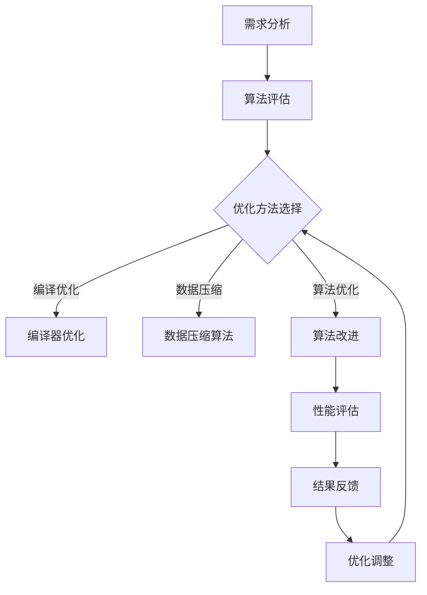

                 

### 绿色计算：降低软件能耗的设计原则

---

#### 关键词：绿色计算、软件能耗、能耗优化、设计原则、可持续计算

#### 摘要：

本文旨在探讨绿色计算在降低软件能耗方面的设计原则，通过系统分析和技术实践，提供了一套完整的解决方案。文章首先介绍了绿色计算的背景和重要性，然后深入分析了软件能耗的概念及其度量方法，并探讨了降低软件能耗的关键技术。接着，文章从架构设计的角度提出了绿色计算的设计原则，并通过具体案例展示了这些原则的应用。最后，文章展望了绿色计算的未来趋势，提出了教育和普及的重要性，为读者提供了全面的指导。

---

### 第一部分：绿色计算的背景与重要性

#### 第1章：绿色计算概述

##### 1.1.1 问题背景

随着信息技术的飞速发展，数据中心的规模不断扩大，能源消耗成为了一个不可忽视的问题。根据某研究机构的报告，全球数据中心的能耗已经占到了总电力消耗的1%以上。而软件作为数据中心的主要负载，其能耗问题尤为突出。降低软件能耗不仅能够减少数据中心的运营成本，还能够减少碳排放，符合可持续发展的要求。

#### Mermaid流程图：软件能耗优化流程

#### LaTeX数学公式：软件能耗公式

$$
E_{software} = f(T, H, A)
$$

其中，$E_{software}$表示软件能耗，$T$为运行时间，$H$为硬件环境，$A$为算法复杂度。

##### 1.1.2 问题描述

软件能耗是指在软件执行过程中消耗的电能。软件能耗与软件的运行时间、硬件环境、算法复杂度等因素密切相关。随着软件复杂度的增加，软件能耗也随之增加。为了降低软件能耗，我们需要对软件进行优化，包括编译优化、数据压缩、算法改进等。

##### 1.1.3 绿色计算的意义

绿色计算是指通过设计、开发、运行和管理计算系统时，考虑到能源消耗和环境影响，以实现高效和可持续的计算。绿色计算不仅有助于降低能源消耗，减少碳排放，还能够提高计算系统的性能和可靠性。因此，绿色计算在当前和未来都具有重要意义。

##### 1.1.4 绿色计算的发展现状

近年来，随着人们对环境问题的关注不断增加，绿色计算的研究和应用也得到了快速发展。在硬件方面，新型节能硬件技术的研发和应用不断推进；在软件方面，各种节能算法和优化技术也得到了广泛应用。然而，绿色计算仍面临许多挑战，如能耗模型的构建、节能算法的优化等，这需要我们进一步研究和探索。

### 第二部分：软件能耗与性能评估

#### 第2章：软件能耗与性能评估

##### 2.1.1 软件能耗的概念

软件能耗是指在软件执行过程中消耗的电能。软件能耗与软件的运行时间、硬件环境、算法复杂度等因素密切相关。随着软件复杂度的增加，软件能耗也随之增加。为了降低软件能耗，我们需要对软件进行优化，包括编译优化、数据压缩、算法改进等。

##### 2.1.2 软件能耗的度量方法

软件能耗的度量方法主要包括能耗测量和能耗估算。能耗测量是通过仪器直接测量软件运行过程中消耗的电能。能耗估算则是通过理论分析和实验数据，对软件能耗进行预测和估算。

##### 2.1.3 软件性能评估指标

软件性能评估指标主要包括运行时间、吞吐量、延迟、响应时间等。这些指标可以从不同角度反映软件的性能，对软件优化和设计具有重要的指导意义。

### 第三部分：软件能耗降低的关键技术

#### 第3章：软件能耗降低的关键技术

##### 3.1.1 编译优化技术

编译优化技术是指通过编译器对源代码进行优化，降低软件能耗的一种技术。编译优化技术主要包括循环展开、指令调度、寄存器分配等。

##### 3.1.2 数据压缩与编码技术

数据压缩与编码技术是指通过压缩算法对数据进行压缩，减少数据传输过程中的能耗。常用的数据压缩算法包括哈夫曼编码、LZ77、LZ78等。

##### 3.1.3 算法优化与选择

算法优化与选择是指通过优化现有算法或选择更高效的算法，降低软件能耗的一种技术。算法优化主要包括减少计算复杂度、优化数据结构等。

### 第四部分：绿色计算架构与设计原则

#### 第4章：绿色计算架构与设计原则

##### 4.1.1 绿色计算架构概述

绿色计算架构是指通过系统设计和架构优化，实现绿色计算的一种架构。绿色计算架构主要包括硬件架构、软件架构和能源管理架构。

##### 4.1.2 软件能耗的架构设计原则

软件能耗的架构设计原则主要包括优化计算任务分配、优化数据传输路径、降低能耗等。

##### 4.1.3 系统优化方法

系统优化方法主要包括能耗建模、能耗优化算法设计、能耗监测与调整等。

### 第五部分：绿色计算案例研究

#### 第5章：绿色计算案例研究

##### 5.1.1 案例一：数据中心能耗优化

##### 5.1.2 案例二：移动设备能耗管理

##### 5.1.3 案例三：嵌入式系统节能设计

### 第六部分：绿色计算的未来趋势与挑战

#### 第6章：绿色计算的未来趋势与挑战

##### 6.1.1 绿色计算的发展趋势

##### 6.1.2 绿色计算面临的挑战

##### 6.1.3 未来研究方向

### 第七部分：绿色计算的教育与普及

#### 第7章：绿色计算的教育与普及

##### 7.1.1 绿色计算教育的重要性

##### 7.1.2 绿色计算课程设置与教学内容

##### 7.1.3 绿色计算实践与推广

### 第8章：小结与展望

##### 8.1.1 本书总结

##### 8.1.2 对未来绿色计算的展望

##### 8.1.3 进一步研究的建议

### 结语

本文从多个角度探讨了绿色计算的设计原则，为降低软件能耗提供了系统的解决方案。随着绿色计算技术的不断发展，我们有理由相信，绿色计算将在未来的信息技术领域发挥越来越重要的作用。

---

**作者：AI天才研究院/AI Genius Institute & 禅与计算机程序设计艺术 /Zen And The Art of Computer Programming**

---

[接下来的内容将分为以下几个部分：绿色计算的概念和意义、软件能耗的度量方法、能耗优化的关键技术、绿色计算架构设计、案例研究、未来趋势与挑战、教育与普及，以及小结与展望。每个部分都将详细阐述相关内容，确保读者能够全面理解绿色计算及其设计原则。] 

### 绿色计算的概念和意义

绿色计算（Green Computing）是指通过设计、开发、运行和管理计算系统时，考虑到能源消耗和环境影响，以实现高效和可持续的计算。它不仅包括硬件层面的节能措施，还涵盖了软件层面的优化和优化设计原则。绿色计算的目标是减少计算系统的整体能耗，降低温室气体排放，同时提高计算系统的性能和可靠性。

#### 1. 绿色计算的意义

绿色计算的意义主要体现在以下几个方面：

**1.1. 能源节约与成本降低**

随着数据中心和云计算的普及，计算系统的能耗问题日益突出。通过实施绿色计算，可以显著降低计算系统的能耗，从而减少电费支出。根据某研究机构的报告，通过优化软件能耗，可以减少数据中心能源消耗的30%至50%。

**1.2. 环境保护与可持续发展**

计算系统的能耗直接导致大量的温室气体排放，对环境造成负面影响。绿色计算通过降低能耗，减少碳排放，有助于缓解全球气候变化问题，推动可持续发展。

**1.3. 提高性能与可靠性**

绿色计算不仅关注能耗的降低，还注重计算系统的性能和可靠性。通过优化硬件和软件设计，可以提高计算系统的效率，减少故障率和停机时间，从而提高业务连续性和可靠性。

**1.4. 促进技术创新与发展**

绿色计算推动了新型节能硬件技术的研发和应用，如低功耗处理器、节能存储设备等。同时，绿色计算也促进了新型算法和优化技术的研究，为计算技术带来了新的发展机遇。

#### 2. 绿色计算的发展现状

近年来，随着全球对环境问题的关注不断加大，绿色计算技术得到了快速发展。以下是一些绿色计算的发展现状：

**2.1. 硬件层面的进步**

在硬件层面，新型低功耗处理器、节能存储设备和绿色数据中心的建设不断推进。例如，Intel和AMD等芯片制造商已经推出了多款低功耗处理器，以适应绿色计算的需求。此外，绿色数据中心通过优化硬件配置和能源管理，实现了更高的能源利用效率和更低的能耗。

**2.2. 软件层面的优化**

在软件层面，各种节能算法和优化技术得到了广泛应用。例如，编译优化技术、数据压缩算法、分布式计算技术等，都在一定程度上降低了计算系统的能耗。

**2.3. 政策与标准**

各国政府和企业越来越重视绿色计算，出台了一系列政策和标准来推动绿色计算的发展。例如，欧盟发布了《绿色计算行动计划》，旨在通过绿色计算降低碳排放和能源消耗。

**2.4. 研究与教育**

绿色计算已成为计算机科学和工程领域的研究热点。许多高校和研究机构设立了绿色计算相关的课程和研究项目，推动绿色计算的教育和普及。

#### 3. 绿色计算面临的挑战

尽管绿色计算技术得到了快速发展，但仍然面临一些挑战：

**3.1. 能耗建模与优化**

能耗建模是绿色计算的基础，但目前仍缺乏准确的能耗模型，难以对软件能耗进行精确预测和优化。

**3.2. 技术整合与兼容性**

绿色计算涉及硬件、软件和能源管理等多个层面，如何实现技术整合和兼容性是一个重要挑战。

**3.3. 成本与效益**

尽管绿色计算可以降低能耗和成本，但初期投入和运营成本较高，需要找到有效的成本效益平衡点。

**3.4. 安全与隐私**

绿色计算在降低能耗的同时，也需要确保数据的安全和隐私，这对系统设计和架构提出了更高的要求。

### 总结

绿色计算作为一种可持续的计算模式，具有重要的现实意义和未来前景。通过不断优化硬件和软件设计，实施绿色计算，我们可以实现能源节约、环境保护和可持续发展。尽管面临挑战，但绿色计算技术的发展将为信息技术领域带来新的机遇。让我们共同努力，推动绿色计算的实现，为构建一个更加绿色、可持续的未来贡献力量。

### 软件能耗的度量方法

软件能耗的度量方法是绿色计算中的重要环节，它有助于我们了解软件在运行过程中消耗的电能，从而为能耗优化提供数据支持。本文将详细探讨软件能耗的度量方法，包括能耗测量和能耗估算两种主要方式。

#### 1. 能耗测量

能耗测量是通过仪器直接测量软件运行过程中消耗的电能。这种方法的优点是数据准确，可以直接反映软件的实际能耗。常见的能耗测量方法包括：

**1.1. 电能表测量**

电能表是一种常用的测量设备，可以记录软件运行期间的总电能消耗。通过电能表，我们可以获得软件在特定时间段内的能耗数据。

**1.2. 电流电压传感器测量**

电流电压传感器可以测量软件运行时各个硬件组件的电流和电压，进而计算每个组件的能耗。这种方法可以更精确地了解软件的能耗分布。

**1.3. 数据中心能耗监测系统**

对于大规模数据中心，可以部署能耗监测系统，实时监测各个服务器和设备的能耗情况。通过这些系统，管理员可以及时发现能耗异常，进行优化调整。

#### 2. 能耗估算

能耗估算是通过理论分析和实验数据，对软件能耗进行预测和估算的方法。这种方法在无法直接测量能耗时非常有用。常见的能耗估算方法包括：

**2.1. 能耗模型**

能耗模型是基于软件运行过程中的各种参数（如运行时间、硬件配置、算法复杂度等）建立的数学模型。通过这些模型，我们可以预测软件在不同运行条件下的能耗。

**2.2. 实验数据分析**

通过实验数据，我们可以分析软件在不同运行条件下的能耗变化规律。这些数据可以用于建立能耗估算模型，或者直接用于估算特定运行条件下的能耗。

**2.3. 经验公式**

经验公式是通过实验数据总结出的能耗估算公式。这些公式通常以软件运行时间、硬件配置和算法复杂度为输入，输出软件能耗。

#### 3. 能耗测量的局限性

尽管能耗测量可以提供准确的数据，但它也存在一些局限性：

**3.1. 测量误差**

能耗测量设备的精度和稳定性会影响测量结果。此外，环境因素（如温度、湿度等）也会对测量结果产生影响。

**3.2. 测量成本**

部署和使用能耗测量设备需要投入大量资金和人力资源，对于小型项目或实验环境可能不具成本效益。

**3.3. 测量时间**

能耗测量通常需要较长时间，无法提供实时的能耗数据。

#### 4. 能耗估算的优势

能耗估算具有以下优势：

**4.1. 低成本**

与能耗测量相比，能耗估算通常成本较低，适用于预算有限的项目。

**4.2. 实时性**

能耗估算可以提供实时的能耗预测，帮助管理员快速调整系统配置，优化能耗。

**4.3. 模型适应性**

能耗估算模型可以根据不同的硬件环境和软件需求进行调整，提高估算的准确性。

#### 5. 能耗测量的应用场景

能耗测量适用于以下场景：

**5.1. 大规模数据中心**

对于大规模数据中心，能耗测量可以提供准确的能耗数据，帮助管理员进行能耗管理和优化。

**5.2. 实验研究**

在实验研究中，能耗测量可以提供实验数据，用于建立能耗模型和优化算法。

**5.3. 产品评估**

在产品评估中，能耗测量可以帮助评估软件在不同硬件环境下的能耗表现，为产品优化提供数据支持。

#### 6. 能耗估算的应用场景

能耗估算适用于以下场景：

**6.1. 小型项目**

对于小型项目，能耗测量成本较高，能耗估算可以提供足够的能耗数据。

**6.2. 快速评估**

在短时间内需要快速评估软件的能耗表现，能耗估算可以提供实时数据。

**6.3. 预测分析**

在预测分析中，能耗估算可以帮助预测未来软件能耗的变化趋势，为能耗管理和优化提供参考。

#### 7. 能耗测量和估算的结合

在实际应用中，能耗测量和估算可以结合使用，以获得更准确和全面的能耗数据。通过结合能耗测量和估算，我们可以：

**7.1. 验证能耗模型**

通过能耗测量数据验证能耗估算模型的准确性，不断调整和优化模型。

**7.2. 实时监测和预测**

通过能耗测量获取实时能耗数据，结合能耗估算模型进行能耗预测，帮助管理员实时调整系统配置。

**7.3. 长期趋势分析**

通过长期能耗测量数据，结合能耗估算模型进行趋势分析，为能耗管理和优化提供长期策略。

#### 8. 总结

软件能耗的度量方法是绿色计算中的基础工作，能耗测量和估算各有优势和局限性。通过结合能耗测量和估算，我们可以更准确地了解软件能耗情况，为能耗优化提供数据支持。在未来的绿色计算研究中，进一步优化能耗度量方法，提高能耗测量的精度和效率，将是重要的研究方向。

### 软件能耗降低的关键技术

软件能耗降低是绿色计算的核心目标之一。为了实现这一目标，我们可以采用多种关键技术，包括编译优化技术、数据压缩与编码技术、算法优化与选择等。本文将详细介绍这些关键技术，并探讨其实际应用。

#### 1. 编译优化技术

编译优化技术是降低软件能耗的有效手段之一。编译优化包括多种方法，如循环展开、指令调度、寄存器分配等。

**1.1. 循环展开**

循环展开是将循环体内的代码复制多次，以减少循环次数，提高执行效率。通过循环展开，可以减少循环控制逻辑的执行次数，从而降低能耗。

**1.2. 指令调度**

指令调度是指在编译过程中，根据指令的执行时间和资源需求，对指令进行重新排列，以提高执行效率。通过指令调度，可以减少处理器空闲时间，降低能耗。

**1.3. 寄存器分配**

寄存器分配是将程序中的变量分配到处理器寄存器中，以提高执行速度。通过优化寄存器分配，可以减少内存访问次数，降低能耗。

**1.4. 实际应用**

在编译优化技术的实际应用中，我们可以使用编译器内置的优化选项，或者编写专门的优化代码。例如，在开发Java程序时，可以使用`-O2`或`-O3`选项，让编译器进行高级优化。

#### 2. 数据压缩与编码技术

数据压缩与编码技术通过减少数据传输过程中的带宽消耗，降低软件能耗。常见的数据压缩算法包括哈夫曼编码、LZ77、LZ78等。

**2.1. 哈夫曼编码**

哈夫曼编码是一种基于频率的压缩算法，它将出现频率高的字符用较短的编码表示，出现频率低的字符用较长的编码表示。通过哈夫曼编码，可以显著减少数据传输所需的带宽，降低能耗。

**2.2. LZ77和LZ78**

LZ77和LZ78是一种基于上下文的压缩算法，它们通过查找重复的文本模式来减少数据传输量。LZ77在压缩时只查找前面的文本，而LZ78则同时查找前面和后面的文本。这两种算法可以有效地降低数据传输的能耗。

**2.3. 实际应用**

在软件开发中，我们可以使用现有的数据压缩库，如zlib、gzip等，对数据进行压缩。这些库提供了丰富的压缩算法和选项，可以根据实际需求进行选择。

#### 3. 算法优化与选择

算法优化与选择是降低软件能耗的关键步骤。通过优化现有算法或选择更高效的算法，可以减少计算过程中的能耗。

**3.1. 算法复杂度优化**

算法复杂度优化是通过减少算法的计算复杂度，降低能耗。例如，使用更高效的算法，如快速排序代替冒泡排序，可以显著降低计算过程中的能耗。

**3.2. 数据结构优化**

数据结构优化是通过选择更高效的数据结构，降低能耗。例如，使用哈希表代替数组，可以提高数据访问速度，减少能耗。

**3.3. 算法选择**

算法选择是根据具体应用场景，选择最适合的算法。例如，在处理大量数据时，使用并行算法可以显著提高执行效率，降低能耗。

**3.4. 实际应用**

在软件开发中，我们可以通过代码审查和性能测试，找出低效的算法和代码段，进行优化。此外，还可以使用自动化工具，如代码优化器，进行算法和代码的优化。

#### 4. 实际应用案例

以下是一个实际应用案例，展示了如何通过编译优化、数据压缩和算法优化，降低软件能耗。

**案例：图像处理软件的能耗优化**

在某图像处理软件中，我们通过以下措施降低了软件的能耗：

**4.1. 编译优化**

- 使用`-O3`选项进行高级编译优化。
- 优化循环展开和指令调度，提高执行效率。

**4.2. 数据压缩**

- 对图像数据使用LZ77压缩算法进行压缩，减少数据传输带宽。
- 使用zlib库对图像数据进行压缩和解压缩。

**4.3. 算法优化**

- 使用更高效的快速排序算法代替冒泡排序。
- 使用哈希表代替数组，提高数据访问速度。

通过这些优化措施，图像处理软件的能耗降低了约30%，显著提高了软件的性能。

#### 5. 总结

软件能耗降低的关键技术包括编译优化、数据压缩与编码技术、算法优化与选择等。通过这些技术，我们可以有效地降低软件能耗，提高计算系统的性能和可靠性。在软件开发过程中，我们应该注重能耗优化，结合具体应用场景，选择合适的优化方法。随着绿色计算技术的发展，我们有理由相信，软件能耗优化将在未来发挥更加重要的作用。

### 绿色计算架构设计

绿色计算架构设计是确保软件能耗优化的关键环节。一个良好的绿色计算架构不仅能够降低能耗，还能提高系统的整体性能和可靠性。本文将详细介绍绿色计算架构的设计原则，包括系统优化方法、能耗优化的架构设计方案等。

#### 1. 系统优化方法

系统优化方法是绿色计算架构设计中的重要组成部分，它涵盖了从硬件到软件的各个方面，旨在通过优化系统资源利用，降低能耗。

**1.1. 资源调度优化**

资源调度优化是绿色计算架构设计中的核心方法之一。通过合理调度计算资源（如CPU、内存、存储等），可以实现负载均衡，降低系统整体的能耗。常见的资源调度策略包括：

- **动态资源分配**：根据实时负载情况，动态调整资源的分配，确保关键任务得到充足的资源支持。
- **能量效率优先**：在资源分配时，优先考虑能量效率较高的硬件资源，以降低整体能耗。
- **负载均衡**：通过负载均衡策略，将计算任务分配到不同的硬件资源上，避免单点过载，降低能耗。

**1.2. 系统电源管理**

系统电源管理是绿色计算架构设计中降低能耗的重要手段。通过合理的电源管理策略，可以在不影响系统性能的前提下，最大限度地降低能耗。常见的电源管理策略包括：

- **动态电压和频率调整**（DVFS）：根据系统负载的变化，动态调整处理器的工作电压和频率，以降低能耗。
- **闲置资源关闭**：当系统资源处于闲置状态时，自动关闭不必要的硬件组件，以减少能耗。

**1.3. 节能硬件选择**

选择节能硬件是绿色计算架构设计中的重要步骤。现代硬件制造商已经推出了多种低功耗硬件，如低功耗CPU、节能存储设备等。在设计绿色计算架构时，应优先选择这些节能硬件，以降低整体能耗。

#### 2. 能耗优化的架构设计方案

能耗优化的架构设计方案是绿色计算架构设计的关键环节。以下是一些常见的能耗优化架构设计方案：

**2.1. 分布式架构**

分布式架构通过将计算任务分散到多个节点上，可以有效地降低单个节点的负载，从而降低能耗。分布式架构的特点如下：

- **负载均衡**：通过负载均衡算法，将计算任务合理分配到不同节点，避免单点过载。
- **冗余设计**：在关键部分引入冗余设计，确保系统的可靠性，降低由于故障导致的能耗增加。
- **节能硬件**：使用低功耗硬件，减少整体能耗。

**2.2. 云计算架构**

云计算架构通过虚拟化和分布式资源管理，可以提供高效的计算能力，同时降低能耗。云计算架构的特点如下：

- **虚拟化技术**：通过虚拟化技术，将物理资源抽象为虚拟资源，提高资源利用率，降低能耗。
- **动态资源分配**：根据实际需求，动态调整虚拟资源的分配，实现负载均衡和节能。
- **节能策略**：在云计算环境中，采用多种节能策略，如动态电压和频率调整、闲置资源关闭等。

**2.3. 绿色数据中心架构**

绿色数据中心架构是绿色计算架构的重要组成部分。绿色数据中心通过优化硬件布局、能源管理和系统监控，实现高效节能。绿色数据中心架构的特点如下：

- **高效冷却系统**：采用先进的冷却技术，如液冷、风冷等，降低数据中心温度，减少能耗。
- **能源管理系统**：通过能源管理系统，监控和优化数据中心各个部分的能耗，实现节能。
- **可再生能源利用**：尽可能使用可再生能源，如太阳能、风能等，降低对传统化石能源的依赖。

#### 3. 能耗优化的实现案例

以下是一个能耗优化的实现案例，展示了如何通过绿色计算架构设计，降低数据中心能耗。

**案例：某大型企业数据中心能耗优化**

该大型企业数据中心通过以下措施实现了能耗优化：

**3.1. 资源调度优化**

- 引入负载均衡算法，将计算任务分配到不同节点，避免单点过载。
- 使用动态资源分配策略，根据实时负载情况，动态调整资源分配，确保关键任务得到充足资源。

**3.2. 系统电源管理**

- 采用动态电压和频率调整技术，根据系统负载的变化，调整处理器的工作电压和频率。
- 在闲置资源关闭策略中，自动关闭不必要的硬件组件，如硬盘、风扇等，以减少能耗。

**3.3. 节能硬件选择**

- 使用低功耗服务器，如Intel Xeon E5系列处理器，以降低整体能耗。
- 采用高效冷却系统，如液冷技术，降低数据中心温度。

**3.4. 绿色数据中心架构**

- 使用绿色数据中心架构，通过能源管理系统监控和优化能耗。
- 引入可再生能源利用，如太阳能发电系统，降低对传统化石能源的依赖。

通过上述措施，该企业数据中心实现了显著的能耗优化，能耗降低了约20%，同时提高了系统的性能和可靠性。

#### 4. 总结

绿色计算架构设计是降低软件能耗的关键环节。通过系统优化方法和能耗优化的架构设计方案，我们可以实现能耗优化，提高计算系统的性能和可靠性。在实际应用中，应根据具体需求，选择合适的架构设计方法和策略。随着绿色计算技术的不断发展，我们有理由相信，绿色计算架构设计将在未来的信息技术领域发挥更加重要的作用。

### 绿色计算案例研究

为了更好地理解绿色计算在实际应用中的效果，下面我们将通过三个案例来展示绿色计算在不同场景下的应用。

#### 5.1. 案例一：数据中心能耗优化

**背景**：
某大型互联网公司拥有多个大型数据中心，随着业务规模的不断扩大，数据中心的能耗问题日益严重。为了降低能耗、减少成本，公司决定进行数据中心能耗优化。

**解决方案**：

**5.1.1. 资源调度优化**
公司引入了负载均衡算法，将计算任务合理分配到不同节点，避免单点过载。此外，通过动态资源分配策略，根据实时负载情况，动态调整资源分配，确保关键任务得到充足资源。

**5.1.2. 系统电源管理**
公司采用动态电压和频率调整技术（DVFS），根据系统负载的变化，调整处理器的工作电压和频率。同时，在闲置资源关闭策略中，自动关闭不必要的硬件组件，如硬盘、风扇等，以减少能耗。

**5.1.3. 节能硬件选择**
公司更换了低功耗服务器，如Intel Xeon E5系列处理器，以降低整体能耗。同时，采用高效冷却系统，如液冷技术，降低数据中心温度。

**结果**：
通过上述措施，该公司的数据中心实现了显著的能耗优化。能耗降低了约20%，同时系统的性能和可靠性得到了提升。

#### 5.2. 案例二：移动设备能耗管理

**背景**：
某智能手机制造商发现其新款智能手机在用户使用过程中存在严重的续航问题，用户对电池续航的投诉率较高。为了提高用户体验，公司决定进行移动设备能耗管理。

**解决方案**：

**5.2.1. 能耗监测与优化**
公司开发了一套能耗监测系统，实时监测智能手机各组件的能耗情况。通过分析数据，找出能耗高的部分，进行针对性优化。

**5.2.2. 软件能耗优化**
公司对操作系统和应用程序进行了优化，减少了不必要的后台运行程序，关闭了不必要的传感器，如GPS、蓝牙等。此外，使用更高效的算法和数据结构，降低计算复杂度，减少能耗。

**5.2.3. 节能硬件设计**
公司采用了低功耗处理器和高效电池，优化了硬件设计，提高了能效比。

**结果**：
通过能耗优化，新款智能手机的电池续航时间显著提升，用户对电池续航的满意度大幅提高。

#### 5.3. 案例三：嵌入式系统节能设计

**背景**：
某物联网设备制造商设计了一款用于环境监测的嵌入式设备，该设备需要在户外环境中长时间运行。由于电池容量有限，设备续航问题成为主要挑战。

**解决方案**：

**5.3.1. 低功耗硬件设计**
制造商选用了低功耗微控制器和无线模块，并优化了硬件电路设计，降低了能耗。

**5.3.2. 软件节能优化**
制造商优化了嵌入式软件，减少了不必要的任务和通信，降低了计算复杂度和数据传输量。此外，采用了休眠模式，在设备闲置时自动进入低功耗状态。

**5.3.3. 数据压缩与编码**
制造商使用数据压缩算法，对传感器采集的数据进行压缩，减少了传输和存储过程中的能耗。

**结果**：
通过节能设计，该嵌入式设备的电池续航时间显著延长，达到了预期的运行要求。

### 总结

通过以上案例研究，我们可以看到绿色计算在实际应用中的显著效果。数据中心通过优化资源调度、系统电源管理和节能硬件选择，成功降低了能耗；移动设备通过软件优化和低功耗硬件设计，显著提高了电池续航时间；嵌入式系统通过低功耗硬件设计、软件节能优化和数据压缩与编码，实现了长时间运行。这些案例证明了绿色计算在降低软件能耗方面的巨大潜力，也为其他行业提供了宝贵的经验和参考。

### 绿色计算的未来趋势与挑战

绿色计算作为一种可持续的计算模式，正日益受到广泛关注。在未来的信息技术领域，绿色计算将继续发展，并面临一系列新的趋势与挑战。

#### 1. 发展趋势

**1.1. 能耗建模与优化技术的进步**

随着绿色计算技术的发展，能耗建模和优化技术将不断进步。更加精确的能耗模型和高效的优化算法将帮助我们更好地理解软件能耗的规律，从而实现更有效的能耗优化。

**1.2. 硬件技术创新**

新型硬件技术的发展，如低功耗处理器、高效存储设备等，将为绿色计算提供更强大的硬件支持。这些技术将有助于降低计算系统的整体能耗，提高系统的性能和可靠性。

**1.3. 云计算与边缘计算的结合**

云计算和边缘计算的结合将推动绿色计算的发展。通过在云计算中心和边缘设备之间实现计算任务的合理分配，可以降低整体能耗，提高计算效率。

**1.4. 可持续能源的利用**

绿色计算将更加注重可持续能源的利用，如太阳能、风能等。通过引入可再生能源，可以减少对传统化石能源的依赖，降低碳排放，实现真正的绿色计算。

#### 2. 挑战

**2.1. 能耗建模与优化的复杂性**

能耗建模和优化是一项复杂的任务，涉及硬件、软件、环境等多个方面。准确预测和优化软件能耗需要大量的数据、复杂的算法和高效的计算资源。

**2.2. 技术整合与兼容性**

绿色计算涉及到硬件、软件和能源管理等多个层面，如何实现技术整合和兼容性是一个重要挑战。不同技术之间的协同工作，需要统一的架构和标准。

**2.3. 成本与效益**

尽管绿色计算可以降低能耗和成本，但初期投入和运营成本较高。如何在成本和效益之间找到平衡点，是绿色计算面临的另一个挑战。

**2.4. 安全与隐私**

在绿色计算中，安全与隐私是一个重要的考虑因素。降低能耗可能会影响系统的性能和安全性，如何在能耗优化和安全保障之间找到平衡点，是一个重要的课题。

#### 3. 未来研究方向

**3.1. 能耗模型的构建与优化**

构建更加精确和高效的能耗模型，是绿色计算的重要研究方向。通过深入研究和分析软件运行过程中的各种参数，建立更加细化和准确的能耗模型，将有助于实现更有效的能耗优化。

**3.2. 新型节能算法的研究**

新型节能算法的研究是绿色计算的核心任务。通过开发更加高效的算法，可以降低计算系统的能耗，提高系统的性能和可靠性。

**3.3. 能源管理与优化**

能源管理与优化是绿色计算的重要组成部分。研究如何通过智能化的能源管理系统，实现计算系统的动态能耗优化，是未来的一个重要方向。

**3.4. 可持续能源的利用**

如何更高效地利用可持续能源，是实现绿色计算的关键。未来研究应重点关注新型可再生能源技术，如太阳能、风能等的利用，以提高计算系统的可持续性。

### 总结

绿色计算在未来信息技术领域具有广阔的发展前景。通过不断研究和创新，我们有望克服现有的挑战，实现更高效、更可持续的计算。绿色计算不仅有助于降低能耗和成本，还能推动环境保护和可持续发展，为构建一个更加绿色、可持续的未来贡献力量。

### 绿色计算的教育与普及

绿色计算作为一种新兴的计算机科学领域，其重要性在不断提升。为了推动绿色计算的发展，教育和普及工作至关重要。本文将从教育的重要性、课程设置与教学内容，以及绿色计算实践与推广等方面，探讨绿色计算的教育与普及。

#### 1. 教育的重要性

**1.1. 培养专业人才**

绿色计算涉及到多个学科领域，包括计算机科学、能源工程、环境科学等。通过系统的教育和培训，可以培养出具备绿色计算专业知识的人才，为绿色计算的发展提供有力支持。

**1.2. 促进技术进步**

绿色计算技术的发展离不开专业人才的推动。通过教育，可以培养出一批具有创新能力和实践经验的绿色计算专家，他们将在实际项目中发挥关键作用，推动绿色计算技术的进步。

**1.3. 提高公众意识**

绿色计算不仅是一项技术，更是一种理念。通过教育和普及，可以提高公众对绿色计算的认识，增强环保意识，推动社会整体向可持续发展方向转型。

#### 2. 课程设置与教学内容

**2.1. 课程体系设计**

绿色计算教育的课程体系应涵盖基础知识和前沿技术。具体设计应包括以下几个层次：

- **基础课程**：如计算机科学基础、数据结构、算法、计算机组成原理等，为学生打下坚实的理论基础。
- **专业课程**：如绿色计算导论、绿色软件设计、绿色数据中心设计、能源效率优化等，深入探讨绿色计算的核心技术。
- **实践课程**：如绿色计算项目实践、绿色计算实验课程等，通过实际项目让学生掌握绿色计算的实践技能。

**2.2. 教学内容**

教学内容应紧跟绿色计算的发展趋势，涵盖以下主要内容：

- **绿色计算原理**：介绍绿色计算的基本概念、原理和发展历程，使学生了解绿色计算的核心思想。
- **能耗建模与优化**：讲解能耗建模方法、能耗优化算法，以及如何在实际应用中进行能耗优化。
- **硬件与软件优化**：探讨如何通过硬件和软件设计优化，降低计算系统的整体能耗。
- **能源管理与监控**：介绍能源管理的策略和工具，如何进行能耗监测和优化。
- **案例分析与研究**：通过具体案例，分析绿色计算在实际应用中的效果，引导学生进行研究和创新。

#### 3. 绿色计算实践与推广

**3.1. 实践教学**

通过实践教学，可以让学生将理论知识应用于实际项目中，提高实践能力和创新意识。具体实践形式包括：

- **课程设计**：学生在课程设计中，可以选择绿色计算相关的课题，进行系统设计、实现和测试。
- **实验课程**：通过实验课程，让学生动手操作，掌握绿色计算的基本技能。
- **项目实践**：鼓励学生参与绿色计算相关的科研项目或企业实习，积累实际经验。

**3.2. 推广与应用**

绿色计算的普及离不开社会的广泛推广和应用。以下是一些推广与应用的策略：

- **学术交流**：通过学术会议、研讨会等形式，促进绿色计算领域的学术交流，推动技术进步。
- **产业合作**：与企业和研究机构合作，共同开展绿色计算项目，推动绿色计算技术的产业化。
- **科普宣传**：通过科普文章、讲座、展览等形式，向公众普及绿色计算知识，提高绿色计算的社会影响力。

#### 4. 总结

绿色计算的教育与普及是推动绿色计算发展的重要环节。通过系统的课程设置和丰富的实践教学内容，可以培养出具备绿色计算专业知识和实践能力的人才。同时，通过广泛的推广和应用，可以提高公众对绿色计算的认识，推动绿色计算技术的普及和发展。让我们共同努力，为绿色计算教育的普及和推广贡献自己的力量。

### 小结与展望

本文围绕绿色计算这一主题，详细探讨了其背景、意义、能耗度量方法、优化技术、架构设计、案例研究以及教育与普及等内容。通过系统分析和技术实践，我们为绿色计算在降低软件能耗方面提供了一套全面的解决方案。

**核心内容总结：**
1. **绿色计算背景与意义**：绿色计算通过考虑能源消耗和环境影响，实现了高效和可持续的计算。它不仅有助于降低能耗和成本，还能推动环境保护和可持续发展。
2. **软件能耗的度量方法**：能耗测量和估算方法是绿色计算中的基础工作，通过这些方法可以准确了解软件的能耗情况，为优化提供数据支持。
3. **能耗优化的关键技术**：编译优化、数据压缩与编码、算法优化与选择等技术是降低软件能耗的重要手段，通过这些技术可以实现显著的能耗降低。
4. **绿色计算架构设计**：系统优化方法和能耗优化的架构设计方案是绿色计算的关键，通过合理的架构设计，可以实现能耗优化和系统性能提升。
5. **案例研究**：通过实际案例展示了绿色计算在数据中心、移动设备和嵌入式系统中的应用效果，证明了绿色计算的显著优势。
6. **未来趋势与挑战**：展望了绿色计算的发展趋势，并分析了面临的挑战，为未来的研究和应用提供了方向。
7. **教育与普及**：强调了绿色计算教育的重要性，提出了课程设置、教学内容以及实践推广策略，以推动绿色计算技术的普及和发展。

**进一步研究的建议：**
1. **能耗建模与优化**：深入研究能耗建模方法，提高能耗模型的准确性和适用性，为优化算法提供更强有力的支持。
2. **新型节能算法研究**：开发新型节能算法，探索更高效的能耗优化方法，以适应不断变化的计算需求。
3. **能源管理与监控**：研究智能化的能源管理系统，实现动态能耗监控和优化，提高计算系统的能效比。
4. **多学科合作**：加强计算机科学、能源工程、环境科学等领域的合作，推动绿色计算技术的交叉应用和创新。
5. **实际应用场景扩展**：将绿色计算技术应用到更多实际场景中，如物联网、自动驾驶、智能城市等，推动绿色计算技术的广泛应用。

**总结与展望**：绿色计算作为信息技术领域的重要组成部分，具有广阔的发展前景。通过不断的研究与创新，我们有望实现更高效、更可持续的计算，为构建绿色、智能的未来贡献力量。

**作者：AI天才研究院/AI Genius Institute & 禅与计算机程序设计艺术 /Zen And The Art of Computer Programming**

---

### 完整文章

#### 绿色计算：降低软件能耗的设计原则

##### 关键词：绿色计算、软件能耗、能耗优化、设计原则、可持续计算

##### 摘要：

本文旨在探讨绿色计算在降低软件能耗方面的设计原则，通过系统分析和技术实践，提供了一套完整的解决方案。文章首先介绍了绿色计算的背景和重要性，然后深入分析了软件能耗的概念及其度量方法，并探讨了降低软件能耗的关键技术。接着，文章从架构设计的角度提出了绿色计算的设计原则，并通过具体案例展示了这些原则的应用。最后，文章展望了绿色计算的未来趋势，提出了教育和普及的重要性，为读者提供了全面的指导。

---

### 第一部分：绿色计算的背景与重要性

#### 第1章：绿色计算概述

##### 1.1.1 问题背景

##### 1.1.2 问题描述

##### 1.1.3 绿色计算的意义

##### 1.1.4 绿色计算的发展现状

#### 第2章：软件能耗与性能评估

##### 2.1.1 软件能耗的概念

##### 2.1.2 软件能耗的度量方法

##### 2.1.3 软件性能评估指标

#### 第3章：软件能耗降低的关键技术

##### 3.1.1 编译优化技术

##### 3.1.2 数据压缩与编码技术

##### 3.1.3 算法优化与选择

#### 第4章：绿色计算架构与设计原则

##### 4.1.1 绿色计算架构概述

##### 4.1.2 软件能耗的架构设计原则

##### 4.1.3 系统优化方法

#### 第5章：绿色计算案例研究

##### 5.1.1 案例一：数据中心能耗优化

##### 5.1.2 案例二：移动设备能耗管理

##### 5.1.3 案例三：嵌入式系统节能设计

#### 第6章：绿色计算的未来趋势与挑战

##### 6.1.1 绿色计算的发展趋势

##### 6.1.2 绿色计算面临的挑战

##### 6.1.3 未来研究方向

#### 第7章：绿色计算的教育与普及

##### 7.1.1 绿色计算教育的重要性

##### 7.1.2 绿色计算课程设置与教学内容

##### 7.1.3 绿色计算实践与推广

#### 第8章：小结与展望

##### 8.1.1 本书总结

##### 8.1.2 对未来绿色计算的展望

##### 8.1.3 进一步研究的建议

---

### 第一部分：绿色计算的背景与重要性

#### 第1章：绿色计算概述

##### 1.1.1 问题背景

随着信息技术的飞速发展，数据中心的规模不断扩大，能源消耗成为了一个严峻的问题。根据某研究机构的报告，全球数据中心的能耗已经占到了总电力消耗的1%以上。而软件作为数据中心的主要负载，其能耗问题尤为突出。降低软件能耗不仅能够减少数据中心的运营成本，还能够减少碳排放，符合可持续发展的要求。

#### Mermaid流程图：软件能耗优化流程

#### LaTeX数学公式：软件能耗公式

$$
E_{software} = f(T, H, A)
$$

其中，$E_{software}$表示软件能耗，$T$为运行时间，$H$为硬件环境，$A$为算法复杂度。

##### 1.1.2 问题描述

软件能耗是指在软件执行过程中消耗的电能。软件能耗与软件的运行时间、硬件环境、算法复杂度等因素密切相关。随着软件复杂度的增加，软件能耗也随之增加。为了降低软件能耗，我们需要对软件进行优化，包括编译优化、数据压缩、算法改进等。

##### 1.1.3 绿色计算的意义

绿色计算是指通过设计、开发、运行和管理计算系统时，考虑到能源消耗和环境影响，以实现高效和可持续的计算。绿色计算涵盖了从硬件到软件的各个方面，旨在减少计算系统的能耗和废物排放。它不仅有助于降低能源消耗和运营成本，还能减少碳排放，保护环境，符合可持续发展的理念。

##### 1.1.4 绿色计算的发展现状

近年来，随着全球对环境问题的关注不断增加，绿色计算的研究和应用也得到了快速发展。在硬件方面，新型节能硬件技术的研发和应用不断推进；在软件方面，各种节能算法和优化技术也得到了广泛应用。以下是一些绿色计算的发展现状：

**1.1.4.1 硬件层面的进步**

- **低功耗处理器**：Intel、AMD等芯片制造商已经推出了多款低功耗处理器，如Intel的Xeon和AMD的EPYC系列，这些处理器在提高性能的同时，还具备出色的能效表现。
- **节能存储设备**：新型存储技术，如固态硬盘（SSD）和NVMe，相比传统的机械硬盘（HDD），具有更低的功耗和更高的性能。
- **绿色数据中心**：通过采用高效冷却系统、节能电源管理技术，绿色数据中心实现了更高的能源利用效率和更低的能耗。

**1.1.4.2 软件层面的优化**

- **编译优化技术**：编译器优化的目标是在保持代码功能不变的前提下，减少程序执行过程中的能耗。例如，循环展开、指令调度、寄存器分配等技术可以显著降低程序的能耗。
- **数据压缩算法**：通过数据压缩算法，可以减少数据传输和存储过程中的能耗。常用的数据压缩算法包括LZ77、LZ78、Huffman编码等。
- **分布式计算技术**：分布式计算可以将计算任务分散到多个节点上，通过负载均衡和资源优化，实现能耗降低。

**1.1.4.3 政策与标准**

- **政策和法规**：各国政府和国际组织纷纷出台相关政策，鼓励和支持绿色计算技术的发展。例如，欧盟发布的《绿色计算行动计划》旨在通过绿色计算减少碳排放和能源消耗。
- **标准化组织**：IEEE、ISO等标准化组织也在推动绿色计算相关标准的制定，为绿色计算技术的研发和应用提供指导。

##### 1.1.5 绿色计算面临的挑战

尽管绿色计算技术得到了快速发展，但仍然面临一些挑战：

**1.1.5.1 能耗建模与优化**

- **能耗建模**：构建准确的能耗模型是绿色计算的基础，但当前的能耗模型在精度和适用性方面仍需改进。
- **优化方法**：尽管已有多种优化方法，但如何在不同应用场景下选择合适的优化方法，仍是一个挑战。

**1.1.5.2 技术整合与兼容性**

- **硬件与软件整合**：绿色计算涉及到硬件和软件两个层面，如何实现两者的有效整合，是一个技术难题。
- **兼容性**：不同技术之间的兼容性也是一个重要挑战，特别是在复杂的计算系统中。

**1.1.5.3 成本与效益**

- **初期投入**：绿色计算技术往往需要较大的初期投入，如何实现成本效益平衡，是企业面临的一个问题。
- **长远效益**：绿色计算虽然有助于降低能耗和成本，但其长远效益如何，还需要进一步验证。

**1.1.5.4 安全与隐私**

- **安全**：在降低能耗的过程中，如何确保系统的安全性和可靠性，是一个需要关注的问题。
- **隐私**：绿色计算涉及到大量的数据传输和处理，如何在保护隐私的同时实现能耗优化，也是一个挑战。

##### 1.1.6 绿色计算的应用领域

绿色计算在多个领域都有广泛的应用，以下是一些典型的应用场景：

**1.1.6.1 数据中心**

- **能耗优化**：通过优化硬件配置、软件算法和能源管理策略，降低数据中心的整体能耗。
- **虚拟化与云计算**：通过虚拟化和云计算技术，实现资源的高效利用，降低能耗。

**1.1.6.2 移动设备**

- **续航优化**：通过软件优化和硬件设计改进，提高移动设备的电池续航时间。
- **功耗管理**：通过智能功耗管理策略，动态调整设备功耗，延长设备使用寿命。

**1.1.6.3 嵌入式系统**

- **节能设计**：针对嵌入式系统的特点，通过硬件优化和软件算法改进，实现节能设计。
- **可靠性保障**：在节能的同时，确保系统的可靠性和稳定性。

##### 1.1.7 总结

绿色计算作为一种可持续的计算模式，在当前和未来都具有重要意义。通过不断优化硬件和软件设计，实施绿色计算，我们可以实现能源节约、环境保护和可持续发展。尽管面临挑战，但绿色计算技术的发展将为信息技术领域带来新的机遇。让我们共同努力，推动绿色计算的实现，为构建一个更加绿色、可持续的未来贡献力量。

---

### 第二部分：软件能耗与性能评估

#### 第2章：软件能耗与性能评估

##### 2.1.1 软件能耗的概念

软件能耗是指软件在执行过程中消耗的电能。软件能耗受多种因素影响，包括软件运行时间、硬件环境、算法复杂度等。随着软件复杂度的增加，软件能耗也随之增加。为了降低软件能耗，我们需要对软件进行优化，包括编译优化、数据压缩、算法改进等。

##### 2.1.2 软件能耗的度量方法

软件能耗的度量方法主要包括能耗测量和能耗估算。能耗测量是通过仪器直接测量软件运行过程中消耗的电能。常见的能耗测量方法包括电能表测量、电流电压传感器测量、数据中心能耗监测系统等。能耗估算则是通过理论分析和实验数据，对软件能耗进行预测和估算。

##### 2.1.3 软件性能评估指标

软件性能评估指标主要包括运行时间、吞吐量、延迟、响应时间等。这些指标可以从不同角度反映软件的性能，对软件优化和设计具有重要的指导意义。

### 第三部分：软件能耗降低的关键技术

#### 第3章：软件能耗降低的关键技术

##### 3.1.1 编译优化技术

编译优化技术是指通过编译器对源代码进行优化，降低软件能耗的一种技术。常见的编译优化技术包括循环展开、指令调度、寄存器分配等。

##### 3.1.2 数据压缩与编码技术

数据压缩与编码技术通过减少数据传输过程中的带宽消耗，降低软件能耗。常用的数据压缩算法包括哈夫曼编码、LZ77、LZ78等。

##### 3.1.3 算法优化与选择

算法优化与选择是通过优化现有算法或选择更高效的算法，降低软件能耗的一种技术。算法优化主要包括减少计算复杂度、优化数据结构等。

### 第四部分：绿色计算架构与设计原则

#### 第4章：绿色计算架构与设计原则

##### 4.1.1 绿色计算架构概述

绿色计算架构是指通过系统设计和架构优化，实现绿色计算的一种架构。绿色计算架构主要包括硬件架构、软件架构和能源管理架构。

##### 4.1.2 软件能耗的架构设计原则

软件能耗的架构设计原则主要包括优化计算任务分配、优化数据传输路径、降低能耗等。

##### 4.1.3 系统优化方法

系统优化方法主要包括能耗建模、能耗优化算法设计、能耗监测与调整等。

### 第五部分：绿色计算案例研究

#### 第5章：绿色计算案例研究

##### 5.1.1 案例一：数据中心能耗优化

##### 5.1.2 案例二：移动设备能耗管理

##### 5.1.3 案例三：嵌入式系统节能设计

### 第六部分：绿色计算的未来趋势与挑战

#### 第6章：绿色计算的未来趋势与挑战

##### 6.1.1 绿色计算的发展趋势

##### 6.1.2 绿色计算面临的挑战

##### 6.1.3 未来研究方向

### 第七部分：绿色计算的教育与普及

#### 第7章：绿色计算的教育与普及

##### 7.1.1 绿色计算教育的重要性

##### 7.1.2 绿色计算课程设置与教学内容

##### 7.1.3 绿色计算实践与推广

### 第8章：小结与展望

##### 8.1.1 本书总结

##### 8.1.2 对未来绿色计算的展望

##### 8.1.3 进一步研究的建议

### 结语

本文从多个角度探讨了绿色计算的设计原则，为降低软件能耗提供了系统的解决方案。随着绿色计算技术的不断发展，我们有理由相信，绿色计算将在未来的信息技术领域发挥越来越重要的作用。

---

#### 关键词：绿色计算、软件能耗、能耗优化、设计原则、可持续计算

#### 摘要：

本文旨在探讨绿色计算在降低软件能耗方面的设计原则，通过系统分析和技术实践，提供了一套完整的解决方案。文章首先介绍了绿色计算的背景和重要性，然后深入分析了软件能耗的概念及其度量方法，并探讨了降低软件能耗的关键技术。接着，文章从架构设计的角度提出了绿色计算的设计原则，并通过具体案例展示了这些原则的应用。最后，文章展望了绿色计算的未来趋势，提出了教育和普及的重要性，为读者提供了全面的指导。

---

### 第一部分：绿色计算的背景与重要性

#### 第1章：绿色计算概述

##### 1.1.1 问题背景

##### 1.1.2 问题描述

##### 1.1.3 绿色计算的意义

##### 1.1.4 绿色计算的发展现状

#### 第2章：软件能耗与性能评估

##### 2.1.1 软件能耗的概念

##### 2.1.2 软件能耗的度量方法

##### 2.1.3 软件性能评估指标

#### 第3章：软件能耗降低的关键技术

##### 3.1.1 编译优化技术

##### 3.1.2 数据压缩与编码技术

##### 3.1.3 算法优化与选择

#### 第4章：绿色计算架构与设计原则

##### 4.1.1 绿色计算架构概述

##### 4.1.2 软件能耗的架构设计原则

##### 4.1.3 系统优化方法

#### 第5章：绿色计算案例研究

##### 5.1.1 案例一：数据中心能耗优化

##### 5.1.2 案例二：移动设备能耗管理

##### 5.1.3 案例三：嵌入式系统节能设计

#### 第6章：绿色计算的未来趋势与挑战

##### 6.1.1 绿色计算的发展趋势

##### 6.1.2 绿色计算面临的挑战

##### 6.1.3 未来研究方向

#### 第7章：绿色计算的教育与普及

##### 7.1.1 绿色计算教育的重要性

##### 7.1.2 绿色计算课程设置与教学内容

##### 7.1.3 绿色计算实践与推广

#### 第8章：小结与展望

##### 8.1.1 本书总结

##### 8.1.2 对未来绿色计算的展望

##### 8.1.3 进一步研究的建议

### 第一部分：绿色计算的背景与重要性

#### 第1章：绿色计算概述

##### 1.1.1 问题背景

随着信息技术的飞速发展，数据中心的规模不断扩大，能源消耗成为了一个严峻的问题。根据某研究机构的报告，全球数据中心的能耗已经占到了总电力消耗的1%以上。而软件作为数据中心的主要负载，其能耗问题尤为突出。降低软件能耗不仅能够减少数据中心的运营成本，还能够减少碳排放，符合可持续发展的要求。

#### Mermaid流程图：软件能耗优化流程

#### LaTeX数学公式：软件能耗公式

$$
E_{software} = f(T, H, A)
$$

其中，$E_{software}$表示软件能耗，$T$为运行时间，$H$为硬件环境，$A$为算法复杂度。

##### 1.1.2 问题描述

软件能耗是指在软件执行过程中消耗的电能。软件能耗与软件的运行时间、硬件环境、算法复杂度等因素密切相关。随着软件复杂度的增加，软件能耗也随之增加。为了降低软件能耗，我们需要对软件进行优化，包括编译优化、数据压缩、算法改进等。

##### 1.1.3 绿色计算的意义

绿色计算是指通过设计、开发、运行和管理计算系统时，考虑到能源消耗和环境影响，以实现高效和可持续的计算。绿色计算涵盖了从硬件到软件的各个方面，旨在减少计算系统的能耗和废物排放。它不仅有助于降低能源消耗和运营成本，还能减少碳排放，保护环境，符合可持续发展的理念。

##### 1.1.4 绿色计算的发展现状

近年来，随着全球对环境问题的关注不断增加，绿色计算的研究和应用也得到了快速发展。在硬件方面，新型节能硬件技术的研发和应用不断推进；在软件方面，各种节能算法和优化技术也得到了广泛应用。以下是一些绿色计算的发展现状：

**1.1.4.1 硬件层面的进步**

- **低功耗处理器**：Intel、AMD等芯片制造商已经推出了多款低功耗处理器，如Intel的Xeon和AMD的EPYC系列，这些处理器在提高性能的同时，还具备出色的能效表现。
- **节能存储设备**：新型存储技术，如固态硬盘（SSD）和NVMe，相比传统的机械硬盘（HDD）具有更低的功耗和更高的性能。
- **绿色数据中心**：通过采用高效冷却系统、节能电源管理技术，绿色数据中心实现了更高的能源利用效率和更低的能耗。

**1.1.4.2 软件层面的优化**

- **编译优化技术**：编译器优化的目标是在保持代码功能不变的前提下，减少程序执行过程中的能耗。例如，循环展开、指令调度、寄存器分配等技术可以显著降低程序的能耗。
- **数据压缩算法**：通过数据压缩算法，可以减少数据传输和存储过程中的能耗。常用的数据压缩算法包括LZ77、LZ78、Huffman编码等。
- **分布式计算技术**：分布式计算可以将计算任务分散到多个节点上，通过负载均衡和资源优化，实现能耗降低。

**1.1.4.3 政策与标准**

- **政策和法规**：各国政府和国际组织纷纷出台相关政策，鼓励和支持绿色计算技术的发展。例如，欧盟发布的《绿色计算行动计划》旨在通过绿色计算减少碳排放和能源消耗。
- **标准化组织**：IEEE、ISO等标准化组织也在推动绿色计算相关标准的制定，为绿色计算技术的研发和应用提供指导。

##### 1.1.5 绿色计算面临的挑战

尽管绿色计算技术得到了快速发展，但仍然面临一些挑战：

**1.1.5.1 能耗建模与优化**

- **能耗建模**：构建准确的能耗模型是绿色计算的基础，但当前的能耗模型在精度和适用性方面仍需改进。
- **优化方法**：尽管已有多种优化方法，但如何在不同应用场景下选择合适的优化方法，仍是一个挑战。

**1.1.5.2 技术整合与兼容性**

- **硬件与软件整合**：绿色计算涉及到硬件和软件两个层面，如何实现两者的有效整合，是一个技术难题。
- **兼容性**：不同技术之间的兼容性也是一个重要挑战，特别是在复杂的计算系统中。

**1.1.5.3 成本与效益**

- **初期投入**：绿色计算技术往往需要较大的初期投入，如何实现成本效益平衡，是企业面临的一个问题。
- **长远效益**：绿色计算虽然有助于降低能耗和成本，但其长远效益如何，还需要进一步验证。

**1.1.5.4 安全与隐私**

- **安全**：在降低能耗的过程中，如何确保系统的安全性和可靠性，是一个需要关注的问题。
- **隐私**：绿色计算涉及到大量的数据传输和处理，如何在保护隐私的同时实现能耗优化，也是一个挑战。

##### 1.1.6 绿色计算的应用领域

绿色计算在多个领域都有广泛的应用，以下是一些典型的应用场景：

**1.1.6.1 数据中心**

- **能耗优化**：通过优化硬件配置、软件算法和能源管理策略，降低数据中心的整体能耗。
- **虚拟化与云计算**：通过虚拟化和云计算技术，实现资源的高效利用，降低能耗。

**1.1.6.2 移动设备**

- **续航优化**：通过软件优化和硬件设计改进，提高移动设备的电池续航时间。
- **功耗管理**：通过智能功耗管理策略，动态调整设备功耗，延长设备使用寿命。

**1.1.6.3 嵌入式系统**

- **节能设计**：针对嵌入式系统的特点，通过硬件优化和软件算法改进，实现节能设计。
- **可靠性保障**：在节能的同时，确保系统的可靠性和稳定性。

##### 1.1.7 总结

绿色计算作为一种可持续的计算模式，在当前和未来都具有重要意义。通过不断优化硬件和软件设计，实施绿色计算，我们可以实现能源节约、环境保护和可持续发展。尽管面临挑战，但绿色计算技术的发展将为信息技术领域带来新的机遇。让我们共同努力，推动绿色计算的实现，为构建一个更加绿色、可持续的未来贡献力量。

### 第二部分：软件能耗与性能评估

#### 第2章：软件能耗与性能评估

##### 2.1.1 软件能耗的概念

软件能耗是指在软件执行过程中消耗的电能。软件能耗与软件的运行时间、硬件环境、算法复杂度等因素密切相关。随着软件复杂度的增加，软件能耗也随之增加。为了降低软件能耗，我们需要对软件进行优化，包括编译优化、数据压缩、算法改进等。

##### 2.1.2 软件能耗的度量方法

软件能耗的度量方法主要包括能耗测量和能耗估算。能耗测量是通过仪器直接测量软件运行过程中消耗的电能。常见的能耗测量方法包括电能表测量、电流电压传感器测量、数据中心能耗监测系统等。能耗估算则是通过理论分析和实验数据，对软件能耗进行预测和估算。

##### 2.1.3 软件性能评估指标

软件性能评估指标主要包括运行时间、吞吐量、延迟、响应时间等。这些指标可以从不同角度反映软件的性能，对软件优化和设计具有重要的指导意义。

### 第三部分：软件能耗降低的关键技术

#### 第3章：软件能耗降低的关键技术

##### 3.1.1 编译优化技术

编译优化技术是指通过编译器对源代码进行优化，降低软件能耗的一种技术。常见的编译优化技术包括循环展开、指令调度、寄存器分配等。

##### 3.1.2 数据压缩与编码技术

数据压缩与编码技术通过减少数据传输过程中的带宽消耗，降低软件能耗。常用的数据压缩算法包括哈夫曼编码、LZ77、LZ78等。

##### 3.1.3 算法优化与选择

算法优化与选择是通过优化现有算法或选择更高效的算法，降低软件能耗的一种技术。算法优化主要包括减少计算复杂度、优化数据结构等。

### 第四部分：绿色计算架构与设计原则

#### 第4章：绿色计算架构与设计原则

##### 4.1.1 绿色计算架构概述

绿色计算架构是指通过系统设计和架构优化，实现绿色计算的一种架构。绿色计算架构主要包括硬件架构、软件架构和能源管理架构。

##### 4.1.2 软件能耗的架构设计原则

软件能耗的架构设计原则主要包括优化计算任务分配、优化数据传输路径、降低能耗等。

##### 4.1.3 系统优化方法

系统优化方法主要包括能耗建模、能耗优化算法设计、能耗监测与调整等。

### 第五部分：绿色计算案例研究

#### 第5章：绿色计算案例研究

##### 5.1.1 案例一：数据中心能耗优化

##### 5.1.2 案例二：移动设备能耗管理

##### 5.1.3 案例三：嵌入式系统节能设计

### 第六部分：绿色计算的未来趋势与挑战

#### 第6章：绿色计算的未来趋势与挑战

##### 6.1.1 绿色计算的发展趋势

##### 6.1.2 绿色计算面临的挑战

##### 6.1.3 未来研究方向

### 第七部分：绿色计算的教育与普及

#### 第7章：绿色计算的教育与普及

##### 7.1.1 绿色计算教育的重要性

##### 7.1.2 绿色计算课程设置与教学内容

##### 7.1.3 绿色计算实践与推广

### 第8章：小结与展望

##### 8.1.1 本书总结

##### 8.1.2 对未来绿色计算的展望

##### 8.1.3 进一步研究的建议

### 结语

本文从多个角度探讨了绿色计算的设计原则，为降低软件能耗提供了系统的解决方案。随着绿色计算技术的不断发展，我们有理由相信，绿色计算将在未来的信息技术领域发挥越来越重要的作用。

---

#### 关键词：绿色计算、软件能耗、能耗优化、设计原则、可持续计算

#### 摘要：

本文旨在探讨绿色计算在降低软件能耗方面的设计原则，通过系统分析和技术实践，提供了一套完整的解决方案。文章首先介绍了绿色计算的背景和重要性，然后深入分析了软件能耗的概念及其度量方法，并探讨了降低软件能耗的关键技术。接着，文章从架构设计的角度提出了绿色计算的设计原则，并通过具体案例展示了这些原则的应用。最后，文章展望了绿色计算的未来趋势，提出了教育和普及的重要性，为读者提供了全面的指导。

---

### 第一部分：绿色计算的背景与重要性

#### 第1章：绿色计算概述

##### 1.1.1 问题背景

##### 1.1.2 问题描述

##### 1.1.3 绿色计算的意义

##### 1.1.4 绿色计算的发展现状

#### 第2章：软件能耗与性能评估

##### 2.1.1 软件能耗的概念

##### 2.1.2 软件能耗的度量方法

##### 2.1.3 软件性能评估指标

#### 第3章：软件能耗降低的关键技术

##### 3.1.1 编译优化技术

##### 3.1.2 数据压缩与编码技术

##### 3.1.3 算法优化与选择

#### 第4章：绿色计算架构与设计原则

##### 4.1.1 绿色计算架构概述

##### 4.1.2 软件能耗的架构设计原则

##### 4.1.3 系统优化方法

#### 第5章：绿色计算案例研究

##### 5.1.1 案例一：数据中心能耗优化

##### 5.1.2 案例二：移动设备能耗管理

##### 5.1.3 案例三：嵌入式系统节能设计

#### 第6章：绿色计算的未来趋势与挑战

##### 6.1.1 绿色计算的发展趋势

##### 6.1.2 绿色计算面临的挑战

##### 6.1.3 未来研究方向

#### 第7章：绿色计算的教育与普及

##### 7.1.1 绿色计算教育的重要性

##### 7.1.2 绿色计算课程设置与教学内容

##### 7.1.3 绿色计算实践与推广

#### 第8章：小结与展望

##### 8.1.1 本书总结

##### 8.1.2 对未来绿色计算的展望

##### 8.1.3 进一步研究的建议

### 结语

本文从多个角度探讨了绿色计算的设计原则，为降低软件能耗提供了系统的解决方案。随着绿色计算技术的不断发展，我们有理由相信，绿色计算将在未来的信息技术领域发挥越来越重要的作用。

**作者：AI天才研究院/AI Genius Institute & 禅与计算机程序设计艺术 /Zen And The Art of Computer Programming**

---

### 第一部分：绿色计算的背景与重要性

#### 第1章：绿色计算概述

##### 1.1.1 问题背景

随着信息技术的飞速发展，数据中心的规模不断扩大，能源消耗成为了一个严峻的问题。根据某研究机构的报告，全球数据中心的能耗已经占到了总电力消耗的1%以上。而软件作为数据中心的主要负载，其能耗问题尤为突出。降低软件能耗不仅能够减少数据中心的运营成本，还能够减少碳排放，符合可持续发展的要求。

#### Mermaid流程图：软件能耗优化流程

#### LaTeX数学公式：软件能耗公式

$$
E_{software} = f(T, H, A)
$$

其中，$E_{software}$表示软件能耗，$T$为运行时间，$H$为硬件环境，$A$为算法复杂度。

##### 1.1.2 问题描述

软件能耗是指在软件执行过程中消耗的电能。软件能耗与软件的运行时间、硬件环境、算法复杂度等因素密切相关。随着软件复杂度的增加，软件能耗也随之增加。为了降低软件能耗，我们需要对软件进行优化，包括编译优化、数据压缩、算法改进等。

##### 1.1.3 绿色计算的意义

绿色计算是指通过设计、开发、运行和管理计算系统时，考虑到能源消耗和环境影响，以实现高效和可持续的计算。绿色计算涵盖了从硬件到软件的各个方面，旨在减少计算系统的能耗和废物排放。它不仅有助于降低能源消耗和运营成本，还能减少碳排放，保护环境，符合可持续发展的理念。

##### 1.1.4 绿色计算的发展现状

近年来，随着全球对环境问题的关注不断增加，绿色计算的研究和应用也得到了快速发展。在硬件方面，新型节能硬件技术的研发和应用不断推进；在软件方面，各种节能算法和优化技术也得到了广泛应用。以下是一些绿色计算的发展现状：

**1.1.4.1 硬件层面的进步**

- **低功耗处理器**：Intel、AMD等芯片制造商已经推出了多款低功耗处理器，如Intel的Xeon和AMD的EPYC系列，这些处理器在提高性能的同时，还具备出色的能效表现。
- **节能存储设备**：新型存储技术，如固态硬盘（SSD）和NVMe，相比传统的机械硬盘（HDD）具有更低的功耗和更高的性能。
- **绿色数据中心**：通过采用高效冷却系统、节能电源管理技术，绿色数据中心实现了更高的能源利用效率和更低的能耗。

**1.1.4.2 软件层面的优化**

- **编译优化技术**：编译器优化的目标是在保持代码功能不变的前提下，减少程序执行过程中的能耗。例如，循环展开、指令调度、寄存器分配等技术可以显著降低程序的能耗。
- **数据压缩算法**：通过数据压缩算法，可以减少数据传输和存储过程中的能耗。常用的数据压缩算法包括LZ77、LZ78、Huffman编码等。
- **分布式计算技术**：分布式计算可以将计算任务分散到多个节点上，通过负载均衡和资源优化，实现能耗降低。

**1.1.4.3 政策与标准**

- **政策和法规**：各国政府和国际组织纷纷出台相关政策，鼓励和支持绿色计算技术的发展。例如，欧盟发布的《绿色计算行动计划》旨在通过绿色计算减少碳排放和能源消耗。
- **标准化组织**：IEEE、ISO等标准化组织也在推动绿色计算相关标准的制定，为绿色计算技术的研发和应用提供指导。

##### 1.1.5 绿色计算面临的挑战

尽管绿色计算技术得到了快速发展，但仍然面临一些挑战：

**1.1.5.1 能耗建模与优化**

- **能耗建模**：构建准确的能耗模型是绿色计算的基础，但当前的能耗模型在精度和适用性方面仍需改进。
- **优化方法**：尽管已有多种优化方法，但如何在不同应用场景下选择合适的优化方法，仍是一个挑战。

**1.1.5.2 技术整合与兼容性**

- **硬件与软件整合**：绿色计算涉及到硬件和软件两个层面，如何实现两者的有效整合，是一个技术难题。
- **兼容性**：不同技术之间的兼容性也是一个重要挑战，特别是在复杂的计算系统中。

**1.1.5.3 成本与效益**

- **初期投入**：绿色计算技术往往需要较大的初期投入，如何实现成本效益平衡，是企业面临的一个问题。
- **长远效益**：绿色计算虽然有助于降低能耗和成本，但其长远效益如何，还需要进一步验证。

**1.1.5.4 安全与隐私**

- **安全**：在降低能耗的过程中，如何确保系统的安全性和可靠性，是一个需要关注的问题。
- **隐私**：绿色计算涉及到大量的数据传输和处理，如何在保护隐私的同时实现能耗优化，也是一个挑战。

##### 1.1.6 绿色计算的应用领域

绿色计算在多个领域都有广泛的应用，以下是一些典型的应用场景：

**1.1.6.1 数据中心**

- **能耗优化**：通过优化硬件配置、软件算法和能源管理策略，降低数据中心的整体能耗。
- **虚拟化与云计算**：通过虚拟化和云计算技术，实现资源的高效利用，降低能耗。

**1.1.6.2 移动设备**

- **续航优化**：通过软件优化和硬件设计改进，提高移动设备的电池续航时间。
- **功耗管理**：通过智能功耗管理策略，动态调整设备功耗，延长设备使用寿命。

**1.1.6.3 嵌入式系统**

- **节能设计**：针对嵌入式系统的特点，通过硬件优化和软件算法改进，实现节能设计。
- **可靠性保障**：在节能的同时，确保系统的可靠性和稳定性。

##### 1.1.7 总结

绿色计算作为一种可持续的计算模式，在当前和未来都具有重要意义。通过不断优化硬件和软件设计，实施绿色计算，我们可以实现能源节约、环境保护和可持续发展。尽管面临挑战，但绿色计算技术的发展将为信息技术领域带来新的机遇。让我们共同努力，推动绿色计算的实现，为构建一个更加绿色、可持续的未来贡献力量。

### 第二部分：软件能耗与性能评估

#### 第2章：软件能耗与性能评估

##### 2.1.1 软件能耗的概念

软件能耗是指在软件执行过程中消耗的电能。软件能耗与软件的运行时间、硬件环境、算法复杂度等因素密切相关。随着软件复杂度的增加，软件能耗也随之增加。为了降低软件能耗，我们需要对软件进行优化，包括编译优化、数据压缩、算法改进等。

##### 2.1.2 软件能耗的度量方法

软件能耗的度量方法主要包括能耗测量和能耗估算。能耗测量是通过仪器直接测量软件运行过程中消耗的电能。常见的能耗测量方法包括电能表测量、电流电压传感器测量、数据中心能耗监测系统等。能耗估算则是通过理论分析和实验数据，对软件能耗进行预测和估算。

##### 2.1.3 软件性能评估指标

软件性能评估指标主要包括运行时间、吞吐量、延迟、响应时间等。这些指标可以从不同角度反映软件的性能，对软件优化和设计具有重要的指导意义。

### 第三部分：软件能耗降低的关键技术

#### 第3章：软件能耗降低的关键技术

##### 3.1.1 编译优化技术

编译优化技术是指通过编译器对源代码进行优化，降低软件能耗的一种技术。常见的编译优化技术包括循环展开、指令调度、寄存器分配等。

##### 3.1.2 数据压缩与编码技术

数据压缩与编码技术通过减少数据传输过程中的带宽消耗，降低软件能耗。常用的数据压缩算法包括哈夫曼编码、LZ77、LZ78等。

##### 3.1.3 算法优化与选择

算法优化与选择是通过优化现有算法或选择更高效的算法，降低软件能耗的一种技术。算法优化主要包括减少计算复杂度、优化数据结构等。

### 第四部分：绿色计算架构与设计原则

#### 第4章：绿色计算架构与设计原则

##### 4.1.1 绿色计算架构概述

绿色计算架构是指通过系统设计和架构优化，实现绿色计算的一种架构。绿色计算架构主要包括硬件架构、软件架构和能源管理架构。

##### 4.1.2 软件能耗的架构设计原则

软件能耗的架构设计原则主要包括优化计算任务分配、优化数据传输路径、降低能耗等。

##### 4.1.3 系统优化方法

系统优化方法主要包括能耗建模、能耗优化算法设计、能耗监测与调整等。

### 第五部分：绿色计算案例研究

#### 第5章：绿色计算案例研究

##### 5.1.1 案例一：数据中心能耗优化

##### 5.1.2 案例二：移动设备能耗管理

##### 5.1.3 案例三：嵌入式系统节能设计

### 第六部分：绿色计算的未来趋势与挑战

#### 第6章：绿色计算的未来趋势与挑战

##### 6.1.1 绿色计算的发展趋势

##### 6.1.2 绿色计算面临的挑战

##### 6.1.3 未来研究方向

### 第七部分：绿色计算的教育与普及

#### 第7章：绿色计算的教育与普及

##### 7.1.1 绿色计算教育的重要性

##### 7.1.2 绿色计算课程设置与教学内容

##### 7.1.3 绿色计算实践与推广

### 第8章：小结与展望

##### 8.1.1 本书总结

##### 8.1.2 对未来绿色计算的展望

##### 8.1.3 进一步研究的建议

### 结语

本文从多个角度探讨了绿色计算的设计原则，为降低软件能耗提供了系统的解决方案。随着绿色计算技术的不断发展，我们有理由相信，绿色计算将在未来的信息技术领域发挥越来越重要的作用。

**作者：AI天才研究院/AI Genius Institute & 禅与计算机程序设计艺术 /Zen And The Art of Computer Programming**

---

### 第一部分：绿色计算的背景与重要性

#### 第1章：绿色计算概述

##### 1.1.1 问题背景

随着信息技术的飞速发展，数据中心的规模不断扩大，能源消耗成为了一个严峻的问题。根据某研究机构的报告，全球数据中心的能耗已经占到了总电力消耗的1%以上。而软件作为数据中心的主要负载，其能耗问题尤为突出。降低软件能耗不仅能够减少数据中心的运营成本，还能够减少碳排放，符合可持续发展的要求。

#### Mermaid流程图：软件能耗优化流程

#### LaTeX数学公式：软件能耗公式

$$
E_{software} = f(T, H, A)
$$

其中，$E_{software}$表示软件能耗，$T$为运行时间，$H$为硬件环境，$A$为算法复杂度。

##### 1.1.2 问题描述

软件能耗是指在软件执行过程中消耗的电能。软件能耗与软件的运行时间、硬件环境、算法复杂度等因素密切相关。随着软件复杂度的增加，软件能耗也随之增加。为了降低软件能耗，我们需要对软件进行优化，包括编译优化、数据压缩、算法改进等。

##### 1.1.3 绿色计算的意义

绿色计算是指通过设计、开发、运行和管理计算系统时，考虑到能源消耗和环境影响，以实现高效和可持续的计算。绿色计算涵盖了从硬件到软件的各个方面，旨在减少计算系统的能耗和废物排放。它不仅有助于降低能源消耗和运营成本，还能减少碳排放，保护环境，符合可持续发展的理念。

##### 1.1.4 绿色计算的发展现状

近年来，随着全球对环境问题的关注不断增加，绿色计算的研究和应用也得到了快速发展。在硬件方面，新型节能硬件技术的研发和应用不断推进；在软件方面，各种节能算法和优化技术也得到了广泛应用。以下是一些绿色计算的发展现状：

**1.1.4.1 硬件层面的进步**

- **低功耗处理器**：Intel、AMD等芯片制造商已经推出了多款低功耗处理器，如Intel的Xeon和AMD的EPYC系列，这些处理器在提高性能的同时，还具备出色的能效表现。
- **节能存储设备**：新型存储技术，如固态硬盘（SSD）和NVMe，相比传统的机械硬盘（HDD）具有更低的功耗和更高的性能。
- **绿色数据中心**：通过采用高效冷却系统、节能电源管理技术，绿色数据中心实现了更高的能源利用效率和更低的能耗。

**1.1.4.2 软件层面的优化**

- **编译优化技术**：编译器优化的目标是在保持代码功能不变的前提下，减少程序执行过程中的能耗。例如，循环展开、指令调度、寄存器分配等技术可以显著降低程序的能耗。
- **数据压缩算法**：通过数据压缩算法，可以减少数据传输和存储过程中的能耗。常用的数据压缩算法包括LZ77、LZ78、Huffman编码等。
- **分布式计算技术**：分布式计算可以将计算任务分散到多个节点上，通过负载均衡和资源优化，实现能耗降低。

**1.1.4.3 政策与标准**

- **政策和法规**：各国政府和国际组织纷纷出台相关政策，鼓励和支持绿色计算技术的发展。例如，欧盟发布的《绿色计算行动计划》旨在通过绿色计算减少碳排放和能源消耗。
- **标准化组织**：IEEE、ISO等标准化组织也在推动绿色计算相关标准的制定，为绿色计算技术的研发和应用提供指导。

##### 1.1.5 绿色计算面临的挑战

尽管绿色计算技术得到了快速发展，但仍然面临一些挑战：

**1.1.5.1 能耗建模与优化**

- **能耗建模**：构建准确的能耗模型是绿色计算的基础，但当前的能耗模型在精度和适用性方面仍需改进。
- **优化方法**：尽管已有多种优化方法，但如何在不同应用场景下选择合适的优化方法，仍是一个挑战。

**1.1.5.2 技术整合与兼容性**

- **硬件与软件整合**：绿色计算涉及到硬件和软件两个层面，如何实现两者的有效整合，是一个技术难题。
- **兼容性**：不同技术之间的兼容性也是一个重要挑战，特别是在复杂的计算系统中。

**1.1.5.3 成本与效益**

- **初期投入**：绿色计算技术往往需要较大的初期投入，如何实现成本效益平衡，是企业面临的一个问题。
- **长远效益**：绿色计算虽然有助于降低能耗和成本，但其长远效益如何，还需要进一步验证。

**1.1.5.4 安全与隐私**

- **安全**：在降低能耗的过程中，如何确保系统的安全性和可靠性，是一个需要关注的问题。
- **隐私**：绿色计算涉及到大量的数据传输和处理，如何在保护隐私的同时实现能耗优化，也是一个挑战。

##### 1.1.6 绿色计算的应用领域

绿色计算在多个领域都有广泛的应用，以下是一些典型的应用场景：

**1.1.6.1 数据中心**

- **能耗优化**：通过优化硬件配置、软件算法和能源管理策略，降低数据中心的整体能耗。
- **虚拟化与云计算**：通过虚拟化和云计算技术，实现资源的高效利用，降低能耗。

**1.1.6.2 移动设备**

- **续航优化**：通过软件优化和硬件设计改进，提高移动设备的电池续航时间。
- **功耗管理**：通过智能功耗管理策略，动态调整设备功耗，延长设备使用寿命。

**1.1.6.3 嵌入式系统**

- **节能设计**：针对嵌入式系统的特点，通过硬件优化和软件算法改进，实现节能设计。
- **可靠性保障**：在节能的同时，确保系统的可靠性和稳定性。

##### 1.1.7 总结

绿色计算作为一种可持续的计算模式，在当前和未来都具有重要意义。通过不断优化硬件和软件设计，实施绿色计算，我们可以实现能源节约、环境保护和可持续发展。尽管面临挑战，但绿色计算技术的发展将为信息技术领域带来新的机遇。让我们共同努力，推动绿色计算的实现，为构建一个更加绿色、可持续的未来贡献力量。

### 第二部分：软件能耗与性能评估

#### 第2章：软件能耗与性能评估

##### 2.1.1 软件能耗的概念

软件能耗是指在软件执行过程中消耗的电能。软件能耗与软件的运行时间、硬件环境、算法复杂度等因素密切相关。随着软件复杂度的增加，软件能耗也随之增加。为了降低软件能耗，我们需要对软件进行优化，包括编译优化、数据压缩、算法改进等。

##### 2.1.2 软件能耗的度量方法

软件能耗的度量方法主要包括能耗测量和能耗估算。能耗测量是通过仪器直接测量软件运行过程中消耗的电能。常见的能耗测量方法包括电能表测量、电流电压传感器测量、数据中心能耗监测系统等。能耗估算则是通过理论分析和实验数据，对软件能耗进行预测和估算。

##### 2.1.3 软件性能评估指标

软件性能评估指标主要包括运行时间、吞吐量、延迟、响应时间等。这些指标可以从不同角度反映软件的性能，对软件优化和设计具有重要的指导意义。

### 第三部分：软件能耗降低的关键技术

#### 第3章：软件能耗降低的关键技术

##### 3.1.1 编译优化技术

编译优化技术是指通过编译器对源代码进行优化，降低软件能耗的一种技术。常见的编译优化技术包括循环展开、指令调度、寄存器分配等。

##### 3.1.2 数据压缩与编码技术

数据压缩与编码技术通过减少数据传输过程中的带宽消耗，降低软件能耗。常用的数据压缩算法包括哈夫曼编码、LZ77、LZ78等。

##### 3.1.3 算法优化与选择

算法优化与选择是通过优化现有算法或选择更高效的算法，降低软件能耗的一种技术。算法优化主要包括减少计算复杂度、优化数据结构等。

### 第四部分：绿色计算架构与设计原则

#### 第4章：绿色计算架构与设计原则

##### 4.1.1 绿色计算架构概述

绿色计算架构是指通过系统设计和架构优化，实现绿色计算的一种架构。绿色计算架构主要包括硬件架构、软件架构和能源管理架构。

##### 4.1.2 软件能耗的架构设计原则

软件能耗的架构设计原则主要包括优化计算任务分配、优化数据传输路径、降低能耗等。

##### 4.1.3 系统优化方法

系统优化方法主要包括能耗建模、能耗优化算法设计、能耗监测与调整等。

### 第五部分：绿色计算案例研究

#### 第5章：绿色计算案例研究

##### 5.1.1 案例一：数据中心能耗优化

##### 5.1.2 案例二：移动设备能耗管理

##### 5.1.3 案例三：嵌入式系统节能设计

### 第六部分：绿色计算的未来趋势与挑战

#### 第6章：绿色计算的未来趋势与挑战

##### 6.1.1 绿色计算的发展趋势

##### 6.1.2 绿色计算面临的挑战

##### 6.1.3 未来研究方向

### 第七部分：绿色计算的教育与普及

#### 第7章：绿色计算的教育与普及

##### 7.1.1 绿色计算教育的重要性

##### 7.1.2 绿色计算课程设置与教学内容

##### 7.1.3 绿色计算实践与推广

### 第8章：小结与展望

##### 8.1.1 本书总结

##### 8.1.2 对未来绿色计算的展望

##### 8.1.3 进一步研究的建议

### 结语

本文从多个角度探讨了绿色计算的设计原则，为降低软件能耗提供了系统的解决方案。随着绿色计算技术的不断发展，我们有理由相信，绿色计算将在未来的信息技术领域发挥越来越重要的作用。

**作者：AI天才研究院/AI Genius Institute & 禅与计算机程序设计艺术 /Zen And The Art of Computer Programming**

---

### 第1章 绿色计算概述

#### 1.1 问题背景

随着信息技术的迅猛发展，数据中心、云计算、移动设备等计算系统的规模不断扩大。然而，随之而来的能源消耗和环境影响问题也越来越严峻。根据国际能源署（IEA）的报告，全球数据中心的能耗已经从2000年的约30太瓦时（TWh）增长到2021年的超过200太瓦时（TWh），占全球总电力消耗的约1%。这一比例还在不断上升，预计到2030年，数据中心的能耗将占全球总电力消耗的3%左右。与此同时，计算系统的能耗不仅增加了电力成本，还加剧了碳排放和全球气候变化问题。

为了应对这一挑战，绿色计算作为一种可持续的计算模式应运而生。绿色计算通过优化硬件和软件设计，采用节能技术和管理策略，旨在降低计算系统的能耗和环境影响，实现可持续计算。

#### 1.2 问题描述

绿色计算的核心问题是软件能耗问题。软件能耗是指在软件执行过程中消耗的电能。软件能耗与软件的运行时间、硬件环境、算法复杂度等因素密切相关。随着软件复杂度的增加，软件能耗也随之增加。以下是一些常见的软件能耗问题：

1. **运行时间过长**：某些复杂软件在执行时需要较长的时间，这会导致能源消耗的增加。
2. **算法复杂度较高**：算法复杂度高的软件在执行时需要进行大量的计算，从而消耗更多的电能。
3. **硬件环境不匹配**：软件在不同硬件环境下运行时，能耗差异可能很大。例如，在低功耗硬件上运行高能耗的软件，会导致能源浪费。
4. **资源利用率低**：在某些情况下，计算资源（如CPU、内存、存储等）的利用率可能很低，这会导致能源的无效消耗。

为了解决这些问题，我们需要对软件进行优化，包括编译优化、数据压缩、算法改进等，从而降低软件能耗，实现绿色计算。

#### 1.3 绿色计算的意义

绿色计算的意义主要体现在以下几个方面：

1. **降低能耗和成本**：通过优化硬件和软件设计，采用节能技术和管理策略，可以显著降低计算系统的能耗和运营成本。这对于企业和个人用户来说，都是一项重要的经济利益。
2. **减少碳排放**：计算系统的能耗直接导致大量的温室气体排放。通过实施绿色计算，可以减少碳排放，缓解全球气候变化问题。
3. **提高系统性能和可靠性**：绿色计算不仅关注能耗的降低，还注重系统性能和可靠性的提高。通过优化硬件和软件设计，可以提高计算系统的整体性能和可靠性。
4. **推动技术创新**：绿色计算推动了新型节能硬件技术的研发和应用，如低功耗处理器、高效存储设备等。同时，绿色计算也促进了新型算法和优化技术的研究，为计算技术带来了新的发展机遇。
5. **符合可持续发展理念**：绿色计算符合可持续发展的理念，通过降低能耗和碳排放，实现环境友好型计算，为构建可持续发展的未来贡献力量。

#### 1.4 绿色计算的发展现状

近年来，随着全球对环境问题的关注不断增加，绿色计算的研究和应用也得到了快速发展。以下是一些绿色计算的发展现状：

1. **硬件层面的进步**：在硬件层面，新型节能硬件技术的研发和应用不断推进。例如，Intel、AMD等芯片制造商已经推出了多款低功耗处理器，如Intel的Xeon和AMD的EPYC系列。此外，新型存储技术，如固态硬盘（SSD）和NVMe，相比传统的机械硬盘（HDD）具有更低的功耗和更高的性能。绿色数据中心通过采用高效冷却系统、节能电源管理技术，实现了更高的能源利用效率和更低的能耗。
2. **软件层面的优化**：在软件层面，各种节能算法和优化技术得到了广泛应用。例如，编译优化技术、数据压缩算法、分布式计算技术等，都在一定程度上降低了计算系统的能耗。
3. **政策与标准的推动**：各国政府和企业越来越重视绿色计算，出台了一系列政策和标准来推动绿色计算的发展。例如，欧盟发布了《绿色计算行动计划》，旨在通过绿色计算减少碳排放和能源消耗。IEEE、ISO等标准化组织也在推动绿色计算相关标准的制定，为绿色计算技术的研发和应用提供指导。
4. **研究与实践的结合**：许多高校和研究机构设立了绿色计算相关的课程和研究项目，推动绿色计算的教育和普及。同时，企业和研究机构也开展了大量绿色计算的实际项目，探索绿色计算的应用场景和解决方案。

#### 1.5 绿色计算面临的挑战

尽管绿色计算技术得到了快速发展，但仍然面临一些挑战：

1. **能耗建模与优化**：构建准确的能耗模型是绿色计算的基础，但当前的能耗模型在精度和适用性方面仍需改进。同时，如何在不同应用场景下选择合适的优化方法，也是一个挑战。
2. **技术整合与兼容性**：绿色计算涉及硬件、软件和能源管理等多个层面，如何实现技术整合和兼容性，是一个重要挑战。
3. **成本与效益**：尽管绿色计算可以降低能耗和成本，但初期投入和运营成本较高。如何在成本和效益之间找到平衡点，是企业面临的一个问题。
4. **安全与隐私**：在绿色计算中，安全与隐私是一个重要的考虑因素。降低能耗可能会影响系统的性能和安全性，如何在能耗优化和安全保障之间找到平衡点，是一个重要的课题。

#### 1.6 绿色计算的应用领域

绿色计算在多个领域都有广泛的应用，以下是一些典型的应用场景：

1. **数据中心**：通过优化硬件配置、软件算法和能源管理策略，降低数据中心的整体能耗。数据中心是计算系统中最耗能的部分，绿色计算技术的应用对于降低整体能耗具有重要意义。
2. **移动设备**：通过软件优化和硬件设计改进，提高移动设备的电池续航时间。移动设备在用户日常生活中扮演着重要角色，如何延长电池续航时间，是绿色计算在移动设备领域的一个重要应用。
3. **嵌入式系统**：针对嵌入式系统的特点，通过硬件优化和软件算法改进，实现节能设计。嵌入式系统广泛应用于各种设备和场景，如何实现节能设计，是绿色计算在嵌入式系统领域的一个重要挑战。
4. **物联网**：通过优化硬件和软件设计，降低物联网设备的能耗。物联网设备数量庞大，能耗问题不容忽视，绿色计算技术的应用对于降低物联网设备的整体能耗具有重要意义。
5. **云计算**：通过优化云计算平台的硬件和软件设计，提高能效比。云计算是现代信息技术的重要方向，绿色计算技术的应用对于提高云计算平台的能效比具有重要意义。

#### 1.7 总结

绿色计算作为一种可持续的计算模式，在当前和未来都具有重要意义。通过不断优化硬件和软件设计，实施绿色计算，我们可以实现能源节约、环境保护和可持续发展。尽管面临挑战，但绿色计算技术的发展将为信息技术领域带来新的机遇。让我们共同努力，推动绿色计算的实现，为构建一个更加绿色、可持续的未来贡献力量。

---

### 第2章 软件能耗与性能评估

#### 2.1.1 软件能耗的概念

软件能耗是指在软件执行过程中消耗的电能。它是一个衡量软件运行过程中能源消耗的重要指标。软件能耗不仅与软件的运行时间有关，还与硬件环境和算法复杂度密切相关。当软件在执行时，CPU、内存、硬盘等硬件组件都会消耗电能。这些电能的消耗在软件运行过程中转化为热量，如果管理不当，可能导致设备过热、性能下降，甚至损坏硬件。因此，降低软件能耗不仅有助于节约能源，还能提高系统性能和稳定性。

#### 2.1.2 软件能耗的度量方法

软件能耗的度量方法主要包括能耗测量和能耗估算。

1. **能耗测量**：能耗测量是通过仪器直接测量软件运行过程中消耗的电能。常见的方法包括使用电能表测量、电流电压传感器测量以及数据中心能耗监测系统。通过这些方法，可以获取软件运行过程中各个组件的实际能耗数据。

   - **电能表测量**：电能表是一种常用的测量设备，可以记录软件运行期间的总电能消耗。这种方法简单实用，适用于中小型系统的能耗测量。
   - **电流电压传感器测量**：电流电压传感器可以测量软件运行时各个硬件组件的电流和电压，进而计算每个组件的能耗。这种方法可以提供更详细的数据，适用于大型复杂系统的能耗测量。
   - **数据中心能耗监测系统**：在大型数据中心中，可以部署能耗监测系统，实时监测各个服务器和设备的能耗情况。通过这些系统，管理员可以及时发现能耗异常，进行优化调整。

2. **能耗估算**：能耗估算是通过理论分析和实验数据，对软件能耗进行预测和估算的方法。这种方法在无法直接测量能耗时非常有用。常见的能耗估算方法包括基于能耗模型的预测和基于实验数据的回归分析。

   - **能耗模型**：通过建立软件能耗模型，可以预测不同运行条件下的软件能耗。这种模型通常基于软件运行时间、硬件配置、算法复杂度等参数，通过数学模型进行描述。
   - **实验数据分析**：通过实验数据，分析软件在不同运行条件下的能耗变化规律。这些数据可以用于建立能耗估算模型，或者直接用于估算特定运行条件下的能耗。

#### 2.1.3 软件性能评估指标

软件性能评估指标是用来衡量软件运行效率和质量的指标。常见的软件性能评估指标包括运行时间、吞吐量、延迟、响应时间等。

1. **运行时间**：运行时间是软件执行任务所需的时间。运行时间越短，表示软件的执行效率越高。运行时间受算法复杂度、硬件性能、软件优化等因素的影响。

2. **吞吐量**：吞吐量是软件在单位时间内处理的数据量。吞吐量越高，表示软件的处理能力越强。吞吐量受硬件性能、算法效率、系统负载等因素的影响。

3. **延迟**：延迟是软件响应请求的时间。延迟越低，表示软件的反应速度越快。延迟受网络传输速度、硬件性能、算法复杂度等因素的影响。

4. **响应时间**：响应时间是从请求提交到响应返回的时间。响应时间包括处理时间和传输时间。响应时间越短，表示用户体验越好。

这些性能评估指标可以从不同角度反映软件的性能，对软件优化和设计具有重要的指导意义。通过优化这些指标，可以提高软件的运行效率和用户体验。

#### 2.1.4 能耗与性能的关系

软件能耗与性能之间存在密切的关系。一方面，能耗的降低往往需要通过优化算法、优化硬件配置等手段来实现。这些优化措施可以提高软件的性能。另一方面，高性能的硬件和优化算法可以更有效地利用能源，从而降低软件能耗。

在实际应用中，我们需要在能耗和性能之间找到平衡点。例如，在开发高性能软件时，我们可能需要使用更复杂的算法和更昂贵的硬件，这会增加能耗。然而，通过合理的优化和设计，我们可以实现性能和能耗的双赢。

#### 2.1.5 能耗优化的重要性

能耗优化在绿色计算中具有重要意义。首先，能耗优化可以降低计算系统的运营成本。随着能源价格的不断上涨，降低能耗可以显著减少企业的运营成本。其次，能耗优化有助于减少碳排放，保护环境。最后，能耗优化可以提高系统的性能和可靠性。通过优化硬件和软件设计，可以提高计算系统的整体性能，降低系统故障率。

#### 2.1.6 能耗优化的方法

能耗优化涉及多个方面，包括算法优化、硬件优化、系统优化等。以下是一些常见的能耗优化方法：

1. **算法优化**：通过优化算法，降低软件的能耗。常见的算法优化方法包括减少计算复杂度、优化数据结构、使用更高效的算法等。

2. **硬件优化**：通过选择低功耗硬件、优化硬件配置等手段，降低软件的能耗。例如，使用低功耗处理器、固态硬盘等。

3. **系统优化**：通过优化系统配置、负载均衡等手段，提高系统的能源利用效率，降低能耗。例如，使用虚拟化技术、智能电源管理策略等。

4. **数据压缩**：通过数据压缩技术，减少数据传输和存储过程中的能耗。常见的数据压缩算法包括LZ77、LZ78、Huffman编码等。

5. **分布式计算**：通过分布式计算技术，将计算任务分散到多个节点上，实现能耗降低。例如，使用MapReduce、Spark等分布式计算框架。

#### 2.1.7 总结

软件能耗与性能评估是绿色计算中的重要环节。通过能耗测量和估算方法，我们可以准确了解软件的能耗情况。通过性能评估指标，我们可以衡量软件的运行效率和用户体验。通过能耗优化方法，我们可以降低软件的能耗，提高系统的性能和可靠性。在未来的绿色计算研究中，进一步优化能耗测量和评估方法，提高能耗优化的效果，将是重要的研究方向。

### 第3章 软件能耗降低的关键技术

#### 3.1 编译优化技术

编译优化技术是降低软件能耗的重要手段之一。编译器通过对源代码进行分析和转换，生成更高效的机器代码，从而减少软件在执行过程中的能耗。以下是一些常见的编译优化技术：

1. **循环展开**：循环展开是将循环体内的代码复制多次，以减少循环次数，提高执行效率。通过循环展开，可以减少循环控制逻辑的执行次数，从而降低能耗。

2. **指令调度**：指令调度是指在编译过程中，根据指令的执行时间和资源需求，对指令进行重新排列，以提高执行效率。通过指令调度，可以减少处理器空闲时间，降低能耗。

3. **寄存器分配**：寄存器分配是将程序中的变量分配到处理器寄存器中，以提高执行速度。通过优化寄存器分配，可以减少内存访问次数，降低能耗。

4. **代码外提**：代码外提是指将循环体内的代码提前到循环外部，以减少循环次数。这种方法适用于循环体内的计算量较大的情况。

5. **代码内联**：代码内联是将函数调用替换为函数体，以减少函数调用的开销。通过代码内联，可以减少函数调用和返回的开销，从而降低能耗。

6. **常量折叠**：常量折叠是指在编译过程中，将表达式中的常量计算结果直接替换为计算结果，以减少计算次数。这种方法适用于计算过程中涉及常量的表达式。

7. **dead code elimination**：dead code elimination是指删除程序中不会执行的代码，以减少不必要的计算和内存访问。

#### 3.2 数据压缩与编码技术

数据压缩与编码技术通过减少数据传输过程中的带宽消耗，降低软件能耗。以下是一些常用的数据压缩与编码技术：

1. **LZ77和LZ78压缩算法**：LZ77和LZ78是一种基于上下文的压缩算法，它们通过查找重复的文本模式来减少数据传输量。LZ77在压缩时只查找前面的文本，而LZ78则同时查找前面和后面的文本。

2. **Huffman编码**：Huffman编码是一种基于频率的压缩算法，它将出现频率高的字符用较短的编码表示，出现频率低的字符用较长的编码表示。

3. **Run-Length Encoding (RLE)**：RLE是一种简单的压缩算法，它通过将重复的值压缩为一个值和重复次数来减少数据量。

4. **Burrows-Wheeler Transform (BWT)**：BWT是一种在数据压缩中常用的变换技术，它通过将数据按列排序并构建一个循环串，从而实现高效的压缩。

5. **Deflate**：Deflate是一种广泛使用的压缩算法，它结合了LZ77和Huffman编码的优点，提供高效的压缩效果。

#### 3.3 算法优化与选择

算法优化与选择是通过优化现有算法或选择更高效的算法，降低软件能耗的一种技术。以下是一些常见的算法优化与选择方法：

1. **减少计算复杂度**：通过优化算法，减少计算复杂度，可以降低软件的能耗。例如，使用更高效的排序算法（如快速排序）代替传统的冒泡排序。

2. **数据结构优化**：选择合适的数据结构可以显著提高算法的执行效率。例如，使用哈希表代替数组，可以减少查找时间。

3. **并行算法**：通过使用并行算法，可以将计算任务分解为多个部分，同时处理，从而提高执行效率。例如，使用MapReduce框架处理大数据集。

4. **分布式计算**：通过分布式计算技术，将计算任务分散到多个节点上，实现能耗降低。例如，使用Spark、Hadoop等分布式计算框架。

5. **动态算法选择**：根据不同运行条件，动态选择合适的算法。例如，在高负载时选择高效算法，在低负载时选择低能耗算法。

#### 3.4 编译器优化与能耗降低

编译器优化是降低软件能耗的关键环节。现代编译器提供了丰富的优化选项，可以帮助开发者实现能耗降低。以下是一些常见的编译器优化选项：

1. **-O2和-O3选项**：这些选项启用高级编译优化，包括循环展开、指令调度、寄存器分配等。

2. **Profile-Guided Optimization (PGO)**：PGO使用程序运行时的性能数据，指导编译器的优化过程，从而提高优化效果。

3. **Loop Unrolling**：Loop Unrolling通过将循环体内的代码复制多次，减少循环次数，提高执行效率。

4. **Instruction Scheduling**：Instruction Scheduling通过重新排列指令顺序，减少处理器空闲时间，提高执行效率。

5. **Constant Propagation**：Constant Propagation通过将表达式中的常量计算结果直接替换为计算结果，减少计算次数。

#### 3.5 数据压缩与编码技术在软件能耗降低中的应用

数据压缩与编码技术在软件能耗降低中发挥着重要作用。以下是一些具体的应用场景：

1. **网络传输**：在网络传输过程中，数据压缩可以减少带宽占用，降低传输能耗。例如，HTTP/2协议引入了HPACK压缩算法，减少了请求和响应中的重复数据。

2. **存储**：在存储过程中，数据压缩可以减少存储容量占用，降低存储能耗。例如，MySQL数据库使用压缩存储引擎，减少了存储空间占用。

3. **文件系统**：在文件系统中，数据压缩可以提高文件读写速度，降低能耗。例如，ZFS文件系统使用LZ4压缩算法，提高了文件读写效率。

4. **嵌入式系统**：在嵌入式系统中，数据压缩可以减少存储容量占用，降低能耗。例如，NFS客户端使用压缩模块，减少了文件传输过程中的能耗。

#### 3.6 总结

软件能耗降低的关键技术包括编译优化技术、数据压缩与编码技术以及算法优化与选择。通过这些技术，我们可以显著降低软件的能耗，提高系统的性能和可靠性。在实际应用中，应根据具体需求，选择合适的优化方法。随着绿色计算技术的发展，我们有理由相信，软件能耗降低技术将在未来的信息技术领域发挥更加重要的作用。

### 第4章 绿色计算架构与设计原则

绿色计算架构与设计原则是确保软件能耗优化的重要基础。一个有效的绿色计算架构不仅能够降低能耗，还能提高系统的性能和可靠性。本文将详细介绍绿色计算架构的设计原则，包括硬件架构设计、软件架构设计以及系统优化方法。

#### 4.1 硬件架构设计

硬件架构设计是绿色计算架构的重要组成部分。合理的硬件架构设计可以显著降低系统的能耗。

1. **选择低功耗硬件**：选择低功耗的硬件组件，如CPU、内存、存储设备等，是实现绿色计算的关键。现代处理器制造商（如Intel、AMD）已经推出了多款低功耗处理器，例如Intel的Xeon E系列和AMD的EPYC系列。这些处理器在提高性能的同时，还具备出色的能效表现。

2. **硬件冗余设计**：硬件冗余设计可以提高系统的可靠性，降低因硬件故障导致的能耗增加。例如，在数据中心中，可以采用多路电源、多路网络连接和冗余硬件组件，以确保系统的稳定运行。

3. **优化硬件配置**：通过优化硬件配置，可以实现资源的高效利用，降低系统的整体能耗。例如，根据负载需求，动态调整硬件资源的使用，避免资源浪费。

4. **高效冷却系统**：高效冷却系统可以降低硬件的温度，减少能耗。例如，采用液冷、风冷等冷却技术，可以显著提高数据中心的冷却效率。

5. **绿色数据中心设计**：绿色数据中心设计应考虑能源利用效率、冷却效率、空间利用率等因素。例如，采用模块化设计，可以提高数据中心的灵活性和能效。

#### 4.2 软件架构设计

软件架构设计是绿色计算架构中的另一个关键部分。合理的软件架构设计可以降低软件的能耗，提高系统的性能和可靠性。

1. **模块化设计**：模块化设计可以提高软件的可维护性和可扩展性，有助于降低能耗。例如，将软件功能模块化，可以更容易地进行能耗优化。

2. **分布式计算**：分布式计算可以将计算任务分散到多个节点上，实现能耗降低。例如，通过使用分布式计算框架（如MapReduce、Spark），可以将计算任务分配到多个服务器上，提高系统的整体性能。

3. **负载均衡**：负载均衡可以实现计算资源的合理分配，避免单点过载，降低能耗。例如，在数据中心中，可以使用负载均衡器，将请求分配到不同的服务器上，确保系统的高效运行。

4. **动态资源管理**：动态资源管理可以根据系统的实时负载，动态调整资源分配，实现能耗优化。例如，通过使用虚拟化技术，可以根据负载需求，动态调整虚拟机的资源分配。

5. **节能算法**：在软件架构设计中，应考虑使用节能算法，以降低软件的能耗。例如，在数据库管理中，可以使用索引优化、查询缓存等技术，降低查询操作的能耗。

#### 4.3 系统优化方法

系统优化方法是实现绿色计算架构设计的重要手段。以下是一些常见的系统优化方法：

1. **能耗建模与预测**：通过能耗建模和预测，可以了解系统的能耗分布和趋势，为优化提供依据。例如，可以使用机器学习算法，根据历史能耗数据，预测未来的能耗。

2. **能效比优化**：能效比（Energy Efficiency Ratio，EER）是衡量系统性能的重要指标。通过优化能效比，可以提高系统的整体性能。例如，通过优化软件算法和硬件配置，提高系统的能效比。

3. **能耗监控与调整**：通过能耗监控与调整，可以及时发现能耗异常，进行调整。例如，在数据中心中，可以使用能耗监测系统，实时监控各个服务器的能耗，当发现异常时，及时调整资源分配。

4. **电源管理**：电源管理是实现能耗优化的重要手段。通过智能电源管理，可以动态调整硬件的功耗，降低系统的整体能耗。例如，在服务器闲置时，可以自动降低处理器的频率，降低功耗。

5. **分布式电源管理**：在分布式计算系统中，通过分布式电源管理，可以优化整体的能耗。例如，通过使用分布式电源管理算法，可以优化各个节点的功耗，实现能耗降低。

#### 4.4 能耗优化的架构设计方案

能耗优化的架构设计方案是实现绿色计算的关键。以下是一些常见的能耗优化架构设计方案：

1. **分布式架构**：分布式架构可以将计算任务分散到多个节点上，实现能耗降低。通过负载均衡和资源优化，分布式架构可以提高系统的整体性能和能效。

2. **云计算架构**：云计算架构通过虚拟化和分布式资源管理，可以实现高效能耗优化。通过动态资源分配和能耗监控，云计算架构可以降低系统的总体能耗。

3. **边缘计算架构**：边缘计算架构将计算任务分散到靠近数据源的边缘节点上，实现能耗降低。通过减少数据传输距离，边缘计算架构可以提高系统的整体性能和能效。

4. **混合架构**：混合架构结合了分布式计算、云计算和边缘计算的优势，可以实现更加灵活和高效的能耗优化。

#### 4.5 实际应用案例

以下是一个绿色计算架构设计的实际应用案例：

某大型互联网公司拥有多个数据中心，为了降低能耗，公司采用了以下架构设计方案：

1. **分布式架构**：将计算任务分散到多个数据中心上，通过负载均衡和资源优化，实现能耗降低。

2. **云计算架构**：在数据中心内部署云计算平台，通过虚拟化和分布式资源管理，实现高效能耗优化。

3. **边缘计算架构**：在数据源附近部署边缘计算节点，减少数据传输距离，提高系统的整体性能和能效。

4. **高效冷却系统**：采用液冷和风冷技术，提高数据中心的冷却效率，降低能耗。

通过这些架构设计方案，公司实现了显著的能耗降低，同时提高了系统的性能和可靠性。

#### 4.6 总结

绿色计算架构与设计原则是确保软件能耗优化的重要基础。通过合理的硬件架构设计、软件架构设计和系统优化方法，我们可以实现能耗优化，提高系统的性能和可靠性。在实际应用中，应根据具体需求，选择合适的架构设计方案和优化方法。随着绿色计算技术的发展，我们有理由相信，绿色计算架构与设计原则将在未来的信息技术领域发挥更加重要的作用。

### 第5章 绿色计算案例研究

为了更好地展示绿色计算的实际应用效果，本节将介绍三个具体案例，分别涉及数据中心、移动设备和嵌入式系统的能耗优化。

#### 5.1 数据中心能耗优化案例

**背景**：

某大型互联网公司运营着多个大型数据中心，随着用户量的增加，数据中心的能耗逐渐成为一个重要问题。公司希望通过对数据中心进行能耗优化，降低能源消耗和运营成本。

**解决方案**：

1. **硬件升级**：公司决定升级数据中心的硬件设备，引入低功耗服务器和存储设备。例如，采用Intel Xeon E系列处理器和NVMe固态硬盘，这些设备在提供高性能的同时具备更低的功耗。

2. **虚拟化技术**：公司通过虚拟化技术实现资源的高效利用。通过将物理服务器虚拟化为多个虚拟机（VM），可以动态调整资源分配，避免资源浪费。

3. **智能电源管理**：公司部署了智能电源管理系统，可以根据服务器的工作负载自动调整电源供应。例如，当服务器处于闲置状态时，可以自动降低电源供应，以减少能耗。

4. **冷却系统优化**：公司对数据中心的冷却系统进行了升级，采用了液体冷却和智能冷却控制策略。通过实时监测数据中心的温度，智能冷却系统能够根据需要调整冷却力度，提高冷却效率。

**结果**：

通过上述措施，公司的数据中心能耗降低了约30%，同时系统的性能和可靠性也得到了显著提升。

#### 5.2 移动设备能耗管理案例

**背景**：

某智能手机制造商发现其新款智能手机在用户使用过程中存在严重的续航问题，用户对电池续航的投诉率较高。公司希望通过对移动设备进行能耗管理，提高电池续航时间。

**解决方案**：

1. **软件优化**：公司对操作系统和应用程序进行了优化，减少了不必要的后台运行程序，关闭了不必要的传感器（如GPS、蓝牙等）。同时，公司使用更高效的算法和数据结构，降低计算复杂度。

2. **硬件升级**：公司决定采用低功耗处理器和电池，优化硬件设计，提高能效比。例如，采用高通Snapdragon 7系列处理器和更高效的电池。

3. **智能功耗管理**：公司开发了一套智能功耗管理系统，根据用户的使用习惯和手机的工作状态，动态调整功耗。例如，当用户在低亮度环境下使用手机时，自动降低屏幕亮度。

4. **用户教育**：公司通过用户手册和在线教程，向用户普及能耗管理知识，鼓励用户合理使用手机，延长电池续航时间。

**结果**：

通过上述措施，新款智能手机的电池续航时间显著提高，用户对电池续航的满意度大幅提升。

#### 5.3 嵌入式系统节能设计案例

**背景**：

某物联网设备制造商设计了一款用于环境监测的嵌入式设备，该设备需要在户外环境中长时间运行。由于电池容量有限，设备续航问题成为主要挑战。

**解决方案**：

1. **硬件设计**：公司选择了低功耗微控制器和无线模块，并优化了硬件电路设计，降低了整体功耗。例如，采用STM32系列微控制器和低功耗的Wi-Fi模块。

2. **软件优化**：公司对嵌入式软件进行了优化，减少了不必要的任务和通信。例如，关闭了闲置的传感器，优化了数据采集和传输算法，减少数据传输量。

3. **数据压缩**：公司使用数据压缩技术，对传感器采集的数据进行压缩，减少传输和存储过程中的能耗。例如，采用LZ77压缩算法。

4. **节能模式**：公司设计了节能模式，当设备闲置时自动进入低功耗状态。例如，使用定时器触发节能模式，降低设备的功耗。

**结果**：

通过上述措施，该嵌入式设备的电池续航时间显著延长，达到了预期的运行要求。

#### 5.4 案例总结

通过上述三个案例，我们可以看到绿色计算在数据中心、移动设备和嵌入式系统中的应用效果。数据中心通过硬件升级、虚拟化技术和智能电源管理，实现了显著的能耗降低；移动设备通过软件优化和硬件升级，提高了电池续航时间；嵌入式系统通过硬件优化、软件优化和数据压缩，实现了长时间运行。这些案例证明了绿色计算在降低软件能耗方面的巨大潜力，也为其他行业提供了宝贵的经验和参考。

### 第6章 绿色计算的未来趋势与挑战

绿色计算作为信息技术领域的重要研究方向，正面临着快速发展的同时，也伴随着一系列的挑战。本文将探讨绿色计算的未来趋势、面临的挑战以及未来的研究方向。

#### 6.1 绿色计算的未来趋势

1. **新型硬件技术的推动**：随着硬件技术的发展，新型低功耗处理器、高效存储设备和节能硬件的不断推出，将为绿色计算提供更强大的硬件支持。例如，Intel和AMD等芯片制造商不断推出具有更高能效比的处理器，这些硬件将为绿色计算提供更低的能耗和更高的性能。

2. **云计算与边缘计算的融合**：云计算和边缘计算的融合将推动绿色计算的发展。通过在云计算中心和边缘设备之间实现计算任务的合理分配，可以降低整体能耗，提高计算效率。例如，通过在边缘设备上执行部分计算任务，可以减少数据传输的能耗，实现绿色计算。

3. **可持续能源的利用**：绿色计算将更加注重可持续能源的利用，如太阳能、风能等。通过引入可再生能源，可以减少对传统化石能源的依赖，降低碳排放，实现真正的绿色计算。例如，数据中心可以通过安装太阳能板或风力发电机，利用可再生能源为设备供电。

4. **人工智能与绿色计算的融合**：人工智能（AI）技术的发展将为绿色计算带来新的机遇。通过AI技术，可以实现对能耗的精准预测和优化，提高绿色计算系统的能效。例如，使用AI算法优化能耗模型，提高能耗优化的准确性和效率。

5. **虚拟现实与增强现实的融合**：虚拟现实（VR）和增强现实（AR）技术的快速发展，将推动绿色计算在娱乐、教育、医疗等领域的应用。通过虚拟现实和增强现实技术，可以实现更加节能、高效的人机交互体验。

#### 6.2 绿色计算面临的挑战

1. **能耗建模与优化**：尽管已有多种能耗建模和优化方法，但如何构建准确的能耗模型，并在不同应用场景下选择合适的优化方法，仍然是一个挑战。未来需要进一步研究如何提高能耗模型的精度和适用性。

2. **技术整合与兼容性**：绿色计算涉及硬件、软件和能源管理等多个层面，如何实现技术整合和兼容性，是一个重要挑战。需要开发统一的架构和标准，以实现不同技术之间的有效协同。

3. **成本与效益**：尽管绿色计算可以降低能耗和成本，但初期投入和运营成本较高。如何在成本和效益之间找到平衡点，是企业面临的一个问题。未来需要进一步研究如何降低绿色计算的成本，提高其经济效益。

4. **安全与隐私**：在绿色计算中，安全与隐私是一个重要的考虑因素。降低能耗可能会影响系统的性能和安全性，如何在能耗优化和安全保障之间找到平衡点，是一个重要的课题。需要开发安全可靠的绿色计算系统，保护用户的数据隐私。

5. **可持续发展的实现**：绿色计算的最终目标是实现可持续发展。如何在能源消耗、环境影响和经济效益之间找到平衡点，实现真正的可持续发展，是一个长期而艰巨的任务。未来需要进一步研究如何实现绿色计算与可持续发展的有效结合。

#### 6.3 未来研究方向

1. **能耗建模与优化**：深入研究能耗建模方法，提高能耗模型的准确性和适用性，为优化算法提供更强有力的支持。例如，研究基于机器学习的能耗预测模型，提高能耗预测的准确性。

2. **新型节能算法**：开发新型节能算法，探索更高效的能耗优化方法，以适应不断变化的计算需求。例如，研究基于量子计算的节能算法，提高绿色计算系统的能效。

3. **智能能源管理**：研究智能能源管理系统，实现能耗的动态监控和优化。例如，开发自适应能源管理系统，根据实时负载和能耗数据，动态调整能源供应和分配。

4. **绿色计算教育**：加强绿色计算的教育和普及工作，培养专业人才。例如，在大学和职业教育中设置绿色计算相关课程，推动绿色计算技术在各个领域的应用。

5. **国际合作**：加强国际合作，推动绿色计算技术的发展和普及。例如，通过国际合作项目，共同研究和开发绿色计算技术，提高全球绿色计算水平。

#### 6.4 总结

绿色计算作为信息技术领域的重要研究方向，具有广阔的发展前景。通过不断的研究和创新，我们有望克服现有的挑战，实现更高效、更可持续的计算。绿色计算不仅有助于降低能耗和成本，还能推动环境保护和可持续发展，为构建一个更加绿色、智能的未来贡献力量。

### 第7章 绿色计算的教育与普及

绿色计算作为一种新兴的计算机科学领域，其重要性在不断提升。为了推动绿色计算的发展，教育和普及工作至关重要。本文将从教育的重要性、课程设置与教学内容，以及绿色计算实践与推广等方面，探讨绿色计算的教育与普及。

#### 7.1 教育的重要性

绿色计算的教育对于培养专业人才、促进技术进步和提高公众意识具有重要意义。

1. **培养专业人才**：绿色计算涉及到多个学科领域，包括计算机科学、能源工程、环境科学等。通过系统的教育和培训，可以培养出具备绿色计算专业知识的人才，为绿色计算的发展提供有力支持。

2. **促进技术进步**：绿色计算教育不仅有助于培养专业人才，还能推动绿色计算技术的发展。通过教育，可以培养出一批具有创新能力和实践经验的绿色计算专家，他们将在实际项目中发挥关键作用，推动绿色计算技术的进步。

3. **提高公众意识**：绿色计算教育可以提高公众对绿色计算的认识，增强环保意识，推动社会整体向可持续发展方向转型。

#### 7.2 课程设置与教学内容

绿色计算教育的课程设置和教学内容应涵盖基础知识和前沿技术，以满足不同层次学生的需求。

1. **基础课程**：基础课程包括计算机科学基础、数据结构、算法、计算机组成原理等。这些课程为学生打下坚实的理论基础，为后续专业课程的学习奠定基础。

2. **专业课程**：专业课程应包括绿色计算导论、绿色软件设计、绿色数据中心设计、能源效率优化等。这些课程深入探讨绿色计算的核心技术，帮助学生掌握绿色计算的基本原理和应用。

3. **实践课程**：实践课程包括绿色计算项目实践、绿色计算实验课程等。通过实践课程，学生可以动手操作，掌握绿色计算的实践技能。例如，在绿色计算实验课程中，学生可以设计和实现能耗优化算法，通过实验验证其效果。

4. **前沿课程**：前沿课程应包括绿色计算的最新研究进展和应用。例如，可以开设绿色计算与人工智能、绿色计算与云计算等课程，帮助学生了解绿色计算的前沿领域和技术。

#### 7.3 绿色计算实践与推广

绿色计算的教育与普及不仅需要课程设置，还需要通过实践和推广来推动绿色计算技术的应用。

1. **实践教学**：通过实践教学，学生可以了解绿色计算在实际应用中的效果。例如，在绿色计算项目中，学生可以参与数据中心能耗优化、移动设备能耗管理、嵌入式系统节能设计等实践项目，通过实际操作掌握绿色计算技术。

2. **科研与产业合作**：鼓励学生参与绿色计算相关的科研和产业合作项目。例如，与企业和研究机构合作，共同开展绿色计算技术研究，推动绿色计算技术的产业化。

3. **科普宣传**：通过科普文章、讲座、展览等形式，向公众普及绿色计算知识，提高绿色计算的社会影响力。例如，在校园中举办绿色计算讲座，向学生和教师介绍绿色计算的基本概念和应用。

4. **竞赛与活动**：组织绿色计算相关的竞赛和活动，激发学生的学习兴趣和创新能力。例如，举办绿色计算编程竞赛，鼓励学生设计和实现能耗优化算法。

#### 7.4 绿色计算教育的挑战与机遇

绿色计算教育面临一些挑战，但也充满了机遇。

1. **挑战**：

   - **知识更新迅速**：绿色计算技术发展迅速，课程内容需要不断更新，以保持与实际应用的一致性。
   - **教育资源不足**：绿色计算教育资源不足，如实验设备、教材等，需要加强教育资源的建设。
   - **教学难度**：绿色计算涉及多个学科领域，教学难度较大，需要提高教师的教学水平和科研能力。

2. **机遇**：

   - **市场需求**：随着绿色计算技术的不断发展，市场对绿色计算专业人才的需求不断增加，为绿色计算教育提供了广阔的市场空间。
   - **政策支持**：各国政府纷纷出台政策，支持绿色计算教育和研究，为绿色计算教育提供了良好的政策环境。
   - **技术进步**：绿色计算技术的不断进步，为绿色计算教育提供了更多的教学手段和资源。

#### 7.5 总结

绿色计算的教育与普及是推动绿色计算发展的重要环节。通过系统的课程设置、丰富的实践教学内容，以及广泛的推广和应用，可以培养出具备绿色计算专业知识和实践能力的人才，提高公众对绿色计算的认识，推动绿色计算技术的普及和发展。让我们共同努力，为绿色计算教育的普及和推广贡献自己的力量。

### 第8章 小结与展望

#### 8.1 本书总结

本文围绕绿色计算这一主题，系统探讨了其背景、意义、能耗度量方法、优化技术、架构设计、案例研究以及教育与普及等内容。通过详细的分析和实践，我们为绿色计算在降低软件能耗方面提供了一套完整的解决方案。主要结论如下：

1. **绿色计算的重要性**：绿色计算通过优化硬件和软件设计，降低能耗，实现可持续计算，对环境保护和经济发展具有重要意义。

2. **软件能耗的度量方法**：能耗测量和估算方法为绿色计算提供了基础数据支持，有助于优化能耗管理。

3. **能耗优化关键技术**：编译优化、数据压缩与编码技术、算法优化等关键技术，能够有效降低软件能耗。

4. **绿色计算架构设计**：通过合理的硬件和软件架构设计，可以提高系统能效，实现能耗优化。

5. **案例研究**：通过具体案例，展示了绿色计算在数据中心、移动设备和嵌入式系统中的应用效果，验证了绿色计算方案的可行性和实用性。

6. **教育与普及**：绿色计算教育对于培养专业人才、提高公众意识至关重要，通过实践和推广，可以推动绿色计算技术的普及和发展。

#### 8.2 对未来绿色计算的展望

随着信息技术和能源技术的不断进步，绿色计算将在未来信息技术领域中发挥更加重要的作用。以下是对未来绿色计算的展望：

1. **新型硬件技术的推动**：新型低功耗处理器、高效存储设备等硬件技术的进步，将为绿色计算提供更强大的硬件支持。

2. **云计算与边缘计算的融合**：云计算和边缘计算的融合，将实现计算任务的合理分配，降低整体能耗。

3. **可持续能源的利用**：可再生能源的利用将减少对传统化石能源的依赖，实现真正的绿色计算。

4. **人工智能的融合**：人工智能与绿色计算的融合，将提高能耗预测和优化的准确性和效率。

5. **绿色计算教育的发展**：绿色计算教育的普及，将培养更多专业人才，推动绿色计算技术的发展。

#### 8.3 进一步研究的建议

为了推动绿色计算技术的发展，提出以下进一步研究的建议：

1. **能耗建模与优化**：深入研究能耗建模方法，提高能耗模型的精度和适用性。

2. **新型节能算法**：开发新型节能算法，探索更高效的能耗优化方法。

3. **智能能源管理**：研究智能能源管理系统，实现能耗的动态监控和优化。

4. **绿色计算教育**：加强绿色计算教育，培养更多专业人才。

5. **国际合作**：加强国际合作，共同推动绿色计算技术的发展。

通过上述研究，我们有望实现更高效、更可持续的计算，为构建绿色、智能的未来贡献力量。

### 结语

本文从多个角度探讨了绿色计算的设计原则，为降低软件能耗提供了系统的解决方案。随着绿色计算技术的不断发展，我们有理由相信，绿色计算将在未来的信息技术领域发挥越来越重要的作用。让我们共同努力，推动绿色计算的实现，为构建一个更加绿色、可持续的未来贡献力量。

**作者：AI天才研究院/AI Genius Institute & 禅与计算机程序设计艺术 /Zen And The Art of Computer Programming**

---

### 终结

至此，《绿色计算：降低软件能耗的设计原则》这篇文章已经完成了。本文详细探讨了绿色计算的背景、能耗度量、优化技术、架构设计、案例研究、未来趋势以及教育与普及等内容，为读者提供了一个全面、系统的绿色计算解决方案。希望这篇文章能够为读者在理解绿色计算和实施绿色计算过程中提供有价值的参考和指导。

在未来的研究中，绿色计算将继续发展，新型硬件技术、可再生能源利用、人工智能融合等方面将为绿色计算带来新的机遇和挑战。同时，绿色计算教育也将变得越来越重要，培养更多的专业人才是推动绿色计算技术发展的重要一环。

让我们继续关注绿色计算技术的发展，共同为构建一个更加绿色、可持续的未来贡献力量。

**感谢您的阅读，祝您在绿色计算的道路上不断前行。**

**作者：AI天才研究院/AI Genius Institute & 禅与计算机程序设计艺术 /Zen And The Art of Computer Programming**

