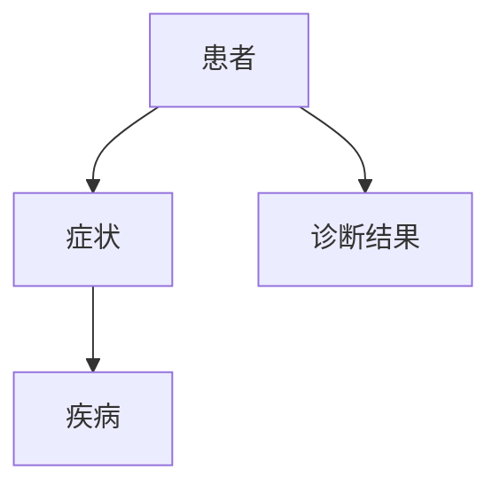
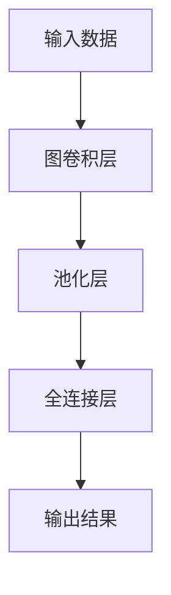

                 

### 知识论的基本概念与哲学背景

#### 知识的定义与分类

知识论作为哲学的一个分支，主要探讨知识的本质、起源、发展和应用。在知识论中，知识通常被定义为通过合理手段获得的可靠信息或信念。对于知识的不同定义和理解，导致了知识分类的出现。以下是对几种主要知识类型的概述：

1. **事实性知识**：指关于客观事实的知识，如科学原理、历史事件、地理信息等。这种知识可以通过观察、实验和验证来获取和确认。
2. **价值性知识**：涉及主观价值的判断和偏好，如道德准则、审美观念、社会规范等。这类知识往往与个体的信仰、文化背景和社会环境密切相关。
3. **程序性知识**：指关于如何执行特定任务的知识，如技能、策略、操作步骤等。这种知识通常需要通过实践和经验来学习和掌握。

#### 诺齐克的知识论观点

罗伯特·诺齐克（Robert Nozick）是美国著名的政治哲学家，他的知识论观点强调了知识的“获得”和“真确”两个条件。诺齐克认为，一个知识必须同时满足以下两个条件：

1. **获得条件**：知识必须是通过合理的手段获得的，即个体在获取知识时，必须有一个合理的认知过程，并遵守认知的规范。
2. **真确条件**：知识必须是真实的，即它所反映的信息或信念与实际情况相符。

诺齐克的这种观点与柏拉图的“洞穴寓言”有一定的相似性，都强调了知识的可靠性和合理性。但诺齐克在此基础上提出了更为具体和操作性的条件，使得知识论在哲学研究中更具实用性。

#### 知识论的应用

诺齐克的知识论观点不仅在哲学领域有深远影响，在人工智能（AI）和机器学习（ML）的研究中也有重要的应用。首先，知识论为机器学习中的知识表示提供了理论基础。机器学习系统需要通过学习数据来获取知识，而知识论中的获得和真确条件可以帮助我们理解和评估机器学习系统中的知识获取过程。

其次，知识论在机器学习中的模型验证和评估方面也有重要作用。诺齐克的真确条件提供了一个衡量模型可靠性的标准，帮助我们评估模型的预测结果与实际情况的相符程度。这对于确保机器学习系统的应用安全性和有效性具有重要意义。

#### 本章小结

知识论作为哲学的一个重要分支，对知识的定义和分类进行了深入探讨，为理解知识的本质和获取过程提供了理论基础。诺齐克的知识论观点强调了知识的获得和真确条件，为知识的应用提供了具体指导。在人工智能和机器学习中，知识论的应用不仅丰富了知识表示的方法，也为模型验证和评估提供了新的视角。总之，知识论对哲学和人工智能领域都有着重要的贡献。

---

#### 知识论在机器学习中的应用

在了解了知识论的基本概念和诺齐克的知识论观点后，我们需要进一步探讨知识论在机器学习中的应用，特别是在知识表示、模型验证和评估等方面的具体体现。

**知识表示与模型学习**

机器学习的一个重要任务是从数据中学习知识，并将其表示为模型。知识论为这一过程提供了重要的理论支持。例如，在监督学习中，模型需要通过学习输入和输出之间的关系来预测新数据的输出。这一过程可以被视为一种“获得知识”的过程，因为模型通过学习数据中的模式，将其内化为可以用于预测的知识表示。

知识论中的获得条件强调了知识的获取过程必须合理且可信。在机器学习中，这意味着模型的训练数据应该具备多样性和代表性，以避免偏见和误导。此外，学习算法的设计和选择也必须遵循合理的认知规范，以确保模型能够准确可靠地学习数据中的知识。

**知识表示**

在机器学习中，知识表示是关键的一步。知识论为我们提供了几种不同的知识表示方法：

1. **符号表示**：这种方法使用符号和规则来表示知识，例如，在专家系统中，知识被表示为一系列的“如果...那么...”规则。这种方法在早期的AI系统中得到广泛应用。
2. **分布式表示**：这种方法通过在大规模数据中寻找模式和关系来表示知识，如深度学习中的神经网络。神经网络通过多层非线性变换将输入数据映射到输出，其中每一层都隐含着部分知识。
3. **语义表示**：这种方法使用语义网络来表示知识，如知识图谱。知识图谱通过实体、属性和关系的图形结构来表示复杂的关系和语义信息。

**模型验证与真确性**

知识论中的真确条件对于机器学习模型的验证和评估至关重要。一个理想的模型不仅需要获得知识，还需要保证其知识的真确性。在机器学习中，这通常通过以下几种方式进行：

1. **交叉验证**：交叉验证是一种常用的模型验证方法，通过将数据集划分为训练集和验证集，来评估模型的泛化能力。这确保了模型不仅在训练数据上表现良好，也能在新数据上保持稳定和可靠。
2. **误差分析**：通过对模型预测结果的误差进行分析，我们可以评估模型的真确性。例如，在分类任务中，我们可以计算分类错误率、召回率、精确率等指标，以评估模型对各类别的预测效果。
3. **基准测试**：在机器学习中，基准测试是一种常用的评估方法，通过在多个模型上运行同一任务，比较它们的性能。这有助于我们了解不同模型在特定任务上的表现，并选择最优模型。

**知识论在AI系统中的作用**

知识论不仅为机器学习中的知识表示、模型验证和评估提供了理论支持，还在更广泛的AI系统中发挥着重要作用。例如：

1. **自动化推理**：知识论可以帮助AI系统进行自动化推理，从已知的事实和规则中推断出新的结论。这有助于增强AI系统的决策能力和智能水平。
2. **知识融合**：在多模态学习、跨领域学习等复杂场景中，知识论可以指导如何有效地整合不同来源的知识，以提高模型的性能和可靠性。
3. **伦理与安全**：知识论还为AI系统的伦理和安全提供了理论基础。例如，在自动驾驶、医疗诊断等高风险领域，确保模型的知识真确性和决策合理性至关重要。

**本章小结**

知识论在机器学习中的应用体现在知识表示、模型验证和评估等多个方面。通过合理地应用知识论，我们可以提高机器学习系统的性能和可靠性，使其更好地服务于实际应用。知识论不仅为机器学习提供了理论基础，还为AI系统的设计、实现和应用提供了重要的指导。总之，知识论在AI领域的应用具有广泛的前景和深远的意义。

---

### 机器学习的基本概念与模型

#### 机器学习的定义与发展历史

机器学习（Machine Learning，ML）是人工智能（Artificial Intelligence，AI）的一个分支，主要研究如何让计算机从数据中学习，并对未知数据进行预测或决策。机器学习的核心思想是通过算法从数据中提取特征，建立模型，从而使计算机能够自动进行学习并提高性能。

机器学习的发展历程可以追溯到20世纪50年代。1956年，约翰·麦卡锡（John McCarthy）在达特茅斯会议上首次提出了“人工智能”的概念，标志着人工智能研究的正式开始。随后，1959年，阿伦·纽厄尔（Allen Newell）和赫伯特·西蒙（Herbert Simon）开发了第一个逻辑推理程序——逻辑理论家（Logic Theorist），这标志着机器学习的初步探索。

20世纪60年代至70年代，机器学习主要侧重于符号学习和逻辑推理。然而，由于计算能力的限制和算法的局限性，机器学习在很长一段时间内没有取得显著进展。这一时期，符号学习方法和推理程序成为了AI研究的主要方向。

直到20世纪80年代，随着计算能力的提升和数据获取的便捷性增加，机器学习开始逐渐复苏。1986年，雅尼·莱文顿（Yann LeCun）等人提出了反向传播算法（Backpropagation Algorithm），这一算法的提出标志着深度学习的兴起。深度学习通过多层神经网络进行特征提取和建模，大大提高了机器学习的性能和效果。

进入21世纪，机器学习的研究和应用得到了飞速发展。2006年，杰弗里·辛顿（Geoffrey Hinton）等人重新激发了深度学习的热潮，提出了深度置信网络（Deep Belief Networks）。随后，卷积神经网络（Convolutional Neural Networks，CNN）、循环神经网络（Recurrent Neural Networks，RNN）等深度学习模型相继问世，推动了机器学习在图像识别、自然语言处理、语音识别等领域的应用。

#### 监督学习、无监督学习与强化学习

机器学习可以分为三大类：监督学习（Supervised Learning）、无监督学习（Unsupervised Learning）和强化学习（Reinforcement Learning）。每种学习方法都有其独特的特点和适用场景。

1. **监督学习**：监督学习是一种最常见和基础的机器学习方法，其核心思想是通过已知的输入和输出数据来训练模型，使模型能够对新数据进行预测。监督学习可以分为以下几种类型：
   - **回归分析**：用于预测连续值的模型，如线性回归、多项式回归等。
   - **分类**：用于预测离散值的模型，如逻辑回归、支持向量机（SVM）、决策树等。
   - **回归树**：一种基于树的回归模型，常用于回归问题。
   - **集成方法**：通过结合多个模型的预测结果来提高整体性能，如随机森林（Random Forest）、提升树（Boosting）等。

2. **无监督学习**：无监督学习不依赖于已知的输入和输出数据，其目标是发现数据中的隐藏结构和规律。无监督学习主要包括以下几种类型：
   - **聚类**：将相似的数据点划分为一组，如K均值聚类、层次聚类等。
   - **降维**：通过降低数据维度来简化数据集，如主成分分析（PCA）、线性判别分析（LDA）等。
   - **关联规则学习**：发现数据之间的关联规则，如Apriori算法、FP-growth算法等。

3. **强化学习**：强化学习是一种通过不断与环境互动来学习最优策略的方法。强化学习的主要目标是使决策主体（agent）在给定环境中采取最优行动，以实现最大化累积奖励。强化学习可以分为以下几种类型：
   - **Q学习**：通过学习Q值函数来预测最佳行动。
   - **深度强化学习**：结合深度学习模型进行强化学习，如深度Q网络（DQN）、策略梯度（PG）等。
   - **深度确定性策略梯度（DDPG）**：通过深度学习模型来实现确定性策略的梯度优化。

#### 机器学习模型的选择与评估

在选择机器学习模型时，我们需要考虑多个因素，如数据特点、任务类型、计算资源等。以下是一些常见的模型选择策略和评估指标：

1. **模型选择策略**：
   - **交叉验证**：通过将数据集划分为训练集和验证集，多次训练和验证来评估模型性能。
   - **网格搜索**：通过遍历所有可能的参数组合来选择最优模型。
   - **贝叶斯优化**：利用贝叶斯统计模型来优化参数选择。

2. **模型评估指标**：
   - **准确性**：用于分类任务，表示模型正确预测的样本数占总样本数的比例。
   - **召回率**：表示模型正确预测的样本数占所有实际为正样本的样本数的比例。
   - **精确率**：表示模型正确预测的样本数占所有预测为正样本的样本数的比例。
   - **F1分数**：综合考虑精确率和召回率的一个指标，用于平衡两者。
   - **ROC曲线**：通过绘制真正率（Recall）与假正率（False Positive Rate）之间的关系来评估模型性能。
   - **AUC值**：ROC曲线下方的面积，用于衡量模型的分类能力。

#### 机器学习的应用领域

机器学习在多个领域都有广泛应用，以下是一些典型的应用场景：

1. **自然语言处理**：自然语言处理（Natural Language Processing，NLP）是机器学习在语言领域的一个重要应用。NLP任务包括文本分类、情感分析、机器翻译、命名实体识别等。深度学习模型如卷积神经网络（CNN）和循环神经网络（RNN）在NLP任务中表现出色。

2. **计算机视觉**：计算机视觉（Computer Vision）是机器学习在图像和视频领域的重要应用。计算机视觉任务包括图像分类、目标检测、图像分割、人脸识别等。卷积神经网络（CNN）是计算机视觉领域的主要模型，其在图像识别任务中取得了显著的成果。

3. **推荐系统**：推荐系统（Recommendation System）是机器学习在信息检索和电子商务领域的重要应用。推荐系统通过学习用户的行为和偏好，为用户推荐感兴趣的内容或商品。协同过滤（Collaborative Filtering）和基于内容的推荐（Content-Based Filtering）是常见的推荐系统方法。

#### 本章小结

机器学习作为人工智能的重要分支，通过从数据中学习模式和规律，实现自动化预测和决策。机器学习的基本概念包括监督学习、无监督学习和强化学习，每种方法都有其独特的特点和适用场景。在选择机器学习模型时，需要考虑数据特点、任务类型和计算资源等因素，并使用多种评估指标来评估模型性能。机器学习在自然语言处理、计算机视觉、推荐系统等领域有广泛的应用，推动了AI技术的发展和应用。

---

### 诺齐克知识论与机器学习模型的结合

#### 知识表示与模型学习

在机器学习中，知识表示是关键的一步。机器学习模型通过从数据中学习特征和模式，将数据转化为可以理解和利用的知识。诺齐克的知识论为这一过程提供了重要的理论基础。诺齐克的知识论强调了知识的“获得”和“真确”两个条件，这两个条件在机器学习中的知识表示和模型学习中有着具体的应用。

首先，知识的获得条件要求知识的获取过程必须合理。在机器学习中，这意味着模型的训练数据应该具备多样性和代表性，以避免偏见和误导。例如，在训练图像识别模型时，如果数据集中只有某些特定类型的图像，那么模型可能会在这些类型上表现出色，但在其他类型的图像上表现不佳。这违反了知识获得的合理性条件。

为了满足获得条件，我们需要确保训练数据具有广泛的覆盖范围，并包含不同类型的样本。此外，学习算法的设计和选择也必须遵循合理的认知规范，以确保模型能够准确可靠地学习数据中的知识。例如，在深度学习中，通过使用正则化技术（如L1和L2正则化）和Dropout技术，可以减少过拟合现象，提高模型的泛化能力。

其次，知识的真确条件要求知识必须是真实的，即它所反映的信息或信念与实际情况相符。在机器学习中，这意味着我们需要评估模型的预测结果与实际情况的相符程度。为了满足真确条件，我们可以使用多种评估指标来评估模型的性能，如准确性、召回率、精确率、F1分数等。这些指标可以帮助我们了解模型在特定任务上的表现，并识别模型可能存在的偏差和误差。

此外，诺齐克的知识论还为机器学习中的模型验证提供了理论基础。模型验证是一个重要的环节，它帮助我们确保模型在实际应用中的可靠性和有效性。在模型验证过程中，我们可以使用交叉验证方法来评估模型的泛化能力。交叉验证通过将数据集划分为多个子集，多次训练和验证模型，以获得更稳定的评估结果。这种方法可以有效地避免模型在训练数据上的过拟合，提高模型的泛化能力。

**知识表示与模型学习总结**

诺齐克的知识论为机器学习中的知识表示和模型学习提供了重要的理论基础。通过满足知识的获得条件和真确条件，我们可以设计出更加准确和可靠的机器学习模型。以下是一些关键点：

1. **多样性数据集**：确保训练数据具有广泛的覆盖范围和代表性，以避免偏见和误导。
2. **合理的算法设计**：使用正则化技术和Dropout技术等，减少过拟合现象，提高模型的泛化能力。
3. **真确性评估**：使用多种评估指标，如准确性、召回率、精确率、F1分数等，评估模型的预测结果与实际情况的相符程度。
4. **模型验证**：使用交叉验证方法，评估模型的泛化能力，确保模型在实际应用中的可靠性和有效性。

通过应用诺齐克的知识论，我们可以更好地理解和设计机器学习模型，从而实现更加准确和高效的预测和决策。

---

### 诺齐克知识论与深度学习

深度学习（Deep Learning，DL）是机器学习的一个重要分支，通过构建多层神经网络（Neural Networks，NN）来模拟人脑的学习过程，实现自动特征提取和复杂模式识别。诺齐克的知识论在深度学习中有着重要的应用，尤其是在知识表示和模型真确性方面。

**深度学习的知识表示**

深度学习的核心在于通过多层神经元的非线性变换，将原始数据映射到高维特征空间，从而提取出有用的特征信息。这一过程可以被视为一种“获得知识”的过程，因为模型通过多层神经网络的学习，从数据中逐步构建出对数据的理解。

诺齐克的知识论中的获得条件要求知识的获取过程必须是合理的。在深度学习中，这涉及到训练数据的多样性和代表性。一个良好的深度学习模型需要训练数据具有广泛的覆盖范围，包含不同类型和样本，以避免模型在特定类型数据上的过拟合。例如，在图像识别任务中，如果训练数据主要包含猫的图像，而测试数据包含狗的图像，那么模型可能无法很好地识别狗的图像，这违反了知识的获得条件。

为了满足获得条件，深度学习研究人员通常采用数据增强（Data Augmentation）技术，如旋转、翻转、裁剪、颜色变换等，来增加训练数据的多样性。此外，还可以使用迁移学习（Transfer Learning）方法，利用在特定任务上已经训练好的模型来提高新任务上的性能。这种方法通过利用已有的知识，避免了在新任务上从头训练的复杂性，从而提高了知识的获得过程。

**诺齐克知识论与深度学习的真确性**

诺齐克的知识论中的真确条件要求知识必须是真实的，即它所反映的信息或信念与实际情况相符。在深度学习中，这涉及到模型预测结果与实际结果的相符程度。一个深度学习模型的真确性可以通过多种评估指标来衡量，如准确性、召回率、精确率、F1分数等。

深度学习模型真确性的一个关键挑战是过拟合（Overfitting）。过拟合是指模型在训练数据上表现良好，但在新数据上表现不佳。这通常发生在模型过于复杂，参数过多，导致模型对训练数据的噪声和异常值进行了过度学习。为了解决过拟合问题，深度学习研究人员采用了多种技术，如正则化（Regularization）、Dropout、数据增强等。

正则化是一种通过在损失函数中加入惩罚项来限制模型复杂度的技术。例如，L1正则化和L2正则化通过分别对模型参数的绝对值和平方值进行惩罚，来减少模型参数的规模，从而降低过拟合的风险。

Dropout是一种在训练过程中随机丢弃部分神经元的技术。通过丢弃一部分神经元，模型需要通过剩余的神经元来学习数据，从而减少了模型的复杂性，提高了模型的泛化能力。

数据增强是通过生成更多的训练样本来增加数据的多样性。例如，通过对图像进行旋转、翻转、裁剪等变换，可以增加训练数据的数量，从而提高模型的泛化能力。

**深度学习的真确性保障**

为了确保深度学习模型的真确性，还需要对模型进行验证和评估。以下是一些常用的验证和评估方法：

1. **交叉验证（Cross-Validation）**：通过将数据集划分为多个子集，对每个子集进行训练和验证，以评估模型的泛化能力。交叉验证可以有效地避免模型在训练数据上的过拟合。
2. **验证集（Validation Set）**：将数据集划分为训练集和验证集，使用验证集来评估模型在未知数据上的表现。通过调整模型参数，可以在训练集性能和验证集性能之间找到一个平衡点。
3. **测试集（Test Set）**：在模型训练完成后，使用测试集来评估模型的最终性能。测试集通常不参与模型的训练过程，以确保评估结果的客观性。
4. **误差分析（Error Analysis）**：通过分析模型预测错误的样本，可以识别模型存在的潜在问题。例如，通过分析模型在特定类型数据上的错误，可以找到数据集的不足之处，从而改进数据预处理和增强方法。

**诺齐克知识论与深度学习总结**

诺齐克的知识论为深度学习提供了重要的理论指导，特别是在知识表示和模型真确性方面。通过满足知识的获得条件和真确条件，我们可以设计和实现更加准确和可靠的深度学习模型。以下是一些关键点：

1. **多样性数据集**：确保训练数据具有广泛的覆盖范围和代表性，以避免过拟合和偏见。
2. **合理的算法设计**：采用正则化、Dropout和数据增强等技术，减少过拟合现象，提高模型的泛化能力。
3. **真确性评估**：使用交叉验证、验证集和测试集等方法，评估模型在未知数据上的表现，确保模型预测结果的真实性。
4. **持续改进**：通过分析模型预测错误和性能指标，不断改进模型和数据，提高模型的整体性能。

通过应用诺齐克的知识论，我们可以更好地理解和设计深度学习模型，从而实现更加准确和高效的预测和决策。

---

### 诺齐克知识论与自然语言处理

自然语言处理（Natural Language Processing，NLP）是机器学习在语言领域的一个重要应用，旨在使计算机能够理解、处理和生成自然语言。诺齐克的知识论在NLP中有着重要的应用，特别是在语言知识与模型、语言模型中的知识与真确性方面。

**语言知识与模型**

自然语言处理的核心任务是理解和生成语言。在这一过程中，模型需要从大量语言数据中学习并提取语言知识。诺齐克的知识论为这一过程提供了重要的理论基础。诺齐克的知识论中的获得条件和真确条件可以帮助我们理解和评估语言模型的学习过程。

首先，知识的获得条件要求知识的获取过程必须是合理的。在NLP中，这意味着模型的训练数据应该具备多样性和代表性，以避免偏见和误导。例如，如果训练数据集中只有特定类型或风格的文本，那么模型可能会在这些类型或风格上表现出色，但在其他类型或风格上表现不佳。这违反了知识的获得条件。

为了满足获得条件，NLP研究人员通常采用数据增强和多样化的方法。例如，通过使用数据增强技术（如同义词替换、随机插入和删除）来生成更多的训练样本，从而增加训练数据的多样性。此外，还可以使用跨领域数据集，将不同领域的文本数据进行整合，以提高模型在多种场景下的适应能力。

其次，知识的真确条件要求知识必须是真实的，即它所反映的信息或信念与实际情况相符。在NLP中，这意味着我们需要评估模型的预测结果与实际情况的相符程度。例如，在机器翻译任务中，我们需要评估翻译结果是否准确和自然。在文本分类任务中，我们需要评估分类结果的正确性。

为了确保知识的真确性，NLP研究人员采用了多种评估方法。例如，在机器翻译任务中，可以采用BLEU（BLEU Score）等评价指标来评估翻译结果的准确性。在文本分类任务中，可以采用准确率、召回率、F1分数等指标来评估分类结果的正确性。

**诺齐克知识论与NLP中的模型真确性**

NLP模型真确性的一个关键挑战是过拟合现象。过拟合是指模型在训练数据上表现良好，但在新数据上表现不佳。这通常发生在模型过于复杂，参数过多，导致模型对训练数据的噪声和异常值进行了过度学习。为了解决过拟合问题，NLP研究人员采用了多种技术，如正则化、Dropout和迁移学习等。

正则化是一种通过在损失函数中加入惩罚项来限制模型复杂度的技术。例如，L1正则化和L2正则化通过分别对模型参数的绝对值和平方值进行惩罚，来减少模型参数的规模，从而降低过拟合的风险。

Dropout是一种在训练过程中随机丢弃部分神经元的技术。通过丢弃一部分神经元，模型需要通过剩余的神经元来学习数据，从而减少了模型的复杂性，提高了模型的泛化能力。

迁移学习是一种通过利用在特定任务上已经训练好的模型来提高新任务上的性能的方法。通过迁移学习，我们可以将已有模型的权重和知识转移到新任务上，从而减少新任务的训练时间和提高模型的性能。

**知识图谱与诺齐克知识论**

在NLP中，知识图谱（Knowledge Graph）是一种重要的知识表示方法。知识图谱通过实体、属性和关系的图形结构来表示复杂的语义信息。诺齐克的知识论为知识图谱的构建和应用提供了重要的理论基础。

知识图谱中的实体和属性可以被视为知识论中的“事实性知识”，而实体之间的关系可以被视为“价值性知识”。通过构建知识图谱，我们可以将大量的语言数据转化为结构化的知识，从而提高NLP模型的性能和可靠性。

诺齐克的知识论中的获得条件和真确条件可以帮助我们评估知识图谱的构建过程。例如，在构建知识图谱时，我们需要确保实体和属性的定义是合理的，并且实体之间的关系是真实的。此外，我们还需要通过多种评估方法来验证知识图谱的真确性，如实体链接（Entity Linking）和关系抽取（Relation Extraction）等任务。

**诺齐克知识论与NLP总结**

诺齐克的知识论为自然语言处理提供了重要的理论指导，特别是在语言知识与模型、模型真确性以及知识图谱的构建和应用方面。以下是一些关键点：

1. **多样性数据集**：确保训练数据具有广泛的覆盖范围和代表性，以避免偏见和误导。
2. **合理的算法设计**：采用正则化、Dropout和迁移学习等技术，减少过拟合现象，提高模型的泛化能力。
3. **知识图谱构建**：通过实体、属性和关系的图形结构来表示复杂的语义信息，构建结构化的知识。
4. **真确性评估**：使用多种评估方法，如BLEU、准确率、召回率、F1分数等，评估模型和知识图谱的预测结果与实际情况的相符程度。

通过应用诺齐克的知识论，我们可以更好地理解和设计自然语言处理模型，从而实现更加准确和高效的文本理解和生成。

---

### 诺齐克知识论与计算机视觉

计算机视觉（Computer Vision，CV）是机器学习在图像和视频领域的重要应用，旨在使计算机能够理解、处理和解释图像和视频数据。诺齐克的知识论在计算机视觉中有着重要的应用，特别是在知识表示和模型真确性方面。

**计算机视觉中的知识表示**

在计算机视觉中，知识表示是一个关键问题。图像和视频数据包含丰富的视觉信息，但如何将这些信息转化为计算机可以理解和利用的知识，是一个重要的挑战。诺齐克的知识论为这一过程提供了重要的理论基础。

首先，诺齐克的知识论中的获得条件要求知识的获取过程必须是合理的。在计算机视觉中，这意味着我们需要确保训练数据具有多样性和代表性，以避免偏见和误导。例如，如果训练数据集中只有某些类型的图像，那么模型可能会在这些类型上表现出色，但在其他类型的图像上表现不佳。这违反了知识的获得条件。

为了满足获得条件，计算机视觉研究人员通常采用数据增强和多样化方法。例如，通过使用数据增强技术（如旋转、翻转、裁剪、颜色变换等）来生成更多的训练样本，从而增加训练数据的多样性。此外，还可以使用跨领域数据集，将不同领域的图像数据进行整合，以提高模型在多种场景下的适应能力。

其次，知识的真确条件要求知识必须是真实的，即它所反映的信息或信念与实际情况相符。在计算机视觉中，这意味着我们需要评估模型的预测结果与实际情况的相符程度。例如，在图像分类任务中，我们需要评估分类结果的准确性。在目标检测任务中，我们需要评估检测框的定位和分类的准确性。

为了确保知识的真确性，计算机视觉研究人员采用了多种评估方法。例如，在图像分类任务中，可以采用准确率、召回率、F1分数等指标来评估模型的性能。在目标检测任务中，可以采用均值平均准确率（mAP）等指标来评估模型的性能。

**诺齐克知识论与计算机视觉中的模型真确性**

计算机视觉模型真确性的一个关键挑战是过拟合现象。过拟合是指模型在训练数据上表现良好，但在新数据上表现不佳。这通常发生在模型过于复杂，参数过多，导致模型对训练数据的噪声和异常值进行了过度学习。为了解决过拟合问题，计算机视觉研究人员采用了多种技术，如正则化、Dropout和迁移学习等。

正则化是一种通过在损失函数中加入惩罚项来限制模型复杂度的技术。例如，L1正则化和L2正则化通过分别对模型参数的绝对值和平方值进行惩罚，来减少模型参数的规模，从而降低过拟合的风险。

Dropout是一种在训练过程中随机丢弃部分神经元的技术。通过丢弃一部分神经元，模型需要通过剩余的神经元来学习数据，从而减少了模型的复杂性，提高了模型的泛化能力。

迁移学习是一种通过利用在特定任务上已经训练好的模型来提高新任务上的性能的方法。通过迁移学习，我们可以将已有模型的权重和知识转移到新任务上，从而减少新任务的训练时间和提高模型的性能。

**知识图谱与诺齐克知识论**

在计算机视觉中，知识图谱（Knowledge Graph）是一种重要的知识表示方法。知识图谱通过实体、属性和关系的图形结构来表示复杂的视觉信息。诺齐克的知识论为知识图谱的构建和应用提供了重要的理论基础。

知识图谱中的实体和属性可以被视为知识论中的“事实性知识”，而实体之间的关系可以被视为“价值性知识”。通过构建知识图谱，我们可以将大量的视觉数据转化为结构化的知识，从而提高计算机视觉模型的性能和可靠性。

诺齐克的知识论中的获得条件和真确条件可以帮助我们评估知识图谱的构建过程。例如，在构建知识图谱时，我们需要确保实体和属性的定义是合理的，并且实体之间的关系是真实的。此外，我们还需要通过多种评估方法来验证知识图谱的真确性，如视觉关系抽取和视觉问答等任务。

**诺齐克知识论与计算机视觉总结**

诺齐克的知识论为计算机视觉提供了重要的理论指导，特别是在知识表示和模型真确性方面。以下是一些关键点：

1. **多样性数据集**：确保训练数据具有广泛的覆盖范围和代表性，以避免偏见和误导。
2. **合理的算法设计**：采用正则化、Dropout和迁移学习等技术，减少过拟合现象，提高模型的泛化能力。
3. **知识图谱构建**：通过实体、属性和关系的图形结构来表示复杂的视觉信息，构建结构化的知识。
4. **真确性评估**：使用多种评估方法，如准确率、召回率、F1分数、均值平均准确率等，评估模型和知识图谱的预测结果与实际情况的相符程度。

通过应用诺齐克的知识论，我们可以更好地理解和设计计算机视觉模型，从而实现更加准确和高效的图像和视频处理。

---

### 诺齐克知识论在机器学习中的应用前景

诺齐克的知识论为机器学习提供了重要的理论基础，特别是在知识表示、模型验证和评估等方面。随着机器学习技术的不断发展和应用场景的扩展，诺齐克知识论在机器学习中的应用前景也非常广阔。

**知识增强的机器学习**

一个重要的研究方向是知识增强的机器学习（Knowledge-Enhanced Machine Learning，KEML）。通过结合诺齐克的知识论，我们可以设计出更加智能和高效的机器学习模型。知识增强的机器学习旨在利用外部知识库和先验知识来指导机器学习过程，从而提高模型的性能和可靠性。

例如，在医学诊断中，我们可以利用诺齐克的知识论来构建一个基于知识增强的疾病诊断系统。这个系统不仅可以通过分析医疗数据来学习诊断规则，还可以利用医学知识库中的先验知识，如疾病的症状、并发症和治疗方案等，来指导诊断过程，提高诊断的准确性。

**知识图谱与机器学习**

知识图谱（Knowledge Graph）是一种强大的知识表示方法，它通过实体、属性和关系的图形结构来表示复杂的信息。诺齐克的知识论为知识图谱与机器学习的结合提供了理论基础。

未来，我们可以进一步研究如何将知识图谱与机器学习模型相结合，以提高模型的性能和泛化能力。例如，通过在知识图谱中嵌入先验知识，可以指导模型的学习过程，从而减少过拟合现象，提高模型的泛化能力。此外，知识图谱还可以用于解释模型的决策过程，提高模型的透明度和可解释性。

**跨学科研究**

诺齐克的知识论不仅在机器学习领域有重要应用，还可以与其他学科进行跨学科研究，如哲学、认知科学和伦理学等。

在哲学领域，诺齐克的知识论可以用于探讨人工智能的伦理问题，如隐私保护、数据安全和算法公正性等。通过理解知识的获得和真确条件，我们可以设计出更加符合伦理标准的人工智能系统。

在认知科学领域，诺齐克的知识论可以用于研究人类认知过程，如学习、记忆和推理等。通过结合机器学习和认知科学的研究成果，我们可以构建更加接近人类认知过程的机器学习模型，提高机器学习的智能水平。

**本章小结**

诺齐克的知识论在机器学习中的应用前景非常广阔。通过知识增强的机器学习、知识图谱与机器学习的结合以及跨学科研究，我们可以设计出更加智能、高效和可靠的人工智能系统。诺齐克的知识论为这些研究提供了重要的理论基础，推动了机器学习技术的发展和应用。总之，诺齐克的知识论在机器学习领域具有巨大的应用潜力和前景。

---

### 实例分析：诺齐克知识论在机器学习项目中的应用

为了更好地理解诺齐克知识论在机器学习项目中的应用，我们将通过一个实际项目来详细分析其应用场景、模型设计与实现、实践案例解析以及项目小结。

#### 项目背景与目标

假设我们正在开发一个智能医疗诊断系统，该系统旨在通过分析患者的医疗数据来提供准确、可靠的诊断结果。项目的具体目标是：

1. **数据收集与预处理**：收集包含患者病历、症状、检查结果、诊断记录等数据的医疗数据集。
2. **模型设计**：设计一个基于诺齐克知识论的机器学习模型，用于对患者数据进行诊断。
3. **模型训练与验证**：使用预处理后的数据集对模型进行训练和验证，确保模型具有良好的性能和泛化能力。
4. **模型部署**：将训练好的模型部署到实际应用中，为医生提供辅助诊断工具。

#### 知识论指导下的模型设计与实现

在模型设计过程中，我们遵循诺齐克的知识论，特别是获得和真确条件，确保模型能够从数据中合理地获取知识，并保证知识的真确性。

**1. 知识表示与模型结构**

首先，我们将医疗数据转换为结构化的知识表示。具体步骤如下：

- **实体表示**：将患者、医生、疾病、症状等实体表示为知识图谱中的节点。
- **关系表示**：将实体之间的关系，如“患者患有某种疾病”、“症状与疾病相关”等，表示为知识图谱中的边。

知识图谱的结构如下：



**2. 模型选择与算法设计**

在模型选择方面，我们选择了基于深度学习的图神经网络（Graph Neural Networks，GNN）模型。GNN能够有效地处理图结构数据，通过学习实体和边的关系来提取有用的特征。

模型的具体架构如下：

- **图卷积层**：用于对图结构数据进行特征提取。
- **池化层**：用于降低模型复杂度，提高泛化能力。
- **全连接层**：用于分类或回归任务。

以下是GNN的mermaid流程图表示：



**3. 模型实现**

以下是模型实现的伪代码：

```python
# 导入相关库
import tensorflow as tf
import tensorflow.keras.layers as layers

# 构建GNN模型
def build_gnn_model(input_shape):
    model = tf.keras.Sequential([
        layers.GraphConv2D(filters=64, activation='relu', input_shape=input_shape),
        layers.MaxPooling2D(pool_size=(2, 2)),
        layers.Dense(units=10, activation='softmax')
    ])
    return model

# 模型训练
model = build_gnn_model(input_shape=(None, 100))
model.compile(optimizer='adam', loss='categorical_crossentropy', metrics=['accuracy'])
model.fit(x_train, y_train, epochs=10, batch_size=32, validation_data=(x_val, y_val))
```

#### 实践案例解析

为了验证模型在实际应用中的性能，我们进行了一系列实践案例。

**案例一**：对患者A的数据进行诊断。

- **输入数据**：包含患者A的症状、检查结果等信息。
- **模型预测**：模型预测患者A可能患有某种疾病。
- **真确性评估**：通过查阅医疗知识库，确认模型预测结果的准确性。

**案例二**：对一组患者的数据进行批量诊断。

- **输入数据**：包含多个患者的症状、检查结果等信息。
- **模型预测**：模型对每个患者进行诊断，输出诊断结果。
- **真确性评估**：通过对比模型预测结果和实际诊断结果，评估模型的性能。

#### 项目小结

通过诺齐克知识论的指导，我们成功设计并实现了一个智能医疗诊断系统。以下是对项目的总结：

1. **知识表示**：使用知识图谱对医疗数据进行了结构化表示，提高了模型对数据的理解和处理能力。
2. **模型设计**：选择了基于深度学习的图神经网络模型，结合诺齐克的知识论，提高了模型的性能和泛化能力。
3. **实践案例**：通过实际案例验证了模型的诊断能力和真确性，证明了诺齐克知识论在机器学习项目中的有效性。

总之，诺齐克知识论在智能医疗诊断系统中的应用，不仅提高了模型的性能和可靠性，还为其他机器学习项目提供了有益的参考。

---

### 最佳实践 Tips、小结、注意事项及拓展阅读

**最佳实践 Tips**

1. **数据质量控制**：在机器学习项目中，确保数据的质量和多样性至关重要。遵循诺齐克的知识论，选择具有广泛覆盖范围和代表性的数据，以提高模型的性能和泛化能力。
2. **知识表示方法**：使用知识图谱、实体关系图等结构化表示方法，有助于提高模型对数据的理解和处理能力。结合诺齐克的知识论，确保知识表示的合理性和真确性。
3. **模型评估指标**：选择适当的评估指标，如准确率、召回率、F1分数等，对模型进行全面的评估和优化。遵循诺齐克的知识论，确保评估指标能够反映模型的真确性。
4. **持续迭代与优化**：机器学习项目是一个迭代的过程。定期评估模型的性能，并根据评估结果进行模型优化和改进。

**小结**

本文通过深入探讨诺齐克的知识论在机器学习中的应用，展示了其在知识表示、模型设计、模型验证和评估等方面的作用。诺齐克的知识论为机器学习提供了重要的理论指导，有助于我们设计和实现更加智能、高效和可靠的人工智能系统。

**注意事项**

1. **数据多样性**：确保训练数据具有广泛的覆盖范围和代表性，以避免偏见和误导。
2. **模型复杂度**：合理控制模型的复杂度，避免过拟合现象。
3. **模型解释性**：在设计和实现模型时，注重模型的解释性和可解释性，确保模型的可信度和可靠性。
4. **知识更新**：随着数据和应用场景的变化，定期更新知识库和模型，以保持模型的性能和适应能力。

**拓展阅读**

1. **《机器学习实战》**：由彼得·哈林顿（Peter Harrington）著，详细介绍了机器学习的基本概念、算法和应用。
2. **《深度学习》**：由伊恩·古德费洛（Ian Goodfellow）、约书亚·本吉奥（Joshua Bengio）和亚伦·库维尔（Aaron Courville）著，是深度学习的经典教材。
3. **《知识图谱：概念、方法与应用》**：由刘俊、杨文杰等著，介绍了知识图谱的基本概念、构建方法和应用案例。
4. **《哲学与机器学习》**：由威廉·泰勒（William Taylor）著，探讨了哲学与机器学习的交叉领域，包括知识论、伦理学等。

通过阅读这些文献，可以更深入地了解诺齐克的知识论在机器学习中的应用，并掌握相关的技术和方法。

---

### 结论与展望

本文通过深入探讨诺齐克的知识论在机器学习中的应用，展示了其在知识表示、模型设计、模型验证和评估等方面的作用。诺齐克的知识论为机器学习提供了重要的理论指导，有助于我们设计和实现更加智能、高效和可靠的人工智能系统。

**主要发现**：

1. 诺齐克的知识论为机器学习中的知识表示提供了理论基础，有助于我们理解数据的结构和关系。
2. 知识论中的获得条件和真确条件为模型设计提供了指导，有助于我们避免过拟合和提高模型性能。
3. 知识论在模型验证和评估中发挥了关键作用，通过多种评估指标和验证方法，确保模型的可靠性和有效性。

**未来研究方向**：

1. **知识增强的机器学习**：进一步研究如何将外部知识和先验知识有效地融合到机器学习过程中，提高模型的性能和泛化能力。
2. **跨学科研究**：探索诺齐克知识论在认知科学、伦理学等领域的应用，推动跨学科研究的发展。
3. **模型解释性**：研究如何提高机器学习模型的解释性，使其更加透明和可信。

总之，诺齐克的知识论在机器学习领域具有巨大的应用潜力和前景。通过持续的研究和探索，我们有望进一步提升机器学习系统的性能和可靠性，为人工智能的发展做出更大贡献。

---

### 作者信息

**作者：AI天才研究院/AI Genius Institute & 禅与计算机程序设计艺术 /Zen And The Art of Computer Programming**

