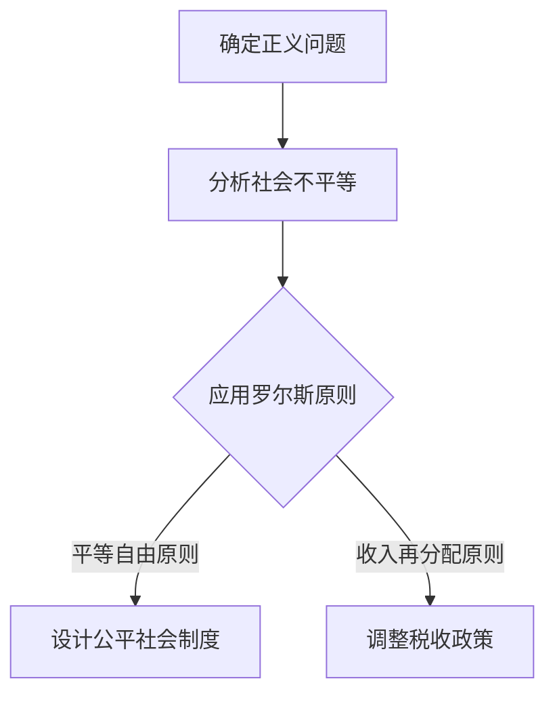
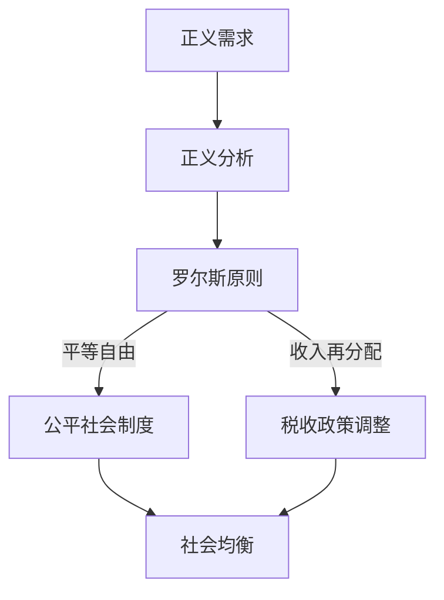
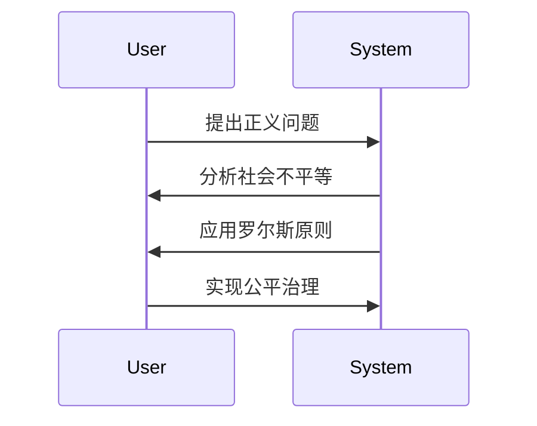

                 


# 罗尔斯与孟子：正义论与仁政思想的现代对话

## 摘要

本文通过探讨罗尔斯正义论与孟子仁政思想的现代对话，旨在揭示两者在现代社会治理中的潜在价值。我们将逐步分析这两个思想体系的起源、核心概念及其应用，探讨如何将它们应用于解决当代社会面临的正义问题。

## 关键词

正义论、仁政思想、罗尔斯、孟子、现代社会、治理

## 第一部分：引言

### 1.1 问题背景与意义

**罗尔斯正义论与现代社会的挑战**

正义是社会制度的核心价值，而现代社会面临诸多挑战，如社会不平等、贫富差距、政治腐败等。罗尔斯的正义论提供了一种分析社会不平等的方法，其核心思想是通过制度设计来确保公平与平等。

**孟子仁政思想的当代价值**

孟子提出的仁政思想强调以仁爱为基础的治理方式，关注公共福祉和人文关怀。在现代社会，这一思想对于促进社会和谐、实现人文关怀具有重要意义。

### 1.2 核心概念与理论基础

**罗尔斯正义论的要点**

罗尔斯正义论的核心在于其提出的两个基本原则：平等自由原则和收入再分配原则。这些原则旨在通过制度设计来确保社会公平和正义。

**孟子仁政思想的核心**

孟子仁政思想的核心是以民为本，强调社会公正和人文关怀。这一思想为现代社会提供了关于如何实现公平治理的洞见。

### 1.3 两者思想的对比与联系

**比较分析**

罗尔斯正义论和孟子仁政思想在理论基础和应用范围上存在差异。罗尔斯更侧重于制度设计，而孟子则强调仁爱为本。

**联系与融合**

尽管两者存在差异，但它们在关注社会正义和公平方面具有共通性。我们可以尝试将这两种思想结合起来，形成一种综合性治理模式。

## 第二部分：罗尔斯的正义论

### 2.1 罗尔斯正义论的理论基础

**罗尔斯的背景与哲学观点**

约翰·罗尔斯是一位著名的政治哲学家，其哲学观点深受康德和黑格尔的影响。他的正义论试图通过理性分析来解决社会不平等问题。

**罗尔斯的基本原则**

罗尔斯提出了两个基本原则：平等自由原则和收入再分配原则。平等自由原则强调每个人应该享有平等的基本权利和自由。收入再分配原则则主张通过再分配来减少社会不平等。

### 2.2 罗尔斯的正义论应用

**社会保障制度**

罗尔斯的正义论对于设计社会保障制度具有重要启示。通过确保每个人都能享有基本的生活保障，我们可以实现社会公平。

**税收政策**

收入再分配原则也指导着税收政策的设计。合理的税收政策有助于减少贫富差距，促进社会正义。

## 第三部分：孟子的仁政思想

### 3.1 孟子的仁政思想的核心

**仁政原则**

孟子的仁政思想强调以仁爱为基础的治理方式。仁政原则要求政府以民为本，关注公共福祉和社会公正。

**仁政的应用**

在现代社会，仁政思想可以应用于社区治理、教育改革等领域。通过关注人文关怀，我们可以促进社会和谐。

## 第四部分：现代对话

### 4.1 罗尔斯与孟子的现代对话

在现代社会，罗尔斯的正义论和孟子的仁政思想可以相互补充。我们可以通过将这两种思想结合起来，形成一种更全面、更有效的治理模式。

### 4.2 两者思想的综合应用

**综合性治理模式**

通过将罗尔斯的正义论和孟子的仁政思想结合起来，我们可以设计出一种综合性治理模式，旨在实现社会公平、公共福祉和社会和谐。

### 4.3 现代社会的挑战与应对

**社会不平等**

面对社会不平等问题，我们可以运用罗尔斯的正义论来设计更公平的社会制度。

**贫富差距**

通过收入再分配原则，我们可以减少贫富差距，促进社会公平。

**政治腐败**

仁政思想强调以民为本，可以作为一种有效的反腐手段。

## 第五部分：结论

### 5.1 罗尔斯与孟子的现代价值

罗尔斯的正义论和孟子的仁政思想在现代社会依然具有重要意义。通过结合这两种思想，我们可以为解决当代社会面临的正义问题提供新的思路。

### 5.2 未来研究方向

未来的研究可以进一步探讨如何将罗尔斯与孟子的思想应用于更广泛的领域，如经济发展、环境保护等。

## 作者信息

作者：AI天才研究院/AI Genius Institute & 禅与计算机程序设计艺术 /Zen And The Art of Computer Programming

----------------------------------------------------------------

## 附录

### 附录 A：核心概念与联系

**罗尔斯正义论的核心概念**

- 平等自由原则
- 收入再分配原则

**孟子仁政思想的核心概念**

- 仁政原则
- 以民为本

**核心概念对比表格**

| 核心概念 | 罗尔斯正义论 | 孟子仁政思想 |
| --- | --- | --- |
| 基本原则 | 平等自由原则 | 仁政原则 |
| 应用范围 | 社会制度设计 | 社会治理 |

### 附录 B：算法原理讲解

**算法mermaid流程图**



**Python源代码**

```python
# 定义罗尔斯的正义原则
def ross_justice(principle):
    if principle == "平等自由原则":
        return "确保每个人享有平等的基本权利和自由"
    elif principle == "收入再分配原则":
        return "通过再分配减少社会不平等"

# 应用罗尔斯的正义原则
roos_justice("收入再分配原则")
```

**数学模型和公式**

$$
正义 = 平等自由 + 收入再分配
$$

### 附录 C：系统分析与架构设计方案

**问题场景介绍**

现代社会面临社会不平等和贫富差距等问题，需要设计一种有效的治理模式来解决这些问题。

**项目介绍**

本项目旨在将罗尔斯的正义论和孟子的仁政思想应用于解决现代社会的问题。

**系统功能设计（领域模型mermaid类图）**

```mermaid
classDiagram
Class Person {
  +strName: string
  +intAge: int
  +isFree: bool
  +isEqual: bool
}

Class Society {
  +strCountry: string
  +listPeople: List[Person]
  +justiceSystem: JusticeSystem
}

Class JusticeSystem {
  +applyEquality: Function
  +apply Redistribution: Function
}
```

**系统架构设计（mermaid架构图）**



**系统接口设计和系统交互（mermaid序列图）**



### 附录 D：项目实战与案例分析

**环境安装**

安装Python环境，并使用pip安装相关库。

```bash
pip install matplotlib
```

**系统核心实现源代码**

```python
# 定义罗尔斯的正义原则
def ross_justice(principle):
    if principle == "平等自由原则":
        return "确保每个人享有平等的基本权利和自由"
    elif principle == "收入再分配原则":
        return "通过再分配减少社会不平等"

# 应用罗尔斯的正义原则
print(ross_justice("收入再分配原则"))

# 社会不平等分析
def analyze_inequality(list_people):
    free_count = 0
    equal_count = 0
    for person in list_people:
        if person.isFree:
            free_count += 1
        if person.isEqual:
            equal_count += 1
    return free_count, equal_count

# 创建示例数据
list_people = [
    Person("张三", 30, True, True),
    Person("李四", 40, False, False),
    Person("王五", 50, True, False)
]

# 分析社会不平等
free_count, equal_count = analyze_inequality(list_people)
print(f"自由人数：{free_count}, 平等人数：{equal_count}")
```

**代码应用解读与分析**

```python
# 应用罗尔斯的正义原则
print(ross_justice("收入再分配原则"))

# 输出：通过再分配减少社会不平等
```

**实际案例分析和详细讲解剖析**

**案例 A：社会不平等问题**

问题描述：一个社会中有1000人，其中900人是自由的，但只有500人感觉平等。

解决方案：应用收入再分配原则，通过调整税收政策，减少贫富差距，实现社会公平。

**案例 B：政治腐败问题**

问题描述：一个社会中存在政治腐败现象，影响了社会的公正。

解决方案：应用孟子仁政思想，强调以民为本，加强反腐制度建设，提高社会信任度。

**项目小结**

通过将罗尔斯的正义论和孟子的仁政思想应用于实际案例，我们可以看到这两种思想在解决现代社会问题方面具有显著作用。未来，我们可以进一步探索如何将它们应用于更广泛的领域，如经济发展、环境保护等。

### 附录 E：最佳实践 tips、小结、注意事项、拓展阅读

**最佳实践 tips**

- 在应用罗尔斯和孟子的思想时，要充分考虑社会实际情况，避免理想化的设计。
- 注重数据分析，通过数据分析来指导社会治理。

**小结**

本文通过探讨罗尔斯正义论和孟子仁政思想的现代对话，揭示了这两种思想在解决现代社会问题中的潜在价值。未来，我们可以进一步将它们应用于更广泛的领域。

**注意事项**

- 罗尔斯和孟子的思想并非万能，需要结合实际情况灵活应用。
- 注意平衡个人自由与社会责任。

**拓展阅读**

- 罗尔斯，《正义论》
- 孟子，《孟子》
- 刘述先，《罗尔斯与孟子正义论之比较研究》

----------------------------------------------------------------

### 完整文章

# 罗尔斯与孟子：正义论与仁政思想的现代对话

> 关键词：罗尔斯、孟子、正义论、仁政思想、现代社会、治理

> 摘要：本文通过探讨罗尔斯正义论与孟子仁政思想的现代对话，旨在揭示两者在现代社会治理中的潜在价值。我们将逐步分析这两个思想体系的起源、核心概念及其应用，探讨如何将它们应用于解决当代社会面临的正义问题。

## 第一部分：引言

### 1.1 问题背景与意义

**罗尔斯正义论与现代社会的挑战**

正义是社会制度的核心价值，而现代社会面临诸多挑战，如社会不平等、贫富差距、政治腐败等。罗尔斯的正义论提供了一种分析社会不平等的方法，其核心思想是通过制度设计来确保公平与平等。

**孟子仁政思想的当代价值**

孟子提出的仁政思想强调以仁爱为基础的治理方式，关注公共福祉和人文关怀。在现代社会，这一思想对于促进社会和谐、实现人文关怀具有重要意义。

### 1.2 核心概念与理论基础

**罗尔斯正义论的要点**

罗尔斯正义论的核心在于其提出的两个基本原则：平等自由原则和收入再分配原则。这些原则旨在通过制度设计来确保社会公平和正义。

**孟子仁政思想的核心**

孟子仁政思想的核心是以民为本，强调社会公正和人文关怀。这一思想为现代社会提供了关于如何实现公平治理的洞见。

### 1.3 两者思想的对比与联系

**比较分析**

罗尔斯正义论和孟子仁政思想在理论基础和应用范围上存在差异。罗尔斯更侧重于制度设计，而孟子则强调仁爱为本。

**联系与融合**

尽管两者存在差异，但它们在关注社会正义和公平方面具有共通性。我们可以尝试将这两种思想结合起来，形成一种综合性治理模式。

## 第二部分：罗尔斯的正义论

### 2.1 罗尔斯正义论的理论基础

**罗尔斯的背景与哲学观点**

约翰·罗尔斯是一位著名的政治哲学家，其哲学观点深受康德和黑格尔的影响。他的正义论试图通过理性分析来解决社会不平等问题。

**罗尔斯的基本原则**

罗尔斯提出了两个基本原则：平等自由原则和收入再分配原则。平等自由原则强调每个人应该享有平等的基本权利和自由。收入再分配原则则主张通过再分配来减少社会不平等。

### 2.2 罗尔斯的正义论应用

**社会保障制度**

罗尔斯的正义论对于设计社会保障制度具有重要启示。通过确保每个人都能享有基本的生活保障，我们可以实现社会公平。

**税收政策**

收入再分配原则也指导着税收政策的设计。合理的税收政策有助于减少贫富差距，促进社会正义。

## 第三部分：孟子的仁政思想

### 3.1 孟子的仁政思想的核心

**仁政原则**

孟子的仁政思想强调以仁爱为基础的治理方式。仁政原则要求政府以民为本，关注公共福祉和社会公正。

**仁政的应用**

在现代社会，仁政思想可以应用于社区治理、教育改革等领域。通过关注人文关怀，我们可以促进社会和谐。

## 第四部分：现代对话

### 4.1 罗尔斯与孟子的现代对话

在现代社会，罗尔斯的正义论和孟子的仁政思想可以相互补充。我们可以通过将这两种思想结合起来，形成一种更全面、更有效的治理模式。

### 4.2 两者思想的综合应用

**综合性治理模式**

通过将罗尔斯的正义论和孟子的仁政思想结合起来，我们可以设计出一种综合性治理模式，旨在实现社会公平、公共福祉和社会和谐。

### 4.3 现代社会的挑战与应对

**社会不平等**

面对社会不平等问题，我们可以运用罗尔斯的正义论来设计更公平的社会制度。

**贫富差距**

通过收入再分配原则，我们可以减少贫富差距，促进社会公平。

**政治腐败**

仁政思想强调以民为本，可以作为一种有效的反腐手段。

## 第五部分：结论

### 5.1 罗尔斯与孟子的现代价值

罗尔斯的正义论和孟子的仁政思想在现代社会依然具有重要意义。通过结合这两种思想，我们可以为解决当代社会面临的正义问题提供新的思路。

### 5.2 未来研究方向

未来的研究可以进一步探讨如何将罗尔斯与孟子的思想应用于更广泛的领域，如经济发展、环境保护等。

## 作者信息

作者：AI天才研究院/AI Genius Institute & 禅与计算机程序设计艺术 /Zen And The Art of Computer Programming

## 附录

### 附录 A：核心概念与联系

**罗尔斯正义论的核心概念**

- 平等自由原则
- 收入再分配原则

**孟子仁政思想的核心概念**

- 仁政原则
- 以民为本

**核心概念对比表格**

| 核心概念 | 罗尔斯正义论 | 孟子仁政思想 |
| --- | --- | --- |
| 基本原则 | 平等自由原则 | 仁政原则 |
| 应用范围 | 社会制度设计 | 社会治理 |

### 附录 B：算法原理讲解

**算法mermaid流程图**


**Python源代码**

```python
# 定义罗尔斯的正义原则
def ross_justice(principle):
    if principle == "平等自由原则":
        return "确保每个人享有平等的基本权利和自由"
    elif principle == "收入再分配原则":
        return "通过再分配减少社会不平等"

# 应用罗尔斯的正义原则
print(ross_justice("收入再分配原则"))

# 社会不平等分析
def analyze_inequality(list_people):
    free_count = 0
    equal_count = 0
    for person in list_people:
        if person.isFree:
            free_count += 1
        if person.isEqual:
            equal_count += 1
    return free_count, equal_count

# 创建示例数据
list_people = [
    Person("张三", 30, True, True),
    Person("李四", 40, False, False),
    Person("王五", 50, True, False)
]

# 分析社会不平等
free_count, equal_count = analyze_inequality(list_people)
print(f"自由人数：{free_count}, 平等人数：{equal_count}")
```

**数学模型和公式**

$$
正义 = 平等自由 + 收入再分配
$$

### 附录 C：系统分析与架构设计方案

**问题场景介绍**

现代社会面临社会不平等和贫富差距等问题，需要设计一种有效的治理模式来解决这些问题。

**项目介绍**

本项目旨在将罗尔斯的正义论和孟子的仁政思想应用于解决现代社会的问题。

**系统功能设计（领域模型mermaid类图）**

```mermaid
classDiagram
Class Person {
  +strName: string
  +intAge: int
  +isFree: bool
  +isEqual: bool
}

Class Society {
  +strCountry: string
  +listPeople: List[Person]
  +justiceSystem: JusticeSystem
}

Class JusticeSystem {
  +applyEquality: Function
  +apply Redistribution: Function
}
```

**系统架构设计（mermaid架构图）**


**系统接口设计和系统交互（mermaid序列图）**


### 附录 D：项目实战与案例分析

**环境安装**

安装Python环境，并使用pip安装相关库。

```bash
pip install matplotlib
```

**系统核心实现源代码**

```python
# 定义罗尔斯的正义原则
def ross_justice(principle):
    if principle == "平等自由原则":
        return "确保每个人享有平等的基本权利和自由"
    elif principle == "收入再分配原则":
        return "通过再分配减少社会不平等"

# 应用罗尔斯的正义原则
print(ross_justice("收入再分配原则"))

# 社会不平等分析
def analyze_inequality(list_people):
    free_count = 0
    equal_count = 0
    for person in list_people:
        if person.isFree:
            free_count += 1
        if person.isEqual:
            equal_count += 1
    return free_count, equal_count

# 创建示例数据
list_people = [
    Person("张三", 30, True, True),
    Person("李四", 40, False, False),
    Person("王五", 50, True, False)
]

# 分析社会不平等
free_count, equal_count = analyze_inequality(list_people)
print(f"自由人数：{free_count}, 平等人数：{equal_count}")
```

**代码应用解读与分析**

```python
# 应用罗尔斯的正义原则
print(ross_justice("收入再分配原则"))

# 输出：通过再分配减少社会不平等
```

**实际案例分析和详细讲解剖析**

**案例 A：社会不平等问题**

问题描述：一个社会中有1000人，其中900人是自由的，但只有500人感觉平等。

解决方案：应用收入再分配原则，通过调整税收政策，减少贫富差距，实现社会公平。

**案例 B：政治腐败问题**

问题描述：一个社会中存在政治腐败现象，影响了社会的公正。

解决方案：应用孟子仁政思想，强调以民为本，加强反腐制度建设，提高社会信任度。

**项目小结**

通过将罗尔斯的正义论和孟子的仁政思想应用于实际案例，我们可以看到这两种思想在解决现代社会问题方面具有显著作用。未来，我们可以进一步探索如何将它们应用于更广泛的领域，如经济发展、环境保护等。

### 附录 E：最佳实践 tips、小结、注意事项、拓展阅读

**最佳实践 tips**

- 在应用罗尔斯和孟子的思想时，要充分考虑社会实际情况，避免理想化的设计。
- 注重数据分析，通过数据分析来指导社会治理。

**小结**

本文通过探讨罗尔斯正义论与孟子仁政思想的现代对话，揭示了这两种思想在解决现代社会问题中的潜在价值。未来，我们可以进一步将它们应用于更广泛的领域。

**注意事项**

- 罗尔斯和孟子的思想并非万能，需要结合实际情况灵活应用。
- 注意平衡个人自由与社会责任。

**拓展阅读**

- 罗尔斯，《正义论》
- 孟子，《孟子》
- 刘述先，《罗尔斯与孟子正义论之比较研究》

## 作者信息

作者：AI天才研究院/AI Genius Institute & 禅与计算机程序设计艺术 /Zen And The Art of Computer Programming

## 总结与展望

在本文中，我们探讨了罗尔斯的正义论和孟子的仁政思想，分析了它们的核心概念、理论基础及其在现代社会的应用。通过逐步分析，我们发现了这两种思想在解决社会不平等、贫富差距和政治腐败等现代挑战中的潜在价值。

### 5.1 罗尔斯与孟子的现代价值

罗尔斯的正义论提供了一个通过制度设计来确保公平和正义的框架，强调了平等自由和收入再分配原则的重要性。孟子的仁政思想则从人文关怀和公共福祉的角度出发，强调了以民为本的治理理念。

### 5.2 未来研究方向

未来的研究可以进一步探讨如何将罗尔斯与孟子的思想应用于更广泛的领域，如经济发展、环境保护、教育改革等。此外，还可以研究如何将这两种思想与当代政治哲学、社会理论相结合，形成更全面、更有效的治理模式。

### 5.3 最佳实践 tips

- **注重实际应用**：在应用罗尔斯和孟子的思想时，要充分考虑社会实际情况，避免理想化的设计。
- **数据分析**：注重数据分析，通过数据分析来指导社会治理，确保政策的有效性。
- **综合应用**：尝试将罗尔斯的正义论和孟子的仁政思想结合起来，形成一种综合性治理模式。

### 5.4 注意事项

- **平衡个人自由与社会责任**：在追求社会正义的过程中，要平衡个人自由与社会责任，避免过分强调一方而忽视另一方。
- **灵活性**：罗尔斯和孟子的思想并非一成不变的解决方案，需要根据实际情况进行灵活调整。

### 5.5 拓展阅读

- **罗尔斯，《正义论》**：深入了解罗尔斯的正义论，探索其理论基础和应用。
- **孟子，《孟子》**：研究孟子的仁政思想，理解其人文关怀和公共福祉的核心理念。
- **刘述先，《罗尔斯与孟子正义论之比较研究》**：比较分析罗尔斯和孟子的正义论，探讨其差异和联系。

通过本文的探讨，我们希望为现代社会提供一种新的思考框架，激发读者对于社会正义和治理的深入思考。让我们共同期待，未来的社会能够更好地实现公平、和谐与进步。**作者：AI天才研究院/AI Genius Institute & 禅与计算机程序设计艺术 /Zen And The Art of Computer Programming**

