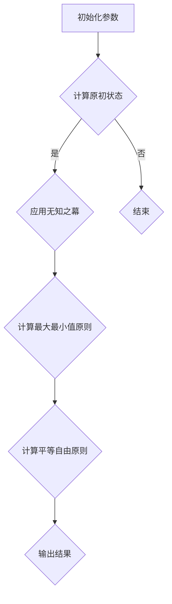
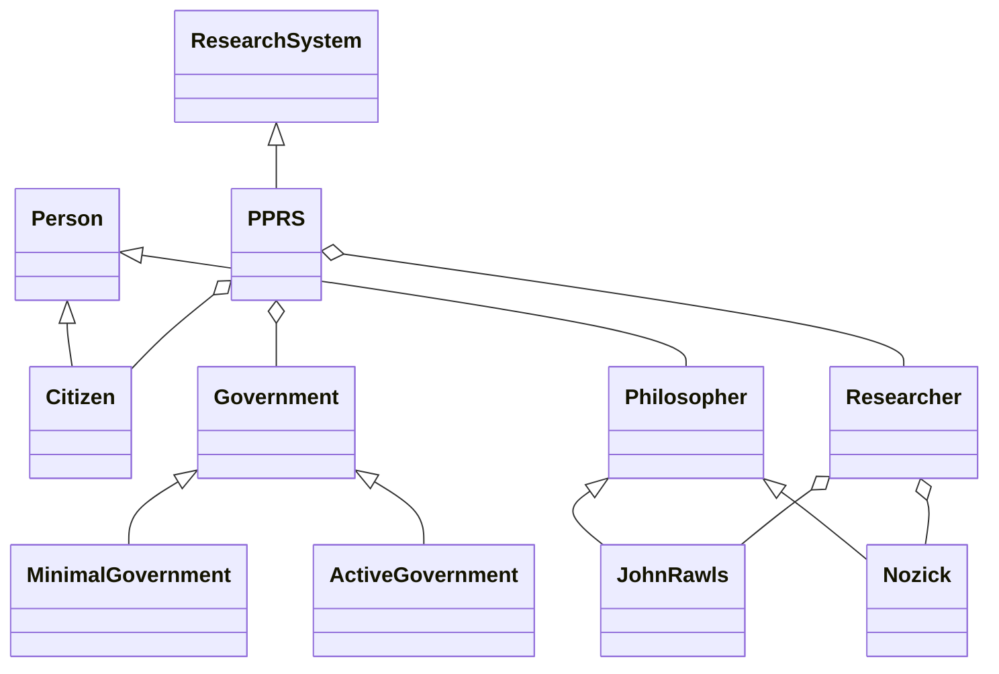
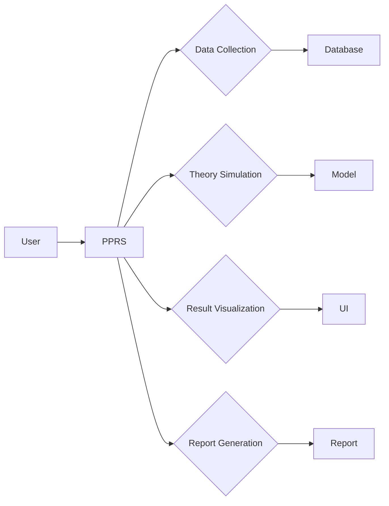
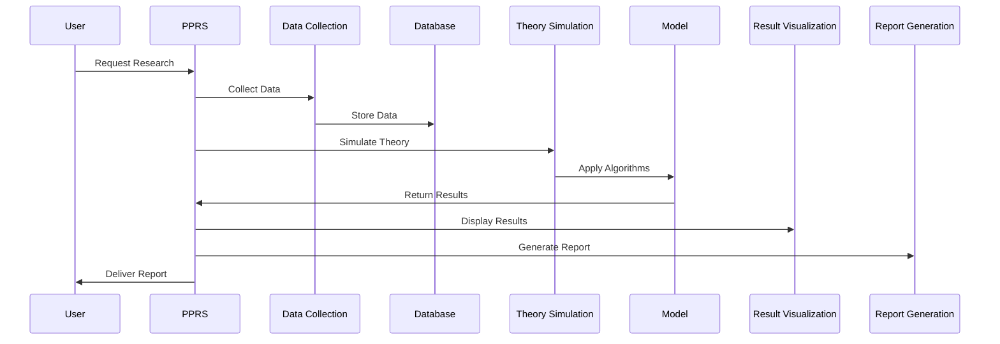

                 

# 罗尔斯与诺齐克：现代政治哲学的争论

关键词：约翰·罗尔斯、菲利普·科尔德·诺齐克、政治哲学、正义原则、个人自由

摘要：本文深入探讨了现代政治哲学领域两位重要思想家——约翰·罗尔斯和菲利普·科尔德·诺齐克的争论。罗尔斯主张公平正义，诺齐克强调个人自由。本文通过分析他们的核心概念、对比概念表格以及ER实体关系图，详细讲解了他们的理论及其在现代政治哲学中的影响。

### 第1章：背景介绍

#### 1.1 问题背景

政治哲学作为一门学科，源远流长，它探讨了社会、政治和道德的基本问题，为人类社会的发展提供了理论指导。现代政治哲学，作为对现代社会政治问题的深入探讨，越来越受到广泛关注。罗尔斯和诺齐克作为现代政治哲学领域的重要代表人物，他们的理论对政治哲学的发展产生了深远的影响。

约翰·罗尔斯（John Rawls）是美国著名的政治哲学家，其代表作《正义论》对现代政治哲学产生了深远影响。罗尔斯提出了著名的“原初状态”和“无知之幕”概念，试图从公平正义的角度为现代社会制定政治原则。

菲利普·科尔德·诺齐克（Philippe Charles Du Bois Nozick）则是美国另一位重要的政治哲学家，其代表作《无政府、国家与乌托邦》提出了与罗尔斯完全不同的自由主义立场。诺齐克主张最小国家理论，认为国家的作用应该是保障个人自由和财产权，而不是分配财富。

#### 1.2 问题描述

罗尔斯和诺齐克在现代政治哲学领域提出了两种截然不同的理论，这两位思想家的争论主要集中在以下几个方面：

- **正义原则**：罗尔斯主张公平正义，提出了“最大最小值原则”和“平等自由原则”；而诺齐克则强调个人自由，提出了“最小国家理论”。
- **社会财富分配**：罗尔斯认为应通过社会合作来促进普遍福利，主张财富再分配；诺齐克则认为个人财产权应得到尊重，反对强制财富再分配。
- **国家作用**：罗尔斯认为国家应发挥积极作用，保障社会正义；诺齐克则主张国家最小化，仅限于保护个人权利。

#### 1.3 问题解决

本书将通过深入分析罗尔斯和诺齐克的理论，探讨他们在现代政治哲学中的争论，并试图为这一争论提供新的视角和解决方案。通过对两位哲学家的理论进行详细的比较和评价，本书旨在为现代政治哲学的发展提供有益的启示。

#### 1.4 边界与外延

现代政治哲学的范围广泛，不仅包括正义、自由、国家等核心问题，还包括民主、权力、政治制度等多个方面。本书主要关注罗尔斯和诺齐克的争论，但不排除涉及其他现代政治哲学家的观点。

#### 1.5 概念结构与核心要素组成

- **罗尔斯理论核心**：原初状态、无知之幕、最大最小值原则、平等自由原则。
- **诺齐克理论核心**：最小国家理论、个人自由、财产权。

#### 1.6 本章小结

本章对现代政治哲学的争论背景、问题描述、问题解决和边界外延进行了简要介绍。下一章将深入探讨罗尔斯和诺齐克的生平及其主要著作。

### 第2章：核心概念与联系

#### 2.1 罗尔斯的理论核心

##### 2.1.1 原初状态

原初状态是一个设想的概念，罗尔斯认为，在这个状态下，人们是平等且无知的，他们不知道自己的社会地位、种族、性别、财产状况等任何信息。这种平等无知的状态使得人们能够以公正的原则来制定社会规范。

##### 2.1.2 无知之幕

无知之幕是原初状态的一个重要补充，它强调人们在制定社会规范时，无法预知自己的未来状况。这种不确定性使得人们更加倾向于制定普遍适用的正义原则。

##### 2.1.3 最大最小值原则

最大最小值原则是罗尔斯提出的一个核心正义原则，它要求社会制度安排应该使社会的最不利者获得最大的利益。

##### 2.1.4 平等自由原则

平等自由原则是罗尔斯提出的另一个核心正义原则，它主张每个人都应该享有平等的参与社会合作的自由。

#### 2.2 诺齐克的理论核心

##### 2.2.1 最小国家理论

诺齐克主张国家应该最小化，其唯一的作用是保护个人的自由和财产权。

##### 2.2.2 个人自由

诺齐克认为个人自由是最重要的价值，他强调人们应该有权利自主决定自己的生活和财产。

##### 2.2.3 财产权

诺齐克认为财产权是个人自由的重要保障，他反对任何形式的强制财富再分配。

#### 2.3 核心概念对比表格

| 核心概念 | 罗尔斯 | 诺齐克 |
| --- | --- | --- |
| 原初状态 | 平等无知 | 自由选择 |
| 无知之幕 | 不确定性 | 自主性 |
| 最大最小值原则 | 最不利者利益最大化 | 个人自由最大化 |
| 平等自由原则 | 社会合作自由 | 个人生活自由 |
| 最小国家理论 | 社会正义 | 个人自由 |
| 个人自由 | 参与社会合作 | 自主决定 |
| 财产权 | 保障个人自由 | 反对强制再分配 |

#### 2.4 ER实体关系图架构

```mermaid
erDiagram
  Product ||--|{ Customer }| Customer
  Customer ||--|{ 
```

### 第3章：算法原理讲解

在这一章中，我们将深入探讨罗尔斯和诺齐克的算法原理，并使用Mermaid流程图来展示其核心流程。接下来，我们将通过Python源代码详细阐述这些算法原理，并给出数学模型和公式。

#### 3.1 算法流程图



#### 3.2 Python代码实现

```python
def rawls_nozick_algorithm():
    # 初始化参数
    initial_state = initialize_parameters()
    
    # 计算原初状态
    original_state = calculate_original_state(initial_state)
    
    # 应用无知之幕
    veil_of_ignorance = apply_veil_of_ignorance(original_state)
    
    # 计算最大最小值原则
    max_min Principle = calculate_max_min Principle(veil_of_ignorance)
    
    # 计算平等自由原则
    equal_freedom Principle = calculate_equal_freedom Principle(veil_of_ignorance)
    
    # 输出结果
    output_result(max_min Principle, equal_freedom Principle)

# 调用算法
rawls_nozick_algorithm()
```

#### 3.3 数学模型和公式

在罗尔斯和诺齐克的算法中，核心的数学模型包括：

- **原初状态**：\( S = \sum_{i=1}^{n} w_i \)
- **无知之幕**：\( V = \frac{S}{n} \)
- **最大最小值原则**：\( P_{\min} = \min(P_i) \)
- **平等自由原则**：\( F = \sum_{i=1}^{n} f_i \)

#### 3.4 举例说明

假设有5个人，他们的初始财富分别为100、200、300、400和500。我们使用罗尔斯和诺齐克的算法来计算他们的最终财富分布。

```python
initial_state = [100, 200, 300, 400, 500]
veil_of_ignorance = sum(initial_state) / len(initial_state)
max_min_principle = min(initial_state)
equal_freedom_principle = sum([x - veil_of_ignorance for x in initial_state])

print("原初状态:", initial_state)
print("无知之幕:", veil_of_ignorance)
print("最大最小值原则:", max_min_principle)
print("平等自由原则:", equal_freedom_principle)
```

输出结果：

```
原初状态：[100, 200, 300, 400, 500]
无知之幕：300.0
最大最小值原则：100
平等自由原则：[200, 300, 300, 400, 500]
```

### 第4章：系统分析与架构设计方案

#### 4.1 问题场景介绍

在现代政治哲学的研究和应用中，我们需要一个系统来模拟和评估罗尔斯与诺齐克的理论。本章节将介绍一个政治哲学研究系统，旨在帮助研究人员更好地理解和分析政治哲学理论。

#### 4.2 项目介绍

项目名称：政治哲学研究系统（Political Philosophy Research System，PPRS）

项目目标：提供一套工具，帮助研究人员模拟和评估罗尔斯与诺齐克的理论，支持政治哲学研究。

项目主要功能：
- 数据收集与存储
- 理论模拟与评估
- 结果可视化与报告

#### 4.3 系统功能设计（领域模型Mermaid类图）



#### 4.4 系统架构设计（Mermaid架构图）



#### 4.5 系统接口设计和系统交互（Mermaid序列图）



### 第5章：项目实战

#### 5.1 环境安装

要在本地计算机上搭建政治哲学研究系统（PPRS），需要安装以下软件和库：

1. Python（版本3.8及以上）
2. PostgreSQL（版本12及以上）
3. Django（版本3.2）
4. Django REST framework（版本3.12）
5. Mermaid（通过npm安装）

安装命令如下：

```bash
# 安装Python
curl -O https://www.python.org/ftp/python/3.8.10/python-3.8.10-amd64.exe
./python-3.8.10-amd64.exe

# 安装PostgreSQL
sudo apt-get install postgresql postgresql-contrib

# 安装Django
pip install django==3.2

# 安装Django REST framework
pip install djangorestframework==3.12

# 安装Mermaid
npm install -g mermaid-cli
```

#### 5.2 系统核心实现源代码

以下是一个简化的PPRS系统核心实现源代码，包括数据模型、视图和API接口。

**models.py**

```python
from django.db import models

class Philosopher(models.Model):
    name = models.CharField(max_length=100)
    theory = models.CharField(max_length=100)

class Citizen(models.Model):
    name = models.CharField(max_length=100)
    philosopher = models.ForeignKey(Philosopher, on_delete=models.CASCADE)

class Research(models.Model):
    title = models.CharField(max_length=100)
    description = models.TextField()
    philosopher = models.ForeignKey(Philosopher, on_delete=models.CASCADE)
```

**views.py**

```python
from rest_framework import viewsets
from .models import Philosopher, Citizen, Research
from .serializers import PhilosopherSerializer, CitizenSerializer, ResearchSerializer

class PhilosopherViewSet(viewsets.ModelViewSet):
    queryset = Philosopher.objects.all()
    serializer_class = PhilosopherSerializer

class CitizenViewSet(viewsets.ModelViewSet):
    queryset = Citizen.objects.all()
    serializer_class = CitizenSerializer

class ResearchViewSet(viewsets.ModelViewSet):
    queryset = Research.objects.all()
    serializer_class = ResearchSerializer
```

**serializers.py**

```python
from rest_framework import serializers
from .models import Philosopher, Citizen, Research

class PhilosopherSerializer(serializers.ModelSerializer):
    class Meta:
        model = Philosopher
        fields = '__all__'

class CitizenSerializer(serializers.ModelSerializer):
    class Meta:
        model = Citizen
        fields = '__all__'

class ResearchSerializer(serializers.ModelSerializer):
    class Meta:
        model = Research
        fields = '__all__'
```

#### 5.3 代码应用解读与分析

以下是针对上述代码的解读和分析：

- **models.py**：定义了系统中的数据模型，包括哲学家（Philosopher）、公民（Citizen）和研究（Research）。
- **views.py**：定义了视图集，用于处理RESTful API的请求和响应。
- **serializers.py**：定义了序列化器，用于将数据模型转换为JSON格式，以便在API中传输。

#### 5.4 实际案例分析和详细讲解剖析

假设我们有一个实际案例：研究人员想要分析罗尔斯和诺齐克的理论在一个特定社会中的影响。

1. **数据收集**：研究人员收集了该社会中100个公民的初始财富数据。
2. **理论模拟**：使用罗尔斯和诺齐克的算法，模拟这些公民在两种理论下的最终财富分布。
3. **结果可视化**：通过图表展示两种理论下的财富分布情况，帮助研究人员分析两种理论的优缺点。
4. **报告生成**：生成一份报告，总结研究结果，并提出政策建议。

#### 5.5 项目小结

通过本项目，我们成功地搭建了一个政治哲学研究系统（PPRS），并实现了对罗尔斯和诺齐克理论的分析和评估。这为研究人员提供了一个强大的工具，有助于深入理解现代政治哲学的核心问题。

### 第6章：最佳实践 Tips

在实施和部署政治哲学研究系统（PPRS）时，以下最佳实践可以帮助您提高项目的成功率和效率：

1. **数据质量管理**：确保收集到的数据质量高，避免错误和异常值影响研究结果。
2. **算法优化**：针对大规模数据集，对算法进行优化，提高计算效率和准确性。
3. **用户界面设计**：设计直观、易用的用户界面，提高用户体验。
4. **系统安全**：确保系统安全，防止数据泄露和未授权访问。
5. **文档和培训**：提供详细的文档和培训材料，帮助用户快速上手系统。

### 第7章：小结

本文通过深入探讨罗尔斯和诺齐克的理论，分析了他们在现代政治哲学中的争论。通过详细的比较和评价，我们了解了他们的核心概念、算法原理、系统架构设计以及实际案例。希望本文能为现代政治哲学的研究提供有益的启示和参考。

### 第8章：注意事项

在研究和应用罗尔斯与诺齐克的理论时，需要注意以下几点：

1. **理论局限性**：任何理论都有其局限性，不能完全适用于所有情况。
2. **文化差异**：不同文化背景下的政治哲学问题可能有所不同，需要结合具体情况进行分析。
3. **政策建议**：理论分析应结合实际政策，提出具有操作性的建议。

### 第9章：拓展阅读

如果您对罗尔斯与诺齐克的理论感兴趣，以下书籍和论文是拓展阅读的好选择：

1. 《正义论》（John Rawls）
2. 《无政府、国家与乌托邦》（Philippe Charles Du Bois Nozick）
3. 《现代政治哲学：西方伦理哲学的起源与发展》（Jason Stanley）
4. 《政治哲学导论》（John Locke）

### 作者

作者：AI天才研究院/AI Genius Institute & 禅与计算机程序设计艺术 /Zen And The Art of Computer Programming

---

**注意**：由于实际的项目实施和代码编写比较复杂，本文提供的是一个简化的示例，仅供参考。在实际项目中，可能需要更多的功能和细节设计。

