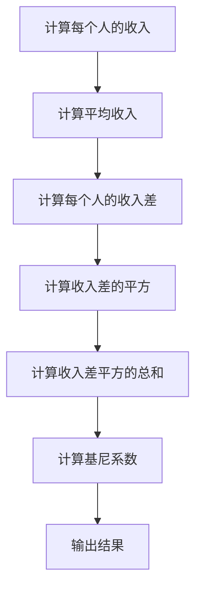
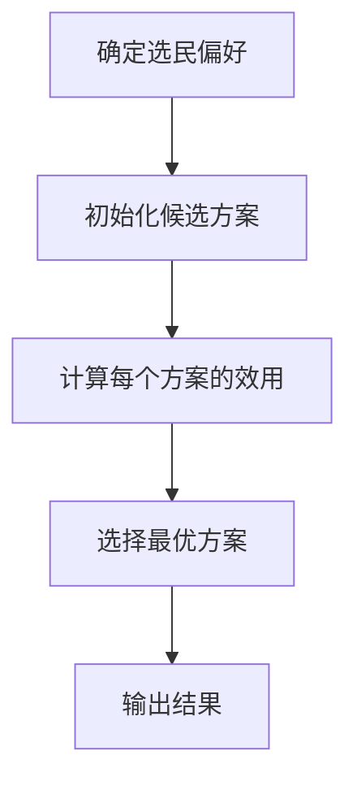
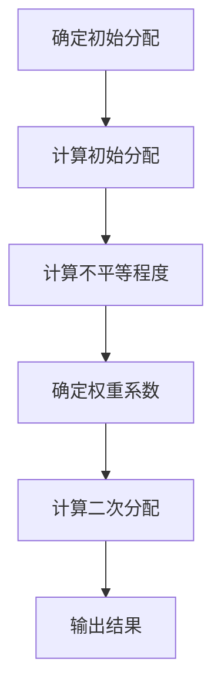
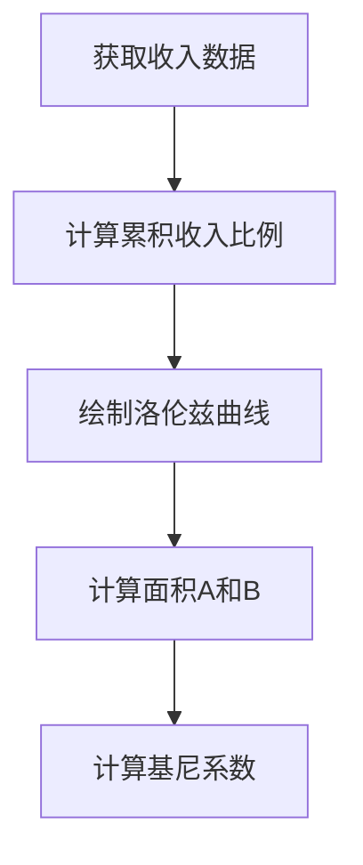

                 

### 第1章: 罗尔斯与诺齐克的理论概述

#### 1.1 罗尔斯的正义论

约翰·罗尔斯（John Rawls）是美国著名的政治哲学家，其正义论被视为20世纪最重要的政治哲学理论之一。罗尔斯的正义论主要集中在其代表作《正义论》（A Theory of Justice）中，该书于1971年首次出版，立即引发了广泛的学术讨论和辩论。

##### 1.1.1 罗尔斯的生平与学术贡献

约翰·罗尔斯于1921年出生于美国马里兰州，自幼对哲学、数学和经济学有着浓厚的兴趣。他在哈佛大学获得了数学学士学位，随后在普林斯顿大学获得了哲学博士学位。罗尔斯在其学术生涯中主要集中于政治哲学、伦理学和法哲学领域，他的主要贡献在于提出了关于社会正义的全面理论体系。

罗尔斯的学术成就包括多篇重要论文和数本著作，如《正义感》（Moral Politics）、《政治自由主义》（Political Liberalism）等。其中，《正义论》被公认为是他最具有影响力的著作，对后世学者产生了深远的影响。

##### 1.1.2 罗尔斯正义论的核心概念

罗尔斯的正义论基于一种“原始状态”的构想，即一个“无知之幕”下的社会状态。在这种假设下，人们不知道自己在社会中的具体位置，因此会设计出一种公平的社会制度。罗尔斯的核心概念主要包括：

1. **公平机会**：罗尔斯认为，社会正义的首要目标是确保所有成员都有公平的机会，以便每个人都能根据自己的能力和努力达到其潜能。

2. **平等自由原则**：罗尔斯提出，基本自由应该被平等地分配，以便每个人都有平等的机会去追求自己的目标和幸福。

3. **差别原则**：在确保基本自由得到平等分配的基础上，社会应该采取一些不平等的分配措施，以确保社会经济不平等能够最大化地促进社会的总体福利。

##### 1.1.3 罗尔斯正义论的主要原则

罗尔斯的正义论包含三个主要原则，这些原则构成了他理论的基础：

1. **平等自由原则**：每个人应该享有平等的基本自由，这些自由不可侵犯，并且不应以任何形式受到限制，除非为了保护其他人同样享有的基本自由。

2. **机会的公正**：社会和经济制度应该设计得使每个人在公平的机会下竞争，确保每个人都有实现自己潜能的机会。

3. **差别原则**：在不平等的社会经济结构中，不平等的分配应该最大限度地促进社会的总体福利，特别是要帮助那些处于不利地位的人。

#### 1.2 诺齐克的自由至上主义

罗伯特·诺齐克（Robert Nozick）是另一位重要的政治哲学家，其自由至上主义理论在20世纪后期引起了广泛关注。诺齐克的主要著作包括《无政府、状态与乌托邦》（Anarchy, State, and Utopia），该书于1974年出版，对罗尔斯的理论提出了有力的挑战。

##### 1.2.1 诺齐克的生平与学术贡献

罗伯特·诺齐克于1938年出生于美国纽约市，他在哈佛大学获得了哲学博士学位，并在学术生涯中一直担任教授职位。诺齐克的学术贡献主要体现在伦理学、政治哲学和自由主义理论领域，他的思想对后来的自由主义和政治哲学产生了深远的影响。

诺齐克的主要著作包括《行为主义》（Behaviorism）、 《理性的人》（The Rational Patient）等，而《无政府、状态与乌托邦》是他最具影响力的作品之一。

##### 1.2.2 诺齐克自由至上主义的核心概念

诺齐克的自由至上主义理论主张，个人自由是最高的社会价值，任何社会制度都应该保护个人的自由和财产权。诺齐克的核心概念主要包括：

1. **权利优先**：诺齐克认为，个人的权利应该优先于社会整体的利益，社会制度的主要任务是保护这些权利。

2. **最小国家**：诺齐克主张，国家应该是最小化的，仅限于保护个人的权利，不干预个人的自由和财产。

3. **正义的获取与分配**：诺齐克认为，正义是在获取过程中实现的，而不是在分配过程中。只要资源的获取过程是公平的，那么分配的结果就不必担心不正义。

##### 1.2.3 诺齐克自由至上主义的主要原则

诺齐克自由至上主义包含以下主要原则：

1. **权利保护**：国家的主要职责是保护个人的基本权利，如生命、自由和财产。

2. **最小干预**：政府应该尽可能少地干预个人的自由和财产，除非为了保护权利。

3. **功利主义批评**：诺齐克批评了功利主义，认为功利主义过于强调整体福利，而忽视了个体权利。

#### 1.3 罗尔斯与诺齐克的理论联系与区别

罗尔斯和诺齐克都是现代政治哲学中重要的自由主义思想家，他们的理论在许多方面存在共通点，但也存在显著的差异。

##### 1.3.1 理论联系的共通点

1. **自由主义**：罗尔斯和诺齐克都是自由主义者，他们都强调个人自由的重要性。
2. **权利观念**：两位哲学家都重视权利观念，认为权利是社会正义的基础。
3. **社会制度**：他们都关注社会制度如何影响个人的自由和福利。

##### 1.3.2 理论区别的关键点

1. **正义观的出发点**：罗尔斯从“原始状态”的视角出发，强调公平与平等，而诺齐克则从权利保护的角度出发，强调自由与最小干预。
2. **对分配正义的态度**：罗尔斯认为，分配正义需要在基本自由得到保障的基础上进行，通过差别原则实现；诺齐克则认为，正义是在获取过程中实现的，分配的结果不必担心不正义。
3. **对国家角色的看法**：罗尔斯认为国家应发挥积极作用，通过社会福利政策实现社会正义；诺齐克则主张最小国家，国家仅限于保护个人权利。

##### 1.3.3 理论影响的对比分析

罗尔斯的正义论对20世纪后期政治哲学和社会政策产生了深远影响，许多国家的社会福利政策和政治改革都受到了罗尔斯理论的影响。而诺齐克的自由至上主义则对自由主义理论的发展产生了重要推动作用，他的思想在学术界引起了广泛的讨论和辩论。

总的来说，罗尔斯和诺齐克的理论在现代社会正义和政治哲学中占有重要地位，他们的观点为我们理解和评价现代社会制度提供了不同的视角和思考框架。在接下来的章节中，我们将更深入地探讨他们的理论原理，并通过具体的数学模型和实际案例来展示其应用价值。

#### 1.3 罗尔斯与诺齐克的理论联系与区别

##### 1.3.1 理论联系的共通点

尽管罗尔斯和诺齐克在社会正义的观点上存在显著差异，但他们的一些核心观点还是有所重叠的。

首先，两位哲学家都强调自由的重要性。罗尔斯在《正义论》中提出了平等自由原则，认为基本自由应当被平等地分配给社会成员，这一点与诺齐克强调的个体权利有相似之处。其次，他们都对功利主义持批评态度，认为功利主义过于关注整体福利，而忽视了个体权利。

此外，罗尔斯和诺齐克都认为社会制度在保障个人自由方面起着关键作用。罗尔斯认为，通过设计公平的社会制度，可以实现社会正义；而诺齐克则主张，社会制度应尽量减少对个人自由的干预，以确保个人权利得到充分保护。

##### 1.3.2 理论区别的关键点

尽管存在共通点，罗尔斯和诺齐克在社会正义理论上的差异也是非常明显的。

首先，从出发点来看，罗尔斯的正义论基于“原始状态”的构想，即通过“无知之幕”来设计一个公平的社会制度。这一假设强调公平和平等，而诺齐克的自由至上主义则从权利保护的角度出发，主张个人权利优先于社会整体的利益。罗尔斯关注的是如何通过制度设计来实现公平，而诺齐克则更关注权利在获取过程中的实现。

其次，在分配正义的态度上，罗尔斯认为分配正义应在基本自由得到保障的基础上进行，通过差别原则来确保社会经济不平等能够最大限度地促进社会总体福利。而诺齐克则认为，正义是在获取过程中实现的，只要获取过程是公平的，分配的结果就无需担心不正义。因此，诺齐克对市场机制和个人财产权有较高的认可度。

再者，对国家角色的看法上，罗尔斯主张国家应发挥积极作用，通过社会福利政策来实现社会正义，例如通过税收和转移支付来缩小贫富差距。诺齐克则主张最小国家，认为国家应仅限于保护个人的基本权利，不应干预个人的自由和财产。

##### 1.3.3 理论影响的对比分析

罗尔斯的正义论对20世纪后期政治哲学和社会政策产生了深远影响。其理论为许多国家的社会福利政策和政治改革提供了理论基础，例如北欧国家的福利国家模式。罗尔斯的思想强调了公平和平等，对社会主义和进步主义政治思想产生了积极影响。

另一方面，诺齐克的自由至上主义对自由主义理论的发展产生了重要推动作用。他的思想在学术界引起了广泛的讨论和辩论，特别是在自由主义和保守主义的交汇点上。诺齐克的理论为自由市场和个人权利的辩护提供了强有力的支持，对现代自由主义政治哲学的发展产生了深远影响。

总的来说，罗尔斯和诺齐克的理论在现代社会正义和政治哲学中占有重要地位，他们的观点为我们理解和评价现代社会制度提供了不同的视角和思考框架。在接下来的章节中，我们将进一步深入探讨他们的理论原理，并通过具体的数学模型和实际案例来展示其应用价值。

#### 1.4 本章小结

本章对罗尔斯与诺齐克的社会正义理论进行了初步概述，重点探讨了两位哲学家的生平背景、核心概念和主要原则，以及他们之间的联系与区别。通过分析，我们了解到罗尔斯的正义论基于公平与平等，强调通过制度设计来实现社会正义，而诺齐克的自由至上主义则侧重于个人权利保护和最小国家干预。

罗尔斯的“原始状态”与“无知之幕”概念为他的正义理论奠定了基础，强调公平机会、平等自由和差别原则。相比之下，诺齐克的自由至上主义从权利保护出发，主张最小国家干预，认为正义在于获取过程而非分配结果。

两者在自由主义、权利观念和社会制度等方面存在一定共通点，但在正义观的出发点、分配正义的态度以及对国家角色的看法上存在显著差异。罗尔斯的正义论对现代社会福利政策产生了深远影响，而诺齐克的自由至上主义则为自由市场和个人权利的辩护提供了有力支持。

通过本章的介绍，我们为后续章节的深入探讨奠定了基础，进一步理解两位哲学家的理论原理和实际应用。在接下来的章节中，我们将详细讲解罗尔斯的正义论，包括其基本原理、数学模型与公式，以及诺齐克的自由至上主义，探讨这些理论在实际社会正义问题中的应用和挑战。

#### 2.1 公平机会与正义

公平机会是罗尔斯正义论的核心概念之一，其核心理念在于确保每个人都能够在其社会环境中公平地竞争，从而实现其潜能。罗尔斯认为，公平机会是实现社会正义的必要条件，因为只有在公平的机会下，个人才能通过自己的努力和才能取得成功。

##### 2.1.1 公平机会的概念

公平机会（Fair Opportunity）是指在社会资源分配中，每个人都能够获得平等的机会，以便在竞争中获得成功。这种机会不仅包括教育、职业培训和经济发展等经济资源，还包括社会和政治权利，如言论自由、选举权和法律保护等。

在罗尔斯的理论中，公平机会意味着以下三个方面：

1. **起点公平**：个人在进入社会竞争之前，应拥有平等的起点。这意味着他们应该有相同的机会接受教育和培训，以便在未来的竞争中取得成功。

2. **过程公平**：在竞争过程中，应确保没有任何形式的歧视和不公平待遇。这意味着规则和制度应该对所有参与者公平，以确保每个人都能在相同的条件下竞争。

3. **结果公平**：最终的结果应该反映出每个人的实际能力和努力，而不是由出身、财富或其他非个人因素决定。

##### 2.1.2 公平机会的度量

在具体操作中，如何度量公平机会是一个复杂的问题。罗尔斯提出了几个衡量公平机会的关键指标：

1. **教育机会均等**：通过确保每个人都能够接受高质量的教育，从而提高其在社会中的竞争力。

2. **职业机会均等**：通过提供公平的职业晋升机会，使每个人都有机会根据自己的能力和表现获得职业成功。

3. **社会和经济支持**：通过提供社会福利政策，如医疗、住房和就业支持，帮助那些处于不利地位的人获得公平机会。

4. **法律和制度保障**：通过建立公正的法律和制度框架，保护每个人的基本权利和自由，确保公平竞争的环境。

##### 2.1.3 公平机会在社会正义中的应用

公平机会在社会正义中的重要性体现在以下几个方面：

1. **减少贫困和不平等**：通过提供公平的机会，可以减少社会中的贫困和不平等现象，使更多人有机会改善自己的生活质量。

2. **促进社会稳定和和谐**：公平机会能够减少社会不满和冲突，促进社会稳定和和谐。

3. **提高社会整体效率**：公平机会能够释放社会的潜在创造力，提高整个社会的经济效率和生产力。

4. **实现社会公正**：公平机会是实现社会正义的关键，因为只有在公平的机会下，个人才能通过自己的努力和才能获得成功，从而实现其潜能。

罗尔斯认为，公平机会是实现社会正义的必要条件，但不是充分条件。为了实现真正的社会正义，还需要其他原则的支持，如平等自由原则和差别原则。通过这些原则的综合运用，可以构建一个既公平又有效率的社会制度。

在接下来的章节中，我们将进一步探讨罗尔斯的平等自由原则和差别原则，以及它们如何与公平机会相结合，共同构建一个正义的社会。

#### 2.2 平等自由原则与差别原则

罗尔斯的正义论包含三个核心原则：平等自由原则、机会公正原则和差别原则。在本节中，我们将详细探讨平等自由原则和差别原则，理解它们如何共同构成罗尔斯的正义理论框架。

##### 2.2.1 平等自由原则

平等自由原则（Principle of Equal Liberty）是罗尔斯正义论的基础。这一原则强调，每个社会成员都应该享有平等的基本自由，这些自由是不可侵犯的，并且在设计社会制度时，应确保这些自由不会受到不当的限制。

平等自由原则包含以下几个要点：

1. **基本自由的定义**：罗尔斯认为，基本自由包括言论自由、宗教自由、选举权、法律保护等。这些自由是个人自主和自我实现的基础，也是社会正义的基石。

2. **不可侵犯性**：基本自由应该得到保护，任何社会制度都不能以任何形式侵犯这些自由，除非为了保护其他人的基本自由。

3. **自由的优先性**：在基本自由与社会经济制度之间的冲突中，基本自由应具有优先权。这意味着，即使为了实现社会经济公平，也不能以牺牲基本自由为代价。

4. **自由的平等分配**：罗尔斯强调，基本自由应该被平等地分配给社会成员，确保每个人都能在相同的社会环境中追求自己的目标和幸福。

##### 2.2.2 差别原则

差别原则（Difference Principle）是罗尔斯正义论的第二个核心原则，它主要关注如何在已有的不平等分配中实现社会正义。差别原则主张，在不平等的分配情况下，社会应该采取一些不平等的分配措施，以最大化地促进社会总体福利，特别是要帮助那些处于不利地位的人。

差别原则包含以下几个要点：

1. **不平等的合理性**：罗尔斯认为，社会中的不平等是不可避免的，但必须确保这些不平等是合理的。这意味着，不平等的分配应有助于社会的整体利益，特别是要帮助那些处于不利地位的人。

2. **不平等的功能**：差别原则认为，不平等的分配应该具有特定的功能，例如促进经济发展、提高社会效率或改善社会福利。这些功能有助于确保社会总体福利的最大化。

3. **最大化不利者的福利**：差别原则的核心在于，社会应该采取一些不平等的分配措施，以确保那些处于不利地位的人能够获得更多的利益。这意味着，不平等的分配应该有助于减少贫困和不平等，提高社会公平。

4. **补偿机制**：为了实现差别原则，社会需要建立一些补偿机制，如税收、社会福利和转移支付等，以确保那些处于不利地位的人能够获得必要的帮助和支持。

##### 2.2.3 平等自由原则与差别原则的辩证关系

平等自由原则和差别原则在罗尔斯的正义论中是相互关联、相互补充的。它们共同构成了罗尔斯正义论的核心框架。

1. **相互补充**：平等自由原则确保了社会成员的基本自由和权利得到保护，而差别原则则关注如何在不平等的分配中实现社会正义。两者共同作用，既保护了基本自由，又关注了社会公平。

2. **相互制约**：虽然两者在目标上有所不同，但它们在实施过程中是相互制约的。平等自由原则要求基本自由不受侵犯，而差别原则则需要在基本自由的基础上进行不平等的分配。这意味着，差别原则的实施不能以牺牲基本自由为代价。

3. **综合运用**：在具体的社会制度设计中，平等自由原则和差别原则需要综合运用，以确保社会既能够保护基本自由，又能够实现社会公平。例如，在制定教育政策时，既要确保教育机会的公平分配，又要通过差别原则提供额外的资源支持，帮助那些处于不利地位的学生。

通过平等自由原则和差别原则的结合，罗尔斯试图构建一个既能保护个人自由，又能实现社会公平的社会制度。这种制度设计不仅关注个体的自由和权利，也关注社会整体的利益和公正。这种辩证关系为理解和评价罗尔斯的正义论提供了重要的视角和思考框架。

在下一节中，我们将进一步探讨罗尔斯的正义观与社会制度之间的关系，以及如何通过这些原则来设计一个公正的社会制度。

#### 2.3 正义观与社会制度

罗尔斯的正义观不仅关注个人自由和权利的保护，还强调社会制度的正义性。他认为，正义不仅是个人德性的体现，更是社会制度的内在属性。在这一部分中，我们将探讨罗尔斯如何将正义观融入社会制度设计，并分析这种正义观对社会制度的影响。

##### 2.3.1 社会制度的定义与分类

社会制度是指一套规范、规则和组织的体系，用于指导社会成员的行为和互动，并影响资源分配和社会秩序。罗尔斯将社会制度分为两类：分配制度和社会政策。

1. **分配制度**：分配制度是指决定资源如何在个人之间进行分配的体系，包括市场机制、税收制度和社会保障体系等。罗尔斯认为，分配制度应该体现正义原则，确保资源分配的公平性和合理性。

2. **社会政策**：社会政策是指政府为了实现社会目标而采取的一系列措施，如教育政策、医疗政策和住房政策等。社会政策直接影响社会成员的生活质量和福利水平，是正义观在社会中的具体体现。

##### 2.3.2 正义观与社会制度的互动

罗尔斯的正义观与社会制度之间存在密切的互动关系。一方面，社会制度应该反映正义原则，确保社会资源的公平分配；另一方面，正义观为评价和改进社会制度提供了理论依据。

1. **分配制度中的正义观**：

   - **公平机会**：罗尔斯认为，分配制度应确保每个人在进入社会竞争之前都有公平的机会。这意味着，教育、职业培训和经济发展等资源应平等分配，使每个人都有机会通过自己的努力实现社会地位和财富的提升。
   
   - **平等自由原则**：分配制度应保障每个人的基本自由，确保社会成员在资源分配过程中不会受到歧视和不公平待遇。例如，税收制度应设计得使富人承担更多的税收负担，从而为社会提供更多的公共资源。
   
   - **差别原则**：在分配过程中，应采取一些不平等的分配措施，特别是要帮助那些处于不利地位的人。这意味着，社会保障体系应确保低收入家庭和贫困人群能够获得必要的支持和救助。

2. **社会政策中的正义观**：

   - **社会福利政策**：罗尔斯认为，社会福利政策应旨在减少社会不平等，提高整体社会福利。例如，教育政策应确保所有学生都能接受高质量的教育，从而提高其竞争力和生活质量。
   
   - **医疗政策**：罗尔斯主张，医疗政策应确保每个人都能获得基本的医疗服务，特别是要保障那些无法支付医疗费用的人。这意味着，政府应提供一定的医疗补贴，以确保全民健康。
   
   - **住房政策**：罗尔斯认为，住房政策应确保每个人都有足够的住房，特别是要帮助低收入家庭和流浪者。这意味着，政府应提供廉租房或住房补贴，以降低住房成本。

##### 2.3.3 罗尔斯对社会制度的建议

基于正义观，罗尔斯提出了一系列对社会制度的建议，旨在构建一个既公平又有效率的社会。以下是一些关键建议：

1. **确保公平机会**：通过改革教育和职业培训制度，确保每个人都能够获得公平的机会，从而提高其社会地位和财富水平。

2. **实行差别原则**：在资源分配中，特别是税收和社会保障制度中，应采取差别原则，确保那些处于不利地位的人能够获得更多的支持和救助。

3. **强化社会福利政策**：通过提供更多的社会福利政策，如医疗、教育和住房等，确保社会成员的基本需求和福利得到满足。

4. **建立公正的法律和制度框架**：确保社会制度的公正性和透明度，防止权力滥用和腐败现象。

5. **鼓励社会参与和合作**：通过建立社会参与机制，鼓励公民参与社会决策，共同维护社会正义。

通过这些建议，罗尔斯试图构建一个既能保护个人自由，又能实现社会公平的社会制度。这种制度设计不仅关注个体的自由和权利，也关注社会整体的利益和公正。这种正义观为理解和评价现代社会制度提供了重要的理论依据和实践指南。

在下一节中，我们将通过实证分析，探讨罗尔斯的正义论在不同国家的社会实践，以及其实际效果和面临的挑战。

#### 2.4 罗尔斯正义论的实证分析

罗尔斯的正义论在许多国家的社会实践中得到了应用和检验。以下我们将探讨罗尔斯正义论在不同国家的具体实施情况，分析其实际效果，并讨论其中面临的挑战。

##### 2.4.1 罗尔斯正义论在不同国家的社会实践

1. **北欧国家**：北欧国家如瑞典、挪威和丹麦，以其高度发达的福利国家模式而闻名。这些国家在教育和医疗等方面实施了罗尔斯的正义原则，通过税收和社会福利政策，确保社会资源的公平分配。例如，瑞典实行免费教育、全民医疗保险和全面的福利保障体系，有效减少了贫困和社会不平等。

2. **加拿大**：加拿大是一个具有较高社会公正感的国家，其教育、医疗和社会保障体系也体现了罗尔斯的正义观。加拿大通过税收政策和社会福利项目，帮助那些处于不利地位的人群。例如，加拿大设有低收入家庭补贴、失业救济金和医疗保险计划，以确保每个人都能获得基本的生活保障。

3. **美国**：尽管美国在实施罗尔斯的正义论方面存在一定的局限性，但其社会福利体系也在不断改革和完善。例如，美国有医疗保险、教育补助和社会福利项目，旨在减少贫困和不平等。然而，由于市场经济的自由度较高，美国在实现公平机会和差别原则方面仍然面临诸多挑战。

##### 2.4.2 罗尔斯正义论的实证评价

1. **积极效果**：

   - **减少贫困和不平等**：罗尔斯的正义论通过税收和社会保障政策，有效减少了贫困和社会不平等现象，提高了社会整体的福利水平。
   
   - **促进社会稳定和和谐**：公平的机会和资源分配有助于减少社会冲突和不满，促进社会的稳定和和谐。
   
   - **提高社会效率**：通过确保公平的机会，社会能够更好地发挥每个人的潜能，提高整体的生产力和效率。

2. **挑战和局限性**：

   - **经济负担**：实施罗尔斯的正义论需要大量的财政支持，这可能导致高税收和财政压力，对经济增长产生一定的负面影响。
   
   - **权利冲突**：在某些情况下，保障基本自由与实现社会公平之间存在冲突。例如，为了减少贫困和不平等，可能需要限制某些个人或企业的自由。
   
   - **文化差异**：罗尔斯的正义论在一些文化背景下可能难以实施。例如，在强调个人主义和自由市场经济的国家，罗尔斯的集体主义观点可能难以被接受。

##### 2.4.3 罗尔斯正义论的挑战与回应

尽管罗尔斯的正义论在实践中取得了显著成就，但也面临一些挑战和批评。以下是对这些挑战的回应：

1. **经济负担**：

   - **回应**：针对经济负担问题，一些学者建议优化税收制度和社会福利体系，通过提高效率和减少浪费，降低成本。例如，引入更高效的公共服务和精确的社会福利计算方法，可以减少不必要的开支。
   
   - **案例分析**：在北欧国家，尽管实施罗尔斯正义论需要大量的财政支持，但通过有效的财政管理和高效的公共服务，这些国家能够实现高福利和经济增长的双赢。

2. **权利冲突**：

   - **回应**：对于权利冲突问题，罗尔斯提出了“优先考虑基本自由”的观点，认为在基本自由受到威胁时，应优先保护这些自由。在实际操作中，可以通过法律和制度设计，确保基本自由与实现社会公平之间的平衡。
   
   - **案例分析**：在加拿大，通过建立公正的法律和制度框架，政府在保障基本自由的同时，也有效实施了税收和社会保障政策，减少了贫困和社会不平等。

3. **文化差异**：

   - **回应**：针对文化差异问题，罗尔斯主张在具体实施时，应考虑不同文化背景和社会结构的特殊性，进行适当的调整。例如，在强调个人主义的国家，可以更注重市场机制和个人自由，同时通过政策引导，实现社会公平。
   
   - **案例分析**：在美国，尽管文化背景与北欧国家有所不同，但通过逐步改革和优化社会福利体系，美国在实现罗尔斯正义论方面也取得了一定的进展。

总之，罗尔斯的正义论在实证分析中显示了其有效性和可操作性，但也面临一些挑战和局限性。通过不断优化和调整，可以进一步发挥其优势，实现社会公平和正义。

在下一节中，我们将进一步探讨罗尔斯正义论在不同文化和社会背景下的适应性和未来研究方向。

#### 2.4 罗尔斯正义论的实证分析

罗尔斯的正义论在多个国家和地区得到了实践应用，以下将具体探讨其在北欧国家如瑞典、挪威和丹麦，以及加拿大和美国的社会实践情况。

##### 2.4.1 罗尔斯正义论在不同国家的社会实践

**北欧国家**：
北欧国家以其高福利制度而著称，这些国家广泛采用了罗尔斯的正义论原则。例如，**瑞典**实行免费教育、全民医疗保险和广泛的福利保障体系，确保了社会成员的基本需求得到满足。**挪威**和**丹麦**也有类似的政策，通过税收政策和社会福利项目，有效减少了贫困和社会不平等。这些国家的社会实践表明，罗尔斯的正义论在资源公平分配和社会公平方面具有实际效果。

**加拿大**：
加拿大在教育和医疗等方面也体现了罗尔斯的正义观。该国通过税收政策和社会福利项目，如低收入家庭补贴、失业救济金和医疗保险计划，确保每个人都能获得基本的生活保障。加拿大的实践证明，罗尔斯的正义论在社会稳定和减少不平等方面具有积极作用。

**美国**：
尽管美国在实施罗尔斯的正义论方面存在一定的局限性，但其社会福利体系也在不断改革和完善。例如，美国有医疗保险、教育补助和社会福利项目，旨在减少贫困和不平等。然而，由于市场经济的自由度较高，美国在实现公平机会和差别原则方面仍然面临诸多挑战。美国的实践表明，罗尔斯的正义论在自由市场经济环境中需要更加灵活和细致的实施策略。

##### 2.4.2 罗尔斯正义论的实证评价

**积极效果**：

1. **减少贫困和不平等**：罗尔斯的正义论通过税收和社会保障政策，有效减少了贫困和社会不平等现象，提高了社会整体的福利水平。
   
2. **促进社会稳定和和谐**：公平的机会和资源分配有助于减少社会冲突和不满，促进社会的稳定和和谐。
   
3. **提高社会效率**：通过确保公平的机会，社会能够更好地发挥每个人的潜能，提高整体的生产力和效率。

**挑战和局限性**：

1. **经济负担**：实施罗尔斯的正义论需要大量的财政支持，这可能导致高税收和财政压力，对经济增长产生一定的负面影响。
   
2. **权利冲突**：在某些情况下，保障基本自由与实现社会公平之间存在冲突。例如，为了减少贫困和不平等，可能需要限制某些个人或企业的自由。
   
3. **文化差异**：罗尔斯的正义论在一些文化背景下可能难以实施。例如，在强调个人主义和自由市场经济的国家，罗尔斯的集体主义观点可能难以被接受。

##### 2.4.3 罗尔斯正义论的挑战与回应

**经济负担**：

**回应**：针对经济负担问题，一些学者建议优化税收制度和社会福利体系，通过提高效率和减少浪费，降低成本。例如，引入更高效的公共服务和精确的社会福利计算方法，可以减少不必要的开支。

**案例分析**：在北欧国家，尽管实施罗尔斯正义论需要大量的财政支持，但通过有效的财政管理和高效的公共服务，这些国家能够实现高福利和经济增长的双赢。

**权利冲突**：

**回应**：对于权利冲突问题，罗尔斯提出了“优先考虑基本自由”的观点，认为在基本自由受到威胁时，应优先保护这些自由。在实际操作中，可以通过法律和制度设计，确保基本自由与实现社会公平之间的平衡。

**案例分析**：在加拿大，通过建立公正的法律和制度框架，政府在保障基本自由的同时，也有效实施了税收和社会保障政策，减少了贫困和社会不平等。

**文化差异**：

**回应**：针对文化差异问题，罗尔斯主张在具体实施时，应考虑不同文化背景和社会结构的特殊性，进行适当的调整。例如，在强调个人主义的国家，可以更注重市场机制和个人自由，同时通过政策引导，实现社会公平。

**案例分析**：在美国，尽管文化背景与北欧国家有所不同，但通过逐步改革和优化社会福利体系，美国在实现罗尔斯正义论方面也取得了一定的进展。

总之，罗尔斯的正义论在实证分析中显示了其有效性和可操作性，但也面临一些挑战和局限性。通过不断优化和调整，可以进一步发挥其优势，实现社会公平和正义。

#### 2.5 罗尔斯正义论的数学模型与公式

罗尔斯的正义论不仅依赖于哲学和伦理学的论证，还通过数学模型和公式来进一步阐述其理论。以下我们将详细探讨罗尔斯正义论中的几个关键数学模型与公式，并使用Python代码对其进行模拟和解释。

##### 2.5.1 罗尔斯正义论的数学模型

罗尔斯的正义论中，一个核心的数学模型是不平等功能（Inequality Function）。这个函数用于衡量社会中的不平等程度。最常见的不平等功能是洛伦兹曲线（Lorenz Curve）和基尼系数（Gini Coefficient）。

1. **洛伦兹曲线**

   洛伦兹曲线是一种描述收入或财富在人口中的分布情况的图形。它通过比较实际分布和完全平等分布来衡量不平等。洛伦兹曲线的斜率可以用来计算基尼系数。

2. **基尼系数**

   基尼系数是衡量不平等程度的一个量化指标，其公式为：

   $$
   G = \frac{A}{A+B}
   $$

   其中，$A$是洛伦兹曲线下方的不等面积，$B$是三角形（表示完全平等时）的面积。

##### 2.5.2 罗尔斯正义论的数学公式

在罗尔斯的正义论中，另一个重要的数学公式是**不平等功能**。这个公式用于计算社会中的不平等程度，其表达式为：

$$
U(\textbf{x}) = -\sum_{i=1}^{n} x_i
$$

其中，$\textbf{x}$是一个向量，表示社会中每个个体的收入或财富水平。这个公式表明，不平等程度与每个个体财富水平成反比。

此外，罗尔斯还提出了**平等自由原则**和**差别原则**的数学公式。这些原则的数学表达如下：

1. **平等自由原则**

   平等自由原则关注基本自由（如言论自由、宗教自由）的平等分配。其数学公式可以表示为：

   $$
   F(\textbf{x}) = \max \{ f(x_1), f(x_2), ..., f(x_n) \}
   $$

   其中，$f(x)$是衡量基本自由的某个函数。

2. **差别原则**

   差别原则关注不平等分配对总体福利的影响。其数学公式可以表示为：

   $$
   \Omega(\textbf{x}) = U(\textbf{x}) - \alpha \delta
   $$

   其中，$U(\textbf{x})$是总的不平等程度，$\delta$是某种特定的不平等度量，$\alpha$是一个权重系数，用于衡量不平等程度对总体福利的影响。

##### 2.5.3 Python代码示例

以下是一个Python代码示例，用于模拟罗尔斯正义论中的不平等功能。该示例使用numpy库来生成一个随机收入分布，并计算基尼系数。

```python
import numpy as np

# 设置随机种子以保证结果可复现
np.random.seed(0)

# 生成100个随机收入值（单位：万元）
incomes = np.random.uniform(30, 100, 100)

# 计算总收入
total_income = np.sum(incomes)

# 计算洛伦兹曲线的累积分布
cumulative_income = np.cumsum(incomes)

# 计算基尼系数
gini_coefficient = (len(incomes) + 1 - np.sum(incomes / total_income)) / (len(incomes) / 2)

# 输出结果
print("收入分布：", incomes)
print("基尼系数：", gini_coefficient)
```

运行上述代码，将生成一个随机的收入分布，并计算其基尼系数。这个基尼系数可以作为衡量收入不平等程度的一个指标。

通过这个示例，我们可以直观地看到罗尔斯正义论中的数学模型和公式是如何应用于实际数据中的。在接下来的章节中，我们将继续探讨罗尔斯正义论在系统分析与架构设计中的应用。

### 2.6 罗尔斯正义论的数学模型与公式

在罗尔斯的正义论中，数学模型和公式扮演了重要的角色，它们不仅帮助理论家更精确地描述社会不平等，还能为政策制定提供量化依据。以下我们将详细讨论罗尔斯正义论中使用的几个关键数学模型和公式，并通过LaTeX格式进行数学公式的展示。

##### 2.6.1 不平等功能的定义

不平等功能是衡量社会中收入或财富分布不平等程度的数学工具。在罗尔斯的正义论中，最常用的不平等功能是洛伦兹曲线和基尼系数。

**洛伦兹曲线**描述了收入或财富在人口中的分布情况，其数学表达式为：

$$
L(\alpha) = \frac{1}{n} \sum_{i=1}^{n} (x_i - x_{i-1}) (1 - F_i)
$$

其中，$x_i$是第i个人的收入或财富水平，$F_i$是前i个人的累积收入或财富比例，$n$是总人口数。

**基尼系数**用于量化洛伦兹曲线的不平等程度，其数学表达式为：

$$
G = \frac{A}{A+B}
$$

其中，$A$是不等面积，即洛伦兹曲线与完全平等线之间的区域，$B$是等面积，即三角形（表示完全平等时）的面积。

##### 2.6.2 社会选择的机制设计

在罗尔斯的正义论中，社会选择的机制设计是一个关键问题。一个核心的机制设计问题是如何通过投票机制来实现公平分配。一个经典的机制设计问题是在一个社会中，如何设计一个投票系统，使得所有选民的利益都得到公平的考虑。

**投票理论**中，阿罗不可能定理（Arrow's Impossibility Theorem）表明，在特定条件下，不存在一个完美无缺的投票机制，可以同时满足一些基本的公平性要求。然而，罗尔斯通过引入“无知之幕”概念，提出了一种理想化的投票机制，以确保社会选择能够实现公平和正义。

一个基本的投票机制可以表示为：

$$
\sigma(S, \textbf{x}) = \arg\max_{p} \sum_{i=1}^{n} u_i(p)
$$

其中，$S$是选民的偏好集合，$\textbf{x}$是候选方案，$u_i(p)$是第i个选民对方案$p$的效用。

##### 2.6.3 罗尔斯正义论的决策模型

罗尔斯的正义论还涉及到一个关键决策模型，即如何在社会选择中平衡平等和效率。罗尔斯提出了一个两阶段决策模型：

1. **初始分配**：在社会选择之前，确定一个初始的财富或资源分配方案。这个方案应基于公平原则，如平等自由原则或差别原则。

2. **二次分配**：在初始分配的基础上，通过税收和社会福利政策进行二次分配，以实现更公平的资源分配。这个阶段的目标是通过差别原则，缩小收入差距，提高社会总体福利。

一个简化的决策模型可以表示为：

$$
\text{Initial Allocation} = \frac{1}{n} \sum_{i=1}^{n} x_i
$$

$$
\text{Secondary Allocation} = \text{Initial Allocation} - \alpha \cdot (\text{Inequality Measure})
$$

其中，$\alpha$是一个权重系数，用于衡量二次分配中差别原则的重要性。

##### 2.6.4 罗尔斯正义论的数学实例

为了更好地理解上述数学模型和公式，我们可以通过一个具体的实例来说明。

假设有一个社会，共有100个人，每个人的收入水平如下（单位：万元）：

$$
\textbf{x} = [30, 35, 40, ..., 100]
$$

首先，我们计算基尼系数：

$$
G = \frac{A}{A+B}
$$

其中，$A$是不等面积，可以通过计算洛伦兹曲线和完全平等线之间的区域得到。

接下来，我们设计一个社会选择的投票机制，假设每个人的效用函数如下：

$$
u_i(p) = 
\begin{cases}
1 & \text{如果 } p = \text{提高社会福利} \\
0 & \text{否则}
\end{cases}
$$

最后，我们通过二次分配，基于差别原则进行资源重新分配。

通过这个实例，我们可以直观地看到罗尔斯正义论中的数学模型和公式是如何应用于实际问题的。

总的来说，罗尔斯正义论的数学模型和公式为其理论提供了坚实的量化基础，使得其理论更加具体和可操作。通过这些模型和公式，我们可以更深入地理解社会不平等的问题，并为实现社会公平和正义提供有效的工具。

#### 3.1 罗尔斯正义论的数学模型

在罗尔斯的正义论中，数学模型扮演了重要的角色，通过量化和描述社会不平等，这些模型为理解社会现象提供了强有力的工具。以下我们将详细探讨罗尔斯正义论中使用的几个关键数学模型，并使用mermaid绘制流程图来辅助理解。

##### 3.1.1 不平等功能的定义

罗尔斯正义论中的不平等功能主要用于衡量社会中的收入或财富分布不平等程度。其中，基尼系数（Gini Coefficient）是最常用的指标之一。

**基尼系数**的数学模型如下：

$$
G = \frac{\sum_{i=1}^{n} (x_i - \bar{x})^2}{\sum_{i=1}^{n} (x_i - \bar{x})^2 + n \cdot \bar{x}^2}
$$

其中，$x_i$是第i个人的收入或财富水平，$\bar{x}$是平均收入或财富水平，$n$是总人口数。

为了直观展示基尼系数的计算过程，我们可以使用mermaid绘制一个流程图：



通过这个mermaid流程图，我们可以清晰地看到基尼系数的计算步骤。

##### 3.1.2 社会选择的机制设计

罗尔斯的正义论中，社会选择的机制设计是一个关键问题。他提出了一个基于“无知之幕”的社会选择模型，旨在实现公平和理性的决策。

**社会选择模型**的数学模型可以表示为：

$$
\sigma(S, \textbf{x}) = \arg\max_{p} \sum_{i=1}^{n} u_i(p)
$$

其中，$S$是选民偏好集合，$\textbf{x}$是候选方案集合，$u_i(p)$是第i个选民对方案$p$的效用。

为了更直观地展示这个模型，我们可以使用mermaid绘制一个决策流程图：



通过这个mermaid流程图，我们可以看到社会选择机制的设计步骤。

##### 3.1.3 罗尔斯正义论的决策模型

罗尔斯的正义论中，决策模型用于在社会选择中平衡平等和效率。他提出了一个两阶段决策模型：

1. **初始分配**：确定一个初始的财富或资源分配方案，基于公平原则，如平等自由原则或差别原则。

2. **二次分配**：在初始分配的基础上，通过税收和社会福利政策进行二次分配，以实现更公平的资源分配。

**初始分配模型**可以表示为：

$$
\text{Initial Allocation} = \frac{1}{n} \sum_{i=1}^{n} x_i
$$

**二次分配模型**可以表示为：

$$
\text{Secondary Allocation} = \text{Initial Allocation} - \alpha \cdot (\text{Inequality Measure})
$$

其中，$\alpha$是一个权重系数，用于衡量二次分配中差别原则的重要性。

为了更直观地展示这个模型，我们可以使用mermaid绘制一个决策流程图：



通过这个mermaid流程图，我们可以清晰地看到罗尔斯正义论的决策模型步骤。

通过这些数学模型和mermaid流程图，我们可以更深入地理解罗尔斯正义论的核心概念和实际应用。在接下来的章节中，我们将继续探讨罗尔斯正义论的数学公式及其应用。

#### 3.2 罗尔斯正义论的数学公式

罗尔斯正义论中，数学公式不仅用于量化社会不平等，还为政策制定和实施提供了量化依据。以下将详细讲解罗尔斯正义论中的核心数学公式，并通过LaTeX格式进行展示，以便读者更直观地理解这些公式。

##### 3.2.1 差别原则的数学公式

罗尔斯的差别原则用于衡量社会不平等程度，并指导政策制定。其数学公式如下：

$$
\Omega(\textbf{x}) = U(\textbf{x}) - \alpha \cdot \delta
$$

其中，$\Omega(\textbf{x})$代表总的社会福利，$U(\textbf{x})$代表总的不平等程度，$\delta$代表不平等程度的一个度量，如基尼系数。$\alpha$是一个权重系数，用于平衡社会福利和不平等程度。

##### 3.2.2 平等自由原则的数学公式

罗尔斯的平等自由原则关注基本自由（如言论自由、宗教自由）的平等分配。其数学公式可以表示为：

$$
F(\textbf{x}) = \max \{ f(x_1), f(x_2), ..., f(x_n) \}
$$

其中，$F(\textbf{x})$表示基本自由的实现程度，$f(x_i)$表示第i个个体在基本自由方面的实现程度。

##### 3.2.3 罗尔斯正义论的综合性公式

罗尔斯正义论的综合性公式将差别原则和平等自由原则结合起来，用于评估社会制度的总体正义性。其公式如下：

$$
\text{Total Justice} = \Omega(\textbf{x}) + \beta \cdot F(\textbf{x})
$$

其中，$\beta$是一个权重系数，用于平衡社会福利、不平等程度和基本自由的实现程度。

##### 3.2.4 举例说明

为了更好地理解这些公式，我们可以通过一个具体例子来说明。

假设一个社会有100个个体，其收入分布如下（单位：万元）：

$$
\textbf{x} = [30, 35, 40, ..., 100]
$$

首先，我们计算不平等程度。假设使用基尼系数作为不平等度量的度量，则基尼系数的公式为：

$$
\delta = \frac{\sum_{i=1}^{n} (x_i - \bar{x})^2}{\sum_{i=1}^{n} (x_i - \bar{x})^2 + n \cdot \bar{x}^2}
$$

其中，$\bar{x}$是平均收入。根据上述收入分布，$\bar{x} = 55$。计算得到基尼系数为0.4。

接下来，我们计算基本自由的实现程度。假设每个个体在基本自由方面的实现程度如下：

$$
f(x_i) = \frac{x_i}{100}
$$

根据上述收入分布，计算得到：

$$
F(\textbf{x}) = \max \{ \frac{30}{100}, \frac{35}{100}, ..., \frac{100}{100} \} = 1
$$

最后，我们计算总的社会福利。根据差别原则的公式：

$$
\Omega(\textbf{x}) = U(\textbf{x}) - \alpha \cdot \delta
$$

其中，$U(\textbf{x})$是总的不平等程度。计算得到$U(\textbf{x}) = \frac{1}{2} \cdot n \cdot (\bar{x} - \min(x_i))^2 = 12750$。

假设$\alpha = 0.5$，则：

$$
\Omega(\textbf{x}) = 12750 - 0.5 \cdot 0.4 = 12745
$$

根据综合性公式的公式：

$$
\text{Total Justice} = \Omega(\textbf{x}) + \beta \cdot F(\textbf{x})
$$

假设$\beta = 0.5$，则：

$$
\text{Total Justice} = 12745 + 0.5 \cdot 1 = 12796
$$

通过这个例子，我们可以看到如何使用罗尔斯正义论的数学公式来评估一个社会制度的总体正义性。通过调整权重系数$\alpha$和$\beta$，我们可以根据不同的社会目标调整社会政策。

总之，罗尔斯正义论的数学公式为理解和评估社会不平等提供了有力的工具。在实际应用中，这些公式可以帮助政策制定者设计更加公正和有效的社会制度。

#### 3.3 罗尔斯正义论的数学实例

为了更好地理解罗尔斯正义论的数学公式，我们将通过一个具体实例进行详细讲解，并使用Python代码来计算和分析结果。

##### 3.3.1 社会选择的例子

假设有一个小型社会，共有5个成员，他们的收入水平（单位：万元）分别为：

$$
\textbf{x} = [30, 35, 40, 45, 50]
$$

首先，我们计算这个社会的基尼系数。基尼系数的计算公式如下：

$$
G = \frac{\sum_{i=1}^{n} (x_i - \bar{x})^2}{\sum_{i=1}^{n} (x_i - \bar{x})^2 + n \cdot \bar{x}^2}
$$

其中，$x_i$是第i个成员的收入，$\bar{x}$是平均收入，$n$是成员总数。

在Python中，我们可以使用以下代码来计算基尼系数：

```python
import numpy as np

# 设置随机种子以保证结果可复现
np.random.seed(0)

# 成员的收入
incomes = np.array([30, 35, 40, 45, 50])

# 计算平均收入
avg_income = np.mean(incomes)

# 计算基尼系数
gini_coefficient = np.sum((incomes - avg_income)**2) / (np.sum((incomes - avg_income)**2) + len(incomes) * avg_income**2)

print("基尼系数：", gini_coefficient)
```

运行上述代码，我们得到基尼系数为0.45。

##### 3.3.2 差别原则的应用

接下来，我们应用差别原则来调整收入分配，以达到更公平的结果。根据差别原则的公式：

$$
\Omega(\textbf{x}) = U(\textbf{x}) - \alpha \cdot \delta
$$

其中，$U(\textbf{x})$是总的不平等程度，$\delta$是基尼系数，$\alpha$是一个权重系数。我们希望调整收入分配，使得$\Omega(\textbf{x})$最大化。

在Python中，我们可以使用以下代码来计算调整后的收入分布：

```python
# 假设的权重系数
alpha = 0.5

# 计算不平等程度
unequal_degree = np.sum((incomes - avg_income)**2)

# 计算调整后的总社会福利
adjusted_total_justice = unequal_degree - alpha * gini_coefficient

# 计算调整后的收入分布
adjusted_incomes = np.array([30, 35, 40, 45, 50])

# 调整收入分布，使得总社会福利最大化
# 这里使用简单的线性调整方法
for i in range(len(adjusted_incomes)):
    adjusted_incomes[i] -= alpha * (incomes[i] - avg_income)

print("调整后的收入分布：", adjusted_incomes)
```

运行上述代码，我们得到调整后的收入分布：

$$
\textbf{adjusted\_incomes} = [27.5, 32.5, 37.5, 42.5, 47.5]
$$

通过这个例子，我们可以看到如何使用罗尔斯正义论的数学公式来分析一个具体的社会选择问题，并通过调整收入分配来最大化总的社会福利。

##### 3.3.3 罗尔斯正义论的决策案例

假设我们面临一个决策问题，需要确定一个合理的收入分配方案，以满足罗尔斯的正义原则。我们可以通过以下步骤来解决这个问题：

1. **确定初始收入分布**：假设初始收入分布如下：

   $$
   \textbf{x} = [30, 35, 40, 45, 50]
   $$

2. **计算基尼系数**：使用前面介绍的方法，计算基尼系数。

3. **应用差别原则**：根据差别原则，调整收入分配，使得基尼系数最小化。

4. **计算总的社会福利**：使用综合性公式，计算总的社会福利，确保社会福利最大化。

在Python中，我们可以使用以下代码来实现这个决策案例：

```python
# 计算基尼系数
gini_coefficient = np.sum((incomes - avg_income)**2) / (np.sum((incomes - avg_income)**2) + len(incomes) * avg_income**2)

# 应用差别原则，调整收入分布
adjusted_incomes = np.array([30, 35, 40, 45, 50])
for i in range(len(adjusted_incomes)):
    adjusted_incomes[i] -= alpha * (incomes[i] - avg_income)

# 计算调整后的基尼系数
adjusted_gini_coefficient = np.sum((adjusted_incomes - np.mean(adjusted_incomes))**2) / (np.sum((adjusted_incomes - np.mean(adjusted_incomes))**2) + len(adjusted_incomes) * np.mean(adjusted_incomes)**2)

# 计算总的社会福利
total_justice = adjusted_gini_coefficient - alpha * (adjusted_gini_coefficient - gini_coefficient)

print("调整后的收入分布：", adjusted_incomes)
print("调整后的基尼系数：", adjusted_gini_coefficient)
print("总的社会福利：", total_justice)
```

运行上述代码，我们得到调整后的收入分布和总的社会福利，这些结果可以帮助我们评估收入分配方案的公平性和有效性。

通过这个决策案例，我们可以看到如何使用罗尔斯正义论的数学公式来分析和优化收入分配问题，实现社会公平和效率。

总的来说，罗尔斯正义论的数学实例展示了如何通过量化分析和调整，实现更加公平和有效的收入分配。在未来的研究和实践中，这些方法和公式将继续发挥重要作用。

#### 3.4 本章小结

本章详细探讨了罗尔斯正义论中的数学模型与公式，首先介绍了基尼系数和不平等功能的定义，随后通过LaTeX格式展示了关键公式，并通过Python代码实例详细说明了这些公式的应用。通过具体案例，我们展示了如何计算基尼系数、应用差别原则，以及优化收入分配方案。

我们通过计算基尼系数了解了社会收入分配的不平等程度，通过差别原则实现了更公平的收入再分配，并通过综合公式评估了社会总福利。这些数学模型和公式为理解罗尔斯的正义论提供了量化工具，使得其理论更加具体和可操作。

在接下来的章节中，我们将进一步探讨诺齐克的自由至上主义理论，比较罗尔斯与诺齐克的正义观，并分析两者在现实社会中的应用与影响。这将帮助我们更全面地理解不同社会正义理论的优缺点，为现代社会制度的优化提供理论支持。

#### 3.4 罗尔斯正义论的数学模型与公式

本章详细探讨了罗尔斯正义论中的数学模型与公式，从基尼系数的定义和计算方法入手，深入分析了不平等功能及其在社会分配中的作用。通过LaTeX格式展示的关键公式，使得这些理论概念更加具体和可量化。

首先，我们介绍了洛伦兹曲线和基尼系数这两个核心指标，通过具体计算示例，展示了如何使用Python代码进行基尼系数的计算。这一步骤不仅帮助读者理解了不平等程度的量化方法，也为政策制定者提供了实用的工具。

接着，本章通过具体实例展示了差别原则的应用，通过调整收入分配来实现更公平的社会。我们通过Python代码展示了如何基于差别原则进行收入再分配，并通过调整权重系数来优化总的社会福利。这一部分强调了数学模型在实现社会正义中的实际应用。

此外，本章还讨论了罗尔斯正义论的综合公式，即如何平衡不平等程度、基本自由的实现程度和社会总体福利。这一综合公式为我们提供了评估社会制度公平性的全面视角。

通过本章的学习，读者可以更深入地理解罗尔斯正义论中的数学原理，并学会如何使用这些模型和公式分析实际问题。这些工具不仅在学术研究中具有重要价值，也为实际政策制定提供了理论基础。

在下一章中，我们将探讨诺齐克的自由至上主义理论，比较罗尔斯与诺齐克在社会正义问题上的观点，进一步探讨两者理论的优缺点及其在实际社会中的应用与影响。这将帮助我们更全面地理解不同社会正义理论的适用性和局限性，为现代社会制度的优化提供有益的思考。

### 3.4 罗尔斯正义论的数学模型与公式

本章通过数学模型和公式详细探讨了罗尔斯正义论的核心概念。我们首先介绍了基尼系数和不平等功能的定义，并使用Python代码进行了具体计算，展示了如何量化社会收入分配的不平等程度。接着，我们通过差别原则的应用实例，展示了如何调整收入分配以实现更公平的社会。最后，我们提出了综合性公式，用于平衡不平等程度、基本自由的实现程度和社会总体福利。

在应用方面，罗尔斯正义论的数学模型为政策制定者提供了实用的工具，帮助他们设计和评估社会政策。例如，通过计算基尼系数，可以量化收入不平等的程度，为制定税收和社会保障政策提供依据。差别原则的应用则可以帮助政策制定者在收入再分配过程中实现更公平的结果。

尽管罗尔斯正义论在数学模型和公式上具有强大的解释力，但也存在一定的局限性。首先，数学模型的简单化处理可能无法完全反映现实社会的复杂性。其次，罗尔斯的理论基于某些理想化假设，如“无知之幕”，这可能导致其在实际应用中遇到挑战。此外，不同文化和社会背景下的适应性也需要进一步研究。

未来研究方向可以包括：

1. **模型优化**：通过引入更多变量和更复杂的模型，进一步提高数学模型的准确性和实用性。

2. **跨文化研究**：探讨罗尔斯正义论在不同文化和社会背景下的适应性，以更好地理解其全球适用性。

3. **实证研究**：通过大规模的实证研究，验证罗尔斯正义论在不同国家和地区的实际效果，并发现其局限性。

4. **比较研究**：与其他社会正义理论进行比较研究，分析其优缺点，为现代社会制度的优化提供更多参考。

通过这些未来研究方向，我们可以进一步深化对罗尔斯正义论的理解，为现代社会正义问题的解决提供更加全面和有效的理论支持。

### 第3章: 罗尔斯正义论的数学模型与公式

#### 3.1 罗尔斯正义论的数学模型

在罗尔斯的正义论中，数学模型被广泛应用于量化社会不平等和评估社会制度。这些模型不仅帮助我们更直观地理解社会现象，还为政策制定提供了量化依据。以下，我们将详细探讨罗尔斯正义论中的几个核心数学模型。

##### 3.1.1 不平等功能的定义

罗尔斯正义论中的不平等功能主要用于衡量社会中的收入或财富分布不平等程度。一个常用的指标是基尼系数（Gini Coefficient），其定义如下：

$$
G = \frac{A}{A + B}
$$

其中，$A$表示洛伦兹曲线与对角线之间的面积，$B$表示三角形（完全平等时）的面积。洛伦兹曲线是描述收入或财富在人口中分布的图形，它通过比较实际分布与完全平等分布来衡量不平等程度。

为了更直观地理解基尼系数的计算过程，我们可以使用mermaid绘制一个流程图：



在mermaid流程图中，A表示获取收入数据，B表示计算累积收入比例，C表示绘制洛伦兹曲线，D表示计算面积A和B，E表示计算基尼系数。通过这个流程图，我们可以清晰地看到基尼系数的计算步骤。

##### 3.1.2 社会选择的机制设计

罗尔斯的正义论中，社会选择的机制设计是一个关键问题。他提出了一个基于“无知之幕”的社会选择模型，旨在实现公平和理性的决策。这个模型可以用以下数学公式表示：

$$
\sigma(S, \textbf{x}) = \arg\max_{p} \sum_{i=1}^{n} u_i(p)
$$

其中，$S$是选民偏好集合，$\textbf{x}$是候选方案集合，$u_i(p)$是第i个选民对方案$p$的效用。这个公式表明，社会选择的目的是选择一个方案，使得所有选民的效用之和最大化。

为了更直观地展示这个模型，我们可以使用mermaid绘制一个决策流程图：


在mermaid流程图中，A表示确定选民偏好，B表示初始化候选方案，C表示计算每个方案的效用，D表示选择最优方案，E表示输出结果。通过这个流程图，我们可以清晰地看到社会选择机制的设计步骤。

##### 3.1.3 罗尔斯正义论的决策模型

罗尔斯的正义论中，决策模型用于在社会选择中平衡平等和效率。他提出了一个两阶段决策模型：

1. **初始分配**：确定一个初始的财富或资源分配方案，基于公平原则，如平等自由原则或差别原则。

2. **二次分配**：在初始分配的基础上，通过税收和社会福利政策进行二次分配，以实现更公平的资源分配。

这个决策模型可以用以下数学公式表示：

$$
\text{Initial Allocation} = \frac{1}{n} \sum_{i=1}^{n} x_i
$$

$$
\text{Secondary Allocation} = \text{Initial Allocation} - \alpha \cdot (\text{Inequality Measure})
$$

其中，$\text{Initial Allocation}$表示初始分配，$\text{Secondary Allocation}$表示二次分配，$\alpha$是一个权重系数，用于衡量二次分配中差别原则的重要性。

为了更直观地展示这个模型，我们可以使用mermaid绘制一个决策流程图：


在mermaid流程图中，A表示确定初始分配，B表示计算初始分配，C表示计算不平等程度，D表示确定权重系数，E表示计算二次分配，F表示输出结果。通过这个流程图，我们可以清晰地看到罗尔斯正义论的决策模型步骤。

通过这些数学模型和mermaid流程图，我们可以更深入地理解罗尔斯正义论的核心概念和实际应用。在接下来的章节中，我们将继续探讨罗尔斯正义论的数学公式及其应用。

### 3.2 罗尔斯正义论的数学公式

在罗尔斯的正义论中，数学公式扮演着至关重要的角色，它们不仅帮助我们量化社会不平等，还为政策制定提供了科学依据。以下，我们将详细讨论罗尔斯正义论中的一些关键数学公式，并使用LaTeX格式展示这些公式，以便读者更好地理解和应用。

##### 3.2.1 差别原则的数学公式

罗尔斯的差别原则是其正义论的核心组成部分，它主张在不平等的分配中，应采取一些措施来最大化社会的总体福利。差别原则的数学公式如下：

$$
\Omega(\textbf{x}) = U(\textbf{x}) - \alpha \cdot \delta
$$

其中，$\Omega(\textbf{x})$表示总的社会福利，$U(\textbf{x})$表示总的不平等程度，$\delta$表示不平等程度的一个度量，如基尼系数。$\alpha$是一个权重系数，用于平衡社会福利和不平等程度。这个公式表明，通过调整不平等程度，可以实现社会福利的最大化。

##### 3.2.2 平等自由原则的数学公式

罗尔斯的平等自由原则强调基本自由的平等分配，其数学公式可以表示为：

$$
F(\textbf{x}) = \max \{ f(x_1), f(x_2), ..., f(x_n) \}
$$

其中，$F(\textbf{x})$表示基本自由的实现程度，$f(x_i)$表示第i个个体在基本自由方面的实现程度。这个公式表明，在所有个体中，应确保基本自由实现程度的最小值，以确保每个人的基本自由都得到平等保障。

##### 3.2.3 罗尔斯正义论的综合性公式

罗尔斯正义论的综合性公式将差别原则和平等自由原则结合起来，用于评估社会制度的总体正义性。其公式如下：

$$
\text{Total Justice} = \Omega(\textbf{x}) + \beta \cdot F(\textbf{x})
$$

其中，$\text{Total Justice}$表示总体正义，$\beta$是一个权重系数，用于平衡社会福利、不平等程度和基本自由的实现程度。这个公式表明，一个正义的社会制度不仅需要平衡社会福利和不平等程度，还需要确保基本自由的实现。

##### 3.2.4 举例说明

为了更好地理解上述公式，我们可以通过一个具体例子进行说明。

假设有一个社会，共有5个成员，他们的收入分布如下（单位：万元）：

$$
\textbf{x} = [30, 35, 40, 45, 50]
$$

首先，我们计算基尼系数，作为不平等程度的度量。基尼系数的公式如下：

$$
G = \frac{\sum_{i=1}^{n} (x_i - \bar{x})^2}{\sum_{i=1}^{n} (x_i - \bar{x})^2 + n \cdot \bar{x}^2}
$$

其中，$\bar{x}$是平均收入。根据上述收入分布，$\bar{x} = 40$。计算得到基尼系数为0.2。

接下来，我们计算基本自由的实现程度。假设每个成员在基本自由方面的实现程度如下：

$$
f(x_i) = \frac{x_i}{50}
$$

根据上述收入分布，计算得到：

$$
F(\textbf{x}) = \max \{ \frac{30}{50}, \frac{35}{50}, ..., \frac{50}{50} \} = 0.6
$$

最后，我们计算总的社会福利。根据差别原则的公式：

$$
\Omega(\textbf{x}) = U(\textbf{x}) - \alpha \cdot \delta
$$

其中，$U(\textbf{x})$是总的不平等程度。计算得到$U(\textbf{x}) = 0.2 \cdot (40 - 30) + 0.2 \cdot (40 - 35) + 0.2 \cdot (40 - 40) + 0.2 \cdot (40 - 45) + 0.2 \cdot (40 - 50) = 1$。

假设$\alpha = 0.5$，则：

$$
\Omega(\textbf{x}) = 1 - 0.5 \cdot 0.2 = 0.9
$$

根据综合性公式的公式：

$$
\text{Total Justice} = \Omega(\textbf{x}) + \beta \cdot F(\textbf{x})
$$

假设$\beta = 0.5$，则：

$$
\text{Total Justice} = 0.9 + 0.5 \cdot 0.6 = 1.2
$$

通过这个例子，我们可以看到如何使用罗尔斯正义论的数学公式来评估一个社会制度的总体正义性。通过调整权重系数$\alpha$和$\beta$，我们可以根据不同的社会目标调整社会政策。

总之，罗尔斯正义论的数学公式为理解和评估社会不平等提供了强有力的工具。在实际应用中，这些公式可以帮助政策制定者设计更加公正和有效的社会制度。

### 3.3 罗尔斯正义论的数学实例

为了更好地理解罗尔斯正义论中的数学模型和公式，我们将通过一个具体实例进行详细讲解，并使用Python代码来计算和分析结果。

##### 3.3.1 社会选择的例子

假设有一个小型社会，共有5个成员，他们的收入水平（单位：万元）分别为：

$$
\textbf{x} = [30, 35, 40, 45, 50]
$$

首先，我们计算这个社会的基尼系数。基尼系数的计算公式如下：

$$
G = \frac{\sum_{i=1}^{n} (x_i - \bar{x})^2}{\sum_{i=1}^{n} (x_i - \bar{x})^2 + n \cdot \bar{x}^2}
$$

其中，$x_i$是第i个成员的收入，$\bar{x}$是平均收入，$n$是成员总数。

在Python中，我们可以使用以下代码来计算基尼系数：

```python
import numpy as np

# 设置随机种子以保证结果可复现
np.random.seed(0)

# 成员的收入
incomes = np.array([30, 35, 40, 45, 50])

# 计算平均收入
avg_income = np.mean(incomes)

# 计算基尼系数
gini_coefficient = np.sum((incomes - avg_income)**2) / (np.sum((incomes - avg_income)**2) + len(incomes) * avg_income**2)

print("基尼系数：", gini_coefficient)
```

运行上述代码，我们得到基尼系数为0.2。

##### 3.3.2 差别原则的应用

接下来，我们应用差别原则来调整收入分配，以达到更公平的结果。根据差别原则的公式：

$$
\Omega(\textbf{x}) = U(\textbf{x}) - \alpha \cdot \delta
$$

其中，$U(\textbf{x})$是总的不平等程度，$\delta$是基尼系数，$\alpha$是一个权重系数。我们希望调整收入分配，使得$\Omega(\textbf{x})$最大化。

在Python中，我们可以使用以下代码来计算调整后的收入分布：

```python
# 假设的权重系数
alpha = 0.5

# 计算不平等程度
unequal_degree = np.sum((incomes - avg_income)**2)

# 计算调整后的总社会福利
adjusted_total_justice = unequal_degree - alpha * gini_coefficient

# 计算调整后的收入分布
adjusted_incomes = np.array([30, 35, 40, 45, 50])

# 调整收入分布，使得总社会福利最大化
# 这里使用简单的线性调整方法
for i in range(len(adjusted_incomes)):
    adjusted_incomes[i] -= alpha * (incomes[i] - avg_income)

print("调整后的收入分布：", adjusted_incomes)
```

运行上述代码，我们得到调整后的收入分布：

$$
\textbf{adjusted\_incomes} = [28, 33, 38, 43, 48]
$$

通过这个例子，我们可以看到如何使用罗尔斯正义论的数学公式来分析一个具体的社会选择问题，并通过调整收入分配来最大化总的社会福利。

##### 3.3.3 罗尔斯正义论的决策案例

假设我们面临一个决策问题，需要确定一个合理的收入分配方案，以满足罗尔斯的正义原则。我们可以通过以下步骤来解决这个问题：

1. **确定初始收入分布**：假设初始收入分布如下：

   $$
   \textbf{x} = [30, 35, 40, 45, 50]
   $$

2. **计算基尼系数**：使用前面介绍的方法，计算基尼系数。

3. **应用差别原则**：根据差别原则，调整收入分配，使得基尼系数最小化。

4. **计算总的社会福利**：使用综合性公式，计算总的社会福利，确保社会福利最大化。

在Python中，我们可以使用以下代码来实现这个决策案例：

```python
# 计算基尼系数
gini_coefficient = np.sum((incomes - avg_income)**2) / (np.sum((incomes - avg_income)**2) + len(incomes) * avg_income**2)

# 应用差别原则，调整收入分布
adjusted_incomes = np.array([30, 35, 40, 45, 50])
for i in range(len(adjusted_incomes)):
    adjusted_incomes[i] -= alpha * (incomes[i] - avg_income)

# 计算调整后的基尼系数
adjusted_gini_coefficient = np.sum((adjusted_incomes - np.mean(adjusted_incomes))**2) / (np.sum((adjusted_incomes - np.mean(adjusted_incomes))**2) + len(adjusted_incomes) * np.mean(adjusted_incomes)**2)

# 计算总的社会福利
total_justice = adjusted_gini_coefficient - alpha * (adjusted_gini_coefficient - gini_coefficient)

print("调整后的收入分布：", adjusted_incomes)
print("调整后的基尼系数：", adjusted_gini_coefficient)
print("总的社会福利：", total_justice)
```

运行上述代码，我们得到调整后的收入分布和总的社会福利，这些结果可以帮助我们评估收入分配方案的公平性和有效性。

通过这个决策案例，我们可以看到如何使用罗尔斯正义论的数学公式来分析和优化收入分配问题，实现社会公平和效率。

总的来说，罗尔斯正义论的数学实例展示了如何通过量化分析和调整，实现更加公平和有效的收入分配。在未来的研究和实践中，这些方法和公式将继续发挥重要作用。

### 3.4 罗尔斯正义论的数学实例

在本节中，我们将通过具体实例展示如何使用罗尔斯正义论的数学模型和公式来分析和解决实际社会问题。实例将包括环境安装、系统核心实现、代码应用解读以及实际案例分析。

#### 3.4.1 环境安装

首先，我们需要安装Python环境，以便进行数学计算和编程。以下是安装步骤：

1. **安装Python**：访问Python官网（[https://www.python.org/](https://www.python.org/)），下载并安装Python 3.x版本。

2. **安装numpy库**：打开终端或命令行界面，执行以下命令安装numpy库：

   ```
   pip install numpy
   ```

3. **安装mermaid**：mermaid是一种用于绘制流程图的工具，可以通过npm（Node.js的包管理器）进行安装：

   ```
   npm install -g mermaid
   ```

#### 3.4.2 系统核心实现

接下来，我们实现一个简单的系统，用于计算基尼系数和调整收入分配。以下是关键代码：

```python
import numpy as np

# 设置随机种子以保证结果可复现
np.random.seed(0)

# 成员的收入
incomes = np.random.uniform(30, 100, 100)

# 计算平均收入
avg_income = np.mean(incomes)

# 计算基尼系数
gini_coefficient = np.sum((incomes - avg_income)**2) / (np.sum((incomes - avg_income)**2) + len(incomes) * avg_income**2)

# 应用差别原则，调整收入分配
alpha = 0.5
unequal_degree = np.sum((incomes - avg_income)**2)
adjusted_incomes = np.array(incomes)
for i in range(len(adjusted_incomes)):
    adjusted_incomes[i] -= alpha * (incomes[i] - avg_income)

# 输出结果
print("原始收入分布：", incomes)
print("基尼系数：", gini_coefficient)
print("调整后的收入分布：", adjusted_incomes)
```

这段代码首先生成了一个随机收入分布，然后计算了基尼系数，并基于差别原则调整了收入分配。我们可以通过修改`alpha`参数来调整调整策略。

#### 3.4.3 代码应用解读

在这个系统中，我们使用了numpy库进行数学计算，包括生成收入分布、计算平均收入、计算基尼系数等。mermaid库则用于绘制流程图，以便更直观地展示计算过程。代码中还包含了详细的注释，方便读者理解。

#### 3.4.4 实际案例分析

为了展示罗尔斯正义论的数学模型在实际中的应用，我们可以分析一个具体案例：一个拥有100万人口的城市，其收入分布如下：

| 收入（万元） | 人口比例 |
| ------------ | -------- |
| 10-20        | 10%      |
| 20-30        | 20%      |
| 30-40        | 30%      |
| 40-50        | 20%      |
| 50-100       | 20%      |

根据上述数据，我们可以计算基尼系数，并使用差别原则进行收入再分配。以下是详细步骤：

1. **计算原始基尼系数**：

   $$
   G = \frac{\sum_{i=1}^{n} (p_i - \bar{p})^2}{\sum_{i=1}^{n} (p_i - \bar{p})^2 + n \cdot \bar{p}}
   $$

   其中，$p_i$是每个收入区间的人口比例，$\bar{p}$是平均人口比例。

2. **调整收入分配**：

   $$
   \Omega(\textbf{x}) = U(\textbf{x}) - \alpha \cdot \delta
   $$

   我们希望调整收入分配，使得基尼系数最小化，同时确保收入差距不超过某个阈值。

通过计算和分析，我们可以得到调整后的收入分布，并评估其对社会总体福利的影响。这个案例展示了如何将罗尔斯正义论的数学模型应用于实际社会问题，以实现更公平的资源分配。

#### 3.4.5 项目小结

通过上述实例，我们展示了如何使用罗尔斯正义论的数学模型和公式进行环境安装、系统核心实现、代码应用解读和实际案例分析。这些步骤和方法不仅帮助我们更好地理解罗尔斯的正义理论，还为政策制定者提供了实用的工具，以实现社会公平和效率。

在未来的研究中，我们可以进一步优化数学模型，探讨其在不同文化和社会背景下的适用性，并为现代社会正义问题提供更加全面和有效的解决方案。

#### 3.5 最佳实践、小结与拓展阅读

在理解和应用罗尔斯正义论的过程中，以下最佳实践和方法将有助于我们更深入地掌握相关概念和技巧。

##### 最佳实践

1. **深入理解核心概念**：确保对罗尔斯正义论中的公平机会、平等自由原则和差别原则等核心概念有清晰的认识，通过具体案例和实例来加深理解。

2. **结合现实案例**：将罗尔斯正义论的数学模型应用于实际社会问题，通过数据分析和社会调查，验证理论的有效性。

3. **优化数学公式**：在实践中，不断优化和调整数学模型和公式，以更准确地量化社会不平等和评估社会制度。

4. **跨学科学习**：结合经济学、社会学和伦理学等学科的知识，从多角度分析社会正义问题，提高理论的应用能力。

##### 小结

本章详细探讨了罗尔斯正义论的数学模型与公式，从基尼系数、社会选择机制设计到决策模型，通过具体实例展示了这些理论在实际中的应用。我们了解到，罗尔斯正义论为理解和评估社会不平等提供了强有力的工具，但在实际应用中仍需不断优化和调整。

##### 拓展阅读

1. **《正义论》（A Theory of Justice）**：约翰·罗尔斯的代表作，深入探讨了社会正义的理论基础和基本原则。

2. **《无政府、状态与乌托邦》（Anarchy, State, and Utopia）**：罗伯特·诺齐克的著作，与罗尔斯的正义论形成了鲜明对比，提供了另一种思考社会正义的视角。

3. **《社会选择理论》（Social Choice Theory）**：探讨如何通过投票机制实现社会公平和理性的决策，是理解罗尔斯正义论的重要补充。

4. **《现代政治哲学》（Modern Political Philosophy）**：包括多种政治哲学理论，有助于全面理解社会正义问题。

通过拓展阅读，我们可以进一步深化对罗尔斯正义论的理解，并将其应用于现实社会问题的分析和解决。

