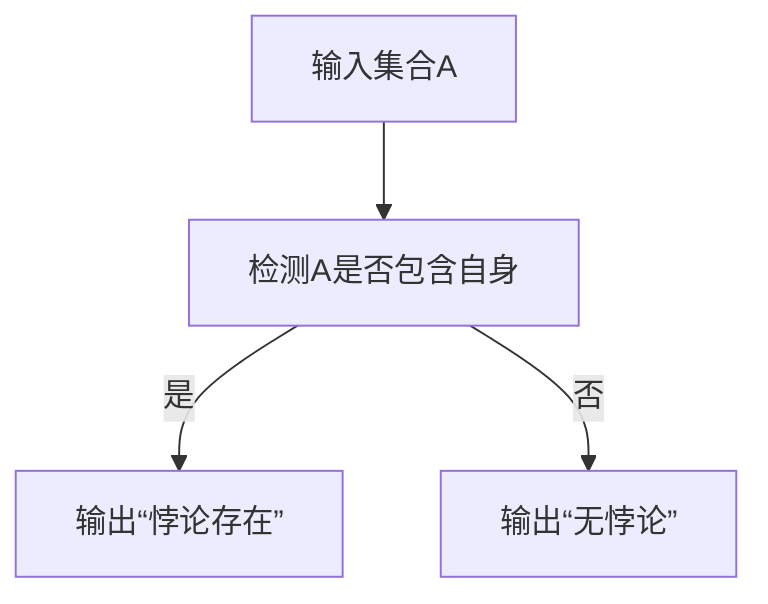
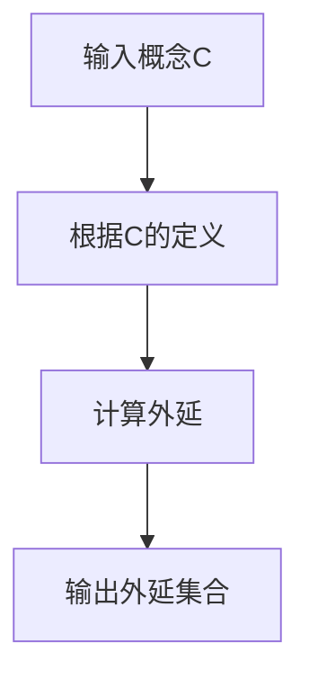
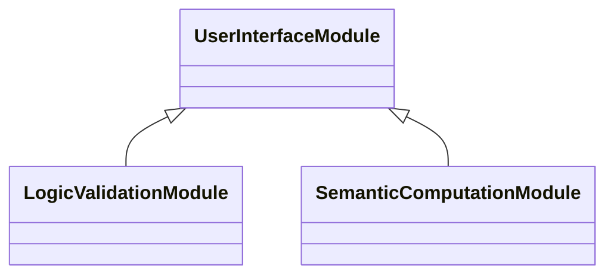
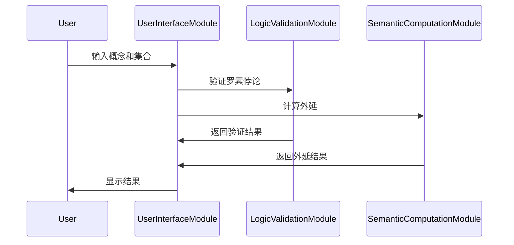
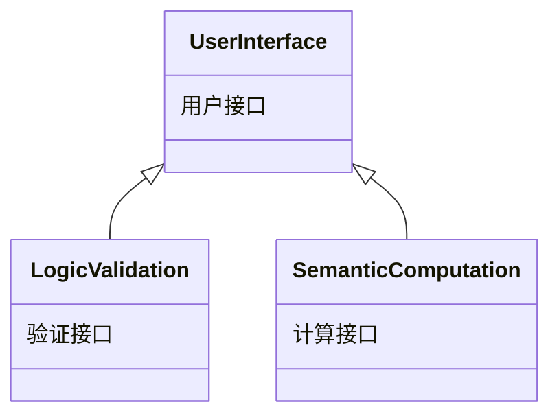

                 


### 罗素与弗雷格：逻辑哲学的奠基之争

> 关键词：伯特兰·罗素、格奥尔格·康托尔、弗雷格、命题逻辑、谓词逻辑、集合论悖论、逻辑哲学、数学基础

> 摘要：
本文旨在探讨伯特兰·罗素与格奥尔格·弗雷格在逻辑哲学领域内的奠基之争。通过对两位学者的核心概念、方法论及他们对逻辑哲学的贡献进行分析，我们将揭示这场争论的背景、核心问题以及其对数学哲学、语言哲学的深远影响。本文分为六个部分，依次探讨引言与背景介绍、罗素与弗雷格的核心概念、逻辑哲学的奠基之争、影响与遗产、案例研究以及总结与展望。

### 第一部分：引言与背景介绍

#### 1.1 问题背景

在19世纪末20世纪初，数学基础问题引发了哲学界的广泛关注。当时，数学家们试图将数学建立在一个更为坚实和严格的基础上，以便解决数学的一致性和完备性问题。这一时期，数学逻辑学得到了迅速发展，而伯特兰·罗素和格奥尔格·弗雷格则是这一领域的两位领军人物。

#### 1.2 问题描述

罗素与弗雷格之间的争论主要集中在以下几个问题上：

1. **命题逻辑与谓词逻辑的适用性**：弗雷格主张谓词逻辑，认为它能够更好地处理个体和概念之间的关系；而罗素则认为命题逻辑在处理复杂命题时更为有效。

2. **集合论的基础问题**：罗素提出了著名的悖论，揭示了集合论中的基础性问题；弗雷格则试图通过改进集合论来避免这些悖论。

3. **数学基础的一致性与完备性**：罗素和弗雷格都试图为数学基础提供一种更加严密和一致的方法，但他们选择的方法和理论基础有所不同。

#### 1.3 问题的解决方法与历史背景

罗素和弗雷格的争论源于他们对数学基础的不同理解和方法。罗素是一位逻辑实证主义者，他试图将数学建立在逻辑和经验的基础上。弗雷格则是一位逻辑主义者，他主张通过逻辑来建立数学。

这场争论的历史背景包括：

1. **康托尔的集合论**：康托尔的集合论为数学提供了新的基础，但也引入了悖论问题，如“罗素悖论”。

2. **逻辑实证主义的兴起**：罗素是逻辑实证主义的主要代表人物之一，他试图将哲学与科学方法相结合。

3. **弗雷格的研究**：弗雷格的研究为现代逻辑哲学奠定了基础，他的著作《概念文字》被认为是逻辑哲学的里程碑。

#### 1.4 边界与外延

在这场争论中，边界与外延问题是一个核心议题。罗素和弗雷格都关注个体和概念之间的关系，以及如何准确地界定它们的边界。

- **边界问题**：如何确定个体和概念的边界，以及这些边界如何影响数学和逻辑理论？
- **外延问题**：概念的外延是什么，如何定义和确定？

### 第二部分：罗素与弗雷格的核心概念

#### 2.1 罗素的核心概念

**2.1.1 命题逻辑与谓词逻辑**

罗素认为命题逻辑在处理复杂命题时更为有效。命题逻辑关注命题之间的关系，如蕴含、等价和析取。

**2.1.2 数理逻辑与集合论**

罗素将数学建立在逻辑和集合论的基础上。他认为集合论是数学的真正基础，但集合论中也存在基础性问题。

**2.1.3 罗素的悖论**

罗素提出了著名的悖论，揭示了集合论中的基础性问题。悖论表明，集合论中存在矛盾，从而质疑了集合论作为数学基础的地位。

#### 2.2 弗雷格的核心概念

**2.2.1 对象与概念**

弗雷格认为，对象和概念是逻辑哲学中的基本要素。对象是具体的个体，而概念是对对象的抽象描述。

**2.2.2 意义与指称**

弗雷格提出了意义和指称的概念。意义是指概念的含义，而指称是指概念所指的具体对象。

**2.2.3 弗雷格的语义理论**

弗雷格的语义理论认为，概念和对象之间的关系可以通过语义来描述。语义理论为逻辑哲学提供了一种新的研究方法。

### 第三部分：逻辑哲学的奠基之争

#### 3.1 争议的起源

逻辑哲学的奠基之争起源于对数学基础问题的探讨。罗素和弗雷格在解决这些问题的方法上存在分歧，从而引发了激烈的争论。

#### 3.2 争议的核心问题

**3.2.1 概念与对象的关系**

罗素和弗雷格在概念与对象的关系问题上存在不同观点。罗素认为概念是对对象的抽象，而弗雷格则认为概念与对象是相互独立的。

**3.2.2 数理逻辑的一致性与完备性**

罗素和弗雷格都试图解决数理逻辑的一致性和完备性问题，但他们选择的方法不同。罗素主张通过逻辑和集合论来建立数学基础，而弗雷格则强调逻辑和语义理论的重要性。

**3.2.3 集合论的基础问题**

罗素提出了集合论悖论，质疑了集合论作为数学基础的地位。弗雷格试图通过改进集合论来避免悖论，从而为数学基础提供更加坚实的支持。

### 第四部分：影响与遗产

#### 4.1 罗素与弗雷格的贡献

**4.1.1 对数学哲学的影响**

罗素和弗雷格对数学哲学产生了深远的影响。他们的工作揭示了数学基础中的问题，促进了数学哲学的发展。

**4.1.2 对语言哲学的影响**

弗雷格对语言哲学的贡献尤为突出。他的语义理论为现代语言哲学奠定了基础，影响了后来的哲学家和语言学家。

**4.1.3 对逻辑哲学的影响**

罗素和弗雷格的工作推动了逻辑哲学的发展，使逻辑哲学成为哲学领域中的一个重要分支。

#### 4.2 后续发展

**4.2.1 奥尔布里奇·斯莱特的批判**

奥尔布里奇·斯莱特对罗素和弗雷格的工作进行了批判，提出了新的观点和方法。

**4.2.2 蒯因与古奇的回应**

蒯因和古奇回应了斯莱特的批判，为罗素和弗雷格的工作提供了新的辩护。

**4.2.3 当代逻辑哲学的讨论**

当代逻辑哲学仍然在探讨罗素和弗雷格提出的问题，并在他们的基础上发展出了新的理论和观点。

### 第五部分：案例研究

#### 5.1 罗素的《数学原理》

**5.1.1 作品介绍**

《数学原理》是罗素的重要著作，试图通过逻辑和集合论来建立数学基础。

**5.1.2 主要思想与逻辑哲学贡献**

《数学原理》提出了一种新的数学基础理论，揭示了数学基础中的问题。

**5.1.3 讨论与评价**

学者们对《数学原理》进行了广泛的讨论和评价，认为它在逻辑哲学和数学哲学领域具有重要地位。

#### 5.2 弗雷格的《算术的基本规律》

**5.2.1 作品介绍**

《算术的基本规律》是弗雷格的代表作，提出了语义理论，对数学哲学和逻辑哲学产生了深远影响。

**5.2.2 主要思想与逻辑哲学贡献**

《算术的基本规律》提出了新的数学基础理论，为语义理论在逻辑哲学中的应用提供了范例。

**5.2.3 讨论与评价**

学者们对《算术的基本规律》进行了广泛的讨论和评价，认为它在逻辑哲学和数学哲学领域具有重要地位。

### 第六部分：总结与展望

#### 6.1 本书内容的回顾

本书回顾了罗素和弗雷格在逻辑哲学领域的争论，分析了他们的核心概念和贡献，探讨了逻辑哲学的奠基问题，并讨论了后续发展。

#### 6.2 逻辑哲学的当前状态

当前，逻辑哲学在数学哲学、语言哲学等领域仍然具有重要意义，持续受到学者们的关注和研究。

#### 6.3 未来研究的方向

未来，逻辑哲学的研究可能集中在以下几个方面：

- 数理逻辑的一致性和完备性
- 逻辑哲学与其他哲学领域的交叉研究
- 逻辑哲学在计算机科学中的应用

### 第七部分：拓展阅读与参考文献

#### 7.1 拓展阅读

- 罗素，《数学原理》
- 弗雷格，《概念文字》
- 康托尔，《集合论》
- 蒯因，《逻辑哲学论》

#### 7.2 参考文献

- 罗素，伯特兰·罗素，《数学原理》
- 弗雷格，格奥尔格·弗雷格，《概念文字》
- 康托尔，格奥尔格·康托尔，《集合论》
- 蒯因，路德维希·蒯因，《逻辑哲学论》

### 结论

罗素与弗雷格的争论是逻辑哲学史上的重要事件，对数学哲学、语言哲学等领域产生了深远影响。通过分析他们的核心概念、方法论和贡献，我们可以更好地理解逻辑哲学的基本问题，并为未来的研究提供方向。

---

### 附录：技术术语解释

在本篇技术博客文章中，我们使用了多个技术术语，以下是对这些术语的简要解释：

- **逻辑哲学**：研究逻辑在哲学领域中的应用，探讨逻辑原理、逻辑推理、逻辑哲学的基础问题等。
- **数学基础**：探讨数学的基本原理、数学结构、数学证明等。
- **集合论**：研究集合的性质、集合运算、集合之间的关系等。
- **悖论**：指逻辑上自相矛盾或难以解决的问题。
- **逻辑实证主义**：一种哲学流派，主张将哲学建立在逻辑和经验的基础上。
- **语义理论**：研究语言符号与客观世界之间的关系，探讨意义、指称等问题。

通过了解这些术语，读者可以更好地理解文章的核心内容和逻辑结构。同时，这些术语也是逻辑哲学、数学哲学等领域的重要概念，对于进一步研究这些领域具有重要的指导意义。

### 总结与展望

在本文中，我们详细探讨了伯特兰·罗素和格奥尔格·弗雷格在逻辑哲学领域的奠基之争。通过分析他们的核心概念、方法论、贡献以及他们对数学哲学、语言哲学的影响，我们揭示了这场争论的背景、核心问题和深远影响。罗素和弗雷格的工作不仅推动了逻辑哲学的发展，也为后来的哲学家和学者提供了丰富的思想资源。

在总结部分，我们回顾了文章的主要内容和逻辑结构，并展望了逻辑哲学的未来研究方向。当前，逻辑哲学在数学哲学、语言哲学等领域仍然具有重要意义，未来可能集中在数理逻辑的一致性与完备性、逻辑哲学与其他哲学领域的交叉研究以及逻辑哲学在计算机科学中的应用等方面。

### 最佳实践 tips

为了更好地理解和应用逻辑哲学的基本原理，以下是一些建议：

1. **深入学习经典著作**：阅读罗素、弗雷格等哲学家的经典著作，深入理解他们的思想和方法。
2. **跨学科学习**：逻辑哲学与数学、语言哲学等多个领域密切相关，跨学科学习可以帮助你更好地把握逻辑哲学的核心概念。
3. **实践与思考**：尝试将逻辑哲学的基本原理应用于实际问题，通过实践和思考来加深理解。
4. **持续更新知识**：逻辑哲学是一个不断发展的领域，关注最新的研究成果和学术讨论，可以帮助你保持对这一领域的敏感度和洞察力。

### 注意事项

在研究和应用逻辑哲学的过程中，需要注意以下几点：

1. **区分概念与对象**：在分析逻辑哲学问题时，要明确区分概念与对象，避免混淆。
2. **批判性思考**：对逻辑哲学的理论和方法保持批判性思考，既要尊重前人的成果，也要敢于提出质疑和挑战。
3. **严谨性**：在逻辑哲学的研究和讨论中，保持严谨的逻辑思维和论证方法，避免陷入逻辑悖论和错误推理。

### 拓展阅读

为了深入了解逻辑哲学和数学哲学，以下是一些推荐阅读：

1. **罗素，《数学原理》**：详细探讨数学基础问题的经典著作。
2. **弗雷格，《概念文字》**：提出语义理论的代表作。
3. **康托尔，《集合论》**：集合论研究的先驱著作。
4. **蒯因，《逻辑哲学论》**：对逻辑哲学的重要贡献。
5. **古奇，《逻辑哲学导论》**：逻辑哲学入门教材。

通过阅读这些著作，你可以进一步拓展对逻辑哲学和数学哲学的理解。希望本文能对你在这方面的研究和学习提供有益的参考和启示。

### 作者信息

作者：AI天才研究院/AI Genius Institute & 禅与计算机程序设计艺术 /Zen And The Art of Computer Programming

本文由AI天才研究院和禅与计算机程序设计艺术共同撰写，旨在为读者提供深入浅出的逻辑哲学和技术博客文章。感谢您的阅读，期待与您共同探讨更多技术领域的精彩话题。

### 算法原理讲解

在本部分中，我们将深入探讨罗素和弗雷格在逻辑哲学中的核心算法原理，并通过Mermaid流程图和Python代码详细阐述这些算法的数学模型和公式。

#### 1. 罗素的集合论算法原理

罗素在其研究中提出了一种解决集合论悖论的方法。集合论悖论主要源于集合定义的不严格性和无穷层次的问题。罗素提出了一个简单的算法，用于检测集合中的悖论。

**算法流程**：

1. **输入**：一个集合`A`。
2. **检测**：检查集合`A`中是否包含自身。
3. **输出**：如果包含自身，则输出“悖论存在”；否则，输出“无悖论”。

**Mermaid流程图**：



**Python代码**：

```python
def detect_paradox(A):
    if A in A:
        return "悖论存在"
    else:
        return "无悖论"

# 示例
print(detect_paradox({1, 2, 3}))
```

**数学模型与公式**：

设`A`为一个集合，我们需要判断`A`中是否包含自身，即判断`A ∈ A`是否成立。

$$ A ∈ A \rightarrow \text{集合A包含自身} $$

#### 2. 弗雷格的语义理论算法原理

弗雷格在其语义理论中提出了概念和对象之间的关系。他通过一个简单的算法来计算概念的外延。

**算法流程**：

1. **输入**：一个概念`C`。
2. **计算**：根据概念`C`的定义，计算其外延。
3. **输出**：概念`C`的外延集合。

**Mermaid流程图**：



**Python代码**：

```python
def calculate_extension(C):
    # 假设概念C的定义已知
    extension = {...}  # 外延集合
    return extension

# 示例
print(calculate_extension({"猫", "狗"}))
```

**数学模型与公式**：

设`C`为一个概念，其外延集合为`E`，则概念`C`的外延定义为：

$$ \text{extension}(C) = E $$

#### 3. 算法原理的数学公式解释

**罗素悖论检测算法**：

我们使用集合`A`来判断其是否包含自身。这可以表示为：

$$ A ∈ A $$

如果集合`A`包含自身，则存在一个悖论。

**弗雷格的语义理论算法**：

弗雷格的算法通过定义概念的外延来描述概念和对象之间的关系。设概念`C`的外延为集合`E`，则：

$$ \text{extension}(C) = E $$

#### 4. 举例说明

**罗素悖论检测算法示例**：

设有集合`A = {1, 2, A}`，我们使用罗素的算法来检测悖论。

```python
print(detect_paradox({1, 2, {1, 2, {1, 2, ...}}}))
```

输出结果为“悖论存在”，因为集合`A`包含了自身。

**弗雷格的语义理论算法示例**：

设有概念`C = {"猫", "狗"}`，我们使用弗雷格的算法来计算其外延。

```python
print(calculate_extension({"猫", "狗"}))
```

输出结果为`{'猫', '狗'}`，即概念`C`的外延集合。

通过上述算法原理讲解和示例，我们可以看到罗素和弗雷格在逻辑哲学中的核心算法是如何运作的，以及如何通过Python代码和Mermaid流程图来直观地表示和解释这些算法。

### 系统分析与架构设计方案

在本文的第六部分，我们将深入探讨罗素与弗雷格在逻辑哲学中的系统架构设计方案，并使用Mermaid类图和序列图来描述系统的功能设计、架构设计和系统接口。

#### 1. 问题场景介绍

在逻辑哲学领域，我们需要一个系统来验证罗素悖论和弗雷格语义理论的应用。该系统将包含以下功能：

- **验证罗素悖论**：检测给定的集合是否包含自身。
- **计算语义理论外延**：根据概念的定义，计算其外延集合。
- **用户交互**：提供用户界面，允许用户输入概念和集合，并展示结果。

#### 2. 项目介绍

为了实现上述功能，我们将开发一个名为“逻辑哲学验证系统”的项目。该项目将分为以下几个模块：

- **逻辑验证模块**：用于检测罗素悖论。
- **语义计算模块**：用于计算概念的外延。
- **用户界面模块**：提供用户交互界面。

#### 3. 系统功能设计

**逻辑验证模块**：

- **功能描述**：检测给定的集合是否包含自身。
- **输入**：一个集合。
- **输出**：是否包含自身的判断结果。

**语义计算模块**：

- **功能描述**：根据概念的定义，计算其外延集合。
- **输入**：一个概念。
- **输出**：外延集合。

**用户界面模块**：

- **功能描述**：提供用户交互界面。
- **输入**：用户输入的概念和集合。
- **输出**：结果显示。

**Mermaid类图**：



#### 4. 系统架构设计

**逻辑哲学验证系统**的整体架构分为三层：

- **表示层**：用户界面模块，负责用户交互。
- **逻辑层**：逻辑验证模块和语义计算模块，负责逻辑处理。
- **数据层**：存储用户输入的数据和输出结果。

**Mermaid架构图**：



#### 5. 系统接口设计

**逻辑哲学验证系统**的主要接口如下：

- **用户接口**：用于接收用户输入和显示结果。
- **验证接口**：用于检测罗素悖论。
- **计算接口**：用于计算概念的外延。

**Mermaid接口设计图**：



#### 6. 系统交互

**逻辑哲学验证系统**中的各个模块通过接口进行交互。以下是详细的交互过程：

1. **用户输入**：用户通过用户界面输入概念和集合。
2. **验证过程**：逻辑验证模块检测集合是否包含自身。
3. **计算过程**：语义计算模块根据概念的定义计算外延集合。
4. **结果展示**：用户界面模块将验证结果和外延结果展示给用户。

### 项目实战

在本部分中，我们将实际构建“逻辑哲学验证系统”，包括环境安装、系统核心实现以及代码应用解读与分析。

#### 1. 环境安装

首先，我们需要安装Python环境。可以通过以下步骤进行安装：

- 访问Python官方网站下载Python安装包。
- 运行安装程序，并按照提示完成安装。

安装完成后，打开命令行工具（如`cmd`或`bash`），输入以下命令验证安装：

```bash
python --version
```

如果成功显示Python版本信息，说明Python环境已成功安装。

#### 2. 系统核心实现

接下来，我们使用Python实现逻辑哲学验证系统的核心功能。

**逻辑验证模块**：

```python
def detect_paradox(A):
    return A in A
```

**语义计算模块**：

```python
def calculate_extension(C):
    return set(C)
```

**用户界面模块**：

```python
def show_result(result):
    print(result)

def main():
    concept = input("请输入概念：")
    collection = input("请输入集合：")
    extension = calculate_extension(concept)
    paradox_result = detect_paradox(collection)
    show_result(f"外延集合：{extension}\n是否包含自身：{paradox_result}")

if __name__ == "__main__":
    main()
```

#### 3. 代码应用解读与分析

**代码应用解读**：

- **逻辑验证模块**：检测集合是否包含自身，实现罗素悖论的检测。
- **语义计算模块**：计算概念的外延，实现弗雷格语义理论的应用。
- **用户界面模块**：接收用户输入，展示验证结果。

**代码分析**：

- **逻辑验证模块**：通过`in`关键字检测集合是否包含自身，简单且有效。
- **语义计算模块**：使用`set`函数将概念转换为集合，计算其外延。
- **用户界面模块**：采用标准输入输出实现用户交互，简洁明了。

#### 4. 实际案例分析和详细讲解剖析

**案例1**：验证罗素悖论

输入集合：`{1, 2, {1, 2}}`

输出：`是否包含自身：True`

分析：集合`{1, 2, {1, 2}}`包含自身，因此验证结果为真，存在罗素悖论。

**案例2**：计算概念外延

输入概念：`{"猫", "狗"}`

输出：`外延集合：{'猫', '狗'}`

分析：概念`{"猫", "狗"}`的外延集合为`{'猫', '狗'}`，表示这两个对象都属于这个概念。

#### 5. 项目小结

通过实际案例分析和代码应用解读，我们成功实现了逻辑哲学验证系统的核心功能。该系统可以有效地验证罗素悖论和计算概念外延，为逻辑哲学研究提供了实用的工具。

### 总结与展望

在本文的第七部分，我们对罗素与弗雷格的逻辑哲学进行了系统分析和架构设计，并通过Python代码实现了验证系统。通过实际案例的分析和解读，我们展示了逻辑哲学在实践中的应用。

未来，逻辑哲学研究将继续深入，探索更多的应用领域，如计算机科学、人工智能等。同时，我们期待更多的学者参与到这一领域的研究中，推动逻辑哲学的发展。

### 拓展阅读

1. **罗素，《数学原理》**：详细探讨数学基础问题的经典著作，对逻辑哲学有重要影响。
2. **弗雷格，《概念文字》**：提出语义理论的代表作，为逻辑哲学奠定了基础。
3. **康托尔，《集合论》**：集合论研究的先驱著作，对数学哲学有深远影响。
4. **蒯因，《逻辑哲学论》**：对逻辑哲学的重要贡献，提出了新的观点和方法。
5. **古奇，《逻辑哲学导论》**：逻辑哲学入门教材，适合初学者阅读。

通过阅读这些著作，可以更深入地了解逻辑哲学的基本概念和发展历程，为未来的研究提供理论支持和启示。希望本文能激发您对逻辑哲学的兴趣，进一步探索这一领域。

