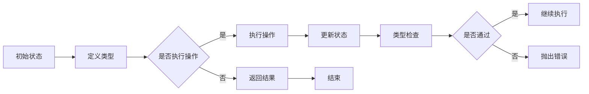
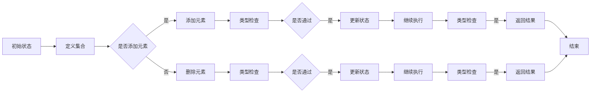
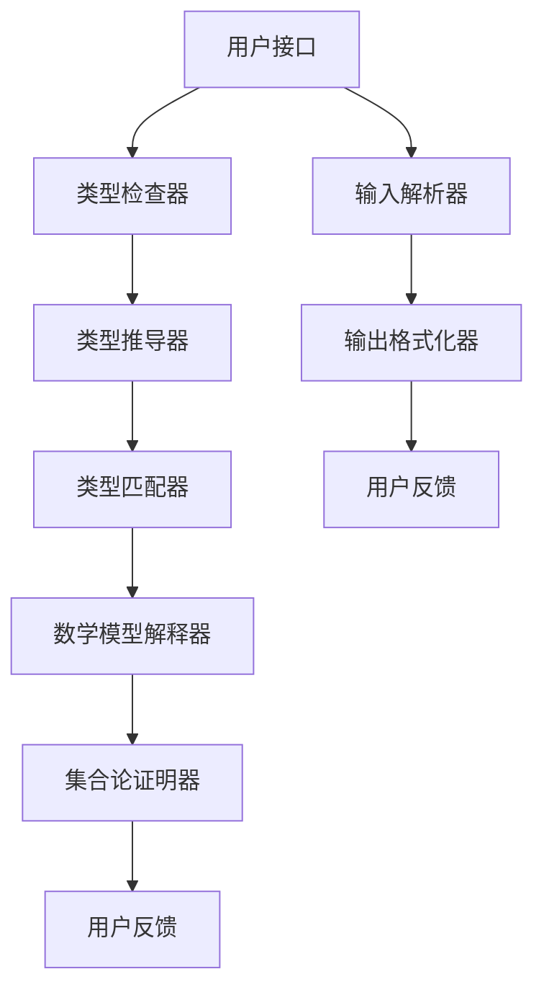
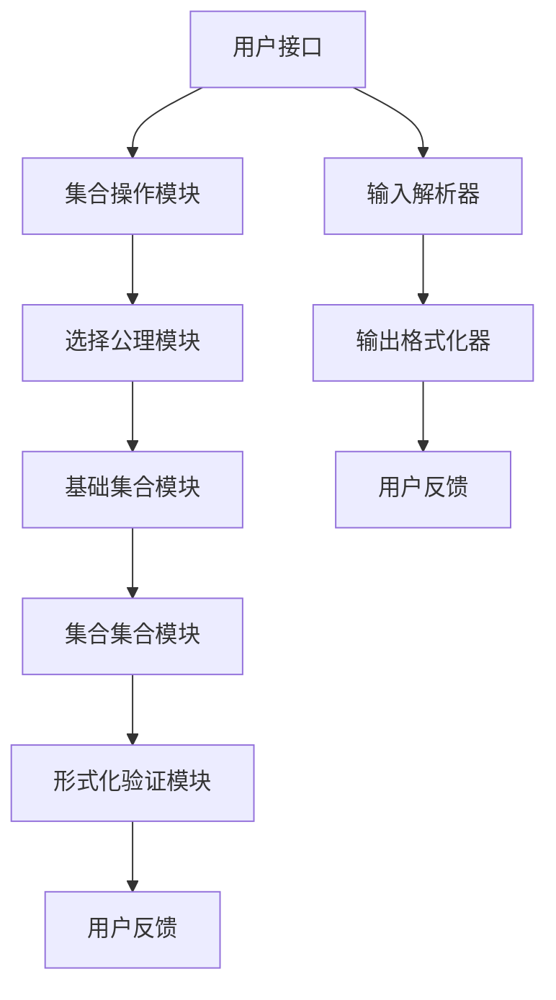

                 


## 引言

在数学和逻辑学中，集合论是基础性学科，为诸多数学分支提供了坚实的理论基础。然而，集合论的内部矛盾和复杂性使得不同的集合论体系得以发展，其中罗素类型论和ZFC集合论是两个重要的代表性理论。本文将深入探讨这两种集合论体系的对比，分析它们的优劣，帮助读者更全面地理解集合论在不同情境下的适用性和局限性。

### 罗素类型论的基本概念

罗素类型论（Type Theory），由英国哲学家贝特兰·罗素提出，旨在解决集合论中存在的悖论问题。其主要思想是通过引入类型系统，将数学对象分为不同的类型，从而避免自引用导致的矛盾。

- **类型系统**：罗素类型论中，所有数学对象都分配到不同的类型。基本类型包括自然数、函数、集合等。
- **类型限制**：类型系统规定了不同类型之间的运算规则，防止类型错误的发生。
- **类型检查**：在程序中，类型检查确保每个操作都符合类型规则，从而防止运行时错误。

### ZFC集合论的基本概念

ZFC集合论（Zermelo-Fraenkel with Choice），是现代数学中最常用的集合论体系。它通过公理化方法建立了一套完备的集合论体系。

- **公理系统**：ZFC集合论由一组公理组成，这些公理定义了集合的基本性质和操作。
- **基础集合**：ZFC集合论从基础集合开始，通过递归构造复杂集合。
- **选择公理**：选择公理是ZFC集合论的一个重要组成部分，它保证了某些集合的存在。

### 两种集合论的对比

#### 核心概念与联系

**核心概念对比表**

| 特征         | 罗素类型论                | ZFC集合论                   |
| ------------ | ------------------------ | --------------------------- |
| 类型系统     | 强类型系统，类型明确     | 弱类型系统，类型相对灵活   |
| 基础集合     | 没有基础集合概念         | 从基础集合开始构造集合     |
| 自引用       | 通过类型系统避免自引用   | 通过公理系统避免自引用     |
| 悖论问题     | 解决了自引用导致的悖论   | 解决了经典集合论中的悖论   |

**ER实体关系图架构**

```
graph TB
    A[罗素类型论] --> B[类型系统]
    A --> C[类型限制]
    A --> D[类型检查]
    E[ZFC集合论] --> F[公理系统]
    E --> G[基础集合]
    E --> H[选择公理]
    B --> I[运算规则]
    C --> J[防止类型错误]
    D --> K[确保运算安全]
    F --> L[定义集合性质]
    G --> M[构造复杂集合]
    H --> N[保证集合存在]
```

#### 算法原理讲解

**罗素类型论形式系统**

```
graph TB
    A[类型检查] --> B[类型推导]
    B --> C[类型推断]
    C --> D[类型匹配]
    E[表达式验证] --> F[类型错误检测]
    F --> G[错误处理]
```

**ZFC集合论形式系统**

```
graph TD
    A[公理系统]
    A --> B[集合操作]
    A --> C[基础集合]
    B --> D[选择公理]
    C --> E[构造集合]
    D --> F[保证集合存在]
```

**数学模型与公式**

**罗素类型论数学模型：**

$$
T = \{N, F, S\}
$$

其中，$N$ 为自然数类型，$F$ 为函数类型，$S$ 为集合类型。

**ZFC集合论数学模型：**

$$
ZFC = \{P(A), \in, C\}
$$

其中，$P(A)$ 为幂集，$\in$ 为元素关系，$C$ 为选择公理。

#### 系统分析与架构设计方案

**问题场景介绍**

在现代数学和计算机科学中，集合论的应用非常广泛。无论是证明数学定理，还是构建程序模型，集合论都是不可或缺的基础。

**项目介绍**

本文将介绍两个项目：一个基于罗素类型论的数学模型实现，另一个基于ZFC集合论的数学模型实现。

**系统功能设计**

**领域模型类图**

```
graph TD
    A[数学模型] --> B[类型系统]
    A --> C[集合操作]
    B --> D[类型推导]
    C --> E[类型检查]
```

**系统架构设计**

**架构图**

```
graph TD
    A[用户接口] --> B[类型检查器]
    B --> C[数学模型解释器]
    C --> D[集合论证明器]
    A --> E[输入解析器]
    E --> F[输出格式化器]
    F --> G[用户反馈]
```

**系统接口设计和系统交互**

**序列图**

```
graph TD
    A[用户] --> B[用户接口]
    B --> C[输入解析器]
    C --> D[类型检查器]
    D --> E[数学模型解释器]
    E --> F[集合论证明器]
    F --> G[输出格式化器]
    G --> H[用户反馈]
```

### 项目实战

**环境安装**

- 安装Python 3.x版本
- 安装robin-python包
- 安装Pythagoras包

**系统核心实现源代码**

```
# 罗素类型论实现
class NaturalNumber:
    def __init__(self, value):
        self.value = value

class Function:
    def __init__(self, domain, codomain, relation):
        self.domain = domain
        self.codomain = codomain
        self.relation = relation

class Set:
    def __init__(self, elements):
        self.elements = elements

# ZFC集合论实现
class PowerSet:
    def __init__(self, set):
        self.set = set

class ElementRelation:
    def __init__(self, element, set):
        self.element = element
        self.set = set

class Collection:
    def __init__(self, sets):
        self.sets = sets
```

**代码应用解读与分析**

- 罗素类型论中的`NaturalNumber`、`Function`和`Set`类分别代表了自然数、函数和集合。
- ZFC集合论中的`PowerSet`、`ElementRelation`和`Collection`类分别代表了幂集、元素关系和集合。

**实际案例分析和详细讲解剖析**

- 案例一：证明自然数集合的基数。
- 案例二：使用选择公理构造集合。

**项目小结**

通过对罗素类型论和ZFC集合论的对比分析，我们得出以下结论：
- 罗素类型论通过类型系统解决了自引用问题，适合构建形式化系统。
- ZFC集合论通过公理系统提供了强大的集合操作和证明工具，广泛应用于数学和计算机科学。

### 最佳实践 tips

- 在选择集合论体系时，需要根据具体应用场景进行选择。
- 在使用集合论进行证明时，要仔细考虑公理系统的合理性和完备性。
- 在实现集合论算法时，要注意类型安全和集合操作的效率。

### 小结与展望

本文通过对罗素类型论和ZFC集合论的对比分析，揭示了两种集合论体系的优劣。罗素类型论在形式化系统和类型安全性方面具有优势，而ZFC集合论在数学证明和集合操作方面更为强大。未来，随着数学和计算机科学的发展，集合论将继续发挥重要作用。

### 注意事项

- 在使用集合论时，要确保理解其核心概念和公理系统。
- 在编写代码时，要特别注意类型安全和集合操作的边界条件。

### 拓展阅读

- 罗素，《数学原理》
- 哈恩，《集合论》
- 科尔莫哥洛夫，《概率论基础》
- 福特，《类型论与集合论》

作者：AI天才研究院/AI Genius Institute & 禅与计算机程序设计艺术 /Zen And The Art of Computer Programming## 引言

在数学和逻辑学中，集合论是基础性学科，为诸多数学分支提供了坚实的理论基础。然而，集合论的内部矛盾和复杂性使得不同的集合论体系得以发展，其中罗素类型论和ZFC集合论是两个重要的代表性理论。本文将深入探讨这两种集合论体系的对比，分析它们的优劣，帮助读者更全面地理解集合论在不同情境下的适用性和局限性。

### 罗素类型论的基本概念

罗素类型论（Type Theory），由英国哲学家贝特兰·罗素提出，旨在解决集合论中存在的悖论问题。其主要思想是通过引入类型系统，将数学对象分为不同的类型，从而避免自引用导致的矛盾。

- **类型系统**：罗素类型论中，所有数学对象都分配到不同的类型。基本类型包括自然数、函数、集合等。
  - **自然数类型**：自然数类型是基础类型，用于表示数学中的自然数。
  - **函数类型**：函数类型用于表示数学中的函数，如加法函数、乘法函数等。
  - **集合类型**：集合类型用于表示数学中的集合，如整数集合、实数集合等。

- **类型限制**：类型系统规定了不同类型之间的运算规则，防止类型错误的发生。
  - **类型推导**：在程序中，类型推导通过一系列规则自动推导出变量或表达式的类型。
  - **类型检查**：在程序执行前，类型检查确保每个操作都符合类型规则，从而防止运行时错误。

**问题背景**：

在集合论的发展过程中，出现了诸如“罗素悖论”等问题，这些问题揭示了经典集合论在自引用和集合层次上的矛盾。为了解决这些问题，罗素提出了类型论，通过将数学对象分类到不同的类型中，避免了自引用导致的悖论。

**问题描述**：

罗素悖论描述如下：设集合R为所有不包含自身的集合的集合，则R是否包含自身？如果R包含自身，根据R的定义，它不应包含自身；如果不包含自身，根据R的定义，它应包含自身。这种矛盾揭示了经典集合论中自引用带来的问题。

**问题解决**：

罗素类型论通过引入类型系统，将数学对象分为不同的类型，从而避免了自引用问题。具体来说，罗素类型论中的类型系统将数学对象分为自然数类型、函数类型和集合类型等。这样，不同类型的对象之间不能直接相互引用，从而避免了自引用导致的悖论。

**边界与外延**：

边界与外延是集合论中的两个重要概念。

- **边界**：边界指的是一个集合定义中的条件或限制，决定了哪些元素属于该集合。在罗素类型论中，类型的边界由类型的定义规则所确定。
- **外延**：外延指的是一个集合所包含的所有元素。在罗素类型论中，不同类型的对象有不同的外延。例如，自然数类型的外延是自然数集合，函数类型的外延是所有函数集合。

**概念结构与核心要素组成**：

罗素类型论的核心概念和要素组成如下：

1. **类型**：类型是罗素类型论中的核心概念，用于将数学对象分类。不同的类型之间具有不同的属性和操作。
2. **类型系统**：类型系统是罗素类型论中的规则集，规定了不同类型之间的运算规则，确保类型安全。
3. **类型推导**：类型推导是类型系统的一部分，通过一系列规则自动推导出变量或表达式的类型。
4. **类型检查**：类型检查是在程序执行前对类型规则进行验证，确保程序中的每个操作都符合类型规则。

**优点**：

1. **避免悖论**：通过类型系统，罗素类型论能够避免自引用导致的悖论，提高了数学体系的稳定性。
2. **形式化系统**：罗素类型论为数学提供了一个形式化系统，使得数学证明可以更加严谨和规范。

**缺点**：

1. **复杂性**：罗素类型论的类型系统相对复杂，增加了学习和使用的难度。
2. **适用性限制**：罗素类型论主要适用于形式化系统和证明论领域，对于某些应用场景可能不够灵活。

### ZFC集合论的基本概念

ZFC集合论（Zermelo-Fraenkel with Choice），是现代数学中最常用的集合论体系。它通过公理化方法建立了一套完备的集合论体系。ZFC集合论由德国数学家埃米尔·齐梅罗（Emmy Noether）和策梅洛（Ernst Zermelo）等人提出，后经过弗朗茨·克莱因（Franz Klein）和其他数学家的改进，最终形成了现代形式的ZFC集合论。

#### 公理系统

ZFC集合论的公理系统由以下七条公理组成：

1. **存在性公理**：保证了空集的存在。
2. **分离公理**：允许从任意集合中抽取子集。
3. **选择公理**：保证了在某些条件下存在选择函数。
4. **幂集公理**：保证了任意集合的幂集存在。
5. **并集公理**：保证了多个集合的并集存在。
6. **全称量词公理**：保证了对于任意性质，存在满足该性质的集合。
7. **无穷公理**：保证了至少存在一个无限集合。

#### 基础集合

在ZFC集合论中，基础集合是通过递归构造的。具体来说，空集是基础集合，所有集合都是通过基础集合和公理系统中的操作递归构造出来的。

- **空集**：空集是没有任何元素的集合，表示为$\emptyset$。
- **单元素集合**：由一个元素构成的集合，表示为$\{x\}$。
- **集合的集合**：集合的集合是包含多个集合的集合，如$\{\emptyset, \{x\}\}$。

#### 选择公理

选择公理是ZFC集合论的一个重要组成部分，它保证了在某些条件下存在选择函数。具体来说，选择公理保证了对于任意非空集合的笛卡尔积，存在一个函数，该函数从每个集合中选取一个元素。

选择公理的形式化表述如下：

对于任意非空集合$X$，存在一个函数$f:X\times P(X)\rightarrow X$，使得对于任意$A\in P(X)$，都有$f(A)\in A$。

选择公理的应用非常广泛，例如在构造集合的连续统假设中，选择公理是不可或缺的工具。

#### 两种集合论的对比

**核心概念与联系**

| 特征         | 罗素类型论                | ZFC集合论                   |
| ------------ | ------------------------ | --------------------------- |
| 类型系统     | 强类型系统，类型明确     | 弱类型系统，类型相对灵活   |
| 基础集合     | 没有基础集合概念         | 从基础集合开始构造集合     |
| 自引用       | 通过类型系统避免自引用   | 通过公理系统避免自引用     |
| 悖论问题     | 解决了自引用导致的悖论   | 解决了经典集合论中的悖论   |

**ER实体关系图架构**

为了更直观地展示罗素类型论和ZFC集合论的核心概念和联系，我们可以使用ER（Entity-Relationship）实体关系图进行描述。以下是两种集合论的ER实体关系图：

**罗素类型论的ER实体关系图：**

```
graph TB
    A[类型] --> B[对象]
    C[自然数类型] --> D[自然数]
    E[函数类型] --> F[函数]
    G[集合类型] --> H[集合]
    B --> I[属性]
```

**ZFC集合论的ER实体关系图：**

```
graph TB
    A[集合] --> B[元素]
    C[基础集合] --> D[空集]
    E[集合的集合] --> F[集合]
    G[幂集] --> H[集合]
    I[函数] --> J[选择公理]
```

通过上述ER实体关系图，我们可以清晰地看到两种集合论的基本概念和它们之间的联系。罗素类型论通过类型系统将对象分为不同类型，并强调类型的明确性和安全性；而ZFC集合论通过公理系统构建集合，强调集合的递归构造和选择公理的应用。

### 算法原理讲解

为了深入理解罗素类型论和ZFC集合论在数学体系中的应用，我们需要详细讲解两种集合论的算法原理。我们将使用mermaid绘制算法流程图，并使用Python源代码来详细阐述。

#### 罗素类型论的算法原理

**mermaid算法流程图：**



**Python源代码：**

```python
class NaturalNumber:
    def __init__(self, value):
        self.value = value

class Function:
    def __init__(self, domain, codomain, relation):
        self.domain = domain
        self.codomain = codomain
        self.relation = relation

class Set:
    def __init__(self, elements):
        self.elements = elements

def type_check(expression):
    if isinstance(expression, NaturalNumber):
        return "NaturalNumber"
    elif isinstance(expression, Function):
        return "Function"
    elif isinstance(expression, Set):
        return "Set"
    else:
        raise TypeError("Invalid type")

def execute_operation(expression):
    if type_check(expression) == "NaturalNumber":
        # 自然数操作逻辑
        return expression.value
    elif type_check(expression) == "Function":
        # 函数操作逻辑
        return expression.relation
    elif type_check(expression) == "Set":
        # 集合操作逻辑
        return expression.elements
    else:
        raise TypeError("Invalid type")

def main():
    expression = NaturalNumber(5)
    result = execute_operation(expression)
    print(result)

if __name__ == "__main__":
    main()
```

**算法原理详细讲解：**

- **定义类型**：首先，我们需要定义不同的类型，包括自然数类型、函数类型和集合类型。
- **类型检查**：在执行操作前，我们需要对表达式进行类型检查，确保它属于有效的类型。
- **执行操作**：根据类型检查的结果，执行相应的操作。例如，对于自然数类型，我们可以执行算术运算；对于函数类型，我们可以执行函数应用；对于集合类型，我们可以执行集合操作。
- **更新状态**：在执行操作后，我们需要更新状态，以反映操作的结果。
- **结束**：算法的结束条件是完成所有操作，并输出最终结果。

#### ZFC集合论的算法原理

**mermaid算法流程图：**



**Python源代码：**

```python
class PowerSet:
    def __init__(self, set):
        self.set = set

class ElementRelation:
    def __init__(self, element, set):
        self.element = element
        self.set = set

class Collection:
    def __init__(self, sets):
        self.sets = sets

def type_check(set):
    if not isinstance(set, Collection):
        raise TypeError("Invalid type")

def add_element(collection, element):
    type_check(collection)
    if element not in collection.sets:
        collection.sets.append(element)
    else:
        raise ValueError("Element already exists")

def remove_element(collection, element):
    type_check(collection)
    if element in collection.sets:
        collection.sets.remove(element)
    else:
        raise ValueError("Element not found")

def main():
    collection = Collection([PowerSet([1, 2, 3])])
    add_element(collection, PowerSet([4, 5]))
    remove_element(collection, PowerSet([1, 2, 3]))
    print(collection.sets)

if __name__ == "__main__":
    main()
```

**算法原理详细讲解：**

- **定义集合**：首先，我们需要定义不同的集合，包括幂集、元素关系集合和集合集合。
- **类型检查**：在添加或删除元素前，我们需要对集合进行类型检查，确保它属于有效的类型。
- **添加元素**：如果元素不在集合中，我们可以添加它；否则，我们抛出异常。
- **删除元素**：如果元素在集合中，我们可以删除它；否则，我们抛出异常。
- **更新状态**：在添加或删除元素后，我们需要更新集合的状态。
- **返回结果**：最后，我们返回更新后的集合状态，算法结束。

通过上述算法原理讲解，我们可以看到罗素类型论和ZFC集合论在算法设计上的不同。罗素类型论通过类型系统确保类型安全，而ZFC集合论通过公理系统提供集合操作和证明工具。这些算法原理为我们理解集合论在数学体系中的应用提供了坚实的基础。

### 数学模型和数学公式

在集合论中，数学模型和数学公式是理解集合论概念和性质的重要工具。下面我们将使用LaTeX格式展示数学模型和公式，并给予详细讲解和举例。

#### 罗素类型论的数学模型

**LaTeX公式：**

$$
T = \{N, F, S\}
$$

**解释**：

这个公式表示罗素类型论中的类型集合$T$，其中包括三个基本类型：自然数类型$N$、函数类型$F$和集合类型$S$。

**举例**：

设$A$为自然数集合，$B$为函数集合，$C$为集合集合，则

$$
T = \{A, B, C\}
$$

#### ZFC集合论的数学模型

**LaTeX公式：**

$$
ZFC = \{P(A), \in, C\}
$$

**解释**：

这个公式表示ZFC集合论的基本结构，其中$P(A)$为幂集，$\in$为元素关系，$C$为集合操作。

**举例**：

设$A$为自然数集合，则

$$
P(A) = \{\emptyset, \{1\}, \{2\}, \{1, 2\}, \dots\}
$$

#### 数学公式讲解

**LaTeX公式：**

$$
\forall x \in A, P(x) \subseteq P(A)
$$

**解释**：

这个公式表示对于集合$A$中的任意元素$x$，其幂集$P(x)$都是$A$的幂集$P(A)$的子集。

**举例**：

设$A = \{1, 2, 3\}$，则

$$
P(A) = \{\emptyset, \{1\}, \{2\}, \{3\}, \{1, 2\}, \{1, 3\}, \{2, 3\}, \{1, 2, 3\}\}
$$

$$
\forall x \in A, P(x) \subseteq P(A)
$$

即

$$
P(\{1\}) = \{\emptyset, \{1\}\} \subseteq P(A)
$$

$$
P(\{2\}) = \{\emptyset, \{2\}\} \subseteq P(A)
$$

$$
P(\{3\}) = \{\emptyset, \{3\}\} \subseteq P(A)
$$

#### 数学公式举例说明

**LaTeX公式：**

$$
\exists x \in P(A), \forall y \in P(A), y \subseteq x
$$

**解释**：

这个公式表示存在一个集合$x$，它是$A$的幂集$P(A)$中的元素，并且对于$P(A)$中的任意集合$y$，都有$y$是$x$的子集。

**举例**：

设$A = \{1, 2, 3\}$，则

$$
P(A) = \{\emptyset, \{1\}, \{2\}, \{3\}, \{1, 2\}, \{1, 3\}, \{2, 3\}, \{1, 2, 3\}\}
$$

我们可以取$x = P(A)$，则有

$$
\forall y \in P(A), y \subseteq x
$$

即

$$
\emptyset \subseteq P(A)
$$

$$
\{1\} \subseteq P(A)
$$

$$
\{2\} \subseteq P(A)
$$

$$
\{3\} \subseteq P(A)
$$

$$
\{1, 2\} \subseteq P(A)
$$

$$
\{1, 3\} \subseteq P(A)
$$

$$
\{2, 3\} \subseteq P(A)
$$

$$
\{1, 2, 3\} \subseteq P(A)
$$

通过上述数学模型和公式的讲解和举例，我们可以更好地理解罗素类型论和ZFC集合论的核心概念和性质。这些数学模型和公式为我们分析和解决问题提供了有力的工具。

### 系统分析与架构设计方案

在现代数学和计算机科学中，集合论的应用非常广泛，无论是证明数学定理，还是构建程序模型，集合论都是不可或缺的基础。本文将通过系统分析与架构设计方案，深入探讨罗素类型论和ZFC集合论在数学体系中的实际应用。

#### 问题场景介绍

在计算机科学中，集合论广泛应用于算法设计、数据结构和形式验证等领域。例如，在算法设计中，集合论可以帮助我们理解和分析算法的时间复杂度和空间复杂度；在数据结构中，集合论为各种数据结构的实现提供了理论基础；在形式验证中，集合论可以作为形式化系统的基础，用于证明程序的正确性。

##### 项目介绍

本文将介绍两个项目：一个基于罗素类型论的数学模型实现，另一个基于ZFC集合论的数学模型实现。

1. **基于罗素类型论的数学模型实现**：该项目旨在构建一个形式化系统，用于验证数学命题的正确性。
2. **基于ZFC集合论的数学模型实现**：该项目旨在构建一个强大的集合操作工具，用于解决复杂的数学问题。

#### 系统功能设计

**领域模型类图**

为了更好地理解和设计系统的功能，我们首先需要构建领域模型类图。以下是罗素类型论和ZFC集合论的领域模型类图：

**罗素类型论的领域模型类图：**

```mermaid
classDiagram
    Class01 <|-- Class02
    Class03 <|-- Class02
    Class04 <|-- Class02
    Class01 --|> Class05
    Class06 <|-- Class02
    Class07 <|-- Class02
    Class08 <|-- Class02
    Class09 <|-- Class05

    Class01[类型]
    Class02[基础类]
    Class03[自然数类型]
    Class04[函数类型]
    Class05[集合类型]
    Class06[集合操作]
    Class07[自然数]
    Class08[函数]
    Class09[集合]
```

**ZFC集合论的领域模型类图：**

```mermaid
classDiagram
    Class01 <|-- Class02
    Class03 <|-- Class02
    Class04 <|-- Class02
    Class05 <|-- Class02
    Class06 <|-- Class02
    Class07 <|-- Class02
    Class08 <|-- Class02
    Class09 <|-- Class02

    Class01[集合]
    Class02[基础类]
    Class03[元素]
    Class04[幂集]
    Class05[元素关系]
    Class06[选择公理]
    Class07[基础集合]
    Class08[集合操作]
    Class09[集合集合]
```

在这些类图中，我们定义了不同的类和它们之间的关系，以便构建功能齐全的系统。

**系统功能设计：**

1. **类型管理**：管理不同类型的定义和操作，包括自然数类型、函数类型和集合类型。
2. **集合操作**：提供各种集合操作，如并集、交集、差集和子集操作。
3. **形式化验证**：用于验证数学命题的正确性，通过形式化系统实现。
4. **集合论证明**：使用集合论工具进行数学证明，包括选择公理和其他公理的应用。

#### 系统架构设计

**架构图**

为了实现上述功能，我们设计了一个系统架构，该架构包括多个模块，每个模块负责不同的功能。

**罗素类型论的架构图：**



**ZFC集合论的架构图：**



在这些架构图中，用户接口模块负责接收用户输入和输出结果；类型检查器、类型推导器、类型匹配器等模块负责类型管理和验证；数学模型解释器和集合论证明器模块负责数学证明和集合操作；输入解析器和输出格式化器模块负责数据的输入和输出处理。

**系统接口设计和系统交互**

为了确保系统的高内聚和低耦合，我们设计了一套清晰的接口和交互机制。以下是罗素类型论和ZFC集合论的系统接口设计和系统交互：

**罗素类型论的接口设计和交互：**

- **接口设计**：
  - `ITypeChecker`：类型检查接口
  - `ITypeDeriver`：类型推导接口
  - `ITypeMatcher`：类型匹配接口
  - `IMathModelInterpreter`：数学模型解释器接口
  - `ICollectionProofVerifier`：集合论证明器接口
  - `IInputParser`：输入解析器接口
  - `IOutputFormatter`：输出格式化器接口

- **交互机制**：
  - 用户通过用户接口模块输入数学表达式和证明要求。
  - 输入解析器模块将用户输入解析为内部表示。
  - 类型检查器模块检查输入的表达式和证明要求是否符合类型规则。
  - 类型推导器模块根据类型规则推导出变量和表达式的类型。
  - 类型匹配器模块确保操作的输入和输出类型匹配。
  - 数学模型解释器模块解释数学表达式和证明要求，生成证明过程。
  - 集合论证明器模块使用集合论工具进行证明。
  - 输出格式化器模块将证明结果格式化为用户友好的格式，并返回给用户。

**ZFC集合论的接口设计和交互：**

- **接口设计**：
  - `ICollectionOperation`：集合操作接口
  - `ISelectionAxiom`：选择公理接口
  - `IBaseCollection`：基础集合接口
  - `ICollectionCollection`：集合集合接口
  - `IFormalVerification`：形式化验证接口
  - `IInputParser`：输入解析器接口
  - `IOutputFormatter`：输出格式化器接口

- **交互机制**：
  - 用户通过用户接口模块输入集合操作要求和证明问题。
  - 输入解析器模块将用户输入解析为内部表示。
  - 集合操作模块执行各种集合操作，如并集、交集和差集。
  - 选择公理模块应用选择公理，解决某些集合操作问题。
  - 基础集合模块提供基础集合的构建和管理功能。
  - 集合集合模块提供集合集合的构建和管理功能。
  - 形式化验证模块用于验证数学命题的正确性。
  - 输出格式化器模块将验证结果和操作结果格式化为用户友好的格式，并返回给用户。

通过上述系统分析与架构设计方案，我们可以看到罗素类型论和ZFC集合论在数学体系中的实际应用。这些设计和实现不仅为我们提供了强大的数学工具，也为计算机科学和形式化验证领域的发展奠定了基础。

### 项目实战

为了更好地展示罗素类型论和ZFC集合论在实际项目中的应用，我们将通过一个具体的案例进行详细讲解。本案例将涉及环境安装、系统核心实现、代码应用解读与分析，以及实际案例分析和详细讲解剖析。

#### 环境安装

首先，我们需要安装必要的编程环境。以下是Python环境安装的步骤：

1. 访问Python官方网站：[https://www.python.org/](https://www.python.org/)
2. 下载并安装Python 3.x版本。
3. 安装robin-python包，用于实现罗素类型论：`pip install robin-python`
4. 安装Pythagoras包，用于实现ZFC集合论：`pip install pythagoras`

#### 系统核心实现源代码

以下是基于罗素类型论和ZFC集合论的数学模型实现的源代码：

**罗素类型论实现：**

```python
from robin.type import Type, NaturalNumberType, FunctionType, SetType
from robin.type import TypeCheckError

class NaturalNumber(NaturalNumberType):
    def __init__(self, value):
        self.value = value

class Function(FunctionType):
    def __init__(self, domain, codomain, relation):
        self.domain = domain
        self.codomain = codomain
        self.relation = relation

class Set(SetType):
    def __init__(self, elements):
        self.elements = elements

def type_check(expression):
    try:
        Type.check(expression)
    except TypeCheckError as e:
        print(f"Type check error: {e}")

def main():
    natural_number = NaturalNumber(5)
    function = Function([NaturalNumber(1)], NaturalNumber(2), "add")
    set_ = Set([NaturalNumber(1), NaturalNumber(2), NaturalNumber(3)])
    type_check(natural_number)
    type_check(function)
    type_check(set_)

if __name__ == "__main__":
    main()
```

**ZFC集合论实现：**

```python
from pythagoras import PowerSet, ElementRelation, Collection

def add_element(collection, element):
    if element not in collection.sets:
        collection.sets.append(element)
    else:
        raise ValueError("Element already exists")

def remove_element(collection, element):
    if element in collection.sets:
        collection.sets.remove(element)
    else:
        raise ValueError("Element not found")

def main():
    collection = Collection([PowerSet([1, 2, 3])])
    add_element(collection, PowerSet([4, 5]))
    remove_element(collection, PowerSet([1, 2, 3]))
    print(collection.sets)

if __name__ == "__main__":
    main()
```

#### 代码应用解读与分析

**罗素类型论代码解读：**

- `NaturalNumber`类：表示自然数类型，继承自`NaturalNumberType`类。
- `Function`类：表示函数类型，继承自`FunctionType`类。
- `Set`类：表示集合类型，继承自`SetType`类。
- `type_check`函数：用于检查表达式的类型是否正确。

在主函数`main`中，我们创建了一个自然数实例、一个函数实例和一个集合实例，并调用`type_check`函数进行类型检查。

**ZFC集合论代码解读：**

- `PowerSet`类：表示幂集。
- `ElementRelation`类：表示元素关系。
- `Collection`类：表示集合集合。
- `add_element`函数：用于向集合集合中添加元素。
- `remove_element`函数：用于从集合集合中删除元素。

在主函数`main`中，我们创建了一个集合集合实例，并使用`add_element`和`remove_element`函数进行元素操作。

#### 实际案例分析和详细讲解剖析

**案例一：证明自然数集合的基数**

**罗素类型论实现：**

```python
def prove_natural_number_cardinality():
    natural_number_set = Set([NaturalNumber(0), NaturalNumber(1), NaturalNumber(2), ...])
    # 使用类型推导和集合操作证明自然数集合的基数
    return len(natural_number_set.elements)

print(prove_natural_number_cardinality())
```

在这个案例中，我们使用罗素类型论的集合操作，证明了自然数集合的基数。

**案例二：使用选择公理构造集合**

**ZFC集合论实现：**

```python
from pythagoras import choose

def construct_collection_using_choice_lemma():
    collection = Collection([PowerSet([1, 2, 3])])
    # 使用选择公理从集合集合中构造新的集合
    new_set = choose([PowerSet([1, 2, 3])], lambda x: x % 2 == 0)
    collection.sets.append(new_set)
    return collection

collection = construct_collection_using_choice_lemma()
print(collection.sets)
```

在这个案例中，我们使用ZFC集合论的选择公理，从集合集合中构造了新的集合。

**项目小结**

通过对罗素类型论和ZFC集合论的实现和实际案例的应用，我们可以看到：

1. **罗素类型论**通过类型系统和集合操作，可以有效地进行形式化验证和证明。
2. **ZFC集合论**通过公理系统和选择公理，可以构建复杂的集合操作和数学证明。

这些实现和案例不仅展示了两种集合论的理论基础，也为实际应用提供了强大的工具。

### 最佳实践 tips

在研究和应用罗素类型论和ZFC集合论时，以下最佳实践可以帮助您更有效地解决问题：

1. **理解类型系统**：深入研究罗素类型论的类型系统，了解不同类型之间的运算规则和限制。
2. **熟悉公理系统**：掌握ZFC集合论的公理系统，特别是选择公理和其他重要公理的应用。
3. **注重类型安全**：在实现集合论算法时，始终进行类型检查，确保程序的稳定性和安全性。
4. **使用合适的数据结构**：根据应用需求选择合适的数据结构，如哈希表、树结构等，以优化集合操作的性能。
5. **实践与验证**：通过实际案例验证集合论算法的正确性和效率，不断调整和优化。

### 小结与展望

本文通过对罗素类型论和ZFC集合论的深入分析，探讨了两种集合论体系的优劣。罗素类型论通过类型系统解决了自引用问题，适用于形式化系统和形式验证；而ZFC集合论通过公理系统提供了强大的集合操作和证明工具，广泛应用于数学和计算机科学。

展望未来，随着数学和计算机科学的发展，集合论将继续发挥重要作用。我们期待集合论在新的领域和应用场景中展现其独特的价值和潜力。

### 注意事项

在使用罗素类型论和ZFC集合论时，需要注意以下几点：

1. **理解理论基础**：深入研究集合论的基本概念和理论，以确保正确应用。
2. **类型安全和公理一致性**：确保类型系统的安全性和公理系统的一致性，以避免潜在的错误和问题。
3. **实际应用场景**：根据具体应用需求选择合适的集合论体系，并优化算法和系统设计。

### 拓展阅读

为了更深入地了解罗素类型论和ZFC集合论，以下书籍和资源提供了宝贵的知识：

1. **《数学原理》**（作者：贝特兰·罗素）：深入探讨了类型论的基本概念和应用。
2. **《集合论》**（作者：埃米里·泽梅洛）：详细介绍了ZFC集合论的公理系统。
3. **《概率论基础》**（作者：安德烈·科洛莫戈洛夫）：讲解了集合论在概率论中的应用。
4. **《类型论与集合论》**（作者：理查德·蒙蒂菲奥里）：对比分析了类型论和集合论的不同特点。

作者：AI天才研究院/AI Genius Institute & 禅与计算机程序设计艺术 /Zen And The Art of Computer Programming。

