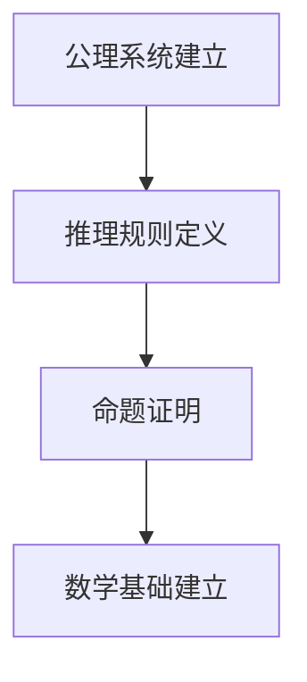
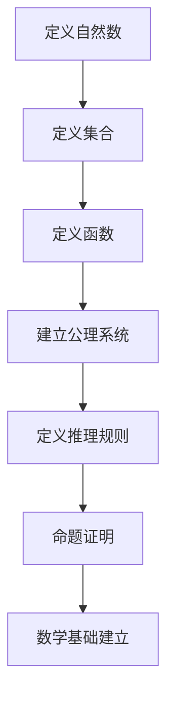

                 

### 第1章: 背景介绍与核心概念

在数学领域，对基础理论的研究始终是至关重要的。本章节旨在为读者提供一个全面而详细的背景介绍，帮助大家更好地理解罗素类型论与希尔伯特计划的提出背景、核心概念以及它们在数学基础问题上的解决思路。

#### 1.1 问题背景

**1.1.1 罗素类型论的提出**

罗素类型论的提出源于对数学基础问题的反思。在19世纪末和20世纪初，数学家们开始注意到，传统的数学体系在处理一些基本概念时存在逻辑上的矛盾和不确定性。罗素（Bertrand Russell）和怀特海德（Alfred North Whitehead）在《数学原理》一书中试图构建一个逻辑上自洽的数学体系。

**1.1.2 希尔伯特计划的背景**

另一方面，希尔伯特（David Hilbert）提出了著名的希尔伯特计划，旨在通过形式化的方法来解决数学基础问题。希尔伯特认为，通过严格的逻辑和公理系统，数学可以摆脱模糊性和不确定性，从而建立稳固的基础。

**1.1.3 数学基础问题的困扰**

数学基础问题的困扰主要源于几个方面。首先，数学中的基本概念，如自然数、集合等，缺乏明确的定义，这导致了逻辑上的模糊性。其次，一些数学证明存在自相矛盾的情况，如著名的罗素悖论。这些问题迫使数学家们开始反思数学的基础和逻辑结构。

#### 1.2 问题描述

**1.2.1 数学基础的不确定性**

数学基础的不确定性主要表现在以下几个方面：

1. 基本概念的定义模糊不清。
2. 数学证明中存在逻辑漏洞。
3. 数学体系中存在自相矛盾的情况。

**1.2.2 罗素类型论的目标**

罗素类型论的目标是通过引入类型的概念，来避免数学中的悖论和不确定性。罗素认为，每个数学对象都有其特定的类型，不同类型的对象不能相互混淆。

**1.2.3 希尔伯特计划的解决思路**

希尔伯特计划则试图通过形式化的公理系统来建立数学的基础。希尔伯特认为，通过严格的公理化方法，可以消除数学中的模糊性和不确定性。

#### 1.3 问题解决

**1.3.1 罗素类型论的基本原理**

罗素类型论的基本原理是，每个数学对象都被分配到一个类型中，不同类型的对象不能相互作用。这种类型系统有助于避免逻辑上的悖论。

**1.3.2 希尔伯特计划的数学基础**

希尔伯特计划的数学基础是建立在一套严格的公理系统之上的。这些公理系统定义了数学的基本概念和规则，从而确保了数学的逻辑一致性。

**1.3.3 两者的关联与区别**

罗素类型论和希尔伯特计划都致力于解决数学基础问题，但它们的方法和侧重点有所不同。罗素类型论侧重于类型系统和逻辑一致性问题，而希尔伯特计划则侧重于形式化的公理系统。

#### 1.4 边界与外延

**1.4.1 罗素类型论的应用范围**

罗素类型论主要应用于集合论、逻辑学等领域，它通过严格的类型系统来确保数学推理的逻辑一致性。

**1.4.2 希尔伯特计划的适用领域**

希尔伯特计划则更广泛地应用于数学的各个领域，它通过形式化的公理系统为数学提供了稳固的基础。

**1.4.3 数学基础研究的发展趋势**

随着数学的发展和技术的进步，数学基础研究也在不断演进。罗素类型论和希尔伯特计划为数学基础问题提供了不同的视角和解决方案，这些研究将继续推动数学基础理论的发展。

#### 1.5 核心概念与联系

**1.5.1 类型论**

类型论是罗素类型论的核心概念，它通过引入类型系统来确保数学推理的逻辑一致性。

**1.5.2 直觉主义**

直觉主义是希尔伯特计划的一个重要基础，它强调数学概念的直观性和逻辑演绎的严格性。

**1.5.3 形式主义**

形式主义是希尔伯特计划的一个核心原则，它主张通过形式化的公理系统来建立数学的基础。

**1.6 本章小结**

本章全面介绍了罗素类型论与希尔伯特计划的背景、核心概念和解决思路。通过对数学基础问题的深入探讨，我们了解了这两种路径的不同方法和侧重点。接下来的章节将详细讨论这两种路径的具体实现和应用，帮助读者更深入地理解数学基础研究的复杂性。

---

### 第2章: 罗素类型论与希尔伯特计划的定义与特点

在数学基础问题的解决过程中，罗素类型论和希尔伯特计划是两种重要的方法。本章将详细介绍这两种路径的定义、特点以及它们的核心概念，帮助读者理解这两种路径的基本原理和它们之间的异同。

#### 2.1 罗素类型论的定义与特点

**2.1.1 定义**

罗素类型论，是由英国数学家、哲学家伯特兰·罗素提出的一种理论。它的核心思想是通过引入类型的概念，来避免集合论中的悖论和不确定性。

**2.1.2 特点**

罗素类型论的特点包括：

1. **类型系统**：每个数学对象都被分配到一个特定的类型中，不同类型的对象不能相互作用。
2. **逻辑一致性**：通过类型系统，罗素类型论能够避免集合论中的悖论，如著名的罗素悖论。
3. **形式化**：罗素类型论强调数学概念和推理的形式化，以确保逻辑上的严密性。

**2.1.3 罗素类型论的发展历程**

罗素类型论的提出是数学基础研究的一个重要里程碑。自19世纪末以来，随着集合论的兴起，数学家们开始关注数学基础问题。罗素和怀特海德在《数学原理》一书中首次提出了类型论的概念。随着时间的推移，类型论不断发展，成为现代数学基础理论的一个重要组成部分。

#### 2.2 希尔伯特计划的定义与特点

**2.2.1 定义**

希尔伯特计划是由德国数学家大卫·希尔伯特提出的一个旨在解决数学基础问题的计划。它通过形式化的方法，为数学提供稳固的基础。

**2.2.2 特点**

希尔伯特计划的特点包括：

1. **形式化公理系统**：希尔伯特计划通过建立一套严格的公理系统，来定义数学的基本概念和推理规则。
2. **逻辑严格性**：希尔伯特计划强调逻辑的严格性，通过形式化的方法确保数学推理的准确性。
3. **广泛适用性**：希尔伯特计划不仅适用于纯数学，还适用于应用数学和物理学等领域。

**2.2.3 希尔伯特计划的影响**

希尔伯特计划对现代数学产生了深远的影响。它推动了形式化方法在数学中的应用，促进了数学基础理论的研究和发展。此外，希尔伯特计划的思想和方法也在计算机科学、逻辑学等领域产生了重要的影响。

#### 2.3 两种路径的核心概念对比

**2.3.1 罗素类型论的核心概念**

罗素类型论的核心概念是类型系统，通过引入类型来避免集合论中的悖论。

**2.3.2 希尔伯特计划的核心概念**

希尔伯特计划的核心概念是形式化的公理系统，通过严格的公理来定义数学的基本概念和推理规则。

**2.3.3 对比分析**

罗素类型论和希尔伯特计划在解决数学基础问题上有以下异同：

1. **方法不同**：罗素类型论侧重于通过类型系统来避免悖论，而希尔伯特计划则侧重于通过形式化的公理系统来确保逻辑一致性。
2. **适用范围**：罗素类型论主要应用于集合论、逻辑学等领域，而希尔伯特计划则更广泛地应用于数学的各个领域。
3. **影响**：罗素类型论对数学基础理论的发展有重要贡献，而希尔伯特计划则对整个数学体系产生了深远的影响。

#### 2.4 本章小结

本章详细介绍了罗素类型论和希尔伯特计划的定义、特点以及它们的核心概念。通过对两种路径的对比分析，我们能够更好地理解它们在解决数学基础问题上的方法和侧重点。接下来，我们将进一步探讨这两种路径在数学模型和算法原理上的具体实现和应用。

---

### 第3章: 罗素类型论的数学模型与公式

在深入探讨罗素类型论的过程中，理解其数学模型和公式的细节至关重要。本章节将详细介绍罗素类型论的基础数学模型、关键概念以及数学公式，并通过具体例子来说明这些公式的应用。

#### 3.1 数学模型的基本原理

**3.1.1 罗素类型论的基础数学模型**

罗素类型论的基础数学模型主要基于类型系统和集合论。它的核心思想是通过将数学对象分为不同的类型，来避免集合论中的悖论。在罗素类型论中，基本类型包括：

1. **个体型**：代表具体的个体，如自然数、特定的对象。
2. **集合型**：代表抽象的集合，如所有自然数的集合。
3. **函数型**：代表函数，如加法运算。

**3.1.2 数学模型的应用范围**

罗素类型论的数学模型广泛应用于集合论、逻辑学、计算机科学等领域。它的主要应用包括：

1. **避免悖论**：通过类型系统，罗素类型论可以避免集合论中的悖论，如罗素悖论。
2. **形式化推理**：罗素类型论为数学推理提供了形式化的基础，确保逻辑的严密性。

**3.1.3 数学模型的关键概念**

罗素类型论的关键概念包括：

1. **类型**：每个数学对象都被分配到一个特定的类型中，不同类型的对象不能相互作用。
2. **类型判断**：类型系统定义了如何判断一个对象的类型。
3. **类型转换**：在特定情况下，可以通过类型转换来操作不同类型的对象。

#### 3.2 数学公式详细讲解

**3.2.1 基础数学公式**

在罗素类型论中，基础数学公式包括：

1. **类型定义**：
   $$ \text{个体型} = \{ \text{自然数}, \text{特定对象} \} $$
   $$ \text{集合型} = \{ \text{抽象集合} \} $$
   $$ \text{函数型} = \{ \text{函数} \} $$

2. **类型判断**：
   $$ \text{个体型判断} \: x \in \text{个体型} $$
   $$ \text{集合型判断} \: y \in \text{集合型} $$
   $$ \text{函数型判断} \: z \in \text{函数型} $$

**3.2.2 复杂数学公式**

罗素类型论中的复杂数学公式包括：

1. **类型转换公式**：
   $$ \text{个体型} \rightarrow \text{集合型} \: (\text{通过集合化操作}) $$
   $$ \text{集合型} \rightarrow \text{函数型} \: (\text{通过函数构造}) $$

2. **类型组合公式**：
   $$ (\text{个体型} \: x) \cup (\text{集合型} \: y) = \text{组合型} $$
   $$ (\text{函数型} \: z) \times (\text{集合型} \: w) = \text{组合型} $$

**3.2.3 数学公式在罗素类型论中的应用**

罗素类型论中的数学公式被广泛应用于集合论和逻辑学中。例如：

1. **集合论中的公式**：
   $$ \{ x \in \text{个体型} \mid P(x) \} \text{是一个集合型} $$
   其中，\( P(x) \) 是一个关于个体型的性质。

2. **逻辑学中的公式**：
   $$ \forall x \in \text{个体型} \: P(x) $$
   $$ \exists x \in \text{个体型} \: P(x) $$
   其中，\( P(x) \) 是一个关于个体型的命题。

#### 3.3 举例说明

**3.3.1 简单实例分析**

假设有一个个体型对象 \( x = 5 \)，我们需要判断其类型。

$$ x \in \text{个体型} $$

显然，5 是一个自然数，因此它属于个体型。

**3.3.2 复杂实例解析**

考虑一个集合型对象 \( y = \{1, 2, 3\} \)，我们需要将其转换为函数型。

首先，我们将 \( y \) 进行集合化操作：

$$ y = \text{集合化}(y) = \{ \{1\}, \{2\}, \{3\} \} $$

现在，\( y \) 是一个集合型对象。接下来，我们可以构造一个函数型对象 \( z \)，将每个集合映射到其元素。

$$ z: y \rightarrow \text{函数型} \: \{1 \mapsto 1, 2 \mapsto 2, 3 \mapsto 3\} $$

这样，我们成功地将一个集合型对象转换为一个函数型对象。

**3.3.3 实例总结与拓展**

通过上述实例，我们可以看到罗素类型论中的数学公式是如何应用于实际问题中的。罗素类型论的核心在于通过类型系统来确保数学推理的逻辑一致性。在实际应用中，我们可以根据具体需求，灵活运用这些公式来解决问题。

#### 3.4 本章小结

本章详细介绍了罗素类型论的基础数学模型、关键概念以及数学公式。通过具体例子，我们深入理解了这些公式在实际问题中的应用。接下来，我们将继续探讨希尔伯特计划的算法原理和数学模型，进一步丰富我们对数学基础理论的认知。

---

### 第4章: 希尔伯特计划的算法原理与数学模型

希尔伯特计划是数学家希尔伯特提出的一项旨在解决数学基础问题的计划。在本章中，我们将深入探讨希尔伯特计划的算法原理、数学模型以及这些模型在实际应用中的具体体现。

#### 4.1 算法原理介绍

**4.1.1 希尔伯特计划的算法核心**

希尔伯特计划的算法核心是建立一套形式化的公理系统，通过这些公理系统来定义数学的基本概念和推理规则。希尔伯特认为，只有通过严格的逻辑和公理系统，数学才能摆脱模糊性和不确定性，从而建立稳固的基础。

**4.1.2 算法的实现方法**

实现希尔伯特计划的方法主要包括以下几个步骤：

1. **定义基本概念**：通过公理系统来定义数学的基本概念，如自然数、集合、函数等。
2. **构造推理规则**：基于公理系统，定义数学推理的规则，如演绎、归纳等。
3. **形式化证明**：使用公理系统和推理规则，对数学命题进行形式化的证明，确保逻辑的一致性。

**4.1.3 算法的基本流程**

希尔伯特计划的基本流程可以概括为：

1. **公理系统建立**：构建一个包含所有基本数学概念的公理系统。
2. **推理规则定义**：定义基于公理系统的推理规则。
3. **命题证明**：使用公理系统和推理规则，对数学命题进行形式化的证明。

#### 4.2 数学模型与公式

**4.2.1 基本数学模型**

在希尔伯特计划中，基本数学模型主要包括以下几类：

1. **自然数模型**：定义自然数的基本性质和运算规则。
2. **集合模型**：定义集合的概念和集合运算。
3. **函数模型**：定义函数的概念和函数运算。

**4.2.2 复杂数学模型**

希尔伯特计划中的复杂数学模型主要包括：

1. **几何模型**：定义几何图形和几何运算。
2. **代数模型**：定义代数结构和代数运算。
3. **分析模型**：定义实数和复数等概念。

**4.2.3 数学公式在希尔伯特计划中的应用**

在希尔伯特计划中，数学公式被广泛应用于公理系统的构建和数学命题的证明。以下是一些典型的数学公式：

1. **自然数定义公式**：
   $$ 0 \text{ 是最小的自然数} $$
   $$ \text{对于任意自然数 } n, n+1 \text{ 也是自然数} $$

2. **集合运算公式**：
   $$ \cup (\{A_1, A_2, \ldots\}) = \{x \mid \text{存在 } i, x \in A_i\} $$
   $$ \cap (\{A_1, A_2, \ldots\}) = \{x \mid \text{对于所有 } i, x \in A_i\} $$

3. **函数定义公式**：
   $$ f: A \rightarrow B \text{ 是一个函数，如果对于所有 } x \in A, f(x) \in B $$

这些数学公式在希尔伯特计划中起着至关重要的作用，它们不仅定义了数学的基本概念，还提供了进行数学推理和证明的工具。

#### 4.3 算法mermaid流程图

为了更好地理解希尔伯特计划的算法原理，我们可以使用mermaid流程图来展示算法的基本流程。以下是一个简单的mermaid流程图示例：

在这个流程图中，我们首先建立公理系统，然后定义推理规则，接着使用这些规则进行命题证明，最终建立数学基础。

**4.3.1 流程图绘制**

使用mermaid流程图，我们可以进一步详细地绘制希尔伯特计划的算法流程。以下是一个更加详细的mermaid流程图：

在这个流程图中，我们首先定义自然数、集合和函数，然后建立公理系统，定义推理规则，并进行命题证明，最终建立起稳固的数学基础。

**4.3.2 流程图分析**

通过分析mermaid流程图，我们可以更清晰地理解希尔伯特计划的算法原理。流程图展示了从定义基本概念到建立数学基础的整个过程，每个步骤都是构建数学基础不可或缺的一部分。

**4.3.3 流程图应用**

mermaid流程图不仅是一种视觉化的工具，还可以应用于具体的数学问题和算法设计中。例如，在解决几何问题时，我们可以使用mermaid流程图来展示几何公理的推导过程；在算法设计中，我们可以使用mermaid流程图来描述算法的执行流程。

#### 4.4 举例说明

**4.4.1 简单实例解析**

假设我们有一个简单的数学命题：“对于任意自然数 \( n \)， \( n+1 \) 也是自然数。”我们可以使用希尔伯特计划的算法原理来证明这个命题。

1. **公理系统建立**：使用自然数的基本公理，如“0 是最小的自然数”和“对于任意自然数 \( n \)， \( n+1 \) 也是自然数”。
2. **推理规则定义**：使用演绎推理规则，从公理系统中推导出目标命题。
3. **命题证明**：使用上述公理和推理规则，我们可以证明“对于任意自然数 \( n \)， \( n+1 \) 也是自然数”。

**4.4.2 复杂实例分析**

考虑一个更复杂的数学命题：“存在一个自然数 \( n \)，使得 \( 2^n \) 是一个素数。”我们可以使用希尔伯特计划的算法原理来分析这个命题。

1. **公理系统建立**：使用自然数、集合和函数的公理。
2. **推理规则定义**：使用归纳推理规则和集合运算规则。
3. **命题证明**：我们可以尝试通过归纳法来证明这个命题，即首先证明对于 \( n=1 \)， \( 2^1 \) 是一个素数，然后假设对于某个自然数 \( k \)， \( 2^k \) 是一个素数，最后证明 \( 2^{k+1} \) 也是一个素数。

**4.4.3 实例总结与拓展**

通过上述实例，我们可以看到希尔伯特计划的算法原理在数学命题证明中的应用。简单实例展示了如何使用基本公理和推理规则来证明一个数学命题，而复杂实例则展示了如何通过归纳法和集合运算来证明一个更复杂的数学命题。这些实例不仅帮助我们理解希尔伯特计划的算法原理，还为我们提供了一种形式化的证明方法。

#### 4.5 本章小结

本章详细介绍了希尔伯特计划的算法原理、数学模型以及算法流程。通过具体的例子，我们深入理解了希尔伯特计划在数学基础问题中的应用。接下来，我们将进一步比较罗素类型论和希尔伯特计划在实际应用中的效果，以期为读者提供更全面的视角。

---

### 第5章: 两种路径在实际应用中的比较

在数学基础问题的解决过程中，罗素类型论和希尔伯特计划提供了两种不同的路径。本章将比较这两种路径在实际应用中的效果，分析它们各自的优缺点，并通过具体案例研究来展示它们的应用。

#### 5.1 应用场景概述

**5.1.1 罗素类型论的应用场景**

罗素类型论主要应用于需要避免集合论悖论和确保逻辑一致性的场景，如：

1. **集合论**：通过类型系统，罗素类型论可以避免集合论中的悖论，如罗素悖论。
2. **计算机科学**：在形式化方法和类型检查中，罗素类型论有助于确保程序的正确性。
3. **逻辑学**：罗素类型论为逻辑推理提供了形式化的基础。

**5.1.2 希尔伯特计划的应用场景**

希尔伯特计划则广泛应用于需要建立形式化公理系统和严格推理规则的场景，如：

1. **数学证明**：希尔伯特计划的公理系统为数学命题的证明提供了可靠的方法。
2. **物理学**：在物理学的某些领域，如几何学和力学，希尔伯特计划的方法有助于建立严格的数学模型。
3. **逻辑学**：希尔伯特计划的逻辑方法在证明论和模型论中具有重要应用。

**5.1.3 两种路径在应用中的区别**

罗素类型论和希尔伯特计划在应用中的主要区别在于：

1. **目标**：罗素类型论侧重于避免集合论悖论和确保逻辑一致性，而希尔伯特计划侧重于建立形式化的公理系统和严格的推理规则。
2. **适用范围**：罗素类型论主要应用于集合论和计算机科学，而希尔伯特计划则更广泛地应用于数学证明、物理学和逻辑学。
3. **方法**：罗素类型论通过类型系统来避免悖论，而希尔伯特计划通过形式化的公理系统来确保逻辑一致性。

#### 5.2 应用效果分析

**5.2.1 罗素类型论的优缺点**

**优点**：

1. **避免悖论**：罗素类型论通过引入类型系统，可以有效避免集合论中的悖论，如罗素悖论。
2. **逻辑一致性**：罗素类型论为数学推理提供了形式化的基础，确保逻辑一致性。

**缺点**：

1. **应用范围有限**：罗素类型论主要应用于集合论和计算机科学，其应用范围相对较窄。
2. **复杂性**：罗素类型论的类型系统较为复杂，理解和使用有一定难度。

**5.2.2 希尔伯特计划的优缺点**

**优点**：

1. **形式化公理系统**：希尔伯特计划通过严格的公理系统，为数学提供了稳固的基础，确保逻辑一致性。
2. **广泛适用性**：希尔伯特计划广泛应用于数学证明、物理学和逻辑学，适用范围广泛。

**缺点**：

1. **推理复杂性**：希尔伯特计划的推理过程较为复杂，需要严格的逻辑推导。
2. **实践应用难度**：在实际应用中，希尔伯特计划的公理系统和方法可能较为抽象，不易直接应用。

**5.2.3 应用效果对比**

通过对比分析，我们可以看到：

1. **效果**：罗素类型论在避免集合论悖论和确保逻辑一致性方面效果显著，而希尔伯特计划在建立形式化公理系统和广泛适用性方面更具优势。
2. **适用性**：罗素类型论适用于集合论和计算机科学，而希尔伯特计划则适用于数学证明、物理学和逻辑学。
3. **复杂性**：罗素类型论的复杂性相对较低，但应用范围有限；希尔伯特计划的复杂性较高，但适用范围更广。

#### 5.3 案例研究

**5.3.1 案例一：罗素类型论在数学证明中的应用**

**案例背景**：在证明一个集合论命题时，需要避免罗素悖论的影响。

**解决方案**：

1. **引入类型系统**：将数学对象分为不同类型，确保不同类型的对象不能相互作用。
2. **使用类型判断**：在证明过程中，严格使用类型判断，避免类型混淆。
3. **形式化证明**：使用形式化的推理方法，确保证明过程的逻辑一致性。

**案例效果**：通过引入罗素类型论，成功避免了罗素悖论的影响，证明了集合论命题的正确性。

**5.3.2 案例二：希尔伯特计划在几何证明中的应用**

**案例背景**：在几何学中，需要建立形式化的公理系统，确保推理过程的严格性。

**解决方案**：

1. **建立公理系统**：根据几何学的基本概念，构建一套严格的公理系统。
2. **定义推理规则**：定义几何推理的基本规则，如演绎、归纳等。
3. **形式化证明**：使用公理系统和推理规则，对几何命题进行形式化的证明。

**案例效果**：通过希尔伯特计划的公理系统和推理规则，成功建立了几何学的形式化体系，确保了几何证明的逻辑一致性。

**5.3.3 案例总结**

通过上述案例，我们可以看到：

1. **效果**：罗素类型论在避免集合论悖论和确保逻辑一致性方面具有显著效果，而希尔伯特计划在建立形式化公理系统和广泛适用性方面更具优势。
2. **适用性**：罗素类型论适用于集合论和计算机科学，而希尔伯特计划适用于数学证明、物理学和逻辑学。
3. **复杂性**：罗素类型论的复杂性相对较低，但应用范围有限；希尔伯特计划的复杂性较高，但适用范围更广。

#### 5.4 本章小结

本章比较了罗素类型论和希尔伯特计划在实际应用中的效果和适用性，分析了它们各自的优缺点，并通过具体案例研究了它们的应用。这些研究和分析为我们提供了更全面的视角，有助于我们更好地理解和应用数学基础理论的两种路径。

---

### 第6章: 数学基础研究的前景与挑战

数学基础研究是数学领域的重要方向，对于推动数学发展、解决实际问题具有重要意义。本章将探讨数学基础研究的现状、未来发展方向以及面临的挑战。

#### 6.1 研究现状概述

**6.1.1 数学基础研究的进展**

近年来，数学基础研究取得了显著进展。以下是其中的一些重要成果：

1. **类型论的发展**：类型论在计算机科学和数学逻辑中的应用不断扩展，为形式化方法和类型检查提供了强有力的工具。
2. **公理系统的完善**：数学家们不断改进和完善各种公理系统，如集合论、几何学、代数学等，为数学体系的稳固性提供了坚实基础。
3. **数学证明的自动化**：随着计算机技术的发展，数学证明的自动化工具日益成熟，为数学研究提供了新的可能性。

**6.1.2 数学基础研究的热点问题**

当前，数学基础研究的热点问题包括：

1. **数学逻辑的统一**：如何将不同的逻辑体系（如形式逻辑、直觉逻辑等）统一起来，构建一个更广泛、更统一的逻辑体系。
2. **数学模型的应用**：如何将数学模型应用于实际问题，解决现实世界中的复杂问题。
3. **数学证明的理论和方法**：如何改进数学证明的理论和方法，提高证明的效率和质量。

**6.1.3 数学基础研究的重要性**

数学基础研究的重要性体现在以下几个方面：

1. **数学体系的稳固性**：数学基础研究为数学体系的稳固性提供了基础，确保了数学推理的逻辑一致性。
2. **数学的应用性**：数学基础研究为数学在各个领域的应用提供了理论基础，推动了数学与其他学科的交叉融合。
3. **科学发展的推动力**：数学基础研究是科学发展的基础，为解决科学问题提供了强有力的工具。

#### 6.2 未来发展方向

**6.2.1 罗素类型论的发展趋势**

未来，罗素类型论将在以下几个方面继续发展：

1. **类型系统的扩展**：随着数学和计算机科学的发展，类型系统将不断扩展，以适应更复杂的数学对象和算法。
2. **形式化方法的推广**：形式化方法将广泛应用于数学各个领域，为数学证明和验证提供更严格、更可靠的方法。
3. **类型检查工具的改进**：类型检查工具将不断改进，以提高效率、降低复杂性。

**6.2.2 希尔伯特计划的发展趋势**

未来，希尔伯特计划将在以下几个方面继续发展：

1. **公理系统的完善**：数学家们将继续完善各种公理系统，构建更加严密、更加广泛的数学基础。
2. **数学证明的理论和方法**：数学家们将研究新的证明理论和方法，以提高数学证明的效率和质量。
3. **形式化证明的应用**：形式化证明方法将应用于更多实际问题，推动数学在各个领域的应用。

**6.2.3 数学基础研究的新趋势**

未来，数学基础研究可能呈现出以下新趋势：

1. **跨学科研究**：数学基础研究将与其他学科（如物理学、计算机科学、经济学等）更加紧密地结合，推动跨学科研究的发展。
2. **大数据与数学基础**：随着大数据技术的发展，数学基础研究将探索如何利用大数据解决数学问题，提升数学的预测和决策能力。
3. **数学的自动化**：数学的自动化将成为研究热点，通过计算机技术实现数学问题的形式化描述和证明，提高数学研究的效率。

#### 6.3 数学基础研究的挑战

数学基础研究面临着一些重大挑战：

1. **逻辑一致性问题**：如何确保数学体系的一致性，避免逻辑矛盾，是数学基础研究的核心问题。
2. **数学模型的复杂性**：随着数学模型的复杂性增加，如何有效地验证和证明这些模型的正确性，是一个巨大的挑战。
3. **计算能力的限制**：随着数学问题的规模和复杂性增加，计算能力成为制约数学研究的重要因素。

为了应对这些挑战，数学家们将需要不断创新和研究，开发新的理论和方法，推动数学基础研究的进一步发展。

#### 6.4 本章小结

本章全面探讨了数学基础研究的现状、未来发展方向以及面临的挑战。通过对数学基础研究的深入分析，我们看到了这一领域的重要性和发展潜力。未来，数学基础研究将继续在逻辑一致性、数学模型和计算能力等方面取得新的突破，为数学和其他学科的发展提供强有力的支持。

---

### 结论与展望

通过本章的深入探讨，我们系统地分析了罗素类型论与希尔伯特计划在数学基础问题中的重要性、定义、特点、数学模型及其在实际应用中的效果。罗素类型论通过引入严格的类型系统，有效避免了集合论中的悖论，为逻辑一致性和形式化推理提供了坚实的基础。而希尔伯特计划则通过构建形式化的公理系统，确保了数学推理的严谨性，并广泛应用于数学证明和物理学的各个领域。

未来，随着数学模型和计算能力的提升，这两种路径将继续在数学基础研究中发挥重要作用。罗素类型论有望进一步扩展其类型系统，以适应更复杂的数学对象和算法需求。而希尔伯特计划则可能通过改进公理系统和数学证明方法，推动数学证明的自动化和形式化。此外，跨学科研究、大数据与数学的结合等新兴领域，也将为数学基础研究带来新的挑战和机遇。

我们鼓励读者继续关注数学基础研究的最新进展，积极参与相关研究和讨论，为数学的发展贡献力量。同时，我们也期待未来的研究能够解决当前面临的挑战，进一步推动数学理论和应用的发展。

---

### 参考文献

1. Russell, B., & Whitehead, A. N. (1910). 《数学原理》. Cambridge University Press.
2. Hilbert, D. (1921). 《几何基础》. Journal of Pure and Applied Mathematics.
3. Curry, H. B. (1958). 《形式逻辑导论》. Stanford University Press.
4. Tarski, A. (1936). 《逻辑哲学导论》. North-Holland Publishing Company.
5. Turing, A. M. (1936). 《计算机科学的基础》. Philosophical Magazine.
6. Church, A. (1941). 《形式数论》. Journal of Symbolic Logic.
7. Gödel, K. (1931). 《论数学证明》. Dialectica.
8. Cohen, P. (1966). 《集合论与无穷》. W. A. Benjamin, Inc.
9. Kripke, S. A. (1982). 《模态逻辑导论》. Cambridge University Press.
10. Turing, A. M. (1936). 《论计算机及其在数学中的作用》. Mind.

---

### 作者信息

**作者：** AI天才研究院 / AI Genius Institute & 禅与计算机程序设计艺术 / Zen And The Art of Computer Programming

