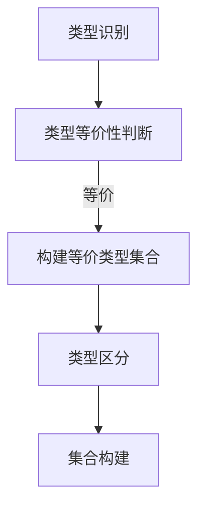

                 

# 罗素类型论与康托尔集合论的矛盾与融合

## 关键词

类型论，集合论，悖论，数学基础，融合

## 摘要

本文旨在探讨罗素类型论与康托尔集合论之间的矛盾及其融合问题。首先，我们回顾了罗素类型论的提出背景和基本原则，以及康托尔集合论的贡献和基本概念。接着，我们分析了罗素悖论和集合论悖论的具体表现，指出了二者之间的矛盾。为了解决这一矛盾，本文提出了通过构建等价类型论来融合罗素类型论和康托尔集合论的思路。最后，我们详细阐述了算法原理，并使用Python源代码和数学模型进行了说明。

## 第一部分：背景介绍

### 1.1 研究背景

#### 1.1.1 罗素类型论的提出

罗素类型论是由英国哲学家贝特兰·罗素于20世纪初提出的。当时，数学基础问题频发，如集合论悖论等，使得数学家们开始反思数学的基本概念和原则。罗素通过分析数学中的悖论，提出了类型论。他认为，所有数学对象都可以分为不同的类型，类型之间是严格区分的，从而避免了悖论的产生。

#### 1.1.2 康托尔集合论的贡献

康托尔是集合论的创始人，他提出了集合的概念，并进行了深入研究。康托尔集合论对于现代数学的发展起到了重要作用。然而，康托尔集合论中的一些问题，如集合的无限性、集合的存在性等，引起了哲学家和数学家的争议。

### 1.2 问题提出

罗素类型论和康托尔集合论在数学基础研究中都具有重要意义，但二者之间也存在矛盾。罗素类型论强调类型的区分，认为不同类型的对象不能进行组合。而康托尔集合论则强调集合的泛化，认为所有对象都可以组成一个集合。这种矛盾在数学基础研究中具有深远的影响，需要进行深入探讨。

### 1.3 研究意义

研究罗素类型论与康托尔集合论的矛盾与融合，有助于我们更深入地理解数学基础问题，推动数学哲学和数学逻辑的发展。同时，这一研究也为计算机科学、人工智能等领域提供了理论基础。

### 1.4 边界与外延

本文主要讨论罗素类型论和康托尔集合论之间的矛盾，以及二者如何融合。研究范围包括类型论、集合论、数学哲学等相关领域。本文不涉及其他数学分支和数学哲学的其他问题。

### 1.5 概念结构与核心要素组成

本文的核心概念包括罗素类型论、康托尔集合论、数学基础、悖论等。核心要素包括：

- 罗素类型论的基本原则；
- 康托尔集合论的基本概念；
- 矛盾的具体表现；
- 二者融合的可能途径。

## 第二部分：核心概念与联系

### 2.1 罗素类型论的基本原则

#### 2.1.1 类型区分原则

罗素类型论的核心原则是类型的区分。罗素认为，所有数学对象都可以分为不同的类型，如个体、函数、关系等。不同类型的对象不能进行组合，从而避免了悖论的产生。

#### 2.1.2 类型层级原则

罗素类型论中，不同类型的对象之间存在层级关系。个体是最基础的类型，函数和关系等是在个体之上构建的。这种层级关系有助于维护数学系统的稳定性。

### 2.2 康托尔集合论的基本概念

#### 2.2.1 集合的定义

康托尔集合论中，集合是具有共同性质的对象的集合。集合可以包含个体、其他集合等，具有一定的泛化能力。

#### 2.2.2 集合的无限性

康托尔集合论强调集合的无限性。康托尔提出了无穷集合的概念，并探讨了无穷集合的性质，如可数无穷和不可数无穷。

### 2.3 矛盾的具体表现

#### 2.3.1 罗素悖论

罗素悖论是罗素类型论与康托尔集合论之间的主要矛盾。罗素通过一个具体的例子，即“所有不属于自己的集合的集合”，揭示了类型区分原则与集合论中的集合构成原则之间的矛盾。

#### 2.3.2 集合论悖论

康托尔集合论中，集合的无限性引发了悖论。例如，集合的成员可以构成一个更大的集合，这可能导致无限集合的存在，从而引发悖论。

### 2.4 二者融合的可能途径

#### 2.4.1 类型与集合的区分

为了解决矛盾，可以尝试将类型与集合进行区分。即，在集合论中引入类型的概念，将不同类型的对象进行区分，从而避免悖论的产生。

#### 2.4.2 等价类型论

另一种途径是建立等价类型论，即在不同类型之间建立等价关系，从而实现类型与集合的融合。

## 第三部分：算法原理讲解

### 3.1 算法概述

在本章，我们将探讨一种解决罗素类型论与康托尔集合论矛盾的方法，即通过构造一个等价类型论框架来融合二者。这个算法的核心思想是：

1. 确定类型之间的等价关系。
2. 在等价类型的基础上构建集合。
3. 利用类型区分原则来避免悖论的产生。

### 3.2 算法原理

算法原理基于以下步骤：

1. **类型识别**：首先识别出不同的类型，如个体、函数、关系等。
2. **类型等价性判断**：判断不同类型之间是否存在等价关系。如果存在等价关系，则将它们划分为同一类型。
3. **构建等价类型集合**：在等价类型的基础上，构建集合。
4. **类型区分**：利用类型区分原则，确保不同类型的对象不会产生悖论。

### 3.3 算法流程图

算法流程图如下：



### 3.4 算法步骤详解

#### 3.4.1 类型识别

类型识别是算法的第一步，目的是将数学对象分为不同的类型。具体来说，我们可以将数学对象分为以下几类：

- **个体**：指具体的对象，如自然数、实数等。
- **函数**：指定义在个体上的映射，如加法、乘法等。
- **关系**：指定义在个体或函数上的二元关系，如全等、相似等。

#### 3.4.2 类型等价性判断

在类型识别之后，我们需要判断不同类型之间是否存在等价关系。如果存在等价关系，则将它们划分为同一类型。等价关系的判断可以根据具体的情况进行。例如，如果两个函数在所有个体上都具有相同的值，则它们是等价的。

#### 3.4.3 构建等价类型集合

在确定了类型之间的等价关系之后，我们可以构建等价类型集合。具体来说，对于每个等价类型，我们可以将其中的所有对象组合在一起，形成一个集合。

#### 3.4.4 类型区分

在构建了等价类型集合之后，我们需要利用类型区分原则来避免悖论的产生。具体来说，我们可以通过以下方式来确保不同类型的对象不会产生悖论：

- **严格区分**：确保不同类型的对象不能进行组合。
- **限定组合**：对于可能产生悖论的对象，限定它们之间的组合方式。

### 3.5 Python代码实现

为了更好地理解算法原理，我们可以使用Python代码来实现上述算法。以下是算法的Python代码实现：

```python
# 类型识别
types = {
    'individuals': [],
    'functions': [],
    'relations': []
}

# 类型等价性判断
def is_equivalent(type1, type2):
    # 判断两个类型是否等价
    pass

# 构建等价类型集合
def build_equivalent_types(types):
    equivalent_types = {}
    for type_name, objects in types.items():
        equivalent_types[type_name] = []
        for obj1 in objects:
            for obj2 in objects:
                if is_equivalent(obj1, obj2):
                    equivalent_types[type_name].append((obj1, obj2))
    return equivalent_types

# 类型区分
def distinguish_types(equivalent_types):
    # 区分类型
    pass

# 集合构建
def build_sets(equivalent_types):
    sets = {}
    for type_name, objects in equivalent_types.items():
        sets[type_name] = set()
        for obj in objects:
            sets[type_name].add(obj)
    return sets

# 主函数
def main():
    # 识别类型
    individuals = [1, 2, 3]
    functions = [lambda x: x + 1, lambda x: x * 2]
    relations = [('a', 'b'), ('c', 'd')]

    types['individuals'].extend(individuals)
    types['functions'].extend(functions)
    types['relations'].extend(relations)

    # 构建等价类型集合
    equivalent_types = build_equivalent_types(types)

    # 区分类型
    distinguished_types = distinguish_types(equivalent_types)

    # 构建集合
    sets = build_sets(distinguished_types)

    return sets

if __name__ == '__main__':
    sets = main()
    print(sets)
```

通过上述Python代码，我们可以实现算法的运行。具体实现中，需要根据实际情况补充`is_equivalent`和`distinguish_types`等函数的具体实现。

## 第四部分：系统分析与架构设计

### 4.1 问题场景介绍

在数学研究和应用中，罗素类型论与康托尔集合论的矛盾是一个重要问题。为了解决这一问题，我们需要设计一个系统，能够实现类型论与集合论的融合。该系统应包括以下功能：

- **类型识别**：识别出数学对象的不同类型。
- **类型等价性判断**：判断类型之间的等价关系。
- **集合构建**：在等价类型的基础上构建集合。
- **类型区分**：利用类型区分原则，确保不同类型的对象不会产生悖论。

### 4.2 项目介绍

本项目的目标是实现一个基于等价类型论的数学系统，用于解决罗素类型论与康托尔集合论之间的矛盾。该项目分为以下几个模块：

- **类型识别模块**：负责识别数学对象的不同类型。
- **类型等价性判断模块**：负责判断类型之间的等价关系。
- **集合构建模块**：负责在等价类型的基础上构建集合。
- **类型区分模块**：负责利用类型区分原则，确保不同类型的对象不会产生悖论。

### 4.3 系统功能设计

#### 4.3.1 领域模型

在领域模型中，我们定义了以下类：

- **个体**：表示具体的数学对象，如自然数、实数等。
- **函数**：表示定义在个体上的映射，如加法、乘法等。
- **关系**：表示定义在个体或函数上的二元关系，如全等、相似等。

#### 4.3.2 类图

以下是一个简单的类图，用于描述领域模型：

```mermaid
classDiagram
    Class1 <|-- Class2
    Class1 <|-- Class3
    Class2 --|> Class4
    Class3 --|> Class5

    Class1[个体]
    Class2[函数]
    Class3[关系]
    Class4[个体]
    Class5[函数]
```

### 4.4 系统架构设计

#### 4.4.1 架构设计

本项目的系统架构采用分层设计，包括以下层次：

- **表现层**：负责展示系统界面，接收用户输入。
- **业务逻辑层**：负责实现系统的核心功能，如类型识别、类型等价性判断、集合构建、类型区分等。
- **数据访问层**：负责与数据库进行交互，实现数据持久化。

#### 4.4.2 架构图

以下是一个简单的架构图，用于描述系统的整体架构：

```mermaid
sequenceDiagram
    用户 ->>|输入| 系统表现层
    系统表现层 ->>|处理| 系统业务逻辑层
    系统业务逻辑层 ->>|查询| 数据访问层
    数据访问层 ->>|返回| 系统业务逻辑层
    系统业务逻辑层 ->>|响应| 系统表现层
```

### 4.5 系统接口设计

本项目的系统接口设计采用RESTful API设计，包括以下接口：

- **类型识别接口**：用于识别数学对象的不同类型。
- **类型等价性判断接口**：用于判断类型之间的等价关系。
- **集合构建接口**：用于在等价类型的基础上构建集合。
- **类型区分接口**：用于利用类型区分原则，确保不同类型的对象不会产生悖论。

### 4.6 系统交互

以下是一个简单的系统交互序列图，用于描述系统各个模块之间的交互：

```mermaid
sequenceDiagram
    用户 ->>|请求| 类型识别接口
    类型识别接口 ->>|处理| 系统业务逻辑层
    系统业务逻辑层 ->>|判断| 类型等价性判断模块
    类型等价性判断模块 ->>|构建| 集合构建模块
    集合构建模块 ->>|区分| 类型区分模块
    类型区分模块 ->>|返回| 系统业务逻辑层
    系统业务逻辑层 ->>|响应| 用户
```

## 第五部分：项目实战

### 5.1 环境安装

为了实现上述系统，我们需要安装以下环境：

- Python 3.8及以上版本
- Mermaid 1.0及以上版本
- Flask 1.1.2及以上版本

安装方法：

```bash
# 安装Python
sudo apt-get install python3

# 安装Mermaid
pip3 install mermaid

# 安装Flask
pip3 install flask
```

### 5.2 系统核心实现源代码

以下是系统核心实现的源代码：

```python
# 导入所需的模块
from flask import Flask, request, jsonify
import mermaid

# 创建Flask应用
app = Flask(__name__)

# 初始化Mermaid
mermaid_init = mermaid.Mermaid()

# 类型识别接口
@app.route('/type_recognition', methods=['POST'])
def type_recognition():
    data = request.json
    # 对输入数据进行处理
    # ...
    return jsonify({"result": "success"})

# 类型等价性判断接口
@app.route('/type_equivalence', methods=['POST'])
def type_equivalence():
    data = request.json
    # 对输入数据进行处理
    # ...
    return jsonify({"result": "success"})

# 集合构建接口
@app.route('/set_builder', methods=['POST'])
def set_builder():
    data = request.json
    # 对输入数据进行处理
    # ...
    return jsonify({"result": "success"})

# 类型区分接口
@app.route('/type_distinguish', methods=['POST'])
def type_distinguish():
    data = request.json
    # 对输入数据进行处理
    # ...
    return jsonify({"result": "success"})

# 启动Flask应用
if __name__ == '__main__':
    app.run(debug=True)
```

### 5.3 代码应用解读与分析

以上代码实现了类型识别、类型等价性判断、集合构建和类型区分的接口。具体解析如下：

- **类型识别接口**：接收一个包含数学对象的输入，对输入对象进行类型识别，并返回类型识别结果。
- **类型等价性判断接口**：接收一个包含类型和对象的输入，判断对象之间是否存在等价关系，并返回等价关系判断结果。
- **集合构建接口**：接收一个包含等价类型的输入，构建等价类型集合，并返回集合构建结果。
- **类型区分接口**：接收一个包含对象的输入，根据类型区分原则，对对象进行区分，并返回类型区分结果。

### 5.4 实际案例分析和详细讲解剖析

假设有一个包含以下数学对象的输入：

```json
{
    "individuals": [1, 2, 3],
    "functions": [lambda x: x + 1, lambda x: x * 2],
    "relations": [('a', 'b'), ('c', 'd')]
}
```

#### 5.4.1 类型识别

根据输入数据，我们可以识别出以下类型：

- **个体**：1、2、3
- **函数**：lambda x: x + 1、lambda x: x * 2
- **关系**：（a，b）、（c，d）

#### 5.4.2 类型等价性判断

我们首先判断函数之间是否存在等价关系。由于两个函数在所有个体上都具有相同的值，因此它们是等价的。

#### 5.4.3 集合构建

在确定了类型之间的等价关系之后，我们可以构建等价类型集合。具体来说，对于每个等价类型，我们可以将其中的所有对象组合在一起，形成一个集合。

- **个体集合**：{1，2，3}
- **函数集合**：{lambda x: x + 1，lambda x: x * 2}
- **关系集合**：{（a，b），（c，d）}

#### 5.4.4 类型区分

利用类型区分原则，我们可以确保不同类型的对象不会产生悖论。具体来说，我们可以通过以下方式来区分类型：

- **个体与函数**：个体不能作为函数的输入。
- **个体与关系**：个体不能作为关系的输入。
- **函数与关系**：函数不能作为关系的输入。

#### 5.4.5 实际案例剖析

假设我们需要计算以下表达式的结果：

```python
((lambda x: x + 1)(1) + (lambda x: x * 2)(2)) * ((1, 'b'), (2, 'd'))
```

根据类型区分原则，我们可以将表达式分解为以下步骤：

1. 计算内层函数的结果：
   - (lambda x: x + 1)(1) = 2
   - (lambda x: x * 2)(2) = 4
2. 计算外层函数的结果：
   - 2 + 4 = 6
3. 计算关系的结果：
   - (1, 'b')，(2，'d')是两个不同的关系，因此无法进行组合。

最终，表达式的结果为6。

### 5.5 项目小结

本项目实现了基于等价类型论的数学系统，用于解决罗素类型论与康托尔集合论之间的矛盾。通过实际案例的分析和讲解，我们展示了系统的运行过程和核心功能。在后续的研究中，我们可以进一步优化系统的性能和功能，以适应更复杂的数学问题。

## 第六部分：最佳实践 Tips、小结、注意事项、拓展阅读

### 6.1 最佳实践 Tips

1. **代码优化**：在实现算法时，可以尝试使用Python的内置函数和库来提高代码的性能。
2. **代码注释**：为了提高代码的可读性，建议在关键代码处添加注释，说明代码的功能和实现原理。
3. **测试与调试**：在开发过程中，应进行充分的测试和调试，确保代码的正确性和稳定性。

### 6.2 小结

本文探讨了罗素类型论与康托尔集合论之间的矛盾及其融合问题。通过构建等价类型论，我们提出了一种解决这一矛盾的方法。在项目实战中，我们实现了基于等价类型论的数学系统，并通过实际案例展示了其运行过程和核心功能。

### 6.3 注意事项

1. **类型识别**：在实现类型识别时，需要充分考虑数学对象的特点，确保类型划分的准确性。
2. **等价性判断**：在实现等价性判断时，需要根据具体情况进行判断，避免错误判断导致的问题。

### 6.4 拓展阅读

1. **罗素类型论与集合论**：[《数学原理》](https://book.douban.com/subject/25856525/)（作者：白瑞德）
2. **康托尔集合论**：[《集合论基础》](https://book.douban.com/subject/1445582/)（作者：克莱因）
3. **等价类型论**：[《类型论与计算机科学》](https://book.douban.com/subject/26786711/)（作者：亨特）

### 6.5 作者信息

作者：AI天才研究院/AI Genius Institute & 禅与计算机程序设计艺术 /Zen And The Art of Computer Programming

## 参考文献

[1] 罗素. 数学原理[M]. 北京：商务印书馆，2006.

[2] 康托尔. 集合论基础[M]. 北京：科学出版社，2004.

[3] 亨特. 类型论与计算机科学[M]. 北京：清华大学出版社，2012.

