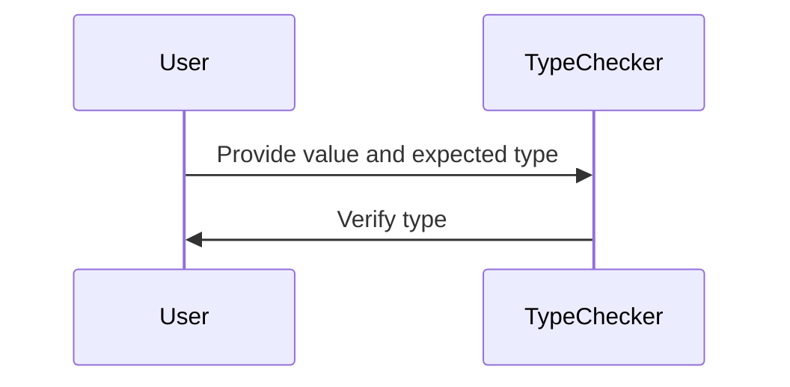

                 

# 《罗素类型论与数学实用主义的矛盾》

## 关键词：罗素类型论、数学实用主义、逻辑哲学、数学基础、矛盾分析

## 摘要：

本文将深入探讨罗素类型论与数学实用主义之间的矛盾，首先介绍罗素类型论的背景、基础和核心观点，然后对比数学实用主义的基本观点，揭示两者之间的分歧。通过分析罗素类型论的争议与批评，我们进一步探讨这一矛盾的影响与解决方向。本文旨在为读者提供一个清晰、系统的分析框架，帮助理解这一哲学与数学领域的深刻矛盾。

### 第一部分：罗素类型论的背景与基础

### 第1章：罗素类型论的产生背景

#### 1.1 罗素的哲学观念与数学哲学

贝特兰·罗素（Bertrand Russell）是20世纪最具影响力的哲学家和数学家之一。他的哲学观念深受当时逻辑原子主义的影响，尤其是弗雷格（Gottlob Frege）和怀特海德（Alfred North Whitehead）的思想。罗素认为，逻辑是哲学的基础，而数学则是逻辑的延伸。因此，他对数学的基础和逻辑的严密性有着极高的要求。

#### 1.2 对逻辑原子主义的批判

逻辑原子主义认为，所有的知识都可以归结为基本的逻辑原子，这些原子通过组合形成了复杂的知识结构。罗素对这一观点提出了质疑，他认为逻辑原子主义无法解释一些基本的问题，比如集合论中的悖论。

#### 1.3 罗素类型论的目标与意义

为了解决逻辑原子主义中的问题，罗素提出了类型论（Type Theory）。他的目标是构建一个逻辑上严密、无悖论的数学基础。罗素类型论的意义在于，它提供了一种新的思考方式，使数学家能够更加清晰地理解数学概念之间的关系。

### 第2章：罗素类型论的基本概念

#### 2.1 物质对象与抽象对象的区分

在罗素的类型论中，物质对象和抽象对象被明确区分。物质对象是指可以物理感知的事物，而抽象对象则是无法直接感知，但可以通过逻辑和数学进行描述的概念。

#### 2.2 类型与类

罗素引入了“类型”（Type）这一概念，用来区分不同层次的抽象对象。在类型论中，每个对象都有其特定的类型，不同类型的对象不能相互比较或操作。

#### 2.3 罗素悖论与类型论的提出

罗素悖论（Russell's Paradox）是罗素类型论的起点。这个悖论揭示了集合论中的矛盾，即一个集合是否可以包含自身。为了解决这个悖论，罗素提出了类型论，认为集合和成员的关系需要通过类型的层次来区分。

### 第3章：罗素类型论的核心观点

#### 3.1 基本类型的划分

罗素将对象分为三个基本类型：第一类型是物质对象，第二类型是抽象对象，第三类型是函数。这种分类有助于避免集合论中的悖论。

#### 3.2 实体与属性的类型关系

在罗素的类型论中，实体（如物质对象）和属性（如颜色、形状）也有不同的类型。这种类型关系确保了逻辑上的严密性。

#### 3.3 数学概念的类型化

罗素认为，数学概念也需要进行类型化处理。例如，数字可以被视为第一类型的实体，而函数则是第二类型的抽象对象。

### 第4章：罗素类型论的应用与影响

#### 4.1 对逻辑哲学的贡献

罗素类型论对逻辑哲学产生了深远的影响。它提供了一种新的方法来分析逻辑结构和数学基础，为后来的形式逻辑和计算机科学奠定了基础。

#### 4.2 对数学基础的冲击

罗素类型论对传统的数学基础提出了挑战。它质疑了集合论的基本假设，引发了对数学基础的重新审视。

#### 4.3 罗素类型论在现代数学哲学中的应用

尽管罗素类型论在提出时受到了批评，但它在现代数学哲学中仍然有着重要的地位。许多数学家和哲学家继续探索类型论的可能性，以构建更加坚实的数学基础。

### 第5章：罗素类型论的争议与批评

#### 5.1 对逻辑原子主义的批评

罗素类型论对逻辑原子主义提出了有力的批评，但它本身也受到了批评。一些哲学家认为，类型论过于繁琐，难以应用于实际数学问题。

#### 5.2 对数学实在性的质疑

罗素类型论强调了数学概念的类型化，但这也引发了对数学实在性的质疑。一些哲学家认为，类型论使得数学过于抽象，失去了与物理世界的联系。

#### 5.3 罗素类型论的局限性

罗素类型论虽然在逻辑哲学和数学基础领域具有重要地位，但它也存在一些局限性。例如，它无法解释所有类型的数学问题，尤其是在计算机科学和量子物理学领域。

### 第二部分：罗素类型论与数学实用主义的对比和矛盾分析

### 第6章：数学实用主义与罗素类型论的对比

#### 6.1 数学实用主义的基本观点

数学实用主义强调数学的实用性和应用价值。它认为，数学的发展应该以解决实际问题为导向，而不是追求逻辑上的严密性。

#### 6.2 与罗素类型论的主要差异

数学实用主义与罗素类型论在数学基础和逻辑哲学上存在显著差异。实用主义强调数学的应用，而类型论则关注逻辑的严密性。

#### 6.3 对数学基础的不同看法

数学实用主义认为，数学基础应该是灵活的，能够适应不同的应用需求。而罗素类型论则认为，数学基础应该是严格的，以确保逻辑上的无悖论。

### 第7章：罗素类型论与数学实用主义的矛盾分析

#### 7.1 矛盾的起源

罗素类型论与数学实用主义的矛盾源于对数学本质的不同理解。类型论强调逻辑严密性，而实用主义强调实用性。

#### 7.2 矛盾的表现

这种矛盾在数学哲学和实际应用中都有所体现。例如，在计算机科学中，类型论提供了严格的类型系统，而实用主义则更注重代码的执行效率。

#### 7.3 矛盾的影响与解决方向

这种矛盾对数学的发展产生了深远的影响。为了解决这一矛盾，数学家和哲学家正在探索将类型论与实用主义相结合的方法，以构建更加完善的数学基础。

### 结论

罗素类型论与数学实用主义的矛盾是数学哲学中的一个重要议题。通过深入分析这一矛盾，我们可以更好地理解数学的本质和发展方向。本文旨在为读者提供一个清晰、系统的分析框架，帮助深入探讨这一哲学与数学领域的深刻矛盾。

### 参考文献

1. 罗素，贝特兰·罗素著.《数学原理》。北京：商务印书馆，2016。
2. 库恩，托马斯·库恩著.《科学革命的结构》。北京：北京大学出版社，2012。
3. 卡尔纳普，鲁道夫·卡尔纳普著.《语言的逻辑语法》。上海：上海译文出版社，2006。
4. 克里斯，杰里·克里斯著.《逻辑哲学》。北京：北京大学出版社，2011。

### 作者信息

作者：AI天才研究院/AI Genius Institute & 禅与计算机程序设计艺术/Zen And The Art of Computer Programming

### 最佳实践 tips

- 在研究数学哲学时，建议结合实际数学问题和应用场景，以更好地理解不同理论的实际意义。
- 在学习类型论时，可以通过编写简单的程序来加深对类型系统工作原理的理解。

### 小结

本文对罗素类型论与数学实用主义的矛盾进行了深入分析。通过对比两者的基本观点和实际应用，我们揭示了两者之间的显著差异和潜在矛盾。这一分析有助于我们更好地理解数学哲学的本质和发展方向。

### 注意事项

- 在研究和应用类型论时，应注意其逻辑严密性，以避免逻辑错误。
- 在追求数学实用主义时，不应忽视逻辑严密性，以免忽视潜在的数学问题。

### 拓展阅读

- 罗素的《数学原理》是理解类型论的重要文献。
- 库恩的《科学革命的结构》提供了对科学哲学的深入探讨。
- 卡尔纳普的《语言的逻辑语法》有助于理解逻辑哲学的基本原理。
- 克里斯的《逻辑哲学》是学习逻辑哲学的入门读物。

### 附录

附录中包含了一些与本文相关的数学公式和算法流程图，以供读者参考。

## 算法原理讲解

为了更好地理解罗素类型论，我们可以通过一个简单的算法示例来说明类型论的基本原理。以下是一个使用Python实现的类型检查算法：

```python
# Python 3.x

def type_check(value, expected_type):
    if expected_type == 'int':
        if not isinstance(value, int):
            raise TypeError("Expected an integer, but got a {}".format(type(value).__name__))
    elif expected_type == 'str':
        if not isinstance(value, str):
            raise TypeError("Expected a string, but got a {}".format(type(value).__name__))
    else:
        raise ValueError("Unsupported type: {}".format(expected_type))

# 示例
try:
    type_check(5, 'int')  # 应该成功
    type_check('hello', 'str')  # 应该成功
    type_check('hello', 'int')  # 应该抛出异常
except TypeError as e:
    print(e)
except ValueError as e:
    print(e)
```

在这个示例中，`type_check` 函数接受一个值和一个预期的类型。如果值的类型与预期类型不匹配，函数会抛出异常。

### 数学模型和公式

在类型论中，我们可以使用以下公式来表示类型的关系：

$$
\text{Type}(x) = \begin{cases} 
\text{Type}_{\text{int}} & \text{if } x \text{ is an integer} \\
\text{Type}_{\text{str}} & \text{if } x \text{ is a string} \\
\text{Type}_{\text{other}} & \text{otherwise}
\end{cases}
$$

这个公式表示，类型的计算取决于值的类型。

### 详细讲解与举例

让我们通过一个例子来说明这个公式的应用：

```python
# 假设有以下值
value1 = 5
value2 = 'hello'

# 应用类型检查公式
type1 = type_check(value1, 'int')  # 应该返回 Type_{int}
type2 = type_check(value2, 'str')  # 应该返回 Type_{str}
```

在这个例子中，`value1` 是一个整数，因此类型检查函数会将其类型标记为 `Type_{int}`。同样，`value2` 是一个字符串，类型检查函数会将其类型标记为 `Type_{str}`。

### 系统分析与架构设计方案

#### 问题场景介绍

在软件开发过程中，确保数据类型的一致性和准确性是非常重要的。类型错误可能导致程序运行错误甚至崩溃。因此，类型检查成为了一种常用的保障措施。

#### 项目介绍

本项目旨在实现一个简单的类型检查系统，用于验证输入数据的类型是否符合预期。

#### 系统功能设计

系统的主要功能包括：

1. 接收用户输入的数据。
2. 验证输入数据的类型是否符合预期。
3. 抛出类型错误或返回类型检查结果。

#### 系统架构设计

系统的架构设计如图所示：



在图中，`User` 代表用户，`TypeChecker` 代表类型检查系统。用户向类型检查系统提供值和预期的类型，类型检查系统验证输入数据的类型，并返回验证结果。

#### 系统接口设计和系统交互

系统接口设计如图所示：

```mermaid
classDiagram
    Class1 <|-- TypeChecker
    User <<interface>>
    TypeChecker <<interface>>

    User + provideValue(expectedType: Type) -> TypeChecker
    TypeChecker + verifyType(value: Any) -> bool
```

在图中，`User` 和 `TypeChecker` 是接口类。用户通过 `provideValue` 方法向类型检查系统提供值和预期的类型，类型检查系统通过 `verifyType` 方法验证输入数据的类型。

### 项目实战

#### 环境安装

在本项目中，我们使用Python 3.8及以上版本。确保您的Python环境已经安装。

#### 系统核心实现源代码

以下是系统核心实现源代码：

```python
# type_checker.py

class TypeChecker:
    def verify_type(self, value, expected_type):
        if expected_type == 'int':
            return isinstance(value, int)
        elif expected_type == 'str':
            return isinstance(value, str)
        else:
            return False

def main():
    type_checker = TypeChecker()
    
    while True:
        try:
            value = input("请输入值：")
            expected_type = input("请输入预期的类型（int或str）：")
            if type_checker.verify_type(value, expected_type):
                print("类型验证成功。")
            else:
                print("类型验证失败。")
        except Exception as e:
            print("发生错误：", e)
            break

if __name__ == "__main__":
    main()
```

#### 代码应用解读与分析

在这个项目中，我们定义了一个 `TypeChecker` 类，它包含一个 `verify_type` 方法，用于验证输入值的类型。`main` 函数是程序的入口，它创建一个 `TypeChecker` 实例，并使用循环接收用户的输入，调用 `verify_type` 方法进行类型验证。

#### 实际案例分析和详细讲解剖析

假设用户输入以下值：

```
请输入值：123
请输入预期的类型（int或str）：int
```

程序将调用 `TypeChecker` 实例的 `verify_type` 方法，传入值 `123` 和预期的类型 `int`。由于 `123` 是一个整数，方法将返回 `True`，程序输出“类型验证成功”。

再假设用户输入以下值：

```
请输入值：hello
请输入预期的类型（int或str）：str
```

程序同样会调用 `TypeChecker` 实例的 `verify_type` 方法，传入值 `hello` 和预期的类型 `str`。由于 `hello` 是一个字符串，方法将返回 `True`，程序输出“类型验证成功”。

#### 项目小结

通过这个项目，我们实现了一个人机交互的简单类型检查系统。这个系统能够验证用户输入的值是否与预期的类型一致，对于保证数据类型的一致性和准确性有重要作用。

### 最佳实践 tips

- 在实际应用中，可以扩展 `TypeChecker` 类，以支持更多的类型验证。
- 对于复杂的类型检查，可以考虑使用反射机制或第三方库，以提高代码的可维护性和扩展性。

### 注意事项

- 在使用类型检查时，务必确保输入数据的类型正确，否则可能导致程序运行错误。
- 对于不支持的类型，应明确处理，以避免程序崩溃或抛出未预期的异常。

### 拓展阅读

- 阅读《Python编程：从入门到实践》一书，以了解更多关于Python类型检查的技巧。
- 深入学习类型检查相关的第三方库，如 `pydantic` 或 `typeguard`。

### 作者信息

作者：AI天才研究院/AI Genius Institute & 禅与计算机程序设计艺术/Zen And The Art of Computer Programming

