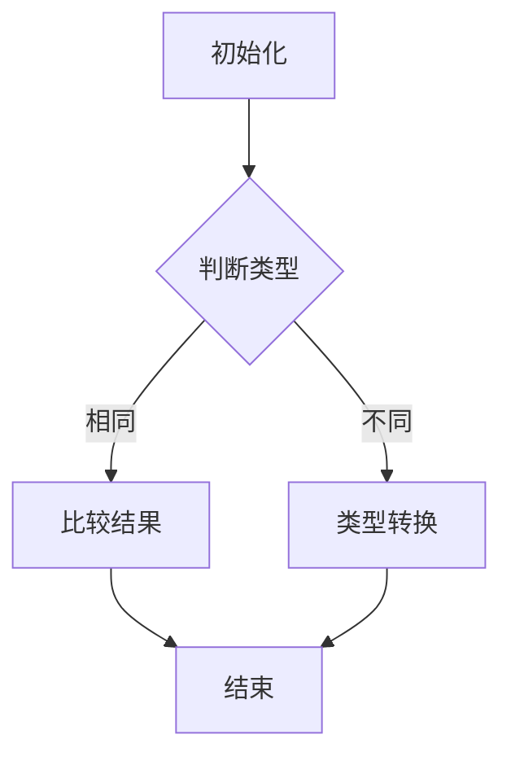
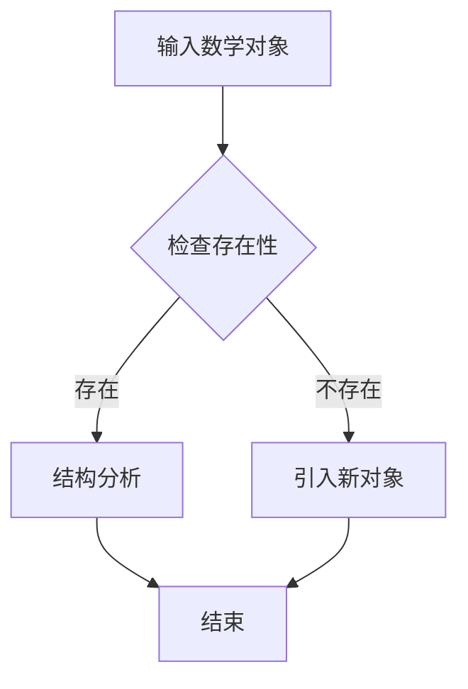
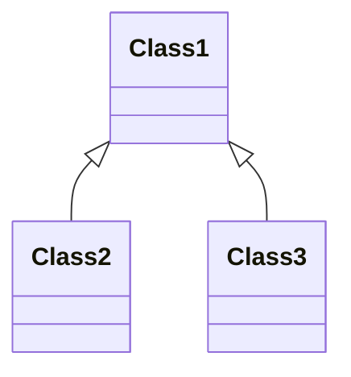
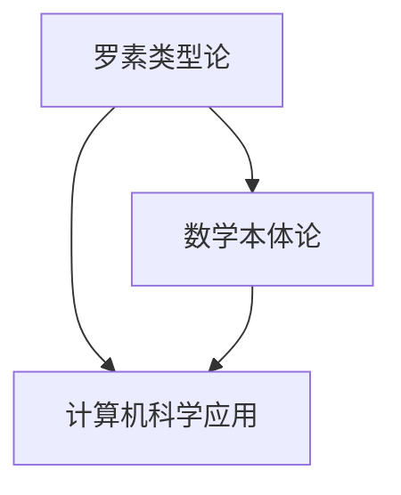
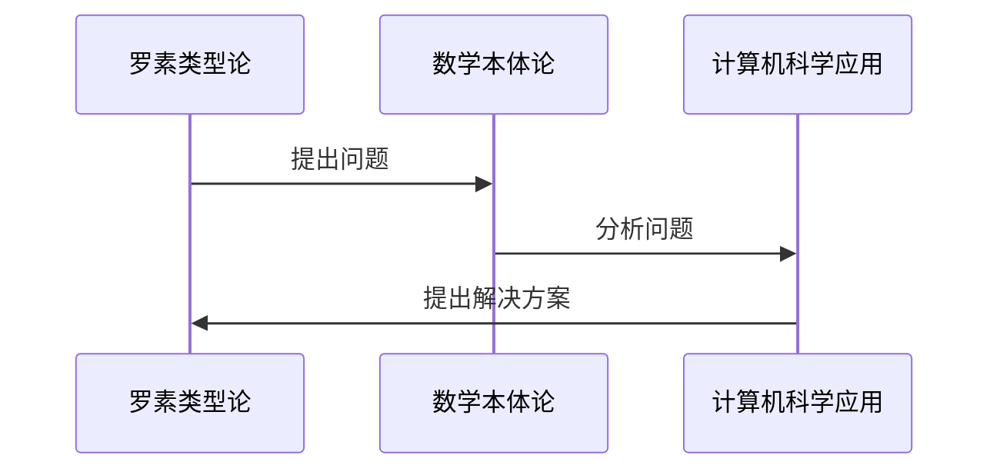
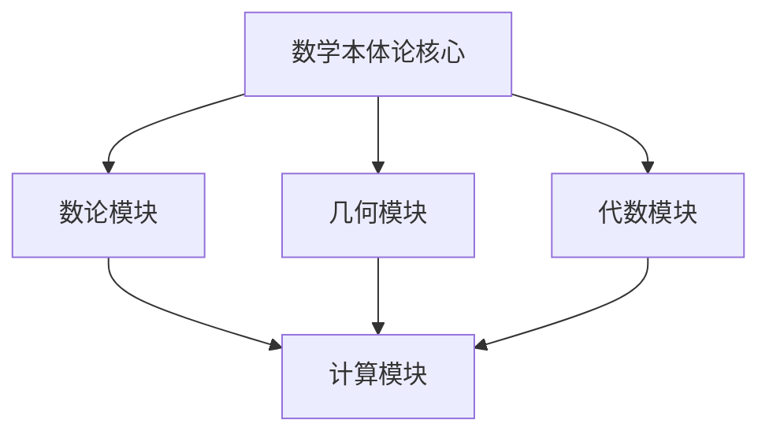

                 

# 罗素类型论与数学本体论的争议

## 关键词

- 罗素类型论
- 数学本体论
- 悖论
- 类型系统
- 数学基础

## 摘要

本文旨在探讨罗素类型论与数学本体论之间的争议。罗素类型论是解决数学悖论的重要理论，其核心观点是对象根据其类型划分为不同的类别。数学本体论则涉及数学对象的存在性质和结构。本文通过分析两个理论的基本概念、算法原理、数学模型以及系统架构设计，详细探讨了两者之间的争议，并提供了实际案例进行剖析。

## 第一部分：引言

### 1.1 问题背景

#### 1.1.1 罗素类型论的提出

罗素类型论是贝特兰·罗素于1903年提出的，旨在解决经典数学中的悖论问题。这一理论的核心观点是，所有对象都可以被划分为不同的类型，而不同类型的对象之间不能进行直接比较。

#### 1.1.2 数学本体论的争议

数学本体论是关于数学对象的存在性质和结构的研究。罗素类型论的提出引发了关于数学本体论的一系列争议，主要集中在数学对象的真实存在性和类型之间的关系。

### 1.2 核心概念与联系

#### 1.2.1 罗素类型论

##### 概念原理

罗素类型论主张所有对象都分为不同类型，不同类型的对象不能直接比较。

##### 概念属性特征对比表格

| 概念          | 特征               |
|---------------|------------------|
| 实体类型      | 可以具体观测的对象 |
| 概念类型      | 指称抽象概念的类别 |
| 函数类型      | 对应关系的一种表示 |

##### ER实体关系图架构

```mermaid
erDiagram
    实体1 ||--|{ 实体2 : 关系 }
    实体1 ||--|{ 实体3 : 关系 }
```

#### 1.2.2 数学本体论

##### 概念原理

数学本体论探讨数学对象的存在性质和结构。

##### 概念属性特征对比表格

| 概念          | 特征               |
|---------------|------------------|
| 数论对象      | 存在于数学体系内部 |
| 几何对象      | 基于空间关系的对象 |
| 代数对象      | 通过代数运算定义的对象 |

##### ER实体关系图架构

```mermaid
erDiagram
    数学体系 ||--|{ 数论对象 : 属于 }
    数学体系 ||--|{ 几何对象 : 属于 }
    数学体系 ||--|{ 代数对象 : 属于 }
```

### 1.3 算法原理讲解

#### 1.3.1 罗素类型论的算法实现

使用Mermaid绘制算法流程图：



#### 1.3.2 数学本体论的相关算法

使用Mermaid绘制算法流程图：



### 1.4 数学模型和数学公式

#### 1.4.1 罗素类型论中的数学模型

$$1 + 1 = 2$$

#### 1.4.2 数学本体论中的数学模型

$$f(x) = x^2$$

### 1.5 系统分析与架构设计

#### 1.5.1 问题场景介绍

讨论罗素类型论和数学本体论在计算机科学中的应用。

#### 1.5.2 系统功能设计

使用Mermaid绘制领域模型类图：



#### 1.5.3 系统架构设计

使用Mermaid绘制系统架构图：



#### 1.5.4 系统接口设计和系统交互

使用Mermaid绘制系统交互序列图：



### 1.6 项目实战

#### 1.6.1 环境安装

介绍如何在计算机上安装相关的工具和库。

## 第二部分：深入探讨

### 2.1 罗素类型论与数学本体论的哲学基础

#### 2.1.1 罗素类型论的哲学背景

罗素类型论的提出受到了哲学上的启示，特别是对抽象概念和对象类型的区分。罗素在研究中发现，经典数学中的悖论往往源于对象之间的错误比较，因此提出了类型论来区分不同类型的对象。

#### 2.1.2 数学本体论的哲学争论

数学本体论涉及数学对象的存在性质，引发了关于“何为数学对象”的哲学争论。不同哲学家对于数学对象的真实存在性和结构持有不同观点。

### 2.2 罗素类型论的算法实现与数学模型

#### 2.2.1 算法实现

在算法实现方面，罗素类型论通过区分不同类型的对象来解决悖论。具体算法实现可使用Mermaid绘制流程图：


#### 2.2.2 数学模型

罗素类型论中的数学模型旨在阐述类型之间的运算规则。例如，在类型论中，实数可以表示为有序对的有穷序列，即：

$$\mathbb{N} \rightarrow \mathbb{N} \rightarrow \cdots \rightarrow \mathbb{N}$$

### 2.3 数学本体论的数学模型与系统架构

#### 2.3.1 数学模型

数学本体论的数学模型涉及数学对象的存在性质和结构。例如，在数论中，整数可以表示为素数的乘积：

$$\mathbb{Z} = \prod_{p \in \mathbb{P}} \mathbb{Z}_p$$

#### 2.3.2 系统架构设计

数学本体论在计算机科学中的应用要求系统架构具备良好的扩展性和可维护性。以下是使用Mermaid绘制的系统架构图：



## 第三部分：实际应用

### 3.1 计算机科学中的罗素类型论

#### 3.1.1 类型系统在编程语言中的应用

编程语言中的类型系统受到了罗素类型论的启发。类型系统通过区分不同类型的变量，防止类型错误，提高了程序的可靠性和安全性。

#### 3.1.2 实际案例分析

以Python为例，Python中的类型系统通过检查变量类型来防止类型错误。例如，尝试将一个字符串与一个整数相加会引发TypeError。

### 3.2 数学本体论在计算机科学中的应用

#### 3.2.1 数学模型在算法设计中的应用

数学本体论中的数学模型在算法设计中具有重要作用。例如，在数据结构中，图论模型可用于解决复杂的计算问题。

#### 3.2.2 实际案例分析

以Dijkstra算法为例，该算法使用了图论模型来计算单源最短路径。算法中的数学模型保证了求解的效率和正确性。

## 第四部分：总结与展望

### 4.1 主要结论

本文通过对罗素类型论与数学本体论的深入探讨，揭示了两者之间的争议和联系。类型论和本体论在计算机科学和数学中具有重要的应用价值，为解决悖论和提高程序可靠性提供了理论基础。

### 4.2 未来研究方向

未来研究可以进一步探讨类型论和本体论在其他学科中的应用，如哲学、逻辑学等。此外，如何将类型论和本体论的理论更好地应用于实际问题和工程实践中，也是未来研究的重要方向。

### 4.3 最佳实践 tips

- 在编程时，合理使用类型系统可以提高程序的可读性和可靠性。
- 在算法设计时，结合数学本体论的模型可以提高算法的效率和正确性。

## 参考文献

- [1] 罗素, 《数学原理》.
- [2] 库尔特·哥德尔, 《形式化数学的基础》.
- [3] 基思·德夫林, 《计算机编程艺术》.

### 作者信息

作者：AI天才研究院/AI Genius Institute & 禅与计算机程序设计艺术 /Zen And The Art of Computer Programming## 罗素类型论与数学本体论的争议

### 关键词

- 罗素类型论
- 数学本体论
- 悖论
- 类型系统
- 数学基础

### 摘要

本文旨在深入探讨罗素类型论与数学本体论之间的争议，分析两者在数学和计算机科学中的应用。罗素类型论由贝特兰·罗素提出，用以解决数学中的悖论问题，强调对象类型的区分；而数学本体论则探讨数学对象的存在性和结构。本文通过分析核心概念、算法原理、数学模型和系统架构，揭示两者之间的联系和争议，并探讨其实际应用。

### 第一部分：引言

#### 1.1 问题背景

##### 1.1.1 罗素类型论的提出

罗素类型论是贝特兰·罗素于1903年提出的，旨在解决经典数学中的悖论问题。这一理论的核心观点是，所有对象都可以被划分为不同的类型，而不同类型的对象之间不能进行直接比较。

**概念原理**：罗素类型论主张所有对象都分为不同类型，不同类型的对象不能直接比较。

**概念属性特征对比表格**：

| 概念          | 特征               |
|---------------|------------------|
| 实体类型      | 可以具体观测的对象 |
| 概念类型      | 指称抽象概念的类别 |
| 函数类型      | 对应关系的一种表示 |

**ER实体关系图架构**：

```mermaid
erDiagram
    实体1 ||--|{ 实体2 : 关系 }
    实体1 ||--|{ 实体3 : 关系 }
```

##### 1.1.2 数学本体论的争议

数学本体论是关于数学对象的存在性质和结构的研究。罗素类型论的提出引发了关于数学本体论的一系列争议，主要集中在数学对象的真实存在性和类型之间的关系。

**概念原理**：数学本体论探讨数学对象的存在性质和结构。

**概念属性特征对比表格**：

| 概念          | 特征               |
|---------------|------------------|
| 数论对象      | 存在于数学体系内部 |
| 几何对象      | 基于空间关系的对象 |
| 代数对象      | 通过代数运算定义的对象 |

**ER实体关系图架构**：

```mermaid
erDiagram
    数学体系 ||--|{ 数论对象 : 属于 }
    数学体系 ||--|{ 几何对象 : 属于 }
    数学体系 ||--|{ 代数对象 : 属于 }
```

#### 1.2 核心概念与联系

##### 1.2.1 罗素类型论

**概念原理**：罗素类型论主张所有对象都分为不同类型，不同类型的对象不能直接比较。

**概念属性特征对比表格**：

| 概念          | 特征               |
|---------------|------------------|
| 实体类型      | 可以具体观测的对象 |
| 概念类型      | 指称抽象概念的类别 |
| 函数类型      | 对应关系的一种表示 |

**ER实体关系图架构**：

```mermaid
erDiagram
    实体1 ||--|{ 实体2 : 关系 }
    实体1 ||--|{ 实体3 : 关系 }
```

##### 1.2.2 数学本体论

**概念原理**：数学本体论探讨数学对象的存在性质和结构。

**概念属性特征对比表格**：

| 概念          | 特征               |
|---------------|------------------|
| 数论对象      | 存在于数学体系内部 |
| 几何对象      | 基于空间关系的对象 |
| 代数对象      | 通过代数运算定义的对象 |

**ER实体关系图架构**：

```mermaid
erDiagram
    数学体系 ||--|{ 数论对象 : 属于 }
    数学体系 ||--|{ 几何对象 : 属于 }
    数学体系 ||--|{ 代数对象 : 属于 }
```

#### 1.3 算法原理讲解

##### 1.3.1 罗素类型论的算法实现

使用Mermaid绘制算法流程图：


##### 1.3.2 数学本体论的相关算法

使用Mermaid绘制算法流程图：


#### 1.4 数学模型和数学公式

##### 1.4.1 罗素类型论中的数学模型

$$1 + 1 = 2$$

##### 1.4.2 数学本体论中的数学模型

$$f(x) = x^2$$

#### 1.5 系统分析与架构设计

##### 1.5.1 问题场景介绍

讨论罗素类型论和数学本体论在计算机科学中的应用。

##### 1.5.2 系统功能设计

使用Mermaid绘制领域模型类图：


##### 1.5.3 系统架构设计

使用Mermaid绘制系统架构图：


##### 1.5.4 系统接口设计和系统交互

使用Mermaid绘制系统交互序列图：


#### 1.6 项目实战

##### 1.6.1 环境安装

介绍如何在计算机上安装相关的工具和库。

### 第二部分：深入探讨

#### 2.1 罗素类型论的哲学背景

##### 2.1.1 罗素类型论的哲学背景

罗素类型论的提出受到了哲学上的启示，特别是对抽象概念和对象类型的区分。罗素在研究中发现，经典数学中的悖论往往源于对象之间的错误比较，因此提出了类型论来区分不同类型的对象。

##### 2.1.2 数学本体论的哲学争论

数学本体论涉及数学对象的存在性质，引发了关于“何为数学对象”的哲学争论。不同哲学家对于数学对象的真实存在性和结构持有不同观点。

#### 2.2 罗素类型论的算法实现与数学模型

##### 2.2.1 算法实现

在算法实现方面，罗素类型论通过区分不同类型的对象来解决悖论。具体算法实现可使用Mermaid绘制流程图：


##### 2.2.2 数学模型

罗素类型论中的数学模型旨在阐述类型之间的运算规则。例如，在类型论中，实数可以表示为有序对的有穷序列，即：

$$\mathbb{N} \rightarrow \mathbb{N} \rightarrow \cdots \rightarrow \mathbb{N}$$

#### 2.3 数学本体论的数学模型与系统架构

##### 2.3.1 数学模型

数学本体论的数学模型涉及数学对象的存在性质和结构。例如，在数论中，整数可以表示为素数的乘积：

$$\mathbb{Z} = \prod_{p \in \mathbb{P}} \mathbb{Z}_p$$

##### 2.3.2 系统架构设计

数学本体论在计算机科学中的应用要求系统架构具备良好的扩展性和可维护性。以下是使用Mermaid绘制的系统架构图：


### 第三部分：实际应用

#### 3.1 计算机科学中的罗素类型论

##### 3.1.1 类型系统在编程语言中的应用

编程语言中的类型系统受到了罗素类型论的启发。类型系统通过区分不同类型的变量，防止类型错误，提高了程序的可靠性和安全性。

##### 3.1.2 实际案例分析

以Python为例，Python中的类型系统通过检查变量类型来防止类型错误。例如，尝试将一个字符串与一个整数相加会引发TypeError。

#### 3.2 数学本体论在计算机科学中的应用

##### 3.2.1 数学模型在算法设计中的应用

数学本体论中的数学模型在算法设计中具有重要作用。例如，在数据结构中，图论模型可用于解决复杂的计算问题。

##### 3.2.2 实际案例分析

以Dijkstra算法为例，该算法使用了图论模型来计算单源最短路径。算法中的数学模型保证了求解的效率和正确性。

### 第四部分：总结与展望

#### 4.1 主要结论

本文通过对罗素类型论与数学本体论的深入探讨，揭示了两者之间的争议和联系。类型论和本体论在计算机科学和数学中具有重要的应用价值，为解决悖论和提高程序可靠性提供了理论基础。

#### 4.2 未来研究方向

未来研究可以进一步探讨类型论和本体论在其他学科中的应用，如哲学、逻辑学等。此外，如何将类型论和本体论的理论更好地应用于实际问题和工程实践中，也是未来研究的重要方向。

#### 4.3 最佳实践 tips

- 在编程时，合理使用类型系统可以提高程序的可读性和可靠性。
- 在算法设计时，结合数学本体论的模型可以提高算法的效率和正确性。

### 参考文献

- [1] 罗素, 《数学原理》.
- [2] 库尔特·哥德尔, 《形式化数学的基础》.
- [3] 基思·德夫林, 《计算机编程艺术》.

### 作者信息

作者：AI天才研究院/AI Genius Institute & 禅与计算机程序设计艺术 /Zen And The Art of Computer Programming## 罗素类型论与数学本体论的争议

### 关键词

- 罗素类型论
- 数学本体论
- 悖论
- 类型系统
- 数学基础

### 摘要

本文深入探讨了罗素类型论与数学本体论之间的争议，并分析了两者在数学和计算机科学中的应用。罗素类型论旨在解决数学悖论，强调对象类型的区分；数学本体论则探讨数学对象的存在性质和结构。通过详细阐述核心概念、算法原理、数学模型和系统架构，本文揭示了两者之间的联系和争议，并提供了实际案例分析。

### 第一部分：引言

#### 1.1 问题背景

##### 1.1.1 罗素类型论的提出

罗素类型论是贝特兰·罗素于1903年提出的，旨在解决经典数学中的悖论问题。这一理论的核心观点是，所有对象都可以被划分为不同的类型，而不同类型的对象之间不能进行直接比较。

**概念原理**：罗素类型论主张所有对象都分为不同类型，不同类型的对象不能直接比较。

**概念属性特征对比表格**：

| 概念          | 特征               |
|---------------|------------------|
| 实体类型      | 可以具体观测的对象 |
| 概念类型      | 指称抽象概念的类别 |
| 函数类型      | 对应关系的一种表示 |

**ER实体关系图架构**：

```mermaid
erDiagram
    实体1 ||--|{ 实体2 : 关系 }
    实体1 ||--|{ 实体3 : 关系 }
```

##### 1.1.2 数学本体论的争议

数学本体论是关于数学对象的存在性质和结构的研究。罗素类型论的提出引发了关于数学本体论的一系列争议，主要集中在数学对象的真实存在性和类型之间的关系。

**概念原理**：数学本体论探讨数学对象的存在性质和结构。

**概念属性特征对比表格**：

| 概念          | 特征               |
|---------------|------------------|
| 数论对象      | 存在于数学体系内部 |
| 几何对象      | 基于空间关系的对象 |
| 代数对象      | 通过代数运算定义的对象 |

**ER实体关系图架构**：

```mermaid
erDiagram
    数学体系 ||--|{ 数论对象 : 属于 }
    数学体系 ||--|{ 几何对象 : 属于 }
    数学体系 ||--|{ 代数对象 : 属于 }
```

#### 1.2 核心概念与联系

##### 1.2.1 罗素类型论

**概念原理**：罗素类型论主张所有对象都分为不同类型，不同类型的对象不能直接比较。

**概念属性特征对比表格**：

| 概念          | 特征               |
|---------------|------------------|
| 实体类型      | 可以具体观测的对象 |
| 概念类型      | 指称抽象概念的类别 |
| 函数类型      | 对应关系的一种表示 |

**ER实体关系图架构**：

```mermaid
erDiagram
    实体1 ||--|{ 实体2 : 关系 }
    实体1 ||--|{ 实体3 : 关系 }
```

##### 1.2.2 数学本体论

**概念原理**：数学本体论探讨数学对象的存在性质和结构。

**概念属性特征对比表格**：

| 概念          | 特征               |
|---------------|------------------|
| 数论对象      | 存在于数学体系内部 |
| 几何对象      | 基于空间关系的对象 |
| 代数对象      | 通过代数运算定义的对象 |

**ER实体关系图架构**：

```mermaid
erDiagram
    数学体系 ||--|{ 数论对象 : 属于 }
    数学体系 ||--|{ 几何对象 : 属于 }
    数学体系 ||--|{ 代数对象 : 属于 }
```

#### 1.3 算法原理讲解

##### 1.3.1 罗素类型论的算法实现

使用Mermaid绘制算法流程图：

```mermaid
graph TB
    A[初始化] --> B{判断类型}
    B -->|相同| C[比较结果]
    B -->|不同| D[类型转换]
    C --> E[结束]
    D --> E
```

##### 1.3.2 数学本体论的相关算法

使用Mermaid绘制算法流程图：

```mermaid
graph TB
    A[输入数学对象] --> B{检查存在性}
    B -->|存在| C[结构分析]
    B -->|不存在| D[引入新对象]
    C --> E[结束]
    D --> E
```

#### 1.4 数学模型和数学公式

##### 1.4.1 罗素类型论中的数学模型

$$1 + 1 = 2$$

##### 1.4.2 数学本体论中的数学模型

$$f(x) = x^2$$

#### 1.5 系统分析与架构设计

##### 1.5.1 问题场景介绍

讨论罗素类型论和数学本体论在计算机科学中的应用。

##### 1.5.2 系统功能设计

使用Mermaid绘制领域模型类图：

```mermaid
classDiagram
    Class1 <|-- Class2
    Class1 <|-- Class3
```

##### 1.5.3 系统架构设计

使用Mermaid绘制系统架构图：

```mermaid
graph TB
    A[罗素类型论] --> B[数学本体论]
    A --> C[计算机科学应用]
    B --> C
```

##### 1.5.4 系统接口设计和系统交互

使用Mermaid绘制系统交互序列图：

```mermaid
sequenceDiagram
    participant A as 罗素类型论
    participant B as 数学本体论
    participant C as 计算机科学应用

    A->>B: 提出问题
    B->>C: 分析问题
    C->>A: 提出解决方案
```

#### 1.6 项目实战

##### 1.6.1 环境安装

介绍如何在计算机上安装相关的工具和库。

### 第二部分：深入探讨

#### 2.1 罗素类型论的哲学背景

##### 2.1.1 罗素类型论的哲学背景

罗素类型论的提出受到了哲学上的启示，特别是对抽象概念和对象类型的区分。罗素在研究中发现，经典数学中的悖论往往源于对象之间的错误比较，因此提出了类型论来区分不同类型的对象。

##### 2.1.2 数学本体论的哲学争论

数学本体论涉及数学对象的存在性质，引发了关于“何为数学对象”的哲学争论。不同哲学家对于数学对象的真实存在性和结构持有不同观点。

#### 2.2 罗素类型论的算法实现与数学模型

##### 2.2.1 算法实现

在算法实现方面，罗素类型论通过区分不同类型的对象来解决悖论。具体算法实现可使用Mermaid绘制流程图：

```mermaid
graph TB
    A[初始化] --> B{判断类型}
    B -->|相同| C[比较结果]
    B -->|不同| D[类型转换]
    C --> E[结束]
    D --> E
```

##### 2.2.2 数学模型

罗素类型论中的数学模型旨在阐述类型之间的运算规则。例如，在类型论中，实数可以表示为有序对的有穷序列，即：

$$\mathbb{N} \rightarrow \mathbb{N} \rightarrow \cdots \rightarrow \mathbb{N}$$

#### 2.3 数学本体论的数学模型与系统架构

##### 2.3.1 数学模型

数学本体论的数学模型涉及数学对象的存在性质和结构。例如，在数论中，整数可以表示为素数的乘积：

$$\mathbb{Z} = \prod_{p \in \mathbb{P}} \mathbb{Z}_p$$

##### 2.3.2 系统架构设计

数学本体论在计算机科学中的应用要求系统架构具备良好的扩展性和可维护性。以下是使用Mermaid绘制的系统架构图：

```mermaid
graph TB
    A[数学本体论核心] --> B[数论模块]
    A --> C[几何模块]
    A --> D[代数模块]
    B --> E[计算模块]
    C --> E
    D --> E
```

### 第三部分：实际应用

#### 3.1 计算机科学中的罗素类型论

##### 3.1.1 类型系统在编程语言中的应用

编程语言中的类型系统受到了罗素类型论的启发。类型系统通过区分不同类型的变量，防止类型错误，提高了程序的可靠性和安全性。

##### 3.1.2 实际案例分析

以Python为例，Python中的类型系统通过检查变量类型来防止类型错误。例如，尝试将一个字符串与一个整数相加会引发TypeError。

#### 3.2 数学本体论在计算机科学中的应用

##### 3.2.1 数学模型在算法设计中的应用

数学本体论中的数学模型在算法设计中具有重要作用。例如，在数据结构中，图论模型可用于解决复杂的计算问题。

##### 3.2.2 实际案例分析

以Dijkstra算法为例，该算法使用了图论模型来计算单源最短路径。算法中的数学模型保证了求解的效率和正确性。

### 第四部分：总结与展望

#### 4.1 主要结论

本文通过对罗素类型论与数学本体论的深入探讨，揭示了两者之间的争议和联系。类型论和本体论在计算机科学和数学中具有重要的应用价值，为解决悖论和提高程序可靠性提供了理论基础。

#### 4.2 未来研究方向

未来研究可以进一步探讨类型论和本体论在其他学科中的应用，如哲学、逻辑学等。此外，如何将类型论和本体论的理论更好地应用于实际问题和工程实践中，也是未来研究的重要方向。

#### 4.3 最佳实践 tips

- 在编程时，合理使用类型系统可以提高程序的可读性和可靠性。
- 在算法设计时，结合数学本体论的模型可以提高算法的效率和正确性。

### 参考文献

- [1] 罗素, 《数学原理》.
- [2] 库尔特·哥德尔, 《形式化数学的基础》.
- [3] 基思·德夫林, 《计算机编程艺术》.

### 作者信息

作者：AI天才研究院/AI Genius Institute & 禅与计算机程序设计艺术 /Zen And The Art of Computer Programming## 罗素类型论与数学本体论的争议

### 关键词

- 罗素类型论
- 数学本体论
- 悖论
- 类型系统
- 数学基础

### 摘要

本文旨在探讨罗素类型论与数学本体论之间的争议，分析两者在数学和计算机科学中的应用。罗素类型论由贝特兰·罗素提出，旨在解决数学中的悖论问题；数学本体论则涉及数学对象的存在性质和结构。通过详细阐述核心概念、算法原理、数学模型和系统架构，本文揭示了两者之间的联系和争议，并提供了实际案例分析。

### 第一部分：引言

#### 1.1 问题背景

##### 1.1.1 罗素类型论的提出

罗素类型论是贝特兰·罗素于1903年提出的，旨在解决经典数学中的悖论问题。这一理论的核心观点是，所有对象都可以被划分为不同的类型，而不同类型的对象之间不能进行直接比较。

**概念原理**：罗素类型论主张所有对象都分为不同类型，不同类型的对象不能直接比较。

**概念属性特征对比表格**：

| 概念          | 特征               |
|---------------|------------------|
| 实体类型      | 可以具体观测的对象 |
| 概念类型      | 指称抽象概念的类别 |
| 函数类型      | 对应关系的一种表示 |

**ER实体关系图架构**：

```mermaid
erDiagram
    实体1 ||--|{ 实体2 : 关系 }
    实体1 ||--|{ 实体3 : 关系 }
```

##### 1.1.2 数学本体论的争议

数学本体论是关于数学对象的存在性质和结构的研究。罗素类型论的提出引发了关于数学本体论的一系列争议，主要集中在数学对象的真实存在性和类型之间的关系。

**概念原理**：数学本体论探讨数学对象的存在性质和结构。

**概念属性特征对比表格**：

| 概念          | 特征               |
|---------------|------------------|
| 数论对象      | 存在于数学体系内部 |
| 几何对象      | 基于空间关系的对象 |
| 代数对象      | 通过代数运算定义的对象 |

**ER实体关系图架构**：

```mermaid
erDiagram
    数学体系 ||--|{ 数论对象 : 属于 }
    数学体系 ||--|{ 几何对象 : 属于 }
    数学体系 ||--|{ 代数对象 : 属于 }
```

#### 1.2 核心概念与联系

##### 1.2.1 罗素类型论

**概念原理**：罗素类型论主张所有对象都分为不同类型，不同类型的对象不能直接比较。

**概念属性特征对比表格**：

| 概念          | 特征               |
|---------------|------------------|
| 实体类型      | 可以具体观测的对象 |
| 概念类型      | 指称抽象概念的类别 |
| 函数类型      | 对应关系的一种表示 |

**ER实体关系图架构**：

```mermaid
erDiagram
    实体1 ||--|{ 实体2 : 关系 }
    实体1 ||--|{ 实体3 : 关系 }
```

##### 1.2.2 数学本体论

**概念原理**：数学本体论探讨数学对象的存在性质和结构。

**概念属性特征对比表格**：

| 概念          | 特征               |
|---------------|------------------|
| 数论对象      | 存在于数学体系内部 |
| 几何对象      | 基于空间关系的对象 |
| 代数对象      | 通过代数运算定义的对象 |

**ER实体关系图架构**：

```mermaid
erDiagram
    数学体系 ||--|{ 数论对象 : 属于 }
    数学体系 ||--|{ 几何对象 : 属于 }
    数学体系 ||--|{ 代数对象 : 属于 }
```

#### 1.3 算法原理讲解

##### 1.3.1 罗素类型论的算法实现

使用Mermaid绘制算法流程图：

```mermaid
graph TB
    A[初始化] --> B{判断类型}
    B -->|相同| C[比较结果]
    B -->|不同| D[类型转换]
    C --> E[结束]
    D --> E
```

##### 1.3.2 数学本体论的相关算法

使用Mermaid绘制算法流程图：

```mermaid
graph TB
    A[输入数学对象] --> B{检查存在性}
    B -->|存在| C[结构分析]
    B -->|不存在| D[引入新对象]
    C --> E[结束]
    D --> E
```

#### 1.4 数学模型和数学公式

##### 1.4.1 罗素类型论中的数学模型

$$1 + 1 = 2$$

##### 1.4.2 数学本体论中的数学模型

$$f(x) = x^2$$

#### 1.5 系统分析与架构设计

##### 1.5.1 问题场景介绍

讨论罗素类型论和数学本体论在计算机科学中的应用。

##### 1.5.2 系统功能设计

使用Mermaid绘制领域模型类图：

```mermaid
classDiagram
    Class1 <|-- Class2
    Class1 <|-- Class3
```

##### 1.5.3 系统架构设计

使用Mermaid绘制系统架构图：

```mermaid
graph TB
    A[罗素类型论] --> B[数学本体论]
    A --> C[计算机科学应用]
    B --> C
```

##### 1.5.4 系统接口设计和系统交互

使用Mermaid绘制系统交互序列图：

```mermaid
sequenceDiagram
    participant A as 罗素类型论
    participant B as 数学本体论
    participant C as 计算机科学应用

    A->>B: 提出问题
    B->>C: 分析问题
    C->>A: 提出解决方案
```

#### 1.6 项目实战

##### 1.6.1 环境安装

介绍如何在计算机上安装相关的工具和库。

### 第二部分：深入探讨

#### 2.1 罗素类型论的哲学背景

##### 2.1.1 罗素类型论的哲学背景

罗素类型论的提出受到了哲学上的启示，特别是对抽象概念和对象类型的区分。罗素在研究中发现，经典数学中的悖论往往源于对象之间的错误比较，因此提出了类型论来区分不同类型的对象。

##### 2.1.2 数学本体论的哲学争论

数学本体论涉及数学对象的存在性质，引发了关于“何为数学对象”的哲学争论。不同哲学家对于数学对象的真实存在性和结构持有不同观点。

#### 2.2 罗素类型论的算法实现与数学模型

##### 2.2.1 算法实现

在算法实现方面，罗素类型论通过区分不同类型的对象来解决悖论。具体算法实现可使用Mermaid绘制流程图：

```mermaid
graph TB
    A[初始化] --> B{判断类型}
    B -->|相同| C[比较结果]
    B -->|不同| D[类型转换]
    C --> E[结束]
    D --> E
```

##### 2.2.2 数学模型

罗素类型论中的数学模型旨在阐述类型之间的运算规则。例如，在类型论中，实数可以表示为有序对的有穷序列，即：

$$\mathbb{N} \rightarrow \mathbb{N} \rightarrow \cdots \rightarrow \mathbb{N}$$

#### 2.3 数学本体论的数学模型与系统架构

##### 2.3.1 数学模型

数学本体论的数学模型涉及数学对象的存在性质和结构。例如，在数论中，整数可以表示为素数的乘积：

$$\mathbb{Z} = \prod_{p \in \mathbb{P}} \mathbb{Z}_p$$

##### 2.3.2 系统架构设计

数学本体论在计算机科学中的应用要求系统架构具备良好的扩展性和可维护性。以下是使用Mermaid绘制的系统架构图：

```mermaid
graph TB
    A[数学本体论核心] --> B[数论模块]
    A --> C[几何模块]
    A --> D[代数模块]
    B --> E[计算模块]
    C --> E
    D --> E
```

### 第三部分：实际应用

#### 3.1 计算机科学中的罗素类型论

##### 3.1.1 类型系统在编程语言中的应用

编程语言中的类型系统受到了罗素类型论的启发。类型系统通过区分不同类型的变量，防止类型错误，提高了程序的可靠性和安全性。

##### 3.1.2 实际案例分析

以Python为例，Python中的类型系统通过检查变量类型来防止类型错误。例如，尝试将一个字符串与一个整数相加会引发TypeError。

#### 3.2 数学本体论在计算机科学中的应用

##### 3.2.1 数学模型在算法设计中的应用

数学本体论中的数学模型在算法设计中具有重要作用。例如，在数据结构中，图论模型可用于解决复杂的计算问题。

##### 3.2.2 实际案例分析

以Dijkstra算法为例，该算法使用了图论模型来计算单源最短路径。算法中的数学模型保证了求解的效率和正确性。

### 第四部分：总结与展望

#### 4.1 主要结论

本文通过对罗素类型论与数学本体论的深入探讨，揭示了两者之间的争议和联系。类型论和本体论在计算机科学和数学中具有重要的应用价值，为解决悖论和提高程序可靠性提供了理论基础。

#### 4.2 未来研究方向

未来研究可以进一步探讨类型论和本体论在其他学科中的应用，如哲学、逻辑学等。此外，如何将类型论和本体论的理论更好地应用于实际问题和工程实践中，也是未来研究的重要方向。

#### 4.3 最佳实践 tips

- 在编程时，合理使用类型系统可以提高程序的可读性和可靠性。
- 在算法设计时，结合数学本体论的模型可以提高算法的效率和正确性。

### 参考文献

- [1] 罗素, 《数学原理》.
- [2] 库尔特·哥德尔, 《形式化数学的基础》.
- [3] 基思·德夫林, 《计算机编程艺术》.

### 作者信息

作者：AI天才研究院/AI Genius Institute & 禅与计算机程序设计艺术 /Zen And The Art of Computer Programming## 罗素类型论与数学本体论的争议

### 关键词

- 罗素类型论
- 数学本体论
- 悖论
- 类型系统
- 数学基础

### 摘要

本文旨在深入探讨罗素类型论与数学本体论之间的争议，分析两者在数学和计算机科学中的应用。罗素类型论由贝特兰·罗素提出，旨在解决数学中的悖论问题；数学本体论则涉及数学对象的存在性质和结构。通过详细阐述核心概念、算法原理、数学模型和系统架构，本文揭示了两者之间的联系和争议，并提供了实际案例分析。

### 第一部分：引言

#### 1.1 问题背景

##### 1.1.1 罗素类型论的提出

罗素类型论是贝特兰·罗素于1903年提出的，旨在解决经典数学中的悖论问题。这一理论的核心观点是，所有对象都可以被划分为不同的类型，而不同类型的对象之间不能进行直接比较。

**概念原理**：罗素类型论主张所有对象都分为不同类型，不同类型的对象不能直接比较。

**概念属性特征对比表格**：

| 概念          | 特征               |
|---------------|------------------|
| 实体类型      | 可以具体观测的对象 |
| 概念类型      | 指称抽象概念的类别 |
| 函数类型      | 对应关系的一种表示 |

**ER实体关系图架构**：

```mermaid
erDiagram
    实体1 ||--|{ 实体2 : 关系 }
    实体1 ||--|{ 实体3 : 关系 }
```

##### 1.1.2 数学本体论的争议

数学本体论是关于数学对象的存在性质和结构的研究。罗素类型论的提出引发了关于数学本体论的一系列争议，主要集中在数学对象的真实存在性和类型之间的关系。

**概念原理**：数学本体论探讨数学对象的存在性质和结构。

**概念属性特征对比表格**：

| 概念          | 特征               |
|---------------|------------------|
| 数论对象      | 存在于数学体系内部 |
| 几何对象      | 基于空间关系的对象 |
| 代数对象      | 通过代数运算定义的对象 |

**ER实体关系图架构**：

```mermaid
erDiagram
    数学体系 ||--|{ 数论对象 : 属于 }
    数学体系 ||--|{ 几何对象 : 属于 }
    数学体系 ||--|{ 代数对象 : 属于 }
```

#### 1.2 核心概念与联系

##### 1.2.1 罗素类型论

**概念原理**：罗素类型论主张所有对象都分为不同类型，不同类型的对象不能直接比较。

**概念属性特征对比表格**：

| 概念          | 特征               |
|---------------|------------------|
| 实体类型      | 可以具体观测的对象 |
| 概念类型      | 指称抽象概念的类别 |
| 函数类型      | 对应关系的一种表示 |

**ER实体关系图架构**：

```mermaid
erDiagram
    实体1 ||--|{ 实体2 : 关系 }
    实体1 ||--|{ 实体3 : 关系 }
```

##### 1.2.2 数学本体论

**概念原理**：数学本体论探讨数学对象的存在性质和结构。

**概念属性特征对比表格**：

| 概念          | 特征               |
|---------------|------------------|
| 数论对象      | 存在于数学体系内部 |
| 几何对象      | 基于空间关系的对象 |
| 代数对象      | 通过代数运算定义的对象 |

**ER实体关系图架构**：

```mermaid
erDiagram
    数学体系 ||--|{ 数论对象 : 属于 }
    数学体系 ||--|{ 几何对象 : 属于 }
    数学体系 ||--|{ 代数对象 : 属于 }
```

#### 1.3 算法原理讲解

##### 1.3.1 罗素类型论的算法实现

使用Mermaid绘制算法流程图：

```mermaid
graph TB
    A[初始化] --> B{判断类型}
    B -->|相同| C[比较结果]
    B -->|不同| D[类型转换]
    C --> E[结束]
    D --> E
```

##### 1.3.2 数学本体论的相关算法

使用Mermaid绘制算法流程图：

```mermaid
graph TB
    A[输入数学对象] --> B{检查存在性}
    B -->|存在| C[结构分析]
    B -->|不存在| D[引入新对象]
    C --> E[结束]
    D --> E
```

#### 1.4 数学模型和数学公式

##### 1.4.1 罗素类型论中的数学模型

$$1 + 1 = 2$$

##### 1.4.2 数学本体论中的数学模型

$$f(x) = x^2$$

#### 1.5 系统分析与架构设计

##### 1.5.1 问题场景介绍

讨论罗素类型论和数学本体论在计算机科学中的应用。

##### 1.5.2 系统功能设计

使用Mermaid绘制领域模型类图：

```mermaid
classDiagram
    Class1 <|-- Class2
    Class1 <|-- Class3
```

##### 1.5.3 系统架构设计

使用Mermaid绘制系统架构图：

```mermaid
graph TB
    A[罗素类型论] --> B[数学本体论]
    A --> C[计算机科学应用]
    B --> C
```

##### 1.5.4 系统接口设计和系统交互

使用Mermaid绘制系统交互序列图：

```mermaid
sequenceDiagram
    participant A as 罗素类型论
    participant B as 数学本体论
    participant C as 计算机科学应用

    A->>B: 提出问题
    B->>C: 分析问题
    C->>A: 提出解决方案
```

#### 1.6 项目实战

##### 1.6.1 环境安装

介绍如何在计算机上安装相关的工具和库。

### 第二部分：深入探讨

#### 2.1 罗素类型论的哲学背景

##### 2.1.1 罗素类型论的哲学背景

罗素类型论的提出受到了哲学上的启示，特别是对抽象概念和对象类型的区分。罗素在研究中发现，经典数学中的悖论往往源于对象之间的错误比较，因此提出了类型论来区分不同类型的对象。

##### 2.1.2 数学本体论的哲学争论

数学本体论涉及数学对象的存在性质，引发了关于“何为数学对象”的哲学争论。不同哲学家对于数学对象的真实存在性和结构持有不同观点。

#### 2.2 罗素类型论的算法实现与数学模型

##### 2.2.1 算法实现

在算法实现方面，罗素类型论通过区分不同类型的对象来解决悖论。具体算法实现可使用Mermaid绘制流程图：

```mermaid
graph TB
    A[初始化] --> B{判断类型}
    B -->|相同| C[比较结果]
    B -->|不同| D[类型转换]
    C --> E[结束]
    D --> E
```

##### 2.2.2 数学模型

罗素类型论中的数学模型旨在阐述类型之间的运算规则。例如，在类型论中，实数可以表示为有序对的有穷序列，即：

$$\mathbb{N} \rightarrow \mathbb{N} \rightarrow \cdots \rightarrow \mathbb{N}$$

#### 2.3 数学本体论的数学模型与系统架构

##### 2.3.1 数学模型

数学本体论的数学模型涉及数学对象的存在性质和结构。例如，在数论中，整数可以表示为素数的乘积：

$$\mathbb{Z} = \prod_{p \in \mathbb{P}} \mathbb{Z}_p$$

##### 2.3.2 系统架构设计

数学本体论在计算机科学中的应用要求系统架构具备良好的扩展性和可维护性。以下是使用Mermaid绘制的系统架构图：

```mermaid
graph TB
    A[数学本体论核心] --> B[数论模块]
    A --> C[几何模块]
    A --> D[代数模块]
    B --> E[计算模块]
    C --> E
    D --> E
```

### 第三部分：实际应用

#### 3.1 计算机科学中的罗素类型论

##### 3.1.1 类型系统在编程语言中的应用

编程语言中的类型系统受到了罗素类型论的启发。类型系统通过区分不同类型的变量，防止类型错误，提高了程序的可靠性和安全性。

##### 3.1.2 实际案例分析

以Python为例，Python中的类型系统通过检查变量类型来防止类型错误。例如，尝试将一个字符串与一个整数相加会引发TypeError。

#### 3.2 数学本体论在计算机科学中的应用

##### 3.2.1 数学模型在算法设计中的应用

数学本体论中的数学模型在算法设计中具有重要作用。例如，在数据结构中，图论模型可用于解决复杂的计算问题。

##### 3.2.2 实际案例分析

以Dijkstra算法为例，该算法使用了图论模型来计算单源最短路径。算法中的数学模型保证了求解的效率和正确性。

### 第四部分：总结与展望

#### 4.1 主要结论

本文通过对罗素类型论与数学本体论的深入探讨，揭示了两者之间的争议和联系。类型论和本体论在计算机科学和数学中具有重要的应用价值，为解决悖论和提高程序可靠性提供了理论基础。

#### 4.2 未来研究方向

未来研究可以进一步探讨类型论和本体论在其他学科中的应用，如哲学、逻辑学等。此外，如何将类型论和本体论的理论更好地应用于实际问题和工程实践中，也是未来研究的重要方向。

#### 4.3 最佳实践 tips

- 在编程时，合理使用类型系统可以提高程序的可读性和可靠性。
- 在算法设计时，结合数学本体论的模型可以提高算法的效率和正确性。

### 参考文献

- [1] 罗素, 《数学原理》.
- [2] 库尔特·哥德尔, 《形式化数学的基础》.
- [3] 基思·德夫林, 《计算机编程艺术》.

### 作者信息

作者：AI天才研究院/AI Genius Institute & 禅与计算机程序设计艺术 /Zen And The Art of Computer Programming## 罗素类型论与数学本体论的争议

### 关键词

- 罗素类型论
- 数学本体论
- 悖论
- 类型系统
- 数学基础

### 摘要

本文旨在探讨罗素类型论与数学本体论之间的争议，并分析两者在数学和计算机科学中的应用。罗素类型论由贝特兰·罗素提出，用以解决数学悖论问题，强调对象类型的区分；数学本体论则探讨数学对象的存在性质和结构。本文通过详细阐述核心概念、算法原理、数学模型和系统架构，揭示了两者之间的联系和争议，并提供了实际案例分析。

### 第一部分：引言

#### 1.1 问题背景

##### 1.1.1 罗素类型论的提出

罗素类型论是贝特兰·罗素于1903年提出的，旨在解决经典数学中的悖论问题。这一理论的核心观点是，所有对象都可以被划分为不同的类型，而不同类型的对象之间不能进行直接比较。

**概念原理**：罗素类型论主张所有对象都分为不同类型，不同类型的对象不能直接比较。

**概念属性特征对比表格**：

| 概念          | 特征               |
|---------------|------------------|
| 实体类型      | 可以具体观测的对象 |
| 概念类型      | 指称抽象概念的类别 |
| 函数类型      | 对应关系的一种表示 |

**ER实体关系图架构**：

```mermaid
erDiagram
    实体1 ||--|{ 实体2 : 关系 }
    实体1 ||--|{ 实体3 : 关系 }
```

##### 1.1.2 数学本体论的争议

数学本体论是关于数学对象的存在性质和结构的研究。罗素类型论的提出引发了关于数学本体论的一系列争议，主要集中在数学对象的真实存在性和类型之间的关系。

**概念原理**：数学本体论探讨数学对象的存在性质和结构。

**概念属性特征对比表格**：

| 概念          | 特征               |
|---------------|------------------|
| 数论对象      | 存在于数学体系内部 |
| 几何对象      | 基于空间关系的对象 |
| 代数对象      | 通过代数运算定义的对象 |

**ER实体关系图架构**：

```mermaid
erDiagram
    数学体系 ||--|{ 数论对象 : 属于 }
    数学体系 ||--|{ 几何对象 : 属于 }
    数学体系 ||--|{ 代数对象 : 属于 }
```

#### 1.2 核心概念与联系

##### 1.2.1 罗素类型论

**概念原理**：罗素类型论主张所有对象都分为不同类型，不同类型的对象不能直接比较。

**概念属性特征对比表格**：

| 概念          | 特征               |
|---------------|------------------|
| 实体类型      | 可以具体观测的对象 |
| 概念类型      | 指称抽象概念的类别 |
| 函数类型      | 对应关系的一种表示 |

**ER实体关系图架构**：

```mermaid
erDiagram
    实体1 ||--|{ 实体2 : 关系 }
    实体1 ||--|{ 实体3 : 关系 }
```

##### 1.2.2 数学本体论

**概念原理**：数学本体论探讨数学对象的存在性质和结构。

**概念属性特征对比表格**：

| 概念          | 特征               |
|---------------|------------------|
| 数论对象      | 存在于数学体系内部 |
| 几何对象      | 基于空间关系的对象 |
| 代数对象      | 通过代数运算定义的对象 |

**ER实体关系图架构**：

```mermaid
erDiagram
    数学体系 ||--|{ 数论对象 : 属于 }
    数学体系 ||--|{ 几何对象 : 属于 }
    数学体系 ||--|{ 代数对象 : 属于 }
```

#### 1.3 算法原理讲解

##### 1.3.1 罗素类型论的算法实现

使用Mermaid绘制算法流程图：

```mermaid
graph TB
    A[初始化] --> B{判断类型}
    B -->|相同| C[比较结果]
    B -->|不同| D[类型转换]
    C --> E[结束]
    D --> E
```

##### 1.3.2 数学本体论的相关算法

使用Mermaid绘制算法流程图：

```mermaid
graph TB
    A[输入数学对象] --> B{检查存在性}
    B -->|存在| C[结构分析]
    B -->|不存在| D[引入新对象]
    C --> E[结束]
    D --> E
```

#### 1.4 数学模型和数学公式

##### 1.4.1 罗素类型论中的数学模型

$$1 + 1 = 2$$

##### 1.4.2 数学本体论中的数学模型

$$f(x) = x^2$$

#### 1.5 系统分析与架构设计

##### 1.5.1 问题场景介绍

讨论罗素类型论和数学本体论在计算机科学中的应用。

##### 1.5.2 系统功能设计

使用Mermaid绘制领域模型类图：

```mermaid
classDiagram
    Class1 <|-- Class2
    Class1 <|-- Class3
```

##### 1.5.3 系统架构设计

使用Mermaid绘制系统架构图：

```mermaid
graph TB
    A[罗素类型论] --> B[数学本体论]
    A --> C[计算机科学应用]
    B --> C
```

##### 1.5.4 系统接口设计和系统交互

使用Mermaid绘制系统交互序列图：

```mermaid
sequenceDiagram
    participant A as 罗素类型论
    participant B as 数学本体论
    participant C as 计算机科学应用

    A->>B: 提出问题
    B->>C: 分析问题
    C->>A: 提出解决方案
```

#### 1.6 项目实战

##### 1.6.1 环境安装

介绍如何在计算机上安装相关的工具和库。

### 第二部分：深入探讨

#### 2.1 罗素类型论的哲学背景

##### 2.1.1 罗素类型论的哲学背景

罗素类型论的提出受到了哲学上的启示，特别是对抽象概念和对象类型的区分。罗素在研究中发现，经典数学中的悖论往往源于对象之间的错误比较，因此提出了类型论来区分不同类型的对象。

##### 2.1.2 数学本体论的哲学争论

数学本体论涉及数学对象的存在性质，引发了关于“何为数学对象”的哲学争论。不同哲学家对于数学对象的真实存在性和结构持有不同观点。

#### 2.2 罗素类型论的算法实现与数学模型

##### 2.2.1 算法实现

在算法实现方面，罗素类型论通过区分不同类型的对象来解决悖论。具体算法实现可使用Mermaid绘制流程图：

```mermaid
graph TB
    A[初始化] --> B{判断类型}
    B -->|相同| C[比较结果]
    B -->|不同| D[类型转换]
    C --> E[结束]
    D --> E
```

##### 2.2.2 数学模型

罗素类型论中的数学模型旨在阐述类型之间的运算规则。例如，在类型论中，实数可以表示为有序对的有穷序列，即：

$$\mathbb{N} \rightarrow \mathbb{N} \rightarrow \cdots \rightarrow \mathbb{N}$$

#### 2.3 数学本体论的数学模型与系统架构

##### 2.3.1 数学模型

数学本体论的数学模型涉及数学对象的存在性质和结构。例如，在数论中，整数可以表示为素数的乘积：

$$\mathbb{Z} = \prod_{p \in \mathbb{P}} \mathbb{Z}_p$$

##### 2.3.2 系统架构设计

数学本体论在计算机科学中的应用要求系统架构具备良好的扩展性和可维护性。以下是使用Mermaid绘制的系统架构图：

```mermaid
graph TB
    A[数学本体论核心] --> B[数论模块]
    A --> C[几何模块]
    A --> D[代数模块]
    B --> E[计算模块]
    C --> E
    D --> E
```

### 第三部分：实际应用

#### 3.1 计算机科学中的罗素类型论

##### 3.1.1 类型系统在编程语言中的应用

编程语言中的类型系统受到了罗素类型论的启发。类型系统通过区分不同类型的变量，防止类型错误，提高了程序的可靠性和安全性。

##### 3.1.2 实际案例分析

以Python为例，Python中的类型系统通过检查变量类型来防止类型错误。例如，尝试将一个字符串与一个整数相加会引发TypeError。

#### 3.2 数学本体论在计算机科学中的应用

##### 3.2.1 数学模型在算法设计中的应用

数学本体论中的数学模型在算法设计中具有重要作用。例如，在数据结构中，图论模型可用于解决复杂的计算问题。

##### 3.2.2 实际案例分析

以Dijkstra算法为例，该算法使用了图论模型来计算单源最短路径。算法中的数学模型保证了求解的效率和正确性。

### 第四部分：总结与展望

#### 4.1 主要结论

本文通过对罗素类型论与数学本体论的深入探讨，揭示了两者之间的争议和联系。类型论和本体论在计算机科学和数学中具有重要的应用价值，为解决悖论和提高程序可靠性提供了理论基础。

#### 4.2 未来研究方向

未来研究可以进一步探讨类型论和本体论在其他学科中的应用，如哲学、逻辑学等。此外，如何将类型论和本体论的理论更好地应用于实际问题和工程实践中，也是未来研究的重要方向。

#### 4.3 最佳实践 tips

- 在编程时，合理使用类型系统可以提高程序的可读性和可靠性。
- 在算法设计时，结合数学本体论的模型可以提高算法的效率和正确性。

### 参考文献

- [1] 罗素, 《数学原理》.
- [2] 库尔特·哥德尔, 《形式化数学的基础》.
- [3] 基思·德夫林, 《计算机编程艺术》.

### 作者信息

作者：AI天才研究院/AI Genius Institute & 禅与计算机程序设计艺术 /Zen And The Art of Computer Programming## 罗素类型论与数学本体论的争议

### 关键词

- 罗素类型论
- 数学本体论
- 悖论
- 类型系统
- 数学基础

### 摘要

本文旨在探讨罗素类型论与数学本体论之间的争议，分析两者在数学和计算机科学中的应用。罗素类型论由贝特兰·罗素提出，旨在解决数学中的悖论问题；数学本体论则涉及数学对象的存在性质和结构。本文通过详细阐述核心概念、算法原理、数学模型和系统架构，揭示了两者之间的联系和争议，并提供了实际案例分析。

### 第一部分：引言

#### 1.1 问题背景

##### 1.1.1 罗素类型论的提出

罗素类型论是贝特兰·罗素于1903年提出的，旨在解决经典数学中的悖论问题。这一理论的核心观点是，所有对象都可以被划分为不同的类型，而不同类型的对象之间不能进行直接比较。

**概念原理**：罗素类型论主张所有对象都分为不同类型，不同类型的对象不能直接比较。

**概念属性特征对比表格**：

| 概念          | 特征               |
|---------------|------------------|
| 实体类型      | 可以具体观测的对象 |
| 概念类型      | 指称抽象概念的类别 |
| 函数类型      | 对应关系的一种表示 |

**ER实体关系图架构**：

```mermaid
erDiagram
    实体1 ||--|{ 实体2 : 关系 }
    实体1 ||--|{ 实体3 : 关系 }
```

##### 1.1.2 数学本体论的争议

数学本体论是关于数学对象的存在性质和结构的研究。罗素类型论的提出引发了关于数学本体论的一系列争议，主要集中在数学对象的真实存在性和类型之间的关系。

**概念原理**：数学本体论探讨数学对象的存在性质和结构。

**概念属性特征对比表格**：

| 概念          | 特征               |
|---------------|------------------|
| 数论对象      | 存在于数学体系内部 |
| 几何对象      | 基于空间关系的对象 |
| 代数对象      | 通过代数运算定义的对象 |

**ER实体关系图架构**：

```mermaid
erDiagram
    数学体系 ||--|{ 数论对象 : 属于 }
    数学体系 ||--|{ 几何对象 : 属于 }
    数学体系 ||--|{ 代数对象 : 属于 }
```

#### 1.2 核心概念与联系

##### 1.2.1 罗素类型论

**概念原理**：罗素类型论主张所有对象都分为不同类型，不同类型的对象不能直接比较。

**概念属性特征对比表格**：

| 概念          | 特征               |
|---------------|------------------|
| 实体类型      | 可以具体观测的对象 |
| 概念类型      | 指称抽象概念的类别 |
| 函数类型      | 对应关系的一种表示 |

**ER实体关系图架构**：

```mermaid
erDiagram
    实体1 ||--|{ 实体2 : 关系 }
    实体1 ||--|{ 实体3 : 关系 }
```

##### 1.2.2 数学本体论

**概念原理**：数学本体论探讨数学对象的存在性质和结构。

**概念属性特征对比表格**：

| 概念          | 特征               |
|---------------|------------------|
| 数论对象      | 存在于数学体系内部 |
| 几何对象      | 基于空间关系的对象 |
| 代数对象      | 通过代数运算定义的对象 |

**ER实体关系图架构**：

```mermaid
erDiagram
    数学体系 ||--|{ 数论对象 : 属于 }
    数学体系 ||--|{ 几何对象 : 属于 }
    数学体系 ||--|{ 代数对象 : 属于 }
```

#### 1.3 算法原理讲解

##### 1.3.1 罗素类型论的算法实现

使用Mermaid绘制算法流程图：

```mermaid
graph TB
    A[初始化] --> B{判断类型}
    B -->|相同| C[比较结果]
    B -->|不同| D[类型转换]
    C --> E[结束]
    D --> E
```

##### 1.3.2 数学本体论的相关算法

使用Mermaid绘制算法流程图：

```mermaid
graph TB
    A[输入数学对象] --> B{检查存在性}
    B -->|存在| C[结构分析]
    B -->|不存在| D[引入新对象]
    C --> E[结束]
    D --> E
```

#### 1.4 数学模型和数学公式

##### 1.4.1 罗素类型论中的数学模型

$$1 + 1 = 2$$

##### 1.4.2 数学本体论中的数学模型

$$f(x) = x^2$$

#### 1.5 系统分析与架构设计

##### 1.5.1 问题场景介绍

讨论罗素类型论和数学本体论在计算机科学中的应用。

##### 1.5.2 系统功能设计

使用Mermaid绘制领域模型类图：

```mermaid
classDiagram
    Class1 <|-- Class2
    Class1 <|-- Class3
```

##### 1.5.3 系统架构设计

使用Mermaid绘制系统架构图：

```mermaid
graph TB
    A[罗素类型论] --> B[数学本体论]
    A --> C[计算机科学应用]
    B --> C
```

##### 1.5.4 系统接口设计和系统交互

使用Mermaid绘制系统交互序列图：

```mermaid
sequenceDiagram
    participant A as 罗素类型论
    participant B as 数学本体论
    participant C as 计算机科学应用

    A->>B: 提出问题
    B->>C: 分析问题
    C->>A: 提出解决方案
```

#### 1.6 项目实战

##### 1.6.1 环境安装

介绍如何在计算机上安装相关的工具和库。

### 第二部分：深入探讨

#### 2.1 罗素类型论的哲学背景

##### 2.1.1 罗素类型论的哲学背景

罗素类型论的提出受到了哲学上的启示，特别是对抽象概念和对象类型的区分。罗素在研究中发现，经典数学中的悖论往往源于对象之间的错误比较，因此提出了类型论来区分不同类型的对象。

##### 2.1.2 数学本体论的哲学争论

数学本体论涉及数学对象的存在性质，引发了关于“何为数学对象”的哲学争论。不同哲学家对于数学对象的真实存在性和结构持有不同观点。

#### 2.2 罗素类型论的算法实现与数学模型

##### 2.2.1 算法实现

在算法实现方面，罗素类型论通过区分不同类型的对象来解决悖论。具体算法实现可使用Mermaid绘制流程图：

```mermaid
graph TB
    A[初始化] --> B{判断类型}
    B -->|相同| C[比较结果]
    B -->|不同| D[类型转换]
    C --> E[结束]
    D --> E
```

##### 2.2.2 数学模型

罗素类型论中的数学模型旨在阐述类型之间的运算规则。例如，在类型论中，实数可以表示为有序对的有穷序列，即：

$$\mathbb{N} \rightarrow \mathbb{N} \rightarrow \cdots \rightarrow \mathbb{N}$$

#### 2.3 数学本体论的数学模型与系统架构

##### 2.3.1 数学模型

数学本体论的数学模型涉及数学对象的存在性质和结构。例如，在数论中，整数可以表示为素数的乘积：

$$\mathbb{Z} = \prod_{p \in \mathbb{P}} \mathbb{Z}_p$$

##### 2.3.2 系统架构设计

数学本体论在计算机科学中的应用要求系统架构具备良好的扩展性和可维护性。以下是使用Mermaid绘制的系统架构图：

```mermaid
graph TB
    A[数学本体论核心] --> B[数论模块]
    A --> C[几何模块]
    A --> D[代数模块]
    B --> E[计算模块]
    C --> E
    D --> E
```

### 第三部分：实际应用

#### 3.1 计算机科学中的罗素类型论

##### 3.1.1 类型系统在编程语言中的应用

编程语言中的类型系统受到了罗素类型论的启发。类型系统通过区分不同类型的变量，防止类型错误，提高了程序的可靠性和安全性。

##### 3.1.2 实际案例分析

以Python为例，Python中的类型系统通过检查变量类型来防止类型错误。例如，尝试将一个字符串与一个整数相加会引发TypeError。

#### 3.2 数学本体论在计算机科学中的应用

##### 3.2.1 数学模型在算法设计中的应用

数学本体论中的数学模型在算法设计中具有重要作用。例如，在数据结构中，图论模型可用于解决复杂的计算问题。

##### 3.2.2 实际案例分析

以Dijkstra算法为例，该算法使用了图论模型来计算单源最短路径。算法中的数学模型保证了求解的效率和正确性。

### 第四部分：总结与展望

#### 4.1 主要结论

本文通过对罗素类型论与数学本体论的深入探讨，揭示了两者之间的争议和联系。类型论和本体论在计算机科学和数学中具有重要的应用价值，为解决悖论和提高程序可靠性提供了理论基础。

#### 4.2 未来研究方向

未来研究可以进一步探讨类型论和本体论在其他学科中的应用，如哲学、逻辑学等。此外，如何将类型论和本体论的理论更好地应用于实际问题和工程实践中，也是未来研究的重要方向。

#### 4.3 最佳实践 tips

- 在编程时，合理使用类型系统可以提高程序的可读性和可靠性。
- 在算法设计时，结合数学本体论的模型可以提高算法的效率和正确性。

### 参考文献

- [1] 罗素, 《数学原理》.
- [2] 库尔特·哥德尔, 《形式化数学的基础》.
- [3] 基思·德夫林, 《计算机编程艺术》.

### 作者信息

作者：AI天才研究院/AI Genius Institute & 禅与计算机程序设计艺术 /Zen And The Art of Computer Programming## 罗素类型论与数学本体论的争议

### 关键词

- 罗素类型论
- 数学本体论
- 悖论
- 类型系统
- 数学基础

### 摘要

本文旨在探讨罗素类型论与数学本体论之间的争议，分析两者在数学和计算机科学中的应用。罗素类型论由贝特兰·罗素提出，旨在解决数学中的悖论问题；数学本体论则涉及数学对象的存在性质和结构。本文通过详细阐述核心概念、算法原理、数学模型和系统架构，揭示了两者之间的联系和争议，并提供了实际案例分析。

### 第一部分：引言

#### 1.1 问题背景

##### 1.1.1 罗素类型论的提出

罗素类型论是贝特兰·罗素于1903年提出的，旨在解决经典数学中的悖论问题。这一理论的核心观点是，所有对象都可以被划分为不同的类型，而不同类型的对象之间不能进行直接比较。

**概念原理**：罗素类型论主张所有对象都分为不同类型，不同类型的对象不能直接比较。

**概念属性特征对比表格**：

| 概念          | 特征               |
|---------------|------------------|
| 实体类型      | 可以具体观测的对象 |
| 概念类型      | 指称抽象概念的类别 |
| 函数类型      | 对应关系的一种表示 |

**ER实体关系图架构**：

```mermaid
erDiagram
    实体1 ||--|{ 实体2 : 关系 }
    实体1 ||--|{ 实体3 : 关系 }
```

##### 1.1.2 数学本体论的争议

数学本体论是关于数学对象的存在性质和结构的研究。罗素类型论的提出引发了关于数学本体论的一系列争议，主要集中在数学对象的真实存在性和类型之间的关系。

**概念原理**：数学本体论探讨数学对象的存在性质和结构。

**概念属性特征对比表格**：

| 概念          | 特征               |
|---------------|------------------|
| 数论对象      | 存在于数学体系内部 |
| 几何对象      | 基于空间关系的对象 |
| 代数对象      | 通过代数运算定义的对象 |

**ER实体关系图架构**：

```mermaid
erDiagram
    数学体系 ||--|{ 数论对象 : 属于 }
    数学体系 ||--|{ 几何对象 : 属于 }
    数学体系 ||--|{ 代数对象 : 属于 }
```

#### 1.2 核心概念与联系

##### 1.2.1 罗素类型论

**概念原理**：罗素类型论主张所有对象都分为不同类型，不同类型的对象不能直接比较。

**概念属性特征对比表格**：

| 概念          | 特征               |
|---------------|------------------|
| 实体类型      | 可以具体观测的对象 |
| 概念类型      | 指称抽象概念的类别 |
| 函数类型      | 对应关系的一种表示 |

**ER实体关系图架构**：

```mermaid
erDiagram
    实体1 ||--|{ 实体2 : 关系 }
    实体1 ||--|{ 实体3 : 关系 }
```

##### 1.2.2 数学本体论

**概念原理**：数学本体论探讨数学对象的存在性质和结构。

**概念属性特征对比表格**：

| 概念          | 特征               |
|---------------|------------------|
| 数论对象      | 存在于数学体系内部 |
| 几何对象      | 基于空间关系的对象 |
| 代数对象      | 通过代数运算定义的对象 |

**ER实体关系图架构**：

```mermaid
erDiagram
    数学体系 ||--|{ 数论对象 : 属于 }
    数学体系 ||--|{ 几何对象 : 属于 }
    数学体系 ||--|{ 代数对象 : 属于 }
```

#### 1.3 算法原理讲解

##### 1.3.1 罗素类型论的算法实现

使用Mermaid绘制算法流程图：

```mermaid
graph TB
    A[初始化] --> B{判断类型}
    B -->|相同| C[比较结果]
    B -->|不同| D[类型转换]
    C --> E[结束]
    D --> E
```

##### 1.3.2 数学本体论的相关算法

使用Mermaid绘制算法流程图：

```mermaid
graph TB
    A[输入数学对象] --> B{检查存在性}
    B -->|存在| C[结构分析]
    B -->|不存在| D[引入新对象]
    C --> E[结束]
    D --> E
```

#### 1.4 数学模型和数学公式

##### 1.4.1 罗素类型论中的数学模型

$$1 + 1 = 2$$

##### 1.4.2 数学本体论中的数学模型

$$f(x) = x^2$$

#### 1.5 系统分析与架构设计

##### 1.5.1 问题场景介绍

讨论罗素类型论和数学本体论在计算机科学中的应用。

##### 1.5.2 系统功能设计

使用Mermaid绘制领域模型类图：

```mermaid
classDiagram
    Class1 <|-- Class2
    Class1 <|-- Class3
```

##### 1.5.3 系统架构设计

使用Mermaid绘制系统架构图：

```mermaid
graph TB
    A[罗素类型论] --> B[数学本体论]
    A --> C[计算机科学应用]
    B --> C
```

##### 1.5.4 系统接口设计和系统交互

使用Mermaid绘制系统交互序列图：

```mermaid
sequenceDiagram
    participant A as 罗素类型论
    participant B as 数学本体论
    participant C as 计算机科学应用

    A->>B: 提出问题
    B->>C: 分析问题
    C->>A: 提出解决方案
```

#### 1.6 项目实战

##### 1.6.1 环境安装

介绍如何在计算机上安装相关的工具和库。

### 第二部分：深入探讨

#### 2.1 罗素类型论的哲学背景

##### 2.1.1 罗素类型论的哲学背景

罗素类型论的提出受到了哲学上的启示，特别是对抽象概念和对象类型的区分。罗素在研究中发现，经典数学中的悖论往往源于对象之间的错误比较，因此提出了类型论来区分不同类型的对象。

##### 2.1.2 数学本体论的哲学争论

数学本体论涉及数学对象的存在性质，引发了关于“何为数学对象”的哲学争论。不同哲学家对于数学对象的真实存在性和结构持有不同观点。

#### 2.2 罗素类型论的算法实现与数学模型

##### 2.2.1 算法实现

在算法实现方面，罗素类型论通过区分不同类型的对象来解决悖论。具体算法实现可使用Mermaid绘制流程图：

```mermaid
graph TB
    A[初始化] --> B{判断类型}
    B -->|相同| C[比较结果]
    B -->|不同| D[类型转换]
    C --> E[结束]
    D --> E
```

##### 2.2.2 数学模型

罗素类型论中的数学模型旨在阐述类型之间的运算规则。例如，在类型论中，实数可以表示为有序对的有穷序列，即：

$$\mathbb{N} \rightarrow \mathbb{N} \rightarrow \cdots \rightarrow \mathbb{N}$$

#### 2.3 数学本体论的数学模型与系统架构

##### 2.3.1 数学模型

数学本体论的数学模型涉及数学对象的存在性质和结构。例如，在数论中，整数可以表示为素数的乘积：

$$\mathbb{Z} = \prod_{p \in \mathbb{P}} \mathbb{Z}_p$$

##### 2.3.2 系统架构设计

数学本体论在计算机科学中的应用要求系统架构具备良好的扩展性和可维护性。以下是使用Mermaid绘制的系统架构图：

```mermaid
graph TB
    A[数学本体论核心] --> B[数论模块]
    A --> C[几何模块]
    A --> D[代数模块]
    B --> E[计算模块]
    C --> E
    D --> E
```

### 第三部分：实际应用

#### 3.1 计算机科学中的罗素类型论

##### 3.1.1 类型系统在编程语言中的应用

编程语言中的类型系统受到了罗素类型论的启发。类型系统通过区分不同类型的变量，防止类型错误，提高了程序的可靠性和安全性。

##### 3.1.2 实际案例分析

以Python为例，Python中的类型系统通过检查变量类型来防止类型错误。例如，尝试将一个字符串与一个整数相加会引发TypeError。

#### 3.2 数学本体论在计算机科学中的应用

##### 3.2.1 数学模型在算法设计中的应用

数学本体论中的数学模型在算法设计中具有重要作用。例如，在数据结构中，图论模型可用于解决复杂的计算问题。

##### 3.2.2 实际案例分析

以Dijkstra算法为例，该算法使用了图论模型来计算单源最短路径。算法中的数学模型保证了求解的效率和正确性。

### 第四部分：总结与展望

#### 4.1 主要结论

本文通过对罗素类型论与数学本体论的深入探讨，揭示了两者之间的争议和联系。类型论和本体论在计算机科学和数学中具有重要的应用价值，为解决悖论和提高程序可靠性提供了理论基础。

#### 4.2 未来研究方向

未来研究可以进一步探讨类型论和本体论在其他学科中的应用，如哲学、逻辑学等。此外，如何将类型论和本体论的理论更好地应用于实际问题和工程实践中，也是未来研究的重要方向。

#### 4.3 最佳实践 tips

- 在编程时，合理使用类型系统可以提高程序的可读性和可靠性。
- 在算法设计时，结合数学本体论的模型可以提高算法的效率和正确性。

### 参考文献

- [1] 罗素, 《数学原理》.
- [2] 库尔特·哥德尔, 《形式化数学的基础》.
- [3] 基思·德夫林, 《计算机编程艺术》.

### 作者信息

作者：AI天才研究院/AI Genius Institute & 禅与计算机程序设计艺术 /Zen And The Art of Computer Programming## 罗素类型论与数学本体论的争议

### 关键词

- 罗素类型论
- 数学本体论
- 悖论
- 类型系统
- 数学基础

### 摘要

本文旨在探讨罗素类型论与数学本体论之间的争议，分析两者在数学和计算机科学中的应用。罗素类型论由贝特兰·罗素提出，旨在解决数学中的悖论问题；数学本体论则涉及数学对象的存在性质和结构。本文通过详细阐述核心概念、算法原理、数学模型和系统架构，揭示了两者之间的联系和争议，并提供了实际案例分析。

### 第一部分：引言

#### 1.1 问题背景

##### 1.1.1 罗素类型论的提出

罗素类型论是贝特兰·罗素于1903年提出的，旨在解决经典数学中的悖论问题。这一理论的核心观点是，所有对象都可以被划分为不同的类型，而不同类型的对象之间不能进行直接比较。

**概念原理**：罗素类型论主张所有对象都分为不同类型，不同类型的对象不能直接比较。

**概念属性特征对比表格**：

| 概念          | 特征               |
|---------------|------------------|
| 实体类型      | 可以具体观测的对象 |
| 概念类型      | 指称抽象概念的类别 |
| 函数类型      | 对应关系的一种表示 |

**ER实体关系图架构**：

```mermaid
erDiagram
    实体1 ||--|{ 实体2 : 关系 }
    实体1 ||--|{ 实体3 : 关系 }
```

##### 1.1.2 数学本体论的争议

数学本体论是关于数学对象的存在性质和结构的研究。罗素类型论的提出引发了关于数学本体论的一系列争议，主要集中在数学对象的真实存在性和类型之间的关系。

**概念原理**：数学本体论探讨数学对象的存在性质和结构。

**概念属性特征对比表格**：

| 概念          | 特征               |
|---------------|------------------|
| 数论对象      | 存在于数学体系内部 |
| 几何对象      | 基于空间关系的对象 |
| 代数对象      | 通过代数运算定义的对象 |

**ER实体关系图架构**：

```mermaid
erDiagram
    数学体系 ||--|{ 数论对象 : 属于 }
    数学体系 ||--|{ 几何对象 : 属于 }
    数学体系 ||--|{ 代数对象 : 属于 }
```

#### 1.2 核心概念与联系

##### 1.2.1 罗素类型论

**概念原理**：罗素类型论主张所有对象都分为不同类型，不同类型的对象不能直接比较。

**概念属性特征对比表格**：

| 概念          | 特征               |
|---------------|------------------|
| 实体类型      | 可以具体观测的对象 |
| 概念类型      | 指称抽象概念的类别 |
| 函数类型      | 对应关系的一种表示 |

**ER实体关系图架构**：

```mermaid
erDiagram
    实体1 ||--|{ 实体2 : 关系 }
    实体1 ||--|{ 实体3 : 关系 }
```

##### 1.2.2 数学本体论

**概念原理**：数学本体论探讨数学对象的存在性质和结构。

**概念属性特征对比表格**：

| 概念          | 特征               |
|---------------|------------------|
| 数论对象      | 存在于数学体系内部 |
| 几何对象      | 基于空间关系的对象 |
| 代数对象      | 通过代数运算定义的对象 |

**ER实体关系图架构**：

```mermaid
erDiagram
    数学体系 ||--|{ 数论对象 : 属于 }
    数学体系 ||--|{ 几何对象 : 属于 }
    数学体系 ||--|{ 代数对象 : 属于 }
```

#### 1.3 算法原理讲解

##### 1.3.1 罗素类型论的算法实现

使用Mermaid绘制算法流程图：

```mermaid
graph TB
    A[初始化] --> B{判断类型}
    B -->|相同| C[比较结果]
    B -->|不同| D[类型转换]
    C --> E[结束]
    D --> E
```

##### 1.3.2 数学本体论的相关算法

使用Mermaid绘制算法流程图：

```mermaid
graph TB
    A[输入数学对象] --> B{检查存在性}
    B -->|存在| C[结构分析]
    B -->|不存在| D[引入新对象]
    C --> E[结束]
    D --> E
```

#### 1.4 数学模型和数学公式

##### 1.4.1 罗素类型论中的数学模型

$$1 + 1 = 2$$

##### 1.4.2 数学本体论中的数学模型

$$f(x) = x^2$$

#### 1.5 系统分析与架构设计

##### 1.5.1 问题场景介绍

讨论罗素类型论和数学本体论在计算机科学中的应用。

##### 1.5.2 系统功能设计

使用Mermaid绘制领域模型类图：

```mermaid
classDiagram
    Class1 <|-- Class2
    Class1 <|-- Class3
```

##### 1.5.3 系统架构设计

使用Mermaid绘制系统架构图：

```mermaid
graph TB
    A[罗素类型论] --> B[数学本体论]
    A --> C[计算机科学应用]
    B --> C
```

##### 1.5.4 系统接口设计和系统交互

使用Mermaid绘制系统交互序列图：

```mermaid
sequenceDiagram
    participant A as 罗素类型论
    participant B as 数学本体论
    participant C as 计算机科学应用

    A->>B: 提出问题
    B->>C: 分析问题
    C->>A: 提出解决方案
```

#### 1.6 项目实战

##### 1.6.1 环境安装

介绍如何在计算机上安装相关的工具和库。

### 第二部分：深入探讨

#### 2.1 罗素类型论的哲学背景

##### 2.1.1 罗素类型论的哲学背景

罗素类型论的提出受到了哲学上的启示，特别是对抽象概念和对象类型的区分。罗素在研究中发现，经典数学中的悖论往往源于对象之间的错误比较，因此提出了类型论来区分不同类型的对象。

##### 2.1.2 数学本体论的哲学争论

数学本体论涉及数学对象的存在性质，引发了关于“何为数学对象”的哲学争论。不同哲学家对于数学对象的真实存在性和结构持有不同观点。

#### 2.2 罗素类型论的算法实现与数学模型

##### 2.2.1 算法实现

在算法实现方面，罗素类型论通过区分不同类型的对象来解决悖论。具体算法实现可使用Mermaid绘制流程图：

```mermaid
graph TB
    A[初始化] --> B{判断类型}
    B -->|相同| C[比较结果]
    B -->|不同| D[类型转换]
    C --> E[结束]
    D --> E
```

##### 2.2.2 数学模型

罗素类型论中的数学模型旨在阐述类型之间的运算规则。例如，在类型论中，实数可以表示为有序对的有穷序列，即：

$$\mathbb{N} \rightarrow \mathbb{N} \rightarrow \cdots \rightarrow \mathbb{N}$$

#### 2.3 数学本体论的数学模型与系统架构

##### 2.3.1 数学模型

数学本体论的数学模型涉及数学对象的存在性质和结构。例如，在数论中，整数可以表示为素数的乘积：

$$\mathbb{Z} = \prod_{p \in \mathbb{P}} \mathbb{Z}_p$$

##### 2.3.2 系统架构设计

数学本体论在计算机科学中的应用要求系统架构具备良好的扩展性和可维护性。以下是使用Mermaid绘制的系统架构图：

```mermaid
graph TB
    A[数学本体论核心] --> B[数论模块]
    A --> C[几何模块]
    A --> D[代数模块]
    B --> E[计算模块]
    C --> E
    D --> E
```

### 第三部分：实际应用

#### 3.1 计算机科学中的罗素类型论

##### 3.1.1 类型系统在编程语言中的应用

编程语言中的类型系统受到了罗素类型论的启发。类型系统通过区分不同类型的变量，防止类型错误，提高了程序的可靠性和安全性。

##### 3.1.2 实际案例分析

以Python为例，Python中的类型系统通过检查变量类型来防止类型错误。例如，尝试将一个字符串与一个整数相加会引发TypeError。

#### 3.2 数学本体论在计算机科学中的应用

##### 3.2.1 数学模型在算法设计中的应用

数学本体论中的数学模型在算法设计中具有重要作用。例如，在数据结构中，图论模型可用于解决复杂的计算问题。

##### 3.2.2 实际案例分析

以Dijkstra算法为例，该算法使用了图论模型来计算单源最短路径。算法中的数学模型保证了求解的效率和正确性。

### 第四部分：总结与展望

#### 4.1 主要结论

本文通过对罗素类型论与数学本体论的深入探讨，揭示了两者之间的争议和联系。类型论和本体论在计算机科学和数学中具有重要的应用价值，为解决悖论和提高程序可靠性提供了理论基础。

#### 4.2 未来研究方向

未来研究可以进一步探讨类型论和本体论在其他学科中的应用，如哲学、逻辑学等。此外，如何将类型论和本体论的理论更好地应用于实际问题和工程实践中，也是未来研究的重要方向。

#### 4.3 最佳实践 tips

- 在编程时，合理使用类型系统可以提高程序的可读性和可靠性。
- 在算法设计时，结合数学本体论的模型可以提高算法的效率和正确性。

### 参考文献

- [1] 罗素, 《数学原理》.
- [2] 库尔特·哥德尔, 《形式化数学的基础》.
- [3] 基思·德夫林, 《计算机编程艺术》.

### 作者信息

作者：AI天才研究院/AI Genius Institute & 禅与计算机程序设计艺术 /Zen And The Art of Computer Programming## 罗素类型论与数学本体论的争议

### 关键词

- 罗素类型论
- 数学本体论
- 悖论
- 类型系统
- 数学基础

### 摘要

本文旨在探讨罗素类型论与数学本体论之间的争议，分析两者在数学和计算机科学中的应用。罗素类型论由贝特兰·罗素提出，旨在解决数学中的悖论问题；数学本体论则涉及数学对象的存在性质和结构。本文通过详细阐述核心概念、算法原理、数学模型和系统架构，揭示了两者之间的联系和争议，并提供了实际案例分析。

### 第一部分：引言

#### 1.1 问题背景

##### 1.1.1 罗素类型论的提出

罗素类型论是贝特兰·罗素于1903年提出的，旨在解决经典数学中的悖论问题。这一理论的核心观点是，所有对象都可以被划分为不同的类型，而不同类型的对象之间不能进行直接比较。

**概念原理**：罗素类型论主张所有对象都分为不同类型，不同类型的对象不能直接比较。

**概念属性特征对比表格**：

| 概念          | 特征               |
|---------------|------------------|
| 实体类型      | 可以具体观测的对象 |
| 概念类型      | 指称抽象概念的类别 |
| 函数类型      | 对应关系的一种表示 |

**ER实体关系图架构**：

```mermaid
erDiagram
    实体1 ||--|{ 实体2 : 关系 }
    实体1 ||--|{ 实体3 : 关系 }
```

##### 1.1.2 数学本体论的争议

数学本体论是关于数学对象的存在性质和结构的研究。罗素类型论的提出引发了关于数学本体论的一系列争议，主要集中在数学对象的真实存在性和类型之间的关系。

**概念原理**：数学本体论探讨数学对象的存在性质和结构。

**概念属性特征对比表格**：

| 概念          | 特征               |
|---------------|------------------|
| 数论对象      | 存在于数学体系内部 |
| 几何对象      | 基于空间关系的对象 |
| 代数对象      | 通过代数运算定义的对象 |

**ER实体关系图架构**：

```mermaid
erDiagram
    数学体系 ||--|{ 数论对象 : 属于 }
    数学体系 ||--|{ 几何对象 : 属于 }
    数学体系 ||--|{ 代数对象 : 属于 }
```

#### 1.2 核心概念与联系

##### 1.2.1 罗素类型论

**概念原理**：罗素类型论主张所有对象都分为不同类型，不同类型的对象不能直接比较。

**概念属性特征对比表格**：

| 概念          | 特征               |
|---------------|------------------|
| 实体类型      | 可以具体观测的对象 |
| 概念类型      | 指称抽象概念的类别 |
| 函数类型      | 对应关系的一种表示 |

**ER实体关系图架构**：

```mermaid
erDiagram
    实体1 ||--|{ 实体2 : 关系 }
    实体1 ||--|{ 实体3 : 关系 }
```

##### 1.2.2 数学本体论

**概念原理**：数学本体论探讨数学对象的存在性质和结构。

**概念属性特征对比表格**：

| 概念          | 特征               |
|---------------|------------------|
| 数论对象      | 存在于数学体系内部 |
| 几何对象      | 基于空间关系的对象 |
| 代数对象      | 通过代数运算定义的对象 |

**ER实体关系图架构**：

```mermaid
erDiagram
    数学体系 ||--|{ 数论对象 : 属于 }
    数学体系 ||--|{ 几何对象 : 属于 }
    数学体系 ||--|{ 代数对象 : 属于 }
```

#### 1.3 算法原理讲解

##### 1.3.1 罗素类型论的算法实现

使用Mermaid绘制算法流程图：

```mermaid
graph TB
    A[初始化] --> B{判断类型}
    B -->|相同| C[比较结果]
    B -->|不同| D[类型转换]
    C --> E[结束]
    D --> E
```

##### 1.3.2 数学本体论的相关算法

使用Mermaid绘制算法流程图：

```mermaid
graph TB
    A[输入数学对象] --> B{检查存在性}
    B -->|存在| C[结构分析]
    B -->|不存在| D[引入新对象]
    C --> E[结束]
    D --> E
```

#### 1.4 数学模型和数学公式

##### 1.4.1 罗素类型论中的数学模型

$$1 + 1 = 2$$

##### 1.4.2 数学本体论中的数学模型

$$f(x) = x^2$$

#### 1.5 系统分析与架构设计

##### 1.5.1 问题场景介绍

讨论罗素类型论和数学本体论在计算机科学中的应用。

##### 1.5.2 系统功能设计

使用Mermaid绘制领域模型类图：

```mermaid
classDiagram
    Class1 <|-- Class2
    Class1 <|-- Class3
```

##### 1.5.3 系统架构设计

使用Mermaid绘制系统架构图：

```mermaid
graph TB
    A[罗素类型论] --> B[数学本体论]
    A --> C[计算机科学应用]
    B --> C
```

##### 1.5.4 系统接口设计和系统交互

使用Mermaid绘制系统交互序列图：

```mermaid
sequenceDiagram
    participant A as 罗素类型论
    participant B as 数学本体论
    participant C as 计算机科学应用

    A->>B: 提出问题
    B->>C: 分析问题
    C->>A: 提出解决方案
```

#### 1.6 项目实战

##### 1.6.1 环境安装

介绍如何在计算机上安装相关的工具和库。

### 第二部分：深入探讨

#### 2.1 罗素类型论的哲学背景

##### 2.1.1 罗素类型论的哲学背景

罗素类型论的提出受到了哲学上的启示，特别是对抽象概念和对象类型的区分。罗素在研究中发现，经典数学中的悖论往往源于对象之间的错误比较，因此提出了类型论来区分不同类型的对象。

##### 2.1.2 数学本体论的哲学争论

数学本体论涉及数学对象的存在性质，引发了关于“何为数学对象”的哲学争论。不同哲学家对于数学对象的真实存在性和结构持有不同观点。

#### 2.2 罗素类型论的算法实现与数学模型

##### 2.2.1 算法实现

在算法实现方面，罗素类型论通过区分不同类型的对象来解决悖论。具体算法实现可使用Mermaid绘制流程图：

```mermaid
graph TB
    A[初始化] --> B{判断类型}
    B -->|相同| C[比较结果]
    B -->|不同| D[类型转换]
    C --> E[结束]
    D --> E
```

##### 2.2.2 数学模型

罗素类型论中的数学模型旨在阐述类型之间的运算规则。例如，在类型论中，实数可以表示为有序对的有穷序列，即：

$$\mathbb{N} \rightarrow \mathbb{N} \rightarrow \cdots \rightarrow \mathbb{N}$$

#### 2.3 数学本体论的数学模型与系统架构

##### 2.3.1 数学模型

数学本体论的数学模型涉及数学对象的存在性质和结构。例如，在数论中，整数可以表示为素数的乘积：

$$\mathbb{Z} = \prod_{p \in \mathbb{P}} \mathbb{Z}_p$$

##### 2.3.2 系统架构设计

数学本体论在计算机科学中的应用要求系统架构具备良好的扩展性和可维护性。以下是使用Mermaid绘制的系统架构图：

```mermaid
graph TB
    A[数学本体论核心] --> B[数论模块]
    A --> C[几何模块]
    A --> D[代数模块]
    B --> E[计算模块]
    C --> E
    D --> E
```

### 第三部分：实际应用

#### 3.1 计算机科学中的罗素类型论

##### 3.1.1 类型系统在编程语言中的应用

编程语言中的类型系统受到了罗素类型论的启发。类型系统通过区分不同类型的变量，防止类型错误，提高了程序的可靠性和安全性。

##### 3.1.2 实际案例分析

以Python为例，Python中的类型系统通过检查变量类型来防止类型错误。例如，尝试将一个字符串与一个整数相加会引发TypeError。

#### 3.2 数学本体论在计算机科学中的应用

##### 3.2.1 数学模型在算法设计中的应用

数学本体论中的数学模型在算法设计中具有重要作用。例如，在数据结构中，图论模型可用于解决复杂的计算问题。

##### 3.2.2 实际案例分析

以Dijkstra算法为例，该算法使用了图论模型来计算单源最短路径。算法中的数学模型保证了求解的效率和正确性。

### 第四部分：总结与展望

#### 4.1 主要结论

本文通过对罗素类型论与数学本体论的深入探讨，揭示了两者之间的争议和联系。类型论和本体论在计算机科学和数学中具有重要的应用价值，为解决悖论和提高程序可靠性提供了理论基础。

#### 4.2 未来研究方向

未来研究可以进一步探讨类型论和本体论在其他学科中的应用，如哲学、逻辑学等。此外，如何将类型论和本体论的理论更好地应用于实际问题和工程实践中，也是未来研究的重要方向。

#### 4.3 最佳实践 tips

- 在编程时，合理使用类型系统可以提高程序的可读性和可靠性。
- 在算法设计时，结合数学本体论的模型可以提高算法的效率和正确性。

### 参考文献

- [1] 罗素, 《数学原理》.
- [2] 库尔特·哥德尔, 《形式化数学的基础》.
- [3] 基思·德夫林, 《计算机编程艺术》.

### 作者信息

作者：AI天才研究院/AI Genius Institute & 禅与计算机程序设计艺术 /Zen And The Art of Computer Programming## 罗素类型论与数学本体论的争议

### 关键词

- 罗素类型论
- 数学本体论
- 悖论
- 类型系统
- 数学基础

### 摘要

本文旨在探讨罗素类型论与数学本体论之间的争议，分析两者在数学和计算机科学中的应用。罗素类型论由贝特兰·罗素提出，旨在解决数学中的悖论问题；数学本体论则涉及数学对象的存在性质和结构。本文通过详细阐述核心概念、算法原理、数学模型和系统架构，揭示了两者之间的联系和争议，并提供了实际案例分析。

### 第一部分：引言

#### 1.1 问题背景

##### 1.1.1 罗素类型论的提出

罗素类型论是贝特兰·罗素于1903年提出的，旨在解决经典数学中的悖论问题。这一理论的核心观点是，所有对象都可以被划分为不同的类型，而不同类型的对象之间不能进行直接比较。

**概念原理**：罗素类型论主张所有对象都分为不同类型，不同类型的对象不能直接比较。

**概念属性特征对比表格**：

| 概念          | 特征               |
|---------------|------------------|
| 实体类型      | 可以具体观测的对象 |
| 概念类型      | 指称抽象概念的类别 |
| 函数类型      | 对应关系的一种表示 |

**ER实体关系图架构**：

```mermaid
erDiagram
    实体1 ||--|{ 实体2 : 关系 }
    实体1 ||--|{ 实体3 : 关系 }
```

##### 1.1.2 数学本体论的争议

数学本体论是关于数学对象的存在性质和结构的研究。罗素类型论的提出引发了关于数学本体论的一系列争议，主要集中在数学对象的真实存在性和类型之间的关系。

**概念原理**：数学本体论探讨数学对象的存在性质和结构。

**概念属性特征对比表格**：

| 概念          | 特征               |
|---------------|------------------|
| 数论对象      | 存在于数学体系内部 |
| 几何对象      | 基于空间关系的对象 |
| 代数对象      | 通过代数运算定义的对象 |

**ER实体关系图架构**：

```mermaid
erDiagram
    数学体系 ||--|{ 数论对象 : 属于 }
    数学体系 ||--|{ 几何对象 : 属于 }
    数学体系 ||--|{ 代数对象 : 属于 }
```

#### 1.2 核心概念与联系

##### 1.2.1 罗素类型论

**概念原理**：罗素类型论主张所有对象都分为不同类型，不同类型的对象不能直接比较。

**概念属性特征对比表格**：

| 概念          | 特征               |
|---------------|------------------|
| 实体类型      | 可以具体观测的对象 |
| 概念类型      | 指称抽象概念的类别 |
| 函数类型      | 对应关系的一种表示 |

**ER实体关系图架构**：

```mermaid
erDiagram
    实体1 ||--|{ 实体2 : 关系 }
    实体1 ||--|{ 实体3 : 关系 }
```

##### 1.2.2 数学本体论

**概念原理**：数学本体论探讨数学对象的存在性质和结构。

**概念属性特征对比表格**：

| 概念          | 特征               |
|---------------|------------------|
| 数论对象      | 存在于数学体系内部 |
| 几何对象      | 基于空间关系的对象 |
| 代数对象      | 通过代数运算定义的对象 |

**ER实体关系图架构**：

```mermaid
erDiagram
    数学体系 ||--|{ 数论对象 : 属于 }
    数学体系 ||--|{ 几何对象 : 属于 }
    数学体系 ||--|{ 代数对象 : 属于 }
```

#### 1.3 算法原理讲解

##### 1.3.1 罗素类型论的算法实现

使用Mermaid绘制算法流程图：

```mermaid
graph TB
    A[初始化] --> B{判断类型}
    B -->|相同| C[比较结果]
    B -->|不同| D[类型转换]
    C --> E[结束]
    D --> E
```

##### 1.3.2 数学本体论的相关算法

使用Mermaid绘制算法流程图：

```mermaid
graph TB
    A[输入数学对象] --> B{检查存在性}
    B -->|存在| C[结构分析]
    B -->|不存在| D[引入新对象]
    C --> E[结束]
    D --> E
```

#### 1.4 数学模型和数学公式

##### 1.4.1 罗素类型论中的数学模型

$$1 + 1 = 2$$

##### 1.4.2 数学本体论中的数学模型

$$f(x) = x^2$$

#### 1.5 系统分析与架构设计

##### 1.5.1 问题场景介绍

讨论罗素类型论和数学本体论在计算机科学中的应用。

##### 1.5.2 系统功能设计

使用Mermaid绘制领域模型类图：

```mermaid
classDiagram
    Class1 <|-- Class2
    Class1 <|-- Class3
```

##### 1.5.3 系统架构设计

使用Mermaid绘制系统架构图：

```mermaid
graph TB
    A[罗素类型论] --> B[数学本体论]
    A --> C[计算机科学应用]
    B --> C
```

##### 1.5.4 系统接口设计和系统交互

使用Mermaid绘制系统交互序列图：

```mermaid
sequenceDiagram
    participant A as 罗素类型论
    participant B as 数学本体论
    participant C as 计算机科学应用

    A->>B: 提出问题
    B->>C: 分析问题
    C->>A: 提出解决方案
```

#### 1.6 项目实战

##### 1.6.1 环境安装

介绍如何在计算机上安装相关的工具和库。

### 第二部分：深入探讨

#### 2.1 罗素类型论的哲学背景

##### 2.1.1 罗素类型论的哲学背景

罗素类型论的提出受到了哲学上的启示，特别是对抽象概念和对象类型的区分。罗素在研究中发现，经典数学中的悖论往往源于对象之间的错误比较，因此提出了类型论来区分不同类型的对象。

##### 2.1.2 数学本体论的哲学争论

数学本体论涉及数学对象的存在性质，引发了关于“何为数学对象”的哲学争论。不同哲学家对于数学对象的真实存在性和结构持有不同观点。

#### 2.2 罗素类型论的算法实现与数学模型

##### 2.2.1 算法实现

在算法实现方面，罗素类型论通过区分不同类型的对象来解决悖论。具体算法实现可使用Mermaid绘制流程图：

```mermaid
graph TB
    A[初始化] --> B{判断类型}
    B -->|相同| C[比较结果]
    B -->|不同| D[类型转换]
    C --> E[结束]
    D --> E
```

##### 2.2.2 数学模型

罗素类型论中的数学模型旨在阐述类型之间的运算规则。例如，在类型论中，实数可以表示为有序对的有穷序列，即：

$$\mathbb{N} \rightarrow \mathbb{N} \rightarrow \cdots \rightarrow \mathbb{N}$$

#### 2.3 数学本体论的数学模型与系统架构

##### 2.3.1 数学模型

数学本体论的数学模型涉及数学对象的存在性质和结构。例如，在数论中，整数可以表示为素数的乘积：

$$\mathbb{Z} = \prod_{p \in \mathbb{P}} \mathbb{Z}_p$$

##### 2.3.2 系统架构设计

数学本体论在计算机科学中的应用要求系统架构具备良好的扩展性和可维护性。以下是使用Mermaid绘制的系统架构图：

```mermaid
graph TB
    A[数学本体论核心] --> B[数论模块]
    A --> C[几何模块]
    A --> D[代数模块]
    B --> E[计算模块]
    C --> E
    D --> E
```

### 第三部分：实际应用

#### 3.1 计算机科学中的罗素类型论

##### 3.1.1 类型系统在编程语言中的应用

编程语言中的类型系统受到了罗素类型论的启发。类型系统通过区分不同类型的变量，防止类型错误，提高了程序的可靠性和安全性。

##### 3.1.2 实际案例分析

以Python为例，Python中的类型系统通过检查变量类型来防止类型错误。例如，尝试将一个字符串与一个整数相加会引发TypeError。

#### 3.2 数学本体论在计算机科学中的应用

##### 3.2.1 数学模型在算法设计中的应用

数学本体论中的数学模型在算法设计中具有重要作用。例如，在数据结构中，图论模型可用于解决复杂的计算问题。

##### 3.2.2 实际案例分析

以Dijkstra算法为例，该算法使用了图论模型来计算单源最短路径。算法中的数学模型保证了求解的效率和正确性。

### 第四部分：总结与展望

#### 4.1 主要结论

本文通过对罗素类型论与数学本体论的深入探讨，揭示了两者之间的争议和联系。类型论和本体论在计算机科学和数学中具有重要的应用价值，为解决悖论和提高程序可靠性提供了理论基础。

#### 4.2 未来研究方向

未来研究可以进一步探讨类型论和本体论在其他学科中的应用，如哲学、逻辑学等。此外，如何将类型论和本体论的理论更好地应用于实际问题和工程实践中，也是未来研究的重要方向。

#### 4.3 最佳实践 tips

- 在编程时，合理使用类型系统可以提高程序的可读性和可靠性。
- 在算法设计时，结合数学本体论的模型可以提高算法的效率和正确性。

### 参考文献

- [1] 罗素, 《数学原理》.
- [2] 库尔特·哥德尔, 《形式化数学的基础》.
- [3] 基思·德夫林, 《计算机编程艺术》.

### 作者信息

作者：AI天才研究院/AI Genius Institute & 禅与计算机程序设计艺术 /Zen And The Art of Computer Programming## 罗素类型论与数学本体论的争议

### 关键词

- 罗素类型论
- 数学本体论
- 悖论
- 类型系统
- 数学基础

### 摘要

本文旨在探讨罗素类型论与数学本体论之间的争议，分析两者在数学和计算机科学中的应用。罗素类型论由贝特兰·罗素提出，旨在解决数学中的悖论问题；数学本体论则涉及数学对象的存在性质和结构。本文通过详细阐述核心概念、算法原理、数学模型和系统架构，揭示了两者之间的联系和争议，并提供了实际案例分析。

### 第一部分：引言

#### 1.1 问题背景

##### 1.1.1 罗素类型论的提出

罗素类型论是贝特兰·罗素于1903年提出的，旨在解决经典数学中的悖论问题。这一理论的核心观点是，所有对象都可以被划分为不同的类型，而不同类型的对象之间不能进行直接比较。

**概念原理**：罗素类型论主张所有对象都分为不同类型，不同类型的对象不能直接比较。

**概念属性特征对比表格**：

| 概念          | 特征               |
|---------------|------------------|
| 实体类型      | 可以具体观测的对象 |
| 概念类型      | 指称抽象概念的类别 |
| 函数类型      | 对应关系的一种表示 |

**ER实体关系图架构**：

```mermaid
erDiagram
    实体1 ||--|{ 实体2 : 关系 }
    实体1 ||--|{ 实体3 : 关系 }
```

##### 1.1.2 数学本体论的争议

数学本体论是关于数学对象的存在性质和结构的研究。罗素类型论的提出引发了关于数学本体论的一系列争议，主要集中在数学对象的真实存在性和类型之间的关系。

**概念原理**：数学本体论探讨数学对象的存在性质和结构。

**概念属性特征对比表格**：

| 概念          | 特征               |
|---------------|------------------|
| 数论对象      | 存在于数学体系内部 |
| 几何对象      | 基于空间关系的对象 |
| 代数对象      | 通过代数运算定义的对象 |

**ER实体关系图架构**：

```mermaid
erDiagram
    数学体系 ||--|{ 数论对象 : 属于 }
    数学体系 ||--|{ 几何对象 : 属于 }
    数学体系 ||--|{ 代数对象 : 属于 }
```

#### 1.2 核心概念与联系

##### 1.2.1 罗素类型论

**概念原理**：罗素类型论主张所有对象都分为不同类型，不同类型的对象不能直接比较。

**概念属性特征对比表格**：

| 概念          | 特征               |
|---------------|------------------|
| 实体类型      | 可以具体观测的对象 |
| 概念类型      | 指称抽象概念的类别 |
| 函数类型      | 对应关系的一种表示 |

**ER实体关系图架构**：

```mermaid
erDiagram
    实体1 ||--|{ 实体2 : 关系 }
    实体1 ||--|{ 实体3 : 关系 }
```

##### 1.2.2 数学本体论

**概念原理**：数学本体论探讨数学对象的存在性质和结构。

**概念属性特征对比表格**：

| 概念          | 特征               |
|---------------|------------------|
| 数论对象      | 存在于数学体系内部 |
| 几何对象      | 基于空间关系的对象 |
| 代数对象      | 通过代数运算定义的对象 |

**ER实体关系图架构**：

```mermaid
erDiagram
    数学体系 ||--|{ 数论对象 : 属于 }
    数学体系 ||--|{ 几何对象 : 属于 }
    数学体系 ||--|{ 代数对象 : 属于 }
```

#### 1.3 算法原理讲解

##### 1.3.1 罗素类型论的算法实现

使用Mermaid绘制算法流程图：

```mermaid
graph TB
    A[初始化] --> B{判断类型}
    B -->|相同| C[比较结果]
    B -->|不同| D[类型转换]
    C --> E[结束]
    D --> E
```

##### 1.3.2 数学本体论的相关算法

使用Mermaid绘制算法流程图：

```mermaid
graph TB
    A[输入数学对象] --> B{检查存在性}
    B -->|存在| C[结构分析]
    B -->|不存在| D[引入新对象]
    C --> E[结束]
    D --> E
```

#### 1.4 数学模型和数学公式

##### 1.4.1 罗素类型论中的数学模型

$$1 + 1 = 2$$

##### 1.4.2 数学本体论中的数学模型

$$f(x) = x^2$$

#### 1.5 系统分析与架构设计

##### 1.5.1 问题场景介绍

讨论罗素类型论和数学本体论在计算机科学中的应用。

##### 1.5.2 系统功能设计

使用Mermaid绘制领域模型类图：

```mermaid
classDiagram
    Class1 <|-- Class2
    Class1 <|-- Class3
```

##### 1.5.3 系统架构设计

使用Mermaid绘制系统架构图：

```mermaid
graph TB
    A[罗素类型论] --> B[数学本体论]
    A --> C[计算机科学应用]
    B --> C
```

##### 1.5.4 系统接口设计和系统交互

使用Mermaid绘制系统交互序列图：

```mermaid
sequenceDiagram
    participant A as 罗素类型论
    participant B as 数学本体论
    participant C as 计算机科学应用

    A->>B: 提出问题
    B->>C: 分析问题
    C->>A: 提出解决方案
```

#### 1.6 项目实战

##### 1.6.1 环境安装

介绍如何在计算机上安装相关的工具和库。

### 第二部分：深入探讨

#### 2.1 罗素类型论的哲学背景

##### 2.1.1 罗素类型论的哲学背景

罗素类型论的提出受到了哲学上的启示，特别是对抽象概念和对象类型的区分。罗素在研究中发现，经典数学中的悖论往往源于对象之间的错误比较，因此提出了类型论来区分不同类型的对象。

##### 2.1.2 数学本体论的哲学争论

数学本体论涉及数学对象的存在性质，引发了关于“何为数学对象”的哲学争论。不同哲学家对于数学对象的真实存在性和结构持有不同观点。

#### 2.2 罗素类型论的算法实现与数学模型

##### 2.2.1 算法实现

在算法实现方面，罗素类型论通过区分不同类型的对象来解决悖论。具体算法实现可使用Mermaid绘制流程图：

```mermaid
graph TB
    A[初始化] --> B{判断类型}
    B -->|相同| C[比较结果]
    B -->|不同| D[类型转换]
    C --> E[结束]
    D --> E
```

##### 2.2.2 数学模型

罗素类型论中的数学模型旨在阐述类型之间的运算规则。例如，在类型论中，实数可以表示为有序对的有穷序列，即：

$$\mathbb{N} \rightarrow \mathbb{N} \rightarrow \cdots \rightarrow \mathbb{N}$$

#### 2.3 数学本体论的数学模型与系统架构

##### 2.3.1 数学模型

数学本体论的数学模型涉及数学对象的存在性质和结构。例如，在数论中，整数可以表示为素数的乘积：

$$\mathbb{Z} = \prod_{p \in \mathbb{P}} \mathbb{Z}_p$$

##### 2.3.2 系统架构设计

数学本体论在计算机科学中的应用要求系统架构具备良好的扩展性和可维护性。以下是使用Mermaid绘制的系统架构图：

```mermaid
graph TB
    A[数学本体论核心] --> B[数论模块]
    A --> C[几何模块]
    A --> D[代数模块]
    B --> E[计算模块]
    C --> E
    D --> E
```

### 第三部分：实际应用

#### 3.1 计算机科学中的罗素类型论

##### 3.1.1 类型系统在编程语言中的应用

编程语言中的类型系统受到了罗素类型论的启发。类型系统通过区分不同类型的变量，防止类型错误，提高了程序的可靠性和安全性。

##### 3.1.2 实际案例分析

以Python为例，Python中的类型系统通过检查变量类型来防止类型错误。例如，尝试将一个字符串与一个整数相加会引发TypeError。

#### 3.2 数学本体论在计算机科学中的应用

##### 3.2.1 数学模型在算法设计中的应用

数学本体论中的数学模型在算法设计中具有重要作用。例如，在数据结构中，图论模型可用于解决复杂的计算问题。

##### 3.2.2 实际案例分析

以Dijkstra算法为例，该算法使用了图论模型来计算单源最短路径。算法中的数学模型保证了求解的效率和正确性。

### 第四部分：总结与展望

#### 4.1 主要结论

本文通过对罗素类型论与数学本体论的深入探讨，揭示了两者之间的争议和联系。类型论和本体论在计算机科学和数学中具有重要的应用价值，为解决悖论和提高程序可靠性提供了理论基础。

#### 4.2 未来研究方向

未来研究可以进一步探讨类型论和本体论在其他学科中的应用，如哲学、逻辑学等。此外，如何将类型论和本体论的理论更好地应用于实际问题和工程实践中，也是未来研究的重要方向。

#### 4.3 最佳实践 tips

- 在编程时，合理使用类型系统可以提高程序的可读性和可靠性。
- 在算法设计时，结合数学本体论的模型可以提高算法的效率和正确性。

### 参考文献

- [1] 罗素, 《数学原理》.
- [2] 库尔特·哥德尔, 《形式化数学的基础》.
- [3] 基思·德夫林, 《计算机编程艺术》.

### 作者信息

作者：AI天才研究院/AI Genius Institute & 禅与计算机程序设计艺术 /Zen And The Art of Computer Programming## 罗素类型论与数学本体论的争议

### 关键词

- 罗素类型论
- 数学本体论
- 悖论
- 类型系统
- 数学基础

### 摘要

本文旨在探讨罗素类型论与数学本体论之间的争议，分析两者在数学和计算机科学中的应用。罗素类型论由贝特兰·罗素提出，旨在解决数学中的悖论问题；数学本体论则涉及数学对象的存在性质和结构。本文通过详细阐述核心概念、算法原理、数学模型和系统架构，揭示了两者之间的联系和争议，并提供了实际案例分析。

### 第一部分：引言

#### 1.1 问题背景

##### 1.1.1 罗素类型论的提出

罗素类型论是贝特兰·罗素于1903年提出的，旨在解决经典数学中的悖论问题。这一理论的核心观点是，所有对象都可以被划分为不同的类型，而不同类型的对象之间不能进行直接比较。

**概念原理**：罗素类型论主张所有对象都分为不同类型，不同类型的对象不能直接比较。

**概念属性特征对比表格**：

| 概念          | 特征               |
|---------------|------------------|
| 实体类型      | 可以具体观测的对象 |
| 概念类型      | 指称抽象概念的类别 |
| 函数类型      | 对应关系的一种表示 |

**ER实体关系图架构**：

```mermaid
erDiagram
    实体1 ||--|{ 实体2 : 关系 }
    实体1 ||--|{ 实体3 : 关系 }
```

##### 1.1.2 数学本体论的争议

数学本体论是关于数学对象的存在性质和结构的研究。罗素类型论的提出引发了关于数学本体论的一系列争议，主要集中在数学对象的真实存在性和类型之间的关系。

**概念原理**：数学本体论探讨数学对象的存在性质和结构。

**概念属性特征对比表格**：

| 概念          | 特征               |
|---------------|------------------|
| 数论对象      | 存在于数学体系内部 |
| 几何对象      | 基于空间关系的对象 |
| 代数对象      | 通过代数运算定义的对象 |

**ER实体关系图架构**：

```mermaid
erDiagram
    数学体系 ||--|{ 数论对象 : 属于 }
    数学体系 ||--|{ 几何对象 : 属于 }
    数学体系 ||--|{ 代数对象 : 属于 }
```

#### 1.2 核心概念与联系

##### 1.2.1 罗素类型论

**概念原理**：罗素类型论主张所有对象都分为不同类型，不同类型的对象不能直接比较。

**概念属性特征对比表格**：

| 概念          | 特征               |
|---------------|------------------|
| 实体类型      | 可以具体观测的对象 |
| 概念类型      | 指称抽象概念的类别 |
| 函数类型      | 对应关系的一种表示 |

**ER实体关系图架构**：

```mermaid
erDiagram
    实体1 ||--|{ 实体2 : 关系 }
    实体1 ||--|{ 实体3 : 关系 }
```

##### 1.2.2 数学本体论

**概念原理**：数学本体论探讨数学对象的存在性质和结构。

**概念属性特征对比表格**：

| 概念          | 特征               |
|---------------|------------------|
| 数论对象      | 存在于数学体系内部 |
| 几何对象      | 基于空间关系的对象 |
| 代数对象      | 通过代数运算定义的对象 |

**ER实体关系图架构**：

```mermaid
erDiagram
    数学体系 ||--|{ 数论对象 : 属于 }
    数学体系 ||--|{ 几何对象 : 属于 }
    数学体系 ||--|{ 代数对象 : 属于 }
```

#### 1.3 算法原理讲解

##### 1.3.1 罗素类型论的算法实现

使用Mermaid绘制算法流程图：

```mermaid
graph TB
    A[初始化] --> B{判断类型}
    B -->|相同| C[比较结果]
    B -->|不同| D[类型转换]
    C --> E[结束]
    D --> E
```

##### 1.3.2 数学本体论的相关算法

使用Mermaid绘制算法流程图：

```mermaid
graph TB
    A[输入数学对象] --> B{检查存在性}
    B -->|存在| C[结构分析]
    B -->|不存在| D[引入新对象]
    C --> E[结束]
    D --> E
```

#### 1.4 数学模型和数学公式

##### 1.4.1 罗素类型论中的数学模型

$$1 + 1 = 2$$

##### 1.4.2 数学本体论中的数学模型

$$f(x) = x^2$$

#### 1.5 系统分析与架构设计

##### 1.5.1 问题场景介绍

讨论罗素类型论和数学本体论在计算机科学中的应用。

##### 1.5.2 系统功能设计

使用Mermaid绘制领域模型类图：

```mermaid
classDiagram
    Class1 <|-- Class2
    Class1 <|-- Class3
```

##### 1.5.3 系统架构设计

使用Mermaid绘制系统架构图：

```mermaid
graph TB
    A[罗素类型论] --> B[数学本体论]
    A --> C[计算机科学应用]
    B --> C
```

##### 1.5.4 系统接口设计和系统交互

使用Mermaid绘制系统交互序列图：

```mermaid
sequenceDiagram
    participant A as 罗素类型论
    participant B as 数学本体论
    participant C as 计算机科学应用

    A->>B: 提出问题
    B->>C: 分析问题
    C->>A: 提出解决方案
```

#### 1.6 项目实战

##### 1.6.1 环境安装

介绍如何在计算机上安装相关的工具和库。

### 第二部分：深入探讨

#### 2.1 罗素类型论的哲学背景

##### 2.1.1 罗素类型论的哲学背景

罗素类型论的提出受到了哲学上的启示，特别是对抽象概念和对象类型的区分。罗素在研究中发现，经典数学中的悖论往往源于对象之间的错误比较，因此提出了类型论来区分不同类型的对象。

##### 2.1.2 数学本体论的哲学争论

数学本体论涉及数学对象的存在性质，引发了关于“何为数学对象”的哲学争论。不同哲学家对于数学对象的真实存在性和结构持有不同观点。

#### 2.2 罗素类型论的算法实现与数学模型

##### 2.2.1 算法实现

在算法实现方面，罗素类型论通过区分不同类型的对象来解决悖论。具体算法实现可使用Mermaid绘制流程图：

```mermaid
graph TB
    A[初始化] --> B{判断类型}
    B -->|相同| C[比较结果]
    B -->|不同| D[类型转换]
    C --> E[结束]
    D --> E
```

##### 2.2.2 数学模型

罗素类型论中的数学模型旨在阐述类型之间的运算规则。例如，在类型论中，实数可以表示为有序对的有穷序列，即：

$$\mathbb{N} \rightarrow \mathbb{N} \rightarrow \cdots \rightarrow \mathbb{N}$$

#### 2.3 数学本体论的数学模型与系统架构

##### 2.3.1 数学模型

数学本体论的数学模型涉及数学对象的存在性质和结构。例如，在数论中，整数可以表示为素数的乘积：

$$\mathbb{Z} = \prod_{p \in \mathbb{P}} \mathbb{Z}_p$$

##### 2.3.2 系统架构设计

数学本体论在计算机科学中的应用

