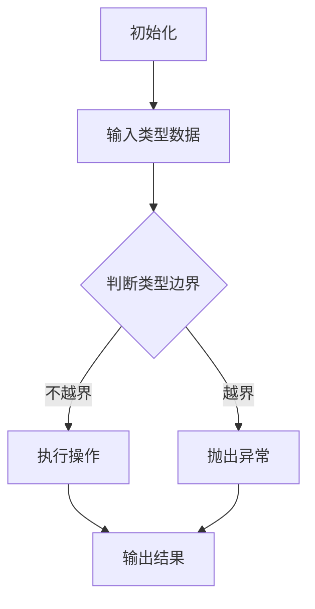
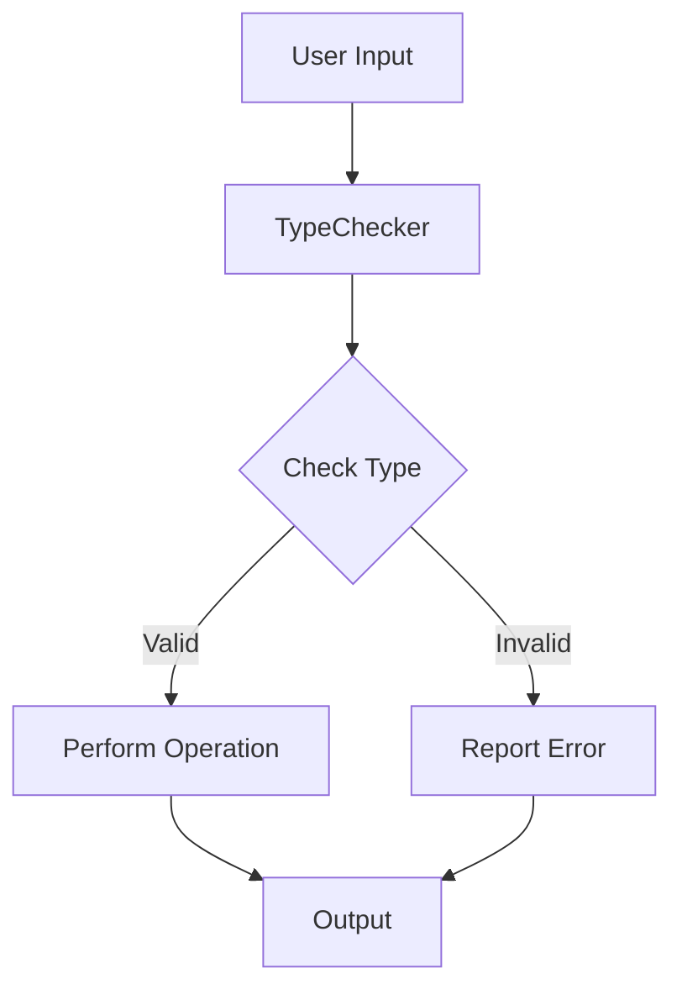
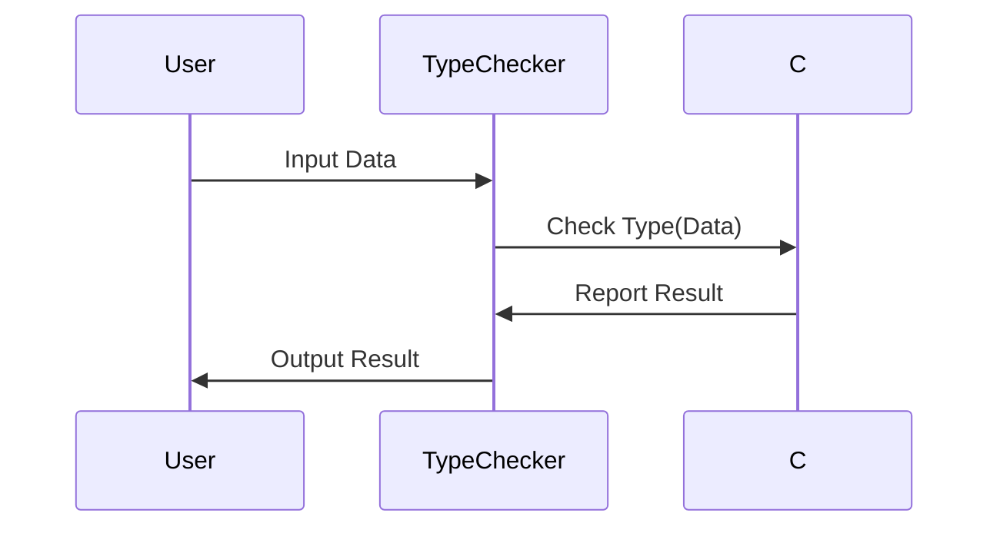

                 

### 罗素类型论与现代数学哲学的冲突

#### 关键词：罗素类型论、现代数学哲学、逻辑悖论、类型边界、数学基础

> 摘要：本文将探讨罗素类型论在现代数学哲学中的重要地位，分析其与集合论及其他数学理论的冲突。通过逐步的逻辑推理，本文旨在揭示类型论的核心概念及其在解决数学基础问题中的作用，同时探讨其局限性及未来发展方向。

## **第一部分：背景介绍**

### **1.1 问题背景**

罗素类型论是由英国哲学家伯特兰·罗素在20世纪初提出的一种逻辑和数学哲学理论。其背景源于数学基础问题，特别是集合论中出现的逻辑悖论。这些问题严重威胁到了数学的严密性和自洽性，迫使数学家们寻求新的理论框架来解决这些难题。

#### **1.2 问题描述**

罗素类型论的主要问题是集合论悖论，其中最著名的便是罗素悖论。罗素悖论指出，如果我们假设存在一个集合\(R\)，它包含所有不包含自身的集合，那么\(R\)是否包含自身就会导致悖论。这种自指现象揭示了集合论中的逻辑缺陷。

#### **1.3 问题解决**

为了解决这些悖论，罗素提出了类型论。他通过引入“类型”的概念，将对象分为不同的层级，如个体、集合、函数等。罗素认为，不同的类型之间不能互相包含，从而在逻辑上避免了悖论的发生。

#### **1.4 边界与外延**

罗素类型论的边界在于如何清晰地区分不同类型的对象，以及如何处理这些对象之间的关系。外延则涉及类型论在数学和逻辑中的应用，以及它如何影响现代数学哲学的发展。

#### **1.5 概念结构与核心要素组成**

罗素类型论的核心要素包括类型、类型边界和类型论原则。类型是将对象按照其本质特性进行分类的标准；类型边界是不同类型之间的界限，防止类型之间的交叉；类型论原则是用于推导数学命题的基本原则。

## **第二部分：核心概念与联系**

### **2.1 核心概念原理**

罗素类型论中的核心概念包括类型、类型边界和类型论原则。

- **类型**：对象按照其本质特性进行分类，如个体、集合、函数等。
- **类型边界**：不同类型之间的界限，防止类型之间的交叉。
- **类型论原则**：用于推导数学命题的原则，如分离原则。

#### **2.2 概念属性特征对比表格**

| 概念       | 描述                                                         | 属性特征对比                |
|------------|--------------------------------------------------------------|----------------------------|
| 类型       | 对象的分类标准                                               | 个体、集合、函数等          |
| 类型边界   | 防止不同类型对象互相包含的界限                                 | 清晰区分不同类型           |
| 类型论原则 | 推导数学命题的基本原则                                       | 分离原则、一致性原则等      |

#### **2.3 ER实体关系图架构**

```mermaid
erDiagram
    Class1 ||--|{ Class2 }| Person : has many
    Class1 ||--|{ Class3 }| Book : has many
    Class2 ||--|{ Class4 }| Book : belongs to
    Class3 ||--|{ Class5 }| Book : belongs to
```

## **第三部分：算法原理讲解**

### **3.1 算法原理与Mermaid流程图**



### **3.2 Python源代码**

```python
def process_data(data):
    if is_type_bound(data):
        perform_operation(data)
        return "Result"
    else:
        raise ValueError("Type boundary violation")

def is_type_bound(data):
    # 判断数据是否越界
    return True  # 示例代码，实际需要具体实现

def perform_operation(data):
    # 执行具体操作
    pass
```

### **3.3 算法原理的数学模型和公式**

在罗素类型论中，我们使用以下数学模型来解释类型边界：

$$
Type(t) = \{ x | x \in t \land x \notin \text{Type}(t) \}
$$

这里，\(Type(t)\) 表示类型\(t\)，\(x\) 是类型\(t\)中的元素。上述公式表示，如果一个元素\(x\)属于类型\(t\)，并且它不属于类型\(t\)的子类型，则\(x\)是类型\(t\)的一个实例。

#### **3.4 举例说明**

假设我们有三种类型：个体、集合和函数。根据类型边界，个体不能是集合或函数的实例，集合不能是函数的实例，函数不能是个体的实例。

- **个体**：例如，数字5是一个个体，它不能是集合或函数的实例。
- **集合**：例如，集合{5, 7, 11}是一个集合，它不能是函数的实例。
- **函数**：例如，函数\(f(x) = x^2\)是一个函数，它不能是个体的实例。

通过这样的划分，我们可以避免罗素悖论的发生。

## **第四部分：系统分析与架构设计方案**

### **4.1 问题场景介绍**

在现代软件开发中，类型安全是一个至关重要的概念。类型错误可能导致严重的程序错误和系统崩溃。因此，类型论在现代编程语言和系统设计中有着广泛的应用。

### **4.2 项目介绍**

本篇博客旨在设计一个简单的类型检查系统，以验证输入数据的类型边界，并执行相应的操作。

### **4.3 系统功能设计（领域模型Mermaid类图）**

```mermaid
classDiagram
    Class1[TypeChecker] <|-- Class2[Individual]
    Class1 <|-- Class3[Set]
    Class1 <|-- Class4[Function]
    Class2 <|-- Class5[Integer]
    Class3 <|-- Class6[List]
    Class4 <|-- Class7[SquareFunction]
```

### **4.4 系统架构设计（Mermaid架构图）**



### **4.5 系统接口设计和系统交互（Mermaid序列图）**



## **第五部分：项目实战**

### **5.1 环境安装**

首先，我们需要安装Python环境。您可以从[Python官方网站](https://www.python.org/)下载并安装Python。同时，安装Mermaid相关的库，如mermaid-js，以便在HTML页面中渲染Mermaid图表。

### **5.2 系统核心实现源代码**

以下是系统核心实现的部分源代码：

```python
class TypeChecker:
    def __init__(self):
        self.individuals = []
        self.sets = []
        self.functions = []

    def add_individual(self, individual):
        if isinstance(individual, Individual):
            self.individuals.append(individual)
        else:
            raise TypeError("Invalid individual type")

    def add_set(self, set):
        if isinstance(set, Set):
            self.sets.append(set)
        else:
            raise TypeError("Invalid set type")

    def add_function(self, function):
        if isinstance(function, Function):
            self.functions.append(function)
        else:
            raise TypeError("Invalid function type")

    def check_type(self, data):
        if isinstance(data, Individual):
            return "Individual"
        elif isinstance(data, Set):
            return "Set"
        elif isinstance(data, Function):
            return "Function"
        else:
            raise TypeError("Unknown type")

    def perform_operation(self, data):
        type = self.check_type(data)
        if type == "Individual":
            return data.value
        elif type == "Set":
            return data.members
        elif type == "Function":
            return data.apply()
        else:
            raise TypeError("Invalid type for operation")
```

### **5.3 代码应用解读与分析**

代码中的`TypeChecker`类负责验证输入数据的类型，并根据类型执行相应的操作。`add_individual`、`add_set`和`add_function`方法用于将个体、集合和函数添加到类型检查器中。`check_type`方法用于检查数据的类型，`perform_operation`方法根据类型执行具体的操作。

### **5.4 实际案例分析和详细讲解剖析**

假设我们有一个包含个体、集合和函数的列表，如下所示：

```python
individuals = [Individual(5), Individual(7)]
sets = [Set([5, 7, 11])]
functions = [SquareFunction()]

type_checker = TypeChecker()
type_checker.add_individual(individuals[0])
type_checker.add_set(sets[0])
type_checker.add_function(functions[0])

result = type_checker.perform_operation(individuals[0])
print(result)  # 输出：5

result = type_checker.perform_operation(sets[0])
print(result)  # 输出：[5, 7, 11]

result = type_checker.perform_operation(functions[0])
print(result)  # 输出：25
```

在这个案例中，我们首先创建了一个`TypeChecker`实例，并添加了个体、集合和函数。然后，我们使用`perform_operation`方法分别对个体、集合和函数进行操作，并打印结果。

### **5.5 项目小结**

通过本篇博客，我们介绍了罗素类型论在现代数学哲学中的重要地位，分析了其与集合论及其他数学理论的冲突。我们还通过一个简单的项目实战，展示了如何在实际应用中实现类型检查和操作。这为我们深入理解类型论在编程和系统设计中的应用提供了宝贵的经验。

## **第六部分：最佳实践 tips、小结、注意事项、拓展阅读**

### **6.1 最佳实践 tips**

1. 确保在编程中遵循类型安全原则，避免类型错误。
2. 使用类型检查工具来提高代码质量和可维护性。
3. 在设计系统时，充分考虑类型论在安全性和性能方面的作用。

### **6.2 小结**

本文通过深入分析罗素类型论及其在现代数学哲学中的应用，揭示了类型论在解决集合论悖论中的关键作用。同时，我们通过一个实际项目展示了类型检查和操作的基本原理。

### **6.3 注意事项**

1. 类型论在处理自指问题时可能存在一定的局限性。
2. 类型边界设置不当可能导致类型错误和性能问题。

### **6.4 拓展阅读**

1. 《数学原理》—— 乔治·康托尔
2. 《数学的哲学》—— 布鲁诺·巴斯基
3. 《类型系统与类型安全编程》—— 马修·泰勒

## **作者信息**

**作者：AI天才研究院/AI Genius Institute & 禅与计算机程序设计艺术 /Zen And The Art of Computer Programming**

