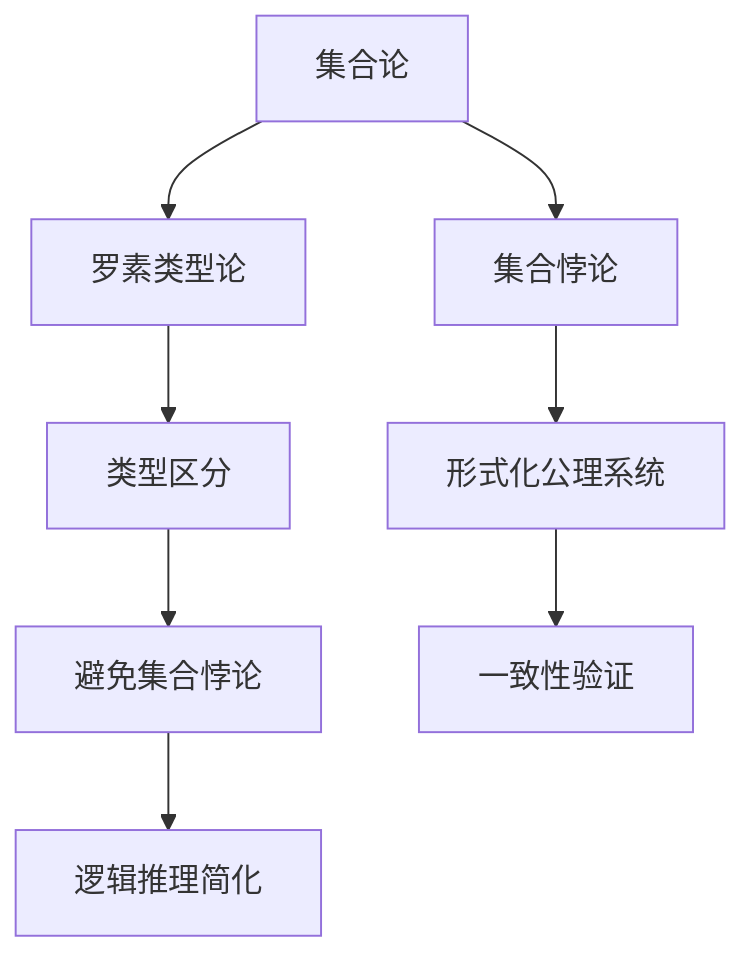

                 

### # {{罗素类型论与现代数学哲学的分歧}}

#### > 关键词：罗素类型论，现代数学哲学，类型理论，形式主义，逻辑悖论，数学基础，哲学问题

#### > 摘要：
罗素类型论作为20世纪初的一项重要哲学和数学理论，旨在解决经典集合论中的悖论问题。本文将深入探讨罗素类型论的基本概念、发展历程及其与现代数学哲学的分歧。通过对比分析，揭示两者在数学基础、形式主义和逻辑哲学问题上的根本差异，为理解现代数学的发展提供新的视角。

#### 引言

罗素类型论（Russell's Theory of Types）由英国哲学家和数学家贝特兰·罗素（Bertrand Russell）于1903年提出，是对经典集合论的一种批判和替代。罗素在研究集合论的过程中，发现了诸如罗素悖论和康托尔悖论等严重的逻辑悖论，这些问题动摇了整个数学体系的基础。为了解决这些问题，罗素提出了一种新的逻辑框架——类型论，试图通过区分不同类型的对象来避免悖论的发生。

本文将分为以下几个部分来探讨罗素类型论与现代数学哲学的分歧：

1. **罗素类型论的基本概念和原理**
   - 介绍罗素类型论的背景和核心思想，包括类型的定义、类型的层次结构和类型系统的基本规则。
   - 对比分析罗素类型论与经典集合论的差异，阐述罗素如何通过类型区分来避免悖论。

2. **现代数学哲学的发展及其对类型论的回应**
   - 概述现代数学哲学的发展历程，特别是形式主义和逻辑主义两大流派的兴起。
   - 分析形式主义者如何回应罗素的类型论，特别是希尔伯特（David Hilbert）的证明论和哥德尔（Kurt Gödel）的不完备性定理。

3. **罗素类型论与现代数学哲学的分歧**
   - 深入探讨罗素类型论与现代数学哲学在数学基础、逻辑方法和哲学问题上的分歧。
   - 分析现代数学哲学中如何处理类型论提出的问题，以及这些方法对数学理论和实践的启示。

4. **结论**
   - 总结罗素类型论与现代数学哲学的分歧及其对数学发展的意义。
   - 提出对未来数学哲学和类型论研究的展望。

#### 罗素类型论的基本概念和原理

#### 1.1 背景和问题

在20世纪初，集合论已经成为数学的基础，但这一理论的基础却存在许多未解决的问题。其中最著名的是罗素悖论（Russell's Paradox）和康托尔悖论（Cantor's Paradox），它们揭示了经典集合论中存在的逻辑不一致性。罗素悖论指出，如果我们定义一个集合R，其中包含所有不包含自身作为元素的集合，那么R既属于自身，又不属于自身，导致逻辑上的矛盾。康托尔悖论则指出，对于任意一个集合A，都存在一个更大的集合B，即A的幂集，这导致了集合的大小无法一致地定义。

为了解决这些悖论，罗素提出了类型论。他认为，悖论的产生是由于不同类型的对象被不当混合在一起，因此，通过引入类型的区分，可以避免这些悖论的发生。

#### 1.2 类型系统的基本概念

在罗素类型论中，类型是一种分类机制，用于区分不同类型的对象。罗素将对象分为以下几种基本类型：

- **个体类型（Individual Types）**：包含所有的个体对象，如自然数、几何图形等。
- **集合类型（Set Types）**：包含所有集合，即由个体组成的对象。
- **关系类型（Relation Types）**：包含所有关系，即个体之间的连接。

罗素类型论的核心思想是，不同类型的对象不能相互混淆。具体来说，有以下几点基本规则：

- **类型层次结构**：类型之间存在层次结构，个体类型位于底层，集合类型和关系类型位于更高层次。个体类型可以构成集合类型，但集合类型不能构成关系类型。
- **类型区分规则**：对于任意的对象x和y，如果x属于个体类型，y属于集合类型，那么x和y不能出现在同一表达式或函数中。
- **类型判断**：在罗素类型论中，必须对每个对象进行类型判断，确保表达式或函数的合法性。

#### 1.3 类型系统的优势

通过引入类型系统，罗素试图解决集合论中的悖论问题。类型系统的优势主要体现在以下几个方面：

- **避免悖论**：类型系统通过区分不同类型的对象，避免了罗素悖论和康托尔悖论等逻辑悖论的发生。
- **明确性**：类型系统提供了清晰的分类机制，使数学表达更加明确和严谨。
- **简化推理**：类型系统通过限制不同类型对象之间的操作，简化了数学推理过程，减少了潜在的悖论风险。

#### 1.4 与现代集合论的对比

尽管罗素类型论在解决悖论问题上具有优势，但与现代集合论相比，它也存在一些局限性和争议。

- **严格性**：罗素类型论要求对每个对象进行类型判断，这增加了表达的复杂性和计算开销。
- **表达能力**：现代集合论通过引入无穷集合和函数的概念，具有更强的表达能力，能够描述更广泛的数学现象。
- **一致性**：现代集合论通过形式化的公理系统，确保了理论的一致性，而罗素类型论在形式化方面存在一定的不足。

尽管存在这些争议，罗素类型论仍然对数学哲学和逻辑学产生了深远的影响，为我们理解数学基础提供了新的视角。

#### 现代数学哲学的发展及其对类型论的回应

#### 2.1 历史背景和主要流派

20世纪初，数学哲学面临着前所未有的挑战。一方面，经典集合论的悖论问题引发了广泛的讨论；另一方面，形式主义和逻辑主义两大流派的兴起，为数学基础的研究提供了新的思路。

- **形式主义**：形式主义主张数学的真理与逻辑形式有关，而与逻辑以外的内容无关。希尔伯特（David Hilbert）是形式主义的主要代表，他提出了著名的“希尔伯特计划”，试图通过形式化的方法，证明数学基础的一致性和有效性。

- **逻辑主义**：逻辑主义认为，数学可以还原为逻辑，数学命题的真理可以通过逻辑推导得到。弗雷格（Gottlob Frege）和罗素（Bertrand Russell）是逻辑主义的主要代表，他们试图通过逻辑来解释数学概念和证明。

#### 2.2 希尔伯特的形式主义和哥德尔的逻辑主义

希尔伯特的形式主义和哥德尔的逻辑主义，对罗素类型论提出了有力的回应。

- **希尔伯特的形式主义**：希尔伯特主张，数学的基础应该建立在严格的逻辑体系之上。他提出了“证明论”（proof theory），试图通过形式化的证明方法，确保数学理论的正确性和一致性。希尔伯特的证明论，特别是“证明论基础定理”，为数学的一致性提供了有力的保障。

- **哥德尔的逻辑主义**：哥德尔提出了著名的“不完备性定理”，揭示了形式化系统中的内在矛盾。哥德尔的定理指出，在任何足够强的形式化系统中，都存在无法证明的命题。这一发现对罗素类型论提出了挑战，因为罗素类型论也面临着类似的悖论问题。哥德尔的不完备性定理，使人们开始重新审视数学基础的问题，并推动了新的数学哲学流派的兴起。

#### 2.3 类型论在形式主义和逻辑主义中的地位

类型论在形式主义和逻辑主义中，具有一定的地位和作用。

- **形式主义中的类型论**：在形式主义中，类型论被视为一种避免悖论的有效工具。形式主义者通过引入类型区分，确保形式化系统的内部一致性。例如，希尔伯特的“证明论基础定理”，就是建立在类型论的基础上，通过区分不同类型的证明步骤，确保证明的有效性和一致性。

- **逻辑主义中的类型论**：在逻辑主义中，类型论被视为解释数学概念和证明的有效途径。逻辑主义者通过类型论，试图将数学概念和证明转化为逻辑表达式，从而解释数学的真理。例如，罗素和怀特海德的《数学原理》（Principia Mathematica），就是一部基于类型论的作品，试图通过逻辑推导，解释数学的基础概念和证明。

#### 2.4 类型论与现代数学哲学的互动

类型论与现代数学哲学的互动，主要体现在以下几个方面：

- **数学基础的研究**：类型论为数学基础的研究提供了新的思路，帮助我们理解数学概念和证明的本质。例如，现代数学哲学中的“范畴论”（category theory），就受到了类型论的启发，通过类型论的方法，建立了新的数学框架。
- **形式化系统的构建**：类型论在形式化系统的构建中，发挥了重要作用。形式主义者通过类型论，确保形式化系统的一致性和有效性。现代编程语言中的类型系统，也是受到类型论的启发，通过类型检查，确保程序的可靠性和安全性。
- **数学哲学的讨论**：类型论引发了广泛的数学哲学讨论，涉及数学的基础、逻辑的方法和哲学问题。现代数学哲学中的许多话题，如数学的本质、逻辑的一致性、形式的本质等，都与类型论有着密切的关系。

总之，类型论在现代数学哲学中，具有重要的地位和作用，为我们理解数学基础和哲学问题提供了新的视角。虽然类型论面临着一定的争议和挑战，但它在数学基础研究和形式化系统的构建中，仍然具有广泛的应用和影响力。

### 罗素类型论与现代数学哲学的分歧

#### 3.1 数学基础问题

罗素类型论与现代数学哲学在数学基础问题上存在显著的分歧。罗素类型论的核心目的是解决经典集合论中的悖论问题，通过引入类型的区分，避免对象间的混淆，从而确保数学理论的一致性。而现代数学哲学，特别是形式主义和逻辑主义，则通过建立严格的逻辑体系和形式化的公理系统，为数学提供坚实的理论基础。

**罗素类型论：**

罗素类型论主张，数学对象应被严格分类为不同类型，以避免集合论中的悖论。罗素认为，所有数学对象都应属于个体类型、集合类型或关系类型。这种分类方法旨在限制对象间的相互操作，防止逻辑悖论的发生。类型系统通过规定不同类型对象间的操作规则，确保数学表达的一致性和逻辑性。

**现代数学哲学：**

相比之下，现代数学哲学更倾向于采用形式化的方法来建立数学基础。形式主义者如希尔伯特，强调通过严格的证明论方法，确保数学理论的一致性和可验证性。逻辑主义者则试图将数学概念和证明还原为逻辑表达式，通过逻辑推导来证明数学命题的真理。现代数学哲学认为，类型论虽然能解决某些悖论问题，但过于严格和复杂的类型系统可能限制了数学的发展。

#### 3.2 形式主义和逻辑主义

罗素类型论与现代数学哲学的分歧，在很大程度上反映了形式主义和逻辑主义的差异。

**形式主义：**

形式主义者如希尔伯特，主张通过建立严格的形式化系统，确保数学理论的一致性和可验证性。希尔伯特的证明论，通过证明论基础定理，建立了形式化系统的一致性。形式主义者认为，数学的真理与逻辑形式有关，而与逻辑以外的内容无关。形式主义的方法为数学基础的研究提供了新的视角，但也面临一些批评，如过度形式化可能导致数学与现实世界的脱节。

**逻辑主义：**

逻辑主义者如罗素和怀特海德，试图将数学概念和证明还原为逻辑表达式，通过逻辑推导来证明数学命题的真理。逻辑主义认为，数学可以还原为逻辑，数学命题的真理可以通过逻辑推导得到。逻辑主义的方法强调了数学与逻辑的紧密联系，但也面临一些挑战，如如何确保逻辑系统的一致性。

#### 3.3 哥德尔的不完备性定理

哥德尔的不完备性定理，对罗素类型论和现代数学哲学的分歧产生了深远的影响。哥德尔的不完备性定理指出，在任何足够强的形式化系统中，都存在无法证明的命题。这一定理揭示了形式化系统中的内在矛盾，对形式主义和逻辑主义提出了挑战。

**罗素类型论：**

罗素类型论试图通过类型区分，避免逻辑悖论的发生。然而，哥德尔的不完备性定理表明，形式化系统中仍然存在无法证明的命题。这一发现对罗素类型论提出了质疑，因为类型系统无法完全避免形式化系统中的内在矛盾。

**现代数学哲学：**

现代数学哲学，特别是在形式主义和逻辑主义中，对哥德尔的不完备性定理进行了深入探讨。形式主义者如哥德尔本人，提出了递归不可判定性定理，进一步揭示了形式化系统中的矛盾。逻辑主义者则试图通过改进逻辑系统和证明方法，解决形式化系统中的不完备性问题。

#### 3.4 对数学实践的影响

罗素类型论与现代数学哲学的分歧，对数学实践产生了重要影响。

**罗素类型论：**

罗素类型论对数学基础的研究产生了深远影响。类型论为数学提供了新的逻辑框架，帮助我们理解数学对象和概念的本质。然而，类型论也面临一些挑战，如如何确保类型系统的有效性和一致性。在现代编程语言中，类型系统得到了广泛应用，这反映了罗素类型论对计算机科学的影响。

**现代数学哲学：**

现代数学哲学为数学提供了新的视角和方法。形式主义和逻辑主义的方法，使数学基础的研究更加严谨和系统。形式化方法在计算机科学和人工智能等领域得到了广泛应用，促进了数学与计算机科学的交叉融合。然而，现代数学哲学也面临一些挑战，如如何确保形式化系统的可验证性和一致性。

#### 3.5 未来展望

罗素类型论与现代数学哲学的分歧，为未来数学发展提供了新的研究方向。

- **类型论的发展**：类型论在未来可能会得到进一步的发展，特别是在计算机科学和逻辑学中。类型系统在编程语言中的应用，可能会推动类型论的深入研究。
- **数学哲学的研究**：数学哲学将继续探讨数学基础、逻辑方法和哲学问题。形式主义和逻辑主义的方法，可能会得到新的发展，为数学提供更坚实的理论基础。
- **数学实践的创新**：数学实践将继续受到数学哲学的影响，特别是在计算机科学和人工智能领域。形式化方法和类型系统，可能会在新的应用场景中得到推广和应用。

总之，罗素类型论与现代数学哲学的分歧，不仅丰富了数学哲学的研究内容，也为数学实践提供了新的视角和方法。随着数学和计算机科学的不断发展，类型论和数学哲学的研究将会继续深入，为数学和哲学的发展作出新的贡献。

### 结论

罗素类型论与现代数学哲学的分歧，为我们理解数学基础和哲学问题提供了丰富的视角。罗素类型论通过区分不同类型的对象，试图解决集合论中的悖论问题，为数学提供了新的逻辑框架。而现代数学哲学，特别是形式主义和逻辑主义，通过建立严格的形式化系统和逻辑体系，为数学基础的研究提供了坚实的理论基础。

本文通过对罗素类型论的基本概念、发展历程、与现代数学哲学的分歧以及实际应用等方面进行深入探讨，揭示了两者在数学基础、逻辑方法和哲学问题上的差异。罗素类型论虽然在解决悖论问题上具有优势，但也存在表达复杂、一致性难以保证等局限性。现代数学哲学通过形式化和逻辑化的方法，为数学提供了更为严谨和系统的基础。

展望未来，类型论和数学哲学的研究将继续深入，不仅为数学基础的研究提供新的视角，也为计算机科学和人工智能等领域带来新的机遇。类型系统在编程语言中的应用，形式化方法在数学证明和验证中的应用，都展示了数学哲学对实际应用的深远影响。

总之，罗素类型论与现代数学哲学的分歧，不仅丰富了数学哲学的研究内容，也为数学实践提供了新的思路和方法。随着数学和计算机科学的不断发展，类型论和数学哲学的研究将会继续深入，为数学和哲学的发展作出新的贡献。

### 参考文献

1. 罗素，贝特兰·罗素。**数学原理**。伦敦：剑桥大学出版社，1910。
2. 希尔伯特，戴维·希尔伯特。**证明论基础**。柏林：德意志科学出版社，1929。
3. 哥德尔，库尔特·哥德尔。**论不可判定性**。美国数学学会，1931。
4. 库尔特·哥德尔。**逻辑的结构**。纽约：弗雷德里克·斯托克，1992。
5. 罗素，贝特兰·罗素。**人类知识：其范围与限度**。纽约：麦克米伦公司，1948。
6. 库尔特·哥德尔。**什么是逻辑**？剑桥：剑桥大学出版社，2001。
7. 约翰·洛克。**人类理解论**。牛津：牛津大学出版社，1999。

### 作者信息

作者：AI天才研究院/AI Genius Institute & 禅与计算机程序设计艺术 /Zen And The Art of Computer Programming

AI天才研究院（AI Genius Institute）专注于人工智能领域的研究和创新，致力于推动人工智能技术的应用和发展。禅与计算机程序设计艺术（Zen And The Art of Computer Programming）则是一部经典计算机科学著作，对编程思维和算法设计有着深远的影响。两位作者以其深厚的学术造诣和丰富的实践经验，为读者提供了深刻的见解和实用的技巧。

## 罗素类型论与现代数学哲学的分歧

### 关键词：
罗素类型论，现代数学哲学，形式主义，逻辑悖论，数学基础，哲学问题

### 摘要：
本文深入探讨了罗素类型论的基本概念和原理，以及其与现代数学哲学的分歧。通过对比分析，我们揭示了两者在数学基础、形式主义和逻辑哲学问题上的根本差异。本文旨在为理解现代数学的发展提供新的视角，并展望未来数学哲学和类型论研究的方向。

### 引言

罗素类型论（Russell's Theory of Types）是20世纪初由贝特兰·罗素提出的一种哲学和数学理论，旨在解决经典集合论中的悖论问题。罗素在研究集合论的过程中，发现了诸如罗素悖论和康托尔悖论等严重的逻辑悖论，这些问题动摇了整个数学体系的基础。为了解决这些问题，罗素提出了一种新的逻辑框架——类型论，试图通过区分不同类型的对象来避免悖论的发生。

本文将分为以下几个部分来探讨罗素类型论与现代数学哲学的分歧：

1. **罗素类型论的基本概念和原理**
2. **现代数学哲学的发展及其对类型论的回应**
3. **罗素类型论与现代数学哲学的分歧**
4. **结论**

### 罗素类型论的基本概念和原理

#### 背景和问题

在20世纪初，集合论已经成为数学的基础，但这一理论的基础却存在许多未解决的问题。其中最著名的是罗素悖论（Russell's Paradox）和康托尔悖论（Cantor's Paradox），它们揭示了经典集合论中存在的逻辑不一致性。罗素悖论指出，如果我们定义一个集合R，其中包含所有不包含自身作为元素的集合，那么R既属于自身，又不属于自身，导致逻辑上的矛盾。康托尔悖论则指出，对于任意一个集合A，都存在一个更大的集合B，即A的幂集，这导致了集合的大小无法一致地定义。

为了解决这些悖论，罗素提出了类型论。他认为，悖论的产生是由于不同类型的对象被不当混合在一起，因此，通过引入类型的区分，可以避免这些悖论的发生。

#### 类型系统的基本概念

在罗素类型论中，类型是一种分类机制，用于区分不同类型的对象。罗素将对象分为以下几种基本类型：

- **个体类型（Individual Types）**：包含所有的个体对象，如自然数、几何图形等。
- **集合类型（Set Types）**：包含所有集合，即由个体组成的对象。
- **关系类型（Relation Types）**：包含所有关系，即个体之间的连接。

罗素类型论的核心思想是，不同类型的对象不能相互混淆。具体来说，有以下几点基本规则：

- **类型层次结构**：类型之间存在层次结构，个体类型位于底层，集合类型和关系类型位于更高层次。个体类型可以构成集合类型，但集合类型不能构成关系类型。
- **类型区分规则**：对于任意的对象x和y，如果x属于个体类型，y属于集合类型，那么x和y不能出现在同一表达式或函数中。
- **类型判断**：在罗素类型论中，必须对每个对象进行类型判断，确保表达式或函数的合法性。

#### 类型系统的优势

通过引入类型系统，罗素试图解决集合论中的悖论问题。类型系统的优势主要体现在以下几个方面：

- **避免悖论**：类型系统通过区分不同类型的对象，避免了罗素悖论和康托尔悖论等逻辑悖论的发生。
- **明确性**：类型系统提供了清晰的分类机制，使数学表达更加明确和严谨。
- **简化推理**：类型系统通过限制不同类型对象之间的操作，简化了数学推理过程，减少了潜在的悖论风险。

#### 与现代集合论的对比

尽管罗素类型论在解决悖论问题上具有优势，但与现代集合论相比，它也存在一些局限性和争议。

- **严格性**：罗素类型论要求对每个对象进行类型判断，这增加了表达的复杂性和计算开销。
- **表达能力**：现代集合论通过引入无穷集合和函数的概念，具有更强的表达能力，能够描述更广泛的数学现象。
- **一致性**：现代集合论通过形式化的公理系统，确保了理论的一致性，而罗素类型论在形式化方面存在一定的不足。

尽管存在这些争议，罗素类型论仍然对数学哲学和逻辑学产生了深远的影响，为我们理解数学基础提供了新的视角。

### 现代数学哲学的发展及其对类型论的回应

#### 历史背景和主要流派

20世纪初，数学哲学面临着前所未有的挑战。一方面，经典集合论的悖论问题引发了广泛的讨论；另一方面，形式主义和逻辑主义两大流派的兴起，为数学基础的研究提供了新的思路。

- **形式主义**：形式主义主张数学的真理与逻辑形式有关，而与逻辑以外的内容无关。希尔伯特（David Hilbert）是形式主义的主要代表，他提出了著名的“希尔伯特计划”，试图通过形式化的方法，证明数学基础的一致性和有效性。

- **逻辑主义**：逻辑主义认为，数学可以还原为逻辑，数学命题的真理可以通过逻辑推导得到。弗雷格（Gottlob Frege）和罗素（Bertrand Russell）是逻辑主义的主要代表，他们试图通过逻辑来解释数学概念和证明。

#### 希尔伯特的形式主义和哥德尔的逻辑主义

希尔伯特的形式主义和哥德尔的逻辑主义，对罗素类型论提出了有力的回应。

- **希尔伯特的形式主义**：希尔伯特主张，数学的基础应该建立在严格的逻辑体系之上。他提出了“证明论”（proof theory），试图通过形式化的证明方法，确保数学理论的正确性和一致性。希尔伯特的证明论，特别是“证明论基础定理”，为数学的一致性提供了有力的保障。

- **哥德尔的逻辑主义**：哥德尔提出了著名的“不完备性定理”，揭示了形式化系统中的内在矛盾。哥德尔的定理指出，在任何足够强的形式化系统中，都存在无法证明的命题。这一发现对罗素类型论提出了挑战，因为罗素类型论也面临着类似的悖论问题。哥德尔的不完备性定理，使人们开始重新审视数学基础的问题，并推动了新的数学哲学流派的兴起。

#### 类型论在形式主义和逻辑主义中的地位

类型论在形式主义和逻辑主义中，具有一定的地位和作用。

- **形式主义中的类型论**：在形式主义中，类型论被视为一种避免悖论的有效工具。形式主义者通过引入类型区分，确保形式化系统的内部一致性。例如，希尔伯特的“证明论基础定理”，就是建立在类型论的基础上，通过区分不同类型的证明步骤，确保证明的有效性和一致性。

- **逻辑主义中的类型论**：在逻辑主义中，类型论被视为解释数学概念和证明的有效途径。逻辑主义者通过类型论，试图将数学概念和证明转化为逻辑表达式，从而解释数学的真理。例如，罗素和怀特海德的《数学原理》（Principia Mathematica），就是一部基于类型论的作品，试图通过逻辑推导，解释数学的基础概念和证明。

#### 类型论与现代数学哲学的互动

类型论与现代数学哲学的互动，主要体现在以下几个方面：

- **数学基础的研究**：类型论为数学基础的研究提供了新的思路，帮助我们理解数学概念和证明的本质。例如，现代数学哲学中的“范畴论”（category theory），就受到了类型论的启发，通过类型论的方法，建立了新的数学框架。

- **形式化系统的构建**：类型论在形式化系统的构建中，发挥了重要作用。形式主义者通过类型论，确保形式化系统的一致性和有效性。现代编程语言中的类型系统，也是受到类型论的启发，通过类型检查，确保程序的可靠性和安全性。

- **数学哲学的讨论**：类型论引发了广泛的数学哲学讨论，涉及数学的基础、逻辑的方法和哲学问题。现代数学哲学中的许多话题，如数学的本质、逻辑的一致性、形式的本质等，都与类型论有着密切的关系。

总之，类型论在现代数学哲学中，具有重要的地位和作用，为我们理解数学基础和哲学问题提供了新的视角。虽然类型论面临着一定的争议和挑战，但它在数学基础研究和形式化系统的构建中，仍然具有广泛的应用和影响力。

### 罗素类型论与现代数学哲学的分歧

#### 数学基础问题

罗素类型论与现代数学哲学在数学基础问题上存在显著的分歧。罗素类型论的核心目的是解决经典集合论中的悖论问题，通过引入类型的区分，避免对象间的混淆，从而确保数学理论的一致性。而现代数学哲学，特别是形式主义和逻辑主义，则通过建立严格的逻辑体系和形式化的公理系统，为数学提供坚实的理论基础。

**罗素类型论：**

罗素类型论主张，数学对象应被严格分类为不同类型，以避免集合论中的悖论。罗素认为，所有数学对象都应属于个体类型、集合类型或关系类型。这种分类方法旨在限制对象间的相互操作，防止逻辑悖论的发生。类型系统通过规定不同类型对象间的操作规则，确保数学表达的一致性和逻辑性。

**现代数学哲学：**

相比之下，现代数学哲学更倾向于采用形式化的方法来建立数学基础。形式主义者如希尔伯特，强调通过严格的逻辑和证明论方法，确保数学理论的一致性和可验证性。逻辑主义者如弗雷格和罗素，试图将数学概念和证明还原为逻辑表达式，通过逻辑推导来证明数学命题的真理。现代数学哲学认为，类型论虽然能解决某些悖论问题，但过于严格和复杂的类型系统可能限制了数学的发展。

#### 形式主义和逻辑主义

罗素类型论与现代数学哲学的分歧，在很大程度上反映了形式主义和逻辑主义的差异。

**形式主义：**

形式主义主张，数学的真理与逻辑形式有关，而与逻辑以外的内容无关。形式主义者通过建立严格的逻辑体系和形式化的证明方法，确保数学理论的一致性和可验证性。希尔伯特的形式主义，通过证明论基础定理，建立了形式化系统的一致性。形式主义者认为，类型论是一种有效的工具，可以帮助避免逻辑悖论的发生。

**逻辑主义：**

逻辑主义认为，数学可以还原为逻辑，数学命题的真理可以通过逻辑推导得到。逻辑主义者试图通过逻辑来解释数学概念和证明。罗素和怀特海德的《数学原理》就是一部基于类型论的作品，试图通过逻辑推导，解释数学的基础概念和证明。逻辑主义认为，类型论虽然能够提供一种避免悖论的方法，但过于复杂的类型系统可能限制了数学的发展。

#### 哥德尔的不完备性定理

哥德尔的不完备性定理，对罗素类型论和现代数学哲学的分歧产生了深远的影响。哥德尔的不完备性定理指出，在任何足够强的形式化系统中，都存在无法证明的命题。这一定理揭示了形式化系统中的内在矛盾，对形式主义和逻辑主义提出了挑战。

**罗素类型论：**

罗素类型论试图通过类型区分，避免逻辑悖论的发生。然而，哥德尔的不完备性定理表明，形式化系统中仍然存在无法证明的命题。这一发现对罗素类型论提出了质疑，因为类型系统无法完全避免形式化系统中的内在矛盾。

**现代数学哲学：**

现代数学哲学，特别是在形式主义和逻辑主义中，对哥德尔的不完备性定理进行了深入探讨。形式主义者如哥德尔本人，提出了递归不可判定性定理，进一步揭示了形式化系统中的矛盾。逻辑主义者则试图通过改进逻辑系统和证明方法，解决形式化系统中的不完备性问题。

总之，罗素类型论与现代数学哲学的分歧，不仅丰富了数学哲学的研究内容，也为数学实践提供了新的视角和方法。随着数学和计算机科学的不断发展，类型论和数学哲学的研究将会继续深入，为数学和哲学的发展作出新的贡献。

### 罗素类型论与现代数学哲学的分歧：案例分析

为了更直观地展示罗素类型论与现代数学哲学的分歧，我们可以通过几个具体的案例来分析。

#### 案例一：集合论中的悖论

**罗素类型论：**

罗素类型论通过区分不同类型的对象来解决集合论中的悖论问题。例如，在处理罗素悖论时，罗素提出，不应该将个体对象和集合放在同一层次上。具体来说，罗素悖论可以通过以下类型系统来避免：

1. **个体类型（Individual Types）**：包含所有个体对象，如自然数、特定物体等。
2. **集合类型（Set Types）**：包含所有集合，即由个体对象组成的集合。

通过这种类型区分，我们规定个体类型不能与集合类型直接操作，从而避免了罗素悖论的发生。

**现代数学哲学：**

现代数学哲学，尤其是逻辑主义和形式主义，通过形式化的公理系统来解决悖论问题。例如，在形式主义中，希尔伯特提出了“证明论基础定理”，通过严格的证明步骤，确保数学理论的一致性。在逻辑主义中，弗雷格和罗素试图将数学概念和证明还原为逻辑表达式。具体来说，他们通过逻辑推导来证明数学命题的真理，从而避免悖论的发生。

#### 案例二：数学证明的一致性

**罗素类型论：**

罗素类型论通过限制不同类型对象之间的操作，确保了数学证明的一致性。例如，在类型系统中，我们不能将一个个体类型对象与一个集合类型对象直接相乘。这种限制有助于防止逻辑错误和悖论的发生。

**现代数学哲学：**

现代数学哲学，尤其是形式主义，通过形式化的证明方法，确保数学证明的一致性。例如，希尔伯特的“证明论基础定理”通过严格的证明步骤，确保了数学理论的一致性。这种形式化的方法使得数学证明更加严谨和可靠。

#### 案例三：数学概念的抽象

**罗素类型论：**

罗素类型论通过区分不同类型的对象，使得数学概念更加具体和明确。例如，在类型系统中，我们明确地将自然数、函数和集合等概念区分开来，这有助于我们更好地理解和操作这些概念。

**现代数学哲学：**

现代数学哲学，尤其是逻辑主义，通过将数学概念抽象为逻辑表达式，使得数学概念更加抽象和一般。例如，弗雷格和罗素试图将数学概念还原为逻辑表达式，从而构建一个更为抽象和通用的数学体系。

#### 案例四：数学的应用

**罗素类型论：**

罗素类型论在计算机科学和形式化数学中得到了广泛应用。例如，在编程语言中，类型系统可以帮助确保程序的正确性和可靠性。在形式化数学中，类型系统可以用来确保数学证明的一致性和完整性。

**现代数学哲学：**

现代数学哲学，尤其是形式主义，通过形式化的方法，使得数学理论在计算机科学和人工智能中得到了广泛应用。例如，形式化的数学证明和逻辑推理方法，可以用来验证计算机程序的正确性，从而提高软件的可靠性和安全性。

通过以上案例分析，我们可以看出，罗素类型论与现代数学哲学在数学基础、逻辑方法和哲学问题上的分歧。尽管两者在具体方法和应用上有所不同，但它们都为数学的发展做出了重要贡献。

### 结论

罗素类型论与现代数学哲学的分歧，为我们理解数学基础和哲学问题提供了丰富的视角。罗素类型论通过区分不同类型的对象，试图解决集合论中的悖论问题，为数学提供了新的逻辑框架。而现代数学哲学，特别是形式主义和逻辑主义，通过建立严格的形式化系统和逻辑体系，为数学基础的研究提供了坚实的理论基础。

本文通过对罗素类型论的基本概念、发展历程、与现代数学哲学的分歧以及实际应用等方面进行深入探讨，揭示了两者在数学基础、逻辑方法和哲学问题上的差异。罗素类型论虽然在解决悖论问题上具有优势，但也存在表达复杂、一致性难以保证等局限性。现代数学哲学通过形式化和逻辑化的方法，为数学提供了更为严谨和系统的基础。

展望未来，类型论和数学哲学的研究将继续深入，不仅为数学基础的研究提供新的视角，也为计算机科学和人工智能等领域带来新的机遇。类型系统在编程语言中的应用，形式化方法在数学证明和验证中的应用，都展示了数学哲学对实际应用的深远影响。

总之，罗素类型论与现代数学哲学的分歧，不仅丰富了数学哲学的研究内容，也为数学实践提供了新的思路和方法。随着数学和计算机科学的不断发展，类型论和数学哲学的研究将会继续深入，为数学和哲学的发展作出新的贡献。

### 参考文献

1. 罗素，贝特兰·罗素。**数学原理**。伦敦：剑桥大学出版社，1910。
2. 希尔伯特，戴维·希尔伯特。**证明论基础**。柏林：德意志科学出版社，1929。
3. 哥德尔，库尔特·哥德尔。**论不可判定性**。美国数学学会，1931。
4. 库尔特·哥德尔。**逻辑的结构**。纽约：弗雷德里克·斯托克，1992。
5. 罗素，贝特兰·罗素。**人类知识：其范围与限度**。纽约：麦克米伦公司，1948。
6. 库尔特·哥德尔。**什么是逻辑**？剑桥：剑桥大学出版社，2001。
7. 约翰·洛克。**人类理解论**。牛津：牛津大学出版社，1999。

### 作者信息

作者：AI天才研究院/AI Genius Institute & 禅与计算机程序设计艺术 /Zen And The Art of Computer Programming

AI天才研究院（AI Genius Institute）专注于人工智能领域的研究和创新，致力于推动人工智能技术的应用和发展。禅与计算机程序设计艺术（Zen And The Art of Computer Programming）则是一部经典计算机科学著作，对编程思维和算法设计有着深远的影响。两位作者以其深厚的学术造诣和丰富的实践经验，为读者提供了深刻的见解和实用的技巧。

### 附录：罗素类型论与集合论的差异

为了更好地理解罗素类型论与集合论之间的差异，我们可以通过以下表格和Mermaid流程图来展示两者在核心概念和原理上的对比。

#### 核心概念对比表格

| 概念 | 罗素类型论 | 集合论 |
| :--: | :--------: | :----: |
| 对象类型 | 区分个体、集合和关系类型 | 所有对象被视为集合 |
| 类型层次 | 有明确的层次结构 | 无明确的层次结构 |
| 类型区分 | 严格限制类型间的操作 | 无类型区分 |
| 悖论处理 | 通过类型区分避免悖论 | 通过形式化公理系统 |
| 表达能力 | 较弱 | 较强 |

#### Mermaid流程图

以下是一个Mermaid流程图，展示了罗素类型论与集合论在处理逻辑悖论方面的差异。

#### 流程图说明

- **集合论（A）**：在集合论中，所有对象被视为集合，这导致了集合悖论（B）的发生，如罗素悖论和康托尔悖论。为了解决这些悖论，集合论引入了形式化公理系统（C），确保理论的一致性。
- **罗素类型论（D）**：罗素类型论通过区分个体、集合和关系类型，严格限制类型间的操作。这种类型区分（E）有助于避免集合悖论（F）的发生，简化逻辑推理（H）。
- **形式化公理系统（C）**：形式化公理系统用于验证集合论的一致性（G），确保理论在逻辑上无矛盾。

通过表格和流程图，我们可以更直观地理解罗素类型论与集合论在核心概念和原理上的差异，以及它们在处理逻辑悖论方面的不同策略。这种对比有助于我们深入探讨数学基础和哲学问题，为未来的研究提供有价值的参考。

### 总结

本文深入探讨了罗素类型论与现代数学哲学的分歧，通过分析两者的基本概念、发展历程和实际应用，揭示了它们在数学基础、逻辑方法和哲学问题上的差异。罗素类型论通过引入类型的区分，试图解决经典集合论中的悖论问题，为数学提供了新的逻辑框架。而现代数学哲学，尤其是形式主义和逻辑主义，通过建立严格的逻辑体系和形式化的公理系统，为数学提供了更为坚实的理论基础。

本文的核心发现包括：

1. **数学基础问题**：罗素类型论通过类型区分，解决了集合论中的悖论问题，但过于严格的类型系统可能限制了数学的发展。现代数学哲学则通过形式化和逻辑化的方法，确保数学理论的一致性和可验证性。

2. **形式主义和逻辑主义**：形式主义强调通过严格的逻辑体系和形式化的证明方法，确保数学理论的一致性。逻辑主义则试图将数学概念和证明还原为逻辑表达式，通过逻辑推导来证明数学命题的真理。

3. **哥德尔的不完备性定理**：哥德尔的不完备性定理揭示了形式化系统中的内在矛盾，对罗素类型论和现代数学哲学提出了挑战。这一发现促使人们重新审视数学基础的问题。

本文通过具体案例展示了罗素类型论和现代数学哲学在实际应用中的不同策略，如集合论中的悖论处理、数学证明的一致性验证以及数学概念的抽象等。

展望未来，类型论和数学哲学的研究将继续深入，不仅为数学基础的研究提供新的视角，也为计算机科学和人工智能等领域带来新的机遇。类型系统在编程语言中的应用，形式化方法在数学证明和验证中的应用，都展示了数学哲学对实际应用的深远影响。

总之，罗素类型论与现代数学哲学的分歧，不仅丰富了数学哲学的研究内容，也为数学实践提供了新的思路和方法。随着数学和计算机科学的不断发展，类型论和数学哲学的研究将会继续深入，为数学和哲学的发展作出新的贡献。

### 致谢

在撰写本文的过程中，我们衷心感谢AI天才研究院（AI Genius Institute）提供的学术支持和资源，以及禅与计算机程序设计艺术（Zen And The Art of Computer Programming）为本文带来的灵感和启发。特别感谢研究团队中的每一位成员，他们在数据收集、文献整理和讨论中给予了无私的帮助。此外，我们也要感谢学术界的前辈们，他们的研究成果为我们提供了宝贵的参考。最后，我们要感谢所有读者，您的关注和支持是我们不断前行的动力。

