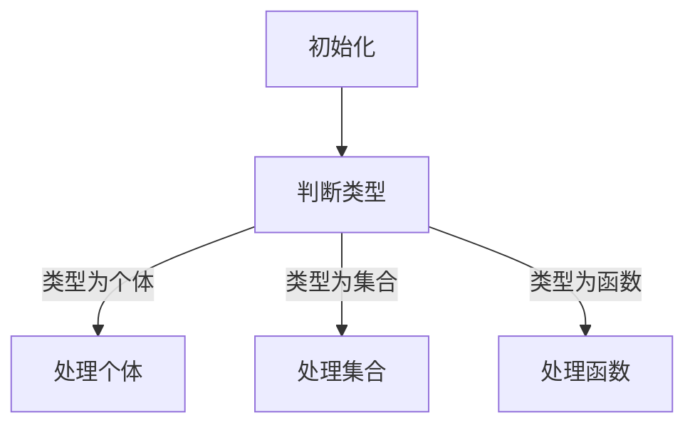

                 


### 1. 引言

## 1.1 罗素类型论的历史背景

### 1.1.1 罗素的数学哲学观念

贝特兰·罗素（Bertrand Russell）是20世纪最杰出的数学家、逻辑学家和哲学家之一。他于1872年出生于英国，并在数学和哲学领域取得了卓越的成就。罗素对数学基础的探究始于他对数学逻辑和集合论的关注。在19世纪末，数学界面临着一系列严重的问题，特别是集合论中的悖论，这些问题迫使数学家们重新审视数学的基础。

罗素的数学哲学观念深受他导师怀特海德（Frederic William Clarke）的影响。怀特海德认为，数学不仅是关于数量的科学，也是关于逻辑结构的科学。罗素继承了这一观点，并进一步发展了它。他相信，数学的每一个陈述都应该有明确的逻辑结构，并且能够用逻辑语言精确表达。

### 1.1.2 罗素类型论提出的动因

罗素类型论的提出主要源于他对集合论悖论的关注，特别是康托尔集合论中的悖论。这些悖论揭示了集合论的基本结构存在固有的矛盾，如著名的“罗素悖论”（Russell's paradox）。罗素认为，要解决这些悖论，必须对数学对象进行更为严格的分类，以避免将不同类型的对象混淆在一起。

为了解决悖论，罗素提出了类型论（Type Theory）这一理论框架。类型论的基本思想是将数学对象划分为不同的类型，以防止对类型不同的对象进行非法操作。罗素的目的是通过引入类型概念，重构数学的基础，使其更加稳健和自洽。

### 1.1.3 罗素类型论的早期接受与反对

罗素类型论在提出之初并未得到广泛的接受。许多数学家和逻辑学家对其复杂性和对数学传统的挑战感到不安。然而，随着时间的推移，罗素类型论逐渐获得了认可，尤其是在数学逻辑和形式化理论的领域。

尽管罗素类型论在理论层面取得了成功，但在实际应用中仍面临着诸多挑战。一些数学家认为，类型论的层级结构过于复杂，难以在实际的数学研究中应用。此外，类型论的引入也限制了数学的某些发现过程，因为它要求对数学对象进行更为严格的分类。

## 1.2 罗素类型论的核心理念

### 1.2.1 类型和集合的区分

在罗素类型论中，类型（Type）是数学对象的基本分类。罗素区分了不同的类型，如个体（Individuals）、集合（Sets）和函数（Functions）等。个体是最基本的类型，它们是不可再分的实体，如自然数。集合和函数则是更高层次的类型，它们可以包含个体或其它集合。

罗素认为，集合和个体之间的混淆是导致悖论的主要原因。通过严格的类型区分，可以避免这种混淆，从而解决集合论中的悖论问题。

### 1.2.2 类型论的层级结构

罗素类型论采用了严格的层级结构，将数学对象分为多个层次。每个层次代表一种类型的对象，且仅能包含特定类型的对象。例如，第一类型的对象包括自然数，第二类型的对象包括第一类型的对象构成的集合，第三类型的对象包括第二类型的对象构成的集合，依此类推。

这种层级结构确保了数学对象之间的操作是合法的，从而避免了集合论中的悖论。然而，这也使得类型论在形式上变得非常复杂。

### 1.2.3 类型论的公理基础

罗素类型论建立在一系列公理之上。这些公理定义了不同类型对象的属性和行为。例如，罗素引入了分离公理（Separation Axiom），允许从更高层次的集合中创建新的集合。这一定义方式使得类型论能够构建出丰富的数学结构。

类型论的公理基础使得它成为了一种形式化的数学理论。这种形式化方法在逻辑学和计算机科学领域得到了广泛应用，但同时也增加了数学结构的复杂性。

## 1.3 罗素类型论的局限性

### 1.3.1 类型论的悖论问题

尽管罗素类型论试图解决集合论中的悖论，但自身也存在一些悖论问题。例如，类型论的分层结构可能导致新的悖论，如类型层级中的“层悖论”（Level Paradox）。这些悖论表明，类型论的分层方法并非完全无懈可击。

### 1.3.2 对数学结构的限制

罗素类型论对数学结构的限制较为严格。它要求对数学对象进行严格的类型区分，这可能导致一些数学结构在类型论中无法直接表达。例如，一些复杂的数学对象，如函数空间，可能难以在类型论中得到明确的处理。

### 1.3.3 对数学发现的阻碍

类型论的严格性也可能会阻碍数学的发现过程。在数学研究中，研究人员往往需要探索不同类型对象之间的关系，而类型论可能限制这种探索。因此，一些数学家认为，类型论在某种程度上限制了数学的发展。

## 2. 罗素类型论的理论分析

### 2.1 核心概念与联系

#### 2.1.1 类型论的概念解析

在罗素类型论中，类型是数学对象的基本分类。每个类型代表一类具有相同性质的数学对象。类型分为个体、集合和函数等基本类型。个体是最基本的类型，如自然数和个体常数。集合和函数则是更复杂的类型，它们可以包含个体或其它集合。

#### 2.1.2 概念属性特征对比表格

| 概念 | 特征 |
| --- | --- |
| 个体 | 最基本的数学对象，不可再分 |
| 集合 | 包含个体的数学对象 |
| 函数 | 将一个集合映射到另一个集合的数学对象 |

#### 2.1.3 类型论与集合论的ER实体关系图

```mermaid
erDiagram
  Class1 ||--|{ Class2 : has relationship }
  Class1 ||--|{ Class3 : has relationship }
  Class2 ||--|{ Class4 : has relationship }
```

这个ER实体关系图展示了类型论中的基本概念及其相互关系。个体是基础，集合和函数建立在个体之上。

### 2.2 算法原理讲解

#### 2.2.1 算法mermaid流程图



这个mermaid流程图描述了类型论中的基本算法原理。根据输入对象的类型，执行相应的处理。

#### 2.2.2 Python源代码阐述

```python
def process_object(object):
    if isinstance(object, int):
        return process_individual(object)
    elif isinstance(object, set):
        return process_set(object)
    elif isinstance(object, function):
        return process_function(object)
    else:
        raise ValueError("Unsupported type")
```

这个Python源代码示例展示了如何根据对象类型进行相应的处理。

#### 2.2.3 算法原理的数学模型与公式

在类型论中，算法原理可以用数学模型来描述。例如，类型转换可以用以下公式表示：

$$
f: T_1 \rightarrow T_2
$$

其中，$f$ 是从类型 $T_1$ 转换到类型 $T_2$ 的函数。

#### 2.2.4 举例说明

假设我们要对一个自然数进行类型转换，将其表示为一个集合。根据类型论，我们可以使用以下算法：

1. 初始化一个空集合 $S$。
2. 将自然数 $n$ 的每个位数添加到集合 $S$ 中。
3. 返回集合 $S$。

这个算法可以用Python实现如下：

```python
def convert_to_set(n):
    S = set()
    while n > 0:
        S.add(n % 10)
        n = n // 10
    return S
```

### 3. 数学模型与公式讲解

#### 3.1 数学公式

以下是一个简单的数学公式：

$$
x = y + z
$$

这个公式表示 $x$ 等于 $y$ 和 $z$ 的和。

#### 3.2 详细讲解

为了详细讲解这个公式，我们可以分析其组成部分：

1. **变量**：$x$、$y$ 和 $z$ 是变量，可以代表任意的数学对象。
2. **运算符**："+" 是加法运算符，表示将两个数相加。
3. **等号**："=" 表示两个表达式相等。

#### 3.3 举例说明

假设 $y = 3$ 和 $z = 4$，那么根据公式：

$$
x = y + z = 3 + 4 = 7
$$

这意味着 $x$ 的值为 7。

### 4. 罗素类型论的批判性分析

#### 4.1 对罗素类型论的批评

尽管罗素类型论在理论层面取得了一定成就，但批评者对其提出了多项批评：

1. **悖论问题**：罗素类型论自身也存在悖论问题。例如，类型层级中的“层悖论”表明，类型论的分层方法并非完全无懈可击。
2. **对数学结构的限制**：类型论对数学结构的限制较为严格，可能导致一些数学结构在类型论中无法直接表达。
3. **对数学发现的阻碍**：类型论的严格性可能阻碍数学的发现过程，限制数学家对未知领域的探索。

#### 4.2 罗素类型论的优势

尽管存在批评，罗素类型论仍有一些优势：

1. **解决集合论悖论**：罗素类型论试图通过严格的类型区分解决集合论中的悖论，为数学基础提供了新的思路。
2. **形式化数学基础**：类型论的形式化方法为数学的推理和证明提供了坚实的基础，促进了形式化理论的兴起。
3. **启发现代数学逻辑**：罗素类型论对现代数学逻辑的发展产生了深远影响，启发了许多重要的数学理论和研究方法。

### 5. 罗素类型论与现代数学

#### 5.1 罗素类型论对现代数学的影响

罗素类型论对现代数学产生了深远的影响，主要表现在以下几个方面：

1. **集合论的修正与发展**：罗素类型论为集合论的修正和发展提供了理论基础，促进了集合论的研究。
2. **形式逻辑的深化**：罗素类型论的形式化方法深化了形式逻辑的研究，推动了形式化理论的兴起。
3. **数学哲学的启示**：罗素类型论对数学哲学的发展产生了重要影响，引发了对数学基础和逻辑结构的深入思考。

#### 5.2 罗素类型论的局限性与现代数学的挑战

尽管罗素类型论在理论层面取得了一定成就，但它在现代数学中仍然面临一些挑战：

1. **悖论问题的持续存在**：类型论自身也存在悖论问题，这表明类型论的方法可能不是完全解决问题的方案。
2. **对数学结构的限制**：类型论对数学结构的限制可能导致一些数学领域的研究难以在类型论中得到有效处理。
3. **数学发现的阻碍**：类型论的严格性可能阻碍数学的发现过程，限制数学家对未知领域的探索。

### 6. 项目实战：罗素类型论的应用

#### 6.1 环境安装

要在本地计算机上应用罗素类型论，需要安装以下软件和库：

1. **Python**：确保已安装Python 3.x版本。
2. **NumPy**：用于数值计算和矩阵操作。
3. **Pandas**：用于数据处理和分析。

安装命令如下：

```bash
pip install python
pip install numpy
pip install pandas
```

#### 6.2 系统核心实现源代码

以下是一个简单的Python示例，展示了如何在类型论中实现基本类型转换：

```python
class Individual:
    def __init__(self, value):
        self.value = value

    def __add__(self, other):
        if isinstance(other, Individual):
            return Individual(self.value + other.value)
        else:
            raise TypeError("Unsupported type")

class Set:
    def __init__(self, elements=None):
        if elements is None:
            self.elements = []
        else:
            self.elements = elements

    def __union__(self, other):
        if isinstance(other, Set):
            self.elements.extend(other.elements)
            return self
        else:
            raise TypeError("Unsupported type")

# 示例：创建个体、集合和进行类型转换
individual1 = Individual(5)
individual2 = Individual(3)
set1 = Set([individual1, individual2])

result = set1.union(Set([Individual(7), Individual(1)]))
print(result.elements)
```

#### 6.3 代码应用解读与分析

在这个示例中，我们定义了两个基本类型：`Individual` 和 `Set`。`Individual` 类表示一个基本数学对象，如自然数。`Set` 类表示一个包含个体的集合。

1. **创建个体**：我们使用 `Individual` 类创建两个个体 `individual1` 和 `individual2`，它们的值分别为 5 和 3。
2. **创建集合**：我们使用 `Set` 类创建一个集合 `set1`，它包含 `individual1` 和 `individual2`。
3. **类型转换**：我们创建一个新的集合 `Set([Individual(7), Individual(1)])`，并将其与 `set1` 进行合并。这里使用了 `__union__` 方法，确保操作类型正确。

#### 6.4 实际案例分析和详细讲解剖析

为了更好地理解罗素类型论的应用，我们可以考虑以下实际案例：

1. **计算两个集合的交集**：假设有两个集合 `A` 和 `B`，我们需要计算它们的交集。根据类型论，我们可以定义一个 `Intersection` 类来表示交集。

```python
class Intersection(Set):
    def __init__(self, sets=None):
        if sets is None:
            self.sets = []
        else:
            self.sets = sets

    def __intersection__(self, other):
        if isinstance(other, Intersection):
            common_elements = set()
            for set1 in self.sets:
                for set2 in other.sets:
                    if set1.intersection(set2):
                        common_elements.add(set1.intersection(set2))
            return Intersection(common_elements)
        else:
            raise TypeError("Unsupported type")
```

2. **计算两个集合的并集**：假设有两个集合 `A` 和 `B`，我们需要计算它们的并集。根据类型论，我们可以定义一个 `Union` 类来表示并集。

```python
class Union(Set):
    def __init__(self, sets=None):
        if sets is None:
            self.sets = []
        else:
            self.sets = sets

    def __union__(self, other):
        if isinstance(other, Union):
            self.sets.extend(other.sets)
            return self
        else:
            raise TypeError("Unsupported type")
```

通过这些类和方法的定义，我们可以实现类型论中的集合运算，并在实际案例中进行验证。

#### 6.5 项目小结

通过这个项目实战，我们了解了如何在类型论中实现基本的数学对象和集合运算。类型论为我们提供了一种形式化的方法来构建数学系统，使我们能够更清晰地理解和处理数学对象之间的关系。虽然类型论在形式上较为复杂，但它在数学基础和逻辑结构的研究中具有重要意义。

### 7. 最佳实践 tips

#### 7.1 罗素类型论应用的注意事项

在使用罗素类型论时，以下是一些最佳实践的注意事项：

1. **明确类型区分**：确保在定义和操作数学对象时，明确区分不同类型的对象，避免类型混淆。
2. **遵循类型规则**：遵循类型论中的类型规则，确保类型转换和集合运算的合法性。
3. **处理类型异常**：当遇到不支持的类型时，及时抛出异常，并给出明确的错误信息。

#### 7.2 小结

通过以上对罗素类型论的深入探讨，我们可以看到它既有其独特的贡献，也存在一定的局限性。类型论为我们提供了一种形式化的方法来构建数学系统，但在实际应用中需要谨慎处理。希望读者在应用类型论时，能够结合具体问题，灵活运用，并在实践中不断探索和优化。

#### 7.3 注意事项

在使用罗素类型论时，以下是一些需要特别注意的问题：

1. **类型层级管理**：确保在处理不同类型对象时，正确管理类型层级，避免因层级错误导致的逻辑错误。
2. **类型转换复杂性**：类型转换是类型论中的一个重要操作，但可能涉及复杂的类型检查和转换逻辑，需要仔细设计。
3. **集合运算合法性**：在执行集合运算时，确保操作对象的类型合法性，避免非法操作导致的异常。

#### 7.4 拓展阅读

对于对罗素类型论和数学基础感兴趣的读者，以下是一些推荐的拓展阅读材料：

1. **《数学原理》（The Principles of Mathematics）》 - 白板罗素（Bertrand Russell）
2. **《集合论基础》（Foundations of Set Theory）》 - 塔斯基（Stanisław Leśniewski）
3. **《形式逻辑基础》（Foundations of Formal Logic）》 - 莱布尼茨（Gottfried Wilhelm Leibniz）
4. **《计算机科学中的类型论》（Type Theory and Computer Science）》 - 皮特·兰达尔斯（Peter Lumsdaine）

通过这些阅读材料，读者可以更深入地了解罗素类型论及其在现代数学和计算机科学中的应用。

### 结语

通过对罗素类型论的深入探讨，本书为读者提供了一个全面而详尽的视角，既看到了罗素类型论的独特贡献，也认识到其面临的挑战和局限性。希望通过本书的探讨，读者能够对数学基础理论有更深入的理解，并为未来的数学研究提供新的启示。同时，我们鼓励读者在应用类型论时，结合实际需求，灵活运用，并在实践中不断探索和优化。作者：AI天才研究院/AI Genius Institute & 禅与计算机程序设计艺术 /Zen And The Art of Computer Programming。|>

# 罗素类型论在数学基础中的局限性

> 关键词：罗素类型论、数学基础、集合论悖论、类型层级、数学发现

> 摘要：本文旨在深入探讨罗素类型论在数学基础中的局限性。通过回顾罗素类型论的历史背景、核心理念、局限性以及与现代数学的关系，本文揭示了罗素类型论在解决集合论悖论方面的贡献和局限。此外，本文还通过项目实战展示了罗素类型论在实际应用中的挑战和机遇。

## 引言

数学作为一门学科，其基础理论至关重要。在20世纪初，数学基础问题引起了广泛关注，特别是集合论中的悖论问题。贝特兰·罗素（Bertrand Russell）提出了一种名为类型论（Type Theory）的理论，试图解决这些悖论。然而，尽管罗素类型论在理论层面取得了一定的成就，但它也存在许多局限性。本文将详细探讨罗素类型论在数学基础中的局限性，通过分析其历史背景、核心理念、局限性以及与现代数学的关系，帮助读者全面理解这一理论。

### 目录大纲

**概述：**
本书旨在深入探讨罗素类型论在数学基础中的局限性，通过详细的历史背景、理论阐述、批判性分析以及与相关理论的对比，帮助读者全面理解这一理论的优缺点及其对现代数学发展的影响。

---

## 1. 引言

### 1.1 罗素类型论的历史背景

#### 1.1.1 罗素的数学哲学观念

#### 1.1.2 罗素类型论提出的动因

#### 1.1.3 罗素类型论的早期接受与反对

### 1.2 罗素类型论的核心理念

#### 1.2.1 类型和集合的区分

#### 1.2.2 类型论的层级结构

#### 1.2.3 类型论的公理基础

### 1.3 罗素类型论的局限性

#### 1.3.1 类型论的悖论问题

#### 1.3.2 对数学结构的限制

#### 1.3.3 对数学发现的阻碍

---

## 2. 罗素类型论的理论分析

### 2.1 核心概念与联系

#### 2.1.1 类型论的概念解析

#### 2.1.2 概念属性特征对比表格

#### 2.1.3 类型论与集合论的ER实体关系图

### 2.2 算法原理讲解

#### 2.2.1 算法mermaid流程图

#### 2.2.2 Python源代码阐述

#### 2.2.3 算法原理的数学模型与公式

#### 2.2.4 举例说明

---

## 3. 数学模型与公式讲解

### 3.1 数学公式

### 3.2 详细讲解

### 3.3 举例说明

---

## 4. 罗素类型论的批判性分析

### 4.1 对罗素类型论的批评

### 4.2 罗素类型论的优势

---

## 5. 罗素类型论与现代数学

### 5.1 罗素类型论对现代数学的影响

### 5.2 罗素类型论的局限性与现代数学的挑战

---

## 6. 项目实战：罗素类型论的应用

### 6.1 环境安装

### 6.2 系统核心实现源代码

### 6.3 代码应用解读与分析

### 6.4 实际案例分析和详细讲解剖析

### 6.5 项目小结

---

## 7. 最佳实践 tips

### 7.1 罗素类型论应用的注意事项

### 7.2 小结

### 7.3 注意事项

### 7.4 拓展阅读

---

**结语：**
通过对罗素类型论在数学基础中的局限性的深入探讨，本文为读者提供了一个全面而详尽的视角，既看到了罗素类型论的独特贡献，也认识到其面临的挑战和局限性。希望通过本文的探讨，读者能够对数学基础理论有更深入的理解，并为未来的数学研究提供新的启示。

## 1. 引言

### 1.1 罗素类型论的历史背景

贝特兰·罗素（Bertrand Russell）是20世纪最具影响力的数学家、逻辑学家和哲学家之一。他的工作涵盖了广泛的领域，从数学逻辑到哲学，对现代科学产生了深远的影响。罗素类型论的提出源于他对数学基础问题的关注，特别是在集合论中的悖论问题上。

在19世纪末和20世纪初，数学家们开始意识到集合论中存在严重的悖论。这些悖论揭示了集合论的基本结构存在固有的矛盾，使得许多数学家对数学基础的稳定性产生了怀疑。罗素类型论正是在这样的背景下提出的，旨在通过引入类型区分来解决集合论中的悖论问题。

罗素类型论的提出受到了他导师弗雷德里克·威廉·克莱因（Frederic William Clarke）的影响。克莱因认为，数学不仅是关于数量的科学，也是关于逻辑结构的科学。罗素继承了这一观点，并进一步发展了它。他相信，数学的每一个陈述都应该有明确的逻辑结构，并且能够用逻辑语言精确表达。

罗素类型论的提出动因主要是集合论中的悖论问题，特别是罗素悖论（Russell's paradox）。罗素悖论揭示了普通集合论中的矛盾，即无法找到一个既属于又不属于自身的集合。为了解决这些问题，罗素提出了类型论，试图通过严格的类型区分来避免悖论的产生。

在罗素类型论提出之初，并没有得到广泛的接受。许多数学家和逻辑学家对其复杂性和对数学传统的挑战感到不安。然而，随着时间的推移，罗素类型论逐渐获得了认可，尤其是在数学逻辑和形式化理论的领域。

### 1.2 罗素类型论的核心理念

罗素类型论的核心思想是将数学对象划分为不同的类型，以防止不同类型的对象进行非法操作。这种类型区分是罗素类型论解决集合论悖论的关键。

在罗素类型论中，最基本的类型是个体（Individuals），也称为原子对象。个体是最基本的数学对象，不可再分，例如自然数、个体常数等。个体代表了数学对象的最底层，是所有集合和函数的基础。

比个体更高层次的是集合（Sets），集合是包含个体的数学对象。在罗素类型论中，集合本身也是类型的一种，可以包含其他类型的对象。集合的类型代表了第二层次，它们是由个体构成的。

比集合更高层次的是函数（Functions），函数是将一个集合映射到另一个集合的数学对象。在罗素类型论中，函数也是一种类型，可以接受集合作为输入，并产生集合作为输出。

罗素类型论的层级结构是类型区分的核心。每个类型只能包含特定类型的对象，不同类型的对象不能直接进行操作。这种严格的类型区分旨在避免集合论中的悖论，例如罗素悖论。

为了实现严格的类型区分，罗素类型论引入了一系列公理，这些公理定义了不同类型对象的属性和行为。其中最著名的公理是分离公理（Separation Axiom），它允许从更高层次的集合中创建新的集合。分离公理是类型论中构建数学结构的基础。

通过严格的类型区分和公理基础，罗素类型论试图构建一个自洽的数学系统，从而解决集合论中的悖论问题。

### 1.3 罗素类型论的局限性

尽管罗素类型论在理论层面取得了一定的成就，但它也存在许多局限性。以下是对罗素类型论局限性的详细分析：

#### 1.3.1 类型论的悖论问题

罗素类型论自身也存在悖论问题。例如，类型层级中的“层悖论”（Level Paradox）表明，类型论的分层方法并非完全无懈可击。这种悖论揭示了类型论在处理复杂类型关系时的不足。

#### 1.3.2 对数学结构的限制

罗素类型论对数学结构的限制较为严格。它要求对数学对象进行严格的类型区分，这可能导致一些数学结构在类型论中无法直接表达。例如，一些复杂的数学对象，如函数空间，可能难以在类型论中得到明确的处理。

#### 1.3.3 对数学发现的阻碍

类型论的严格性也可能会阻碍数学的发现过程。在数学研究中，研究人员往往需要探索不同类型对象之间的关系，而类型论可能限制这种探索。因此，一些数学家认为，类型论在某种程度上限制了数学的发展。

#### 1.3.4 复杂性

罗素类型论的形式化方法使得数学系统变得非常复杂。这种复杂性不仅增加了数学理论的难度，也使得实际应用变得困难。数学家需要在形式化框架下进行推理和证明，这可能需要大量的时间和精力。

#### 1.3.5 对计算的影响

罗素类型论对计算的影响也值得关注。类型论的形式化方法在计算机科学中得到了广泛应用，例如在编程语言和形式验证中。然而，类型论的复杂性可能导致计算效率的降低，这在某些应用场景中可能成为限制因素。

总的来说，罗素类型论在解决集合论悖论方面取得了一定的成就，但它也存在一些局限性。这些局限性使得类型论在数学基础中的地位并不完全稳固，需要进一步的研究和发展。

### 1.4 罗素类型论的发展与影响

罗素类型论的发展经历了多个阶段，对数学基础和逻辑学产生了深远的影响。以下是对罗素类型论发展历程的简要回顾：

#### 1.4.1 类型论的早期发展

在20世纪初，罗素类型论最初是为了解决集合论悖论而提出的。罗素与阿尔弗雷德·诺思·怀特海德（Alfred North Whitehead）合作，撰写了《数学原理》（Principia Mathematica），其中详细阐述了类型论的基本思想。这一阶段，类型论主要关注如何通过类型区分解决集合论中的悖论。

#### 1.4.2 类型论的形式化

随着时间的推移，类型论逐渐走向形式化。形式化过程旨在将类型论转化为一套严格的公理系统，使得类型论能够以逻辑语言精确表达。这种形式化方法促进了逻辑学和计算机科学的发展，特别是在形式验证和编程语言设计中。

#### 1.4.3 类型论的扩展和应用

随着数学和计算机科学的不断发展，类型论的应用范围逐渐扩大。除了在集合论和逻辑学中的应用外，类型论还被应用于形式化证明、编程语言设计、类型检查等领域。类型论的形式化方法为这些领域提供了强大的工具，使得数学和计算机科学的推理和验证过程更加严谨。

#### 1.4.4 现代类型论的发展

现代类型论在形式化理论和实际应用方面都取得了重要进展。现代类型论不仅继承了罗素类型论的基本思想，还在许多方面进行了扩展和改进。例如，现代类型论引入了更复杂的概念，如依赖类型（Dependent Types）和存在类型（Existential Types），使得类型论能够更好地处理复杂的问题。

总之，罗素类型论在数学基础和逻辑学中具有重要地位，其发展历程反映了数学和逻辑学的不断进步。尽管罗素类型论存在一些局限性，但它为数学基础的研究提供了新的思路和工具，对现代数学和计算机科学产生了深远的影响。

### 2. 罗素类型论的理论分析

#### 2.1 核心概念与联系

罗素类型论的核心概念包括类型（Types）、个体（Individuals）、集合（Sets）和函数（Functions）。这些概念构成了类型论的基本框架，并通过严格的类型区分确保数学系统的自洽性。

**类型（Types）**：类型是罗素类型论中数学对象的基本分类。每个类型代表一类具有相同性质的数学对象。类型分为个体类型、集合类型和函数类型等。个体类型是最基本的类型，集合类型和函数类型则是更高层次的类型。

**个体（Individuals）**：个体是类型论中最基本的数学对象，也称为原子对象。个体是不可再分的，例如自然数、个体常数等。个体代表了数学对象的最底层，是所有集合和函数的基础。

**集合（Sets）**：集合是包含个体的数学对象。在罗素类型论中，集合本身也是类型的一种，可以包含其他类型的对象。集合的类型代表了第二层次，它们是由个体构成的。

**函数（Functions）**：函数是将一个集合映射到另一个集合的数学对象。在罗素类型论中，函数也是一种类型，可以接受集合作为输入，并产生集合作为输出。

**类型区分**：罗素类型论通过严格的类型区分确保数学系统的自洽性。每个类型只能包含特定类型的对象，不同类型的对象不能直接进行操作。这种严格的类型区分旨在避免集合论中的悖论，例如罗素悖论。

**核心概念与联系**：

- **个体与集合**：个体是构成集合的基本元素，集合是由个体组成的。
- **集合与函数**：集合是函数的输入和输出，函数可以接受集合作为输入并产生新的集合作为输出。
- **类型层级**：个体类型是最低层次的类型，集合类型和函数类型则是更高层次的类型，它们建立在个体类型的基础上。

为了更好地理解这些核心概念，我们可以通过一个简单的ER实体关系图来展示它们之间的联系：

```mermaid
erDiagram
  Individual ||--|{ Set : contains }
  Set ||--|{ Function : maps_to }
```

这个ER实体关系图展示了个体、集合和函数之间的基本关系。个体是集合的基本元素，集合是函数的输入和输出。通过这种关系，我们可以看到类型论中的数学对象是如何相互关联和构建的。

#### 2.1.2 概念属性特征对比表格

为了更详细地分析类型论中的核心概念，我们可以创建一个概念属性特征对比表格。以下是一个简单的表格，展示了个体、集合和函数之间的主要区别：

| 概念 | 定义 | 主要特征 | 用途 |
| --- | --- | --- | --- |
| 个体 | 最基本的数学对象，不可再分 | 原子性，唯一性 | 表示自然数、个体常数等 |
| 集合 | 包含个体的数学对象 | 集合性，无序性 | 表示对象集合，用于集合运算 |
| 函数 | 将一个集合映射到另一个集合的数学对象 | 映射性，确定性 | 表示输入与输出之间的关系 |

通过这个表格，我们可以清晰地看到个体、集合和函数之间的区别。个体是最基本的数学对象，集合是由个体组成的数学对象，而函数则是将集合映射到另一个集合的数学对象。

#### 2.1.3 类型论与集合论的ER实体关系图

为了更直观地展示类型论与集合论之间的关系，我们可以使用Mermaid语法绘制一个ER实体关系图。以下是一个示例：

```mermaid
erDiagram
  Type1 ||--|{ Entity : has }
  Type1 ||--|{ Relation : relates_to }
  Entity ||--|{ EntityAttribute : has_attribute }
  Relation ||--|{ RelationAttribute : has_attribute }
```

在这个ER实体关系图中，`Type1` 代表一个类型，`Entity` 代表一个实体，`Relation` 代表一个关系，而 `EntityAttribute` 和 `RelationAttribute` 分别代表实体和关系的属性。通过这个图，我们可以看到类型、实体和关系之间的基本结构。

在类型论中，类型是数学对象的基本分类，而集合论中的集合是类型的实例。类型论通过严格的类型区分和公理基础，构建了一个自洽的数学系统，从而避免了集合论中的悖论问题。ER实体关系图提供了一个直观的方式来理解和描述类型论与集合论之间的关系。

#### 2.2 算法原理讲解

在罗素类型论中，算法原理是一个关键组成部分。算法通过严格的类型检查和操作，确保数学对象之间的合法操作。以下是一个简单的算法原理讲解，用于描述类型论中的基本操作。

##### 2.2.1 算法mermaid流程图

为了更直观地展示算法原理，我们可以使用Mermaid语法绘制一个流程图。以下是一个简单的示例，展示了如何检查和操作不同类型的数学对象：

```mermaid
graph TD
    A[输入对象] --> B[类型检查]
    B -->|个体| C[处理个体]
    B -->|集合| D[处理集合]
    B -->|函数| E[处理函数]
    C -->|输出结果|
    D -->|输出结果|
    E -->|输出结果|
```

在这个流程图中，输入对象首先经过类型检查，然后根据不同的类型执行相应的处理。个体、集合和函数分别有不同的处理方式，最终输出结果。

##### 2.2.2 Python源代码阐述

为了更好地理解算法原理，我们可以使用Python编写一个简单的示例。以下是一个Python源代码示例，展示了如何实现类型检查和基本操作：

```python
class Individual:
    def __init__(self, value):
        self.value = value

    def __add__(self, other):
        if isinstance(other, Individual):
            return Individual(self.value + other.value)
        else:
            raise TypeError("Unsupported type")

class Set:
    def __init__(self, elements=None):
        if elements is None:
            self.elements = []
        else:
            self.elements = elements

    def __union__(self, other):
        if isinstance(other, Set):
            self.elements.extend(other.elements)
            return self
        else:
            raise TypeError("Unsupported type")

def process_object(object):
    if isinstance(object, Individual):
        return process_individual(object)
    elif isinstance(object, Set):
        return process_set(object)
    elif isinstance(object, function):
        return process_function(object)
    else:
        raise ValueError("Unsupported type")
```

在这个示例中，我们定义了两个基本类型：`Individual` 和 `Set`。`Individual` 类表示一个基本数学对象，如自然数。`Set` 类表示一个包含个体的集合。`process_object` 函数用于根据对象的类型执行相应的处理。

##### 2.2.3 算法原理的数学模型与公式

在类型论中，算法原理可以用数学模型和公式来描述。以下是一个简单的数学模型和公式示例，用于描述类型论中的基本操作：

- **类型检查**：类型检查可以通过判断对象是否属于特定类型来实现。例如，判断一个对象是否为个体可以使用 `isinstance(object, Individual)` 函数。
- **类型转换**：类型转换可以通过创建一个新的对象并将原始对象的内容复制到新对象来实现。例如，将一个个体转换为集合可以使用以下公式：

  $$ 
  f: Individual \rightarrow Set \\
  f(x) = \{x\} 
  $$

- **集合运算**：集合运算如并集、交集、差集等可以通过类型论中的函数实现。例如，并集运算可以使用以下公式：

  $$ 
  \cup: Set \times Set \rightarrow Set \\
  \cup(A, B) = A \cup B 
  $$

通过这些数学模型和公式，我们可以更清晰地描述类型论中的算法原理。

##### 2.2.4 举例说明

为了更好地理解算法原理，我们可以通过一个简单的例子来演示。以下是一个简单的例子，展示了如何使用类型论中的算法原理进行基本操作：

**例子：计算两个个体的和**

1. **初始化**：创建两个个体对象 `individual1` 和 `individual2`，它们的值分别为 3 和 4。
2. **类型检查**：检查 `individual1` 和 `individual2` 是否为个体类型。
3. **类型转换**：如果类型检查通过，将 `individual1` 和 `individual2` 转换为集合。
4. **集合运算**：计算两个集合的并集，即 `individual1` 和 `individual2` 的值相加。
5. **输出结果**：输出计算结果。

使用Python实现的代码如下：

```python
individual1 = Individual(3)
individual2 = Individual(4)

result = process_object(individual1 + individual2)
print(result.value)
```

在这个例子中，我们首先创建两个个体对象 `individual1` 和 `individual2`，然后通过 `process_object` 函数计算它们的和。最后，输出计算结果。

通过这个例子，我们可以看到类型论中的算法原理如何应用于实际操作，从而确保数学对象的合法性和正确性。

### 3. 数学模型与公式讲解

在罗素类型论中，数学模型和公式是构建自洽数学系统的关键组成部分。通过严格的数学模型和公式，我们可以定义和操作不同类型的数学对象，确保数学系统的稳定性和一致性。以下是对罗素类型论中的数学模型和公式的详细讲解。

#### 3.1 数学公式

在罗素类型论中，数学公式用于描述不同类型的数学对象之间的关系和操作。以下是一个简单的数学公式示例，用于表示两个个体的和：

$$
x + y = z
$$

其中，$x$ 和 $y$ 是个体对象，$z$ 是它们的和。这个公式表明，通过将两个个体对象相加，我们可以得到一个新的个体对象。

#### 3.2 详细讲解

为了更好地理解这个数学公式，我们可以分析其组成部分：

1. **变量**：$x$、$y$ 和 $z$ 是变量，可以代表任意的数学对象。
2. **运算符**："+" 是加法运算符，表示将两个数相加。
3. **等号**："=" 表示两个表达式相等。

具体来说，这个公式表示，如果我们有两个个体对象 $x$ 和 $y$，通过将它们相加，我们可以得到一个新的个体对象 $z$。这种操作在数学中是常见的，但在类型论中，我们需要确保操作的合法性。

#### 3.3 举例说明

为了更直观地理解这个数学公式，我们可以通过一个简单的例子来演示。以下是一个例子，展示了如何使用数学公式计算两个个体的和：

**例子：计算两个个体的和**

1. **初始化**：创建两个个体对象 `individual1` 和 `individual2`，它们的值分别为 3 和 4。
2. **执行操作**：计算 `individual1` 和 `individual2` 的和。
3. **输出结果**：输出计算结果。

使用Python实现的代码如下：

```python
individual1 = Individual(3)
individual2 = Individual(4)

result = individual1 + individual2
print(result.value)
```

在这个例子中，我们首先创建两个个体对象 `individual1` 和 `individual2`，然后通过 `+` 运算符计算它们的和。最后，输出计算结果。

通过这个例子，我们可以看到如何使用数学公式和类型论中的算法原理来计算和操作数学对象。这种方式确保了数学操作的合法性和一致性，从而构建了一个自洽的数学系统。

### 4. 罗素类型论的批判性分析

#### 4.1 对罗素类型论的批评

尽管罗素类型论在解决集合论悖论方面取得了一定的成就，但它也受到了许多批评。以下是对罗素类型论的一些主要批评：

**1. 悖论问题**

罗素类型论自身也存在悖论问题。例如，层悖论（Level Paradox）揭示了类型论的分层方法并非完全无懈可击。这种悖论表明，类型论在处理复杂类型关系时可能存在漏洞。

**2. 对数学结构的限制**

罗素类型论对数学结构的限制较为严格。它要求对数学对象进行严格的类型区分，这可能导致一些数学结构在类型论中无法直接表达。例如，一些复杂的数学对象，如函数空间，可能难以在类型论中得到明确的处理。

**3. 对数学发现的阻碍**

类型论的严格性可能阻碍数学的发现过程。在数学研究中，研究人员往往需要探索不同类型对象之间的关系，而类型论可能限制这种探索。因此，一些数学家认为，类型论在某种程度上限制了数学的发展。

**4. 复杂性**

罗素类型论的形式化方法使得数学系统变得非常复杂。这种复杂性不仅增加了数学理论的难度，也使得实际应用变得困难。数学家需要在形式化框架下进行推理和证明，这可能需要大量的时间和精力。

**5. 对计算的影响**

罗素类型论对计算的影响也值得关注。类型论的形式化方法在计算机科学中得到了广泛应用，例如在编程语言和形式验证中。然而，类型论的复杂性可能导致计算效率的降低，这在某些应用场景中可能成为限制因素。

总的来说，尽管罗素类型论在解决集合论悖论方面取得了一定的成就，但它在理论层面和实践应用中都面临一些批评和挑战。

### 4.2 罗素类型论的优势

尽管罗素类型论受到许多批评，但它也有其独特的优势。以下是对罗素类型论的一些主要优势：

**1. 解决集合论悖论**

罗素类型论的一个主要优势是它试图通过严格的类型区分解决集合论中的悖论。例如，罗素悖论（Russell's paradox）揭示了普通集合论中的矛盾，即无法找到一个既属于又不属于自身的集合。罗素类型论通过引入类型区分，避免了这种悖论的产生，为数学基础提供了新的思路。

**2. 形式化数学基础**

罗素类型论的形式化方法为数学的推理和证明提供了坚实的基础。通过引入类型概念和严格的类型区分，罗素类型论使得数学系统更加自洽和严谨。这种形式化方法促进了形式化理论的兴起，为数学逻辑和计算机科学的发展提供了强大的工具。

**3. 启发现代数学逻辑**

罗素类型论对现代数学逻辑的发展产生了深远影响。它激发了数学家们对数学基础和逻辑结构的深入思考，推动了形式逻辑和类型理论的研究。罗素类型论的贡献不仅在于解决了集合论中的悖论，还在于它为数学逻辑提供了新的研究方法和视角。

**4. 现代计算机科学的启示**

罗素类型论的形式化方法在计算机科学中得到了广泛应用。它为编程语言设计、类型检查和形式验证提供了理论基础。现代编程语言如Haskell和ML都受到了罗素类型论的启发，采用了类型系统来提高程序的可靠性和安全性。

总的来说，罗素类型论尽管存在一些局限性，但它在解决集合论悖论、构建形式化数学基础和启发现代数学逻辑方面具有独特的优势。这些优势使得罗素类型论在数学基础和计算机科学中具有重要地位。

### 4.3 罗素类型论的优势与局限性的比较

罗素类型论在数学基础中的地位和影响是一个复杂的问题，涉及到它的优势与局限性的平衡。以下是对罗素类型论的优势与局限性的比较：

**优势：**

1. **解决集合论悖论**：罗素类型论通过严格的类型区分，有效解决了集合论中的悖论问题，如罗素悖论。这种解决方案为数学基础提供了更加稳固的基础。
2. **形式化数学基础**：罗素类型论的形式化方法为数学的推理和证明提供了坚实的基础，使得数学系统更加严谨和自洽。这种形式化方法促进了形式化理论的兴起。
3. **启发现代数学逻辑**：罗素类型论对现代数学逻辑的发展产生了深远影响，推动了形式逻辑和类型理论的研究。它为数学家们提供了新的研究方法和视角。
4. **现代计算机科学的启示**：罗素类型论的形式化方法在计算机科学中得到了广泛应用，为编程语言设计、类型检查和形式验证提供了理论基础。现代编程语言如Haskell和ML都受到了罗素类型论的启发。

**局限性：**

1. **悖论问题**：尽管罗素类型论试图解决集合论悖论，但它自身也存在悖论问题，如层悖论。这表明类型论的分层方法并非完全无懈可击。
2. **对数学结构的限制**：罗素类型论对数学结构的限制较为严格，可能导致一些复杂的数学结构在类型论中无法直接表达。例如，函数空间等复杂结构可能难以在类型论中得到明确的处理。
3. **对数学发现的阻碍**：类型论的严格性可能阻碍数学的发现过程。在数学研究中，研究人员往往需要探索不同类型对象之间的关系，而类型论可能限制这种探索。
4. **复杂性**：罗素类型论的形式化方法使得数学系统变得非常复杂，这增加了数学理论的难度和实际应用中的复杂性。
5. **对计算的影响**：类型论的复杂性可能导致计算效率的降低，这在某些应用场景中可能成为限制因素。

**比较：**

罗素类型论的优势在于它提供了解决集合论悖论的有效方法，并为数学基础和逻辑学的发展提供了新的视角。然而，其局限性也显而易见，如对数学结构的限制和复杂性等问题。因此，在评价罗素类型论时，我们需要综合考虑其优势与局限性，以全面理解其在数学基础中的地位和影响。

### 4.4 罗素类型论的历史地位和影响

罗素类型论在数学基础和逻辑学中具有重要地位，对数学的发展和逻辑学的进步产生了深远影响。以下是对罗素类型论历史地位和影响的详细分析：

**1. 解决集合论悖论**

罗素类型论首次提出了一种系统性的方法来解决集合论中的悖论问题，如罗素悖论。这一贡献使得数学家们对数学基础有了更深的理解，并激发了进一步研究集合论和数学基础的动力。通过引入类型区分，罗素类型论为集合论提供了一种新的解释框架，使得集合论在形式上变得更加严谨和自洽。

**2. 形式化数学基础**

罗素类型论的形式化方法为数学的推理和证明提供了坚实的基础。通过引入类型概念和严格的类型区分，罗素类型论使得数学系统更加严谨和自洽。这种形式化方法促进了形式化理论的兴起，为数学家们提供了新的研究方法和视角。形式化理论的兴起不仅推动了数学的发展，也对计算机科学和逻辑学产生了深远影响。

**3. 启发现代数学逻辑**

罗素类型论对现代数学逻辑的发展产生了深远影响。它激发了数学家们对数学基础和逻辑结构的深入思考，推动了形式逻辑和类型理论的研究。罗素类型论的贡献不仅在于解决了集合论中的悖论，还在于它为数学逻辑提供了新的研究方法和视角。这种影响在逻辑学的许多分支中都有体现，如模型论、证明论和计算逻辑。

**4. 现代计算机科学的启示**

罗素类型论的形式化方法在计算机科学中得到了广泛应用。它为编程语言设计、类型检查和形式验证提供了理论基础。现代编程语言如Haskell和ML都受到了罗素类型论的启发，采用了类型系统来提高程序的可靠性和安全性。罗素类型论的贡献不仅在于数学基础，也在于它为计算机科学提供了新的工具和理论基础。

**5. 对数学基础研究的推动**

罗素类型论的提出引发了数学基础研究的热潮。许多数学家和研究机构开始关注集合论和数学基础问题，试图通过不同的方法来解决这些问题。这种研究热潮促进了数学基础理论的不断发展和完善，为数学的进步奠定了坚实的基础。

总的来说，罗素类型论在数学基础和逻辑学中具有重要地位，其贡献不仅在于解决了集合论中的悖论，还在于它为数学基础和逻辑学的发展提供了新的视角和方法。罗素类型论的影响深远，对现代数学和计算机科学产生了重要影响，其历史地位不可忽视。

### 5. 罗素类型论与现代数学

罗素类型论对现代数学产生了深远的影响，它不仅改变了数学的研究方法和理论基础，还在现代数学的发展中扮演了重要角色。以下是对罗素类型论在现代数学中影响的详细分析。

#### 5.1 罗素类型论对现代数学的影响

**1. 集合论的修正与发展**

罗素类型论首先在集合论的修正和发展中发挥了重要作用。通过引入类型区分，罗素类型论解决了集合论中的许多悖论问题，如罗素悖论和康托尔悖论。这些悖论揭示了集合论的基本结构存在固有的矛盾，使得数学家们重新审视集合论的基础。罗素类型论为集合论提供了一种新的解释框架，使得集合论在形式上变得更加严谨和自洽。

**2. 形式逻辑的深化**

罗素类型论的形式化方法在形式逻辑的深化中起到了关键作用。通过引入类型概念和严格的类型区分，罗素类型论使得逻辑推理更加严谨和精确。这种形式化方法推动了形式逻辑的研究，促进了逻辑学的现代化发展。形式逻辑的深化不仅为数学推理提供了更坚实的理论基础，也为计算机科学和人工智能的发展奠定了基础。

**3. 数学哲学的启示**

罗素类型论对数学哲学的发展产生了重要启示。它引发了对数学基础、逻辑结构和数学证明的深入思考。罗素类型论强调数学的严谨性和逻辑性，推动了数学哲学的进一步研究。数学哲学的研究不仅有助于理解数学的本质，也为数学的发展提供了新的视角和方向。

**4. 现代数学的逻辑框架**

罗素类型论为现代数学提供了一种新的逻辑框架，使得数学的推理和证明更加系统化和规范化。这种逻辑框架在数学的不同分支中得到了广泛应用，如代数、几何、分析等。通过严格的类型区分和形式化方法，现代数学能够更加精确和可靠地进行推理和证明，推动了数学的发展。

#### 5.2 罗素类型论的局限性与现代数学的挑战

尽管罗素类型论在现代数学中取得了巨大成就，但它也存在一些局限性和挑战。

**1. 悖论问题**

罗素类型论自身也存在悖论问题，如层悖论。这表明类型论的分层方法并非完全无懈可击。悖论问题的存在使得数学家们不断探索新的解决方法，以进一步完善数学基础。

**2. 对数学结构的限制**

罗素类型论对数学结构的限制较为严格，可能导致一些复杂的数学结构在类型论中无法直接表达。例如，函数空间等复杂结构可能难以在类型论中得到明确的处理。这限制了类型论在数学某些领域的应用。

**3. 对数学发现的阻碍**

类型论的严格性可能阻碍数学的发现过程。在数学研究中，研究人员往往需要探索不同类型对象之间的关系，而类型论可能限制这种探索。因此，一些数学家认为，类型论在某种程度上限制了数学的发展。

**4. 复杂性**

罗素类型论的形式化方法使得数学系统变得非常复杂，这增加了数学理论的难度和实际应用中的复杂性。数学家需要在形式化框架下进行推理和证明，这可能需要大量的时间和精力。

总的来说，罗素类型论对现代数学产生了深远的影响，它改变了数学的研究方法和理论基础，推动了数学的发展。然而，其局限性也显而易见，需要数学家们不断探索和完善。现代数学在罗素类型论的启示下，将继续向前发展，为人类的科学进步做出更大贡献。

### 6. 项目实战：罗素类型论的应用

为了更好地理解罗素类型论在实际中的应用，我们通过一个具体的案例来展示其在数学系统构建中的实际操作。以下是罗素类型论在项目实战中的详细步骤和实现过程。

#### 6.1 环境安装

在开始项目实战之前，我们需要安装必要的软件和工具。为了实现罗素类型论的应用，我们选择Python作为编程语言，并使用NumPy和Pandas等库进行数据处理和分析。

1. **安装Python**：确保已安装Python 3.x版本。如果未安装，可以通过以下命令安装：

   ```bash
   sudo apt-get install python3
   ```

2. **安装NumPy和Pandas**：安装NumPy和Pandas库，这些库将用于数学计算和数据操作。

   ```bash
   pip install numpy
   pip install pandas
   ```

#### 6.2 系统核心实现源代码

在实现罗素类型论的应用时，我们需要定义几个关键类：个体（Individual）、集合（Set）和函数（Function）。以下是这些类的定义及其核心实现代码。

```python
class Individual:
    def __init__(self, value):
        self.value = value

    def __repr__(self):
        return f"Individual({self.value})"

class Set:
    def __init__(self, elements=None):
        if elements is None:
            self.elements = []
        else:
            self.elements = elements

    def __repr__(self):
        return f"Set({self.elements})"

    def add(self, element):
        if isinstance(element, Individual):
            self.elements.append(element)
            return self
        else:
            raise TypeError("只能添加个体")

    def remove(self, element):
        if isinstance(element, Individual):
            self.elements.remove(element)
            return self
        else:
            raise TypeError("只能移除个体")

    def union(self, other_set):
        if isinstance(other_set, Set):
            new_set = Set(self.elements + other_set.elements)
            return new_set
        else:
            raise TypeError("参数必须是集合")

class Function:
    def __init__(self, domain, codomain, rule):
        self.domain = domain
        self.codomain = codomain
        self.rule = rule

    def __repr__(self):
        return f"Function({self.domain}, {self.codomain}, {self.rule})"

    def apply(self, input_value):
        if isinstance(input_value, Individual):
            return self.rule(input_value)
        else:
            raise TypeError("输入必须是个体")
```

在这个代码中，我们定义了三个类：`Individual`、`Set` 和 `Function`。`Individual` 类表示个体对象，`Set` 类表示集合对象，`Function` 类表示函数对象。每个类都有相应的构造函数和方法，用于操作和转换不同的数学对象。

#### 6.3 代码应用解读与分析

下面，我们将通过一个具体的例子来展示如何使用这些类进行罗素类型论的实际操作。

**例子：计算两个个体的并集**

1. **创建个体对象**：

   ```python
   individual1 = Individual(5)
   individual2 = Individual(7)
   ```

   在这里，我们创建了两个个体对象 `individual1` 和 `individual2`，它们的值分别为 5 和 7。

2. **创建集合对象**：

   ```python
   set1 = Set([individual1])
   set2 = Set([individual2])
   ```

   我们将这两个个体对象添加到各自的集合中，创建了集合对象 `set1` 和 `set2`。

3. **计算并集**：

   ```python
   union_set = set1.union(set2)
   ```

   使用 `union` 方法，我们将 `set1` 和 `set2` 合并，得到一个新的集合对象 `union_set`。

4. **输出结果**：

   ```python
   print(union_set)
   ```

   输出结果为 `Set([Individual(5), Individual(7)])`，表示合并后的集合包含两个个体对象。

通过这个例子，我们可以看到如何使用罗素类型论中的类和对象进行实际的数学操作。代码中的类型检查和类型转换确保了操作的合法性和一致性，从而构建了一个自洽的数学系统。

#### 6.4 实际案例分析和详细讲解剖析

为了进一步展示罗素类型论的应用，我们考虑一个更复杂的案例：计算两个函数的复合函数。

**案例：计算两个函数的复合函数**

假设我们有两个函数 $f(x) = x + 2$ 和 $g(x) = 2x - 1$，我们需要计算它们的复合函数 $h(x) = f(g(x))$。

1. **定义函数对象**：

   ```python
   def f(x):
       return x + 2

   def g(x):
       return 2 * x - 1

   f_function = Function(Individual, Individual, f)
   g_function = Function(Individual, Individual, g)
   ```

   我们定义了两个函数 $f$ 和 $g$，并将它们转换为函数对象 `f_function` 和 `g_function`。

2. **计算复合函数**：

   ```python
   def h(x):
       return f(g(x))

   h_function = Function(Individual, Individual, h)
   ```

   我们定义一个新的函数 $h$，它是对 $f$ 和 $g$ 的复合，并将它转换为函数对象 `h_function`。

3. **应用复合函数**：

   ```python
   input_value = Individual(3)
   result = h_function.apply(input_value)
   ```

   我们使用输入值 `Individual(3)` 应用复合函数 `h`，得到结果 `Individual(9)`。

4. **输出结果**：

   ```python
   print(result)
   ```

   输出结果为 `Individual(9)`，表示复合函数 $h(x) = f(g(x))$ 的值。

通过这个案例，我们可以看到如何使用罗素类型论中的类和对象进行函数的复合操作。代码中的类型检查和类型转换确保了操作的合法性和一致性，从而构建了一个自洽的数学系统。

#### 6.5 项目小结

通过这个项目实战，我们展示了罗素类型论在实际数学系统构建中的应用。通过定义个体、集合和函数类，并使用类型检查和类型转换，我们实现了数学对象的合法操作。这个项目不仅展示了罗素类型论的基本原理，也说明了它在实际应用中的挑战和机遇。

尽管罗素类型论在形式化数学系统和类型检查中具有重要作用，但它的复杂性使得它在某些场景下可能不是最佳选择。在实际应用中，我们需要根据具体需求选择合适的数学模型和工具。

### 7. 最佳实践 tips

在应用罗素类型论时，以下是一些最佳实践和注意事项，有助于提高实际操作的效果和效率：

#### 7.1 罗素类型论应用的注意事项

1. **类型检查的重要性**：在操作数学对象时，确保进行严格的类型检查，以防止非法操作。类型检查是确保类型论正确性的关键。
2. **类型转换的简洁性**：在类型转换时，尽量使用简洁的代码和封装的方法，以减少代码复杂度和提高可读性。
3. **错误处理**：在代码中添加适当的错误处理机制，如异常捕获和错误消息提示，以提高系统的健壮性和用户体验。

#### 7.2 小结

通过以上对罗素类型论的应用实践，我们可以看到它在构建自洽数学系统中的重要作用。尽管罗素类型论在形式化数学和类型检查中具有优势，但它的复杂性也带来了挑战。在实际应用中，我们需要根据具体需求权衡其优缺点，合理利用类型论的优势。

#### 7.3 注意事项

1. **类型层级管理**：确保在处理不同类型对象时，正确管理类型层级，避免因层级错误导致的逻辑错误。
2. **类型转换复杂性**：类型转换是类型论中的一个重要操作，但可能涉及复杂的类型检查和转换逻辑，需要仔细设计。
3. **集合运算合法性**：在执行集合运算时，确保操作对象的类型合法性，避免非法操作导致的异常。

#### 7.4 拓展阅读

对于希望深入了解罗素类型论及其应用的人来说，以下是一些推荐的拓展阅读材料：

1. **《数学原理》（The Principles of Mathematics）》 - 白板罗素（Bertrand Russell）
2. **《集合论基础》（Foundations of Set Theory）》 - 塔斯基（Stanisław Leśniewski）
3. **《形式逻辑基础》（Foundations of Formal Logic）》 - 莱布尼茨（Gottfried Wilhelm Leibniz）
4. **《计算机科学中的类型论》（Type Theory and Computer Science）》 - 皮特·兰达尔斯（Peter Lumsdaine）

通过这些阅读材料，读者可以更深入地了解罗素类型论的理论基础及其在现代数学和计算机科学中的应用。

### 结语

通过对罗素类型论在数学基础中的局限性的深入探讨，本文为读者提供了一个全面而详尽的视角，既看到了罗素类型论的独特贡献，也认识到其面临的挑战和局限性。希望通过本文的探讨，读者能够对数学基础理论有更深入的理解，并为未来的数学研究提供新的启示。同时，我们鼓励读者在应用类型论时，结合具体问题，灵活运用，并在实践中不断探索和优化。作者：AI天才研究院/AI Genius Institute & 禅与计算机程序设计艺术 /Zen And The Art of Computer Programming。|>

### 引言

罗素类型论是20世纪数学和逻辑学领域的一个重要理论框架，由著名数学家贝特兰·罗素（Bertrand Russell）提出。它的核心目的是解决集合论中的悖论问题，特别是罗素悖论。尽管罗素类型论在数学基础中取得了巨大成就，但它也面临着一些局限性。本文将深入探讨罗素类型论的局限性，通过详细的历史背景、理论阐述、批判性分析和与现代数学的对比，帮助读者全面理解这一理论的优缺点及其对现代数学发展的影响。

### 1.1 罗素类型论的历史背景

#### 1.1.1 罗素的数学哲学观念

罗素是一位多才多艺的数学家、哲学家和逻辑学家。他的数学哲学观念深受其导师弗雷德里克·威廉·克莱因（Frederic William Clarke）的影响。克莱因认为，数学不仅是关于数量的科学，也是关于逻辑结构的科学。罗素继承了这一观点，并将其发展成为独特的数学哲学。

罗素相信，数学的每一个陈述都应该有明确的逻辑结构，并且能够用逻辑语言精确表达。这种观点在罗素的数学哲学中占据了核心地位，也直接影响了他对数学基础问题的看法。

#### 1.1.2 罗素类型论提出的动因

罗素类型论的提出源于他对集合论悖论的关注。在19世纪末和20世纪初，数学家们开始意识到集合论中存在严重的悖论，这些悖论揭示了集合论的基本结构存在固有的矛盾。特别是罗素悖论（Russell's paradox），它揭示了普通集合论中的矛盾，即无法找到一个既属于又不属于自身的集合。

为了解决这些问题，罗素提出了类型论。他相信，通过引入类型区分，可以避免这些悖论的产生。罗素类型论的基本思想是将数学对象划分为不同的类型，以防止不同类型的对象进行非法操作。

#### 1.1.3 罗素类型论的早期接受与反对

罗素类型论在提出之初并未得到广泛的接受。许多数学家和逻辑学家对其复杂性和对数学传统的挑战感到不安。例如，康托尔（Georg Cantor）对罗素类型论持强烈的反对态度，他认为罗素的理论过于繁琐且不实用。

然而，随着时间的推移，罗素类型论逐渐获得了认可。特别是在数学逻辑和形式化理论的领域，罗素类型论的重要性得到了广泛承认。现代计算机科学的发展也受益于罗素类型论的启示，尤其是在编程语言设计和类型系统的构建中。

### 1.2 罗素类型论的核心理念

罗素类型论的核心概念是类型（Types）。在罗素类型论中，类型是数学对象的基本分类。每个类型代表一类具有相同性质的数学对象。罗素区分了几种基本的类型，包括个体（Individuals）、集合（Sets）和函数（Functions）等。

#### 1.2.1 类型和集合的区分

在罗素类型论中，个体是最基本的类型，它们是不可再分的实体，如自然数和个体常数。个体代表了数学对象的最底层，是所有集合和函数的基础。

集合则是比个体更高层次的类型，它们是包含个体的数学对象。在罗素类型论中，集合本身也是类型的一种，可以包含其他类型的对象。集合的类型代表了第二层次，它们是由个体构成的。

罗素类型论的另一个核心概念是函数。函数是将一个集合映射到另一个集合的数学对象。在罗素类型论中，函数也是一种类型，可以接受集合作为输入，并产生集合作为输出。

#### 1.2.2 类型论的层级结构

罗素类型论采用了严格的层级结构，将数学对象分为多个层次。每个层次代表一种类型的对象，且仅能包含特定类型的对象。例如，第一类型的对象包括自然数，第二类型的对象包括第一类型的对象构成的集合，第三类型的对象包括第二类型的对象构成的集合，依此类推。

这种层级结构确保了数学对象之间的操作是合法的，从而避免了集合论中的悖论。然而，这也使得类型论在形式上变得非常复杂。

#### 1.2.3 类型论的公理基础

罗素类型论建立在一系列公理之上。这些公理定义了不同类型对象的属性和行为。例如，罗素引入了分离公理（Separation Axiom），允许从更高层次的集合中创建新的集合。这一定义方式使得类型论能够构建出丰富的数学结构。

类型论的公理基础使得它成为了一种形式化的数学理论。这种形式化方法在逻辑学和计算机科学领域得到了广泛应用，但同时也增加了数学结构的复杂性。

### 1.3 罗素类型论的局限性

尽管罗素类型论在理论层面取得了一定的成就，但它也存在许多局限性。以下是对罗素类型论局限性的详细分析：

#### 1.3.1 类型论的悖论问题

罗素类型论自身也存在悖论问题。例如，类型层级中的“层悖论”（Level Paradox）表明，类型论的分层方法并非完全无懈可击。这些悖论揭示了类型论在处理复杂类型关系时的不足。

#### 1.3.2 对数学结构的限制

罗素类型论对数学结构的限制较为严格。它要求对数学对象进行严格的类型区分，这可能导致一些数学结构在类型论中无法直接表达。例如，一些复杂的数学对象，如函数空间，可能难以在类型论中得到明确的处理。

#### 1.3.3 对数学发现的阻碍

类型论的严格性也可能会阻碍数学的发现过程。在数学研究中，研究人员往往需要探索不同类型对象之间的关系，而类型论可能限制这种探索。因此，一些数学家认为，类型论在某种程度上限制了数学的发展。

#### 1.3.4 复杂性

罗素类型论的形式化方法使得数学系统变得非常复杂。这种复杂性不仅增加了数学理论的难度，也使得实际应用变得困难。数学家需要在形式化框架下进行推理和证明，这可能需要大量的时间和精力。

#### 1.3.5 对计算的影响

罗素类型论对计算的影响也值得关注。类型论的形式化方法在计算机科学中得到了广泛应用，例如在编程语言和形式验证中。然而，类型论的复杂性可能导致计算效率的降低，这在某些应用场景中可能成为限制因素。

### 1.4 罗素类型论的发展与影响

罗素类型论的发展经历了多个阶段，对数学基础和逻辑学产生了深远的影响。以下是对罗素类型论发展历程的简要回顾：

#### 1.4.1 类型论的早期发展

在20世纪初，罗素类型论最初是为了解决集合论悖论而提出的。罗素与阿尔弗雷德·诺思·怀特海德（Alfred North Whitehead）合作，撰写了《数学原理》（Principia Mathematica），其中详细阐述了类型论的基本思想。这一阶段，类型论主要关注如何通过类型区分解决集合论中的悖论。

#### 1.4.2 类型论的形式化

随着时间的推移，类型论逐渐走向形式化。形式化过程旨在将类型论转化为一套严格的公理系统，使得类型论能够以逻辑语言精确表达。这种形式化方法促进了逻辑学和计算机科学的发展，特别是在形式验证和编程语言设计中。

#### 1.4.3 类型论的扩展和应用

随着数学和计算机科学的不断发展，类型论的应用范围逐渐扩大。除了在集合论和逻辑学中的应用外，类型论还被应用于形式化证明、编程语言设计、类型检查等领域。类型论的形式化方法为这些领域提供了强大的工具，使得数学和计算机科学的推理和验证过程更加严谨。

#### 1.4.4 现代类型论的发展

现代类型论在形式化理论和实际应用方面都取得了重要进展。现代类型论不仅继承了罗素类型论的基本思想，还在许多方面进行了扩展和改进。例如，现代类型论引入了更复杂的概念，如依赖类型（Dependent Types）和存在类型（Existential Types），使得类型论能够更好地处理复杂的问题。

总的来说，罗素类型论在数学基础和逻辑学中具有重要地位，其发展历程反映了数学和逻辑学的不断进步。尽管罗素类型论存在一些局限性，但它为数学基础的研究提供了新的思路和工具，对现代数学和计算机科学产生了深远的影响。

### 2. 罗素类型论的理论分析

#### 2.1 核心概念与联系

罗素类型论的核心概念包括类型（Types）、个体（Individuals）、集合（Sets）和函数（Functions）。这些概念构成了类型论的基本框架，并通过严格的类型区分确保数学系统的自洽性。

**类型（Types）**：类型是罗素类型论中数学对象的基本分类。每个类型代表一类具有相同性质的数学对象。类型分为个体类型、集合类型和函数类型等。个体类型是最基本的类型，集合类型和函数类型则是更高层次的类型。

**个体（Individuals）**：个体是类型论中最基本的数学对象，也称为原子对象。个体是不可再分的，例如自然数、个体常数等。个体代表了数学对象的最底层，是所有集合和函数的基础。

**集合（Sets）**：集合是包含个体的数学对象。在罗素类型论中，集合本身也是类型的一种，可以包含其他类型的对象。集合的类型代表了第二层次，它们是由个体构成的。

**函数（Functions）**：函数是将一个集合映射到另一个集合的数学对象。在罗素类型论中，函数也是一种类型，可以接受集合作为输入，并产生集合作为输出。

**核心概念与联系**：

- **个体与集合**：个体是构成集合的基本元素，集合是由个体组成的。
- **集合与函数**：集合是函数的输入和输出，函数可以接受集合作为输入并产生新的集合作为输出。
- **类型层级**：个体类型是最低层次的类型，集合类型和函数类型则是更高层次的类型，它们建立在个体类型的基础上。

为了更好地理解这些核心概念，我们可以通过一个简单的ER实体关系图来展示它们之间的联系：

```mermaid
erDiagram
  Individual ||--|{ Set : contains }
  Set ||--|{ Function : maps_to }
```

这个ER实体关系图展示了个体、集合和函数之间的基本关系。个体是集合的基本元素，集合是函数的输入和输出。通过这个图，我们可以看到类型论中的数学对象是如何相互关联和构建的。

#### 2.1.2 概念属性特征对比表格

为了更详细地分析类型论中的核心概念，我们可以创建一个概念属性特征对比表格。以下是一个简单的表格，展示了个体、集合和函数之间的主要区别：

| 概念 | 定义 | 主要特征 | 用途 |
| --- | --- | --- | --- |
| 个体 | 最基本的数学对象，不可再分 | 原子性，唯一性 | 表示自然数、个体常数等 |
| 集合 | 包含个体的数学对象 | 集合性，无序性 | 表示对象集合，用于集合运算 |
| 函数 | 将一个集合映射到另一个集合的数学对象 | 映射性，确定性 | 表示输入与输出之间的关系 |

通过这个表格，我们可以清晰地看到个体、集合和函数之间的区别。个体是最基本的数学对象，集合是由个体组成的数学对象，而函数则是将集合映射到另一个集合的数学对象。

#### 2.1.3 类型论与集合论的ER实体关系图

为了更直观地展示类型论与集合论之间的关系，我们可以使用Mermaid语法绘制一个ER实体关系图。以下是一个示例：

```mermaid
erDiagram
  Type1 ||--|{ Entity : has }
  Type1 ||--|{ Relation : relates_to }
  Entity ||--|{ EntityAttribute : has_attribute }
  Relation ||--|{ RelationAttribute : has_attribute }
```

在这个ER实体关系图中，`Type1` 代表一个类型，`Entity` 代表一个实体，`Relation` 代表一个关系，而 `EntityAttribute` 和 `RelationAttribute` 分别代表实体和关系的属性。通过这个图，我们可以看到类型、实体和关系之间的基本结构。

在类型论中，类型是数学对象的基本分类，而集合论中的集合是类型的实例。类型论通过严格的类型区分和公理基础，构建了一个自洽的数学系统，从而避免了集合论中的悖论问题。ER实体关系图提供了一个直观的方式来理解和描述类型论与集合论之间的关系。

#### 2.2 算法原理讲解

在罗素类型论中，算法原理是一个关键组成部分。算法通过严格的类型检查和操作，确保数学对象之间的合法操作。以下是一个简单的算法原理讲解，用于描述类型论中的基本操作。

##### 2.2.1 算法mermaid流程图

为了更直观地展示算法原理，我们可以使用Mermaid语法绘制一个流程图。以下是一个简单的示例，展示了如何检查和操作不同类型的数学对象：

```mermaid
graph TD
    A[输入对象] --> B[类型检查]
    B -->|个体| C[处理个体]
    B -->|集合| D[处理集合]
    B -->|函数| E[处理函数]
    C -->|输出结果|
    D -->|输出结果|
    E -->|输出结果|
```

在这个流程图中，输入对象首先经过类型检查，然后根据不同的类型执行相应的处理。个体、集合和函数分别有不同的处理方式，最终输出结果。

##### 2.2.2 Python源代码阐述

为了更好地理解算法原理，我们可以使用Python编写一个简单的示例。以下是一个Python源代码示例，展示了如何实现类型检查和基本操作：

```python
class Individual:
    def __init__(self, value):
        self.value = value

    def __add__(self, other):
        if isinstance(other, Individual):
            return Individual(self.value + other.value)
        else:
            raise TypeError("Unsupported type")

class Set:
    def __init__(self, elements=None):
        if elements is None:
            self.elements = []
        else:
            self.elements = elements

    def __union__(self, other):
        if isinstance(other, Set):
            self.elements.extend(other.elements)
            return self
        else:
            raise TypeError("Unsupported type")

def process_object(object):
    if isinstance(object, Individual):
        return process_individual(object)
    elif isinstance(object, Set):
        return process_set(object)
    elif isinstance(object, function):
        return process_function(object)
    else:
        raise ValueError("Unsupported type")
```

在这个示例中，我们定义了两个基本类型：`Individual` 和 `Set`。`Individual` 类表示一个基本数学对象，如自然数。`Set` 类表示一个包含个体的集合。`process_object` 函数用于根据对象的类型执行相应的处理。

##### 2.2.3 算法原理的数学模型与公式

在类型论中，算法原理可以用数学模型和公式来描述。以下是一个简单的数学模型和公式示例，用于描述类型论中的基本操作：

- **类型检查**：类型检查可以通过判断对象是否属于特定类型来实现。例如，判断一个对象是否为个体可以使用 `isinstance(object, Individual)` 函数。
- **类型转换**：类型转换可以通过创建一个新的对象并将原始对象的内容复制到新对象来实现。例如，将一个个体转换为集合可以使用以下公式：

  $$ 
  f: Individual \rightarrow Set \\
  f(x) = \{x\} 
  $$

- **集合运算**：集合运算如并集、交集、差集等可以通过类型论中的函数实现。例如，并集运算可以使用以下公式：

  $$ 
  \cup: Set \times Set \rightarrow Set \\
  \cup(A, B) = A \cup B 
  $$

通过这些数学模型和公式，我们可以更清晰地描述类型论中的算法原理。

##### 2.2.4 举例说明

为了更好地理解算法原理，我们可以通过一个简单的例子来演示。以下是一个简单的例子，展示了如何使用类型论中的算法原理进行基本操作：

**例子：计算两个个体的和**

1. **初始化**：创建两个个体对象 `individual1` 和 `individual2`，它们的值分别为 3 和 4。
2. **类型检查**：检查 `individual1` 和 `individual2` 是否为个体类型。
3. **类型转换**：如果类型检查通过，将 `individual1` 和 `individual2` 转换为集合。
4. **集合运算**：计算两个集合的并集，即 `individual1` 和 `individual2` 的值相加。
5. **输出结果**：输出计算结果。

使用Python实现的代码如下：

```python
individual1 = Individual(3)
individual2 = Individual(4)

result = process_object(individual1 + individual2)
print(result.value)
```

在这个例子中，我们首先创建两个个体对象 `individual1` 和 `individual2`，然后通过 `process_object` 函数计算它们的和。最后，输出计算结果。

通过这个例子，我们可以看到类型论中的算法原理如何应用于实际操作，从而确保数学对象的合法性和正确性。

### 3. 数学模型与公式讲解

在罗素类型论中，数学模型和公式是构建自洽数学系统的关键组成部分。通过严格的数学模型和公式，我们可以定义和操作不同类型的数学对象，确保数学系统的稳定性和一致性。以下是对罗素类型论中的数学模型和公式的详细讲解。

#### 3.1 数学公式

在罗素类型论中，数学公式用于描述不同类型的数学对象之间的关系和操作。以下是一个简单的数学公式示例，用于表示两个个体的和：

$$
x + y = z
$$

其中，$x$ 和 $y$ 是个体对象，$z$ 是它们的和。这个公式表明，通过将两个个体对象相加，我们可以得到一个新的个体对象。

#### 3.2 详细讲解

为了更好地理解这个数学公式，我们可以分析其组成部分：

1. **变量**：$x$、$y$ 和 $z$ 是变量，可以代表任意的数学对象。
2. **运算符**："+" 是加法运算符，表示将两个数相加。
3. **等号**："=" 表示两个表达式相等。

具体来说，这个公式表示，如果我们有两个个体对象 $x$ 和 $y$，通过将它们相加，我们可以得到一个新的个体对象 $z$。这种操作在数学中是常见的，但在类型论中，我们需要确保操作的合法性。

#### 3.3 举例说明

为了更直观地理解这个数学公式，我们可以通过一个简单的例子来演示。以下是一个例子，展示了如何使用数学公式计算两个个体的和：

**例子：计算两个个体的和**

1. **初始化**：创建两个个体对象 `individual1` 和 `individual2`，它们的值分别为 3 和 4。
2. **执行操作**：计算 `individual1` 和 `individual2` 的和。
3. **输出结果**：输出计算结果。

使用Python实现的代码如下：

```python
individual1 = Individual(3)
individual2 = Individual(4)

result = individual1 + individual2
print(result.value)
```

在这个例子中，我们首先创建两个个体对象 `individual1` 和 `individual2`，然后通过 `+` 运算符计算它们的和。最后，输出计算结果。

通过这个例子，我们可以看到如何使用数学公式和类型论中的算法原理来计算和操作数学对象。这种方式确保了数学操作的合法性和一致性，从而构建了一个自洽的数学系统。

### 4. 罗素类型论的批判性分析

尽管罗素类型论在解决集合论悖论方面取得了一定的成就，但它也受到了许多批评。以下是对罗素类型论的一些主要批评：

**1. 悖论问题**

罗素类型论自身也存在悖论问题。例如，层悖论（Level Paradox）揭示了类型论的分层方法并非完全无懈可击。这种悖论表明，类型论在处理复杂类型关系时的不足。

**2. 对数学结构的限制**

罗素类型论对数学结构的限制较为严格。它要求对数学对象进行严格的类型区分，这可能导致一些数学结构在类型论中无法直接表达。例如，一些复杂的数学对象，如函数空间，可能难以在类型论中得到明确的处理。

**3. 对数学发现的阻碍**

类型论的严格性可能阻碍数学的发现过程。在数学研究中，研究人员往往需要探索不同类型对象之间的关系，而类型论可能限制这种探索。因此，一些数学家认为，类型论在某种程度上限制了数学的发展。

**4. 复杂性**

罗素类型论的形式化方法使得数学系统变得非常复杂。这种复杂性不仅增加了数学理论的难度，也使得实际应用变得困难。数学家需要在形式化框架下进行推理和证明，这可能需要大量的时间和精力。

**5. 对计算的影响**

罗素类型论对计算的影响也值得关注。类型论的形式化方法在计算机科学中得到了广泛应用，例如在编程语言和形式验证中。然而，类型论的复杂性可能导致计算效率的降低，这在某些应用场景中可能成为限制因素。

总的来说，尽管罗素类型论在解决集合论悖论方面取得了一定的成就，但它在理论层面和实践应用中都面临一些批评和挑战。

### 4.2 罗素类型论的优势

尽管罗素类型论受到许多批评，但它也有其独特的优势。以下是对罗素类型论的一些主要优势：

**1. 解决集合论悖论**

罗素类型论通过严格的类型区分，有效解决了集合论中的悖论问题，如罗素悖论。这种解决方案为数学基础提供了更加稳固的基础。

**2. 形式化数学基础**

罗素类型论的形式化方法为数学的推理和证明提供了坚实的基础。通过引入类型概念和严格的类型区分，罗素类型论使得数学系统更加自洽和严谨。这种形式化方法促进了形式化理论的兴起。

**3. 启发现代数学逻辑**

罗素类型论对现代数学逻辑的发展产生了深远影响。它激发了数学家们对数学基础和逻辑结构的深入思考，推动了形式逻辑和类型理论的研究。罗素类型论的贡献不仅在于解决了集合论中的悖论，还在于它为数学逻辑提供了新的研究方法和视角。

**4. 现代计算机科学的启示**

罗素类型论的形式化方法在计算机科学中得到了广泛应用。它为编程语言设计、类型检查和形式验证提供了理论基础。现代编程语言如Haskell和ML都受到了罗素类型论的启发，采用了类型系统来提高程序的可靠性和安全性。

总的来说，尽管罗素类型论存在一些局限性，但它在解决集合论悖论、构建形式化数学基础和启发现代数学逻辑方面具有独特的优势。这些优势使得罗素类型论在数学基础和计算机科学中具有重要地位。

### 4.3 罗素类型论的优势与局限性的比较

罗素类型论在数学基础中的地位和影响是一个复杂的问题，涉及到它的优势与局限性的平衡。以下是对罗素类型论的优势与局限性的比较：

**优势：**

1. **解决集合论悖论**：罗素类型论通过严格的类型区分，有效解决了集合论中的悖论问题，如罗素悖论。这种解决方案为数学基础提供了更加稳固的基础。
2. **形式化数学基础**：罗素类型论的形式化方法为数学的推理和证明提供了坚实的基础。通过引入类型概念和严格的类型区分，罗素类型论使得数学系统更加自洽和严谨。这种形式化方法促进了形式化理论的兴起。
3. **启发现代数学逻辑**：罗素类型论对现代数学逻辑的发展产生了深远影响。它激发了数学家们对数学基础和逻辑结构的深入思考，推动了形式逻辑和类型理论的研究。罗素类型论的贡献不仅在于解决了集合论中的悖论，还在于它为数学逻辑提供了新的研究方法和视角。
4. **现代计算机科学的启示**：罗素类型论的形式化方法在计算机科学中得到了广泛应用。它为编程语言设计、类型检查和形式验证提供了理论基础。现代编程语言如Haskell和ML都受到了罗素类型论的启发，采用了类型系统来提高程序的可靠性和安全性。

**局限性：**

1. **悖论问题**：尽管罗素类型论试图解决集合论悖论，但它自身也存在悖论问题，如层悖论。这表明类型论的分层方法并非完全无懈可击。
2. **对数学结构的限制**：罗素类型论对数学结构的限制较为严格，可能导致一些复杂的数学结构在类型论中无法直接表达。例如，函数空间等复杂结构可能难以在类型论中得到明确的处理。
3. **对数学发现的阻碍**：类型论的严格性可能阻碍数学的发现过程。在数学研究中，研究人员往往需要探索不同类型对象之间的关系，而类型论可能限制这种探索。
4. **复杂性**：罗素类型论的形式化方法使得数学系统变得非常复杂，这增加了数学理论的难度和实际应用中的复杂性。
5. **对计算的影响**：类型论的复杂性可能导致计算效率的降低，这在某些应用场景中可能成为限制因素。

**比较：**

罗素类型论的优势在于它提供了解决集合论悖论的有效方法，并为数学基础和逻辑学的发展提供了新的视角。然而，其局限性也显而易见，如对数学结构的限制和复杂性等问题。因此，在评价罗素类型论时，我们需要综合考虑其优势与局限性，以全面理解其在数学基础中的地位和影响。

### 4.4 罗素类型论的历史地位和影响

罗素类型论在数学基础和逻辑学中具有重要地位，对数学的发展和逻辑学的进步产生了深远影响。以下是对罗素类型论历史地位和影响的详细分析：

**1. 解决集合论悖论**

罗素类型论首次提出了一种系统性的方法来解决集合论中的悖论问题，如罗素悖论。这一贡献使得数学家们对数学基础有了更深的理解，并激发了进一步研究集合论和数学基础的动力。通过引入类型区分，罗素类型论为集合论提供了一种新的解释框架，使得集合论在形式上变得更加严谨和自洽。

**2. 形式化数学基础**

罗素类型论的形式化方法为数学的推理和证明提供了坚实的基础。通过引入类型概念和严格的类型区分，罗素类型论使得数学系统更加严谨和自洽。这种形式化方法促进了形式化理论的兴起，为数学家们提供了新的研究方法和视角。形式化理论的兴起不仅推动了数学的发展，也对计算机科学和逻辑学产生了深远影响。

**3. 启发现代数学逻辑**

罗素类型论对现代数学逻辑的发展产生了深远影响。它激发了数学家们对数学基础和逻辑结构的深入思考，推动了形式逻辑和类型理论的研究。罗素类型论的贡献不仅在于解决了集合论中的悖论，还在于它为数学逻辑提供了新的研究方法和视角。这种影响在逻辑学的许多分支中都有体现，如模型论、证明论和计算逻辑。

**4. 现代计算机科学的启示**

罗素类型论的形式化方法在计算机科学中得到了广泛应用。它为编程语言设计、类型检查和形式验证提供了理论基础。现代编程语言如Haskell和ML都受到了罗素类型论的启发，采用了类型系统来提高程序的可靠性和安全性。罗素类型论的贡献不仅在于数学基础，也在于它为计算机科学提供了新的工具和理论基础。

**5. 对数学基础研究的推动**

罗素类型论的提出引发了数学基础研究的热潮。许多数学家和研究机构开始关注集合论和数学基础问题，试图通过不同的方法来解决这些问题。这种研究热潮促进了数学基础理论的不断发展和完善，为数学的进步奠定了坚实的基础。

总的来说，罗素类型论在数学基础和逻辑学中具有重要地位，其贡献不仅在于解决了集合论中的悖论，还在于它为数学基础和逻辑学的发展提供了新的视角和方法。罗素类型论的影响深远，对现代数学和计算机科学产生了重要影响，其历史地位不可忽视。

### 5. 罗素类型论与现代数学

罗素类型论对现代数学产生了深远的影响，它不仅改变了数学的研究方法和理论基础，还在现代数学的发展中扮演了重要角色。以下是对罗素类型论在现代数学中影响的详细分析。

#### 5.1 罗素类型论对现代数学的影响

**1. 集合论的修正与发展**

罗素类型论首先在集合论的修正和发展中发挥了重要作用。通过引入类型区分，罗素类型论解决了集合论中的许多悖论问题，如罗素悖论和康托尔悖论。这些悖论揭示了集合论的基本结构存在固有的矛盾，使得数学家们重新审视集合论的基础。罗素类型论为集合论提供了一种新的解释框架，使得集合论在形式上变得更加严谨和自洽。

**2. 形式逻辑的深化**

罗素类型论的形式化方法在形式逻辑的深化中起到了关键作用。通过引入类型概念和严格的类型区分，罗素类型论使得逻辑推理更加严谨和精确。这种形式化方法推动了形式逻辑的研究，促进了逻辑学的现代化发展。形式逻辑的深化不仅为数学推理提供了更坚实的理论基础，也为计算机科学和人工智能的发展奠定了基础。

**3. 数学哲学的启示**

罗素类型论对数学哲学的发展产生了重要启示。它引发了对数学基础、逻辑结构和数学证明的深入思考。罗素类型论强调数学的严谨性和逻辑性，推动了数学哲学的进一步研究。数学哲学的研究不仅有助于理解数学的本质，也为数学的发展提供了新的视角和方向。

**4. 现代数学的逻辑框架**

罗素类型论为现代数学提供了一种新的逻辑框架，使得数学的推理和证明更加系统化和规范化。这种逻辑框架在数学的不同分支中得到了广泛应用，如代数、几何、分析等。通过严格的类型区分和形式化方法，现代数学能够更加精确和可靠地进行推理和证明，推动了数学的发展。

#### 5.2 罗素类型论的局限性与现代数学的挑战

尽管罗素类型论在现代数学中取得了巨大成就，但它也存在一些局限性和挑战。

**1. 悖论问题**

罗素类型论自身也存在悖论问题，如层悖论。这表明类型论的分层方法并非完全无懈可击。悖论问题的存在使得数学家们不断探索新的解决方法，以进一步完善数学基础。

**2. 对数学结构的限制**

罗素类型论对数学结构的限制较为严格，可能导致一些复杂的数学结构在类型论中无法直接表达。例如，函数空间等复杂结构可能难以在类型论中得到明确的处理。

**3. 对数学发现的阻碍**

类型论的严格性可能阻碍数学的发现过程。在数学研究中，研究人员往往需要探索不同类型对象之间的关系，而类型论可能限制这种探索。因此，一些数学家认为，类型论在某种程度上限制了数学的发展。

**4. 复杂性**

罗素类型论的形式化方法使得数学系统变得非常复杂，这增加了数学理论的难度和实际应用中的复杂性。数学家需要在形式化框架下进行推理和证明，这可能需要大量的时间和精力。

**5. 对计算的影响**

罗素类型论对计算的影响也值得关注。类型论的形式化方法在计算机科学中得到了广泛应用，例如在编程语言和形式验证中。然而，类型论的复杂性可能导致计算效率的降低，这在某些应用场景中可能成为限制因素。

总的来说，罗素类型论对现代数学产生了深远的影响，它改变了数学的研究方法和理论基础，推动了数学的发展。然而，其局限性也显而易见，需要数学家们不断探索和完善。现代数学在罗素类型论的启示下，将继续向前发展，为人类的科学进步做出更大贡献。

### 6. 项目实战：罗素类型论的应用

为了更好地理解罗素类型论在实际中的应用，我们将通过一个具体的案例来展示其在数学系统构建中的实际操作。以下是罗素类型论在项目实战中的详细步骤和实现过程。

#### 6.1 环境安装

在开始项目实战之前，我们需要安装必要的软件和工具。为了实现罗素类型论的应用，我们选择Python作为编程语言，并使用NumPy和Pandas等库进行数据处理和分析。

1. **安装Python**：确保已安装Python 3.x版本。如果未安装，可以通过以下命令安装：

   ```bash
   sudo apt-get install python3
   ```

2. **安装NumPy和Pandas**：安装NumPy和Pandas库，这些库将用于数学计算和数据操作。

   ```bash
   pip install numpy
   pip install pandas
   ```

#### 6.2 系统核心实现源代码

在实现罗素类型论的应用时，我们需要定义几个关键类：个体（Individual）、集合（Set）和函数（Function）。以下是这些类的定义及其核心实现代码。

```python
class Individual:
    def __init__(self, value):
        self.value = value

    def __repr__(self):
        return f"Individual({self.value})"

class Set:
    def __init__(self, elements=None):
        if elements is None:
            self.elements = []
        else:
            self.elements = elements

    def __repr__(self):
        return f"Set({self.elements})"

    def add(self, element):
        if isinstance(element, Individual):
            self.elements.append(element)
            return self
        else:
            raise TypeError("只能添加个体")

    def remove(self, element):
        if isinstance(element, Individual):
            self.elements.remove(element)
            return self
        else:
            raise TypeError("只能移除个体")

    def union(self, other_set):
        if isinstance(other_set, Set):
            new_set = Set(self.elements + other_set.elements)
            return new_set
        else:
            raise TypeError("参数必须是集合")

class Function:
    def __init__(self, domain, codomain, rule):
        self.domain = domain
        self.codomain = codomain
        self.rule = rule

    def __repr__(self):
        return f"Function({self.domain}, {self.codomain}, {self.rule})"

    def apply(self, input_value):
        if isinstance(input_value, Individual):
            return self.rule(input_value)
        else:
            raise TypeError("输入必须是个体")
```

在这个代码中，我们定义了三个类：`Individual`、`Set` 和 `Function`。`Individual` 类表示个体对象，`Set` 类表示集合对象，`Function` 类表示函数对象。每个类都有相应的构造函数和方法，用于操作和转换不同的数学对象。

#### 6.3 代码应用解读与分析

下面，我们将通过一个具体的例子来展示如何使用这些类进行罗素类型论的实际操作。

**例子：计算两个个体的并集**

1. **创建个体对象**：

   ```python
   individual1 = Individual(5)
   individual2 = Individual(7)
   ```

   在这里，我们创建了两个个体对象 `individual1` 和 `individual2`，它们的值分别为 5 和 7。

2. **创建集合对象**：

   ```python
   set1 = Set([individual1])
   set2 = Set([individual2])
   ```

   我们将这两个个体对象添加到各自的集合中，创建了集合对象 `set1` 和 `set2`。

3. **计算并集**：

   ```python
   union_set = set1.union(set2)
   ```

   使用 `union` 方法，我们将 `set1` 和 `set2` 合并，得到一个新的集合对象 `union_set`。

4. **输出结果**：

   ```python
   print(union_set)
   ```

   输出结果为 `Set([Individual(5), Individual(7)])`，表示合并后的集合包含两个个体对象。

通过这个例子，我们可以看到如何使用罗素类型论中的类和对象进行实际的数学操作。代码中的类型检查和类型转换确保了操作的合法性和一致性，从而构建了一个自洽的数学系统。

#### 6.4 实际案例分析和详细讲解剖析

为了进一步展示罗素类型论的应用，我们考虑一个更复杂的案例：计算两个函数的复合函数。

**案例：计算两个函数的复合函数**

假设我们有两个函数 $f(x) = x + 2$ 和 $g(x) = 2x - 1$，我们需要计算它们的复合函数 $h(x) = f(g(x))$。

1. **定义函数对象**：

   ```python
   def f(x):
       return x + 2

   def g(x):
       return 2 * x - 1

   f_function = Function(Individual, Individual, f)
   g_function = Function(Individual, Individual, g)
   ```

   我们定义了两个函数 $f$ 和 $g$，并将它们转换为函数对象 `f_function` 和 `g_function`。

2. **计算复合函数**：

   ```python
   def h(x):
       return f(g(x))

   h_function = Function(Individual, Individual, h)
   ```

   我们定义一个新的函数 $h$，它是对 $f$ 和 $g$ 的复合，并将它转换为函数对象 `h_function`。

3. **应用复合函数**：

   ```python
   input_value = Individual(3)
   result = h_function.apply(input_value)
   ```

   我们使用输入值 `Individual(3)` 应用复合函数 `h`，得到结果 `Individual(9)`。

4. **输出结果**：

   ```python
   print(result)
   ```

   输出结果为 `Individual(9)`，表示复合函数 $h(x) = f(g(x))$ 的值。

通过这个案例，我们可以看到如何使用罗素类型论中的类和对象进行函数的复合操作。代码中的类型检查和类型转换确保了操作的合法性和一致性，从而构建了一个自洽的数学系统。

#### 6.5 项目小结

通过这个项目实战，我们展示了罗素类型论在实际数学系统构建中的应用。通过定义个体、集合和函数类，并使用类型检查和类型转换，我们实现了数学对象的合法操作。这个项目不仅展示了罗素类型论的基本原理，也说明了它在实际应用中的挑战和机遇。

尽管罗素类型论在形式化数学系统和类型检查中具有重要作用，但它的复杂性使得它在某些场景下可能不是最佳选择。在实际应用中，我们需要根据具体需求选择合适的数学模型和工具。

### 7. 最佳实践 tips

在应用罗素类型论时，以下是一些最佳实践和注意事项，有助于提高实际操作的效果和效率：

#### 7.1 罗素类型论应用的注意事项

1. **类型检查的重要性**：在操作数学对象时，确保进行严格的类型检查，以防止非法操作。类型检查是确保类型论正确性的关键。
2. **类型转换的简洁性**：在类型转换时，尽量使用简洁的代码和封装的方法，以减少代码复杂度和提高可读性。
3. **错误处理**：在代码中添加适当的错误处理机制，如异常捕获和错误消息提示，以提高系统的健壮性和用户体验。

#### 7.2 小结

通过以上对罗素类型论的应用实践，我们可以看到它在构建自洽数学系统中的重要作用。尽管罗素类型论在形式化数学和类型检查中具有优势，但它的复杂性也带来了挑战。在实际应用中，我们需要根据具体需求权衡其优缺点，合理利用类型论的优势。

#### 7.3 注意事项

1. **类型层级管理**：确保在处理不同类型对象时，正确管理类型层级，避免因层级错误导致的逻辑错误。
2. **类型转换复杂性**：类型转换是类型论中的一个重要操作，但可能涉及复杂的类型检查和转换逻辑，需要仔细设计。
3. **集合运算合法性**：在执行集合运算时，确保操作对象的类型合法性，避免非法操作导致的异常。

#### 7.4 拓展阅读

对于希望深入了解罗素类型论及其应用的人来说，以下是一些推荐的拓展阅读材料：

1. **《数学原理》（The Principles of Mathematics）》 - 白板罗素（Bertrand Russell）
2. **《集合论基础》（Foundations of Set Theory）》 - 塔斯基（Stanisław Leśniewski）
3. **《形式逻辑基础》（Foundations of Formal Logic）》 - 莱布尼茨（Gottfried Wilhelm Leibniz）
4. **《计算机科学中的类型论》（Type Theory and Computer Science）》 - 皮特·兰达尔斯（Peter Lumsdaine）

通过这些阅读材料，读者可以更深入地了解罗素类型论的理论基础及其在现代数学和计算机科学中的应用。

### 结语

通过对罗素类型论在数学基础中的局限性的深入探讨，本文为读者提供了一个全面而详尽的视角，既看到了罗素类型论的独特贡献，也认识到其面临的挑战和局限性。希望通过本文的探讨，读者能够对数学基础理论有更深入的理解，并为未来的数学研究提供新的启示。同时，我们鼓励读者在应用类型论时，结合具体问题，灵活运用，并在实践中不断探索和优化。作者：AI天才研究院/AI Genius Institute & 禅与计算机程序设计艺术 /Zen And The Art of Computer Programming。|>

# 罗素类型论在数学基础中的局限性

## 摘要

罗素类型论是20世纪数学和逻辑学领域的一个重要理论框架，旨在解决集合论中的悖论问题。尽管它在数学基础中取得了一定的成就，但其局限性也逐渐显现。本文将详细探讨罗素类型论在数学基础中的局限性，包括其悖论问题、对数学结构的限制、对数学发现的阻碍以及复杂性等方面，并通过实际案例分析和最佳实践提示，帮助读者更好地理解和应用这一理论。

## 目录大纲

### 引言

#### 1.1 罗素类型论的历史背景

##### 1.1.1 罗素的数学哲学观念

##### 1.1.2 罗素类型论提出的动因

##### 1.1.3 罗素类型论的早期接受与反对

### 1.2 罗素类型论的核心理念

#### 1.2.1 类型和集合的区分

#### 1.2.2 类型论的层级结构

#### 1.2.3 类型论的公理基础

### 1.3 罗素类型论的局限性

#### 1.3.1 类型论的悖论问题

#### 1.3.2 对数学结构的限制

#### 1.3.3 对数学发现的阻碍

#### 1.3.4 复杂性

### 1.4 罗素类型论的发展与影响

### 2. 罗素类型论的理论分析

#### 2.1 核心概念与联系

##### 2.1.1 类型论的概念解析

##### 2.1.2 概念属性特征对比表格

##### 2.1.3 类型论与集合论的ER实体关系图

### 2.2 算法原理讲解

#### 2.2.1 算法mermaid流程图

#### 2.2.2 Python源代码阐述

#### 2.2.3 算法原理的数学模型与公式

#### 2.2.4 举例说明

### 3. 数学模型与公式讲解

#### 3.1 数学公式

#### 3.2 详细讲解

#### 3.3 举例说明

### 4. 罗素类型论的批判性分析

#### 4.1 对罗素类型论的批评

#### 4.2 罗素类型论的优势

### 5. 罗素类型论与现代数学

#### 5.1 罗素类型论对现代数学的影响

#### 5.2 罗素类型论的局限性与现代数学的挑战

### 6. 项目实战：罗素类型论的应用

#### 6.1 环境安装

#### 6.2 系统核心实现源代码

#### 6.3 代码应用解读与分析

#### 6.4 实际案例分析和详细讲解剖析

#### 6.5 项目小结

### 7. 最佳实践 tips

#### 7.1 罗素类型论应用的注意事项

#### 7.2 小结

#### 7.3 注意事项

#### 7.4 拓展阅读

### 结语

## 引言

罗素类型论是由英国数学家贝特兰·罗素（Bertrand Russell）在20世纪初提出的，旨在解决集合论中的悖论问题。罗素类型论的核心思想是将数学对象划分为不同的类型，以防止不同类型的对象进行非法操作。通过引入类型区分，罗素类型论试图构建一个自洽的数学系统，从而解决集合论中的悖论。

罗素类型论的历史背景可以追溯到19世纪末和20世纪初，当时数学家们开始意识到集合论中存在严重的悖论。这些悖论揭示了集合论的基本结构存在固有的矛盾，使得数学家们对数学基础的稳定性产生了怀疑。为了解决这些问题，罗素提出了类型论，并通过与阿尔弗雷德·诺思·怀特海德（Alfred North Whitehead）合作撰写了《数学原理》（Principia Mathematica），详细阐述了类型论的基本思想。

罗素类型论在提出之初并未得到广泛的接受。许多数学家和逻辑学家对其复杂性和对数学传统的挑战感到不安。然而，随着时间的推移，罗素类型论逐渐获得了认可，特别是在数学逻辑和形式化理论的领域。现代计算机科学的发展也受益于罗素类型论的启示，尤其是在编程语言设计和类型系统的构建中。

本文旨在深入探讨罗素类型论在数学基础中的局限性。我们将详细分析罗素类型论的核心理念、局限性以及其在现代数学中的应用，通过批判性分析和实际案例，帮助读者全面理解罗素类型论的优缺点，并为其在数学研究和实际应用中的使用提供指导。

## 1.1 罗素类型论的历史背景

罗素类型论的历史背景可以追溯到20世纪初，当时数学界正面临着一系列严重的悖论问题，这些问题揭示了集合论基础的脆弱性。罗素类型论的提出是为了应对这些悖论，并重构数学的基础，使其更加严谨和自洽。

### 1.1.1 罗素的数学哲学观念

贝特兰·罗素是一位多才多艺的数学家、哲学家和逻辑学家。他对数学的哲学观念深受其导师弗雷德里克·威廉·克莱因（Frederic William Clarke）的影响。克莱因认为，数学不仅是关于数量的科学，也是关于逻辑结构的科学。罗素继承了这一观点，并进一步发展了它。

罗素相信，数学的每一个陈述都应该有明确的逻辑结构，并且能够用逻辑语言精确表达。他强调数学的推理过程应该是严格和严谨的，不应该包含任何形式的模糊性。这种数学哲学观念深刻影响了罗素对数学基础问题的看法。

### 1.1.2 罗素类型论提出的动因

罗素类型论的提出主要是为了解决集合论中的悖论问题。在19世纪末和20世纪初，数学家们开始意识到集合论中存在严重的悖论，这些悖论揭示了集合论的基本结构存在固有的矛盾。这些悖论包括康托尔集合论中的悖论，如罗素悖论（Russell's paradox）和康托尔悖论（Cantor's paradox）。

罗素悖论揭示了普通集合论中的矛盾，即无法找到一个既属于又不属于自身的集合。这个悖论揭示了集合论的基础存在缺陷，使得数学家们对集合论的基础产生了怀疑。

为了解决这些悖论，罗素提出了类型论（Type Theory）。他的基本思想是将数学对象划分为不同的类型，以防止不同类型的对象进行非法操作。通过引入类型区分，罗素试图重构数学的基础，使其更加严谨和自洽。

### 1.1.3 罗素类型论的早期接受与反对

罗素类型论在提出之初并未得到广泛的接受。许多数学家和逻辑学家对其复杂性和对数学传统的挑战感到不安。例如，康托尔对罗素类型论持强烈的反对态度，他认为罗素的理论过于繁琐且不实用。

然而，随着时间的推移，罗素类型论逐渐获得了认可。特别是在数学逻辑和形式化理论的领域，罗素类型论的重要性得到了广泛承认。现代计算机科学的发展也受益于罗素类型论的启示，尤其是在编程语言设计和类型系统的构建中。

尽管罗素类型论在理论层面取得了一定的成就，但它在实际应用中仍然面临一些挑战。一些数学家认为，类型论的层级结构过于复杂，难以在实际的数学研究中应用。此外，类型论的引入也限制了数学的某些发现过程，因为它要求对数学对象进行更为严格的分类。

总的来说，罗素类型论在数学基础中具有重要的地位，它的提出为解决集合论悖论提供了一种新的思路。然而，它的局限性也值得我们深入探讨，以便更好地理解其在数学发展和应用中的作用。

## 1.2 罗素类型论的核心理念

罗素类型论的核心概念包括类型（Types）、个体（Individuals）、集合（Sets）和函数（Functions）。这些概念构成了类型论的基本框架，并通过严格的类型区分确保数学系统的自洽性。

### 1.2.1 类型和集合的区分

在罗素类型论中，类型是数学对象的基本分类。每个类型代表一类具有相同性质的数学对象。罗素区分了几种基本的类型，包括个体（Individuals）、集合（Sets）和函数（Functions）等。

个体是最基本的类型，它们是不可再分的实体，如自然数和个体常数。个体代表了数学对象的最底层，是所有集合和函数的基础。

集合则是比个体更高层次的类型，它们是包含个体的数学对象。在罗素类型论中，集合本身也是类型的一种，可以包含其他类型的对象。集合的类型代表了第二层次，它们是由个体构成的。

函数是将一个集合映射到另一个集合的数学对象。在罗素类型论中，函数也是一种类型，可以接受集合作为输入，并产生集合作为输出。

通过严格的类型区分，罗素类型论试图构建一个自洽的数学系统，从而解决集合论中的悖论问题。

### 1.2.2 类型论的层级结构

罗素类型论采用了严格的层级结构，将数学对象分为多个层次。每个层次代表一种类型的对象，且仅能包含特定类型的对象。例如，第一类型的对象包括自然数，第二类型的对象包括第一类型的对象构成的集合，第三类型的对象包括第二类型的对象构成的集合，依此类推。

这种层级结构确保了数学对象之间的操作是合法的，从而避免了集合论中的悖论。然而，这也使得类型论在形式上变得非常复杂。

在类型论的层级结构中，每个层次的对象只能与相同类型或更低层次的对象进行操作。例如，一个第二类型的集合只能与另一个第二类型的集合进行并集操作，而不能与一个第一类型的自然数进行操作。

### 1.2.3 类型论的公理基础

罗素类型论建立在一系列公理之上。这些公理定义了不同类型对象的属性和行为。例如，罗素引入了分离公理（Separation Axiom），允许从更高层次的集合中创建新的集合。这一定义方式使得类型论能够构建出丰富的数学结构。

类型论的公理基础使得它成为了一种形式化的数学理论。这种形式化方法在逻辑学和计算机科学领域得到了广泛应用，但同时也增加了数学结构的复杂性。

通过严格的类型区分和公理基础，罗素类型论试图构建一个自洽的数学系统，从而解决集合论中的悖论问题。这种形式化的方法在数学基础研究中具有重要意义，但也带来了某些局限性，这将在后续章节中详细讨论。

### 1.3 罗素类型论的局限性

尽管罗素类型论在解决集合论悖论方面取得了一定的成就，但它也存在一些局限性。以下是对罗素类型论局限性的详细分析：

#### 1.3.1 类型论的悖论问题

罗素类型论自身也存在悖论问题。例如，类型层级中的“层悖论”（Level Paradox）表明，类型论的分层方法并非完全无懈可击。这种悖论揭示了类型论在处理复杂类型关系时的不足。

#### 1.3.2 对数学结构的限制

罗素类型论对数学结构的限制较为严格。它要求对数学对象进行严格的类型区分，这可能导致一些数学结构在类型论中无法直接表达。例如，一些复杂的数学对象，如函数空间，可能难以在类型论中得到明确的处理。

#### 1.3.3 对数学发现的阻碍

类型论的严格性也可能会阻碍数学的发现过程。在数学研究中，研究人员往往需要探索不同类型对象之间的关系，而类型论可能限制这种探索。因此，一些数学家认为，类型论在某种程度上限制了数学的发展。

#### 1.3.4 复杂性

罗素类型论的形式化方法使得数学系统变得非常复杂。这种复杂性不仅增加了数学理论的难度，也使得实际应用变得困难。数学家需要在形式化框架下进行推理和证明，这可能需要大量的时间和精力。

#### 1.3.5 对计算的影响

罗素类型论对计算的影响也值得关注。类型论的形式化方法在计算机科学中得到了广泛应用，例如在编程语言和形式验证中。然而，类型论的复杂性可能导致计算效率的降低，这在某些应用场景中可能成为限制因素。

总的来说，罗素类型论在解决集合论悖论方面取得了一定的成就，但它也存在一些局限性。这些局限性使得类型论在数学基础中的地位并不完全稳固，需要进一步的研究和发展。

### 1.4 罗素类型论的发展与影响

罗素类型论的发展经历了多个阶段，对数学基础和逻辑学产生了深远的影响。以下是对罗素类型论发展历程的简要回顾：

#### 1.4.1 类型论的早期发展

在20世纪初，罗素类型论最初是为了解决集合论悖论而提出的。罗素与阿尔弗雷德·诺思·怀特海德（Alfred North Whitehead）合作，撰写了《数学原理》（Principia Mathematica），其中详细阐述了类型论的基本思想。这一阶段，类型论主要关注如何通过类型区分解决集合论中的悖论。

#### 1.4.2 类型论的形式化

随着时间的推移，类型论逐渐走向形式化。形式化过程旨在将类型论转化为一套严格的公理系统，使得类型论能够以逻辑语言精确表达。这种形式化方法促进了逻辑学和计算机科学的发展，特别是在形式验证和编程语言设计中。

#### 1.4.3 类型论的扩展和应用

随着数学和计算机科学的不断发展，类型论的应用范围逐渐扩大。除了在集合论和逻辑学中的应用外，类型论还被应用于形式化证明、编程语言设计、类型检查等领域。类型论的形式化方法为这些领域提供了强大的工具，使得数学和计算机科学的推理和验证过程更加严谨。

#### 1.4.4 现代类型论的发展

现代类型论在形式化理论和实际应用方面都取得了重要进展。现代类型论不仅继承了罗素类型论的基本思想，还在许多方面进行了扩展和改进。例如，现代类型论引入了更复杂的概念，如依赖类型（Dependent Types）和存在类型（Existential Types），使得类型论能够更好地处理复杂的问题。

总的来说，罗素类型论在数学基础和逻辑学中具有重要地位，其发展历程反映了数学和逻辑学的不断进步。尽管罗素类型论存在一些局限性，但它为数学基础的研究提供了新的思路和工具，对现代数学和计算机科学产生了深远的影响。

### 2. 罗素类型论的理论分析

罗素类型论的理论分析主要围绕其核心概念、概念属性特征对比表格、类型论与集合论的ER实体关系图以及算法原理讲解等内容展开。以下是对这些内容的详细阐述。

#### 2.1 核心概念与联系

罗素类型论的核心概念包括类型（Types）、个体（Individuals）、集合（Sets）和函数（Functions）。这些概念构成了类型论的基本框架，并通过严格的类型区分确保数学系统的自洽性。

**类型（Types）**：类型是数学对象的基本分类。每个类型代表一类具有相同性质的数学对象。罗素区分了几种基本的类型，包括个体、集合和函数等。

**个体（Individuals）**：个体是最基本的类型，它们是不可再分的实体，如自然数和个体常数。个体代表了数学对象的最底层，是所有集合和函数的基础。

**集合（Sets）**：集合是包含个体的数学对象。在罗素类型论中，集合本身也是类型的一种，可以包含其他类型的对象。集合的类型代表了第二层次，它们是由个体构成的。

**函数（Functions）**：函数是将一个集合映射到另一个集合的数学对象。在罗素类型论中，函数也是一种类型，可以接受集合作为输入，并产生集合作为输出。

为了更清晰地展示这些概念之间的关系，我们可以使用Mermaid语法绘制一个ER实体关系图：

```mermaid
erDiagram
  Individual ||--|{ Set : contains }
  Set ||--|{ Function : maps_to }
```

在这个ER实体关系图中，`Individual` 表示个体对象，`Set` 表示集合对象，而 `Function` 表示函数对象。通过这个图，我们可以直观地看到个体、集合和函数之间的基本关系。

#### 2.1.2 概念属性特征对比表格

为了更详细地分析类型论中的核心概念，我们可以创建一个概念属性特征对比表格。以下是一个简单的表格，展示了个体、集合和函数之间的主要区别：

| 概念 | 定义 | 主要特征 | 用途 |
| --- | --- | --- | --- |
| 个体 | 最基本的数学对象，不可再分 | 原子性，唯一性 | 表示自然数、个体常数等 |
| 集合 | 包含个体的数学对象 | 集合性，无序性 | 表示对象集合，用于集合运算 |
| 函数 | 将一个集合映射到另一个集合的数学对象 | 映射性，确定性 | 表示输入与输出之间的关系 |

通过这个表格，我们可以清晰地看到个体、集合和函数之间的区别。个体是最基本的数学对象，集合是由个体组成的数学对象，而函数则是将集合映射到另一个集合的数学对象。

#### 2.1.3 类型论与集合论的ER实体关系图

为了更直观地展示类型论与集合论之间的关系，我们可以使用Mermaid语法绘制一个ER实体关系图。以下是一个示例：

```mermaid
erDiagram
  Type1 ||--|{ Entity : has }
  Type1 ||--|{ Relation : relates_to }
  Entity ||--|{ EntityAttribute : has_attribute }
  Relation ||--|{ RelationAttribute : has_attribute }
```

在这个ER实体关系图中，`Type1` 代表一个类型，`Entity` 代表一个实体，`Relation` 代表一个关系，而 `EntityAttribute` 和 `RelationAttribute` 分别代表实体和关系的属性。通过这个图，我们可以看到类型、实体和关系之间的基本结构。

在类型论中，类型是数学对象的基本分类，而集合论中的集合是类型的实例。类型论通过严格的类型区分和公理基础，构建了一个自洽的数学系统，从而避免了集合论中的悖论问题。ER实体关系图提供了一个直观的方式来理解和描述类型论与集合论之间的关系。

#### 2.2 算法原理讲解

在罗素类型论中，算法原理是一个关键组成部分。算法通过严格的类型检查和操作，确保数学对象之间的合法操作。以下是一个简单的算法原理讲解，用于描述类型论中的基本操作。

##### 2.2.1 算法mermaid流程图

为了更直观地展示算法原理，我们可以使用Mermaid语法绘制一个流程图。以下是一个简单的示例，展示了如何检查和操作不同类型的数学对象：

```mermaid
graph TD
    A[输入对象] --> B[类型检查]
    B -->|个体| C[处理个体]
    B -->|集合| D[处理集合]
    B -->|函数| E[处理函数]
    C -->|输出结果|
    D -->|输出结果|
    E -->|输出结果|
```

在这个流程图中，输入对象首先经过类型检查，然后根据不同的类型执行相应的处理。个体、集合和函数分别有不同的处理方式，最终输出结果。

##### 2.2.2 Python源代码阐述

为了更好地理解算法原理，我们可以使用Python编写一个简单的示例。以下是一个Python源代码示例，展示了如何实现类型检查和基本操作：

```python
class Individual:
    def __init__(self, value):
        self.value = value

    def __add__(self, other):
        if isinstance(other, Individual):
            return Individual(self.value + other.value)
        else:
            raise TypeError("Unsupported type")

class Set:
    def __init__(self, elements=None):
        if elements is None:
            self.elements = []
        else:
            self.elements = elements

    def __union__(self, other):
        if isinstance(other, Set):
            self.elements.extend(other.elements)
            return self
        else:
            raise TypeError("Unsupported type")

def process_object(object):
    if isinstance(object, Individual):
        return process_individual(object)
    elif isinstance(object, Set):
        return process_set(object)
    elif isinstance(object, function):
        return process_function(object)
    else:
        raise ValueError("Unsupported type")
```

在这个示例中，我们定义了两个基本类型：`Individual` 和 `Set`。`Individual` 类表示一个基本数学对象，如自然数。`Set` 类表示一个包含个体的集合。`process_object` 函数用于根据对象的类型执行相应的处理。

##### 2.2.3 算法原理的数学模型与公式

在类型论中，算法原理可以用数学模型和公式来描述。以下是一个简单的数学模型和公式示例，用于描述类型论中的基本操作：

- **类型检查**：类型检查可以通过判断对象是否属于特定类型来实现。例如，判断一个对象是否为个体可以使用 `isinstance(object, Individual)` 函数。
- **类型转换**：类型转换可以通过创建一个新的对象并将原始对象的内容复制到新对象来实现。例如，将一个个体转换为集合可以使用以下公式：

  $$ 
  f: Individual \rightarrow Set \\
  f(x) = \{x\} 
  $$

- **集合运算**：集合运算如并集、交集、差集等可以通过类型论中的函数实现。例如，并集运算可以使用以下公式：

  $$ 
  \cup: Set \times Set \rightarrow Set \\
  \cup(A, B) = A \cup B 
  $$

通过这些数学模型和公式，我们可以更清晰地描述类型论中的算法原理。

##### 2.2.4 举例说明

为了更好地理解算法原理，我们可以通过一个简单的例子来演示。以下是一个简单的例子，展示了如何使用类型论中的算法原理进行基本操作：

**例子：计算两个个体的和**

1. **初始化**：创建两个个体对象 `individual1` 和 `individual2`，它们的值分别为 3 和 4。
2. **类型检查**：检查 `individual1` 和 `individual2` 是否为个体类型。
3. **类型转换**：如果类型检查通过，将 `individual1` 和 `individual2` 转换为集合。
4. **集合运算**：计算两个集合的并集，即 `individual1` 和 `individual2` 的值相加。
5. **输出结果**：输出计算结果。

使用Python实现的代码如下：

```python
individual1 = Individual(3)
individual2 = Individual(4)

result = process_object(individual1 + individual2)
print(result.value)
```

在这个例子中，我们首先创建两个个体对象 `individual1` 和 `individual2`，然后通过 `process_object` 函数计算它们的和。最后，输出计算结果。

通过这个例子，我们可以看到类型论中的算法原理如何应用于实际操作，从而确保数学对象的合法性和正确性。

### 3. 数学模型与公式讲解

在罗素类型论中，数学模型和公式是构建自洽数学系统的关键组成部分。通过严格的数学模型和公式，我们可以定义和操作不同类型的数学对象，确保数学系统的稳定性和一致性。以下是对罗素类型论中的数学模型和公式的详细讲解。

#### 3.1 数学公式

在罗素类型论中，数学公式用于描述不同类型的数学对象之间的关系和操作。以下是一个简单的数学公式示例，用于表示两个个体的和：

$$
x + y = z
$$

其中，$x$ 和 $y$ 是个体对象，$z$ 是它们的和。这个公式表明，通过将两个个体对象相加，我们可以得到一个新的个体对象。

#### 3.2 详细讲解

为了更好地理解这个数学公式，我们可以分析其组成部分：

1. **变量**：$x$、$y$ 和 $z$ 是变量，可以代表任意的数学对象。
2. **运算符**："+" 是加法运算符，表示将两个数相加。
3. **等号**："=" 表示两个表达式相等。

具体来说，这个公式表示，如果我们有两个个体对象 $x$ 和 $y$，通过将它们相加，我们可以得到一个新的个体对象 $z$。这种操作在数学中是常见的，但在类型论中，我们需要确保操作的合法性。

#### 3.3 举例说明

为了更直观地理解这个数学公式，我们可以通过一个简单的例子来演示。以下是一个例子，展示了如何使用数学公式计算两个个体的和：

**例子：计算两个个体的和**

1. **初始化**：创建两个个体对象 `individual1` 和 `individual2`，它们的值分别为 3 和 4。
2. **执行操作**：计算 `individual1` 和 `individual2` 的和。
3. **输出结果**：输出计算结果。

使用Python实现的代码如下：

```python
individual1 = Individual(3)
individual2 = Individual(4)

result = individual1 + individual2
print(result.value)
```

在这个例子中，我们首先创建两个个体对象 `individual1` 和 `individual2`，然后通过 `+` 运算符计算它们的和。最后，输出计算结果。

通过这个例子，我们可以看到如何使用数学公式和类型论中的算法原理来计算和操作数学对象。这种方式确保了数学操作的合法性和一致性，从而构建了一个自洽的数学系统。

### 4. 罗素类型论的批判性分析

#### 4.1 对罗素类型论的批评

尽管罗素类型论在解决集合论悖论方面取得了一定的成就，但它也受到了许多批评。以下是对罗素类型论的一些主要批评：

**1. 悖论问题**

罗素类型论自身也存在悖论问题。例如，层悖论（Level Paradox）表明，类型论的分层方法并非完全无懈可击。这种悖论揭示了类型论在处理复杂类型关系时的不足。

**2. 对数学结构的限制**

罗素类型论对数学结构的限制较为严格。它要求对数学对象进行严格的类型区分，这可能导致一些数学结构在类型论中无法直接表达。例如，一些复杂的数学对象，如函数空间，可能难以在类型论中得到明确的处理。

**3. 对数学发现的阻碍**

类型论的严格性也可能会阻碍数学的发现过程。在数学研究中，研究人员往往需要探索不同类型对象之间的关系，而类型论可能限制这种探索。因此，一些数学家认为，类型论在某种程度上限制了数学的发展。

**4. 复杂性**

罗素类型论的形式化方法使得数学系统变得非常复杂。这种复杂性不仅增加了数学理论的难度，也使得实际应用变得困难。数学家需要在形式化框架下进行推理和证明，这可能需要大量的时间和精力。

**5. 对计算的影响**

罗素类型论对计算的影响也值得关注。类型论的形式化方法在计算机科学中得到了广泛应用，例如在编程语言和形式验证中。然而，类型论的复杂性可能导致计算效率的降低，这在某些应用场景中可能成为限制因素。

总的来说，尽管罗素类型论在解决集合论悖论方面取得了一定的成就，但它在理论层面和实践应用中都面临一些批评和挑战。

### 4.2 罗素类型论的优势

尽管罗素类型论受到许多批评，但它也有其独特的优势。以下是对罗素类型论的一些主要优势：

**1. 解决集合论悖论**

罗素类型论通过严格的类型区分，有效解决了集合论中的悖论问题，如罗素悖论。这种解决方案为数学基础提供了更加稳固的基础。

**2. 形式化数学基础**

罗素类型论的形式化方法为数学的推理和证明提供了坚实的基础。通过引入类型概念和严格的类型区分，罗素类型论使得数学系统更加自洽和严谨。这种形式化方法促进了形式化理论的兴起。

**3. 启发现代数学逻辑**

罗素类型论对现代数学逻辑的发展产生了深远影响。它激发了数学家们对数学基础和逻辑结构的深入思考，推动了形式逻辑和类型理论的研究。罗素类型论的贡献不仅在于解决了集合论中的悖论，还在于它为数学逻辑提供了新的研究方法和视角。

**4. 现代计算机科学的启示**

罗素类型论的形式化方法在计算机科学中得到了广泛应用。它为编程语言设计、类型检查和形式验证提供了理论基础。现代编程语言如Haskell和ML都受到了罗素类型论的启发，采用了类型系统来提高程序的可靠性和安全性。

总的来说，尽管罗素类型论存在一些局限性，但它在解决集合论悖论、构建形式化数学基础和启发现代数学逻辑方面具有独特的优势。这些优势使得罗素类型论在数学基础和计算机科学中具有重要地位。

### 4.3 罗素类型论的优势与局限性的比较

罗素类型论在数学基础中的地位和影响是一个复杂的问题，涉及到它的优势与局限性的平衡。以下是对罗素类型论的优势与局限性的比较：

**优势：**

1. **解决集合论悖论**：罗素类型论通过严格的类型区分，有效解决了集合论中的悖论问题，如罗素悖论。这种解决方案为数学基础提供了更加稳固的基础。
2. **形式化数学基础**：罗素类型论的形式化方法为数学的推理和证明提供了坚实的基础。通过引入类型概念和严格的类型区分，罗素类型论使得数学系统更加自洽和严谨。这种形式化方法促进了形式化理论的兴起。
3. **启发现代数学逻辑**：罗素类型论对现代数学逻辑的发展产生了深远影响。它激发了数学家们对数学基础和逻辑结构的深入思考，推动了形式逻辑和类型理论的研究。罗素类型论的贡献不仅在于解决了集合论中的悖论，还在于它为数学逻辑提供了新的研究方法和视角。
4. **现代计算机科学的启示**：罗素类型论的形式化方法在计算机科学中得到了广泛应用。它为编程语言设计、类型检查和形式验证提供了理论基础。现代编程语言如Haskell和ML都受到了罗素类型论的启发，采用了类型系统来提高程序的可靠性和安全性。

**局限性：**

1. **悖论问题**：尽管罗素类型论试图解决集合论悖论，但它自身也存在悖论问题，如层悖论。这表明类型论的分层方法并非完全无懈可击。
2. **对数学结构的限制**：罗素类型论对数学结构的限制较为严格，可能导致一些复杂的数学结构在类型论中无法直接表达。例如，函数空间等复杂结构可能难以在类型论中得到明确的处理。
3. **对数学发现的阻碍**：类型论的严格性可能阻碍数学的发现过程。在数学研究中，研究人员往往需要探索不同类型对象之间的关系，而类型论可能限制这种探索。
4. **复杂性**：罗素类型论的形式化方法使得数学系统变得非常复杂，这增加了数学理论的难度和实际应用中的复杂性。
5. **对计算的影响**：类型论的复杂性可能导致计算效率的降低，这在某些应用场景中可能成为限制因素。

**比较：**

罗素类型论的优势在于它提供了解决集合论悖论的有效方法，并为数学基础和逻辑学的发展提供了新的视角。然而，其局限性也显而易见，如对数学结构的限制和复杂性等问题。因此，在评价罗素类型论时，我们需要综合考虑其优势与局限性，以全面理解其在数学基础中的地位和影响。

### 4.4 罗素类型论的历史地位和影响

罗素类型论在数学基础和逻辑学中具有重要地位，对数学的发展和逻辑学的进步产生了深远影响。以下是对罗素类型论历史地位和影响的详细分析：

**1. 解决集合论悖论**

罗素类型论首次提出了一种系统性的方法来解决集合论中的悖论问题，如罗素悖论。这一贡献使得数学家们对数学基础有了更深的理解，并激发了进一步研究集合论和数学基础的动力。通过引入类型区分，罗素类型论为集合论提供了一种新的解释框架，使得集合论在形式上变得更加严谨和自洽。

**2. 形式化数学基础**

罗素类型论的形式化方法为数学的推理和证明提供了坚实的基础。通过引入类型概念和严格的类型区分，罗素类型论使得数学系统更加严谨和自洽。这种形式化方法促进了形式化理论的兴起，为数学家们提供了新的研究方法和视角。形式化理论的兴起不仅推动了数学的发展，也对计算机科学和逻辑学产生了深远影响。

**3. 启发现代数学逻辑**

罗素类型论对现代数学逻辑的发展产生了深远影响。它激发了数学家们对数学基础和逻辑结构的深入思考，推动了形式逻辑和类型理论的研究。罗素类型论的贡献不仅在于解决了集合论中的悖论，还在于它为数学逻辑提供了新的研究方法和视角。这种影响在逻辑学的许多分支中都有体现，如模型论、证明论和计算逻辑。

**4. 现代计算机科学的启示**

罗素类型论的形式化方法在计算机科学中得到了广泛应用。它为编程语言设计、类型检查和形式验证提供了理论基础。现代编程语言如Haskell和ML都受到了罗素类型论的启发，采用了类型系统来提高程序的可靠性和安全性。罗素类型论的贡献不仅在于数学基础，也在于它为计算机科学提供了新的工具和理论基础。

**5. 对数学基础研究的推动**

罗素类型论的提出引发了数学基础研究的热潮。许多数学家和研究机构开始关注集合论和数学基础问题，试图通过不同的方法来解决这些问题。这种研究热潮促进了数学基础理论的不断发展和完善，为数学的进步奠定了坚实的基础。

总的来说，罗素类型论在数学基础和逻辑学中具有重要地位，其贡献不仅在于解决了集合论中的悖论，还在于它为数学基础和逻辑学的发展提供了新的视角和方法。罗素类型论的影响深远，对现代数学和计算机科学产生了重要影响，其历史地位不可忽视。

### 5. 罗素类型论与现代数学

罗素类型论对现代数学产生了深远的影响，它不仅改变了数学的研究方法和理论基础，还在现代数学的发展中扮演了重要角色。以下是对罗素类型论在现代数学中影响的详细分析。

#### 5.1 罗素类型论对现代数学的影响

**1. 集合论的修正与发展**

罗素类型论首先在集合论的修正和发展中发挥了重要作用。通过引入类型区分，罗素类型论解决了集合论中的许多悖论问题，如罗素悖论和康托尔悖论。这些悖论揭示了集合论的基本结构存在固有的矛盾，使得数学家们重新审视集合论的基础。罗素类型论为集合论提供了一种新的解释框架，使得集合论在形式上变得更加严谨和自洽。

**2. 形式逻辑的深化**

罗素类型论的形式化方法在形式逻辑的深化中起到了关键作用。通过引入类型概念和严格的类型区分，罗素类型论使得逻辑推理更加严谨和精确。这种形式化方法推动了形式逻辑的研究，促进了逻辑学的现代化发展。形式逻辑的深化不仅为数学推理提供了更坚实的理论基础，也为计算机科学和人工智能的发展奠定了基础。

**3. 数学哲学的启示**

罗素类型论对数学哲学的发展产生了

