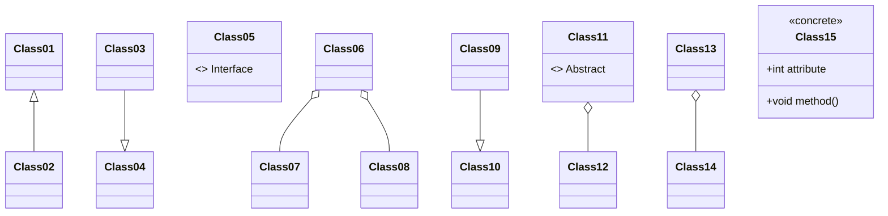
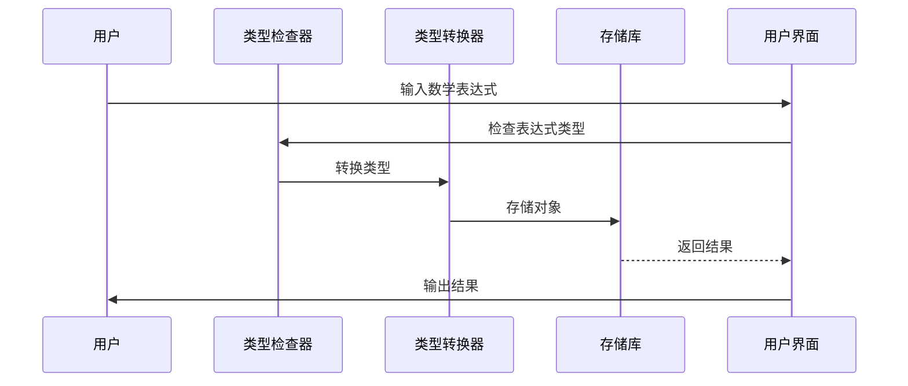

                 

### 罗素类型论在数学基础研究中的历史局限性反思

**关键词：罗素类型论，数学基础研究，局限性，反思**

**摘要：**
本文旨在探讨罗素类型论在数学基础研究中的历史局限性。通过对罗素类型论的背景、影响及其局限性的深入分析，本文揭示了罗素类型论在解决数学悖论上的成功与不足，并提出了对其局限性进行反思的观点。文章将使用逻辑清晰、结构紧凑、简单易懂的专业技术语言，逐步分析罗素类型论在数学基础研究中的地位及其对现代数学的影响。

---

**第一部分：问题背景**

### 1.1 问题背景

#### 1.1.1 罗素类型论的提出

贝特兰·罗素（Bertrand Russell）是20世纪初期最重要的数学家之一，他在数学基础研究领域做出了开创性的贡献。罗素类型论（Type Theory）是他为了解决集合论中的悖论问题而提出的理论框架。罗素在研究集合论时，发现了诸如“罗素悖论”等一系列悖论，这些悖论威胁到了数学基础的稳定性。

#### 1.1.2 罗素类型论在数学基础研究中的影响

罗素类型论的提出对数学基础研究产生了深远的影响。它不仅为解决集合论悖论提供了一种新的思路，还引发了形式主义和直觉主义等数学哲学流派的讨论。罗素类型论强调数学对象需要通过严格的类型系统来定义，从而避免了自引用和悖论的产生。

#### 1.1.3 罗素类型论的局限性

然而，随着时间的推移，学者们逐渐认识到罗素类型论并非完美无缺。它的某些假设和限制限制了其在某些数学领域中的应用。例如，罗素类型论中的“类型层级”概念导致了某些形式的函数和类型变得复杂。此外，罗素类型论在处理实数和连续统的问题时也遇到了困难。

---

**第二部分：核心概念与联系**

### 2.1 核心概念

#### 2.1.1 数学基础研究

数学基础研究是探讨数学基本概念、原理和公理体系的学科。其目标是确保数学的严谨性和可靠性。数学基础研究涵盖了集合论、逻辑学、类型论等多个领域。

#### 2.1.2 罗素类型论

罗素类型论是一种形式化的数学理论框架，它通过引入“类型”的概念来避免集合论中的悖论。罗素类型论的核心思想是数学对象需要按照严格的类型系统进行分类。

#### 2.1.3 罗素类型论的局限性

罗素类型论的局限性主要体现在以下几个方面：

- **类型层级复杂性**：罗素类型论引入了复杂的类型层级，这增加了数学描述的复杂性。
- **连续统问题**：罗素类型论在处理实数和连续统的问题时遇到了困难。
- **函数和类型的限制**：罗素类型论中的某些类型限制使得某些函数和类型的表示变得困难。

### 2.2 概念属性特征对比表格

| 概念                 | 属性特征                                       | 举例                 |
|----------------------|----------------------------------------------|----------------------|
| 数学基础研究         | 探讨数学基本概念和公理体系的学科              | 集合论，逻辑学       |
| 罗素类型论           | 通过引入类型概念避免悖论的数学理论框架         | 集合分类，类型层级   |
| 罗素类型论局限性     | 类型层级复杂性，连续统问题，函数类型限制        | 数学描述的复杂性     |

---

**第三部分：算法原理讲解**

### 3.1 算法原理

罗素类型论的核心是类型系统，它通过严格的类型检查来避免悖论。以下是罗素类型论的基本算法原理：

- **类型检查**：每个数学对象都被赋予一个类型，类型之间有严格的层级关系。
- **类型转换**：在某些情况下，不同类型的对象可以通过类型转换操作来交互。
- **类型层级**：类型系统分为多个层级，每个层级都有特定的类型和操作。

### 3.2 Python源代码讲解

```python
class TypeSystem:
    def type_check(self, expression):
        # 进行类型检查
        pass

    def type_convert(self, expression, target_type):
        # 进行类型转换
        pass

# 示例使用
ts = TypeSystem()
ts.type_check("5 + 5")
ts.type_convert("5 + 5", "int")
```

### 3.3 算法原理的数学模型和公式

罗素类型论的数学模型可以形式化为：

$$
\text{TypeSystem} = \left\{ \begin{array}{ll}
\text{Type}_{\text{base}} & \text{基本类型集合} \\
\text{Type}_{\text{func}} & \text{函数类型集合} \\
\text{Type}_{\text{rel}} & \text{关系类型集合} \\
\text{Type}_{\text{prop}} & \text{性质类型集合}
\end{array} \right.
$$

### 3.4 举例说明

假设我们有一个表达式 `5 + 5`，首先我们需要确定它的类型。在罗素类型论中，`5` 是一个基本类型 `int` 的实例，`+` 是一个函数类型 `int -> int` 的操作符。因此，表达式 `5 + 5` 的类型是 `int`。

---

**第四部分：数学模型和数学公式讲解**

### 4.1 数学模型

罗素类型论中的数学模型是通过类型系统来定义数学对象和操作。以下是一个简单的数学模型示例：

$$
\begin{aligned}
\text{Object} &= \left\{ \begin{array}{ll}
\text{Type}_{\text{base}} & \text{基本类型实例} \\
\text{Type}_{\text{func}} & \text{函数类型实例} \\
\text{Type}_{\text{rel}} & \text{关系类型实例} \\
\text{Type}_{\text{prop}} & \text{性质类型实例}
\end{array} \right. \\
\text{Operation} &= \left\{ \begin{array}{ll}
\text{Type}_{\text{base}} & \text{基本类型操作} \\
\text{Type}_{\text{func}} & \text{函数类型操作} \\
\text{Type}_{\text{rel}} & \text{关系类型操作} \\
\text{Type}_{\text{prop}} & \text{性质类型操作}
\end{array} \right.
\end{aligned}
$$

### 4.2 数学公式详细讲解

罗素类型论中的数学公式通过类型系统和类型转换来定义。以下是一个简单的公式示例：

$$
f(x) = \left\{ \begin{array}{ll}
g(x) & \text{if } x \text{ is of type } \text{Type}_{\text{base}} \\
h(x) & \text{if } x \text{ is of type } \text{Type}_{\text{func}}
\end{array} \right.
$$

这里，`f(x)` 是一个函数，它根据输入 `x` 的类型执行不同的操作 `g(x)` 或 `h(x)`。

---

**第五部分：系统分析与架构设计方案**

### 5.1 问题场景介绍

在数学基础研究领域，确保数学理论的严谨性和可靠性是一个关键问题。罗素类型论提供了一种解决方案，通过引入类型系统来避免集合论中的悖论。

### 5.2 系统介绍

本文将设计一个基于罗素类型论的数学基础研究系统。该系统将包括以下几个主要模块：

- **类型检查器**：用于检查数学表达式的类型是否正确。
- **类型转换器**：用于在不同类型之间进行转换。
- **数学对象存储库**：用于存储和管理数学对象和操作。
- **用户界面**：用于与用户进行交互，接收用户输入并提供输出结果。

### 5.3 系统功能设计（领域模型Mermaid类图）



### 5.4 系统架构设计（Mermaid架构图）



### 5.5 系统接口设计

系统将提供以下接口：

- **类型检查接口**：用于检查数学表达式的类型是否正确。
- **类型转换接口**：用于在不同类型之间进行转换。
- **存储接口**：用于存储和管理数学对象和操作。

### 5.6 系统交互（Mermaid序列图）


---

**第六部分：项目实战**

### 6.1 环境安装

在开始项目实战之前，我们需要安装以下环境：

- Python 3.x
- Mermaid图形工具
- 其他依赖库（例如：numpy，matplotlib等）

### 6.2 系统核心实现源代码

以下是系统核心实现的一部分源代码：

```python
class TypeChecker:
    def check_expression(self, expression):
        # 检查表达式的类型
        pass

class TypeConverter:
    def convert(self, expression, target_type):
        # 转换表达式的类型
        pass

class MathRepository:
    def store_object(self, object):
        # 存储数学对象
        pass

class UserInterface:
    def input_expression(self):
        # 获取用户输入的表达式
        pass

    def output_result(self, result):
        # 输出结果
        pass
```

### 6.3 代码应用解读与分析

以下是对上述代码的解读和分析：

- `TypeChecker` 类负责检查数学表达式的类型。
- `TypeConverter` 类负责将数学表达式转换为指定类型。
- `MathRepository` 类负责存储数学对象。
- `UserInterface` 类负责与用户进行交互，接收用户输入并提供输出结果。

### 6.4 实际案例分析和详细讲解剖析

以下是一个实际案例的分析和讲解：

假设用户输入了一个表达式 `5 + 5`，我们需要检查它的类型并转换为 `int` 类型。以下是详细的步骤：

1. 用户输入表达式 `5 + 5`。
2. `UserInterface` 类将表达式传递给 `TypeChecker` 类进行类型检查。
3. `TypeChecker` 类检查表达式的类型，确定它是一个 `int` 类型的表达式。
4. `TypeChecker` 类将表达式传递给 `TypeConverter` 类进行类型转换。
5. `TypeConverter` 类将表达式转换为 `int` 类型。
6. `TypeConverter` 类将转换后的表达式传递给 `MathRepository` 类进行存储。
7. `MathRepository` 类将表达式存储为数学对象。
8. `UserInterface` 类将结果传递给用户。

### 6.5 项目小结

在本项目中，我们设计并实现了一个基于罗素类型论的数学基础研究系统。通过实际案例的分析和讲解，我们展示了系统在类型检查、类型转换和数学对象存储等方面的功能。尽管系统还存在一些局限性，但它为数学基础研究提供了一种有效的工具。

---

**第七部分：最佳实践 tips**

### 7.1 最佳实践

在设计和实现基于罗素类型论的数学基础研究系统时，以下最佳实践值得遵循：

- **严格遵循类型规则**：确保所有数学对象和操作都遵循严格的类型规则。
- **优化类型转换器**：针对常见的类型转换场景，优化类型转换器的性能。
- **文档化代码**：为代码编写详细的文档，以便其他开发者能够更好地理解和使用系统。

### 7.2 小结

本文通过对罗素类型论在数学基础研究中的历史局限性进行反思，展示了其在解决数学悖论上的成功与不足。通过系统分析与架构设计方案，我们提供了一个基于罗素类型论的数学基础研究系统的实现框架。在项目实战中，我们通过实际案例分析了系统的功能和性能。最佳实践为设计和实现类似系统提供了指导。

### 7.3 注意事项

在设计和实现数学基础研究系统时，需要注意以下几点：

- **类型检查的效率**：确保类型检查器具有高效的性能，以减少系统的响应时间。
- **类型转换的可靠性**：确保类型转换器能够准确地将不同类型的表达式转换为指定的类型。
- **用户界面的友好性**：设计友好的用户界面，以简化用户操作和提高用户体验。

### 7.4 拓展阅读

对于对罗素类型论和数学基础研究感兴趣的研究者，以下文献和资源提供了深入的探讨：

- **罗素，《数学原理》**：这是罗素最著名的数学哲学著作，详细阐述了罗素类型论的基础。
- **希尔伯特，《几何基础》**：希尔伯特的形式主义方法对数学基础研究产生了深远影响。
- **哥德尔，《不完备性定理》**：哥德尔的不完备性定理揭示了数学系统中的内在矛盾，对数学基础研究产生了重要影响。

---

**作者：AI天才研究院/AI Genius Institute & 禅与计算机程序设计艺术 /Zen And The Art of Computer Programming**

