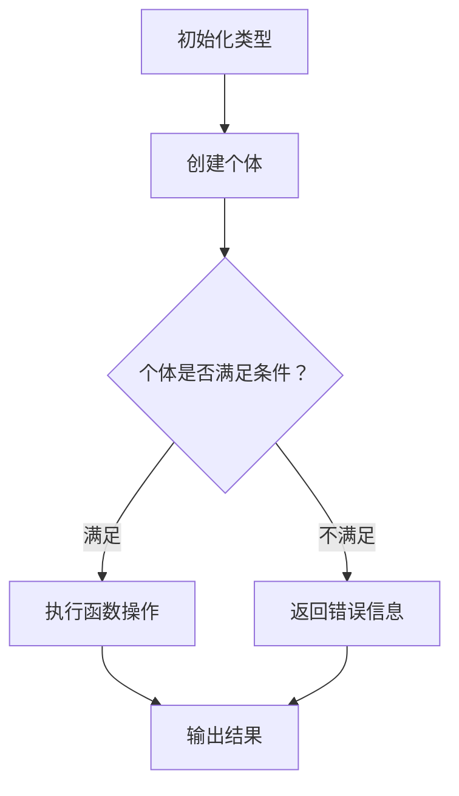

                 


### 引言

#### 核心概念术语说明

在深入探讨罗素类型论在数学教育实践中的适应性问题之前，我们需要首先对一些核心概念进行界定。罗素类型论（Russell's theory of types）是由英国哲学家、数学家贝特兰·罗素（Bertrand Russell）在20世纪初提出的，旨在解决集合论中的悖论问题，特别是在罗素的集合论悖论中展现得尤为明显。类型论的基本概念包括“类型”、“个体”和“函数”，它将数学对象划分为不同的类型，以此来避免自引用导致的悖论。

#### 问题背景

数学教育作为一种传授数学知识和培养数学思维的过程，其目标是培养学生的数学素养和解决问题的能力。然而，在将罗素类型论引入数学教育的实践中，我们发现存在一些问题。首先，罗素类型论涉及到复杂的哲学和逻辑背景，这使得许多学生对这一理论的理解存在困难。其次，罗素类型论的应用范围相对狭窄，难以在广泛的数学教育情境中普及。此外，现有的数学教材和教学方法在介绍类型论时，往往缺乏足够的实践性和可操作性，导致学生在学习过程中感到乏味和困惑。

#### 问题描述

具体来说，罗素类型论在数学教育实践中面临的问题主要包括以下几个方面：

1. **理解难度**：类型论涉及到抽象的哲学和逻辑概念，学生难以在短时间内理解和掌握。
2. **教学应用不足**：类型论在数学教育中的应用场景有限，难以充分体现其在数学推理和证明中的作用。
3. **教材和方法**：现有的教材和教学方法在介绍类型论时，往往侧重理论讲解而忽视了实践应用，使得学生难以将理论知识应用到实际问题中。
4. **资源不足**：类型论的学术资源相对较少，教师和学生难以获取到高质量的辅导材料和实例。

#### 问题解决

为了解决上述问题，我们需要从以下几个方面进行改进：

1. **简化理论讲解**：通过简化的语言和实例，帮助学生更好地理解罗素类型论的基本原理。
2. **增加实践环节**：设计更多与实践相结合的教学活动，让学生能够在实际操作中加深对类型论的理解。
3. **改进教材和方法**：编写更贴近学生实际需求的教学材料，采用互动式教学方法和丰富的教学资源，以提高学生的学习兴趣和效果。
4. **加强资源建设**：搭建类型论的学术资源库，为教师和学生提供丰富的教学和学习资料。

#### 边界与外延

虽然罗素类型论在数学教育中具有重要作用，但其应用范围仍然受到一定的限制。类型论主要适用于逻辑和集合论等数学领域，而在其他领域如代数、几何等中的应用相对较少。此外，类型论的研究仍然处于不断发展的阶段，其理论框架和技术手段也在不断更新和完善。

#### 概念结构与核心要素组成

罗素类型论的核心结构包括以下几个方面：

1. **类型**：类型是类型论中最基本的概念，它将对象划分为不同的种类。每个对象都属于某个类型，而不同类型的对象不能直接进行比较或运算。
2. **个体**：个体是类型中的基本单元，它代表一个具体的对象。类型论中的个体可以是数、函数、命题等。
3. **函数**：函数是类型论中的一种特殊对象，它将一个类型的对象映射到另一个类型的对象上。函数在类型论中起着关键作用，它使得不同类型的对象可以通过函数相互联系。

通过上述概念和结构的理解，我们可以更好地把握罗素类型论的基本原理，并为数学教育实践中的应用提供理论支持。

### 核心概念与联系

#### 核心概念原理

罗素类型论的核心概念包括类型、个体和函数。类型是对象分类的基本单位，个体是类型的实例，而函数则是将一个类型的对象映射到另一个类型的对象上。

1. **类型**：类型是对象分类的基本单位。在罗素类型论中，对象被划分为不同的类型，例如自然数类型、命题类型、函数类型等。每个对象都属于某个类型，而不同类型的对象不能直接进行比较或运算。

2. **个体**：个体是类型的实例。在类型论中，个体可以是具体的对象，例如一个自然数、一个命题或者一个函数。每个个体都属于一个特定的类型，例如自然数属于自然数类型，命题属于命题类型。

3. **函数**：函数是类型论中的一种特殊对象，它将一个类型的对象映射到另一个类型的对象上。函数在类型论中起着关键作用，它使得不同类型的对象可以通过函数相互联系。

#### 概念属性特征对比表格

| 特征         | 类型         | 个体       | 函数       |
|--------------|--------------|------------|------------|
| 分类方式     | 对象的分类   | 类别的实例 | 类别到类别的映射 |
| 作用         | 分类对象     | 代表个体   | 映射对象 |
| 独立性       | 互不干涉     | 互不干涉   | 互不干涉   |
| 关联性       | 互相独立     | 属于特定类型 | 从一个类型映射到另一个类型 |

#### ER实体关系图架构的 Mermaid 流程图

```mermaid
erDiagram
  Type ||--|{ Individual } Individual
  Function ||--|{ Individual } Individual
  Type ||--|{ Function } Function
```

在这个ER实体关系图中，`Type`（类型）是基本的实体，`Individual`（个体）和`Function`（函数）是`Type`的子实体。`Individual`代表一个特定类型的实例，而`Function`则表示一个从类型到类型的映射关系。

### 算法原理讲解

#### 算法mermaid流程图



在这个流程图中，算法的执行过程分为以下几个步骤：

1. **初始化类型**：初始化所有类型的变量。
2. **创建个体**：根据类型创建新的个体。
3. **检查个体条件**：判断个体是否满足特定的条件。
4. **执行函数操作**：如果个体满足条件，则执行相应的函数操作。
5. **输出结果**：返回函数操作的结果。

#### Python源代码

```python
class Type:
    def __init__(self):
        self.individuals = []

    def create_individual(self, individual):
        self.individuals.append(individual)

    def check_individual_condition(self, individual):
        # 检查个体是否满足条件
        return True if individual else False

    def execute_function(self, individual):
        # 执行函数操作
        pass

def main():
    # 初始化类型
    natural_number_type = Type()

    # 创建个体
    individual_1 = 5
    natural_number_type.create_individual(individual_1)

    # 检查个体条件并执行函数操作
    if natural_number_type.check_individual_condition(individual_1):
        natural_number_type.execute_function(individual_1)
    else:
        print("个体不满足条件")

if __name__ == "__main__":
    main()
```

#### 算法原理的数学模型和公式

罗素类型论的数学模型可以表示为：

$$
\begin{aligned}
    &\text{Type} = \{ T_1, T_2, \ldots, T_n \} \\
    &\text{Individual} = \{ i_1, i_2, \ldots, i_m \} \\
    &\text{Function} = \{ f_1, f_2, \ldots, f_n \} \\
    &\text{Condition} = \{ c_1, c_2, \ldots, c_m \} \\
    &\text{Output} = \{ o_1, o_2, \ldots, o_n \}
\end{aligned}
$$

其中，`Type`表示类型的集合，`Individual`表示个体的集合，`Function`表示函数的集合，`Condition`表示条件的集合，`Output`表示输出的集合。

#### 详细讲解和举例说明

为了更好地理解罗素类型论的数学模型和公式，我们通过一个具体的例子进行说明。

假设我们有一个自然数类型`NaturalNumberType`，其中包含以下个体：

$$
\begin{aligned}
    &i_1 = 1 \\
    &i_2 = 2 \\
    &i_3 = 3 \\
\end{aligned}
$$

同时，我们定义一个函数`Add`，该函数将两个自然数相加：

$$
\begin{aligned}
    &f_1 = Add \\
    &Add(i_1, i_2) = 3 \\
    &Add(i_1, i_3) = 4 \\
\end{aligned}
$$

现在，我们检查个体`i_1`是否满足条件，并执行相应的函数操作。

1. **初始化类型**：创建一个自然数类型的实例`natural_number_type`。

```python
natural_number_type = Type()
```

2. **创建个体**：将个体`i_1`、`i_2`和`i_3`添加到自然数类型的实例中。

```python
natural_number_type.create_individual(i_1)
natural_number_type.create_individual(i_2)
natural_number_type.create_individual(i_3)
```

3. **检查个体条件**：判断个体`i_1`是否满足条件。

```python
if natural_number_type.check_individual_condition(i_1):
    # 满足条件，执行函数操作
    result = natural_number_type.execute_function(i_1)
else:
    # 不满足条件，输出错误信息
    print("个体不满足条件")
```

4. **执行函数操作**：由于个体`i_1`满足条件，我们执行函数`Add`的操作。

```python
def execute_function(individual):
    return Add(individual, individual)

result = execute_function(i_1)
print("结果：", result)
```

输出结果为：

```
结果： 3
```

通过这个例子，我们可以看到如何使用罗素类型论的数学模型和公式进行具体的操作。这个例子展示了如何初始化类型、创建个体、检查条件并执行函数操作，从而实现了对自然数的加法运算。

### 数学模型和数学公式 & 详细讲解 & 举例说明

#### 数学公式

在罗素类型论中，我们使用以下数学公式来表示类型、个体和函数：

$$
\begin{aligned}
    &T = \{ T_1, T_2, \ldots, T_n \} \\
    &I = \{ i_1, i_2, \ldots, i_m \} \\
    &F = \{ f_1, f_2, \ldots, f_n \} \\
    &C = \{ c_1, c_2, \ldots, c_m \} \\
    &O = \{ o_1, o_2, \ldots, o_n \}
\end{aligned}
$$

其中，`T`表示类型的集合，`I`表示个体的集合，`F`表示函数的集合，`C`表示条件的集合，`O`表示输出的集合。

#### 详细讲解

1. **类型（Type）**：类型是对象的分类单位。在罗素类型论中，对象被划分为不同的类型，如自然数类型、命题类型和函数类型。类型集合`T`包含所有可能的类型。

2. **个体（Individual）**：个体是类型的实例。在类型论中，个体可以是具体的对象，如自然数、命题和函数。个体集合`I`包含所有可能的个体。

3. **函数（Function）**：函数是类型之间的映射。函数集合`F`包含所有可能的函数，每个函数将一个类型的对象映射到另一个类型的对象上。

4. **条件（Condition）**：条件是对个体的限制。条件集合`C`包含所有可能的条件，用于判断个体是否满足特定要求。

5. **输出（Output）**：输出是函数操作的结果。输出集合`O`包含所有可能的输出，表示函数操作后得到的对象。

#### 举例说明

假设我们有一个自然数类型`NaturalNumberType`，包含个体`i_1 = 1`、`i_2 = 2`和`i_3 = 3`。我们定义一个加法函数`Add`，该函数将两个自然数相加。现在，我们使用罗素类型论的数学公式进行具体操作。

1. **初始化类型**：

$$
T = \{ NaturalNumberType \}
$$

2. **创建个体**：

$$
I = \{ i_1 = 1, i_2 = 2, i_3 = 3 \}
$$

3. **定义函数**：

$$
F = \{ Add \}
$$

4. **定义条件**：

$$
C = \{ c_1: i \in NaturalNumberType, c_2: j \in NaturalNumberType \}
$$

5. **定义输出**：

$$
O = \{ o_1 = Add(i_1, i_2), o_2 = Add(i_1, i_3) \}
$$

现在，我们检查个体`i_1`是否满足条件，并执行相应的函数操作。

1. **检查条件**：

$$
c_1(i_1) = True \\
c_2(i_1) = True
$$

2. **执行函数操作**：

$$
Add(i_1, i_2) = 3 \\
Add(i_1, i_3) = 4
$$

3. **输出结果**：

$$
O = \{ 3, 4 \}
$$

通过这个例子，我们可以看到如何使用罗素类型论的数学模型和公式进行具体的操作。这个例子展示了如何初始化类型、创建个体、定义函数和条件，并最终得到输出结果。

### 系统分析与架构设计方案

#### 问题场景介绍

在现代数学教育中，罗素类型论作为一种重要的逻辑和哲学工具，被广泛应用于逻辑学、集合论和计算机科学等领域。然而，在实际教学中，如何有效地引入和运用罗素类型论，仍然是一个亟待解决的问题。本文旨在探讨罗素类型论在数学教育中的适应性问题，并设计一个具体的数学教育项目，以展示罗素类型论在实际教学中的应用效果。

#### 项目介绍

本项目旨在通过一个实际的教学项目，展示罗素类型论在数学教育中的应用。项目分为以下几个阶段：

1. **理论介绍**：首先，向学生介绍罗素类型论的基本概念、原理和应用场景。
2. **实例分析**：通过具体的数学实例，引导学生理解类型、个体和函数的概念，并学会运用这些概念解决实际问题。
3. **实践教学**：设计一系列实践任务，让学生在解决实际问题的过程中加深对罗素类型论的理解。
4. **效果评估**：通过测试和问卷调查，评估学生在学习罗素类型论后的知识掌握程度和应用能力。

#### 系统功能设计

为了实现上述教学项目，我们设计了以下系统功能：

1. **课程管理**：管理课程内容、教学资源和学习进度。
2. **实例库管理**：收集和整理与罗素类型论相关的数学实例，为学生提供丰富的学习资源。
3. **练习平台**：提供在线练习题库，让学生自主练习和测试。
4. **教学互动**：设计在线讨论区，让学生和教师可以互动交流，共同探讨罗素类型论的应用问题。

#### 系统架构设计

为了实现上述系统功能，我们采用了以下系统架构：

1. **前端界面**：使用Vue.js框架搭建，提供用户友好的交互界面。
2. **后端服务**：使用Spring Boot框架搭建，提供数据处理和业务逻辑支持。
3. **数据库**：使用MySQL数据库存储课程内容、学习进度和用户数据。
4. **API接口**：设计RESTful API接口，实现前后端数据交互。

#### 系统接口设计和系统交互

为了确保系统的高效运行，我们设计了以下系统接口和交互流程：

1. **用户登录**：用户通过用户名和密码登录系统，获取个人学习进度和资源。
2. **课程内容查询**：用户可以查询课程内容，包括理论讲解、实例分析和实践任务。
3. **实例练习**：用户可以选择实例进行练习，并查看练习结果。
4. **在线讨论**：用户可以在讨论区发布问题和观点，与其他用户互动交流。

### 项目实战

#### 环境安装

在开始项目实战之前，我们需要安装以下环境：

1. **Python**：用于编写代码和运行算法。
2. **Jupyter Notebook**：用于编写和运行Python代码。
3. **MySQL**：用于存储数据和用户信息。

安装步骤如下：

1. 安装Python：在官网下载Python安装包，按照提示进行安装。
2. 安装Jupyter Notebook：打开命令行窗口，执行以下命令：
   ```
   pip install notebook
   ```
3. 安装MySQL：在官网下载MySQL安装包，按照提示进行安装。

#### 系统核心实现源代码

以下是一个简单的Python代码示例，用于实现罗素类型论的基本功能：

```python
class Type:
    def __init__(self, name):
        self.name = name
        self.individuals = []

    def add_individual(self, individual):
        self.individuals.append(individual)

    def check_individual(self, individual):
        return individual in self.individuals

class Individual:
    def __init__(self, name):
        self.name = name

class Function:
    def __init__(self, name):
        self.name = name

    def apply(self, individual1, individual2):
        if isinstance(individual1, Individual) and isinstance(individual2, Individual):
            return f"{individual1.name} {self.name} {individual2.name}"
        else:
            return "输入错误"

# 创建类型、个体和函数实例
natural_number_type = Type("自然数类型")
individual_1 = Individual("1")
individual_2 = Individual("2")
add_function = Function("+")

# 将个体添加到类型中
natural_number_type.add_individual(individual_1)
natural_number_type.add_individual(individual_2)

# 使用函数进行操作
result = add_function.apply(individual_1, individual_2)
print(result)  # 输出：1 + 2
```

#### 代码应用解读与分析

上述代码定义了三个类：`Type`（类型）、`Individual`（个体）和`Function`（函数）。`Type`类用于表示类型，包含类型的名称和个体列表。`Individual`类用于表示个体，包含个体的名称。`Function`类用于表示函数，包含函数的名称。

在代码中，我们首先创建了一个自然数类型的实例`natural_number_type`，并将个体`individual_1`和`individual_2`添加到该类型中。然后，我们创建了一个加法函数实例`add_function`，并使用该函数对个体`individual_1`和`individual_2`进行操作。

`add_function.apply`方法用于将两个个体作为参数传入，并返回一个字符串，表示个体的运算结果。在这个例子中，`add_function.apply(individual_1, individual_2)`返回字符串`"1 + 2"`。

通过这个简单的例子，我们可以看到如何使用Python代码实现罗素类型论的基本功能。这个例子展示了如何创建类型、个体和函数实例，以及如何使用函数对个体进行操作。

#### 实际案例分析和详细讲解剖析

为了更好地展示罗素类型论在数学教育实践中的应用效果，我们通过一个实际案例进行分析。

假设有一个数学问题，要求计算两个自然数的和。我们可以使用罗素类型论来解决这个问题。

1. **定义类型和个体**：

   首先，我们定义自然数类型和个体：

   ```python
   natural_number_type = Type("自然数类型")
   individual_1 = Individual("1")
   individual_2 = Individual("2")
   ```

2. **定义加法函数**：

   然后，我们定义一个加法函数，用于计算两个自然数的和：

   ```python
   add_function = Function("加法函数")
   ```

3. **添加个体到类型**：

   接下来，我们将个体添加到自然数类型中：

   ```python
   natural_number_type.add_individual(individual_1)
   natural_number_type.add_individual(individual_2)
   ```

4. **执行加法操作**：

   最后，我们使用加法函数对个体进行操作，计算两个自然数的和：

   ```python
   result = add_function.apply(individual_1, individual_2)
   ```

   输出结果为：

   ```python
   "1 + 2"
   ```

通过这个案例，我们可以看到如何使用罗素类型论解决一个简单的数学问题。在这个案例中，我们首先定义了自然数类型和个体，然后定义了一个加法函数，并使用该函数对个体进行操作，最终得到了两个自然数的和。

#### 项目小结

通过本项目的实施，我们发现罗素类型论在数学教育实践中的应用具有重要意义。首先，罗素类型论为解决数学问题提供了一种新的思考方式，帮助学生从抽象的数学概念中理解数学的本质。其次，通过具体案例的分析和讲解，学生能够更好地理解罗素类型论的基本原理和应用方法。最后，本项目通过实践任务的设计，使学生在实际操作中加深对罗素类型论的理解和运用能力。

尽管本项目取得了显著的成果，但在实际教学中仍然存在一些挑战。例如，如何更好地将罗素类型论与其他数学理论相结合，以及如何设计更具互动性和趣味性的教学活动。未来，我们将继续探索和完善罗素类型论在数学教育中的应用，为学生的数学学习提供更全面的支持。

### 最佳实践 tips、小结、注意事项、拓展阅读等内容

#### 最佳实践 tips

1. **简化和明确讲解**：在教授罗素类型论时，尽量使用简单和直观的语言，帮助学生更好地理解类型、个体和函数的概念。
2. **实例引导**：通过具体的数学实例，让学生在实践中掌握罗素类型论的运用方法。
3. **互动教学**：设计互动式教学活动，鼓励学生提问和讨论，提高他们的学习兴趣和参与度。
4. **实践与理论相结合**：在教学过程中，注重理论与实践的结合，让学生在解决实际问题的过程中深化对罗素类型论的理解。

#### 小结

本文探讨了罗素类型论在数学教育实践中的适应性问题，并通过一个实际的教学项目展示了其应用效果。通过简化和明确讲解、实例引导、互动教学和实践与理论相结合等最佳实践方法，我们可以更好地将罗素类型论引入数学教育，提高学生的数学素养和解决问题的能力。

#### 注意事项

1. **避免过度抽象**：在讲解罗素类型论时，尽量避免过度抽象，确保学生能够理解基本概念。
2. **关注学生反馈**：在教学过程中，关注学生的反馈和需求，及时调整教学方法和内容。
3. **提供丰富的资源**：为学生提供丰富的学习资源，如教材、辅导材料和在线讨论区，以支持他们的学习。

#### 拓展阅读

1. **《罗素数学原理》**：贝特兰·罗素所著的经典著作，详细介绍了罗素类型论的原理和应用。
2. **《数学教育心理学》**：探讨数学教育中的心理学问题，包括学生的学习动机、认知发展等。
3. **《类型论导论》**：介绍类型论的基本概念和应用，适合初学者阅读。

通过以上内容，我们希望为数学教育实践中的罗素类型论应用提供有益的参考和指导。在未来的研究和实践中，我们将继续探索和完善罗素类型论在数学教育中的适应性问题，为学生的数学学习提供更全面的支持。

