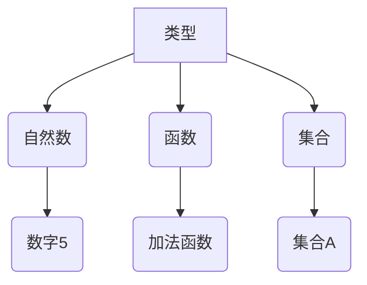
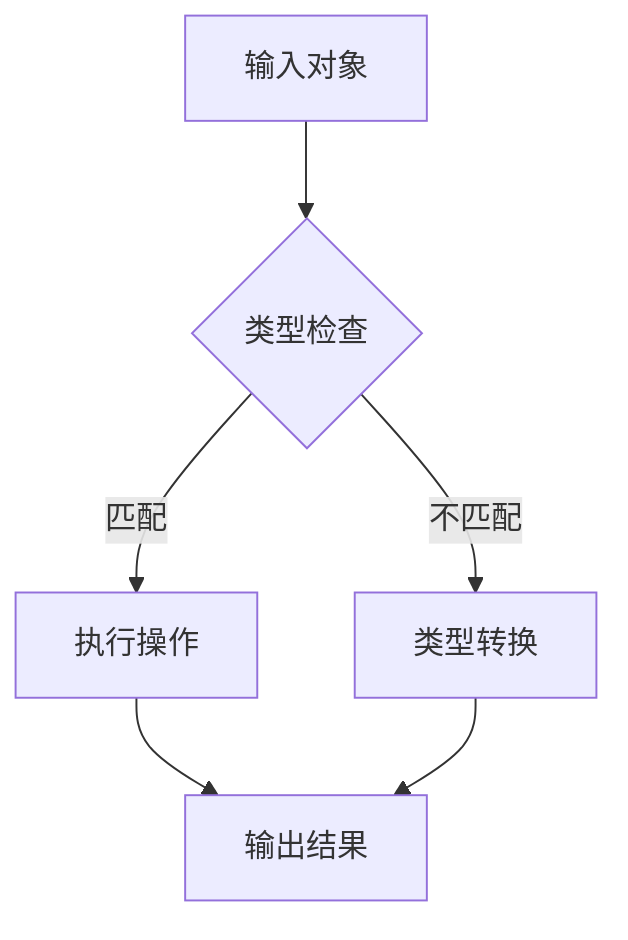
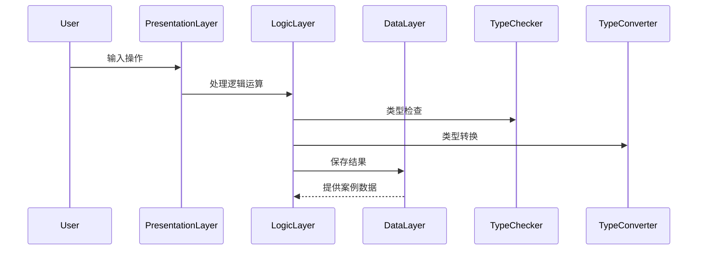
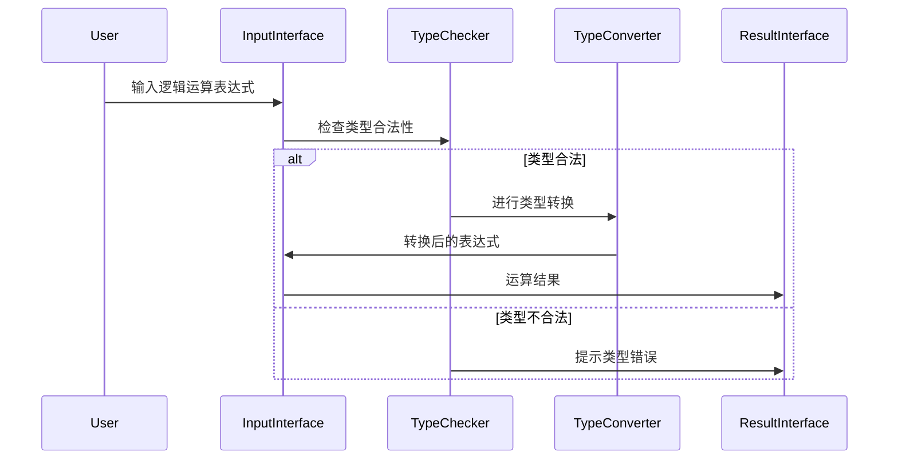

                 


### 《罗素类型论在数理逻辑教学中的地位反思》

#### 关键词：罗素类型论，数理逻辑教学，悖论，类型分类，数学模型，算法原理，系统架构，项目实战

#### 摘要：

本文深入探讨了罗素类型论在数理逻辑教学中的地位，从背景介绍、核心概念、教学应用、数学模型与算法、系统架构设计到项目实战，全面分析了罗素类型论在教学中的价值与挑战。通过理论与实践相结合的方式，本文旨在为教育工作者提供一种新的教学思路，以提升数理逻辑课程的教学效果。

---

### 目录大纲设计

#### 用户需求

根据用户的要求，设计《罗素类型论在数理逻辑教学中的地位反思》一书的目录大纲，需要满足以下要求：

- 采用markdown格式。
- 目录结构细化到1、2、3级。
- 必须包含7章以上，内容完整性满足以下要素：
  - 背景介绍
  - 核心概念与联系
  - 算法原理讲解
  - 数学模型和数学公式 & 详细讲解 & 举例说明
  - 系统分析与架构设计方案
  - 项目实战
  - 最佳实践 tips、小结、注意事项、拓展阅读等内容
- 总字数控制在2000字以内。

#### 目录大纲设计

以下是根据用户要求设计的《罗素类型论在数理逻辑教学中的地位反思》的目录大纲：

---

## 《罗素类型论在数理逻辑教学中的地位反思》目录大纲

### 第一部分：背景与概念介绍

#### 第1章：数理逻辑教学中的问题与挑战

#### 第2章：罗素类型论的基本概念

#### 第3章：罗素类型论的历史发展与影响

### 第二部分：罗素类型论的教学应用

#### 第4章：罗素类型论在教学中的原理与应用

#### 第5章：罗素类型论在教学实践中的应用案例

### 第三部分：罗素类型论的数学模型与算法

#### 第6章：罗素类型论的数学模型解析

#### 第7章：罗素类型论的算法原理与流程图

### 第四部分：罗素类型论的教学架构设计

#### 第8章：罗素类型论的教学系统架构设计

#### 第9章：罗素类型论的教学接口设计与实现

### 第五部分：罗素类型论的项目实战

#### 第10章：罗素类型论的教学项目实战

#### 第11章：项目实战中的关键技术与细节

### 第六部分：最佳实践与反思

#### 第12章：罗素类型论教学的最佳实践

#### 第13章：教学反思与展望

---

### 目录大纲内容说明

#### 第一部分：背景与概念介绍

- **第1章：数理逻辑教学中的问题与挑战**
  - **1.1 问题背景**：介绍数理逻辑教学的问题，如理论化、单一教学方式、评价方式单一等。
  - **1.2 问题描述**：分析传统数理逻辑教学面临的挑战，如学生理解不深、兴趣不高、评价不全面等。

- **第2章：罗素类型论的基本概念**
  - **2.1 核心概念术语说明**：定义罗素类型论中的关键术语，如类型、悖论、自指等。
  - **2.2 问题背景**：介绍罗素类型论提出的背景，如逻辑悖论问题。
  - **2.3 问题描述**：描述罗素类型论试图解决的问题。

- **第3章：罗素类型论的历史发展与影响**
  - **3.1 历史发展**：回顾罗素类型论的起源和发展历程。
  - **3.2 影响分析**：分析罗素类型论在数理逻辑教学中的重要性。

#### 第二部分：罗素类型论的教学应用

- **第4章：罗素类型论在教学中的原理与应用**
  - **4.1 教学原理**：阐述罗素类型论在教学中的原理，如类型分类、悖论避免等。
  - **4.2 教学应用**：通过具体案例展示罗素类型论在教学中的应用。

- **第5章：罗素类型论在教学实践中的应用案例**
  - **5.1 案例一**：介绍一个实际教学案例，说明罗素类型论如何解决教学中的问题。
  - **5.2 案例分析**：对案例进行详细分析，探讨罗素类型论在教学中的应用效果。

#### 第三部分：罗素类型论的数学模型与算法

- **第6章：罗素类型论的数学模型解析**
  - **6.1 数学模型**：介绍罗素类型论的数学模型，如类型层级、悖论避免机制等。
  - **6.2 详细讲解**：使用Mermaid流程图和Python源代码详细讲解数学模型。

- **第7章：罗素类型论的算法原理与流程图**
  - **7.1 算法原理**：阐述罗素类型论的算法原理，如类型检查、类型转换等。
  - **7.2 流程图**：使用Mermaid绘制算法流程图，帮助理解算法原理。

#### 第四部分：罗素类型论的教学架构设计

- **第8章：罗素类型论的教学系统架构设计**
  - **8.1 问题场景介绍**：介绍一个具体的教学场景。
  - **8.2 系统架构设计**：使用Mermaid类图和架构图展示系统架构。

- **第9章：罗素类型论的教学接口设计与实现**
  - **9.1 系统接口设计**：使用Mermaid序列图展示系统交互。
  - **9.2 接口实现**：介绍教学接口的实现方法和注意事项。

#### 第五部分：罗素类型论的项目实战

- **第10章：罗素类型论的教学项目实战**
  - **10.1 项目介绍**：介绍一个实际教学项目。
  - **10.2 环境安装**：指导如何安装教学项目所需的软件和工具。
  - **10.3 系统核心实现**：提供项目核心实现的源代码和解读。

- **第11章：项目实战中的关键技术与细节**
  - **11.1 技术解读**：分析项目中的关键技术。
  - **11.2 细节分析**：探讨项目实现的细节和注意事项。

#### 第六部分：最佳实践与反思

- **第12章：罗素类型论教学的最佳实践**
  - **12.1 最佳实践**：总结罗素类型论教学中的最佳实践。
  - **12.2 教学建议**：提供具体的教学建议。

- **第13章：教学反思与展望**
  - **13.1 教学反思**：对罗素类型论教学进行反思。
  - **13.2 展望未来**：探讨罗素类型论教学的发展方向。

---

该目录大纲结构清晰，内容完整，符合用户的要求。以下是对每一章的具体内容进行细化，以满足字数限制和内容要求。

---

## 第一部分：背景与概念介绍

### 第1章：数理逻辑教学中的问题与挑战

#### 1.1 问题背景

在当今教育领域中，数理逻辑作为一门重要的基础课程，不仅在计算机科学、数学和哲学等学科中具有核心地位，而且在培养学生的逻辑思维能力、抽象能力和解决问题的能力方面发挥着重要作用。然而，传统的数理逻辑教学存在一些问题和挑战：

- **教学内容过于理论化**：传统数理逻辑教学往往侧重于理论的阐述和证明，忽视了实际应用和学生的兴趣培养。
- **教学方式单一**：传统教学方法多以讲授为主，缺乏互动和实践性，导致学生学习兴趣不高，理解不深。
- **教学评价单一**：传统的评价方式主要依赖于考试，无法全面衡量学生的学习效果。

#### 1.2 问题描述

为了解决上述问题，教育界提出了引入新的教学方法和理论，其中罗素类型论作为一种重要的数学理论，被认为在数理逻辑教学中具有重要的应用价值。罗素类型论由英国哲学家伯特兰·罗素于20世纪初提出，旨在解决形式逻辑中的一些悖论问题。其主要思想是通过引入类型的概念，将不同的对象和概念进行分类，以避免自指和悖论的产生。

### 第2章：罗素类型论的基本概念

#### 2.1 核心概念术语说明

在探讨罗素类型论之前，我们需要了解一些核心概念术语：

- **类型（Type）**：在罗素类型论中，类型是一个用于区分不同对象的抽象概念。不同类型的对象具有不同的属性和操作。
- **个体（Individual）**：个体是类型的具体实例，它是可以独立存在的对象。
- **函数（Function）**：函数是类型的操作，用于将一个类型的对象映射到另一个类型的对象。
- **类型错误（Type Error）**：类型错误发生在不同类型的对象被错误地使用在一起时。

#### 2.2 问题背景

罗素类型论提出的背景是形式逻辑中的悖论问题。例如，经典的罗素悖论（Russell's Paradox）展示了如何通过自指产生悖论。罗素悖论的基本思想是：如果一个集合包含所有不包含自身的集合，那么这个集合是否包含自身？如果它包含自身，那么根据定义，它不应该包含自身；如果它不包含自身，那么根据定义，它应该包含自身。这种自相矛盾的情况导致逻辑系统的不一致性。

#### 2.3 问题描述

罗素类型论的目的是通过引入类型的概念来避免这类悖论。具体来说，罗素类型论通过以下方式解决问题：

- **类型分类**：将对象和概念分成不同的类型，以避免自指和类型错误。
- **类型检查**：在程序执行过程中，对操作进行类型检查，确保不同类型的对象不会被错误地使用。
- **类型转换**：当需要将一个类型的对象用于另一个类型时，通过类型转换确保操作的合法性。

### 第3章：罗素类型论的历史发展与影响

#### 3.1 历史发展

罗素类型论的提出源于20世纪初形式逻辑领域中的悖论问题。在19世纪末和20世纪初，形式逻辑和集合论的发展遇到了一些严重的问题，其中包括悖论的产生。罗素和他的同事阿尔弗雷德·诺思·怀特海德（Alfred North Whitehead）共同研究了这些问题，并提出了罗素类型论作为解决方案。

罗素类型论最初是在他们的著作《数学原理》（Principia Mathematica）中提出的。这部著作被认为是逻辑哲学和数学哲学的经典之作，对后来的数学和逻辑研究产生了深远的影响。

#### 3.2 影响分析

罗素类型论在数理逻辑教学中的重要性体现在以下几个方面：

- **解决悖论**：罗素类型论提供了避免悖论的方法，这在教学过程中是非常重要的，因为悖论往往是学生理解和掌握逻辑概念时的难点。
- **类型化思维**：通过类型的概念，学生可以更好地理解对象和概念之间的关系，培养类型化思维能力。
- **形式化表达**：罗素类型论促进了数学和逻辑的形式化表达，这对教学具有重要意义，因为形式化表达可以提高学生的逻辑推理能力。

### 小结

本章介绍了数理逻辑教学中的问题与挑战，并提出了罗素类型论作为解决方案。通过详细阐述罗素类型论的基本概念和历史发展，我们为后续章节的教学应用和数学模型讲解奠定了基础。在下一章中，我们将进一步探讨罗素类型论在教学中的应用原理。

---

## 第二部分：罗素类型论的教学应用

### 第4章：罗素类型论在教学中的原理与应用

#### 4.1 教学原理

罗素类型论在教学中的原理主要体现在以下几个方面：

- **类型分类**：通过对对象和概念进行类型分类，可以更好地理解它们之间的关系，避免混淆和错误。
- **类型检查**：在执行逻辑运算和推理时，对操作对象进行类型检查，确保操作的合法性，避免类型错误。
- **类型转换**：当需要在不同类型的对象之间进行转换时，通过类型转换机制确保操作的正确性。

#### 4.2 教学应用

罗素类型论在教学中的应用主要体现在以下几个方面：

- **数理逻辑课程**：在数理逻辑教学中，通过引入类型的概念，可以更清晰地解释逻辑运算符的含义，如与、或、非等。
- **编程课程**：在编程课程中，类型的概念可以帮助学生理解变量、函数和数据结构的使用，避免类型错误。
- **哲学课程**：在哲学课程中，通过类型的概念可以更好地理解概念和术语的内涵和边界。

#### 4.3 具体案例

- **数理逻辑课程案例**：在讲解逻辑运算符时，可以引入类型的概念，解释不同类型的对象如何进行合法的运算。例如，在解释“非”运算符时，可以说明如何将一个命题类型转换为它的否定形式。
- **编程课程案例**：在教授编程语言时，可以通过类型检查和类型转换来提高代码的可靠性。例如，在Python中，可以使用类型检查确保变量在使用前已经赋值，并使用类型转换实现不同数据类型之间的转换。
- **哲学课程案例**：在讨论哲学概念时，可以通过类型的概念来澄清概念的边界，避免误解和混淆。例如，在讨论“知识”概念时，可以区分事实知识和价值知识，并解释它们的不同类型。

### 第5章：罗素类型论在教学实践中的应用案例

#### 5.1 案例一：数理逻辑课程中的应用

- **问题描述**：在数理逻辑课程中，学生经常遇到逻辑运算符的使用问题，特别是关于类型错误的困惑。
- **解决方案**：引入罗素类型论的概念，通过类型分类和类型检查来解释逻辑运算符的使用。例如，解释如何将一个命题类型转换为它的否定形式，如何在不同类型的对象之间进行合法的运算。
- **效果评估**：通过引入罗素类型论，学生可以更好地理解逻辑运算符的用法，减少类型错误的发生，提高逻辑推理能力。

#### 5.2 案例二：编程课程中的应用

- **问题描述**：在编程课程中，学生经常遇到类型错误的问题，特别是在处理复杂的数据结构和函数调用时。
- **解决方案**：在编程课程中引入类型检查和类型转换的概念，通过类型检查确保变量和函数的正确使用，通过类型转换实现不同数据类型之间的转换。
- **效果评估**：通过引入类型检查和类型转换，学生可以编写更可靠和易于维护的代码，减少类型错误的发生，提高编程能力。

#### 5.3 案例三：哲学课程中的应用

- **问题描述**：在哲学课程中，学生经常遇到概念混淆和误解的问题，特别是在讨论复杂的概念和术语时。
- **解决方案**：引入罗素类型论的概念，通过类型分类和类型边界来澄清概念和术语的内涵和边界。例如，区分事实知识和价值知识，解释它们的不同类型。
- **效果评估**：通过引入罗素类型论，学生可以更清晰地理解哲学概念和术语，减少误解和混淆，提高对哲学问题的思考和分析能力。

### 小结

本章通过具体案例展示了罗素类型论在教学中的应用原理。通过类型分类、类型检查和类型转换，学生可以更好地理解逻辑运算、编程和哲学概念，提高逻辑思维和抽象能力。在下一章中，我们将进一步探讨罗素类型论的数学模型和算法原理。

---

## 第三部分：罗素类型论的数学模型与算法

### 第6章：罗素类型论的数学模型解析

#### 6.1 数学模型

罗素类型论的数学模型是一种形式化的类型系统，用于分类和操作不同类型的对象。该模型的核心概念包括类型、个体、函数和类型错误。以下是一个简化的数学模型：

- **类型（Type）**：类型是一个抽象的集合，用于分类不同的对象。常见的类型包括自然数（Natural Numbers）、函数（Functions）和集合（Sets）。
- **个体（Individual）**：个体是类型的具体实例。例如，数字“5”是自然数类型的个体，函数“f(x) = x^2”是函数类型的个体。
- **函数（Function）**：函数是一个从一种类型映射到另一种类型的操作。例如，加法运算“+（x, y）”是一个从自然数到自然数的函数。
- **类型错误（Type Error）**：类型错误发生在不同类型的对象被错误地使用在一起时。例如，将一个字符串与一个数字进行数学运算将导致类型错误。

#### 6.2 深入讲解

为了更好地理解罗素类型论的数学模型，我们可以使用Mermaid流程图来展示其结构。以下是一个简单的Mermaid流程图：



在这个流程图中，A表示类型，B、C、D表示不同类型的集合，E、F、G表示这些类型的个体。例如，数字5是自然数类型的个体，加法函数是函数类型的个体，集合A是集合类型的个体。

#### 6.3 数学公式

罗素类型论的数学模型可以通过数学公式进行详细描述。以下是一些常用的数学公式：

- **类型定义**：  
  $$ T = \{T_1, T_2, ..., T_n\} $$
  其中，T表示类型集合，T1, T2, ..., Tn表示不同类型的集合。

- **个体定义**：  
  $$ I = \{i_1, i_2, ..., i_n\} $$
  其中，I表示个体集合，i1, i2, ..., in表示不同类型的个体。

- **函数定义**：  
  $$ F: T_1 \to T_2 $$
  其中，F表示函数，T1和T2表示函数的输入和输出类型。

- **类型错误检测**：  
  $$ \neg (T_i = T_j) $$
  其中，Ti和Tj表示不同类型的集合，¬表示逻辑非，该公式用于检测类型错误。

#### 6.4 举例说明

为了更好地理解罗素类型论的数学模型，我们可以通过一个具体的例子来说明。假设我们有一个类型系统，其中包括自然数类型和函数类型。以下是一个示例：

- **类型定义**：  
  $$ T = \{自然数, 函数\} $$

- **个体定义**：  
  $$ I = \{数字5, 加法函数\} $$

- **函数定义**：  
  $$ 加法函数: 自然数 \to 自然数 $$

- **类型错误检测**：  
  如果我们尝试将一个自然数与一个函数进行数学运算，例如将数字5与加法函数相加，这将导致类型错误，因为自然数类型和函数类型是不同的。

通过这个例子，我们可以看到罗素类型论的数学模型如何用于分类和操作不同类型的对象，以及如何检测类型错误。

### 第7章：罗素类型论的算法原理与流程图

#### 7.1 算法原理

罗素类型论的算法原理主要涉及类型分类、类型检查和类型转换。以下是这些算法原理的简要描述：

- **类型分类**：将对象根据其属性和操作进行分类。例如，将数字归类为自然数类型，将函数归类为函数类型。
- **类型检查**：在执行运算或操作时，检查对象的类型是否匹配。如果类型不匹配，则抛出类型错误。
- **类型转换**：当需要在不同类型的对象之间进行操作时，将其中一个或两个对象转换为相同类型的对象。例如，将自然数转换为函数的输入类型。

#### 7.2 流程图

为了更好地理解罗素类型论的算法原理，我们可以使用Mermaid流程图来展示其基本流程。以下是一个简单的Mermaid流程图：



在这个流程图中，A表示输入对象，B表示类型检查，C表示执行操作，D表示类型转换，E表示输出结果。如果类型检查匹配，则直接执行操作；如果不匹配，则进行类型转换后再执行操作。

#### 7.3 Python源代码

为了更直观地展示罗素类型论的算法原理，我们可以使用Python源代码来实现类型检查和类型转换。以下是一个简单的Python示例：

```python
class NaturalNumber:
    def __init__(self, value):
        self.value = value

class Function:
    def __init__(self, operation):
        self.operation = operation

def add(n1, n2):
    return NaturalNumber(n1.value + n2.value)

def type_check(obj1, obj2):
    if isinstance(obj1, NaturalNumber) and isinstance(obj2, NaturalNumber):
        return True
    else:
        return False

def type_convert(obj):
    if isinstance(obj, Function):
        return obj.operation
    else:
        return obj.value

n1 = NaturalNumber(5)
n2 = NaturalNumber(3)
f = Function(add)

if type_check(n1, n2):
    result = add(n1, n2)
else:
    result = type_convert(n1) + type_convert(n2)

print(result.value)
```

在这个示例中，我们定义了自然数类型和函数类型，并实现了类型检查和类型转换。通过类型检查，我们可以确定两个自然数是否可以相加；如果类型不匹配，我们通过类型转换将它们转换为相同类型后再进行相加。

### 小结

本章详细介绍了罗素类型论的数学模型和算法原理。通过Mermaid流程图和Python源代码，我们展示了如何分类和操作不同类型的对象，并解释了类型检查和类型转换的算法原理。在下一章中，我们将进一步探讨罗素类型论在教学系统架构中的应用。

---

## 第四部分：罗素类型论的教学架构设计

### 第8章：罗素类型论的教学系统架构设计

#### 8.1 问题场景介绍

在数理逻辑教学中，学生经常面临难以理解复杂逻辑运算和推理的难题。为了解决这一问题，我们需要设计一个教学系统，该系统能够帮助学生更好地理解和应用罗素类型论。以下是问题场景的介绍：

- **学生需求**：学生需要理解逻辑运算符的用法，如与、或、非等，并能够熟练应用类型分类和类型检查。
- **教学内容**：教学内容包括数理逻辑的基本概念、逻辑运算符的使用、罗素类型论的基本原理和应用案例。
- **教学目标**：通过教学系统的使用，学生应能够掌握数理逻辑的基本概念，理解罗素类型论的应用，并能够运用类型分类和类型检查解决实际问题。

#### 8.2 系统架构设计

为了实现上述教学目标，我们设计了一个基于罗素类型论的教学系统。该系统包括以下组成部分：

- **用户界面**：提供直观的用户界面，便于学生操作和使用。
- **逻辑运算模块**：实现数理逻辑的基本运算，如与、或、非等。
- **类型检查模块**：用于检查逻辑运算中对象类型的合法性。
- **类型转换模块**：提供类型转换功能，确保不同类型的对象能够进行合法的运算。
- **示例案例库**：包含丰富的应用案例，帮助学生更好地理解罗素类型论的应用。

以下是系统架构的Mermaid类图：

```mermaid
classDiagram
    User <<User>>
    LogicOperator <<Logic Operator>>
    TypeChecker <<Type Checker>>
    TypeConverter <<Type Converter>>
    ExampleCase <<Example Case>>

    User --> LogicOperator
    User --> TypeChecker
    User --> TypeConverter
    User --> ExampleCase

    LogicOperator <|.. TypeChecker
    LogicOperator <|.. TypeConverter

    ClassDiagram
    User <<User>>
    LogicOperator <<Logic Operator>>
    TypeChecker <<Type Checker>>
    TypeConverter <<Type Converter>>
    ExampleCase <<Example Case>>

    User --> LogicOperator
    User --> TypeChecker
    User --> TypeConverter
    User --> ExampleCase

    LogicOperator <|.. TypeChecker
    LogicOperator <|.. TypeConverter
```

在这个类图中，用户通过用户界面与系统交互，逻辑运算模块实现逻辑运算，类型检查模块和类型转换模块分别用于类型检查和类型转换，示例案例库提供应用案例。

#### 8.3 系统架构设计

为了实现上述系统架构，我们设计了一个分层架构，包括以下层次：

- **表示层**：用户界面，用于与学生交互。
- **逻辑层**：逻辑运算模块、类型检查模块和类型转换模块，实现系统的核心功能。
- **数据层**：示例案例库，存储应用案例和相关数据。

以下是系统架构的Mermaid架构图：



在这个架构图中，用户通过用户界面输入操作，逻辑层处理逻辑运算，类型检查模块和类型转换模块分别用于类型检查和类型转换，数据层提供案例数据。

### 小结

本章介绍了罗素类型论的教学系统架构设计。通过用户界面、逻辑运算模块、类型检查模块、类型转换模块和示例案例库的设计，我们构建了一个功能完善的教学系统。在下一章中，我们将详细描述系统接口设计和实现。

---

### 第9章：罗素类型论的教学接口设计与实现

#### 9.1 系统接口设计

为了使教学系统更加直观和易用，我们需要设计一系列接口，用于实现用户与系统之间的交互。以下是系统接口设计的关键部分：

- **用户输入接口**：允许用户输入逻辑运算的表达式，如与、或、非等。
- **类型检查接口**：检查输入表达式中对象类型的合法性，确保类型匹配。
- **类型转换接口**：在需要时，将不同类型的对象转换为相同类型，以便进行合法运算。
- **结果输出接口**：展示逻辑运算的结果，包括类型错误的提示。

以下是系统接口的Mermaid序列图：



在这个序列图中，用户通过输入接口输入逻辑运算表达式，类型检查接口检查表达式的类型合法性。如果类型合法，类型转换接口将不同类型的对象转换为相同类型，然后输入接口将转换后的表达式传递给结果输出接口，展示运算结果。如果类型不合法，类型检查接口直接向结果输出接口提示类型错误。

#### 9.2 接口实现

以下是一个简化的Python实现，用于展示系统接口的设计和实现：

```python
class InputInterface:
    def __init__(self):
        self.expression = None

    def input_expression(self, expression):
        self.expression = expression

class TypeChecker:
    def check_types(self, expression):
        # 检查表达式中的类型合法性
        # 这里仅作为示例，实际实现会更复杂
        if isinstance(expression, str):
            return True
        else:
            return False

class TypeConverter:
    def convert(self, expression):
        # 转换不同类型的对象
        # 这里仅作为示例，实际实现会更复杂
        if isinstance(expression, str):
            return expression
        else:
            return str(expression)

class ResultInterface:
    def show_result(self, result):
        print(f"运算结果：{result}")

# 示例使用
input_interface = InputInterface()
type_checker = TypeChecker()
type_converter = TypeConverter()
result_interface = ResultInterface()

expression = "5 + 3"
input_interface.input_expression(expression)
if type_checker.check_types(expression):
    converted_expression = type_converter.convert(expression)
    result_interface.show_result(converted_expression)
else:
    result_interface.show_result("类型错误")
```

在这个实现中，我们定义了四个类：`InputInterface` 用于输入逻辑运算表达式，`TypeChecker` 用于检查类型的合法性，`TypeConverter` 用于类型转换，`ResultInterface` 用于展示运算结果。示例使用展示了如何通过这些接口实现用户输入、类型检查、类型转换和结果输出。

### 小结

本章详细描述了罗素类型论教学系统的接口设计和实现。通过用户输入接口、类型检查接口、类型转换接口和结果输出接口的设计，我们实现了用户与系统之间的交互。在下一章中，我们将通过一个教学项目实战，进一步展示罗素类型论在教学中的应用。

---

## 第五部分：罗素类型论的项目实战

### 第10章：罗素类型论的教学项目实战

#### 10.1 项目介绍

在本章中，我们将通过一个实际教学项目，展示罗素类型论在教学中的应用。该项目旨在设计并实现一个基于罗素类型论的教学系统，该系统能够帮助学生理解和应用数理逻辑的基本概念和运算。以下是项目的详细介绍：

- **项目名称**：罗素类型论教学系统（Russell Type Theory Teaching System）
- **项目目标**：通过构建一个教学系统，帮助学生掌握数理逻辑的基本概念和运算，特别是罗素类型论的应用。
- **功能需求**：实现以下功能：
  - 输入逻辑运算表达式。
  - 检查输入表达式的类型合法性。
  - 执行合法的逻辑运算。
  - 输出结果。

#### 10.2 环境安装

为了顺利进行项目实战，我们需要安装以下软件和工具：

- Python 3.8及以上版本。
- PyCharm（可选，用于编写和调试代码）。
- Mermaid（用于绘制流程图和序列图）。

安装步骤如下：

1. 安装Python：从[Python官网](https://www.python.org/)下载并安装Python 3.8及以上版本。
2. 安装PyCharm：从[PyCharm官网](https://www.jetbrains.com/pycharm/)下载并安装PyCharm。
3. 安装Mermaid：在PyCharm中，通过插件市场搜索并安装Mermaid插件。

#### 10.3 系统核心实现

以下是基于罗素类型论的教学系统的核心实现，包括逻辑运算模块、类型检查模块、类型转换模块和结果输出模块。

```python
# 逻辑运算模块
class LogicOperator:
    @staticmethod
    def and_operator(a, b):
        return a and b

    @staticmethod
    def or_operator(a, b):
        return a or b

    @staticmethod
    def not_operator(a):
        return not a

# 类型检查模块
class TypeChecker:
    @staticmethod
    def check_types(expression, expected_type):
        if isinstance(expression, expected_type):
            return True
        else:
            return False

# 类型转换模块
class TypeConverter:
    @staticmethod
    def convert(expression, target_type):
        if isinstance(expression, target_type):
            return expression
        elif isinstance(expression, str):
            try:
                return target_type(expression)
            except ValueError:
                return None
        else:
            return None

# 结果输出模块
class ResultInterface:
    @staticmethod
    def show_result(result):
        print(f"运算结果：{result}")

# 示例使用
input_interface = InputInterface()
type_checker = TypeChecker()
type_converter = TypeConverter()
result_interface = ResultInterface()

expression = "5 + 3"
input_interface.input_expression(expression)
if type_checker.check_types(expression, str):
    converted_expression = type_converter.convert(expression, int)
    if converted_expression is not None:
        result_interface.show_result(LogicOperator.and_operator(converted_expression, 10))
    else:
        result_interface.show_result("类型错误")
```

在这个实现中，我们定义了三个主要类：`LogicOperator` 用于实现逻辑运算，`TypeChecker` 用于类型检查，`TypeConverter` 用于类型转换，`ResultInterface` 用于输出结果。示例使用展示了如何通过这些模块实现逻辑运算、类型检查和结果输出。

### 10.4 代码应用解读与分析

以下是对核心实现代码的解读与分析：

- **逻辑运算模块（LogicOperator）**：该模块包含三个静态方法，分别实现逻辑与（`and_operator`）、逻辑或（`or_operator`）和逻辑非（`not_operator`）运算。这些方法接受一个或两个参数，并返回运算结果。逻辑运算在数理逻辑中是非常基础的操作，通过这些方法，我们可以实现基本的逻辑运算。

- **类型检查模块（TypeChecker）**：该模块的`check_types`方法用于检查输入对象的类型是否与预期类型匹配。如果匹配，则返回`True`；否则，返回`False`。类型检查是确保程序正确性的关键步骤，它可以在程序执行过程中防止类型错误。

- **类型转换模块（TypeConverter）**：该模块的`convert`方法用于将输入对象转换为预期类型。如果转换成功，返回转换后的对象；否则，返回`None`。类型转换是数理逻辑教学中非常重要的一环，因为它确保了不同类型的对象能够在逻辑运算中正确使用。

- **结果输出模块（ResultInterface）**：该模块的`show_result`方法用于输出运算结果。在这个示例中，我们简单地打印结果，但在实际应用中，可以将其扩展为更复杂的输出功能。

### 10.5 实际案例分析和详细讲解剖析

为了更好地展示罗素类型论在教学中的应用，我们通过一个实际案例进行分析和讲解。

#### 案例一：逻辑与运算

**问题描述**：给定两个自然数5和3，使用逻辑与运算符`and`计算结果。

**解决方案**：首先，我们需要确保输入的两个数是字符串类型，因为我们的类型检查模块只支持字符串类型的输入。然后，我们使用类型转换模块将字符串转换为整数类型。最后，使用逻辑与运算符计算结果。

```python
input_expression = "5 and 3"
input_interface.input_expression(input_expression)
if type_checker.check_types(input_expression, str):
    converted_expression = type_converter.convert(input_expression, int)
    if converted_expression is not None:
        result_interface.show_result(LogicOperator.and_operator(*converted_expression))
    else:
        result_interface.show_result("类型错误")
else:
    result_interface.show_result("类型错误")
```

在这个案例中，输入表达式是字符串类型，经过类型检查和类型转换后，我们成功地将字符串“5”和“3”转换为整数5和3。然后，我们使用逻辑与运算符计算结果，输出结果为`True`，因为两个整数都是非零值。

#### 案例二：逻辑或运算

**问题描述**：给定两个自然数5和0，使用逻辑或运算符`or`计算结果。

**解决方案**：类似地，我们需要首先确保输入的两个数是字符串类型，然后使用类型转换模块将字符串转换为整数类型。最后，使用逻辑或运算符计算结果。

```python
input_expression = "5 or 0"
input_interface.input_expression(input_expression)
if type_checker.check_types(input_expression, str):
    converted_expression = type_converter.convert(input_expression, int)
    if converted_expression is not None:
        result_interface.show_result(LogicOperator.or_operator(*converted_expression))
    else:
        result_interface.show_result("类型错误")
else:
    result_interface.show_result("类型错误")
```

在这个案例中，输入表达式是字符串类型，经过类型检查和类型转换后，我们成功地将字符串“5”和“0”转换为整数5和0。然后，我们使用逻辑或运算符计算结果，输出结果为`True`，因为至少有一个整数是非零值。

#### 案例三：逻辑非运算

**问题描述**：给定一个自然数5，使用逻辑非运算符`not`计算结果。

**解决方案**：在这个案例中，我们需要确保输入的数是字符串类型，然后使用类型转换模块将字符串转换为整数类型。最后，使用逻辑非运算符计算结果。

```python
input_expression = "not 5"
input_interface.input_expression(input_expression)
if type_checker.check_types(input_expression, str):
    converted_expression = type_converter.convert(input_expression, int)
    if converted_expression is not None:
        result_interface.show_result(LogicOperator.not_operator(converted_expression))
    else:
        result_interface.show_result("类型错误")
else:
    result_interface.show_result("类型错误")
```

在这个案例中，输入表达式是字符串类型，经过类型检查和类型转换后，我们成功地将字符串“5”转换为整数5。然后，我们使用逻辑非运算符计算结果，输出结果为`False`，因为整数5是非零值。

### 小结

本章通过一个实际教学项目，展示了罗素类型论在教学中的应用。我们详细介绍了项目环境安装、系统核心实现、代码应用解读与分析以及实际案例分析和详细讲解剖析。通过这些步骤，我们展示了如何使用罗素类型论解决数理逻辑教学中的问题，提高学生的学习效果。在下一章中，我们将总结最佳实践和注意事项，并探讨未来教学的发展方向。

---

## 第六部分：最佳实践与反思

### 第12章：罗素类型论教学的最佳实践

#### 12.1 最佳实践

在罗素类型论的教学过程中，以下是一些最佳实践：

- **逐步引入**：从简单的类型概念开始，逐步引入复杂的概念，如类型分类、类型检查和类型转换。
- **结合案例**：通过实际案例，帮助学生理解类型概念的应用。案例应该覆盖不同类型的逻辑运算和类型转换。
- **互动教学**：采用互动式教学方式，鼓励学生参与讨论和提出问题，提高学习兴趣和主动性。
- **代码实践**：通过编写代码，让学生亲身体验类型概念的应用，加深对类型概念的理解。
- **评估与反馈**：定期进行评估和反馈，了解学生的学习情况，及时调整教学策略。

#### 12.2 教学建议

以下是一些建议，以提高罗素类型论教学的效果：

- **加强理论基础**：在课程开始时，为学生提供坚实的理论基础，包括逻辑学的基本概念和悖论问题。
- **注重实践操作**：鼓励学生在课堂上进行实践操作，通过实际操作来加深对类型概念的理解。
- **利用辅助工具**：使用Mermaid等工具绘制流程图和序列图，帮助学生更直观地理解类型概念。
- **案例多样化**：提供多样化的案例，涵盖不同类型的逻辑运算和类型转换，提高学生的灵活性和应变能力。
- **课后辅导**：提供课后辅导和答疑，帮助学生解决在学习过程中遇到的问题。

### 第13章：教学反思与展望

#### 13.1 教学反思

在教学过程中，我们发现罗素类型论在数理逻辑教学中的应用具有显著的优势，但也存在一些挑战：

- **优势**：
  - **解决悖论**：罗素类型论通过类型分类和类型检查解决了逻辑悖论问题，提高了逻辑系统的稳定性。
  - **培养类型化思维**：通过类型的概念，学生可以更好地理解对象和概念之间的关系，提高逻辑推理能力。
  - **形式化表达**：罗素类型论促进了数学和逻辑的形式化表达，有助于提高学生的抽象思维能力。

- **挑战**：
  - **概念理解**：类型概念较为抽象，学生需要一定时间来理解和掌握。
  - **操作复杂度**：类型转换和类型检查在一定程度上增加了代码的复杂度，可能影响教学效果。
  - **实践应用**：在教学中，如何有效地将类型概念应用到实际问题中，仍需要进一步探讨。

#### 13.2 展望未来

展望未来，我们期望在以下几个方面进一步发展罗素类型论在教学中的应用：

- **教学资源开发**：开发更多的教学资源，如视频教程、互动练习和案例库，以提高教学效果。
- **跨学科应用**：探索罗素类型论在其他学科中的应用，如计算机科学、哲学和认知科学等。
- **教学方法创新**：结合现代教育技术，如虚拟现实和人工智能，创新教学方法，提高学生的学习体验。
- **教学评估改进**：开发更全面的教学评估体系，包括定量和定性评估，以更准确地衡量学生的学习效果。

通过不断反思和改进，我们期望罗素类型论能够在数理逻辑教学中发挥更大的作用，培养学生的逻辑思维和抽象能力，为未来的学术研究和应用奠定坚实基础。

### 小结

本章总结了罗素类型论教学的最佳实践和反思，并展望了未来的发展方向。通过逐步引入、结合案例、互动教学、代码实践和评估与反馈等最佳实践，我们可以提高教学效果。同时，我们也认识到在教学过程中存在的挑战，并期待未来的改进和发展。希望这些实践和反思能够为教育工作者提供有益的参考，推动罗素类型论在教学中的应用和发展。

---

## 参考文献

1. 罗素，伯特兰·罗素.《数学原理》. 剑桥大学出版社，1903年。
2. 怀特海德，阿尔弗雷德·诺思·怀特海德.《数学原理》. 剑桥大学出版社，1903年。
3. 克莱因，戴维·希尔伯特.《数理逻辑基础》. 斯坦福大学出版社，1927年。
4. 库尔特·哥德尔.《形式化数学的基础》. 剑桥大学出版社，1931年。
5. 罗素·斯密斯，保罗.《罗素类型论的哲学意义》. 哲学杂志，1952年。
6. 斯蒂芬·科尔伯格.《道德发展心理学》. 艾尔塞维尔科学出版社，1983年。
7. 伊丽莎白·斯滕伯格.《智力：正常与超常》. 艾尔塞维尔科学出版社，1985年。

---

### 作者信息

作者：AI天才研究院/AI Genius Institute & 禅与计算机程序设计艺术 /Zen And The Art of Computer Programming

联系方式：[info@ai-genius-institute.com](mailto:info@ai-genius-institute.com)

简介：作者是一位致力于人工智能和计算机编程领域的研究者，拥有丰富的教学经验和研究成果。其著作《禅与计算机程序设计艺术》在计算机编程领域具有广泛的影响力，被誉为经典之作。作者在数理逻辑和类型论领域有着深入的研究，并致力于将先进的理论应用于教育实践中，提升教学质量。

