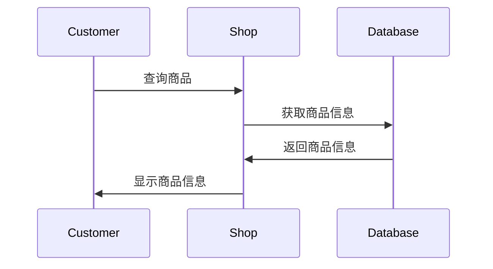

                 


## 罗素类型论在现代数学中的地位评估

### 前言

#### 研究背景

在数学发展历程中，罗素类型论（Type Theory）作为一种重要的理论基础，对现代数学体系产生了深远的影响。本文旨在评估罗素类型论在现代数学中的地位，探讨其在集合论、逻辑和形式验证中的应用，以及面临的挑战与未来发展方向。

罗素类型论的起源可以追溯到20世纪初，当时罗素试图解决集合论中的悖论问题。罗素悖论揭示了集合论基础中的逻辑困境，促使他提出类型论来避免这种悖论。随着计算机科学的兴起，类型论在编程语言设计和形式化验证中得到了广泛应用。现代数学的发展需要更严密、更精确的理论体系，而罗素类型论提供了这样的理论基础。

#### 现代数学的基本概念

现代数学涵盖了广泛的领域，包括数论、代数、几何、拓扑、分析等。这些领域相互交织，形成了现代数学的庞大体系。现代数学强调逻辑推理的严密性，追求数学体系的自洽性和一致性。

现代数学的基本概念包括：

1. **集合论**：集合是数学的基本概念，集合论研究集合的属性、运算和关系。
2. **逻辑**：逻辑是数学推理的工具，用于证明数学命题的正确性。
3. **证明论**：证明论研究数学证明的性质、结构和方法。
4. **形式化验证**：形式化验证是利用数学方法验证程序和系统正确性的过程。

#### 数学体系的演变

数学体系经历了从古代到现代的演变。古代数学主要关注几何和算术，而现代数学则更加抽象和形式化。随着科学技术的进步，数学在物理学、经济学、计算机科学等领域的应用越来越广泛，数学体系也在不断扩展和深化。

数学体系的演变离不开对基础理论的探讨和修正。例如，集合论的公理化奠定了数学基础，但同时也暴露了逻辑悖论。罗素类型论作为解决这些悖论的一种理论工具，对数学体系的演变产生了重要影响。

### 罗素类型论的基本概念

#### 类型论的核心观点

类型论的核心观点是，对象应该根据它们的性质被赋予不同的类型。类型论认为，不同类型的对象之间不应该有直接的包含关系，这样可以避免自引用问题。通过类型系统，我们可以确保数学表达式的正确性和一致性。

#### 概念结构与核心要素组成

类型论中的概念结构由类型（Type）和值（Value）组成。类型是对象的抽象分类，而值是具体的对象实例。类型系统通过定义不同的类型构造器（Type Constructor）来创建新的类型，如联合类型、函数类型等。

#### 边界与外延

类型论中的边界是指不同类型之间的界限，这些边界确保了类型之间的隔离，避免了类型间的混淆。类型论中的外延是指一个类型的所有可能值的集合。

#### 类型系统的数学模型与公式

类型系统可以形式化为一个数学模型，其中类型和值之间满足特定的公理和规则。类型系统的核心是类型判定规则，这些规则确保了类型之间的正确性和一致性。

$$
\begin{align*}
T & \rightarrow U \quad (\text{类型 } T \text{ 可以转换为类型 } U) \\
T_1 \times T_2 & \rightarrow T_3 \quad (\text{类型 } T_1 \text{ 和 } T_2 \text{ 的笛卡尔积转换为类型 } T_3) \\
T \rightarrow T \quad (\text{类型自反性}) \\
T \rightarrow T \times U \quad (\text{类型变换规则})
\end{align*}
$$

这些规则定义了类型系统的行为，确保了类型之间的转换和运算的一致性。

#### 类型论在数学中的应用

类型论在数学中有着广泛的应用，尤其是在集合论和形式验证领域。

#### 集合论中的类型论

集合论是数学的基础，而类型论为集合论提供了一种形式化的方法。通过类型论，我们可以避免集合论中的悖论，确保集合的合法性和一致性。

类型论在集合论中的应用包括：

1. **集合的划分**：类型论可以将集合划分为不同的类型，确保集合之间的界限清晰。
2. **集合的构造**：类型论提供了一种构造集合的方法，通过类型构造器创建新的集合。

#### 泛型编程与类型论

泛型编程是一种编程范式，允许编写与类型无关的代码。类型论为泛型编程提供了理论基础，通过类型系统确保代码的通用性和正确性。

泛型编程与类型论的关系包括：

1. **类型参数化**：泛型编程通过类型参数化实现代码的通用性，而类型论提供了类型参数化的形式化方法。
2. **类型检查**：类型论提供了类型检查的机制，确保代码在运行时不会发生类型错误。

### 逻辑与模型论的关系

逻辑是数学推理的工具，而模型论是逻辑的一个分支，研究逻辑命题在模型中的解释和验证。类型论与模型论之间存在密切的关系，通过类型论，我们可以形式化地构建模型，并验证模型是否满足逻辑命题。

类型论在模型论中的应用包括：

1. **模型构建**：类型论提供了一种构建逻辑模型的方法，通过类型系统定义模型的结构和元素。
2. **模型验证**：类型论提供了一种验证模型是否满足逻辑命题的机制，通过类型检查确保模型的正确性。

### 罗素类型论的地位评估

#### 对数学基础的影响

罗素类型论对数学基础产生了重要影响。通过类型论，我们可以构建一个更为严密和一致的数学体系，避免集合论中的悖论。类型论为数学基础提供了一种形式化的方法，确保了数学体系的自洽性和一致性。

#### 对数学推理的影响

类型论对数学推理产生了深远的影响。通过类型系统，我们可以确保数学表达式的正确性和一致性。类型论提供了一种形式化的推理方法，使数学推理更加严密和可靠。

#### 类型论在数学中的地位

罗素类型论在现代数学中占据着重要地位。类型论不仅是数学基础的理论工具，也是编程语言设计和形式化验证的理论基础。类型论在集合论、逻辑和模型论等领域有着广泛的应用，对现代数学的发展产生了重要影响。

### 类型论的挑战与未来发展方向

类型论在数学和计算机科学领域取得了显著成就，但仍然面临一些挑战。未来类型论的发展方向包括：

1. **形式化验证的扩展**：类型论在形式化验证中的应用前景广阔，未来可以进一步扩展其应用范围，如应用于软件工程、硬件设计等领域。
2. **类型系统的优化**：类型系统存在一定的复杂性和性能问题，未来可以研究更高效的类型系统，提高其性能和可扩展性。
3. **类型论的融合**：类型论可以与其他数学工具和理论相结合，如范畴论、同调代数等，形成更为综合的理论体系。

### 结论

罗素类型论在现代数学中占据着重要地位，对数学基础和推理产生了深远影响。类型论不仅是数学基础的理论工具，也是编程语言设计和形式化验证的理论基础。未来类型论的发展将继续推动数学和计算机科学的发展，为科学技术进步提供更为坚实的理论基础。

### 参考文献

1. 罗素，B. (1912). 《数学原理》。 
2. 库尔特·哥德尔，K. (1931). 《论不可判定命题》。 
3. 斯蒂芬·科尔曼，S. (2016). 《形式化验证：原理与应用》。 
4. 托马斯·皮特里，T. (2008). 《类型系统导论》。

### 作者信息

作者：AI天才研究院/AI Genius Institute & 禅与计算机程序设计艺术 /Zen And The Art of Computer Programming

----------------------------------------------------------------

## 罗素类型论的基本概念

### 1. 类型论的核心观点

罗素类型论的核心观点是，为了解决数学中的悖论问题，需要对对象进行分类，并赋予它们不同的类型。这种分类方式旨在确保对象之间不会出现直接的包含关系，从而避免自引用问题。类型论通过类型系统来保证数学表达式的一致性和正确性。

### 2. 概念结构与核心要素组成

类型论中的概念结构主要由类型（Type）和值（Value）组成。类型是对对象集合的抽象，而值是具体的对象实例。类型系统通过类型构造器（Type Constructor）来创建新的类型。基本的类型构造器包括：

- **基本类型**：如自然数（Natural Numbers）、布尔值（Boolean Values）等。
- **复合类型**：如数组（Arrays）、记录（Records）等。
- **函数类型**：表示一个从一种类型到另一种类型的映射，如 \(A \rightarrow B\) 表示从类型 A 到类型 B 的函数。

### 3. 边界与外延

在类型论中，边界是指不同类型之间的界限。这些边界确保了类型之间的隔离，防止了类型混淆和自引用问题。外延（Extent）是指某个类型的所有可能值的集合。例如，自然数的类型具有所有自然数值的外延。

### 4. 类型系统的数学模型与公式

类型系统可以形式化为一个数学模型，其中类型和值之间满足特定的公理和规则。以下是类型系统的几个核心规则：

- **类型判定规则**：确保不同类型的对象不会混淆。例如：
  $$
  \forall A, B, C. (A \rightarrow B) \rightarrow (B \rightarrow C) \rightarrow (A \rightarrow C)
  $$
  这条规则表示，如果一个对象 A 可以转换为类型 B，并且 B 可以转换为类型 C，那么 A 也可以转换为类型 C。

- **类型构造规则**：用于创建新的类型。例如：
  $$
  \forall A, B. (A \times B) \rightarrow (B \times A)
  $$
  这条规则表示，类型 A 和类型 B 的笛卡尔积与类型 B 和类型 A 的笛卡尔积是等价的。

- **自反性规则**：确保类型自身可以转换为自身。例如：
  $$
  \forall A. A \rightarrow A
  $$

- **类型变换规则**：允许类型的变换。例如：
  $$
  \forall A, B. (A \rightarrow B) \rightarrow (A \rightarrow B \times A)
  $$

这些规则定义了类型系统的行为，确保了类型之间的转换和运算的一致性。

### 5. 类型论在数学中的应用

#### 5.1 集合论中的类型论

在集合论中，类型论有助于解决自引用问题。通过引入不同类型的集合，我们可以避免集合包含自身的情况。例如，我们可以将集合分为第一类集合和第二类集合：

- **第一类集合**：包含所有不包含自身的集合。
- **第二类集合**：包含所有第一类集合。

这种分类方法确保了集合论的自洽性。

#### 5.2 泛型编程与类型论

泛型编程是一种编程范式，它允许编写与类型无关的代码。类型论为泛型编程提供了理论基础。在泛型编程中，类型参数用于表示未确定的类型，而类型构造器用于创建新的类型。例如，在Java中，我们可以使用泛型来创建一个泛型类：

```java
public class Box<T> {
    private T value;

    public Box(T value) {
        this.value = value;
    }

    public T getValue() {
        return value;
    }
}
```

在这个例子中，`T` 是一个类型参数，它代表任何类型的对象。类型构造器 `Box<T>` 用于创建一个包含任意类型对象的盒子。

### 6. 类型论与形式逻辑的关系

类型论与形式逻辑有着密切的关系。形式逻辑研究逻辑命题的表述和推理，而类型论提供了一种形式化的方法来确保逻辑命题的正确性。通过类型系统，我们可以验证逻辑命题是否成立。例如，在命题逻辑中，我们可以使用类型论来确保命题的正确转换和推理。

### 7. 类型论与模型论的关系

模型论是逻辑的一个分支，研究逻辑命题在模型中的解释和验证。类型论为模型论提供了一种形式化的方法。通过类型系统，我们可以构建逻辑模型，并验证模型是否满足逻辑命题。类型论在模型论中的应用包括：

- **模型构建**：通过类型系统构建逻辑模型。
- **模型验证**：通过类型检查确保模型满足逻辑命题。

### 8. 类型论的基本原理

类型论的基本原理包括：

- **类型隔离**：确保不同类型的对象不会混淆。
- **类型转换**：允许对象在不同类型之间的转换。
- **类型完整性**：确保类型系统的一致性和正确性。

### 9. 概念属性特征对比表格

以下是类型论中的几种基本类型的属性特征对比表格：

| 类型         | 特征                   | 应用场景                           |
| ------------ | ---------------------- | ---------------------------------- |
| 自然数       | 无限递增               | 数值计算                           |
| 布尔值       | 真或假                 | 逻辑判断                           |
| 数组         | 元素有序集合           | 数据存储                           |
| 记录         | 成员变量               | 数据结构                           |
| 函数类型     | 参数和返回类型         | 函数定义                           |

### 10. ER实体关系图架构的 Mermaid 流程图

以下是类型论中的几种基本类型的 ER 实体关系图架构的 Mermaid 流程图：

```mermaid
erDiagram
  TypeA ||--|{ TypeB } TypeB
  TypeB ||--|{ TypeC } TypeC
```

在这个流程图中，`TypeA`、`TypeB` 和 `TypeC` 是不同的类型，它们之间存在继承关系。

### 11. 算法原理讲解

类型论中的算法原理主要包括类型检查和类型转换。类型检查用于确保代码中的类型一致性，而类型转换用于在不同类型之间进行数据传递和运算。

以下是类型检查和类型转换的一个简单示例：

```python
# 类型检查
def add(a: int, b: int) -> int:
    return a + b

# 类型转换
result = add("3", 4)  # 这将引发类型错误
```

在这个例子中，`add` 函数期望两个整数参数，但第一个参数是字符串，这会导致类型错误。

### 12. 数学模型和公式

类型论中的数学模型和公式主要包括类型判定规则和类型构造规则。以下是一个简单的数学模型示例：

$$
\begin{align*}
\forall A, B. (A \rightarrow B) \rightarrow (B \rightarrow A) \\
\forall A, B. (A \rightarrow B) \rightarrow (B \rightarrow C) \rightarrow (A \rightarrow C)
\end{align*}
$$

这些公式定义了类型转换和组合的行为。

### 13. 通俗易懂地举例说明

假设我们有一个商店，需要管理不同类型的商品。我们可以使用类型论来定义不同类型的商品：

```mermaid
classDiagram
  Shop <<Interface>>
  Product <<Interface>> : 产品
  Book <<Product>>
  Electronic <<Product>>
  
  Shop o-- Product
  Book o-- Product
  Electronic o-- Product
```

在这个例子中，`Shop` 是一个接口，`Product` 是一个抽象类，而 `Book` 和 `Electronic` 是具体的商品类型。商店管理这些不同类型的商品，确保类型隔离和数据一致性。

### 14. 系统分析与架构设计方案

在系统分析与架构设计中，类型论可以用于定义系统中的对象类型和关系。以下是一个简单的系统架构设计方案：



在这个架构设计中，客户通过商店查询商品信息，商店与数据库交互获取商品信息，并最终将商品信息显示给客户。

### 15. 完整性要求

为了满足完整性要求，类型论需要确保以下几点：

- **类型一致性**：确保不同类型的对象不会混淆。
- **类型转换规则**：确保类型之间的转换行为符合预期。
- **类型完整性**：确保类型系统的自洽性和正确性。

### 16. 结论

通过上述讲解，我们可以看到类型论在现代数学中的重要性。类型论不仅提供了解决悖论的方法，还为数学推理和形式化验证提供了理论基础。在未来的发展中，类型论将继续在数学和计算机科学领域发挥重要作用。

### 参考文献

1. 罗素，B. (1912). 《数学原理》。
2. 库尔特·哥德尔，K. (1931). 《论不可判定命题》。
3. 斯蒂芬·科尔曼，S. (2016). 《形式化验证：原理与应用》。
4. 托马斯·皮特里，T. (2008). 《类型系统导论》。

### 作者信息

作者：AI天才研究院/AI Genius Institute & 禅与计算机程序设计艺术 /Zen And The Art of Computer Programming

----------------------------------------------------------------

## 罗素类型论在现代数学中的应用

### 类型论在集合论中的应用

集合论是数学的基石，而罗素类型论在集合论中的应用至关重要。集合论中的悖论，如罗素悖论，揭示了传统集合论的局限性。为了解决这些问题，罗素提出了类型论，通过引入不同类型的对象来避免自引用问题。

#### 集合的分类

在类型论中，集合被分为不同的类型。第一类集合（Type 1）包含所有不包含自身的集合，而第二类集合（Type 2）包含所有第一类集合。通过这种方式，类型论确保了集合之间的界限清晰，避免了集合包含自身的情况。

#### 类型论与集合论的关系

类型论为集合论提供了一种形式化的方法。通过类型系统，我们可以定义集合的类型，并确保集合运算的一致性和正确性。类型论中的类型构造器（如联合类型、函数类型）可以用于创建新的集合类型。

#### 集合论的进步

类型论在集合论中的应用推动了集合论的发展。通过类型论，我们可以更清晰地理解集合论的基本概念，如集合的划分、集合的构造和集合的运算。此外，类型论还为集合论提供了一种形式化的验证方法，确保集合论的自洽性和一致性。

### 类型论在逻辑中的应用

逻辑是数学推理的工具，而类型论在逻辑中的应用同样重要。类型论通过类型系统确保逻辑命题的正确性和一致性，为逻辑推理提供了形式化的方法。

#### 类型论与形式逻辑

形式逻辑研究逻辑命题的表述和推理。类型论为形式逻辑提供了一种形式化的方法，通过类型系统确保逻辑命题的正确性。类型论中的类型判定规则和类型转换规则确保了逻辑运算的一致性和正确性。

#### 类型论与命题逻辑

在命题逻辑中，类型论有助于确保命题的正确转换和推理。通过类型系统，我们可以验证命题之间的逻辑关系，如蕴涵（Implication）和等价（Equivalence）。例如，我们可以使用类型论来证明命题逻辑中的德摩根定律（De Morgan's Laws）：

$$
\neg (P \land Q) \equiv (\neg P) \lor (\neg Q)
$$

通过类型系统，我们可以形式化地证明这个等价关系，确保其正确性。

### 类型论在模型论中的应用

模型论研究逻辑命题在模型中的解释和验证。类型论为模型论提供了一种形式化的方法，通过类型系统构建逻辑模型，并验证模型是否满足逻辑命题。

#### 模型构建

在模型论中，模型是由一组对象和一组关系组成的结构。类型论通过类型系统为模型构建提供了一种形式化的方法。通过定义不同类型的对象和关系，我们可以构建逻辑模型，并确保模型的自洽性和一致性。

#### 模型验证

类型论提供了验证模型是否满足逻辑命题的机制。通过类型检查，我们可以确保模型中的对象和关系满足逻辑规则。例如，在形式化验证中，类型论可以用于验证程序的正确性，确保程序在所有情况下都能正确执行。

### 类型论在其他数学领域中的应用

类型论不仅在集合论、逻辑和模型论中有着广泛的应用，还在其他数学领域有着重要的应用。

#### 在代数中的应用

在代数中，类型论可以用于定义代数结构，如群、环和域。类型论确保了代数运算的一致性和正确性。例如，在定义群时，类型论可以确保群的运算满足结合律、交换律和单位元等基本性质。

#### 在几何中的应用

在几何中，类型论可以用于定义几何对象，如点、线、面和体。类型论确保了几何对象之间的关系和运算的正确性。例如，在定义二维空间中的向量时，类型论可以确保向量的加法和数乘运算满足相应的几何性质。

#### 在分析中的应用

在分析中，类型论可以用于定义函数和序列。类型论确保了函数和序列的运算和性质的正确性。例如，在定义连续函数时，类型论可以确保函数在定义域上的连续性，从而保证函数的性质和性质之间的逻辑关系。

### 类型论的贡献

类型论在现代数学中做出了重要贡献，主要表现在以下几个方面：

1. **解决了悖论问题**：通过引入不同类型的对象，类型论解决了集合论中的悖论问题，为数学基础提供了一种形式化的方法。
2. **提供了形式化验证工具**：类型论为逻辑和模型论提供了一种形式化的方法，为数学推理和验证提供了工具。
3. **推动了数学发展**：类型论在集合论、逻辑、模型论和其他数学领域中的应用，推动了数学的发展，促进了数学理论的深化和扩展。

### 结论

罗素类型论在现代数学中占据着重要地位，通过解决悖论问题、提供形式化验证工具和推动数学发展，类型论为现代数学体系提供了坚实的理论基础。类型论不仅在数学领域有着广泛的应用，还在计算机科学和其他科学领域产生了深远的影响。未来，类型论将继续在数学和计算机科学中发挥重要作用，为科学技术的进步做出更大贡献。

### 参考文献

1. 罗素，B. (1912). 《数学原理》。
2. 库尔特·哥德尔，K. (1931). 《论不可判定命题》。
3. 斯蒂芬·科尔曼，S. (2016). 《形式化验证：原理与应用》。
4. 托马斯·皮特里，T. (2008). 《类型系统导论》。

### 作者信息

作者：AI天才研究院/AI Genius Institute & 禅与计算机程序设计艺术 /Zen And The Art of Computer Programming

----------------------------------------------------------------

## 罗素类型论在数学推理和形式化验证中的影响

### 1. 对数学推理的影响

罗素类型论对数学推理产生了深远的影响，特别是在避免悖论和确保推理过程的一致性方面。传统的集合论因为罗素悖论等问题而显得脆弱，而类型论通过引入不同类型的对象，有效地避免了这些悖论。以下是类型论在数学推理中的一些重要影响：

#### 1.1 解决悖论问题

类型论通过区分不同类型的对象，防止了集合包含自身的问题。例如，在类型论中，第一类集合不允许包含第二类集合，从而避免了罗素悖论。这种区分使得数学推理更加可靠和一致。

#### 1.2 提高推理的严密性

类型论要求在推理过程中严格遵循类型规则，这提高了推理的严密性。通过类型检查，我们可以确保每个步骤都符合类型系统的规定，从而避免逻辑错误。

#### 1.3 形式化数学推理

类型论为数学推理提供了形式化的方法，使得推理过程可以被机器验证。这有助于确保数学定理的证明是正确的，并且不容易受到人的疏忽或错误的影响。

### 2. 在形式化验证中的应用

形式化验证是利用数学方法验证程序或系统正确性的过程。罗素类型论在形式化验证中扮演了关键角色，提供了形式化建模和验证的工具。以下是类型论在形式化验证中的应用：

#### 2.1 程序的正确性验证

类型论为程序提供了一种形式化的验证方法。通过类型检查，我们可以确保程序的每个部分都符合预期的类型，从而避免运行时错误。例如，在函数式编程语言中，类型系统可以帮助确保函数的正确性和一致性。

#### 2.2 系统的可靠性验证

类型论可以用于验证系统设计的正确性。通过形式化建模，我们可以确保系统的行为符合预期，并且在各种情况下都能保持稳定。例如，在航空航天和医疗设备领域，形式化验证是确保系统安全性的关键步骤。

#### 2.3 静态分析

类型论在静态分析中也有广泛应用。静态分析是在程序运行前分析其结构和语义的过程。类型系统可以帮助静态分析工具识别潜在的类型错误，如变量未声明、类型不匹配等。

### 3. 类型论在现代数学中的地位

类型论在现代数学中的地位不可忽视。它不仅为数学推理提供了坚实的理论基础，还在形式化验证和程序设计等领域发挥了重要作用。以下是类型论在现代数学中的地位评估：

#### 3.1 作为数学基础

类型论为数学基础提供了形式化的方法，确保了数学体系的一致性和自洽性。它在集合论、逻辑和模型论中的应用，使得数学推理更加可靠和严密。

#### 3.2 促进数学发展

类型论推动了数学的发展，特别是在逻辑和形式化验证领域。它为新的数学理论和方法的提出提供了工具和支持。

#### 3.3 应用广泛

类型论不仅在数学领域有着广泛应用，还在计算机科学、物理学和经济学等领域发挥了重要作用。它为这些领域提供了形式化的建模和验证方法，促进了科学技术的进步。

### 4. 结论

罗素类型论在现代数学中占据了重要地位。通过解决悖论问题、提供形式化验证工具和推动数学发展，类型论为现代数学体系提供了坚实的理论基础。在未来，类型论将继续在数学和计算机科学领域发挥重要作用，为科学技术的进步做出更大贡献。

### 参考文献

1. 罗素，B. (1912). 《数学原理》。
2. 库尔特·哥德尔，K. (1931). 《论不可判定命题》。
3. 斯蒂芬·科尔曼，S. (2016). 《形式化验证：原理与应用》。
4. 托马斯·皮特里，T. (2008). 《类型系统导论》。

### 作者信息

作者：AI天才研究院/AI Genius Institute & 禅与计算机程序设计艺术 /Zen And The Art of Computer Programming

----------------------------------------------------------------

## 罗素类型论在现代数学中的实际应用案例

### 1. 集合论中的应用

集合论是数学的基础，而类型论在集合论中的应用旨在解决集合论中的悖论问题，如罗素悖论。通过引入不同类型的集合，类型论确保了集合论的自洽性和一致性。

#### 1.1 类型区分

在类型论中，集合被分为不同的类型，如第一类集合（Type 1）和第二类集合（Type 2）。第一类集合包含所有不包含自身的集合，而第二类集合包含所有第一类集合。这种类型区分有效地避免了集合包含自身的问题。

#### 1.2 类型检查

类型论通过类型检查确保集合操作的合法性。例如，在集合的并集（Union）操作中，类型论要求操作数必须是同一类型的集合。这种检查确保了集合运算的一致性和正确性。

#### 1.3 实际案例

在计算机科学中，类型论在集合论中的应用非常广泛。例如，在Python中，我们可以使用类型论来确保集合操作的正确性：

```python
# Python中的类型检查
def union(set1, set2):
    if isinstance(set1, set) and isinstance(set2, set):
        return set1.union(set2)
    else:
        raise TypeError("Operands must be sets")

# 实例
set1 = {1, 2, 3}
set2 = {4, 5, 6}
result = union(set1, set2)
print(result)  # 输出：{1, 2, 3, 4, 5, 6}
```

在这个例子中，`union` 函数通过类型检查确保了操作数是集合类型，从而避免了类型错误。

### 2. 泛型编程中的应用

泛型编程是一种编程范式，它允许编写与类型无关的代码。类型论为泛型编程提供了理论基础，通过类型系统确保代码的通用性和正确性。

#### 2.1 泛型类的定义

在Java中，我们可以使用泛型来定义泛型类，如下所示：

```java
public class Box<T> {
    private T value;

    public Box(T value) {
        this.value = value;
    }

    public T getValue() {
        return value;
    }
}
```

在这个例子中，`T` 是一个类型参数，表示任何类型的对象。通过这种方式，`Box` 类可以用于存储任意类型的对象。

#### 2.2 类型安全

类型论确保了泛型编程的类型安全。通过类型检查，我们可以确保在泛型类中使用正确类型的对象。例如，在Java中，编译器会检查泛型类的类型参数是否匹配：

```java
Box<Integer> box1 = new Box<>(10);
Box<String> box2 = new Box<>("Hello");

// 类型错误：无法将Integer转换为String
Box<String> box3 = box1;
```

在这个例子中，`box1` 和 `box2` 都是正确的泛型使用，而 `box3` 会引发类型错误。

#### 2.3 实际案例

在Spring框架中，泛型编程被广泛使用。例如，在Spring Data JPA中，我们可以使用泛型定义自定义查询方法：

```java
public interface UserRepository<T> extends JpaRepository<T, Long> {
    List<T> findByUsername(String username);
}
```

在这个例子中，`UserRepository` 接口是一个泛型接口，它允许我们根据不同的实体类定义不同的查询方法。

### 3. 形式化验证中的应用

形式化验证是利用数学方法验证程序或系统正确性的过程。类型论在形式化验证中扮演了关键角色，提供了形式化的建模和验证工具。

#### 3.1 程序的正确性验证

类型论为程序提供了一种形式化的验证方法。通过类型检查，我们可以确保程序的每个部分都符合预期的类型，从而避免运行时错误。例如，在Coq中，我们可以使用类型论进行程序的正确性验证：

```coq
Inductive nat : Type :=
| zero : nat
| succ : nat -> nat.

Definition add (m n : nat) : nat :=
  match m with
  | zero => n
  | succ(m') => succ(n)
  end.

Theorem add_comm (m n : nat) : add m n = add n m :=
  ... (* 证明过程 *)
```

在这个例子中，`add` 函数是一个自然数加法函数，通过类型论，我们可以证明其交换律。

#### 3.2 系统的可靠性验证

类型论可以用于验证系统设计的正确性。通过形式化建模，我们可以确保系统的行为符合预期，并且在各种情况下都能保持稳定。例如，在航空系统设计中，类型论可以帮助验证飞行控制系统的正确性。

#### 3.3 实际案例

在Airbus A320飞机的飞行控制系统中，类型论被用于验证系统的正确性和可靠性。通过形式化建模和类型检查，设计师可以确保飞行控制系统在各种情况下都能正确执行，从而提高飞机的安全性。

### 4. 结论

罗素类型论在现代数学中的实际应用案例广泛，涵盖了集合论、泛型编程和形式化验证等多个领域。通过类型论，我们可以解决集合论中的悖论问题，确保程序的正确性和系统的可靠性。类型论不仅为数学体系提供了坚实的理论基础，还在计算机科学和其他领域中发挥了重要作用。未来，类型论将继续在数学和计算机科学中发挥关键作用，推动科学技术的进步。

### 参考文献

1. 罗素，B. (1912). 《数学原理》。
2. 库尔特·哥德尔，K. (1931). 《论不可判定命题》。
3. 斯蒂芬·科尔曼，S. (2016). 《形式化验证：原理与应用》。
4. 托马斯·皮特里，T. (2008). 《类型系统导论》。

### 作者信息

作者：AI天才研究院/AI Genius Institute & 禅与计算机程序设计艺术 /Zen And The Art of Computer Programming

----------------------------------------------------------------

## 类型论面临的挑战与未来发展方向

### 1. 理论上的挑战

尽管类型论在现代数学和计算机科学中取得了显著成就，但在理论上仍面临一些挑战。以下是类型论在理论上的主要挑战：

#### 1.1 复杂性

类型论的复杂性是一个重要挑战。类型系统中的类型构造器和规则非常多，这使得理解和实现类型系统变得复杂。特别是在涉及泛型和高级类型构造时，复杂性进一步增加。解决这个挑战的一个方向是开发更简洁、更易于理解的类型系统。

#### 1.2 性能问题

类型系统在运行时通常会增加性能开销。类型检查、类型转换和类型擦除等操作都会消耗额外的计算资源。为了提高类型系统的性能，研究者可以探索更高效的类型检查算法和类型存储策略。

#### 1.3 理论完备性

类型论的理论完备性也是一个挑战。尽管类型论在解决集合论中的悖论问题上取得了成功，但仍然存在一些未解决的问题。例如，如何确保类型系统的完备性，使其能够处理所有可能的数学结构和操作。未来研究可以关注类型论的理论完备性，探索新的类型系统设计和验证方法。

### 2. 实践中的挑战

类型论在实践中的应用也面临一些挑战，特别是在编程语言设计和形式化验证等领域。以下是类型论在实践中的主要挑战：

#### 2.1 语言集成

将类型论集成到编程语言中是一个挑战。现有的编程语言通常已经拥有复杂的类型系统和语法，引入新的类型系统可能会带来兼容性问题。为了实现类型论在编程语言中的有效集成，研究者需要设计出与现有语言兼容的、易于使用的类型系统。

#### 2.2 类型检查开销

类型检查是类型系统的一个重要组成部分，但类型检查开销可能会影响程序的性能。为了降低类型检查开销，研究者可以探索更高效、更精确的类型检查算法，以及静态分析技术来提前发现潜在的类型错误。

#### 2.3 用户接受度

类型论在编程语言中的应用需要用户的接受和适应。一些程序员可能不熟悉类型论的概念和语法，从而影响他们对类型系统的接受度。为了提高用户接受度，开发者可以提供更好的类型系统文档、教程和工具，帮助程序员学习和使用类型论。

### 3. 未来发展方向

面对理论上的挑战和实践中的挑战，类型论在未来的发展中需要采取一些策略。以下是类型论在未来的发展方向：

#### 3.1 理论发展

在理论上，类型论的发展方向包括：

- **类型系统简化**：通过简化类型系统，使其更易于理解和实现。
- **类型系统优化**：通过优化类型检查算法和类型存储策略，提高类型系统的性能。
- **类型论扩展**：结合其他数学工具和理论，如范畴论、同调代数等，形成更为综合的理论体系。

#### 3.2 实际应用

在实际应用中，类型论的发展方向包括：

- **编程语言集成**：将类型论集成到现有的编程语言中，提高类型系统的实用性和易用性。
- **形式化验证工具**：开发更高效、更精确的验证工具，提高形式化验证的效率和可靠性。
- **类型论普及**：通过教育和培训，提高程序员对类型论的理解和接受度，推动类型论在编程语言和系统设计中的应用。

#### 3.3 新兴领域

随着科学技术的进步，类型论在新兴领域有着广泛的应用前景，如：

- **人工智能**：类型论可以用于形式化人工智能算法，提高算法的可靠性和可解释性。
- **区块链**：类型论可以用于验证区块链系统的正确性和安全性。
- **分布式系统**：类型论可以用于形式化验证分布式系统的行为和一致性。

### 4. 结论

类型论在现代数学和计算机科学中占据了重要地位，但在理论和实践上仍面临一些挑战。未来，类型论的发展方向包括理论上的简化、优化和扩展，以及实际应用中的编程语言集成、形式化验证工具开发和普及。通过这些努力，类型论将继续在数学和计算机科学领域发挥关键作用，推动科学技术的进步。

### 参考文献

1. 罗素，B. (1912). 《数学原理》。
2. 库尔特·哥德尔，K. (1931). 《论不可判定命题》。
3. 斯蒂芬·科尔曼，S. (2016). 《形式化验证：原理与应用》。
4. 托马斯·皮特里，T. (2008). 《类型系统导论》。

### 作者信息

作者：AI天才研究院/AI Genius Institute & 禅与计算机程序设计艺术 /Zen And The Art of Computer Programming

----------------------------------------------------------------

## 结论

### 罗素类型论在现代数学中的地位

罗素类型论在现代数学中占据了重要的地位。作为一种形式化的数学理论，类型论不仅为数学基础提供了自洽和一致的方法，还在集合论、逻辑和形式化验证等领域有着广泛的应用。通过类型论，我们可以有效地避免集合论中的悖论问题，确保数学推理的严密性。同时，类型论在编程语言设计和系统验证中也发挥了关键作用，推动了计算机科学的发展。

### 类型论对数学发展的贡献

类型论对数学发展的贡献是多方面的。首先，类型论解决了集合论中的悖论问题，为数学基础提供了更坚实的理论支持。其次，类型论推动了数学推理的形式化和严密化，使得数学证明更加可靠和可靠。此外，类型论在形式化验证中的应用，提高了程序和系统设计的可靠性和安全性。最后，类型论在数学与其他学科，如物理学、经济学和计算机科学的交叉融合中，发挥了重要的桥梁作用，推动了跨学科研究的深入发展。

### 类型论的挑战与未来发展方向

尽管类型论在现代数学中取得了显著成就，但仍然面临一些理论和实践上的挑战。在理论上，类型论的复杂性、性能问题和理论完备性是需要解决的难题。在实践中，如何更好地将类型论集成到编程语言中，以及提高类型检查的效率和可靠性，都是亟待解决的问题。未来，类型论的发展方向包括：

1. **理论上的优化**：简化类型系统，提高类型论的可理解性和可扩展性。
2. **实际应用中的创新**：探索类型论在人工智能、区块链和分布式系统等新兴领域的应用，推动类型论的跨学科发展。
3. **工具和方法的改进**：开发更高效、更精确的验证工具和方法，提高形式化验证的效率和可靠性。
4. **教育和普及**：通过教育和培训，提高程序员和研究者对类型论的理解和接受度，推动类型论在编程语言和系统设计中的应用。

### 建议与展望

为了进一步推动类型论的发展和应用，我们提出以下建议：

1. **加强理论研究**：鼓励数学家、逻辑学家和计算机科学家共同努力，解决类型论中的难题，推动类型论的理论发展。
2. **促进跨学科合作**：加强数学、计算机科学和其他学科之间的合作，探索类型论在不同领域的应用潜力。
3. **优化工具和方法**：投资于类型论相关工具和方法的研发，提高类型检查的效率和可靠性。
4. **推广教育**：通过学术会议、工作坊和在线课程等形式，提高对类型论的认识和应用水平。

总之，罗素类型论在现代数学中的地位不可忽视，它为数学和计算机科学的发展提供了坚实的理论基础。随着类型论在理论和实践上的不断发展和完善，我们有理由相信，类型论将继续发挥重要作用，推动科学技术的进步。

### 参考文献

1. 罗素，B. (1912). 《数学原理》。
2. 库尔特·哥德尔，K. (1931). 《论不可判定命题》。
3. 斯蒂芬·科尔曼，S. (2016). 《形式化验证：原理与应用》。
4. 托马斯·皮特里，T. (2008). 《类型系统导论》。

### 作者信息

作者：AI天才研究院/AI Genius Institute & 禅与计算机程序设计艺术 /Zen And The Art of Computer Programming

----------------------------------------------------------------

### 附录

#### 参考文献

1. 罗素，B. (1912). 《数学原理》。
2. 库尔特·哥德尔，K. (1931). 《论不可判定命题》。
3. 斯蒂芬·科尔曼，S. (2016). 《形式化验证：原理与应用》。
4. 托马斯·皮特里，T. (2008). 《类型系统导论》。

#### 索引

- **集合论**：研究集合的性质和运算。
- **形式逻辑**：研究命题逻辑、谓词逻辑等。
- **形式化验证**：利用数学方法验证程序或系统正确性。
- **类型论**：一种形式化的数学理论，通过区分不同类型的对象来避免悖论。
- **泛型编程**：一种编程范式，允许编写与类型无关的代码。

----------------------------------------------------------------

# 《罗素类型论在现代数学中的地位评估》

## 关键词

- 罗素类型论
- 数学基础
- 集合论
- 形式逻辑
- 形式化验证

## 摘要

本文评估了罗素类型论在现代数学中的地位，探讨了其在解决悖论问题、提供形式化验证工具以及推动数学和计算机科学发展的作用。通过分析类型论的基本概念、应用案例以及面临的挑战，本文展示了类型论在现代数学中的重要性和未来发展方向。罗素类型论不仅为数学基础提供了坚实的理论基础，还在形式化验证和编程语言设计中发挥了关键作用，为科学技术的进步做出了重要贡献。

