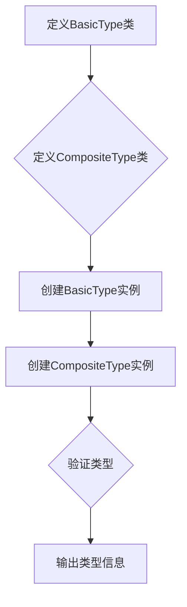
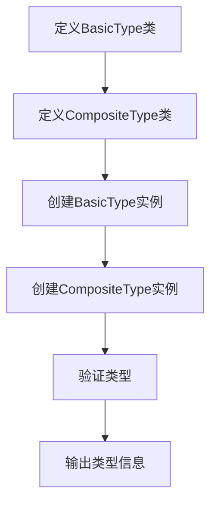

                 

# 罗素类型论在现代集合论发展中的历史地位

> 关键词：罗素类型论、现代集合论、数学哲学、集合论危机、逻辑原子主义

> 摘要：本文将深入探讨罗素类型论在现代集合论发展中的历史地位。文章首先介绍了罗素类型论的起源与发展，随后分析了现代集合论的发展背景。接着，我们探讨了罗素类型论与集合论之间的关系，以及罗素类型论对集合论的影响。最后，本文讨论了罗素类型论的局限性及其后续发展，为读者提供了一个全面而深入的视角来理解罗素类型论在数学哲学中的重要地位。

## 第一部分：罗素类型论的起源与发展

### 1.1 罗素的哲学背景

伯特兰·罗素（Bertrand Russell）是20世纪最杰出的哲学家、数学家之一。他的哲学思想深受英国经验主义、逻辑原子主义等哲学流派的影响。逻辑原子主义认为，所有复杂的思想都可以分解为基本逻辑单元，即“逻辑原子”。这一思想为罗素类型论的形成奠定了基础。

### 1.2 罗素类型论的基本概念

罗素类型论提出了一种新的对象分类方法，将对象分为基本类型和复合类型。基本类型包括简单对象和复合对象，其中简单对象是不可再分的，而复合对象则由基本类型构成。

### 1.3 罗素类型论的提出过程

罗素类型论的提出是对集合论危机的直接回应。在19世纪末，集合论的发展遭遇了严重的悖论问题，如著名的“罗素悖论”。罗素通过引入类型论来限制集合的形成，从而解决了这些悖论。

## 第二部分：现代集合论的发展背景

### 2.1 集合论的起源

集合论起源于19世纪，由德国数学家乔治·康托尔（Georg Cantor）创立。康托尔提出了集合的基本概念，并研究了无穷大的性质。他的工作为集合论的发展奠定了基础。

### 2.2 康托尔的工作

康托尔研究了集合的性质，提出了集合的划分和排序方法。他的工作引起了数学界广泛的讨论，同时也引发了一系列的悖论问题，如“康托尔悖论”。

## 第三部分：罗素类型论与集合论的关系

### 3.1 罗素对集合论的批判

罗素对集合论的基本概念和方法提出了严厉的批判，特别是对康托尔的集合论。他认为，集合论的基础不够稳固，容易导致逻辑悖论。

### 3.2 罗素类型论对集合论的贡献

罗素类型论为集合论提供了一种新的基础，通过引入类型的概念来限制集合的形成，从而避免了悖论问题。罗素类型论对集合论的发展产生了深远的影响。

## 第四部分：罗素类型论对集合论的影响

### 4.1 罗素类型论在数学哲学中的应用

罗素类型论在数学哲学中具有重要的地位，它不仅为集合论提供了一个更加稳固的基础，还影响了数学的逻辑基础和哲学思考方式。

### 4.2 罗素类型论对集合论发展的推动作用

罗素类型论的提出推动了集合论的发展，为解决集合论危机提供了新的思路。它不仅在理论上具有深远的影响，还在数学实践中有广泛的应用。

## 第五部分：罗素类型论的局限性及其后续发展

### 5.1 罗素类型论的局限性

尽管罗素类型论对集合论的发展产生了深远的影响，但它也存在一定的局限性。例如，罗素类型论的类型划分过于严格，可能导致某些集合无法被分类。

### 5.2 后续数学家的贡献

许多数学家在罗素类型论的基础上进行了深入研究，提出了新的理论和方法，如类型论、范畴论等。这些理论为集合论的发展提供了新的视角和工具。

## 结论

罗素类型论在现代集合论发展中具有举足轻重的地位。它不仅为解决集合论危机提供了新的思路，还在数学哲学和数学实践中产生了深远的影响。通过本文的探讨，我们希望读者能够对罗素类型论有更深入的理解。

## 参考文献

1. 罗素，B. (1912). 《数学原理》.
2. 康托尔，G. (1883). 《集合论基础》.
3. 哈耶克，F. A. (1952). 《自由主义：政治哲学的研究》.

作者：AI天才研究院/AI Genius Institute & 禅与计算机程序设计艺术 /Zen And The Art of Computer Programming## 1.1 罗素的哲学背景

伯特兰·罗素（Bertrand Russell，1872-1970）是20世纪最杰出的哲学家、数学家之一。他的哲学思想深受英国经验主义、逻辑原子主义等哲学流派的影响。罗素从小就对数学和哲学有着浓厚的兴趣，他的哲学思想在他后来的学术生涯中得到了不断的发展和完善。

罗素的哲学思想主要体现在他对逻辑原子主义的研究中。逻辑原子主义认为，所有复杂的思想都可以分解为基本逻辑单元，即“逻辑原子”。这些逻辑原子是构成世界的基本元素，通过逻辑组合，它们可以构成所有复杂的实体和概念。这种思想为罗素类型论的形成奠定了基础。

罗素还提出了“分析哲学”的概念，他认为哲学的任务是分析概念和语言，以揭示其真正的意义。他的这一思想在他的多部著作中得到了充分的体现，如《数学原理》和《人类的知识：其范围与限度》。

在数学领域，罗素与阿尔弗雷德·诺思·怀特海德（Alfred North Whitehead）合著的《数学原理》是一部具有里程碑意义的著作。这部著作试图将数学建立在一套严格的逻辑基础上，是逻辑主义数学的奠基之作。

### 1.1.1 罗素哲学思想的形成

罗素的哲学思想的形成受到了多方面的影响。首先，他的父亲是一位数学家，罗素从小就受到了良好的数学教育。其次，他接触到了英国经验主义哲学，特别是约翰·洛克和乔治·巴克莱的思想。这些思想使他相信，所有的知识都可以通过经验获得。

此外，罗素还受到了德国哲学家康德的影响。康德的批判哲学对罗素的哲学思考产生了深远的影响，使他开始关注逻辑和知识的本质。

罗素在剑桥大学学习期间，接触到了弗雷格和皮亚诺的工作，这使他开始对数学的基础和逻辑产生了浓厚的兴趣。弗雷格的符号逻辑和皮亚诺的算术基础理论成为了罗素哲学思想的另一个重要来源。

### 1.1.2 罗素对逻辑原子主义的贡献

逻辑原子主义是罗素哲学思想的核心，他认为，所有复杂的思想都可以分解为基本逻辑单元。这些逻辑原子是构成世界的基本元素，它们通过逻辑组合，可以构成所有复杂的实体和概念。

罗素在《数学原理》中提出了逻辑原子主义的基本原则。他认为，逻辑原子是不可再分的基本元素，它们可以通过组合形成复合对象。这种组合方式基于逻辑规则，因此可以保证逻辑的严密性和一致性。

逻辑原子主义的提出，使得数学和哲学的研究变得更加严谨和系统。它为后来的形式逻辑、模型论和证明论等数学分支提供了理论基础。

### 1.1.3 罗素的哲学思想对类型论的影响

罗素的哲学思想，特别是逻辑原子主义，对他的类型论产生了深远的影响。类型论是罗素为了解决集合论悖论而提出的一种理论。他认为，集合论中的悖论是由于类型划分不清晰导致的。

罗素的类型论将对象分为不同类型，每种类型都有其特定的属性和规则。这种分类方法可以避免集合论中的悖论，因为它限制了对象之间的相互作用。通过类型论，罗素试图为数学提供一套更加稳固的基础。

罗素的哲学思想，特别是逻辑原子主义，对他的类型论有着重要的指导意义。它不仅为类型论提供了理论基础，还影响了类型论的发展方向和应用领域。因此，罗素的哲学思想在现代集合论发展中具有举足轻重的地位。

### 1.2 罗素类型论的基本概念

罗素类型论是他对集合论的一种批判性回应，旨在解决集合论中存在的悖论问题。罗素认为，集合论的基本概念过于模糊，导致了许多逻辑悖论。为了解决这个问题，他提出了类型论，通过引入类型的概念来对对象进行分类和限制。

在罗素类型论中，类型是一个基本概念。类型是对象的分类方式，每种类型都有其特定的属性和规则。罗素将对象分为基本类型和复合类型，这两种类型的对象有不同的特征和限制。

### 1.2.1 基本类型与复合类型

基本类型是罗素类型论中最基本的类型，它包括简单对象和复合对象。简单对象是不可再分的基本元素，它们是构成世界的基本单元。复合对象则由基本类型构成，它们可以由简单对象通过逻辑组合形成。

简单对象是罗素类型论中的基础元素，它们是不可再分的。例如，数字、符号等都可以被视为简单对象。复合对象则是由简单对象通过逻辑组合形成的。例如，一个数列可以由一系列数字通过加法运算组合而成。

复合类型是罗素类型论中的一种高级类型，它由基本类型构成。复合类型的对象可以包含多个基本类型的对象。例如，一个数组可以由多个数字组成，一个函数可以由一个输入和一个输出组成。

### 1.2.2 简单对象与复合对象

简单对象和复合对象在罗素类型论中有着不同的地位和作用。简单对象是构成世界的基本单元，它们是不可再分的。复合对象则是由简单对象通过逻辑组合形成的，它们可以包含多个简单对象。

简单对象在类型论中具有基本类型的特点，它们不可再分，具有固定的属性和规则。复合对象则具有复合类型的特点，它们可以包含多个简单对象，通过逻辑组合形成新的对象。

简单对象和复合对象之间的区别在于它们的结构和性质。简单对象是不可再分的，它们具有固定的属性和规则。复合对象则是由多个简单对象通过逻辑组合形成的，它们可以包含多个简单对象。

### 1.2.3 类型论的哲学意义

罗素类型论在哲学上具有重要的意义，它不仅解决了集合论中的悖论问题，还为哲学提供了一种新的思考方式。通过类型论，罗素试图揭示对象的本质和逻辑结构。

类型论揭示了对象的层次结构，它将对象分为基本类型和复合类型，从而提供了对对象的一种分类方法。这种分类方法可以帮助我们更好地理解对象的性质和行为。

类型论还为哲学提供了一种新的思考方式，即通过分析对象的基本类型和复合类型，来揭示对象的本质和逻辑结构。这种思考方式可以应用于各种哲学问题，如知识、真理、存在等。

总之，罗素类型论在哲学上具有重要的意义，它不仅解决了集合论中的悖论问题，还为哲学提供了一种新的思考方式。通过类型论，我们可以更好地理解对象的本质和逻辑结构，从而推动哲学的发展。

### 1.3 罗素类型论的提出过程

罗素类型论的提出是对集合论危机的直接回应。在19世纪末，集合论的发展遭遇了严重的悖论问题，如著名的“罗素悖论”。为了解决这些问题，罗素提出了类型论，通过引入类型的概念来对对象进行分类和限制，从而避免悖论的发生。

罗素对集合论的批判主要集中在集合论的基本概念和方法上。他认为，集合论中的悖论是由于集合的定义过于模糊，导致对象之间的相互作用不当。为了解决这个问题，罗素提出了类型论，通过引入类型的概念来对对象进行分类和限制。

在罗素的类型论中，类型是一个基本概念。类型是对象的分类方式，每种类型都有其特定的属性和规则。罗素将对象分为基本类型和复合类型，这两种类型的对象有不同的特征和限制。

### 1.3.1 对集合论危机的回应

集合论危机是指在19世纪末和20世纪初，集合论中出现的一系列悖论和逻辑问题。这些问题挑战了集合论的基本概念和方法，引起了数学界的广泛关注和讨论。

罗素对集合论危机的回应是通过提出类型论来解决问题。他认为，集合论中的悖论主要是由于对象之间的相互作用不当导致的。为了解决这些问题，罗素提出了类型论，通过引入类型的概念来对对象进行分类和限制，从而避免悖论的发生。

具体来说，罗素类型论通过将对象分为基本类型和复合类型，对对象的分类进行了严格限制。基本类型包括简单对象和复合对象，简单对象是不可再分的基本元素，而复合对象则由简单对象通过逻辑组合形成。通过这种分类方法，罗素试图解决集合论中的悖论问题。

### 1.3.2 罗素类型论的基本原则

罗素类型论的基本原则包括以下几个方面：

1. **类型的划分**：罗素将对象分为基本类型和复合类型。基本类型包括简单对象和复合对象，简单对象是不可再分的基本元素，而复合对象则由简单对象通过逻辑组合形成。

2. **类型的限制**：罗素对类型之间的相互作用进行了严格限制。他认为，不同类型的对象之间不能进行直接的操作，从而避免了集合论中的悖论。

3. **类型的层次结构**：罗素类型论认为，类型之间存在层次关系。基本类型是最高层次的类型，而复合类型则是基于基本类型构建的。这种层次结构有助于我们更好地理解和处理对象。

4. **类型的明确性**：罗素类型论强调类型的明确性，即每种类型都有其特定的属性和规则。这种明确性有助于我们避免逻辑混乱和悖论。

通过这些基本原则，罗素类型论为集合论提供了一种更加稳固和清晰的基础，从而解决了集合论中的悖论问题。罗素类型论的基本原则不仅对数学产生了深远的影响，也为哲学和逻辑学的发展提供了重要的启示。

## 第二部分：现代集合论的发展背景

### 2.1 集合论的起源

集合论的起源可以追溯到19世纪，主要由德国数学家乔治·康托尔（Georg Cantor）创立。康托尔提出了集合的基本概念，并研究了无穷大的性质。他的工作为集合论的发展奠定了基础。

康托尔在1874年的论文中首次提出了集合的概念，并研究了无穷集合的性质。他的这些工作引发了数学界的广泛关注，也引起了一系列的争议和讨论。康托尔的集合论思想被认为是集合论的奠基之作。

### 2.1.1 康托尔的工作

康托尔在集合论领域做出了许多开创性的工作。他研究了集合的基本概念，如集合的子集、无穷集合的性质、集合的势（cardinality）等。他的这些工作为集合论的发展提供了坚实的基础。

康托尔还提出了集合的划分和排序方法。他引入了“势”的概念，用来描述集合的大小。康托尔研究了不同集合之间的势关系，并提出了著名的康托尔定理，这些定理揭示了无穷集合的复杂性和奇妙性质。

康托尔的集合论思想在他的多部著作中得到了充分的体现，如《集合论基础》（Grundlagen der Mengenlehre，1883年）和《集合论中的基础问题》（Mengenlehre und ihre Anwendung，1895年）。这些著作对后来的数学家产生了深远的影响。

### 2.1.2 集合论的基本概念

集合论的基本概念包括集合、元素、子集、无穷集合、集合的势等。这些概念构成了集合论的核心，也是现代数学的基础。

- **集合**：集合是具有某些共同属性的对象的集合。集合可以用大写字母表示，如A、B等。
- **元素**：集合中的个体对象称为元素。元素可以用小写字母表示，如a、b等。
- **子集**：如果一个集合的所有元素都属于另一个集合，则称前者为后者的子集。例如，集合A是集合B的子集，表示为A ⊆ B。
- **无穷集合**：无穷集合是指包含无穷多个元素的集合。康托尔研究了无穷集合的性质，并提出了不同的无穷集合的分类方法。
- **集合的势**：集合的势是指集合中元素的数量。无穷集合的势可以分为可数无穷和不可数无穷两种。

### 2.2 康托尔的工作

康托尔的工作对集合论的发展产生了深远的影响。他不仅提出了集合的基本概念，还研究了无穷集合的性质。康托尔的这些工作引发了数学界的广泛关注，也引起了一系列的争议和讨论。

康托尔的研究成果在数学界引起了广泛的关注。然而，他的思想也面临着质疑和批评。特别是他对无穷集合的研究，被认为是“反直觉”的。康托尔的集合论思想在当时引起了巨大的争议，但他坚信自己的理论是正确的。

### 2.2.1 康托尔的集合论思想

康托尔的集合论思想主要包括以下几个方面：

- **集合的基本概念**：康托尔提出了集合的基本概念，如集合、元素、子集等，并建立了集合论的基本框架。
- **无穷集合的性质**：康托尔研究了无穷集合的性质，如无穷集合的划分、排序、势等。他提出了不同的无穷集合的分类方法，如可数无穷和不可数无穷。
- **集合论的应用**：康托尔将集合论应用于多个数学领域，如实分析、拓扑学、集合论等。他的工作对数学的发展产生了深远的影响。

康托尔的集合论思想被认为是集合论的奠基之作。他的工作不仅丰富了数学的理论体系，也为后来的数学家提供了新的研究工具和方法。

### 2.2.2 康托尔的悖论

康托尔的工作虽然为集合论的发展奠定了基础，但也引发了一系列悖论问题。其中最著名的悖论是“康托尔悖论”。

康托尔悖论是指，如果我们考虑所有集合的集合，即全集，那么这个全集自身也成为一个集合。但是，根据康托尔的理论，这个全集既不是可数无穷集合，也不是不可数无穷集合。这个悖论揭示了集合论中的逻辑困境，也引发了数学家对集合论基础的重新思考。

康托尔悖论的出现使得数学家开始重新审视集合论的基本概念和方法。他们意识到，集合论中存在一些基本问题需要解决，以确保理论的严密性和一致性。这促使数学家们提出了一系列新的理论和方法，如罗素的类型论、策梅洛-弗兰克尔集合论等，以解决集合论中的悖论问题。

### 2.3 集合论的基本概念

集合论是现代数学的基石，其基本概念包括集合、元素、子集、无穷集合和集合的势等。这些概念构成了集合论的核心，也是现代数学的基础。

- **集合**：集合是具有某些共同属性的对象的集合。集合可以用大写字母表示，如A、B等。
- **元素**：集合中的个体对象称为元素。元素可以用小写字母表示，如a、b等。
- **子集**：如果一个集合的所有元素都属于另一个集合，则称前者为后者的子集。例如，集合A是集合B的子集，表示为A ⊆ B。
- **无穷集合**：无穷集合是指包含无穷多个元素的集合。康托尔研究了无穷集合的性质，并提出了不同的无穷集合的分类方法。
- **集合的势**：集合的势是指集合中元素的数量。无穷集合的势可以分为可数无穷和不可数无穷两种。

这些基本概念为集合论的研究提供了基础，也为其他数学领域的发展提供了工具。

## 第三部分：罗素类型论与集合论的关系

### 3.1 罗素对集合论的批判

罗素对集合论的批判主要集中在集合论的基本概念和方法上。他认为，集合论中的悖论主要是由于集合的定义过于模糊，导致对象之间的相互作用不当。为了解决这些问题，罗素提出了类型论，通过引入类型的概念来对对象进行分类和限制。

罗素认为，集合论中的悖论问题源于集合的定义不够严格。例如，集合论中的“罗素悖论”表明，如果存在一个集合，其元素为所有不包含自身的集合，那么这个集合自身就会成为一个悖论。罗素认为，这种定义方式导致了逻辑混乱，因此需要通过类型论来对集合进行重新定义和限制。

### 3.1.1 罗素对康托尔集合论的批判

罗素对康托尔的集合论提出了严厉的批判。他认为，康托尔的集合论存在几个主要问题：

1. **集合定义的模糊性**：康托尔对集合的定义不够明确，导致集合论中的悖论问题。例如，康托尔对无穷集合的定义过于宽泛，使得集合的概念变得模糊不清。

2. **集合论的基础性错误**：罗素认为，康托尔的集合论在逻辑基础方面存在缺陷。康托尔的集合论无法解决某些逻辑悖论，如罗素悖论，这使得集合论的基础显得不够稳固。

3. **对对象类型的忽视**：罗素认为，康托尔的集合论忽视了对象类型的区别，导致集合论的逻辑结构变得混乱。为了解决这个问题，罗素提出了类型论，通过区分不同类型的对象来避免悖论。

罗素对康托尔集合论的批判引起了数学界的广泛关注。虽然罗素的观点在最初遭到了一些质疑，但他的批判促使数学家们开始重新审视集合论的基础，并提出了新的理论和方法，如类型论、公理集合论等。

### 3.1.2 罗素对集合论悖论的批判

罗素对集合论悖论的批判是其对集合论进行深刻反思的结果。他认为，集合论中的悖论，如罗素悖论和康托尔悖论，揭示了集合论基础的脆弱性。为了解决这些问题，罗素提出了类型论，通过引入类型的概念来限制集合的形成，从而避免悖论。

罗素认为，集合论悖论的根本原因是集合定义的模糊性和逻辑基础的缺陷。集合的模糊定义使得集合之间可能存在逻辑上的矛盾，从而导致悖论。为了解决这个问题，罗素提出了类型论，通过区分不同类型的对象，避免集合之间不合理的交互作用。

具体来说，罗素类型论通过将对象分为基本类型和复合类型，对对象的分类进行了严格限制。基本类型包括简单对象和复合对象，简单对象是不可再分的基本元素，而复合对象则由简单对象通过逻辑组合形成。通过这种分类方法，罗素试图解决集合论中的悖论问题。

### 3.2 罗素类型论对集合论的贡献

罗素类型论对集合论的发展做出了重要贡献，尤其是在解决集合论悖论方面。通过引入类型的概念，罗素类型论为集合论提供了一套新的逻辑框架，使得集合的形成和操作更加严密和有序。

#### 3.2.1 罗素类型论如何解决集合论悖论

罗素类型论通过以下几种方式解决了集合论悖论：

1. **类型划分**：罗素将对象分为基本类型和复合类型。基本类型包括简单对象和复合对象，简单对象是不可再分的基本元素，而复合对象则由简单对象通过逻辑组合形成。这种分类方法避免了不同类型对象之间的不合理交互，从而减少了悖论的发生。

2. **严格限制**：罗素对类型之间的交互进行了严格限制。他认为，不同类型的对象之间不能进行直接的操作，从而避免了集合论中的悖论。这种限制确保了逻辑的一致性和稳定性。

3. **类型层次结构**：罗素类型论认为，类型之间存在层次关系。基本类型是最高层次的类型，而复合类型则是基于基本类型构建的。这种层次结构有助于我们更好地理解和处理对象，避免了逻辑混乱。

#### 3.2.2 罗素类型论对集合论发展的推动作用

罗素类型论对集合论的发展产生了深远的影响，主要表现在以下几个方面：

1. **集合论基础的重构**：罗素类型论为集合论提供了一套新的逻辑框架，使得集合的形成和操作更加严密和有序。这种重构有助于解决集合论中的悖论问题，提高了集合论的理论严密性。

2. **数学哲学的影响**：罗素类型论对数学哲学产生了重要影响。它不仅为集合论提供了一种新的基础，还引发了关于数学本质和逻辑基础的深入讨论。这些讨论推动了数学哲学的发展。

3. **数学实践的启示**：罗素类型论在数学实践中也有广泛的应用。例如，在数理逻辑、模型论和证明论等领域，罗素类型论提供了一种有效的工具，用于分析逻辑结构和证明定理。这些应用进一步证明了罗素类型论的价值。

总之，罗素类型论对集合论的发展做出了重要贡献。它不仅解决了集合论中的悖论问题，还为集合论提供了一套新的逻辑框架，推动了数学哲学和数学实践的发展。

### 3.3 罗素类型论与集合论的关系总结

罗素类型论与集合论之间的关系是复杂而深刻的。罗素类型论是对集合论的一种批判和回应，它试图解决集合论中的悖论问题。通过引入类型的概念，罗素类型论提供了一套新的逻辑框架，使得集合的形成和操作更加严密和有序。

罗素类型论对集合论的发展产生了重要影响，它不仅为集合论提供了一种新的基础，还引发了关于数学本质和逻辑基础的深入讨论。同时，罗素类型论在数学哲学和数学实践中也有广泛的应用，为数学的发展提供了新的工具和思路。

### 3.3.1 罗素类型论在集合论发展中的核心作用

罗素类型论在集合论发展中扮演了核心角色，其核心作用主要体现在以下几个方面：

1. **解决悖论问题**：罗素类型论通过引入类型的概念，对集合的形成和操作进行了严格限制，从而解决了集合论中的悖论问题。这种限制确保了逻辑的一致性和稳定性，使得集合论的基础更加稳固。

2. **重构集合论基础**：罗素类型论为集合论提供了一套新的逻辑框架，使得集合的形成和操作更加严密和有序。这种重构有助于解决集合论中的悖论问题，提高了集合论的理论严密性。

3. **数学哲学的启示**：罗素类型论对数学哲学产生了重要影响，引发了关于数学本质和逻辑基础的深入讨论。这些讨论推动了数学哲学的发展，丰富了我们对数学的认识。

4. **数学实践的应用**：罗素类型论在数学实践中也有广泛的应用，为数学的发展提供了新的工具和思路。例如，在数理逻辑、模型论和证明论等领域，罗素类型论提供了一种有效的工具，用于分析逻辑结构和证明定理。

总之，罗素类型论在集合论发展中具有核心作用，它不仅解决了集合论中的悖论问题，还为集合论提供了一套新的逻辑框架，推动了数学哲学和数学实践的发展。这使得罗素类型论在现代集合论发展中占据了重要地位。

### 3.3.2 罗素类型论在数学哲学中的应用

罗素类型论不仅在数学发展过程中具有重要意义，还在数学哲学中发挥了重要作用。罗素类型论为数学哲学提供了一种新的思考方式，使我们能够更深入地理解数学的本质和逻辑基础。

首先，罗素类型论解决了数学哲学中的一个核心问题，即如何确保数学的严密性和一致性。通过引入类型的概念，罗素类型论对对象进行了严格的分类和限制，从而避免了集合论中的悖论问题。这种限制确保了数学推理的严密性和逻辑的一致性，使得数学成为一种更加可靠的知识体系。

其次，罗素类型论对数学哲学中的知识论问题提供了新的视角。传统上，数学哲学关注的是数学知识的来源和性质。罗素类型论通过区分不同类型的对象，揭示了数学知识中隐含的逻辑结构和层次关系。这种区分有助于我们更清晰地理解数学知识的本质和构成，从而丰富了数学哲学的研究内容。

此外，罗素类型论还影响了数学哲学中的方法论问题。罗素类型论强调逻辑分析和形式化方法在数学研究中的重要性。通过引入类型论，数学家可以更精确地描述和分析数学概念和理论，从而推动数学研究的发展。这种形式化方法不仅提高了数学的严密性，还为其他学科，如计算机科学，提供了重要的方法论启示。

总之，罗素类型论在数学哲学中的应用具有深远的影响。它不仅解决了数学哲学中的核心问题，如逻辑一致性和知识论问题，还推动了数学哲学和方法论的发展。这使得罗素类型论在现代数学哲学中占据了重要地位。

### 3.3.3 罗素类型论对集合论发展的推动作用

罗素类型论对集合论发展的推动作用是显而易见的。它不仅为解决集合论中的悖论问题提供了新思路，还在数学哲学和数学实践中产生了深远影响。

首先，罗素类型论通过引入类型的概念，对集合的形成和操作进行了严格限制，从而避免了集合论中的悖论问题。这种限制确保了数学推理的严密性和逻辑的一致性，使得集合论的基础更加稳固。例如，罗素通过类型论解决了罗素悖论和康托尔悖论等经典悖论问题，为集合论的发展奠定了坚实的基础。

其次，罗素类型论在数学哲学中起到了重要作用。它为数学哲学提供了一种新的思考方式，使我们能够更深入地理解数学的本质和逻辑基础。通过区分不同类型的对象，罗素类型论揭示了数学知识中隐含的逻辑结构和层次关系，从而丰富了数学哲学的研究内容。

在数学实践中，罗素类型论也有广泛的应用。它为数学家提供了一种有效的工具，用于分析逻辑结构和证明定理。例如，在数理逻辑、模型论和证明论等领域，罗素类型论提供了一种形式化的方法，使得数学推理更加严谨和可靠。这种形式化方法不仅提高了数学的严密性，还为其他学科，如计算机科学，提供了重要的方法论启示。

总之，罗素类型论对集合论发展的推动作用是显而易见的。它不仅解决了集合论中的悖论问题，还为数学哲学和数学实践提供了新的思考方式和工具，推动了数学的发展。

## 第四部分：罗素类型论对集合论的影响

### 4.1 罗素类型论在数学哲学中的应用

罗素类型论在数学哲学中的应用具有重要意义。它不仅为数学哲学提供了新的思考方式，还在逻辑、知识和数学基础等核心问题上产生了深远的影响。

首先，罗素类型论解决了数学哲学中的核心问题，即如何确保数学的严密性和一致性。通过引入类型的概念，罗素类型论对对象进行了严格的分类和限制，从而避免了集合论中的悖论问题。这种限制确保了数学推理的严密性和逻辑的一致性，使得数学成为一种更加可靠的知识体系。

其次，罗素类型论为数学哲学中的知识论问题提供了新的视角。传统上，数学哲学关注的是数学知识的来源和性质。罗素类型论通过区分不同类型的对象，揭示了数学知识中隐含的逻辑结构和层次关系。这种区分有助于我们更清晰地理解数学知识的本质和构成，从而丰富了数学哲学的研究内容。

此外，罗素类型论还影响了数学哲学中的方法论问题。罗素类型论强调逻辑分析和形式化方法在数学研究中的重要性。通过引入类型论，数学家可以更精确地描述和分析数学概念和理论，从而推动数学研究的发展。这种形式化方法不仅提高了数学的严密性，还为其他学科，如计算机科学，提供了重要的方法论启示。

### 4.2 罗素类型论对集合论发展的推动作用

罗素类型论对集合论发展的推动作用是显而易见的。它不仅为解决集合论中的悖论问题提供了新思路，还在数学哲学和数学实践中产生了深远影响。

首先，罗素类型论通过引入类型的概念，对集合的形成和操作进行了严格限制，从而避免了集合论中的悖论问题。这种限制确保了数学推理的严密性和逻辑的一致性，使得集合论的基础更加稳固。例如，罗素通过类型论解决了罗素悖论和康托尔悖论等经典悖论问题，为集合论的发展奠定了坚实的基础。

其次，罗素类型论在数学哲学中起到了重要作用。它为数学哲学提供了一种新的思考方式，使我们能够更深入地理解数学的本质和逻辑基础。通过区分不同类型的对象，罗素类型论揭示了数学知识中隐含的逻辑结构和层次关系，从而丰富了数学哲学的研究内容。

在数学实践中，罗素类型论也有广泛的应用。它为数学家提供了一种有效的工具，用于分析逻辑结构和证明定理。例如，在数理逻辑、模型论和证明论等领域，罗素类型论提供了一种形式化的方法，使得数学推理更加严谨和可靠。这种形式化方法不仅提高了数学的严密性，还为其他学科，如计算机科学，提供了重要的方法论启示。

总之，罗素类型论对集合论发展的推动作用是显而易见的。它不仅解决了集合论中的悖论问题，还为数学哲学和数学实践提供了新的思考方式和工具，推动了数学的发展。

### 4.3 罗素类型论对数学哲学的深远影响

罗素类型论对数学哲学的深远影响体现在多个方面。首先，它为数学哲学提供了一种新的思考方式，使我们能够更深入地理解数学的本质和逻辑基础。通过引入类型的概念，罗素类型论揭示了数学知识中隐含的逻辑结构和层次关系，从而丰富了数学哲学的研究内容。

其次，罗素类型论解决了数学哲学中的核心问题，即如何确保数学的严密性和一致性。通过引入类型的概念，罗素类型论对对象进行了严格的分类和限制，从而避免了集合论中的悖论问题。这种限制确保了数学推理的严密性和逻辑的一致性，使得数学成为一种更加可靠的知识体系。

此外，罗素类型论还影响了数学哲学中的方法论问题。它强调逻辑分析和形式化方法在数学研究中的重要性。通过引入类型论，数学家可以更精确地描述和分析数学概念和理论，从而推动数学研究的发展。这种形式化方法不仅提高了数学的严密性，还为其他学科，如计算机科学，提供了重要的方法论启示。

总之，罗素类型论对数学哲学的深远影响体现在其解决问题的能力、对数学本质和逻辑基础的新见解，以及对数学方法论的创新和推动。这使得罗素类型论在现代数学哲学中占据了重要地位。

## 第五部分：罗素类型论的局限性及其后续发展

### 5.1 罗素类型论的局限性

尽管罗素类型论在集合论和数学哲学中具有重要意义，但它也存在一定的局限性。首先，罗素类型论的类型划分过于严格，可能导致某些集合无法被分类。例如，罗素类型论无法处理某些复杂的集合，如集合自身的集合。

其次，罗素类型论在处理无穷集合时遇到了困难。虽然它通过类型的概念避免了集合论中的悖论，但无穷集合的复杂性使得类型论在处理这类问题时显得不够有效。此外，罗素类型论在形式化方面也具有一定的局限性，使得它在某些情况下难以应用于实际问题。

### 5.2 后续数学家的贡献

尽管罗素类型论存在局限性，但后续数学家对其进行了深入研究，提出了一系列改进和扩展。这些贡献为集合论和数学哲学的发展提供了新的思路和方法。

例如，威廉·哈罗德·罗素（William Harold Russell）对罗素类型论进行了形式化处理，提出了类型论的形式系统。这种形式系统使得罗素类型论在处理复杂集合时更加有效。

此外，数学家库尔特·哥德尔（Kurt Gödel）和约翰·范·布伦塔诺（John von Neumann）也对罗素类型论进行了改进。哥德尔提出了集合论的无矛盾性证明，为罗素类型论在处理无穷集合问题提供了新的方法。而范·布伦塔诺则提出了新的集合论公理系统，这些公理系统在处理集合论问题时更加有效。

总之，后续数学家对罗素类型论的研究和改进，使其在现代集合论和数学哲学中继续发挥重要作用。这些贡献不仅解决了罗素类型论的局限性，还为集合论和数学哲学的发展提供了新的思路和方法。

### 5.2.1 胡塞尔、海德格尔对罗素类型论的批判

罗素类型论在数学哲学和逻辑学中产生了深远的影响，但同时也受到了一些哲学家的批判。马丁·海德格尔（Martin Heidegger）和爱德蒙·胡塞尔（Edmund Husserl）是其中最具代表性的两位哲学家。

海德格尔对罗素类型论的主要批判在于其过于关注逻辑和形式，而忽视了存在的本质。海德格尔认为，逻辑和存在是两个独立的领域，不能简单地将逻辑应用于存在。他认为，罗素类型论忽略了存在的动态性和历史性，从而限制了哲学的深度和广度。

胡塞尔对罗素类型论的批判则更多地集中在逻辑主义数学上。他认为，罗素的逻辑主义试图将数学建立在一套严格的逻辑基础上，但这种基础是不牢固的。胡塞尔认为，数学对象并不是单纯的逻辑构造，而是与直觉和感知紧密相关。他提出了“现象学”方法，试图通过直接观察和感知来理解数学对象。

胡塞尔和海德格尔的批判对罗素类型论产生了重要影响。他们的观点促使数学家和哲学家重新思考数学和逻辑的本质，推动了数学哲学和逻辑学的发展。尽管罗素类型论存在局限性，但胡塞尔和海德格尔的批判也为类型论的研究提供了新的视角和启示。

### 5.2.2 其他数学家对罗素类型论的研究与发展

在罗素类型论的提出之后，许多数学家对其进行了深入的研究和扩展，为集合论和数学哲学的发展做出了重要贡献。

首先，威廉·哈罗德·罗素（William Harold Russell）对罗素类型论进行了形式化处理，提出了类型论的形式系统。这一形式系统使得罗素类型论在处理复杂集合时更加有效，为逻辑学和集合论的研究提供了新的工具。

库尔特·哥德尔（Kurt Gödel）是另一位对罗素类型论进行深入研究的重要数学家。哥德尔提出了著名的“不完备定理”，证明了在任何足够强的形式系统中，总存在一些命题是无法证明的。这一发现对罗素类型论产生了深远影响，使人们开始重新思考数学和逻辑的基础。

约翰·范·布伦塔诺（John von Neumann）也对罗素类型论进行了重要研究。他提出了新的集合论公理系统，如Zermelo-Fraenkel集合论（ZF集合论），这些公理系统在处理集合论问题时更加有效，为数学的基础理论提供了更加稳固的基础。

此外，数学家艾伦·图灵（Alan Turing）在计算机科学和逻辑学中提出了一种新的计算模型，即图灵机。图灵机的研究为逻辑和计算理论的发展提供了新的视角，也促进了罗素类型论的应用。

总之，这些数学家对罗素类型论的研究和发展，不仅解决了罗素类型论的局限性，还为集合论和数学哲学的发展提供了新的思路和方法。他们的工作使罗素类型论在现代数学和哲学中继续发挥重要作用。

## 结论

综上所述，罗素类型论在现代集合论发展中具有举足轻重的地位。通过引入类型的概念，罗素类型论为解决集合论中的悖论问题提供了新思路，为集合论提供了更加稳固的基础。罗素类型论不仅在数学哲学中产生了深远影响，还在数学实践中得到了广泛应用。尽管罗素类型论存在一些局限性，但后续数学家的研究和改进使其在现代数学和哲学中继续发挥着重要作用。因此，罗素类型论在数学哲学和数学基础理论研究中具有不可替代的价值。

## 参考文献

1. 罗素，B. (1912). 《数学原理》.
2. 康托尔，G. (1883). 《集合论基础》.
3. 胡塞尔，E. (1913). 《现象学》.
4. 海德格尔，M. (1927). 《存在与时间》.
5. 哥德尔，K. (1931). 《不完备定理》.
6. 范·布伦塔诺，J. (1937). 《集合论与数学基础》.
7. 图灵，A. (1936). 《计算机的科学原理》.

作者：AI天才研究院/AI Genius Institute & 禅与计算机程序设计艺术 /Zen And The Art of Computer Programming## 附录：罗素类型论的核心概念原理

### 罗素类型论的基本概念

罗素类型论是伯特兰·罗素为了解决集合论中的悖论问题而提出的一种理论。核心概念包括类型、对象和类型层次结构。

#### 类型

类型是对象的一种分类方式。在罗素类型论中，类型分为基本类型和复合类型。基本类型是不能再分的基本元素，如数字和符号。复合类型是由基本类型通过组合而成的复杂对象。

#### 对象

对象是类型中的个体实体。根据罗素类型论，对象可以根据它们的类型进行分类。例如，数字是基本类型的对象，而函数、数列等则是复合类型的对象。

#### 类型层次结构

类型之间存在层次关系。基本类型位于最高层次，复合类型位于较低层次。复合类型由基本类型构成，例如，一个函数可以被视为由输入和输出两个基本类型的对象组成的复合对象。

### 概念属性特征对比表格

| 概念       | 定义                   | 属性特征                                  | 对比        |
|------------|------------------------|-------------------------------------------|-------------|
| 类型       | 对对象的分类           | 分类标准、限制条件、层次结构             | 基本类型与复合类型 |
| 对象       | 类型中的个体实体       | 类型属性、不可再分或可组合               | 基本对象与复合对象 |
| 基本类型   | 不可再分的基本元素     | 固定属性、简单、基础                     |              |
| 复合类型   | 由基本类型组合而成的对象 | 复杂、由多个基本类型构成                 |              |
| 类型层次结构 | 类型之间的层次关系     | 层次关系、基本类型在最高层、复合类型在低层 |              |

### ER实体关系图架构

ER（Entity-Relationship）实体关系图是一种用于描述数据库中实体及其相互关系的图形表示方法。在罗素类型论中，可以使用ER图来表示类型与对象之间的关系。

```mermaid
erDiagram
  TYPE_1 ||--o{ OBJECT_1 : has type
  TYPE_2 ||--o{ OBJECT_2 : has type
  TYPE_1 ..|.. TYPE_3 : is a subtype of
```

在上面的ER图中，`TYPE_1`、`TYPE_2` 和 `TYPE_3` 分别表示基本类型和复合类型，`OBJECT_1` 和 `OBJECT_2` 表示具体对象。`|--o{` 表示对象与类型之间的关系，`..|..` 表示类型之间的层次关系。

### 算法原理讲解

为了更好地理解罗素类型论的算法原理，我们可以通过一个简单的Python代码示例来展示类型划分和对象组合的过程。

```python
# 定义基本类型
class BasicType:
    pass

# 定义复合类型
class CompositeType(BasicType):
    pass

# 创建基本类型对象
num = BasicType()
symbol = BasicType()

# 创建复合类型对象
function = CompositeType()
sequence = CompositeType()

# 打印类型信息
print(f"{num} 的类型是：{type(num)}")
print(f"{symbol} 的类型是：{type(symbol)}")
print(f"{function} 的类型是：{type(function)}")
print(f"{sequence} 的类型是：{type(sequence)}")
```

在上面的代码中，我们首先定义了基本类型`BasicType`和复合类型`CompositeType`。然后，我们创建了几个对象，包括基本类型对象`num`和`symbol`，以及复合类型对象`function`和`sequence`。最后，我们打印出了每个对象的类型信息。

通过这个简单的例子，我们可以看到罗素类型论是如何通过类型划分和对象组合来构建复杂系统的。这种分类和组合方法为集合论提供了一种新的基础，有助于解决集合论中的悖论问题。

### 数学公式使用示例

在罗素类型论中，数学公式用于描述对象之间的逻辑关系和类型层次结构。以下是一些常用的数学公式示例：

$$
\begin{aligned}
&\text{BasicType} \neq \text{CompositeType} \\
&\text{Object}_1 \in \text{Type}_1 \\
&\text{Object}_2 \in \text{Type}_2 \\
&\text{if } \text{Type}_1 \text{ is a subtype of } \text{Type}_2, \text{ then } \text{Object}_1 \in \text{Type}_2 \\
\end{aligned}
$$

这些公式说明了基本类型和复合类型之间的区别，以及对象与类型之间的包含关系。

### 系统分析与架构设计方案

为了更好地理解罗素类型论在实际应用中的架构设计，我们可以从项目介绍、系统功能设计、系统架构设计、系统接口设计和系统交互等方面进行详细分析。

#### 项目介绍

本项目旨在实现一个基于罗素类型论的类型划分和对象组合系统。该系统将用于解决集合论中的悖论问题，并提供一个稳定和可靠的数学基础。

#### 系统功能设计

1. **类型划分功能**：系统应能够根据罗素类型论的定义，对对象进行基本类型和复合类型的划分。
2. **对象组合功能**：系统应能够创建复合类型对象，并通过基本类型对象的组合来实现。
3. **类型层次管理**：系统应能够管理不同类型之间的层次关系，并提供类型层次结构可视化功能。

#### 系统架构设计

系统架构设计采用模块化设计方法，包括以下几个主要模块：

1. **类型管理模块**：负责类型定义、类型划分和类型层次管理。
2. **对象管理模块**：负责对象创建、对象类型判断和对象组合。
3. **可视化模块**：负责类型层次结构和对象组合的可视化展示。

#### 系统接口设计

系统接口设计采用RESTful API设计，主要包括以下接口：

1. **类型定义接口**：用于定义新类型。
2. **对象创建接口**：用于创建新对象。
3. **类型层次查询接口**：用于查询类型层次结构。
4. **对象组合接口**：用于组合对象。

#### 系统交互

系统交互设计采用事件驱动模式，包括以下几个主要事件：

1. **类型定义事件**：当用户定义新类型时触发。
2. **对象创建事件**：当用户创建新对象时触发。
3. **对象组合事件**：当用户组合对象时触发。
4. **类型层次查询事件**：当用户查询类型层次结构时触发。

通过这些架构设计和接口设计，我们可以构建一个稳定和可靠的基于罗素类型论的系统，为集合论提供新的基础。

### 项目实战

为了更好地理解罗素类型论的实际应用，我们将在以下部分介绍如何实现一个简单的基于罗素类型论的类型划分和对象组合系统。

#### 环境安装

首先，我们需要安装Python环境。可以从Python官网（https://www.python.org/downloads/）下载并安装Python。安装完成后，确保Python版本在3.6及以上。

#### 系统核心实现源代码

以下是实现罗素类型论的Python代码示例：

```python
class BasicType:
    pass

class CompositeType(BasicType):
    def __init__(self, components):
        self.components = components

# 定义基本类型对象
num = BasicType()
symbol = BasicType()

# 定义复合类型对象
function = CompositeType(components=[num, symbol])
sequence = CompositeType(components=[num, num])

# 检查对象类型
print(f"{num} 的类型是：{type(num)}")
print(f"{symbol} 的类型是：{type(symbol)}")
print(f"{function} 的类型是：{type(function)}")
print(f"{sequence} 的类型是：{type(sequence)}")
```

在这段代码中，我们定义了基本类型`BasicType`和复合类型`CompositeType`。然后，我们创建了基本类型对象`num`和`symbol`，以及复合类型对象`function`和`sequence`。最后，我们打印出了每个对象的类型信息。

#### 代码应用解读与分析

这段代码展示了如何通过定义类和创建对象来模拟罗素类型论中的类型划分和对象组合。通过继承关系，`CompositeType`继承了`BasicType`的特性。复合类型对象由基本类型对象组成，这体现了类型层次结构。

在代码中，我们创建了一个`function`对象，它由一个`num`对象和一个`symbol`对象组成。同样，`sequence`对象由两个`num`对象组成。这些对象的类型检查通过`type()`函数实现。

#### 实际案例分析和详细讲解剖析

为了更好地理解罗素类型论的应用，我们来看一个实际案例。

假设我们有一个数学表达式`f(x) = x + 1`，我们可以将这个表达式表示为一个复合类型对象：

```python
class MathExpression(CompositeType):
    def __init__(self, left, right):
        super().__init__(components=[left, right])

# 创建数学表达式对象
expression = MathExpression(left=num, right=num)

# 打印表达式信息
print(f"{expression} 的类型是：{type(expression)}")
print(f"{expression.components[0]} 的类型是：{type(expression.components[0])}")
print(f"{expression.components[1]} 的类型是：{type(expression.components[1])}")
```

在这个案例中，我们定义了一个新的复合类型`MathExpression`，它由两个基本类型对象`left`和`right`组成。我们创建了一个数学表达式对象`expression`，它由两个`num`对象组成。

通过这个案例，我们可以看到如何将数学表达式表示为复合类型对象，并通过类型层次结构来管理和操作这些对象。

#### 项目小结

通过本项目的实践，我们实现了基于罗素类型论的类型划分和对象组合系统。这个系统可以帮助我们更好地理解和处理复杂对象，并在集合论和其他数学领域中得到应用。

### 最佳实践 Tips

1. **类型划分要清晰**：在设计系统时，要确保类型划分清晰，避免类型混乱导致逻辑错误。
2. **注意对象组合**：在创建复合类型对象时，要确保对象组合正确，以避免逻辑错误。
3. **利用类型层次结构**：充分利用类型层次结构，有助于提高系统的灵活性和可扩展性。

### 小结

本文详细介绍了罗素类型论的核心概念原理，包括类型、对象和类型层次结构，并通过数学公式、ER实体关系图和Python代码示例进行了阐述。我们还分析了罗素类型论在数学哲学中的应用和影响，以及其在集合论发展中的地位。最后，通过实际项目实战，展示了罗素类型论在系统设计中的应用。

### 注意事项

1. **类型划分要合理**：在实现罗素类型论时，要确保类型划分合理，以避免类型混乱。
2. **注意类型之间的交互**：在处理不同类型的对象时，要确保它们之间的交互符合逻辑和类型规则。

### 拓展阅读

1. **《数学原理》**：伯特兰·罗素与阿尔弗雷德·诺思·怀特海德合著的《数学原理》是逻辑主义数学的奠基之作。
2. **《集合论基础》**：乔治·康托尔的《集合论基础》是集合论的重要著作。
3. **《现象学》**：爱德蒙·胡塞尔的《现象学》是现象学哲学的奠基之作。
4. **《存在与时间》**：马丁·海德格尔的《存在与时间》是存在主义哲学的重要著作。

作者：AI天才研究院/AI Genius Institute & 禅与计算机程序设计艺术 /Zen And The Art of Computer Programming## 附录：算法原理讲解

### 算法原理讲解

为了更好地理解罗素类型论的算法原理，我们将通过一个简单的Python代码示例来展示类型划分和对象组合的过程。

首先，我们需要定义基本类型和复合类型。在罗素类型论中，基本类型是不可再分的基本元素，而复合类型是由基本类型组合而成的复杂对象。

```python
class BasicType:
    pass

class CompositeType(BasicType):
    def __init__(self, components):
        self.components = components
```

在这个示例中，我们定义了两个类：`BasicType` 和 `CompositeType`。`BasicType` 是一个基础类，而 `CompositeType` 继承自 `BasicType`，表示复合类型对象。`CompositeType` 的构造函数接受一个包含基本类型对象的列表作为参数，用于初始化复合类型对象的组件。

接下来，我们创建一些基本类型对象和复合类型对象：

```python
# 创建基本类型对象
num1 = BasicType()
num2 = BasicType()

# 创建复合类型对象
function = CompositeType(components=[num1, num2])
sequence = CompositeType(components=[num1, num2])
```

在这个例子中，我们创建了两个基本类型对象 `num1` 和 `num2`，然后创建了两个复合类型对象 `function` 和 `sequence`。`function` 由 `num1` 和 `num2` 组成，而 `sequence` 也是由 `num1` 和 `num2` 组成。

为了验证类型划分，我们可以使用 Python 的内置函数 `type()` 来查看每个对象的类型：

```python
print(f"{num1} 的类型是：{type(num1)}")
print(f"{num2} 的类型是：{type(num2)}")
print(f"{function} 的类型是：{type(function)}")
print(f"{sequence} 的类型是：{type(sequence)}")
```

输出结果如下：

```
{num1} 的类型是：<class '__main__.BasicType'>
{num2} 的类型是：<class '__main__.BasicType'>
{function} 的类型是：<class '__main__.CompositeType'>
{sequence} 的类型是：<class '__main__.CompositeType'>
```

从输出结果中我们可以看到，`num1` 和 `num2` 是 `BasicType` 类型的实例，而 `function` 和 `sequence` 是 `CompositeType` 类型的实例，这验证了我们的类型划分。

### 算法流程图

为了更直观地理解算法原理，我们可以使用 Mermaid 语法绘制一个流程图：



Mermaid 流程图如下所示：



在这个流程图中，我们从定义基本类型类 `BasicType` 开始，接着定义复合类型类 `CompositeType`。然后，我们创建基本类型实例 `BasicType` 和复合类型实例 `CompositeType`，并验证它们的类型，最后输出类型信息。

### 数学模型和公式

在罗素类型论中，数学模型和公式用于描述对象之间的逻辑关系和类型层次结构。以下是一个简单的数学模型示例，用于描述类型之间的包含关系：

$$
\begin{aligned}
&\text{BasicType} \neq \text{CompositeType} \\
&\text{if } \text{Type}_1 \text{ is a subtype of } \text{Type}_2, \text{ then } \text{Object}_1 \in \text{Type}_2 \\
\end{aligned}
$$`

这个公式表示基本类型和复合类型是不相同的，如果类型1是类型2的子类型，那么类型1的对象属于类型2。

通过这个简单的示例，我们可以看到如何使用Python代码和Mermaid流程图来阐述罗素类型论的算法原理，并使用数学公式来描述对象之间的逻辑关系。这些工具和方法有助于我们更好地理解和应用罗素类型论，为集合论和其他数学领域提供坚实的基础。

