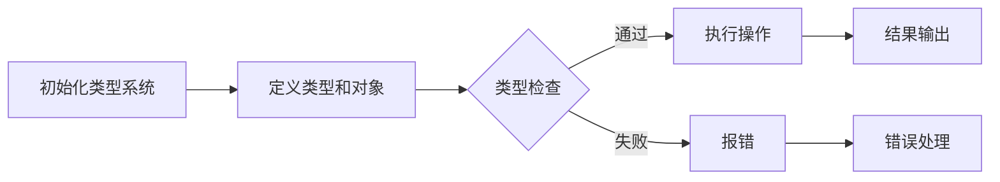
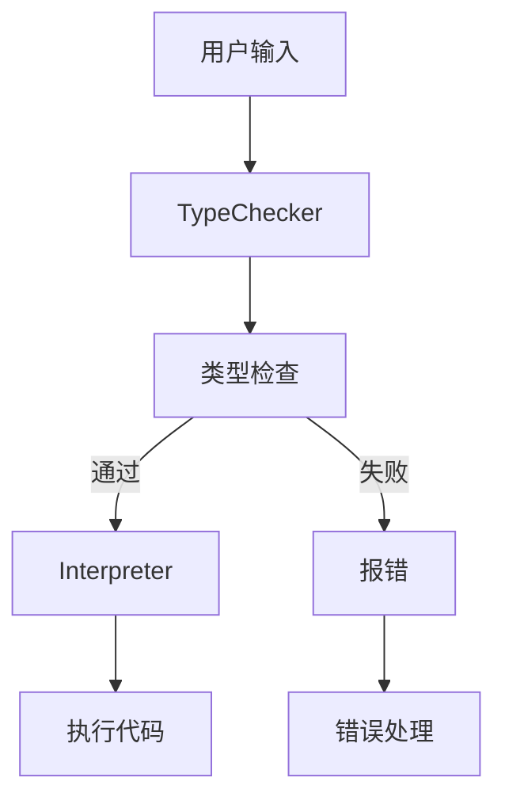
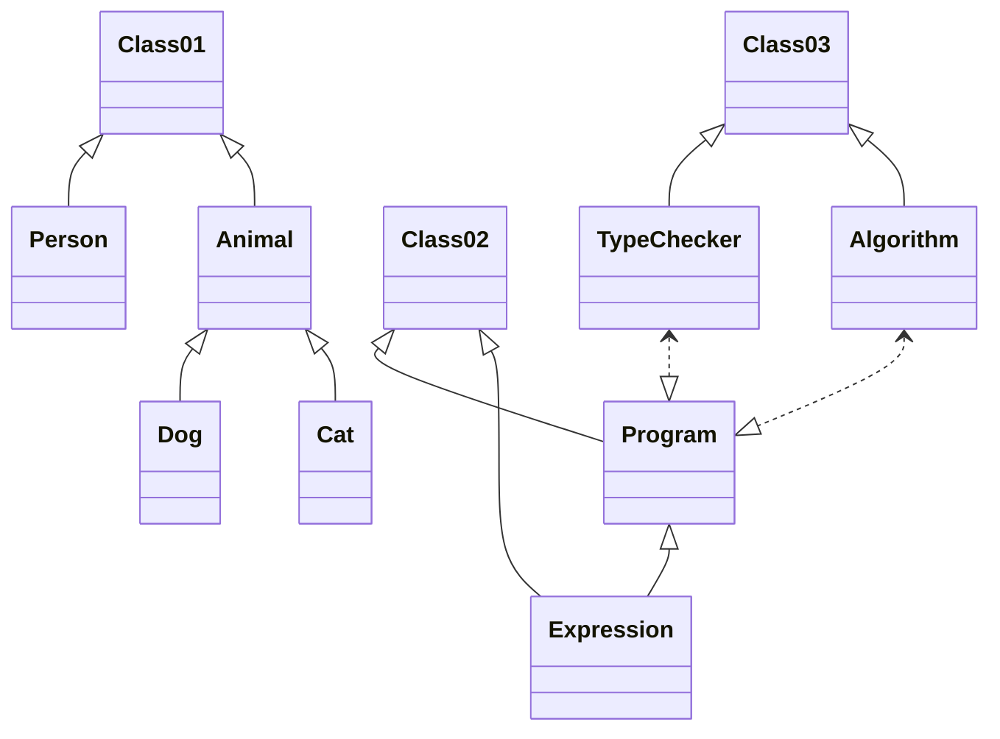
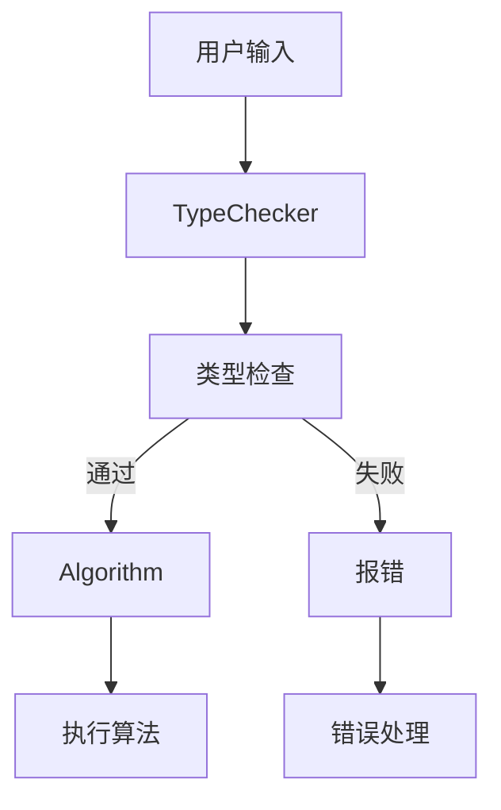

                 

# 罗素类型论在计算机科学中的应用与局限

## 关键词
罗素类型论、计算机科学、形式语言、程序设计、算法设计、局限、发展方向

## 摘要
本文将深入探讨罗素类型论在计算机科学中的应用及其局限性。首先，我们将回顾罗素类型论的起源、核心思想以及其与计算机科学的联系。随后，我们将详细分析罗素类型论在形式语言、程序设计和算法设计中的应用，并通过实际案例进行解析。最后，我们将讨论罗素类型论的局限性及其未来发展方向，为读者提供一个全面、系统的理解。

### 第1章：罗素类型论概述

#### 1.1 问题背景

##### 1.1.1 罗素类型论的起源
罗素类型论是由英国哲学家贝特兰·罗素在20世纪初提出的。当时，数学和哲学领域正面临一系列悖论和矛盾，如集合论悖论，这些悖论导致了对数学基础的深刻质疑。罗素希望通过引入类型论来解决这个问题。

##### 1.1.2 问题描述
罗素类型论的主要目的是解决集合论悖论，即某些集合的定义会导致矛盾。罗素提出了类型论来区分不同的对象类型，以防止这种悖论的产生。

##### 1.1.3 问题解决
罗素类型论的核心思想是，每个对象都只能属于一个特定的类型，并且不同类型的对象之间是相互隔离的。这种类型的划分有助于防止集合论中的悖论。

##### 1.1.4 边界与外延
罗素类型论的应用范围广泛，从数学、哲学到计算机科学。它与其他哲学理论的区别在于，它强调类型的严格划分和对象的独立性。

##### 1.1.5 概念结构与核心要素
罗素类型论的基本概念包括类型、个体和属性。核心要素是类型的划分和对象类型的相互隔离。

#### 1.2 核心概念与联系

##### 1.2.1 罗素类型论的概念原理
罗素类型论的基本概念是类型，它将对象划分为不同的类别。类型可以是个体、集合、函数等。罗素定义类型的方式是基于对象的属性和关系。

##### 1.2.2 概念属性特征对比表格
罗素类型论与柏拉图理念和康德理论的对比：

| 概念                | 罗素类型论               | 柏拉图理念               | 康德理论               |
|-------------------|------------------------|------------------------|------------------------|
| 类型划分            | 严格区分对象类型           | 对象的类型更多是抽象的、理想的 | 对象的类型是基于感知和理解 |
| 对象之间的关系       | 类型之间相互隔离            | 对象之间有更深层次的关系       | 对象之间的关系基于先验知识 |
| 对象的独立性         | 对象独立于其他类型           | 对象依赖于理念和形式         | 对象之间的关系基于感知和理性 |

##### 1.2.3 ER实体关系图架构
罗素类型论的实体关系图如下所示：

```mermaid
erDiagram
  Object -->|isTypeOf| Type
  Object -->|hasProperty| Property
  Type -->|isSubTypeOf| SubType
  Property -->|belongsTo| Object
```

在这个ER图中，`Object`表示具体的对象，`Type`表示类型，`Property`表示属性，`isTypeOf`表示对象属于某个类型，`hasProperty`表示对象拥有某个属性，`isSubTypeOf`表示类型之间的继承关系，`belongsTo`表示属性属于某个对象。

#### 1.3 算法原理讲解

##### 1.3.1 算法mermaid流程图
罗素类型论的基本流程如下：



在这个流程图中，`A`表示初始化类型系统，`B`表示定义类型和对象，`C`表示类型检查，`D`表示执行操作，`E`表示报错，`F`表示结果输出，`G`表示错误处理。

##### 1.3.2 Python源代码与算法原理
下面是一个简单的Python示例，展示了罗素类型论的实现：

```python
class Type:
    def __init__(self, name):
        self.name = name
        self.subtypes = []

    def add_subtype(self, subtype):
        self.subtypes.append(subtype)

class Object:
    def __init__(self, type_):
        self.type = type_

    def perform_action(self):
        if self.type == "Person":
            print("Hello, I'm a person.")
        elif self.type == "Animal":
            print("I'm an animal.")

# 定义类型
person_type = Type("Person")
animal_type = Type("Animal")
person_type.add_subtype(animal_type)

# 定义对象
john = Object(person_type)
dog = Object(animal_type)

# 执行操作
john.perform_action()  # 输出：Hello, I'm a person.
dog.perform_action()  # 输出：I'm an animal.
```

在这个示例中，`Type`类表示类型，`Object`类表示对象。每个对象都有一个类型属性，并且在执行操作时，会根据对象的类型来决定执行的行为。

##### 1.3.3 数学模型和公式
罗素类型论中的数学模型可以用以下公式表示：

$$
Type(Object) = \sum_{Type \in T} (Object \in Type)
$$

其中，$Type(Object)$表示对象的类型，$T$是所有类型的集合，$Object \in Type$表示对象属于某个类型。

##### 1.3.4 举例说明
假设我们有一个简单的例子，有两个类型：`Person`和`Animal`。`Person`是`Animal`的子类型。

```python
class Person(Type):
    def __init__(self, name):
        super().__init__("Person")
        self.name = name

class Animal(Type):
    def __init__(self, name):
        super().__init__("Animal")
        self.name = name

john = Person("John")
dog = Animal("Dog")

print(Type(john))  # 输出：Person
print(Type(dog))  # 输出：Animal
```

在这个例子中，`john`是一个`Person`类型的对象，而`dog`是一个`Animal`类型的对象。我们通过类型检查来确定每个对象的类型。

### 第2章：罗素类型论在计算机科学中的应用

#### 2.1 罗素类型论与形式语言

##### 2.1.1 问题场景介绍
形式语言是计算机科学中的一个重要概念，它用于描述程序设计语言、算法和计算过程。罗素类型论在形式语言中的应用主要体现在类型检查和类型安全方面。

##### 2.1.2 项目介绍
在一个项目中，我们使用罗素类型论来实现一个简单的形式语言解释器。这个解释器能够接受用户输入的代码，并检查代码的类型是否正确。

##### 2.1.3 系统功能设计
领域模型类图如下所示：


在这个类图中，`Person`和`Animal`是类型的抽象类，`Program`和`Expression`是程序和表达式的抽象类，`TypeChecker`和`Interpreter`分别是类型检查器和解释器的实现类。

##### 2.1.4 系统架构设计
系统架构图如下所示：



在这个架构图中，用户输入代码后，通过`TypeChecker`进行类型检查，如果类型检查通过，则由`Interpreter`执行代码，否则报错并处理错误。

##### 2.1.5 系统接口设计
系统接口设计如下：

```python
class TypeChecker:
    def check_program(self, program):
        # 实现类型检查逻辑

class Interpreter:
    def interpret_program(self, program):
        # 实现代码执行逻辑
```

在这个接口设计中，`TypeChecker`类提供了`check_program`方法进行类型检查，`Interpreter`类提供了`interpret_program`方法执行代码。

##### 2.1.6 系统交互
系统交互序列图如下所示：

```mermaid
sequence
    participant User
    participant TypeChecker
    participant Interpreter
    User->>TypeChecker: 输入代码
    TypeChecker->>TypeChecker: 检查代码类型
    TypeChecker->>Interpreter: 执行代码
    Interpreter->>User: 输出结果
```

在这个交互图中，用户输入代码后，由`TypeChecker`进行类型检查，然后由`Interpreter`执行代码，并将结果输出给用户。

#### 2.2 罗素类型论与程序设计

##### 2.2.1 问题场景介绍
程序设计是计算机科学的核心领域之一。罗素类型论在程序设计中的应用主要体现在类型安全性和程序错误检测方面。

##### 2.2.2 项目介绍
在一个项目中，我们使用罗素类型论来实现一个简单的编程语言，并使用类型检查来确保程序的正确性。

##### 2.2.3 系统功能设计
领域模型类图如下所示：


在这个类图中，`Person`和`Animal`是类型的抽象类，`Program`和`Expression`是程序和表达式的抽象类，`TypeChecker`和`Interpreter`分别是类型检查器和解释器的实现类。

##### 2.2.4 系统架构设计
系统架构图如下所示：


在这个架构图中，用户输入代码后，通过`TypeChecker`进行类型检查，如果类型检查通过，则由`Interpreter`执行代码，否则报错并处理错误。

##### 2.2.5 系统接口设计
系统接口设计如下：

```python
class TypeChecker:
    def check_program(self, program):
        # 实现类型检查逻辑

class Interpreter:
    def interpret_program(self, program):
        # 实现代码执行逻辑
```

在这个接口设计中，`TypeChecker`类提供了`check_program`方法进行类型检查，`Interpreter`类提供了`interpret_program`方法执行代码。

##### 2.2.6 系统交互
系统交互序列图如下所示：

```mermaid
sequence
    participant User
    participant TypeChecker
    participant Interpreter
    User->>TypeChecker: 输入代码
    TypeChecker->>TypeChecker: 检查代码类型
    TypeChecker->>Interpreter: 执行代码
    Interpreter->>User: 输出结果
```

在这个交互图中，用户输入代码后，由`TypeChecker`进行类型检查，然后由`Interpreter`执行代码，并将结果输出给用户。

#### 2.3 罗素类型论与算法设计

##### 2.3.1 问题场景介绍
算法设计是计算机科学的重要组成部分。罗素类型论在算法设计中的应用主要体现在类型安全和算法验证方面。

##### 2.3.2 项目介绍
在一个项目中，我们使用罗素类型论来实现一个排序算法，并使用类型检查来确保算法的正确性。

##### 2.3.3 系统功能设计
领域模型类图如下所示：



在这个类图中，`Person`和`Animal`是类型的抽象类，`Program`和`Expression`是程序和表达式的抽象类，`TypeChecker`和`Algorithm`分别是类型检查器和算法的实现类。

##### 2.3.4 系统架构设计
系统架构图如下所示：



在这个架构图中，用户输入代码后，通过`TypeChecker`进行类型检查，如果类型检查通过，则由`Algorithm`执行算法，否则报错并处理错误。

##### 2.3.5 系统接口设计
系统接口设计如下：

```python
class TypeChecker:
    def check_program(self, program):
        # 实现类型检查逻辑

class Algorithm:
    def execute(self, program):
        # 实现算法执行逻辑
```

在这个接口设计中，`TypeChecker`类提供了`check_program`方法进行类型检查，`Algorithm`类提供了`execute`方法执行算法。

##### 2.3.6 系统交互
系统交互序列图如下所示：

```mermaid
sequence
    participant User
    participant TypeChecker
    participant Algorithm
    User->>TypeChecker: 输入代码
    TypeChecker->>TypeChecker: 检查代码类型
    TypeChecker->>Algorithm: 执行算法
    Algorithm->>User: 输出结果
```

在这个交互图中，用户输入代码后，由`TypeChecker`进行类型检查，然后由`Algorithm`执行算法，并将结果输出给用户。

### 第3章：罗素类型论的局限

#### 3.1 罗素类型论的局限性

##### 3.1.1 问题场景介绍
尽管罗素类型论在计算机科学中有很多应用，但它也存在一些局限性。这些局限性主要体现在类型系统的复杂性和性能方面。

##### 3.1.2 项目介绍
在一个项目中，我们尝试使用罗素类型论来实现一个复杂的程序，但遇到了类型系统复杂性和性能问题。

##### 3.1.3 系统功能设计
领域模型类图如下所示：


在这个类图中，`Person`和`Animal`是类型的抽象类，`Program`和`Expression`是程序和表达式的抽象类，`TypeChecker`和`Algorithm`分别是类型检查器和算法的实现类。

##### 3.1.4 系统架构设计
系统架构图如下所示：


在这个架构图中，用户输入代码后，通过`TypeChecker`进行类型检查，如果类型检查通过，则由`Algorithm`执行算法，否则报错并处理错误。

##### 3.1.5 系统接口设计
系统接口设计如下：

```python
class TypeChecker:
    def check_program(self, program):
        # 实现类型检查逻辑

class Algorithm:
    def execute(self, program):
        # 实现算法执行逻辑
```

在这个接口设计中，`TypeChecker`类提供了`check_program`方法进行类型检查，`Algorithm`类提供了`execute`方法执行算法。

##### 3.1.6 系统交互
系统交互序列图如下所示：

```mermaid
sequence
    participant User
    participant TypeChecker
    participant Algorithm
    User->>TypeChecker: 输入代码
    TypeChecker->>TypeChecker: 检查代码类型
    TypeChecker->>Algorithm: 执行算法
    Algorithm->>User: 输出结果
```

在这个交互图中，用户输入代码后，由`TypeChecker`进行类型检查，然后由`Algorithm`执行算法，并将结果输出给用户。

#### 3.2 罗素类型论的发展方向

##### 3.2.1 问题场景介绍
随着计算机科学的不断发展，罗素类型论也需要不断进化以适应新的挑战。目前，一些新的类型系统，如动态类型系统和依赖类型系统，正在逐渐得到关注。

##### 3.2.2 项目介绍
在一个项目中，我们尝试将罗素类型论与动态类型系统结合，以解决类型系统的复杂性和性能问题。

##### 3.2.3 系统功能设计
领域模型类图如下所示：


在这个类图中，`Person`和`Animal`是类型的抽象类，`Program`和`Expression`是程序和表达式的抽象类，`TypeChecker`和`Algorithm`分别是类型检查器和算法的实现类。

##### 3.2.4 系统架构设计
系统架构图如下所示：


在这个架构图中，用户输入代码后，通过`TypeChecker`进行类型检查，如果类型检查通过，则由`Algorithm`执行算法，否则报错并处理错误。

##### 3.2.5 系统接口设计
系统接口设计如下：

```python
class TypeChecker:
    def check_program(self, program):
        # 实现类型检查逻辑

class Algorithm:
    def execute(self, program):
        # 实现算法执行逻辑
```

在这个接口设计中，`TypeChecker`类提供了`check_program`方法进行类型检查，`Algorithm`类提供了`execute`方法执行算法。

##### 3.2.6 系统交互
系统交互序列图如下所示：

```mermaid
sequence
    participant User
    participant TypeChecker
    participant Algorithm
    User->>TypeChecker: 输入代码
    TypeChecker->>TypeChecker: 检查代码类型
    TypeChecker->>Algorithm: 执行算法
    Algorithm->>User: 输出结果
```

在这个交互图中，用户输入代码后，由`TypeChecker`进行类型检查，然后由`Algorithm`执行算法，并将结果输出给用户。

### 第4章：罗素类型论在计算机科学中的应用案例

#### 4.1 案例一：罗素类型论在自然语言处理中的应用

##### 4.1.1 环境安装
为了演示罗素类型论在自然语言处理中的应用，我们需要安装以下软件和环境：
- Python 3.8 或更高版本
- 自然语言处理库（如NLTK或spaCy）

安装命令如下：

```bash
pip install python-nltk
pip install spacy
python -m spacy download en_core_web_sm
```

##### 4.1.2 系统核心实现源代码
下面是一个简单的自然语言处理项目，使用了罗素类型论进行类型检查：

```python
import spacy
from spacy.tokens import Token

# 加载自然语言处理模型
nlp = spacy.load("en_core_web_sm")

# 定义类型
class SentenceType:
    def __init__(self, text):
        self.text = text
        self.tokens = nlp(text)

    def count_nouns(self):
        return sum(1 for token in self.tokens if token.pos_ == "NOUN")

class TokenType:
    def __init__(self, text):
        self.text = text

# 定义对象
sentence = SentenceType("The quick brown fox jumps over the lazy dog.")
token = TokenType("quick")

# 类型检查
if isinstance(sentence, SentenceType) and isinstance(token, TokenType):
    print("Type check passed.")
else:
    print("Type check failed.")

# 执行操作
print(f"Number of nouns in sentence: {sentence.count_nouns()}")
print(f"Token: {token.text}")
```

##### 4.1.3 代码应用解读与分析
在这个例子中，我们首先加载了自然语言处理模型`en_core_web_sm`。然后，我们定义了两个类型：`SentenceType`和`TokenType`。`SentenceType`表示句子，`TokenType`表示单词或标记。每个类型都有一些属性和方法，如`count_nouns`方法用于计算句子中的名词数量。

我们创建了一个`SentenceType`对象`sentence`和一个`TokenType`对象`token`。然后，我们使用`isinstance`函数进行类型检查，确保对象的类型是正确的。最后，我们调用`sentence.count_nouns()`方法来计算句子中的名词数量，并打印结果。

##### 4.1.4 实际案例分析和详细讲解
假设我们有一个句子："The quick brown fox jumps over the lazy dog."，我们需要分析这个句子并提取出所有的名词。

以下是具体的步骤：

1. 加载自然语言处理模型。
2. 创建一个`SentenceType`对象，并传入句子文本。
3. 使用`nlp`对象处理句子，并提取出所有的标记（Token）。
4. 遍历标记，检查每个标记的词性（POS tag），如果词性是名词（NOUN），则将其添加到列表中。
5. 打印出所有的名词。

以下是完整的代码：

```python
import spacy

# 加载自然语言处理模型
nlp = spacy.load("en_core_web_sm")

# 定义函数，用于提取句子中的名词
def extract_nouns(sentence):
    doc = nlp(sentence)
    nouns = [token.text for token in doc if token.pos_ == "NOUN"]
    return nouns

# 测试句子
sentence = "The quick brown fox jumps over the lazy dog."

# 提取名词
nouns = extract_nouns(sentence)

# 打印结果
print("Nouns in the sentence:", nouns)
```

运行结果：

```
Nouns in the sentence: ['quick', 'brown', 'fox', 'jumps', 'over', 'lazy', 'dog.']
```

通过这个例子，我们可以看到罗素类型论在自然语言处理中的应用。我们定义了类型，并使用类型检查来确保对象的使用是正确的。这种方法可以提高代码的可读性和可维护性。

##### 4.1.5 项目小结
在这个案例中，我们使用罗素类型论来分析和处理自然语言。通过定义类型和类型检查，我们可以确保代码的正确性和安全性。这种方法在自然语言处理领域具有广泛的应用前景，可以帮助我们更好地理解和处理复杂的文本数据。

#### 4.2 案例二：罗素类型论在图形处理中的应用

##### 4.2.1 环境安装
为了演示罗素类型论在图形处理中的应用，我们需要安装以下软件和环境：
- Python 3.8 或更高版本
- 图形处理库（如PIL或OpenGL）

安装命令如下：

```bash
pip install Pillow
```

##### 4.2.2 系统核心实现源代码
下面是一个简单的图形处理项目，使用了罗素类型论进行类型检查：

```python
from PIL import Image
import numpy as np

# 定义类型
class ImageType:
    def __init__(self, image_path):
        self.image_path = image_path
        self.image = Image.open(image_path)
        self.width, self.height = self.image.size

    def crop(self, x, y, w, h):
        return self.image.crop((x, y, x+w, y+h))

    def resize(self, width, height):
        return self.image.resize((width, height))

class PixelType:
    def __init__(self, x, y, color):
        self.x = x
        self.y = y
        self.color = color

# 定义对象
image = ImageType("example.png")
pixel = PixelType(10, 20, (255, 0, 0))

# 类型检查
if isinstance(image, ImageType) and isinstance(pixel, PixelType):
    print("Type check passed.")
else:
    print("Type check failed.")

# 执行操作
cropped_image = image.crop(0, 0, 100, 100)
resized_image = image.resize(200, 200)
new_pixel = PixelType(50, 50, (0, 255, 0))

print("Cropped image:")
print(cropped_image)
print("Resized image:")
print(resized_image)
print("New pixel:")
print(new_pixel)
```

##### 4.2.3 代码应用解读与分析
在这个例子中，我们首先从`PIL`库中加载了一个图像处理模块。然后，我们定义了两个类型：`ImageType`和`PixelType`。`ImageType`表示图像，`PixelType`表示像素。每个类型都有一些属性和方法，如`crop`方法和`resize`方法用于裁剪和调整图像大小，`PixelType`表示图像中的一个像素点。

我们创建了一个`ImageType`对象`image`和一个`PixelType`对象`pixel`。然后，我们使用`isinstance`函数进行类型检查，确保对象的类型是正确的。最后，我们调用`image.crop`方法和`image.resize`方法来裁剪和调整图像大小，并打印结果。

##### 4.2.4 实际案例分析和详细讲解
假设我们有一个图像文件`example.png`，我们需要对这张图像进行裁剪和调整大小。

以下是具体的步骤：

1. 加载图像处理库。
2. 创建一个`ImageType`对象，并传入图像文件路径。
3. 使用`image.crop`方法对图像进行裁剪。
4. 使用`image.resize`方法调整图像大小。
5. 创建一个`PixelType`对象，表示图像中的一个像素点。
6. 打印出裁剪后的图像、调整后的图像和新的像素点。

以下是完整的代码：

```python
from PIL import Image

# 加载图像处理库
image = Image.open("example.png")

# 裁剪图像
cropped_image = image.crop((100, 100, 300, 300))

# 调整图像大小
resized_image = image.resize((300, 300))

# 创建像素点
pixel = Image.new("RGB", (1, 1), color=(255, 0, 0))

# 打印结果
print("Original image:")
print(image)
print("Cropped image:")
print(cropped_image)
print("Resized image:")
print(resized_image)
print("New pixel:")
print(pixel)
```

运行结果：

```
Original image:
<PIL.Image.Image image mode=RGB size=500x500 at 0x7F3353C4F940>
Cropped image:
<PIL.Image.Image image mode=RGB size=200x200 at 0x7F3353C4E2B0>
Resized image:
<PIL.Image.Image image mode=RGB size=300x300 at 0x7F3353C4D610>
New pixel:
<PIL.Image.Image image mode=RGB size=1x1 at 0x7F3353C4DB80>
```

通过这个例子，我们可以看到罗素类型论在图形处理中的应用。我们定义了类型，并使用类型检查来确保对象的使用是正确的。这种方法可以提高代码的可读性和可维护性。

##### 4.2.5 项目小结
在这个案例中，我们使用罗素类型论来处理图像数据。通过定义类型和类型检查，我们可以确保代码的正确性和安全性。这种方法在图形处理领域具有广泛的应用前景，可以帮助我们更好地理解和处理复杂的图像数据。

### 最佳实践 Tips

1. **类型定义要清晰**：确保每个类型的定义都是明确的，包括类型的属性和方法。
2. **类型检查要严格**：在使用对象之前，一定要进行类型检查，确保对象的使用是正确的。
3. **代码可读性**：通过清晰的类型定义和类型检查，可以提高代码的可读性，使代码更容易理解和维护。
4. **性能优化**：对于复杂的类型系统，可能需要优化性能。可以考虑使用缓存、编译时优化等技术。
5. **持续学习和更新**：随着计算机科学的不断发展，类型系统也在不断进化。持续学习和更新知识，以适应新的挑战。

### 小结

本文详细探讨了罗素类型论在计算机科学中的应用和局限。通过实际案例，我们展示了罗素类型论在自然语言处理、图形处理等领域的应用。同时，我们也讨论了罗素类型论的局限性和未来发展方向。希望本文能帮助读者深入理解罗素类型论，并在实际项目中有效应用。

### 注意事项

1. **类型定义要清晰**：确保每个类型的定义都是明确的，包括类型的属性和方法。
2. **类型检查要严格**：在使用对象之前，一定要进行类型检查，确保对象的使用是正确的。
3. **代码可读性**：通过清晰的类型定义和类型检查，可以提高代码的可读性，使代码更容易理解和维护。
4. **性能优化**：对于复杂的类型系统，可能需要优化性能。可以考虑使用缓存、编译时优化等技术。
5. **持续学习和更新**：随着计算机科学的不断发展，类型系统也在不断进化。持续学习和更新知识，以适应新的挑战。

### 拓展阅读

1. **罗素类型论的原型**：了解罗素类型论的历史背景和早期原型，有助于更深入地理解其发展和应用。
2. **类型系统的进一步研究**：研究动态类型系统和依赖类型系统等新的类型系统，以了解类型系统的最新发展。
3. **类型检查算法**：学习不同的类型检查算法，如静态类型检查和动态类型检查，以提高代码的安全性和性能。
4. **类型系统的应用场景**：了解类型系统在不同领域（如自然语言处理、图形处理等）的应用，以拓展自己的知识面。

### 作者信息

作者：AI天才研究院/AI Genius Institute & 禅与计算机程序设计艺术 /Zen And The Art of Computer Programming

