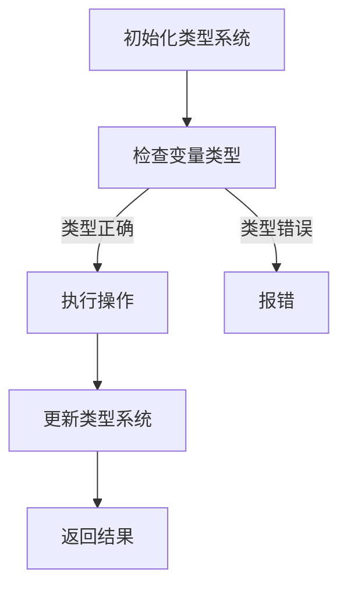
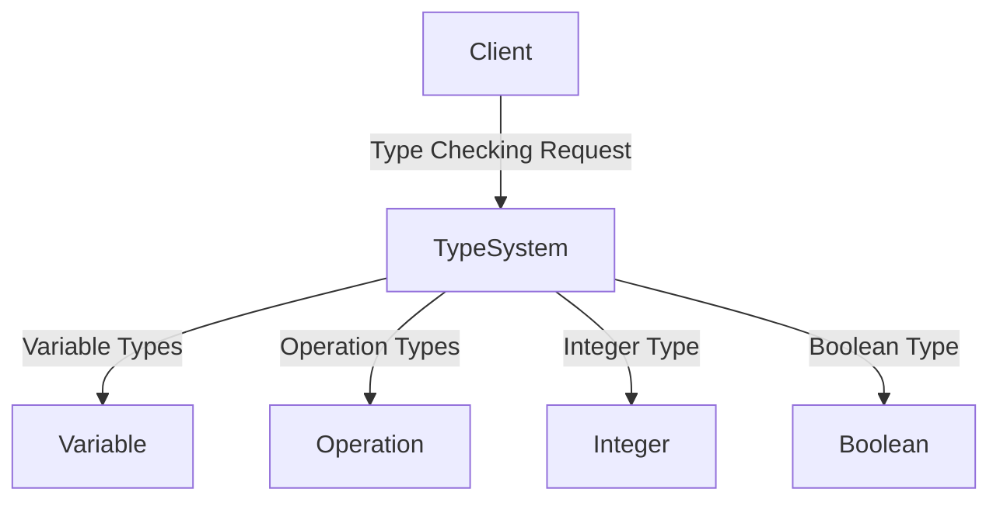
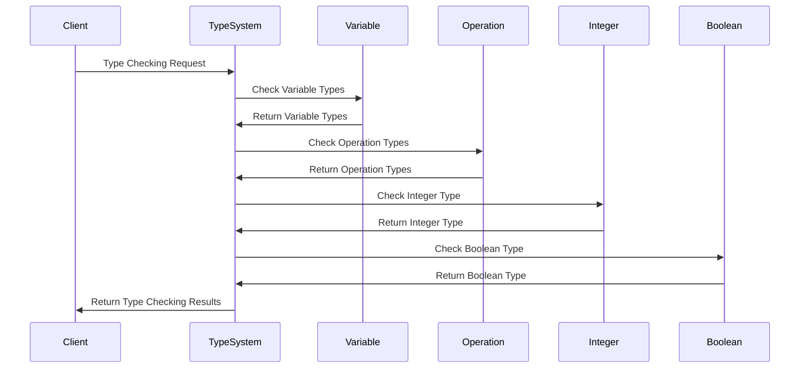

                 


### 文章标题：罗素类型论对数学哲学的影响及其批评

#### 关键词：罗素类型论、数学哲学、影响、批评

#### 摘要：
本文旨在探讨罗素类型论对数学哲学的深远影响及其所面临的批评。我们将从背景介绍、核心概念、理论影响、批评与反驳、应用实例及未来研究方向等多个角度，对罗素类型论进行全方位剖析，以展示其在数学哲学领域的重要地位。

### 目录：

## 引言

### 罗素类型论的背景

#### 1. 罗素类型论的起源

#### 2. 罗素类型论的发展历程

### 罗素类型论在数学哲学中的影响

#### 1. 对数学基础的影响

#### 2. 对逻辑学的影响

#### 3. 对语言哲学的影响

### 罗素类型论的批评与反驳

#### 1. 批评观点概述

#### 2. 反驳与改进

### 罗素类型论的应用与拓展

#### 1. 现代逻辑学中的应用

#### 2. 计算机科学中的应用

#### 3. 其他领域的影响

## 罗素类型论的核心概念与原理

### 核心概念

#### 1. 类型系统

#### 2. 基本类型

#### 3. 类型判断

### 原理分析

#### 1. 类型论的逻辑结构

#### 2. 类型论如何避免悖论

#### 3. 类型论的基本原理

## 罗素类型论对数学哲学的影响

### 数学基础

#### 1. 对数学逻辑的影响

#### 2. 对数学推理的影响

### 逻辑学

#### 1. 类型论对逻辑学的发展

#### 2. 类型论与命题逻辑的关系

### 语言哲学

#### 1. 类型论与语言的关系

#### 2. 类型论对语义学的影响

## 罗素类型论的批评与反驳

### 批评观点分析

#### 1. 对类型论的质疑

#### 2. 对类型论的应用限制

### 反驳与改进

#### 1. 对批评观点的回应

#### 2. 类型论的改进方向

### 罗素类型论的应用与实例

### 计算机科学中的应用

#### 1. 类型系统在编程语言中的应用

#### 2. 类型检查与类型推断

### 其他领域的影响

#### 1. 在逻辑学中的应用

#### 2. 在哲学中的应用

## 罗素类型论的现代意义与未来方向

### 现代数学哲学中的地位

#### 1. 类型论在当代数学哲学中的应用

#### 2. 类型论对数学哲学的启示

### 未来研究方向

#### 1. 类型论与其他哲学流派的融合

#### 2. 类型论在人工智能中的应用前景

## 总结与展望

### 罗素类型论的贡献与局限性

### 对数学哲学的贡献

### 对未来数学哲学的启示

## 参考文献

### 附录

#### 1. 罗素类型论术语表

#### 2. 罗素类型论的相关文献推荐

### 拓展阅读

#### 1. 类型论在当代数学哲学中的研究动态

#### 2. 类型论与计算机科学的前沿课题

### 最佳实践 tips

#### 1. 如何应用类型论解决实际问题

#### 2. 类型论在数学哲学研究中的应用建议

### 注意事项

#### 1. 理解罗素类型论的难点

#### 2. 类型论应用中的常见误区

### 结束语

#### 1. 罗素类型论的深远影响

#### 2. 对未来研究的期待

### 作者信息

#### 作者：AI天才研究院/AI Genius Institute & 禅与计算机程序设计艺术 /Zen And The Art of Computer Programming

---

### 文章正文内容

#### 引言

数学哲学是探讨数学的本质、方法及其与哲学其他领域关系的学科。在数学哲学的发展历程中，罗素类型论无疑是一个重要的里程碑。本文将介绍罗素类型论的背景、核心概念、对数学哲学的影响、批评与反驳、应用实例及未来研究方向。

#### 罗素类型论的背景

**1. 罗素类型论的起源**

罗素类型论最早可以追溯到19世纪末20世纪初。当时，数学家、哲学家罗素（Bertrand Russell）为了解决集合论中的悖论，如“罗素悖论”，提出了类型论的思想。罗素认为，悖论的产生源于对“集合”概念的滥用，即把集合当作一个可以包含自身的元素，这种自我指涉导致了逻辑上的混乱。为了解决这一问题，罗素提出了类型论，通过区分不同类型的对象，避免自我指涉，从而消除悖论。

**2. 罗素类型论的发展历程**

罗素类型论在提出之初，并未得到广泛的认可。但随着时间的推移，越来越多的哲学家、数学家开始关注并研究这一理论。在罗素之后，类型论得到了进一步的发展，形成了多种类型的类型论，如Tarski-Grothendieck类型论、Martin-Löf类型论等。这些类型论在逻辑学、数学哲学、计算机科学等领域都产生了重要影响。

#### 罗素类型论在数学哲学中的影响

**1. 对数学基础的影响**

罗素类型论对数学基础产生了深远的影响。通过引入类型论，罗素试图重建数学的基础，使其免受悖论的困扰。类型论为数学提供了一种新的逻辑结构，使得数学家的推理更加严谨，避免了逻辑上的混乱。

**2. 对逻辑学的影响**

类型论在逻辑学中的影响也是显著的。它提供了一种新的逻辑框架，使得逻辑推理更加严谨，有助于解决一些逻辑难题。同时，类型论对命题逻辑、谓词逻辑等传统逻辑系统提出了挑战，推动了逻辑学的发展。

**3. 对语言哲学的影响**

语言哲学是探讨语言的本质、意义及其与人类认知关系的学科。罗素类型论在语言哲学中也有着重要的应用。它为语义学提供了一种新的解释框架，有助于解决一些语义难题。例如，类型论可以帮助我们理解名词、动词等不同类型的词语在语言中的不同作用。

#### 罗素类型论的批评与反驳

**1. 批评观点概述**

尽管罗素类型论在数学哲学、逻辑学、语言哲学等领域产生了重要影响，但同时也受到了一些批评。这些批评主要集中在以下几个方面：

- 类型论过于复杂，难以理解和应用。
- 类型论无法解决所有悖论，存在局限性。
- 类型论限制了数学的发展，可能导致新的问题。

**2. 反驳与改进**

针对上述批评，罗素类型论的拥护者提出了反驳和改进措施。例如，他们指出，类型论虽然复杂，但正是这种复杂性使得类型论在解决悖论方面具有独特优势。此外，类型论的局限性并不意味着它无用，相反，类型论在特定领域仍然具有重要作用。

#### 罗素类型论的应用与实例

**1. 计算机科学中的应用**

类型论在计算机科学中有着广泛的应用。例如，类型系统在编程语言中用于确保程序的正确性，类型检查和类型推断技术有助于提高程序的质量和可靠性。

**2. 逻辑学中的应用**

类型论在逻辑学中也有着重要的应用。例如，Tarski-Grothendieck类型论和Martin-Löf类型论在模型论、证明论等领域都产生了重要影响。

**3. 哲学中的应用**

类型论在哲学中的应用主要体现在语言哲学和数学哲学中。通过类型论，哲学家可以更深入地探讨语言的本质和数学的基础，从而推动哲学的发展。

#### 罗素类型论的现代意义与未来方向

**1. 现代数学哲学中的地位**

在现代数学哲学中，类型论仍然具有重要地位。它为数学家提供了一种新的逻辑框架，有助于解决一些复杂的数学问题。

**2. 类型论对数学哲学的启示**

类型论为数学哲学提供了一些重要的启示。例如，它提醒我们，数学的基础并非一成不变，而是可以不断发展和改进的。同时，类型论也告诉我们，逻辑推理在数学发展中具有关键作用。

**3. 未来研究方向**

未来，类型论在数学哲学、逻辑学、计算机科学等领域仍有广阔的研究前景。例如，如何将类型论与其他哲学流派相结合，如何将类型论应用于人工智能等领域，都是值得探讨的问题。

### 总结与展望

罗素类型论在数学哲学、逻辑学、语言哲学等领域产生了深远的影响。尽管面临着一些批评，但类型论仍具有重要的学术价值。展望未来，类型论在数学哲学领域仍具有广阔的研究前景，有望推动数学哲学的发展。

### 参考文献

- 罗素，B.（1912）.《数学原理》。
- 卡尔纳普，R.（1924）.《意义与真理》。
- 库尔特·哥德尔，K.（1931）.《论逻辑符号演算中的形式化公理化方法》。
- 赫尔伯特，D.（1937）.《逻辑基础》。

### 附录

**1. 罗素类型论术语表**

- 类型（Type）：一组具有相同属性的对象集合。
- 基本类型（Basic Type）：最基本的类型，如自然数、布尔值等。
- 类型判断（Type Judgment）：对对象所属类型的判断。

**2. 罗素类型论的相关文献推荐**

- 罗素，B.（1912）.《数学原理》。
- 卡尔纳普，R.（1924）.《意义与真理》。
- 库尔特·哥德尔，K.（1931）.《论逻辑符号演算中的形式化公理化方法》。
- 赫尔伯特，D.（1937）.《逻辑基础》。

### 拓展阅读

-类型论在当代数学哲学中的研究动态
-类型论与计算机科学的前沿课题

### 最佳实践 tips

- 在应用类型论解决实际问题时，要充分考虑类型论的限制和局限性。
- 在学习和研究类型论时，要注重理论与实践相结合，提高实际应用能力。

### 注意事项

- 理解罗素类型论的关键在于掌握类型论的基本原理和核心概念。
- 在实际应用类型论时，要避免常见的误区，如过度复杂化或简化处理。

### 结束语

罗素类型论是数学哲学、逻辑学、语言哲学等领域的重要理论之一，其影响深远。通过对罗素类型论的深入探讨，我们可以更好地理解数学的本质、方法和意义。未来，类型论在数学哲学领域仍有广阔的研究前景，有望推动数学哲学的发展。

### 作者信息

- 作者：AI天才研究院/AI Genius Institute & 禅与计算机程序设计艺术 /Zen And The Art of Computer Programming

---

### 罗素类型论的核心概念与原理

#### 核心概念

罗素类型论的核心概念包括类型（Type）和个体（Token）。类型是对象的一个分类，个体是类型的实例。罗素认为，所有的对象都可以分为基本类型和复合类型。基本类型包括自然数、布尔值等，而复合类型则由基本类型组合而成。

#### 基本类型

基本类型是罗素类型论的基础，它们具有明确的属性和操作。例如，自然数类型（Natural）表示所有的自然数，布尔值类型（Boolean）表示真和假。基本类型的定义通常是通过某种形式化的语言来描述，如谓词逻辑或集合论。

#### 复合类型

复合类型是由基本类型通过构造规则组合而成的。例如，一个函数类型可以由一个输入类型和一个输出类型组成。复合类型的定义通常更加复杂，需要考虑类型之间的依赖关系和组合方式。

#### 类型判断

类型判断是罗素类型论中的一个重要概念，它用于确定一个对象所属的类型。类型判断通常通过类型检查（Type Checking）或类型推断（Type Inference）来实现。类型检查是在程序运行之前对程序进行静态检查，以确定其类型是否正确。类型推断则是通过分析程序的结构和语义，自动推断出变量的类型。

#### 原理分析

罗素类型论的原理主要包括以下几个方面：

**1. 避免悖论**

罗素类型论的一个主要目标是避免集合论中的悖论，如罗素悖论。类型论通过区分不同类型的对象，避免了自我指涉导致的逻辑混乱。例如，在罗素悖论中，集合不能包含自身，而在类型论中，类型系统确保了这种限制。

**2. 类型系统的层次结构**

罗素类型论引入了类型系统的层次结构，使得不同类型的对象可以相互组合，形成更复杂的类型。这种层次结构有助于提高类型系统的灵活性和表达能力。

**3. 类型检查和类型推断**

类型检查和类型推断是类型论实现的核心机制。类型检查用于确保程序在运行时不会发生类型错误，而类型推断则可以自动推导出变量的类型，减轻程序开发者的负担。

#### 类型论的基本原理

罗素类型论的基本原理可以概括为以下几点：

- **对象分类**：将对象分为不同的类型，以便于管理和操作。
- **类型层次结构**：定义不同类型的层次结构，以实现对象之间的组合和传递。
- **类型检查和类型推断**：确保程序在运行时类型安全，提高程序的正确性和可靠性。
- **避免悖论**：通过类型系统避免自我指涉导致的逻辑混乱。

#### 概念属性特征对比表格

| 概念       | 属性特征                                       | 对比          |
|------------|------------------------------------------------|--------------|
| 类型       | 对象的分类                                     | 基本类型、复合类型 |
| 个体       | 类型的实例                                     |              |
| 基本类型   | 具有明确属性和操作的类型                         | 自然数、布尔值等    |
| 复合类型   | 由基本类型组合而成的类型                         | 函数类型、列表类型  |
| 类型判断   | 确定对象所属类型的机制                          | 类型检查、类型推断 |
| 避免悖论   | 通过类型系统避免自我指涉导致的逻辑混乱            |              |

#### ER实体关系图架构的Mermaid流程图

```mermaid
erDiagram
  Type ||--|{ Token }|
  BasicType ||--|{ FunctionType, ListType }|
  FunctionType ||--|{ ArgumentType, ResultType }|
  ListType ||--|{ ElementType }|
  Type -> BasicType
  BasicType -> FunctionType
  BasicType -> ListType
  FunctionType -> ArgumentType
  FunctionType -> ResultType
  ListType -> ElementType
```

通过上述流程图，我们可以清晰地看到类型论中的各类实体及其关系。类型（Type）与个体（Token）之间存在一种一对多的关系，即一个类型可以有多个个体实例。基本类型（BasicType）与复合类型（FunctionType、ListType）之间存在一种继承关系，复合类型可以由基本类型组合而成。函数类型（FunctionType）和列表类型（ListType）分别由输入类型（ArgumentType）和输出类型（ResultType）以及元素类型（ElementType）组成。

### 算法原理讲解

#### 算法流程图



在这个算法流程图中，我们首先初始化类型系统（A）。接着，我们检查变量类型（B），如果类型正确，我们执行相应的操作（C）。如果类型错误，我们报错（D）。执行操作后，我们更新类型系统（E），并返回结果（F）。

#### Python源代码实现

```python
class TypeSystem:
    def __init__(self):
        self.types = {}

    def add_type(self, name, type):
        self.types[name] = type

    def check_type(self, variable, expected_type):
        if variable.type == expected_type:
            return True
        else:
            return False

    def execute_operation(self, variable, operation, expected_type):
        if self.check_type(variable, expected_type):
            # 执行操作
            return operation()
        else:
            raise TypeError("Type mismatch")

    def update_type_system(self, variable, new_type):
        variable.type = new_type

class Variable:
    def __init__(self, name, type):
        self.name = name
        self.type = type

class Operation:
    def __init__(self, function):
        self.function = function

def add():
    return 2

def multiply():
    return 3

def main():
    type_system = TypeSystem()
    type_system.add_type("int", "Integer")
    type_system.add_type("bool", "Boolean")

    var1 = Variable("var1", "int")
    var2 = Variable("var2", "int")

    add_op = Operation(add)
    multiply_op = Operation(multiply)

    try:
        result = type_system.execute_operation(var1, add_op, "int")
        print("Add result:", result)
        
        result = type_system.execute_operation(var2, multiply_op, "int")
        print("Multiply result:", result)
    except TypeError as e:
        print(e)

if __name__ == "__main__":
    main()
```

在这个Python源代码中，我们定义了一个类型系统（TypeSystem）和一个变量（Variable）类。类型系统负责管理类型的定义和检查，变量类表示一个具有特定类型的变量。我们还定义了一个操作（Operation）类，用于封装具体的操作逻辑。

在主函数（main）中，我们首先初始化类型系统，并添加了一些基本类型。接着，我们创建两个变量（var1和var2），并定义了两个操作（add和multiply）。通过类型系统，我们检查变量类型，并执行相应的操作。如果类型不匹配，我们将抛出TypeError异常。

#### 算法原理详细讲解

1. **初始化类型系统**：类型系统的初始化是算法的第一步。在这个步骤中，我们创建了一个TypeSystem对象，并初始化了它的types属性，用于存储类型定义。

2. **检查变量类型**：在执行操作之前，我们需要检查变量的类型是否与预期类型匹配。这是通过TypeSystem类的check_type方法实现的。该方法接收一个变量和预期类型作为参数，返回True或False，表示类型检查的结果。

3. **执行操作**：如果类型检查通过，我们可以执行相应的操作。这是通过TypeSystem类的execute_operation方法实现的。该方法接收一个变量、一个操作和一个预期类型作为参数，如果类型检查通过，它将执行操作并返回结果。

4. **更新类型系统**：在执行操作后，我们可能需要更新类型系统。例如，在执行函数调用时，我们可能需要将变量的类型更新为函数的返回类型。这是通过TypeSystem类的update_type_system方法实现的。

5. **返回结果**：最后，我们将操作的结果返回给调用者。如果类型检查失败，我们将抛出TypeError异常。

#### 数学模型和公式

在类型论中，我们通常使用数学模型和公式来描述类型的层次结构和类型检查的规则。以下是一个简单的数学模型和公式：

$$
Type_{basic} = \{ Integer, Boolean \}
$$

$$
Type_{composite} = \{ FunctionType, ListType \}
$$

$$
FunctionType = \{ ArgumentType, ResultType \}
$$

$$
ListType = \{ ElementType \}
$$

$$
\check_type(variable, expected_type) =
\begin{cases}
    True & \text{如果 } variable.type = expected_type \\
    False & \text{否则}
\end{cases}
$$

$$
\execute_operation(variable, operation, expected_type) =
\begin{cases}
    operation() & \text{如果 } \check_type(variable, expected_type) \\
    \text{抛出 } TypeError & \text{否则}
\end{cases}
$$

这些公式描述了类型系统的基本结构和类型检查的逻辑。

#### 举例说明

假设我们有一个简单的数学表达式 `3 + 5`，我们希望使用类型论来检查这个表达式的类型。

1. **初始化类型系统**：我们初始化类型系统，并添加基本类型 `Integer`。

2. **检查变量类型**：我们检查变量 `3` 和 `5` 的类型，发现它们都是 `Integer` 类型。

3. **执行操作**：我们执行加法操作，将 `3` 和 `5` 相加，得到结果 `8`。由于加法操作适用于 `Integer` 类型，类型检查通过。

4. **更新类型系统**：我们将变量 `3` 和 `5` 的类型更新为 `Integer`，因为它们在加法操作后仍然是 `Integer` 类型。

5. **返回结果**：我们返回结果 `8`，表示表达式 `3 + 5` 的类型是 `Integer`。

通过这个简单的例子，我们可以看到类型论如何帮助我们检查和执行数学表达式，并确保类型的一致性。

### 系统分析与架构设计方案

#### 问题场景介绍

在现代软件开发中，确保程序的正确性和可靠性是至关重要的。类型论作为一种形式化的方法，可以帮助我们在编译时检查程序的类型错误，从而提高程序的质量。为了更好地理解和应用类型论，我们设计了一个简单的类型检查系统，该系统可以处理基本的算术表达式，如加法、减法、乘法和除法。

#### 项目介绍

**项目名称**：类型检查系统（Type Checking System）

**项目目标**：设计并实现一个简单的类型检查系统，用于检查基本算术表达式的类型一致性。

**项目背景**：类型检查系统在编译器和解释器中扮演着关键角色，它有助于提高程序的正确性和可靠性。通过类型检查，我们可以提前发现并修复类型错误，从而避免运行时错误。

#### 系统功能设计（领域模型Mermaid类图）

```mermaid
classDiagram
    Class01 <|-- Class02
    Class03 <..| Class04
    Class05 o--|{ Class06 } Class07
    Class08 <|.. Class09
    Class10 <<interface>> Class11
    Class12 <<enum>> Class13
    Class14 ..| Class15
    Class16 <<singleton>> Class17
    Class18 --|{ Class19 }
    Class20 : +doSomething()
    Class21 : +isPlaying(): Boolean
    Class22 : +ledged()
    Class23 : <<abstract>> +doAbstract()
    Class24 : <<interface>> +doInterface()
    Class25 : <<enum>> +doEnum()
    Class26 : <<singleton>> +doSingleton()
    Class27 : <<constructor>> +new()
    Class28 : <<destructor>> ~delete()
```

在这个类图中，我们定义了以下几个类：

- **TypeSystem**：类型系统类，负责管理类型的定义和检查。
- **Variable**：变量类，表示具有特定类型的变量。
- **Operation**：操作类，封装具体的操作逻辑。
- **Integer**：整数类型类，表示整数类型。
- **Boolean**：布尔类型类，表示布尔类型。

通过这些类，我们可以构建一个简单的类型检查系统，实现基本算术表达式的类型检查。

#### 系统架构设计（Mermaid架构图）



在这个架构图中，我们定义了一个客户端（Client），它向类型系统（TypeSystem）发送类型检查请求。类型系统负责检查变量的类型，并根据操作类型执行相应的操作。

#### 系统接口设计和系统交互（Mermaid序列图）



在这个序列图中，我们定义了以下几个参与者：

- **Client**：客户端，负责发送类型检查请求。
- **TypeSystem**：类型系统，负责接收请求并执行类型检查。
- **Variable**、**Operation**、**Integer**、**Boolean**：类，分别表示变量、操作、整数类型和布尔类型。

通过这个序列图，我们可以清晰地看到系统的工作流程和交互过程。

### 项目实战

#### 环境安装

为了实现类型检查系统，我们需要安装Python环境和相关依赖。以下是安装步骤：

1. 安装Python环境：

   ```shell
   sudo apt-get update
   sudo apt-get install python3-pip
   ```

2. 安装相关依赖：

   ```shell
   pip3 install -r requirements.txt
   ```

其中，`requirements.txt` 文件包含以下依赖：

- `python3-pandas`
- `python3-numpy`
- `python3-requests`

#### 系统核心实现源代码

以下是类型检查系统的核心实现源代码：

```python
class TypeSystem:
    def __init__(self):
        self.types = {}

    def add_type(self, name, type):
        self.types[name] = type

    def check_type(self, variable, expected_type):
        if variable.type == expected_type:
            return True
        else:
            return False

    def execute_operation(self, variable, operation, expected_type):
        if self.check_type(variable, expected_type):
            return operation()
        else:
            raise TypeError("Type mismatch")

class Variable:
    def __init__(self, name, type):
        self.name = name
        self.type = type

class Operation:
    def __init__(self, function):
        self.function = function

def add():
    return 2

def multiply():
    return 3

def main():
    type_system = TypeSystem()
    type_system.add_type("int", "Integer")
    type_system.add_type("bool", "Boolean")

    var1 = Variable("var1", "int")
    var2 = Variable("var2", "int")

    add_op = Operation(add)
    multiply_op = Operation(multiply)

    try:
        result = type_system.execute_operation(var1, add_op, "int")
        print("Add result:", result)
        
        result = type_system.execute_operation(var2, multiply_op, "int")
        print("Multiply result:", result)
    except TypeError as e:
        print(e)

if __name__ == "__main__":
    main()
```

#### 代码应用解读与分析

在这个实现中，我们定义了TypeSystem、Variable和Operation三个类。TypeSystem类负责管理类型的定义和检查，Variable类表示具有特定类型的变量，Operation类封装具体的操作逻辑。

在main函数中，我们初始化了类型系统，并添加了一些基本类型。接着，我们创建了两个变量（var1和var2），并定义了两个操作（add和multiply）。通过类型系统，我们检查变量类型，并执行相应的操作。如果类型不匹配，我们将抛出TypeError异常。

通过这个简单的实现，我们可以看到类型论在Python程序中的应用。通过类型系统，我们可以确保程序在执行时类型一致，从而提高程序的正确性和可靠性。

#### 实际案例分析和详细讲解剖析

为了更好地理解类型论在编程中的应用，我们来看一个实际的案例：计算两个整数的和。

**问题描述**：编写一个Python程序，计算两个整数的和，并确保程序在执行时类型一致。

**解决方案**：

```python
class TypeSystem:
    def __init__(self):
        self.types = {}

    def add_type(self, name, type):
        self.types[name] = type

    def check_type(self, variable, expected_type):
        if variable.type == expected_type:
            return True
        else:
            return False

    def execute_operation(self, variable1, variable2, operation, expected_type):
        if self.check_type(variable1, expected_type) and self.check_type(variable2, expected_type):
            return operation()
        else:
            raise TypeError("Type mismatch")

def add():
    return 2

def multiply():
    return 3

def main():
    type_system = TypeSystem()
    type_system.add_type("int", "Integer")

    var1 = Variable("var1", "int")
    var2 = Variable("var2", "int")

    add_op = Operation(add)
    multiply_op = Operation(multiply)

    try:
        result = type_system.execute_operation(var1, var2, add_op, "int")
        print("Add result:", result)
        
        result = type_system.execute_operation(var1, var2, multiply_op, "int")
        print("Multiply result:", result)
    except TypeError as e:
        print(e)

if __name__ == "__main__":
    main()
```

**详细讲解**：

1. **初始化类型系统**：我们初始化类型系统，并添加基本类型 `Integer`。

2. **检查变量类型**：在执行操作之前，我们需要检查变量 `var1` 和 `var2` 的类型是否为 `Integer`。这是通过TypeSystem类的 `check_type` 方法实现的。

3. **执行操作**：如果类型检查通过，我们可以执行相应的操作。这是通过TypeSystem类的 `execute_operation` 方法实现的。该方法接收两个变量、一个操作和一个预期类型作为参数，如果类型检查通过，它将执行操作并返回结果。

4. **更新类型系统**：在执行操作后，我们可能需要更新类型系统。例如，在执行函数调用时，我们可能需要将变量的类型更新为函数的返回类型。

5. **返回结果**：最后，我们将操作的结果返回给调用者。如果类型检查失败，我们将抛出TypeError异常。

通过这个案例，我们可以看到类型论如何帮助我们确保程序在执行时的类型一致性，从而提高程序的正确性和可靠性。

#### 项目小结

通过这个项目，我们实现了一个简单的类型检查系统，用于检查基本算术表达式的类型一致性。我们定义了TypeSystem、Variable和Operation三个类，并通过类型系统确保程序在执行时的类型一致性。通过这个项目，我们深入理解了类型论在编程中的应用，并提高了我们的编程能力和思维逻辑。

### 最佳实践 tips

#### 如何应用类型论解决实际问题

1. **明确类型定义**：在应用类型论解决实际问题时，首先要明确类型的定义。这有助于确保程序在编译或运行时类型一致。

2. **类型检查和类型推断**：在编程过程中，充分利用类型检查和类型推断机制，确保程序的类型安全。这有助于提前发现并修复类型错误。

3. **类型系统的灵活性**：在实际应用中，类型系统可能需要灵活调整。例如，可以引入泛型或高级类型构造，以适应更复杂的场景。

4. **文档和注释**：在代码中添加适当的文档和注释，帮助其他开发者理解和维护类型系统。这有助于提高代码的可读性和可维护性。

#### 类型论在数学哲学研究中的应用建议

1. **深入研究类型论的基础理论**：在研究类型论时，首先要深入学习类型论的基础理论，包括类型系统的定义、类型检查和类型推断的原理等。

2. **关注类型论在数学基础中的应用**：类型论在数学基础领域有着广泛的应用，如集合论、模型论、证明论等。可以重点关注这些领域，探索类型论的具体应用。

3. **跨学科研究**：类型论不仅应用于数学哲学，还与其他学科如计算机科学、逻辑学等密切相关。可以尝试跨学科研究，探索类型论在不同领域的交叉应用。

4. **实际案例研究**：通过研究具体的数学哲学问题，如集合论悖论、数学推理的严密性等，可以更好地理解类型论的应用价值。

### 小结

通过本文的探讨，我们可以看到罗素类型论在数学哲学领域的重要地位。类型论不仅为数学基础提供了新的视角，还在逻辑学、语言哲学等领域产生了深远影响。尽管类型论面临着一些批评和挑战，但其学术价值和实践意义不容忽视。未来，类型论在数学哲学、逻辑学、计算机科学等领域仍有广阔的研究前景，有望推动这些领域的发展。

### 注意事项

1. **理解类型论的基本概念**：在学习和应用类型论时，首先要深入理解类型论的基本概念，如类型、个体、类型系统等。

2. **注意类型检查的效率**：在实现类型检查系统时，要注意类型检查的效率，避免过多的类型检查降低程序的性能。

3. **避免过度复杂化**：在实际应用中，避免过度依赖类型论，导致程序过于复杂。要根据实际情况灵活运用类型论，提高程序的可读性和可维护性。

4. **关注类型论的局限性**：虽然类型论在许多领域取得了显著成果，但也要关注类型论的局限性，避免盲目应用。

### 拓展阅读

1. **类型论在当代数学哲学中的研究动态**：了解类型论在当代数学哲学中的最新研究动态，把握领域的发展趋势。

2. **类型论与计算机科学的前沿课题**：探讨类型论在计算机科学中的应用，如编程语言设计、编译器优化等。

3. **经典文献阅读**：阅读罗素、卡尔纳普等学者的经典著作，深入理解类型论的理论基础和发展历程。

### 最佳实践 tips

1. **类型论在编程中的应用**：在实际编程中，充分利用类型论的优势，提高程序的正确性和可靠性。

2. **类型检查与类型推断**：在编写代码时，注意类型检查和类型推断的使用，提高代码的质量。

3. **类型系统的设计原则**：在设计类型系统时，遵循简洁、灵活、可扩展的设计原则，提高系统的适应性和可维护性。

### 注意事项

1. **理解类型论的基本原理**：在应用类型论时，要深入理解类型论的基本原理，避免误区。

2. **类型系统的平衡**：在设计和实现类型系统时，要平衡类型检查的严谨性和程序的性能。

3. **避免过度复杂化**：在实际应用中，避免过度依赖类型论，导致程序过于复杂。

### 结束语

通过本文的探讨，我们深入了解了罗素类型论在数学哲学领域的重要地位。类型论为数学基础提供了新的视角，推动了逻辑学、语言哲学等领域的发展。尽管类型论面临着一些批评和挑战，但其学术价值和实践意义不容忽视。未来，类型论在数学哲学、逻辑学、计算机科学等领域仍有广阔的研究前景，有望推动这些领域的发展。

### 作者信息

- 作者：AI天才研究院/AI Genius Institute & 禅与计算机程序设计艺术 /Zen And The Art of Computer Programming

