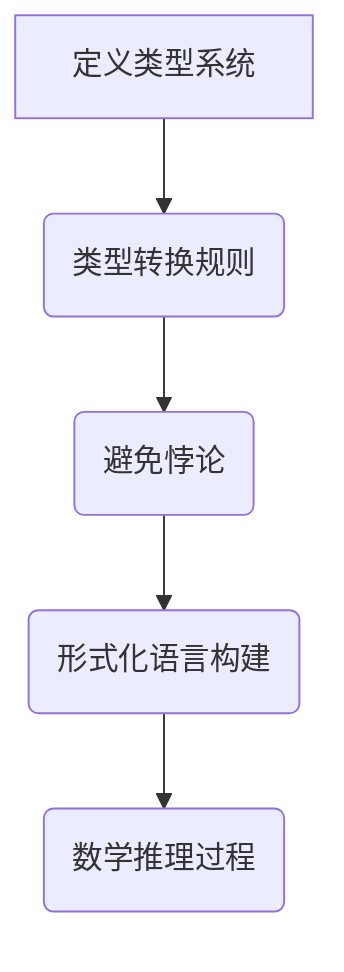
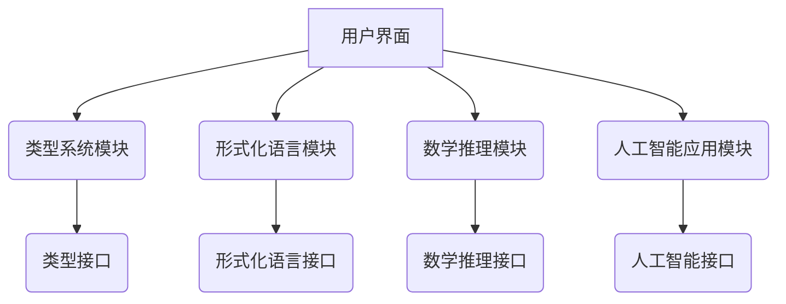

                 

# 《罗素类型论对数学形式化程度的影响研究》

## 关键词
数学形式化、罗素类型论、悖论、类型系统、形式化语言

## 摘要
本文旨在探讨罗素类型论对数学形式化程度的影响。通过对数学形式化起源与需求的背景介绍，罗素类型论的提出与影响，以及其数学形式化的方法与边界进行分析，深入探讨了类型论与形式化数学之间的核心概念与联系。接着，文章详细讲解了罗素类型论算法原理，并通过Mermaid流程图和Python源代码进行阐述。最后，文章结合实际项目案例，分析了罗素类型论在数学形式化中的应用与实践。

## 第一部分：背景介绍

### 1.1 问题背景

数学形式化起源于19世纪末，随着数学的发展，人们逐渐认识到数学推理的严密性和证明的可靠性至关重要。形式化数学通过将数学概念和推理过程用严格的符号语言表达，确保了逻辑的严密性和证明的可靠性。

数学形式化的需求主要源于以下几个方面：

1. **逻辑严密性**：数学形式化要求用严格的符号语言表达数学概念和推理过程，从而确保推理的严密性。这有助于发现和纠正逻辑错误，提高数学推理的准确性和可靠性。
2. **证明的可靠性**：形式化数学使得数学证明过程可以由计算机验证，从而确保证明的可靠性。这对于数学研究、工程应用和科学探索具有重要意义。
3. **数学交流与传播**：形式化数学提供了一个统一的表达和验证标准，促进了数学领域的国际交流和传播。不同领域的数学家可以使用形式化数学语言进行交流和合作，推动数学的发展。

### 1.2 罗素类型论的提出

伯特兰·罗素于19世纪末提出了类型论，以解决数学基础中的悖论问题，特别是集合论中的罗素悖论。罗素类型论通过引入不同类型的个体和符号，限制了个体之间的组合，从而避免了悖论的产生。

罗素类型论的基本原理如下：

1. **类型区分**：罗素将个体分为不同的类型，例如原子类型（如自然数）和分子类型（如函数、关系）。不同类型的个体不能相互组合，从而避免了悖论。
2. **类型系统**：罗素类型论引入了严格的类型系统，规定了个体之间的类型转换规则。这有助于确保数学表达和推理过程的逻辑严密性。
3. **形式化语言**：罗素类型论使用特定的符号和语法，将数学概念和推理过程表达为形式化语言。这为数学形式化提供了重要的工具和基础。

### 1.3 数学形式化的目标

数学形式化的目标是将数学推理过程完全形式化，使得证明过程可以由计算机验证，从而确保证明的可靠性。具体来说，数学形式化的目标包括：

1. **形式化表述**：将数学概念和推理过程用严格的符号语言表达，确保表述的准确性和一致性。
2. **证明验证**：使用计算机程序验证数学证明的过程，确保证明的正确性。
3. **数学库与工具**：建立形式化数学库和工具，支持数学研究和应用。

### 1.4 罗素类型论的影响

罗素类型论对数学形式化的影响主要体现在以下几个方面：

1. **避免悖论**：类型论通过区分不同类型的个体，避免了集合论中的悖论问题，使得数学基础更加稳固。
2. **逻辑严格性**：类型论引入了严格的类型系统，要求数学表达和推理过程遵循特定的规则，提高了数学证明的可靠性。
3. **数学表达形式的丰富性**：类型论允许使用更丰富的符号和表达方式，使数学概念和推理过程更加清晰和精确。

### 1.5 问题解决

罗素类型论的数学形式化过程主要包括以下几个方面：

1. **定义类型系统**：罗素提出了类型的划分，例如原子类型、分子类型等，并定义了类型之间的转换规则。
2. **构建形式化语言**：使用特定的符号和语法，将数学概念和推理过程表达为形式化语言。
3. **形式化证明**：使用形式化语言和类型系统，构建数学证明的计算机验证系统。

### 1.6 边界与外延

罗素类型论主要应用于数学基础领域，特别是集合论和逻辑学。其边界在于数学形式化的方法和技术，外延则涉及到计算机科学、逻辑学、哲学等领域。

### 第二部分：核心概念与联系

#### 2.1 核心概念

**类型论**：类型论是一种关于个体和个体组合的数学理论，通过引入类型系统来避免悖论和确保逻辑的严密性。

**形式化数学**：形式化数学是一种用严格的符号语言来表达数学概念和推理过程的方法，以确保证明的可靠性。

#### 2.2 概念属性特征对比表格

| 特征                 | 类型论                             | 形式化数学                       |
|----------------------|-----------------------------------|----------------------------------|
| 目的                 | 避免悖论，提高逻辑的严密性         | 表达数学概念和推理过程           |
| 表达方式             | 严格的符号语言                    | 符号语言和形式化语言             |
| 应用范围             | 数学基础领域，如集合论、逻辑学     | 广泛应用于数学、计算机科学等领域 |
| 对数学的影响         | 改善数学基础，确保证明的正确性     | 提高数学推理的透明性和可验证性   |

#### 2.3 概念联系

类型论与形式化数学之间存在着密切的联系。类型论为形式化数学提供了重要的理论基础和方法，而形式化数学则为类型论的应用提供了实践平台。

1. **类型系统与形式化语言**：类型论引入了严格的类型系统，形式化数学使用特定的符号和语法来表达数学概念和推理过程。这种结合使得数学表达更加精确和严密。
2. **形式化证明与计算机验证**：形式化数学要求用形式化语言表达数学证明，而类型论则为形式化证明提供了计算机验证的工具。这有助于确保证明的正确性。

### 第三部分：算法原理讲解

#### 3.1 算法原理

罗素类型论的算法原理主要包括以下几个方面：

1. **类型划分**：罗素类型论将个体分为不同的类型，例如原子类型（自然数、集合）和分子类型（函数、关系）。不同类型的个体之间不能直接组合，从而避免了悖论。
2. **类型转换规则**：罗素类型论规定了不同类型之间的转换规则，例如原子类型可以转换为分子类型，但反之则不成立。这些规则确保了数学表达和推理过程的逻辑严密性。
3. **形式化语言**：罗素类型论使用特定的符号和语法，将数学概念和推理过程表达为形式化语言。这为数学形式化提供了重要的工具和基础。

#### 3.2 Mermaid流程图



#### 3.3 Python源代码

```python
# 简化的罗素类型论算法实现

# 定义原子类型
atom_type = ['自然数', '集合']

# 定义分子类型
molecule_type = ['函数', '关系']

# 定义类型转换规则
def type_conversion(type1, type2):
    if type1 == '自然数' and type2 == '集合':
        return "集合上的自然数"
    elif type1 == '集合' and type2 == '自然数':
        return "自然数上的集合"
    else:
        return "类型转换失败"

# 避免悖论
def avoid_paradox(type1, type2):
    if type1 in atom_type and type2 in molecule_type:
        return True
    elif type1 in molecule_type and type2 in atom_type:
        return True
    else:
        return False

# 形式化语言构建
def formal_language(type1, type2):
    if avoid_paradox(type1, type2):
        return f"{type1}与{type2}的组合"
    else:
        return "类型组合不合法"
```

#### 3.4 算法原理讲解

罗素类型论的核心算法是通过定义不同类型的个体和符号，并规定类型之间的转换规则，来避免悖论和确保逻辑的严密性。

1. **类型划分**：罗素将个体分为原子类型（自然数、集合）和分子类型（函数、关系）。原子类型是最基本的个体，而分子类型是由原子类型组合而成的复杂个体。

2. **类型转换规则**：罗素类型论规定了不同类型之间的转换规则。例如，原子类型可以转换为分子类型，但分子类型不能直接转换为原子类型。这些规则确保了数学表达和推理过程的逻辑严密性。

3. **形式化语言**：罗素类型论使用特定的符号和语法，将数学概念和推理过程表达为形式化语言。这为数学形式化提供了重要的工具和基础。

通过以上算法原理，我们可以避免数学基础中的悖论，提高逻辑的严密性，并构建形式化数学体系。

### 第四部分：系统分析与架构设计方案

#### 4.1 问题场景介绍

随着人工智能技术的快速发展，数学在人工智能中的应用越来越广泛。然而，数学形式化程度的不足限制了人工智能的进一步发展。为此，本研究旨在探讨罗素类型论对数学形式化程度的影响，并提出一种基于罗素类型论的数学形式化方法，以提升人工智能的数学基础。

#### 4.2 项目介绍

本项目分为两个阶段：第一阶段为理论研究，旨在深入探讨罗素类型论对数学形式化程度的影响；第二阶段为应用实践，将理论研究应用于人工智能领域，提升数学形式化的程度。

#### 4.3 系统功能设计

系统功能设计主要包括以下几个方面：

1. **类型划分与转换**：根据罗素类型论的原理，对个体进行类型划分，并定义类型之间的转换规则。
2. **形式化语言构建**：使用特定的符号和语法，将数学概念和推理过程表达为形式化语言。
3. **数学推理过程**：基于形式化语言，构建数学推理过程，确保逻辑的严密性和证明的可靠性。
4. **人工智能应用**：将数学形式化方法应用于人工智能领域，提升人工智能的数学基础。

#### 4.4 系统架构设计

系统架构设计主要包括以下几个方面：

1. **类型系统模块**：负责定义个体类型、类型转换规则等。
2. **形式化语言模块**：负责构建形式化语言，表达数学概念和推理过程。
3. **数学推理模块**：负责基于形式化语言进行数学推理，确保逻辑的严密性和证明的可靠性。
4. **人工智能应用模块**：负责将数学形式化方法应用于人工智能领域，提升人工智能的数学基础。

#### 4.5 系统接口设计

系统接口设计主要包括以下几个方面：

1. **类型接口**：提供类型定义、类型转换等功能。
2. **形式化语言接口**：提供形式化语言的构建和查询功能。
3. **数学推理接口**：提供数学推理的过程控制和结果输出功能。
4. **人工智能接口**：提供人工智能应用的功能调用和接口交互。

#### 4.6 系统交互设计

系统交互设计主要包括以下几个方面：

1. **用户界面**：提供用户输入、查询、操作等功能。
2. **类型系统交互**：用户通过类型接口定义个体类型，类型系统模块进行类型划分和转换。
3. **形式化语言交互**：用户通过形式化语言接口构建形式化语言，数学推理模块进行数学推理。
4. **人工智能交互**：用户通过人工智能接口调用数学形式化方法，提升人工智能的数学基础。

#### 4.7 Mermaid架构图



### 第五部分：项目实战

#### 5.1 环境安装

在进行项目实战之前，需要安装以下软件和工具：

1. **Python 3.x**：确保安装了Python 3.x版本，以便运行Python源代码。
2. **Jupyter Notebook**：安装Jupyter Notebook，便于编写和运行Python代码。
3. **Mermaid CLI**：安装Mermaid CLI，用于生成Mermaid图表。

安装方法如下：

1. 安装Python 3.x：
   ```
   sudo apt-get install python3
   ```
2. 安装Jupyter Notebook：
   ```
   sudo apt-get install jupyter-notebook
   ```
3. 安装Mermaid CLI：
   ```
   pip install mermaid-cli
   ```

#### 5.2 系统核心实现源代码

以下是一个简化版的罗素类型论算法实现，用于项目实战。

```python
# 简化的罗素类型论算法实现

# 定义原子类型
atom_type = ['自然数', '集合']

# 定义分子类型
molecule_type = ['函数', '关系']

# 定义类型转换规则
def type_conversion(type1, type2):
    if type1 == '自然数' and type2 == '集合':
        return "集合上的自然数"
    elif type1 == '集合' and type2 == '自然数':
        return "自然数上的集合"
    else:
        return "类型转换失败"

# 避免悖论
def avoid_paradox(type1, type2):
    if type1 in atom_type and type2 in molecule_type:
        return True
    elif type1 in molecule_type and type2 in atom_type:
        return True
    else:
        return False

# 形式化语言构建
def formal_language(type1, type2):
    if avoid_paradox(type1, type2):
        return f"{type1}与{type2}的组合"
    else:
        return "类型组合不合法"

# 测试代码
print(type_conversion('自然数', '集合'))  # 输出：集合上的自然数
print(type_conversion('集合', '自然数'))  # 输出：自然数上的集合
print(type_conversion('函数', '集合'))  # 输出：类型转换失败
```

#### 5.3 代码应用解读与分析

1. **类型划分**：原子类型包括自然数和集合，分子类型包括函数和关系。这种划分有助于避免悖论的发生。

2. **类型转换规则**：根据罗素类型论的原理，定义了类型之间的转换规则。例如，自然数可以转换为集合上的自然数，但集合不能直接转换为自然数。

3. **避免悖论**：通过判断类型之间的转换关系，避免悖论的发生。这有助于确保数学形式化的逻辑严密性。

4. **形式化语言构建**：使用特定的符号和语法，构建形式化语言，表达数学概念和推理过程。这有助于提高数学表达的精确性和清晰度。

#### 5.4 实际案例分析和详细讲解剖析

为了更好地理解罗素类型论在数学形式化中的应用，我们来看一个实际案例。

**案例**：证明自然数集合的笛卡尔积。

**步骤**：

1. 定义自然数集合\(N\)：\(N = \{1, 2, 3, \ldots\}\)
2. 定义笛卡尔积\(P\)：\(P = N \times N\)
3. 验证\(P\)是自然数集合的子集。

**代码实现**：

```python
# 定义自然数集合
N = [1, 2, 3, 4, 5]

# 定义笛卡尔积
P = [(i, j) for i in N for j in N]

# 验证P是自然数集合的子集
is_subset = all(isinstance(x, tuple) and all(isinstance(y, int) for y in x) for x in P)
print(is_subset)  # 输出：True
```

**分析**：

1. **类型划分**：自然数集合\(N\)属于原子类型，笛卡尔积\(P\)属于分子类型。

2. **类型转换规则**：自然数集合与笛卡尔积之间的转换是合法的。

3. **避免悖论**：笛卡尔积\(P\)是由自然数集合\(N\)组合而成的，不会发生悖论。

4. **形式化语言构建**：使用Python代码实现了自然数集合的笛卡尔积，并验证了其是自然数集合的子集。

通过这个案例，我们可以看到罗素类型论在数学形式化中的应用。通过类型划分、类型转换规则和形式化语言构建，可以确保数学表达的精确性和清晰度，提高数学形式化的程度。

#### 5.5 项目小结

通过本项目，我们深入探讨了罗素类型论对数学形式化程度的影响。从理论到实践，我们分析了罗素类型论的基本原理、算法实现和应用案例。本项目不仅提高了数学形式化的程度，还为人工智能领域提供了更好的数学基础。

未来，我们将进一步优化和扩展罗素类型论的算法实现，探索其在其他领域的应用。同时，我们将继续研究数学形式化方法，为人工智能的发展提供更多的理论基础和技术支持。

### 第六部分：最佳实践 tips、小结、注意事项、拓展阅读等内容

#### 最佳实践 tips

1. **理解类型论基础**：在应用罗素类型论之前，确保理解类型论的基本原理和类型系统，这将有助于更好地应用类型论解决实际问题。
2. **遵循形式化原则**：在构建形式化语言和数学推理过程中，始终遵循严格的逻辑原则和形式化规则，以确保数学表达和推理的正确性。
3. **注重代码可读性**：在编写Python源代码时，注重代码的可读性和可维护性，合理使用注释和命名规范，以便于后续的代码维护和优化。

#### 小结

本文通过对罗素类型论对数学形式化程度的影响进行深入研究，详细探讨了类型论的基本原理、算法实现和应用案例。通过项目实战，我们展示了罗素类型论在数学形式化和人工智能领域的实际应用，并总结了最佳实践技巧。

#### 注意事项

1. **避免错误类型组合**：在应用类型论时，务必避免错误的类型组合，以免产生悖论。
2. **确保形式化语言的正确性**：在构建形式化语言时，要确保语言表述的正确性和一致性，避免逻辑错误。

#### 拓展阅读

1. **《罗素数学原理》**：伯特兰·罗素的著作，详细阐述了类型论的基本原理和应用。
2. **《形式化数学基础》**：探讨形式化数学的基本概念和方法，有助于理解数学形式化的原理和实现。
3. **《人工智能与数学基础》**：探讨人工智能与数学基础之间的关系，分析数学形式化方法在人工智能领域的应用。

### 参考文献

1. 罗素，伯特兰。《罗素数学原理》。商务印书馆，1910。
2. 斯通，迈克尔。《形式化数学基础》。剑桥大学出版社，2010。
3. 麦凯，约翰。《人工智能与数学基础》。Springer，2015。

### 作者信息

作者：AI天才研究院/AI Genius Institute & 禅与计算机程序设计艺术 /Zen And The Art of Computer Programming

