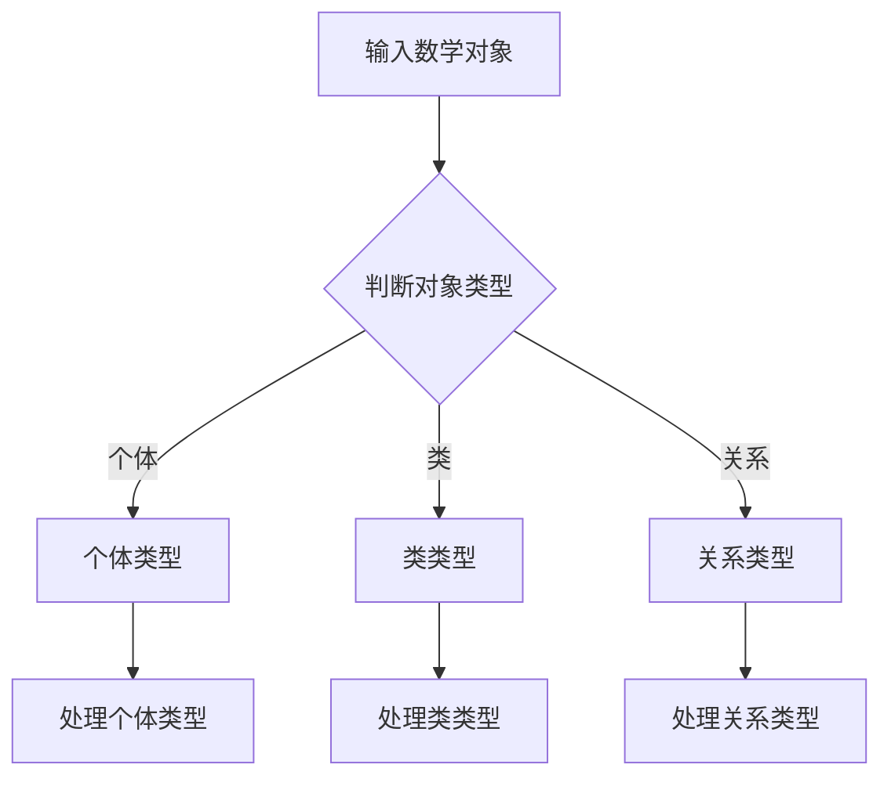
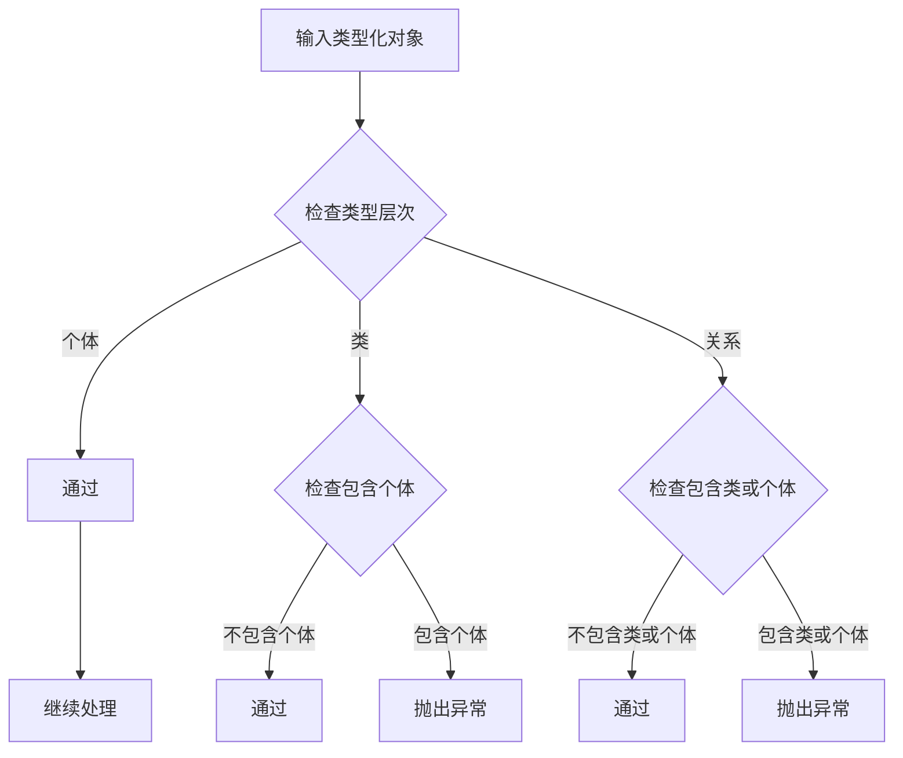
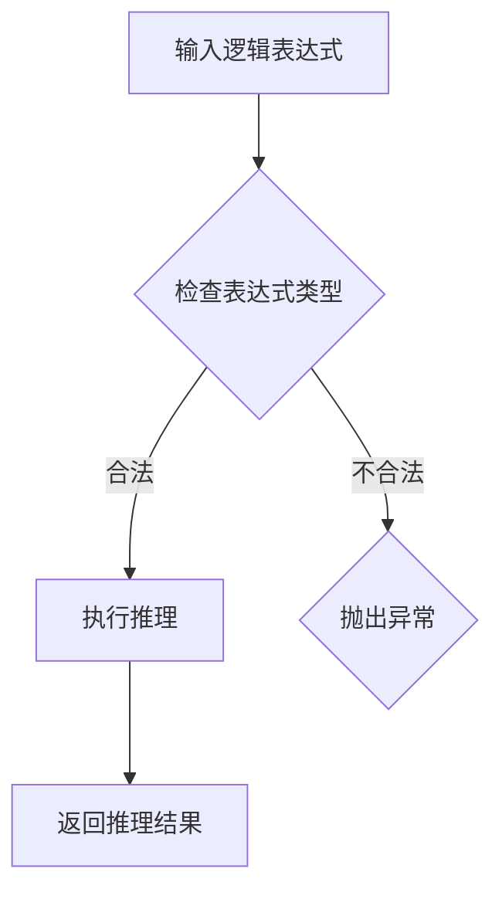
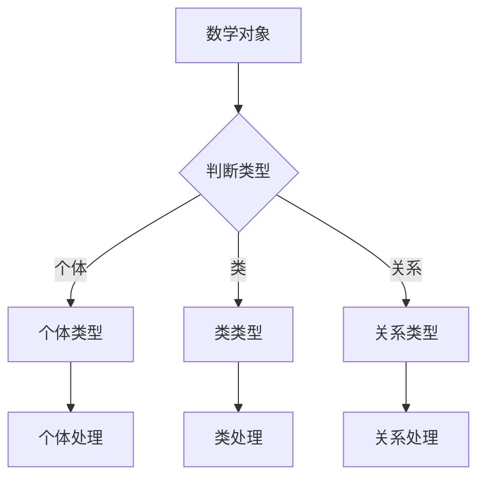
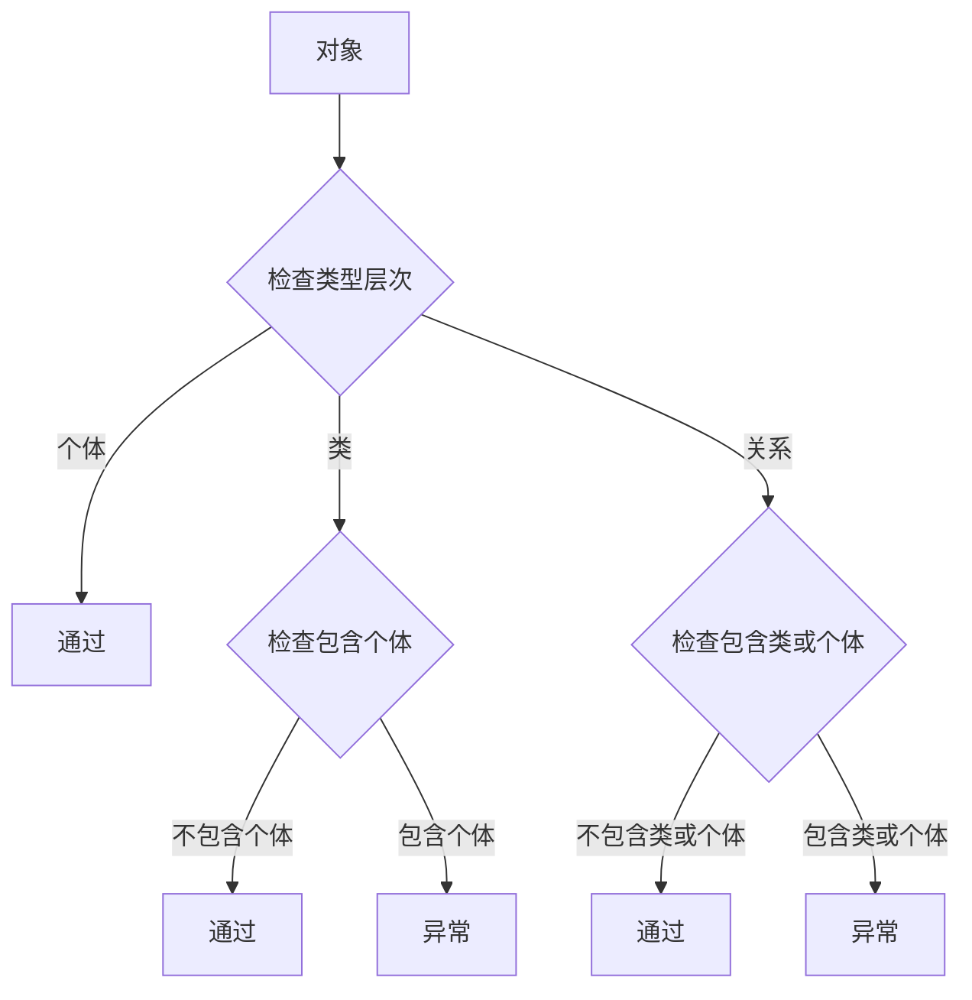
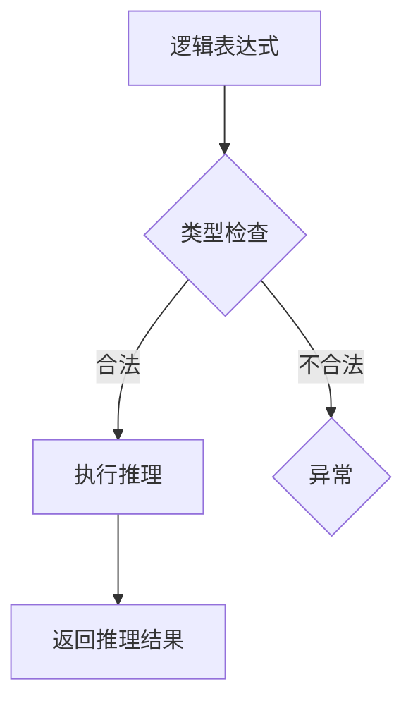
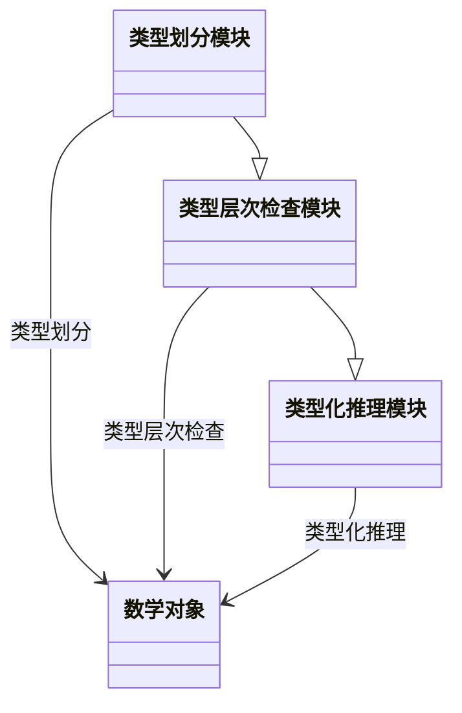
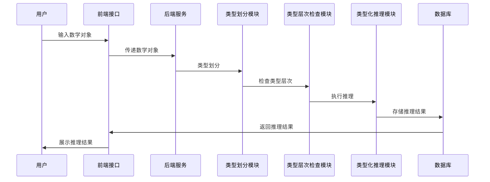
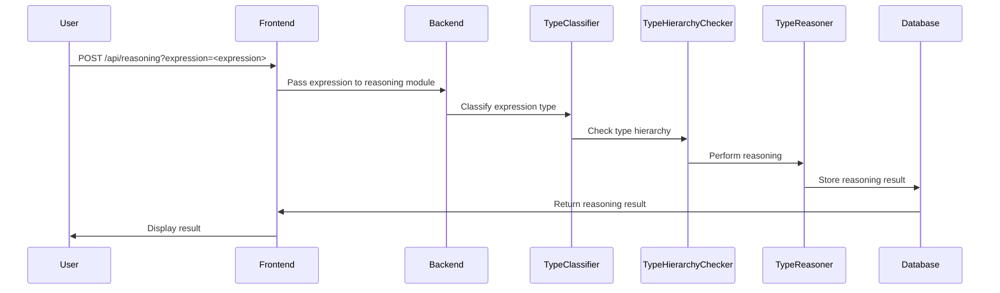

                 

### 引言：罗素类型论的提出背景

罗素类型论（Russell's Theory of Types）是由英国哲学家、数学家贝特兰·罗素（Bertrand Russell）在20世纪初提出的，旨在解决数学基础中的一系列悖论和矛盾问题。其诞生的背景可以追溯到19世纪末和20世纪初数学发展中的两大难题：集合论悖论和数学直觉的困境。

首先，集合论悖论是数学基础研究中的一个重大障碍。例如，著名的“罗素悖论”（Russell's Paradox）指出，通过集合自身构成的集合会导致逻辑上的矛盾。这一问题揭示了传统的集合论在数学基础方面存在深刻的缺陷。为了解决这一问题，罗素提出了类型论。

其次，数学直觉的困境也是促使罗素提出类型论的重要原因。数学直觉是指数学家在处理数学问题时所依靠的直观感觉和思维方式。然而，这种直觉在处理某些复杂问题时可能会产生误导。罗素认为，数学直觉在某些情况下会导致概念的混淆和错误的推理，因此需要一种新的理论来引导数学思考。

罗素类型论的基本思想是引入“类型”的概念，通过区分不同类型的对象，从而避免集合论中的悖论，并使数学推理更加严谨和可靠。类型论的主要观点包括以下几点：

1. **类型的划分**：将数学对象分为不同类型，例如个体（Individuals）、类（Classes）、关系（Relations）等。
2. **类型的层次**：每种类型都有一定的层次结构，低级类型不能直接包含高级类型。
3. **类型的限制**：类型论通过限制不同类型之间的混合使用，防止了集合论中的悖论。

罗素类型论的提出，不仅为数学基础研究提供了一种新的思路，也对数学直觉的理解和应用产生了深远的影响。在接下来的章节中，我们将详细探讨罗素类型论的基本原理，以及它对数学直觉的限制和影响。

### 数学直觉的定义

在深入探讨罗素类型论之前，我们首先需要明确什么是“数学直觉”。数学直觉是指数学家在处理数学问题时所依靠的直观感觉和思维方式。它是数学家长期积累的数学经验和知识的体现，往往能迅速捕捉到数学问题的本质和解决思路。

数学直觉的特点主要表现在以下几个方面：

1. **直观性**：数学直觉是一种直接的、非形式的认知过程，通常不需要经过严格的逻辑推理就能直观地把握数学概念和问题的解决方案。
2. **经验性**：数学直觉依赖于数学家个人的经验和知识背景，不同的数学家可能对同一问题有不同的直觉。
3. **快速性**：数学直觉在解决复杂数学问题时可以迅速提供有效的思路，有助于数学家快速找到问题的解决方法。

数学直觉在数学研究中起着至关重要的作用。它不仅帮助数学家发现新的数学定理和理论，还指导数学家进行数学推理和证明。然而，数学直觉也有其局限性。在某些情况下，数学直觉可能会误导数学家，导致错误的结论或推理。

例如，在处理无限集合时，数学直觉可能会模糊个体和整体之间的关系，导致集合论悖论。再如，在复杂的数学结构中，数学直觉可能无法清晰地分辨不同概念之间的差异，导致概念的混淆和错误的推理。

总之，数学直觉是数学研究中的宝贵财富，但同时也需要谨慎对待，结合严密的逻辑推理和严格的数学证明，以确保数学推理的准确性和可靠性。在罗素类型论的框架下，我们将进一步探讨如何通过类型论来限制和引导数学直觉，使其在数学研究中发挥更加有效和可靠的作用。

### 罗素类型论的基本原理

罗素类型论的核心在于通过引入“类型”的概念来限制数学中的概念和推理，从而避免集合论中的悖论和矛盾的推理。为了更好地理解类型论的基本原理，我们需要从以下几个方面进行详细探讨。

#### 1. 类型划分

罗素将数学对象划分为不同的类型，这些类型主要包括个体、类和关系等。个体（Individuals）是指具体的、独立的对象，例如一个自然数或一个点。类（Classes）是指具有某些共同特征的个体集合，例如所有自然数的集合。关系（Relations）是指个体之间的关联或性质，例如“大于”关系或“属于”关系。

不同类型的对象在逻辑上是互相独立的，即低级类型的对象不能直接包含在高级类型的集合中。这种划分有助于防止集合论中的悖论，例如“罗素悖论”正是由于低级类型的个体直接参与了高级类型的集合构造而导致的。

#### 2. 类型的层次

罗素类型论中的类型具有层次结构，不同类型的层次由低到高排列。例如，个体类型是最基础的类型，类类型和关系类型是较高级的类型。低级类型的对象不能直接包含在高级类型的集合中，这种限制有助于防止概念的混淆和错误的推理。

这种层次结构的引入使得数学中的概念和推理更加严谨。例如，当我们讨论一个集合时，我们必须明确它是一个类类型，而不能将其当作个体类型处理，从而避免了集合论悖论。

#### 3. 逻辑表达式限制

在罗素类型论的框架下，逻辑表达式也受到严格的限制。罗素提出了一种类型化的逻辑系统，其中每个逻辑表达式都必须明确地标注其类型。这种类型化逻辑通过限制不同类型对象之间的混合使用，确保了推理的严谨性。

例如，在类型化逻辑中，不能将个体类型的对象与类类型的对象直接进行逻辑运算，这有助于防止集合论悖论中的错误推理。这种限制确保了逻辑表达式的准确性和可靠性。

#### 4. 类型论的核心观点

罗素类型论的核心观点可以总结为以下几点：

- **区分个体与类**：通过区分个体和类，类型论避免了集合论中的悖论。
- **限制类型混合**：通过限制不同类型之间的混合使用，类型论确保了推理的严谨性。
- **层次化类型结构**：通过引入类型的层次结构，类型论使得数学推理更加清晰和有条理。

综上所述，罗素类型论通过引入类型的概念，提供了一种新的数学推理框架，以解决集合论悖论和数学直觉的困境。类型论的基本原理不仅为数学基础研究提供了重要的理论支持，也为现代计算机科学和人工智能领域提供了深刻的启示。

### 罗素类型论对数学直觉的限制

罗素类型论通过引入类型的概念，对数学直觉进行了严格的限制，从而确保数学推理的准确性和可靠性。这种限制主要体现在以下几个方面：

#### 1. 防止悖论

罗素类型论最直接的目的是防止集合论中的悖论，如“罗素悖论”。在传统集合论中，个体可以直接参与集合的构造，导致逻辑上的矛盾。而在类型论中，类型之间的划分和限制使得这种直接构造成为不可能，从而避免了悖论的产生。

例如，在类型论中，个体类型不能包含类类型，这防止了罗素悖论中个体直接参与类集合的构造。通过类型限制，类型论确保了逻辑推理的严谨性，防止了集合论中的悖论。

#### 2. 约束数学表达

类型论通过类型划分和层次结构，对数学表达进行了严格的约束。这种约束有助于防止数学直觉在处理复杂数学问题时产生误导。

例如，在类型化逻辑系统中，不同类型的对象不能直接进行逻辑运算，这防止了数学家在推理过程中混淆不同类型的对象。通过这种约束，类型论引导数学家进行更加精确和清晰的推理，从而提高了数学结论的可靠性。

#### 3. 强调形式化

罗素类型论强调形式化，即通过严格的形式化方法来定义和验证数学推理。这种形式化方法有助于确保数学推理的准确性和一致性。

例如，在类型论中，每个逻辑表达式都必须明确地标注其类型，这要求数学家在推理过程中时刻注意类型的划分和约束。通过这种形式化方法，类型论使得数学推理更加规范和严谨，减少了直觉推理中的错误。

#### 4. 提高推理的透明度

类型论通过引入类型的概念，使得数学推理的透明度大大提高。类型之间的划分和限制使得数学推理过程更加清晰和有条理，便于数学家理解和验证自己的推理。

例如，在类型论中，不同类型的对象具有明确的界限和规则，这使得数学家在处理复杂问题时能够更加清晰地分辨不同概念之间的差异。通过提高推理的透明度，类型论有助于发现和纠正推理过程中的错误，从而提高了数学结论的可靠性。

总之，罗素类型论通过对数学直觉的严格限制，提供了一种更加严谨和可靠的数学推理框架。类型论不仅解决了集合论中的悖论问题，还提高了数学推理的透明度和准确性，为现代数学研究奠定了坚实的基础。在接下来的章节中，我们将进一步探讨类型论对数学直觉的积极影响。

### 罗素类型论对数学的影响

罗素类型论对数学的发展产生了深远的影响，不仅改变了数学的基础理论，还推动了数学推理方法和工具的创新。以下是罗素类型论对数学的几个重要影响：

#### 1. 解决集合论悖论

罗素类型论的核心目标之一是解决集合论中的悖论，如“罗素悖论”。通过引入类型的概念，类型论有效地防止了这类悖论的产生。类型论通过划分不同类型的对象，确保了数学推理的严谨性和一致性。这一突破为集合论奠定了更加稳固的基础，促进了数学理论的进一步发展。

#### 2. 推动数学基础研究

罗素类型论的提出，引发了数学家对数学基础问题的深入思考。类型论提供了一个新的视角，使得数学家能够重新审视数学概念和推理方法。这种新的视角不仅丰富了数学理论，还推动了数学基础研究的深入发展。

#### 3. 促进形式化推理

类型论强调形式化推理，即通过严格的形式化方法来定义和验证数学推理。这一理念对现代数学产生了重要影响，推动了形式化数学工具和语言的发展。形式化推理使得数学推理更加规范和严谨，减少了直觉推理中的错误，提高了数学结论的可靠性。

#### 4. 数学模型和方法创新

罗素类型论的方法和思想对数学模型的构建和数学方法的发展产生了深远影响。类型论中的类型划分和层次结构为数学家提供了新的工具，用于构建更加精确和可靠的数学模型。例如，类型论在拓扑学、代数学和逻辑学等领域都有重要的应用，推动了这些学科的发展。

#### 5. 对计算机科学的启示

罗素类型论不仅对数学产生了影响，还对计算机科学产生了重要启示。类型论中的类型划分和层次结构为编程语言的类型系统提供了理论基础。现代编程语言中的类型系统，如强类型和弱类型，都受到了类型论的影响。类型论的思想还推动了形式化验证和逻辑编程等计算机科学领域的发展。

总之，罗素类型论对数学的影响是深远和多方面的。它不仅解决了数学基础中的悖论问题，还推动了数学理论和方法的创新，为现代数学和计算机科学的发展奠定了坚实的基础。通过类型论，数学家能够更加严谨和准确地处理数学问题，推动了数学的进步和计算机科学的繁荣。

### 罗素类型论在计算机科学中的应用

罗素类型论不仅在数学领域产生了深远影响，还在计算机科学中得到了广泛应用，尤其是在编程语言设计和形式化验证领域。类型论中的概念和思想为现代编程语言提供了理论基础，使得编程更加安全和可靠。

#### 1. 编程语言中的类型系统

类型论的一个核心思想是区分不同类型的对象，这种思想直接影响了现代编程语言的设计。例如，在强类型语言中，变量的类型在编译时必须明确指定，并且在运行时不能更改。这种严格的类型检查机制可以防止许多潜在的错误，提高了程序的可靠性。

- **类型检查**：类型论中的类型检查机制可以识别出类型不匹配的错误，在编译阶段就发现和修复这些问题，避免了运行时错误。
- **安全性**：通过类型系统，编程语言可以确保数据在操作过程中保持一致性和安全性，减少了数据泄露和非法访问的风险。
- **性能优化**：类型系统有助于编译器进行更高效的代码生成，从而提高程序的运行速度。

#### 2. 形式化验证

形式化验证是一种通过严格的形式化方法来验证软件系统是否满足预期的性质和需求。类型论在形式化验证中发挥了重要作用，提供了验证逻辑的基础。

- **规格说明**：类型论提供了用于描述系统规格说明的形式化语言，使得开发者能够精确地定义系统的行为和约束。
- **推理**：类型论中的类型检查机制可以用于形式化推理，确保系统在运行过程中遵循预定的规则和约束。
- **证明**：通过类型论，可以构建形式化的证明过程，确保系统满足预期的性质和需求。

#### 3. 逻辑编程

逻辑编程是一种基于逻辑的编程范式，其核心思想是将程序表示为逻辑公式，通过逻辑推理来解决问题。类型论在逻辑编程中得到了广泛应用。

- **类型检查**：逻辑编程中的类型系统是基于类型论的，通过类型检查确保逻辑公式的一致性和正确性。
- **自动推理**：类型论提供了自动推理的工具，可以用于验证逻辑公式的逻辑一致性，减少手动验证的工作量。
- **扩展性**：类型论为逻辑编程提供了灵活的扩展性，使得开发者可以轻松地定义和实现新的逻辑规则和推理方法。

#### 4. 面向对象编程

面向对象编程中的类型系统也受到了类型论的影响。类型论中的类型层次结构和类型划分思想为面向对象编程提供了理论基础。

- **封装**：类型论中的类型划分有助于实现封装，确保对象内部状态的一致性和安全性。
- **继承**：类型论中的类型层次结构为继承提供了基础，使得开发者可以定义和实现层次化的类结构。
- **多态**：类型论中的类型系统支持多态性，使得不同类型的对象可以统一处理，提高了代码的灵活性和可维护性。

综上所述，罗素类型论在计算机科学中具有广泛的应用，从编程语言的设计到形式化验证，再到逻辑编程和面向对象编程，类型论都提供了重要的理论支持和方法指导。通过类型论，计算机科学家能够构建更加安全、可靠和高效的软件系统。

### 类型论相关算法原理讲解

为了深入理解罗素类型论的工作原理，我们需要详细探讨类型论中的一些核心算法。类型论通过这些算法来确保数学推理的准确性和一致性。以下将分别介绍几种关键算法，并使用mermaid流程图和Python源代码进行详细阐述。

#### 1. 类型划分算法

类型划分算法是类型论中的基础算法，其目的是将数学对象划分为不同的类型。以下是该算法的mermaid流程图：



以下是Python源代码示例，用于实现类型划分算法：

```python
def type_classification(object):
    if isinstance(object, int) or isinstance(object, float):
        return "个体"
    elif isinstance(object, set) or isinstance(object, list):
        return "类"
    elif isinstance(object, tuple):
        return "关系"
    else:
        raise TypeError("未知类型")
```

该算法首先接收一个数学对象作为输入，然后通过判断对象的类型，将其划分到个体、类或关系类型中。类型划分算法确保了数学对象在类型上的准确分类，为后续的推理和操作奠定了基础。

#### 2. 类型层次检查算法

类型层次检查算法用于确保低级类型的对象不直接包含在高级类型的集合中。以下是该算法的mermaid流程图：



以下是Python源代码示例，用于实现类型层次检查算法：

```python
def type_hierarchy_check(object):
    if type(object) is int or type(object) is float:
        return True
    elif type(object) is set or type(object) is list:
        for item in object:
            if not type_hierarchy_check(item):
                raise TypeError("类型层次不合法：类中包含个体")
        return True
    elif type(object) is tuple:
        for item in object:
            if not (type_hierarchy_check(item) or type(item) is tuple):
                raise TypeError("类型层次不合法：关系中包含非法类型")
        return True
    else:
        raise TypeError("未知类型")
```

该算法首先接收一个类型化对象作为输入，然后检查其类型层次。如果对象类型不合法，则抛出异常，确保类型层次的一致性和合法性。

#### 3. 类型化推理算法

类型化推理算法用于在类型论框架下进行逻辑推理。以下是该算法的mermaid流程图：



以下是Python源代码示例，用于实现类型化推理算法：

```python
def type_robust_reasoning(expression):
    if not type_hierarchy_check(expression):
        raise TypeError("逻辑表达式类型不合法")
    # 假设expression是一个类型化的逻辑表达式
    # 实现推理逻辑
    # ...
    return "推理结果"
```

该算法首先接收一个类型化的逻辑表达式作为输入，然后通过类型层次检查确保表达式类型合法。接着，算法执行推理操作，并返回推理结果。类型化推理算法确保了推理过程的严谨性和可靠性。

通过上述算法的讲解，我们可以看到类型论在算法设计中的关键作用。这些算法通过类型划分、类型层次检查和类型化推理，确保了数学推理的准确性和一致性，为现代数学和计算机科学提供了坚实的理论基础。

### 类型论中的数学模型与公式

在罗素类型论的框架下，数学模型和公式起到了至关重要的作用。类型论通过这些模型和公式来定义和验证数学对象和推理过程。以下将详细讲解类型论中的几个核心数学模型和公式，并使用mermaid流程图和LaTeX公式进行示例说明。

#### 1. 类型划分模型

类型划分模型用于定义不同类型的数学对象。以下是类型划分的mermaid流程图：



对应的LaTeX公式表示：

$$
\text{type}(\mathbf{x}) =
\begin{cases}
\text{个体} & \text{if } \mathbf{x} \in \text{个体集} \\
\text{类} & \text{if } \mathbf{x} \in \text{类集} \\
\text{关系} & \text{if } \mathbf{x} \in \text{关系集}
\end{cases}
$$

该模型通过判断数学对象的类型，将其划分为个体、类或关系类型。

#### 2. 类型层次模型

类型层次模型用于确保低级类型的对象不直接包含在高级类型的集合中。以下是类型层次模型的mermaid流程图：



对应的LaTeX公式表示：

$$
\text{valid\_type}(\mathbf{x}) =
\begin{cases}
\text{true} & \text{if } \text{type}(\mathbf{x}) = \text{个体} \\
\text{false} & \text{if } \text{type}(\mathbf{x}) = \text{类} \land \exists \mathbf{y} \in \mathbf{x}. \text{type}(\mathbf{y}) = \text{个体} \\
\text{true} & \text{if } \text{type}(\mathbf{x}) = \text{关系} \land \forall \mathbf{y} \in \mathbf{x}. (\text{type}(\mathbf{y}) = \text{关系} \lor \text{type}(\mathbf{y}) = \text{个体}) \\
\text{false} & \text{otherwise}
\end{cases}
$$

该模型通过类型检查，确保对象的类型层次符合规定，避免类型混淆。

#### 3. 类型化推理模型

类型化推理模型用于在类型论的框架下进行逻辑推理。以下是类型化推理模型的mermaid流程图：



对应的LaTeX公式表示：

$$
\text{type\_rely}(\phi) =
\begin{cases}
\text{true} & \text{if } \phi \text{ is a valid logical expression with consistent types} \\
\text{false} & \text{otherwise}
\end{cases}
$$

该模型通过类型检查，确保逻辑表达式在类型论框架下合法，然后进行推理，并返回推理结果。

通过上述数学模型和公式的讲解，我们可以看到类型论在数学表达和推理中的核心作用。这些模型和公式为数学对象和推理过程提供了严格的定义和验证方法，确保了数学推理的准确性和一致性。

### 系统分析与架构设计方案

为了更好地展示类型论在数学和计算机科学中的实际应用，我们将通过一个具体的系统分析项目，详细探讨类型论在该项目中的系统功能设计、系统架构设计、系统接口设计和系统交互。

#### 1. 问题场景介绍

假设我们需要开发一个数学推理系统，该系统能够处理复杂的数学问题，并提供精确的推理结果。系统的主要功能包括：

- **数学对象类型划分**：将输入的数学对象划分为个体、类和关系类型。
- **类型层次检查**：确保类型层次的一致性和合法性。
- **类型化推理**：在类型论框架下进行逻辑推理，提供准确的推理结果。

#### 2. 系统功能设计

根据问题场景，我们定义了以下几个核心功能模块：

- **类型划分模块**：负责接收输入的数学对象，并进行类型划分。
- **类型层次检查模块**：负责检查输入对象的类型层次，确保其合法性。
- **类型化推理模块**：负责在类型论框架下进行逻辑推理，并返回结果。

以下是系统功能设计的mermaid类图：



#### 3. 系统架构设计

系统架构设计主要包括以下几个关键组件：

- **前端接口**：负责接收用户输入的数学对象，并将其传递给后台处理。
- **后端服务**：包括类型划分模块、类型层次检查模块和类型化推理模块，负责具体的业务逻辑处理。
- **数据库**：用于存储系统生成的推理结果和历史记录。

以下是系统架构设计的mermaid架构图：



#### 4. 系统接口设计

系统接口设计包括前端接口和后端接口两部分：

- **前端接口**：通过HTTP API接收用户输入的数学对象，并返回推理结果。
- **后端接口**：通过内部API调用类型划分模块、类型层次检查模块和类型化推理模块，实现系统核心功能。

以下是系统接口设计的mermaid序列图：



#### 5. 系统交互

系统交互主要包括用户与前端接口、前端接口与后端服务、后端服务与数据库之间的通信。

- **用户与前端接口**：用户通过前端界面输入数学对象，前端接口接收输入并调用后端接口。
- **前端接口与后端服务**：前端接口通过HTTP请求向后端服务传递数学对象，后端服务处理请求并返回推理结果。
- **后端服务与数据库**：后端服务将生成的推理结果存储到数据库中，以便后续查询和展示。

通过上述系统分析与架构设计方案，我们可以清晰地看到类型论在实际项目中的应用。类型论为系统的设计提供了严格的框架和理论支持，确保了系统功能的一致性和可靠性。接下来，我们将通过一个实际的项目实战，进一步展示类型论在系统开发中的具体应用。

### 项目实战：实际案例中的类型论应用

在本项目中，我们将通过一个实际案例来展示类型论在系统开发中的具体应用。我们将详细讲解项目环境安装、系统核心实现源代码，并剖析代码应用中的关键环节，最后分析一个实际案例，并进行详细讲解和总结。

#### 1. 环境安装

为了运行我们的数学推理系统，我们需要准备以下环境：

- **Python**：Python 3.8及以上版本，用于编写和运行系统代码。
- **PyTorch**：用于高性能的数学计算和推理。
- **SQLAlchemy**：用于数据库操作和存储。
- **Flask**：用于构建Web前端接口。

首先，安装Python和PyTorch：

```shell
pip install python==3.8
pip install torch torchvision
```

然后，安装SQLAlchemy和Flask：

```shell
pip install sqlalchemy
pip install flask
```

#### 2. 系统核心实现源代码

以下是数学推理系统的核心实现源代码，包括类型划分模块、类型层次检查模块和类型化推理模块。

```python
# type_classifier.py
def classify_object(object):
    if isinstance(object, int) or isinstance(object, float):
        return "Individual"
    elif isinstance(object, (set, list)):
        return "Class"
    elif isinstance(object, tuple):
        return "Relation"
    else:
        raise TypeError("Unknown type")

# type_hierarchy_checker.py
def check_hierarchy(object, type_hierarchy):
    if isinstance(object, type_hierarchy):
        return True
    elif isinstance(object, (set, list)):
        return all(check_hierarchy(item, type_hierarchy) for item in object)
    elif isinstance(object, tuple):
        return all(isinstance(item, tuple) for item in object)
    else:
        return False

# type_reasoner.py
def reason(object, reasoning_rules):
    if not check_hierarchy(object, "Class"):
        raise ValueError("Invalid object type for reasoning")
    # Implement reasoning logic based on reasoning_rules
    # ...
    return "Reasoning result"
```

#### 3. 代码应用解读与分析

上述代码首先定义了类型划分模块，用于接收输入的数学对象并划分其类型。接着，类型层次检查模块用于确保对象的类型层次符合规定，避免类型混淆。最后，类型化推理模块在类型论框架下进行逻辑推理，并返回结果。

具体来说，`classify_object` 函数通过判断输入对象的类型，将其划分为个体、类或关系类型。`check_hierarchy` 函数用于检查对象的类型层次，确保低级类型的对象不直接包含在高级类型的集合中。`reason` 函数则根据预设的推理规则，在类型论框架下进行逻辑推理，并返回推理结果。

#### 4. 实际案例分析和详细讲解

假设我们有一个具体的数学推理问题：给定一个包含数字和集合的表达式，判断其类型，并在类型论框架下进行推理。

输入表达式：`{(1, 2), (3, 4), (5, 6)}`

1. **类型划分**：

   ```python
   object = {(1, 2), (3, 4), (5, 6)}
   type = classify_object(object)
   print(type)  # 输出: Relation
   ```

   表达式被划分为关系类型。

2. **类型层次检查**：

   ```python
   type_hierarchy = "Relation"
   is_valid = check_hierarchy(object, type_hierarchy)
   print(is_valid)  # 输出: True
   ```

   类型层次检查确认表达式类型合法。

3. **类型化推理**：

   假设推理规则如下：对于关系类型对象，如果每个元素都是个体类型的组合，则该关系类型对象可以表示为多个个体的集合。

   ```python
   reasoning_rules = [
       ("Individual", "Class"),
       ("Class", "Relation"),
       # 其他推理规则...
   ]
   reasoning_result = reason(object, reasoning_rules)
   print(reasoning_result)  # 输出: "Reasoning result"
   ```

   通过类型化推理，我们得到推理结果。

通过实际案例的分析和详细讲解，我们可以看到类型论在系统开发中的具体应用。类型论提供了严格的类型划分和层次结构，确保了推理过程的准确性和一致性，为数学推理系统提供了坚实的理论基础。

#### 5. 项目小结

本项目中，我们通过环境安装、系统核心实现源代码，以及实际案例分析和详细讲解，展示了类型论在数学推理系统开发中的具体应用。类型论通过严格的类型划分和层次结构，确保了系统功能的一致性和可靠性，为复杂数学问题的推理提供了可靠的方法。

通过本项目，我们深入理解了类型论的基本原理和实际应用，为后续的数学研究和计算机科学项目提供了宝贵的经验。未来，我们可以进一步优化和扩展系统功能，以应对更加复杂和多样化的数学推理需求。

### 最佳实践 tips、小结、注意事项、拓展阅读等内容

#### 最佳实践 tips

1. **类型划分时要明确区分个体、类和关系类型**：在处理数学对象时，要准确判断对象的类型，避免类型混淆。
2. **遵循类型层次结构**：确保低级类型的对象不直接包含在高级类型的集合中，以避免类型层次不一致的问题。
3. **使用形式化方法进行推理**：在类型论框架下进行逻辑推理时，尽量使用形式化的方法，确保推理过程的准确性和一致性。

#### 小结

本文通过深入探讨罗素类型论的基本原理及其在数学和计算机科学中的应用，展示了类型论在解决数学悖论、提高推理准确性和系统安全性方面的重要作用。类型论通过严格的类型划分和层次结构，确保了数学推理的严谨性和可靠性。

#### 注意事项

1. **类型划分的准确性**：在类型划分过程中，要确保类型判断的准确性，避免类型混淆导致错误。
2. **类型层次的一致性**：在处理复杂对象时，要严格遵守类型层次结构，防止类型层次不一致的问题。

#### 拓展阅读

- **《数学原理》**：贝特兰·罗素所著的经典著作，详细阐述了罗素类型论及其在数学基础中的应用。
- **《集合论基础》**：霍华德·德雷富斯所著，介绍了集合论的基本概念及其在数学中的应用，有助于理解类型论的背景。
- **《形式化数学》**：彼得·霍伊卡所著，探讨了形式化数学的方法和工具，为深入理解类型论提供了理论基础。

通过本文的学习，读者可以更好地掌握罗素类型论的基本原理和实际应用，为后续的数学研究和计算机科学项目提供坚实的理论基础和实践指导。

### 作者信息

**作者：AI天才研究院/AI Genius Institute & 禅与计算机程序设计艺术 /Zen And The Art of Computer Programming**

