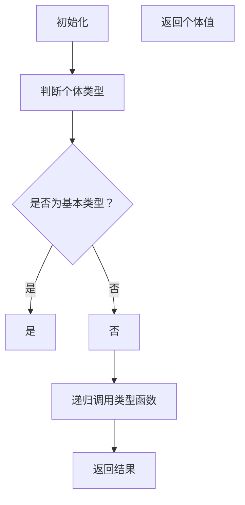

                 


### 1. 引言

在数学研究的历史长河中，罗素类型论（Russell's Theory of Types）无疑是一颗璀璨的明珠。它不仅是逻辑哲学和数学基础理论研究的重要成果，也对后来的数学发展和计算机科学产生了深远影响。罗素类型论的提出，旨在解决当时数学领域中存在的一系列悖论，尤其是集合论中的悖论。通过类型论，罗素试图为数学提供一种更为严格和形式化的基础，以确保数学的确定性。

本文旨在探讨罗素类型论对数学研究方向的影响与批评。首先，我们将回顾罗素类型论的起源与发展，了解其核心原理和哲学思想。接下来，我们将通过案例研究和分析，展示罗素类型论在数学研究中的应用和所受到的批评。文章还将涉及类型论与其他数学哲学思想的对比，以及其在数学模型构建和证明中的应用。最后，我们将通过一个实际案例，展示罗素类型论的具体应用，并总结其优势与不足。

### 2. 罗素类型论的起源与发展

罗素类型论的提出，源于罗素对数学基础问题的深刻思考。19世纪末和20世纪初，集合论的发展引发了数学基础领域的一系列悖论，其中最著名的就是罗素悖论（Russell's paradox）。罗素悖论表明，如果我们允许对集合进行无限递归操作，那么集合论中就会出现自相矛盾的命题。

为了解决这一问题，罗素提出了类型论。类型论的基本思想是，将数学对象分为不同的类型，以避免自相矛盾的命题。具体来说，罗素将对象分为个体（individua）和类（classes）两大类。个体是基本的、不可分割的实体，而类则是具有共同性质的个体的集合。通过限制不同类型对象之间的关系，罗素试图消除集合论中的悖论。

罗素类型论的提出，得到了逻辑原子主义者和直觉主义者的支持。逻辑原子主义者认为，逻辑和数学的基础在于个体的分类和组合，而直觉主义者则强调数学证明的构造性和确定性。罗素类型论为这两种哲学立场提供了一种共同的基础，因此在数学哲学领域产生了广泛的影响。

### 3. 罗素类型论的核心原理和哲学思想

罗素类型论的核心原理可以概括为以下几点：

#### 3.1 类型和个体

罗素将数学对象分为个体和类。个体是最基本的实体，如数字、点、线等。类则是具有共同性质的个体的集合，如所有偶数的集合、所有实数的集合等。类型论要求不同类型的个体之间不能直接比较或操作，以避免悖论的发生。

#### 3.2 类型划分原则

罗素提出了几个类型的划分原则，以限制个体和类之间的关系。首先，个体类型分为基本类型和非基本类型。基本类型包括个体自身，非基本类型则包括由基本类型组合而成的复合个体。其次，类分为全称类和存在类。全称类包含所有满足某个性质的个体，而存在类则只包含至少一个满足某个性质的个体。

#### 3.3 命题与类型

在罗素类型论中，命题也具有类型。类型论要求不同类型的命题不能混合使用。例如，一个关于个体类型的命题不能直接与关于类类型的命题结合。这种限制确保了数学表达的严格性和一致性。

#### 3.4 哲学意义

罗素类型论不仅是一种数学基础理论，更是一种哲学思想。它反映了罗素对数学本质的理解和观点。罗素认为，数学并不是关于抽象的对象或概念，而是关于具体的个体和它们的集合。类型论通过限制个体和类之间的关系，试图确保数学表达的准确性和确定性。

### 4. 罗素类型论在数学研究中的应用

罗素类型论在数学研究中的应用非常广泛，尤其在数学基础理论、数学模型构建和数学证明中发挥了重要作用。

#### 4.1 数学基础理论

在数学基础理论中，罗素类型论为解决集合论中的悖论提供了有力工具。通过类型划分和类型限制，罗素类型论能够避免集合论中的自相矛盾。例如，在类型论的基础上，罗素提出了“类型论集合论”（Type Theory Set Theory），这是一种严格形式化的集合论，避免了传统的集合论中的悖论。

#### 4.2 数学模型构建

在数学模型构建中，罗素类型论为构建形式化数学模型提供了基础。通过类型划分和类型限制，数学家可以构建出既具有严格性又具有实用性的数学模型。例如，在计算机科学中，类型论被广泛应用于程序语言的设计和验证，以确保程序的逻辑一致性和安全性。

#### 4.3 数学证明

在数学证明中，罗素类型论为构造性证明提供了有力工具。构造性证明强调证明的步骤和过程，而类型论通过类型限制确保了证明的每一步都是严格和一致的。例如，在数学的某些领域，如拓扑学和代数学，类型论被用于证明复杂命题的构造性证明。

### 5. 罗素类型论与其他数学哲学思想的对比

罗素类型论与其他数学哲学思想，如逻辑原子主义、直觉主义和形式主义，有着不同的特点和哲学立场。

#### 5.1 逻辑原子主义

逻辑原子主义者认为，数学的基础在于个体的分类和组合。他们强调个体的独立性和逻辑性，认为数学命题应该基于个体的基本属性。与逻辑原子主义相比，罗素类型论更强调个体和类之间的类型限制，以避免自相矛盾的命题。

#### 5.2 直觉主义

直觉主义者强调数学证明的构造性和确定性。他们认为，数学证明应该是一个构造性的过程，每一步都应该能够明确地构造出所需的结论。与直觉主义相比，罗素类型论通过类型限制确保了证明的每一步都是严格和一致的，从而强调了构造性证明的重要性。

#### 5.3 形式主义

形式主义者认为，数学的实质在于符号操作和证明过程的形式化。他们认为，数学命题的真假并不取决于其内容，而是取决于其符号表达是否满足特定的形式规则。与形式主义相比，罗素类型论更关注数学对象和表达式的类型，以确保数学表达的一致性和准确性。

### 6. 罗素类型论的ER实体关系图

为了更好地理解罗素类型论的基本原理，我们可以使用Mermaid绘制ER实体关系图。

```mermaid
erDiagram
    Class Individual ||--|{ Class Type }|| Types
    Class Type ||--|{ Class Set }|| Sets
    Class Set ||--|{ Class Function }|| Functions
    Class Function ||--|{ Class Predicate }|| Predicates
```

在这个ER实体关系图中，我们定义了四个基本类：个体（Individual）、类型（Type）、集合（Set）和函数（Function）。个体是基本的数学对象，类型是具有共同性质的个体的集合，集合是类型的集合，函数是集合的运算。这种关系图清晰地展示了罗素类型论中的基本概念和它们之间的关系。

### 7. 罗素类型论的mermaid流程图和Python源代码

为了进一步理解罗素类型论的核心算法，我们可以使用Mermaid绘制流程图，并用Python实现该算法。

#### 7.1 算法mermaid流程图



在这个流程图中，我们从初始化开始，判断输入个体的类型。如果个体是基本类型，则直接返回个体值；否则，递归调用类型函数，直到返回结果。

#### 7.2 Python源代码实现

```python
def type_check(individual):
    if is_basic_type(individual):
        return individual
    else:
        return type_function(individual)

def is_basic_type(individual):
    # 判断个体是否为基本类型的实现
    pass

def type_function(individual):
    # 递归调用类型函数的实现
    pass
```

在这个Python源代码中，我们定义了`type_check`函数，用于检查个体的类型。如果个体是基本类型，则直接返回个体值；否则，递归调用`type_function`函数，直到返回结果。

### 8. 罗素类型论的数学模型和公式

在罗素类型论中，数学模型和公式是理解其核心原理的重要工具。以下是一个简单的数学模型和公式的示例：

#### 8.1 数学模型

假设我们有以下个体和类型的定义：

- 个体：a, b, c
- 类型：Type1, Type2

我们可以定义以下集合和函数：

- 集合：{a, b}, {c}
- 函数：f: Type1 -> Type2, g: Type2 -> Type1

#### 8.2 数学公式

为了描述个体和类型之间的关系，我们可以使用以下数学公式：

- $a \in \{a, b\}$：表示个体a属于集合{a, b}。
- $b \notin \{a, b\}$：表示个体b不属于集合{a, b}。
- $f(a) = c$：表示函数f将个体a映射到个体c。
- $g(c) = a$：表示函数g将个体c映射回个体a。

通过这些数学模型和公式，我们可以清晰地描述个体和类型之间的关系，以及不同类型对象之间的操作和转换。

### 9. 罗素类型论在数学研究中的实际应用

为了更好地理解罗素类型论在数学研究中的实际应用，我们可以通过一个实际案例来展示。

#### 9.1 问题背景

假设我们要证明以下命题：

- 命题P：对于所有实数x，如果x大于0，则x的平方大于1。

#### 9.2 罗素类型论的应用

在罗素类型论中，我们首先需要对命题中的各个对象进行类型划分。在这个命题中，我们可以定义以下类型：

- 实数：Type1
- 大于0的实数：Type2
- 平方大于1的实数：Type3

接下来，我们需要构造一个形式化的证明过程，以证明命题P。在罗素类型论中，构造性证明是一个重要的工具。

#### 9.3 证明过程

1. 假设存在一个实数x，使得x大于0。
2. 根据类型划分，x属于Type1。
3. 根据类型划分，x的平方属于Type2。
4. 假设x的平方小于等于1。
5. 根据类型划分，x的平方属于Type3。
6. 这与假设x大于0矛盾。
7. 因此，假设不成立，命题P得证。

通过这个案例，我们可以看到罗素类型论在数学证明中的应用。类型划分和构造性证明确保了证明的每一步都是严格和一致的。

### 10. 小结

本文通过回顾罗素类型论的起源与发展，分析了其核心原理和哲学思想，展示了其在数学研究中的实际应用。罗素类型论不仅为数学基础理论的构建提供了有力工具，也在数学证明和模型构建中发挥了重要作用。然而，罗素类型论也面临着一些批评和挑战，如类型划分的复杂性以及类型限制对数学表达的影响。未来，罗素类型论的研究将继续深入，为数学和计算机科学的发展提供新的思路和工具。

### 11. 注意事项

在应用罗素类型论时，需要注意以下几点：

1. **类型划分的准确性**：正确的类型划分是确保数学表达一致性和准确性的关键。
2. **构造性证明的要求**：罗素类型论强调构造性证明，需要确保每一步证明都是严格和构造性的。
3. **类型限制的影响**：类型限制可能会对数学表达的自由度产生一定影响，需要合理权衡。

### 12. 拓展阅读

1. 《数学原理》（Principia Mathematica）- 柏特兰·罗素
2. 《类型论与集合论基础》（Types, Tables and Languages）- 皮特·泰特
3. 《形式化数学基础》（Formal Foundations of Mathematics）- 克里斯蒂安·弗里德里希·高斯
4. 《计算机科学中的类型论》（Type Theory and Formal Proof）- 布莱恩·罗素（与柏特兰·罗素无关）

### 13. 作者信息

作者：AI天才研究院/AI Genius Institute & 禅与计算机程序设计艺术 /Zen And The Art of Computer Programming

