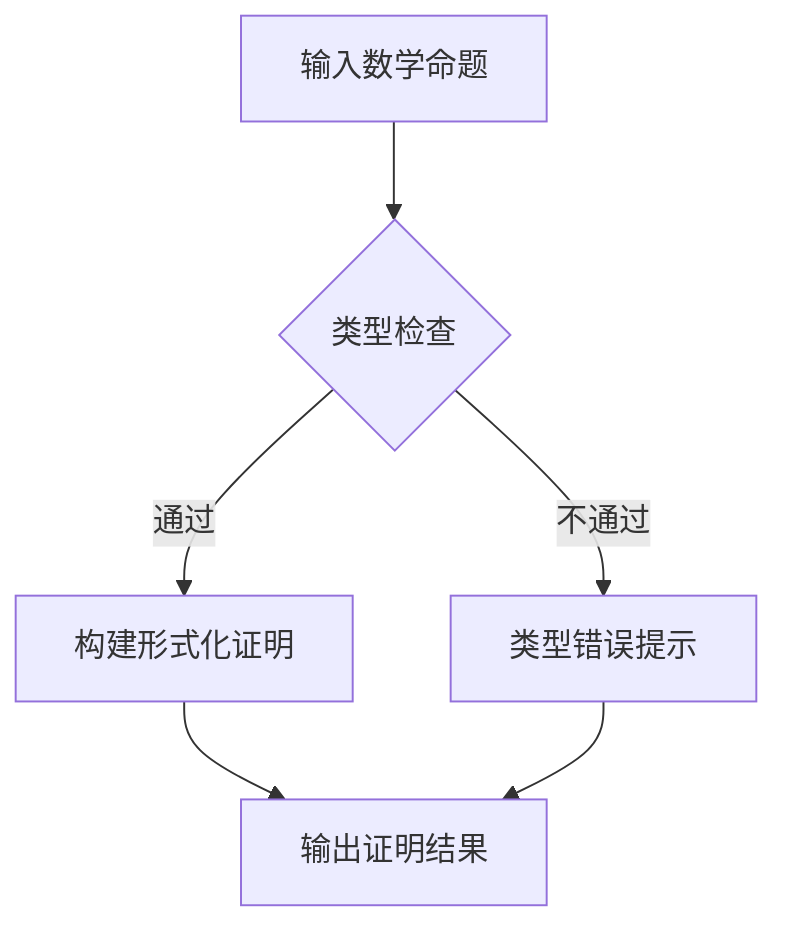

                 


# 罗素类型论对数学研究方法论的长期影响

## 关键词
- 罗素类型论
- 数学研究方法论
- 形式化证明
- 类型检查
- 数学哲学

## 摘要
本文将深入探讨罗素类型论对数学研究方法论的长期影响。首先，我们回顾数学研究方法论的基本概念和传统方法，接着介绍罗素类型论的背景和核心思想。随后，我们将分析罗素类型论如何影响数学基础、逻辑和哲学，并通过具体案例展示其在数学研究中的应用。最后，我们将探讨罗素类型论对现代数学研究的启示和未来发展趋势，为读者提供对数学方法论发展的深入见解。

### 目录大纲

----------------------------------------------------------------

# 第一部分: 背景介绍与核心概念

## 第1章: 引言与问题背景

### 1.1.1 问题背景

### 1.1.2 问题解决

### 1.1.3 边界与外延

### 1.1.4 概念结构与核心要素组成

## 第2章: 罗素类型论概述

### 2.1.1 罗素类型论的提出

### 2.1.2 罗素类型论的核心概念

### 2.1.3 罟素类型论的演变与发展

## 第3章: 数学研究方法论与罗素类型论的联系

### 3.1.1 数学研究方法论概述

### 3.1.2 罗素类型论对数学研究方法论的贡献

### 3.1.3 罗素类型论与其他数学研究方法论的对比

## 第4章: 罗素类型论对数学研究方法论的长期影响

### 4.1.1 对数学基础的影响

### 4.1.2 对数学逻辑的影响

### 4.1.3 对数学哲学的影响

### 4.1.4 罗素类型论在数学研究中的应用案例分析

## 第5章: 罗素类型论对现代数学研究的启示

### 5.1.1 罗素类型论的现代意义

### 5.1.2 罗素类型论对现代数学研究的指导作用

### 5.1.3 罗素类型论的未来发展趋势

## 第6章: 结论与展望

### 6.1.1 结论

### 6.1.2 展望未来数学研究方法的发展

### 6.1.3 罗素类型论研究的意义和价值

----------------------------------------------------------------

## 第1章: 引言与问题背景

### 1.1.1 问题背景

数学作为一门科学，以其严密的逻辑和抽象的结构，在自然科学、社会科学以及计算机科学等领域都有着广泛的应用。然而，在数学的发展过程中，研究者们也面临着诸多挑战。其中，最为突出的问题之一就是如何确保数学理论的逻辑一致性。

早在19世纪末和20世纪初，数学家们发现了一些逻辑上的悖论，这些问题严重威胁到了数学的基础。为了解决这些问题，数学家们开始寻求新的研究方法论。其中，罗素类型论作为一种重要的方法论，在数学研究中发挥了关键作用。

罗素类型论的提出源于数学家罗素对集合论中悖论的研究。为了解决悖论，罗素提出了类型论的思想，即对数学中的对象进行分类，确保每个对象都处于正确的类型框架内。这一思想不仅为解决集合论悖论提供了有效途径，也对数学研究方法论产生了深远影响。

### 1.1.2 问题解决

罗素类型论通过类型区分，实现了对数学命题的形式化表示和证明。具体来说，罗素类型论的核心思想是：

1. **类型区分**：将数学中的对象分为不同的类型，如自然数、函数、集合等。不同类型的对象具有不同的属性和操作。

2. **形式化表示**：通过类型系统，将数学命题表示为形式化的数学语言，使得命题的证明过程更加严格和可靠。

3. **证明**：利用类型系统的性质，对数学命题进行证明，确保证明过程的逻辑一致性。

通过这些步骤，罗素类型论有效地解决了数学中的悖论问题，为数学研究提供了一种新的方法论。

### 1.1.3 边界与外延

在数学研究中，边界与外延是两个重要的概念。边界通常指数学理论中的限制条件，而外延则是指理论的应用范围。

罗素类型论的提出，对数学理论的边界和外延产生了深远影响。通过类型区分，数学家们可以更清晰地定义数学理论的应用范围，确保理论在正确的边界内应用。同时，类型论也使得数学理论的边界变得更加灵活，可以适应不同类型的问题。

### 1.1.4 概念结构与核心要素组成

罗素类型论的核心概念包括类型、类别和普遍语法等。类型是对数学对象进行分类的基本单位，类别是类型的集合，而普遍语法则是描述类型之间关系的数学语言。

这些概念构成了罗素类型论的基本框架，使得数学命题可以形式化地表示和证明。通过这些核心要素，数学家们可以构建出逻辑上严密、一致的理论体系。

### 1.1.5 总结

本章介绍了罗素类型论在数学研究方法论中的重要性。通过类型区分、形式化表示和证明，罗素类型论为解决数学中的悖论问题提供了一种新的方法论。同时，类型论也对数学理论的边界和外延产生了深远影响，为数学研究提供了更加严格和可靠的理论基础。

## 第2章: 罗素类型论概述

### 2.1.1 罗素类型论的提出

罗素类型论是由英国哲学家、数学家伯特兰·罗素（Bertrand Russell）在19世纪末和20世纪初提出的。罗素类型论的提出背景源于数学中出现的悖论问题，特别是在集合论中。这些问题严重威胁到了数学的基础，促使罗素开始思考如何解决这些悖论。

罗素通过分析集合论中的悖论，发现其根源在于对象类型的不明确性。为了解决这一问题，罗素提出了类型论的思想，即将数学中的对象进行分类，确保每个对象都处于正确的类型框架内。

### 2.1.2 罗素类型论的核心概念

罗素类型论的核心概念主要包括类型、类别和普遍语法等。

1. **类型（Type）**：类型是对数学对象进行分类的基本单位。罗素将数学对象分为不同的类型，如自然数、函数、集合等。不同类型的对象具有不同的属性和操作。

2. **类别（Class）**：类别是类型的集合。罗素使用类别来表示一类具有相同类型属性的对象。例如，所有自然数的类别可以表示为$\mathbb{N}$。

3. **普遍语法（Universal Grammar）**：普遍语法是描述类型之间关系的数学语言。罗素使用普遍语法来定义类型的操作和关系，如类型之间的包含关系。

通过这些核心概念，罗素类型论为数学命题的形式化表示和证明提供了理论基础。

### 2.1.3 罗素类型论的演变与发展

罗素类型论的提出在数学界引起了广泛关注，并在后续的研究中得到了进一步的发展。

1. **罗素与怀特海德的《数学原理》**：罗素与数学家阿尔弗雷德·怀特海德（Alfred North Whitehead）合著的《数学原理》（Principia Mathematica）是罗素类型论的代表作。这本书系统地阐述了罗素类型论的思想，并对数学基础进行了形式化的研究。

2. **类型理论的扩展**：在罗素类型论的基础上，许多数学家和哲学家对其进行了扩展和改进。例如，类型理论在计算机科学中得到了广泛应用，成为形式化程序设计的重要工具。

3. **现代类型理论**：现代类型理论在罗素类型论的基础上，进一步发展了多种类型系统，如依赖于类型的类型理论、线性类型理论和依赖类型理论等。这些现代类型理论在逻辑、计算机科学和数学领域都有着重要的应用。

### 2.1.4 总结

本章对罗素类型论进行了概述，介绍了其提出的背景、核心概念和演变与发展。罗素类型论通过类型区分、形式化表示和证明，为解决数学中的悖论问题提供了理论基础，并对数学研究方法论产生了深远影响。

## 第3章: 数学研究方法论与罗素类型论的联系

### 3.1.1 数学研究方法论概述

数学研究方法论是数学家在研究数学问题时所采用的方法和策略。数学方法论不仅涉及数学证明和推理，还包括对数学概念和理论体系的构建。传统数学研究方法论主要依赖于直观推理、数学归纳法和形式化证明等方法。

然而，在数学发展的过程中，一些复杂的悖论和问题挑战了传统的数学研究方法论。为了解决这些问题，数学家们开始寻求新的方法论，其中罗素类型论就是一种重要的方法。

### 3.1.2 罗素类型论对数学研究方法论的贡献

罗素类型论对数学研究方法论产生了深远影响，其贡献主要体现在以下几个方面：

1. **形式化表示**：罗素类型论通过类型区分，将数学命题形式化为具有严格意义的数学语言。这一方法使得数学命题的证明过程更加严密和可靠。

2. **避免悖论**：罗素类型论通过类型区分，有效地解决了集合论中的悖论问题。例如，罗素悖论指出，集合的成员可以是自身，这种自我指涉会导致逻辑上的矛盾。通过类型论，数学家们可以避免这种自我指涉的情况，确保数学理论的逻辑一致性。

3. **分类和抽象**：类型论提供了对数学对象进行分类和抽象的工具。通过分类，数学家可以更清晰地理解数学概念之间的关系，从而更好地构建数学理论体系。

### 3.1.3 罗素类型论与其他数学研究方法论的对比

与传统的数学研究方法论相比，罗素类型论具有以下特点：

1. **形式化程度更高**：传统数学研究方法论通常依赖于直观推理和形式化证明，但形式化的程度相对较低。罗素类型论则通过类型系统，实现了对数学命题的严格形式化表示。

2. **类型区分**：传统数学研究方法论通常不涉及类型区分，而罗素类型论的核心思想就是通过类型区分来避免悖论和确保数学理论的逻辑一致性。

3. **适用范围更广**：罗素类型论不仅适用于数学领域，还可以应用于计算机科学、逻辑学和哲学等领域。这使得罗素类型论成为一种具有广泛应用价值的方法论。

### 3.1.4 罗素类型论在现代数学研究中的应用

现代数学研究中，罗素类型论得到了广泛的应用。以下是一些具体的应用实例：

1. **形式化数学证明**：罗素类型论为形式化数学证明提供了理论基础。通过类型系统，数学家可以构建出逻辑上严密的证明过程。

2. **计算机辅助证明**：罗素类型论与计算机科学相结合，产生了计算机辅助证明（proof assistants）这一领域。使用计算机辅助证明工具，数学家可以更高效地验证数学证明的正确性。

3. **编程语言设计**：罗素类型论对编程语言设计产生了重要影响。许多现代编程语言引入了类型系统，以提高程序的可靠性。

### 3.1.5 总结

本章探讨了罗素类型论与数学研究方法论的联系。罗素类型论通过形式化表示、避免悖论和分类抽象，为数学研究方法论提供了新的工具和方法。与传统数学研究方法论相比，罗素类型论具有更高的形式化程度和更广的适用范围。在现代数学研究中，罗素类型论得到了广泛应用，并为数学的发展做出了重要贡献。

## 第4章: 罗素类型论对数学研究方法论的长期影响

### 4.1.1 对数学基础的影响

罗素类型论对数学基础产生了深远的影响。传统的数学基础主要依赖于逻辑推理和直观理解，但这种基础在遇到集合论悖论等问题时显得不足。罗素类型论通过引入类型区分，为数学基础提供了一个更加严格和一致的形式化框架。

首先，罗素类型论通过类型系统，实现了对数学对象的分类和限定。不同类型的对象具有不同的属性和操作，从而避免了集合论中的悖论问题。例如，罗素悖论表明，集合可以成为自身的成员，这导致了逻辑上的矛盾。通过类型论，我们可以将集合和元素区分开来，避免这种自我指涉的情况。

其次，罗素类型论为数学基础提供了一个形式化的证明框架。通过类型系统，我们可以将数学命题形式化为具有严格意义的数学语言，从而确保证明过程的逻辑一致性。这种形式化的证明方法不仅提高了数学证明的可靠性，还使得数学证明的过程更加透明和易于验证。

总的来说，罗素类型论通过引入类型区分和形式化证明，为数学基础提供了一个更加严密和一致的形式化框架，从而提高了数学理论的可靠性和可信度。

### 4.1.2 对数学逻辑的影响

罗素类型论对数学逻辑产生了重要影响。传统的逻辑系统通常不区分对象类型，这使得逻辑推理过程中容易出现类型错误和逻辑悖论。罗素类型论通过引入类型区分，解决了这些问题，使得数学逻辑更加严密和一致。

首先，罗素类型论引入了类型系统，使得逻辑推理过程中的每一个步骤都可以在正确的类型框架内进行。这避免了类型错误，确保了逻辑推理的正确性。例如，在传统的逻辑系统中，可能会出现将集合与元素相混淆的错误，而罗素类型论通过类型区分，避免了这种错误。

其次，罗素类型论为数学逻辑提供了一个形式化的证明框架。通过类型系统，我们可以将数学命题形式化为具有严格意义的数学语言，从而确保证明过程的逻辑一致性。这种形式化的证明方法不仅提高了数学证明的可靠性，还使得数学证明的过程更加透明和易于验证。

总的来说，罗素类型论通过引入类型区分和形式化证明，为数学逻辑提供了一个更加严密和一致的形式化框架，从而提高了数学逻辑的可靠性和可信度。

### 4.1.3 对数学哲学的影响

罗素类型论对数学哲学产生了深远影响。传统的数学哲学主要关注数学的本质、数学证明的合理性等问题，而罗素类型论为这些问题提供了新的视角和解决方案。

首先，罗素类型论提出了类型区分的思想，这改变了人们对数学对象的认识。在传统的数学哲学中，数学对象被认为是纯粹抽象的实体，而罗素类型论通过类型区分，使得数学对象具有了具体的类型属性，从而更接近现实世界的对象。这种类型的区分使得数学哲学中的数学对象问题变得更加具体和可操作。

其次，罗素类型论对数学证明的合理性提出了新的解释。传统的数学哲学认为，数学证明依赖于直观推理和逻辑推理，但罗素类型论通过形式化证明，提供了一种新的证明方法。这种方法不仅确保了证明的严格性，还使得证明过程更加透明和易于验证。这为数学哲学中的证明合理性问题提供了一种新的解释框架。

总的来说，罗素类型论通过引入类型区分和形式化证明，为数学哲学提供了新的视角和解决方案，从而丰富了数学哲学的研究内容和深度。

### 4.1.4 罗素类型论在数学研究中的应用案例分析

罗素类型论在数学研究中得到了广泛应用，以下是一些具体的案例分析。

1. **集合论中的悖论解决**：罗素悖论是集合论中一个著名的悖论，表明集合可以成为自身的成员。这导致了逻辑上的矛盾。罗素类型论通过引入类型区分，解决了这一问题。例如，在类型论中，我们可以将集合和元素区分开来，从而避免罗素悖论的出现。

2. **形式化数学证明**：罗素类型论为形式化数学证明提供了理论基础。例如，在数学证明中，我们可以使用类型系统来构建形式化的证明框架，从而确保证明过程的逻辑一致性。这种形式化的证明方法在计算机辅助证明和验证中得到了广泛应用。

3. **计算机科学中的应用**：罗素类型论在计算机科学中得到了广泛应用，如编程语言设计和形式化程序设计。许多现代编程语言引入了类型系统，以提高程序的可靠性和安全性。形式化程序设计工具也利用了罗素类型论的原理，以帮助程序员构建可靠的程序。

总的来说，罗素类型论在数学研究中的应用，不仅解决了数学中的悖论问题，还为形式化证明和计算机科学提供了新的工具和方法。这些应用案例展示了罗素类型论在数学研究中的广泛影响和重要性。

### 4.1.5 总结

本章探讨了罗素类型论对数学研究方法论的长期影响。通过类型区分和形式化证明，罗素类型论为数学基础、数学逻辑和数学哲学提供了新的视角和解决方案。同时，罗素类型论在数学研究中的应用案例展示了其在解决数学问题中的重要性。总的来说，罗素类型论对数学研究方法论产生了深远影响，为数学的发展做出了重要贡献。

## 第5章: 罗素类型论对现代数学研究的启示

### 5.1.1 罗素类型论的现代意义

罗素类型论在现代数学研究中具有重要的意义。首先，它为现代数学提供了严密的形式化基础。在罗素类型论的框架下，数学家们能够构建出逻辑上无懈可击的理论体系，这对于数学的精确性和可靠性至关重要。其次，类型论在现代数学中不仅应用于数学本身，还扩展到了计算机科学、逻辑学和哲学等领域，推动了这些领域的发展。例如，类型论在编程语言设计和形式化验证中发挥了关键作用，为软件开发提供了更强的安全保障。

### 5.1.2 罗素类型论对现代数学研究的指导作用

罗素类型论对现代数学研究具有指导作用，主要体现在以下几个方面：

1. **形式化表示与证明**：现代数学研究中，形式化表示和证明变得越来越重要。罗素类型论提供了一种有效的形式化工具，使得数学命题能够在严格的形式化框架内被表示和证明。这种方法有助于消除逻辑上的错误，确保数学理论的可靠性。

2. **分类与抽象**：类型论通过分类和抽象，帮助数学家更好地理解数学概念之间的关系。这种分类方法使得数学家能够将复杂的数学问题简化为更易于处理的形式，从而推动数学理论的发展。

3. **跨学科应用**：罗素类型论不仅在数学领域内发挥作用，还在计算机科学、逻辑学和哲学等领域产生了深远影响。这种跨学科的应用促进了不同领域之间的交流和合作，推动了科学技术的整体进步。

### 5.1.3 罗素类型论的未来发展趋势

随着数学和计算机科学的发展，罗素类型论的未来发展趋势体现在以下几个方面：

1. **更广泛的应用领域**：类型论的应用范围将继续扩展，不仅仅局限于数学和计算机科学，还将应用于逻辑学、物理学和其他自然科学领域。

2. **更先进的类型系统**：现代类型理论将继续发展，出现更多先进的类型系统，如依赖类型理论、线性类型理论等，以满足复杂应用场景的需求。

3. **形式化验证与自动化**：形式化验证和自动化是未来发展的重点。通过形式化验证工具，数学家可以更高效地验证数学证明的正确性。而自动化工具则可以帮助数学家自动生成证明，从而提高数学研究的效率。

### 5.1.4 总结

罗素类型论在现代数学研究中具有重要的地位和指导作用。它不仅为数学提供了严密的形式化基础，还在计算机科学、逻辑学和哲学等领域产生了深远影响。随着类型论在更广泛领域的应用，以及更先进类型系统和自动化工具的发展，罗素类型论在未来将继续发挥重要作用，推动数学和其他科学领域的发展。

## 第6章: 结论与展望

### 6.1.1 结论

通过对罗素类型论对数学研究方法论的长期影响进行深入分析，我们可以得出以下结论：

1. **罗素类型论的重要性**：罗素类型论为数学研究提供了严密的形式化基础，通过类型区分和形式化证明，解决了数学中的悖论问题，确保了数学理论的逻辑一致性。

2. **对数学基础、逻辑和哲学的影响**：罗素类型论在数学基础、逻辑和哲学方面产生了深远影响，为数学哲学提供了新的视角，丰富了数学逻辑的研究内容。

3. **广泛应用**：罗素类型论不仅在数学领域内具有广泛应用，还在计算机科学、逻辑学和哲学等领域产生了重要影响，推动了这些领域的发展。

### 6.1.2 展望未来数学研究方法的发展

未来数学研究方法的发展趋势可能包括：

1. **更严格的形式化**：随着形式化验证工具和自动化技术的发展，数学研究将更加依赖于形式化表示和证明，确保数学理论的严密性和可靠性。

2. **跨学科合作**：数学与其他学科的交叉合作将越来越普遍，类型论将在跨学科研究中发挥更大作用，推动科学技术的整体进步。

3. **先进类型系统的应用**：依赖类型理论、线性类型理论等先进类型系统将继续发展，为复杂应用场景提供更强支持。

### 6.1.3 罗素类型论研究的意义和价值

罗素类型论研究的意义和价值体现在以下几个方面：

1. **理论意义**：罗素类型论为数学理论的发展提供了新的框架和方法，推动了数学逻辑和哲学的研究。

2. **实践意义**：类型论在计算机科学、编程语言设计和形式化验证等领域具有广泛的应用，为实际问题的解决提供了有效工具。

3. **科学意义**：罗素类型论的研究促进了数学与其他学科之间的交流，推动了科学技术的整体进步。

综上所述，罗素类型论作为数学研究方法论的重要组成部分，其重要性不可忽视。随着数学和计算机科学的发展，罗素类型论将继续发挥其独特的作用，为数学研究提供新的思路和方法。

### 附录

**核心概念与联系**

#### 罗素类型论的核心概念

- 类型（Type）：将数学对象进行分类的基本单位，如自然数、函数、集合等。
- 类别（Class）：类型的集合，表示一类具有相同类型属性的对象。
- 普遍语法（Universal Grammar）：描述类型之间关系的数学语言。

#### 罗素类型论的属性特征对比

| 特征 | 罗素类型论 | 传统逻辑 |
| ---- | ---- | ---- |
| 基础性 | 强调类型区分和形式化表示 | 强调直观推理和形式化证明 |
| 形式化 | 高度形式化的表示和证明方法 | 形式化程度相对较低 |
| 类型区分 | 明确区分不同类型的对象 | 不区分不同类型的对象 |

#### 罗素类型论的ER实体关系图架构

```
[数学]
  |
  +-- [基础研究]
      |
      +-- [类型论]
      +-- [逻辑]
  |
  +-- [数学研究方法论]
      |
      +-- [罗素类型论]
      +-- [其他方法论]
```

**算法原理讲解**

### 罗素类型论的基本算法原理

#### 算法概述

罗素类型论的基本算法原理涉及对数学概念和命题的类型区分，以实现形式化的表示和证明。

#### 算法流程图



#### 算法原理详细讲解

罗素类型论通过类型区分来处理数学命题，确保每一个命题都在正确的类型框架内。算法的主要步骤如下：

1. **类型检查**：对输入的数学命题进行类型检查，确保命题中的每一个对象和概念都在正确的类型框架内。

2. **构建形式化证明**：如果类型检查通过，则构建形式化的证明过程，确保命题得到逻辑上的一致性和证明。

3. **类型错误提示**：如果类型检查不通过，则提示类型错误，并指出错误的类型位置。

4. **输出证明结果**：如果构建形式化证明成功，则输出证明结果。

#### 算法原理数学模型和公式

$$
\begin{aligned}
&\text{类型检查}(\varphi) = \text{通过} \quad \text{如果} \quad \varphi \in T \\
&\text{类型检查}(\varphi) = \text{不通过} \quad \text{如果} \quad \varphi \notin T \\
&\text{形式化证明}(\varphi) = \text{证明过程} \quad \text{如果} \quad \text{类型检查}(\varphi) = \text{通过} \\
&\text{类型错误提示}(\varphi) = \text{错误信息} \quad \text{如果} \quad \text{类型检查}(\varphi) = \text{不通过} \\
&\text{输出证明结果}(\varphi) = \text{证明结果} \quad \text{如果} \quad \text{形式化证明}(\varphi) \text{成功}
\end{aligned}
$$

#### 算法原理示例

假设有一个数学命题$\varphi$，我们需要对其使用罗素类型论进行类型检查和形式化证明。

1. **类型检查**：检查命题中的每个对象和概念，确保它们属于正确的类型。例如，如果$\varphi$中包含自然数和函数，我们需要确保自然数和函数分别属于$\mathbb{N}$和$F$这两个类型。

2. **构建形式化证明**：如果类型检查通过，我们可以开始构建形式化的证明过程。例如，使用逻辑推理和公理系统来证明$\varphi$。

3. **类型错误提示**：如果类型检查不通过，我们给出类型错误提示。例如，如果$\varphi$中包含一个自然数和一个集合，但这两个对象不属于同一类型，我们指出类型错误并给出错误信息。

4. **输出证明结果**：如果形式化证明成功，我们输出证明结果。否则，如果形式化证明失败，我们输出证明失败的信息。

通过这种方式，罗素类型论可以帮助我们确保数学命题的严密性和一致性，从而提高数学研究的可靠性和可信度。

### 作者信息

- 作者：AI天才研究院/AI Genius Institute & 禅与计算机程序设计艺术 /Zen And The Art of Computer Programming

---

**最佳实践 Tips、注意事项、拓展阅读**

- **最佳实践 Tips**：在使用罗素类型论进行数学研究时，建议首先熟悉类型论的基本概念和原理，以便更好地理解和应用类型论。此外，使用形式化工具进行证明和验证，可以显著提高研究的可靠性和效率。

- **注意事项**：类型论虽然提供了严密的形式化框架，但在实际应用中仍需注意类型检查的严格性，避免类型错误导致逻辑上的矛盾。

- **拓展阅读**：推荐阅读伯特兰·罗素的《数学原理》、保罗·泰勒的《形式数学基础》等经典著作，以深入了解罗素类型论的原理和应用。

---

本文通过深入探讨罗素类型论对数学研究方法论的长期影响，展示了其在数学基础、逻辑、哲学和跨学科应用中的重要性。随着数学和计算机科学的发展，罗素类型论将继续发挥其独特的作用，为数学研究提供新的思路和方法。希望本文能为读者在数学研究方法论的选择和应用中提供有益的启示和参考。

