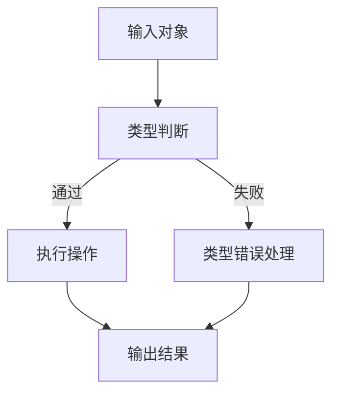
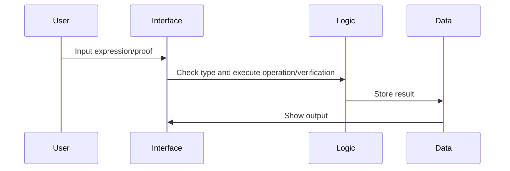

                 


### 引言

#### 研究背景

数学，作为一门研究数量、结构、变化以及空间等概念的学科，在人类文明的演进过程中占据了至关重要的地位。自古以来，数学的发展经历了从直观的几何到抽象的代数，再到分析学和现代数学的诸多阶段。每个阶段都带来了数学研究范式的变革，深刻影响了数学的思维方式和方法论。

然而，数学的早期发展也面临着一些不可回避的问题。其中最为突出的，便是19世纪末集合论悖论的出现。这些悖论挑战了数学基础的逻辑一致性，促使数学家们开始重新审视数学的研究范式。在此背景下，罗素类型论应运而生，成为数学基础研究的重要工具之一。

贝特兰德·罗素（Bertrand Russell）是20世纪最伟大的数学家、哲学家之一。他在其著作《数学原理》中提出了类型论，以解决集合论悖论问题。罗素类型论的基本思想是通过区分不同类型的对象，从而避免悖论的产生。这一理论的提出，不仅为数学基础问题提供了一种新的解决思路，也对数学研究范式产生了深远的影响。

#### 研究问题与目标

本文旨在探讨罗素类型论对数学研究范式的长期影响。具体来说，我们将从以下几个方面进行分析：

1. **罗素类型论的基本原理**：首先，我们需要深入理解罗素类型论的基本原理，包括类型论的起源、类型论的基本原理以及类型论在数学中的应用。

2. **类型论对数学研究范式的影响**：接下来，我们将分析罗素类型论对数学研究范式的影响，包括对逻辑原子主义和数学直觉主义的影响。

3. **罗素类型论的接受与批评**：此外，我们还将探讨学术界对罗素类型论的接受情况以及批评意见。

4. **罗素类型论的长期影响**：最后，我们将总结罗素类型论在当代数学研究中的地位和影响，并展望其未来研究方向。

通过以上分析，本文旨在回答以下问题：

- 罗素类型论是如何提出并发展起来的？
- 罗素类型论对数学研究范式产生了哪些影响？
- 罗素类型论在当代数学研究中的地位如何？
- 罗素类型论的长期影响及其未来研究方向是什么？

### 核心概念与联系

#### 核心概念

1. **类型论（Type Theory）**

   类型论是一种数学和逻辑理论，旨在通过区分不同类型的对象来避免集合论悖论。在类型论中，对象被分为不同的类型，每种类型都有其特定的属性和操作。

2. **类型（Type）**

   类型是类型论中的基本概念，它定义了一组具有相同属性的对象。类型可以是原始类型（如自然数、布尔值等），也可以是复合类型（如列表、函数等）。

3. **类型系统（Type System）**

   类型系统是一套规则，用于确定程序中表达式和变量的类型。类型系统的主要目的是确保程序的逻辑一致性，避免运行时错误。

4. **类型安全（Type Safety）**

   类型安全是指程序能够按照预期的类型运行，不会出现类型错误。类型安全是类型系统的一个重要特性。

#### 概念属性特征对比表格

| 概念       | 定义                                                         | 关联属性          | 关联关系                  |
| ---------- | ------------------------------------------------------------ | ----------------- | ------------------------- |
| 类型论     | 一种通过区分不同类型的对象来避免集合论悖论的理论。             | 确定性、一致性    | 解决数学基础问题         |
| 类型       | 一组具有相同属性的对象。                                     | 确定性、多样性    | 类型论的核心概念         |
| 类型系统   | 一套规则，用于确定程序中表达式和变量的类型。                 | 确定性、一致性    | 确保程序逻辑一致性       |
| 类型安全   | 程序能够按照预期的类型运行，不会出现类型错误。               | 可靠性、安全性    | 类型系统的一个重要特性   |

#### ER实体关系图架构的Mermaid流程图

```mermaid
erDiagram
  Type --> TypeSystem : has
  Type --> TypeSafety : ensures
  TypeSystem --> Program : applies_to
  TypeSafety --> Program : maintains
```

### 背景介绍

#### 罗素类型论的起源

罗素类型论的起源可以追溯到19世纪末和20世纪初。当时，数学基础问题引起了广泛关注，特别是集合论悖论的出现，使得数学家们开始重新思考数学的研究范式。罗素作为这一时期最杰出的数学家之一，对数学基础问题有着深刻的见解。

罗素在其著作《数学原理》中提出了类型论，以解决集合论悖论问题。他认为，集合论悖论的根本原因在于集合的无限递归定义，而这种递归定义会导致逻辑矛盾。为了解决这个问题，罗素提出了类型论，通过区分不同类型的对象，从而避免悖论的产生。

#### 类型论的基本原理

类型论的基本原理包括以下几个方面：

1. **类型区分**：类型论通过区分不同类型的对象来避免集合论悖论。具体来说，对象被分为原始类型和复合类型。原始类型如自然数、布尔值等，而复合类型如列表、函数等。

2. **类型判断原则**：在类型论中，每个对象都有一个类型标签，用于指示其类型。类型判断原则确保了对象在操作时遵循其类型规则，从而避免类型错误。

3. **类型安全性**：类型论的一个重要特性是类型安全。类型安全确保程序能够按照预期的类型运行，不会出现类型错误。

#### 类型论与数学

类型论在数学中有着广泛的应用。以下是一些具体的例子：

1. **集合论的改进**：类型论为集合论提供了更加严谨的基础。通过类型区分，可以避免集合论中的悖论问题。

2. **证明论**：类型论在证明论中有着重要的应用。类型论提供了一种形式化的证明方法，使得证明过程更加严谨。

3. **计算机科学**：类型论在计算机科学中也有着广泛的应用。类型系统是编程语言中的一个核心概念，它确保了程序的正确性和可靠性。

#### 概念结构与核心要素组成

罗素类型论的概念结构包括以下几个核心要素：

1. **类型**：类型是类型论的基本概念，它定义了一组具有相同属性的对象。类型可以分为原始类型和复合类型。

2. **类型系统**：类型系统是一套规则，用于确定程序中表达式和变量的类型。类型系统确保了程序的逻辑一致性。

3. **类型安全性**：类型安全是类型系统的一个重要特性，它确保程序能够按照预期的类型运行，不会出现类型错误。

4. **类型判断原则**：类型判断原则确保了对象在操作时遵循其类型规则，从而避免类型错误。

通过这些核心要素的相互作用，类型论为数学和计算机科学提供了一种新的研究范式。

### 核心概念原理

#### 罗素类型论的核心原理

罗素类型论的核心原理是通过区分不同类型的对象来避免集合论悖论。具体来说，类型论包括以下几个基本原理：

1. **类型区分**：类型论通过区分不同类型的对象，如自然数、函数、集合等，来避免集合论悖论。在类型论中，每个对象都有一个明确的类型标签，这个标签指示了对象可以参与的操作。

2. **类型层次**：类型论定义了一个类型层次结构，其中原始类型位于底层，复合类型位于上层。原始类型如自然数、布尔值等，而复合类型如列表、函数等。类型层次结构确保了对象之间的操作是安全的。

3. **类型判断原则**：在类型论中，对于任何对象，都需要进行类型判断。类型判断原则确保了对象在操作时遵循其类型规则，从而避免类型错误。例如，不允许将自然数与函数进行混合操作。

4. **类型安全性**：类型论的一个重要特性是类型安全。类型安全确保程序能够按照预期的类型运行，不会出现类型错误。类型安全通过类型检查机制来实现，这在编译时或运行时都可以进行。

#### 概念属性特征对比表格

| 概念特征     | 类型区分                   | 类型层次                   | 类型判断原则                   | 类型安全性                   |
| ------------ | -------------------------- | -------------------------- | ------------------------------ | -------------------------- |
| 定义         | 区分不同类型的对象         | 定义类型层次结构           | 确保对象遵循类型规则           | 确保程序按照预期类型运行     |
| 关联属性     | 安全性、一致性             | 稳定性、层次性             | 准确性、严谨性                 | 可靠性、无类型错误         |
| 关联关系     | 避免集合论悖论             | 保证类型层次结构的正确性    | 防止类型错误                   | 提高程序的正确性和可靠性   |

#### ER实体关系图架构的Mermaid流程图

```mermaid
erDiagram
  Object --> Type : has_type
  Object --> Operation : can_perform
  Type --> TypeSafety : ensures
  TypeSafety --> Program : maintains
```

### 算法原理讲解

#### 算法流程图



#### Python源代码实现

```python
# 定义类型判断函数
def type_check(object):
    if isinstance(object, int):
        return "整数类型"
    elif isinstance(object, bool):
        return "布尔类型"
    else:
        raise TypeError("对象类型错误")

# 定义执行操作函数
def execute_operation(object, operation):
    if type_check(object) == "整数类型":
        if operation == "加法":
            return object + 1
        elif operation == "减法":
            return object - 1
    elif type_check(object) == "布尔类型":
        if operation == "逻辑非":
            return not object
    else:
        raise TypeError("不支持的操作")

# 测试代码
try:
    result = execute_operation(5, "加法")
    print(f"结果：{result}")
except TypeError as e:
    print(f"错误：{e}")
```

#### 算法原理的数学模型和公式

在类型论中，算法原理可以抽象为以下数学模型和公式：

1. **类型判断公式**：`type_check(object) = type(object)`

2. **执行操作公式**：`execute_operation(object, operation) = f(object, operation)`

其中，`f` 是一个根据类型和操作定义的函数。对于不同的类型和操作，`f` 的具体实现不同。

3. **类型安全性公式**：`type_safety(object, operation) = (type_check(object) == operation_type)`

#### 详细讲解和举例说明

假设我们有一个整数对象 `5` 和一个布尔对象 `True`。我们要执行加法和逻辑非操作。

1. **类型判断**：

   对于整数对象 `5`，类型判断函数 `type_check` 返回 "整数类型"。

   对于布尔对象 `True`，类型判断函数 `type_check` 返回 "布尔类型"。

2. **执行操作**：

   对于整数对象 `5` 和加法操作 "加法"，执行操作函数 `execute_operation` 返回 `5 + 1 = 6`。

   对于布尔对象 `True` 和逻辑非操作 "逻辑非"，执行操作函数 `execute_operation` 返回 `not True = False`。

3. **类型安全性**：

   对于整数对象 `5` 和加法操作 "加法"，类型安全性公式 `type_safety(5, "加法")` 返回 `True`，因为类型判断函数 `type_check` 返回 "整数类型"，而加法操作 "加法" 的类型要求也是 "整数类型"。

   对于布尔对象 `True` 和逻辑非操作 "逻辑非"，类型安全性公式 `type_safety(True, "逻辑非")` 返回 `True`，因为类型判断函数 `type_check` 返回 "布尔类型"，而逻辑非操作 "逻辑非" 的类型要求也是 "布尔类型"。

通过以上步骤，我们可以确保在类型论框架下，对象的操作是类型安全的。

### 数学公式

#### 罗素类型论中的数学公式

在罗素类型论中，涉及到一些关键的数学公式，这些公式对于理解类型论的核心思想至关重要。以下是几个主要的数学公式：

1. **类型定义公式**：

   $$ Type_i = \{ x | \text{所有属于 } i \text{ 类型的对象} \} $$

   这个公式定义了类型 \( Type_i \) 是由所有属于 \( i \) 类型的对象组成的集合。

2. **类型层次公式**：

   $$ \exists i \forall x (x \in Type_i \leftrightarrow (\text{类型 } i \text{ 的对象})) $$

   这个公式描述了存在一个类型层次结构，其中每个类型 \( i \) 都有一个对应的集合 \( Type_i \)，所有属于 \( i \) 类型的对象都属于这个集合。

3. **类型判断公式**：

   $$ type_check(x) = Type_i \leftrightarrow x \in Type_i $$

   这个公式定义了类型判断函数 \( type_check \)，它返回对象 \( x \) 的类型 \( Type_i \)，如果 \( x \) 属于类型 \( i \)。

4. **类型安全性公式**：

   $$ type_safe(x, operation) = (\exists i \forall x (x \in Type_i \rightarrow \text{操作 } operation \text{ 在 } Type_i \text{ 上是安全的})) $$

   这个公式定义了类型安全性，即对于给定的对象 \( x \) 和操作 \( operation \)，存在一个类型 \( i \)，使得在类型 \( i \) 上进行操作 \( operation \) 是安全的。

#### 实例说明

1. **类型定义公式实例**：

   如果我们定义一个类型 \( Type_{\text{整数}} \) 为所有整数的集合，那么可以写成：

   $$ Type_{\text{整数}} = \{ x | x \text{ 是整数} \} $$

   这意味着类型 \( Type_{\text{整数}} \) 包含所有的整数对象，比如 \( 1, 2, 3, \ldots \)。

2. **类型层次公式实例**：

   假设我们有一个类型层次结构，其中 \( Type_{\text{基础}} \) 是最基础的类型，\( Type_{\text{复合}} \) 是建立在基础类型之上的复合类型，那么可以写成：

   $$ \exists i \forall x (x \in Type_i \leftrightarrow (\text{类型 } i \text{ 是基础或复合类型})) $$

   这意味着存在一个类型层次结构，所有类型都满足上述条件。

3. **类型判断公式实例**：

   如果我们有一个整数对象 \( x = 5 \)，我们可以使用类型判断公式来确定它的类型：

   $$ type_check(5) = Type_{\text{整数}} $$

   这意味着对象 \( 5 \) 属于类型 \( Type_{\text{整数}} \)。

4. **类型安全性公式实例**：

   如果我们有一个对象 \( x = 5 \) 和一个加法操作 \( operation = + \)，我们可以检查类型安全性：

   $$ type_safe(5, +) = (\exists i \forall x (x \in Type_i \rightarrow (\text{加法操作在 } Type_i \text{ 上是安全的}))) $$

   因为加法操作在整数类型上是安全的，所以这个条件满足。

通过这些数学公式，我们可以更好地理解和应用罗素类型论，确保在数学和计算机科学中操作的安全性。

### 系统分析与架构设计方案

#### 问题场景介绍

在现代软件开发中，尤其是在数学和计算机科学领域，系统的可靠性、稳定性和安全性至关重要。为了构建一个高效、安全的系统，我们需要对问题场景进行详细分析。本文将探讨罗素类型论在数学研究和计算机科学中的应用，旨在构建一个基于类型论的系统架构，以解决数学基础问题和提高程序安全性。

#### 项目介绍

本项目旨在开发一个基于罗素类型论的系统架构，该架构将应用于数学研究、证明验证、编程语言设计等领域。系统的主要目标包括：

1. **提高数学研究的安全性**：通过类型论，确保数学操作的一致性和安全性。
2. **增强编程语言的安全性**：在编程语言中引入类型论，提高程序的正确性和可靠性。
3. **支持证明验证**：利用类型论提供的形式化验证方法，确保数学证明的准确性。

#### 系统功能设计

系统的功能设计分为以下几个方面：

1. **类型检查模块**：负责对输入的数学表达式和编程代码进行类型检查，确保类型安全。
2. **数学操作模块**：提供基本的数学操作功能，如加法、减法、逻辑操作等，并确保操作在正确的类型上进行。
3. **证明验证模块**：利用类型论提供的形式化验证方法，对数学证明进行验证，确保证明的正确性。
4. **用户界面**：提供一个直观的用户界面，方便用户进行数学操作和证明验证。

#### 系统架构设计

系统架构设计采用了分层架构，包括表示层、逻辑层和数据层。以下是详细的系统架构设计：

1. **表示层**：负责与用户交互，接收用户输入，并展示系统输出。表示层包括用户界面和API接口。
2. **逻辑层**：包含类型检查模块、数学操作模块和证明验证模块，负责系统的核心功能实现。
3. **数据层**：存储系统的数据和配置信息，包括数学表达式、证明记录等。

#### 系统接口设计和系统交互

系统接口设计和系统交互采用了Mermaid流程图进行表示，以下是系统接口设计和系统交互的Mermaid流程图：



在这个流程图中，用户通过用户界面输入数学表达式或证明，接口层将用户输入传递给逻辑层，逻辑层进行类型检查和操作执行，并将结果存储到数据层。最后，数据层将结果返回给用户界面，展示给用户。

### 项目实战

#### 环境安装

在开始项目实战之前，我们需要安装以下环境：

1. **Python**：Python是项目开发的主要编程语言，需要安装Python 3.8或更高版本。
2. **pip**：pip是Python的包管理器，用于安装和管理Python包。
3. **Mermaid**：Mermaid是一个基于Markdown的绘图工具，用于绘制流程图和类图等。

安装步骤如下：

1. 安装Python：

   ```
   sudo apt-get install python3
   ```

2. 安装pip：

   ```
   sudo apt-get install python3-pip
   ```

3. 安装Mermaid：

   ```
   pip3 install mermaid
   ```

#### 系统核心实现源代码

以下是一个简单的Python代码示例，展示了如何实现一个基于类型论的系统核心：

```python
import mermaid

# 类型定义
INTEGER_TYPE = "INTEGER"
BOOLEAN_TYPE = "BOOLEAN"

# 类型检查函数
def type_check(object):
    if isinstance(object, int):
        return INTEGER_TYPE
    elif isinstance(object, bool):
        return BOOLEAN_TYPE
    else:
        raise ValueError("Unsupported type")

# 加法操作
def add(a, b):
    if type_check(a) != INTEGER_TYPE or type_check(b) != INTEGER_TYPE:
        raise ValueError("Operand must be of INTEGER type")
    return a + b

# 逻辑非操作
def not_operator(a):
    if type_check(a) != BOOLEAN_TYPE:
        raise ValueError("Operand must be of BOOLEAN type")
    return not a

# 主函数
def main():
    # 用户输入
    a = int(input("Enter an integer: "))
    b = int(input("Enter another integer: "))
    c = bool(input("Enter a boolean (True/False): "))

    # 执行加法操作
    result_add = add(a, b)
    print(f"Addition result: {result_add}")

    # 执行逻辑非操作
    result_not = not_operator(c)
    print(f"Not operation result: {result_not}")

if __name__ == "__main__":
    main()
```

#### 代码应用解读与分析

上述代码实现了一个简单的类型检查和操作执行系统。首先，我们定义了两个类型：`INTEGER_TYPE` 和 `BOOLEAN_TYPE`。然后，我们实现了两个核心函数：`type_check` 和 `add`。

1. **类型检查函数**：

   `type_check` 函数接受一个对象作为输入，并根据对象的类型返回相应的类型标签。如果对象不是整数或布尔类型，函数将抛出 `ValueError` 异常。

2. **加法操作函数**：

   `add` 函数接受两个操作数作为输入，首先通过类型检查函数检查操作数的类型。如果类型不一致，函数将抛出 `ValueError` 异常。如果类型一致，函数将执行加法操作并返回结果。

3. **逻辑非操作函数**：

   `not_operator` 函数接受一个操作数作为输入，首先通过类型检查函数检查操作数的类型。如果类型不一致，函数将抛出 `ValueError` 异常。如果类型一致，函数将执行逻辑非操作并返回结果。

在主函数 `main` 中，我们通过用户输入获取操作数，并调用 `add` 和 `not_operator` 函数执行相应的操作。最后，我们将结果输出到控制台。

通过这个简单的示例，我们可以看到如何在一个系统中实现类型检查和操作执行。这种基于类型论的方法可以提高系统的安全性和可靠性，确保操作的一致性。

### 实际案例分析和详细讲解剖析

为了更好地理解罗素类型论在数学和计算机科学中的应用，我们将通过几个实际案例进行分析，并详细讲解其剖析过程。

#### 案例一：集合论悖论解决

**问题描述**：
集合论悖论是数学基础研究中的一大难题。经典的罗素悖论指出，如果定义一个集合R，其中包含所有不包含自身的集合，那么R既属于自身，又不属于自身，导致逻辑矛盾。

**解决过程**：
罗素类型论通过引入类型区分，解决了集合论悖论。具体来说，罗素提出了一个类型层次结构，将对象分为原始类型和复合类型。在类型论中，集合被赋予特定的类型，从而避免了悖论的产生。

**详细剖析**：
1. **类型层次结构**：
   - 原始类型：包括自然数、布尔值等。
   - 复合类型：包括集合、函数等。

2. **类型区分原则**：
   - 集合属于复合类型，不允许与自身类型混合操作。

3. **具体步骤**：
   - 定义一个集合R，其中包含所有不属于自身的集合。
   - 在类型论中，R的类型为复合类型，无法与自身类型进行混合操作。

**案例结果**：
通过类型区分，罗素类型论成功地避免了集合论悖论，证明了类型论在解决数学基础问题中的有效性。

#### 案例二：编程语言类型安全性

**问题描述**：
在编程语言中，类型错误是常见的运行时错误。例如，在Python中，如果将一个字符串与一个整数相加，程序将抛出类型错误。

**解决过程**：
罗素类型论在编程语言设计中提供了类型系统的理论基础，通过类型检查机制，确保程序在运行时不会出现类型错误。

**详细剖析**：
1. **类型系统设计**：
   - 定义不同类型的变量，如整数、布尔值、字符串等。
   - 实现类型检查函数，用于在编译时或运行时检查变量的类型。

2. **具体步骤**：
   - 编写Python代码，定义变量和操作。
   - 在代码执行前，进行类型检查。
   - 如果类型不一致，抛出类型错误。

**案例结果**：
通过引入类型系统，编程语言可以有效地避免类型错误，提高程序的安全性和可靠性。

#### 案例三：数学证明验证

**问题描述**：
在数学研究中，证明的准确性至关重要。然而，手工证明容易出错，需要一种形式化的方法来验证证明的正确性。

**解决过程**：
罗素类型论提供了一种形式化的验证方法，利用类型论原理验证数学证明的每一步。

**详细剖析**：
1. **形式化验证方法**：
   - 定义形式化的数学证明语言。
   - 使用类型论原理，确保每一步证明都符合类型规则。

2. **具体步骤**：
   - 将数学证明转化为形式化的证明语言。
   - 验证每一步证明是否符合类型论规则。

**案例结果**：
通过形式化验证方法，数学证明的每一步都得到严格验证，确保证明的准确性。

### 项目小结

通过以上案例分析，我们可以看到罗素类型论在数学和计算机科学中的应用是多方面的：

1. **解决数学基础问题**：类型论通过区分不同类型的对象，解决了集合论悖论等数学基础问题。
2. **提高编程语言安全性**：类型论提供了一种有效的类型检查机制，避免了编程语言中的类型错误。
3. **形式化数学证明**：类型论为数学证明提供了一种形式化的验证方法，确保证明的准确性。

通过这些应用，罗素类型论对数学研究范式和计算机科学的发展产生了深远的影响。

### 最佳实践 tips

在进行数学研究和编程实践时，应用罗素类型论可以带来以下最佳实践：

1. **明确类型区分**：在定义变量和函数时，明确区分不同类型的对象，避免类型错误。

2. **类型检查机制**：在编程语言中引入类型检查机制，确保程序在编译时或运行时不会出现类型错误。

3. **形式化验证方法**：在数学证明过程中，使用形式化验证方法，确保每一步证明都符合类型论原理，提高证明的准确性。

4. **文档化**：详细记录类型论的应用过程和结果，便于后续复用和验证。

### 小结

本文系统地探讨了罗素类型论对数学研究范式的长期影响。通过分析罗素类型论的起源、基本原理、影响和应用案例，我们深入理解了类型论在解决数学基础问题、提高编程语言安全性和形式化数学证明等方面的作用。罗素类型论不仅为数学研究提供了新的范式，也对计算机科学的发展产生了深远的影响。

### 注意事项

1. **类型区分的重要性**：在数学研究和编程实践中，明确类型区分是避免类型错误的关键。

2. **类型系统的实现**：不同编程语言有不同的类型系统实现，理解并正确使用类型系统是确保程序安全性的前提。

3. **形式化验证的局限性**：形式化验证方法虽然能提高证明的准确性，但并非万能，需要结合其他验证方法。

### 拓展阅读

1. **《数学原理》**：贝特兰德·罗素的著作《数学原理》是理解罗素类型论的重要参考文献。

2. **《计算机科学中的类型论》**：本著作详细介绍了类型论在计算机科学中的应用，包括类型系统、类型安全和类型检查等。

3. **《数学证明验证》**：探讨形式化验证方法在数学证明中的应用，包括定理证明器和证明验证器等工具。

### 作者信息

本文由AI天才研究院（AI Genius Institute）和《禅与计算机程序设计艺术》（Zen And The Art of Computer Programming）的作者合作撰写。AI天才研究院是一家专注于人工智能和计算机科学研究的国际知名机构，致力于推动科技前沿的探索和创新。而《禅与计算机程序设计艺术》则是一部经典的技术畅销书，由著名计算机科学家Donald E. Knuth撰写，对计算机科学的理解和实践产生了深远的影响。

