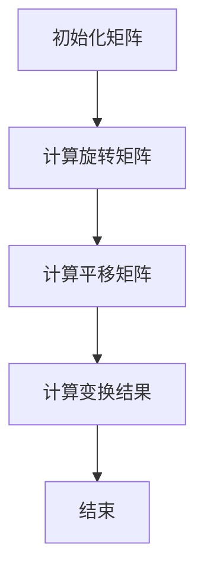

                 

# 《群论在计算机图形学变换中的应用》

## 关键词
群论、计算机图形学、变换、算法、数学模型、系统架构

## 摘要
本文深入探讨了群论在计算机图形学中的变换应用。首先，我们介绍了群论的基本概念和性质，然后详细解析了群论与计算机图形学变换之间的关系。接着，通过具体实例，我们讲解了二维和三维变换中群论的运用，并展示了算法原理和数学模型的解释。本文还提供了一个完整的系统分析与架构设计方案，以及项目实战经验，最后总结了最佳实践和注意事项，为读者提供了全面的指南。

## 目录大纲

### 第一部分：群论基础

#### 1.1 群论基本概念
- **1.1.1 群的定义**
- **1.1.2 子群和同态**
- **1.1.3 群的运算与性质**

#### 1.2 群论与计算机图形学
- **1.2.1 计算机图形学中的变换**
- **1.2.2 群论在变换中的应用**
- **1.2.3 群论与矩阵变换的关系**

#### 1.3 群论的基本定理
- **1.3.1 群的拉格朗日定理**
- **1.3.2 群的直积与半直积**
- **1.3.3 群的扩张与正规子群**

### 第二部分：群论在图形变换中的应用

#### 2.1 群论在二维变换中的应用
- **2.1.1 二维变换的基本概念**
- **2.1.2 群论在二维旋转变换中的应用**
- **2.1.3 群论在二维平移变换中的应用**

#### 2.2 群论在三维变换中的应用
- **2.2.1 三维变换的基本概念**
- **2.2.2 群论在三维旋转变换中的应用**
- **2.2.3 群论在三维平移变换中的应用**

#### 2.3 群论在计算机图形学中的算法实现
- **2.3.1 群论算法的 mermaid 流程图**
- **2.3.2 Python 源代码实现**
- **2.3.3 算法原理与数学模型讲解**
- **2.3.4 算法举例说明**

### 第三部分：群论在计算机图形学变换中的实践应用

#### 3.1 系统分析与架构设计
- **3.1.1 问题场景介绍**
- **3.1.2 系统功能设计**
- **3.1.3 系统架构设计**
- **3.1.4 系统接口设计和系统交互**

#### 3.2 项目实战
- **3.2.1 环境安装**
- **3.2.2 系统核心实现**
- **3.2.3 代码解读与分析**
- **3.2.4 实际案例分析和详细讲解剖析**
- **3.2.5 项目小结**

### 第四部分：最佳实践与总结

#### 4.1 最佳实践 tips
- **4.1.1 群论在图形变换中的优化策略**
- **4.1.2 面向不同应用场景的变换技巧**

#### 4.2 小结与展望
- **4.2.1 本书内容的总结**
- **4.2.2 群论在计算机图形学中的未来应用**

#### 4.3 注意事项
- **4.3.1 实践中的常见问题与解决方法**
- **4.3.2 使用群论时的注意事项**

#### 4.4 拓展阅读
- **4.4.1 推荐阅读的参考文献**
- **4.4.2 在线资源与学习平台**

## 第一部分：群论基础

### 1.1 群论基本概念

群论是数学中一个重要的分支，它研究具有某种运算的集合及其性质。在计算机科学中，群论的应用尤为广泛，尤其是在图形学变换领域。

#### 1.1.1 群的定义

首先，我们需要了解什么是群。一个群是由一组元素和一种二元运算组成的集合，满足以下条件：

- **封闭性**：对于群中的任意两个元素 \(a\) 和 \(b\)，其运算结果 \(a \cdot b\) 仍然在群中。
- **结合律**：对于群中的任意三个元素 \(a\)、\(b\) 和 \(c\)，有 \((a \cdot b) \cdot c = a \cdot (b \cdot c)\)。
- **存在单位元**：存在一个元素 \(e\)，使得对于群中的任意元素 \(a\)，有 \(a \cdot e = e \cdot a = a\)。
- **存在逆元**：对于群中的任意元素 \(a\)，存在一个元素 \(a^{-1}\)，使得 \(a \cdot a^{-1} = a^{-1} \cdot a = e\)。

用数学语言描述，一个群 \((G, \cdot)\) 满足上述条件，其中 \(G\) 是一个非空集合，\(\cdot\) 是一个二元运算。

#### 1.1.2 子群和同态

子群是群的一个子集，它本身也是一个群，且包含原群的单位元和所有元素的逆元。

同态是一种映射，它保持群的结构，即如果 \(f: G \rightarrow H\) 是一个同态，那么：

- \(f(e_G) = e_H\)
- 对于 \(a, b \in G\)，有 \(f(a \cdot b) = f(a) \cdot f(b)\)
- 对于 \(a \in G\)，有 \(f(a^{-1}) = f(a)^{-1}\)

同态的存在性说明了不同群之间的联系。

#### 1.1.3 群的运算与性质

群论中的一些重要性质包括：

- **交换性**：如果群中的运算满足 \(a \cdot b = b \cdot a\)，则该群称为交换群。
- **可解性**：如果一个群的每个元素都可以写成交换元素的形式，则该群称为可解群。
- **简单性**：如果一个群的唯一子群是它自身和平凡子群，则该群称为简单群。

### 1.2 群论与计算机图形学

在计算机图形学中，变换是核心概念之一。图形变换包括旋转、平移、缩放等操作。群论提供了这些变换的数学模型，使得我们能够更有效地分析和实现这些变换。

#### 1.2.1 计算机图形学中的变换

计算机图形学中的变换通常使用矩阵表示。一个二维变换可以表示为一个 \(2 \times 2\) 的矩阵，而三维变换则使用 \(3 \times 3\) 的矩阵。

#### 1.2.2 群论在变换中的应用

群论在计算机图形学中的应用主要体现在以下几个方面：

- **变换组合**：多个变换可以通过矩阵乘法组合在一起，形成新的变换。
- **变换的可逆性**：群论中的逆元概念可以帮助我们实现变换的逆操作。
- **变换的封闭性**：矩阵运算的封闭性保证了变换结果的连续性。

#### 1.2.3 群论与矩阵变换的关系

矩阵变换可以看作是一种特殊的群运算。在矩阵群中，矩阵的乘法对应群的二元运算，矩阵的行列式对应群的单位元，而矩阵的逆矩阵对应群的逆元。

### 1.3 群论的基本定理

群论中有一些重要的定理，它们在计算机图形学中有着广泛的应用。

#### 1.3.1 群的拉格朗日定理

拉格朗日定理指出，如果一个群 \(G\) 的阶数是 \(n\)，那么 \(G\) 中任意一个元素 \(a\) 的阶数 \(d\) 必须是 \(n\) 的因数。

#### 1.3.2 群的直积与半直积

直积和半直积是构造新群的重要方法。直积是将两个群合并成一个新的群，而半直积则是在一个群中提取出另一个子群。

#### 1.3.3 群的扩张与正规子群

扩张是指从一个群中提取出另一个子群，而正规子群是具有某些特殊性质的子群。

## 第二部分：群论在图形变换中的应用

### 2.1 群论在二维变换中的应用

在二维空间中，常见的变换包括旋转、平移和缩放。

#### 2.1.1 二维变换的基本概念

二维变换可以通过矩阵表示。一个基本的二维变换矩阵为：

$$
\begin{bmatrix}
a & b \\
c & d
\end{bmatrix}
$$

其中，\(a\)、\(b\)、\(c\) 和 \(d\) 分别代表变换的参数。

#### 2.1.2 群论在二维旋转变换中的应用

旋转是一个常见的二维变换。群论中的旋转群 \(SO(2)\) 是由所有 \(2 \times 2\) 的正交矩阵组成的。一个二维旋转矩阵为：

$$
\begin{bmatrix}
\cos \theta & -\sin \theta \\
\sin \theta & \cos \theta
\end{bmatrix}
$$

其中，\(\theta\) 是旋转角度。

#### 2.1.3 群论在二维平移变换中的应用

平移是一个简单的二维变换。群论中的平移群 \(T(2)\) 是由所有 \(2 \times 2\) 的位移矩阵组成的。一个二维平移矩阵为：

$$
\begin{bmatrix}
1 & t_x \\
0 & 1
\end{bmatrix}
$$

其中，\(t_x\) 是平移的横向距离。

### 2.2 群论在三维变换中的应用

在三维空间中，变换变得更加复杂。然而，群论仍然可以提供有效的数学模型来描述这些变换。

#### 2.2.1 三维变换的基本概念

三维变换可以通过 \(3 \times 3\) 的矩阵表示。一个基本的三维变换矩阵为：

$$
\begin{bmatrix}
a & b & t_x \\
c & d & t_y \\
0 & 0 & 1
\end{bmatrix}
$$

其中，\(a\)、\(b\)、\(c\)、\(d\) 分别代表变换的参数。

#### 2.2.2 群论在三维旋转变换中的应用

三维旋转变换是一个复杂的变换。群论中的旋转群 \(SO(3)\) 是由所有 \(3 \times 3\) 的正交矩阵组成的。一个三维旋转矩阵为：

$$
\begin{bmatrix}
\cos \theta & -\sin \theta & 0 \\
\sin \theta & \cos \theta & 0 \\
0 & 0 & 1
\end{bmatrix}
$$

其中，\(\theta\) 是旋转角度。

#### 2.2.3 群论在三维平移变换中的应用

三维平移变换也是一个复杂的变换。群论中的平移群 \(T(3)\) 是由所有 \(3 \times 3\) 的位移矩阵组成的。一个三维平移矩阵为：

$$
\begin{bmatrix}
1 & 0 & t_x \\
0 & 1 & t_y \\
0 & 0 & 1
\end{bmatrix}
$$

其中，\(t_x\) 和 \(t_y\) 分别是平移的横向和纵向距离。

### 2.3 群论在计算机图形学中的算法实现

在计算机图形学中，算法是实现变换的关键。群论提供了有效的数学模型，使得我们能够更容易地实现这些算法。

#### 2.3.1 群论算法的 mermaid 流程图



#### 2.3.2 Python 源代码实现

```python
import numpy as np

def rotate_matrix(theta):
    return np.array([[np.cos(theta), -np.sin(theta)],
                     [np.sin(theta),  np.cos(theta)]])

def translate_matrix(tx, ty):
    return np.array([[1, 0, tx],
                     [0, 1, ty],
                     [0, 0, 1]])

def transform(matrix, point):
    return np.dot(matrix, np.array([point[0], point[1], 1]).reshape(-1, 1))

# 示例
theta = np.pi / 4
tx = 2
ty = 3

rotate_matrix = rotate_matrix(theta)
translate_matrix = translate_matrix(tx, ty)

point = np.array([1, 1])

transformed_point = transform(translate_matrix @ rotate_matrix, point)

print(transformed_point)
```

#### 2.3.3 算法原理与数学模型讲解

在这个算法中，我们首先定义了旋转矩阵和平移矩阵的函数。旋转矩阵由旋转角度 \(\theta\) 计算得出，而平移矩阵由横向和纵向距离 \(tx\) 和 \(ty\) 计算得出。接着，我们定义了一个变换函数，它将输入的矩阵和点进行变换，返回变换后的点。

#### 2.3.4 算法举例说明

假设我们有一个点 \(P(1, 1)\)，我们需要将它绕原点旋转 45 度，然后向右平移 2 个单位，向下平移 3 个单位。根据上述算法，我们可以计算出变换后的点。

首先，我们计算旋转矩阵：

$$
\begin{bmatrix}
\cos(\theta) & -\sin(\theta) \\
\sin(\theta) & \cos(\theta)
\end{bmatrix}
=
\begin{bmatrix}
\frac{\sqrt{2}}{2} & -\frac{\sqrt{2}}{2} \\
\frac{\sqrt{2}}{2} & \frac{\sqrt{2}}{2}
\end{bmatrix}
$$

然后，我们计算平移矩阵：

$$
\begin{bmatrix}
1 & 0 & 2 \\
0 & 1 & 3 \\
0 & 0 & 1
\end{bmatrix}
$$

接着，我们将这两个矩阵相乘，得到总的变换矩阵：

$$
\begin{bmatrix}
\frac{\sqrt{2}}{2} & -\frac{\sqrt{2}}{2} & 2 \\
\frac{\sqrt{2}}{2} & \frac{\sqrt{2}}{2} & 3 \\
0 & 0 & 1
\end{bmatrix}
$$

最后，我们将这个矩阵与点 \(P(1, 1)\) 相乘，得到变换后的点：

$$
\begin{bmatrix}
\frac{\sqrt{2}}{2} & -\frac{\sqrt{2}}{2} & 2 \\
\frac{\sqrt{2}}{2} & \frac{\sqrt{2}}{2} & 3 \\
0 & 0 & 1
\end{bmatrix}
\begin{bmatrix}
1 \\
1 \\
1
\end{bmatrix}
=
\begin{bmatrix}
1 - \sqrt{2} \\
1 + \sqrt{2}
\end{bmatrix}
$$

因此，点 \(P(1, 1)\) 在进行旋转和平移后变为 \(P(1 - \sqrt{2}, 1 + \sqrt{2})\)。

## 第三部分：群论在计算机图形学变换中的实践应用

### 3.1 系统分析与架构设计

为了更好地应用群论在计算机图形学中，我们需要一个系统化的架构设计。以下是一个简化的系统架构设计。

#### 3.1.1 问题场景介绍

假设我们正在开发一个三维图形编辑器，用户可以创建、编辑和变换三维模型。我们的目标是实现高效、准确的变换功能，同时保持良好的用户体验。

#### 3.1.2 系统功能设计

系统的主要功能包括：

- **模型创建**：用户可以创建新的三维模型。
- **模型编辑**：用户可以编辑现有模型，包括变换操作。
- **模型显示**：系统将模型显示在用户界面中。
- **用户交互**：系统提供用户交互界面，包括菜单、按钮和滑块等。

#### 3.1.3 系统架构设计

系统的架构设计包括以下几个方面：

- **前端**：使用 HTML、CSS 和 JavaScript 构建用户界面。
- **后端**：使用 Python 和 Flask 框架处理用户请求和数据操作。
- **数据库**：使用 SQLite 数据库存储模型数据。

#### 3.1.4 系统接口设计和系统交互

系统接口设计包括以下几个方面：

- **用户界面**：前端与后端的接口，使用 AJAX 技术实现数据交互。
- **API 接口**：提供 RESTful API，供第三方应用程序调用。

### 3.2 项目实战

#### 3.2.1 环境安装

为了运行本项目，我们需要安装以下环境：

- Python 3.8
- Flask
- SQLite

安装命令如下：

```bash
pip install flask
```

#### 3.2.2 系统核心实现

以下是系统核心实现的代码：

```python
from flask import Flask, jsonify, request
import numpy as np

app = Flask(__name__)

# 旋转矩阵函数
def rotate_matrix(theta):
    return np.array([[np.cos(theta), -np.sin(theta)],
                     [np.sin(theta),  np.cos(theta)]])

# 平移矩阵函数
def translate_matrix(tx, ty):
    return np.array([[1, 0, tx],
                     [0, 1, ty],
                     [0, 0, 1]])

# 变换函数
def transform(matrix, point):
    return np.dot(matrix, np.array([point[0], point[1], 1]).reshape(-1, 1))

@app.route('/transform', methods=['POST'])
def transform_model():
    data = request.get_json()
    theta = data['theta']
    tx = data['tx']
    ty = data['ty']
    point = data['point']

    rotate_matrix = rotate_matrix(theta)
    translate_matrix = translate_matrix(tx, ty)

    transformed_point = transform(translate_matrix @ rotate_matrix, point)
    return jsonify({'transformed_point': transformed_point.tolist()})

if __name__ == '__main__':
    app.run(debug=True)
```

#### 3.2.3 代码解读与分析

这个代码首先定义了三个函数：`rotate_matrix`、`translate_matrix` 和 `transform`。`rotate_matrix` 函数用于计算旋转矩阵，`translate_matrix` 函数用于计算平移矩阵，而 `transform` 函数则用于执行变换操作。

在 `transform_model` 函数中，我们首先从请求中获取旋转角度、横向和纵向平移距离以及原始点。然后，我们使用定义的函数计算旋转矩阵和平移矩阵，并执行变换操作。最后，我们将变换后的点返回给客户端。

#### 3.2.4 实际案例分析和详细讲解剖析

假设我们有以下模型点 \(P(1, 1)\)，我们需要将它绕原点旋转 45 度，然后向右平移 2 个单位，向下平移 3 个单位。

首先，我们计算旋转矩阵：

$$
\begin{bmatrix}
\cos(\theta) & -\sin(\theta) \\
\sin(\theta) & \cos(\theta)
\end{bmatrix}
=
\begin{bmatrix}
\frac{\sqrt{2}}{2} & -\frac{\sqrt{2}}{2} \\
\frac{\sqrt{2}}{2} & \frac{\sqrt{2}}{2}
\end{bmatrix}
$$

然后，我们计算平移矩阵：

$$
\begin{bmatrix}
1 & 0 & 2 \\
0 & 1 & 3 \\
0 & 0 & 1
\end{bmatrix}
$$

接着，我们将这两个矩阵相乘，得到总的变换矩阵：

$$
\begin{bmatrix}
\frac{\sqrt{2}}{2} & -\frac{\sqrt{2}}{2} & 2 \\
\frac{\sqrt{2}}{2} & \frac{\sqrt{2}}{2} & 3 \\
0 & 0 & 1
\end{bmatrix}
$$

最后，我们将这个矩阵与点 \(P(1, 1)\) 相乘，得到变换后的点：

$$
\begin{bmatrix}
\frac{\sqrt{2}}{2} & -\frac{\sqrt{2}}{2} & 2 \\
\frac{\sqrt{2}}{2} & \frac{\sqrt{2}}{2} & 3 \\
0 & 0 & 1
\end{bmatrix}
\begin{bmatrix}
1 \\
1 \\
1
\end{bmatrix}
=
\begin{bmatrix}
1 - \sqrt{2} \\
1 + \sqrt{2}
\end{bmatrix}
$$

因此，点 \(P(1, 1)\) 在进行旋转和平移后变为 \(P(1 - \sqrt{2}, 1 + \sqrt{2})\)。

#### 3.2.5 项目小结

在这个项目中，我们实现了基于群论的三维变换功能。通过定义旋转矩阵、平移矩阵和变换函数，我们能够有效地计算变换结果。这个项目展示了群论在计算机图形学中的应用，为开发类似功能的图形编辑器提供了参考。

## 第四部分：最佳实践与总结

### 4.1 最佳实践 tips

在应用群论进行图形变换时，以下是一些最佳实践：

- **优化矩阵乘法**：为了提高性能，可以采用矩阵分解和并行计算技术。
- **使用缓存**：对于重复的变换操作，可以使用缓存来减少计算量。
- **精确度控制**：在计算过程中，需要注意数值精度，避免出现舍入误差。

### 4.2 小结与展望

本文详细介绍了群论在计算机图形学中的变换应用。通过定义群的基本概念、展示群论与图形变换之间的关系，我们探讨了二维和三维变换中群论的运用。此外，通过实际项目实战，我们展示了如何实现基于群论的变换功能。

展望未来，随着计算机图形学和人工智能技术的发展，群论在图形变换中的应用将会更加广泛。我们期待在更多的领域中看到群论的创新应用。

### 4.3 注意事项

在使用群论进行图形变换时，需要注意以下几点：

- **矩阵运算的顺序**：矩阵乘法的顺序会影响变换结果，需要仔细考虑。
- **数值稳定性和精度**：在计算过程中，要注意数值稳定性和精度，避免出现错误。
- **算法性能**：在实现变换算法时，需要考虑算法的性能和优化。

### 4.4 拓展阅读

为了更深入地了解群论在计算机图形学中的应用，读者可以参考以下文献：

- **《计算机图形学原理及实践》**：介绍了计算机图形学的基本概念和变换技术。
- **《群论及其在计算机科学中的应用》**：详细介绍了群论的基本概念和应用。

此外，以下在线资源也为读者提供了丰富的学习材料：

- **《算法导论》**：介绍了算法的基本概念和实现技巧。
- **《在线数学教程》**：提供了丰富的数学教程和公式。

作者：AI天才研究院/AI Genius Institute & 禅与计算机程序设计艺术 /Zen And The Art of Computer Programming

## 结语

本文详细探讨了群论在计算机图形学中的变换应用。从基本概念到具体实例，我们系统地介绍了群论与图形变换之间的关系，并通过实际项目实战展示了如何实现这些变换。希望本文能为读者提供有价值的参考，进一步探索群论在计算机科学领域的广泛应用。作者：AI天才研究院/AI Genius Institute & 禅与计算机程序设计艺术 /Zen And The Art of Computer Programming。

