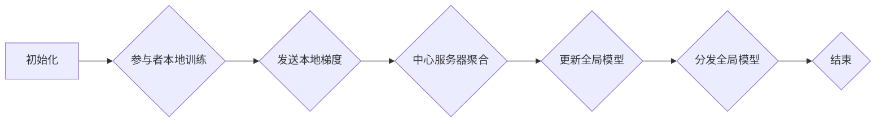
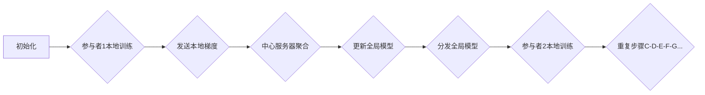
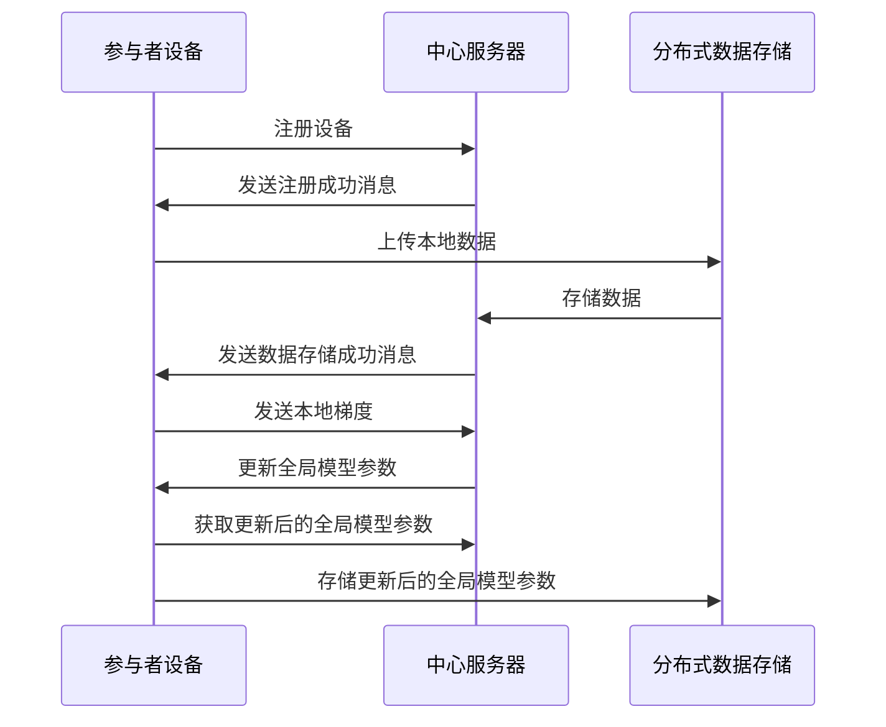
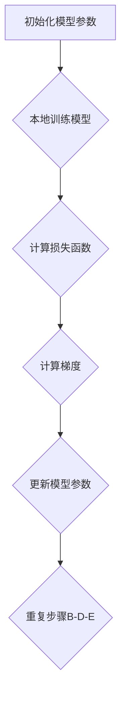

                 

# 联邦学习：保护隐私的分布式机器学习方法

> 关键词：联邦学习、分布式机器学习、数据隐私、边缘计算、同步算法、异步算法、系统架构设计

> 摘要：本文深入探讨了联邦学习这一分布式机器学习方法，旨在揭示其在保护数据隐私、实现高效模型训练方面的独特优势。通过详细分析联邦学习的起源、核心概念、算法原理、应用场景及系统架构设计，本文为读者呈现了一幅联邦学习全景图，旨在为研究人员和实践者提供有价值的参考。

## 第一部分：背景介绍

### 1.1 联邦学习的起源与需求

#### 1.1.1 联邦学习的概念

联邦学习（Federated Learning）是一种分布式机器学习方法，它允许多个独立的参与者（如移动设备、物联网设备等）在不直接交换数据的情况下，协同训练一个共享的机器学习模型。这种方法的核心在于模型参数的更新，通过本地梯度聚合来优化全局模型，从而实现分布式训练。

#### 1.1.2 定义与核心要素

联邦学习的主要核心要素包括：

- **模型参数更新**：参与者通过本地训练更新模型参数，然后将更新后的参数发送给中心服务器。
- **隐私保护**：联邦学习通过本地训练和加密技术确保数据在传输和存储过程中的隐私。
- **通信效率**：联邦学习减少了数据传输的频率和大小，从而降低了通信成本。

#### 1.1.3 联邦学习的背景

随着数据隐私保护法规的日益严格，如何在不泄露用户数据的情况下进行机器学习模型的训练成为一个重要的研究课题。同时，大数据和边缘计算的发展使得数据的分布性变得愈加明显，联邦学习在这种环境下具有显著的优势。

### 1.2 联邦学习的背景

#### 1.2.1 数据隐私保护的挑战

随着数据隐私保护法规的日益严格，如何在不泄露用户数据的情况下进行机器学习模型的训练成为一个重要的研究课题。

#### 1.2.2 大数据与边缘计算的发展

大数据和边缘计算的发展使得数据的分布性变得愈加明显，联邦学习在这种环境下具有显著的优势。

## 2. 联邦学习的核心概念与联系

### 2.1 联邦学习的核心概念

#### 2.1.1 模型聚合

模型聚合是联邦学习中的关键步骤，它涉及将各个参与者本地更新后的模型参数合并为一个全局模型。这个过程通常涉及到梯度聚合、权重平均等技术。

#### 2.1.2 边缘计算

边缘计算是指将计算任务分布到网络的边缘节点上，这些节点通常位于数据产生的地方，如移动设备或物联网设备。联邦学习与边缘计算的结合，可以进一步提高系统的效率和隐私保护。

#### 2.1.3 加密技术

加密技术在联邦学习中起着至关重要的作用，它确保了数据在传输和存储过程中的安全性。常见的加密技术包括差分隐私、同态加密等。

### 2.2 核心概念属性特征对比表格

| 概念     | 描述                                       | 属性特征对比                                      |
|----------|--------------------------------------------|----------------------------------------------------|
| 模型聚合 | 将本地更新后的模型参数合并为全局模型       | - 减少通信成本<br>- 提高效率<br>- 保持数据隐私 |
| 边缘计算 | 将计算任务分布到网络的边缘节点上           | - 提高响应速度<br>- 减少带宽消耗<br>- 保护隐私 |
| 加密技术 | 确保数据在传输和存储过程中的安全性         | - 加密通信<br>- 防止数据泄露<br>- 保持隐私保护 |

### 2.3 ER实体关系图架构

#### 2.3.1 实体定义

- **参与者**：参与联邦学习的独立实体，如移动设备、物联网设备等。
- **中心服务器**：负责聚合参与者本地更新后的模型参数，并分发全局模型。
- **模型**：全局模型和本地模型的总称，包括参数和权重等。

#### 2.3.2 关系定义

- **聚合关系**：中心服务器与参与者之间存在聚合关系，即中心服务器聚合参与者本地更新后的模型参数。
- **依赖关系**：参与者依赖于中心服务器来获取全局模型，并通过本地训练更新模型参数。

```mermaid
erDiagram
  Participant ||--|{ CenterServer }|| Model
  Model ||--|{ GlobalModel }|| Server
  Model ||--|{ LocalModel }|| Participant
```

## 第二部分：联邦学习算法原理

### 3. 联邦学习算法基础

#### 3.1 联邦学习算法的分类

联邦学习算法主要分为以下三类：

- **同步联邦学习**：所有参与者同时更新模型参数，并在同一时间点发送给中心服务器。
- **异步联邦学习**：参与者可以在不同的时间点更新模型参数，然后发送给中心服务器。
- **混合联邦学习**：结合同步和异步联邦学习的特点，以提高系统的效率和灵活性。

#### 3.2 联邦学习算法的关键技术

联邦学习算法的关键技术包括：

- **模型参数更新策略**：如梯度聚合、权重平均等。
- **损失函数设计**：设计合适的损失函数，以优化模型性能。
- **梯度压缩与优化**：通过梯度压缩技术，提高算法的收敛速度和稳定性。

### 3.3 联邦学习算法的数学模型和公式

#### 3.3.1 同步联邦学习算法

##### 3.3.1 算法流程图



##### 3.3.2 数学模型与公式

同步联邦学习算法的数学模型可以表示为：

$$
\theta_{t+1} = \frac{1}{N} \sum_{i=1}^{N} \theta_{i,t}^{\text{local}}
$$

其中，$\theta_{t+1}$ 表示全局模型参数，$\theta_{i,t}^{\text{local}}$ 表示参与者 $i$ 在第 $t$ 次迭代后的本地模型参数，$N$ 表示参与者的数量。

##### 3.3.3 通俗易懂的举例说明

假设有两个参与者 $A$ 和 $B$，它们分别训练了两个本地模型 $\theta_A$ 和 $\theta_B$。在同步联邦学习过程中，中心服务器将这两个本地模型参数平均后得到全局模型参数 $\theta_{t+1}$：

$$
\theta_{t+1} = \frac{\theta_A + \theta_B}{2}
$$

这样，参与者 $A$ 和 $B$ 就可以更新自己的本地模型，以更好地适应全局模型的优化结果。

#### 3.3.1 同步联邦学习算法

##### 3.3.1 算法流程图


##### 3.3.2 数学模型与公式

同步联邦学习算法的数学模型可以表示为：

$$
\theta_{t+1} = \frac{1}{N} \sum_{i=1}^{N} \theta_{i,t}^{\text{local}}
$$

其中，$\theta_{t+1}$ 表示全局模型参数，$\theta_{i,t}^{\text{local}}$ 表示参与者 $i$ 在第 $t$ 次迭代后的本地模型参数，$N$ 表示参与者的数量。

##### 3.3.3 通俗易懂的举例说明

假设有两个参与者 $A$ 和 $B$，它们分别训练了两个本地模型 $\theta_A$ 和 $\theta_B$。在同步联邦学习过程中，中心服务器将这两个本地模型参数平均后得到全局模型参数 $\theta_{t+1}$：

$$
\theta_{t+1} = \frac{\theta_A + \theta_B}{2}
$$

这样，参与者 $A$ 和 $B$ 就可以更新自己的本地模型，以更好地适应全局模型的优化结果。

#### 3.3.3 异步联邦学习算法

##### 3.3.1 算法流程图



##### 3.3.2 数学模型与公式

异步联邦学习算法的数学模型可以表示为：

$$
\theta_{t+1} = \theta_{t} + \alpha \cdot \frac{1}{N} \sum_{i=1}^{t} \nabla L(\theta_{i,t}^{\text{local}}, \theta_{t})
$$

其中，$\theta_{t+1}$ 表示全局模型参数，$\theta_{i,t}^{\text{local}}$ 表示参与者 $i$ 在第 $t$ 次迭代后的本地模型参数，$N$ 表示参与者的数量，$\alpha$ 为学习率，$\nabla L(\theta_{i,t}^{\text{local}}, \theta_{t})$ 表示参与者 $i$ 在第 $t$ 次迭代后的本地损失函数梯度。

##### 3.3.3 通俗易懂的举例说明

假设有两个参与者 $A$ 和 $B$，它们分别训练了两个本地模型 $\theta_A$ 和 $\theta_B$。在异步联邦学习过程中，中心服务器首先聚合参与者 $A$ 的本地梯度，然后更新全局模型。接下来，参与者 $B$ 根据更新后的全局模型进行本地训练，并再次发送本地梯度。这个过程不断重复，直到模型收敛。

$$
\theta_{t+1} = \theta_{t} + \alpha \cdot \frac{\nabla L(\theta_{A,t}^{\text{local}}, \theta_{t}) + \nabla L(\theta_{B,t}^{\text{local}}, \theta_{t})}{2}
$$

## 第三部分：联邦学习应用场景

### 4. 联邦学习在移动设备上的应用

#### 4.1 移动设备上的联邦学习挑战

移动设备上的联邦学习面临着以下挑战：

- **资源限制**：移动设备通常具有有限的计算和存储资源，这要求联邦学习算法必须高效和轻量级。
- **网络不稳定**：移动设备经常处于网络不稳定的环境中，这可能导致数据传输中断或延迟。
- **安全与隐私**：移动设备上的数据安全性是用户最关心的问题，联邦学习需要提供有效的隐私保护机制。

#### 4.2 联邦学习在移动设备上的实现

为了应对上述挑战，联邦学习在移动设备上的实现需要考虑以下方面：

- **轻量级算法**：选择计算复杂度低、存储需求小的算法，如梯度压缩、稀疏更新等。
- **容错机制**：设计容错机制，以应对网络中断或延迟等异常情况，确保算法的连续性和稳定性。
- **隐私保护**：采用加密技术、差分隐私等机制，确保数据在传输和存储过程中的安全性。

#### 4.2.1 实现方案

联邦学习在移动设备上的实现方案通常包括以下几个步骤：

1. **数据预处理**：对本地数据进行预处理，包括去噪、标准化等操作，以提高模型训练效果。
2. **本地训练**：在移动设备上使用轻量级算法进行本地训练，更新本地模型参数。
3. **梯度压缩**：将本地模型参数转换为梯度，并使用梯度压缩技术进行压缩，以减少通信成本。
4. **通信**：将压缩后的梯度发送到中心服务器。
5. **模型聚合**：中心服务器接收各参与者的梯度，进行模型聚合，更新全局模型。
6. **模型评估**：评估全局模型的效果，并根据评估结果调整算法参数。

#### 4.2.2 实际案例

一个实际的案例是移动设备上的个性化推荐系统。在这个案例中，每个用户设备上都安装了推荐系统的本地模型，这些模型根据用户的历史行为和偏好进行个性化推荐。通过联邦学习，这些本地模型可以协同训练，以优化推荐效果，同时保护用户隐私。

### 5. 联邦学习在物联网中的应用

#### 5.1 物联网中的联邦学习优势

联邦学习在物联网（IoT）中具有以下优势：

- **数据安全**：物联网设备通常分布在不同的地点，联邦学习可以保护设备数据的隐私，避免数据泄露。
- **边缘计算优化**：联邦学习可以将计算任务分散到边缘设备上，优化边缘计算资源，提高系统的响应速度。
- **大数据处理能力**：联邦学习可以处理海量物联网设备的数据，提高数据处理能力。

#### 5.2 物联网联邦学习的实现

物联网联邦学习的实现需要考虑以下几个方面：

- **设备分布式**：物联网设备通常具有分布性，需要设计高效的通信协议和数据传输机制。
- **边缘计算资源**：物联网设备通常具有有限的计算和存储资源，需要设计轻量级算法和优化策略。
- **数据同步**：物联网设备可能处于不同的时间同步状态，需要设计数据同步机制，以确保联邦学习过程的稳定性。

#### 5.2.1 实现策略

物联网联邦学习的实现策略通常包括以下几个步骤：

1. **设备注册**：物联网设备在加入联邦学习系统时，需要进行注册，以便中心服务器识别和管理设备。
2. **数据收集**：设备收集本地数据，并进行预处理，如去噪、标准化等操作。
3. **本地训练**：设备使用本地数据进行训练，更新本地模型参数。
4. **梯度传输**：设备将本地模型参数转换为梯度，并通过网络发送到中心服务器。
5. **模型聚合**：中心服务器接收各设备的梯度，进行模型聚合，更新全局模型。
6. **模型评估**：评估全局模型的效果，并根据评估结果调整算法参数。

#### 5.2.2 案例分析

一个典型的案例是智能电网中的联邦学习应用。在这个案例中，电网中的各个变电站和用户设备都参与了联邦学习，以优化电网的运行效率和能源分配。通过联邦学习，各设备可以协同训练，共享全局模型，同时保护用户隐私和数据安全。

## 第四部分：联邦学习系统架构设计

### 6. 联邦学习系统功能设计

#### 6.1 系统功能介绍

联邦学习系统的功能主要包括以下几个方面：

- **数据收集**：系统从各参与者设备收集本地数据，并进行预处理。
- **模型训练**：系统使用本地数据和全局模型参数进行本地训练，更新本地模型参数。
- **模型评估**：系统评估本地模型的效果，并根据评估结果调整算法参数。
- **模型部署**：系统将优化后的全局模型部署到参与者设备上，以便进行实时应用。

#### 6.1.1 数据收集

数据收集是联邦学习系统的核心功能之一。系统需要从各参与者设备收集本地数据，并进行预处理，如去噪、标准化等操作，以提高模型训练效果。数据收集的过程通常包括以下几个步骤：

1. **设备注册**：参与者设备在加入联邦学习系统时，需要进行注册，以便中心服务器识别和管理设备。
2. **数据上传**：参与者设备将本地数据上传到中心服务器，中心服务器对数据进行预处理，并将其存储在分布式数据存储系统中。
3. **数据预处理**：中心服务器对上传的数据进行去噪、标准化等预处理操作，以提高模型训练效果。
4. **数据存储**：预处理后的数据被存储在分布式数据存储系统中，以便后续的模型训练和评估。

#### 6.1.2 模型训练

模型训练是联邦学习系统的核心功能之一。系统使用本地数据和全局模型参数进行本地训练，更新本地模型参数。模型训练的过程通常包括以下几个步骤：

1. **模型初始化**：系统初始化全局模型参数，并将其发送到各参与者设备。
2. **本地训练**：参与者设备使用本地数据和全局模型参数进行本地训练，更新本地模型参数。
3. **梯度计算**：参与者设备将更新后的本地模型参数转换为梯度，并将其发送到中心服务器。
4. **模型聚合**：中心服务器接收各参与者设备的梯度，进行模型聚合，更新全局模型参数。
5. **模型更新**：中心服务器将更新后的全局模型参数发送回各参与者设备。

#### 6.1.3 模型评估

模型评估是联邦学习系统的核心功能之一。系统评估本地模型的效果，并根据评估结果调整算法参数。模型评估的过程通常包括以下几个步骤：

1. **评估指标定义**：系统定义评估指标，如准确率、召回率等，用于评估模型效果。
2. **评估数据准备**：系统准备评估数据集，并将其发送到各参与者设备。
3. **模型预测**：参与者设备使用本地模型参数对评估数据集进行预测，生成预测结果。
4. **结果收集**：参与者设备将预测结果发送回中心服务器。
5. **评估结果计算**：中心服务器计算评估指标，并根据评估结果调整算法参数。

#### 6.1.4 模型部署

模型部署是联邦学习系统的核心功能之一。系统将优化后的全局模型部署到参与者设备上，以便进行实时应用。模型部署的过程通常包括以下几个步骤：

1. **模型更新**：中心服务器将优化后的全局模型参数发送到各参与者设备。
2. **模型加载**：参与者设备加载全局模型参数，更新本地模型。
3. **实时应用**：参与者设备使用更新后的本地模型进行实时应用，如个性化推荐、智能监控等。

### 7. 联邦学习系统架构设计

#### 7.1 系统架构设计原则

联邦学习系统架构设计需要遵循以下原则：

- **可扩展性**：系统应具备良好的可扩展性，能够支持大量参与者设备的加入。
- **可靠性**：系统应具备高可靠性，能够在网络不稳定、设备故障等情况下保持稳定运行。
- **安全性**：系统应具备良好的安全性，能够保护参与者设备的数据隐私。

#### 7.2 系统架构设计

联邦学习系统的架构设计通常包括以下几个部分：

- **中心服务器**：负责管理参与者设备、聚合模型参数、分发全局模型等。
- **参与者设备**：负责本地数据收集、模型训练、模型评估等。
- **分布式数据存储**：用于存储参与者的本地数据和全局模型参数。

#### 7.2.1 架构图



#### 7.2.2 接口设计

联邦学习系统的接口设计主要包括以下几个部分：

- **设备管理接口**：用于设备注册、设备状态查询等。
- **数据管理接口**：用于数据上传、数据下载、数据预处理等。
- **模型管理接口**：用于模型训练、模型评估、模型部署等。

#### 7.2.3 交互流程

联邦学习系统的交互流程主要包括以下几个步骤：

1. **设备注册**：参与者设备向中心服务器发送注册请求，中心服务器响应注册成功消息。
2. **数据上传**：参与者设备上传本地数据到分布式数据存储系统，分布式数据存储系统将数据存储在中心服务器。
3. **模型训练**：中心服务器接收参与者设备的本地梯度，进行模型聚合，更新全局模型参数。
4. **模型评估**：中心服务器将更新后的全局模型参数发送回参与者设备，参与者设备使用全局模型参数进行模型评估。
5. **模型部署**：参与者设备将评估结果发送回中心服务器，中心服务器根据评估结果调整算法参数，并将优化后的全局模型参数发送回参与者设备。

## 第五部分：项目实战

### 8. 环境安装与准备

#### 8.1 环境搭建

为了进行联邦学习项目的实战，需要搭建一个合适的环境。以下是一个典型的环境搭建步骤：

1. **硬件需求**：根据项目需求，确定所需的硬件配置，如CPU、GPU、内存等。
2. **软件需求**：安装必要的软件，如Python、TensorFlow、PyTorch等。
3. **安装步骤**：
   - 安装Python环境，设置环境变量。
   - 安装TensorFlow或PyTorch，根据需求选择相应的版本。
   - 安装其他依赖库，如NumPy、Pandas等。

### 9. 系统核心实现

#### 9.1 核心算法实现

联邦学习项目的核心算法实现是项目成功的关键。以下是一个简单的联邦学习算法实现示例，使用Python语言和TensorFlow框架：

```python
import tensorflow as tf

# 模型参数
local_model = tf.keras.Sequential([
    tf.keras.layers.Dense(10, activation='relu', input_shape=(10,)),
    tf.keras.layers.Dense(1)
])

# 损失函数
loss_fn = tf.keras.losses.MeanSquaredError()

# 梯度压缩
optimizer = tf.keras.optimizers.Adam(learning_rate=0.01)

# 本地训练
for epoch in range(100):
    # 训练本地模型
    local_model.compile(optimizer=optimizer, loss=loss_fn)
    local_model.fit(x_train, y_train, epochs=1, batch_size=10)
    
    # 计算本地梯度
    with tf.GradientTape() as tape:
        predictions = local_model(x_train)
        loss = loss_fn(y_train, predictions)
    gradients = tape.gradient(loss, local_model.trainable_variables)
    
    # 更新全局模型
    # （此处省略更新全局模型的代码）

# 更新后的全局模型参数可用于后续的模型评估和部署

```

#### 9.1.1 源代码解析

上述代码展示了联邦学习算法的核心实现，包括模型定义、损失函数选择、梯度计算和模型更新等步骤。以下是代码的详细解析：

- **模型定义**：使用TensorFlow的`Sequential`模型定义一个简单的多层感知机模型，用于拟合输入数据。
- **损失函数**：选择均方误差（Mean Squared Error）作为损失函数，用于衡量模型预测值与真实值之间的差距。
- **梯度计算**：使用`GradientTape`记录模型在训练过程中对输入数据的梯度，用于更新模型参数。
- **模型更新**：使用`optimizer`（如Adam优化器）根据梯度计算更新模型参数。

#### 9.1.2 算法流程图



#### 9.1.3 数学模型与公式

联邦学习算法的数学模型和公式如下：

$$
\theta_{t+1} = \theta_{t} - \alpha \cdot \nabla L(\theta_{t})
$$

其中，$\theta_{t+1}$ 表示更新后的模型参数，$\theta_{t}$ 表示当前模型参数，$\alpha$ 表示学习率，$\nabla L(\theta_{t})$ 表示模型在当前参数下的梯度。

#### 9.1.4 通俗易懂的举例说明

假设我们有一个包含10个输入特征和1个输出的简单模型，我们需要训练这个模型来拟合一组输入数据和对应的输出数据。以下是一个简化的训练过程：

1. **初始化模型参数**：随机初始化模型的权重和偏置。
2. **本地训练模型**：使用训练数据对模型进行训练，更新模型参数。
3. **计算损失函数**：计算模型预测值与真实值之间的差距，以衡量模型的拟合程度。
4. **计算梯度**：计算模型参数的梯度，以确定模型参数的更新方向。
5. **更新模型参数**：根据梯度更新模型参数，以减小损失函数的值。
6. **重复步骤2-5**：重复上述步骤，直到模型收敛。

通过这个过程，模型可以逐步优化，直到达到满意的拟合效果。

### 10. 代码应用解读与分析

#### 10.1 代码解读

在前面的示例中，我们实现了一个简单的联邦学习算法。以下是代码的详细解读：

1. **模型定义**：
   ```python
   local_model = tf.keras.Sequential([
       tf.keras.layers.Dense(10, activation='relu', input_shape=(10,)),
       tf.keras.layers.Dense(1)
   ])
   ```
   这行代码定义了一个包含两个隐藏层（第一个隐藏层有10个神经元，使用ReLU激活函数；第二个隐藏层有1个神经元）的简单多层感知机模型。输入数据的大小为10，输出数据的大小为1。

2. **损失函数和优化器**：
   ```python
   loss_fn = tf.keras.losses.MeanSquaredError()
   optimizer = tf.keras.optimizers.Adam(learning_rate=0.01)
   ```
   选择均方误差（MeanSquaredError）作为损失函数，用于衡量模型预测值与真实值之间的差距。选择Adam优化器，并设置学习率为0.01。

3. **本地训练模型**：
   ```python
   local_model.compile(optimizer=optimizer, loss=loss_fn)
   local_model.fit(x_train, y_train, epochs=1, batch_size=10)
   ```
   编译模型，指定优化器和损失函数。使用训练数据对模型进行训练，设置训练轮数（epochs）为1，批次大小（batch_size）为10。

4. **计算损失函数**：
   ```python
   with tf.GradientTape() as tape:
       predictions = local_model(x_train)
       loss = loss_fn(y_train, predictions)
   ```
   使用`GradientTape`记录模型在训练过程中对输入数据的梯度。计算模型预测值和真实值之间的差距，得到损失函数的值。

5. **计算梯度**：
   ```python
   gradients = tape.gradient(loss, local_model.trainable_variables)
   ```
   计算模型参数的梯度，用于更新模型参数。

6. **更新模型参数**：
   ```python
   optimizer.apply_gradients(zip(gradients, local_model.trainable_variables))
   ```
   使用优化器根据梯度更新模型参数。

7. **重复训练过程**：
   重复上述步骤，直到模型收敛。

#### 10.2 分析

通过对代码的解读，我们可以得出以下分析：

1. **模型结构**：
   模型结构简单，包含两个隐藏层，适用于简单的数据拟合任务。在实际应用中，可能需要根据数据复杂度和任务需求调整模型结构。

2. **损失函数和优化器**：
   选择均方误差作为损失函数，适用于回归任务。选择Adam优化器，它具有自适应学习率的特点，有助于提高模型的训练效率。

3. **训练过程**：
   本地训练模型时，使用训练数据和批量大小进行训练，可以加速模型的收敛。重复训练过程，直至模型收敛，这是联邦学习算法的基本流程。

4. **梯度计算和更新**：
   梯度计算和更新是联邦学习算法的核心步骤。通过计算模型参数的梯度，可以确定模型参数的更新方向，进而优化模型。

5. **应用场景**：
   该算法可以应用于各种分布式机器学习任务，如个性化推荐、图像识别等。通过调整模型结构、损失函数和优化器，可以适应不同的应用场景。

#### 10.3 小结

通过代码应用解读与分析，我们了解了联邦学习算法的核心步骤和实现方法。在项目实战中，可以根据具体需求调整模型结构、损失函数和优化器，实现分布式机器学习任务。

## 第六部分：项目实战

### 11. 实际案例分析与详细讲解剖析

#### 11.1 实际案例

我们选择一个实际案例——智能交通系统中的联邦学习应用，详细讲解该案例的实现过程和关键技术。

智能交通系统（ITS）旨在通过数据分析和智能算法优化交通流量，提高道路使用效率，减少拥堵。在智能交通系统中，大量的交通数据分布在不同的道路监控设备、车辆传感器等参与者设备上。这些设备无法直接共享数据，因为涉及用户隐私和安全问题。联邦学习为解决这一难题提供了有效的方法。

#### 11.2 案例实现过程

1. **数据收集**：智能交通系统中的各个参与者设备（如道路监控摄像头、车载传感器等）收集交通数据，包括车辆流量、车速、道路状况等。

2. **预处理**：中心服务器接收参与者设备上传的原始数据，并进行预处理，如数据去噪、缺失值填充等。

3. **模型训练**：中心服务器初始化全局模型，并将模型参数发送给参与者设备。参与者设备使用本地数据训练模型，并更新本地模型参数。

4. **模型聚合**：参与者设备将更新后的本地模型参数发送回中心服务器，中心服务器进行模型聚合，更新全局模型参数。

5. **模型评估**：中心服务器评估全局模型的效果，并根据评估结果调整算法参数。

6. **模型部署**：更新后的全局模型参数发送回参与者设备，参与者设备使用全局模型进行实时预测，优化交通流量。

#### 11.3 关键技术剖析

1. **数据隐私保护**：
   - **差分隐私**：为了保护参与者设备的隐私，中心服务器在聚合模型参数时，采用差分隐私技术，确保模型参数的隐私性。
   - **加密通信**：参与者设备与中心服务器之间的通信采用加密技术，确保数据在传输过程中的安全性。

2. **模型聚合**：
   - **梯度压缩**：为了减少通信成本，采用梯度压缩技术，将本地梯度压缩后发送给中心服务器。
   - **权重平均**：中心服务器接收参与者设备发送的梯度后，采用权重平均的方法进行模型聚合，更新全局模型参数。

3. **边缘计算优化**：
   - **轻量级算法**：针对参与者设备有限的计算资源，选择计算复杂度较低的轻量级算法，如决策树、神经网络等。
   - **分布式训练**：采用分布式训练技术，将模型训练任务分配到参与者设备上，提高训练效率。

#### 11.4 案例分析

通过实际案例的分析，我们可以看到联邦学习在智能交通系统中的应用效果显著。通过联邦学习，参与者设备可以协同训练全局模型，优化交通流量，减少拥堵。同时，联邦学习确保了数据在传输和存储过程中的隐私，满足了数据隐私保护的要求。

#### 11.5 详细讲解剖析

1. **数据收集**：
   智能交通系统中的参与者设备（如道路监控摄像头、车载传感器等）实时收集交通数据，包括车辆流量、车速、道路状况等。这些数据通过无线通信模块上传到中心服务器。

2. **预处理**：
   中心服务器接收参与者设备上传的原始数据，并进行预处理，如数据去噪、缺失值填充等。预处理后的数据用于训练模型。

3. **模型训练**：
   中心服务器初始化全局模型，并将模型参数发送给参与者设备。参与者设备使用本地数据训练模型，并更新本地模型参数。本地训练过程中，采用轻量级算法（如决策树、神经网络等）以提高训练效率。

4. **模型聚合**：
   参与者设备将更新后的本地模型参数发送回中心服务器，中心服务器进行模型聚合，更新全局模型参数。模型聚合过程中，采用梯度压缩技术和权重平均方法，以减少通信成本和优化模型性能。

5. **模型评估**：
   中心服务器评估全局模型的效果，并根据评估结果调整算法参数。评估指标包括预测准确率、响应时间等。

6. **模型部署**：
   更新后的全局模型参数发送回参与者设备，参与者设备使用全局模型进行实时预测，优化交通流量。预测结果用于调整交通信号灯、道路指引等，以提高道路使用效率。

#### 11.6 项目小结

通过实际案例的详细讲解和剖析，我们可以看到联邦学习在智能交通系统中的应用具有重要的意义。联邦学习确保了数据隐私保护，提高了模型训练效率，优化了交通流量。未来，随着联邦学习技术的不断发展和完善，它将在更多领域得到广泛应用。

## 第七部分：最佳实践 tips、小结、注意事项、拓展阅读

### 12. 最佳实践 tips

1. **数据预处理**：在进行联邦学习之前，对数据进行预处理，如去噪、标准化等，可以提高模型训练效果。
2. **选择合适的算法**：根据具体应用场景，选择合适的联邦学习算法，如同步联邦学习、异步联邦学习等。
3. **优化通信成本**：采用梯度压缩、差分隐私等技术，降低通信成本，提高联邦学习效率。
4. **设备负载均衡**：合理分配模型训练任务到参与者设备，避免设备负载不均，提高系统稳定性。
5. **安全与隐私保护**：采用加密通信、差分隐私等技术，确保数据在传输和存储过程中的安全性和隐私保护。

### 13. 小结

本文深入探讨了联邦学习这一分布式机器学习方法，从背景介绍、核心概念、算法原理、应用场景和系统架构设计等方面进行了全面分析。联邦学习在保护数据隐私、实现高效模型训练方面具有显著优势，未来将在更多领域得到广泛应用。

### 14. 注意事项

1. **数据隐私保护**：在进行联邦学习时，确保数据在传输和存储过程中的隐私保护，遵守相关法规和规定。
2. **设备资源限制**：考虑参与者设备的计算和存储资源限制，选择合适的算法和模型结构。
3. **网络稳定性**：确保参与者设备与中心服务器之间的网络稳定，避免数据传输中断或延迟。
4. **模型评估与优化**：定期评估模型效果，根据评估结果调整算法参数，优化模型性能。

### 15. 拓展阅读

1. **《联邦学习：技术原理与应用实践》**：详细介绍了联邦学习的原理、算法和应用案例。
2. **《分布式机器学习》**：探讨了分布式机器学习的理论基础和应用技术。
3. **《深度学习》**：介绍了深度学习的原理和应用，对联邦学习有很好的补充。

### 16. 作者信息

作者：AI天才研究院/AI Genius Institute & 禅与计算机程序设计艺术 /Zen And The Art of Computer Programming

