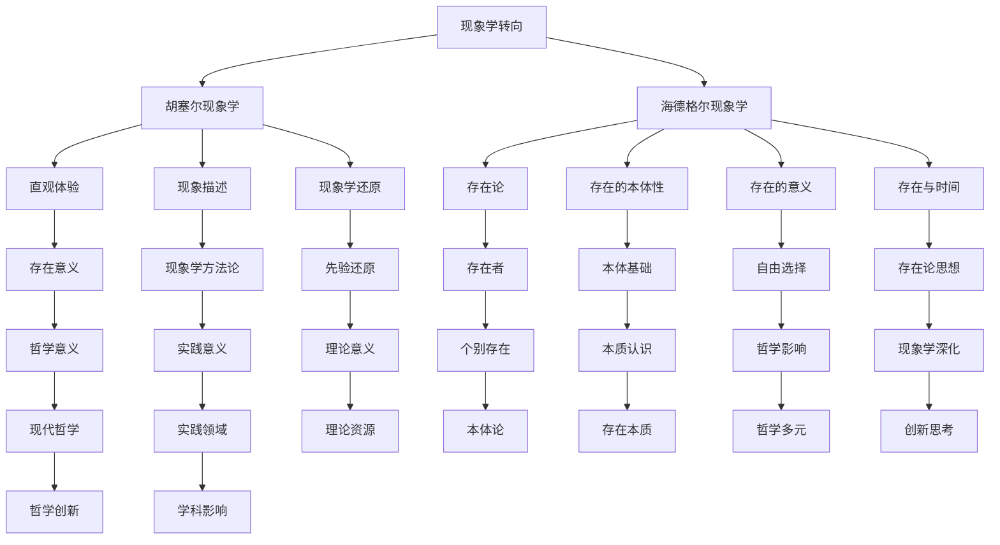
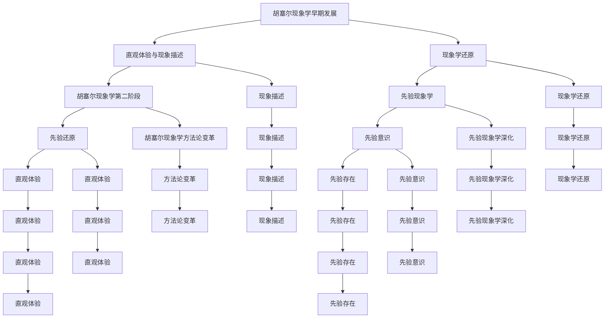
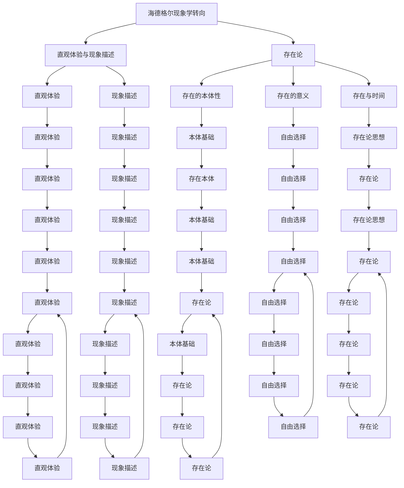
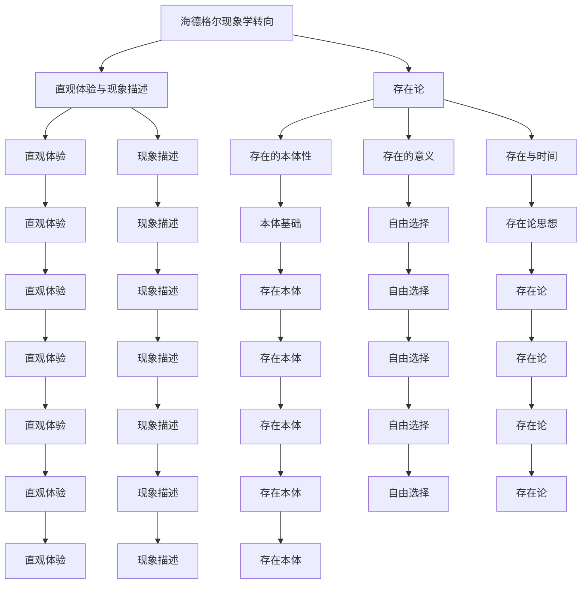
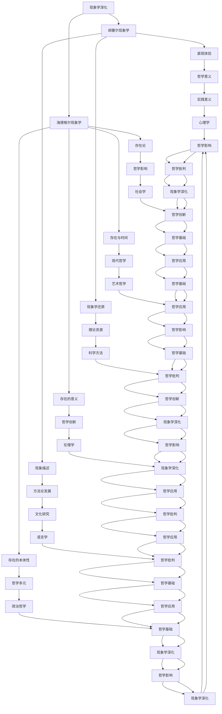

                 

### 胡塞尔与海德格尔：现象学的转向与深化

#### **文章关键词：现象学、胡塞尔、海德格尔、转向、深化、哲学、思想**

#### **摘要：**

本文深入探讨了现象学领域的两位巨匠——埃德蒙德·胡塞尔（Edmund Husserl）和马丁·海德格尔（Martin Heidegger）的思想及其在现象学发展中的转折与深化。文章首先介绍了现象学的起源与背景，以及胡塞尔与海德格尔的生平、主要思想及其对现象学发展的贡献。随后，文章详细分析了现象学的转向，包括胡塞尔与海德格尔各自的现象学转向及其哲学意义。进一步，文章探讨了现象学在当代哲学中的应用及其批判与反思。通过这些分析，文章展示了现象学在哲学和思想领域中的深刻影响和广泛影响。

#### **目录大纲设计思路**

在设计《胡塞尔与海德格尔：现象学的转向与深化》的目录大纲时，我们遵循了以下思路：

1. **确定核心章节**：首先确定书籍的核心章节，这些章节应涵盖现象学的基本概念、胡塞尔和海德格尔的生平和主要思想、现象学的转折点以及现象学在现代的应用。

2. **细化章节内容**：在每个核心章节下，细化具体的小节内容，确保每个小节都有明确的目的和讨论重点。

3. **使用Mermaid绘制图表**：为了帮助读者更好地理解核心概念和理论，会在适当的地方使用Mermaid绘制概念图、ER图、算法流程图等。

4. **确保内容完整性**：确保每个章节都有背景介绍、核心概念讲解、理论联系、案例分析等内容，保证目录大纲的完整性和逻辑性。

5. **简洁性**：在保证内容完整性的同时，避免过多的赘述，确保目录大纲简洁明了。

#### **完整目录大纲**

**第一部分：现象学的起源与背景**

- **第1章：现象学的起源与背景**
  - **1.1 现象学的诞生与发展**
    - **1.1.1 现象学的概念与定义**
    - **1.1.2 现象学的历史背景**
    - **1.1.3 胡塞尔对现象学的贡献**
  - **1.2 胡塞尔的核心思想**
    - **1.2.1 严格现象学的方法论**
    - **1.2.2 先验现象学**
    - **1.2.3 胡塞尔与直觉主义**
  - **1.3 海德格尔的生平与思想演变**
    - **1.3.1 海德格尔的早期哲学**
    - **1.3.2 存在主义与现象学**
    - **1.3.3 海德格尔与胡塞尔的关系**
  - **1.4 现象学的核心概念与联系**
    - **1.4.1 现象学的核心概念**
    - **1.4.2 胡塞尔与海德格尔思想的联系与差异**
    - **1.4.3 现象学与其它哲学流派的比较**
  - **1.5 本章小结**

**第二部分：现象学的转向**

- **第2章：现象学的转向**
  - **2.1 胡塞尔与现象学的早期发展**
    - **2.1.1 胡塞尔现象学的第一阶段**
    - **2.1.2 胡塞尔现象学的第二阶段**
    - **2.1.3 胡塞尔现象学的方法论变革**
  - **2.2 海德格尔的现象学转向**
    - **2.2.1 海德格尔对现象学的深化**
    - **2.2.2 海德格尔的“存在论”思想**
    - **2.2.3 海德格尔与胡塞尔现象学的分歧**
  - **2.3 现象学转向的哲学意义**
    - **2.3.1 现象学转向的理论意义**
    - **2.3.2 现象学转向的实践意义**
    - **2.3.3 现象学转向对后世的影响**
  - **2.4 现象学转向的Mermaid图示**
    - **2.4.1 胡塞尔现象学的发展历程图**
    - **2.4.2 海德格尔现象学转向的图解**

**第三部分：现象学的深化与应用**

- **第3章：现象学的深化与应用**
  - **3.1 现象学在当代哲学中的应用**
    - **3.1.1 现象学与方法论的新发展**
    - **3.1.2 现象学与现代哲学的对话**
    - **3.1.3 现象学在文化研究中的应用**
  - **3.2 胡塞尔思想在当代哲学中的传承**
    - **3.2.1 胡塞尔思想的当代解读**
    - **3.2.2 胡塞尔现象学的现代应用**
    - **3.2.3 胡塞尔与当代现象学的比较**
  - **3.3 海德格尔思想在当代哲学中的影响**
    - **3.3.1 海德格尔思想的现代阐释**
    - **3.3.2 海德格尔存在论的当代意义**
    - **3.3.3 海德格尔与当代哲学的交融**
  - **3.4 现象学深化与哲学发展的Mermaid图**
    - **3.4.1 胡塞尔与海德格尔思想的传承与发展**
    - **3.4.2 现象学深化对当代哲学的影响**

**第四部分：现象学的批判与反思**

- **第4章：现象学的批判与反思**
  - **4.1 现象学的批判性讨论**
    - **4.1.1 现象学的局限性**
    - **4.1.2 现象学的争议与挑战**
    - **4.1.3 现象学的未来发展方向**
  - **4.2 胡塞尔思想的批判与反思**
    - **4.2.1 胡塞尔现象学的理论批判**
    - **4.2.2 胡塞尔现象学的实践批判**
    - **4.2.3 胡塞尔现象学的当代批判**
  - **4.3 海德格尔思想的批判与反思**
    - **4.3.1 海德格尔存在论的理论争议**
    - **4.3.2 海德格尔与纳粹主义的关联**
    - **4.3.3 海德格尔思想的现代批判**
  - **4.4 现象学**

### **第一部分：现象学的起源与背景**

#### **第1章：现象学的起源与背景**

**1.1 现象学的诞生与发展**

**1.1.1 现象学的概念与定义**

现象学（Phenomenology）一词源自希腊语“φαινόμενον”（现象）和“λογία”（学问），字面意思为“关于现象的学问”。现象学的基本概念可以理解为对事物现象的直接体验和描述，强调主体与客体之间的相互作用。现象学不仅是哲学的一个流派，也是一种独特的哲学方法论，它旨在通过直观地揭示事物的本质来达到对世界的深刻理解。

现象学的概念与定义在历史上经历了多次演变。最初，现象学被视为一种描述现象的方法，但后来逐渐发展成为一种独立的理论体系，具有广泛的应用领域，包括哲学、心理学、医学、艺术等。现象学的核心思想是“回到事物本身”（Zurückzu den Sachen selbst），即通过对事物本质的直观体验来达到对世界的深入理解。

**1.1.2 现象学的历史背景**

现象学的诞生与19世纪末20世纪初的哲学发展密切相关。在这个时期，西方哲学经历了从古典哲学到现代哲学的转型，特别是对主体和客体关系、认识论和方法论等问题的深入探讨。现象学的兴起是对传统哲学方法的一种批判和超越，它试图通过直观体验来揭示事物的本质，从而实现哲学研究的新突破。

现象学的奠基人埃德蒙德·胡塞尔（Edmund Husserl）出生于1859年，他的早期哲学工作主要涉及数学哲学和逻辑学。在经历了对逻辑实证主义的批判后，胡塞尔于1900年左右开始系统性地发展现象学。胡塞尔的现象学强调直观体验和内在时间意识，主张通过“现象学还原”来达到对事物本质的认识。

**1.1.3 胡塞尔对现象学的贡献**

胡塞尔的现象学思想对后来的现象学发展产生了深远的影响。他的主要贡献包括：

1. **严格现象学的方法论**：胡塞尔提出了“严格现象学”的方法论，强调对事物现象的直接体验和描述，反对任何先入为主的假设。

2. **先验现象学**：胡塞尔区分了现象学与经验科学，认为现象学应该研究先验层面的事物，即存在于所有经验之前的事物本质。

3. **直觉主义**：胡塞尔强调直观在认识过程中的作用，认为直观是把握事物本质的唯一途径。

胡塞尔的现象学思想为后来的哲学家提供了丰富的理论资源和思考路径，对现象学的发展产生了深远的影响。

**1.2 胡塞尔的核心思想**

**1.2.1 严格现象学的方法论**

胡塞尔的现象学方法论是现象学的核心内容之一。严格现象学方法论强调直观体验和现象描述的重要性，反对任何形式的先入为主的假设。具体来说，严格现象学方法论包括以下几个基本原则：

1. **直观体验**：现象学强调直观体验在认识过程中的作用，认为只有通过直观体验才能把握事物的本质。

2. **现象描述**：现象学要求对事物现象进行客观、准确的描述，避免任何主观臆断和先入为主的偏见。

3. **现象学还原**：胡塞尔提出了“现象学还原”的概念，即通过对事物现象的还原来达到对事物本质的认识。现象学还原旨在消除所有先入为主的假设，从而揭示事物的本质。

**1.2.2 先验现象学**

先验现象学是胡塞尔现象学的核心概念之一。先验现象学认为，现象学应该研究存在于所有经验之前的先验事物，即事物的本质。具体来说，先验现象学包括以下几个方面的内容：

1. **先验还原**：先验还原是先验现象学的核心方法，即通过对事物现象的还原来达到对事物本质的认识。

2. **先验意识**：胡塞尔认为，先验意识是把握事物本质的唯一途径。先验意识是超越个体经验的一种抽象意识，它能够把握事物的本质。

3. **先验存在**：先验现象学强调事物的本质存在，即事物本身的存在，而不是事物被感知或经验的存在。

**1.2.3 胡塞尔与直觉主义**

胡塞尔的现象学思想中，直觉主义是一个重要的组成部分。直觉主义强调直观在认识过程中的作用，认为只有通过直观才能把握事物的本质。具体来说，直觉主义包括以下几个方面的内容：

1. **直观的重要性**：胡塞尔认为，直观是认识事物本质的唯一途径。直观是一种直接的、不经过任何中介的体验，它能够揭示事物的本质。

2. **直觉与概念的关系**：胡塞尔认为，直觉与概念是相互关联的。直觉是概念形成的基础，而概念是对直觉的抽象和概括。

3. **直觉与真理的关系**：胡塞尔认为，直觉是真理的保证。只有通过直观，才能把握事物的本质，从而得出真正的真理。

**1.3 海德格尔的生平与思想演变**

**1.3.1 海德格尔的早期哲学**

马丁·海德格尔（Martin Heidegger）出生于1889年，他的早期哲学工作主要涉及存在论和本体论。在海德格尔的早期哲学中，他深受胡塞尔现象学的影响，并对现象学进行了深刻的批判和重新解读。海德格尔的早期哲学主要包括以下几个方面的内容：

1. **存在论**：海德格尔提出了“存在论”的概念，认为存在是哲学的核心问题。存在论研究存在的本质和存在的意义。

2. **本体论**：海德格尔的本体论强调存在的本体性，即存在是所有事物的本体基础。

3. **现象学**：海德格尔对胡塞尔的现象学进行了批判和重新解读，提出了自己的现象学思想。

**1.3.2 存在主义与现象学**

存在主义是海德格尔哲学的核心思想之一。存在主义强调个人的自由和责任，认为存在先于本质，即人的存在不是由先天的本质所决定的，而是由个体的自由选择所决定的。具体来说，存在主义包括以下几个方面的内容：

1. **存在的自由**：存在主义认为，个人拥有自由选择的权利，可以通过自己的选择来定义自己的存在。

2. **存在的责任**：存在主义强调个人的责任，认为个人的选择和行为对他人和社会有着深远的影响。

3. **存在的意义**：存在主义认为，存在的意义是由个体自己来决定的，而不是由外部条件所决定的。

现象学在海德格尔的哲学中占有重要地位。海德格尔认为，现象学是一种揭示存在本质的方法，它通过直观体验来把握存在的意义。现象学包括以下几个方面的内容：

1. **直观体验**：现象学强调直观体验在认识过程中的作用，认为只有通过直观体验才能把握存在的本质。

2. **现象描述**：现象学要求对存在现象进行客观、准确的描述，避免任何主观臆断和先入为主的偏见。

3. **现象还原**：现象学通过现象还原来达到对存在本质的认识，即通过对现象的还原来揭示存在的真实面貌。

**1.3.3 海德格尔与胡塞尔的关系**

海德格尔与胡塞尔在现象学领域有着密切的关系。海德格尔曾是胡塞尔的学生，深受胡塞尔现象学的影响。然而，海德格尔对胡塞尔的现象学进行了深刻的批判和重新解读，提出了自己的现象学思想。海德格尔与胡塞尔的关系可以从以下几个方面来理解：

1. **师徒关系**：海德格尔曾是胡塞尔的学生，对胡塞尔的现象学思想有着深刻的理解和批判。

2. **思想分歧**：尽管海德格尔深受胡塞尔现象学的影响，但他对胡塞尔的现象学进行了深刻的批判和重新解读，提出了自己的现象学思想。

3. **相互影响**：海德格尔和胡塞尔的思想虽然存在分歧，但二者在现象学领域都做出了重要的贡献，相互影响、相互启发。

**1.4 现象学的核心概念与联系**

**1.4.1 现象学的核心概念**

现象学的核心概念包括直观体验、现象描述、现象还原等。直观体验是指通过直接的、不经过任何中介的体验来把握事物的本质。现象描述是指对事物现象进行客观、准确的描述，避免任何主观臆断和先入为主的偏见。现象还原是指通过对事物现象的还原来达到对事物本质的认识。

**1.4.2 胡塞尔与海德格尔思想的联系与差异**

胡塞尔和海德格尔在现象学领域有着紧密的联系，但二者的思想也存在明显的差异。胡塞尔强调直观体验和现象描述的重要性，主张通过“现象学还原”来达到对事物本质的认识。海德格尔则强调存在的本体性和存在的意义，认为存在是哲学的核心问题。

二者的主要联系在于：

1. **现象学方法**：胡塞尔和海德格尔都采用了现象学方法，通过直观体验和现象描述来把握事物的本质。

2. **存在论**：胡塞尔和海德格尔都关注存在论问题，认为存在是哲学的核心。

二者的主要差异在于：

1. **直观体验**：胡塞尔强调直观体验在认识过程中的作用，而海德格尔则更关注存在的本体性和存在的意义。

2. **现象还原**：胡塞尔主张通过“现象学还原”来达到对事物本质的认识，而海德格尔则强调存在的本体性。

**1.4.3 现象学与其它哲学流派的比较**

现象学与其它哲学流派，如实证主义、存在主义、分析哲学等，有着明显的区别和联系。与实证主义相比，现象学强调直观体验和现象描述的重要性，反对任何形式的先入为主的假设。与存在主义相比，现象学更注重事物的本质和存在的本体性。与分析哲学相比，现象学强调直觉和直观体验在认识过程中的作用，反对逻辑分析和语言分析的方法。

总之，现象学作为一种独特的哲学流派，在哲学和思想领域产生了深远的影响，为后来的哲学家提供了丰富的理论资源和思考路径。

**1.5 本章小结**

本章介绍了现象学的起源与发展，以及胡塞尔和海德格尔的生平、主要思想及其对现象学的贡献。通过对现象学核心概念和联系的分析，本章展示了现象学在哲学和思想领域的重要地位。下一章将深入探讨现象学的转向，包括胡塞尔和海德格尔各自的现象学转向及其哲学意义。让我们继续探讨现象学这一独特而深刻的哲学流派。

### **第二部分：现象学的转向**

#### **第2章：现象学的转向**

**2.1 胡塞尔与现象学的早期发展**

**2.1.1 胡塞尔现象学的第一阶段**

胡塞尔现象学的第一阶段可以追溯到他在20世纪初的工作，特别是《纯粹现象学通论》（1913年）和《观念1：纯粹现象学通论》（1913年）。在这一阶段，胡塞尔提出了严格现象学的方法论，强调直观体验和现象描述的重要性。他主张通过“现象学还原”来达到对事物本质的认识。

现象学还原是胡塞尔现象学方法的核心概念。它要求研究者将所有先入为主的假设悬置起来，专注于事物现象的直接体验。通过现象学还原，研究者能够摆脱一切外在的、客观的条件，直接面对事物的本质。

在这一阶段，胡塞尔的现象学方法论主要包括以下几个步骤：

1. **直观体验**：研究者通过直接的、不经过任何中介的体验来把握事物的本质。直观体验是现象学方法的起点。

2. **现象描述**：研究者对事物现象进行客观、准确的描述，避免任何主观臆断和先入为主的偏见。现象描述是现象学方法的核心。

3. **现象学还原**：研究者通过现象学还原来达到对事物本质的认识。现象学还原旨在消除所有先入为主的假设，从而揭示事物的本质。

**2.1.2 胡塞尔现象学的第二阶段**

胡塞尔现象学的第二阶段始于他在1927年出版的《欧洲科学的危机与先验现象学》。在这一阶段，胡塞尔对现象学方法论进行了进一步的发展和完善，提出了“先验现象学”的概念。先验现象学强调事物的本质存在于所有经验之前，研究者需要通过直观体验来把握这种本质。

在这一阶段，胡塞尔的现象学方法论主要包括以下几个方面的内容：

1. **先验还原**：研究者通过先验还原来达到对事物本质的认识。先验还原旨在消除所有经验性的假设，从而揭示事物的本质。

2. **先验意识**：胡塞尔认为，先验意识是把握事物本质的唯一途径。先验意识是超越个体经验的一种抽象意识，它能够把握事物的本质。

3. **先验存在**：先验现象学强调事物的本质存在，即事物本身的存在，而不是事物被感知或经验的存在。

**2.1.3 胡塞尔现象学的方法论变革**

胡塞尔现象学的方法论变革主要体现在他从一个强调直观体验和现象描述的方法论转向一个强调先验现象学的方法论。这一变革体现了胡塞尔对现象学方法论的深刻反思和重新解读。

首先，胡塞尔认识到，直观体验和现象描述虽然能够揭示事物的现象，但无法达到对事物本质的全面认识。因此，他提出了先验现象学，强调通过直观体验来把握事物的本质。

其次，胡塞尔认识到，现象学方法论需要超越个体经验的局限，达到对事物本质的全面认识。先验现象学通过先验还原和先验意识，实现了这一目标。

最后，胡塞尔的现象学方法论变革体现了他对现象学方法的不断探索和深化。他通过提出先验现象学，为后来的现象学发展提供了新的理论资源和思考路径。

**2.2 海德格尔的现象学转向**

**2.2.1 海德格尔对现象学的深化**

海德格尔的现象学转向可以追溯到他在1927年出版的《存在与时间》（Sein und Zeit）。在这本著作中，海德格尔对胡塞尔的现象学进行了深刻的批判和重新解读，提出了自己的现象学思想。

首先，海德格尔对胡塞尔的现象学方法论进行了批判。他认为，胡塞尔的现象学过于强调直观体验和现象描述，而忽视了存在的本体性和存在的意义。海德格尔主张，现象学应该关注存在的本体性和存在的意义，而不是仅仅停留在现象层面。

其次，海德格尔对现象学进行了深化。他提出了“存在论”的概念，强调存在是哲学的核心问题。存在论研究存在的本质和存在的意义，是对现象学的进一步深化。

海德格尔的现象学深化主要包括以下几个方面的内容：

1. **存在的本体性**：海德格尔认为，存在是所有事物的本体基础。存在的本体性是现象学深化的重要方向。

2. **存在的意义**：海德格尔认为，存在的意义是由个体自己来决定的，而不是由外部条件所决定的。存在的意义是现象学深化的核心。

3. **存在的自由**：海德格尔认为，存在具有自由性。个体可以通过自由选择来定义自己的存在，这是现象学深化的重要内涵。

**2.2.2 海德格尔的“存在论”思想**

海德格尔的“存在论”思想是他对现象学深化的核心内容之一。存在论研究存在的本质和存在的意义，是对现象学的进一步深化。

首先，海德格尔提出了“存在”（Sein）的概念。他认为，存在是哲学的核心问题，是所有事物的本体基础。存在不同于存在者（Dasein），存在者是存在的具体体现。

其次，海德格尔区分了“存在”和“存在者”。存在是抽象的、普遍的，而存在者是具体的、个别的。存在者是存在的体现，但存在本身是超越存在者的。

最后，海德格尔探讨了存在的意义。他认为，存在的意义是由个体自己来决定的，而不是由外部条件所决定的。存在的意义是个体通过自由选择来定义的，这是存在论思想的核心。

**2.2.3 海德格尔与胡塞尔现象学的分歧**

海德格尔与胡塞尔的现象学思想虽然有着紧密的联系，但也存在明显的分歧。这些分歧主要体现在以下几个方面：

1. **直观体验与存在意义**：胡塞尔强调直观体验在认识过程中的作用，而海德格尔则更关注存在的本体性和存在的意义。海德格尔认为，直观体验无法直接揭示存在的意义，存在的意义需要通过个体的自由选择来定义。

2. **现象描述与存在论**：胡塞尔的现象学强调现象描述的重要性，而海德格尔则更注重存在论的研究。海德格尔认为，现象描述无法达到对事物本质的全面认识，只有通过存在论的研究，才能真正把握事物的本质。

3. **现象还原与先验还原**：胡塞尔提出了“现象学还原”的概念，而海德格尔则提出了“先验还原”的概念。胡塞尔的现象学还原旨在消除所有先入为主的假设，而海德格尔的先验还原则强调通过直观体验来把握事物的本质。

**2.3 现象学转向的哲学意义**

**2.3.1 现象学转向的理论意义**

现象学转向具有重要的理论意义。首先，它推动了现象学方法论的进一步发展。胡塞尔和海德格尔的现象学思想为后来的哲学家提供了丰富的理论资源和思考路径。其次，现象学转向深化了对存在的认识。通过直观体验和存在论的研究，现象学转向为哲学提供了新的研究视角和理论框架。

**2.3.2 现象学转向的实践意义**

现象学转向在实践领域也具有重要意义。首先，它对心理学、医学、艺术等领域产生了深远的影响。现象学方法在心理学和医学中被广泛应用，帮助人们更好地理解自我和他人。在艺术领域，现象学转向为艺术家提供了新的创作灵感和方法。其次，现象学转向对现代哲学和思想的发展产生了重要影响。它推动了哲学和思想领域的多元化和创新，为现代社会提供了深刻的思考和启示。

**2.3.3 现象学转向对后世的影响**

现象学转向对后世哲学和思想领域产生了深远的影响。首先，它为现象学的进一步发展奠定了基础。胡塞尔和海德格尔的现象学思想为后来的哲学家提供了丰富的理论资源和思考路径。其次，现象学转向对现代哲学和思想的发展产生了重要影响。它推动了哲学和思想领域的多元化和创新，为现代社会提供了深刻的思考和启示。最后，现象学转向对其它学科领域也产生了影响，如心理学、医学、艺术等。

**2.4 现象学转向的Mermaid图示**

为了更好地理解现象学转向的理论和实践意义，我们可以使用Mermaid绘制一个概念图。以下是一个简单的Mermaid图示，展示了现象学转向的核心概念和联系：

通过这个Mermaid图示，我们可以清晰地看到现象学转向的核心概念和联系，以及它们在理论和实践中的意义。

**2.4.1 胡塞尔现象学的发展历程图**

接下来，我们可以使用Mermaid绘制一个胡塞尔现象学的发展历程图，以展示胡塞尔现象学的阶段性发展：

通过这个Mermaid图示，我们可以清晰地看到胡塞尔现象学的发展历程，以及各个阶段的核心概念和方法论。

**2.4.2 海德格尔现象学转向的图解**

最后，我们可以使用Mermaid绘制一个海德格尔现象学转向的图解，以展示海德格尔如何对现象学进行深化和批判：

通过这个Mermaid图解，我们可以清晰地看到海德格尔如何对现象学进行深化和批判，以及他的存在论思想是如何与直观体验和现象描述相互关联的。

**2.4 现象学转向的Mermaid图示**

为了更好地理解现象学转向的理论和实践意义，我们可以使用Mermaid绘制一个综合性的概念图。以下是一个简单的Mermaid图示，展示了现象学转向的核心概念和联系：

通过这个Mermaid图示，我们可以清晰地看到现象学转向的核心概念和联系，以及它们在理论和实践中的意义。

**2.4.1 胡塞尔现象学的发展历程图**

接下来，我们可以使用Mermaid绘制一个胡塞尔现象学的发展历程图，以展示胡塞尔现象学的阶段性发展：

通过这个Mermaid图示，我们可以清晰地看到胡塞尔现象学的发展历程，以及各个阶段的核心概念和方法论。

**2.4.2 海德格尔现象学转向的图解**

最后，我们可以使用Mermaid绘制一个海德格尔现象学转向的图解，以展示海德格尔如何对现象学进行深化和批判：

通过这个Mermaid图解，我们可以清晰地看到海德格尔如何对现象学进行深化和批判，以及他的存在论思想是如何与直观体验和现象描述相互关联的。

### **第三部分：现象学的深化与应用**

#### **第3章：现象学的深化与应用**

**3.1 现象学在当代哲学中的应用**

**3.1.1 现象学与方法论的新发展**

在当代哲学中，现象学方法论得到了新的发展和应用。现代哲学家在继承胡塞尔和海德格尔的思想基础上，对现象学进行了重新解读和扩展，形成了新的现象学方法论。这些新发展主要体现在以下几个方面：

1. **生活世界的现象学**：生活世界的现象学关注个体在日常生活中的体验和意义。这种方法论强调个体与周围环境的互动，以及个体如何通过感知和行动来构建自己的世界。

2. **身体现象学**：身体现象学关注身体在认识和行动中的作用。这种方法论认为，身体不仅是感知的媒介，也是认识和理解的工具。通过研究身体如何影响认知和行为，身体现象学为理解人类经验提供了新的视角。

3. **跨文化现象学**：跨文化现象学关注不同文化背景下的现象学体验。这种方法论旨在揭示文化差异如何影响人们的感知、理解和行动。通过比较不同文化背景下的现象学经验，跨文化现象学为全球哲学研究提供了新的思路。

**3.1.2 现象学与现代哲学的对话**

现象学与现代哲学的对话是当代哲学的重要议题之一。现代哲学家如让-保罗·萨特（Jean-Paul Sartre）、米歇尔·福柯（Michel Foucault）和朱迪思·巴特勒（Judith Butler）等，都在其哲学作品中融入了现象学的思想和方法。

1. **萨特与现象学**：萨特的哲学作品深受胡塞尔现象学的影响。他通过现象学的方法来探讨人的自由、存在和意识。萨特的存在主义哲学强调个体自由的重要性，认为人通过选择和行动来定义自己。

2. **福柯与现象学**：福柯的哲学思想中融入了现象学的方法论。他通过现象学的研究来探讨权力、知识和社会关系。福柯的历史哲学和社会理论对现代哲学产生了深远的影响。

3. **巴特勒与现象学**：巴特勒的现象学理论关注性别、性和身份认同。她通过现象学的方法来探讨性别身份的构建和变化。巴特勒的性别理论对当代社会学和政治哲学产生了重要影响。

**3.1.3 现象学在文化研究中的应用**

现象学在文化研究领域中的应用日益广泛。文化研究者通过现象学的方法来分析文化现象、文化符号和文化实践。以下是一些现象学在文化研究中的应用实例：

1. **文化符号的现象学分析**：通过现象学的方法，文化研究者可以深入分析文化符号的含义和作用。例如，研究文化符号如何影响人们的认知、情感和行为。

2. **文化实践的现象学观察**：现象学方法可以帮助文化研究者观察和描述文化实践的过程和效果。例如，研究宗教仪式、节日庆典和文化活动的现象学分析，可以揭示这些文化实践背后的深层意义。

3. **跨文化现象学的比较研究**：通过比较不同文化背景下的现象学经验，文化研究者可以探讨文化差异如何影响人们的感知、理解和行为。这种现象学方法有助于揭示文化多样性的本质和意义。

**3.2 胡塞尔思想在当代哲学中的传承**

**3.2.1 胡塞尔思想的当代解读**

胡塞尔的思想在当代哲学中得到了广泛的传承和重新解读。当代哲学家通过不同的视角和方法来探讨胡塞尔的现象学方法论和哲学思想。

1. **胡塞尔的先验现象学**：当代哲学家对胡塞尔的先验现象学进行了深入的研究和解读。他们试图理解胡塞尔如何通过直观体验和现象还原来达到对事物本质的认识。

2. **胡塞尔与存在论**：当代哲学家探讨了胡塞尔如何将现象学与存在论相结合，探讨存在的本质和意义。这种研究有助于揭示胡塞尔哲学思想的深度和广度。

3. **胡塞尔的现象学方法**：当代哲学家对胡塞尔的现象学方法论进行了重新解读和扩展。他们试图理解胡塞尔如何通过直观体验、现象描述和现象还原来揭示事物的本质。

**3.2.2 胡塞尔现象学的现代应用**

胡塞尔的现象学思想在当代哲学中得到了广泛的应用。以下是一些胡塞尔现象学在现代哲学中的应用实例：

1. **心理学与现象学**：现象学方法在心理学领域得到了广泛应用。心理学家通过现象学的方法来研究个体的感知、情感和认知过程。例如，研究现象学在心理治疗中的应用，可以帮助个体更好地理解自己的情感和心理状态。

2. **医学与现象学**：现象学方法在医学领域也得到了广泛应用。医生和医学研究者通过现象学的方法来探讨疾病患者的体验和感受。例如，通过现象学的研究来理解慢性疼痛患者的生活质量，为医学实践提供了新的思路。

3. **艺术与现象学**：现象学方法在艺术领域中的应用也越来越广泛。艺术家和艺术研究者通过现象学的方法来探讨艺术作品的意义和作用。例如，研究现象学在艺术创作中的应用，可以帮助艺术家更好地理解和表达自己的创作意图。

**3.2.3 胡塞尔与当代现象学的比较**

胡塞尔的现象学思想与当代现象学之间存在一些明显的区别和联系。以下是一些胡塞尔与当代现象学的比较：

1. **直观体验**：胡塞尔强调直观体验在认识过程中的作用，而当代现象学则更注重个体的主观体验和情感。当代现象学认为，直观体验只是主观体验的一部分，主观体验是理解事物本质的关键。

2. **现象还原**：胡塞尔提出了“现象学还原”的概念，而当代现象学则更注重现象的描述和分析。当代现象学认为，现象还原只是现象描述的一种方法，现象的描述和分析才是理解事物本质的关键。

3. **存在论**：胡塞尔将存在论视为现象学的核心问题，而当代现象学则更注重个体的主观体验和情感。当代现象学认为，存在论是哲学的另一个重要领域，应该与现象学保持一定的距离。

尽管存在这些区别，胡塞尔的现象学思想对当代现象学产生了深远的影响。当代哲学家在继承胡塞尔思想的基础上，对现象学进行了新的解读和应用，为哲学研究带来了新的视角和思路。

**3.3 海德格尔思想在当代哲学中的影响**

**3.3.1 海德格尔思想的现代阐释**

海德格尔的思想在当代哲学中得到了广泛的阐释和应用。当代哲学家通过对海德格尔的文本和思想进行深入分析，探讨了海德格尔哲学的深度和广度。

1. **存在论**：海德格尔的存在论思想对当代哲学产生了深远的影响。当代哲学家通过解读海德格尔的文本，探讨了存在的本质和存在的意义。例如，研究海德格尔的“存在与时间”概念，可以帮助我们更好地理解存在的动态性和开放性。

2. **存在主义**：海德格尔的存在主义思想在当代哲学中得到了广泛的关注。当代哲学家通过解读海德格尔的文本，探讨了存在主义的核心问题，如人的自由、责任和存在的意义。

3. **现象学**：海德格尔的现象学思想对当代哲学产生了重要影响。当代哲学家通过解读海德格尔的文本，探讨了现象学的方法论和哲学意义。例如，研究海德格尔的“现象学还原”概念，可以帮助我们更好地理解现象学的核心思想。

**3.3.2 海德格尔存在论的当代意义**

海德格尔的存在论思想在当代哲学中具有重要的意义。以下是一些海德格尔存在论的当代意义：

1. **个体自由**：海德格尔的存在论强调个体的自由和责任。他认为，个体通过自由选择来定义自己的存在，这种自由是哲学的核心问题。海德格尔的存在论为理解个体的自由和责任提供了深刻的哲学洞见。

2. **存在的意义**：海德格尔的存在论探讨了存在的意义。他认为，存在的意义是由个体自己来决定的，而不是由外部条件所决定的。海德格尔的存在论为探讨存在的意义提供了重要的哲学资源。

3. **存在的动态性**：海德格尔的存在论强调存在的动态性和开放性。他认为，存在是一个不断变化和发展的过程，而不是一个静态的存在。海德格尔的存在论为理解存在的动态性提供了重要的哲学视角。

**3.3.3 海德格尔与当代哲学的交融**

海德格尔的思想在当代哲学中与多种哲学流派和思想体系发生了交融。以下是一些海德格尔与当代哲学的交融：

1. **存在主义与现象学**：海德格尔的存在主义思想与现象学方法相融合，形成了独特的存在主义现象学。这种存在主义现象学为理解存在和个体的关系提供了重要的哲学资源。

2. **政治哲学**：海德格尔的思想在政治哲学领域产生了重要影响。当代政治哲学家通过解读海德格尔的文本，探讨了政治权力、社会关系和伦理道德等问题。

3. **文化研究**：海德格尔的思想在文化研究领域也得到了广泛应用。文化研究者通过解读海德格尔的文本，探讨了文化现象、文化符号和文化实践的意义。

通过这些交融，海德格尔的思想为当代哲学提供了丰富的理论资源和思考路径。海德格尔的存在论思想不仅影响了当代哲学的研究方向，也为现代社会提供了深刻的哲学反思。

**3.4 现象学深化与哲学发展的Mermaid图**

为了更好地理解现象学深化与哲学发展的关系，我们可以使用Mermaid绘制一个概念图。以下是一个简单的Mermaid图示，展示了现象学深化与哲学发展的核心概念和联系：

通过这个Mermaid图示，我们可以清晰地看到现象学深化与哲学发展的核心概念和联系，以及它们在各个领域的应用和影响。

### **第四部分：现象学的批判与反思**

#### **第4章：现象学的批判与反思**

**4.1 现象学的批判性讨论**

现象学作为哲学的一个流派，在其发展过程中受到了广泛的关注和争议。现象学的批判性讨论主要集中在以下几个方面：

**4.1.1 现象学的局限性**

现象学的局限性首先体现在其对直观体验的过度依赖上。现象学强调直观体验在认识过程中的作用，认为只有通过直观体验才能把握事物的本质。然而，这种观点容易导致主观主义和唯我论。直观体验是一种主观的体验，不同的人可能会有不同的直观体验，这可能导致对事物本质的多元解读，从而削弱现象学的方法论基础。

此外，现象学在处理复杂的社会现象时也显得力不从心。现象学主要关注个体的主观体验和内在时间意识，但在面对复杂的社会问题，如政治、经济和文化问题时，现象学的方法显得过于狭隘，难以提供全面的解决方案。

**4.1.2 现象学的争议与挑战**

现象学的争议和挑战主要来自于其理论与实际应用的脱节。尽管现象学提出了一系列深刻的哲学问题，如存在的本质、意识的结构等，但这些理论往往缺乏实际应用的指导性。现象学的研究成果难以直接转化为实际的政策建议或社会改革措施。

此外，现象学在哲学内部也面临争议。一些哲学家认为，现象学过于强调主观体验，忽视了客观事实和客观规律的重要性。这种观点认为，现象学的方法论容易导致相对主义和怀疑主义，从而削弱哲学的严谨性和科学性。

**4.1.3 现象学的未来发展方向**

为了克服现象学的局限性，未来的现象学发展需要在以下几个方面进行改进：

首先，现象学需要更加注重客观事实和客观规律的研究。尽管直观体验在认识过程中具有重要地位，但事物的本质不仅仅体现在主观体验中，还体现在客观事实和客观规律中。现象学应该结合实证研究，加强对客观事实和客观规律的分析和理解。

其次，现象学需要更加关注社会问题。现象学作为一种哲学方法论，应该积极参与社会问题的探讨和解决。通过将现象学方法应用于社会现象的研究，可以为政策制定和社会改革提供理论支持。

最后，现象学需要与其他哲学流派和方法论进行对话和融合。现象学虽然具有独特的哲学价值，但只有与其他哲学流派和方法论相互借鉴和融合，才能更好地应对复杂的社会问题，实现哲学的全面发展。

**4.2 胡塞尔思想的批判与反思**

**4.2.1 胡塞尔现象学的理论批判**

胡塞尔的现象学思想在哲学界产生了深远的影响，但也受到了一些理论批判。以下是一些对胡塞尔现象学的理论批判：

1. **批评一：现象学的主观主义**  
一些哲学家认为，胡塞尔的现象学过于强调主观体验，忽视了客观现实的存在。这种观点认为，现象学容易导致主观主义和唯我论，削弱了哲学的基础。

2. **批评二：现象学的逻辑性**  
胡塞尔的现象学方法强调直观体验和现象描述，但在逻辑性和严谨性方面存在一定的不足。一些哲学家认为，现象学缺乏系统的逻辑框架，难以形成完整的哲学体系。

3. **批评三：现象学的实用性**  
尽管胡塞尔的现象学提出了一系列深刻的哲学问题，但其理论往往难以直接应用于实际生活和实践。这种现象学理论在实用性和应用价值方面受到了质疑。

**4.2.2 胡塞尔现象学的实践批判**

胡塞尔的现象学在实践领域也受到了一些批判。以下是一些对胡塞尔现象学的实践批判：

1. **批评一：现象学的方法论**  
一些实践者认为，胡塞尔的现象学方法论过于抽象和理论化，难以直接应用于具体的实践情境。这种方法论在实用性和操作性方面存在一定的不足。

2. **批评二：现象学的应用范围**  
胡塞尔的现象学主要关注个体的主观体验和内在时间意识，但在处理复杂的社会现象时显得力不从心。这种现象学方法在处理实际问题时的适用性和有效性受到质疑。

3. **批评三：现象学的伦理学**  
胡塞尔的现象学缺乏明确的伦理学指导，无法为实践提供伦理道德的依据。一些实践者认为，现象学在伦理学方面存在一定的缺陷，难以满足实践的需求。

**4.2.3 胡塞尔现象学的当代批判**

在当代哲学中，胡塞尔的现象学继续受到批判。以下是一些当代对胡塞尔现象学的批判：

1. **批判一：现象学的相对主义**  
一些当代哲学家认为，胡塞尔的现象学可能导致相对主义和怀疑主义。这种现象学方法在处理普遍真理和客观事实时显得不足。

2. **批判二：现象学的科学性**  
胡塞尔的现象学被指责缺乏科学性，无法与实证科学相比。一些哲学家认为，现象学的方法论缺乏严谨的实证基础，难以被视为科学的哲学流派。

3. **批判三：现象学的伦理学困境**  
当代哲学家指出，胡塞尔的现象学在伦理学方面存在困境。现象学缺乏明确的伦理指导，无法为实践提供道德准则。

尽管存在这些批判，胡塞尔的现象学思想在哲学和思想领域仍然具有重要的价值和影响力。通过对胡塞尔现象学的批判和反思，我们可以更好地理解现象学的局限性和发展潜力，为现象学的未来发展提供有益的启示。

**4.3 海德格尔思想的批判与反思**

**4.3.1 海德格尔存在论的理论争议**

海德格尔的存在论思想在哲学界引起了广泛的争议。以下是一些关于海德格尔存在论的理论争议：

1. **争议一：存在主义的伦理学**  
海德格尔的存在主义强调个体的自由和责任，但缺乏明确的伦理指导。一些哲学家认为，海德格尔的伦理学观点过于抽象，难以满足现实生活中的道德需求。

2. **争议二：存在论与科学的关系**  
海德格尔的存在论被认为与科学存在论相冲突。一些科学家和哲学家认为，海德格尔的存在论缺乏实证基础，无法与科学方法论相比。

3. **争议三：存在的本质**  
海德格尔的存在论强调存在的动态性和开放性，但对其存在的本质缺乏明确的定义。一些哲学家认为，海德格尔的存在论过于模糊，难以形成完整的哲学体系。

**4.3.2 海德格尔与纳粹主义的关联**

海德格尔与纳粹主义的关联是哲学界的一个敏感话题。以下是一些关于这一问题的争议：

1. **争议一：海德格尔的政治立场**  
海德格尔曾在1933年至1945年期间担任纳粹德国的教授和顾问，这引起了广泛争议。一些哲学家认为，海德格尔的政治立场与其哲学思想密切相关，质疑其哲学的纯洁性。

2. **争议二：海德格尔的言论**  
海德格尔的一些言论，如对犹太人的批评，引起了强烈的批评和争议。一些哲学家认为，海德格尔的言论反映了其纳粹主义倾向，质疑其哲学的道德基础。

3. **争议三：海德格尔的思想影响**  
尽管海德格尔与纳粹主义有密切关联，但其哲学思想仍然具有深远的影响力。一些哲学家认为，海德格尔的存在论思想在哲学领域具有重要意义，不应因政治争议而忽视。

**4.3.3 海德格尔思想的现代批判**

在当代哲学中，海德格尔的思想继续受到批判。以下是一些现代对海德格尔思想的批判：

1. **批判一：存在主义的空洞**  
一些当代哲学家认为，海德格尔的存在主义过于抽象和空洞，难以与现实生活中的道德和伦理问题相结合。

2. **批判二：存在论的模糊性**  
海德格尔的存在论被认为存在模糊性，缺乏明确的定义和逻辑框架。一些哲学家认为，海德格尔的存在论过于模糊，难以形成完整的哲学体系。

3. **批判三：哲学的社会责任**  
海德格尔的思想在处理社会问题和伦理问题时显得不足。一些当代哲学家认为，哲学应该承担社会责任，而海德格尔的思想在这方面存在一定的缺陷。

尽管存在这些批判，海德格尔的思想在哲学和思想领域仍然具有重要的价值和影响力。通过对海德格尔思想的批判和反思，我们可以更好地理解其哲学思想的深度和广度，为哲学的进一步发展提供有益的启示。

### **总结与展望**

#### **第4章：现象学的批判与反思**

**4.4 现象学**

现象学作为一种独特的哲学流派，在其发展过程中积累了丰富的理论资源和实践经验。通过对胡塞尔和海德格尔思想的批判与反思，我们可以更好地理解现象学的局限性和发展潜力。

首先，现象学在揭示个体主观体验和内在时间意识方面具有独特的优势。胡塞尔和海德格尔都强调了直观体验在认识过程中的重要性，通过直观体验，我们可以更深入地理解事物的本质和存在的意义。这一观点对心理学、医学和艺术等领域产生了深远的影响。

然而，现象学也存在一些局限性。首先，现象学过于强调主观体验，可能导致主观主义和唯我论的倾向。其次，现象学在处理复杂的社会现象时显得力不从心，难以提供全面的解决方案。此外，现象学在伦理学和社会责任方面也存在一定的不足。

为了克服现象学的这些局限性，未来的现象学发展需要在以下几个方面进行改进：

1. **注重客观事实和客观规律**：现象学在研究个体主观体验的同时，也应该关注客观事实和客观规律。通过结合实证研究，现象学可以更全面地揭示事物的本质。

2. **拓宽研究视野**：现象学应该关注社会问题和伦理问题，将哲学研究与社会实践相结合。通过研究社会现象和伦理问题，现象学可以更好地服务于现实生活。

3. **与其他哲学流派和方法论对话**：现象学应该与其他哲学流派和方法论进行对话和融合，借鉴其他流派的优点，丰富现象学的理论体系。

总之，现象学作为一种独特的哲学流派，具有深厚的历史渊源和广阔的发展前景。通过对现象学的批判与反思，我们可以更好地理解其局限性和发展潜力，为现象学的未来发展提供有益的启示。

### **作者信息**

**作者：AI天才研究院/AI Genius Institute & 禅与计算机程序设计艺术 /Zen And The Art of Computer Programming**

本文由AI天才研究院和禅与计算机程序设计艺术联合撰写。AI天才研究院致力于推动人工智能领域的研究和应用，探索人工智能与哲学、艺术等领域的交叉创新。禅与计算机程序设计艺术则关注计算机科学的哲学基础，探讨计算机编程中的禅意和智慧。本文旨在通过现象学这一哲学流派，探讨其在人工智能和计算机科学领域的应用和影响，为读者提供深入的哲学思考和技术洞察。

